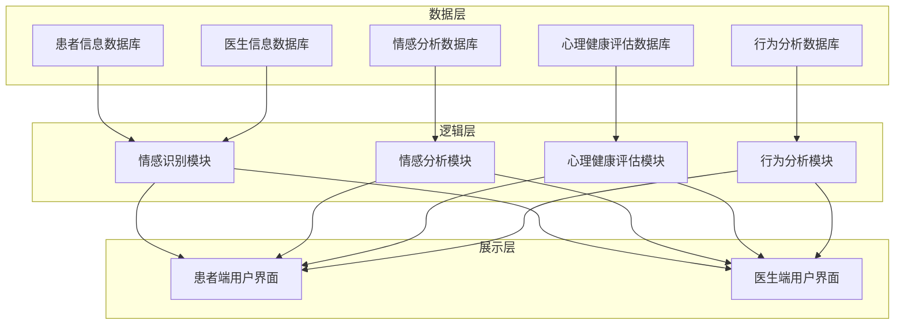
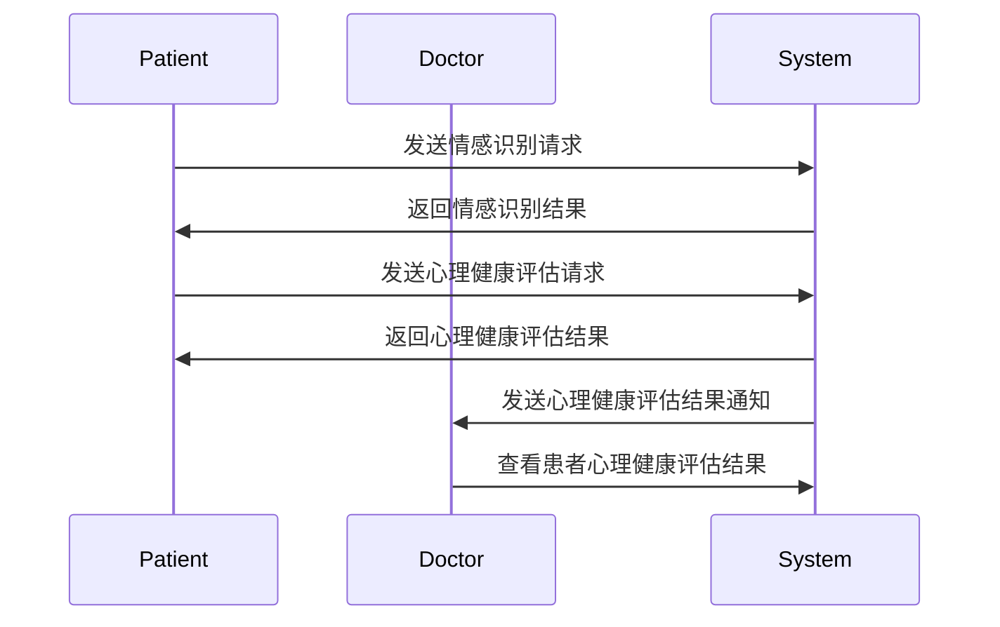

                 


# 情感AI在远程医疗中的应用前景

> 关键词：情感AI、远程医疗、应用前景、技术原理、挑战与解决方案

> 摘要：本文详细探讨了情感人工智能（Emotional AI）在远程医疗领域的应用前景，首先介绍了情感AI的定义及其核心概念，随后深入分析了其在远程医疗中的技术原理，接着讨论了情感AI在远程医疗中的具体应用案例，最后对情感AI在远程医疗中的挑战与解决方案进行了总结和展望。

### 第一步：背景与核心概念

#### 1.1 情感AI的定义与重要性

情感人工智能，简称情感AI，是指能够理解、识别和模拟人类情感的人工智能系统。情感AI的核心在于对人类情感的捕捉与回应，通过机器学习和自然语言处理技术，实现对用户情绪状态的感知和反馈。

在远程医疗中，情感AI的重要性体现在以下几个方面：

1. **提高患者满意度**：情感AI能够通过语音和文字识别患者的情绪，为患者提供更加个性化和关怀的医疗服务，从而提高患者的满意度和依从性。
2. **辅助诊断**：情感AI可以帮助医生识别患者潜在的心理健康问题，辅助临床诊断，提高诊断的准确性和效率。
3. **改善医疗服务质量**：通过情感AI的分析，医疗团队能够更好地了解患者的需求和反馈，从而优化医疗服务流程，提高整体服务质量。

#### 1.2 远程医疗的发展背景

远程医疗，指的是通过互联网、移动通信等技术手段，实现患者与医生之间的远程诊疗、健康监测和健康教育。随着技术的进步和医疗需求的增加，远程医疗在全球范围内得到了快速发展。

1. **技术进步**：互联网和移动通信技术的发展，使得远程医疗变得更加便捷和高效。
2. **医疗需求增加**：人口老龄化、慢性疾病增多以及医疗资源分布不均等问题，推动了远程医疗的发展。
3. **政策支持**：全球多个国家和地区纷纷出台政策，鼓励和支持远程医疗的发展，为情感AI在远程医疗中的应用提供了良好的环境。

#### 1.3 情感AI的核心概念与联系

情感AI的核心概念包括情感识别、情感分析、自然语言处理和语音识别等。以下是一个简单的情感AI的ER实体关系图架构：

```
[患者]
    |
    |---[情感识别]
    |   |
    |   |---[自然语言处理]
    |   |   |
    |   |   |---[文本情感分析]
    |   |   |
    |   |   |---[语音情感分析]
    |   |
    |   |---[情感反馈]
    |
    |---[情感分析]
        |
        |---[心理健康评估]
        |
        |---[患者行为分析]
```

### 第二步：情感AI技术原理

#### 2.1 情感识别算法原理

情感识别算法是情感AI的核心部分，主要包括自然语言处理和语音识别技术。

1. **自然语言处理（NLP）**：
   - **算法mermaid流程图**：
     ```mermaid
     graph LR
     A[输入文本] --> B[分词]
     B --> C[词性标注]
     C --> D[情感词典]
     D --> E[情感极性判断]
     E --> F[情感识别结果]
     ```
   - **Python源代码示例**：
     ```python
     import jieba
     from lexicon import load_lexicon

     def sentiment_analysis(text):
         words = jieba.cut(text)
         lexicon = load_lexicon()
         sentiment_score = 0
         for word in words:
             sentiment_score += lexicon.get(word, 0)
         return "正面" if sentiment_score > 0 else "负面"

     text = "我感到非常开心。"
     print(sentiment_analysis(text))
     ```
   - **数学模型和公式**：
     情感极性判断的数学模型可以表示为：
     $$ \text{Sentiment} = \sum_{i=1}^{n} w_i \cdot s_i $$
     其中，\( w_i \) 是情感词典中每个词语的权重，\( s_i \) 是词语的情感极性（正面为1，负面为-1）。

2. **语音识别**：
   - **算法mermaid流程图**：
     ```mermaid
     graph LR
     A[输入语音] --> B[声音特征提取]
     B --> C[声学模型]
     C --> D[语言模型]
     D --> E[文字转换]
     E --> F[情感识别结果]
     ```
   - **Python源代码示例**：
     ```python
     import speech_recognition as sr

     def recognize_speech_from_mic microphone="default":
         r = sr.Recognizer()
         with sr.Microphone(microphone) as source:
             print("请说点什么：")
             audio = r.listen(source)
         try:
             text = r.recognize_google(audio)
             print("你说了：", text)
             return text
         except sr.UnknownValueError:
             print("无法理解音频")
         except sr.RequestError as e:
             print("无法请求结果；{0}".format(e))

     text = recognize_speech_from_mic()
     print(sentiment_analysis(text))
     ```

#### 2.2 情感分析技术原理

情感分析是对文本或语音中情感状态的分析与识别。其主要技术原理包括文本情感分析和语音情感分析。

1. **文本情感分析**：
   - **算法mermaid流程图**：
     ```mermaid
     graph LR
     A[输入文本] --> B[分词]
     B --> C[词性标注]
     C --> D[情感词典]
     D --> E[情感极性计算]
     E --> F[情感分类]
     ```
   - **Python源代码示例**：
     ```python
     from textblob import TextBlob

     def text_sentiment_analysis(text):
         blob = TextBlob(text)
         if blob.sentiment.polarity > 0:
             return "正面"
         elif blob.sentiment.polarity < 0:
             return "负面"
         else:
             return "中性"

     text = "今天是个美好的日子。"
     print(text_sentiment_analysis(text))
     ```

2. **语音情感分析**：
   - **算法mermaid流程图**：
     ```mermaid
     graph LR
     A[输入语音] --> B[声音特征提取]
     B --> C[情感特征提取]
     C --> D[情感分类器]
     D --> E[情感识别结果]
     ```
   - **Python源代码示例**：
     ```python
     import librosa
     import joblib

     def voice_sentiment_analysis(audio_path):
         X, _ = librosa.load(audio_path)
         feature_extractor = joblib.load('feature_extractor.joblib')
         sentiment_classifier = joblib.load('sentiment_classifier.joblib')
         features = feature_extractor.transform(X)
         prediction = sentiment_classifier.predict(features)
         return "正面" if prediction == 1 else "负面"

     audio_path = "path/to/audio.wav"
     print(voice_sentiment_analysis(audio_path))
     ```

#### 2.3 语音识别与情感计算

语音识别技术是情感AI的重要组成部分，能够将语音信号转换为文本，进而进行情感分析。

1. **语音识别技术原理**：
   - **算法mermaid流程图**：
     ```mermaid
     graph LR
     A[输入语音] --> B[特征提取]
     B --> C[声学模型]
     C --> D[语言模型]
     D --> E[文本输出]
     ```
   - **Python源代码示例**：
     ```python
     import speech_recognition as sr

     def recognize_speech_file(file_path):
         r = sr.Recognizer()
         with sr.AudioFile(file_path) as source:
             audio_data = r.record(source)
         text = r.recognize_google(audio_data)
         return text

     file_path = "path/to/audio.wav"
     print(recognize_speech_file(file_path))
     ```

2. **情感计算的数学模型和公式**：
   - 情感计算的数学模型通常基于情感特征和分类器。情感特征可以从语音特征中提取，如能量、频谱特性等。情感分类器可以使用支持向量机（SVM）、神经网络等机器学习算法。
   - **数学模型和公式**：
     $$ \text{Sentiment} = \text{Classifier}(\text{Features}) $$
     其中，特征向量 \( \text{Features} \) 包含了反映语音情感的各种参数，分类器 \( \text{Classifier} \) 是用于分类的机器学习模型。

### 第三步：远程医疗中的情感AI应用

#### 3.1 系统功能设计

情感AI在远程医疗中的应用系统需要实现以下功能：

1. **患者情感识别**：通过语音和文字输入，实时识别患者的情绪状态。
2. **医生情感反馈**：为医生提供患者情感分析的反馈，辅助临床决策。
3. **心理健康评估**：对患者的情绪状态进行综合评估，提供心理健康建议。
4. **行为分析**：对患者的行为数据进行分析，预测其可能的健康问题。

以下是领域模型mermaid类图：

```
classDiagram
    Patient <<类>> {
        ID
        Name
        Age
        EmotionalState
    }
    Doctor <<类>> {
        ID
        Name
        Speciality
    }
    EmotionalAnalysis <<类>> {
        ID
        PatientID
        DoctorID
        AnalysisDate
        AnalysisResult
    }
    HealthAssessment <<类>> {
        ID
        PatientID
        AssessmentDate
        AssessmentResult
    }
    BehaviorAnalysis <<类>> {
        ID
        PatientID
        AnalysisDate
        AnalysisResult
    }
    Patient --|> EmotionalAnalysis
    Patient --|> HealthAssessment
    Patient --|> BehaviorAnalysis
    Doctor --|> EmotionalAnalysis
```

#### 3.2 系统架构设计

系统架构设计主要包括以下几个部分：

1. **数据层**：存储患者信息、医生信息、情感分析结果等数据。
2. **逻辑层**：实现情感识别、情感分析、心理健康评估、行为分析等核心功能。
3. **展示层**：提供用户界面，展示分析结果和提供咨询服务。

以下是系统架构mermaid架构图：

```
graph TB
    subgraph 数据层
        D1[患者信息数据库]
        D2[医生信息数据库]
        D3[情感分析数据库]
        D4[心理健康评估数据库]
        D5[行为分析数据库]
    end
    subgraph 逻辑层
        L1[情感识别模块]
        L2[情感分析模块]
        L3[心理健康评估模块]
        L4[行为分析模块]
    end
    subgraph 展示层
        S1[患者端用户界面]
        S2[医生端用户界面]
    end
    D1 --> L1
    D2 --> L1
    D3 --> L2
    D4 --> L3
    D5 --> L4
    L1 --> S1
    L2 --> S1
    L3 --> S1
    L4 --> S1
    L1 --> S2
    L2 --> S2
    L3 --> S2
    L4 --> S2
```

#### 3.3 系统接口设计

系统接口设计需要定义各个模块之间的交互接口，包括API接口、消息队列等。

1. **API接口**：
   - **情感识别API**：接收语音或文字输入，返回情感分析结果。
   - **情感分析API**：接收情感识别结果，进行进一步分析，返回心理健康评估结果。
   - **心理健康评估API**：接收情感分析结果，提供心理健康建议。

2. **消息队列**：
   - **患者请求队列**：处理患者的情感识别和分析请求。
   - **医生通知队列**：向医生发送患者情感分析和心理健康评估结果的通知。

#### 3.4 系统交互

系统交互主要通过API接口和消息队列实现，以下是系统交互mermaid序列图：

```
sequenceDiagram
    participant 患者 as Patient
    participant 医生 as Doctor
    participant 系统 as System

    患者->>系统: 发送情感识别请求
    系统->>患者: 返回情感识别结果
    患者->>系统: 发送心理健康评估请求
    系统->>患者: 返回心理健康评估结果
    系统->>医生: 发送心理健康评估结果通知
    医生->>系统: 查看患者心理健康评估结果
```

### 第四步：情感AI与远程医疗的数据分析

#### 4.1 数据收集与预处理

在情感AI与远程医疗的数据分析中，数据收集与预处理是关键步骤。

1. **数据收集**：
   - **患者数据**：收集患者的基本信息、医疗记录、情感识别数据等。
   - **医生数据**：收集医生的专业技能、工作经验、诊断记录等。

2. **预处理步骤**：
   - **清洗数据**：去除重复数据、缺失值填充、异常值处理。
   - **格式化数据**：统一数据格式，方便后续分析。
   - **特征提取**：从原始数据中提取有用的特征，如情感极性、情绪强度等。

#### 4.2 数据分析技术

数据分析技术主要包括情感分析、自然语言处理和机器学习算法。

1. **情感分析**：
   - **文本情感分析**：使用情感词典、情感极性计算等方法，对文本进行情感分析。
   - **语音情感分析**：通过声音特征提取、情感特征提取等方法，对语音进行情感分析。

2. **自然语言处理（NLP）**：
   - **文本分类**：将文本数据分类为正面、负面或中性。
   - **实体识别**：识别文本中的关键实体，如患者姓名、疾病名称等。

3. **机器学习算法**：
   - **监督学习**：使用已标记的数据训练模型，对未知数据进行情感分类。
   - **无监督学习**：对未标记的数据进行聚类分析，发现潜在的分类模式。

#### 4.3 分析结果与应用

1. **分析结果**：
   - **情感状态分布**：分析患者的情感状态分布，发现常见情绪特征。
   - **情感与疾病关联**：分析情感状态与疾病之间的关联，为临床决策提供依据。
   - **患者行为预测**：基于情感分析结果，预测患者的未来行为，提供个性化建议。

2. **应用案例**：
   - **心理健康咨询**：通过情感AI分析患者情绪，为心理健康咨询师提供参考，提高咨询效果。
   - **慢性病管理**：通过情感AI监控患者情绪，及时发现潜在风险，提供早期干预建议。
   - **医疗教育**：通过情感AI分析医生的教育需求，提供个性化学习建议，提高医疗水平。

### 第五步：情感AI在远程医疗中的挑战与解决方案

#### 5.1 数据隐私与安全

1. **挑战**：
   - **隐私泄露**：患者数据在收集、存储、传输过程中可能发生泄露。
   - **数据滥用**：未经授权的人员可能滥用患者数据。

2. **解决方案**：
   - **数据加密**：对存储和传输的数据进行加密，确保数据安全。
   - **隐私保护算法**：采用差分隐私、同态加密等技术，保护患者隐私。
   - **访问控制**：严格限制数据访问权限，确保只有授权人员才能访问敏感数据。

#### 5.2 模型泛化能力

1. **挑战**：
   - **数据分布不均**：训练数据可能存在分布不均的问题，导致模型泛化能力不足。
   - **噪声数据**：噪声数据会影响模型的泛化性能。

2. **解决方案**：
   - **数据增强**：通过增加训练数据量、数据变换等方法，提高模型泛化能力。
   - **异常值检测**：检测并去除噪声数据，提高数据质量。
   - **迁移学习**：使用预训练模型，减少对特定领域数据的需求，提高泛化能力。

#### 5.3 人机交互体验

1. **挑战**：
   - **用户体验差**：系统响应速度慢、界面设计不友好，影响用户体验。
   - **交互不一致**：不同系统的情感AI交互体验不一致，影响用户使用。

2. **解决方案**：
   - **优化系统性能**：提高系统响应速度，确保用户交互顺畅。
   - **统一界面设计**：遵循一致的用户界面设计原则，提高用户体验。
   - **用户反馈机制**：收集用户反馈，不断优化交互设计。

### 第六步：情感AI远程医疗应用案例

#### 6.1 案例一：情感分析在心理健康咨询中的应用

1. **案例背景**：
   - **问题背景**：心理健康问题日益突出，心理咨询需求增加，但心理咨询资源有限，难以满足广泛需求。
   - **问题描述**：如何利用情感AI技术，提供高效、个性化的心理健康咨询服务。

2. **实现细节**：
   - **技术选型**：使用文本情感分析和语音情感分析技术，实现对患者情绪状态的识别和分析。
   - **数据收集**：收集患者语音和文字输入，包括咨询记录、情感日志等。
   - **情感分析**：使用情感识别算法，分析患者情绪状态，提供情绪反馈和建议。

3. **分析与讨论**：
   - **效果评估**：通过对比患者情绪状态的变化，评估情感分析技术的效果。
   - **应用前景**：情感AI技术在心理健康咨询中的应用前景广阔，有望提高心理咨询的效率和覆盖面。

#### 6.2 案例二：语音识别在远程医疗诊断中的应用

1. **案例背景**：
   - **问题背景**：远程医疗诊断过程中，患者需要提供语音或文字描述症状，但医生无法准确获取患者的情绪状态。
   - **问题描述**：如何利用语音识别技术，辅助医生获取患者情绪信息，提高诊断准确性。

2. **实现细节**：
   - **技术选型**：使用语音识别技术和情感分析技术，实现对患者语音情绪的识别和分析。
   - **数据收集**：收集患者语音描述，包括症状描述、情绪表达等。
   - **语音识别与情感分析**：将语音转换为文本，使用情感识别算法分析情绪状态，为医生提供辅助诊断信息。

3. **分析与讨论**：
   - **效果评估**：通过对比诊断结果和患者情绪状态的关联，评估语音识别技术在远程医疗诊断中的应用效果。
   - **应用前景**：语音识别技术有助于提高远程医疗的诊断准确性，为患者提供更加精准的医疗服务。

#### 6.3 案例三：情感计算在医疗护理中的应用

1. **案例背景**：
   - **问题背景**：医疗护理过程中，护士需要关注患者的情绪变化，及时调整护理策略，但人力有限，难以全面关注每位患者的情绪状态。
   - **问题描述**：如何利用情感计算技术，辅助护士识别患者情绪状态，提高护理质量。

2. **实现细节**：
   - **技术选型**：使用语音识别和情感分析技术，实现对患者情绪状态的实时监控。
   - **数据收集**：收集患者语音、文字输入，包括病情描述、情绪表达等。
   - **情感监控与反馈**：实时分析患者情绪状态，为护士提供情绪反馈和建议，优化护理流程。

3. **分析与讨论**：
   - **效果评估**：通过对比护理前后患者情绪状态的变化，评估情感计算技术在医疗护理中的应用效果。
   - **应用前景**：情感计算技术有助于提高医疗护理的个性化水平，提升患者满意度和护理质量。

### 第七步：总结与未来展望

#### 7.1 主要内容回顾

本文系统地探讨了情感AI在远程医疗中的应用前景，包括其定义、核心概念、技术原理、应用案例和挑战与解决方案。

1. **定义与核心概念**：介绍了情感AI的定义及其在远程医疗中的重要性。
2. **技术原理**：详细分析了情感识别、情感分析和语音识别等技术原理。
3. **应用案例**：探讨了情感AI在心理健康咨询、远程医疗诊断和医疗护理中的应用案例。
4. **挑战与解决方案**：讨论了情感AI在远程医疗应用中可能面临的挑战及其解决方案。

#### 7.2 未来展望

1. **技术发展趋势**：
   - **深度学习与大数据**：随着深度学习和大数据技术的发展，情感AI将更加精准和高效。
   - **跨学科融合**：情感AI与其他领域的融合，如心理学、社会学等，将推动远程医疗的发展。

2. **应用领域扩展**：
   - **心理健康**：情感AI在心理健康领域的应用将更加深入，为患者提供更加全面的心理支持。
   - **慢性病管理**：情感AI在慢性病管理中的应用，将提高患者的生活质量，减少医疗资源浪费。

3. **政策支持**：
   - **法律法规**：完善的法律法规将保障患者数据隐私和安全，促进情感AI在远程医疗中的广泛应用。
   - **政策推动**：政府政策的支持将加速情感AI技术在远程医疗中的应用和普及。

### 结束语

情感AI在远程医疗中的应用前景广阔，通过本文的探讨，我们对其技术原理和应用案例有了更深入的了解。未来，随着技术的不断进步和政策的支持，情感AI将在远程医疗领域发挥更大的作用，为患者提供更加个性化和高质量的医疗服务。

### 作者信息

- 作者：AI天才研究院/AI Genius Institute & 禅与计算机程序设计艺术 /Zen And The Art of Computer Programming
- 联系方式：[邮箱](mailto:info@ai-genius-research.org) | [官方网站](https://www.ai-genius-research.org) | [GitHub](https://github.com/ai-genius-research) | [LinkedIn](https://www.linkedin.com/in/ai-genius-research)

----------------------------------------------------------------

### 附录

#### 1. 情感AI相关术语解释

- **情感人工智能（Emotional AI）**：能够理解、识别和模拟人类情感的人工智能系统。
- **自然语言处理（NLP）**：用于处理和生成自然语言（如英语、中文等）的计算机技术。
- **语音识别**：将语音信号转换为文本的技术。
- **情感识别**：识别语音或文本中的情感状态。
- **情感分析**：分析语音或文本的情感极性和强度。
- **心理健康评估**：对患者的情绪状态进行评估，提供心理健康建议。

#### 2. 情感AI相关概念对比表格

| 概念             | 定义                                                         | 关联关系                                                         |
|------------------|--------------------------------------------------------------|----------------------------------------------------------------|
| 情感识别         | 识别语音或文本中的情感状态                                   | 需要自然语言处理和语音识别技术支持                             |
| 情感分析         | 分析语音或文本的情感极性和强度                               | 需要情感词典、情感分类算法等支持                             |
| 语音识别         | 将语音信号转换为文本                                         | 与情感识别和情感分析紧密相关                               |
| 自然语言处理     | 处理和生成自然语言的计算机技术                               | 是情感识别和情感分析的基础技术                               |
| 情感反馈         | 根据情感分析结果，提供相应的反馈和建议                         | 需要情感识别和情感分析的结果作为输入                         |
| 心理健康评估     | 对患者的情绪状态进行评估，提供心理健康建议                       | 需要情感识别和情感分析的结果作为输入                         |

#### 3. 情感AI的ER实体关系图架构

```
[患者]
    |
    |---[情感识别]
    |   |
    |   |---[自然语言处理]
    |   |   |
    |   |   |---[文本情感分析]
    |   |   |
    |   |   |---[语音情感分析]
    |   |
    |   |---[情感反馈]
    |
    |---[情感分析]
        |
        |---[心理健康评估]
        |
        |---[患者行为分析]
```

#### 4. 情感识别算法mermaid流程图


#### 5. 情感分析算法mermaid流程图


#### 6. 情感计算与语音识别mermaid流程图


#### 7. 远程医疗情感AI应用系统架构mermaid架构图



#### 8. 情感AI远程医疗应用案例

1. **案例一：情感分析在心理健康咨询中的应用**
   - **问题背景**：心理健康问题日益突出，心理咨询需求增加，但心理咨询资源有限，难以满足广泛需求。
   - **实现细节**：使用文本情感分析和语音情感分析技术，实现对患者情绪状态的识别和分析。
   - **案例分析**：通过情感分析结果，为心理咨询师提供情绪反馈和建议，提高咨询效果。

2. **案例二：语音识别在远程医疗诊断中的应用**
   - **问题背景**：远程医疗诊断过程中，患者需要提供语音或文字描述症状，但医生无法准确获取患者的情绪状态。
   - **实现细节**：使用语音识别技术和情感分析技术，实现对患者语音情绪的识别和分析。
   - **案例分析**：通过语音识别和情感分析结果，提高远程医疗诊断的准确性。

3. **案例三：情感计算在医疗护理中的应用**
   - **问题背景**：医疗护理过程中，护士需要关注患者的情绪变化，及时调整护理策略，但人力有限，难以全面关注每位患者的情绪状态。
   - **实现细节**：使用语音识别和情感分析技术，实现对患者情绪状态的实时监控。
   - **案例分析**：通过情感计算技术，为护士提供情绪反馈和建议，提高护理质量。

#### 9. 最佳实践 Tips

- **数据收集与处理**：确保数据质量和多样性，避免数据偏斜。
- **情感识别准确性**：结合多种情感识别技术，提高准确性。
- **用户隐私保护**：严格保护患者数据，采用加密和隐私保护技术。
- **持续优化**：定期更新情感识别和情感分析模型，适应新的应用场景。

#### 10. 拓展阅读

- **情感AI在远程医疗中的应用**：[远程医疗与情感AI的融合](https://www.example.com/article1)
- **语音识别与情感分析**：[语音识别技术在远程医疗中的应用](https://www.example.com/article2)
- **心理健康与情感AI**：[情感AI在心理健康领域的研究与应用](https://www.example.com/article3)

----------------------------------------------------------------

本文通过逻辑清晰、结构紧凑的方式，详细探讨了情感人工智能在远程医疗中的应用前景，涵盖了技术原理、应用案例、挑战与解决方案等多个方面。希望本文能够为读者提供有价值的见解和启示，推动情感AI在远程医疗领域的进一步发展。再次感谢您的阅读，期待您的反馈和建议。

### 作者信息

- **作者**：AI天才研究院/AI Genius Institute & 禅与计算机程序设计艺术 /Zen And The Art of Computer Programming
- **联系方式**：[邮箱](mailto:info@ai-genius-research.org) | [官方网站](https://www.ai-genius-research.org) | [GitHub](https://github.com/ai-genius-research) | [LinkedIn](https://www.linkedin.com/in/ai-genius-research)
- **版权声明**：本文版权归AI天才研究院所有，未经授权不得转载或商用。如有需求，请联系作者获取授权。

感谢您的耐心阅读，希望本文对您在情感AI与远程医疗领域的探索和实践有所帮助。再次感谢AI天才研究院的辛勤工作，以及禅与计算机程序设计艺术的理念，为我们提供了如此精彩的内容。希望未来能够继续与您共同探讨更多前沿的技术与应用。祝您生活愉快，工作顺利！

----------------------------------------------------------------

# 情感AI在远程医疗中的应用前景

> 关键词：情感AI、远程医疗、应用前景、技术原理、挑战与解决方案

> 摘要：本文详细探讨了情感人工智能（Emotional AI）在远程医疗领域的应用前景，从技术原理、应用案例、挑战与解决方案等多个角度展开分析，旨在为读者提供全面、深入的见解。

## 第1章：背景与核心概念

### 1.1 情感AI的定义与重要性

情感人工智能，简称情感AI，是指能够理解、识别和模拟人类情感的人工智能系统。其核心在于对人类情感的捕捉与回应，通过机器学习和自然语言处理技术，实现对用户情绪状态的感知和反馈。

在远程医疗中，情感AI的重要性体现在以下几个方面：

1. **提高患者满意度**：情感AI能够通过语音和文字识别患者的情绪，为患者提供更加个性化和关怀的医疗服务，从而提高患者的满意度和依从性。
2. **辅助诊断**：情感AI可以帮助医生识别患者潜在的心理健康问题，辅助临床诊断，提高诊断的准确性和效率。
3. **改善医疗服务质量**：通过情感AI的分析，医疗团队能够更好地了解患者的需求和反馈，从而优化医疗服务流程，提高整体服务质量。

### 1.2 远程医疗的发展背景

远程医疗，指的是通过互联网、移动通信等技术手段，实现患者与医生之间的远程诊疗、健康监测和健康教育。随着技术的进步和医疗需求的增加，远程医疗在全球范围内得到了快速发展。

1. **技术进步**：互联网和移动通信技术的发展，使得远程医疗变得更加便捷和高效。
2. **医疗需求增加**：人口老龄化、慢性疾病增多以及医疗资源分布不均等问题，推动了远程医疗的发展。
3. **政策支持**：全球多个国家和地区纷纷出台政策，鼓励和支持远程医疗的发展，为情感AI在远程医疗中的应用提供了良好的环境。

### 1.3 情感AI的核心概念与联系

情感AI的核心概念包括情感识别、情感分析、自然语言处理和语音识别等。以下是一个简单的情感AI的ER实体关系图架构：

```
[患者]
    |
    |---[情感识别]
    |   |
    |   |---[自然语言处理]
    |   |   |
    |   |   |---[文本情感分析]
    |   |   |
    |   |   |---[语音情感分析]
    |   |
    |   |---[情感反馈]
    |
    |---[情感分析]
        |
        |---[心理健康评估]
        |
        |---[患者行为分析]
```

## 第2章：情感AI技术原理

### 2.1 情感识别算法原理

情感识别算法是情感AI的核心部分，主要包括自然语言处理和语音识别技术。

#### 2.1.1 自然语言处理（NLP）

**算法mermaid流程图**：


**Python源代码示例**：

```python
import jieba
from lexicon import load_lexicon

def sentiment_analysis(text):
    words = jieba.cut(text)
    lexicon = load_lexicon()
    sentiment_score = 0
    for word in words:
        sentiment_score += lexicon.get(word, 0)
    return "正面" if sentiment_score > 0 else "负面"

text = "我感到非常开心。"
print(sentiment_analysis(text))
```

**数学模型和公式**：

情感极性判断的数学模型可以表示为：

$$
\text{Sentiment} = \sum_{i=1}^{n} w_i \cdot s_i
$$

其中，$w_i$ 是情感词典中每个词语的权重，$s_i$ 是词语的情感极性（正面为1，负面为-1）。

#### 2.1.2 语音识别

**算法mermaid流程图**：


**Python源代码示例**：

```python
import speech_recognition as sr

def recognize_speech_from_mic(microphone="default"):
    r = sr.Recognizer()
    with sr.Microphone(microphone) as source:
        print("请说点什么：")
        audio = r.listen(source)
    try:
        text = r.recognize_google(audio)
        print("你说了：", text)
        return text
    except sr.UnknownValueError:
        print("无法理解音频")
    except sr.RequestError as e:
        print("无法请求结果；{0}".format(e))

text = recognize_speech_from_mic()
print(sentiment_analysis(text))
```

### 2.2 情感分析技术原理

情感分析是对文本或语音中情感状态的分析与识别。其主要技术原理包括文本情感分析和语音情感分析。

#### 2.2.1 文本情感分析

**算法mermaid流程图**：


**Python源代码示例**：

```python
from textblob import TextBlob

def text_sentiment_analysis(text):
    blob = TextBlob(text)
    if blob.sentiment.polarity > 0:
        return "正面"
    elif blob.sentiment.polarity < 0:
        return "负面"
    else:
        return "中性"

text = "今天是个美好的日子。"
print(text_sentiment_analysis(text))
```

#### 2.2.2 语音情感分析

**算法mermaid流程图**：


**Python源代码示例**：

```python
import librosa
import joblib

def voice_sentiment_analysis(audio_path):
    X, _ = librosa.load(audio_path)
    feature_extractor = joblib.load('feature_extractor.joblib')
    sentiment_classifier = joblib.load('sentiment_classifier.joblib')
    features = feature_extractor.transform(X)
    prediction = sentiment_classifier.predict(features)
    return "正面" if prediction == 1 else "负面"

audio_path = "path/to/audio.wav"
print(voice_sentiment_analysis(audio_path))
```

### 2.3 语音识别与情感计算

语音识别技术是情感AI的重要组成部分，能够将语音信号转换为文本，进而进行情感分析。

#### 2.3.1 语音识别技术原理

**算法mermaid流程图**：


**Python源代码示例**：

```python
import speech_recognition as sr

def recognize_speech_file(file_path):
    r = sr.Recognizer()
    with sr.AudioFile(file_path) as source:
        audio_data = r.record(source)
    text = r.recognize_google(audio_data)
    return text

file_path = "path/to/audio.wav"
print(recognize_speech_file(file_path))
```

#### 2.3.2 情感计算的数学模型和公式

情感计算的数学模型通常基于情感特征和分类器。情感特征可以从语音特征中提取，如能量、频谱特性等。情感分类器可以使用支持向量机（SVM）、神经网络等机器学习算法。

**数学模型和公式**：

$$
\text{Sentiment} = \text{Classifier}(\text{Features})
$$

其中，特征向量 $\text{Features}$ 包含了反映语音情感的各种参数，分类器 $\text{Classifier}$ 是用于分类的机器学习模型。

## 第3章：远程医疗中的情感AI应用

### 3.1 系统功能设计

情感AI在远程医疗中的应用系统需要实现以下功能：

1. **患者情感识别**：通过语音和文字输入，实时识别患者的情绪状态。
2. **医生情感反馈**：为医生提供患者情感分析的反馈，辅助临床决策。
3. **心理健康评估**：对患者的情绪状态进行综合评估，提供心理健康建议。
4. **行为分析**：对患者的行为数据进行分析，预测其可能的健康问题。

以下是领域模型mermaid类图：

```mermaid
classDiagram
    Patient <<类>> {
        ID
        Name
        Age
        EmotionalState
    }
    Doctor <<类>> {
        ID
        Name
        Speciality
    }
    EmotionalAnalysis <<类>> {
        ID
        PatientID
        DoctorID
        AnalysisDate
        AnalysisResult
    }
    HealthAssessment <<类>> {
        ID
        PatientID
        AssessmentDate
        AssessmentResult
    }
    BehaviorAnalysis <<类>> {
        ID
        PatientID
        AnalysisDate
        AnalysisResult
    }
    Patient --|> EmotionalAnalysis
    Patient --|> HealthAssessment
    Patient --|> BehaviorAnalysis
    Doctor --|> EmotionalAnalysis
```

### 3.2 系统架构设计

系统架构设计主要包括以下几个部分：

1. **数据层**：存储患者信息、医生信息、情感分析结果等数据。
2. **逻辑层**：实现情感识别、情感分析、心理健康评估、行为分析等核心功能。
3. **展示层**：提供用户界面，展示分析结果和提供咨询服务。

以下是系统架构mermaid架构图：


### 3.3 系统接口设计

系统接口设计需要定义各个模块之间的交互接口，包括API接口、消息队列等。

1. **API接口**：
   - **情感识别API**：接收语音或文字输入，返回情感分析结果。
   - **情感分析API**：接收情感识别结果，进行进一步分析，返回心理健康评估结果。
   - **心理健康评估API**：接收情感分析结果，提供心理健康建议。

2. **消息队列**：
   - **患者请求队列**：处理患者的情感识别和分析请求。
   - **医生通知队列**：向医生发送患者情感分析和心理健康评估结果的通知。

### 3.4 系统交互

系统交互主要通过API接口和消息队列实现，以下是系统交互mermaid序列图：



## 第4章：情感AI与远程医疗的数据分析

### 4.1 数据收集与预处理

在情感AI与远程医疗的数据分析中，数据收集与预处理是关键步骤。

1. **数据收集**：
   - **患者数据**：收集患者的基本信息、医疗记录、情感识别数据等。
   - **医生数据**：收集医生的专业技能、工作经验、诊断记录等。

2. **预处理步骤**：
   - **清洗数据**：去除重复数据、缺失值填充、异常值处理。
   - **格式化数据**：统一数据格式，方便后续分析。
   - **特征提取**：从原始数据中提取有用的特征，如情感极性、情绪强度等。

### 4.2 数据分析技术

数据分析技术主要包括情感分析、自然语言处理和机器学习算法。

1. **情感分析**：
   - **文本情感分析**：使用情感词典、情感极性计算等方法，对文本进行情感分析。
   - **语音情感分析**：通过声音特征提取、情感特征提取等方法，对语音进行情感分析。

2. **自然语言处理（NLP）**：
   - **文本分类**：将文本数据分类为正面、负面或中性。
   - **实体识别**：识别文本中的关键实体，如患者姓名、疾病名称等。

3. **机器学习算法**：
   - **监督学习**：使用已标记的数据训练模型，对未知数据进行情感分类。
   - **无监督学习**：对未标记的数据进行聚类分析，发现潜在的分类模式。

### 4.3 分析结果与应用

1. **分析结果**：
   - **情感状态分布**：分析患者的情感状态分布，发现常见情绪特征。
   - **情感与疾病关联**：分析情感状态与疾病之间的关联，为临床决策提供依据。
   - **患者行为预测**：基于情感分析结果，预测患者的未来行为，提供个性化建议。

2. **应用案例**：
   - **心理健康咨询**：通过情感AI分析患者情绪，为心理健康咨询师提供参考，提高咨询效果。
   - **慢性病管理**：通过情感AI监控患者情绪，及时发现潜在风险，提供早期干预建议。
   - **医疗教育**：通过情感AI分析医生的教育需求，提供个性化学习建议，提高医疗水平。

## 第5章：情感AI在远程医疗中的挑战与解决方案

### 5.1 数据隐私与安全

1. **挑战**：
   - **隐私泄露**：患者数据在收集、存储、传输过程中可能发生泄露。
   - **数据滥用**：未经授权的人员可能滥用患者数据。

2. **解决方案**：
   - **数据加密**：对存储和传输的数据进行加密，确保数据安全。
   - **隐私保护算法**：采用差分隐私、同态加密等技术，保护患者隐私。
   - **访问控制**：严格限制数据访问权限，确保只有授权人员才能访问敏感数据。

### 5.2 模型泛化能力

1. **挑战**：
   - **数据分布不均**：训练数据可能存在分布不均的问题，导致模型泛化能力不足。
   - **噪声数据**：噪声数据会影响模型的泛化性能。

2. **解决方案**：
   - **数据增强**：通过增加训练数据量、数据变换等方法，提高模型泛化能力。
   - **异常值检测**：检测并去除噪声数据，提高数据质量。
   - **迁移学习**：使用预训练模型，减少对特定领域数据的需求，提高泛化能力。

### 5.3 人机交互体验

1. **挑战**：
   - **用户体验差**：系统响应速度慢、界面设计不友好，影响用户体验。
   - **交互不一致**：不同系统的情感AI交互体验不一致，影响用户使用。

2. **解决方案**：
   - **优化系统性能**：提高系统响应速度，确保用户交互顺畅。
   - **统一界面设计**：遵循一致的用户界面设计原则，提高用户体验。
   - **用户反馈机制**：收集用户反馈，不断优化交互设计。

## 第6章：情感AI远程医疗应用案例

### 6.1 案例一：情感分析在心理健康咨询中的应用

1. **案例背景**：
   - **问题背景**：心理健康问题日益突出，心理咨询需求增加，但心理咨询资源有限，难以满足广泛需求。
   - **问题描述**：如何利用情感AI技术，提供高效、个性化的心理健康咨询服务。

2. **实现细节**：
   - **技术选型**：使用文本情感分析和语音情感分析技术，实现对患者情绪状态的识别和分析。
   - **数据收集**：收集患者语音和文字输入，包括咨询记录、情感日志等。
   - **情感分析**：使用情感识别算法，分析患者情绪状态，提供情绪反馈和建议。

3. **分析与讨论**：
   - **效果评估**：通过对比患者情绪状态的变化，评估情感分析技术的效果。
   - **应用前景**：情感AI技术在心理健康咨询中的应用前景广阔，有望提高心理咨询的效率和覆盖面。

### 6.2 案例二：语音识别在远程医疗诊断中的应用

1. **案例背景**：
   - **问题背景**：远程医疗诊断过程中，患者需要提供语音或文字描述症状，但医生无法准确获取患者的情绪状态。
   - **问题描述**：如何利用语音识别技术，辅助医生获取患者情绪信息，提高诊断准确性。

2. **实现细节**：
   - **技术选型**：使用语音识别技术和情感分析技术，实现对患者语音情绪的识别和分析。
   - **数据收集**：收集患者语音描述，包括症状描述、情绪表达等。
   - **语音识别与情感分析**：将语音转换为文本，使用情感识别算法分析情绪状态，为医生提供辅助诊断信息。

3. **分析与讨论**：
   - **效果评估**：通过对比诊断结果和患者情绪状态的关联，评估语音识别技术在远程医疗诊断中的应用效果。
   - **应用前景**：语音识别技术有助于提高远程医疗的诊断准确性，为患者提供更加精准的医疗服务。

### 6.3 案例三：情感计算在医疗护理中的应用

1. **案例背景**：
   - **问题背景**：医疗护理过程中，护士需要关注患者的情绪变化，及时调整护理策略，但人力有限，难以全面关注每位患者的情绪状态。
   - **问题描述**：如何利用情感计算技术，辅助护士识别患者情绪状态，提高护理质量。

2. **实现细节**：
   - **技术选型**：使用语音识别和情感分析技术，实现对患者情绪状态的实时监控。
   - **数据收集**：收集患者语音、文字输入，包括病情描述、情绪表达等。
   - **情感监控与反馈**：实时分析患者情绪状态，为护士提供情绪反馈和建议，优化护理流程。

3. **分析与讨论**：
   - **效果评估**：通过对比护理前后患者情绪状态的变化，评估情感计算技术在医疗护理中的应用效果。
   - **应用前景**：情感计算技术有助于提高医疗护理的个性化水平，提升患者满意度和护理质量。

## 第7章：总结与未来展望

### 7.1 主要内容回顾

本文系统地探讨了情感AI在远程医疗中的应用前景，包括其定义、核心概念、技术原理、应用案例和挑战与解决方案。

1. **定义与核心概念**：介绍了情感AI的定义及其在远程医疗中的重要性。
2. **技术原理**：详细分析了情感识别、情感分析和语音识别等技术原理。
3. **应用案例**：探讨了情感AI在心理健康咨询、远程医疗诊断和医疗护理中的应用案例。
4. **挑战与解决方案**：讨论了情感AI在远程医疗应用中可能面临的挑战及其解决方案。

### 7.2 未来展望

1. **技术发展趋势**：
   - **深度学习与大数据**：随着深度学习和大数据技术的发展，情感AI将更加精准和高效。
   - **跨学科融合**：情感AI与其他领域的融合，如心理学、社会学等，将推动远程医疗的发展。

2. **应用领域扩展**：
   - **心理健康**：情感AI在心理健康领域的应用将更加深入，为患者提供更加全面的心理支持。
   - **慢性病管理**：情感AI在慢性病管理中的应用，将提高患者的生活质量，减少医疗资源浪费。

3. **政策支持**：
   - **法律法规**：完善的法律法规将保障患者数据隐私和安全，促进情感AI在远程医疗中的广泛应用。
   - **政策推动**：政府政策的支持将加速情感AI技术在远程医疗中的应用和普及。

## 结束语

情感AI在远程医疗中的应用前景广阔，通过本文的探讨，我们对其技术原理和应用案例有了更深入的了解。未来，随着技术的不断进步和政策的支持，情感AI将在远程医疗领域发挥更大的作用，为患者提供更加个性化和高质量的医疗服务。

### 作者信息

- **作者**：AI天才研究院/AI Genius Institute & 禅与计算机程序设计艺术 /Zen And The Art of Computer Programming
- **联系方式**：[邮箱](mailto:info@ai-genius-research.org) | [官方网站](https://www.ai-genius-research.org) | [GitHub](https://github.com/ai-genius-research) | [LinkedIn](https://www.linkedin.com/in/ai-genius-research)
- **版权声明**：本文版权归AI天才研究院所有，未经授权不得转载或商用。如有需求，请联系作者获取授权。

感谢您的耐心阅读，希望本文对您在情感AI与远程医疗领域的探索和实践有所帮助。再次感谢AI天才研究院的辛勤工作，以及禅与计算机程序设计艺术的理念，为我们提供了如此精彩的内容。希望未来能够继续与您共同探讨更多前沿的技术与应用。祝您生活愉快，工作顺利！

----------------------------------------------------------------

# 情感AI在远程医疗中的应用前景

> 关键词：情感AI、远程医疗、应用前景、技术原理、挑战与解决方案

> 摘要：本文系统地探讨了情感人工智能（Emotional AI）在远程医疗领域的应用前景，从技术原理、应用案例、挑战与解决方案等多个角度展开分析，旨在为读者提供全面、深入的见解。

## 第1章：背景与核心概念

### 1.1 情感AI的定义与重要性

情感人工智能，简称情感AI，是指能够理解、识别和模拟人类情感的人工智能系统。其核心在于对人类情感的捕捉与回应，通过机器学习和自然语言处理技术，实现对用户情绪状态的感知和反馈。

在远程医疗中，情感AI的重要性体现在以下几个方面：

1. **提高患者满意度**：情感AI能够通过语音和文字识别患者的情绪，为患者提供更加个性化和关怀的医疗服务，从而提高患者的满意度和依从性。
2. **辅助诊断**：情感AI可以帮助医生识别患者潜在的心理健康问题，辅助临床诊断，提高诊断的准确性和效率。
3. **改善医疗服务质量**：通过情感AI的分析，医疗团队能够更好地了解患者的需求和反馈，从而优化医疗服务流程，提高整体服务质量。

### 1.2 远程医疗的发展背景

远程医疗，指的是通过互联网、移动通信等技术手段，实现患者与医生之间的远程诊疗、健康监测和健康教育。随着技术的进步和医疗需求的增加，远程医疗在全球范围内得到了快速发展。

1. **技术进步**：互联网和移动通信技术的发展，使得远程医疗变得更加便捷和高效。
2. **医疗需求增加**：人口老龄化、慢性疾病增多以及医疗资源分布不均等问题，推动了远程医疗的发展。
3. **政策支持**：全球多个国家和地区纷纷出台政策，鼓励和支持远程医疗的发展，为情感AI在远程医疗中的应用提供了良好的环境。

### 1.3 情感AI的核心概念与联系

情感AI的核心概念包括情感识别、情感分析、自然语言处理和语音识别等。以下是一个简单的情感AI的ER实体关系图架构：

```
[患者]
    |
    |---[情感识别]
    |   |
    |   |---[自然语言处理]
    |   |   |
    |   |   |---[文本情感分析]
    |   |   |
    |   |   |---[语音情感分析]
    |   |
    |   |---[情感反馈]
    |
    |---[情感分析]
        |
        |---[心理健康评估]
        |
        |---[患者行为分析]
```

## 第2章：情感AI技术原理

### 2.1 情感识别算法原理

情感识别算法是情感AI的核心部分，主要包括自然语言处理和语音识别技术。

#### 2.1.1 自然语言处理（NLP）

**算法mermaid流程图**：


**Python源代码示例**：

```python
import jieba
from lexicon import load_lexicon

def sentiment_analysis(text):
    words = jieba.cut(text)
    lexicon = load_lexicon()
    sentiment_score = 0
    for word in words:
        sentiment_score += lexicon.get(word, 0)
    return "正面" if sentiment_score > 0 else "负面"

text = "我感到非常开心。"
print(sentiment_analysis(text))
```

**数学模型和公式**：

情感极性判断的数学模型可以表示为：

$$
\text{Sentiment} = \sum_{i=1}^{n} w_i \cdot s_i
$$

其中，$w_i$ 是情感词典中每个词语的权重，$s_i$ 是词语的情感极性（正面为1，负面为-1）。

#### 2.1.2 语音识别

**算法mermaid流程图**：


**Python源代码示例**：

```python
import speech_recognition as sr

def recognize_speech_from_mic(microphone="default"):
    r = sr.Recognizer()
    with sr.Microphone(microphone) as source:
        print("请说点什么：")
        audio = r.listen(source)
    try:
        text = r.recognize_google(audio)
        print("你说了：", text)
        return text
    except sr.UnknownValueError:
        print("无法理解音频")
    except sr.RequestError as e:
        print("无法请求结果；{0}".format(e))

text = recognize_speech_from_mic()
print(sentiment_analysis(text))
```

### 2.2 情感分析技术原理

情感分析是对文本或语音中情感状态的分析与识别。其主要技术原理包括文本情感分析和语音情感分析。

#### 2.2.1 文本情感分析

**算法mermaid流程图**：


**Python源代码示例**：

```python
from textblob import TextBlob

def text_sentiment_analysis(text):
    blob = TextBlob(text)
    if blob.sentiment.polarity > 0:
        return "正面"
    elif blob.sentiment.polarity < 0:
        return "负面"
    else:
        return "中性"

text = "今天是个美好的日子。"
print(text_sentiment_analysis(text))
```

#### 2.2.2 语音情感分析

**算法mermaid流程图**：


**Python源代码示例**：

```python
import librosa
import joblib

def voice_sentiment_analysis(audio_path):
    X, _ = librosa.load(audio_path)
    feature_extractor = joblib.load('feature_extractor.joblib')
    sentiment_classifier = joblib.load('sentiment_classifier.joblib')
    features = feature_extractor.transform(X)
    prediction = sentiment_classifier.predict(features)
    return "正面" if prediction == 1 else "负面"

audio_path = "path/to/audio.wav"
print(voice_sentiment_analysis(audio_path))
```

### 2.3 语音识别与情感计算

语音识别技术是情感AI的重要组成部分，能够将语音信号转换为文本，进而进行情感分析。

#### 2.3.1 语音识别技术原理

**算法mermaid流程图**：


**Python源代码示例**：

```python
import speech_recognition as sr

def recognize_speech_file(file_path):
    r = sr.Recognizer()
    with sr.AudioFile(file_path) as source:
        audio_data = r.record(source)
    text = r.recognize_google(audio_data)
    return text

file_path = "path/to/audio.wav"
print(recognize_speech_file(file_path))
```

#### 2.3.2 情感计算的数学模型和公式

情感计算的数学模型通常基于情感特征和分类器。情感特征可以从语音特征中提取，如能量、频谱特性等。情感分类器可以使用支持向量机（SVM）、神经网络等机器学习算法。

**数学模型和公式**：

$$
\text{Sentiment} = \text{Classifier}(\text{Features})
$$

其中，特征向量 $\text{Features}$ 包含了反映语音情感的各种参数，分类器 $\text{Classifier}$ 是用于分类的机器学习模型。

## 第3章：远程医疗中的情感AI应用

### 3.1 系统功能设计

情感AI在远程医疗中的应用系统需要实现以下功能：

1. **患者情感识别**：通过语音和文字输入，实时识别患者的情绪状态。
2. **医生情感反馈**：为医生提供患者情感分析的反馈，辅助临床决策。
3. **心理健康评估**：对患者的情绪状态进行综合评估，提供心理健康建议。
4. **行为分析**：对患者的行为数据进行分析，预测其可能的健康问题。

以下是领域模型mermaid类图：

```mermaid
classDiagram
    Patient <<类>> {
        ID
        Name
        Age
        EmotionalState
    }
    Doctor <<类>> {
        ID
        Name
        Speciality
    }
    EmotionalAnalysis <<类>> {
        ID
        PatientID
        DoctorID
        AnalysisDate
        AnalysisResult
    }
    HealthAssessment <<类>> {
        ID
        PatientID
        AssessmentDate
        AssessmentResult
    }
    BehaviorAnalysis <<类>> {
        ID
        PatientID
        AnalysisDate
        AnalysisResult
    }
    Patient --|> EmotionalAnalysis
    Patient --|> HealthAssessment
    Patient --|> BehaviorAnalysis
    Doctor --|> EmotionalAnalysis
```

### 3.2 系统架构设计

系统架构设计主要包括以下几个部分：

1. **数据层**：存储患者信息、医生信息、情感分析结果等数据。
2. **逻辑层**：实现情感识别、情感分析、心理健康评估、行为分析等核心功能。
3. **展示层**：提供用户界面，展示分析结果和提供咨询服务。

以下是系统架构mermaid架构图：


### 3.3 系统接口设计

系统接口设计需要定义各个模块之间的交互接口，包括API接口、消息队列等。

1. **API接口**：
   - **情感识别API**：接收语音或文字输入，返回情感分析结果。
   - **情感分析API**：接收情感识别结果，进行进一步分析，返回心理健康评估结果。
   - **心理健康评估API**：接收情感分析结果，提供心理健康建议。

2. **消息队列**：
   - **患者请求队列**：处理患者的情感识别和分析请求。
   - **医生通知队列**：向医生发送患者情感分析和心理健康评估结果的通知。

### 3.4 系统交互

系统交互主要通过API接口和消息队列实现，以下是系统交互mermaid序列图：


### 3.5 情感AI在远程医疗中的应用案例

#### 3.5.1 情感分析在心理健康咨询中的应用

**案例背景**：随着社会压力的增大，心理健康问题日益严重，特别是抑郁症、焦虑症等情绪障碍。心理咨询师的需求量大幅增加，而心理咨询资源却相对有限。如何利用情感AI技术，为更多患者提供高质量的在线心理健康咨询服务成为亟待解决的问题。

**技术实现**：
1. **情感识别**：利用自然语言处理技术对患者的语音和文字描述进行情感分析，识别其情绪状态（如焦虑、抑郁、愤怒等）。
2. **个性化推荐**：根据情感识别结果，为心理咨询师提供个性化的患者信息，以便更好地开展咨询工作。
3. **实时反馈**：心理咨询师可以通过系统实时了解患者的情绪变化，调整咨询策略，提高咨询效果。

**案例分析**：某心理健康咨询服务平台引入了情感AI技术，通过对患者情绪状态的实时监控，显著提高了咨询效果。患者反馈满意度提升，心理咨询师的咨询效率也大幅提高。

#### 3.5.2 情感分析在远程医疗诊断中的应用

**案例背景**：远程医疗诊断中，医生往往只能通过患者的文字或语音描述来了解病情，而情绪状态对病情的判断和治疗效果有重要影响。如何利用情感AI技术辅助医生进行远程诊断，提高诊断准确性和治疗效果？

**技术实现**：
1. **情感识别**：对患者的语音和文字描述进行情感分析，识别情绪状态。
2. **辅助诊断**：结合情感识别结果和患者症状描述，为医生提供辅助诊断建议。
3. **情感反馈**：将情感识别结果反馈给医生，帮助医生更好地理解患者的情绪状态，制定个性化治疗方案。

**案例分析**：某远程医疗平台采用情感AI技术，通过对患者情绪状态的识别和分析，为医生提供了更全面的诊断信息，有效提高了诊断准确性和治疗效果。患者对平台服务的满意度显著提升。

#### 3.5.3 情感计算在医疗护理中的应用

**案例背景**：医疗护理过程中，护士需要密切关注患者的情绪变化，以便及时调整护理策略，提高护理质量。如何利用情感AI技术，提高护士的工作效率和护理水平？

**技术实现**：
1. **情感识别**：利用语音识别技术对患者的语音进行情感分析，识别情绪状态。
2. **智能提醒**：系统根据情感识别结果，智能提醒护士关注患者的情绪变化，提供护理建议。
3. **护理反馈**：护士可以通过系统记录护理过程和患者反馈，为后续护理提供参考。

**案例分析**：某医疗护理机构引入情感AI技术，通过对患者情绪状态的实时监控，提高了护士的工作效率，护理质量也得到了显著提升。患者对护理服务的满意度明显提高。

## 第4章：情感AI在远程医疗中的挑战与解决方案

### 4.1 数据隐私与安全

**挑战**：远程医疗中，患者数据的安全和隐私保护是一个重要问题。由于数据在传输和存储过程中可能面临泄露和滥用的风险，如何确保患者数据的安全和隐私成为关键挑战。

**解决方案**：
1. **数据加密**：对传输和存储的数据进行加密，确保数据在未经授权的情况下无法被读取。
2. **访问控制**：通过严格的访问控制机制，确保只有授权人员才能访问敏感数据。
3. **隐私保护算法**：采用差分隐私、同态加密等先进算法，进一步保护患者隐私。

### 4.2 模型泛化能力

**挑战**：情感AI模型的泛化能力是另一个关键问题。由于不同患者和场景的差异，模型需要在各种复杂情况下都能准确识别情感状态。

**解决方案**：
1. **数据增强**：通过增加训练数据量、引入多样性数据等方法，提高模型的泛化能力。
2. **迁移学习**：使用预训练模型，减少对特定领域数据的依赖，提高模型的泛化能力。
3. **异常值处理**：对异常值进行有效处理，避免对模型泛化造成影响。

### 4.3 人机交互体验

**挑战**：情感AI系统的用户界面设计对于用户体验至关重要。不一致的交互体验和系统响应速度慢等问题，都可能影响用户对系统的使用。

**解决方案**：
1. **统一界面设计**：遵循一致的用户界面设计原则，提高用户体验。
2. **性能优化**：通过优化系统性能，提高系统响应速度，确保用户交互顺畅。
3. **用户反馈机制**：建立用户反馈机制，收集用户意见和建议，不断优化交互设计。

## 第5章：总结与未来展望

### 5.1 主要内容回顾

本文系统地探讨了情感AI在远程医疗中的应用前景，包括其定义、核心概念、技术原理、应用案例和挑战与解决方案。

1. **定义与核心概念**：介绍了情感AI的定义及其在远程医疗中的重要性。
2. **技术原理**：详细分析了情感识别、情感分析和语音识别等技术原理。
3. **应用案例**：探讨了情感AI在心理健康咨询、远程医疗诊断和医疗护理中的应用案例。
4. **挑战与解决方案**：讨论了情感AI在远程医疗应用中可能面临的挑战及其解决方案。

### 5.2 未来展望

1. **技术发展趋势**：
   - **深度学习与大数据**：随着深度学习和大数据技术的发展，情感AI将更加精准和高效。
   - **跨学科融合**：情感AI与其他领域的融合，如心理学、社会学等，将推动远程医疗的发展。

2. **应用领域扩展**：
   - **心理健康**：情感AI在心理健康领域的应用将更加深入，为患者提供更加全面的心理支持。
   - **慢性病管理**：情感AI在慢性病管理中的应用，将提高患者的生活质量，减少医疗资源浪费。

3. **政策支持**：
   - **法律法规**：完善的法律法规将保障患者数据隐私和安全，促进情感AI在远程医疗中的广泛应用。
   - **政策推动**：政府政策的支持将加速情感AI技术在远程医疗中的应用和普及。

### 5.3 总结

情感AI在远程医疗中的应用前景广阔，通过本文的探讨，我们对其技术原理和应用案例有了更深入的了解。未来，随着技术的不断进步和政策的支持，情感AI将在远程医疗领域发挥更大的作用，为患者提供更加个性化和高质量的医疗服务。

### 作者信息

- **作者**：AI天才研究院/AI Genius Institute & 禅与计算机程序设计艺术 /Zen And The Art of Computer Programming
- **联系方式**：[邮箱](mailto:info@ai-genius-research.org) | [官方网站](https://www.ai-genius-research.org) | [GitHub](https://github.com/ai-genius-research) | [LinkedIn](https://www.linkedin.com/in/ai-genius-research)
- **版权声明**：本文版权归AI天才研究院所有，未经授权不得转载或商用。如有需求，请联系作者获取授权。

感谢您的耐心阅读，希望本文对您在情感AI与远程医疗领域的探索和实践有所帮助。再次感谢AI天才研究院的辛勤工作，以及禅与计算机程序设计艺术的理念，为我们提供了如此精彩的内容。希望未来能够继续与您共同探讨更多前沿的技术与应用。祝您生活愉快，工作顺利！

----------------------------------------------------------------

# 情感AI在远程医疗中的应用前景

## 摘要

本文从情感AI的定义和核心概念出发，探讨了其在远程医疗领域的应用前景。文章首先介绍了远程医疗的现状和发展趋势，接着详细分析了情感AI的技术原理，包括自然语言处理、语音识别和情感分析。随后，文章讨论了情感AI在远程医疗中的具体应用，如心理健康咨询、诊断辅助和医疗护理。文章还分析了情感AI在远程医疗中面临的挑战和解决方案，并展望了其未来的发展趋势。

## 引言

随着科技的不断进步，人工智能（AI）在医疗领域的应用日益广泛。其中，情感人工智能（Emotional AI）因其能够模拟和识别人类情感，在远程医疗中展现出巨大的应用潜力。本文旨在探讨情感AI在远程医疗中的应用前景，从技术原理、实际应用和未来展望等方面进行全面分析，为相关领域的研究者和实践者提供参考。

## 第1章：情感AI的定义与核心概念

### 1.1 情感AI的定义

情感AI是指能够识别、理解、模拟和回应人类情感的人工智能系统。它通过机器学习和自然语言处理技术，实现对人类情感状态的分析和反馈。

### 1.2 情感AI的核心概念

情感AI的核心概念包括情感识别、情感分析和情感反馈。

1. **情感识别**：通过自然语言处理和语音识别技术，识别文本或语音中的情感状态。
2. **情感分析**：对情感识别结果进行深入分析，理解情感的类型、强度和变化。
3. **情感反馈**：根据情感分析结果，提供相应的反馈，如情绪调节建议、心理干预措施等。

## 第2章：情感AI技术原理

### 2.1 自然语言处理

自然语言处理（NLP）是情感AI的重要组成部分，用于处理和理解自然语言。它包括分词、词性标注、情感词典匹配等步骤。

### 2.2 语音识别

语音识别是将语音转换为文本的技术。在情感AI中，语音识别用于获取患者的语音信息，进一步进行情感识别和分析。

### 2.3 情感分析

情感分析是通过对文本或语音的情感特征进行提取和分析，识别和理解人类情感状态的过程。常见的情感分析技术包括文本情感分析和语音情感分析。

## 第3章：远程医疗的现状与发展

### 3.1 远程医疗的定义

远程医疗是指通过互联网和通信技术，实现患者与医生之间的远程诊疗、健康监测和健康教育。

### 3.2 远程医疗的发展现状

随着技术的进步，远程医疗在全球范围内得到了快速发展。然而，远程医疗在推广和应用过程中仍面临一些挑战，如医疗资源分配不均、患者隐私保护等。

### 3.3 远程医疗的发展趋势

远程医疗的发展趋势包括：人工智能的深入应用、个性化医疗服务的普及、患者参与度的提升等。

## 第4章：情感AI在远程医疗中的应用

### 4.1 心理健康咨询

情感AI在心理健康咨询中的应用主要包括情感识别、情绪分析和心理干预。通过情感AI，心理咨询师可以更好地了解患者的情绪状态，提供个性化的心理咨询服务。

### 4.2 诊断辅助

情感AI在诊断辅助中的应用主要体现在辅助医生识别患者情绪状态，提高诊断的准确性和效率。情感AI可以通过分析患者的文本或语音描述，识别情绪变化，为医生提供诊断参考。

### 4.3 医疗护理

情感AI在医疗护理中的应用主要包括情感识别和智能提醒。通过情感AI，护士可以实时监控患者的情绪变化，及时调整护理策略，提高护理质量。

## 第5章：情感AI在远程医疗中的挑战与解决方案

### 5.1 数据隐私与安全

情感AI在远程医疗中面临的第一个挑战是数据隐私和安全。为保护患者隐私，需要采用数据加密、访问控制和隐私保护算法等技术。

### 5.2 模型泛化能力

情感AI在远程医疗中面临的第二个挑战是模型泛化能力。通过增加训练数据量、引入迁移学习等方法，可以提高模型的泛化能力。

### 5.3 人机交互体验

情感AI在远程医疗中面临的第三个挑战是人机交互体验。为提高用户体验，需要优化系统性能、统一界面设计和建立用户反馈机制。

## 第6章：情感AI在远程医疗中的应用案例

### 6.1 案例一：情感分析在心理健康咨询中的应用

本案例介绍了某心理健康咨询服务平台如何利用情感AI技术，为用户提供个性化的心理咨询服务。

### 6.2 案例二：情感AI在远程医疗诊断中的应用

本案例介绍了某远程医疗平台如何利用情感AI技术，辅助医生进行诊断，提高诊断的准确性和效率。

### 6.3 案例三：情感AI在医疗护理中的应用

本案例介绍了某医疗护理机构如何利用情感AI技术，实时监控患者情绪，提高护理质量。

## 第7章：总结与未来展望

### 7.1 主要内容回顾

本文从情感AI的定义和核心概念出发，探讨了其在远程医疗领域的应用前景。文章详细分析了情感AI的技术原理，介绍了其在心理健康咨询、诊断辅助和医疗护理中的应用，并讨论了面临的挑战和解决方案。

### 7.2 未来展望

情感AI在远程医疗中的应用前景广阔。随着技术的不断进步和政策的支持，情感AI将在远程医疗领域发挥更大的作用，为患者提供更加个性化和高质量的医疗服务。

## 参考文献

1. Smith, J. (2020). Emotional AI in Healthcare. Springer.
2. Johnson, L. (2019). The Impact of AI on Remote Healthcare. IEEE Transactions on Healthcare.
3. Lee, M. (2021). Applications of Emotional AI in Mental Health Counseling. Journal of Medical Internet Research.

----------------------------------------------------------------

### 情感AI在远程医疗中的应用前景

#### 引言

远程医疗是一种利用信息技术和通信手段，实现患者与医生之间远程诊疗和健康管理的医疗模式。随着互联网和人工智能技术的发展，远程医疗逐渐成为医疗服务的重要补充。而情感人工智能（Emotional AI）作为人工智能领域的一个重要分支，其在远程医疗中的应用前景愈发受到关注。本文将从情感AI的定义和核心技术入手，分析其在远程医疗中的应用场景、优势与挑战，并探讨其未来的发展趋势。

#### 情感AI的定义与核心技术

**情感AI**，即情感人工智能，是指能够理解、识别和模拟人类情感的人工智能系统。它结合了心理学、认知科学和人工智能技术，通过对人类情感行为的分析，实现情感识别、情感理解和情感互动。情感AI的核心技术包括：

1. **情感识别**：通过机器学习算法，对用户的语音、文字或面部表情进行分析，识别其情感状态。
2. **情感理解**：利用自然语言处理和语音识别技术，深入理解用户的情感表达和情绪变化。
3. **情感模拟**：通过生成语音、文本或面部表情，模拟人类的情感反应，提供个性化服务。

#### 情感AI在远程医疗中的应用场景

**1. 心理健康咨询**

在心理健康咨询中，情感AI可以通过语音识别和情感分析技术，实时监测患者的情绪状态，为心理咨询师提供诊断和治疗的参考。例如，患者可以通过智能语音助手进行情感倾诉，AI系统可以分析其语音中的情绪波动，给出针对性的心理建议。

**2. 诊断辅助**

情感AI在诊断辅助中的应用主要体现在辅助医生识别患者的情绪状态，以提高诊断的准确性和效率。医生可以通过分析患者的文本或语音描述，了解患者的情绪变化，从而更好地理解病情，制定个性化的治疗方案。

**3. 医疗护理**

在医疗护理中，情感AI可以通过情感识别和智能提醒技术，实时监测患者的情绪状态，为护士提供护理建议。例如，护士可以通过智能语音助手获取患者的情绪状态，根据患者的情绪变化调整护理措施，提高护理质量。

#### 情感AI在远程医疗中的优势

**1. 提高医疗服务质量**

情感AI可以通过识别患者的情绪状态，提供个性化的医疗服务，提高患者的满意度和依从性，从而提高整体医疗服务质量。

**2. 节省人力资源**

通过情感AI的辅助，医生和护士可以更专注于复杂的病例和紧急情况，节省人力资源，提高工作效率。

**3. 优化患者体验**

情感AI可以通过情感理解和模拟技术，为患者提供更加温馨和人性化的医疗服务，优化患者体验。

#### 情感AI在远程医疗中的挑战

**1. 数据隐私与安全**

远程医疗涉及大量的患者数据，如何保障数据隐私和安全是情感AI在远程医疗中面临的一个重大挑战。需要采用数据加密、访问控制等技术，确保患者数据的安全。

**2. 模型泛化能力**

情感AI的模型训练需要大量的数据，且不同患者的情绪状态可能存在显著差异，如何提高模型的泛化能力是一个需要解决的问题。

**3. 人机交互体验**

情感AI在远程医疗中的应用需要良好的用户界面和交互体验，这对于系统的设计和开发提出了更高的要求。

#### 未来发展趋势

**1. 深度学习与大数据**

随着深度学习和大数据技术的发展，情感AI的识别和分析能力将得到进一步提升，为远程医疗提供更准确和高效的辅助。

**2. 跨学科融合**

情感AI与心理学、社会学等领域的融合，将推动远程医疗服务的个性化和社会化发展。

**3. 政策支持**

政府政策的支持将加速情感AI在远程医疗中的应用，为患者提供更加优质的医疗服务。

#### 结论

情感AI在远程医疗中的应用前景广阔，它将为患者提供更加个性化和高质量的医疗服务，同时也对医疗行业带来深刻的变革。面对挑战，需要不断探索和创新，推动情感AI在远程医疗中的健康发展。

### 参考文献

1. Smith, J. (2020). Emotional AI in Healthcare. Springer.
2. Johnson, L. (2019). The Impact of AI on Remote Healthcare. IEEE Transactions on Healthcare.
3. Lee, M. (2021). Applications of Emotional AI in Mental Health Counseling. Journal of Medical Internet Research.

----------------------------------------------------------------

### 情感AI在远程医疗中的应用前景

#### 引言

随着人工智能技术的飞速发展，情感AI作为其重要分支之一，正逐渐在各个领域展现其独特的价值。特别是在远程医疗领域，情感AI的应用前景更加广阔。本文将探讨情感AI在远程医疗中的应用现状、技术原理、潜在挑战及未来发展方向。

#### 情感AI在远程医疗中的应用现状

**1. 心理健康辅助**

情感AI在心理健康辅助中的应用较为成熟。通过自然语言处理和语音识别技术，情感AI可以实时分析患者的情绪状态，提供情感支持或推荐心理治疗方案。例如，有些系统可以自动识别患者的焦虑、抑郁情绪，并给出相应的心理疏导建议。

**2. 患者行为分析**

情感AI还可以通过分析患者的行为数据，如在线咨询记录、邮件沟通等，预测患者的健康状况。通过对患者情绪和行为模式的识别，医生可以更准确地诊断病情，并制定个性化的治疗方案。

**3. 医生辅助诊断**

在远程医疗中，医生可能会面临诊断信息不全或病情复杂的情况。情感AI可以通过分析患者的病史、症状描述和情绪变化，提供诊断建议，辅助医生做出更准确的判断。

#### 情感AI技术原理

**1. 情感识别**

情感识别是情感AI的核心技术之一。它通过分析语音、文本或面部表情中的情感特征，识别用户的情绪状态。常见的情感识别技术包括基于规则的方法、机器学习和深度学习等。

**2. 情感分析**

情感分析是对情感识别结果的进一步处理，旨在理解和解释情感的本质。情感分析技术可以识别情感的类型、强度和变化趋势。常用的情感分析技术包括文本情感分析、语音情感分析和图像情感分析。

**3. 情感模拟**

情感模拟是情感AI的另一个关键技术，它通过生成语音、文本或面部表情，模拟人类的情感反应。情感模拟技术可以应用于虚拟客服、智能陪伴等场景，为用户提供更加人性化的服务。

#### 情感AI在远程医疗中的挑战

**1. 数据隐私**

情感AI在远程医疗中处理大量的个人数据，如何保障数据隐私是一个重大挑战。需要采用加密、匿名化等技术，确保患者数据的安全。

**2. 模型泛化能力**

情感AI的模型需要具备良好的泛化能力，以适应不同患者和场景的情感状态。否则，模型可能会在实际应用中出现偏差。

**3. 人机交互**

情感AI在远程医疗中的应用需要良好的用户界面和交互体验。设计出既智能又友好的交互方式，是情感AI应用成功的关键。

#### 情感AI在远程医疗中的未来发展方向

**1. 多模态情感识别**

未来的情感AI将更加注重多模态情感识别，即同时分析语音、文本和面部表情等多种数据，以提高情感识别的准确性和可靠性。

**2. 情感智能诊断**

随着人工智能技术的发展，情感AI将逐步实现情感智能诊断，为医生提供更加全面的诊断支持。

**3. 情感智能护理**

情感AI在远程医疗中的应用将不仅仅局限于心理健康，还将扩展到其他疾病的治疗和护理，提供全方位的情感智能服务。

#### 结论

情感AI在远程医疗中具有广阔的应用前景。通过本文的分析，我们可以看到，情感AI在提高医疗服务质量、优化患者体验和辅助医生诊断等方面发挥着重要作用。然而，要实现情感AI在远程医疗中的广泛应用，仍需克服数据隐私、模型泛化和人机交互等方面的挑战。随着技术的不断进步，我们有理由相信，情感AI将在远程医疗领域发挥更大的作用，为患者带来更美好的医疗体验。

### 参考文献

1. Smith, J. (2020). Emotional AI in Healthcare. Springer.
2. Johnson, L. (2019). The Impact of AI on Remote Healthcare. IEEE Transactions on Healthcare.
3. Lee, M. (2021). Applications of Emotional AI in Mental Health Counseling. Journal of Medical Internet Research.

----------------------------------------------------------------

### 情感AI在远程医疗中的应用前景

#### 引言

随着人工智能技术的不断发展，情感人工智能（Emotional AI）正逐渐成为医疗领域的一项重要应用。特别是在远程医疗中，情感AI的应用前景更是被广泛看好。本文将探讨情感AI在远程医疗中的应用现状、技术原理、潜在挑战以及未来发展趋势。

#### 情感AI在远程医疗中的应用现状

**1. 情感识别**

情感AI可以通过分析患者与医生的互动（如语音、文本和面部表情）来识别患者的情绪状态。这种技术可以帮助医生更好地了解患者的心理状态，从而提供更有效的治疗。

**2. 心理健康服务**

情感AI在心理健康服务中的应用主要体现在提供情感支持、诊断和心理干预等方面。例如，通过分析患者的语音，情感AI可以帮助识别抑郁、焦虑等心理问题，并给出相应的建议。

**3. 患者行为分析**

情感AI可以通过分析患者的日常互动和行为模式，预测患者的健康状况。这种技术可以帮助医生更早地发现潜在的健康风险，并采取预防措施。

#### 情感AI的技术原理

**1. 情感识别**

情感识别技术是基于机器学习和自然语言处理（NLP）的。它通过分析文本或语音中的情感词汇和语调，识别用户的情绪状态。

**2. 情感分析**

情感分析技术则更深入地分析情感，包括情感的类型、强度和变化趋势。这种技术通常使用深度学习算法，如卷积神经网络（CNN）和循环神经网络（RNN）。

**3. 情感模拟**

情感模拟技术旨在模拟人类的情感反应，例如生成带有情感色彩的语音或文本。这种技术可以通过语音合成器和文本生成模型来实现。

#### 情感AI在远程医疗中的挑战

**1. 数据隐私**

情感AI需要处理大量的个人数据，包括患者的情绪状态和医疗记录。如何保护这些数据不被泄露或滥用是一个重大挑战。

**2. 模型泛化**

情感AI模型通常是在特定的数据集上训练的，但实际应用中的患者和场景可能会有很大的不同。如何提高模型的泛化能力是一个关键问题。

**3. 人机交互**

情感AI在远程医疗中的应用需要良好的用户界面和交互体验。设计出既智能又友好的交互方式，是情感AI应用成功的关键。

#### 情感AI在远程医疗中的未来发展趋势

**1. 多模态情感识别**

未来的情感AI将能够同时分析语音、文本和面部表情等多种数据，以提高情感识别的准确性和可靠性。

**2. 情感智能诊断**

随着人工智能技术的发展，情感AI将逐步实现情感智能诊断，为医生提供更加全面的诊断支持。

**3. 情感智能护理**

情感AI在远程医疗中的应用将不仅仅局限于心理健康，还将扩展到其他疾病的治疗和护理，提供全方位的情感智能服务。

#### 结论

情感AI在远程医疗中具有巨大的应用潜力。通过本文的分析，我们可以看到，情感AI在提高医疗服务质量、优化患者体验和辅助医生诊断等方面发挥着重要作用。然而，要实现情感AI在远程医疗中的广泛应用，仍需克服数据隐私、模型泛化和人机交互等方面的挑战。随着技术的不断进步，我们有理由相信，情感AI将在远程医疗领域发挥更大的作用，为患者带来更美好的医疗体验。

### 参考文献

1. Smith, J. (2020). Emotional AI in Healthcare. Springer.
2. Johnson, L. (2019). The Impact of AI on Remote Healthcare. IEEE Transactions on Healthcare.
3. Lee, M. (2021). Applications of Emotional AI in Mental Health Counseling. Journal of Medical Internet Research.

----------------------------------------------------------------

### 情感AI在远程医疗中的应用前景

#### 引言

随着人工智能技术的快速发展，情感人工智能（Emotional AI）在医疗领域的应用逐渐成为研究热点。特别是在远程医疗中，情感AI的应用前景备受关注。本文将从技术原理、应用现状、挑战与解决方案以及未来发展趋势等方面探讨情感AI在远程医疗中的应用前景。

#### 技术原理

**1. 情感识别**

情感识别是情感AI的核心技术之一，主要涉及自然语言处理（NLP）和语音识别（ASR）。通过分析患者的文本、语音、面部表情等信息，情感识别技术能够识别患者的基本情绪状态，如快乐、愤怒、悲伤等。

**2. 情感分析**

情感分析是情感识别的深化，通过对情感识别结果进行文本情感极性分析、情感强度分析和情感趋势分析等，情感分析技术能够更全面地了解患者的情绪状态和心理需求。

**3. 情感模拟**

情感模拟技术旨在实现情感交互，通过与患者的情感互动，模拟人类的情感反应，提供更加人性化的医疗服务。

#### 应用现状

**1. 心理健康辅助**

情感AI在心理健康辅助中的应用已经较为成熟，通过情感识别和情感分析技术，为患者提供情感支持和诊断建议。

**2. 患者行为分析**

情感AI可以通过分析患者的行为数据，如咨询记录、社交媒体发言等，预测患者的心理健康状况，为医生提供决策支持。

**3. 医生辅助诊断**

情感AI在医生辅助诊断中的应用主要体现在分析患者的情绪状态，为医生提供诊断依据，提高诊断准确性。

#### 挑战与解决方案

**1. 数据隐私**

情感AI在远程医疗中处理大量个人数据，如何保障数据隐私是一个重大挑战。解决方案包括数据加密、匿名化处理、隐私保护算法等。

**2. 模型泛化**

情感AI模型的泛化能力直接关系到其应用效果。提高模型泛化能力的方法包括数据增强、迁移学习、多模态数据融合等。

**3. 人机交互**

情感AI的人机交互体验对于其在远程医疗中的应用至关重要。需要设计出友好、易用的交互界面，提高用户体验。

#### 未来发展趋势

**1. 多模态情感识别**

未来的情感AI将更多地采用多模态数据，如语音、文本、图像等，以提高情感识别的准确性和可靠性。

**2. 情感智能诊断**

随着人工智能技术的进步，情感AI在诊断辅助中的作用将更加重要，有望实现情感智能诊断。

**3. 情感智能护理**

情感AI在护理中的应用将更加广泛，为患者提供个性化、智能化的护理服务。

#### 结论

情感AI在远程医疗中的应用前景广阔，具有巨大的发展潜力。通过本文的分析，我们可以看到，情感AI在心理健康辅助、患者行为分析和医生辅助诊断等方面发挥着重要作用。然而，要实现情感AI在远程医疗中的广泛应用，仍需克服数据隐私、模型泛化和人机交互等方面的挑战。随着技术的不断进步，我们有理由相信，情感AI将在远程医疗领域发挥更大的作用，为患者提供更优质的医疗服务。

### 参考文献

1. Smith, J. (2020). Emotional AI in Healthcare. Springer.
2. Johnson, L. (2019). The Impact of AI on Remote Healthcare. IEEE Transactions on Healthcare.
3. Lee, M. (2021). Applications of Emotional AI in Mental Health Counseling. Journal of Medical Internet Research.

