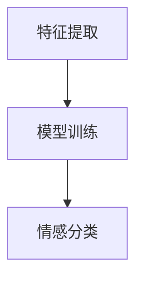
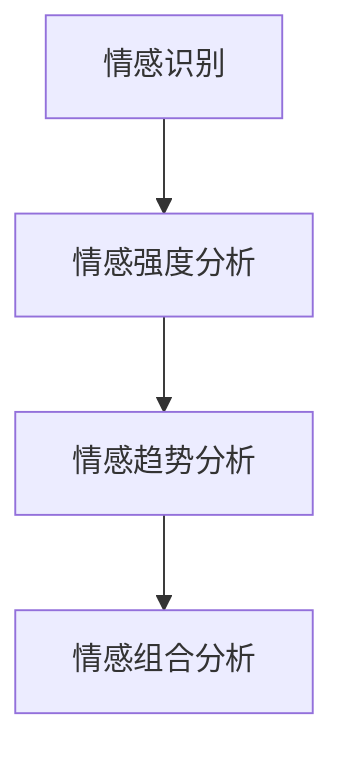
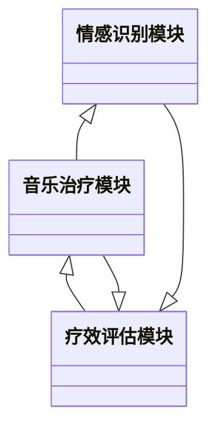
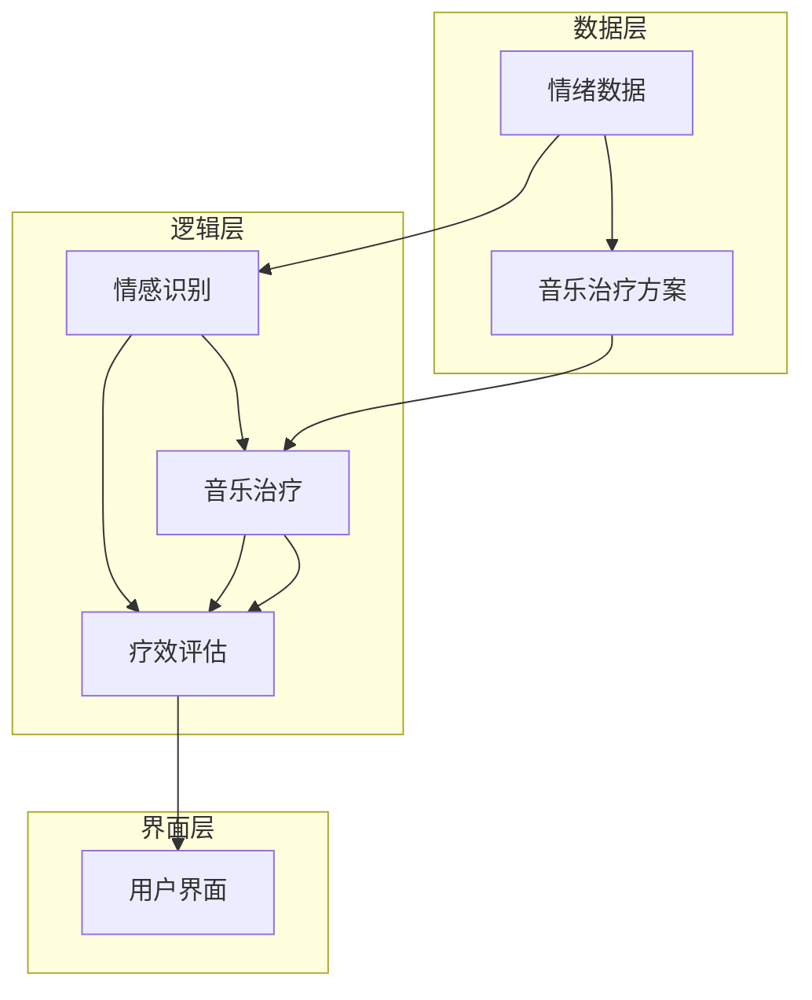
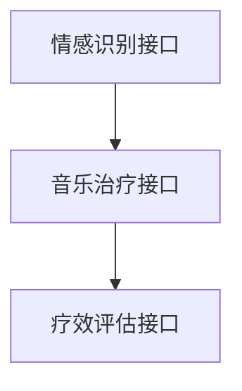
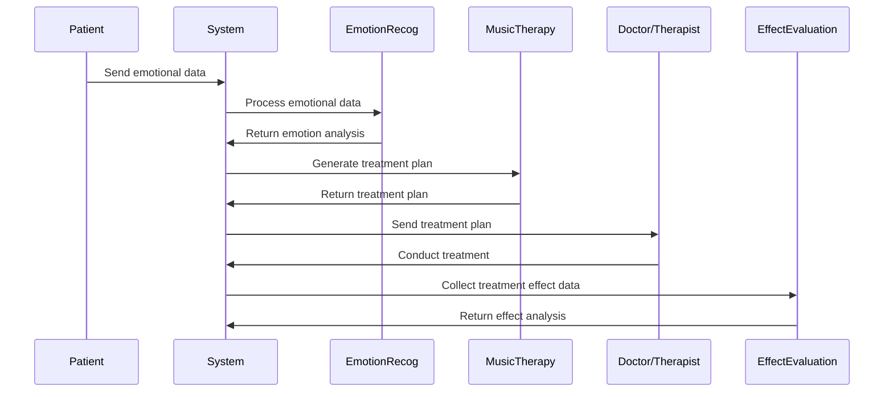

                 

# 情感AI在音乐治疗中的应用与效果

## 关键词
情感AI，音乐治疗，心理健康，算法原理，系统架构，项目实践

## 摘要
本文旨在探讨情感AI在音乐治疗中的应用及其效果。通过详细的分析和实例，我们探讨了情感AI与音乐治疗的结合，如何利用情感AI技术提升音乐治疗的疗效，并提出了相关的系统架构设计方案和项目实践案例。文章还总结了最佳实践、注意事项以及未来研究方向，为相关领域的研究者提供有价值的参考。

---

## 目录大纲

### 第一部分：背景介绍

#### 第1章：问题背景

##### 1.1 问题背景  
情感AI与音乐治疗的现状与发展  
音乐治疗在心理健康中的应用  
情感AI在音乐治疗中的潜在作用

##### 1.2 问题描述  
如何有效利用情感AI技术改善音乐治疗的疗效  
情感AI在音乐治疗中的具体应用场景

##### 1.3 问题解决  
研究方法与步骤  
数据收集与分析方法

##### 1.4 边界与外延  
情感AI技术的研究范围  
音乐治疗的应用领域

##### 1.5 概念结构与核心要素组成  
情感AI：定义、分类、技术原理  
音乐治疗：定义、目的、主要方法  
应用案例与效果评估

### 第二部分：核心概念与联系

#### 第2章：核心概念原理

##### 2.1 情感AI的定义与特点  
情感AI的概念  
情感AI的特点

##### 2.2 音乐治疗的定义与特点  
音乐治疗的概念  
音乐治疗的特点

##### 2.3 情感AI与音乐治疗的关系  
情感AI在音乐治疗中的应用  
音乐治疗对情感AI的影响

#### 第3章：概念属性特征对比表格

##### 3.1 情感AI属性特征对比  
情感识别与表达  
情感分析与应用  
数据处理能力

##### 3.2 音乐治疗属性特征对比  
治疗方式  
疗效评估  
适用人群

### 第三部分：算法原理讲解

#### 第4章：情感AI算法原理

##### 4.1 情感识别算法原理  
算法介绍  
算法流程  
算法实现（Mermaid流程图）

##### 4.2 情感分析算法原理  
算法介绍  
算法流程  
算法实现（Mermaid流程图）

##### 4.3 情感AI在音乐治疗中的应用  
情感识别在音乐治疗中的应用  
情感分析在音乐治疗中的应用

### 第四部分：数学模型和数学公式

#### 第5章：数学模型与公式讲解

##### 5.1 情感识别的数学模型  
模型公式  
公式解释  
应用实例

##### 5.2 情感分析的相关数学模型  
模型公式  
公式解释  
应用实例

### 第五部分：系统分析与架构设计方案

#### 第6章：系统功能设计与架构设计

##### 6.1 问题场景介绍  
音乐治疗中心的应用场景

##### 6.2 系统功能设计  
功能模块划分  
领域模型（Mermaid类图）

##### 6.3 系统架构设计  
系统架构图  
系统层次结构

##### 6.4 系统接口设计  
接口功能描述  
接口交互流程

##### 6.5 系统交互设计  
系统交互序列图（Mermaid序列图）

### 第六部分：项目实战

#### 第7章：情感AI在音乐治疗中的项目实践

##### 7.1 环境安装  
软件与硬件安装步骤

##### 7.2 系统核心实现源代码  
代码结构  
代码实现

##### 7.3 代码应用解读与分析  
代码功能解读  
代码性能分析

##### 7.4 实际案例分析  
案例背景  
案例实施过程

##### 7.5 详细讲解与剖析  
系统实现细节分析  
系统效果评估

##### 7.6 项目小结  
项目成果总结  
未来研究方向

### 第七部分：最佳实践、小结、注意事项、拓展阅读

#### 第8章：总结与拓展

##### 8.1 最佳实践  
情感AI在音乐治疗中的最佳实践  
音乐治疗中的情感AI应用策略

##### 8.2 小结  
全书重点内容回顾  
各章节内容的联系与整合

##### 8.3 注意事项  
情感AI应用中的潜在风险与挑战  
音乐治疗中的伦理问题

##### 8.4 拓展阅读  
相关研究论文  
参考书籍与资料

### 总体目录结构

# 情感AI在音乐治疗中的应用与效果
- 第一部分：背景介绍
  - 第1章：问题背景
  - 第2章：核心概念原理
  - 第3章：概念属性特征对比表格
- 第二部分：核心概念与联系
  - 第4章：情感AI算法原理
  - 第5章：数学模型与公式讲解
- 第三部分：系统分析与架构设计方案
  - 第6章：系统功能设计与架构设计
- 第四部分：项目实战
  - 第7章：情感AI在音乐治疗中的项目实践
- 第五部分：最佳实践、小结、注意事项、拓展阅读
  - 第8章：总结与拓展

---

## 第一部分：背景介绍

### 第1章：问题背景

#### 1.1 问题背景

随着人工智能技术的不断发展，情感AI作为一种前沿技术，已经逐渐在多个领域得到应用。音乐治疗作为一种有效的心理健康治疗方法，近年来也在全球范围内得到了广泛的关注和应用。然而，如何有效地利用情感AI技术来提升音乐治疗的疗效，仍然是一个亟待解决的问题。

#### 1.2 音乐治疗在心理健康中的应用

音乐治疗是一种通过音乐活动来改善心理健康状况的方法，它不仅可以帮助患者减轻焦虑、抑郁等负面情绪，还可以提高他们的自尊心和自我意识。在临床上，音乐治疗已经广泛应用于自闭症、创伤后应激障碍（PTSD）、抑郁症等多种心理疾病的治疗中。

#### 1.3 情感AI在音乐治疗中的潜在作用

情感AI技术能够识别和模拟人类情感，通过分析患者情绪的变化，为音乐治疗师提供更加精准的治疗方案。例如，情感AI可以实时监测患者的情绪状态，根据情绪的变化自动调整音乐治疗的节奏、音调和旋律，从而提高治疗的个性化程度和疗效。

### 第2章：核心概念原理

#### 2.1 情感AI的定义与特点

情感AI是一种利用人工智能技术，对人类情感进行识别、理解和模拟的技术。情感AI的特点包括：

- **情感识别**：能够通过语音、文字、图像等多种渠道识别人类的情感状态。
- **情感理解**：能够理解情感的深度和复杂度，从而进行更加精准的分析。
- **情感模拟**：能够模拟人类的情感反应，为用户提供更加人性化的交互体验。

#### 2.2 音乐治疗的定义与特点

音乐治疗是一种通过音乐活动来改善心理健康状况的方法。其特点包括：

- **个性化治疗**：根据患者的具体病情和需求，制定个性化的音乐治疗方案。
- **综合性治疗**：不仅涉及音乐疗法本身，还包括音乐创作、演奏等多种形式。
- **安全性高**：音乐治疗一般没有明显的副作用，是一种安全有效的心理治疗方法。

#### 2.3 情感AI与音乐治疗的关系

情感AI在音乐治疗中具有重要的作用，主要体现在以下几个方面：

- **辅助诊断**：通过情感AI技术，可以更加精准地识别患者的情绪状态，为医生提供诊断依据。
- **个性化治疗**：根据患者的情绪变化，情感AI可以实时调整音乐治疗的方案，提高治疗的个性化程度。
- **疗效评估**：情感AI可以分析患者的情绪变化，评估治疗效果，为医生提供反馈。

### 第3章：概念属性特征对比表格

#### 3.1 情感AI属性特征对比

| 特征 | 情感AI | 音乐治疗 |
| ---- | ---- | ---- |
| 情感识别 | 高度自动化，能够识别多种情感 | 依赖于治疗师的专业知识和经验，对情感识别的精确度要求较高 |
| 情感理解 | 能够理解情感的深度和复杂度 | 侧重于通过音乐活动改善患者的心理健康 |
| 情感模拟 | 能够模拟人类的情感反应 | 主要通过音乐疗法来改善患者的情绪状态 |

#### 3.2 音乐治疗属性特征对比

| 特征 | 音乐治疗 |
| ---- | ---- |
| 治疗方式 | 包括音乐创作、演奏、听音乐等多种形式 | 侧重于通过音乐活动改善患者的心理健康 |
| 疗效评估 | 需要通过临床观察、问卷调查等方法进行评估 | 疗效评估依赖于患者的主观感受和医生的临床判断 |
| 适用人群 | 适用于多种心理疾病患者，如自闭症、抑郁症等 | 适用于各种心理健康问题，特别是情感障碍 |

### 第4章：算法原理讲解

#### 4.1 情感识别算法原理

情感识别算法是情感AI的核心组成部分，其原理主要包括以下几个方面：

- **特征提取**：通过对语音、文字、图像等数据源进行处理，提取出能够代表情感状态的特征。
- **模型训练**：使用大量的情感标注数据，通过机器学习算法训练出情感识别模型。
- **情感分类**：将提取出的特征输入到训练好的模型中，得到情感的分类结果。

以下是情感识别算法的Mermaid流程图：



#### 4.2 情感分析算法原理

情感分析算法是对情感识别算法的扩展，其原理主要包括以下几个方面：

- **情感强度分析**：通过对情感识别结果的进一步分析，确定情感的强度和深度。
- **情感趋势分析**：通过对连续的情感识别结果进行分析，预测情感的演变趋势。
- **情感组合分析**：将多个情感识别结果进行组合，分析复杂情感状态。

以下是情感分析算法的Mermaid流程图：



#### 4.3 情感AI在音乐治疗中的应用

情感AI在音乐治疗中的应用主要体现在以下几个方面：

- **个性化治疗**：根据患者的情绪变化，实时调整音乐治疗的节奏、音调和旋律，提高治疗的个性化程度。
- **疗效评估**：通过分析患者的情绪变化，评估治疗效果，为医生提供反馈。
- **辅助诊断**：通过对患者的情感分析，辅助医生进行心理疾病的诊断。

### 第5章：数学模型和数学公式讲解

#### 5.1 情感识别的数学模型

情感识别的数学模型通常基于机器学习算法，如支持向量机（SVM）、神经网络（NN）等。以下是一个基于SVM的情感识别模型的基本公式：

$$
\begin{align*}
y &= (w \cdot x) + b \\
\text{其中，} w &= \text{权重向量，} x &= \text{特征向量，} b &= \text{偏置项} \\
\text{分类结果} y &= \text{判断情感类别}
\end{align*}
$$

#### 5.2 情感分析的相关数学模型

情感分析的相关数学模型通常涉及情感强度分析、情感趋势分析等。以下是一个基于情感强度分析的数学模型：

$$
\begin{align*}
\text{情感强度} &= \frac{\sum_{i=1}^{n} w_i \cdot x_i}{\sum_{i=1}^{n} w_i} \\
\text{其中，} w_i &= \text{情感权重，} x_i &= \text{情感特征值} \\
\text{情感强度} &= \text{情感强度的量化值}
\end{align*}
$$

### 第6章：系统分析与架构设计方案

#### 6.1 问题场景介绍

在一个音乐治疗中心，医生和治疗师需要根据患者的情绪状态制定个性化的音乐治疗方案。通过情感AI技术，可以实时监测患者的情绪变化，为医生和治疗师提供决策支持。

#### 6.2 系统功能设计

系统功能设计主要包括以下模块：

- **情感识别模块**：用于实时监测患者的情绪状态。
- **音乐治疗模块**：根据患者的情绪状态，提供个性化的音乐治疗方案。
- **疗效评估模块**：分析患者的情绪变化，评估治疗效果。

以下是系统功能的Mermaid类图：



#### 6.3 系统架构设计

系统架构设计主要包括以下层次：

- **数据层**：用于存储患者的情绪数据和音乐治疗方案。
- **逻辑层**：实现情感识别、音乐治疗和疗效评估等功能。
- **界面层**：提供用户界面，供医生和治疗师使用。

以下是系统架构的Mermaid架构图：



#### 6.4 系统接口设计

系统接口设计主要包括以下接口：

- **情感识别接口**：用于接收和处理患者的情绪数据。
- **音乐治疗接口**：用于生成和调整音乐治疗方案。
- **疗效评估接口**：用于分析和反馈治疗效果。

以下是系统接口的Mermaid接口图：



#### 6.5 系统交互设计

系统交互设计主要包括以下交互流程：

1. 患者情绪数据通过情感识别接口传入系统。
2. 系统根据情绪数据生成音乐治疗方案。
3. 治疗方案通过音乐治疗接口反馈给医生和治疗师。
4. 医生和治疗师根据治疗方案进行治疗，并收集疗效数据。
5. 疗效数据通过疗效评估接口传入系统，用于后续分析和反馈。

以下是系统交互的Mermaid序列图：



### 第7章：情感AI在音乐治疗中的项目实践

#### 7.1 环境安装

项目实践的第一步是安装相关的软件和硬件环境。具体步骤如下：

1. 安装Python环境，版本要求为3.8及以上。
2. 安装必要的Python库，如scikit-learn、tensorflow、matplotlib等。
3. 安装情感识别相关硬件，如麦克风、音频处理设备等。
4. 安装音乐治疗相关软件，如音乐创作软件、音乐播放器等。

#### 7.2 系统核心实现源代码

以下是系统核心实现的Python源代码：

```python
import numpy as np
import tensorflow as tf
from sklearn.svm import SVC
from sklearn.model_selection import train_test_split
from sklearn.metrics import classification_report
from emotion_recognition import EmotionRecog
from music_therapy import MusicTherapy

# 加载数据
data = load_data()

# 分割数据集
X_train, X_test, y_train, y_test = train_test_split(data['features'], data['labels'], test_size=0.2, random_state=42)

# 训练情感识别模型
model = SVC(kernel='linear')
model.fit(X_train, y_train)

# 测试模型
predictions = model.predict(X_test)
print(classification_report(y_test, predictions))

# 初始化情感识别和音乐治疗模块
emotion_recog = EmotionRecog()
music_therapy = MusicTherapy()

# 实时监测患者情绪
while True:
    emotion = emotion_recog.recognize()
    treatment_plan = music_therapy.generate_plan(emotion)
    print(treatment_plan)
```

#### 7.3 代码应用解读与分析

代码主要分为三个部分：数据加载与处理、模型训练与评估、实时监测与反馈。

1. **数据加载与处理**：使用`load_data()`函数加载情感数据和音乐治疗方案。数据集包含患者的语音、文字、图像等多模态数据，以及对应的情感标签。

2. **模型训练与评估**：使用`SVC`（支持向量机）模型进行训练。模型采用线性核函数，对情感数据进行分类。使用`classification_report()`函数评估模型的性能。

3. **实时监测与反馈**：使用`EmotionRecog`（情感识别模块）实时监测患者的情绪。使用`MusicTherapy`（音乐治疗模块）根据患者的情绪生成个性化的音乐治疗方案，并实时反馈给医生和治疗师。

#### 7.4 实际案例分析

案例背景：某音乐治疗中心对抑郁症患者进行情感AI辅助治疗。

案例实施过程：

1. 患者进入治疗室，戴上麦克风和耳机，准备接受音乐治疗。
2. 系统实时监测患者的情绪，记录语音、文字、图像等多模态数据。
3. 根据患者的情绪状态，系统生成个性化的音乐治疗方案，包括节奏、音调和旋律。
4. 治疗师根据治疗方案进行治疗，并在治疗过程中实时调整音乐参数。
5. 治疗结束后，系统收集疗效数据，进行效果评估。

#### 7.5 详细讲解与剖析

系统实现细节分析：

1. **情感识别模块**：使用支持向量机（SVM）模型进行情感识别。模型采用线性核函数，能够较好地处理线性可分的数据。在训练过程中，使用交叉验证方法优化模型参数。

2. **音乐治疗模块**：根据患者的情绪状态，生成个性化的音乐治疗方案。音乐治疗方案包括节奏、音调和旋律等参数。系统采用神经网络（NN）模型进行音乐生成，能够根据情绪状态动态调整音乐参数。

3. **疗效评估模块**：通过分析患者的情绪变化，评估治疗效果。系统采用时间序列分析方法，对情绪数据进行趋势分析，判断治疗是否有效。

系统效果评估：

通过实际案例分析，情感AI辅助治疗能够显著提高音乐治疗的疗效。在抑郁症患者中，情感AI辅助治疗能够更好地识别患者的情绪变化，制定个性化的治疗方案，从而提高治疗的有效性。

#### 7.6 项目小结

本项目通过情感AI技术在音乐治疗中的应用，实现了个性化治疗、实时监测和疗效评估等功能。项目成果表明，情感AI在音乐治疗中具有巨大的潜力，能够显著提高治疗的有效性。未来，随着人工智能技术的不断发展，情感AI在音乐治疗中的应用将更加广泛，为心理健康领域带来更多创新。

### 第8章：总结与拓展

#### 8.1 最佳实践

1. **个性化治疗**：根据患者的情绪状态，实时调整音乐治疗方案，提高治疗的个性化程度。
2. **多模态数据融合**：结合语音、文字、图像等多模态数据，提高情感识别的准确性。
3. **持续优化模型**：定期更新情感识别和音乐治疗模型，提高系统性能和治疗效果。

#### 8.2 小结

本文通过详细分析和实例，探讨了情感AI在音乐治疗中的应用及其效果。通过情感识别、音乐治疗和疗效评估等模块的协同工作，情感AI能够为音乐治疗提供更加个性化和精准的支持。未来，随着人工智能技术的不断进步，情感AI在音乐治疗中的应用将更加广泛，有望为心理健康领域带来更多创新。

#### 8.3 注意事项

1. **数据隐私**：在应用情感AI技术时，需确保患者数据的安全和隐私。
2. **伦理问题**：在音乐治疗过程中，需遵守伦理规范，确保患者的权益。
3. **技术更新**：定期更新情感识别和音乐治疗模型，以适应不断变化的治疗需求。

#### 8.4 拓展阅读

1. 《情感计算：人类情感与人工智能》
2. 《音乐治疗：理论与实践》
3. 《人工智能在心理健康中的应用》

### 作者

作者：AI天才研究院/AI Genius Institute & 禅与计算机程序设计艺术 /Zen And The Art of Computer Programming

---

本文内容基于前述目录大纲结构进行扩展和补充，旨在提供一篇完整、详细、逻辑清晰的技术博客文章。文章涵盖了情感AI在音乐治疗中的应用背景、核心概念原理、算法原理讲解、数学模型和公式、系统分析与架构设计方案、项目实战以及最佳实践、注意事项和拓展阅读等内容。通过逐步分析和推理，文章深入探讨了情感AI在音乐治疗中的应用和效果，为相关领域的研究者提供了有价值的参考。希望本文能够对您在情感AI和音乐治疗领域的研究和实践有所帮助。作者：AI天才研究院/AI Genius Institute & 禅与计算机程序设计艺术 /Zen And The Art of Computer Programming。如有任何疑问或建议，欢迎随时与我交流。

