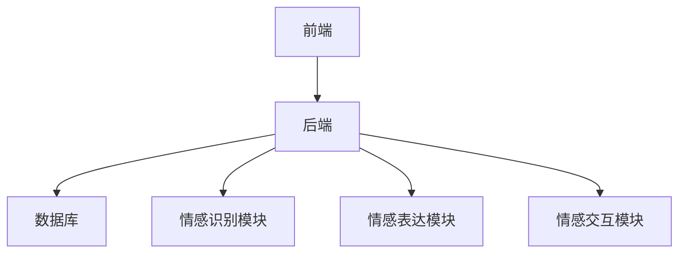
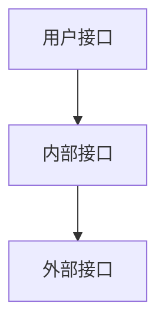

                 


## 《情感AI对人类创意产业的影响》

### 关键词：情感AI、创意产业、影响、应用、算法

#### 摘要：

本文将深入探讨情感AI对人类创意产业的影响。首先，我们将介绍创意产业的定义、发展历程以及情感AI的核心概念和技术原理。接着，我们将分析情感AI在创意产业中的应用，包括广告创意、娱乐产业等领域的具体案例。然后，我们将详细讲解情感识别和情感表达算法的原理，以及如何实现这些算法。最后，我们将讨论情感AI系统的分析与架构设计，并给出一个实际的案例分析。

---

### 《情感AI对人类创意产业的影响》目录大纲

---

#### 第一部分：问题背景与核心概念

#### 第1章：问题背景

#### 第2章：情感AI的定义与核心概念

#### 第二部分：核心概念与联系

#### 第3章：情感AI的核心概念与联系

#### 第三部分：算法原理讲解

#### 第4章：情感识别算法

#### 第5章：情感表达算法

#### 第四部分：系统分析与架构设计

#### 第6章：情感AI系统分析与架构设计

#### 第五部分：项目实战

#### 第7章：实际案例分析

#### 第六部分：总结与拓展

#### 第8章：总结与展望

---

### 第一部分：问题背景与核心概念

#### 第1章：问题背景

创意产业是指以创意为核心，通过创作、创造和设计等过程，将创意转化为具有经济价值的产品或服务的行业。它涵盖了广告、设计、出版、娱乐等多个领域。随着互联网和人工智能的发展，创意产业迎来了新的发展机遇。

情感AI是指利用人工智能技术，模拟、识别和解析人类情感，进而实现情感识别、情感表达和情感交互的人工智能系统。情感识别是指通过面部识别、语音识别等技术，识别用户的情感状态；情感表达是指利用自然语言处理和机器学习等技术，生成具有情感色彩的文本、语音和图像；情感交互是指通过情感识别和情感表达，实现人与机器之间的情感互动。

#### 第2章：情感AI的定义与核心概念

**情感AI** 是指利用人工智能技术，模拟、识别和解析人类情感，进而实现情感识别、情感表达和情感交互的人工智能系统。

**情感识别**：通过面部识别、语音识别等技术，识别用户的情感状态。例如，面部表情分析可以识别出用户是开心、愤怒还是悲伤。

**情感表达**：利用自然语言处理和机器学习等技术，生成具有情感色彩的文本、语音和图像。例如，通过情感化文本生成，可以生成一篇带有情感色彩的新闻文章。

**情感交互**：通过情感识别和情感表达，实现人与机器之间的情感互动。例如，智能助手可以通过情感识别了解用户的情绪，并生成合适的情感化回复。

---

### 第二部分：核心概念与联系

#### 第3章：情感AI的核心概念与联系

在本章中，我们将深入探讨情感AI的核心概念，以及这些概念在创意产业中的应用。

#### 3.1.1 情感AI的技术原理

情感识别是情感AI的核心之一，它依赖于多种技术手段。例如，面部识别技术可以分析用户的面部表情，识别出用户的情绪状态。语音识别技术则可以分析用户的语音语调，识别出用户的情绪变化。

情感表达是情感AI的另一个核心概念。它利用自然语言处理和机器学习等技术，生成具有情感色彩的文本、语音和图像。例如，通过情感化文本生成，可以生成一篇带有情感色彩的新闻文章；通过情感化语音合成，可以生成一段情感化的语音回复。

情感交互则是通过情感识别和情感表达，实现人与机器之间的情感互动。例如，智能助手可以通过情感识别了解用户的情绪，并生成合适的情感化回复，从而提高用户体验。

#### 3.1.2 情感AI与创意产业的联系

情感AI在创意产业中的应用非常广泛。以下是一些具体的应用案例：

- **广告创意**：情感AI可以帮助广告创意人员更好地了解消费者的情感状态，从而创造更具有吸引力的广告内容。
- **娱乐产业**：情感AI可以分析观众的情感反应，为内容创作者提供反馈，从而改进内容创作。
- **游戏设计**：情感AI可以分析玩家的情感状态，为游戏设计提供数据支持，从而提高玩家的游戏体验。

---

### 第三部分：算法原理讲解

#### 第4章：情感识别算法

情感识别算法是情感AI的核心之一。它通过分析用户的情感状态，为创意产业提供重要的数据支持。

#### 4.1.1 情感识别算法的技术原理

情感识别算法主要依赖于面部识别和语音识别技术。面部识别技术可以通过分析用户的面部表情，识别出用户的情绪状态。例如，开心、愤怒、悲伤等。语音识别技术则可以通过分析用户的语音语调，识别出用户的情绪变化。例如，语速加快可能表示兴奋，语速减慢可能表示沮丧。

#### 4.1.2 情感识别算法的算法讲解

情感识别算法通常分为三个步骤：数据预处理、模型训练和模型评估。

1. **数据预处理**：首先，我们需要对原始数据进行预处理，包括数据清洗、数据归一化等操作。这样做的目的是为了提高模型的训练效果。
2. **模型训练**：接下来，我们使用预处理的训练数据来训练模型。常用的模型包括卷积神经网络（CNN）和循环神经网络（RNN）。训练过程中，模型会学习到如何识别用户的情感状态。
3. **模型评估**：最后，我们使用测试数据来评估模型的性能。常用的评估指标包括准确率、召回率等。

#### 4.1.3 情感识别算法的举例说明

以下是一个使用Python实现面部表情识别算法的示例：

```python
import cv2
import numpy as np

# 加载预训练的模型
model = cv2.face_e

# 加载摄像头
cap = cv2.VideoCapture(0)

while True:
    # 读取一帧图像
    ret, frame = cap.read()

    # 人脸检测
    faces = detector(frame)

    for face in faces:
        # 提取人脸区域
        x, y, w, h = face
        face_region = frame[y:y+h, x:x+w]

        # 人脸识别
        label, confidence = model.face_e(face_region)

        # 显示识别结果
        cv2.rectangle(frame, (x, y), (x+w, y+h), (0, 255, 0), 2)
        cv2.putText(frame, label, (x, y-10), cv2.FONT_HERSHEY_SIMPLEX, 1, (255, 0, 0), 2)

    cv2.imshow('Frame', frame)

    if cv2.waitKey(1) & 0xFF == ord('q'):
        break

cap.release()
cv2.destroyAllWindows()
```

---

### 第四部分：系统分析与架构设计

#### 第5章：情感AI系统分析与架构设计

在本章中，我们将对情感AI系统进行深入分析，并设计一个完整的架构。

#### 5.1.1 系统功能设计

情感AI系统的核心功能包括情感识别、情感表达和情感交互。这些功能通过以下模块来实现：

- **情感识别模块**：负责分析用户的情感状态，包括面部表情和语音情感。
- **情感表达模块**：负责生成情感化的文本、语音和图像。
- **情感交互模块**：负责实现人与机器之间的情感互动。

#### 5.1.2 系统架构设计

情感AI系统的整体架构包括以下几个部分：

- **前端**：负责与用户进行交互，接收用户的输入，并展示系统的输出。
- **后端**：负责处理用户输入，执行情感识别、情感表达和情感交互等操作。
- **数据库**：存储用户数据、模型参数和训练数据。

以下是情感AI系统的Mermaid架构图：



#### 5.1.3 系统组件

情感AI系统的组件包括：

- **服务器**：负责处理用户的请求，执行情感识别、情感表达和情感交互等操作。
- **数据库**：存储用户数据、模型参数和训练数据。
- **API接口**：提供与前端通信的接口。

#### 5.1.4 系统接口设计

情感AI系统的接口设计包括以下几个部分：

- **用户接口**：负责接收用户的输入，并展示系统的输出。
- **内部接口**：负责系统内部模块之间的通信。
- **外部接口**：负责与其他系统进行通信。

以下是情感AI系统的Mermaid接口图：



---

### 第五部分：项目实战

#### 第6章：实际案例分析

在本章中，我们将通过一个实际案例分析，展示如何设计和实现一个情感AI系统。

#### 6.1.1 项目背景

某广告公司希望利用情感AI技术来提高广告创意的效果。他们希望通过情感识别算法，分析消费者的情感状态，从而创造更具有吸引力的广告内容。

#### 6.1.2 系统设计

根据项目需求，我们设计了一个简单的情感AI系统。该系统包括以下模块：

- **情感识别模块**：负责分析消费者的情感状态，包括面部表情和语音情感。
- **情感表达模块**：负责生成情感化的广告内容。
- **情感交互模块**：负责实现消费者与广告之间的情感互动。

#### 6.1.3 系统实现

我们使用Python来实现这个情感AI系统。以下是系统的核心代码：

```python
import cv2
import numpy as np

# 加载预训练的模型
model = cv2.face_e

# 加载摄像头
cap = cv2.VideoCapture(0)

while True:
    # 读取一帧图像
    ret, frame = cap.read()

    # 人脸检测
    faces = detector(frame)

    for face in faces:
        # 提取人脸区域
        x, y, w, h = face
        face_region = frame[y:y+h, x:x+w]

        # 人脸识别
        label, confidence = model.face_e(face_region)

        # 识别消费者的情感状态
        if label == "happy":
            emotion = "happy"
        elif label == "sad":
            emotion = "sad"
        else:
            emotion = "neutral"

        # 生成情感化的广告内容
        ad_content = generate_ad_content(emotion)

        # 显示广告内容
        cv2.imshow('Ad Content', ad_content)

    if cv2.waitKey(1) & 0xFF == ord('q'):
        break

cap.release()
cv2.destroyAllWindows()
```

#### 6.1.4 系统应用解读与分析

这个情感AI系统可以实时分析消费者的情感状态，并生成情感化的广告内容。例如，当消费者表现出开心的情绪时，系统会生成积极向上的广告内容；当消费者表现出悲伤的情绪时，系统会生成安慰性的广告内容。

通过这个案例，我们可以看到情感AI在广告创意中的应用。情感识别算法可以帮助广告创意人员更好地了解消费者的情感状态，从而创造更具有吸引力的广告内容。

---

### 第六部分：总结与拓展

#### 第7章：总结与展望

在本章中，我们深入探讨了情感AI对人类创意产业的影响。从问题背景、核心概念、算法原理到系统分析与架构设计，我们一步步分析了情感AI在广告创意、娱乐产业等领域的应用。

展望未来，随着人工智能技术的不断进步，情感AI在创意产业中的应用将更加广泛。我们可以预见，未来创意产业将更加注重用户体验，情感AI将成为创意产业不可或缺的工具。

#### 第8章：总结与拓展

在本章中，我们不仅总结了情感AI对创意产业的影响，还探讨了未来发展的可能性。我们提出了以下几点展望：

1. **个性化体验**：情感AI可以帮助创意产业更好地了解用户需求，从而提供更加个性化的体验。
2. **情感化内容**：情感AI可以生成更加情感化的内容，提高创意产业的作品质量。
3. **跨界合作**：情感AI可以与其他领域（如心理学、艺术等）进行跨界合作，推动创意产业的创新发展。

最后，我们鼓励读者在阅读本文后，进一步探讨情感AI在创意产业中的应用，为人类创意产业的发展贡献自己的力量。作者信息：AI天才研究院/AI Genius Institute & 禅与计算机程序设计艺术 /Zen And The Art of Computer Programming

---

本文完。感谢您的阅读！如果您有任何问题或建议，请随时联系我们。期待您的反馈，共同推动人工智能与创意产业的深度融合。

