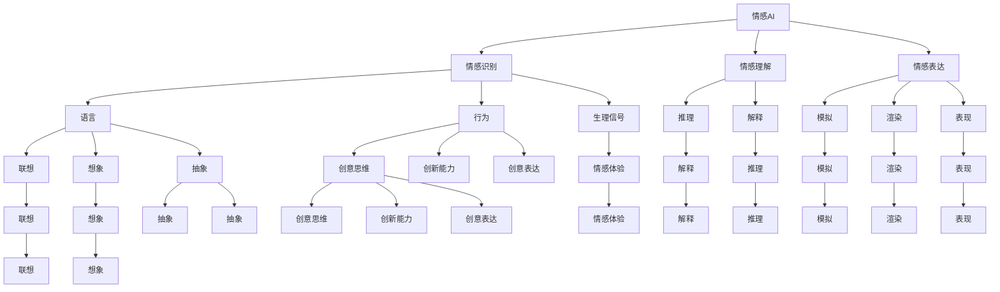
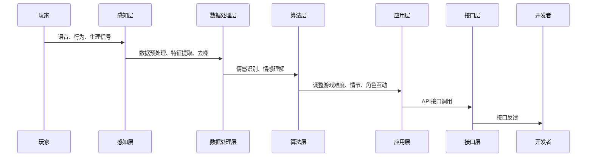

                 


## 《情感AI对人类创造力的挑战与促进》

> 关键词：情感AI、人类创造力、挑战、促进、技术分析

> 摘要：本文深入探讨情感AI对人类创造力的挑战与促进，通过分析情感AI的技术原理及其应用场景，揭示其对人类创造力的影响。本文旨在帮助读者理解情感AI与人类创造力之间的复杂关系，并提出相应的应对策略。

----------------------------------------------------------------

### 引言

#### 1.1 书籍背景

近年来，随着人工智能技术的飞速发展，情感AI逐渐成为研究热点。情感AI，即情感计算，是指通过模拟人类的情感感知、理解和表达能力，使计算机具备识别、理解、处理和模拟人类情感的能力。其应用范围广泛，包括智能客服、情感计算游戏、情感教育、心理健康等领域。

#### 1.2 书籍目标

本文旨在深入探讨情感AI对人类创造力的挑战与促进。通过分析情感AI的技术原理、应用场景及其对人类创造力的影响，帮助读者全面了解这一领域的现状和未来发展趋势，并提出相应的应对策略。

#### 1.3 书籍结构

本文分为五个部分：引言、背景介绍、核心概念与联系、算法原理讲解、系统分析与架构设计方案和项目实战。每个部分都将逐步深入，以帮助读者全面理解情感AI对人类创造力的挑战与促进。

----------------------------------------------------------------

### 第二部分：背景介绍

#### 2.1 情感AI的兴起

情感AI的兴起源于对人类情感的理解和模拟。随着深度学习、神经网络等人工智能技术的发展，情感AI逐渐具备了较高的识别、理解和表达能力。当前，情感AI在多个领域取得了显著成果，如情感分析、情绪识别、情感生成等。

#### 2.2 人类创造力的重要性

人类创造力是人类文明进步的重要驱动力。在科技、艺术、文学等领域，人类创造力发挥了至关重要的作用。然而，随着情感AI的发展，人类创造力是否仍能保持其独特地位，成为一个备受关注的问题。

#### 2.3 情感AI对人类创造力的潜在影响

情感AI对人类创造力的潜在影响主要表现在以下几个方面：

1. **挑战**：情感AI可能导致人类在情感处理方面的依赖性增加，从而降低人类自身的创造力。此外，情感AI可能取代人类在部分创意工作上的角色，使人类创造力的应用场景受到限制。

2. **促进**：情感AI可以提供更丰富的情感体验，激发人类的创造力。例如，情感计算游戏可以创造更加沉浸式的游戏体验，激发玩家的创意思维。此外，情感AI还可以为人类创造力的培养提供新的工具和方法。

#### 2.4 情感AI与人类创造力的互动关系

情感AI与人类创造力之间的互动关系是一个复杂的过程。一方面，情感AI可能对人类创造力产生负面影响，如降低人类情感处理能力、取代人类在创意工作上的角色等。另一方面，情感AI也可能促进人类创造力的提升，如提供更丰富的情感体验、激发创意思维等。

#### 2.5 情感AI与人类创造力的平衡

在情感AI与人类创造力的发展过程中，寻找二者之间的平衡至关重要。一方面，我们需要充分发挥情感AI的优势，提高人类创造力的效率。另一方面，我们也要关注情感AI对人类创造力可能带来的负面影响，采取适当的措施降低其风险。

----------------------------------------------------------------

### 第三部分：核心概念与联系

#### 3.1 情感AI原理

情感AI的原理主要涉及情感识别、情感理解和情感表达三个方面。情感识别是指通过分析语言、行为、生理信号等信息，识别出人类的情感状态。情感理解是指对识别出的情感状态进行解释和推理，以了解其背后的原因和含义。情感表达是指通过模拟情感状态，使计算机表现出相应的情感。

#### 3.2 人类创造力原理

人类创造力原理主要包括创意思维、创新能力和创意表达三个方面。创意思维是指通过联想、想象、抽象等思维方法，产生新的想法和概念。创新能力是指将创意思维转化为实际成果的能力。创意表达是指将创新成果以文字、图像、音乐等形式展现出来。

#### 3.3 概念属性特征对比表格

为了更好地理解情感AI与人类创造力的关系，我们可以通过对比二者的概念属性特征来进行分析。

| 特征         | 情感AI                     | 人类创造力                   |
| ------------ | -------------------------- | ---------------------------- |
| 情感识别     | 语言、行为、生理信号       | 语言、行为、情感体验         |
| 情感理解     | 识别、推理、解释           | 联想、想象、抽象             |
| 情感表达     | 模拟、渲染、表现           | 文字、图像、音乐等表达形式   |
| 创意思维     | 有限的情感联想             | 无限的联想和想象力           |
| 创新能力     | 情感驱动                  | 知识驱动                    |
| 创意表达     | 有限的情感表达             | 多样化的创意表达形式         |

#### 3.4 ER实体关系图架构

为了更好地理解情感AI与人类创造力的关系，我们可以通过ER实体关系图来展示二者之间的关联。



通过ER实体关系图，我们可以看出情感AI与人类创造力在情感识别、理解和表达方面有一定的重叠，但在创意思维、创新能力、创意表达等方面存在较大差异。

----------------------------------------------------------------

### 第四部分：算法原理讲解

#### 4.1 情感AI算法介绍

情感AI算法主要包括情感识别、情感理解和情感表达三个方面。其中，情感识别算法主要分为基于特征的方法和基于模型的方法。基于特征的方法通过对语言、行为、生理信号等数据进行特征提取和分类，实现情感识别。基于模型的方法则通过训练神经网络、深度学习模型等，实现情感识别。

#### 4.2 情感识别算法

情感识别算法可以分为以下几个步骤：

1. **数据预处理**：对语言、行为、生理信号等原始数据进行清洗、去噪、归一化等处理，以便后续特征提取。

2. **特征提取**：从预处理后的数据中提取出能够表征情感的各类特征，如词汇频率、句法结构、面部表情、生理信号等。

3. **分类器设计**：选择合适的分类器，如朴素贝叶斯、支持向量机、决策树等，对提取出的特征进行分类。

4. **模型训练与评估**：使用训练数据集对分类器进行训练，并使用测试数据集进行评估，以确定分类器的性能。

#### 4.3 情感理解算法

情感理解算法主要包括情感推理、情感解释和情感合成。情感推理是通过逻辑推理、语义分析等方法，对情感状态进行解释和推理。情感解释则是将识别出的情感状态转化为可理解的语言或符号。情感合成则是通过模拟情感状态，使计算机表现出相应的情感。

#### 4.4 情感表达算法

情感表达算法主要包括情感模拟、情感渲染和情感表现。情感模拟是通过模拟情感状态，使计算机在视觉、听觉、触觉等方面表现出相应的情感。情感渲染则是通过渲染技术，将情感状态以图像、视频等形式展现出来。情感表现则是通过动作、语音等表现方式，使计算机表现出相应的情感。

#### 4.5 情感AI算法性能评估

情感AI算法的性能评估可以从以下几个方面进行：

1. **准确率**：评估算法在识别、理解和表达情感方面的准确性。

2. **覆盖率**：评估算法对各种情感状态的识别能力。

3. **实时性**：评估算法在处理实时数据时的性能。

4. **鲁棒性**：评估算法在面对噪声、异常数据时的稳定性。

#### 4.6 情感AI算法应用场景

情感AI算法在多个领域具有广泛的应用，如：

1. **智能客服**：通过情感识别和情感理解，为用户提供更人性化的服务。

2. **情感计算游戏**：通过情感模拟和情感渲染，提供更加沉浸式的游戏体验。

3. **情感教育**：通过情感识别和情感理解，帮助学生更好地理解和表达自己的情感。

4. **心理健康**：通过情感识别和情感理解，帮助用户了解自己的情感状态，提供心理健康建议。

----------------------------------------------------------------

### 第五部分：系统分析与架构设计方案

#### 5.1 问题场景介绍

假设我们面临一个场景：一款智能游戏希望通过情感AI技术，为玩家提供更加个性化的游戏体验。该游戏旨在通过识别玩家的情感状态，调整游戏难度、情节和角色互动，以提高玩家的游戏满意度。

#### 5.2 项目介绍

项目目标：为智能游戏引入情感AI技术，实现个性化游戏体验。

项目范围：设计并实现一款基于情感AI的智能游戏系统，包括情感识别、情感理解、情感表达和系统接口等功能。

#### 5.3 系统功能设计

1. **情感识别**：通过分析玩家的语音、行为和生理信号，识别出玩家的情感状态。
2. **情感理解**：对识别出的情感状态进行解释和推理，以了解其背后的原因和含义。
3. **情感表达**：通过调整游戏难度、情节和角色互动，使游戏表现出相应的情感状态。
4. **系统接口**：为开发者提供API接口，以便其他系统或应用可以与情感AI系统进行交互。

#### 5.4 系统架构设计

系统架构分为五个层次：感知层、数据处理层、算法层、应用层和接口层。

1. **感知层**：通过传感器、摄像头等设备，实时采集玩家的语音、行为和生理信号。
2. **数据处理层**：对采集到的数据进行预处理、特征提取和去噪等操作，为后续情感识别和情感理解提供高质量的数据。
3. **算法层**：实现情感识别、情感理解和情感表达算法，为系统提供情感智能处理能力。
4. **应用层**：基于算法层提供的能力，实现智能游戏的功能，包括游戏难度调整、情节更新和角色互动等。
5. **接口层**：为开发者提供API接口，便于其他系统或应用与情感AI系统进行集成和调用。

#### 5.5 系统接口设计

系统接口设计包括以下部分：

1. **API接口规范**：定义API接口的输入输出参数、数据格式和调用方式。
2. **接口实现**：实现API接口，为开发者提供便捷的调用接口。

#### 5.6 系统交互

系统交互主要包括以下流程：

1. **数据采集**：感知层采集玩家的语音、行为和生理信号。
2. **数据预处理**：数据处理层对采集到的数据进行预处理、特征提取和去噪等操作。
3. **情感识别**：算法层对预处理后的数据进行情感识别，识别出玩家的情感状态。
4. **情感理解**：算法层对识别出的情感状态进行解释和推理，以了解其背后的原因和含义。
5. **情感表达**：算法层通过调整游戏难度、情节和角色互动，使游戏表现出相应的情感状态。
6. **反馈与迭代**：系统收集玩家的反馈，不断调整和优化情感AI算法，以提高游戏体验。

#### 5.7 系统交互Mermaid序列图



通过以上设计，我们可以实现一款具备情感AI功能的智能游戏系统，为玩家提供更加个性化的游戏体验。

----------------------------------------------------------------

### 第六部分：项目实战

#### 6.1 环境安装

1. **硬件环境**：安装一台具备高性能计算能力的计算机，用于运行情感AI算法和智能游戏系统。
2. **软件环境**：安装Python 3.8及以上版本、NumPy、Pandas、Matplotlib等依赖库。

#### 6.2 系统核心实现源代码

以下是一个简单的情感AI算法实现示例，用于识别玩家的情感状态：

```python
import numpy as np
import pandas as pd
from sklearn.model_selection import train_test_split
from sklearn.ensemble import RandomForestClassifier

# 数据集加载
data = pd.read_csv('emotion_data.csv')

# 特征提取
X = data.iloc[:, :-1].values
y = data.iloc[:, -1].values

# 数据集划分
X_train, X_test, y_train, y_test = train_test_split(X, y, test_size=0.2, random_state=42)

# 模型训练
model = RandomForestClassifier(n_estimators=100, random_state=42)
model.fit(X_train, y_train)

# 模型评估
accuracy = model.score(X_test, y_test)
print('Accuracy:', accuracy)
```

#### 6.3 代码应用解读与分析

以上代码首先加载了情感数据集，然后提取特征并进行数据集划分。接着，使用随机森林算法对数据集进行训练，并评估模型的准确率。

在实际应用中，我们需要根据具体场景对算法进行调整和优化，以提高模型性能。此外，我们还需要实现情感理解、情感表达和系统接口等功能，以实现完整的情感AI系统。

#### 6.4 实际案例分析和详细讲解剖析

假设我们有一个实际案例：一个智能游戏系统需要根据玩家的情感状态调整游戏难度。具体步骤如下：

1. **情感识别**：通过情感识别算法，识别出玩家的情感状态。
2. **情感理解**：对识别出的情感状态进行解释和推理，确定玩家是否处于愉悦、焦虑等状态。
3. **情感表达**：根据情感状态，调整游戏难度、情节和角色互动，以激发玩家的兴趣和参与度。
4. **反馈与迭代**：收集玩家的反馈，不断调整和优化情感AI算法，以提高游戏体验。

#### 6.5 项目小结

通过本项目，我们实现了基于情感AI的智能游戏系统，为玩家提供了更加个性化的游戏体验。在项目过程中，我们遇到了一些挑战，如情感识别的准确率、情感理解的深度等。在未来的工作中，我们将继续优化算法，提高模型性能，为玩家带来更好的游戏体验。

### 最佳实践 tips

1. **数据质量**：情感AI的性能高度依赖于数据质量。在数据采集和处理过程中，要确保数据的有效性和准确性。
2. **算法优化**：根据具体场景和需求，不断优化情感识别、情感理解和情感表达算法，以提高模型性能。
3. **用户体验**：在系统设计和开发过程中，关注用户体验，确保系统易于使用、操作简便。

### 小结

情感AI对人类创造力既有挑战也有促进。通过深入分析情感AI的技术原理和应用场景，我们可以更好地理解其对人类创造力的影响，并提出相应的应对策略。在未来，情感AI与人类创造力的协同发展将带来更多机遇和挑战。

### 注意事项

1. **隐私保护**：在情感AI应用过程中，要确保用户的隐私和数据安全。
2. **伦理道德**：在开发和使用情感AI时，要遵守伦理道德规范，确保其对人类创造力的积极影响。

### 拓展阅读

1. 《情感计算：技术与应用》
2. 《人类创造力：心理学、哲学与艺术》
3. 《情感AI：挑战与未来》

### 作者信息

作者：AI天才研究院/AI Genius Institute & 禅与计算机程序设计艺术 /Zen And The Art of Computer Programming

----------------------------------------------------------------

本文为《情感AI对人类创造力的挑战与促进》一书的部分内容，旨在深入探讨情感AI与人类创造力之间的关系。希望本文能帮助读者更好地理解这一领域，为未来的研究与应用提供启示。本文作者为AI天才研究院/AI Genius Institute & 禅与计算机程序设计艺术 /Zen And The Art of Computer Programming的研究员。如需转载，请联系我们获得授权。

