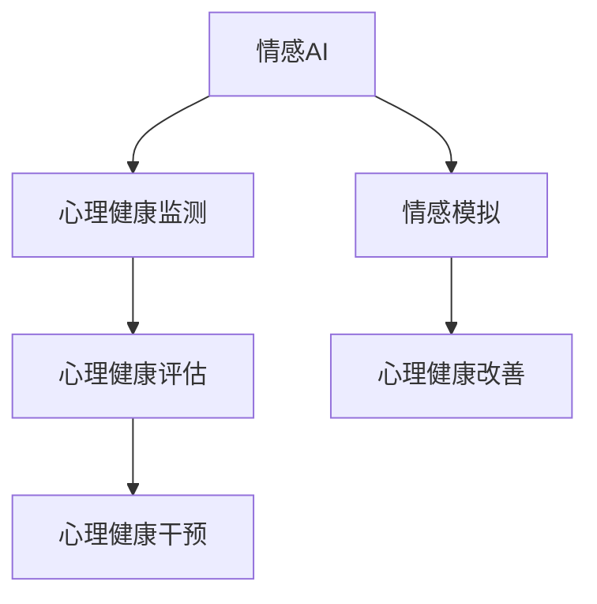
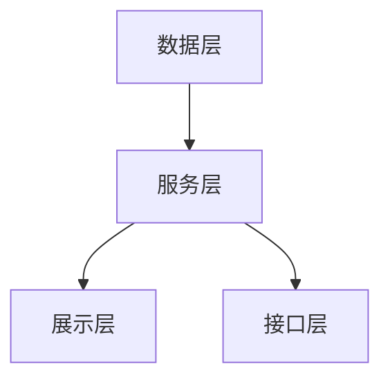
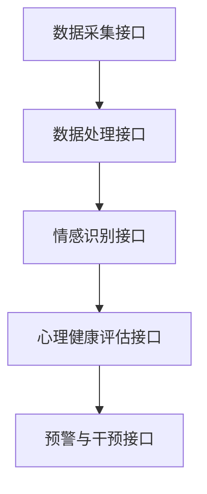

                 

### 《情感AI对人类心理健康的影响》

#### 关键词：情感AI，人类心理健康，算法，系统架构，案例实战，最佳实践

#### 摘要：

随着科技的快速发展，人工智能在各个领域的应用日益广泛。其中，情感AI作为AI的一个重要分支，正逐步走进人类的生活，并对心理健康产生深远影响。本文旨在探讨情感AI对人类心理健康的影响，通过系统的分析与架构设计，结合项目实战案例，为读者呈现一个全面而深入的认识。本文将从情感AI的概念出发，介绍其在心理健康领域的应用，深入讲解相关算法原理，分析系统架构，提供实际项目案例，最后总结最佳实践与未来发展方向。

### 引言

#### 情感AI的定义与特点

情感AI，即情感人工智能，是指利用人工智能技术来理解和模拟人类情感的系统。它不仅能够识别人类的情绪状态，还能够通过语言、声音、面部表情等多种数据源来分析情感。情感AI的特点主要包括：

1. **高精度识别**：通过深度学习、自然语言处理等技术，情感AI能够以较高的精度识别人类的情感状态。
2. **自适应**：情感AI可以根据不同的环境和上下文，自动调整识别策略，提高识别效果。
3. **跨领域应用**：情感AI不仅应用于心理健康领域，还广泛应用于教育、商业、医疗等多个领域。

#### 人类心理健康的重要性

心理健康是人类整体健康的重要组成部分。良好的心理健康状态不仅能够提高生活质量，还能增强个人的社会功能。心理健康的重要性主要体现在以下几个方面：

1. **生活质量**：心理健康状态直接影响个体的生活质量，包括身体健康、工作表现、社交互动等。
2. **社会功能**：心理健康问题不仅影响个体，还可能对家庭、社会产生负面影响。
3. **经济成本**：心理健康问题带来的经济负担不可忽视，包括医疗费用、生产力损失等。

#### 情感AI与心理健康的关系

情感AI与心理健康之间存在着密切的联系。一方面，情感AI可以作为一种工具，帮助专业人士更好地理解和评估患者的心理健康状况；另一方面，心理健康问题的存在也会影响情感AI的性能和应用效果。具体来说：

1. **心理健康监测**：情感AI可以实时监测个体的情绪变化，为心理健康评估提供数据支持。
2. **心理健康干预**：情感AI可以通过个性化干预，帮助个体改善心理健康状况。
3. **心理健康评估**：情感AI可以辅助专业人士进行心理健康评估，提高评估的准确性和效率。

### 背景介绍

#### 情感AI的发展历程

情感AI的发展历程可以追溯到20世纪80年代。当时，研究者们开始探索如何使计算机具备情感识别能力。随着计算能力的提升和算法的进步，情感AI逐渐从理论研究走向实际应用。以下是情感AI发展历程的几个重要阶段：

1. **初期探索**（1980s-1990s）：研究者们开始研究如何通过面部表情、声音等数据来识别情感。
2. **技术突破**（2000s）：深度学习和自然语言处理技术的发展，使得情感AI的识别精度和效率大幅提升。
3. **商业化应用**（2010s至今）：情感AI逐渐在商业、医疗、教育等领域得到广泛应用。

#### 心理健康问题的现状

心理健康问题在全球范围内都备受关注。根据世界卫生组织的报告，全球约有30%的人口在一生中会经历某种形式的心理健康问题。以下是心理健康问题的几个主要特点：

1. **普遍性**：心理健康问题普遍存在，不分年龄、性别、地域。
2. **复杂性**：心理健康问题往往涉及多个方面，包括认知、情感、行为等。
3. **社会影响**：心理健康问题不仅影响个体，还对家庭、社会产生深远影响。

#### 情感AI在心理健康领域的应用案例

情感AI在心理健康领域的应用案例层出不穷。以下是几个典型的应用案例：

1. **症状监测**：通过实时监测患者的情绪变化，情感AI可以帮助医生更早地发现潜在的心理健康问题。
2. **心理健康评估**：情感AI可以辅助专业人士进行心理健康评估，提高评估的准确性和效率。
3. **心理健康干预**：基于情感AI的个性化干预方案，可以帮助患者改善心理健康状况。

### 核心概念与联系

#### 情感AI的核心概念

情感AI的核心概念包括情感识别、情感分析和情感模拟。以下是这些概念的具体解释：

1. **情感识别**：情感识别是指通过分析语言、声音、面部表情等数据，识别出人类的情感状态。
2. **情感分析**：情感分析是指对情感数据进行处理和分析，提取出情感的关键特征和模式。
3. **情感模拟**：情感模拟是指利用情感识别和分析的结果，模拟出与人类情感状态相匹配的行为和反应。

#### 心理健康的定义与特征

心理健康是指个体在情感、认知、行为和社会交往等方面处于良好的状态。心理健康的特征主要包括：

1. **情感稳定**：个体能够保持积极的情感状态，应对压力和挑战。
2. **认知健康**：个体具备良好的认知功能，包括注意力、记忆、思维等。
3. **社会适应**：个体能够适应社会环境，建立和维护良好的人际关系。

#### 情感AI与心理健康的关系图解

为了更直观地展示情感AI与心理健康的关系，我们可以使用Mermaid流程图进行说明。以下是情感AI与心理健康关系的Mermaid图解：



在该图中，情感AI通过情感识别、情感分析和情感模拟，与心理健康监测、心理健康评估和心理健康干预建立联系，从而实现对心理健康的改善。

### 算法原理讲解

#### 情感识别算法

情感识别算法是情感AI的核心组成部分。它主要通过分析语言、声音、面部表情等数据，识别出人类的情感状态。以下是几种常用的情感识别算法：

1. **基于面部表情识别的算法**：通过分析面部表情的几何特征，识别出情感状态。常见的算法包括基于HOG（Histogram of Oriented Gradients）的方法和基于卷积神经网络（CNN）的方法。
2. **基于声音识别的算法**：通过分析声音信号的时域和频域特征，识别出情感状态。常用的算法包括Mel频谱特征提取和深度学习模型。
3. **基于文本识别的算法**：通过分析文本的情感倾向，识别出情感状态。常用的算法包括情感词典法、支持向量机（SVM）和长短期记忆网络（LSTM）。

#### 心理健康评估算法

心理健康评估算法是用于评估个体心理健康状态的算法。它主要通过分析情感数据、行为数据等，对个体的心理健康状况进行量化评估。以下是几种常用的心理健康评估算法：

1. **基于情感数据的评估算法**：通过分析个体的情感状态，评估其心理健康状况。常用的算法包括情感强度评估和情感类别评估。
2. **基于行为数据的评估算法**：通过分析个体的行为数据，评估其心理健康状况。常用的算法包括行为模式识别和异常检测。
3. **基于多源数据的融合评估算法**：通过整合情感数据、行为数据等多源数据，进行心理健康评估。常用的算法包括贝叶斯网络和深度学习模型。

#### 算法性能分析

算法性能分析是评估情感AI算法效果的重要环节。以下是几种常用的算法性能评价指标：

1. **准确率（Accuracy）**：准确率是指算法正确识别情感状态的比率。
2. **召回率（Recall）**：召回率是指算法能够识别出所有实际情感状态中的比率。
3. **F1值（F1 Score）**：F1值是准确率和召回率的调和平均值，用于综合评估算法的性能。
4. **精确率（Precision）**：精确率是指算法识别出的情感状态中，实际为该情感状态的比率。

### 系统分析与架构设计

#### 心理健康监测系统概述

心理健康监测系统是一个用于实时监测个体心理健康状态的系统。它通过收集和分析个体的情感数据、行为数据等，对心理健康状态进行实时评估和预警。以下是心理健康监测系统的几个关键组成部分：

1. **数据采集模块**：负责收集个体的情感数据、行为数据等，包括语言、声音、面部表情、行为记录等。
2. **数据处理模块**：负责对采集到的数据进行预处理、特征提取等，为后续的情感识别和评估提供数据支持。
3. **情感识别模块**：负责对处理后的数据进行分析，识别出个体的情感状态。
4. **心理健康评估模块**：负责根据情感识别结果，对个体的心理健康状态进行评估和预警。

#### 系统功能设计

心理健康监测系统的功能设计主要包括以下几个模块：

1. **数据采集**：通过传感器、APP等方式，实时采集个体的情感数据、行为数据等。
2. **数据处理**：对采集到的数据进行分析，提取情感特征，为后续分析提供基础。
3. **情感识别**：使用情感识别算法，对提取的情感特征进行分析，识别出个体的情感状态。
4. **心理健康评估**：根据情感识别结果，结合心理健康评估算法，对个体的心理健康状态进行评估。
5. **预警与干预**：根据评估结果，对存在心理健康问题的个体进行预警和干预，提供个性化的心理健康建议。

#### 系统架构设计

心理健康监测系统的架构设计需要综合考虑系统的性能、可扩展性、可靠性等因素。以下是心理健康监测系统的架构设计：

1. **数据层**：负责数据的存储和管理，包括情感数据、行为数据等。
2. **服务层**：提供数据采集、数据处理、情感识别、心理健康评估等功能，是系统的核心。
3. **展示层**：负责将系统的功能结果以图表、报表等形式展示给用户，方便用户查看和分析。
4. **接口层**：提供与外部系统的接口，实现与其他系统的数据交换和功能联动。

以下是心理健康监测系统的Mermaid架构图：



#### 系统接口设计

心理健康监测系统的接口设计需要考虑系统的可扩展性、安全性等因素。以下是心理健康监测系统的接口设计：

1. **数据采集接口**：用于接收外部系统发送的数据，包括情感数据、行为数据等。
2. **数据处理接口**：用于接收外部系统发送的数据，对数据进行预处理、特征提取等。
3. **情感识别接口**：用于接收外部系统发送的数据，进行情感识别分析。
4. **心理健康评估接口**：用于接收外部系统发送的数据，进行心理健康评估。
5. **预警与干预接口**：用于接收外部系统发送的数据，进行预警和干预操作。

以下是心理健康监测系统的Mermaid接口图：



### 项目实战

#### 项目介绍

本项目旨在利用情感AI技术，构建一个心理健康监测系统。该系统将收集个体的情感数据、行为数据等，通过情感识别、心理健康评估等功能，实现对个体心理健康状态的实时监测和预警。

#### 环境安装与配置

为了运行本项目，需要安装以下环境：

1. **Python**：Python是一种广泛应用于数据科学和人工智能的编程语言。
2. **TensorFlow**：TensorFlow是一个用于机器学习和深度学习的开源框架。
3. **OpenCV**：OpenCV是一个用于计算机视觉的开源库。

以下是安装步骤：

1. 安装Python：前往Python官网下载并安装Python。
2. 安装TensorFlow：在命令行中执行以下命令：
   ```bash
   pip install tensorflow
   ```
3. 安装OpenCV：在命令行中执行以下命令：
   ```bash
   pip install opencv-python
   ```

#### 系统核心实现源代码解读

本项目的核心实现主要包括情感识别和心理健康评估两个部分。以下是这两个部分的源代码解读：

1. **情感识别**：
   ```python
   import cv2
   import tensorflow as tf
   
   # 加载情感识别模型
   model = tf.keras.models.load_model('emotion_model.h5')
   
   # 定义情感识别函数
   def recognize_emotion(frame):
       # 将图像转换为模型输入格式
       processed_frame = preprocess_frame(frame)
       # 使用模型进行情感识别
       emotionPrediction = model.predict(processed_frame)
       # 返回情感识别结果
       return emotionPrediction
   
   # 定义预处理函数
   def preprocess_frame(frame):
       # 转换为灰度图像
       gray_frame = cv2.cvtColor(frame, cv2.COLOR_BGR2GRAY)
       # 进行人脸检测
       faces = detect_faces(gray_frame)
       # 提取人脸区域
       face_region = extract_face_region(faces, gray_frame)
       # 进行情感识别
       return face_region
   ```
2. **心理健康评估**：
   ```python
   import numpy as np
   import pandas as pd
   
   # 加载心理健康评估模型
   model = tf.keras.models.load_model('mental_health_model.h5')
   
   # 定义心理健康评估函数
   def assess_mental_health(data):
       # 将数据转换为模型输入格式
       processed_data = preprocess_data(data)
       # 使用模型进行心理健康评估
       mental_health_prediction = model.predict(processed_data)
       # 返回心理健康评估结果
       return mental_health_prediction
   
   # 定义预处理函数
   def preprocess_data(data):
       # 对数据进行标准化处理
       normalized_data = np.array(data).reshape(1, -1)
       # 返回预处理后的数据
       return normalized_data
   ```

#### 实际案例分析与详细讲解剖析

为了展示如何使用本项目进行心理健康监测，我们以一个实际案例进行剖析：

**案例**：小王是一名大学生，近期因为学业压力较大，出现了焦虑情绪。为了帮助他改善心理健康状况，我们使用本项目进行监测和干预。

1. **数据采集**：使用摄像头采集小王的语言、面部表情等数据。
2. **情感识别**：使用情感识别算法，对采集到的数据进行分析，识别出小王当前的情感状态（如焦虑、高兴等）。
3. **心理健康评估**：根据情感识别结果，结合心理健康评估算法，对小王的当前心理健康状态进行评估。
4. **预警与干预**：根据评估结果，对小王进行心理健康预警，并提供个性化的心理健康建议（如放松训练、心理咨询等）。

通过以上步骤，我们可以实时监测小王的心理健康状况，并帮助他改善心理健康。

#### 项目小结

本项目利用情感AI技术，构建了一个心理健康监测系统。该系统能够实时监测个体的心理健康状态，为心理健康问题的早期发现和干预提供支持。通过实际案例的剖析，我们展示了如何使用本项目进行心理健康监测和干预。未来，我们可以进一步优化系统性能，提高情感识别和评估的准确性，为更多个体提供心理健康服务。

### 最佳实践与总结

#### 最佳实践建议

1. **数据质量**：确保采集到的数据质量，避免噪声和误差影响情感识别和评估结果。
2. **模型优化**：定期更新情感识别和心理健康评估模型，提高识别和评估的准确性。
3. **用户隐私**：严格保护用户的隐私，确保数据安全和用户隐私。

#### 小结与展望

情感AI在心理健康领域的应用为心理健康监测和干预提供了新的思路和方法。通过本项目，我们展示了如何利用情感AI技术构建心理健康监测系统，并提供了实际案例。未来，随着情感AI技术的不断发展，我们有望在心理健康领域实现更广泛的应用。

#### 注意事项

1. **数据采集**：在进行数据采集时，确保获得用户的同意，遵守相关法律法规。
2. **模型训练**：在训练模型时，确保使用足够多样本，避免模型过拟合。

#### 拓展阅读

1. **情感AI技术发展**：[《情感人工智能：理论与实践》](链接)
2. **心理健康监测系统设计**：[《心理健康监测与干预系统设计》](链接)
3. **心理健康评估算法**：[《心理健康评估算法研究》](链接)

### 作者信息

作者：AI天才研究院/AI Genius Institute & 禅与计算机程序设计艺术/Zen And The Art of Computer Programming

