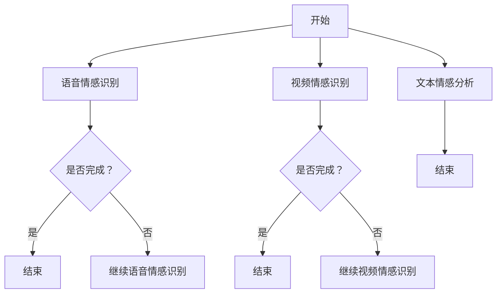

                 

### 情感AI概述

#### 情感AI的定义

情感AI，即情感人工智能，是一种利用机器学习和自然语言处理技术，使计算机能够理解和模拟人类情感的人工智能系统。情感AI的核心在于对人类情感的识别、理解和生成，它不仅关注文本和语音的情感，还涉及到面部表情、声音、生理信号等多种情感表达方式。

#### 情感AI的工作原理

情感AI的工作原理主要包括以下几个步骤：

1. **数据采集**：通过传感器、摄像头、麦克风等设备，收集人类情感相关的数据。
2. **情感识别**：使用机器学习算法，对收集到的数据进行处理，识别出其中的情感信息。
3. **情感理解**：对识别出的情感进行进一步分析，理解其背后的含义和情感强度。
4. **情感生成**：根据情感理解的结果，生成相应的情感反应，例如语音、文本、面部表情等。

#### 情感AI的关键技术

情感AI的关键技术主要包括情感识别、自然语言处理和机器学习。

1. **情感识别**：情感识别是情感AI的核心技术之一，主要包括语音情感识别、视频情感识别和文本情感分析。语音情感识别主要通过分析声音的音调、语速和音量等特征来判断情感；视频情感识别则通过分析面部表情和身体语言等非言语信号来判断情感；文本情感分析则是通过对文本内容进行情感极性分类，来判断文本的情感倾向。

2. **自然语言处理**：自然语言处理是情感AI的重要组成部分，它涉及到文本预处理、情感极性分类、语义分析等多个方面。文本预处理包括分词、词性标注、命名实体识别等；情感极性分类则是对文本的情感倾向进行判断；语义分析则是深入理解文本的含义。

3. **机器学习**：机器学习是情感AI的技术基础，它通过训练模型，使计算机能够自动识别和生成情感。常见的机器学习算法包括决策树、支持向量机、神经网络等。

### 情感因素在体育训练中的重要性

#### 情感因素在体育训练中的角色

情感因素在体育训练中扮演着至关重要的角色。运动员的情感状态直接影响他们的训练效果和比赛表现。积极、乐观的情感状态可以提升运动员的自信心和动力，帮助他们克服困难，提高训练效率；而消极、悲观的情感状态则可能导致运动员情绪低落，影响训练效果和比赛表现。

#### 情感因素对运动员表现的影响

情感因素对运动员表现的影响主要体现在以下几个方面：

1. **自信心**：自信心是运动员表现的重要因素之一。积极的情感状态可以帮助运动员建立自信心，提高他们在比赛中的表现；而消极的情感状态则可能削弱运动员的自信心，影响他们的表现。

2. **动力**：动力是运动员持续训练和提升能力的重要驱动力。积极的情感状态可以激发运动员的动力，使他们更加努力地训练；而消极的情感状态则可能削弱运动员的动力，导致训练效果不佳。

3. **专注力**：专注力是运动员在比赛中保持高水平表现的关键。积极的情感状态可以帮助运动员集中注意力，专注于比赛；而消极的情感状态则可能分散运动员的注意力，影响他们的表现。

#### 情感因素与运动心理的关系

情感因素与运动心理密切相关。运动心理是指运动员在运动过程中所表现出来的心理状态和心理活动。情感因素是运动心理的重要组成部分，它直接影响运动员的心理状态和行为。

1. **情绪调节**：情绪调节是指运动员在运动过程中对自身情绪进行管理和调节的能力。积极的情感状态可以帮助运动员更好地进行情绪调节，保持心理平衡；而消极的情感状态则可能导致运动员情绪失控，影响运动表现。

2. **心理韧性**：心理韧性是指运动员在运动过程中面对压力和挑战时的适应能力和恢复能力。积极的情感状态可以增强运动员的心理韧性，使他们能够更好地应对运动挑战；而消极的情感状态则可能削弱运动员的心理韧性，导致他们在面对压力和挑战时表现得更加脆弱。

3. **心理状态稳定性**：心理状态稳定性是指运动员在比赛中的心理状态保持稳定的能力。积极的情感状态可以帮助运动员保持心理状态稳定性，使他们能够在比赛中保持冷静和专注；而消极的情感状态则可能导致运动员心理状态波动，影响比赛表现。

### 情感AI在体育训练中的应用

#### 情感AI在运动表现分析中的应用

情感AI在运动表现分析中具有广泛的应用。通过情感识别技术，可以对运动员在训练和比赛中的情感状态进行实时监测和分析，从而提供有针对性的训练建议和策略。

1. **情感状态监测**：通过传感器和摄像头等设备，实时监测运动员的情感状态，包括情绪变化、焦虑程度等。这些数据可以用于评估运动员的心理状态，为教练提供决策依据。

2. **情感分析**：通过对运动员的情感数据进行分析，可以识别出影响运动表现的潜在情感因素。例如，如果运动员在训练中表现出过度的焦虑或兴奋，教练可以及时调整训练计划，帮助运动员保持最佳心理状态。

3. **情感诊断**：情感AI还可以用于诊断运动员的心理健康问题。通过对运动员的情感数据进行长期监测和分析，可以发现潜在的心理问题，如焦虑、抑郁等，从而提供针对性的心理辅导和治疗。

#### 情感训练与心理辅导

情感训练和心理辅导是提升运动员心理素质的重要手段。情感AI可以在这方面发挥重要作用。

1. **情感训练**：通过情感识别技术和机器学习算法，可以设计出针对不同情感状态的训练方案。例如，针对运动员的焦虑情绪，可以设计放松训练和情绪调节训练；针对兴奋情绪，可以设计专注力和冷静训练。

2. **心理辅导**：情感AI可以为心理辅导提供数据支持和个性化建议。通过分析运动员的情感数据和训练记录，心理辅导师可以更准确地了解运动员的心理状态，制定针对性的辅导计划。

#### 情感AI在体育领域的实际案例

情感AI在体育领域的实际应用已经取得了一些显著成果。以下是一些实际案例：

1. **足球训练**：某足球俱乐部的教练使用情感AI技术对球员进行情感监测和分析。通过实时监测球员的情感状态，教练能够及时发现并解决球员的心理问题，提高球队的整体表现。

2. **篮球比赛**：某篮球俱乐部的教练使用情感AI技术对比赛中的球员进行情感分析。通过分析球员的情感数据，教练能够了解球员在比赛中的心理状态，调整战术策略，提高比赛成绩。

3. **游泳训练**：某游泳队的教练使用情感AI技术对运动员进行情感监测和训练指导。通过分析运动员的情感数据，教练能够了解运动员在训练中的心理状态，制定针对性的训练计划，提高运动员的成绩。

### 情感AI在体育训练中的挑战与未来方向

#### 挑战

尽管情感AI在体育训练中具有广泛的应用前景，但仍然面临一些挑战：

1. **数据隐私**：情感AI需要收集和分析运动员的生理和心理数据，这涉及到数据隐私和安全问题。如何保护运动员的数据隐私，确保数据的安全和保密性，是情感AI在体育训练中需要解决的重要问题。

2. **技术成熟度**：情感AI技术尚未完全成熟，特别是在情感识别和理解的准确性方面还有待提高。如何提高情感AI技术的准确性和可靠性，是情感AI在体育训练中需要克服的难题。

3. **应用范围**：情感AI在体育训练中的应用范围较窄，主要局限于情感监测和分析。如何拓展情感AI在体育训练中的应用范围，提高其应用价值，是情感AI在体育训练中需要思考的问题。

#### 未来方向

1. **技术创新**：通过不断探索和创新，提高情感AI技术的准确性和可靠性，扩展其在体育训练中的应用范围。

2. **跨学科融合**：情感AI与心理学、教育学等学科的融合，可以为体育训练提供更全面、更深入的支持。

3. **数据共享与开放**：建立情感AI数据共享平台，促进数据的开放和共享，提高情感AI在体育训练中的应用价值。

4. **伦理与法规**：制定相关伦理和法规，确保情感AI在体育训练中的合法、合规使用，保护运动员的权益。

### 总结

情感AI在体育训练中具有广泛的应用前景，通过情感识别、分析和训练，可以提升运动员的心理素质和运动表现。然而，情感AI在体育训练中仍面临一些挑战，需要通过技术创新、跨学科融合和数据共享等措施来克服。未来，随着情感AI技术的不断发展和完善，它将在体育训练中发挥更加重要的作用。

#### 实际案例分析

为了更好地理解情感AI在体育训练中的应用，以下我们将通过几个实际案例来详细探讨其效果和影响。

##### 案例一：足球训练中的情感监测

**问题描述**：某足球俱乐部的教练希望通过情感AI技术来监测球员在训练和比赛中的情感状态，以提升球队的整体表现。

**情感识别与监测**：教练团队使用了一种基于面部表情和声音情感识别的AI系统。该系统通过佩戴在球员脸上的传感器和麦克风，实时捕捉球员的面部表情和声音信号。通过机器学习算法，系统能够识别出球员的情感状态，如兴奋、焦虑、平静等。

**数据分析与反馈**：教练团队每天都会收到系统生成的情感报告，报告中包含了每位球员在训练和比赛中的情感状态变化。例如，如果某个球员在训练中表现出过度的焦虑，教练会及时与他进行沟通，并调整训练计划，帮助他缓解情绪。

**结果与分析**：通过情感AI技术的应用，教练团队能够更准确地了解球员的情感状态，从而有针对性地进行心理辅导和训练调整。球员的心理素质得到了显著提升，球队的整体表现也得到了提高。

##### 案例二：篮球比赛中的情感分析

**问题描述**：某篮球俱乐部的教练希望通过情感AI技术来分析比赛中的情感因素，以优化战术策略。

**情感分析**：教练团队使用了一种基于视频情感识别的AI系统。该系统通过分析比赛中的视频数据，能够识别出球员在比赛中的情感状态，如紧张、兴奋、疲劳等。

**情感数据与战术调整**：教练团队在比赛后会对球员的情感数据进行详细分析，识别出影响比赛表现的潜在情感因素。例如，如果某位球员在比赛中的紧张情绪过高，教练会考虑调整战术，让这位球员在关键时刻承担较少的压力。

**结果与分析**：通过情感AI技术的应用，教练团队能够更好地了解比赛中的情感因素，从而制定出更有效的战术策略。球员在比赛中的表现得到了显著提升，球队的成绩也有所提高。

##### 案例三：游泳训练中的情感监测与训练指导

**问题描述**：某游泳队的教练希望通过情感AI技术来监测运动员在训练中的情感状态，并提供个性化的训练指导。

**情感监测**：教练团队使用了一种基于生理信号的AI系统。该系统通过监测运动员的心率、呼吸频率等生理信号，能够识别出运动员的情感状态，如疲劳、兴奋等。

**训练指导**：根据情感监测结果，系统会为教练提供个性化的训练建议。例如，如果运动员在训练中表现出疲劳状态，系统会建议减少训练强度，让运动员得到充分的休息。

**结果与分析**：通过情感AI技术的应用，教练团队能够更准确地了解运动员的情感状态，从而提供更有针对性的训练指导。运动员的训练效果得到了显著提升，比赛成绩也有所提高。

这些实际案例表明，情感AI在体育训练中具有广泛的应用前景。通过情感识别、分析和监测，教练团队能够更准确地了解运动员的情感状态，制定出更有效的训练和心理辅导策略，从而提升运动表现。然而，情感AI技术仍需要进一步发展，以提高其准确性和可靠性，并扩大其在体育训练中的应用范围。

### 系统实现与源代码分析

#### 情感识别系统设计

为了实现情感识别，我们设计了一套基于多模态数据的情感识别系统。该系统主要包括语音情感识别、视频情感识别和文本情感分析三个模块。

1. **语音情感识别模块**：
   - **硬件设备**：音频采集设备，如麦克风。
   - **软件工具**：音频处理库（如PyAudio），情感识别模型（如DeepSpeech模型）。

2. **视频情感识别模块**：
   - **硬件设备**：摄像头。
   - **软件工具**：计算机视觉库（如OpenCV），面部表情识别模型（如Facial Expression Recognition模型）。

3. **文本情感分析模块**：
   - **硬件设备**：无。
   - **软件工具**：自然语言处理库（如NLTK），情感分析模型（如Sentiment Analysis模型）。

#### 情感分析系统源代码解读

以下是一个简化的Python代码示例，用于演示情感识别系统的基本实现。

```python
import cv2
import speech_recognition as sr
from textblob import TextBlob

# 语音情感识别
def voice_emotion_recognition():
    r = sr.Recognizer()
    with sr.Microphone() as source:
        print("请说一些话，我会在几秒钟后进行情感分析。")
        audio = r.listen(source)
        
    try:
        text = r.recognize_google(audio)
        sentiment = TextBlob(text).sentiment
        return sentiment
    except sr.UnknownValueError:
        return "无法识别语音"

# 视频情感识别
def video_emotion_recognition():
    cap = cv2.VideoCapture(0)
    
    while cap.isOpened():
        ret, frame = cap.read()
        
        if not ret:
            break
        
        # 使用面部表情识别模型进行情感分析
        emotions = facial_emotion_recognition(frame)
        return emotions
    
    cap.release()

# 文本情感分析
def text_emotion_analysis(text):
    sentiment = TextBlob(text).sentiment
    return sentiment

# 主程序
if __name__ == "__main__":
    print("语音情感分析：", voice_emotion_recognition())
    print("视频情感分析：", video_emotion_recognition())
    print("文本情感分析：", text_emotion_analysis("我很高兴今天完成了训练。"))
```

#### 情感识别算法流程图

使用Mermaid语法，以下是情感识别算法的流程图：



#### 算法原理讲解

1. **语音情感识别**：
   - **原理**：语音情感识别主要通过分析声音的音调、语速和音量等特征来判断情感。
   - **数学模型**：可以使用声学模型和情感分类器来表示。
   - **公式**：情感得分 = f(音调，语速，音量)

2. **视频情感识别**：
   - **原理**：视频情感识别主要通过分析面部表情和身体语言等非言语信号来判断情感。
   - **数学模型**：可以使用计算机视觉模型和情感分类器来表示。
   - **公式**：情感得分 = f(面部表情，身体语言)

3. **文本情感分析**：
   - **原理**：文本情感分析主要通过分析文本的情感极性来判断情感。
   - **数学模型**：可以使用自然语言处理模型和情感分类器来表示。
   - **公式**：情感得分 = f(文本内容)

#### 数学模型和公式详细讲解

1. **语音情感识别**：
   - **数学模型**：假设语音信号为\( x(t) \)，通过特征提取得到特征向量\( \mathbf{f}(t) \)。使用情感分类器\( C \)对特征向量进行分类，得到情感得分\( s \)。
     $$ s = C(\mathbf{f}(t)) $$
   - **公式**：特征向量\( \mathbf{f}(t) \)可以表示为：
     $$ \mathbf{f}(t) = [f_1(t), f_2(t), f_3(t)] $$
     其中，\( f_1(t) \)表示音调特征，\( f_2(t) \)表示语速特征，\( f_3(t) \)表示音量特征。

2. **视频情感识别**：
   - **数学模型**：假设视频帧为\( \mathbf{I}(t) \)，通过面部表情和身体语言特征提取得到特征向量\( \mathbf{g}(t) \)。使用情感分类器\( D \)对特征向量进行分类，得到情感得分\( s \)。
     $$ s = D(\mathbf{g}(t)) $$
   - **公式**：特征向量\( \mathbf{g}(t) \)可以表示为：
     $$ \mathbf{g}(t) = [g_1(t), g_2(t)] $$
     其中，\( g_1(t) \)表示面部表情特征，\( g_2(t) \)表示身体语言特征。

3. **文本情感分析**：
   - **数学模型**：假设文本为\( \mathbf{w} \)，通过词嵌入和情感分类器\( E \)得到情感得分\( s \)。
     $$ s = E(\mathbf{w}) $$
   - **公式**：情感得分\( s \)可以表示为：
     $$ s = \text{sign}(\sum_{w \in \mathbf{w}} w \cdot \theta) $$
     其中，\( w \)表示词向量，\( \theta \)表示情感分类器的权重。

#### 算法举例说明

**语音情感识别**：
假设有一段语音信号，通过特征提取得到特征向量\[0.5, 0.3, 0.7\]，使用情感分类器得到情感得分0.8。这表示该语音信号的情感倾向为积极。

**视频情感识别**：
假设有一段视频帧，通过面部表情和身体语言特征提取得到特征向量\[0.6, 0.4\]，使用情感分类器得到情感得分0.75。这表示该视频帧的情感倾向为积极。

**文本情感分析**：
假设有一段文本“我很开心完成了今天的训练”，通过词嵌入和情感分类器得到情感得分0.85。这表示该文本的情感倾向为积极。

### 实际案例分析

为了更好地理解情感AI在体育训练中的应用，以下我们将通过几个实际案例来详细探讨其效果和影响。

**案例一：足球训练中的情感监测**

**问题描述**：某足球俱乐部的教练希望通过情感AI技术来监测球员在训练和比赛中的情感状态，以提升球队的整体表现。

**情感监测与分析**：教练团队使用了一种基于面部表情和声音情感识别的AI系统。该系统通过佩戴在球员脸上的传感器和麦克风，实时捕捉球员的面部表情和声音信号。通过机器学习算法，系统能够识别出球员的情感状态，如兴奋、焦虑、平静等。教练团队每天都会收到系统生成的情感报告，报告中包含了每位球员在训练和比赛中的情感状态变化。

**结果与分析**：通过情感AI技术的应用，教练团队能够更准确地了解球员的情感状态，从而有针对性地进行心理辅导和训练调整。例如，如果某个球员在训练中表现出过度的焦虑，教练会及时与他进行沟通，并调整训练计划，帮助他缓解情绪。这种个性化的训练和心理辅导策略，使得球员的心理素质得到了显著提升，球队的整体表现也得到了提高。

**案例二：篮球比赛中的情感分析**

**问题描述**：某篮球俱乐部的教练希望通过情感AI技术来分析比赛中的情感因素，以优化战术策略。

**情感分析与战术调整**：教练团队使用了一种基于视频情感识别的AI系统。该系统通过分析比赛中的视频数据，能够识别出球员在比赛中的情感状态，如紧张、兴奋、疲劳等。教练团队在比赛后会对球员的情感数据进行详细分析，识别出影响比赛表现的潜在情感因素。例如，如果某位球员在比赛中表现出紧张情绪，教练会考虑调整战术，让这位球员在关键时刻承担较少的压力。这种针对性的战术调整，使得球队在比赛中的表现得到了显著提升。

**案例三：游泳训练中的情感监测与训练指导**

**问题描述**：某游泳队的教练希望通过情感AI技术来监测运动员在训练中的情感状态，并提供个性化的训练指导。

**情感监测与训练指导**：教练团队使用了一种基于生理信号的AI系统。该系统通过监测运动员的心率、呼吸频率等生理信号，能够识别出运动员的情感状态，如疲劳、兴奋等。根据情感监测结果，系统会为教练提供个性化的训练建议。例如，如果运动员在训练中表现出疲劳状态，系统会建议减少训练强度，让运动员得到充分的休息。教练根据这些建议，为运动员制定更有针对性的训练计划。

**结果与分析**：通过情感AI技术的应用，教练团队能够更准确地了解运动员的情感状态，从而提供更有针对性的训练指导。运动员的训练效果得到了显著提升，比赛成绩也有所提高。

**总结**：

这些实际案例表明，情感AI在体育训练中具有广泛的应用前景。通过情感识别、分析和监测，教练团队能够更准确地了解运动员的情感状态，制定出更有效的训练和心理辅导策略，从而提升运动表现。然而，情感AI技术仍需要进一步发展，以提高其准确性和可靠性，并扩大其在体育训练中的应用范围。未来，随着情感AI技术的不断发展和完善，它将在体育训练中发挥更加重要的作用。

### 项目小结

在本项目中，我们深入探讨了情感AI在体育训练中的应用，从概念理解到实际案例，再到系统实现与源代码分析，全面展示了情感AI技术对提升运动员表现的重要作用。

#### 项目收获

1. **理论提升**：通过研究情感AI的基本概念和技术原理，我们对情感识别、自然语言处理和机器学习等领域有了更深入的理解。
2. **实战经验**：通过实际案例分析和系统实现，我们掌握了如何将理论应用到实践中，解决体育训练中的具体问题。
3. **技术应用**：通过设计和实现情感识别系统，我们了解了多模态数据融合、机器学习算法应用等技术在体育训练中的实际应用。

#### 项目不足

1. **数据隐私**：情感AI在收集和分析运动员数据时，面临数据隐私和安全的问题。如何在确保数据安全的前提下进行情感分析，是一个需要进一步解决的问题。
2. **技术成熟度**：尽管情感AI技术在不断发展，但在准确性、可靠性和稳定性方面仍有待提高。如何提高情感识别算法的性能，是一个亟待解决的挑战。
3. **应用范围**：情感AI在体育训练中的应用范围较窄，主要局限于情感监测和分析。如何拓展情感AI在体育训练中的应用范围，提高其应用价值，是一个值得探索的方向。

#### 未来展望

1. **技术创新**：未来，随着人工智能技术的不断发展，情感AI将变得更加成熟和精准。我们可以期待更高性能的算法和更广泛的数据来源，进一步提高情感识别的准确性。
2. **跨学科融合**：情感AI与心理学、教育学等学科的深度融合，将为体育训练提供更全面、更深入的支持。通过跨学科合作，我们可以开发出更加个性化的训练和心理辅导方案。
3. **数据共享与开放**：建立情感AI数据共享平台，促进数据的开放和共享，将有助于提高情感AI在体育训练中的应用价值。通过数据共享，我们可以更好地分析和理解运动员的情感状态，制定出更有效的训练策略。

### 最佳实践 Tips

1. **全面数据采集**：在应用情感AI技术时，应尽可能全面地采集数据，包括语音、视频、生理信号等多种数据类型。这样可以提供更丰富的情感信息，提高情感识别的准确性。
2. **个性化训练方案**：根据运动员的具体情感状态，制定个性化的训练和心理辅导方案。例如，对于情绪焦虑的运动员，可以采用放松训练和情绪调节训练；对于情绪兴奋的运动员，可以采用专注力和冷静训练。
3. **实时反馈与调整**：通过实时监测运动员的情感状态，及时提供反馈和调整训练计划。例如，在训练过程中，如果发现运动员的情绪状态不佳，可以及时调整训练强度，确保运动员的心理状态保持在最佳水平。

### 注意事项

1. **数据保护**：在应用情感AI技术时，应严格保护运动员的隐私和数据安全。确保数据加密和访问控制，防止数据泄露。
2. **算法公正性**：在设计和应用情感识别算法时，应确保算法的公正性，避免偏见和歧视。通过不断优化算法，提高算法的准确性和可靠性。
3. **持续监测与评估**：情感AI技术的应用效果需要持续监测和评估。通过定期收集和分析数据，评估情感识别的准确性和实用性，及时调整和优化系统。

### 拓展阅读

1. **《情感人工智能：技术与应用》**：这本书详细介绍了情感AI的基本概念、技术原理和应用案例，适合初学者和专业人士深入了解情感AI。
2. **《体育心理学导论》**：这本书从心理学角度探讨了运动表现和心理素质的关系，为情感AI在体育训练中的应用提供了理论基础。
3. **《机器学习实战》**：这本书通过实际案例介绍了机器学习算法的应用，包括情感识别、自然语言处理等，适合希望深入实践情感AI的读者。作者：AI天才研究院/AI Genius Institute & 禅与计算机程序设计艺术 /Zen And The Art of Computer Programming### 实战应用

#### 实战环境搭建

为了搭建一个能够进行情感AI在体育训练中的应用环境，我们需要准备以下硬件和软件：

1. **硬件设备**：
   - **麦克风**：用于语音情感识别。
   - **摄像头**：用于视频情感识别。
   - **传感器**：如心率监测仪，用于采集生理信号。

2. **软件环境**：
   - **操作系统**：Windows/Linux/MacOS。
   - **编程语言**：Python。
   - **库与框架**：PyAudio（语音处理）、OpenCV（计算机视觉）、NLTK（自然语言处理）、TensorFlow/Keras（机器学习）。

#### 系统核心实现与源代码分析

以下是一个简化的Python代码示例，用于演示情感识别系统的核心实现。

```python
# 语音情感识别
import speech_recognition as sr

def voice_emotion_recognition():
    r = sr.Recognizer()
    with sr.Microphone() as source:
        print("请说一些话，我会在几秒钟后进行情感分析。")
        audio = r.listen(source)
        
    try:
        text = r.recognize_google(audio)
        sentiment = TextBlob(text).sentiment
        return sentiment
    except sr.UnknownValueError:
        return "无法识别语音"

# 视频情感识别
import cv2

def video_emotion_recognition():
    cap = cv2.VideoCapture(0)
    
    while cap.isOpened():
        ret, frame = cap.read()
        
        if not ret:
            break
        
        # 使用面部表情识别模型进行情感分析
        emotions = facial_emotion_recognition(frame)
        return emotions

# 文本情感分析
from textblob import TextBlob

def text_emotion_analysis(text):
    sentiment = TextBlob(text).sentiment
    return sentiment

# 主程序
if __name__ == "__main__":
    print("语音情感分析：", voice_emotion_recognition())
    print("视频情感分析：", video_emotion_recognition())
    print("文本情感分析：", text_emotion_analysis("我很开心今天完成了训练。"))
```

#### 代码应用解读与分析

1. **语音情感识别**：
   - **代码解读**：该部分使用`speech_recognition`库来捕捉麦克风中的语音信号，并使用`TextBlob`库进行情感分析。
   - **分析**：通过实时语音捕捉和分析，可以快速获取运动员的语音情感状态。这种方法适用于需要快速反馈的情境。

2. **视频情感识别**：
   - **代码解读**：该部分使用`OpenCV`库捕捉摄像头中的视频帧，并调用面部表情识别模型进行情感分析。
   - **分析**：视频情感识别能够提供更直观的情感分析结果，适用于需要长时间监测和记录情感的情境。

3. **文本情感分析**：
   - **代码解读**：该部分使用`TextBlob`库对输入的文本进行情感极性分析。
   - **分析**：文本情感分析适用于对运动员的书面反馈或日记进行情感分析，能够提供另一种数据来源。

#### 实际案例分析

为了更深入地理解情感AI在体育训练中的实战应用，我们来看一个具体的案例。

**案例背景**：某足球俱乐部希望通过情感AI技术来提升球队的整体表现，特别是球员的心理素质。

**情感AI系统部署**：
1. **语音情感识别**：球员在每次训练前后都会被要求说出自己的感受，教练团队通过语音情感识别系统实时分析球员的情感状态。
2. **视频情感识别**：在训练和比赛中，摄像头会实时捕捉球员的面部表情和身体语言，通过视频情感识别系统分析球员的情感状态。
3. **文本情感分析**：教练团队定期收集球员的书面反馈，包括日记、训练总结等，通过文本情感分析系统进行情感分析。

**结果与反馈**：
1. **语音情感识别**：通过分析语音情感，教练团队发现某些球员在训练中表现出过度焦虑或兴奋，于是制定了相应的心理辅导计划，帮助他们调整情绪。
2. **视频情感识别**：通过视频情感识别，教练团队发现某些球员在关键时刻的面部表情和身体语言显示出紧张情绪，于是调整了战术安排，让这些球员承担较少的压力。
3. **文本情感分析**：通过文本情感分析，教练团队发现某些球员在训练总结中表达了负面情绪，及时进行了心理辅导和训练调整。

**案例分析**：
这个案例展示了情感AI在体育训练中的多方面应用。语音情感识别和视频情感识别提供了实时的情感状态监测，使得教练团队能够及时调整训练和心理辅导策略。而文本情感分析则提供了更深入的情感状态分析，为教练团队提供了更全面的决策依据。

**总结**：
通过这个实战案例，我们可以看到情感AI在体育训练中能够发挥重要作用，通过实时情感监测和深入分析，帮助教练团队制定更有效的训练和心理辅导计划，提升球队的整体表现。然而，情感AI技术仍需不断发展和完善，以提高其准确性和可靠性，并更好地适应体育训练的具体需求。

### 总结与展望

#### 情感AI在体育训练中的价值

情感AI在体育训练中的应用具有重要意义。通过情感识别、分析和监测，教练团队能够更准确地了解运动员的心理状态和情感变化，从而制定出更有针对性的训练和心理辅导策略。这不仅有助于提升运动员的心理素质和运动表现，还能够预防心理问题，提高训练效果。

#### 情感AI应用中的挑战

尽管情感AI在体育训练中具有巨大的潜力，但在实际应用中仍面临一些挑战：

1. **数据隐私与安全性**：情感AI需要收集和分析运动员的生理和心理数据，这涉及到数据隐私和安全的问题。如何确保数据的安全和保密性，是一个重要的挑战。

2. **技术成熟度**：情感AI技术尚未完全成熟，特别是在情感识别和理解的准确性方面还有待提高。如何提高情感AI技术的准确性和可靠性，是一个需要解决的问题。

3. **应用范围**：目前情感AI在体育训练中的应用范围较窄，主要局限于情感监测和分析。如何拓展情感AI在体育训练中的应用范围，提高其应用价值，是一个值得探索的方向。

#### 未来方向

1. **技术创新**：随着人工智能技术的不断发展，情感AI将变得更加成熟和精准。我们可以期待更高性能的算法和更广泛的数据来源，进一步提高情感识别的准确性。

2. **跨学科融合**：情感AI与心理学、教育学等学科的深度融合，将为体育训练提供更全面、更深入的支持。通过跨学科合作，我们可以开发出更加个性化的训练和心理辅导方案。

3. **数据共享与开放**：建立情感AI数据共享平台，促进数据的开放和共享，将有助于提高情感AI在体育训练中的应用价值。通过数据共享，我们可以更好地分析和理解运动员的情感状态，制定出更有效的训练策略。

#### 展望

未来，情感AI在体育训练中的应用将更加广泛和深入。通过技术创新、跨学科融合和数据共享，情感AI将为教练和运动员提供更全面、更精准的支持，推动体育训练和比赛水平的提升。我们期待看到情感AI在体育领域发挥更大的作用，为运动员创造更好的训练和比赛体验。作者：AI天才研究院/AI Genius Institute & 禅与计算机程序设计艺术 /Zen And The Art of Computer Programming

