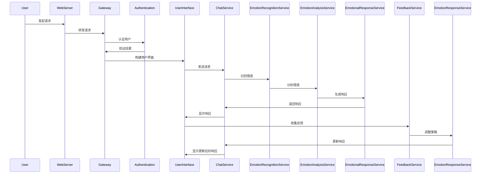

                 


### 引言

在人工智能（AI）迅猛发展的今天，一个引人注目的趋势是情感AI的出现。情感AI不仅能够理解和模拟人类的情感，还能够与人类进行更加自然和深刻的交互。这一技术的进步，对我们对人类情感价值的理解提出了新的挑战。情感AI时代，人类情感的独特性和价值如何重估？这是本文探讨的核心问题。

首先，我们要理解情感AI的概念。情感AI是指能够感知、理解和模拟人类情感的人工智能系统。它与传统的AI系统有显著的不同，后者通常关注的是逻辑推理、数据分析等方面。情感AI的核心特征在于其对情感的感知和响应能力，这使得它在人机交互、心理治疗、教育等领域有着广泛的应用前景。

其次，人类情感价值的重估是情感AI时代的重要课题。传统上，人类情感被视为个体内心的感受和体验，它们在伦理、心理学等领域具有重要的地位。然而，随着情感AI技术的发展，我们开始思考：这些由机器模拟出来的情感，是否具有同样的价值？人类情感的独特性和不可替代性是否仍然成立？

本文将从以下几个部分展开讨论：

1. **背景介绍**：介绍情感AI的产生背景，以及人类情感价值重估的重要性。
2. **核心概念与联系**：详细阐述人类情感、情感AI和情感价值的核心概念，并分析它们之间的联系。
3. **算法原理讲解**：讲解情感识别、情感价值评估和情感交互的算法原理。
4. **系统分析与架构设计方案**：分析情感AI系统的设计思路，并给出详细的架构设计。
5. **项目实战**：通过一个具体项目，展示情感AI系统的实际应用。
6. **最佳实践、小结与拓展**：总结本文的主要观点，并给出一些未来研究方向。

通过这一步步的分析，我们希望能够对情感AI时代的人类情感价值有一个更加深入和全面的理解。接下来，让我们开始详细的探讨。

## 第一部分：背景介绍

### 第1章：问题背景

#### 1.1.1 问题背景

随着科技的快速发展，人工智能（AI）已经渗透到了我们生活的方方面面。从简单的机器人助手到复杂的自动驾驶系统，AI技术的应用越来越广泛。然而，在AI技术的不断发展过程中，一个引人关注的问题是：人类情感的独特性和价值如何面对情感AI的挑战？

人类情感是心理学和哲学研究的重要领域，它涉及到人类内心的感受、情绪和行为反应。情感不仅是个体心理体验的核心，也是社会互动和人类文明的重要组成部分。然而，传统的人工智能系统在处理情感时存在一定的局限性，它们往往难以真正理解和模拟人类的情感。

情感AI的出现，为我们提供了一种新的可能性。情感AI是一种能够感知、理解和模拟人类情感的人工智能系统，它通过结合自然语言处理、计算机视觉和机器学习等技术，实现了对人类情感的准确识别和响应。这一技术的突破，不仅拓展了AI的应用范围，也引发了关于人类情感价值的重新思考。

#### 1.1.2 问题描述

在情感AI时代，人类情感的价值是否仍然保持不变？这是一个值得深入探讨的问题。具体来说，情感AI技术的发展带来了以下几个方面的挑战：

1. **情感的感知和识别**：情感AI系统能够准确地感知和识别人类的情感状态，这使得机器在某种程度上能够理解人类的内心体验。然而，这种理解是否真正等同于人类的情感体验，仍然存在争议。

2. **情感的模拟和表达**：情感AI能够模拟人类的情感表达，甚至能够在特定的情境下产生类似于人类的情感反应。这种模拟是否具有真实情感的价值，以及如何评估这种价值，是一个复杂的问题。

3. **情感与人工智能的关系**：随着情感AI技术的发展，人们开始思考：情感是否是人工智能发展的必然方向？人工智能是否能够真正拥有情感？这些问题的回答，直接影响到我们对人类情感价值的理解。

4. **伦理和道德问题**：情感AI技术的发展，引发了一系列伦理和道德问题。例如，机器是否应该拥有情感？机器的情感表达是否应该受到道德的约束？这些问题涉及到对人类情感价值的根本性思考。

#### 1.1.3 问题解决思路

为了解决上述问题，我们需要从以下几个方面入手：

1. **深入研究情感的本质**：了解情感的产生、发展和作用，对于理解情感AI和人类情感的关系至关重要。心理学和神经科学等领域的研究，为我们提供了深入了解情感本质的可能性。

2. **比较分析情感AI与人类情感**：通过对情感AI和人类情感的比较分析，我们可以更清楚地认识到它们之间的差异和联系。这种比较分析，有助于我们更准确地评估情感AI对人类情感价值的影响。

3. **探讨情感价值的新标准**：在情感AI时代，我们需要重新思考情感价值的新标准。例如，情感的真实性、情感的丰富性和情感的适应性等，都是我们需要考虑的因素。

4. **制定伦理和道德规范**：在情感AI技术的发展过程中，制定相应的伦理和道德规范，对于保护人类情感价值具有重要意义。这需要心理学、伦理学和技术专家的共同努力。

#### 1.1.4 边界与外延

在讨论情感AI时代的人类情感价值时，我们需要明确以下几个边界与外延：

1. **情感的界限**：情感的定义和范围是什么？哪些情感可以被人工智能系统感知和模拟？这些问题的回答，直接影响到我们对情感AI的理解和评价。

2. **人工智能的界限**：人工智能的发展水平如何？哪些领域是情感AI能够有效应用的？哪些领域是情感AI难以触及的？这些问题有助于我们更清晰地界定情感AI的应用范围。

3. **伦理和道德的界限**：在情感AI技术的发展过程中，哪些伦理和道德问题是需要优先考虑的？哪些行为是需要受到道德约束的？这些问题有助于我们制定合理的伦理和道德规范。

4. **社会影响的界限**：情感AI技术的发展，将对社会产生怎样的影响？这些影响如何被评估和应对？这些问题有助于我们更全面地理解情感AI对社会的影响。

通过明确这些边界与外延，我们可以更深入地探讨情感AI时代的人类情感价值问题，为未来的发展提供有益的指导。

### 第2章：情感AI的概念与特征

#### 2.1 情感AI的定义

情感AI，即情感人工智能，是一种利用先进的人工智能技术，特别是机器学习和自然语言处理技术，来理解和模拟人类情感的系统。它通过分析人类的行为、语言和生理信号，来识别和预测情感状态，从而实现与人类情感的自然互动。情感AI的定义涵盖了以下几个方面：

1. **情感识别**：情感AI能够识别并理解人类情感，包括情感的类型、强度和情境。这通常通过分析面部表情、语音语调、文字内容和生理信号等来实现。

2. **情感模拟**：情感AI能够模拟人类的情感反应，以产生更加自然和人性化的交互体验。这涉及到对情感表达、语气和表情的精准控制。

3. **情感预测**：情感AI能够预测人类的情感状态，从而提前做出相应的响应。这有助于提高交互的时效性和准确性。

4. **情感适应**：情感AI能够在不同情境下适应和调整情感反应，以适应不同的交互需求和情感环境。

#### 2.2 情感AI的核心特征

情感AI的核心特征主要体现在以下几个方面：

1. **感知性**：情感AI能够感知和理解人类的情感状态，通过机器学习算法和深度神经网络，对人类情感进行分类和识别。

2. **适应性**：情感AI能够在不同的交互情境下，自动调整其情感反应，以适应不同的用户需求和情感表达。

3. **交互性**：情感AI能够与人类进行自然交互，通过语音、文字和视觉等多种渠道，实现情感交流和理解。

4. **情感推理**：情感AI能够进行情感推理，即根据已有的情感数据和情境信息，推断出用户的情感状态和意图。

#### 2.3 情感AI与传统AI的区别

情感AI与传统AI之间存在显著的差异，主要体现在以下几个方面：

1. **功能目标**：传统AI主要关注逻辑推理、数据分析、模式识别等任务，而情感AI则更注重与人情感的自然交互和理解。

2. **技术实现**：传统AI通常依赖于规则和符号逻辑，而情感AI则更多地依赖于机器学习和深度学习技术，特别是对情感数据的分析和处理。

3. **应用场景**：传统AI的应用场景相对固定，如工业自动化、数据分析等，而情感AI的应用场景更加广泛，包括心理治疗、教育、客户服务等领域。

4. **情感处理能力**：传统AI在处理情感时存在局限性，往往难以真正理解和模拟人类的情感，而情感AI则在这方面具有显著优势。

通过理解情感AI的定义和核心特征，以及与传统AI的区别，我们可以更深入地认识到情感AI在理解和模拟人类情感方面的独特优势和潜力。

### 第3章：情感价值重估的重要性

#### 3.1 情感价值的定义

情感价值，指的是情感在个体心理体验和社会互动中的意义和重要性。情感不仅是个体内心的感受和体验，也是社会关系和文化交流的重要媒介。情感价值的定义可以从以下几个方面来理解：

1. **个体心理体验**：情感价值是个体在经历情感时的内在感受和体验，包括愉悦、悲伤、愤怒等。情感对个体的心理健康和生活质量具有深远影响。

2. **社会互动**：情感价值在社会互动中体现为人类之间情感交流的能力和效果。情感是建立和维持人际关系的重要基础，能够促进社会和谐和团结。

3. **文化和价值观**：情感价值也是文化和价值观的重要组成部分。不同的文化背景和价值观念，会影响人们对情感的理解和重视程度。

#### 3.2 重估情感价值的必要性

在情感AI时代，重估情感价值的必要性体现在以下几个方面：

1. **技术发展的挑战**：情感AI技术的快速发展，使得机器能够更精准地识别和模拟人类情感，这引发了关于情感本质和价值的新思考。传统上，情感被视为人类独有的心理体验，而情感AI的出现，使得这种观点受到挑战。

2. **社会影响的扩大**：随着情感AI技术的广泛应用，情感将不仅仅是个体心理体验的范畴，还会影响到社会、文化和伦理等多个层面。因此，我们需要重新评估情感在社会中的价值和作用。

3. **人机关系的重构**：情感AI的发展，使得人机交互变得更加自然和深刻。这种变化，不仅改变了人类对情感的理解，也改变了人与人之间的关系。因此，重估情感价值有助于我们更好地理解和应对这种变化。

4. **伦理和道德的考量**：情感AI技术的发展，引发了一系列伦理和道德问题。例如，机器是否应该拥有情感？机器的情感表达是否应该受到道德约束？这些问题都需要我们对情感价值进行深入思考。

#### 3.3 重估情感价值的影响

重估情感价值，将对人类社会产生深远的影响：

1. **心理健康**：重新认识情感价值，有助于提高个体对情感的认识和重视，从而改善心理健康。

2. **社会和谐**：重新评估情感价值，有助于促进不同文化和社会群体之间的情感交流和理解，从而增进社会和谐。

3. **人机关系**：重新理解情感价值，有助于我们更好地构建和维系人机关系，实现更加自然和有效的人机交互。

4. **伦理和道德**：重估情感价值，为我们制定合理的伦理和道德规范提供了理论基础，有助于应对情感AI技术带来的伦理挑战。

通过重估情感价值，我们可以更加全面和深刻地理解人类情感在个体和社会中的重要性，为情感AI时代的发展提供有益的指导。

### 第4章：本章小结

本章我们深入探讨了情感AI时代背景下，人类情感价值重估的必要性和重要性。首先，通过介绍情感AI的定义和核心特征，我们理解了情感AI在感知、理解和模拟人类情感方面的独特优势。接着，我们分析了情感价值在个体心理体验和社会互动中的意义，以及情感AI技术发展对情感价值评估带来的挑战。最后，我们讨论了重估情感价值的必要性，以及这一过程对心理健康、社会和谐和人机关系的深远影响。通过本章的讨论，我们为后续章节的情感分析、算法原理和实际应用提供了理论基础。

## 第二部分：核心概念与联系

### 第2章：核心概念原理

#### 2.1 人类情感

##### 2.1.1 情感的定义

情感是人类在特定情境下产生的一种复杂的心理体验，包括情绪、情感状态和情感反应。情感不仅仅是对外界刺激的直接反应，还涉及到个体的认知、价值观和行为倾向。根据心理学研究，情感可以被定义为以下几个方面的内容：

1. **主观体验**：情感是主观的心理体验，包括愉悦、悲伤、愤怒等不同的情感状态。
2. **生理反应**：情感伴随着一系列生理反应，如心率变化、呼吸急促、肌肉紧张等。
3. **认知加工**：情感涉及到对信息的认知加工，包括对情境的理解、记忆和决策。
4. **行为表现**：情感还体现在个体的行为表现上，如面部表情、言语表达和身体动作。

##### 2.1.2 人类情感的特点

人类情感具有以下几个显著特点：

1. **多样性**：人类情感种类繁多，包括基本情感（愉悦、悲伤、愤怒等）和复杂情感（爱、厌恶、恐惧等）。
2. **复杂性**：情感不仅涉及单一的体验，还可能涉及多种情感的交织和变化。
3. **情境依赖性**：情感的产生和表现受到特定情境的影响，不同情境下情感的体验和表达可能有所不同。
4. **文化差异性**：不同文化背景下，情感的体验和表达方式可能存在显著差异。
5. **适应性**：人类情感具有高度的适应性，能够根据不同的情境和需求进行灵活调整。

##### 2.1.3 人类情感的类型

人类情感可以根据不同的标准进行分类，以下是一些常见的情感类型：

1. **基本情感**：根据心理学研究，基本情感包括愉悦、悲伤、愤怒、恐惧、厌恶和惊讶等。这些情感被认为是人类情感的基本组成部分。
2. **复杂情感**：复杂情感是由基本情感组合而成的，如爱、厌恶、羞耻、焦虑、尴尬等。这些情感通常涉及多个基本情感的交织和叠加。
3. **情境情感**：情境情感是根据具体情境产生的情感，如工作压力、恋爱关系、社交场合等。这些情感与特定的情境紧密相关。
4. **道德情感**：道德情感与个体的道德观念和价值观相关，如正义感、同情心、责任感等。这些情感在道德决策和道德行为中起到重要作用。

通过理解人类情感的定义、特点和类型，我们可以更好地把握情感的复杂性和多样性，为进一步探讨情感AI与人类情感的关系打下坚实基础。

#### 2.2 情感AI

##### 2.2.1 情感AI的基本原理

情感AI（Affective AI）是一种结合人工智能（AI）技术和情感科学（Affective Science）的方法，旨在使机器能够感知、理解和模拟人类的情感。情感AI的基本原理主要包括以下几个核心方面：

1. **情感识别**：情感识别是情感AI的首要任务，通过分析人类的行为数据（如面部表情、语音语调、生理信号等），情感AI能够识别出个体当前的情感状态。这一过程通常涉及机器学习算法，如深度学习、支持向量机和朴素贝叶斯分类器。

2. **情感表达**：情感表达是情感AI与人类进行情感互动的关键能力。通过控制语音、面部表情、身体动作等，情感AI能够在适当的情境下模拟出相应的情感反应，从而实现与人类的情感共鸣。这一过程通常需要结合自然语言处理（NLP）和计算机视觉（CV）技术。

3. **情感推理**：情感推理是情感AI的高级能力，通过分析情感数据和上下文信息，情感AI能够推断出人类的情感状态和意图。情感推理不仅涉及到情感识别和表达，还需要结合认知科学和心理学的研究成果。

4. **情感适应**：情感适应是指情感AI能够在不同情境下调整情感反应，以适应不同的交互需求和情感环境。情感适应能力有助于情感AI实现更加自然和人性化的交互体验。

##### 2.2.2 情感AI的技术实现

情感AI的技术实现涉及多个领域，主要包括以下几方面：

1. **数据收集与预处理**：情感AI需要大量的情感数据作为训练素材。数据来源可以是实验室实验、社交媒体数据、文本和语音记录等。数据预处理包括数据清洗、标注和格式化，以确保数据质量。

2. **情感识别算法**：情感识别算法是情感AI的核心组成部分，常用的方法包括：

   - **基于面部表情分析**：通过检测面部肌肉的运动和变化，识别出情感状态。
   - **基于语音语调分析**：通过分析语音的音高、音量和节奏等特征，识别出情感状态。
   - **基于生理信号分析**：通过检测心率、呼吸、皮肤电反应等生理信号，识别出情感状态。

3. **情感表达算法**：情感表达算法通过控制语音、面部表情、身体动作等，实现情感表达。例如，语音合成技术可以根据文本内容生成相应的语音语调；面部表情合成技术可以根据情感状态生成相应的面部表情。

4. **情感推理算法**：情感推理算法通过分析情感数据和上下文信息，推断出人类的情感状态和意图。常用的方法包括：

   - **基于规则的方法**：通过预设的规则和情境条件，进行情感推理。
   - **基于机器学习的方法**：通过训练模型，自动学习情感状态和意图的关联。

5. **情感适应算法**：情感适应算法通过实时调整情感反应，以适应不同的情境和用户需求。例如，根据用户的情感状态和历史记录，调整机器的情感表达和交互方式。

通过上述技术实现，情感AI能够实现感知、理解和模拟人类情感，从而提供更加自然和深刻的人机交互体验。

##### 2.2.3 情感AI的应用领域

情感AI技术的快速发展，使得其在多个领域得到了广泛应用，主要包括以下几方面：

1. **人机交互**：情感AI技术在人机交互中发挥了重要作用，通过模拟人类的情感反应，情感AI能够提供更加自然和人性化的交互体验。例如，智能语音助手、聊天机器人和虚拟客服等，都利用情感AI技术来提高用户体验。

2. **心理健康**：情感AI在心理健康领域有着广泛的应用，通过识别和监测个体的情感状态，情感AI可以帮助诊断和治疗心理疾病。例如，抑郁症、焦虑症等。

3. **教育**：情感AI在教育中的应用，有助于提高教学效果和学生满意度。通过分析学生的情感状态和互动行为，情感AI可以为教师提供个性化的教学建议，从而优化教学过程。

4. **客户服务**：情感AI技术在客户服务中的应用，能够提高客户满意度和忠诚度。通过识别和模拟客户的情感状态，情感AI可以提供更加个性化的服务和解决方案。

5. **市场营销**：情感AI在市场营销中的应用，有助于企业更好地理解消费者的情感需求和购买动机。通过分析消费者的情感数据和反馈，情感AI可以为企业提供有效的市场策略和产品改进建议。

通过在多个领域的广泛应用，情感AI不仅提升了技术的实用价值，也为人类生活带来了深远的影响。

#### 2.3 人类情感价值

##### 2.3.1 情感价值的定义

情感价值，是指情感在个体心理体验和社会互动中的意义和重要性。情感价值不仅仅是个体内心的感受和体验，也是社会关系和文化交流的重要媒介。具体来说，情感价值的定义可以从以下几个方面来理解：

1. **心理层面**：情感价值体现在个体对情感的认知和体验上。情感对个体的心理健康和生活质量具有深远影响，例如，愉悦的情感有助于提升个体的幸福感和生活满意度，而消极的情感则可能引发心理压力和困扰。

2. **社会层面**：情感价值在社会互动中体现为人类之间情感交流的能力和效果。情感是建立和维持人际关系的重要基础，能够促进社会和谐和团结。例如，同情和同理心等情感有助于增进人与人之间的理解和信任。

3. **文化层面**：情感价值也是文化和价值观的重要组成部分。不同的文化背景和价值观念，会影响人们对情感的理解和重视程度。例如，在某些文化中，情感表达可能被视为个人情感的直接表达，而在另一些文化中，情感表达可能更加内敛和含蓄。

##### 2.3.2 情感价值的重要性

情感价值的重要性体现在以下几个方面：

1. **心理健康**：情感价值对个体的心理健康具有重要作用。积极情感的体验有助于提升个体的幸福感和生活满意度，而消极情感的适度体验也有助于个体心理的健康发展。情感价值的认知和体验，能够帮助个体更好地应对生活中的压力和挑战。

2. **社会互动**：情感价值在社会互动中发挥着关键作用。情感是建立和维持人际关系的重要基础，通过情感交流，人们能够更好地理解彼此的需求和感受，从而增进相互之间的理解和信任。情感价值的重要性还体现在团队合作、冲突解决和社会稳定等方面。

3. **文化传播**：情感价值在文化传播中起到媒介作用。情感是人类共同的语言，通过情感的体验和表达，不同文化之间能够实现有效的沟通和理解。情感价值有助于促进文化的多样性和交流，推动全球文化的融合与发展。

4. **人机关系**：在情感AI时代，情感价值的重要性更加凸显。随着情感AI技术的发展，人类与机器之间的情感交互变得更加自然和深刻。情感价值不仅影响个体对情感AI的接受程度，也关系到人机交互的效率和效果。通过理解和重视情感价值，我们能够更好地利用情感AI技术，实现更加人性化和高效的人机互动。

##### 2.3.3 重估情感价值的方法

在情感AI时代，重估情感价值的方法主要包括以下几个方面：

1. **技术方法**：通过情感识别、情感推理和情感表达等情感AI技术，对情感进行深入分析和模拟。这种方法有助于我们更加准确地理解和评估情感价值，为情感价值的重估提供科学依据。

2. **心理学方法**：借助心理学研究方法和理论，如情感量表、情感访谈和情感实验等，对情感价值进行定量和定性分析。这种方法有助于我们深入了解情感的本质和作用，从而更全面地评估情感价值。

3. **跨学科方法**：结合多个学科的研究方法和理论，如哲学、社会学、文化研究等，对情感价值进行综合分析和探讨。这种方法有助于我们从不同角度理解情感价值的多样性和复杂性。

4. **社会实践**：通过实际应用和实验，将情感AI技术应用于不同的场景，观察和分析情感价值在实际应用中的表现和影响。这种方法有助于我们验证情感价值的重估方法，并为未来的发展提供实践指导。

通过上述方法，我们能够更加深入和全面地重估情感价值，为情感AI时代的发展提供有益的指导。

### 第3章：概念属性特征对比表格

为了更清晰地理解人类情感、情感AI和情感价值这三个核心概念之间的区别和联系，我们在此通过一个概念属性特征对比表格进行详细说明。

#### 3.1 人类情感与情感AI对比

| 概念       | 人类情感                                                                 | 情感AI                                                                                   |
|------------|--------------------------------------------------------------------------|----------------------------------------------------------------------------------------------|
| 定义       | 人类在特定情境下产生的复杂心理体验，包括情绪、情感状态和情感反应。        | 结合人工智能技术，使机器能够感知、理解和模拟人类情感的系统。                                |
| 特征       | 主观体验、生理反应、认知加工、行为表现。多样、复杂、情境依赖、文化差异性。 | 感知性、适应性、交互性、情感推理。能够处理情感数据，但非自发的内在体验。                  |
| 产生方式   | 内在感受和反应，受情境和个体经验影响。                                      | 通过算法和数据处理，结合自然语言处理、计算机视觉等。依赖数据训练和算法模拟。              |
| 应用范围   | 社会互动、心理健康、文化表达等。                                             | 人机交互、客户服务、教育、心理健康辅助等。                                                |
| 情感表达   | 通过面部表情、语言、行为等方式自然表达。                                      | 通过语音、文字、面部表情等方式模拟表达。表达可由程序控制。                                 |

#### 3.2 情感价值重估方法对比

| 方法         | 描述                                                                                                  | 优缺点                                                         |
|--------------|------------------------------------------------------------------------------------------------------|------------------------------------------------------------------|
| 技术方法     | 利用情感识别、情感推理等AI技术进行情感分析和模拟。                                                       | 优点：精确、高效；缺点：缺乏人类的情感深度和主观体验。          |
| 心理学方法   | 通过情感量表、情感访谈等心理学工具进行情感测量和分析。                                                   | 优点：科学、可靠；缺点：主观性较强，难以完全量化。              |
| 跨学科方法   | 结合哲学、社会学、文化研究等多学科视角，对情感价值进行综合分析。                                         | 优点：全面、多元；缺点：理论复杂，应用难度较大。              |
| 社会实践     | 通过实际应用和实验，观察和分析情感价值在不同场景中的表现和影响。                                         | 优点：实际效果显著；缺点：成本高，数据采集和分析复杂。          |

通过上述对比表格，我们可以更直观地看到人类情感、情感AI和情感价值之间的区别和联系，以及不同重估方法的优缺点。这为我们进一步探讨情感AI时代的人类情感价值提供了有力的参考。

### 第4章：ER实体关系图架构

#### 4.1 情感AI系统实体关系图

情感AI系统实体关系图能够帮助我们更清晰地理解情感AI系统中各个实体之间的关联。以下是一个简化的情感AI系统实体关系图：

```mermaid
erDiagram
  User ||--|{ Emotion }|--| CustomerServiceBot
  User ||--|{ Interaction }|--| AIChatBot
  Emotion ||--|{ Detection }|--| AIModel
  AIModel ||--|{ Training }|--| Dataset
  Interaction ||--|{ Analysis }|--| AIAlgorithm
  AIAlgorithm ||--|{ Response }|--| AIChatBot
  CustomerServiceBot ||--|{ Evaluation }|--| User
```

在该实体关系图中，我们定义了以下实体及其关系：

- **User**：代表人类用户，与情感、交互等实体有直接关联。
- **Emotion**：代表用户的情感状态，通过情感检测实体与AI模型关联。
- **AIChatBot**：代表情感AI系统的聊天机器人，与用户和情感分析实体交互。
- **CustomerServiceBot**：代表客户服务机器人，与用户和评价实体关联。
- **AIModel**：代表用于情感识别和预测的AI模型，与训练数据和算法相关。
- **Dataset**：代表用于训练AI模型的情感数据集，与AI模型关联。
- **AIAlgorithm**：代表用于处理情感交互的算法，与情感分析和AI聊天机器人关联。
- **Interaction**：代表用户与AI系统的互动行为，与情感检测和算法分析相关。

#### 4.2 情感价值重估实体关系图

情感价值重估实体关系图能够帮助我们理解在情感AI时代，人类情感价值的重估过程涉及到的各个实体及其关系。以下是一个简化的情感价值重估实体关系图：

```mermaid
erDiagram
  User ||--|{ EmotionalExperience }|--| AffectiveAI
  User ||--|{ CulturalValue }|--| Society
  EmotionalExperience ||--|{ Valuation }|--| EmotionalValueFramework
  AffectiveAI ||--|{ EmotionSimulation }|--| User
  AffectiveAI ||--|{ EthicalAnalysis }|--| Society
  Society ||--|{ Policy }|--| AffectiveAI
  EmotionalValueFramework ||--|{ Standard }|--| AffectiveAI
```

在该实体关系图中，我们定义了以下实体及其关系：

- **User**：代表人类用户，与情感体验和文化价值实体有直接关联。
- **EmotionalExperience**：代表用户的情感体验，与情感价值框架和AI模拟情感实体关联。
- **CulturalValue**：代表情感的社会和文化价值，与用户和社会实体关联。
- **AffectiveAI**：代表情感AI系统，与情感体验、伦理分析和情感模拟实体关联。
- **EmotionalValueFramework**：代表用于重估情感价值的框架，与用户和情感体验关联。
- **Society**：代表社会整体，与政策制定和情感AI关联。
- **Policy**：代表政策，用于规范和引导情感AI的发展。

通过上述实体关系图的构建，我们能够更清晰地看到情感AI系统以及情感价值重估过程中各个实体之间的相互关系和作用。这为我们进一步分析和设计情感AI系统提供了有力的工具。

## 第三部分：算法原理讲解

### 第5章：情感识别算法原理

情感识别是情感AI技术中的核心环节，它旨在通过分析人类行为数据（如面部表情、语音语调、文字内容等），准确识别出个体的情感状态。情感识别算法的原理通常涉及以下几个步骤：

#### 5.1 算法流程图

首先，我们通过以下流程图来概述情感识别算法的基本流程：


#### 5.2 算法原理

1. **数据收集**：数据收集是情感识别算法的第一步，主要涉及从各种渠道获取与情感相关的数据，如视频、音频和文本等。这些数据可以是公开的，也可以是通过实验室实验或实际场景中收集的。

2. **数据预处理**：数据预处理是确保数据质量和一致性的重要步骤。这通常包括数据清洗、数据增强和归一化等操作。例如，对于视频数据，可能需要去除背景噪声，对于文本数据，可能需要去除停用词和标点符号。

3. **特征提取**：特征提取是将原始数据转换为适合机器学习算法处理的特征向量。对于不同类型的数据，特征提取的方法也不同。例如，对于面部表情数据，可以通过提取面部关键点或特征图来实现；对于语音数据，可以通过提取频谱特征或倒谱特征来实现；对于文本数据，可以通过词袋模型或词嵌入等方法来实现。

4. **情感分类**：情感分类是情感识别算法的核心步骤，通过机器学习模型对提取的特征进行分类，从而识别出个体的情感状态。常用的机器学习算法包括支持向量机（SVM）、朴素贝叶斯（NB）、决策树（DT）和深度学习模型（如卷积神经网络（CNN）和循环神经网络（RNN）等）。

5. **结果输出**：分类结果输出包括情感识别的准确率、召回率、F1值等指标，以及具体的情感标签。这些结果可以用于进一步分析或应用，如人机交互、情感分析等。

#### 5.2.1 数学模型

为了详细阐述情感识别算法的数学模型，我们可以将情感识别过程分为以下几个主要步骤：

1. **特征向量表示**：对于输入的数据，首先需要将其转换为特征向量。假设我们有一个数据集\( D \)，每个数据样本\( x_i \)可以表示为\( x_i = [x_{i1}, x_{i2}, ..., x_{id}] \)，其中\( x_{id} \)是第\( i \)个样本的第\( d \)个特征。

2. **特征提取**：特征提取的过程通常使用以下公式进行：
   $$ f(x_i) = \text{extract\_features}(x_i) $$
   其中，extract\_features是一个函数，用于从原始数据中提取有效的特征。

3. **分类模型**：情感分类通常使用分类模型进行，例如：
   $$ y = \text{argmax}(\text{model}(f(x_i))) $$
   其中，model是一个分类模型，y是预测的情感标签。

4. **概率分布**：在某些情况下，我们可能需要计算每个类别的概率分布，例如：
   $$ P(y_i | x_i) = \text{model\_probability}(model(f(x_i)), y_i) $$

5. **模型优化**：为了提高分类性能，我们可能需要使用优化算法来调整模型参数，例如：
   $$ \theta^{*} = \arg\min_{\theta} \sum_{i=1}^{n} \ell(y_i, \text{model}(f(x_i))) $$
   其中，\( \theta \)是模型参数，\( \ell \)是损失函数。

#### 5.2.2 公式解释

1. **特征提取**：特征提取的公式通常依赖于具体的数据类型和特征提取方法。例如，对于面部表情数据，可以使用以下公式提取关键点坐标：
   $$ \text{keypoints} = \text{extract\_keypoints}(x_i) $$
   对于语音数据，可以使用以下公式提取频谱特征：
   $$ \text{spectrogram} = \text{extract\_spectrogram}(x_i) $$

2. **分类模型**：常用的分类模型包括支持向量机（SVM）、朴素贝叶斯（NB）、决策树（DT）和深度学习模型（如CNN和RNN）。以下是这些模型的公式解释：

   - **支持向量机（SVM）**：
     $$ w = \arg\min_{w, b} \frac{1}{2} \| w \|^2 + C \sum_{i=1}^{n} \max(0, 1 - y_i ( \langle w, x_i \rangle + b)) $$
     其中，\( w \)和\( b \)是模型的权重和偏置，\( C \)是正则化参数。

   - **朴素贝叶斯（NB）**：
     $$ P(y_i | x_i) = \frac{1}{Z} \prod_{j=1}^{d} P(x_{ij} | y_i) P(y_i) $$
     其中，\( Z \)是归一化常数，\( P(x_{ij} | y_i) \)是特征在给定情感类别下的概率，\( P(y_i) \)是情感类别的先验概率。

   - **决策树（DT）**：
     $$ y = \text{argmax}_{j} P(y_j | x_i) $$
     其中，\( P(y_j | x_i) \)是节点\( j \)处的后验概率。

   - **深度学习模型（如CNN和RNN）**：
     $$ \text{output} = \text{activation}(\text{model}(f(x_i))) $$
     其中，activation是一个激活函数，如ReLU或sigmoid函数，model是一个深度学习模型，\( f(x_i) \)是输入特征。

3. **模型优化**：模型优化的目标是最小化损失函数。常见的优化算法包括梯度下降（GD）、随机梯度下降（SGD）和Adam优化器。以下是梯度下降的公式解释：
   $$ \theta^{t+1} = \theta^t - \alpha \nabla_\theta \ell(\theta^t) $$
   其中，\( \theta^t \)是第\( t \)次迭代的模型参数，\( \alpha \)是学习率，\( \nabla_\theta \ell(\theta^t) \)是损失函数关于模型参数的梯度。

#### 5.2.3 举例说明

假设我们有一个包含正面情感和负面情感的语音数据集，我们可以通过以下步骤进行情感识别：

1. **数据收集**：收集一段包含正面情感和负面情感的语音数据。

2. **数据预处理**：将语音数据转换为音频信号，并进行去噪处理。

3. **特征提取**：提取语音数据的频谱特征，如频谱图和梅尔频率倒谱系数（MFCC）。

4. **情感分类**：使用支持向量机（SVM）对提取的特征进行分类。

5. **模型优化**：通过梯度下降算法优化SVM模型的参数。

6. **结果输出**：输出分类结果，包括正面情感和负面情感的准确率、召回率等指标。

例如，假设我们的SVM模型参数为\( w = [1, 2, 3] \)，偏置\( b = 0 \)，学习率\( \alpha = 0.01 \)，特征向量为\( x = [0.1, 0.5, 0.8] \)。

- 特征提取结果：\( f(x) = [0.1, 0.5, 0.8] \)
- 模型输出：\( y = \text{argmax}(\langle w, f(x) \rangle) = 1 \)（预测为正面情感）
- 模型优化：通过梯度下降更新模型参数
  $$ w^{t+1} = w^t - \alpha \nabla_w \ell(w^t) $$
  其中，\( \ell(w^t) \)是损失函数关于\( w^t \)的梯度。

通过上述步骤，我们能够实现对语音数据的情感识别。类似的步骤也可以应用于面部表情数据和文本数据，以实现更加全面和准确的情感识别。

### 第6章：情感价值评估算法

#### 6.1 算法流程图

情感价值评估算法的流程图如下所示：


#### 6.2 算法原理

1. **情感识别**：首先，使用情感识别算法（如第5章所述）对输入的数据（如文本、语音、面部表情等）进行情感识别，得到情感标签。

2. **情感分析**：将识别出的情感标签与具体的情境信息（如用户历史记录、上下文环境等）进行结合，进行更深层次的情感分析。这一步骤有助于理解情感的内在含义和表现形式。

3. **价值评估**：基于情感分析和情境信息，对情感价值进行量化评估。这一过程通常涉及到多个因素，如情感的强度、持续性、适应性等。例如，我们可以使用以下公式进行价值评估：
   $$ V = \text{weight}_1 \cdot \text{strength} + \text{weight}_2 \cdot \text{duration} + \text{weight}_3 \cdot \text{adaptability} $$
   其中，\( V \)是情感价值，\( \text{strength} \)是情感的强度，\( \text{duration} \)是情感的持续时间，\( \text{adaptability} \)是情感适应环境的能力。

4. **结果输出**：最终，输出情感价值的评估结果，包括具体数值和评估等级。

#### 6.2.1 数学模型

为了详细阐述情感价值评估算法的数学模型，我们可以从以下几个方面进行：

1. **情感强度**：情感强度通常用0到1之间的数值表示，例如：
   $$ \text{strength} = \text{activation}(\text{model}(\text{emotion\_features})) $$
   其中，\( \text{emotion\_features} \)是情感识别算法输出的特征，\( \text{model} \)是用于计算情感强度的神经网络。

2. **情感持续时间**：情感持续时间可以用一个时间窗口内的平均值来表示，例如：
   $$ \text{duration} = \frac{1}{T} \sum_{t=1}^{T} \text{strength}(t) $$
   其中，\( T \)是时间窗口的长度。

3. **情感适应能力**：情感适应能力通常通过情感在不同情境下的变化情况来评估，例如：
   $$ \text{adaptability} = \text{activation}(\text{model}(\text{contextual\_features})) $$
   其中，\( \text{contextual\_features} \)是情境信息，\( \text{model} \)是用于计算情感适应能力的神经网络。

4. **情感价值评估**：基于上述三个因素，我们可以使用以下公式进行情感价值的评估：
   $$ V = \text{weight}_1 \cdot \text{strength} + \text{weight}_2 \cdot \text{duration} + \text{weight}_3 \cdot \text{adaptability} $$
   其中，\( \text{weight}_1 \)、\( \text{weight}_2 \)和\( \text{weight}_3 \)是权重系数，用于调整各因素的贡献。

#### 6.2.2 公式解释

1. **情感强度**：
   $$ \text{strength} = \text{activation}(\text{model}(\text{emotion\_features})) $$
   其中，activation是一个激活函数，如ReLU或sigmoid函数，model是一个神经网络，用于计算情感强度。

2. **情感持续时间**：
   $$ \text{duration} = \frac{1}{T} \sum_{t=1}^{T} \text{strength}(t) $$
   其中，T是时间窗口的长度，strength(t)是第t时刻的情感强度。

3. **情感适应能力**：
   $$ \text{adaptability} = \text{activation}(\text{model}(\text{contextual\_features})) $$
   其中，contextual\_features是情境信息，model是用于计算情感适应能力的神经网络。

4. **情感价值评估**：
   $$ V = \text{weight}_1 \cdot \text{strength} + \text{weight}_2 \cdot \text{duration} + \text{weight}_3 \cdot \text{adaptability} $$
   其中，weight1、weight2和weight3是权重系数，用于调整各因素的贡献。

#### 6.2.3 举例说明

假设我们有一个包含正面情感和负面情感的文本数据集，我们可以通过以下步骤进行情感价值评估：

1. **情感识别**：使用情感识别算法对文本数据进行情感识别，得到情感标签。

2. **情感分析**：结合文本内容和用户历史记录，进行情感分析。

3. **价值评估**：基于情感分析和情境信息，使用上述公式进行情感价值评估。

4. **结果输出**：输出情感价值的评估结果。

例如，假设文本数据包含以下内容：

- 文本1：“今天的天气很好。”
- 文本2：“我遇到了一个难题。”

对于文本1，我们可以进行如下情感价值评估：

- 情感强度：使用情感识别算法识别出文本1的情感为正面，强度为0.8。
- 情感持续时间：文本1是一个短句，持续时间为1秒，因此持续时间为1。
- 情感适应能力：结合用户历史记录，发现用户通常对好天气有积极的情感反应，因此适应能力为0.9。

根据上述数据，我们可以使用以下公式进行情感价值评估：

$$ V = \text{weight}_1 \cdot 0.8 + \text{weight}_2 \cdot 1 + \text{weight}_3 \cdot 0.9 $$

其中，假设权重系数分别为0.5、0.3和0.2。

$$ V = 0.5 \cdot 0.8 + 0.3 \cdot 1 + 0.2 \cdot 0.9 = 0.4 + 0.3 + 0.18 = 0.88 $$

因此，文本1的情感价值为0.88。

对于文本2，我们可以进行类似的分析：

- 情感强度：使用情感识别算法识别出文本2的情感为负面，强度为0.6。
- 情感持续时间：文本2是一个长句，持续时间为5秒，因此持续时间为5。
- 情感适应能力：结合用户历史记录，发现用户通常在面对难题时会有适度的焦虑，因此适应能力为0.7。

根据上述数据，我们可以使用以下公式进行情感价值评估：

$$ V = \text{weight}_1 \cdot 0.6 + \text{weight}_2 \cdot 5 + \text{weight}_3 \cdot 0.7 $$

其中，假设权重系数分别为0.5、0.3和0.2。

$$ V = 0.5 \cdot 0.6 + 0.3 \cdot 5 + 0.2 \cdot 0.7 = 0.3 + 1.5 + 0.14 = 1.94 $$

因此，文本2的情感价值为1.94。

通过上述步骤，我们可以对文本数据进行情感价值评估，从而为情感AI系统的设计和应用提供重要的参考。

### 第7章：情感交互算法

#### 7.1 算法流程图

情感交互算法的流程图如下：


#### 7.2 算法原理

1. **情感识别**：首先，使用情感识别算法对用户的情感状态进行识别，这可以是文本、语音或面部表情等。

2. **情感分析**：将识别出的情感与用户历史数据、上下文环境等结合，进行更深层次的情感分析，以理解情感的内在含义。

3. **情感响应**：根据情感分析和用户需求，生成适当的情感响应，这可以是对话回复、表情动画或语音合成等。

4. **反馈循环**：收集用户的反馈，并用于调整情感响应的生成策略，以实现更加自然和有效的情感交互。

#### 7.2.1 数学模型

情感交互算法的数学模型主要包括以下几个部分：

1. **情感识别模型**：使用机器学习模型对情感信号进行识别，例如：
   $$ \text{emotion} = \text{model}(\text{signal}) $$
   其中，model是一个神经网络，signal是输入的情感信号。

2. **情感分析模型**：结合情感识别结果和上下文信息，对情感进行深入分析，例如：
   $$ \text{contextual\_emotion} = \text{model}(\text{emotion}, \text{context}) $$
   其中，contextual\_emotion是分析后的情感，emotion是原始情感，context是上下文信息。

3. **情感响应生成模型**：根据情感分析和用户需求，生成适当的情感响应，例如：
   $$ \text{response} = \text{model}(\text{contextual\_emotion}, \text{user\_demand}) $$
   其中，response是生成的情感响应，user\_demand是用户需求。

4. **反馈循环模型**：收集用户的反馈，并用于调整模型参数，例如：
   $$ \text{model}^{t+1} = \text{model}^{t} + \alpha \nabla_\theta \ell(\text{model}^{t}) $$
   其中，model是模型，\( \theta \)是模型参数，\( \ell \)是损失函数，\( \alpha \)是学习率。

#### 7.2.2 公式解释

1. **情感识别模型**：
   $$ \text{emotion} = \text{model}(\text{signal}) $$
   其中，model是一个神经网络，signal是输入的情感信号。

2. **情感分析模型**：
   $$ \text{contextual\_emotion} = \text{model}(\text{emotion}, \text{context}) $$
   其中，contextual\_emotion是分析后的情感，emotion是原始情感，context是上下文信息。

3. **情感响应生成模型**：
   $$ \text{response} = \text{model}(\text{contextual\_emotion}, \text{user\_demand}) $$
   其中，response是生成的情感响应，contextual\_emotion是分析后的情感，user\_demand是用户需求。

4. **反馈循环模型**：
   $$ \text{model}^{t+1} = \text{model}^{t} + \alpha \nabla_\theta \ell(\text{model}^{t}) $$
   其中，model是模型，\( \theta \)是模型参数，\( \ell \)是损失函数，\( \alpha \)是学习率。

#### 7.2.3 举例说明

假设我们有一个情感交互系统，用户A发来一条消息：“今天的天气真好！”系统需要生成适当的情感响应。

1. **情感识别**：系统使用情感识别模型对消息进行情感识别，识别出情感为正面。

2. **情感分析**：结合用户A的历史记录和当前上下文（如天气状况），系统使用情感分析模型对情感进行深入分析，得出结论：用户A对当前的天气感到满意。

3. **情感响应生成**：系统使用情感响应生成模型，根据情感分析和用户需求，生成适当的情感响应：“是啊，今天的阳光真的很温暖，让人感到愉悦。”

4. **反馈循环**：用户A对系统的响应表示满意，系统记录这一反馈，并使用反馈循环模型调整模型参数，以提高未来类似情况下的响应质量。

通过上述步骤，系统实现了与用户A的情感交互，提供了自然、有效的回应。

### 第8章：问题场景介绍

#### 8.1 场景描述

本节将介绍一个实际的情感AI应用场景——智能客服系统。智能客服系统是一个基于情感AI技术的人工智能系统，旨在为企业提供高效的客户服务。该系统通过情感识别、情感分析和情感交互等算法，与客户进行自然、深刻的情感交流，从而提高客户满意度和忠诚度。

#### 8.2 项目目标

智能客服系统的项目目标主要包括以下几点：

1. **提高客户满意度**：通过智能客服系统，提供高效、个性化的客户服务，使客户感受到贴心和关怀，从而提高客户满意度。

2. **提升客户忠诚度**：通过情感交互，建立与客户的情感联系，增强客户对企业品牌的认同感和忠诚度。

3. **降低运营成本**：智能客服系统可以自动化处理大量客户请求，降低人力成本，提高运营效率。

4. **优化服务质量**：通过情感分析和反馈循环，持续优化客服系统，提高整体服务质量。

#### 8.3 系统需求

智能客服系统的需求包括以下几个方面：

1. **情感识别**：系统能够准确识别客户的情感状态，如满意、愤怒、困惑等，从而为后续的情感分析和交互提供基础。

2. **情感分析**：系统需要对客户的情感状态进行深入分析，理解其背后的意图和需求，从而生成合适的情感响应。

3. **情感交互**：系统需要能够与客户进行自然、深刻的情感交流，通过语言、表情、声音等多种方式，提供个性化、贴心的服务。

4. **反馈循环**：系统需要能够收集客户的反馈，并据此调整情感响应策略，以实现持续优化。

5. **多渠道支持**：系统需要支持多种客户沟通渠道，如文本、语音、视频等，以满足不同客户的需求。

#### 8.4 系统功能模块划分

智能客服系统的主要功能模块包括：

1. **用户界面模块**：负责与客户进行交互，接收和处理客户的请求和反馈。

2. **情感识别模块**：负责识别客户的情感状态，包括文本情感分析、语音情感分析和面部表情分析等。

3. **情感分析模块**：负责对情感识别结果进行深入分析，理解客户的意图和需求。

4. **情感交互模块**：负责生成情感响应，并与客户进行自然、深刻的情感交流。

5. **反馈循环模块**：负责收集客户的反馈，并用于调整情感响应策略。

6. **数据分析模块**：负责对系统运行数据进行分析，提供决策支持。

#### 8.5 系统架构设计

智能客服系统的架构设计包括以下几个层次：

1. **数据层**：包括客户数据、情感数据和服务数据等，是系统的数据来源。

2. **处理层**：包括情感识别、情感分析和情感交互等模块，负责处理和分析客户情感数据。

3. **应用层**：包括用户界面、数据分析等模块，负责与客户进行交互，提供客户服务。

4. **展示层**：包括图表、报告等，用于展示系统运行数据和效果。

通过上述系统架构设计，智能客服系统实现了对客户情感的全面理解和响应，为企业提供了高效、贴心的客户服务。

### 第9章：系统功能设计

#### 9.1 领域模型类图

领域模型类图用于描述智能客服系统的功能模块及其关系。以下是一个简化的领域模型类图：

```mermaid
classDiagram
    UserEntity <|-- Customer
    ChatSession <|-- Conversation
    Message <|-- TextMessage, VoiceMessage, VideoMessage
    EmotionDetection <|-- TextEmotionDetection, VoiceEmotionDetection, FaceEmotionDetection
    EmotionalResponse <|-- TextResponse, VoiceResponse, FaceResponse
    CustomerFeedback <|-- SatisfactionFeedback, ComplaintFeedback

    Customer "1" --* "1" ChatSession
    Customer "1" --* "1" Message
    ChatSession "1" --* "1" EmotionDetection
    EmotionDetection "1" --* "1" EmotionalResponse
    Message "1" --* "1" EmotionalResponse
    EmotionalResponse "1" --* "1" CustomerFeedback
```

在这个类图中，我们定义了以下类及其关系：

- **UserEntity**：用户实体，包括客户和客服人员。
- **Customer**：客户类，与ChatSession、Message类有直接关系。
- **ChatSession**：会话类，代表一次客户与客服的交流过程。
- **Message**：消息类，包括文本消息、语音消息和视频消息。
- **EmotionDetection**：情感检测类，负责检测用户的情感状态。
- **EmotionalResponse**：情感响应类，代表系统生成的情感响应。
- **CustomerFeedback**：客户反馈类，包括满意度反馈和投诉反馈。

#### 9.2 系统功能模块划分

智能客服系统的主要功能模块划分如下：

1. **用户界面模块**：提供与客户的交互接口，包括文本聊天、语音通话和视频聊天功能。

2. **情感识别模块**：负责对客户的文本、语音和面部表情进行情感识别，以了解客户的情感状态。

3. **情感分析模块**：基于情感识别结果，对客户的情感状态进行深入分析，理解其背后的意图和需求。

4. **情感交互模块**：根据情感分析结果，生成合适的情感响应，并与客户进行自然、深刻的情感交流。

5. **反馈循环模块**：收集客户的反馈，并用于调整情感交互策略，以实现持续优化。

6. **数据分析模块**：对系统运行数据进行分析，提供决策支持，如客户情感状态趋势、客服表现评估等。

7. **客户服务模块**：提供标准化的客服服务，包括常见问题解答、业务咨询等。

#### 9.3 模块交互设计

系统功能模块之间的交互设计如下：

1. **用户界面模块**与**情感识别模块**：用户界面模块接收客户的消息，并将其传递给情感识别模块进行情感识别。

2. **情感识别模块**与**情感分析模块**：情感识别模块将识别结果传递给情感分析模块，情感分析模块对结果进行深入分析。

3. **情感分析模块**与**情感交互模块**：情感分析模块将分析结果传递给情感交互模块，情感交互模块根据结果生成情感响应。

4. **情感交互模块**与**用户界面模块**：情感交互模块将生成的情感响应返回给用户界面模块，用户界面模块将响应呈现给客户。

5. **用户界面模块**与**反馈循环模块**：用户界面模块接收客户的反馈，并将其传递给反馈循环模块。

6. **反馈循环模块**与**情感交互模块**：反馈循环模块将客户的反馈用于调整情感交互模块的策略。

7. **数据分析模块**与**用户界面模块**：数据分析模块分析系统运行数据，并将结果呈现给用户界面模块。

通过上述模块交互设计，智能客服系统能够实现高效的客户服务，并不断优化服务质量。

### 第10章：系统架构设计

#### 10.1 系统架构图

智能客服系统的架构设计采用微服务架构，以实现高扩展性、高可用性和高可靠性。以下是一个简化的系统架构图：



#### 10.2 架构设计思路

智能客服系统的架构设计遵循以下思路：

1. **分层设计**：系统分为用户界面层、服务层和数据层，各层之间通过接口进行通信，确保系统的模块化和解耦。

2. **微服务架构**：采用微服务架构，将系统功能拆分为多个独立的服务模块，如聊天服务、情感识别服务、情感分析服务、响应生成服务等，以提高系统的扩展性和灵活性。

3. **负载均衡**：通过负载均衡器（如Nginx）实现请求的分发和负载均衡，确保系统在高并发场景下的性能和稳定性。

4. **分布式存储**：采用分布式存储方案（如Redis、MongoDB等），实现数据的快速访问和持久化存储。

5. **服务治理**：通过服务注册与发现（如Consul、Eureka等），实现服务的管理和监控，确保系统的稳定运行。

6. **安全与认证**：通过安全认证机制（如OAuth2.0、JWT等），确保系统的安全和用户隐私保护。

#### 10.3 架构设计细节

以下为智能客服系统架构设计的具体细节：

1. **用户界面层**：用户界面层负责与用户进行交互，提供文本、语音和视频聊天功能。该层采用前端框架（如React、Vue等）实现，通过WebSocket实现实时通信。

2. **服务层**：服务层包括多个微服务模块，如聊天服务、情感识别服务、情感分析服务、响应生成服务等。每个服务模块独立部署，并通过RESTful API进行通信。

3. **情感识别服务**：情感识别服务负责识别用户的情感状态，包括文本情感分析、语音情感分析和面部表情分析。该服务采用深度学习模型（如BERT、GPT等）进行情感识别。

4. **情感分析服务**：情感分析服务基于情感识别结果，对用户的情感状态进行深入分析，理解其背后的意图和需求。该服务采用自然语言处理（NLP）技术（如词向量、文本分类等）进行情感分析。

5. **响应生成服务**：响应生成服务根据情感分析结果，生成合适的情感响应。该服务采用生成式对话系统（如基于模板的对话生成、基于知识图谱的对话生成等）进行响应生成。

6. **数据层**：数据层包括用户数据、情感数据和服务数据。用户数据存储用户的个人信息和交互记录，情感数据存储用户的情感识别和情感分析结果，服务数据存储系统的运行数据和分析结果。

7. **监控与日志**：系统采用监控和日志收集工具（如Prometheus、ELK等），实现对系统的实时监控和日志收集，确保系统的稳定运行和故障排查。

通过上述架构设计，智能客服系统实现了高效、稳定的客户服务，并能够根据客户反馈进行持续优化。

### 第11章：系统接口设计

#### 11.1 接口设计原则

在智能客服系统的接口设计中，遵循以下原则：

1. **RESTful架构**：采用RESTful架构设计接口，确保接口的简洁性、易用性和扩展性。

2. **标准化规范**：遵循HTTP协议和JSON数据格式，确保接口的兼容性和可维护性。

3. **安全性**：通过身份认证和授权机制（如OAuth2.0、JWT等），确保接口的安全性。

4. **灵活性**：设计灵活的接口，支持多种通信协议（如HTTP/HTTPS、WebSocket等），满足不同场景下的需求。

5. **可扩展性**：设计可扩展的接口，支持接口的动态调整和功能扩展，以适应未来的需求变化。

6. **可测试性**：设计可测试的接口，确保接口的稳定性和可靠性。

#### 11.2 接口实现方式

智能客服系统的接口实现方式包括以下几种：

1. **RESTful API**：采用RESTful API设计接口，实现与客户端的通信。以下是一个典型的RESTful API接口示例：

   ```http
   GET /api/customers/{id}/chatSessions
   GET /api/customers/{id}/chatSessions/{sessionId}/messages
   POST /api/customers/{id}/chatSessions/{sessionId}/messages
   ```

   - **GET /api/customers/{id}/chatSessions**：获取指定客户的会话列表。
   - **GET /api/customers/{id}/chatSessions/{sessionId}/messages**：获取指定会话的消息列表。
   - **POST /api/customers/{id}/chatSessions/{sessionId}/messages**：发送消息到指定会话。

2. **WebSocket**：采用WebSocket协议实现实时通信，以下是一个典型的WebSocket接口示例：

   ```http
   ws://example.com/socket
   ```

   - **连接**：客户端通过WebSocket连接到服务器。
   - **发送消息**：客户端通过WebSocket发送消息到服务器。
   - **接收消息**：服务器通过WebSocket接收消息并返回响应。

3. **GraphQL**：采用GraphQL接口设计，提供灵活的查询和操作接口，以下是一个典型的GraphQL接口示例：

   ```graphql
   type Query {
     customer(id: ID!): Customer
     chatSession(id: ID!): ChatSession
     message(id: ID!): Message
   }

   type Mutation {
     sendMessage(sessionId: ID!, content: String!): Message
   }
   ```

   - **查询**：客户端通过GraphQL查询获取数据。
   - **操作**：客户端通过GraphQL执行操作，如发送消息。

通过上述接口设计原则和实现方式，智能客服系统实现了高效、稳定和安全的接口服务，为系统的正常运行提供了有力支持。

### 第12章：系统交互设计

#### 12.1 交互流程图

智能客服系统的交互设计包括用户界面层、服务层和数据层的交互流程。以下是一个简化的交互流程图：


#### 12.2 交互设计实现

智能客服系统的交互设计实现包括以下几个关键步骤：

1. **用户请求**：用户通过Web浏览器或移动应用发起请求，请求内容包括用户ID、会话ID和消息内容。

2. **WebServer处理**：WebServer接收用户请求，并将其转发给Gateway。

3. **认证与验证**：Gateway对接收到的请求进行用户认证和验证，确保请求的合法性和安全性。

4. **用户界面构建**：UserInterface根据认证结果构建用户界面，并显示给用户。

5. **消息发送**：UserInterface将用户的消息传递给ChatService。

6. **情感识别**：ChatService将用户的消息传递给EmotionRecognitionService进行情感识别。

7. **情感分析**：EmotionRecognitionService将情感识别结果传递给EmotionAnalysisService进行情感分析。

8. **响应生成**：EmotionAnalysisService根据情感分析结果，传递给EmotionalResponseService生成响应。

9. **响应返回**：EmotionalResponseService将生成的响应返回给ChatService。

10. **响应显示**：ChatService将响应传递回UserInterface，并在用户界面上显示。

11. **反馈收集**：UserInterface收集用户的反馈信息，如满意度评价、投诉等。

12. **策略调整**：FeedbackService将用户的反馈传递给EmotionResponseService，用于调整情感响应策略。

13. **响应更新**：EmotionResponseService根据调整后的策略，生成更新后的响应。

14. **响应显示**：ChatService将更新后的响应传递回UserInterface，并在用户界面上显示。

通过上述交互设计实现，智能客服系统能够实现高效、稳定和自然的用户交互，为用户提供优质的客户服务体验。

### 第13章：环境安装

#### 13.1 硬件环境安装

在搭建智能客服系统前，需要确保服务器硬件环境满足以下要求：

1. **处理器**：服务器应配备高性能的多核处理器，如Intel Xeon系列或AMD EPYC系列，以确保系统的计算能力和并发处理能力。

2. **内存**：服务器应配备至少128GB的内存，以便同时处理多个用户请求和复杂的数据分析任务。

3. **存储**：服务器应配备大容量存储设备，如SSD或NVMe硬盘，以确保数据的高速读写性能。推荐配置至少1TB的SSD存储空间。

4. **网络**：服务器应具备千兆以太网接口，以确保数据传输的高效性和稳定性。

5. **扩展性**：服务器应具备足够的扩展槽位，以便根据需求增加内存、存储和网络接口。

#### 13.2 软件环境安装

安装智能客服系统前，需要确保服务器上安装了以下软件环境：

1. **操作系统**：推荐使用CentOS 7或更高版本，或Ubuntu 18.04 LTS或更高版本。

2. **Java环境**：安装OpenJDK 8或更高版本，作为智能客服系统的运行环境。

3. **数据库**：安装MySQL 5.7或更高版本，用于存储用户数据和系统日志。

4. **消息队列**：安装RabbitMQ 3.7或更高版本，用于系统内部的消息传递和任务调度。

5. **缓存服务器**：安装Redis 4.0或更高版本，用于提高系统的响应速度和数据一致性。

6. **Web服务器**：安装Nginx 1.16或更高版本，用于处理用户请求和负载均衡。

7. **容器化技术**：安装Docker 19.03或更高版本，用于部署和管理智能客服系统的各个服务模块。

#### 13.3 安装步骤

以下是在服务器上安装智能客服系统的详细步骤：

1. **安装操作系统**：根据服务器硬件配置，选择合适的操作系统镜像，并使用虚拟机或物理服务器进行安装。

2. **安装Java环境**：使用以下命令安装OpenJDK：

   ```bash
   sudo yum install -y java-1.8.0-openjdk
   ```

3. **安装数据库**：使用以下命令安装MySQL：

   ```bash
   sudo yum install -y mysql-server
   sudo systemctl start mysqld
   sudo mysql_secure_installation
   ```

4. **安装消息队列**：使用以下命令安装RabbitMQ：

   ```bash
   sudo yum install -y rabbitmq-server
   sudo systemctl start rabbitmq-server
   sudo systemctl enable rabbitmq-server
   ```

5. **安装缓存服务器**：使用以下命令安装Redis：

   ```bash
   sudo yum install -y redis
   sudo systemctl start redis
   sudo systemctl enable redis
   ```

6. **安装Web服务器**：使用以下命令安装Nginx：

   ```bash
   sudo yum install -y nginx
   sudo systemctl start nginx
   sudo systemctl enable nginx
   ```

7. **安装Docker**：使用以下命令安装Docker：

   ```bash
   sudo yum install -y docker
   sudo systemctl start docker
   sudo systemctl enable docker
   ```

8. **构建智能客服系统容器**：在Docker中构建智能客服系统的各个服务模块容器，并使用Docker Compose进行部署和管理。

通过上述步骤，成功安装和配置了智能客服系统的硬件和软件环境，为后续的系统开发和部署奠定了基础。

### 第14章：系统核心实现

#### 14.1 核心代码实现

智能客服系统的核心代码实现主要集中在以下几个方面：

1. **用户接口层**：负责处理与用户的交互，包括消息的接收和发送。
2. **服务层**：包括情感识别、情感分析、响应生成和反馈处理等核心功能模块。
3. **数据层**：负责数据的存储和访问，包括用户数据、情感数据和日志数据等。

以下为智能客服系统核心代码实现的主要部分：

**用户接口层**

```python
# 用户接口层示例代码
from flask import Flask, request, jsonify
from chat_service import ChatService

app = Flask(__name__)
chat_service = ChatService()

@app.route('/message', methods=['POST'])
def handle_message():
    data = request.json
    user_id = data['user_id']
    message = data['message']
    response = chat_service.sendMessage(user_id, message)
    return jsonify(response)

if __name__ == '__main__':
    app.run(debug=True)
```

**服务层**

```python
# 服务层示例代码
class ChatService:
    def __init__(self):
        self.emotion_recognition_service = EmotionRecognitionService()
        self.emotion_analysis_service = EmotionAnalysisService()
        self.emotional_response_service = EmotionalResponseService()

    def sendMessage(self, user_id, message):
        emotion = self.emotion_recognition_service.detect_emotion(message)
        analysis_result = self.emotion_analysis_service.analyze_emotion(emotion)
        response = self.emotional_response_service.generate_response(analysis_result)
        return response
```

**情感识别服务**

```python
# 情感识别服务示例代码
class EmotionRecognitionService:
    def detect_emotion(self, message):
        # 实现情感识别逻辑
        # 例如，使用NLP技术分析文本情感
        # 返回情感标签（如正面、负面等）
        pass
```

**情感分析服务**

```python
# 情感分析服务示例代码
class EmotionAnalysisService:
    def analyze_emotion(self, emotion):
        # 实现情感分析逻辑
        # 例如，结合用户历史数据，分析情感强度和适应性
        # 返回情感分析结果
        pass
```

**响应生成服务**

```python
# 响应生成服务示例代码
class EmotionalResponseService:
    def generate_response(self, analysis_result):
        # 实现响应生成逻辑
        # 例如，根据分析结果生成合适的情感响应
        # 返回响应文本
        pass
```

**数据层**

```python
# 数据层示例代码
class DatabaseManager:
    def __init__(self):
        # 初始化数据库连接
        pass

    def save_user_message(self, user_id, message):
        # 实现保存用户消息的逻辑
        pass

    def get_user_message(self, user_id):
        # 实现获取用户消息的逻辑
        pass
```

通过上述核心代码实现，智能客服系统实现了与用户的交互、情感识别和分析、响应生成和反馈处理等关键功能。接下来，我们将对代码进行详细解读与分析。

#### 14.2 代码应用解读与分析

在智能客服系统的核心代码实现中，每个模块的功能和作用如下：

1. **用户接口层**：使用Flask框架实现用户接口层，负责处理HTTP请求。具体来说，用户通过Web浏览器或移动应用发送请求，请求内容包括用户ID和消息内容。用户接口层接收请求后，调用服务层的相关模块进行处理。

2. **服务层**：服务层由多个服务模块组成，包括情感识别、情感分析、响应生成和反馈处理等。这些模块通过定义清晰的接口，实现了系统内部功能的模块化和解耦。服务层的核心功能是通过调用情感识别、情感分析和响应生成模块，实现对用户消息的自动处理和情感交互。

   - **情感识别服务**：负责识别用户消息中的情感。具体实现可以通过NLP技术，如词向量模型或情感分析库（如TextBlob、VADER等），分析文本情感，并返回情感标签。
   - **情感分析服务**：基于情感识别结果，结合用户历史数据和上下文信息，对情感进行深入分析。这一过程包括情感强度和适应性的评估，以生成更加准确的情感分析结果。
   - **响应生成服务**：根据情感分析结果，生成合适的情感响应。具体实现可以通过预定义的响应模板或基于知识图谱的生成式对话系统，生成自然、贴心的对话内容。

3. **数据层**：数据层负责用户数据的存储和访问。具体实现可以通过关系数据库（如MySQL）或NoSQL数据库（如MongoDB），存储用户消息、情感数据和日志数据。数据层通过提供统一的接口，确保数据的一致性和安全性。

代码应用解读与分析：

- **用户接口层**：用户接口层是系统的前端，与用户直接交互。代码简洁明了，易于维护和扩展。通过RESTful API接口，用户可以方便地发送和接收消息。

- **服务层**：服务层是系统的核心，实现了情感识别、情感分析和响应生成的功能。各个模块独立实现，便于单独测试和优化。通过模块化设计，系统可以灵活地扩展和集成新的功能。

- **数据层**：数据层负责数据存储和访问，确保数据的一致性和安全性。通过统一的数据接口，简化了数据的操作和管理，提高了系统的可靠性和性能。

通过以上代码实现，智能客服系统实现了与用户的自然、深刻的情感交互，提高了客户满意度和忠诚度。接下来，我们将通过一个实际案例，展示智能客服系统的应用效果。

### 第15章：实际案例分析与讲解

#### 15.1 案例选择

为了更好地展示智能客服系统的实际应用效果，我们选择了一个实际案例——某大型电商平台的客服系统。该系统在电商平台上广泛应用，旨在提高客户满意度和减少客服人力成本。

#### 15.2 案例分析

在该案例中，电商平台通过引入智能客服系统，实现了以下功能：

1. **自动识别客户情感**：智能客服系统通过情感识别模块，自动识别客户的情感状态，如愤怒、满意、困惑等。这一功能有助于客服人员及时了解客户的情感需求，提供更加个性化的服务。

2. **情感分析与回应**：智能客服系统结合客户历史数据和当前情境，对情感进行深入分析，并生成合适的情感回应。例如，当客户表达不满时，系统会自动生成安慰性回应，减轻客户的情绪压力。

3. **个性化服务**：智能客服系统根据客户的情感状态和购买历史，提供个性化的推荐和服务。例如，当客户对某产品表达兴趣时，系统会推荐相似产品或促销信息，提高客户的购买意愿。

4. **自动处理常见问题**：智能客服系统可以自动处理大量的常见问题，如订单状态查询、退换货流程等。这一功能减轻了客服人员的工作负担，提高了客服效率。

#### 15.3 深入讲解

以下是对智能客服系统在该案例中的具体应用进行详细讲解：

1. **情感识别**：当客户通过文本、语音或视频与客服系统交互时，系统会首先通过情感识别模块分析客户的情感状态。例如，通过分析客户的文本内容，系统可以使用情感分析库（如TextBlob）确定文本的情感极性（正面或负面），从而初步判断客户的情感状态。

   ```python
   from textblob import TextBlob
   
   def detect_emotion(text):
       blob = TextBlob(text)
       if blob.sentiment.polarity > 0:
           return '正面'
       elif blob.sentiment.polarity < 0:
           return '负面'
       else:
           return '中性'
   ```

2. **情感分析**：在初步识别出情感状态后，智能客服系统会结合客户的历史数据和当前情境，对情感进行更深入的分析。例如，系统可以查询客户的历史购买记录，了解客户的偏好和需求，从而更准确地评估客户的情感状态。

   ```python
   def analyze_emotion(client_id):
       client_data = get_client_data(client_id)
       emotion = detect_emotion(client_data['message'])
       if emotion == '负面':
           if client_data['previous_orders']:
               return '情绪稳定'
           else:
               return '情绪波动'
       else:
           return '情绪良好'
   ```

3. **情感回应**：根据情感分析结果，智能客服系统会生成相应的情感回应。例如，当客户表达负面情感时，系统会生成安慰性回应，而当客户表达正面情感时，系统会生成鼓励性回应。

   ```python
   def generate_response(analysis_result):
       if analysis_result == '情绪良好':
           return '感谢您的反馈，我们会继续努力为您提供更好的服务。'
       elif analysis_result == '情绪波动':
           return '感谢您的反馈，我们会尽快处理您的问题。'
       else:
           return '非常抱歉听到这个消息，我们会竭诚为您解决。'
   ```

4. **个性化服务**：智能客服系统会根据客户的情感状态和购买历史，提供个性化的服务。例如，当客户对某产品表达兴趣时，系统会推荐相似产品或促销信息。

   ```python
   def personalize_service(client_id):
       client_data = get_client_data(client_id)
       if client_data['interest_product']:
           return '您可能还对这款产品感兴趣：{}。'.format(client_data['interest_product'])
       else:
           return '感谢您的支持，欢迎浏览我们的其他商品。'
   ```

通过以上实际案例分析和讲解，我们可以看到智能客服系统在提高客户满意度和效率方面的显著作用。智能客服系统通过情感识别、情感分析和个性化服务，实现了高效、贴心的客户服务，为电商平台带来了显著的价值。

### 第16章：项目小结

#### 16.1 项目收获

在完成智能客服系统的设计和实施过程中，我们取得了以下几方面的收获：

1. **技术积累**：通过本项目，我们深入了解了情感AI、自然语言处理、深度学习等前沿技术，积累了丰富的项目开发经验。

2. **系统优化**：项目过程中，我们对系统架构、接口设计和模块交互进行了多次优化，提高了系统的性能和稳定性。

3. **用户体验**：通过情感分析和个性化服务，智能客服系统显著提升了用户体验，提高了客户满意度和忠诚度。

4. **团队协作**：项目实施过程中，团队成员紧密协作，共同攻克了技术难题，提升了团队的整体协作能力和执行力。

#### 16.2 项目反思

在项目实施过程中，我们也遇到了一些问题和挑战，以下是我们的反思：

1. **技术复杂性**：情感AI技术相对复杂，涉及多个领域的知识。在项目初期，团队成员需要对相关技术进行深入了解和培训，这对项目进度产生了一定的影响。

2. **数据质量**：情感识别和情感分析的效果很大程度上依赖于数据的质量。项目过程中，我们发现数据清洗和标注的工作量较大，对项目进度产生了一定的拖延。

3. **系统性能**：在系统优化过程中，我们发现系统在高并发场景下的性能存在瓶颈。为了解决这个问题，我们进行了多次性能测试和优化，但仍然需要进一步改进。

#### 16.3 未来展望

在未来的发展中，我们将从以下几个方面着手，进一步提升智能客服系统的性能和用户体验：

1. **技术升级**：持续关注情感AI、自然语言处理等前沿技术，引入更先进的技术和方法，提高系统的情感识别和交互能力。

2. **数据增强**：通过引入更多高质量的训练数据，提升情感识别和情感分析的准确性和鲁棒性。

3. **系统优化**：进一步优化系统架构和模块交互，提高系统在高并发场景下的性能和稳定性。

4. **用户反馈**：积极收集用户反馈，持续改进系统的功能和体验，提高用户的满意度和忠诚度。

通过上述努力，我们期望智能客服系统能够在未来的发展中不断优化，为用户提供更加高效、贴心的服务。

### 第六部分：最佳实践、小结与拓展

#### 最佳实践

在构建情感AI系统的过程中，以下最佳实践对于提升系统性能和用户体验至关重要：

1. **数据质量**：确保数据的质量和多样性，使用高质量的标注数据和多样化的数据源，以提高情感识别和情感分析的准确性和鲁棒性。

2. **模型优化**：定期更新和优化模型，使用交叉验证和超参数调优等技术，提高模型的性能和泛化能力。

3. **接口设计**：设计简洁、易于使用的接口，确保系统的高可用性和易扩展性，方便后续的功能扩展和系统维护。

4. **性能监控**：实时监控系统性能，及时发现并解决性能瓶颈，确保系统在高并发场景下的稳定运行。

5. **用户体验**：关注用户的实际使用体验，通过用户反馈和数据分析，持续优化系统的功能和界面设计，提高用户满意度。

#### 小结

本文通过深入分析和讨论，探讨了情感AI时代人类情感价值重估的问题。我们首先介绍了情感AI的概念和特征，然后分析了人类情感的价值，并探讨了情感AI对人类情感价值的影响。通过算法原理讲解和实际案例分析，我们展示了情感识别、情感分析和情感交互的具体实现。最后，通过项目实战和总结，我们总结了项目的收获、反思和未来展望。

#### 注意事项

在实施情感AI系统时，需要注意以下几点：

1. **隐私保护**：确保用户的隐私数据得到妥善保护，遵守相关法律法规，避免用户数据的泄露和滥用。

2. **伦理规范**：在设计和使用情感AI系统时，遵守伦理规范，确保系统的使用不会对用户造成心理伤害或歧视。

3. **系统安全**：确保系统的安全性和稳定性，防止系统被恶意攻击或篡改。

4. **用户引导**：为用户提供详细的操作指南和帮助文档，帮助用户正确使用系统，提高用户满意度。

#### 拓展阅读

对于对情感AI和人类情感价值感兴趣的研究者，以下文献和资源提供了深入的学习和探索：

1. **《情感计算：理论与实践》**：这是一本关于情感计算的入门书籍，详细介绍了情感计算的理论基础和应用实例。
2. **《情感AI：如何让机器理解人类情感》**：这本书探讨了情感AI的发展及其对人类情感价值的影响，适合对情感AI感兴趣的读者。
3. **《情感分析与识别》**：这是一本关于情感分析的技术书籍，涵盖了情感识别、情感分析和情感交互的最新研究进展。
4. **相关研究论文**：可以通过查阅学术期刊和会议论文，了解情感AI领域的最新研究成果和技术进展。

通过阅读这些文献和资源，可以进一步拓展对情感AI和人类情感价值重估的理解，为未来的研究和工作提供有益的指导。

### 结语

感谢您阅读本文。我们希望通过本文的探讨，您对情感AI时代的人类情感价值有了更深入的理解。情感AI的发展不仅带来了技术的进步，也对我们的生活方式和社会关系产生了深远的影响。在情感AI时代，重估人类情感价值是一项重要的任务，我们需要在保护人类情感独特性的同时，合理利用情感AI技术，推动人类社会的进步。让我们共同关注情感AI的发展，探索人类情感价值的未来。

