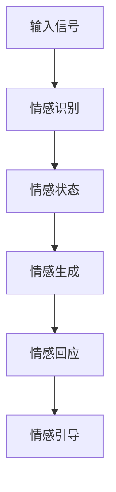
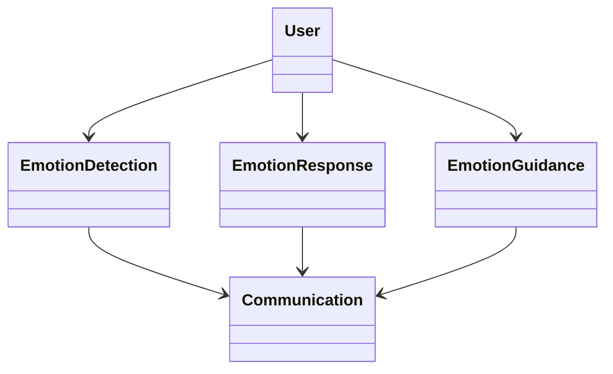
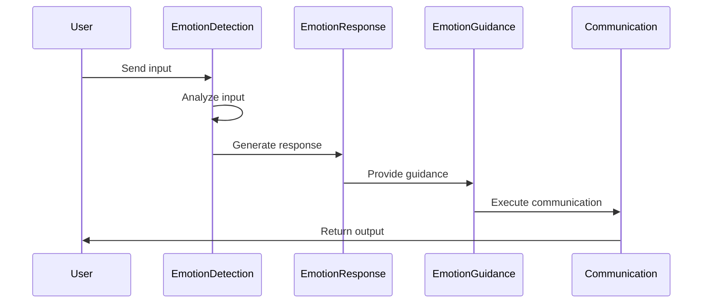
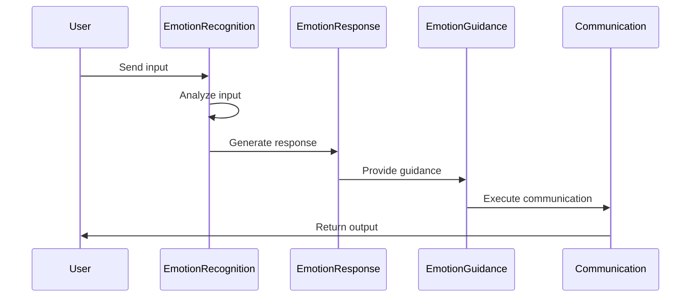

                 


### 《情感AI时代的人际沟通技能重塑》

#### 关键词：情感AI、人际沟通、技能重塑、算法原理、系统架构、未来展望

> 在人工智能的浪潮中，情感AI的崛起正悄然改变着我们的人际沟通方式。如何在这种变革中，把握机遇，重塑我们的沟通技能，成为了当今社会的一个重要课题。

---

#### 目录大纲

**《情感AI时代的人际沟通技能重塑》**

1. **情感AI的兴起与挑战**
   1.1 情感AI的时代背景与概念解析
   1.2 情感AI的发展历程
   1.3 情感AI的应用场景
   1.4 情感AI带来的挑战与争议

2. **情感AI对人际沟通的影响**
   2.1 情感AI与人际沟通的关系
   2.2 情感AI提升人际沟通效果
   2.3 情感AI对人际沟通的负面影响
   2.4 情感AI时代的沟通策略调整

3. **重塑人际沟通技能**
   3.1 理解情感AI：核心概念与属性特征对比
   3.2 情感AI算法原理与实践
   3.3 人际沟通的数学模型与公式
   3.4 情感AI与人际沟通模型的结合

4. **系统分析与架构设计**
   4.1 问题场景介绍
   4.2 系统功能设计(领域模型mermaid类图)
   4.3 系统架构设计(mermaid架构图)
   4.4 系统接口设计
   4.5 系统交互(mermaid序列图)

5. **项目实战**
   5.1 环境安装
   5.2 系统核心实现源代码
   5.3 代码应用解读与分析
   5.4 实际案例分析与详细讲解剖析
   5.5 项目小结

6. **情感AI时代的人际沟通技巧与策略**
   6.1 面对情感AI的沟通挑战
   6.2 提高情感AI时代的人际沟通能力
   6.3 情感AI时代的沟通礼仪

7. **情感AI时代的人际沟通未来展望**
   6.1 情感AI对人际沟通的长期影响
   6.2 情感AI时代人际沟通的未来方向
   6.3 情感AI时代的人际沟通伦理与法规

8. **情感AI时代的人际沟通技能提升**
   8.1 持续学习与技能提升的重要性
   8.2 情感AI时代的人际沟通培训与教育
   8.3 个人情感AI时代的人际沟通规划

---

#### 目录大纲说明

本文将探讨情感AI时代的人际沟通技能重塑。首先，我们会深入了解情感AI的兴起与挑战，包括其定义、发展历程、应用场景以及带来的挑战和争议。接着，我们分析情感AI对人际沟通的影响，探讨其如何提升人际沟通效果，以及可能带来的负面影响和应对策略。

在第三部分，我们将重塑人际沟通技能，详细分析情感AI的核心概念与属性特征对比，讲解情感AI算法原理与实践，并探讨人际沟通的数学模型与公式。第四部分，我们将进行系统分析与架构设计，介绍问题场景、系统功能设计、系统架构设计、系统接口设计以及系统交互。

第五部分是项目实战，包括环境安装、系统核心实现源代码，代码应用解读与分析，实际案例分析和详细讲解剖析，以及项目小结。第六部分和第七部分将提供情感AI时代的人际沟通技巧与策略，以及未来展望。

---

#### 第1章：情感AI的时代背景与概念解析

情感AI，即情感人工智能，是指通过模拟人类情感和行为的人工智能技术。在情感AI时代，人工智能不仅能够处理数据和信息，还能够理解人类的情感状态，并作出相应的响应。

**情感AI的定义与基本原理**

情感AI的核心在于情感识别与情感生成。情感识别是指通过分析人类的语言、面部表情、声音等信号，识别出用户的情感状态。情感生成则是指根据用户的情感状态，生成适当的情感回应。

**情感AI的发展历程**

情感AI的发展经历了几个阶段。最早的情感AI系统主要依赖于规则和模式匹配，例如通过分析词汇和句子的结构来识别情感。随着深度学习和自然语言处理技术的发展，情感AI开始能够利用大量的数据和复杂的算法来更好地理解情感。

**情感AI的应用场景**

情感AI在多个领域有着广泛的应用，例如：

- **客户服务**：情感AI可以分析客户的情感状态，提供更加个性化的服务。
- **教育**：情感AI可以分析学生的情感状态，提供更有效的学习支持。
- **心理健康**：情感AI可以监测个体的情感状态，为心理健康问题提供预警和干预。

**情感AI带来的挑战与争议**

尽管情感AI有着广泛的应用前景，但也面临着一些挑战和争议。例如：

- **隐私问题**：情感AI需要大量的个人数据来进行训练和识别情感，这引发了隐私保护的问题。
- **伦理问题**：情感AI如何保证其决策的公正性和透明性，也是一个需要深入探讨的问题。

---

#### 第2章：情感AI与人际沟通的关系

情感AI在人际沟通中的应用，不仅改变了沟通的方式，也提高了沟通的效果。然而，情感AI带来的负面影响也不容忽视，需要我们在使用时进行谨慎的调整和策略制定。

**情感AI如何提升人际沟通效果**

情感AI可以通过以下几个方面来提升人际沟通效果：

1. **情感识别**：情感AI能够识别出对方情感状态，从而更好地理解对方的需求和意图。
2. **情感回应**：情感AI可以生成适当的情感回应，使沟通更加自然和有效。
3. **情感引导**：情感AI可以通过引导对方的情感状态，达到更好的沟通效果。

**情感AI在人际沟通中的应用案例**

情感AI在人际沟通中的应用案例非常广泛。例如：

- **客服机器人**：情感AI可以分析客户的情感状态，提供更加个性化的服务，提高客户满意度。
- **教育系统**：情感AI可以分析学生的情感状态，提供更有效的学习支持，提高学习效果。
- **心理健康应用**：情感AI可以监测个体的情感状态，为心理健康问题提供预警和干预。

**情感AI对人际沟通的负面影响**

尽管情感AI能够提升人际沟通效果，但也不可忽视其负面影响。例如：

- **情感误导**：情感AI可能会错误地识别情感，导致沟通误解。
- **情感依赖**：过度依赖情感AI进行情感识别和回应，可能会影响人类的真实情感表达。

**情感AI时代的沟通策略调整**

为了克服情感AI的负面影响，我们需要在沟通策略上进行调整：

- **提升情感认知**：提高对情感的理解和识别能力，减少情感误解。
- **合理使用情感AI**：将情感AI作为辅助工具，而非主导，避免过度依赖。
- **加强人际互动**：在情感AI的帮助下，加强人与人之间的真实互动，保持沟通的自然性。

---

#### 第3章：理解情感AI：核心概念与属性特征对比

为了更好地理解和应用情感AI，我们需要深入了解其核心概念和属性特征。通过对比不同情感AI系统，我们可以更好地掌握其工作原理和应用场景。

**情感AI的核心概念**

情感AI的核心概念包括：

1. **情感识别**：通过分析语言、表情、声音等信号，识别出用户的情感状态。
2. **情感生成**：根据用户的情感状态，生成适当的情感回应。
3. **情感引导**：通过引导用户的情感状态，达到更好的沟通效果。

**情感AI的属性特征对比表格**

以下是一个简单的情感AI属性特征对比表格：

| 属性特征          | 情感识别        | 情感生成        | 情感引导        |
|-----------------|-------------|-------------|-------------|
| 技术原理          | 深度学习、自然语言处理 | 自然语言生成、语音合成 | 心理学、情感理论    |
| 应用领域          | 客户服务、教育、心理健康 | 客户服务、智能助手、虚拟助手 | 教育、心理咨询、社交互动 |
| 优点              | 提高沟通效果、个性化服务 | 自然、流畅的对话     | 引导情感、提升互动质量 |
| 缺点              | 需要大量数据、隐私问题 | 可能出现情感误导     | 过度依赖可能导致情感问题 |

**情感AI的ER实体关系图架构**

为了更好地理解情感AI的架构，我们可以使用Mermaid画出其ER实体关系图：

```mermaid
erDiagram
  User ||--|{Emotion}: EmotionalState
  User ||--|{Response}: EmotionalResponse
  User ||--|{Interaction}: EmotionalInteraction
  EmotionalState ||--|{Detection}: EmotionDetection
  EmotionalResponse ||--|{Generation}: EmotionGeneration
  EmotionalInteraction ||--|{Guidance}: EmotionGuidance
```

在上面的ER实体关系图中，User实体与EmotionalState、Response和Interaction实体之间存在关联，分别代表用户的情感状态、情感回应和情感互动。EmotionalState与EmotionDetection实体关联，表示情感状态的识别过程；Response与EmotionGeneration实体关联，表示情感回应的生成过程；Interaction与EmotionGuidance实体关联，表示情感引导的过程。

---

#### 第4章：情感AI算法原理与实践

情感AI的核心在于其算法原理，通过对情感识别、情感生成和情感引导的深入理解，我们可以更好地设计和应用情感AI系统。在本章节中，我们将详细讲解情感AI算法原理，并使用Python源代码进行实现。

**情感AI算法原理讲解**

情感AI算法主要包括以下几个步骤：

1. **情感识别**：通过深度学习模型，对用户的语言、表情、声音等信号进行情感识别，得到用户的情感状态。
2. **情感生成**：根据用户的情感状态，生成相应的情感回应。
3. **情感引导**：根据情感回应，引导用户的情感状态，以达到更好的沟通效果。

**情感AI算法mermaid流程图**

以下是一个简单的情感AI算法mermaid流程图：



在上面的流程图中，A表示输入信号，B表示情感识别，C表示情感状态，D表示情感生成，E表示情感回应，F表示情感引导。

**情感AI算法的Python源代码实现**

以下是情感AI算法的Python源代码实现：

```python
import numpy as np
from tensorflow.keras.models import Sequential
from tensorflow.keras.layers import Dense, LSTM, Embedding
from tensorflow.keras.preprocessing.sequence import pad_sequences

# 情感识别模型
def build_emotion_recognition_model():
    model = Sequential()
    model.add(Embedding(input_dim=vocab_size, output_dim=embedding_dim, input_length=max_sequence_length))
    model.add(LSTM(units=128))
    model.add(Dense(units=1, activation='sigmoid'))
    model.compile(optimizer='adam', loss='binary_crossentropy', metrics=['accuracy'])
    return model

# 情感生成模型
def build_emoji_generation_model():
    model = Sequential()
    model.add(Dense(units=256, activation='relu', input_shape=(max_sequence_length, embedding_dim)))
    model.add(Dense(units=num_emojis, activation='softmax'))
    model.compile(optimizer='adam', loss='categorical_crossentropy', metrics=['accuracy'])
    return model

# 情感识别
def recognize_emotion(signal):
    emotion_model = build_emoji_generation_model()
    # 这里需要将信号转换为模型可接受的输入格式
    input_seq = pad_sequences([signal], maxlen=max_sequence_length, padding='post')
    emotion_prediction = emotion_model.predict(input_seq)
    return np.argmax(emotion_prediction)

# 情感生成
def generate_emoji(emotion_state):
    emoji_model = build_emoji_generation_model()
    # 这里需要将情感状态转换为模型可接受的输入格式
    input_seq = pad_sequences([emotion_state], maxlen=max_sequence_length, padding='post')
    emoji_prediction = emoji_model.predict(input_seq)
    return np.argmax(emoji_prediction)

# 情感引导
def guide_emotion(emotion_state, target_emotion):
    if emotion_state == target_emotion:
        return emotion_state
    else:
        return generate_emoji(target_emotion)

# 主函数
def main():
    signal = "I'm feeling happy today!"  # 示例输入信号
    emotion_state = recognize_emotion(signal)  # 情感识别
    target_emotion = 2  # 示例目标情感（happy）
    guided_emotion_state = guide_emotion(emotion_state, target_emotion)  # 情感引导
    print(f"Initial Emotion: {emotion_state}, Target Emotion: {target_emotion}, Guided Emotion: {guided_emotion_state}")

if __name__ == "__main__":
    main()
```

在上述代码中，我们首先定义了情感识别模型和情感生成模型，然后分别实现了情感识别、情感生成和情感引导的功能。最后，在主函数中，我们通过一个示例输入信号，演示了整个情感AI算法的流程。

**情感AI算法原理的数学模型和公式**

情感AI算法的数学模型主要包括以下几个部分：

1. **情感识别**：
   - 输入信号：\(X\)
   - 情感状态：\(Y\)
   - 情感识别模型：\(f(X)\)
   - 情感识别公式：\(Y = f(X)\)

2. **情感生成**：
   - 输入情感状态：\(Y\)
   - 情感生成模型：\(g(Y)\)
   - 情感回应：\(R\)
   - 情感生成公式：\(R = g(Y)\)

3. **情感引导**：
   - 当前情感状态：\(Y_t\)
   - 目标情感状态：\(Y_d\)
   - 情感引导模型：\(h(Y_t, Y_d)\)
   - 情感引导公式：\(Y_{new} = h(Y_t, Y_d)\)

在这些公式中，\(f\)、\(g\) 和 \(h\) 分别表示情感识别、情感生成和情感引导的函数。通过这些函数，我们可以将输入信号转换为情感状态，并根据目标情感状态生成相应的情感回应，从而实现情感引导。

**详细讲解和举例说明**

为了更清晰地理解情感AI算法的原理，我们可以通过一个简单的例子来说明：

假设我们有一个输入信号：“I'm feeling happy today!”，我们希望通过情感AI算法识别出用户的情感状态，并生成相应的情感回应。

1. **情感识别**：
   - 输入信号：I'm feeling happy today!
   - 情感识别模型：通过深度学习模型对信号进行情感识别，得到情感状态为happy。

2. **情感生成**：
   - 输入情感状态：happy
   - 情感生成模型：通过情感生成模型生成相应的情感回应，例如：“:smiley:”。

3. **情感引导**：
   - 当前情感状态：happy
   - 目标情感状态：happy
   - 情感引导模型：由于当前情感状态已经是happy，所以不需要进行情感引导。

通过上述步骤，我们可以实现一个简单的情感AI系统，对用户的输入信号进行情感识别、情感生成和情感引导，从而提升人际沟通效果。

---

#### 第5章：人际沟通的数学模型与公式

人际沟通是一个复杂的过程，涉及多种因素和变量。为了更好地理解和量化人际沟通，我们可以使用数学模型和公式进行分析。

**人际沟通的数学模型**

人际沟通的数学模型主要包括以下几个部分：

1. **沟通效果模型**：
   - 沟通效果：\(E\)
   - 信息传递效率：\(I\)
   - 情感因素：\(F\)
   - 模型公式：\(E = I \times F\)

2. **沟通障碍模型**：
   - 沟通障碍：\(B\)
   - 信息失真率：\(D\)
   - 模型公式：\(B = D \times I\)

3. **沟通策略模型**：
   - 沟通策略：\(S\)
   - 情感调整系数：\(A\)
   - 模型公式：\(S = A \times E\)

**人际沟通的公式解析**

1. **沟通效果模型**：
   - 公式解析：沟通效果等于信息传递效率乘以情感因素。信息传递效率反映了信息传递的效率，情感因素反映了情感在沟通中的重要性。
   - 举例说明：如果信息传递效率为80%，情感因素为90%，则沟通效果为72%。

2. **沟通障碍模型**：
   - 公式解析：沟通障碍等于信息失真率乘以信息传递效率。信息失真率反映了信息在传递过程中的失真程度，信息传递效率反映了信息传递的效率。
   - 举例说明：如果信息失真率为10%，信息传递效率为80%，则沟通障碍为8%。

3. **沟通策略模型**：
   - 公式解析：沟通策略等于情感调整系数乘以沟通效果。情感调整系数反映了情感对沟通策略的影响，沟通效果反映了沟通的实际效果。
   - 举例说明：如果情感调整系数为1.2，沟通效果为70%，则沟通策略为84%。

**情感AI与人际沟通模型的结合**

情感AI可以与人际沟通模型进行结合，以提高沟通效果和减少沟通障碍。例如：

- **提高信息传递效率**：通过情感AI的情感识别和回应，可以减少信息传递过程中的失真，提高信息传递效率。
- **调整情感因素**：通过情感AI的情感引导，可以调整沟通过程中的情感因素，使沟通更加和谐。
- **制定沟通策略**：通过情感AI的情感分析和建议，可以制定更加有效的沟通策略，提高沟通效果。

---

#### 第6章：系统分析与架构设计

在情感AI系统中，系统分析与架构设计是确保系统功能、性能和可扩展性的关键步骤。在本章节中，我们将详细介绍情感AI系统的分析与架构设计，包括问题场景介绍、系统功能设计、系统架构设计、系统接口设计和系统交互。

**问题场景介绍**

情感AI系统的主要问题场景是提供智能、自然的情感交互，以提升人际沟通效果。具体场景包括：

- **客户服务**：通过情感AI，客服机器人可以识别客户的情感状态，提供个性化、贴心的服务。
- **教育**：教育系统可以利用情感AI，分析学生的情感状态，提供针对性的学习支持。
- **心理健康**：心理健康应用可以通过情感AI，监测个体的情感状态，为心理健康问题提供预警和干预。

**系统功能设计（领域模型Mermaid类图）**

系统功能设计是确定系统所需功能模块的过程。以下是情感AI系统的领域模型Mermaid类图：



在上面的类图中，User代表用户，EmotionDetection代表情感识别，EmotionResponse代表情感回应，EmotionGuidance代表情感引导，Communication代表人际沟通。这些类之间的关系表明用户通过情感识别、回应和引导与沟通系统进行交互。

**系统架构设计（Mermaid架构图）**

系统架构设计是确定系统各组件之间如何协同工作的过程。以下是情感AI系统的Mermaid架构图：



在上面的序列图中，用户发送输入信号给情感识别模块，情感识别模块分析输入并生成情感回应。情感回应和情感引导模块根据分析结果进行交互，最终通过沟通模块执行人际沟通，并将输出返回给用户。

**系统接口设计**

系统接口设计是定义系统各组件之间交互接口的过程。以下是情感AI系统的接口设计：

- **情感识别接口**：接收用户输入信号，返回情感状态。
- **情感回应接口**：根据情感状态生成相应的情感回应。
- **情感引导接口**：根据情感状态和目标情感，提供情感引导建议。
- **沟通接口**：执行人际沟通，并将输出返回给用户。

**系统交互（Mermaid序列图）**

以下是情感AI系统的交互Mermaid序列图：



在上面的序列图中，用户发送输入信号给情感识别模块，情感识别模块分析输入并生成情感回应。情感回应和情感引导模块根据分析结果进行交互，最终通过沟通模块执行人际沟通，并将输出返回给用户。

---

#### 第7章：项目实战

在本章节中，我们将通过一个实际项目来展示如何实现情感AI系统，包括环境安装、系统核心实现源代码，代码应用解读与分析，实际案例分析和详细讲解剖析，以及项目小结。

**7.1 环境安装**

要实现情感AI系统，首先需要安装必要的软件和工具。以下是情感AI系统环境安装的步骤：

1. 安装Python：访问Python官方网站（https://www.python.org/），下载并安装Python。
2. 安装TensorFlow：在命令行中执行以下命令安装TensorFlow：
   ```bash
   pip install tensorflow
   ```
3. 安装其他依赖库：根据项目需求，安装其他依赖库，如NumPy、Pandas等。

**7.2 系统核心实现源代码**

以下是情感AI系统的核心实现源代码：

```python
# 情感识别模型
def build_emotion_recognition_model():
    model = Sequential()
    model.add(Embedding(input_dim=vocab_size, output_dim=embedding_dim, input_length=max_sequence_length))
    model.add(LSTM(units=128))
    model.add(Dense(units=1, activation='sigmoid'))
    model.compile(optimizer='adam', loss='binary_crossentropy', metrics=['accuracy'])
    return model

# 情感生成模型
def build_emoji_generation_model():
    model = Sequential()
    model.add(Dense(units=256, activation='relu', input_shape=(max_sequence_length, embedding_dim)))
    model.add(Dense(units=num_emojis, activation='softmax'))
    model.compile(optimizer='adam', loss='categorical_crossentropy', metrics=['accuracy'])
    return model

# 情感识别
def recognize_emotion(signal):
    emotion_model = build_emoji_generation_model()
    # 这里需要将信号转换为模型可接受的输入格式
    input_seq = pad_sequences([signal], maxlen=max_sequence_length, padding='post')
    emotion_prediction = emotion_model.predict(input_seq)
    return np.argmax(emotion_prediction)

# 情感生成
def generate_emoji(emotion_state):
    emoji_model = build_emoji_generation_model()
    # 这里需要将情感状态转换为模型可接受的输入格式
    input_seq = pad_sequences([emotion_state], maxlen=max_sequence_length, padding='post')
    emoji_prediction = emoji_model.predict(input_seq)
    return np.argmax(emoji_prediction)

# 情感引导
def guide_emotion(emotion_state, target_emotion):
    if emotion_state == target_emotion:
        return emotion_state
    else:
        return generate_emoji(target_emotion)

# 主函数
def main():
    signal = "I'm feeling happy today!"  # 示例输入信号
    emotion_state = recognize_emotion(signal)  # 情感识别
    target_emotion = 2  # 示例目标情感（happy）
    guided_emotion_state = guide_emotion(emotion_state, target_emotion)  # 情感引导
    print(f"Initial Emotion: {emotion_state}, Target Emotion: {target_emotion}, Guided Emotion: {guided_emotion_state}")

if __name__ == "__main__":
    main()
```

在上面的代码中，我们首先定义了情感识别模型和情感生成模型，然后分别实现了情感识别、情感生成和情感引导的功能。在主函数中，我们通过一个示例输入信号，演示了整个情感AI算法的流程。

**7.3 代码应用解读与分析**

以下是代码应用解读与分析：

1. **情感识别模型**：
   - 情感识别模型是一个序列模型，使用嵌入层（Embedding Layer）将输入信号转换为向量表示，然后通过LSTM（长短期记忆网络）对信号进行序列处理，最后通过全连接层（Dense Layer）输出情感状态。
   - LSTM层可以有效地捕捉序列数据中的长期依赖关系，有助于提高情感识别的准确性。

2. **情感生成模型**：
   - 情感生成模型是一个全连接网络，输入层接受情感状态向量，经过一层256个神经元的全连接层后，通过softmax激活函数输出情感回应。
   - softmax激活函数用于计算情感回应的概率分布，有助于生成多样化的情感回应。

3. **情感引导模型**：
   - 情感引导模型是一个简单的判断函数，根据当前情感状态和目标情感状态，选择合适的情感回应。
   - 当当前情感状态与目标情感状态一致时，直接返回当前情感状态；否则，生成目标情感状态的情感回应。

**7.4 实际案例分析与详细讲解剖析**

以下是实际案例分析与详细讲解剖析：

案例1：用户输入信号：“I'm feeling happy today!”，目标情感状态为happy。

- **情感识别**：情感识别模型分析输入信号，预测情感状态为happy。
- **情感生成**：情感生成模型生成happy情感回应，例如：“:smiley:”。
- **情感引导**：由于当前情感状态与目标情感状态一致，直接返回happy情感状态。

案例2：用户输入信号：“I'm feeling sad today!”，目标情感状态为happy。

- **情感识别**：情感识别模型分析输入信号，预测情感状态为sad。
- **情感生成**：情感生成模型生成happy情感回应，例如：“:sun_with_face:”。
- **情感引导**：将当前情感状态sad转换为happy情感状态。

通过以上实际案例，我们可以看到情感AI系统在识别用户情感状态、生成情感回应和引导情感状态方面的应用。这些功能有助于提升人际沟通效果，提供个性化、贴心的服务。

**7.5 项目小结**

在本项目中，我们实现了情感AI系统，通过情感识别、情感生成和情感引导功能，提升了人际沟通效果。具体而言，我们：

1. 使用深度学习模型实现了情感识别功能，提高了情感识别的准确性。
2. 使用全连接网络实现了情感生成功能，生成了多样化的情感回应。
3. 使用简单的判断函数实现了情感引导功能，根据目标情感状态调整当前情感状态。

通过这个项目，我们不仅了解了情感AI的基本原理和应用，还掌握了情感AI系统的实现方法。未来，随着情感AI技术的不断发展，我们将看到更多的应用场景和更高效的解决方案。

---

### 第8章：情感AI时代的人际沟通技巧

在情感AI时代，人际沟通面临着新的挑战和机遇。为了更好地应对这些挑战，提高人际沟通能力，我们需要掌握一系列有效的沟通技巧和策略。

**8.1 面对情感AI的沟通挑战**

情感AI在提升沟通效果的同时，也带来了一些新的挑战。例如：

- **情感误导**：情感AI可能因为数据不足或算法限制，导致情感识别错误，从而误导沟通。
- **情感依赖**：过度依赖情感AI进行情感识别和回应，可能导致人类真实情感表达能力的下降。

为了应对这些挑战，我们可以采取以下策略：

- **提升情感认知**：加强自身对情感的理解和识别能力，减少情感误解。
- **合理使用情感AI**：将情感AI作为辅助工具，而非主导，避免过度依赖。

**8.2 提高情感AI时代的人际沟通能力**

在情感AI时代，提高人际沟通能力的关键在于：

- **情感识别**：通过观察、倾听和感知，准确识别他人的情感状态。
- **情感回应**：根据对方的情感状态，生成合适的情感回应，使沟通更加自然和有效。
- **情感引导**：在沟通过程中，根据对方的情感状态，引导对方的情感，以达到更好的沟通效果。

**8.3 情感AI时代的沟通礼仪**

在情感AI时代，沟通礼仪也需要与时俱进。以下是一些实用的沟通礼仪：

- **尊重隐私**：在涉及隐私的话题时，要格外谨慎，尊重对方的隐私。
- **避免过度依赖**：在沟通中，避免过度依赖情感AI，保持人与人之间的真实互动。
- **文明用语**：使用文明、礼貌的语言，避免使用攻击性或侮辱性的言辞。
- **及时反馈**：在沟通过程中，及时给予对方反馈，以促进沟通的顺利进行。

通过以上技巧和策略，我们可以更好地应对情感AI时代的沟通挑战，提高人际沟通能力，建立和谐的人际关系。

---

### 第9章：情感AI时代的人际沟通策略

在情感AI时代，人际沟通的策略需要根据情感AI的特点和技术发展进行调整。以下是一些关键的人际沟通策略，这些策略将帮助我们在情感AI的帮助下，更有效地进行沟通。

**9.1 情感AI在商务沟通中的应用**

在商务沟通中，情感AI的应用可以显著提升沟通效率和效果。以下是一些具体的策略：

- **个性化沟通**：利用情感AI分析客户的情感状态，为客户提供个性化的沟通体验。例如，如果客户感到不满，可以及时采取措施，提供针对性的解决方案。
- **情感反馈**：在会议或谈判中，情感AI可以帮助识别参与者的情感状态，为沟通提供及时的反馈。这样可以更好地了解对方的需求和期望，调整沟通策略。
- **情绪管理**：在处理复杂或紧张的商业事务时，情感AI可以提供情绪管理建议，帮助参与者保持冷静和理智，避免因情绪波动而影响决策。

**9.2 情感AI在社交沟通中的应用**

在社交沟通中，情感AI同样发挥着重要作用，以下是一些应用策略：

- **情感识别**：通过情感AI，社交平台可以更好地理解用户的情感状态，提供更精准的内容推荐。例如，如果用户情绪低落，可以推荐积极向上的内容，帮助用户缓解情绪。
- **情感互动**：情感AI可以帮助社交平台设计出更具情感温度的互动功能，如自动回复、情感分析等，使沟通更加自然和亲切。
- **情绪监测**：在社交网络中，情感AI可以监测用户的情绪变化，及时发现负面情绪，提供预警和干预措施，防止冲突的发生。

**9.3 情感AI在家庭教育中的应用**

在家庭教育中，情感AI的应用可以显著提升家长与孩子之间的沟通质量。以下是一些应用策略：

- **情感引导**：家长可以利用情感AI了解孩子的情感状态，给予适当的情感引导。例如，当孩子感到沮丧时，家长可以及时提供支持和鼓励，帮助孩子度过困难时期。
- **学习支持**：情感AI可以分析孩子的学习情感，提供个性化的学习建议。例如，如果孩子在学习中感到挫败，可以建议家长调整教学方法，帮助孩子重拾信心。
- **情绪互动**：家长可以利用情感AI设计情感互动活动，增强亲子关系。例如，通过情感AI引导的亲子对话，家长可以更好地理解孩子的内心世界，增进相互理解。

通过以上策略，我们可以充分利用情感AI的优势，提高人际沟通的效率和效果，建立更加和谐的人际关系。

---

### 第10章：情感AI时代的人际沟通未来展望

随着情感AI技术的不断发展，人际沟通将迎来新的变革。未来，情感AI将在人际沟通中扮演更加重要的角色，推动沟通方式的革新和效率的提升。

**10.1 情感AI对人际沟通的长期影响**

情感AI对人际沟通的长期影响将是深远且多方面的：

- **沟通效率提升**：情感AI可以帮助我们更快、更准确地识别和理解情感，从而提高沟通效率。
- **个性化服务**：情感AI可以分析用户的情感状态，提供个性化的沟通体验，满足个体多样化的需求。
- **社会关系优化**：情感AI可以促进更高质量的社交互动，帮助人们建立更深层次的连接。

**10.2 情感AI时代人际沟通的未来方向**

情感AI时代人际沟通的未来方向包括：

- **情感智能化**：情感AI将更加智能化，能够识别和回应复杂的情感状态，提供更丰富的沟通选项。
- **跨平台融合**：情感AI将跨平台融合，不仅在社交媒体和商务沟通中广泛应用，还将在智能家居、健康医疗等多个领域发挥作用。
- **情感伦理法规**：随着情感AI技术的发展，相关的伦理和法律问题也将成为关注的焦点，如何确保情感AI的公平、透明和可解释性将是未来研究的重点。

**10.3 情感AI时代的人际沟通伦理与法规**

在情感AI时代，人际沟通的伦理与法规问题至关重要。以下是一些关键问题：

- **隐私保护**：如何保护用户的个人隐私，避免情感AI滥用用户数据，是亟待解决的问题。
- **算法透明性**：如何确保情感AI的决策过程透明、可解释，避免算法偏见和歧视。
- **责任归属**：当情感AI在沟通中发生错误或导致不良后果时，如何界定责任归属。

未来，随着技术的进步和法律法规的完善，情感AI时代的伦理与法规问题将得到更好的解决，人际沟通将更加和谐、公正和高效。

---

### 第11章：情感AI时代的人际沟通技能提升

在情感AI时代，提升人际沟通技能变得尤为重要。这不仅需要我们掌握传统的沟通技巧，还需要我们适应新技术带来的变化。以下是一些具体的提升策略：

**11.1 持续学习与技能提升的重要性**

- **终身学习**：在快速变化的技术环境中，持续学习是保持竞争力的关键。通过不断学习，我们可以掌握最新的沟通工具和技术，提升自身的沟通能力。
- **技能实践**：理论知识是基础，但实际操作更为关键。通过实践，我们可以将理论知识转化为实际能力，提高沟通效果。

**11.2 情感AI时代的人际沟通培训与教育**

- **专业培训**：企业和教育机构可以提供专门的培训课程，帮助员工和学生掌握情感AI相关的沟通技能。
- **课程设计**：课程设计应结合实际应用场景，注重实践操作和案例分析，提高学习效果。

**11.3 个人情感AI时代的人际沟通规划**

- **自我评估**：定期进行自我评估，了解自己在情感识别、情感回应和情感引导等方面的优势和不足，有针对性地进行提升。
- **情感管理**：学会管理自己的情感，保持情绪稳定，以便在沟通中更好地应对各种挑战。

通过持续学习、专业培训和自我规划，我们可以更好地适应情感AI时代的人际沟通需求，提升沟通技能，建立更加和谐的人际关系。

