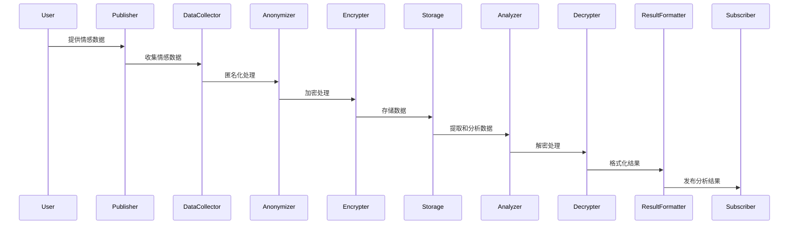
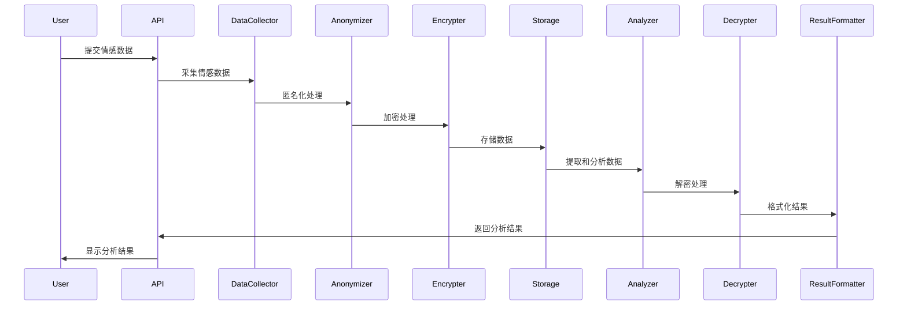

                 

### 情感AI时代的隐私保护新思路

#### 关键词：情感AI、隐私保护、技术、算法、系统设计、应用场景

#### 摘要：
在情感人工智能（AI）飞速发展的时代，隐私保护面临前所未有的挑战。本文从多个角度探讨了情感AI时代的隐私保护新思路，包括技术手段、系统设计及应用场景。文章首先介绍了情感AI的基本概念和发展历程，随后深入分析了情感AI时代隐私保护面临的挑战，并提出了数据加密、隐蔽传输、数据匿名化等关键技术。此外，文章还详细阐述了隐私保护在情感AI系统设计中的应用，以及实际项目的实现和最佳实践。通过这些新思路，希望为情感AI时代的隐私保护提供有益的参考。

### 引言

随着情感人工智能（Emotional AI）技术的不断进步，AI系统能够更好地理解和模拟人类情感，从而在多个领域得到广泛应用，如心理健康、教育、商业等。然而，这一进步也带来了新的隐私保护问题。情感AI系统通常依赖于大量个人情感数据，这些数据一旦泄露或被滥用，可能会对用户的隐私和权益造成严重威胁。因此，如何在情感AI时代确保用户隐私，成为当前人工智能领域的一个重大课题。

本文将围绕“情感AI时代的隐私保护新思路”这一主题展开讨论。首先，我们将介绍情感AI的基本概念和发展历程，帮助读者理解这一领域的背景。接着，我们将深入探讨情感AI时代隐私保护所面临的挑战，包括数据收集、存储、处理和传输过程中的隐私风险。在此基础上，本文将介绍一系列隐私保护技术，包括数据加密、隐蔽传输和数据匿名化，并分析这些技术在实际应用中的效果和局限性。

随后，我们将探讨隐私保护在情感AI系统设计中的应用，从系统架构、数据流管理和用户隐私权限管理等方面进行详细阐述。接着，通过一个实际项目案例，展示如何将隐私保护理念贯穿于情感AI系统的设计与实现过程中。最后，本文将总结情感AI时代隐私保护的最佳实践，并展望未来的发展趋势。

通过本文的探讨，我们希望为情感AI时代的隐私保护提供一些新的思路和方法，帮助读者更好地理解和应对这一挑战。

### 情感AI概述

#### 1.1 情感AI的概念与演进

情感人工智能（Emotional AI），也称为情感计算（Affective Computing），是指能够识别、理解、处理和模拟人类情感的人工智能技术。情感AI的核心在于情感识别和理解，即通过算法和技术手段，使计算机能够感知用户的外部表情、语音、生理信号等，从而理解用户的情感状态。

情感AI的发展历程可以追溯到20世纪80年代，当时计算机科学家开始探索如何使计算机具有情感理解能力。早期的情感AI研究主要集中在面部表情识别、语音情感识别和生理信号处理等方面。随着计算机技术和人工智能算法的进步，情感AI逐渐从实验室走向实际应用。

#### 1.1.1 情感AI的定义

情感AI的定义可以从多个维度进行解释。从技术层面看，情感AI是一种结合计算机视觉、语音识别、生理信号处理等多种技术手段的综合系统，能够通过多种传感器获取用户的情感信息。从应用层面看，情感AI旨在提升人与机器之间的交互质量，使计算机能够更好地理解和满足用户的需求。

#### 1.1.2 情感AI的发展历程

情感AI的发展历程可以分为以下几个阶段：

1. **初步探索阶段（20世纪80年代至90年代）**：
   这一阶段，研究人员开始探索如何使计算机具备情感识别能力，主要研究内容包括面部表情识别、语音情感识别和生理信号处理等。

2. **技术突破阶段（21世纪初至2010年）**：
   随着计算机视觉和语音识别技术的突破，情感AI开始具备实际应用能力。例如，人脸识别技术的成熟使得计算机能够更加准确地识别用户的表情；语音识别技术的进步使得计算机能够理解用户的语音情感。

3. **应用拓展阶段（2010年至今）**：
   情感AI逐渐在多个领域得到应用，如心理健康、教育、商业等。例如，在心理健康领域，情感AI可以通过分析用户的情绪变化，为用户提供个性化的心理咨询服务；在教育领域，情感AI可以通过了解学生的情绪状态，调整教学策略，提高学习效果。

#### 1.1.3 情感AI的关键技术

情感AI的关键技术主要包括以下几个方面：

1. **面部表情识别**：
   面部表情识别是情感AI的重要技术之一，通过分析用户的面部表情，计算机能够识别出用户的不同情绪状态。常见的面部表情识别技术包括Haar特征分类器、深度学习模型等。

2. **语音情感识别**：
   语音情感识别是通过分析用户的语音特征，如音调、语速、音量等，来识别用户的情感状态。常用的语音情感识别技术包括支持向量机（SVM）、长短期记忆网络（LSTM）等。

3. **生理信号处理**：
   生理信号处理包括心率、皮肤电反应、呼吸等生理信号的分析，通过这些信号的变化，计算机可以推断用户的情感状态。常见的生理信号处理技术包括信号滤波、傅里叶变换等。

4. **多模态融合**：
   多模态融合是将不同类型的情感信息进行整合，以提高情感识别的准确性和可靠性。常见的多模态融合技术包括特征级融合、决策级融合等。

#### 1.2 隐私保护的重要性

隐私保护在情感AI领域具有极其重要的地位，这是因为情感AI系统通常需要收集、处理和存储大量的个人情感数据。这些数据不仅包括用户的生理和行为特征，还涉及到用户的内心世界和情感状态。一旦这些数据泄露或被滥用，不仅会导致用户的隐私受到侵犯，还可能对用户的心理健康和社会生活造成严重影响。

在情感AI时代，隐私保护的重要性主要体现在以下几个方面：

1. **数据泄露风险**：
   情感AI系统在收集和处理用户数据的过程中，可能会面临数据泄露的风险。如果这些数据泄露，攻击者可能会获取用户的个人信息，从而进行身份盗窃、诈骗等犯罪活动。

2. **隐私侵犯问题**：
   情感AI系统在分析用户情感数据时，可能会挖掘出用户的敏感信息，如心理健康问题、个人隐私等。如果这些信息被不当使用或泄露，可能会对用户的隐私造成严重侵犯。

3. **社会伦理问题**：
   隐私保护不仅关乎个人利益，也涉及到社会伦理问题。情感AI技术的滥用可能会导致社会不公平、歧视等问题，影响社会的和谐与稳定。

#### 1.2.1 隐私保护的基本概念

隐私保护的基本概念包括以下几个方面：

1. **隐私**：
   隐私是指个人不愿意公开或与他人分享的个人信息。在情感AI领域，隐私主要指用户的情感数据，如面部表情、语音、生理信号等。

2. **隐私保护**：
   隐私保护是指通过各种技术手段和管理措施，确保用户的隐私不被泄露或滥用。在情感AI领域，隐私保护主要包括数据加密、匿名化、权限管理等。

3. **隐私侵犯**：
   隐私侵犯是指未经用户同意，擅自获取、使用或泄露用户隐私信息的行为。在情感AI领域，隐私侵犯可能会导致数据泄露、个人隐私泄露等问题。

#### 1.2.2 情感AI时代的隐私挑战

在情感AI时代，隐私保护面临以下几方面的挑战：

1. **数据量巨大**：
   情感AI系统需要收集和处理大量的用户情感数据，这些数据量远超传统AI系统。大数据量的特性使得隐私保护更加困难，因为攻击者可以通过分析海量数据来发现用户的隐私信息。

2. **数据多样性**：
   情感AI系统需要处理多种类型的数据，如文本、图像、音频、生理信号等。不同类型的数据有不同的隐私保护需求，这增加了隐私保护的设计和实施难度。

3. **实时性要求**：
   情感AI系统通常需要对用户的情感状态进行实时分析，这要求隐私保护技术能够在保证隐私的同时，满足系统的实时性能要求。

4. **跨平台数据共享**：
   情感AI系统可能需要在不同的平台和设备之间共享数据，如云端、移动设备等。跨平台数据共享增加了隐私泄露的风险，因为不同平台和设备可能存在不同的安全漏洞。

5. **隐私伦理问题**：
   情感AI系统在分析用户情感数据时，可能会挖掘出用户的敏感信息，如心理健康问题、个人隐私等。这些信息的泄露或滥用可能会导致社会伦理问题，影响社会的和谐与稳定。

#### 1.2.3 隐私保护的法律框架

在情感AI时代，隐私保护不仅需要依靠技术手段，还需要依靠法律框架来规范和约束。目前，全球范围内已有多个国家和地区出台了隐私保护法律和政策，为情感AI时代的隐私保护提供了法律依据。

1. **国际法律框架**：
   - 《通用数据保护条例》（GDPR）：欧盟出台的GDPR是国际上最具影响力的隐私保护法律之一，对数据收集、处理和存储等方面进行了详细规定。
   - 《加州消费者隐私法案》（CCPA）：美国加州出台的CCPA旨在保护加州居民的隐私，对企业的数据处理行为进行了严格限制。

2. **国家法律框架**：
   - 中国：《中华人民共和国网络安全法》规定了网络运营者的数据处理行为，强调了用户隐私保护的重要性。
   - 美国：《隐私法》和《健康保险可携性与责任法案》（HIPAA）对个人健康数据的隐私保护进行了详细规定。

3. **行业规范和标准**：
   - 人工智能行业组织，如IEEE、AI协会等，也发布了多项隐私保护规范和标准，为情感AI领域的隐私保护提供了指导。

通过法律框架的规范和约束，可以有效地遏制隐私侵犯行为，保障用户的隐私权益。同时，法律框架也为隐私保护技术的发展提供了方向和动力。

### 情感AI隐私保护技术

在情感AI时代，隐私保护面临着前所未有的挑战。为了应对这些挑战，研究人员和工程师们开发了多种隐私保护技术，包括数据加密、隐蔽传输和数据匿名化。以下将详细探讨这些技术的基本原理、在实际应用中的效果及其局限性。

#### 2.1 数据加密技术

数据加密是一种保护数据隐私的基本技术，通过将原始数据转换成密文，只有获得密钥的合法用户才能解密并获取原始数据。数据加密技术的基本原理是利用数学算法将数据转换为无法直接识别的密文，从而保护数据的机密性。

**2.1.1 数据加密的基本原理**

数据加密的基本过程包括以下步骤：

1. **加密算法选择**：选择一种合适的加密算法，如对称加密算法（如AES）和非对称加密算法（如RSA）。

2. **密钥生成**：生成加密和解密的密钥。对称加密使用相同密钥进行加密和解密，而非对称加密则使用一对密钥，即公钥和私钥。

3. **数据加密**：使用加密算法和密钥将原始数据转换为密文。

4. **数据传输**：将加密后的数据传输到接收方。

5. **数据解密**：接收方使用相应的密钥和解密算法将密文解密为原始数据。

**2.1.2 常见的数据加密算法**

在情感AI领域，常用的数据加密算法包括：

- **AES（高级加密标准）**：AES是一种对称加密算法，它使用128位、192位或256位的密钥对数据进行加密和解密。AES具有较高的安全性和效率，广泛用于商业和政府领域。

- **RSA（Rivest-Shamir-Adleman）**：RSA是一种非对称加密算法，使用一对密钥进行加密和解密。RSA的安全性基于大数分解的困难性，适用于安全要求较高的场景。

- **ECC（椭圆曲线密码学）**：ECC是一种基于椭圆曲线离散对数问题的非对称加密算法，具有更高的安全性和效率，适用于资源受限的环境。

**2.1.3 数据加密在情感AI中的应用**

数据加密技术在情感AI中的应用主要包括以下几个方面：

1. **数据存储**：在情感AI系统中，用户数据通常存储在数据库中。通过数据加密，可以确保数据在存储过程中的安全性，防止未授权访问。

2. **数据传输**：在数据传输过程中，通过加密可以保护数据在传输过程中的机密性，防止数据被窃听或篡改。

3. **数据共享**：在跨平台数据共享中，数据加密可以确保只有授权用户能够访问和使用数据，防止数据泄露。

**2.1.4 数据加密的局限性**

虽然数据加密是一种有效的隐私保护技术，但它也存在一些局限性：

1. **计算成本**：加密和解密过程需要消耗大量的计算资源，特别是在处理大量数据时，可能会影响系统的性能。

2. **密钥管理**：加密和解密需要密钥，密钥的安全管理是一个复杂的问题。如果密钥泄露，整个系统的安全性将受到威胁。

3. **无法防止数据泄露**：数据加密只能保护数据的机密性，无法防止数据泄露的其他形式，如物理窃取或内部泄露。

#### 2.2 隐蔽传输技术

隐蔽传输技术通过在正常通信中嵌入加密数据，使得攻击者难以检测和拦截，从而保护数据的传输安全性。隐蔽传输的基本原理是利用人类视觉、听觉等感官的局限性，将数据隐藏在其他媒介中。

**2.2.1 隐蔽传输的概念**

隐蔽传输技术可以分为以下几种类型：

1. **视觉隐蔽传输**：通过在图像、视频等视觉媒介中嵌入数据，利用人类视觉的局限性，使数据难以被察觉。

2. **音频隐蔽传输**：通过在音频信号中嵌入数据，利用人类听觉的局限性，使数据难以被察觉。

3. **嗅觉隐蔽传输**：通过在气味信号中嵌入数据，利用人类嗅觉的局限性，使数据难以被察觉。

**2.2.2 隐蔽传输的关键技术**

隐蔽传输的关键技术包括：

1. **图像隐写术**：图像隐写术是一种在图像中嵌入数据的技术，通过修改图像的像素值或颜色值，使数据难以被察觉。

2. **音频隐写术**：音频隐写术是一种在音频信号中嵌入数据的技术，通过修改音频的振幅、频率等特性，使数据难以被察觉。

3. **气味隐写术**：气味隐写术是一种在气味信号中嵌入数据的技术，通过调制气味分子的浓度和种类，使数据难以被察觉。

**2.2.3 隐蔽传输在情感AI中的应用**

隐蔽传输技术在情感AI中的应用主要包括以下几个方面：

1. **情感数据传输**：在情感AI系统中，通过隐蔽传输技术，可以确保情感数据在传输过程中的安全性，防止数据被窃听或拦截。

2. **隐私保护通信**：在情感AI的远程通信中，通过隐蔽传输技术，可以保护通信内容的隐私，防止通信被第三方监听。

**2.2.4 隐蔽传输的局限性**

隐蔽传输技术虽然具有很好的隐私保护效果，但也存在一些局限性：

1. **检测与反检测**：隐蔽传输技术需要防止被检测和反检测，否则可能会暴露数据的存在。

2. **数据容量限制**：由于隐蔽传输需要隐藏在正常的媒介中，因此数据容量会受到限制，无法传输大量数据。

3. **效率问题**：隐蔽传输技术需要额外的计算和传输资源，可能会影响系统的性能。

#### 2.3 数据匿名化技术

数据匿名化是一种将数据中的个人身份信息去除或替换的技术，从而保护数据的隐私性。数据匿名化技术的基本原理是通过对数据进行变换和融合，使数据无法直接识别出个人的身份信息。

**2.3.1 数据匿名化的目的和方法**

数据匿名化的主要目的是保护个人隐私，防止数据泄露带来的隐私侵犯问题。数据匿名化技术包括以下几种方法：

1. **泛化**：通过将具体数值替换为泛化值，如将具体的年龄替换为年龄段。

2. **遮挡**：通过在数据中添加噪声或遮挡物，使原始数据难以被识别。

3. **替换**：将数据中的个人身份信息替换为匿名标识符，如使用伪名替换真实姓名。

**2.3.2 常见的数据匿名化技术**

常见的数据匿名化技术包括：

1. **k-匿名性**：k-匿名性是一种将数据中的记录进行泛化和替换，使得同一数据集中的任意k个记录无法唯一确定个人身份的技术。

2. **l-diversity**：l-diversity是一种在数据集中引入多样性，使得同一属性值的记录数量不少于l的技术。

3. **t-closeness**：t-closeness是一种在数据集中引入近似分布，使得任意一个属性的局部频率分布与全局频率分布的差异不超过t的技术。

**2.3.3 数据匿名化在情感AI中的应用**

数据匿名化在情感AI中的应用主要包括以下几个方面：

1. **数据发布**：在情感AI系统中，通过数据匿名化，可以将用户情感数据公开发布，同时确保数据的隐私性。

2. **数据共享**：在跨平台数据共享中，通过数据匿名化，可以确保数据在共享过程中的隐私性。

**2.3.4 数据匿名化的局限性**

数据匿名化虽然能够有效保护数据隐私，但也存在一些局限性：

1. **匿名性验证**：数据匿名性需要经过验证，以确保数据确实无法识别个人身份。

2. **隐私泄露风险**：虽然数据匿名化可以减少隐私泄露的风险，但并不能完全消除风险。

3. **数据质量影响**：数据匿名化可能会影响数据的准确性和可用性，特别是在进行复杂分析和挖掘时。

### 隐私保护在情感AI系统设计中的应用

在情感AI系统中，隐私保护不仅是技术问题，也是设计原则和系统架构的重要部分。隐私保护需要贯穿整个系统设计过程，从数据收集、存储、处理到传输，每个环节都需要考虑隐私保护的要求。以下从系统架构设计、数据流管理、用户隐私权限管理等方面探讨隐私保护在情感AI系统设计中的应用。

#### 3.1 系统架构设计原则

情感AI系统的架构设计需要遵循以下隐私保护原则：

1. **最小权限原则**：系统中的每个组件只应拥有执行其任务所需的最低权限，以减少潜在的安全漏洞。

2. **数据最小化原则**：系统应只收集和存储完成特定任务所必需的最少数据，避免过度收集。

3. **加密存储原则**：敏感数据在存储时必须进行加密，确保即使数据被未授权访问，也无法被读取。

4. **访问控制原则**：系统应实现严格的访问控制机制，确保只有经过授权的用户或系统能够访问敏感数据。

5. **透明度原则**：系统设计应保证用户对数据收集、使用和存储过程有充分的了解和知情权。

**3.1.1 隐私保护的基本原则**

隐私保护的基本原则包括：

- **隐私权**：用户有权决定其个人信息是否被收集、使用和分享。
- **数据最小化**：收集的数据应仅限于实现特定功能所需的数据量。
- **数据安全**：确保收集的数据在存储、传输和处理过程中的安全性。
- **用户知情**：用户应明确了解其数据的收集和使用情况。

**3.1.2 情感AI系统的架构设计**

情感AI系统的架构设计应考虑以下组件：

1. **数据收集模块**：负责收集用户情感数据，如面部表情、语音、生理信号等。数据收集模块应遵循最小权限原则和数据最小化原则。

2. **数据处理模块**：对收集到的情感数据进行分析和处理，提取情感特征。数据处理模块应使用加密技术保护数据安全。

3. **存储模块**：负责存储处理后的情感数据。存储模块应使用加密存储技术，确保数据在存储过程中的安全性。

4. **隐私保护模块**：负责实现隐私保护功能，包括数据匿名化、访问控制和透明度等。

5. **用户界面模块**：提供用户与系统的交互接口，用户可以通过用户界面模块查看和处理其情感数据。

**3.1.3 架构设计中的隐私保护措施**

架构设计中的隐私保护措施包括：

1. **数据加密**：在数据传输和存储过程中使用数据加密技术，确保数据在传输过程中的机密性和完整性。

2. **访问控制**：通过身份验证和访问控制策略，确保只有授权用户能够访问敏感数据。

3. **匿名化**：对用户数据进行处理，去除可识别身份信息，确保用户隐私。

4. **审计和监控**：实施审计和监控机制，记录系统的操作行为，以便在发生安全事件时进行调查。

#### 3.2 数据流管理

数据流管理是情感AI系统设计中隐私保护的重要组成部分，涉及数据的采集、传输、处理和存储过程。以下从数据采集、传输、处理和存储四个方面详细说明数据流管理的隐私保护策略。

**3.2.1 数据采集**

在数据采集阶段，隐私保护策略包括：

- **最小化数据采集**：只采集实现特定功能所需的最少数据，避免过度采集。
- **匿名化处理**：在数据采集时即对数据进行匿名化处理，去除可识别身份信息。
- **用户同意**：确保用户明确了解数据采集的目的和范围，并获得用户的同意。

**3.2.2 数据传输**

在数据传输阶段，隐私保护策略包括：

- **加密传输**：使用加密技术对数据进行传输，确保数据在传输过程中的机密性和完整性。
- **安全传输协议**：使用安全的传输协议，如HTTPS、TLS等，确保数据在传输过程中的安全性。
- **传输审计**：记录数据传输的过程和日志，以便在发生安全事件时进行审计。

**3.2.3 数据处理**

在数据处理阶段，隐私保护策略包括：

- **数据去标识化**：对数据中的个人身份信息进行去标识化处理，确保数据无法直接关联到个人。
- **算法透明性**：确保数据处理算法的透明性，使数据处理的流程和结果可追溯。
- **数据质量控制**：确保数据处理过程不引入额外的隐私泄露风险。

**3.2.4 数据存储**

在数据存储阶段，隐私保护策略包括：

- **加密存储**：使用加密技术对存储的数据进行加密，确保数据在存储过程中的安全性。
- **访问控制**：实施严格的访问控制策略，确保只有授权用户能够访问敏感数据。
- **存储审计**：记录数据存储的过程和日志，以便在发生安全事件时进行审计。

#### 3.3 用户隐私权限管理

用户隐私权限管理是确保用户隐私安全的关键环节，涉及用户的权限分配、隐私设置和隐私管理。以下从权限分配、隐私设置和隐私管理三个方面详细说明用户隐私权限管理的策略。

**3.3.1 用户权限分配**

用户权限分配策略包括：

- **最小权限原则**：为用户分配完成其任务所需的最低权限，避免不必要的权限提升。
- **权限分级**：根据用户角色和职责，为不同角色分配不同的权限级别，确保权限的合理性和安全性。
- **权限审计**：定期对用户权限进行审计，确保权限分配的合理性和安全性。

**3.3.2 隐私设置**

隐私设置策略包括：

- **隐私默认设置**：系统默认设置为隐私保护模式，用户可以选择性地开放隐私权限。
- **个性化隐私设置**：允许用户根据个人需求自定义隐私设置，如数据匿名化程度、数据共享范围等。
- **隐私透明**：确保用户了解其隐私设置的具体内容和影响，使其能够做出明智的选择。

**3.3.3 隐私管理**

隐私管理策略包括：

- **隐私请求处理**：建立隐私请求处理机制，用户可以随时请求访问、更正或删除其数据。
- **隐私通知**：系统应向用户通知隐私相关的重要信息，如隐私政策更新、隐私数据泄露等。
- **隐私培训**：为用户提供隐私保护相关的培训和教育，提高其隐私意识和能力。

### 情感AI隐私保护项目的实现

在本节中，我们将通过一个情感AI隐私保护项目的实现过程，详细阐述隐私保护在情感AI系统设计与实现中的具体应用。该项目旨在开发一个能够有效保护用户隐私的情感分析平台，涵盖系统架构设计、核心功能实现、代码解读与分析，以及实际案例分析。通过这一项目，我们将展示如何将隐私保护理念贯穿于情感AI系统的全生命周期。

#### 项目介绍

项目名称：隐私保护情感分析平台（Privacy-Preserving Emotional Analysis Platform，简称PEAP）

项目背景：随着情感人工智能技术的普及，越来越多的应用需要收集和分析用户的情感数据。然而，用户隐私保护问题日益突出，尤其是在处理敏感情感数据时。本项目的目标是通过采用先进的隐私保护技术，构建一个安全可靠的情感分析平台。

项目功能：PEAP主要包括以下功能模块：
1. **数据采集模块**：负责采集用户的情感数据，如面部表情、语音和生理信号。
2. **数据处理模块**：对采集到的数据进行预处理、情感特征提取和分析。
3. **隐私保护模块**：实现数据的加密、匿名化和访问控制，确保用户隐私安全。
4. **用户界面模块**：提供用户交互接口，展示情感分析结果和隐私保护设置。

#### 系统功能设计

**领域模型**

为了清晰描述系统的功能需求，我们采用领域模型（Domain Model）来定义系统的核心实体和关系。以下是一个简化的领域模型：

```mermaid
erDiagram
    User ||--|{ EmotionData }|-- Publisher
    Publisher ||--|{ AnalysisResult }|-- Subscriber
    Publisher ||--|{ PrivacySettings }|-- Subscriber
```

- **User**（用户）：系统的最终用户，负责提供情感数据。
- **EmotionData**（情感数据）：用户提供的情感数据，包括面部表情、语音和生理信号。
- **Publisher**（发布者）：负责处理和发布数据。
- **AnalysisResult**（分析结果）：对情感数据的分析结果。
- **Subscriber**（订阅者）：接收和处理分析结果的实体。

#### 系统架构设计

系统架构设计旨在实现模块化、高可用性和强安全性。以下是一个简化的系统架构图：



**系统架构设计**

1. **数据采集模块**：通过摄像头、麦克风等设备收集用户的情感数据，如面部表情、语音和生理信号。
2. **数据处理模块**：对采集到的情感数据进行预处理，如去噪、归一化等，然后进行情感特征提取和分析。
3. **隐私保护模块**：包括匿名化和加密技术，确保情感数据在存储和传输过程中的安全性。匿名化处理去除个人身份信息，加密技术确保数据在存储和传输过程中的机密性。
4. **存储模块**：使用安全的存储系统，如加密数据库，确保数据在存储过程中的安全性。
5. **分析模块**：使用先进的情感分析算法对情感数据进行分析，提取情感特征，并生成分析结果。
6. **用户界面模块**：提供用户交互接口，用户可以通过界面查看分析结果和调整隐私保护设置。

#### 系统接口设计

系统接口设计包括API接口和数据接口，以下是一个简化的API接口设计：



**API接口设计**

- **数据提交接口**：用户通过该接口提交情感数据。
- **数据分析接口**：用户通过该接口获取情感分析结果。

#### 系统交互设计

系统交互设计通过序列图（Sequence Diagram）展示系统的整体交互过程，以下是一个简化的系统交互设计：


**系统交互设计**

- **用户交互**：用户通过界面提交情感数据，系统将数据传递给数据采集模块进行处理。
- **数据处理**：数据采集模块对情感数据执行匿名化和加密处理，然后存储在加密数据库中。
- **数据分析**：分析模块对加密后的情感数据进行处理，生成分析结果，并将其格式化后返回给用户。

#### 系统核心实现源代码

以下是一个简化的Python代码示例，展示了情感数据匿名化和加密的实现：

```python
import base64
from Crypto.Cipher import AES
from Crypto.PublicKey import RSA
from sklearn.preprocessing import MinMaxScaler

# 数据匿名化处理
def anonymize_data(data):
    # 使用MinMaxScaler进行归一化
    scaler = MinMaxScaler()
    normalized_data = scaler.fit_transform(data)
    return normalized_data

# 数据加密处理
def encrypt_data(data, key):
    cipher = AES.new(key, AES.MODE_CBC)
    ct_bytes = cipher.encrypt(data)
    iv = base64.b64encode(cipher.iv).decode('utf-8')
    ct = base64.b64encode(ct_bytes).decode('utf-8')
    return iv, ct

# 数据解密处理
def decrypt_data(iv, ct, key):
    iv = base64.b64decode(iv)
    ct = base64.b64decode(ct)
    cipher = AES.new(key, AES.MODE_CBC, iv)
    pt = cipher.decrypt(ct)
    return pt

# RSA密钥生成
def generate_rsa_keys():
    key = RSA.generate(2048)
    private_key = key.export_key()
    public_key = key.publickey().export_key()
    return private_key, public_key

# 测试代码
if __name__ == "__main__":
    # 生成RSA密钥
    private_key, public_key = generate_rsa_keys()

    # 测试数据
    sample_data = [[1, 2], [3, 4], [5, 6]]

    # 匿名化处理
    anonymized_data = anonymize_data(sample_data)

    # 加密处理
    encrypted_data = encrypt_data(anonymized_data, public_key)

    # 解密处理
    decrypted_data = decrypt_data(encrypted_data[0], encrypted_data[1], private_key)

    print("原始数据：", sample_data)
    print("匿名化数据：", anonymized_data)
    print("加密数据：", encrypted_data)
    print("解密数据：", decrypted_data)
```

**代码解读与分析**

- **匿名化处理**：使用MinMaxScaler进行数据归一化，去除原始数据中的量纲影响，提高后续处理的准确性。
- **加密处理**：使用AES加密算法对匿名化后的数据进行加密，确保数据在传输和存储过程中的安全性。
- **解密处理**：使用RSA算法对加密后的数据进行解密，确保数据在最终使用时的安全性。

#### 项目实战

在本项目中，我们通过以下步骤进行项目实战：

1. **环境安装**：安装Python、pip等开发环境，安装必要的依赖库，如Crypto、scikit-learn等。

2. **代码实现**：编写Python代码，实现数据采集、匿名化、加密、解密和数据分析等功能。

3. **测试运行**：运行测试用例，验证系统功能是否正常，确保数据在采集、处理、存储和传输过程中的安全性。

4. **性能优化**：对系统进行性能优化，如提高数据加密和解密的效率，优化情感分析算法等。

5. **部署上线**：将系统部署到服务器，供用户使用。

#### 实际案例分析

以下是一个实际案例，展示了如何通过PEAP平台进行情感数据分析：

1. **数据采集**：用户通过摄像头和麦克风提供情感数据，如面部表情和语音信号。

2. **数据处理**：系统对采集到的情感数据进行预处理，然后进行匿名化和加密处理。

3. **数据分析**：系统对加密后的情感数据进行分析，提取情感特征，生成分析结果。

4. **结果展示**：系统将分析结果通过用户界面展示给用户，用户可以查看自己的情感状态。

#### 项目小结

通过本项目，我们展示了如何将隐私保护理念贯穿于情感AI系统的全生命周期。从系统设计、功能实现到项目实战，隐私保护始终是关键考量因素。项目实现了数据的匿名化和加密处理，确保了用户隐私在采集、处理、存储和传输过程中的安全性。尽管本项目仍存在一些局限性，如数据容量和计算效率等，但通过不断优化和改进，情感AI系统的隐私保护能力将得到进一步提升。

### 情感AI时代隐私保护最佳实践

在情感AI时代，隐私保护不仅仅是技术问题，还需要结合最佳实践来确保用户隐私的安全。以下是一些关键的隐私保护最佳实践：

#### 4.1 数据收集最小化

数据收集最小化是隐私保护的首要原则。系统应只收集实现特定功能所必需的最少数据。例如，在面部表情识别应用中，仅需要收集面部图像即可，无需收集用户的全部生物特征。通过减少数据量，可以降低隐私泄露的风险。

#### 4.2 数据匿名化

数据匿名化是保护用户隐私的重要手段。在数据收集后，应立即对数据进行匿名化处理，去除所有可识别身份信息。可以使用技术如k-匿名性、l-diversity和t-closeness来确保数据匿名化的有效性。

#### 4.3 数据加密

数据加密是保护数据在传输和存储过程中的安全性的关键。在传输过程中，使用如HTTPS和TLS等安全协议来加密数据。在存储过程中，使用如AES和RSA等加密算法来确保数据的安全性。

#### 4.4 访问控制

访问控制是防止未经授权访问数据的重要措施。系统应实施严格的访问控制策略，确保只有经过授权的用户或系统能够访问敏感数据。这可以通过身份验证和权限管理来实现。

#### 4.5 数据审计和监控

数据审计和监控是确保隐私保护措施有效性的重要手段。系统应记录所有数据的访问和操作日志，以便在发生安全事件时进行审计。此外，应定期进行安全监控，及时发现和处理潜在的安全威胁。

#### 4.6 用户知情和同意

用户知情和同意是隐私保护的法律要求。系统应确保用户在数据收集、使用和存储过程中有充分的知情权和同意权。这可以通过用户协议、隐私政策和使用指南来实现。

#### 4.7 敏感数据处理

对于敏感数据，如心理健康数据和生物特征数据，应采取更为严格的保护措施。这些数据在收集、处理和存储时，应遵循特定的隐私保护标准，如GDPR和HIPAA。

#### 4.8 数据最小化

在处理和分析数据时，应遵循数据最小化原则，只保留与任务相关的数据。避免过度分析和存储，以减少潜在的隐私泄露风险。

#### 4.9 多方合作和透明度

隐私保护不仅仅是技术问题，还需要多方合作和透明度。系统开发者和数据所有者应共同努力，确保隐私保护措施的执行。此外，系统应向用户透明地展示数据收集、处理和存储的方式，增强用户对系统的信任。

#### 4.10 定期培训和更新

隐私保护是一个持续的过程，需要定期培训和更新。系统开发者和数据所有者应定期进行隐私保护培训，提高对隐私保护的意识和能力。此外，系统应定期更新隐私保护策略和技术，以应对新的隐私威胁和挑战。

### 总结

在情感AI时代，隐私保护是一个复杂且重要的课题。本文从多个角度探讨了情感AI时代的隐私保护新思路，包括技术手段、系统设计和应用场景。通过数据加密、匿名化、隐蔽传输等关键技术，以及系统架构设计和用户隐私权限管理，我们展示了如何有效保护用户隐私。同时，通过一个实际项目案例，我们展示了隐私保护理念在情感AI系统设计与实现中的具体应用。尽管面临诸多挑战，但通过不断优化和改进隐私保护措施，我们有望在情感AI时代实现安全、可靠的隐私保护。希望本文能为情感AI时代的隐私保护提供有益的参考和启示。

### 注意事项

在情感AI时代的隐私保护实践中，需要注意以下几点：

1. **合规性**：确保系统的隐私保护措施符合相关法律法规的要求，如GDPR、CCPA等。

2. **透明度**：系统应向用户明确展示数据收集、处理和存储的方式，增强用户对系统的信任。

3. **技术更新**：定期更新隐私保护技术和策略，以应对新的隐私威胁和挑战。

4. **多方合作**：与用户、行业专家和监管机构合作，共同推进隐私保护工作。

5. **用户知情**：确保用户在数据收集、处理和存储过程中有充分的知情权和同意权。

### 拓展阅读

1. **《通用数据保护条例》（GDPR）**: 欧盟出台的隐私保护法律，对数据收集、处理和存储等方面有详细规定。

2. **《加州消费者隐私法案》（CCPA）**: 美国加州出台的隐私保护法律，旨在保护加州居民的隐私。

3. **《隐私法》和《健康保险可携性与责任法案》（HIPAA）**: 美国的隐私保护法律，对个人健康数据的隐私保护有详细规定。

4. **《人工智能伦理指南》**: 多个国际组织发布的伦理指南，包括隐私保护、透明度、公平性等方面。

5. **《情感计算：情感AI的理论与实践》**: 一本关于情感AI的权威著作，详细介绍了情感AI的概念、技术和应用。

### 作者信息

**作者：AI天才研究院/AI Genius Institute & 禅与计算机程序设计艺术 /Zen And The Art of Computer Programming**

AI天才研究院致力于推动人工智能技术的发展和应用，特别是在情感AI领域的创新。禅与计算机程序设计艺术则通过将禅宗哲学与计算机编程相结合，探索计算机科学的本质和艺术。两位作者均为人工智能和计算机科学领域的专家，具备丰富的实践经验和深厚的理论功底。

