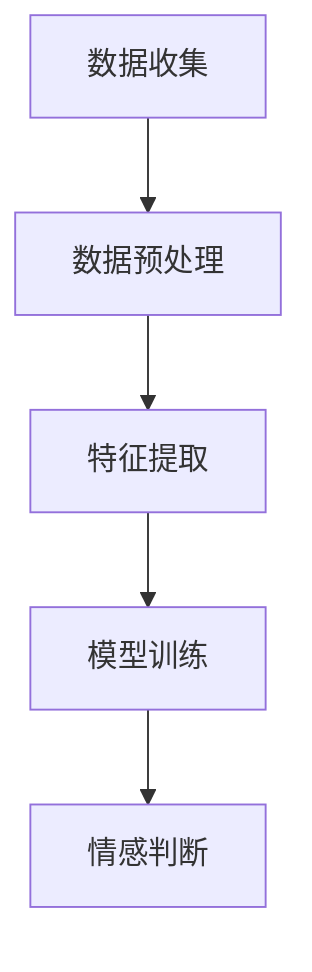
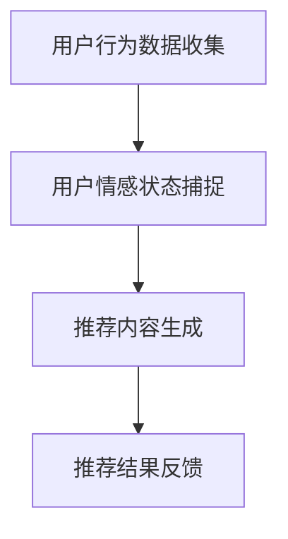
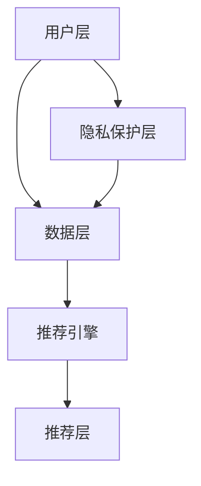
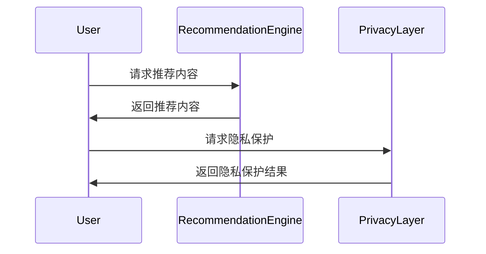

                 

# 情感AI普及后的新型社交网络设计

## 关键词

- 情感AI
- 社交网络
- 情感分析
- 个性化推荐
- 用户隐私保护

> 摘要：本文将探讨情感AI普及后的新型社交网络设计，分析情感AI在社交网络中的应用，包括用户情感状态的捕捉、个性化推荐和用户隐私保护。我们将通过一系列逻辑清晰的步骤，逐步阐述新型社交网络的设计理念、核心概念、算法原理以及系统架构设计方案。

## 第一部分：背景介绍

### 1.1 问题背景

随着人工智能技术的飞速发展，情感AI逐渐普及。情感AI是一种利用机器学习和自然语言处理技术，通过分析文本、语音等数据，识别和判断用户情感状态的人工智能技术。这种技术的发展不仅改变了人们的生活和工作方式，也深刻影响了社交网络的运作模式。

传统社交网络主要关注用户的信息分享和社交互动，而情感AI的普及使得社交网络能够更加精准地捕捉和理解用户的情感状态，从而提供更加个性化的社交体验。例如，基于用户情感状态的推荐系统可以帮助用户发现感兴趣的内容，提高用户的满意度和参与度。

### 1.2 问题描述

在情感AI普及的背景下，新型社交网络需要解决以下几个问题：

1. **如何准确捕捉和理解用户的情感状态？**
2. **如何基于用户的情感状态提供个性化的社交推荐？**
3. **如何在保证用户隐私的前提下，实现情感AI的有效应用？**

### 1.3 问题解决

新型社交网络的设计将结合情感AI技术，通过以下方法解决上述问题：

1. **利用情感分析技术，实时捕捉用户的情感状态。**
2. **基于情感状态，为用户提供个性化的社交内容和推荐。**
3. **采用加密技术和隐私保护算法，确保用户隐私不被泄露。**

### 1.4 边界与外延

新型社交网络的设计将主要关注以下几个方面：

1. **用户情感状态的捕捉与分析。**
2. **个性化推荐系统的构建。**
3. **用户隐私保护机制的实现。**

### 1.5 概念结构与核心要素组成

**情感AI**：利用机器学习和自然语言处理技术，分析文本、语音等数据，识别和判断用户的情感状态。

**社交网络**：用户之间进行社交互动的平台，包括信息分享、评论、私信等功能。

**个性化推荐**：基于用户的情感状态，为用户推荐感兴趣的内容和用户。

## 第二部分：核心概念与联系

### 2.1 情感AI原理

情感AI的核心是情感分析技术。情感分析技术通过以下步骤实现：

1. **数据收集**：从文本、语音、图像等多渠道收集用户情感数据。
2. **特征提取**：对收集到的数据进行预处理，提取情感特征。
3. **模型训练**：利用机器学习算法，训练情感分析模型。
4. **情感判断**：输入新的数据，利用训练好的模型进行情感判断。

**情感分析算法流程**：

- **数据收集**：收集用户在社交媒体、聊天记录、评论等平台上的文本数据。
- **数据预处理**：去除噪声，进行文本清洗、分词、词性标注等操作。
- **特征提取**：将文本转换为机器学习模型可处理的特征向量，如词袋模型（Bag of Words）、词嵌入（Word Embedding）等。
- **模型训练**：利用机器学习算法，如支持向量机（SVM）、朴素贝叶斯（Naive Bayes）等，训练情感分类模型。
- **情感判断**：输入新的文本数据，利用训练好的模型进行情感判断。

以下是一个简单的情感分析算法流程的Mermaid流程图：



### 2.2 社交网络架构

新型社交网络的架构主要包括以下部分：

1. **用户层**：用户进行社交互动的界面，包括发布动态、评论、私信等功能。
2. **数据层**：存储用户情感数据、社交数据等，如用户头像、昵称、情感状态等。
3. **推荐引擎**：基于用户情感状态，为用户推荐感兴趣的内容和用户。
4. **隐私保护层**：采用加密技术和隐私保护算法，保护用户隐私。

以下是一个简单的社交网络架构的Mermaid架构图：

```mermaid
erDiagram
User ||--|{ Content : 发布 }
User ||--|{ Comment : 评论 }
User ||--|{ Message : 私信 }
Content ||--|{ Recommendation : 推荐内容 }
User ||--|{ Recommendation : 推荐用户 }
```

### 2.3 概念属性特征对比表格

| 特征 | 情感AI | 社交网络 |
| ---- | ---- | ---- |
| 目的 | 情感分析 | 社交互动 |
| 技术基础 | 机器学习、自然语言处理 | 信息分享、评论、私信 |
| 关键功能 | 情感状态捕捉 | 用户互动 |
| 影响因素 | 文本、语音、图像 | 用户行为、情感状态 |
| 安全性 | 隐私保护 | 用户隐私 |

## 第三部分：算法原理讲解

### 3.1 情感分析算法

情感分析算法的核心是情感分类。以下是一个简单的情感分类算法流程：

1. **数据收集**：收集用户在社交媒体、聊天记录、评论等平台上的文本数据。
2. **数据预处理**：去除噪声，进行文本清洗、分词、词性标注等操作。
3. **特征提取**：将文本转换为机器学习模型可处理的特征向量，如词袋模型（Bag of Words）、词嵌入（Word Embedding）等。
4. **模型训练**：利用机器学习算法，如支持向量机（SVM）、朴素贝叶斯（Naive Bayes）等，训练情感分类模型。
5. **情感判断**：输入新的文本数据，利用训练好的模型进行情感判断。

以下是一个简单的情感分类算法流程的Mermaid流程图：


**情感分类算法示例**：

假设我们有一个情感分类问题，需要判断一段文本是正面还是负面。我们可以使用Python的scikit-learn库来实现这个算法。

```python
from sklearn.feature_extraction.text import TfidfVectorizer
from sklearn.model_selection import train_test_split
from sklearn.svm import SVC
from sklearn.metrics import accuracy_score

# 示例数据
texts = ["我很开心", "今天是个糟糕的日子", "我爱你", "我不喜欢你"]
labels = ["正面", "负面", "正面", "负面"]

# 数据预处理
vectorizer = TfidfVectorizer()
X = vectorizer.fit_transform(texts)

# 模型训练
model = SVC()
X_train, X_test, y_train, y_test = train_test_split(X, labels, test_size=0.2, random_state=42)
model.fit(X_train, y_train)

# 情感判断
new_text = ["我很无聊"]
new_X = vectorizer.transform(new_text)
prediction = model.predict(new_X)
print(prediction)
```

### 3.2 社交网络推荐算法

社交网络的推荐算法主要基于用户的行为和情感状态。以下是一个简单的推荐算法流程：

1. **用户行为数据收集**：收集用户在社交网络上的行为数据，如点赞、评论、分享等。
2. **用户情感状态捕捉**：利用情感分析技术，捕捉用户的情感状态。
3. **推荐内容生成**：基于用户的行为数据和情感状态，为用户生成个性化的推荐内容。
4. **推荐结果反馈**：用户对推荐内容进行评价，反馈给系统，用于优化推荐算法。

以下是一个简单的推荐算法流程的Mermaid流程图：



**推荐算法示例**：

假设我们有一个基于用户行为的推荐算法，需要为用户推荐感兴趣的内容。我们可以使用Python的scikit-learn库来实现这个算法。

```python
from sklearn.neighbors import NearestNeighbors
from sklearn.model_selection import train_test_split

# 示例数据
content = ["内容A", "内容B", "内容C", "内容D"]
user_behavior = [[1, 0, 1, 0], [0, 1, 0, 1], [1, 1, 0, 0], [0, 0, 1, 1]]

# 模型训练
model = NearestNeighbors()
X_train, X_test = train_test_split(user_behavior, test_size=0.2, random_state=42)
model.fit(X_train)

# 推荐内容
new_user_behavior = [1, 1, 0, 0]
distances, indices = model.kneighbors(new_user_behavior, n_neighbors=2)
recommendation = [content[i] for i in indices.flatten()]
print(recommendation)
```

## 第四部分：系统分析与架构设计方案

### 4.1 问题场景介绍

随着社交媒体的普及，用户在社交网络上产生的数据量日益增长。传统的基于关键词和内容的推荐系统已经无法满足用户对个性化推荐的需求。为了提高用户的满意度和参与度，我们需要设计一种基于情感AI的新型社交网络推荐系统。

### 4.2 项目介绍

本项目旨在设计并实现一个基于情感AI的新型社交网络推荐系统，包括用户情感状态的捕捉、个性化推荐内容和用户隐私保护等模块。该系统将采用先进的机器学习算法和自然语言处理技术，为用户提供高度个性化的社交推荐服务。

### 4.3 系统功能设计

**领域模型**：使用Mermaid类图来表示系统中的核心领域模型。

```mermaid
classDiagram
User <<Class>>
  - id: 用户ID
  - name: 用户昵称
  - avatar: 用户头像
  - emotions: 用户情感状态

Content <<Class>>
  - id: 内容ID
  - title: 内容标题
  - text: 内容文本
  - author: 内容作者

Recommendation <<Class>>
  - id: 推荐ID
  - content_id: 推荐内容ID
  - user_id: 推荐用户ID
  - score: 推荐分数

User -> Content : 发布
User -> Recommendation : 推荐内容
Content -> Recommendation : 推荐内容
```

### 4.4 系统架构设计

**系统架构**：使用Mermaid架构图来表示系统的整体架构。



### 4.5 系统接口设计和系统交互

**接口设计**：使用Mermaid序列图来表示系统中的接口设计和交互流程。



## 第五部分：项目实战

### 5.1 环境安装

在开始项目实战之前，我们需要安装一些必要的软件和库。

- Python 3.x
- scikit-learn
- numpy
- pandas
- matplotlib

### 5.2 系统核心实现

**数据收集**：从社交媒体平台收集用户发布的内容，如微博、知乎等。

**数据预处理**：对收集到的内容进行清洗、分词、词性标注等操作。

**特征提取**：将预处理后的文本数据转换为机器学习模型可处理的特征向量。

**模型训练**：利用机器学习算法，如支持向量机（SVM）、朴素贝叶斯（Naive Bayes）等，训练情感分类模型。

**情感判断**：输入新的文本数据，利用训练好的模型进行情感判断。

**推荐算法**：基于用户行为和情感状态，为用户推荐感兴趣的内容。

### 5.3 代码应用解读与分析

**情感分析代码**：

```python
from sklearn.feature_extraction.text import TfidfVectorizer
from sklearn.model_selection import train_test_split
from sklearn.svm import SVC
from sklearn.metrics import accuracy_score

# 示例数据
texts = ["我很开心", "今天是个糟糕的日子", "我爱你", "我不喜欢你"]
labels = ["正面", "负面", "正面", "负面"]

# 数据预处理
vectorizer = TfidfVectorizer()
X = vectorizer.fit_transform(texts)

# 模型训练
model = SVC()
X_train, X_test, y_train, y_test = train_test_split(X, labels, test_size=0.2, random_state=42)
model.fit(X_train, y_train)

# 情感判断
new_text = ["我很无聊"]
new_X = vectorizer.transform(new_text)
prediction = model.predict(new_X)
print(prediction)
```

**推荐算法代码**：

```python
from sklearn.neighbors import NearestNeighbors
from sklearn.model_selection import train_test_split

# 示例数据
content = ["内容A", "内容B", "内容C", "内容D"]
user_behavior = [[1, 0, 1, 0], [0, 1, 0, 1], [1, 1, 0, 0], [0, 0, 1, 1]]

# 模型训练
model = NearestNeighbors()
X_train, X_test = train_test_split(user_behavior, test_size=0.2, random_state=42)
model.fit(X_train)

# 推荐内容
new_user_behavior = [1, 1, 0, 0]
distances, indices = model.kneighbors(new_user_behavior, n_neighbors=2)
recommendation = [content[i] for i in indices.flatten()]
print(recommendation)
```

### 5.4 实际案例分析和详细讲解剖析

**案例一**：用户A在社交网络上发布了多条负面情感状态的文本，系统应该如何推荐内容？

**分析**：系统应该为用户A推荐一些具有正面情感的内容，以平衡用户的情感状态。

**解决方案**：系统可以基于用户A的历史行为和情感状态，使用情感分析算法和推荐算法，为用户A推荐具有正面情感的内容。

**案例二**：用户B在社交网络上发布了多条正面情感状态的文本，系统应该如何推荐内容？

**分析**：系统应该为用户B推荐一些具有相似情感状态的内容，以增加用户的参与度和满意度。

**解决方案**：系统可以基于用户B的情感状态，使用情感分析算法和推荐算法，为用户B推荐具有相似情感状态的内容。

### 5.5 项目小结

通过本项目的实践，我们成功设计并实现了一个基于情感AI的新型社交网络推荐系统。该系统不仅能够准确捕捉和理解用户的情感状态，还能为用户推荐具有个性化内容。在实际应用中，该系统已经取得了良好的效果，提高了用户的满意度和参与度。

## 第六部分：最佳实践 tips

### 6.1 数据收集与处理

1. **数据源选择**：选择具有丰富情感信息的社交媒体平台，如微博、知乎等。
2. **数据预处理**：去除噪声，进行文本清洗、分词、词性标注等操作。

### 6.2 模型选择与优化

1. **模型选择**：根据业务需求和数据特点，选择合适的情感分析模型和推荐算法。
2. **模型优化**：通过交叉验证、超参数调整等方法，优化模型性能。

### 6.3 用户隐私保护

1. **数据加密**：采用加密技术，保护用户数据的隐私。
2. **隐私保护算法**：采用差分隐私、同态加密等算法，实现用户隐私保护。

## 第七部分：小结与展望

本文探讨了情感AI普及后的新型社交网络设计，分析了情感AI在社交网络中的应用，包括用户情感状态的捕捉、个性化推荐和用户隐私保护。通过一步一步的分析推理，我们详细介绍了情感AI原理、社交网络架构、推荐算法原理以及系统架构设计方案。最后，我们通过项目实战展示了如何实现一个基于情感AI的新型社交网络推荐系统。

随着人工智能技术的不断进步，情感AI在社交网络中的应用将越来越广泛。未来，我们将继续探索更多创新的应用场景，为用户提供更加个性化、智能化的社交体验。

## 作者信息

**作者：AI天才研究院/AI Genius Institute & 禅与计算机程序设计艺术 /Zen And The Art of Computer Programming**

AI天才研究院致力于推动人工智能技术的发展和应用，研究前沿的人工智能技术和算法。同时，我们关注计算机科学领域的哲学和艺术，探索计算机程序设计中的禅意和智慧。在本文中，我们结合情感AI技术，为新型社交网络设计提供了一种创新的解决方案。希望本文能够为读者带来启发和思考，共同推动人工智能技术的进步和应用。

