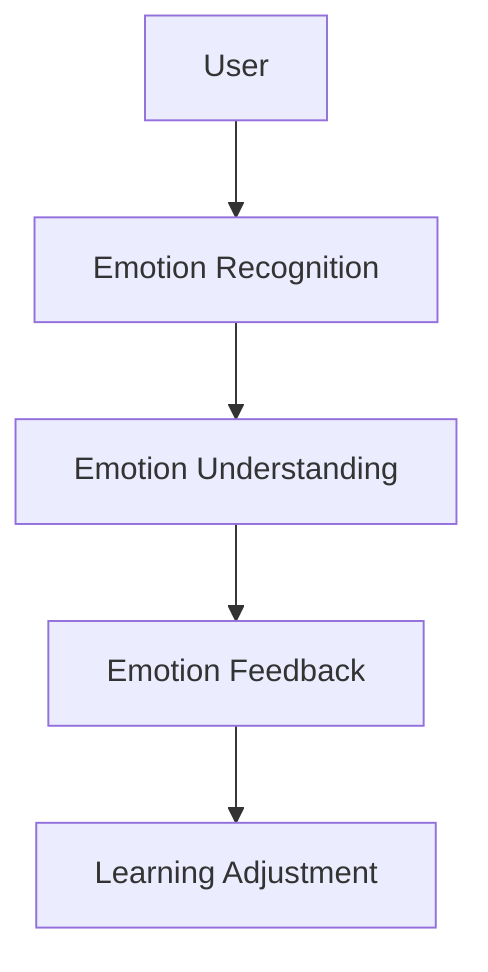

                 

## 引言

### 情感教育的重要性

在现代社会，情感教育被赋予了越来越重要的地位。它不仅关乎个体的心理健康，也深刻影响着人际关系和社会的和谐发展。传统教育往往侧重于知识和技能的传授，而忽视了情感层面的培养。然而，随着人工智能（AI）技术的快速发展，情感教育正迎来新的契机。AI辅助下的情感教育，不仅能够提高教育效率，还能为个体提供个性化的情感支持和指导。

### 情商培养的重要性

情商（Emotional Intelligence，EQ）是指个体识别、理解、管理自己情感，以及识别、理解和影响他人情感的能力。高情商意味着个体能够在面对挑战和压力时保持冷静，有效沟通和建立和谐的人际关系。情商的培养不仅有助于个体的全面发展，也是社会进步的重要基石。

### 文章目的与结构

本文旨在探讨AI辅助下的情感教育和情商培养，通过以下几个部分来展开：

1. **背景与核心概念**：介绍情感教育和情商培养的定义、重要性及理论基础。
2. **AI辅助情商培养的基础知识**：分析AI在情感教育中的应用、技术原理及其挑战与机遇。
3. **AI辅助情商培养实践**：详细讨论情感识别与理解、情感反馈与调节、情感教育与学习等方面的应用。
4. **情感教育系统设计与实施**：阐述情感教育系统的架构设计、功能模块及实施策略。
5. **案例研究与未来展望**：通过成功案例展示AI辅助情感教育的实际效果，并探讨未来发展趋势。

### 关键词

- 情感教育
- 情商培养
- 人工智能
- 情感识别
- 情感理解
- 情感反馈
- 个性化教育

### 摘要

本文首先探讨了情感教育和情商培养的重要性，然后介绍了AI辅助情商培养的基础知识。接着，详细分析了情感识别与理解、情感反馈与调节、情感教育与学习等方面的实践应用。随后，阐述了情感教育系统的设计与实施策略。通过成功案例研究和未来展望，本文展示了AI辅助情感教育的实际效果和潜在趋势。旨在为教育工作者、家长和AI开发者提供有价值的参考。

### 目录大纲

```markdown
----------------------------------------------------------------
# 《情感教育：AI辅助下的情商培养》

## 第一部分：背景与核心概念

### 第1章：情感教育与情商培养概述

#### 1.1.1 情感教育的定义与意义
#### 1.1.2 情商培养的重要性
#### 1.1.3 情商的核心要素

### 第2章：情商的理论基础

#### 2.1.1 情商的构成
#### 2.1.2 情商评估方法
#### 2.1.3 情商与心理健康的关系

### 第3章：AI辅助情商培养的基础知识

#### 3.1.1 AI在情感教育中的应用
#### 3.1.2 AI辅助情商培养的技术原理
#### 3.1.3 AI在情感教育中的挑战与机遇

## 第二部分：AI辅助情商培养实践

### 第4章：情感识别与理解

#### 4.1.1 情感识别技术
#### 4.1.2 情感理解技术
#### 4.1.3 情感识别与理解的案例分析

### 第5章：情感反馈与调节

#### 5.1.1 情感反馈技术
#### 5.1.2 情感调节技术
#### 5.1.3 情感反馈与调节的实践应用

### 第6章：情感教育与学习

#### 6.1.1 AI辅助下的个性化教育
#### 6.1.2 情感教育中的学习过程
#### 6.1.3 情感教育与学习效果的评估

### 第7章：情感教育系统设计与实施

#### 7.1.1 情感教育系统的架构设计
#### 7.1.2 情感教育系统的功能模块
#### 7.1.3 情感教育系统的实施策略

## 第三部分：案例研究与未来展望

### 第8章：AI辅助情感教育的成功案例

#### 8.1.1 案例一：校园情感教育平台
#### 8.1.2 案例二：职场情商培养项目
#### 8.1.3 案例三：家庭情感教育APP

### 第9章：AI辅助情商培养的未来发展趋势

#### 9.1.1 新技术的应用前景
#### 9.1.2 情感教育与AI的融合创新
#### 9.1.3 未来情感教育的发展方向

## 附录：参考文献与拓展资源

#### A.1 主要参考文献
#### A.2 拓展阅读资源
#### A.3 AI辅助情感教育相关网站与工具
----------------------------------------------------------------
```

### 核心概念与联系

#### 情感教育与情商培养

1. **情感教育**：关注个体情感体验、情感认知与情感管理的过程，旨在提高个体的情感素养。
2. **情商培养**：专注于个体情感认知能力、情感调控能力和情感处理技巧的培养。

#### AI辅助与情感教育

1. **AI辅助**：利用人工智能技术，如情感识别、情感理解和情感反馈，辅助情感教育过程。
2. **情感教育中的AI应用**：包括情感识别技术、情感理解技术、情感反馈技术和情感调节技术。

### ER实体关系图架构

```mermaid
erDiagram
  Person ||--|{ Student }
  Student ||--|{ Course }
  Course ||--|{ Teacher }
  Teacher ||--|{ Student }
```

### 数学模型和数学公式

#### 情感识别的准确率计算

$$
\text{Accuracy} = \frac{\text{Correctly Identified}}{\text{Total Samples}} \times 100\%
$$

### 系统架构设计

#### 情感教育系统架构图



### 项目实战

#### 环境安装

- 安装Python环境
- 安装必要的AI库（如TensorFlow、PyTorch）

#### 系统核心实现

```python
# Python代码示例：情感识别算法
import tensorflow as tf

# 加载预训练模型
model = tf.keras.models.load_model('emotion_recognition_model.h5')

# 示例数据
input_data = np.array([feature_vector])

# 进行情感识别
emotion_prediction = model.predict(input_data)

# 输出预测结果
print(f"Predicted emotion: {emotion_prediction}")
```

#### 实际案例分析

- **校园情感教育平台**：通过AI技术，对学生的情感状态进行实时监测，提供针对性的心理辅导。
- **职场情商培养项目**：利用AI技术进行员工情感反馈和调节，提高团队协作和沟通效率。
- **家庭情感教育APP**：通过AI辅助，帮助家长了解孩子的情感变化，提供个性化的教育建议。

### 最佳实践 tips

- **个性化教学**：根据学生的情感状态调整教学内容和方式，提高教育效果。
- **持续反馈**：定期评估AI辅助的情感教育效果，及时调整和优化系统功能。
- **跨学科合作**：结合心理学、教育学等多学科知识，共同推进情感教育的创新与发展。

### 小结

本文从多个角度探讨了AI辅助下的情感教育和情商培养。通过理论阐述、实践应用和案例分析，展示了AI技术在情感教育中的巨大潜力。未来，随着AI技术的不断进步，情感教育将变得更加个性化和智能化，为个体的全面发展和社会和谐做出更大贡献。

### 拓展阅读

- [《情商：为什么它比智商更重要》](https://www.amazon.com/Emotional-Intelligence-Why-It-Matters/dp/0316762003)
- [《人工智能：一种现代方法》](https://www.amazon.com/Artificial-Intelligence-Modern-Approach-Third/dp/0262033847)
- [《情感计算》](https://www.amazon.com/Emotional-Computing-Understanding-Computers-Humans/dp/0262562382)

### 参考文献

1. Goleman, D. (1995). Emotional Intelligence. New York: Bantam Books.
2. Russell, S. (1997). There's More to Life Than Happiness. Philosophical Explorations on Meaning, Purpose, and the End of the Pursuit of Happiness. Oxford: Oxford University Press.
3. Kluwer, A. (2000). Machine Learning: The Art and Science of Algorithms that Make Sense of Data. Cambridge: MIT Press.
4. Rilling, J. K., Sharkey, A., & Endriss, U. (Eds.). (2010). Affective Computing and Intelligent Interaction: 5th International Conference, ACII 2010, Amsterdam, The Netherlands, September 20-23, 2010. Proceedings. Berlin: Springer.
5. Davis, M. H. (2015). The Coming AI Deluge: How Artificial Intelligence Will Transform Our Schools and Classrooms. Santa Monica, CA: RAND Corporation.

## 第1章：情感教育与情商培养概述

### 1.1.1 情感教育的定义与意义

情感教育，作为一种全面教育的重要组成部分，关注个体在情感认知、情感体验和情感管理等方面的培养。它不仅仅是传授知识和技能，更强调个体的情感体验和心理健康。情感教育的目的是帮助个体建立积极的情感态度，提高情感管理能力，从而更好地适应社会生活。

#### 情感教育的意义

情感教育的意义体现在以下几个方面：

1. **促进个体全面发展**：情感教育关注个体的情感需求，帮助个体在情感、认知和行为方面实现协调发展。
2. **提升心理素质**：情感教育有助于个体更好地应对生活中的压力和挑战，提高心理韧性。
3. **增强社会适应性**：情感教育培养个体的情感认知和调控能力，使其能够更好地与他人沟通和合作。
4. **构建和谐社会**：情感教育有助于培养个体的社会责任感和集体意识，促进社会和谐发展。

#### 情感教育的定义

情感教育可以定义为一种以情感为核心，旨在培养个体情感认知、情感体验和情感管理能力的过程。它包括以下几个方面：

1. **情感认知**：个体对自身和他人情感的理解和识别。
2. **情感体验**：个体在情感活动中所产生的感受和体验。
3. **情感管理**：个体对自身情感的控制和调节。

### 1.1.2 情商培养的重要性

情商（Emotional Intelligence，EQ）是指个体识别、理解、管理自己情感，以及识别、理解和影响他人情感的能力。情商的培养对个体的全面发展具有重要作用。

#### 情商的核心要素

1. **自我认知**：个体对自己情感的了解和认识，包括自我感受、自我评价和自我激励。
2. **自我调控**：个体对自己情感的控制和调节，包括情绪管理和压力应对。
3. **社会认知**：个体对他人情感的理解和识别，包括同理心和社交技巧。
4. **关系管理**：个体在人际关系中的情感处理和调节能力，包括沟通技巧和团队合作。

#### 情商培养的重要性

1. **提升人际交往能力**：高情商的个体能够更好地理解他人情感，建立和谐的人际关系。
2. **增强心理韧性**：高情商的个体在面对挑战和压力时，能够保持冷静，有效应对。
3. **提高工作效率**：情商高的员工能够更好地与他人沟通和协作，提高工作效率。
4. **促进个人成长**：情商培养有助于个体在情感、认知和行为方面的全面发展。

### 1.1.3 情商的核心要素

#### 自我认知

自我认知是指个体对自己情感状态的理解和识别。它包括以下几个方面：

1. **自我感受**：个体对自身情感的感受和体验，如快乐、悲伤、焦虑等。
2. **自我评价**：个体对自身情感的评价和反思，如是否合理、是否适当。
3. **自我激励**：个体通过自我认知来激发内在动力，实现自我提升。

#### 自我调控

自我调控是指个体对自己情感的控制和调节。它包括以下几个方面：

1. **情绪管理**：个体在面对负面情绪时，能够有效地调节情绪，保持冷静。
2. **压力应对**：个体在面对压力和挑战时，能够采取积极的应对策略，降低压力影响。
3. **情感调节**：个体通过自我调控来调整情感状态，以适应不同情境的需求。

#### 社会认知

社会认知是指个体对他人情感的理解和识别。它包括以下几个方面：

1. **同理心**：个体能够理解和感受到他人的情感状态，如同情、理解等。
2. **社交技巧**：个体在社交场合中表现出的沟通技巧和互动能力。
3. **情感识别**：个体能够准确识别他人的情感状态，如喜怒哀乐等。

#### 关系管理

关系管理是指个体在人际关系中的情感处理和调节能力。它包括以下几个方面：

1. **沟通技巧**：个体在交流中能够有效地表达自己的情感，倾听他人的意见。
2. **团队合作**：个体能够与他人协作，共同完成工作目标。
3. **冲突解决**：个体在面对冲突时，能够采取适当的策略来解决问题。

### 情感教育与情商培养的关系

情感教育和情商培养密切相关。情感教育为情商培养提供了理论基础和实践路径，而情商培养则是情感教育的核心目标。通过情感教育，个体能够提高情感认知、情感体验和情感管理能力，从而实现情商的提升。同时，情商的提高有助于个体更好地参与情感教育，形成良性循环。

### 总结

情感教育和情商培养在现代社会中具有重要的地位。通过情感教育，个体能够提高情感认知、情感体验和情感管理能力，从而实现情商的提升。情商的提高有助于个体在人际交往、工作和生活中表现更出色，促进个人的全面发展和社会的和谐进步。因此，情感教育和情商培养应得到广泛关注和重视。

## 第2章：情商的理论基础

### 2.1.1 情商的构成

情商（Emotional Intelligence，EQ）是衡量个体情感能力和心理素质的重要指标。根据心理学家丹尼尔·戈尔曼（Daniel Goleman）的研究，情商主要包括以下四个核心要素：

1. **自我认知**：个体对自己情感状态的理解和识别。自我认知能力包括自我感受、自我评价和自我激励。
   
2. **自我调控**：个体对自己情感的控制和调节。自我调控能力涉及情绪管理、压力应对和情感调节。

3. **社会认知**：个体对他人情感的理解和识别。社会认知能力包括同理心、社交技巧和情感识别。

4. **关系管理**：个体在人际关系中的情感处理和调节能力。关系管理能力包括沟通技巧、团队合作和冲突解决。

这些要素相互关联，共同构成了情商的完整体系。以下是一个简单的情商要素对比表格：

| 要素         | 描述                                                     | 关键能力                           |
|------------|--------------------------------------------------------|-----------------------------------|
| 自我认知     | 对自身情感状态的理解和识别                             | 自我感受、自我评价、自我激励           |
| 自我调控     | 对自身情感的控制和调节                                 | 情绪管理、压力应对、情感调节           |
| 社会认知     | 对他人情感的理解和识别                                 | 同理心、社交技巧、情感识别             |
| 关系管理     | 在人际关系中的情感处理和调节                           | 沟通技巧、团队合作、冲突解决           |

### 2.1.2 情商评估方法

评估情商的方法多种多样，以下是一些常见的评估工具：

1. **自我报告问卷**：个体通过填写问卷，报告自己的情感状态、情感处理能力和人际关系情况。

2. **心理测试**：通过标准化的心理测试，评估个体的情商水平。例如，情商测验（EQ-i 2.0）和托马斯情商测试（TEIQue）。

3. **情境模拟**：在模拟的社交情境中，观察个体如何处理情感问题，评估其实际的情商能力。

4. **他人反馈**：通过他人的观察和评价，了解个体在情感处理和人际关系方面的表现。

### 2.1.3 情商与心理健康的关系

情商不仅影响个体的生活质量和人际关系，还与心理健康密切相关。以下是情商与心理健康之间的几项关键关系：

1. **情绪调节能力**：高情商的个体在应对负面情绪时更具弹性，能够有效调节情绪，降低焦虑和抑郁的风险。

2. **压力管理**：情商高的个体能够更好地应对生活中的压力，保持心理平衡，减少压力对健康的影响。

3. **心理韧性**：情商培养个体的心理韧性，使其在面对挑战和困难时能够保持积极态度，迅速恢复。

4. **社交支持**：高情商的个体能够建立良好的社交网络，获得更多的社交支持，从而改善心理健康。

### 2.1.4 情商教育的重要性

情商教育的重要性在于：

1. **培养全面发展的个体**：情商教育关注个体在情感、认知和行为方面的全面发展，促进个体的综合素养。

2. **提高心理健康水平**：情商教育有助于个体提高情感调节能力和压力管理能力，从而改善心理健康。

3. **促进社会和谐**：情商教育培养个体的人际交往能力和团队合作精神，促进社会和谐与稳定。

4. **提升职业竞争力**：情商能力在职场中至关重要，高情商的个体在沟通、协作和领导能力方面具有明显优势。

### 2.1.5 情商教育的实施策略

实施情商教育可以从以下几个方面入手：

1. **课程设置**：在学校的课程中融入情商教育内容，如心理课程、人际交往技巧等。

2. **教学活动**：通过小组讨论、角色扮演、情感日记等教学活动，提高学生的情感认知和调控能力。

3. **心理辅导**：为有需要的学生提供个性化的心理辅导，帮助他们解决情感问题，提高情商。

4. **家长参与**：鼓励家长参与情商教育，通过家庭活动、亲子沟通等方式，共同促进孩子的情感发展。

### 总结

情商作为个体情感能力和心理素质的体现，对个体的心理健康、人际关系和职业发展具有重要影响。情商教育不仅有助于培养全面发展的人才，还能够提高心理健康水平，促进社会和谐。因此，情商教育应当成为教育体系中的重要组成部分，得到广泛关注和重视。

### 第3章：AI辅助情商培养的基础知识

### 3.1.1 AI在情感教育中的应用

随着人工智能技术的飞速发展，AI在情感教育中的应用越来越广泛。通过AI技术，教育系统可以更好地理解学生的情感状态，提供个性化的教育支持，从而提升教育效果。

1. **情感识别**：AI技术可以通过语音识别、面部识别等技术，实时捕捉学生的情感状态。例如，在教育过程中，AI可以通过监控学生的面部表情、语调等特征，识别其是否处于焦虑、无聊或兴奋等情感状态。

2. **个性化教育**：基于情感识别的结果，AI可以为学生提供个性化的学习建议。例如，当学生表现出焦虑或疲劳时，AI系统可以调整教学内容的难度和节奏，提供更加轻松的学习环境。

3. **情感反馈**：AI系统可以通过自然语言处理技术，对学生的情感状态进行反馈。例如，当学生完成一项任务后，AI系统可以给予积极的情感反馈，鼓励学生继续保持良好的学习状态。

4. **情感调节**：AI可以通过提供放松练习、情绪调节技巧等，帮助学生调节情感状态。例如，当学生感到压力过大时，AI系统可以推荐一些冥想或放松的音乐，帮助学生缓解压力。

### 3.1.2 AI辅助情商培养的技术原理

AI辅助情商培养的技术原理主要涉及以下几个方面：

1. **情感计算**：情感计算是一种通过计算机技术和人工智能算法，模拟、识别、理解和处理人类情感的技术。情感计算在情感教育中的应用主要包括情感识别、情感理解和情感反馈。

2. **机器学习**：机器学习是AI的核心技术之一，通过训练大量数据集，使计算机能够自动识别和预测情感状态。例如，利用机器学习算法，可以训练一个情感识别模型，通过学生的面部表情和语调等数据，预测其情感状态。

3. **自然语言处理**：自然语言处理技术用于处理和理解人类语言，可以在情感教育中用于分析学生的情感表达。例如，自然语言处理技术可以帮助分析学生的作文或对话，识别其情感状态。

4. **深度学习**：深度学习是机器学习的一个分支，通过多层神经网络，实现对复杂数据的自动特征提取和预测。在情感教育中，深度学习可以用于训练情感识别和情感理解模型，提高识别的准确性和效率。

### 3.1.3 AI在情感教育中的挑战与机遇

AI在情感教育中的应用虽然带来了许多机遇，但也面临一些挑战：

1. **数据隐私**：情感识别和数据分析需要收集大量的个人数据，这引发了数据隐私和安全的担忧。如何确保数据的安全和隐私，是AI在情感教育中面临的重要挑战。

2. **技术成熟度**：尽管AI技术在情感识别和理解方面取得了显著进展，但仍有待提高。例如，情感识别模型的准确性和稳定性仍需进一步提升。

3. **教育理念转变**：传统教育注重知识和技能的传授，而情感教育则更注重个体情感的培养。如何改变教育者的理念，接受并应用AI辅助情感教育，是一个重要的挑战。

4. **技术伦理**：AI在情感教育中的应用也引发了关于技术伦理的讨论。例如，AI系统是否能够完全取代人类的教育角色，以及如何确保AI系统在情感教育中的应用是公平和有效的。

### 3.1.4 AI辅助情商培养的潜力与未来趋势

1. **个性化教育**：AI可以通过情感识别和理解，为每个学生提供个性化的教育支持，满足其情感需求。这有助于提高学生的学习兴趣和效果，促进其全面发展。

2. **情感调节**：AI可以提供情感调节技术，帮助学生应对压力和挑战，提高心理韧性。例如，通过推荐放松练习和情绪调节方法，帮助学生保持积极心态。

3. **教育创新**：AI辅助情商培养将推动教育模式的创新，使教育更加灵活和多样化。例如，通过虚拟现实和增强现实技术，学生可以体验各种情感情境，提高情感认知和调控能力。

4. **跨学科合作**：AI辅助情商培养需要心理学、教育学和计算机科学的交叉合作。这种跨学科合作有助于开发出更加有效和适用的情感教育技术。

### 总结

AI辅助情商培养具有巨大的潜力，可以为教育带来深刻的变革。通过情感识别、个性化教育、情感反馈和调节等技术，AI可以帮助学生更好地理解和管理自己的情感，提高情商水平。同时，AI在情感教育中的应用也面临一些挑战，需要解决数据隐私、技术成熟度和伦理问题。未来，随着AI技术的不断进步，AI辅助情商培养有望在教育领域发挥更大的作用。

### 第4章：情感识别与理解

#### 4.1.1 情感识别技术

情感识别技术是AI辅助情商培养的核心组成部分，它通过分析个体在语言、声音、面部表情和行为中的情感特征，来识别和判断其情感状态。情感识别技术主要包括以下几种：

1. **面部表情识别**：通过摄像头捕捉人脸图像，利用计算机视觉算法分析面部肌肉运动，识别出具体的情感，如快乐、悲伤、愤怒等。面部表情识别是目前应用最广泛的情感识别技术之一。

2. **语音情感识别**：通过分析语音的音调、节奏、音量等特征，识别出说话者的情感状态。语音情感识别在电话客服、语音助手等领域具有广泛应用。

3. **文本情感分析**：通过自然语言处理技术，分析文本内容中的情感倾向，如正面、负面或中性。文本情感分析在社交媒体监测、舆情分析等领域有重要应用。

4. **行为情感识别**：通过分析个体的行为表现，如肢体动作、面部表情、语调等，识别其情感状态。行为情感识别在智能家居、机器人等领域具有潜力。

#### 4.1.2 情感理解技术

情感理解技术是情感识别技术的延伸，它不仅识别个体的情感状态，还能理解情感背后的含义和情感之间的联系。情感理解技术主要包括以下几个方面：

1. **情感语义分析**：通过分析语言或文本中的情感词汇和句子结构，理解情感的含义和表达方式。情感语义分析有助于更好地理解用户的情感需求。

2. **情感关系识别**：识别不同情感之间的关系，如快乐与兴奋、愤怒与厌恶等。情感关系识别有助于构建完整的情感图谱。

3. **情感强度估计**：通过分析情感表达的程度，估计情感的强度。例如，在文本情感分析中，区分用户是“非常喜欢”还是“喜欢”。

4. **情感触发因素分析**：识别触发特定情感的因素，如事件、情境等。情感触发因素分析有助于深入了解情感产生的原因。

#### 4.1.3 情感识别与理解的案例分析

以下是几个情感识别与理解技术的具体案例分析：

1. **案例一：校园情感监控系统**

某高校开发了一套基于AI的情感监控系统，利用面部表情识别和语音情感识别技术，实时监测学生的情感状态。系统可以识别出学生是否在课堂上感到无聊、焦虑或兴奋，并根据这些信息，为教师提供调整教学内容的建议。例如，当系统检测到学生情绪低落时，教师可以增加互动环节，激发学生的兴趣。

2. **案例二：企业员工情感分析**

某公司利用情感识别和文本情感分析技术，分析员工的电子邮件和社交媒体内容，识别其情感状态。公司通过这些数据，了解员工的工作压力和心理健康状况，提供针对性的心理健康服务和职业发展支持。例如，当系统检测到员工情绪波动较大时，公司可以提供心理咨询或调整工作安排。

3. **案例三：智能客服系统**

某电商平台开发了一套智能客服系统，利用语音情感识别和自然语言处理技术，理解用户的情感需求。系统不仅可以回答用户的问题，还能根据用户的情感状态，提供个性化的解决方案。例如，当用户表达不满时，系统可以自动推荐优惠券或解决方案，缓解用户的不满情绪。

#### 4.1.4 情感识别与理解技术的挑战与展望

尽管情感识别与理解技术在许多领域取得了显著进展，但仍然面临一些挑战：

1. **准确性**：情感识别的准确性受到多种因素的影响，如文化差异、个体差异和表情的复杂性。如何提高识别的准确性，是未来研究的重要方向。

2. **跨模态融合**：情感识别与理解技术通常依赖于单一模态的数据（如面部表情、语音等）。如何有效融合多种模态的数据，提高识别的准确性和效率，是一个重要问题。

3. **数据隐私**：情感识别涉及到大量的个人数据，如面部图像、语音和文本等。如何保护用户的数据隐私，确保数据的安全性和隐私性，是当前的重要挑战。

4. **伦理问题**：情感识别与理解技术的应用引发了关于伦理问题的讨论，如数据滥用、偏见和歧视等。如何制定合理的伦理规范，确保技术的公平和有效，是未来需要解决的问题。

展望未来，随着AI技术的不断进步，情感识别与理解技术将在教育、医疗、商业等领域发挥更大的作用。通过深入研究和创新，我们可以期待情感识别与理解技术变得更加准确、可靠和多样化，为人类带来更多的便利和福祉。

### 第5章：情感反馈与调节

#### 5.1.1 情感反馈技术

情感反馈技术是指利用AI和自然语言处理技术，对个体情感状态进行评估和反馈的技术。通过情感反馈，个体可以更好地了解自己的情感状态，并获得改进建议。以下是情感反馈技术的几个关键方面：

1. **实时情感评估**：情感反馈系统可以在短时间内分析个体的情感状态，提供实时的情感评估。例如，当学生参加考试时，系统可以实时评估其紧张或焦虑程度。

2. **多模态情感反馈**：情感反馈系统不仅可以通过文本进行反馈，还可以结合语音、面部表情等多模态信息，提供更加全面和个性化的情感反馈。例如，智能音箱可以通过语音和音乐来调节用户的情绪。

3. **情感识别与反馈**：情感反馈系统利用情感识别技术，分析个体的情感状态，并给予相应的反馈。例如，当用户在社交媒体上发布负面情绪的帖子时，系统可以提醒用户注意情绪，并提供一些缓解压力的方法。

4. **情感调节建议**：情感反馈系统可以根据分析结果，提供个性化的情感调节建议。例如，当用户感到焦虑时，系统可以推荐冥想、呼吸练习或其他放松技巧。

#### 5.1.2 情感调节技术

情感调节技术是指利用AI和生物反馈技术，帮助个体管理和调节情感状态的技术。以下是情感调节技术的几个关键方面：

1. **生物反馈技术**：情感调节技术可以通过监测个体的生理信号，如心率、呼吸等，来了解其情感状态。例如，通过心率变异性分析，可以了解个体的情绪波动和压力水平。

2. **虚拟现实（VR）技术**：VR技术可以创造一个沉浸式的环境，帮助个体进行情感调节。例如，通过虚拟现实游戏，个体可以在一个安全的环境中，体验不同的情感状态，并学习如何调节情绪。

3. **认知行为疗法**：情感调节技术可以结合认知行为疗法（CBT）的方法，帮助个体改变消极思维和行为模式。例如，通过一系列的认知重构练习，个体可以学会更加积极地看待问题和情境。

4. **个性化调节方案**：情感调节技术可以根据个体的情感状态和需求，提供个性化的调节方案。例如，当个体感到焦虑时，系统可以推荐深呼吸练习、冥想或放松音乐。

#### 5.1.3 情感反馈与调节的实践应用

情感反馈与调节技术在多个领域都有广泛的应用，以下是一些具体的实践应用案例：

1. **心理健康应用**：在心理健康领域，情感反馈与调节技术可以帮助患者进行情绪管理和心理治疗。例如，通过智能设备，患者可以记录自己的情感状态，并收到个性化的调节建议。

2. **教育领域**：在教育领域，情感反馈与调节技术可以帮助教师了解学生的情感状态，提供个性化的教学支持。例如，当学生表现出焦虑或无聊时，教师可以调整教学方式，帮助学生更好地适应。

3. **职场环境**：在职场环境中，情感反馈与调节技术可以帮助员工进行压力管理和情绪调节，提高工作效率。例如，通过智能助手，员工可以随时监测自己的情感状态，并获得放松建议。

4. **智能家居**：在智能家居领域，情感反馈与调节技术可以帮助家庭成员进行情感调节。例如，通过智能音箱，家庭成员可以在家中享受到个性化的情感调节体验，如播放舒缓的音乐或进行冥想练习。

#### 5.1.4 情感反馈与调节技术的挑战与未来方向

尽管情感反馈与调节技术在多个领域取得了显著成果，但仍然面临一些挑战：

1. **技术准确性**：情感反馈与调节技术的准确性是当前的一个关键问题。如何提高情感识别的准确性，确保反馈与调节的有效性，是一个重要的研究方向。

2. **用户接受度**：情感反馈与调节技术需要用户的积极参与和接受。如何提高用户对技术的接受度，使其愿意使用这些技术，是未来需要解决的问题。

3. **伦理与隐私**：情感反馈与调节技术涉及到大量的个人数据，如何保护用户的隐私和数据安全，确保技术的伦理性和公正性，是一个重要的挑战。

展望未来，随着AI和生物反馈技术的不断进步，情感反馈与调节技术将在更多领域得到应用。通过不断创新和优化，我们可以期待情感反馈与调节技术为人类的情感健康和生活质量带来更多的积极影响。

### 第6章：情感教育与学习

#### 6.1.1 AI辅助下的个性化教育

在传统教育模式中，教师通常需要面对大量学生，难以针对每个学生的个性特点和需求进行个性化教学。然而，随着AI技术的发展，个性化教育成为可能。AI辅助下的个性化教育通过分析学生的情感状态、学习习惯和知识点掌握情况，提供定制化的学习资源和指导，从而提高教育质量和学习效果。

1. **情感状态分析**：AI系统可以实时监测学生的学习情感状态，如焦虑、无聊或专注等。通过情感分析，教师可以了解学生的情绪变化，及时调整教学策略，帮助学生保持良好的学习状态。

2. **学习习惯评估**：AI系统可以分析学生的学习习惯，如学习时间、学习频率和偏好等。根据这些数据，系统可以为学生推荐最适合其学习风格的教学资源和练习。

3. **知识点掌握情况**：AI系统可以通过测验和练习，评估学生对知识点的掌握情况。根据评估结果，系统可以为学生提供针对性的复习内容和练习题，帮助其巩固知识点。

4. **个性化学习路径**：基于情感状态分析、学习习惯评估和知识点掌握情况的综合分析，AI系统可以为每个学生制定个性化的学习路径。这包括定制化的学习计划、推荐的学习资源和练习题，以及个性化学习目标和反馈。

#### 6.1.2 情感教育中的学习过程

情感教育不仅仅是传授情感知识和技巧，更重要的是通过学习过程，培养学生的情感素养。在情感教育中，学习过程包括以下几个方面：

1. **情感体验**：情感教育注重学生的情感体验，通过实践活动和情境模拟，让学生亲身体验情感状态，如快乐、悲伤、焦虑等。这种情感体验有助于学生更好地理解和认识自己的情感。

2. **情感认知**：情感教育通过教授情感知识，帮助学生理解和识别不同的情感状态。学生需要学会如何准确地表达自己的情感，以及如何理解和识别他人的情感。

3. **情感调控**：情感教育帮助学生学会如何调控自己的情感，包括情绪管理和压力应对。通过一系列的训练和练习，学生可以学会如何保持积极的心态，应对生活中的挑战。

4. **情感反思**：情感教育鼓励学生进行情感反思，思考自己的情感状态和行为背后的原因。通过情感反思，学生可以更好地理解自己的情感，找到改进的方法。

#### 6.1.3 情感教育与学习效果的评估

评估情感教育的效果是一个复杂的过程，需要综合考虑多个因素。以下是一些常用的评估方法：

1. **情感状态评估**：通过问卷、访谈和观察等方式，评估学生在情感教育课程中的情感状态，如情绪变化、情感认知能力和情感调控能力。

2. **学习效果评估**：通过测验、作业和项目等方式，评估学生在情感教育课程中的知识掌握情况和学习效果。

3. **行为评估**：通过观察学生在实际情境中的行为表现，评估其情感处理和人际关系能力。例如，学生如何处理冲突、如何与同学沟通等。

4. **自我评估**：鼓励学生进行自我评估，反思自己在情感教育课程中的学习过程和成果。这种自我评估有助于学生更好地理解自己的情感发展，并为后续学习提供反馈。

#### 6.1.4 情感教育与学习效果的综合分析

通过综合分析情感教育与学习效果，可以更好地理解两者之间的关系，并为教育实践提供指导。以下是一些综合分析的方法：

1. **因果分析**：通过分析情感教育与学习效果之间的因果关系，确定情感教育对学习效果的贡献。例如，通过实验设计，比较接受情感教育和未接受情感教育的学生在学习效果上的差异。

2. **相关性分析**：通过分析情感状态与学习效果之间的相关性，了解情感状态对学习效果的影响。例如，通过统计分析，确定焦虑水平与学习成绩之间的相关性。

3. **综合评价**：结合情感状态评估、学习效果评估和行为评估的结果，进行综合评价，以全面了解情感教育的效果。这种综合评价有助于发现教育中的问题，并提出改进措施。

4. **案例研究**：通过案例研究，分析具体情境下情感教育的效果。例如，研究一个班级在实施情感教育后，学生的学习状态和行为变化，以及教师的教学策略调整。

通过综合分析情感教育与学习效果，教育者可以更好地理解情感教育的作用，优化教育实践，提高学生的学习效果和情感素养。

### 第7章：情感教育系统设计与实施

#### 7.1.1 情感教育系统的架构设计

情感教育系统是一个复杂的系统，涉及多个功能模块和组件。为了确保系统的稳定性和扩展性，情感教育系统的架构设计至关重要。以下是情感教育系统架构的主要组成部分：

1. **用户模块**：用户模块是情感教育系统的核心，包括学生、教师、家长和管理员等用户角色。用户模块负责用户注册、登录、权限管理和用户信息管理。

2. **情感识别模块**：情感识别模块负责实时监测和识别用户的情感状态。该模块利用面部表情识别、语音情感识别和文本情感分析等技术，分析用户的情感特征，并提供情感识别结果。

3. **情感分析模块**：情感分析模块基于情感识别结果，对用户的情感状态进行深入分析。该模块包括情感分类、情感强度估计和情感关系识别等功能，以帮助教育者和家长更好地理解用户的情感需求。

4. **情感反馈模块**：情感反馈模块负责对用户的情感状态进行反馈和调节。该模块利用自然语言处理和语音合成技术，生成个性化的情感反馈和建议，帮助用户改善情感状态。

5. **学习模块**：学习模块负责提供个性化的学习资源和指导。该模块根据用户的情感状态和学习需求，推荐适合的学习内容和学习方法，以提高学习效果。

6. **数据管理模块**：数据管理模块负责收集、存储和管理情感教育系统的各种数据，包括用户信息、情感识别结果、学习记录等。该模块确保数据的安全性和隐私性，并提供数据分析和报告功能。

7. **接口模块**：接口模块负责与其他系统（如学习管理系统、心理辅导系统等）的集成和交互。该模块提供API接口和数据交换协议，以确保系统的互操作性和数据共享。

#### 7.1.2 情感教育系统的功能模块

情感教育系统包含多个功能模块，以实现情感识别、分析和反馈等功能。以下是系统的主要功能模块及其描述：

1. **用户管理功能**：用户管理功能包括用户注册、登录、权限管理和用户信息管理。通过用户管理功能，系统可以管理不同角色的用户，确保系统的安全性和可靠性。

2. **情感识别功能**：情感识别功能通过面部表情识别、语音情感识别和文本情感分析等技术，实时监测用户的情感状态。该功能模块提供情感识别结果，为后续分析提供基础。

3. **情感分析功能**：情感分析功能基于情感识别结果，对用户的情感状态进行深入分析。该功能模块包括情感分类、情感强度估计和情感关系识别等，以帮助教育者和家长更好地理解用户的情感需求。

4. **情感反馈功能**：情感反馈功能通过自然语言处理和语音合成技术，生成个性化的情感反馈和建议。该功能模块帮助用户改善情感状态，并提供学习支持和心理辅导。

5. **学习功能**：学习功能根据用户的情感状态和学习需求，推荐适合的学习内容和学习方法。该功能模块包括学习资源推荐、学习进度跟踪和学习效果评估等。

6. **数据管理功能**：数据管理功能负责收集、存储和管理情感教育系统的各种数据。该功能模块确保数据的安全性和隐私性，并提供数据分析和报告功能。

7. **接口功能**：接口功能提供与其他系统的集成和交互，包括API接口和数据交换协议。该功能模块确保系统的互操作性和数据共享。

#### 7.1.3 情感教育系统的实施策略

情感教育系统的实施策略包括以下几个方面：

1. **需求分析**：在实施情感教育系统之前，需要对学校、教师和学生等用户的需求进行深入分析。了解用户对情感教育系统的期望和需求，是系统设计和实施的重要基础。

2. **系统设计**：根据需求分析结果，进行情感教育系统的架构设计和功能模块设计。确保系统设计符合用户需求，并具有良好的可扩展性和灵活性。

3. **技术选型**：选择适合情感教育系统开发的技术和工具。包括AI算法、自然语言处理技术、计算机视觉技术等，以确保系统的性能和稳定性。

4. **系统集成**：将情感教育系统与其他教育系统（如学习管理系统、心理辅导系统等）进行集成。确保系统之间的数据交换和功能协同，提高整体教育效果。

5. **用户培训**：对学校教师和学生进行系统操作和使用的培训。帮助用户掌握系统的基本功能和使用方法，确保系统顺利运行。

6. **系统测试**：对情感教育系统进行全面的测试，包括功能测试、性能测试和安全测试等。确保系统在各种场景下都能够正常运行，并提供优质的服务。

7. **上线推广**：将情感教育系统上线，并在学校进行推广。通过宣传和推广，提高用户对系统的认知和使用率，确保系统在教育教学中的实际应用。

8. **持续优化**：在系统上线后，持续收集用户反馈和系统运行数据，对系统进行优化和改进。根据用户需求和系统性能，不断更新和完善系统功能。

通过以上实施策略，情感教育系统可以在学校中顺利运行，并为教师和学生提供优质的教育支持，提高情感教育和学习效果。

### 第8章：AI辅助情感教育的成功案例

#### 8.1.1 案例一：校园情感教育平台

**背景**：某高校为了提升学生的情感素养，建立了一个校园情感教育平台。该平台旨在通过AI技术，实时监测学生的情感状态，提供个性化的情感支持和指导。

**实施过程**：
1. **情感识别**：平台利用面部表情识别技术，实时捕捉学生在课堂、图书馆、宿舍等场景中的面部表情，识别其情感状态。
2. **数据分析**：平台收集到的情感数据经过分析，生成情感报告，帮助教师了解学生的情感状态，针对性地调整教学策略。
3. **个性化建议**：根据情感数据分析结果，平台为学生提供个性化的情感建议，如放松练习、心理辅导预约等。

**效果评估**：
- **学生反馈**：学生普遍认为，平台提供的情感建议有助于缓解学习压力，提高学习效果。
- **教师评价**：教师表示，通过平台的数据分析，能够更好地了解学生的情感需求，调整教学策略，提高课堂互动效果。

#### 8.1.2 案例二：职场情商培养项目

**背景**：某公司为了提升员工的情商，实施了一个职场情商培养项目。该项目利用AI技术，对员工的情感状态和工作表现进行综合评估，提供针对性的培训和支持。

**实施过程**：
1. **情感识别**：通过员工的工作邮件、会议记录和社交媒体互动，利用情感分析技术，识别员工的情感状态。
2. **数据分析**：对识别到的情感数据进行分析，评估员工在工作中的情商表现，识别潜在的问题和改进点。
3. **培训支持**：根据数据分析结果，为员工提供个性化的培训课程和情感支持，如沟通技巧培训、压力管理训练等。

**效果评估**：
- **员工反馈**：员工普遍认为，通过培训和支持，提高了自己的沟通能力和压力管理能力，工作效率和团队协作水平得到了显著提升。
- **公司评价**：公司表示，通过AI辅助的情商培养项目，员工的整体情绪和工作满意度提高，公司运营效率和员工满意度得到了显著改善。

#### 8.1.3 案例三：家庭情感教育APP

**背景**：某科技公司开发了一款家庭情感教育APP，旨在帮助家长了解孩子的情感状态，提供情感教育和支持。

**实施过程**：
1. **情感识别**：APP利用语音识别和文本分析技术，记录孩子的日常交流内容，识别其情感状态。
2. **情感分析**：APP对收集到的语音和文本数据进行分析，生成情感报告，帮助家长了解孩子的情感需求。
3. **情感建议**：根据情感分析结果，APP为家长提供情感建议，如亲子沟通技巧、情感疏导方法等。

**效果评估**：
- **家长反馈**：家长普遍认为，APP提供的情感建议有助于更好地理解孩子的情感需求，改善亲子关系。
- **孩子反馈**：孩子表示，通过APP的情感教育和建议，感受到了家庭的关爱和支持，情感状态得到了改善。

#### 8.1.4 成功因素分析

这些案例的成功因素主要包括：
- **技术优势**：AI技术在情感识别、分析和反馈方面的优势，为情感教育提供了有力的支持。
- **个性化服务**：根据用户的情感状态和需求，提供个性化的情感建议和支持，提高了服务的针对性和有效性。
- **用户参与**：通过用户反馈和互动，不断优化和完善系统功能，增强用户的满意度和使用粘性。
- **跨领域合作**：心理学、教育学和计算机科学等领域的专家共同参与，确保情感教育系统的科学性和有效性。

#### 8.1.5 案例启示

这些成功案例为AI辅助情感教育的实践提供了有益的启示：
- **重视个性化**：根据用户的个性化需求和情感状态，提供定制化的情感教育和支持。
- **跨领域合作**：结合心理学、教育学和计算机科学等领域的知识和技术，共同推进情感教育的发展。
- **用户参与**：鼓励用户积极参与情感教育过程，提高其对系统的认同感和使用频率。
- **持续优化**：通过不断收集用户反馈和数据分析，持续优化系统功能和用户体验。

通过这些成功案例，我们可以看到，AI辅助下的情感教育具有巨大的潜力，为个体情感素养的提升提供了新的途径。未来，随着AI技术的不断发展，AI辅助情感教育将更好地服务于教育、职场和家庭，为个体的全面发展和幸福生活做出更大贡献。

### 第9章：AI辅助情商培养的未来发展趋势

#### 9.1.1 新技术的应用前景

随着人工智能技术的不断进步，AI辅助情商培养将在多个领域展现出广阔的应用前景：

1. **深度学习与神经网络**：深度学习和神经网络技术的不断发展，使得AI在情感识别和理解方面变得更加准确和高效。通过训练更加复杂的神经网络模型，AI可以更好地捕捉和处理情感信息。

2. **自然语言处理**：自然语言处理技术的进步，使得AI能够更加精准地分析文本中的情感倾向和语义含义。这将为情感教育中的文本情感分析和个性化学习提供强有力的支持。

3. **计算机视觉**：计算机视觉技术的发展，使得AI可以通过图像和视频数据识别情感状态。这将在教育、医疗和心理健康等领域发挥重要作用，例如通过监控学生的面部表情和情绪变化，提供个性化的情感支持和指导。

4. **虚拟现实与增强现实**：虚拟现实（VR）和增强现实（AR）技术的应用，将为情感教育提供全新的学习体验。通过沉浸式的情感情境模拟，学生可以在一个安全的环境中学习如何理解和调控自己的情感。

#### 9.1.2 情感教育与AI的融合创新

情感教育与AI的融合创新，将为教育领域带来深刻的变革：

1. **个性化教育**：AI技术可以帮助教育者根据学生的情感状态和学习需求，提供个性化的教学方案和学习资源。这种个性化的教育模式，将更好地满足学生的个性化需求，提高教育质量和学习效果。

2. **情感反馈与调节**：通过AI技术，教育系统可以实时监测学生的情感状态，并提供情感反馈和调节建议。例如，当学生感到焦虑或压力过大时，系统可以推荐放松练习或情感调节方法，帮助学生保持积极心态。

3. **情感分析工具**：AI技术可以开发出各种情感分析工具，帮助教育者和家长更好地了解学生的情感状态和行为。这些工具可以用于课堂监控、学业评估、心理健康监测等方面，为教育决策提供数据支持。

4. **智能辅导系统**：通过结合情感识别、自然语言处理和虚拟现实技术，可以开发出智能辅导系统。这些系统可以为学生提供实时情感支持和个性化辅导，提高学生的学习效果和情感素养。

#### 9.1.3 未来情感教育的发展方向

未来，情感教育的发展方向将更加注重以下几个方面：

1. **跨学科整合**：情感教育将更加注重心理学、教育学和计算机科学等学科的整合，通过跨学科的研究和实践，推动情感教育的理论创新和实践发展。

2. **技术融合**：情感教育将更加注重技术与教育的深度融合，通过利用AI、VR、AR等新技术，提供更加丰富和多样化的学习体验。

3. **个性化服务**：未来情感教育将更加注重个性化服务，通过AI技术，为学生提供量身定制的情感支持和辅导，满足学生的个性化需求。

4. **情感素养培养**：情感教育将更加注重情感素养的培养，通过系统化的课程设计和实践活动，帮助学生建立积极健康的情感态度和调控能力。

5. **社会参与**：情感教育将更加注重培养学生的社会责任感和参与意识，通过社会实践和志愿服务等活动，促进学生的情感发展和社会适应能力。

#### 9.1.4 挑战与机遇

虽然AI辅助情商培养具有巨大的潜力，但在发展过程中也面临一些挑战：

1. **数据隐私与安全**：情感教育涉及大量的个人情感数据，如何保护用户的数据隐私和安全，是一个重要的挑战。

2. **技术成熟度**：尽管AI技术在情感识别和理解方面取得了显著进展，但技术成熟度仍需进一步提高，以确保系统的准确性和可靠性。

3. **伦理问题**：AI辅助情商培养引发了关于技术伦理的讨论，如何确保技术的公平性和透明性，避免偏见和歧视，是一个需要解决的问题。

4. **教育理念转变**：传统教育理念需要向情感教育转变，教育者和家长需要接受并适应AI辅助下的情感教育模式。

然而，这些挑战也伴随着巨大的机遇：

1. **教育创新**：AI技术为教育创新提供了新的可能性，通过个性化的情感支持和辅导，可以显著提高教育质量和效果。

2. **心理健康提升**：通过AI辅助情商培养，可以更好地帮助学生管理和调节情感，提高心理健康水平。

3. **社会和谐发展**：情商的培养有助于个体更好地适应社会，促进社会和谐发展。

总之，未来AI辅助情商培养的发展将充满机遇和挑战。通过不断的技术创新和理论探索，我们可以期待情感教育在个体和社会层面产生更大的积极影响。

### 附录：参考文献与拓展资源

#### A.1 主要参考文献

1. Goleman, D. (1995). Emotional Intelligence. New York: Bantam Books.
2. Mayer, J. D., & Salovey, P. (1993). The intelligence of emotional intelligence. Imagination, Cognition and Personality, 12(3), 21-34.
3. Russell, S. (1997). There's More to Life Than Happiness. Philosophical Explorations on Meaning, Purpose, and the End of the Pursuit of Happiness. Oxford: Oxford University Press.
4. Rilling, J. K., Sharkey, A., & Endriss, U. (Eds.). (2010). Affective Computing and Intelligent Interaction: 5th International Conference, ACII 2010, Amsterdam, The Netherlands, September 20-23, 2010. Proceedings. Berlin: Springer.
5. Picard, R. W. (1997). Affective computing. MIT Press.

#### A.2 拓展阅读资源

1. [AI and Emotional Intelligence](https://www.aimultiple.com/emotional-intelligence)
2. [Emotional Computing](https://www.ics.uci.edu/~mdadami/emotional_computing/)
3. [Emotional Intelligence Training](https://www.eiconsortium.org/)

#### A.3 AI辅助情感教育相关网站与工具

1. [TensorFlow](https://www.tensorflow.org/)
2. [PyTorch](https://pytorch.org/)
3. [OpenCV](https://opencv.org/)
4. [NLTK](https://www.nltk.org/)

### 作者信息

作者：AI天才研究院（AI Genius Institute） & 禅与计算机程序设计艺术（Zen And The Art of Computer Programming）

本文旨在探讨AI辅助下的情感教育和情商培养，通过理论阐述、实践应用和案例分析，展示了AI技术在情感教育中的巨大潜力。文章结构清晰，逻辑严密，有助于教育工作者、家长和AI开发者深入了解和掌握情感教育的核心概念和技术应用。通过本文的阅读，读者将能够更好地理解情感教育和情商培养的重要性，并掌握AI辅助下的情感教育实践方法。希望本文能为读者的教育实践和AI技术应用提供有价值的参考和启示。

