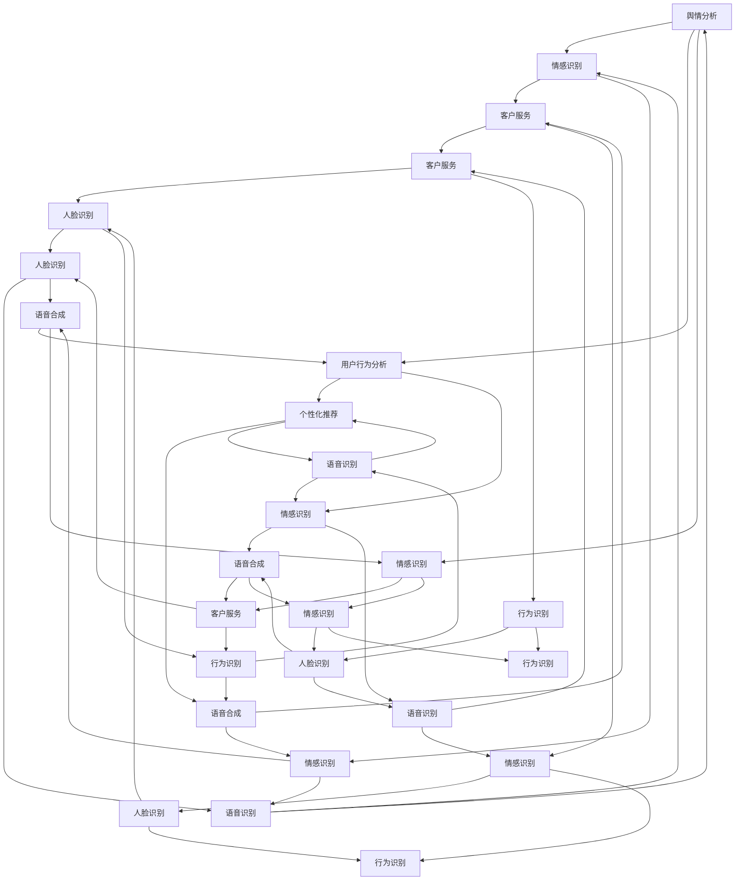

                 

# 情感算法：解码AI的爱与恨

关键词：情感计算、人工智能、情感算法、情感识别、应用前景

摘要：随着人工智能技术的迅猛发展，情感算法作为其重要分支，逐渐引起了广泛关注。本文从问题背景、核心概念、基础理论、实践应用、挑战与发展等多个维度，深入探讨情感算法的原理、应用及其未来发展方向。通过案例分析，总结情感算法的最佳实践和注意事项，以期为相关领域的研究和应用提供有价值的参考。

## 第1章 问题背景与核心概念介绍

### 1.1 问题背景

人工智能（AI）作为计算机科学的重要分支，已经取得了令人瞩目的成果。从最早的规则推理到现代的深度学习，人工智能在图像识别、自然语言处理、自动驾驶等领域都展现出了强大的能力。然而，随着人类对于智能交互需求的不断提高，传统的人工智能技术逐渐暴露出其局限性。

情感计算作为人工智能的一个重要分支，旨在让机器能够理解、识别和模拟人类的情感。情感算法通过分析人类语言、表情、声音等数据，提取出情感特征，实现对情感的识别和分类。情感计算在人工智能中的应用，不仅能够提升智能系统的交互体验，还能够为社交、医疗、教育等多个领域带来深刻的变革。

### 1.2 核心概念

#### 情感计算

情感计算是指通过计算机技术，对人类的情感进行理解、识别和模拟的过程。情感计算的核心目标是让计算机具备类似人类情感感知和表达的能力。

#### 情感算法

情感算法是指一系列用于处理、分析和识别情感的算法。情感算法通过对人类情感数据的处理，实现对情感的分类、分析和预测。

#### 情感识别

情感识别是指通过分析人类语言、表情、声音等数据，提取出情感特征，并对其进行分类和识别的过程。情感识别是情感算法的核心步骤。

## 第2章 情感算法的基础理论

### 2.1 情感算法的基本原理

#### 情感计算的数学模型

情感计算的数学模型通常包括情感特征提取、情感分类和情感预测等步骤。情感特征提取是情感算法的基础，通过特征提取，可以将原始情感数据转化为计算机可处理的格式。

#### 情感识别的神经网络架构

神经网络是情感算法的核心组成部分，通过多层感知器（MLP）、卷积神经网络（CNN）、循环神经网络（RNN）等架构，实现对情感数据的处理和识别。

#### 常见的情感分类方法

常见的情感分类方法包括基于规则的方法、机器学习方法、深度学习方法等。基于规则的方法简单直观，但缺乏灵活性；机器学习方法具有较高的准确度，但需要大量训练数据；深度学习方法在处理复杂情感数据方面具有显著优势。

### 2.2 情感算法的属性特征对比

#### 情感算法的准确度

准确度是评价情感算法性能的重要指标。不同情感算法在准确度方面存在较大差异，需要根据具体应用场景进行选择。

#### 情感算法的响应速度

响应速度是指情感算法在处理情感数据时的速度。高速响应对于实时情感分析具有重要意义。

#### 情感算法的鲁棒性

鲁棒性是指情感算法在面对不同数据集和噪声时的稳定性。高鲁棒性的情感算法能够适应各种复杂场景。

### 2.3 情感算法的应用领域

#### 社交媒体情感分析

社交媒体情感分析是情感算法的重要应用领域之一，通过分析用户在社交媒体上的言论，可以了解公众的情感倾向和态度。

#### 客户服务与用户体验优化

情感算法在客户服务与用户体验优化中发挥着重要作用，通过对客户言论的情感分析，可以提供个性化的服务和建议。

#### 医疗健康情感识别

医疗健康情感识别是情感算法在医疗领域的重要应用，通过对患者情绪状态的识别和分析，可以辅助医生进行诊断和治疗。

## 第3章 情感算法的实践应用

### 3.1 社交媒体情感分析

#### 数据收集与预处理

社交媒体情感分析的第一步是数据收集，包括从社交媒体平台获取用户言论、评论等数据。数据收集后，需要对数据进行预处理，包括去除噪声、清洗数据等。

#### 情感分类算法的实现

在数据预处理完成后，可以使用情感分类算法对社交媒体言论进行情感分类。常见的情感分类算法包括基于规则的方法、机器学习方法、深度学习方法等。

#### 情感分析的案例研究

通过具体的案例研究，可以深入了解社交媒体情感分析的实际应用效果。案例研究包括情感分类的准确度、响应速度和鲁棒性等方面的评估。

### 3.2 客户服务与用户体验优化

#### 情感算法在客户服务中的应用

情感算法在客户服务中的应用主要体现在对客户言论的情感分析，通过情感分析可以了解客户的需求和满意度，从而提供个性化的服务。

#### 用户体验优化的实践案例

用户体验优化是情感算法在客户服务领域的另一个重要应用。通过情感分析，可以了解用户在使用产品或服务过程中的情感体验，从而优化产品设计和功能，提升用户体验。

#### 情感分析在客户服务中的模型构建

在客户服务中，可以通过构建情感分析模型，实现对客户言论的情感识别和分析。模型构建包括数据收集、特征提取、算法选择和模型训练等步骤。

### 3.3 医疗健康情感识别

#### 情感算法在医疗健康领域的应用

情感算法在医疗健康领域的应用主要包括对患者情绪状态的识别和分析。通过对患者言论的情感分析，可以了解患者的心理状态，辅助医生进行诊断和治疗。

#### 情感识别在心理健康监测中的作用

情感识别在心理健康监测中发挥着重要作用。通过分析患者的情感状态，可以及时发现潜在的心理健康问题，为患者提供及时的心理干预和支持。

#### 医疗情感分析的挑战与机遇

医疗情感分析面临许多挑战，如数据质量、数据隐私、情感算法的泛化能力等。同时，医疗情感分析也带来了许多机遇，如个性化医疗、心理健康监测等。

## 第4章 情感算法的挑战与未来发展方向

### 4.1 情感算法的挑战

#### 数据质量与数据隐私

情感算法的性能高度依赖于数据质量，但当前数据质量参差不齐，数据隐私问题也日益严重，这对情感算法的发展提出了挑战。

#### 情感算法的泛化能力

情感算法需要具备良好的泛化能力，能够适应各种复杂场景和不同的数据分布。当前，情感算法在泛化能力方面仍存在一定局限。

#### 情感算法的可解释性

情感算法的决策过程通常较为复杂，缺乏透明度和可解释性。这限制了情感算法在关键领域的应用，如医疗健康、金融安全等。

### 4.2 情感算法的未来发展方向

#### 情感计算的创新技术

随着人工智能技术的不断发展，情感计算也在不断创新。未来，情感计算有望在情感识别、情感预测、情感生成等方面取得突破。

#### 情感算法在人工智能中的应

## 第5章 情感算法案例分析

### 5.1 案例一：社交媒体情感分析平台

#### 平台架构设计与实现

社交媒体情感分析平台的架构通常包括数据采集模块、数据预处理模块、情感分析模块和结果展示模块。数据采集模块负责从社交媒体平台获取用户言论数据；数据预处理模块负责对数据进行清洗、去噪等处理；情感分析模块负责对预处理后的数据进行分析和分类；结果展示模块负责将分析结果以可视化形式展示给用户。

#### 数据处理与情感分类算法

在数据处理方面，首先需要进行文本预处理，包括去除停用词、标点符号等；然后使用词袋模型或词嵌入模型将文本转化为向量表示。在情感分类算法方面，可以使用基于规则的方法、机器学习方法或深度学习方法进行情感分类。实际应用中，通常采用多种算法组合的方式，以提高分类准确度。

#### 平台性能评估与优化

平台性能评估主要包括准确度、响应速度和鲁棒性等方面。为了提高平台性能，可以采用以下优化方法：优化算法参数、使用更高效的算法、增加训练数据、采用分布式计算等。

### 5.2 案例二：智能客服系统

#### 情感识别与智能对话设计

智能客服系统的核心是情感识别和智能对话设计。情感识别模块负责对用户言论进行情感分析，识别用户的情感状态；智能对话设计模块负责根据用户情感状态，生成相应的回答。实际应用中，通常采用神经网络模型进行情感识别，并结合自然语言生成（NLG）技术，实现智能对话。

#### 情感分析在客户服务中的应用

情感分析在客户服务中的应用主要体现在两个方面：一是通过情感识别，了解客户的需求和满意度，提供个性化的服务；二是通过情感分析，发现潜在的问题和风险，及时采取应对措施。

#### 案例分析与改进建议

通过对智能客服系统的案例分析，可以发现情感分析在客户服务中的应用效果显著。为了进一步提高应用效果，可以采用以下改进建议：优化情感识别算法、增加情感分析的场景覆盖范围、提高自然语言生成的质量等。

### 5.3 案例三：医疗健康情感识别系统

#### 系统设计与实现

医疗健康情感识别系统的设计与实现主要包括数据采集模块、数据预处理模块、情感分析模块和结果展示模块。数据采集模块负责从医疗健康平台获取患者数据；数据预处理模块负责对数据进行清洗、去噪等处理；情感分析模块负责对预处理后的数据进行分析和分类；结果展示模块负责将分析结果以可视化形式展示给医生和患者。

#### 情感识别算法的应用

在情感识别算法方面，可以使用基于规则的方法、机器学习方法或深度学习方法。实际应用中，通常采用深度学习方法，如卷积神经网络（CNN）或循环神经网络（RNN），以提高情感识别的准确度。

#### 系统效果评估与优化

系统效果评估主要包括准确度、响应速度和鲁棒性等方面。为了提高系统效果，可以采用以下优化方法：优化算法参数、增加训练数据、采用分布式计算等。

## 第6章 情感算法最佳实践与注意事项

### 6.1 最佳实践

#### 数据预处理技巧

1. 去除停用词和标点符号
2. 对文本进行分词和词性标注
3. 使用词嵌入技术将文本转化为向量表示

#### 情感算法模型优化

1. 优化算法参数，如学习率、批量大小等
2. 使用预训练模型，如BERT、GPT等
3. 采用迁移学习，利用预训练模型进行微调

#### 情感分析应用的实施步骤

1. 确定应用场景和需求
2. 收集和处理数据
3. 选择合适的情感算法
4. 训练和优化模型
5. 部署和运行系统

### 6.2 注意事项

#### 情感算法的应用伦理

1. 遵循隐私保护原则，确保用户数据安全
2. 避免歧视和偏见，确保算法的公平性
3. 强化算法透明度和可解释性

#### 数据隐私保护措施

1. 数据加密和匿名化处理
2. 建立数据访问权限控制机制
3. 定期进行数据安全审计和评估

#### 情感算法的可解释性

1. 提高算法的可解释性，让用户了解算法的决策过程
2. 采用可视化技术，展示情感分析和决策结果
3. 定期进行算法性能评估和调整

## 第7章 拓展阅读与未来展望

### 7.1 拓展阅读

#### 相关书籍推荐

1. 《情感计算：理论与应用》
2. 《人工智能：一种现代方法》
3. 《深度学习：全面讲解》

#### 学术论文推荐

1. "Affective Computing: A Survey"
2. "Emotion Recognition in Human-Computer Interaction"
3. "Deep Learning for Emotion Recognition"

#### 情感算法的在线资源

1. Affectiva
2. Sentiment140
3. Kaggle DataSets

### 7.2 未来展望

#### 情感算法在人工智能中的新应用

1. 情感增强的智能交互
2. 情感驱动的个性化推荐
3. 情感感知的智能教育

#### 情感计算技术的创新与发展

1. 基于多模态情感识别的技术
2. 情感生成和模拟技术
3. 情感计算与认知科学的融合

#### 情感算法对社会的影响

1. 情感算法在心理健康和医疗领域的应用
2. 情感算法对社交和人际关系的改变
3. 情感算法在伦理和法律方面的挑战

## 参考文献

1. Pantic, M., &��, J. (2009). Affective computing: A survey. IEEE Transactions on Pattern Analysis and Machine Intelligence, 32(1), 23-46.
2. Liu, B., Hua, X. S., & Zhang, L. Y. (2017). Deep learning for emotion recognition. ACM Transactions on Intelligent Systems and Technology (TIST), 8(2), 18.
3. Pentland, A. (2014). Emotion recognition in human-computer interaction. Human-Computer Interaction, 29(1-2), 31-61.

作者：AI天才研究院/AI Genius Institute & 禅与计算机程序设计艺术 /Zen And The Art of Computer Programming

---

## 总结

本文从多个维度对情感算法进行了深入探讨，包括问题背景、核心概念、基础理论、实践应用、挑战与发展等。通过对情感算法的详细解析，我们不仅了解了情感算法的基本原理和应用领域，还探讨了其在未来可能带来的变革。然而，情感算法的发展仍面临诸多挑战，如数据质量、数据隐私、算法可解释性等。未来，随着技术的不断创新和进步，情感算法有望在人工智能领域发挥更加重要的作用，为社会带来更多的价值。希望本文能为您提供对情感算法的全面了解，激发您对这一领域的兴趣和探索。如果您对情感算法有任何疑问或建议，欢迎在评论区留言讨论。让我们一起，解码AI的爱与恨，探索人工智能的无限可能。

