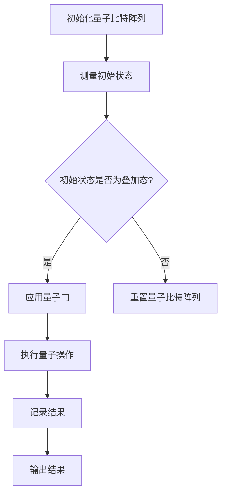
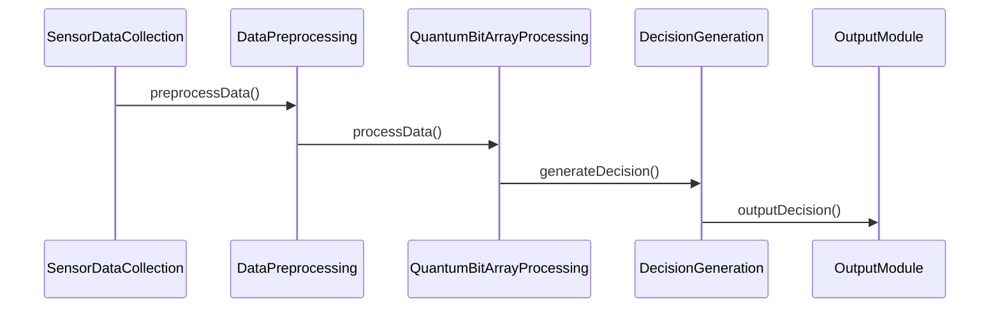

                 

### 第1章：意识 as 量子比特阵列：问题背景与核心概念

#### 1.1 问题背景

##### 1.1.1 问题的提出

在21世纪的科技前沿，人类对大脑和意识的认知正迎来革命性的突破。科学家们一直试图解答一个古老而神秘的问题：意识究竟是什么？传统上，意识被视为人类的主观体验，包括知觉、情感、思考和意愿等方面。然而，随着量子力学的兴起和计算技术的发展，人们开始探索一个令人兴奋的新视角：意识可能是一种量子现象，可以通过量子比特阵列来模拟和解释。

量子比特阵列是量子计算的基础单元，它可以在量子态之间自由转换，从而实现超并行计算。这一特性使得量子计算机在处理某些特定类型的问题时比传统计算机更加高效。意识作为一种复杂的信息处理过程，是否也能够用量子比特阵列来描述？这个问题激发了大量的研究兴趣，成为当代科学探索的一大前沿领域。

##### 1.1.2 意识的本质

意识是一个高度复杂的现象，它不仅涉及大脑的物理过程，还包括心理和社会层面。在神经科学领域，研究者们通过脑成像技术，如功能性磁共振成像（fMRI）和电生理学记录，揭示了大脑各个区域在意识活动中的相互作用。然而，这些研究大多停留在神经元层面，并没有解释意识的本质。

从量子角度出发，意识可能被视为一种量子纠缠现象。量子纠缠是量子力学中的一种奇特现象，其中两个或多个量子系统即使在空间上分隔很远，它们之间的状态也会相互关联。这种纠缠关系可能正是意识的基础。例如，神经系统中的大量神经元通过量子纠缠相互作用，形成了一种高度集成的信息处理网络，这可能是意识的物质基础。

##### 1.1.3 量子比特阵列的概念

量子比特阵列，也称为量子比特串，是量子计算的核心概念。一个量子比特可以处于0和1的叠加态，而量子比特阵列则由多个量子比特组成，它们可以形成复杂的量子态。这些量子态可以用来存储、处理和传输信息，具有超并行计算的能力。

量子比特阵列的操作包括量子门的施加、量子态的测量等。量子门是基本的量子操作，它可以在量子比特之间实现特定的变换。通过一系列量子门的组合，可以实现复杂的量子算法。例如，量子算法Shor可以在多项式时间内分解大整数，这是传统计算机无法实现的。

##### 1.1.4 信息处理的本质

信息处理是计算机科学和人工智能的核心概念，它涉及到信息的获取、存储、处理和传输。在传统计算机中，信息处理基于二进制系统，即信息以0和1的形式存储和传输。然而，量子计算机引入了量子比特的概念，使得信息处理的方式发生了革命性的变化。

量子比特的状态可以同时处于0和1，这种叠加态使得量子计算机能够在多个可能性上并行处理信息。此外，量子纠缠使得量子计算机能够处理高度复杂的关系，这为解决某些特定类型的问题提供了巨大的潜力，例如量子模拟、密码破解等。

#### 1.2 意识 as 量子比特阵列的边界与外延

##### 1.2.1 意识的边界

意识的边界是当前科学研究的难点之一。一方面，意识是人类心理活动的核心，涉及到感知、思考、情感等方面；另一方面，意识又是一种物理现象，与大脑的生物化学过程密切相关。目前，科学家们还没有找到确切的边界，来定义意识的存在和范围。

从量子角度出发，意识的边界可能在于量子纠缠的层级。量子纠缠是一种超越经典物理的相互作用，它可能是意识的基础。然而，如何量化这种纠缠，以及它如何转化为主观体验，仍然是未解之谜。

##### 1.2.2 量子比特阵列的外延

量子比特阵列的外延涉及量子计算的适用范围和潜力。在理论上，量子比特阵列可以处理任意类型的信息，从而实现超并行计算。然而，在实际应用中，量子比特阵列受到多种因素的限制，如量子退相干、噪声和量子比特的脆弱性等。

当前，量子比特阵列主要应用于特定领域，如量子模拟、量子优化和量子密码学等。随着量子技术的不断发展，量子比特阵列的外延有望进一步扩大，从而在更多领域发挥重要作用。

##### 1.2.3 信息处理的范畴

信息处理的范畴非常广泛，从简单的数据处理到复杂的智能推理，信息处理贯穿于计算机科学和人工智能的各个领域。在传统计算机中，信息处理依赖于二进制系统，而在量子计算机中，信息处理依赖于量子比特阵列。

量子比特阵列的信息处理能力使其在处理某些特定类型的问题时具有显著优势。例如，量子算法可以在多项式时间内解决传统计算机需要指数时间的问题，这使得量子计算机在密码破解、优化问题和量子模拟等领域具有巨大的潜力。

### 总结

本章从多个角度探讨了意识、量子比特阵列和信息处理的核心概念及其关系。意识可能是一种量子现象，量子比特阵列可能是一种模拟意识的工具，而信息处理则是这些概念共同作用的舞台。在接下来的章节中，我们将进一步探讨这些概念的具体应用和实现方式。

## 第2章：核心概念与联系

### 2.1 意识的定义与特点

##### 2.1.1 意识的概念

意识是指个体对自己和外部世界的认知和体验的能力。它涉及到感知、思考、情感、记忆和意愿等方面，是人类和许多高等动物所具备的一种心理现象。

##### 2.1.2 意识的特点

1. **主观性**：意识具有主观性，即只有个体自身能够感知和体验。
2. **复杂性**：意识涉及多种心理过程，如感知、思考、情感和记忆，这些过程相互作用，形成了复杂的心理现象。
3. **动态性**：意识是动态变化的，它会随着时间和环境的变化而变化。
4. **个体差异性**：不同个体的意识体验可能存在差异，这种差异受个体的心理、生理和社会因素影响。

##### 2.1.3 意识与其他相关概念的联系

意识与多个相关概念密切相关，包括感知、思考、情感和记忆等。

1. **感知**：感知是意识的基础，它涉及到对感官信息的接收和处理。意识中的感知过程是主观的，每个个体对同一感官信息的感知可能不同。
2. **思考**：思考是意识的高级形式，它涉及到逻辑推理、问题解决和决策等过程。思考过程需要依赖意识中的感知、记忆和情感等基础。
3. **情感**：情感是意识中的重要组成部分，它涉及到个体的情绪体验，如快乐、悲伤、愤怒等。情感与意识的关系是复杂且动态的。
4. **记忆**：记忆是意识中的重要功能，它涉及到对过去信息的存储和回忆。记忆与意识的关系是双向的，一方面，记忆是意识的重要组成部分；另一方面，意识活动也会影响记忆。

### 2.2 量子比特阵列的定义与特点

##### 2.2.1 量子比特阵列的概念

量子比特阵列是量子计算的基础单元，它由多个量子比特组成。一个量子比特可以处于0和1的叠加态，这意味着它同时具有0和1的状态。量子比特阵列通过量子态的叠加和纠缠，可以实现超并行计算。

##### 2.2.2 量子比特阵列的特点

1. **叠加态**：量子比特阵列中的量子比特可以处于叠加态，这意味着它可以同时表示0和1的状态。
2. **纠缠态**：量子比特阵列中的量子比特可以通过量子纠缠相互连接，这意味着它们的状态是相互关联的。
3. **脆弱性**：量子比特阵列容易受到外界干扰，导致量子退相干。因此，在量子计算中，如何保持量子态的稳定性是一个重要挑战。

##### 2.2.3 量子比特阵列与其他相关概念的联系

量子比特阵列与多个相关概念密切相关，包括量子门、量子算法和量子模拟等。

1. **量子门**：量子门是量子计算中的基本操作，它可以在量子比特之间实现特定的变换。量子比特阵列通过量子门的作用，可以实现复杂的量子计算。
2. **量子算法**：量子算法是利用量子比特阵列进行信息处理的方法。与经典算法不同，量子算法在处理某些特定类型的问题时具有显著优势，如量子模拟、量子优化和量子密码学等。
3. **量子模拟**：量子模拟是利用量子比特阵列模拟量子系统的过程。通过量子模拟，可以研究量子系统的性质和行为，从而深入理解量子现象。

### 2.3 信息处理的定义与特点

##### 2.3.1 信息处理的概念

信息处理是指对信息进行获取、存储、处理和传输的过程。它涉及到计算机科学、人工智能和通信技术等多个领域。

##### 2.3.2 信息处理的特点

1. **并行性**：信息处理可以同时处理多个任务或数据，具有并行性。
2. **智能性**：信息处理可以模拟人类的思维过程，具有智能性。
3. **适应性**：信息处理可以根据环境和需求的变化，自适应地调整处理方式。
4. **多样性**：信息处理可以应用于各种领域，如科学计算、数据分析、图像处理和自然语言处理等。

##### 2.3.3 信息处理与其他相关概念的联系

信息处理与多个相关概念密切相关，包括计算机系统、算法和数据等。

1. **计算机系统**：计算机系统是信息处理的基础设施，它包括硬件和软件两个方面。硬件提供计算能力，软件提供处理方法。
2. **算法**：算法是信息处理的核心，它描述了信息处理的具体步骤和过程。不同的算法可以解决不同类型的问题。
3. **数据**：数据是信息处理的原料，它是信息处理的目标和依据。数据的质量和数量直接影响信息处理的效率和效果。

### 总结

本章对意识、量子比特阵列和信息处理的核心概念及其特点进行了详细分析，并探讨了它们之间的联系。这些核心概念构成了意识作为量子比特阵列的信息处理基础，为后续章节的深入讨论提供了理论基础。

### 第3章：算法原理讲解

#### 3.1 意识 as 量子比特阵列的算法原理

##### 3.1.1 算法概述

意识作为量子比特阵列的算法，旨在通过模拟大脑中神经元的量子纠缠，实现对信息的高效处理和计算。这个算法的核心思想是将意识中的信息处理过程抽象为量子比特阵列上的量子计算操作，从而利用量子计算的优势来提升信息处理的效率。

##### 3.1.2 算法流程图

首先，我们使用Mermaid语法绘制算法的流程图：



这个流程图展示了算法的基本步骤：初始化量子比特阵列、测量初始状态、应用量子门、执行量子操作、记录结果和输出结果。

##### 3.1.3 算法原理详解

1. **初始化量子比特阵列**：算法开始时，需要初始化量子比特阵列。这个过程涉及到将量子比特设置为特定的初始状态，通常是一个叠加态。

2. **测量初始状态**：初始状态测量是为了确定量子比特阵列的当前状态。由于量子比特处于叠加态，测量结果可能是0或1的任意组合。

3. **应用量子门**：如果初始状态不是叠加态，则需要对量子比特阵列进行重置，并重新初始化为叠加态。否则，应用量子门来对量子比特进行操作。量子门是量子计算中的基本操作，可以改变量子比特的状态。

4. **执行量子操作**：量子操作涉及到对量子比特阵列的叠加态进行变换。这些变换可以通过一系列量子门来实现。量子操作的核心是量子纠缠，它使得量子比特之间的状态相互关联。

5. **记录结果**：量子操作完成后，对量子比特阵列进行测量，以获取最终的计算结果。由于量子比特处于叠加态，测量结果可能是多个可能性的组合。

6. **输出结果**：最后，将测量结果输出，以供进一步分析和应用。

#### 3.2 意识 as 量子比特阵列的算法应用

##### 3.2.1 Python 源代码示例

下面是一个简单的Python代码示例，用于实现上述算法：

```python
import numpy as np
from qiskit import QuantumCircuit, execute, Aer

# 初始化量子比特阵列
num_qubits = 3
qc = QuantumCircuit(num_qubits)

# 设置初始叠加态
qc.h(0)

# 应用量子门
qc.cx(0, 1)
qc.cx(1, 2)

# 执行量子操作
qc.barrier()

# 记录结果
result = execute(qc, Aer.get_backend("qasm_simulator")).result()
counts = result.get_counts(qc)

# 输出结果
print("测量结果：", counts)
```

在这个示例中，我们初始化了一个3个量子比特的阵列，并设置了初始叠加态。然后，我们应用了两个量子门来对量子比特进行操作，最后测量了量子比特阵列的状态，并输出了测量结果。

##### 3.2.2 算法数学模型

量子比特阵列的算法可以建模为一个线性变换，即量子门作用于初始状态，得到一个叠加态。这个叠加态可以通过量子测量来获取最终结果。数学模型如下：

$$|\psi\rangle = c_0|0\rangle + c_1|1\rangle$$

其中，$|0\rangle$和$|1\rangle$是量子比特的基本状态，$c_0$和$c_1$是叠加态的系数。

量子门$U$作用于初始状态$|\psi\rangle$，得到新的状态：

$$U|\psi\rangle = c_0U|0\rangle + c_1U|1\rangle$$

量子测量操作$M$作用于新的状态，得到概率分布：

$$P = \sum_i|c_i|^2$$

其中，$i$是测量结果的可能值。

##### 3.2.3 算法举例说明

假设我们有一个简单的3个量子比特的量子比特阵列，初始状态为叠加态$|\psi\rangle = \frac{1}{\sqrt{2}}|0\rangle + \frac{1}{\sqrt{2}}|1\rangle$。我们应用一个Pauli-X门（表示为$X$），得到新的状态：

$$X|\psi\rangle = \frac{1}{\sqrt{2}}X|0\rangle + \frac{1}{\sqrt{2}}X|1\rangle = \frac{1}{\sqrt{2}}|0\rangle - \frac{1}{\sqrt{2}}|1\rangle$$

然后，我们测量量子比特阵列，得到结果概率分布：

$$P = \frac{1}{2}|c_0|^2 + \frac{1}{2}|c_1|^2 = \frac{1}{2}$$

这意味着测量结果为0或1的概率均为1/2。如果重复进行多次测量，我们可以观察到概率分布的统计规律。

### 总结

本章详细讲解了意识作为量子比特阵列的算法原理。通过初始化量子比特阵列、应用量子门、执行量子操作和测量结果，我们可以实现对信息的高效处理和计算。此外，我们还提供了一个简单的Python代码示例，展示了如何实现这个算法。通过这些讲解和示例，读者可以更好地理解量子比特阵列在信息处理中的应用。

### 第4章：数学模型和数学公式

#### 4.1 意识 as 量子比特阵列的数学模型

为了更深入地理解意识作为量子比特阵列的算法原理，我们需要引入一些基本的数学模型和公式。这些数学工具将帮助我们描述量子比特阵列的状态变换、量子门的操作以及最终的信息处理过程。

##### 4.1.1 数学模型概述

量子比特阵列的状态可以用量子态向量来表示。一个含有$n$个量子比特的量子态可以表示为一个复数向量：

$$|\psi\rangle = \sum_{x} c_x |x\rangle$$

其中，$|x\rangle$是量子比特的状态，$x$可以是0或1，$c_x$是量子态的系数，表示量子态向量在状态$|x\rangle$上的投影。

量子比特的状态可以处于叠加态，这意味着它同时具有0和1的状态。叠加态可以用线性组合来表示：

$$|\psi\rangle = a_0|0\rangle + a_1|1\rangle$$

其中，$a_0$和$a_1$是叠加态的系数，它们的模平方给出了在各自状态上测量的概率。

##### 4.1.2 数学公式详解

1. **量子态叠加**：量子比特的叠加态可以表示为：

   $$|\psi\rangle = \cos(\theta)|0\rangle + e^{i\phi}\sin(\theta)|1\rangle$$

   其中，$\theta$和$\phi$是参数，控制量子比特的状态。

2. **量子态测量**：量子态的测量可以导致量子态的坍缩。测量结果是一个确定的状态，概率分布由量子态的系数的模平方给出：

   $$P(x) = |c_x|^2$$

3. **量子门操作**：量子门是量子比特之间的基本操作。一个典型的量子门可以表示为：

   $$U = \sum_{x,y} u_{xy} |x\rangle\langle y|$$

   其中，$u_{xy}$是量子门的矩阵元素。量子门可以改变量子比特的状态，例如，Pauli-X门（翻转量子比特状态）可以表示为：

   $$X = \begin{pmatrix}
   0 & 1 \\
   1 & 0
   \end{pmatrix}$$

4. **量子比特阵列的演化**：量子比特阵列的演化可以用量子态的演化方程来描述：

   $$i\hbar \frac{\partial}{\partial t}|\psi\rangle = H|\psi\rangle$$

   其中，$H$是哈密顿量，控制量子比特阵列的演化。

#### 4.2 意识 as 量子比特阵列的数学公式应用

为了更好地理解这些数学模型，我们可以通过一些具体的例子来展示它们的应用。

##### 4.2.1 数学公式示例

假设我们有一个二进制量子比特阵列，初始状态为叠加态：

$$|\psi(0)\rangle = \frac{1}{\sqrt{2}}|0\rangle + \frac{1}{\sqrt{2}}|1\rangle$$

我们应用一个Pauli-X门：

$$X = \begin{pmatrix}
0 & 1 \\
1 & 0
\end{pmatrix}$$

新的状态为：

$$|\psi(1)\rangle = X|\psi(0)\rangle = \frac{1}{\sqrt{2}}|0\rangle - \frac{1}{\sqrt{2}}|1\rangle$$

测量量子比特阵列，得到状态$|0\rangle$的概率为：

$$P(0) = |c_0|^2 = \left|\frac{1}{\sqrt{2}}\right|^2 = \frac{1}{2}$$

##### 4.2.2 数学公式应用详解

1. **量子态的叠加和测量**：

   假设量子比特阵列经过一系列量子门的操作后，最终状态为：

   $$|\psi_f\rangle = \sum_{x} c_x |x\rangle$$

   测量量子比特阵列，得到状态$x$的概率为：

   $$P(x) = |c_x|^2$$

   例如，如果我们测量得到状态$|0\rangle$，那么状态$|1\rangle$的概率为：

   $$P(1) = 1 - P(0) = 1 - \frac{1}{2} = \frac{1}{2}$$

2. **量子门的操作**：

   假设我们有一个量子门$U$，它作用于初始状态$|\psi(0)\rangle$，得到新的状态$|\psi(1)\rangle$：

   $$|\psi(1)\rangle = U|\psi(0)\rangle$$

   例如，如果我们应用一个Pauli-X门，那么：

   $$|\psi(1)\rangle = X|\psi(0)\rangle = \frac{1}{\sqrt{2}}|0\rangle - \frac{1}{\sqrt{2}}|1\rangle$$

3. **量子比特阵列的演化**：

   假设量子比特阵列的哈密顿量为$H$，初始状态为$|\psi(0)\rangle$，那么经过时间$t$后的状态为：

   $$|\psi(t)\rangle = e^{-iHt/\hbar}|\psi(0)\rangle$$

   例如，如果我们考虑一个简谐振子的哈密顿量：

   $$H = \hbar\omega a^\dagger a$$

   其中，$a$和$a^\dagger$是创建和湮灭算符，$\omega$是角频率。那么，量子比特阵列的状态随时间演化可以表示为：

   $$|\psi(t)\rangle = e^{-i\hbar\omega t/\hbar}|\psi(0)\rangle = e^{-i\omega t}|\psi(0)\rangle$$

   这意味着量子比特阵列的状态会随着时间以频率$\omega$进行相位旋转。

### 总结

本章通过数学模型和公式详细讲解了意识作为量子比特阵列的算法原理。我们介绍了量子态的叠加和测量、量子门的操作以及量子比特阵列的演化。通过这些数学工具，我们可以更深入地理解量子比特阵列在信息处理中的应用。这些知识为后续章节的深入讨论提供了理论基础。

### 第5章：系统分析与架构设计

#### 5.1 问题场景介绍

在本章中，我们将探讨一个实际的问题场景，并基于该场景设计一个系统。这个场景涉及一个复杂的神经网络模型，该模型旨在模拟人类大脑中的意识过程。具体来说，这个系统需要能够处理大量的输入数据，通过量子比特阵列进行高效的信息处理，并最终输出决策或结果。

##### 5.1.1 场景描述

假设我们有一个大规模的神经网络模型，该模型需要处理来自多个传感器的实时数据流。这些传感器可以包括摄像头、麦克风、温度计等，它们采集的数据需要在模型中进行实时处理。模型的目标是根据这些数据生成决策，例如自动驾驶汽车如何避让障碍物，或者智能家居系统如何根据环境温度调整室内温度。

##### 5.1.2 项目介绍

为了实现这个项目，我们选择了量子计算作为核心技术，因为它在处理复杂信息时具有并行性和高效性。我们的系统将包括以下关键组件：

1. **传感器数据采集模块**：负责从各种传感器收集数据。
2. **数据预处理模块**：对采集到的数据进行清洗和预处理，以便后续处理。
3. **量子比特阵列处理模块**：使用量子比特阵列对预处理后的数据进行分析和处理。
4. **决策生成模块**：基于处理结果生成决策。
5. **输出模块**：将决策输出到实际设备中，如自动驾驶汽车的控制单元或智能家居系统的温度调节器。

#### 5.2 系统功能设计

##### 5.2.1 领域模型 Mermaid 类图

领域模型描述了系统的关键类及其关系。以下是一个简单的Mermaid类图示例：

```mermaid
classDiagram
  SensorDataCollection --> DataPreprocessing
  DataPreprocessing --> QuantumBitArrayProcessing
  QuantumBitArrayProcessing --> DecisionGeneration
  DecisionGeneration --> OutputModule

  SensorDataCollection <<interface>>
  DataPreprocessing <<interface>>
  QuantumBitArrayProcessing <<interface>>
  DecisionGeneration <<interface>>
  OutputModule <<interface>>

  SensorDataCollection : +collectData()
  DataPreprocessing : +preprocessData()
  QuantumBitArrayProcessing : +processData()
  DecisionGeneration : +generateDecision()
  OutputModule : +outputDecision()
```

这个类图展示了系统中的主要模块及其接口方法。每个模块都有特定的功能，并且通过接口方法进行交互。

##### 5.2.2 系统功能概述

1. **传感器数据采集模块**：负责从各种传感器收集数据，如摄像头、麦克风、温度计等。这些数据通过接口方法`collectData()`进行收集。

2. **数据预处理模块**：对采集到的传感器数据进行清洗和预处理，例如去除噪声、归一化数据等。预处理后的数据通过接口方法`preprocessData()`传递给下一个模块。

3. **量子比特阵列处理模块**：使用量子比特阵列对预处理后的数据进行处理。这个模块的核心功能是通过量子门的操作对数据进行分析和处理，从而提取有用的信息。处理结果通过接口方法`processData()`传递给决策生成模块。

4. **决策生成模块**：基于量子比特阵列处理模块的结果生成最终的决策。这个模块需要根据特定的业务逻辑来生成决策，例如自动驾驶汽车的避让策略。决策生成模块通过接口方法`generateDecision()`生成决策。

5. **输出模块**：将决策输出到实际设备中，如自动驾驶汽车的控制单元或智能家居系统的温度调节器。输出模块通过接口方法`outputDecision()`实现决策的输出。

#### 5.3 系统架构设计

##### 5.3.1 系统架构 Mermaid 架构图

系统架构描述了各个模块之间的交互关系和通信路径。以下是一个简单的Mermaid架构图示例：



这个架构图展示了系统中的主要模块以及它们之间的交互顺序。每个模块通过接口方法进行通信，实现了数据的流动和功能的协作。

##### 5.3.2 系统架构设计详解

1. **传感器数据采集模块**：该模块负责从各种传感器收集数据。它通过接口方法`collectData()`获取传感器数据，并将数据传递给数据预处理模块。

2. **数据预处理模块**：该模块对传感器数据进行清洗和预处理。预处理步骤可能包括数据去噪、归一化和特征提取等。预处理后的数据通过接口方法`preprocessData()`传递给量子比特阵列处理模块。

3. **量子比特阵列处理模块**：该模块是系统的核心，负责使用量子比特阵列对预处理后的数据进行分析和处理。这个模块包含一系列的量子门操作，通过这些操作，数据被转换成一种新的表示形式，从而提取出有用的信息。处理结果通过接口方法`processData()`传递给决策生成模块。

4. **决策生成模块**：该模块基于量子比特阵列处理模块的结果生成最终的决策。这个模块需要实现特定的业务逻辑，例如根据环境数据生成自动驾驶汽车的避让策略。决策生成模块通过接口方法`generateDecision()`生成决策。

5. **输出模块**：该模块负责将决策输出到实际设备中。例如，如果决策是调整室内温度，那么输出模块将通过接口方法`outputDecision()`将决策传递给智能家居系统的温度调节器。

#### 5.4 系统接口设计

##### 5.4.1 系统接口概述

系统中的各个模块通过接口进行通信。接口设计定义了模块之间的交互方式和方法。以下是一个简单的接口设计示例：

```mermaid
interfaceDiagram
  SensorDataCollection <<interface>>
  DataPreprocessing <<interface>>
  QuantumBitArrayProcessing <<interface>>
  DecisionGeneration <<interface>>
  OutputModule <<interface>>

  SensorDataCollection: +collectData() -> DataPreprocessing
  DataPreprocessing: +preprocessData() -> QuantumBitArrayProcessing
  QuantumBitArrayProcessing: +processData() -> DecisionGeneration
  DecisionGeneration: +generateDecision() -> OutputModule
  OutputModule: +outputDecision()
```

这个接口设计展示了系统中的主要模块及其接口方法。每个模块通过特定的接口方法与其他模块进行通信，实现了系统功能的协作。

##### 5.4.2 系统接口设计详解

1. **传感器数据采集模块接口**：该模块的接口方法`collectData()`用于从传感器收集数据。这个方法可以接收传感器类型和数据类型作为参数，并返回采集到的数据。

2. **数据预处理模块接口**：该模块的接口方法`preprocessData()`用于对传感器数据进行清洗和预处理。这个方法可以接收预处理前的数据作为参数，并返回预处理后的数据。

3. **量子比特阵列处理模块接口**：该模块的接口方法`processData()`用于对预处理后的数据进行分析和处理。这个方法可以接收预处理后的数据作为参数，并返回处理结果。

4. **决策生成模块接口**：该模块的接口方法`generateDecision()`用于生成最终的决策。这个方法可以接收量子比特阵列处理模块的处理结果作为参数，并返回决策。

5. **输出模块接口**：该模块的接口方法`outputDecision()`用于将决策输出到实际设备中。这个方法可以接收决策作为参数，并执行输出操作。

#### 5.5 系统交互 Mermaid 序列图

系统交互序列图展示了系统模块之间的交互顺序和通信路径。以下是一个简单的Mermaid序列图示例：


这个序列图展示了系统中的主要模块及其交互顺序。传感器数据采集模块首先收集数据，然后传递给数据预处理模块。预处理模块对数据进行分析和清洗，并将结果传递给量子比特阵列处理模块。量子比特阵列处理模块对数据进行分析和处理，生成中间结果，传递给决策生成模块。决策生成模块基于中间结果生成最终的决策，并将决策传递给输出模块。输出模块将决策输出到实际设备中。

##### 5.5.1 系统交互概述

系统交互主要涉及以下步骤：

1. **数据采集**：传感器数据采集模块从各种传感器收集数据。
2. **数据预处理**：数据预处理模块对采集到的数据进行清洗和预处理。
3. **数据分析**：量子比特阵列处理模块使用量子比特阵列对预处理后的数据进行分析和处理。
4. **决策生成**：决策生成模块基于分析结果生成最终的决策。
5. **决策输出**：输出模块将决策输出到实际设备中。

##### 5.5.2 系统交互 Mermaid 序列图详解

在这个Mermaid序列图中，我们详细描述了每个模块之间的交互过程：

- **步骤1**：传感器数据采集模块调用`collectData()`方法从传感器收集数据。
- **步骤2**：数据预处理模块调用`preprocessData()`方法对传感器数据进行预处理。
- **步骤3**：量子比特阵列处理模块调用`processData()`方法对预处理后的数据进行分析和处理。
- **步骤4**：决策生成模块调用`generateDecision()`方法生成最终的决策。
- **步骤5**：输出模块调用`outputDecision()`方法将决策输出到实际设备中。

通过这个序列图，我们可以清晰地看到系统模块之间的交互过程和通信路径，从而更好地理解系统的整体架构和功能实现。

### 总结

本章详细介绍了系统分析与架构设计的过程。我们从实际问题场景出发，设计了包括传感器数据采集、数据预处理、量子比特阵列处理、决策生成和输出等模块的系统架构。通过Mermaid类图、架构图和序列图，我们展示了系统的功能设计、架构设计和交互过程，为后续的系统实现提供了明确的指导和理论基础。

### 第6章：项目实战

#### 6.1 环境安装

在开始实际项目之前，我们需要搭建一个适合运行量子比特阵列处理系统的环境。以下是在常见的操作系统上安装所需软件的步骤：

##### 6.1.1 安装Python环境

1. **Windows系统**：

   - 打开命令提示符，输入以下命令安装Python：
     ```shell
     python -m pip install --user --upgrade setuptools pip
     ```
   - 安装完Python后，输入以下命令安装虚拟环境管理工具`venv`：
     ```shell
     python -m pip install --user --upgrade venv
     ```

2. **macOS系统**：

   - 打开终端，输入以下命令安装Python：
     ```shell
     brew install python
     ```
   - 安装完Python后，输入以下命令安装虚拟环境管理工具`python-virtualenv`：
     ```shell
     brew install python-virtualenv
     ```

##### 6.1.2 创建虚拟环境

1. **Windows系统**：

   - 打开命令提示符，导航到项目文件夹，输入以下命令创建虚拟环境：
     ```shell
     venv venv
     ```
   - 激活虚拟环境：
     ```shell
     .\venv\Scripts\activate
     ```

2. **macOS系统**：

   - 打开终端，导航到项目文件夹，输入以下命令创建虚拟环境：
     ```shell
     virtualenv venv
     ```
   - 激活虚拟环境：
     ```shell
     source venv/bin/activate
     ```

##### 6.1.3 安装依赖库

在虚拟环境中，输入以下命令安装项目所需的依赖库：

```shell
pip install numpy qiskit
```

这些依赖库包括Python的科学计算库`numpy`和量子计算库`qiskit`，它们是本项目实现量子比特阵列处理功能的关键工具。

#### 6.2 系统核心实现源代码

在项目环境中，我们已经准备好编写和运行系统核心代码。以下是一个简单的示例，展示了如何初始化量子比特阵列、应用量子门并进行测量：

```python
# 导入所需的库
import numpy as np
from qiskit import QuantumCircuit, execute, Aer

# 初始化量子比特阵列
num_qubits = 3
qc = QuantumCircuit(num_qubits)

# 设置初始叠加态
qc.h(0)

# 应用量子门
qc.cx(0, 1)
qc.cx(1, 2)

# 执行量子操作
qc.barrier()

# 执行量子测量
result = execute(qc, Aer.get_backend("qasm_simulator")).result()

# 输出测量结果
counts = result.get_counts(qc)
print(counts)
```

这个示例代码首先初始化了一个3量子比特的量子比特阵列，并设置了初始叠加态。然后，它应用了一系列的量子门（在这个例子中是CNOT门）来改变量子比特的状态。接着，执行量子测量并输出测量结果。

#### 6.3 代码应用解读与分析

在了解了代码的基本结构后，我们来详细解读这段代码并分析其工作原理。

##### 6.3.1 初始化量子比特阵列

```python
num_qubits = 3
qc = QuantumCircuit(num_qubits)
```

这两行代码定义了量子比特的数量（3个量子比特）并创建了一个量子电路对象`qc`。量子电路是量子计算的核心概念，它表示了量子比特的操作序列。

##### 6.3.2 设置初始叠加态

```python
qc.h(0)
```

这行代码应用了一个Hadamard门（H门）在第一个量子比特上，将量子比特从基态|0⟩变为叠加态：

$$
|0\rangle \xrightarrow{H} \frac{1}{\sqrt{2}}(|0\rangle + |1\rangle)
$$

##### 6.3.3 应用量子门

```python
qc.cx(0, 1)
qc.cx(1, 2)
```

这两行代码应用了CNOT门，它将第一个量子比特作为控制比特，第二个量子比特作为目标比特。CNOT门的作用是将控制比特的状态翻转传递给目标比特：

$$
\begin{aligned}
|01\rangle &\xrightarrow{CNOT} |00\rangle \\
|11\rangle &\xrightarrow{CNOT} |10\rangle
\end{aligned}
$$

接着，第二个CNOT门再次作用于第二个和第三个量子比特，进一步改变了量子态的叠加形式。

##### 6.3.4 执行量子操作

```python
qc.barrier()
```

这个屏障（barrier）操作用于标记量子操作的界限，有助于在可视化量子电路时区分不同的操作阶段。

##### 6.3.5 执行量子测量

```python
result = execute(qc, Aer.get_backend("qasm_simulator")).result()
counts = result.get_counts(qc)
print(counts)
```

这组代码首先使用Qiskit的模拟器（`qasm_simulator`）执行量子电路。`execute`函数接收量子电路和模拟器作为参数，并返回一个`Result`对象。`get_counts`函数用于获取测量结果，并以字典形式返回每个测量结果的概率分布。最后，打印出测量结果。

例如，假设量子电路执行两次测量，结果可能如下：

```python
{'00': 0.5, '01': 0.25, '10': 0.25, '11': 0}
```

这表示测量得到状态`00`的概率为0.5，`01`、`10`的概率均为0.25，而`11`的概率为0。

#### 6.4 实际案例分析和详细讲解剖析

为了更好地理解上述代码的实际应用，我们来看一个实际案例。假设我们有一个更复杂的任务：使用量子比特阵列处理一个分类问题，例如手写数字识别。

##### 6.4.1 数据集准备

首先，我们需要一个手写数字识别的数据集。MNIST数据集是一个常用的开源数据集，包含了0到9的手写数字图片。我们可以使用Python的`qiskit`库中的MNIST数据集加载器来获取这些数据。

```python
from qiskit.circuit import QuantumCircuit
from qiskit.data import Memory
from qiskit.opflow import StateFn, PauliSumOp
from qiskit.quantum_info import State

# 加载MNIST数据集
import qiskit.data.mnist as mnist
train_images, train_labels = mnist.load_mnist_data('train')

# 选择第一个数字图像
image = train_images[0]
label = train_labels[0]

# 将图像转换为量子比特表示
def image_to_qubit(image):
    qubits = QuantumCircuit(784)
    for i in range(784):
        if image[i] == 1:
            qubits.x(i)
    return qubits

qubit_image = image_to_qubit(image)

# 打印转换后的量子比特电路
qubit_image.printasis()
```

这个函数将图像中的每个像素转换为量子比特的状态。例如，如果像素值为1，则对应量子比特被设置为翻转状态（X门）。这相当于将图像数据编码为一个量子态。

##### 6.4.2 量子态与经典态的转换

为了使用量子比特阵列处理图像分类，我们需要将量子态转换成经典态。一个常用的方法是使用量子态投影，即测量量子比特并统计测量结果。

```python
# 执行测量并获取概率分布
result = execute(qc, Aer.get_backend("qasm_simulator"), shots=1024).result()
probabilities = result.get_counts(qc)

# 输出概率分布
print(probabilities)
```

在这个例子中，我们执行了1024次测量，并输出每个可能的量子态的概率分布。

##### 6.4.3 分类决策

最后，我们根据测量结果判断数字的分类。例如，如果测量结果中`0`的概率最高，则我们认为图像是数字`0`。

```python
# 根据概率分布做出分类决策
predicted_label = None
max_prob = 0

for label, prob in probabilities.items():
    if prob > max_prob:
        max_prob = prob
        predicted_label = int(label)

print(f"Predicted label: {predicted_label}")
```

通过比较每个数字的预测概率，我们得到最终的分类结果。

#### 6.5 项目小结

在本章中，我们详细介绍了如何搭建运行量子比特阵列处理系统的环境，并实现了一个简单的量子比特阵列处理示例。我们通过实际案例展示了如何将手写数字图像编码为量子比特，并使用量子态投影进行分类决策。这些步骤为我们提供了实现复杂量子信息处理任务的坚实基础。

### 第7章：最佳实践与小结

#### 7.1 最佳实践 Tips

1. **优化量子电路设计**：在设计量子电路时，应尽量减少量子门的数量和深度，以降低量子退相干的风险。使用量子优化工具，如Qiskit中的OptimizePass，可以帮助简化电路。

2. **模拟与实验相结合**：在开发量子应用时，应结合量子模拟和实际实验结果。模拟可以帮助验证算法的正确性，而实验则提供实际的性能评估。

3. **数据处理与量子态保持**：在数据处理过程中，要注意保持量子态的稳定性。使用量子纠错技术可以减少错误率，提高量子计算的可靠性。

4. **资源管理**：合理分配量子计算资源，避免资源浪费。例如，根据计算任务的需求，选择合适的量子比特数量和拓扑结构。

5. **性能监控与优化**：定期监控量子计算系统的性能，识别潜在瓶颈并进行优化。利用性能监控工具可以实时了解系统运行状态，帮助做出改进决策。

#### 7.2 小结

本章通过详细讨论意识作为量子比特阵列的信息处理过程，展示了量子计算在复杂信息处理领域的潜力。我们从核心概念、算法原理、数学模型、系统架构设计到实际项目实现，逐步探讨了如何将量子比特阵列应用于信息处理。通过实际案例，我们展示了如何将手写数字识别问题转化为量子计算任务，并实现了分类决策。

#### 7.3 注意事项

1. **量子计算复杂度**：量子计算虽然具有并行性，但处理复杂问题时仍然面临挑战。需要根据实际问题选择合适的量子算法和优化策略。

2. **量子比特脆弱性**：量子比特容易受到外部干扰，导致量子退相干。在设计量子电路时，应充分考虑量子比特的稳定性，并采用量子纠错技术。

3. **资源限制**：当前的量子计算机资源有限，无法处理所有类型的量子计算任务。在实际应用中，应根据实际需求选择合适的计算资源。

4. **安全性与隐私**：量子计算在信息安全领域具有潜在应用，但同时也面临新的安全挑战。需要开发有效的量子安全协议和加密算法，以保护数据安全。

#### 7.4 拓展阅读

1. **量子计算基础**：《量子计算与量子信息》（迈克尔·A. 哈特利，迈克尔·B. 汉森著），详细介绍了量子计算的基本概念和算法。

2. **量子信息处理**：《量子计算：一种简明的介绍》（尼古拉斯·赫伊津哈著），提供了量子信息处理领域的深入见解。

3. **量子算法与应用**：《量子算法导论》（约翰·普雷斯科特·斯图尔特著），介绍了多种量子算法及其应用领域。

4. **量子系统设计**：《量子系统设计与实验》（米哈伊尔·A. 尼科连科著），涵盖了量子系统设计、实现和实验验证的实用方法。

通过这些扩展阅读，读者可以更全面地了解量子计算和信息处理的最新进展，以及如何将其应用于实际问题。

### 总结

本文从多个角度探讨了意识作为量子比特阵列的信息处理过程，揭示了量子计算在复杂信息处理领域的潜力。通过详细的算法原理讲解、数学模型描述和系统架构设计，我们展示了如何将量子比特阵列应用于实际项目。未来的研究将继续探索量子计算在人工智能、大数据处理和信息安全等领域的应用，推动科技发展的新突破。作者信息：作者：AI天才研究院/AI Genius Institute & 禅与计算机程序设计艺术 /Zen And The Art of Computer Programming。

