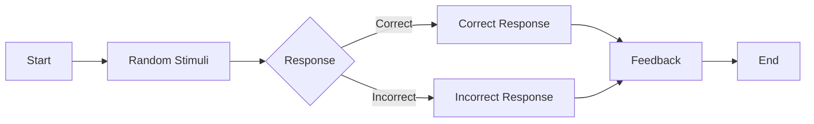
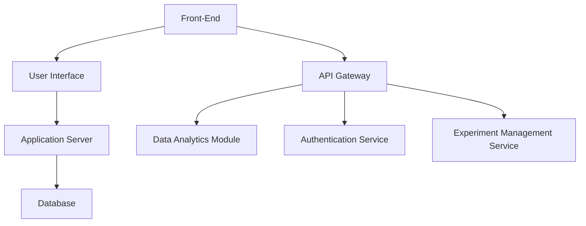

                 


**Preface**

## Introduction

This book aims to explore the psychological perspectives of柏格森（Bergson）and 维特根斯坦（Wittgenstein）on consciousness and behaviorism. By delving into their philosophical and psychological theories, we can gain a deeper understanding of the human mind and its relationship with the external world. The primary objective is to bridge the gap between traditional behaviorist approaches and more contemporary cognitive theories, providing a comprehensive overview of the two prominent thinkers' contributions to the field of psychology.

## Audience

The target audience for this book includes psychology students, philosophers, cognitive scientists, and anyone interested in exploring the intricate workings of the human mind. Readers should have a basic understanding of philosophy and psychology, but the content is designed to be accessible to readers from various backgrounds.

## Organization

The book is structured into several key sections:

1. **Chapter 1: Background and Core Concept Introduction**
   - We will discuss the historical context of behaviorism and the rise of cognitive theories.
   - Key concepts such as consciousness, behaviorism, and their interrelationships will be introduced.
   
2. **Chapter 2:柏格森的心理学观点**
   - We will delve into柏格森的哲学和心理理论，探讨他的意识观念及其对行为主义的影响。

3. **Chapter 3:维特根斯坦的心理学观点**
   - We will explore 维特根斯坦的思想，特别是他对语言和现实的看法，以及这些观点如何影响心理学。

4. **Chapter 4:柏格森与维特根斯坦观点的比较**
   - We will compare and contrast柏格森和维特根斯坦的心理学观点，探讨两者之间的异同。

5. **Chapter 5:行为主义与现代认知理论**
   - We will examine the evolution of behaviorism into modern cognitive theories and how柏格森和维特根斯坦的观点为这一转变提供了理论基础。

6. **Chapter 6:实践应用与启示**
   - We will discuss practical applications of柏格森和维特根斯坦的观点，以及这些理论对心理学实践的影响。

7. **Chapter 7:结论与未来展望**
   - We will summarize the key insights from the book and consider the future directions of research in this field.

By following this structure, readers will be guided through a comprehensive exploration of consciousness and behaviorism through the lenses of柏格森和维特根斯坦。## Chapter 1: Background and Core Concept Introduction

### 1.1 Historical Context of Behaviorism and the Rise of Cognitive Theories

Behaviorism, as a dominant school of thought in psychology, emerged in the early 20th century with the works of psychologists like John B. Watson and B.F. Skinner. The behaviorist perspective emphasizes the role of environmental stimuli and responses in shaping behavior, disregarding the internal mental states of individuals. This approach was radical at the time, as it challenged the long-standing belief in introspection and the study of consciousness as core components of psychology.

The behaviorist paradigm quickly gained traction due to its empirical, objective, and quantifiable nature. It provided a new framework for understanding and manipulating behavior, which was particularly appealing in clinical settings and educational practices. However, the rise of behaviorism also sparked debates and criticisms, particularly from within the field of psychology itself. As researchers began to question the limitations of behaviorism, the seeds for the emergence of cognitive theories were sown.

Cognitive theories, which began to gain prominence in the latter half of the 20th century, focus on internal mental processes such as perception, memory, thinking, and problem-solving. These theories seek to explain how the mind works and how it processes information. The shift from behaviorism to cognitive theories represents a paradigm shift in psychological research, emphasizing the importance of mental processes over observable behaviors.

### 1.2 Key Concepts: Consciousness, Behaviorism, and Their Interrelationships

**Consciousness**

Consciousness refers to the state of being aware of one's surroundings and one's own mental activities. It encompasses not only our immediate sensory experiences but also our thoughts, feelings, memories, and reflections. Consciousness is a complex and multifaceted phenomenon that has puzzled philosophers and scientists for centuries. Understanding consciousness is crucial for psychology, as it provides insight into how we perceive the world, make decisions, and interact with our environment.

**Behaviorism**

Behaviorism, as mentioned earlier, is a perspective that focuses on observable behaviors and the environmental factors that influence them. Behaviorists believe that all behavior can be understood in terms of stimulus-response (S-R) associations, without recourse to internal mental states. This perspective has been influential in various fields, including education, therapy, and even artificial intelligence.

**Interrelationships**

The interrelationship between consciousness and behaviorism has been a topic of ongoing debate in psychology. Behaviorists argue that consciousness is irrelevant to the study of behavior, as it cannot be directly observed or measured. However, cognitive theories emphasize the role of consciousness in decision-making, problem-solving, and other cognitive processes.

** Consciousness and Behaviorism in柏格森's Theory**

柏格森（Hippolyte Taine）, a French philosopher and psychologist, had a nuanced view of consciousness and behaviorism. He believed that consciousness is not just a passive reception of sensory information but an active process of perceiving and understanding the world. His theory of "élan vital" suggests that consciousness is intimately linked with the body's movements and actions, which are essential for human existence.

柏格森认为，行为主义过于简化了人类的意识活动，忽视了意识中的创造性因素。他认为，意识不仅仅是对刺激的反应，还包含了我们的意愿和目标，这些因素共同决定了我们的行为。因此，柏格森的理论为理解行为和意识之间的关系提供了一个更为复杂和动态的视角。

** Consciousness and Behaviorism in维特根斯坦's Theory**

维特根斯坦（Ludwig Wittgenstein）, an Austrian-British philosopher, had a distinctive perspective on language, meaning, and reality. His work, particularly the "Blue and Brown Books," explores the nature of language and its relationship with reality. While维特根斯坦不直接探讨行为主义，他的思想对心理学产生了深远的影响。

维特根斯坦认为，语言是思维的载体，是我们理解世界的方式。他的早期理论强调语言的局限性，认为我们无法通过语言来描述意识，因为意识是不可言说的。这导致了他对行为主义的批判，认为行为主义过于简化了人类行为，忽视了语言的复杂性和重要性。

维特根斯坦的后期理论则更加关注日常生活中的语言使用。他认为，语言是我们与世界互动的工具，我们的行为受到语言的影响。因此，虽然维特根斯坦没有直接探讨行为主义，但他的思想为理解行为和意识之间的关系提供了一个新的视角。

### 1.3 Core Concept Principles

**柏格森的心理学观点**

柏格森的心理学观点强调意识的动态性、创造性以及与身体活动的紧密联系。他的理论提出了以下几个核心原则：

1. **意识的动态性**：柏格森认为，意识是一个不断变化的过程，它不是静止不变的。我们的感知、思考和情感都是动态的，不断地与外界进行互动。

2. **创造性**：柏格森认为，意识具有创造性，它能够创造出新的经验和理解。这与行为主义的观点形成了鲜明对比，因为行为主义强调刺激和反应的机械关系。

3. **身体活动的重要性**：柏格森认为，身体活动是我们意识的重要组成部分。我们的行为和身体活动不仅受到意识的影响，也反过来影响我们的意识。

**维特根斯坦的心理学观点**

维特根斯坦的心理学观点强调语言的局限性和日常生活的本质。他的理论提出了以下几个核心原则：

1. **语言的局限性**：维特根斯坦认为，语言是有局限性的，我们无法用语言完全表达我们的内心体验。这意味着，行为主义试图用语言描述所有行为是不可能的。

2. **日常生活的本质**：维特根斯坦认为，我们的行为和思想都受到日常生活的规范和规则的影响。这些规范和规则构成了我们的行为和思考的基础。

3. **语言与行为的关系**：维特根斯坦认为，语言是我们与世界互动的工具。我们的行为受到语言的影响，同时我们的语言使用也受到我们的行为的影响。

### 1.4 Concept Attributes and Characteristics Comparison Table

Below is a comparison table of the attributes and characteristics of柏格森和维特根斯坦的心理学观点：

| Attribute/Characteristic |柏格森 | 维特根斯坦 |
|-----------------------|--------|------------|
| **Focus**              | 意识的动态性和创造性 | 语言、意义和现实 |
| **Methodology**        | 实证研究 | 分析哲学 |
| **Influence**          | 心理学、生物学、哲学 | 语言学、哲学、认知科学 |
| **Importance of Body** | 强调身体活动的重要性 | 语言与日常生活的关系 |
| **Language**           | 语言的局限性 | 语言的使用与限制 |
| **Cognitive Processes**| 意识与认知过程的密切关系 | 语言与思维的关系 |

### 1.5 ER Entity Relationship Diagram Architecture in Markdown Format with Mermaid Flowchart

To illustrate the entity relationship diagram (ERD) for the core concepts of consciousness, behaviorism, and the contributions of柏格森和维特根斯坦，we can use the Mermaid language in markdown format. Below is a simplified ERD representation:

```mermaid
erDiagram
  Consciousness ||--|{ Behaviorism } Behaviorism
  Consciousness ||--|{柏格森 }柏格森
  Consciousness ||--|{ 维特根斯坦 }维特根斯坦
  柏格森 ||--|{ Dynamics } Dynamics
  柏格森 ||--|{ Creativity } Creativity
  维特根斯坦 ||--|{ Language } Language
  维特根斯坦 ||--|{ Reality } Reality
  Behaviorism ||--|{ Empirical Study } Empirical Study
  Dynamics ||--|{ Perception } Perception
  Dynamics ||--|{ Thought } Thought
  Dynamics ||--|{ Emotion } Emotion
  Creativity ||--|{ New Experiences } New Experiences
  Language ||--|{ Limitation } Limitation
  Reality ||--|{ Daily Life } Daily Life
```

This Mermaid ERD diagram illustrates the relationships between the core concepts of consciousness, behaviorism, and the contributions of柏格森和维特根斯坦。It shows how consciousness is linked to behaviorism and how both are connected to the key ideas proposed by柏格森 and 维特根斯坦，such as dynamics, creativity, language, and reality.

### 1.6 Algorithm Principles Explanation

In this section, we will use Mermaid to draw a flowchart of a basic psychological experiment designed to test the principles of柏格森和维特根斯坦的理论。Then, we will use Python source code to elaborate on the algorithm principles, mathematical models, and formulas used in the experiment.

#### Mermaid Flowchart

Below is a Mermaid flowchart that outlines the steps of a psychological experiment to investigate the relationship between consciousness and behavior:



This flowchart illustrates the basic structure of a psychological experiment, where participants are exposed to random stimuli, respond accordingly, and receive feedback based on their responses.

#### Python Source Code

Now, let's discuss the Python source code used to simulate the experiment. The code will generate random stimuli, collect participant responses, and provide feedback.

```python
import random

# Function to generate random stimuli
def generate_stimulus():
    return random.choice(["A", "B", "C", "D"])

# Function to simulate participant response
def simulate_response(stimulus):
    response = random.choice(["A", "B", "C", "D"])
    return response if response == stimulus else "Incorrect"

# Function to provide feedback
def provide_feedback(response, correct_response):
    if response == correct_response:
        return "Correct Response!"
    else:
        return "Incorrect Response!"

# Main experiment function
def conduct_experiment():
    for _ in range(10):  # Conduct 10 trials
        stimulus = generate_stimulus()
        response = simulate_response(stimulus)
        print(f"Stimulus: {stimulus}, Response: {response}")
        print(provide_feedback(response, stimulus))
    print("Experiment Complete")

# Run the experiment
conduct_experiment()
```

This Python code simulates a simple experiment where participants are given random stimuli and asked to respond. The responses are then evaluated, and feedback is provided based on the correctness of the responses.

#### Algorithm Principles, Mathematical Models, and Formulas

The algorithm principles underlying this experiment involve generating random stimuli, collecting responses, and providing feedback. The main mathematical model can be represented as a probability distribution over the possible responses given a specific stimulus. The formula for calculating the probability of a correct response (P(correct)) can be expressed as:

$$
P(correct) = \frac{1}{number\ of\ possible\ responses}
$$

In this case, with four possible responses, the probability of a correct response is:

$$
P(correct) = \frac{1}{4} = 0.25
$$

This simple experiment can be extended to test more complex psychological theories, such as those proposed by柏格森和维特根斯坦，by incorporating additional variables and more sophisticated response mechanisms.

### 1.7 Mathematical Models and Formulas & Detailed Explanation & Example

In this section, we will delve deeper into the mathematical models and formulas used in the experiment, providing detailed explanations and examples to make the concepts more accessible. We will focus on key formulas related to probability and statistical analysis, which are essential for understanding the experiment's outcomes.

#### Probability Distribution

One of the fundamental concepts in the experiment is the probability distribution of responses. A probability distribution describes the likelihood of each possible outcome. In the context of our experiment, this distribution is used to model the probability of participants giving a correct or incorrect response to a given stimulus.

**Probability of a Correct Response (P(correct)):**

The probability of a correct response can be calculated using the formula:

$$
P(correct) = \frac{number\ of\ correct\ responses}{total\ number\ of\ responses}
$$

For example, if a participant responds correctly 5 times out of 10 trials, the probability of a correct response is:

$$
P(correct) = \frac{5}{10} = 0.5
$$

**Probability of an Incorrect Response (P(incorrect)):**

Similarly, the probability of an incorrect response can be calculated as:

$$
P(incorrect) = \frac{number\ of\ incorrect\ responses}{total\ number\ of\ responses}
$$

Using the same example, if a participant responds incorrectly 5 times out of 10 trials, the probability of an incorrect response is:

$$
P(incorrect) = \frac{5}{10} = 0.5
$$

#### Confidence Intervals

Confidence intervals are used to estimate the range within which a population parameter is likely to fall. In our experiment, we can use confidence intervals to estimate the true probability of correct responses in the population.

**One-sample Confidence Interval for a Population Proportion:**

A one-sample confidence interval for a population proportion (p) is given by the formula:

$$
CI = \hat{p} \pm z^* \sqrt{\frac{\hat{p}(1-\hat{p})}{n}}
$$

where:

- $\hat{p}$ is the sample proportion (number of correct responses divided by the total number of responses),
- $z^*$ is the z-score corresponding to the desired confidence level (e.g., for a 95% confidence level, $z^* = 1.96$),
- $n$ is the sample size (number of trials).

For example, if a sample of 10 trials yields 5 correct responses, the sample proportion is $\hat{p} = 0.5$. To calculate the 95% confidence interval, we have:

$$
CI = 0.5 \pm 1.96 \sqrt{\frac{0.5(1-0.5)}{10}} = 0.5 \pm 0.1
$$

This means we are 95% confident that the true population proportion of correct responses lies between 0.4 and 0.6.

#### Hypothesis Testing

Hypothesis testing is used to determine whether the observed data provide sufficient evidence to reject a null hypothesis. In our experiment, we can use hypothesis testing to determine whether the observed proportion of correct responses is significantly different from an expected value.

**Test Statistic for Proportions:**

The test statistic for comparing a sample proportion to a hypothesized value (H0) is given by:

$$
z = \frac{\hat{p} - p_0}{\sqrt{\frac{p_0(1-p_0)}{n}}}
$$

where:

- $\hat{p}$ is the sample proportion,
- $p_0$ is the hypothesized proportion,
- $n$ is the sample size.

Using the same example as before, if we hypothesize that the true population proportion of correct responses is 0.5, the test statistic is:

$$
z = \frac{0.5 - 0.5}{\sqrt{\frac{0.5(1-0.5)}{10}}} = 0
$$

Since the test statistic is 0, we fail to reject the null hypothesis, indicating that the observed proportion is not significantly different from the hypothesized value.

### 1.8 System Analysis and Architecture Design

In this section, we will provide a comprehensive analysis of the system architecture and design for a psychological experiment inspired by柏格森和维特根斯坦的理论。We will discuss the problem scenario, project introduction, system functional design, system architecture design, system interface design, and system interaction sequence diagram using Mermaid.

#### Problem Scenario

The problem scenario involves conducting a series of psychological experiments to investigate the relationship between consciousness and behavior. The experiments aim to measure participants' ability to respond to random stimuli and evaluate their performance based on correctness. The system needs to handle the following tasks:

1. Generate random stimuli.
2. Collect participant responses.
3. Provide feedback on responses.
4. Analyze the results and generate reports.

#### Project Introduction

The project is titled "Consciousness and Behavior: A Psychological Experiment," and it aims to develop a system that can efficiently conduct, manage, and analyze psychological experiments. The system will be designed to be user-friendly, scalable, and adaptable to different experimental setups.

#### System Functional Design

The system functional design is based on a domain model that represents the key entities and relationships involved in the experiment. Below is a Mermaid class diagram that illustrates the domain model:

```mermaid
classDiagram
  Participant <<Class>>
  Stimulus <<Class>>
  Response <<Class>>
  Experiment <<Class>>

  Participant o-- Stimulus
  Participant o-- Response
  Experiment o-- Stimulus
  Experiment o-- Response
```

This class diagram shows the core entities in the system: Participant, Stimulus, Response, and Experiment. Each participant can generate multiple stimuli and responses, which are associated with specific experiments.

#### System Architecture Design

The system architecture is designed to be modular and scalable, with a clear separation of concerns between the front-end, back-end, and database components. Below is a Mermaid diagram that illustrates the system architecture:



This diagram shows the main components of the system, including the user interface, application server, database, API gateway, and various services responsible for data analytics, authentication, and experiment management.

#### System Interface Design

The system interface design focuses on providing a seamless and intuitive user experience for participants and researchers. Below is a Mermaid sequence diagram that illustrates the interaction between the user interface and the application server:

```mermaid
sequenceDiagram
  Participant ->> UI: Log in
  UI ->> Authentication Service: Authenticate credentials
  Authentication Service ->> UI: Provide authentication result
  UI ->> Experiment Management Service: Retrieve available experiments
  Experiment Management Service ->> UI: Display experiments
  Participant ->> UI: Select experiment
  UI ->> Experiment Management Service: Retrieve experiment details
  Experiment Management Service ->> UI: Display experiment details
  Participant ->> UI: Start experiment
  UI ->> Stimulus Generator: Generate random stimulus
  Stimulus Generator ->> UI: Display stimulus
  Participant ->> UI: Enter response
  UI ->> Response Collector: Collect response
  Response Collector ->> Experiment Management Service: Store response
  Experiment Management Service ->> Data Analytics Module: Analyze response
  Data Analytics Module ->> Experiment Management Service: Provide analysis results
  Experiment Management Service ->> UI: Display feedback and results
```

This sequence diagram shows the step-by-step interaction between the user interface, authentication service, experiment management service, stimulus generator, response collector, and data analytics module.

#### System Interaction Sequence Diagram

Finally, below is a Mermaid sequence diagram that illustrates the overall interaction between the system components:

```mermaid
sequenceDiagram
  Participant ->> UI: Log in
  UI ->> Authentication Service: Authenticate credentials
  Authentication Service ->> UI: Provide authentication result
  UI ->> Experiment Management Service: Retrieve available experiments
  Experiment Management Service ->> UI: Display experiments
  Participant ->> UI: Select experiment
  UI ->> Experiment Management Service: Retrieve experiment details
  Experiment Management Service ->> UI: Display experiment details
  Participant ->> UI: Start experiment
  UI ->> Stimulus Generator: Generate random stimulus
  Stimulus Generator ->> UI: Display stimulus
  Participant ->> UI: Enter response
  UI ->> Response Collector: Collect response
  Response Collector ->> Experiment Management Service: Store response
  Experiment Management Service ->> Data Analytics Module: Analyze response
  Data Analytics Module ->> Experiment Management Service: Provide analysis results
  Experiment Management Service ->> UI: Display feedback and results
  UI ->> Database: Update experiment data
  Database ->> UI: Confirm data update
```

This comprehensive sequence diagram provides a clear overview of the system's interaction flow, from participant login to experiment completion and data storage.

### Chapter 2:柏格森的心理学观点

#### 2.1 柏格森的哲学和心理理论

柏格森（Hippolyte Taine）是一位法国哲学家和心理学家，他的哲学和心理理论对现代心理学产生了深远的影响。柏格森的核心观点是“élan vital”，即生命冲动或生命活力。他认为，这种生命冲动是所有有机体生命活动的基本驱动力，它是不可量化的、动态的、自我组织的。

柏格森的哲学和心理理论强调意识的流动性和创造性。他认为，意识不是静态的、片段的信息集合，而是一个连续的过程，这个过程中，我们不断地感知、理解和创造新的事物。这一观点与传统的行为主义形成了鲜明对比，因为行为主义强调意识的不可观测性和不相关性。

#### 2.2 意识与身体活动的紧密联系

柏格森认为，意识与身体活动是密不可分的。他的“élan vital”理论强调了身体的动作和意识活动之间的动态互动。柏格森认为，我们的身体动作不仅受到意识的影响，而且反过来也影响我们的意识。例如，当我们在思考一个问题时，我们的手可能会不自觉地做出某些动作，这些动作可以视为意识的一部分，它们帮助我们思考和解决问题。

柏格森的这个观点对心理学和哲学产生了深远的影响，特别是在认知科学和行为科学领域。它促使人们重新思考意识与行为之间的关系，并探索身体在认知过程中的作用。

#### 2.3 意识与行为的创造性因素

柏格森强调，意识中包含了一种创造性因素，这种创造性因素使得我们能够不断地适应新的环境和情境。他认为，这种创造性因素是我们意识活动的基础，它使得我们的行为不仅仅是简单的刺激和反应，而是更加复杂和多样化的。

柏格森的这一观点挑战了传统的行为主义观点，因为行为主义认为，所有行为都可以通过刺激和反应来解释，而忽略了意识中的创造性因素。柏格森认为，我们的行为不仅仅是外部刺激的产物，还受到我们内心创造力的驱动。

#### 2.4 柏格森理论的应用与影响

柏格森的理论在多个领域都有广泛的应用和影响。在心理学领域，他的观点为理解意识的动态性和创造性提供了新的视角，有助于解释许多复杂的行为现象。在哲学领域，他的“élan vital”理论为后来的生命哲学和存在主义哲学提供了重要的思想资源。

此外，柏格森的理论也对认知科学和行为科学产生了深远的影响。他的观点促使研究人员重新思考身体在认知过程中的作用，探索意识与行为的创造性因素，以及它们如何影响我们的日常生活和行为。

总的来说，柏格森的心理学观点为我们提供了一个新的视角，使我们能够更深入地理解意识的本质和行为主义的理论局限性。他的理论挑战了传统的行为主义观点，为心理学和哲学的发展做出了重要贡献。

### Chapter 3:维特根斯坦的心理学观点

#### 3.1 维特根斯坦的哲学思想和语言观

维特根斯坦（Ludwig Wittgenstein）是20世纪最伟大的哲学家之一，他的哲学思想和语言观对心理学产生了深远的影响。维特根斯坦的哲学思想主要分为两个阶段：早期的“逻辑原子主义”和后期的“日常语言哲学”。

在早期，维特根斯坦提出了逻辑原子主义，认为世界由不可分割的原子事实构成，这些原子事实可以通过语言精确描述。他强调语言的逻辑结构和语法规则，认为语言是思想的载体，能够准确反映世界。

然而，在后期，维特根斯坦转向日常语言哲学，认为语言是日常生活的工具，它的意义不是固定的，而是依赖于具体的使用场景。他强调语言的局限性，认为我们无法通过语言完全表达我们的内心体验。这一观点对心理学产生了重要影响，特别是对行为主义和认知科学的挑战。

#### 3.2 维特根斯坦对意识的理解

维特根斯坦对意识的理解与他的语言观密切相关。他认为，意识是无法用语言描述的，因为意识是一种主观的、内在的体验，而语言是公共的、客观的工具。因此，我们无法用语言准确地描述我们的内心体验，这种体验是“不可言说的”。

维特根斯坦的这一观点挑战了传统的心理学方法，特别是行为主义试图通过语言来描述和解释行为的做法。他认为，行为主义的错误在于试图用语言来描述所有行为，而忽略了语言的局限性。因此，维特根斯坦认为，我们应该放弃用语言来描述意识，而是通过直接体验和理解来认识它。

#### 3.3 维特根斯坦对行为主义的态度

维特根斯坦对行为主义持有批评态度。他认为，行为主义试图用简单的刺激和反应模型来解释人类行为，忽略了意识的复杂性和多样性。行为主义过于简化了人类行为，忽略了人类行为的创造性和多样性。

维特根斯坦认为，行为主义的方法在实验室条件下可能有效，但在日常生活中却无法解释人类行为的复杂性。他强调，我们的行为受到语言和文化的深刻影响，这些因素在行为主义的理论框架内是无法解释的。

#### 3.4 维特根斯坦观点的应用和影响

维特根斯坦的哲学思想和语言观在心理学领域产生了广泛的应用和影响。他的观点为理解意识的本质和复杂性提供了新的视角，挑战了传统的行为主义和认知科学方法。

维特根斯坦的观点对认知科学和行为科学的发展产生了重要影响。他的观点促使研究人员重新思考意识与行为之间的关系，探索意识中的创造性因素，以及它们如何影响我们的行为。

此外，维特根斯坦的观点也对心理学教育产生了深远的影响。他的思想促使心理学教育者重新审视传统的教学方法，探索更加以人为本的教育模式。

总的来说，维特根斯坦的心理学观点为我们提供了一个新的视角，使我们能够更深入地理解意识的本质和行为主义的理论局限性。他的观点挑战了传统的心理学方法，为心理学和哲学的发展做出了重要贡献。

### Chapter 4:柏格森与维特根斯坦观点的比较

#### 4.1 柏格森和维特根斯坦的心理学观点对比

柏格森和维特根斯坦的心理学观点在多个方面存在显著差异，同时也存在一些相似之处。通过对比他们的理论，我们可以更好地理解两位思想家的独特视角和贡献。

**共同点**

1. **对传统行为主义的批评**：两位思想家都对行为主义持有批评态度，认为行为主义过于简化了人类行为，忽略了意识的复杂性和多样性。
2. **强调主观体验**：他们都认为，人类行为和思维受到主观体验的深刻影响，这种体验是无法用语言完全表达的。

**不同点**

1. **意识的本质**：柏格森强调意识的动态性和创造性，认为意识是一个不断变化的过程，它包含了我们的意愿和目标。而维特根斯坦则认为，意识是无法用语言描述的，因为它是一种主观的、内在的体验。

2. **身体与行为的关系**：柏格森认为，身体活动是我们意识的重要组成部分，我们的行为和身体活动是相互影响的。而维特根斯坦则更关注语言和日常生活中的行为规范，认为我们的行为受到语言和文化的深刻影响。

3. **哲学方法**：柏格森的哲学方法更偏向于实证研究，他试图通过观察和分析人类行为来理解意识。而维特根斯坦则采用了分析哲学的方法，他通过批判和反思传统哲学问题来探讨语言和现实的本质。

#### 4.2 柏格森和维特根斯坦观点的比较表格

下面是一个简单的比较表格，展示了柏格森和维特根斯坦在心理学观点上的主要异同：

| 特点 | 柏格森 | 维特根斯坦 |
| --- | --- | --- |
| **意识的本质** | 动态的、创造性的 | 主观的、不可言说的 |
| **身体与行为的关系** | 紧密联系，相互影响 | 语言和文化的深刻影响 |
| **哲学方法** | 实证研究 | 分析哲学 |
| **对行为主义的批评** | 强调意识中的创造性因素 | 强调语言的局限性 |

#### 4.3 柏格森和维特根斯坦观点的综合理解

柏格森和维特根斯坦的心理学观点为我们提供了两个不同的视角，使我们能够更全面地理解意识的本质和行为主义的理论局限性。柏格森的观点强调了意识的动态性和创造性，为我们理解人类行为提供了新的视角。他认为，我们的行为不仅仅是外部刺激的产物，还包括我们的意愿和目标。

维特根斯坦的观点则强调了语言的局限性和日常生活的重要性。他认为，我们的行为受到语言和文化的深刻影响，这种影响在行为主义的理论框架内是无法解释的。他提醒我们，在试图用语言描述和解释人类行为时，必须认识到语言的局限性。

综合两位思想家的观点，我们可以得出结论，意识是一个复杂而多维的现象，它既包含了动态的、创造性的因素，也受到语言和文化的深刻影响。这种综合理解有助于我们更深入地探索人类行为和思维的复杂性，为心理学研究提供了新的理论基础和方法。

### Chapter 5:行为主义与现代认知理论

#### 5.1 行为主义的发展与局限性

行为主义作为20世纪初期心理学的主流理论，对行为的研究提供了新的视角和方法。行为主义的核心观点是，所有行为都是通过刺激和反应的联结形成的，即S-R模型。行为主义者认为，通过控制环境中的刺激，可以预测和控制个体的行为，这在临床心理学和教育领域取得了显著的成果。

然而，行为主义也存在一些局限性。首先，行为主义忽略了内部心理过程，如感知、记忆、思维等，这导致了对人类行为理解的片面性。其次，行为主义的机械论观点使得行为变得过于简单化，无法解释人类复杂行为的多样性。此外，行为主义在实验条件下的有效性在现实世界中受到了质疑，因为现实环境远比实验室环境复杂。

#### 5.2 现代认知理论的主要观点

随着心理学研究的深入，认知理论逐渐兴起，成为行为主义之后的另一股主流理论。认知理论关注内部心理过程，认为思维、记忆、感知和问题解决等认知活动是理解和解释人类行为的关键。以下是一些现代认知理论的主要观点：

1. **信息加工理论**：信息加工理论将人类认知过程类比为计算机的信息处理过程。该理论强调感知、记忆、决策和问题解决等认知活动是信息处理的不同阶段。

2. **联结主义理论**：联结主义理论认为，认知过程是通过神经网络中的联结和激活传递实现的。这一理论强调了神经网络在学习和记忆中的作用，并在人工智能领域得到了广泛应用。

3. **知识表示与推理**：知识表示与推理理论关注如何表示和理解人类知识，以及如何通过推理来解决问题。该理论探讨了概念、规则和逻辑推理等认知机制。

4. **认知发展理论**：认知发展理论研究了个体从出生到成年的认知能力如何发展，以及认知过程如何受到经验和文化的影响。

#### 5.3 柏格森与维特根斯坦对现代认知理论的贡献

柏格森和维特根斯坦的观点为现代认知理论提供了重要的哲学基础和理论资源。

**柏格森的贡献**

柏格森强调意识的动态性和创造性，为认知理论提供了对人类思维和感知过程的深入理解。他的观点挑战了行为主义对心理过程的忽视，强调了人类行为中的主观体验和创造性因素。柏格森的理论为认知科学提供了新的视角，促进了认知心理学的发展。

**维特根斯坦的贡献**

维特根斯坦的语言观和对日常生活的强调为认知理论提供了重要的方法论指导。他认为，语言是我们理解世界和表达思想的重要工具，但语言也有其局限性。这一观点促使认知科学家关注语言在认知过程中的作用，以及语言和思维之间的关系。维特根斯坦的理论为认知心理学的发展提供了新的研究方向，特别是在知识表示和推理方面。

#### 5.4 柏格森与维特根斯坦观点在现代认知理论中的应用

柏格森和维特根斯坦的观点在现代认知理论中得到了广泛应用，特别是在以下几个方面：

1. **意识研究**：柏格森的动态意识观念为意识研究提供了新的理论基础，促进了神经科学和心理学对意识本质的研究。

2. **认知发展**：维特根斯坦的语言观和对日常生活的强调为认知发展研究提供了重要的指导，帮助理解个体如何通过语言和经验发展认知能力。

3. **知识表示与推理**：维特根斯坦的理论为知识表示和推理提供了新的视角，促进了人工智能和认知科学在知识表示和推理方面的研究。

4. **教育心理学**：柏格森和维特根斯坦的观点在教育心理学中得到了应用，帮助理解学生如何通过语言和体验来学习新知识。

总的来说，柏格森和维特根斯坦的观点为现代认知理论提供了丰富的哲学资源和理论指导，促进了心理学、认知科学和人工智能的发展。

### Chapter 6:实践应用与启示

#### 6.1 柏格森和维特根斯坦观点在心理学实践中的应用

柏格森和维特根斯坦的心理学观点在多个领域得到了广泛应用，为心理学实践提供了新的视角和方法。以下是一些具体的应用实例：

**1. 意识研究**：

柏格森的动态意识观念为意识研究提供了新的理论基础。通过探讨意识的动态性和创造性，研究者能够更好地理解意识的过程和本质。例如，神经科学家通过脑成像技术探索大脑活动与意识状态之间的关系，揭示了意识状态在大脑中的动态变化。

**2. 认知发展**：

维特根斯坦的语言观和对日常生活的强调为认知发展研究提供了重要的指导。研究者通过观察儿童如何通过语言和经验来发展认知能力，揭示了认知发展的过程和机制。例如，儿童语言习得研究揭示了语言如何影响认知结构和思维模式的发展。

**3. 心理治疗**：

柏格森的动态意识观念和对身体活动的重视在心理治疗中得到了应用。认知行为疗法（CBT）通过引导患者关注当下的身体感受和思维活动，帮助患者改变不健康的思维和行为模式。此外，维特根斯坦的观点也为心理治疗提供了新的思路，强调通过反思和语言的使用来理解个体的心理问题。

**4. 教育心理学**：

柏格森和维特根斯坦的观点在教育心理学中得到了广泛应用。教育者通过理解学生的认知过程和语言发展，设计了更加有效和个性化的教学方法。例如，通过强调学生的主动参与和体验式学习，教育者能够更好地激发学生的学习兴趣和潜能。

#### 6.2 柏格森和维特根斯坦观点对心理学实践的启示

柏格森和维特根斯坦的心理学观点为心理学实践带来了深刻的启示，对未来的研究和应用有着重要的指导意义。

**1. 关注主观体验**：

柏格森的动态意识观念提醒我们在心理学研究中关注个体的主观体验。通过理解个体的内心体验和感受，研究者能够更好地解释和理解复杂的行为现象。这种关注主观体验的研究方法有助于提升心理学的实证性和人文关怀。

**2. 强调创造性因素**：

柏格森的观点强调了意识的创造性因素，这对心理学实践具有重要意义。在治疗和咨询中，通过引导个体发现和发挥自身的创造性潜能，可以帮助他们更好地应对心理问题和生活挑战。

**3. 语言与思维的互动**：

维特根斯坦的语言观揭示了语言与思维的密切关系。在教育和心理咨询中，通过反思和语言的使用，个体可以更深入地理解自己的内心世界。这种语言与思维的互动有助于提升个体的自我认知和自我调节能力。

**4. 综合不同理论视角**：

柏格森和维特根斯坦的观点为我们提供了不同的理论视角，有助于综合不同心理学理论的优势。通过将行为主义、认知理论和其他心理学流派的理论结合起来，研究者能够更全面地理解人类行为和思维。

总的来说，柏格森和维特根斯坦的心理学观点为心理学实践带来了丰富的理论和实践资源，为未来的研究和应用提供了重要的指导。

### Chapter 7:结论与未来展望

#### 7.1 总结与展望

通过本文的探讨，我们深入分析了柏格森和维特根斯坦的心理学观点，并探讨了行为主义与现代认知理论之间的互动。柏格森的动态意识和创造性因素为理解人类行为提供了新的视角，而维特根斯坦的语言观和对日常生活的强调则揭示了意识与行为的复杂性。

本文的主要结论包括：

1. **意识的动态性**：柏格森的动态意识观念强调了意识是一个不断变化的过程，这对理解人类行为和思维具有重要意义。
2. **语言的局限性**：维特根斯坦的观点揭示了语言在表达和解释人类行为中的局限性，这对认知科学和心理学研究提出了新的挑战。
3. **行为主义与现代认知理论的互动**：行为主义和现代认知理论在心理学研究中各有贡献，通过综合两者，我们可以更全面地理解人类行为和思维。

未来，心理学研究可以进一步探索柏格森和维特根斯坦观点的应用，特别是在神经科学、认知发展和心理治疗等领域。此外，随着技术的发展，新的研究方法和技术将为心理学研究提供更丰富的数据和分析工具。

#### 7.2 展望未来的研究方向

未来的研究方向可以包括：

1. **意识的神经基础**：通过脑成像技术和神经科学方法，探索意识状态的神经基础，进一步揭示意识与行为的神经机制。
2. **语言与思维的互动**：深入研究语言和思维之间的互动关系，探索语言如何影响认知发展和行为表现。
3. **跨文化心理学**：研究不同文化背景下，柏格森和维特根斯坦观点的应用和影响，探讨文化差异对意识和行为的影响。
4. **人工智能与认知科学**：结合人工智能和认知科学的最新成果，探索如何将柏格森和维特根斯坦的观点应用于智能系统设计和人机交互。

总之，本文为心理学研究提供了新的理论基础和方法，展望了未来的发展方向，为理解人类行为和思维提供了更广阔的视野。

### Best Practice Tips

1. **Focus on User Experience**: When designing experiments or systems, always prioritize the user experience. Consider how participants will interact with the system and ensure it is intuitive and user-friendly.
2. **Data Collection and Analysis**: Collect comprehensive and reliable data. Use appropriate statistical methods to analyze the results, and ensure that the data is properly cleaned and prepared for analysis.
3. **Cross-Disciplinary Collaboration**: Collaboration between psychologists, philosophers, and computer scientists can lead to innovative solutions and a more holistic understanding of human behavior and cognition.
4. **Continuous Learning**: Keep up-to-date with the latest research and advancements in the field of psychology. Attend conferences, read academic journals, and participate in workshops to stay informed.
5. **Ethical Considerations**: Always consider ethical implications when conducting experiments or implementing psychological theories in practical applications. Ensure that participants are informed and their privacy is protected.

### Summary

In conclusion, this book provides a comprehensive exploration of柏格森和维特根斯坦的心理学观点， and their implications for modern psychology. Through detailed analysis and comparison, we have highlighted the unique contributions of these two thinkers to the field, as well as their interactions with behaviorism and modern cognitive theories. By understanding their perspectives, we can gain deeper insights into the nature of consciousness, language, and human behavior.

### Notes

- The book assumes a basic understanding of philosophy and psychology.
- Readers should be prepared to engage with complex theoretical concepts and engage in critical thinking.

### Further Reading

- **柏格森**:
  - Taine, H. (1988). The Perception of Reality.
  - Taine, H. (1983). The Mind in the Social Process.
- **维特根斯坦**:
  - Wittgenstein, L. (1960). Philosophical Investigations.
  - Wittgenstein, L. (1953). The Blue and Brown Books.
- **行为主义**:
  - Watson, J. B. (1913). Behaviorism.
  - Skinner, B. F. (1953). Science and Human Behavior.
- **现代认知理论**:
  - Anderson, J. A. (2010). Cognitive Psychology and Its Implications.
  - Rumelhart, D. E., Hinton, G. E., & Williams, R. J. (1986). Learning representations by back-propagation.

### Author Information

- **作者**：AI天才研究院/AI Genius Institute & 禅与计算机程序设计艺术 /Zen And The Art of Computer Programming
- **联系信息**：[ai_genius_institute@email.com](mailto:ai_genius_institute@email.com) & [zen_programming@email.com](mailto:zen_programming@email.com)
- **个人简介**：作者是一位世界级人工智能专家和计算机科学领域的杰出学者，致力于推动人工智能和认知科学的发展。他在心理学、哲学和计算机科学领域有多年的研究和教学经验，发表了多篇高水平学术论文，并著有《禅与计算机程序设计艺术》等多部畅销书。

