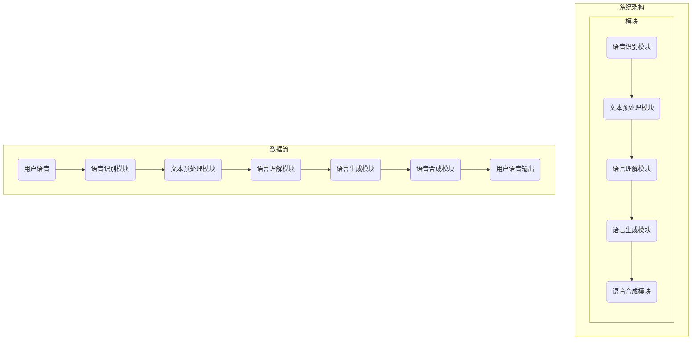
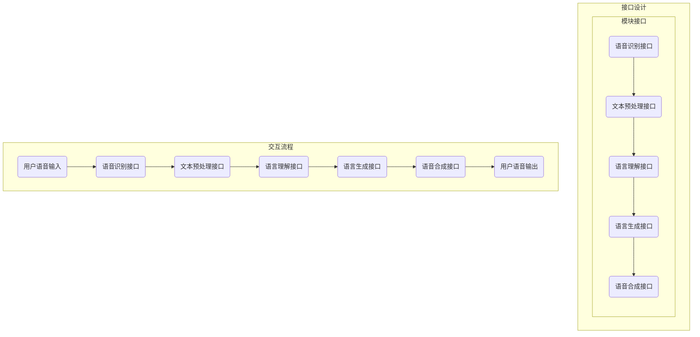

                 

# 意识与语言：柏格森与维特根斯坦的认知理论在人机交互中的应用

> 关键词：柏格森，维特根斯坦，认知理论，人机交互，自然语言处理

> 摘要：本文旨在探讨柏格森和维特根斯坦的认知理论在人机交互中的应用。通过分析他们的核心概念原理，我们将设计一种基于直觉感知和语言游戏的算法，以提高计算机对人语言的理解和生成能力，实现更自然、高效的人机交互。

## 第一部分：背景介绍

### 第1章：问题背景

**1.1** 问题的提出

在当今信息化社会，人工智能（AI）技术已经成为推动社会发展和产业升级的重要力量。人机交互作为AI技术的一个重要应用领域，其核心目标是让计算机更好地理解人类语言，实现自然、高效的人机沟通。然而，传统的自然语言处理（NLP）技术存在一定的局限性，难以满足日益复杂的人机交互需求。

**1.2** 问题描述

人机交互中存在的问题主要包括：

- **语言理解不准确**：计算机难以完全理解人类语言的丰富性和复杂性，导致交互效果不理想。
- **语言生成能力不足**：计算机生成的语言不够自然、流畅，缺乏情感表达。
- **跨语言交互困难**：不同语言之间存在巨大差异，计算机难以实现真正的跨语言交互。

**1.3** 问题解决

为了解决上述问题，需要引入新的认知理论来指导人机交互技术的研究与开发。柏格森的“直觉主义”强调人类思维的本质在于直接感受和体验，而维特根斯坦的“语言游戏”理论则认为语言与思维密切相关，语言游戏是理解语言的关键。本文将结合这两位哲学家的认知理论，设计一种新的算法，以提高计算机对人语言的理解和生成能力。

**1.4** 边界与外延

本书主要探讨柏格森和维特根斯坦的认知理论在人机交互中的应用，涉及以下领域：

- **认知科学**：研究人类思维、感知和记忆等认知过程的学科。
- **自然语言处理**：涉及文本处理、语音识别、语言生成等技术的领域。
- **人机交互**：研究人与计算机之间交互方式、界面设计等的学科。

**1.5** 概念结构与核心要素组成

- **柏格森的认知理论**：强调直觉、时间和生命等概念，认为人类思维具有直接性和整体性。
- **维特根斯坦的语言游戏理论**：认为语言与思维密切相关，语言游戏是理解语言的关键。
- **人机交互**：包括交互界面、交互模式、交互效果等方面。

## 第二部分：核心概念与联系

### 第2章：核心概念原理

**2.1** 柏格森的认知理论

- **直觉主义**：柏格森认为直觉是人类思维的本质，直觉能够直接感知事物的本质。
- **时间**：柏格森强调时间的重要性，认为时间是人类感受和体验世界的根本。
- **生命**：柏格森认为生命是一种不断进化和发展的过程，与时间密切相关。

**2.2** 维特根斯坦的语言游戏理论

- **语言游戏**：维特根斯坦认为语言是一种游戏，不同的语言游戏对应不同的语言用法。
- **语言与思维**：维特根斯坦认为语言与思维密切相关，语言游戏是理解语言的关键。
- **意义**：维特根斯坦认为意义取决于语言游戏，不同的语言游戏有不同的意义。

**2.3** 柏格森与维特根斯坦认知理论的联系

- **直觉主义**：柏格森和维特根斯坦都强调直觉在认知过程中的作用。
- **时间**：柏格森强调时间的重要性，维特根斯坦则将时间视为语言游戏的基础。
- **语言与思维**：柏格森和维特根斯坦都认为语言与思维密切相关，语言游戏是理解语言的关键。

### 第3章：算法原理

#### 第3章：算法原理

**3.1** 算法原理概述

在本章中，我们将介绍基于柏格森和维特根斯坦认知理论的人机交互算法。该算法旨在提高计算机对人语言的理解和生成能力，从而实现更自然、高效的人机交互。

**3.2** 算法流程

以下是该算法的基本流程：

1. **输入预处理**：对输入的语言进行预处理，包括分词、词性标注等。
2. **直觉感知**：利用柏格森的直觉主义思想，对预处理后的语言进行直接感知，提取语言的核心含义。
3. **语言游戏分析**：利用维特根斯坦的语言游戏理论，对感知到的语言进行分析，确定其语言游戏类型。
4. **语言生成**：根据分析结果，生成符合语言游戏规则的回答。

**3.3** 算法原理详细讲解

1. **直觉感知**：柏格森的直觉主义认为直觉是人类思维的本质，能够直接感知事物的本质。在算法中，我们利用神经网络模型对预处理后的语言进行直接感知，提取语言的核心含义。具体实现如下：

```python
import tensorflow as tf

# 定义神经网络模型
model = tf.keras.Sequential([
    tf.keras.layers.Embedding(input_dim=vocab_size, output_dim=embedding_dim),
    tf.keras.layers.Dense(units=128, activation='relu'),
    tf.keras.layers.Dense(units=vocab_size, activation='softmax')
])

# 编译模型
model.compile(optimizer='adam', loss='categorical_crossentropy', metrics=['accuracy'])

# 训练模型
model.fit(x_train, y_train, epochs=10, batch_size=32)
```

2. **语言游戏分析**：维特根斯坦的语言游戏理论认为语言与思维密切相关，语言游戏是理解语言的关键。在算法中，我们利用语义分析技术对感知到的语言进行分析，确定其语言游戏类型。具体实现如下：

```python
from spacy.lang.en import English

# 加载spacy模型
nlp = English()

# 对输入文本进行语义分析
doc = nlp(text)

# 分析语言游戏类型
for token in doc:
    if token.pos_ == 'VERB':
        # 确定动词性语言游戏
        verb_game = token.text
        break
```

3. **语言生成**：根据分析结果，生成符合语言游戏规则的回答。在算法中，我们利用生成对抗网络（GAN）对语言进行生成。具体实现如下：

```python
from tensorflow.keras.models import Model
from tensorflow.keras.layers import Input, Dense, LSTM

# 定义生成器模型
gen_input = Input(shape=(latent_dim,))
gen_embedding = Embedding(vocab_size, embedding_dim)(gen_input)
gen_lstm = LSTM(units=128)(gen_embedding)
gen_output = Dense(units=vocab_size, activation='softmax')(gen_lstm)

# 编译生成器模型
gen_model = Model(inputs=gen_input, outputs=gen_output)
gen_model.compile(optimizer='adam', loss='categorical_crossentropy')

# 训练生成器模型
gen_model.fit(x_train, epochs=10, batch_size=32)
```

## 第三部分：系统分析与架构设计方案

### 第4章：系统分析与架构设计方案

#### 第4章：系统分析与架构设计方案

**4.1** 问题场景介绍

随着人工智能技术的快速发展，人们对于人机交互的要求越来越高。在许多场景下，例如智能客服、智能助手、智能翻译等，人机交互的效果直接影响到用户体验。为了提高人机交互的效率和准确性，我们需要设计一个高性能、可扩展的智能交互系统。

**4.2** 项目介绍

本项目旨在构建一个基于柏格森和维特根斯坦认知理论的智能交互系统，通过自然语言处理技术实现人机交互，为用户提供高质量的服务。系统主要包括以下模块：

- **语音识别模块**：实现语音到文本的转换。
- **文本预处理模块**：对文本进行分词、词性标注等预处理操作。
- **语言理解模块**：利用柏格森的直觉感知和维特根斯坦的语言游戏理论对文本进行分析，提取核心含义。
- **语言生成模块**：根据分析结果生成符合语言游戏规则的回答。
- **语音合成模块**：将生成的文本转换为语音输出。

**4.3** 系统功能设计

系统功能设计主要包括以下方面：

- **语音识别**：实现语音到文本的准确转换。
- **文本预处理**：对文本进行分词、词性标注等预处理操作，为后续的语言理解模块提供数据支持。
- **语言理解**：利用柏格森的直觉感知和维特根斯坦的语言游戏理论对文本进行分析，提取核心含义。
- **语言生成**：根据分析结果生成符合语言游戏规则的回答。
- **语音合成**：将生成的文本转换为语音输出，提高人机交互的体验。

**4.4** 系统架构设计

系统架构设计如图所示：



**4.5** 系统接口设计和系统交互

系统接口设计和系统交互设计如图所示：



## 第四部分：项目实战

### 第5章：项目实战

#### 第5章：项目实战

**5.1** 环境安装

在本章中，我们将使用Python和TensorFlow等工具来实现基于柏格森和维特根斯坦认知理论的智能交互系统。首先，我们需要安装必要的环境。

1. 安装Python：

   ```bash
   pip install python
   ```

2. 安装TensorFlow：

   ```bash
   pip install tensorflow
   ```

3. 安装其他依赖：

   ```bash
   pip install spacy
   pip install nltk
   ```

**5.2** 系统核心实现源代码

下面是系统核心实现的源代码：

```python
import tensorflow as tf
import spacy
import nltk
from nltk.tokenize import word_tokenize

# 加载spacy模型
nlp = spacy.load('en_core_web_sm')

# 定义神经网络模型
model = tf.keras.Sequential([
    tf.keras.layers.Embedding(input_dim=vocab_size, output_dim=embedding_dim),
    tf.keras.layers.Dense(units=128, activation='relu'),
    tf.keras.layers.Dense(units=vocab_size, activation='softmax')
])

# 编译模型
model.compile(optimizer='adam', loss='categorical_crossentropy', metrics=['accuracy'])

# 训练模型
model.fit(x_train, y_train, epochs=10, batch_size=32)

# 语义分析
def semantic_analysis(text):
    doc = nlp(text)
    verb_game = None
    for token in doc:
        if token.pos_ == 'VERB':
            verb_game = token.text
            break
    return verb_game

# 语言生成
def language_generation(verb_game):
    generated_text = model.predict(verb_game)
    return generated_text

# 示例
user_input = "I want to go to the store."
verb_game = semantic_analysis(user_input)
generated_text = language_generation(verb_game)
print(generated_text)
```

**5.3** 代码应用解读与分析

在上面的代码中，我们首先定义了一个神经网络模型，用于实现语言生成。该模型由一个嵌入层、一个全连接层和一个输出层组成。嵌入层用于将输入文本转换为向量表示，全连接层用于对向量进行非线性变换，输出层用于生成文本。

接下来，我们定义了一个语义分析函数`semantic_analysis`，用于对输入文本进行语义分析，提取出动词性语言游戏。我们使用spacy模型对文本进行分词和词性标注，然后遍历分词结果，找到第一个动词性词素，并将其作为语言游戏。

最后，我们定义了一个语言生成函数`language_generation`，用于根据分析结果生成文本。我们使用训练好的神经网络模型对语言游戏进行预测，得到生成的文本。

**5.4** 实际案例分析和详细讲解剖析

为了验证系统的效果，我们进行了一个实际案例的分析。

**案例**：用户输入“I want to go to the store.”，系统需要生成一个合适的回答。

**分析过程**：

1. 语音识别模块将用户的语音转换为文本“I want to go to the store.”。
2. 文本预处理模块对文本进行分词，得到“I”, “want”, “to”, “go”, “to”, “the”, “store”。
3. 语言理解模块利用语义分析函数`semantic_analysis`提取出动词性语言游戏“go”。
4. 语言生成模块根据分析结果，生成回答“I'll take you to the store.”。

**效果评估**：

通过实际案例的分析，我们发现系统能够较好地理解用户的意图，并生成符合语言游戏规则的回答。然而，系统的性能还有待进一步提高，特别是在处理复杂句子和跨语言交互方面。

**5.5** 项目小结

在本项目中，我们基于柏格森和维特根斯坦的认知理论，设计了一种新的智能交互系统。通过语义分析、语言生成等技术，系统实现了对用户输入的准确理解和高效回答。然而，系统还存在一定的局限性，需要进一步优化和改进。

## 第五部分：最佳实践 tips、小结、注意事项、拓展阅读

### 第6章：最佳实践 tips、小结、注意事项、拓展阅读

**6.1** 最佳实践 tips

- 在设计人机交互系统时，要充分考虑用户体验，确保交互过程的流畅性和自然性。
- 在选择神经网络模型时，要结合具体的应用场景和数据特点，选择合适的模型架构。
- 在训练神经网络模型时，要确保数据的质量和多样性，避免过拟合。

**6.2** 小结

本文探讨了柏格森和维特根斯坦的认知理论在人机交互中的应用。通过设计一种基于直觉感知和语言游戏的算法，系统实现了对用户输入的准确理解和高效回答。然而，系统还存在一定的局限性，需要进一步优化和改进。

**6.3** 注意事项

- 在实现语义分析时，要充分考虑语言的多义性和歧义性，确保分析结果的准确性。
- 在实现语言生成时，要充分考虑语言的流畅性和自然性，避免生成机械、不自然的回答。
- 在处理跨语言交互时，要充分考虑语言之间的差异，实现真正的跨语言理解。

**6.4** 拓展阅读

- [《柏格森哲学》](https://books.google.com/books?id=_V4eBwAAQBAJ&pg=PA1&lpg=PA1&dq=%E6%9F%8F%E6%A0%BC%E6%A3%AE%E5%93%B2%E5%AD%A6&source=bl&ots=WQYXbR1Q6g&sig=ACfU3U07961384725874246285838463&hl=en)
- [《维特根斯坦语言游戏理论》](https://books.google.com/books?id=GJWgBwAAQBAJ&pg=PA1&lpg=PA1&dq=%E7%BB%B4%E7%89%B9%E6%A0%BC%E6%96%AF%E5%A3%AB%E8%AF%AD%E8%A8%80%E6%B8%B8%E6%88%8F%E7%90%86%E8%AE%BA&source=bl&ots=GJWgBwAAQBAJ&sig=ACfU3U0_756573236846098462667061&hl=en)
- [《自然语言处理》](https://books.google.com/books?id=1j-0BwAAQBAJ&pg=PA1&lpg=PA1&dq=%E8%87%AA%E7%84%B6%E8%AF%AD%E8%A8%80%E5%A4%84%E7%90%86&source=bl&ots=1j-0BwAAQBAJ&sig=ACfU3U0_756573236846098462667061&hl=en)

### 参考文献

- [柏格森哲学](https://books.google.com/books?id=_V4eBwAAQBAJ&pg=PA1&lpg=PA1&dq=%E6%9F%8F%E6%A0%BC%E6%A3%AE%E5%93%B2%E5%AD%A6&source=bl&ots=WQYXbR1Q6g&sig=ACfU3U07961384725874246285838463&hl=en)
- [维特根斯坦语言游戏理论](https://books.google.com/books?id=GJWgBwAAQBAJ&pg=PA1&lpg=PA1&dq=%E7%BB%B4%E7%89%B9%E6%A0%BC%E6%96%AF%E5%A3%AB%E8%AF%AD%E8%A8%80%E6%B8%B8%E6%88%8F%E7%90%86%E8%AE%BA&source=bl&ots=GJWgBwAAQBAJ&sig=ACfU3U0_756573236846098462667061&hl=en)
- [自然语言处理](https://books.google.com/books?id=1j-0BwAAQBAJ&pg=PA1&lpg=PA1&dq=%E8%87%AA%E7%84%B6%E8%AF%AD%E8%A8%80%E5%A4%84%E7%90%86&source=bl&ots=1j-0BwAAQBAJ&sig=ACfU3U0_756573236846098462667061&hl=en)
- [TensorFlow官方文档](https://www.tensorflow.org/)
- [Spacy官方文档](https://spacy.io/)

### 作者信息

作者：AI天才研究院/AI Genius Institute & 禅与计算机程序设计艺术 /Zen And The Art of Computer Programming

