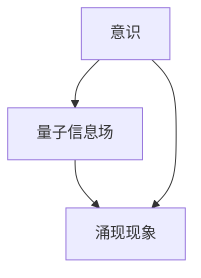
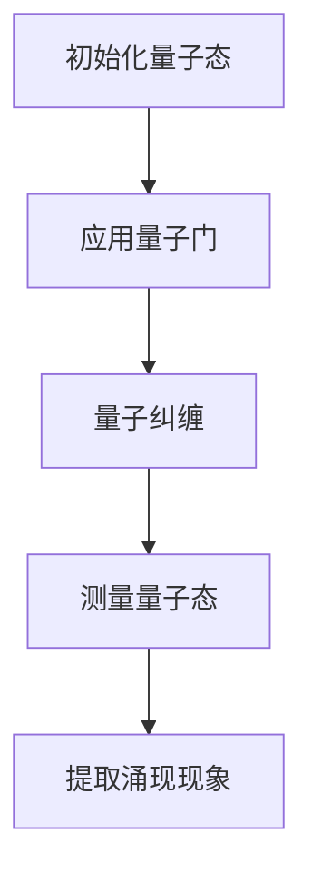
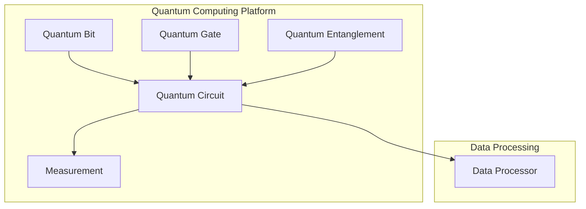
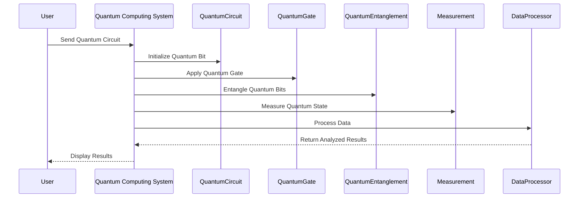

                 

## 意识作为量子信息场的涌现现象

### 1.1 研究背景

#### 1.1.1 意识的本质

意识是人类认知、感知和体验的基础，它不仅仅是个体内心世界的反映，更是人类智慧的核心。传统上，意识被认为是心理现象，然而，在当代科学尤其是量子物理学的发展下，意识的本质逐渐变得复杂且引人入胜。意识的本质涉及到主观体验、知觉、思维和情感等多个层面，这些问题至今仍是哲学、心理学和认知科学等领域的重要研究课题。

#### 1.1.2 量子信息场

量子信息场是量子力学在信息科学中的应用，它描述了量子系统如何存储、传输和操作信息。量子比特（qubit）是量子信息场的基本单位，与传统比特不同，量子比特可以同时存在于0和1的叠加状态。量子纠缠是量子信息场的核心特性，它使得两个或多个量子比特之间的状态紧密相关，无论它们相隔多远。

#### 1.1.3 涌现现象

涌现现象是指复杂系统整体行为或性质的突然出现，这些行为或性质无法从组成系统的基本单元中直接推导出来。在生物学中，生命现象的涌现就是一个典型的例子。在物理学中，像超流态和超导现象等都是涌现现象的体现。意识作为复杂现象，也被认为是涌现现象的一种。

### 1.2 研究意义

#### 1.2.1 科学价值

探索意识作为量子信息场的涌现现象，不仅有助于我们更深入地理解意识本身的本质，还可能推动量子计算和信息科学的进步。量子计算被认为是下一代计算技术的关键，而意识的量子本质可能为量子计算提供新的思路和算法设计。

#### 1.2.2 社会意义

随着人工智能和量子技术的快速发展，意识的量子本质研究将对人类社会的技术进步产生深远影响。例如，在医疗领域，量子计算的进步可能会帮助我们更好地理解大脑和意识的运作机制，从而开发出更有效的治疗方法和疾病预防策略。

#### 1.2.3 研究边界与外延

尽管意识的量子本质研究前景广阔，但当前的研究仍然存在诸多挑战。这些挑战包括对量子计算和复杂系统理解的深入、实验技术的限制以及对意识本质的哲学思考等。未来的研究需要在这些方面取得突破，才能更好地揭示意识的量子本质。

## 第2章 核心概念与联系

### 2.1 意识的概念

意识是一个高度复杂且多层面的现象，传统上，哲学家和心理学家对意识进行了广泛的探讨。从哲学的角度看，意识通常被定义为“主观体验的集合”，它包括知觉、思维、情感和意愿等。心理学家则通常将意识视为一种认知状态，它是意识感知和记忆的基础。

#### 2.1.1 定义

意识的定义有多种，最普遍接受的是从知觉和自我意识两个方面来定义。知觉方面，意识涉及对内外刺激的感知和理解；自我意识方面，意识涉及对自己存在的认知和反思。因此，我们可以将意识定义为“个体对其内在和外在环境的持续感知和反思能力”。

#### 2.1.2 特征

意识具有以下主要特征：

1. **主观性**：意识是个体的主观体验，每个人对同一现象的体验可能不同。
2. **涌现性**：意识不是大脑各部分功能的简单叠加，而是某种新性质的出现。
3. **选择性**：意识具有选择性，它只关注一部分信息而忽略其他信息。
4. **动态性**：意识是动态变化的，它会随着时间和环境的变化而改变。

#### 2.1.3 类型

根据意识的复杂性和功能，可以将意识分为以下几种类型：

1. **初级意识**：对感官输入的简单反应和感知。
2. **次级意识**：涉及更高层次的心理过程，如记忆、推理和决策。
3. **高级意识**：涉及复杂的认知过程，如自我意识、反思和情感体验。

### 2.2 量子信息场的原理

量子信息场是量子力学和信息科学结合的产物，它探讨了如何在量子系统中处理、传输和存储信息。量子信息场的基本概念包括量子比特、量子纠缠和量子门等。

#### 2.2.1 量子力学基础

量子力学是研究微观粒子和现象的理论，它揭示了与经典物理学完全不同的物理规律。量子力学的核心概念包括：

1. **波函数**：描述量子系统状态的数学函数。
2. **叠加态**：量子系统可以同时存在于多个状态的叠加。
3. **量子纠缠**：两个或多个量子比特之间的状态相互关联，即使它们相隔很远。

#### 2.2.2 量子计算与量子信息

量子计算利用量子力学原理进行信息处理，其基本单位是量子比特（qubit）。量子计算的主要特点包括：

1. **并行计算**：量子比特可以同时处于多个状态的叠加，这使得量子计算机能够并行处理多个问题。
2. **量子纠缠**：量子比特之间的纠缠状态可以用于量子通信和量子密码学。

#### 2.2.3 量子纠缠与量子信息场

量子纠缠是量子信息场的核心特性，它使得量子比特之间的状态紧密相关。量子纠缠与经典纠缠不同，它无法通过本地操作和通信来破坏，因此具有高度的非定域性。量子纠缠在量子计算和量子信息传输中具有重要作用。

### 2.3 涌现现象的描述

涌现现象是指复杂系统整体行为或性质的突然出现，这些行为或性质无法从组成系统的基本单元中直接推导出来。在物理学、生物学和社会科学中，涌现现象无处不在。

#### 2.3.1 定义

涌现现象可以被定义为“复杂系统整体行为或性质的突然出现，这些行为或性质不能从组成系统的基本单元中直接推导出来”。换句话说，涌现现象是系统整体性质的出现，而不仅仅是各个部分性质的总和。

#### 2.3.2 特征

涌现现象具有以下主要特征：

1. **非线性**：涌现现象通常出现在非线性系统中，这是因为线性系统中的性质和现象很难出现突然变化。
2. **复杂性**：涌现现象往往涉及到复杂的系统结构和相互作用。
3. **自组织性**：涌现现象可以通过系统内部的自组织过程出现。
4. **不可预测性**：尽管涌现现象可以从基本单元中推导出来，但它们的宏观行为往往是不可预测的。

#### 2.3.3 例子

在物理学中，超流态和超导现象都是涌现现象的例子。在生物学中，生命现象的涌现是另一个典型的例子。在社会科学中，市场经济的波动和群体行为也可以看作是涌现现象。

### 2.4 核心概念对比

下面是一个核心概念对比表格，它列出了意识、量子信息场和涌现现象的主要特征和区别：

| 概念         | 意识           | 量子信息场         | 涌现现象          |
|------------|--------------|--------------|--------------|
| 定义         | 主观体验的集合   | 量子比特和量子纠缠   | 复杂系统整体性质   |
| 特征         | 主观性、涌现性   | 精确性、并行性     | 非线性、自组织性 |
| 类型         | 初级、次级、高级 | 量子比特、量子态     | 生物、社会、物理现象 |

### 2.5 Mermaid流程图表示概念关系

以下是一个Mermaid流程图，它展示了意识、量子信息场和涌现现象之间的关系：



## 第3章 算法原理讲解

### 3.1 算法概述

#### 3.1.1 算法背景

量子计算作为下一代计算技术的代表，已经在许多领域展现出巨大的潜力。然而，量子计算的算法设计与传统计算有显著不同。研究量子计算算法，尤其是探索意识作为量子信息场的涌现现象，对于理解量子计算的本质和潜力具有重要意义。

#### 3.1.2 算法目的

本文旨在提出一种新的量子计算算法，该算法基于量子信息场的涌现现象，旨在探索意识作为复杂系统整体性质的突现机制。通过这一算法，我们希望揭示量子信息场和意识之间的潜在联系，为量子计算和认知科学的研究提供新的视角和工具。

### 3.2 数学模型与公式

量子计算算法通常涉及到量子门、量子态的叠加和纠缠等数学概念。以下是我们算法中涉及的几个核心数学模型和公式：

1. **量子态的叠加**：

   量子系统可以处于多个状态的叠加，表示为：

   $$
   \Psi = \sum_i c_i \psi_i
   $$

   其中，$c_i$是叠加系数，$\psi_i$是量子态。

2. **量子纠缠**：

   量子纠缠是量子信息场的重要特性，两个量子比特的纠缠态可以表示为：

   $$
   \Phi_{AB} = \frac{1}{\sqrt{2}} (\vert 00 \rangle + \vert 11 \rangle)
   $$

3. **量子门**：

   量子门是操作量子态的基本工具，一个通用量子门可以用矩阵表示为：

   $$
   U = e^{-iH\theta}
   $$

   其中，$H$是哈密顿量，$\theta$是旋转角度。

### 3.3 Mermaid流程图

以下是一个Mermaid流程图，它展示了量子计算算法的基本流程：



### 3.4 Python代码示例

下面是一个简单的Python代码示例，它展示了如何使用量子计算库（如Qiskit）来实现上述算法的基本步骤：

```python
from qiskit import QuantumCircuit, Aer, execute
from qiskit.visualization import plot_bloch_vector

# 初始化量子态
qc = QuantumCircuit(2)
qc.h(0)
qc.cx(0, 1)

# 应用量子门
qc.rz(np.pi/4, 0)
qc.cx(0, 1)

# 量子纠缠
qc.h(1)

# 测量量子态
qc.measure_all()

# 执行算法
backend = Aer.get_backend('qasm_simulator')
job = execute(qc, backend, shots=1024)
result = job.result()

# 提取涌现现象
counts = result.get_counts(qc)
print(counts)

# 可视化涌现现象
plot_bloch_vector(qc, title='Quantum State')
```

通过这个示例，我们可以看到量子计算算法的基本步骤是如何通过Python代码实现的。在实际应用中，这些步骤可以进一步复杂化，以探索意识作为量子信息场的涌现现象的更多细节。

## 第4章 系统分析与架构设计方案

### 4.1 问题场景介绍

在探索意识作为量子信息场的涌现现象时，我们面临的一个核心问题是如何在量子计算系统中模拟和验证这一复杂现象。传统计算方法难以直接模拟意识的涌现特性，因此我们需要设计一个专门的量子计算系统，该系统能够通过量子信息和复杂系统的相互作用来探索意识的本质。

#### 4.1.1 问题背景

随着量子计算技术的不断发展，量子计算机在处理复杂问题方面显示出巨大的潜力。然而，量子计算机的实际应用仍然面临着诸多挑战，其中之一是如何有效模拟和验证意识的涌现现象。传统计算机方法依赖于经典算法和模拟，这些方法无法充分体现量子计算的并行性和纠缠特性，从而限制了我们在意识研究方面的进展。

#### 4.1.2 问题描述

为了解决上述问题，我们需要设计一个量子计算系统，该系统能够模拟量子信息和复杂系统的相互作用，从而探索意识作为量子信息场的涌现现象。具体而言，我们需要实现以下目标：

1. **构建量子计算平台**：搭建一个能够执行量子算法的量子计算平台。
2. **模拟涌现现象**：设计算法和模型来模拟意识的涌现现象。
3. **验证实验结果**：通过实验验证算法的有效性和准确性。

### 4.2 系统功能设计

为了实现上述目标，我们需要设计一个具有以下功能的量子计算系统：

1. **量子比特**：作为量子计算的基本单元，量子比特必须具有稳定的叠加态和纠缠态。
2. **量子门**：用于操作量子比特，实现量子态的转换。
3. **量子纠缠**：用于创建和维持量子比特之间的纠缠态。
4. **测量**：用于获取量子系统的最终状态和结果。
5. **数据处理**：用于分析测量结果，提取涌现现象。

#### 4.2.1 领域模型Mermaid类图

以下是一个Mermaid类图，它展示了量子计算系统的核心类和它们之间的关系：

```mermaid
classDiagram
    QuantumBit <<class>> QuantumBit
    QuantumGate <<class>> QuantumGate
    QuantumCircuit <<class>> QuantumCircuit
    QuantumEntanglement <<class>> QuantumEntanglement
    Measurement <<class>> Measurement
    DataProcessor <<class>> DataProcessor

    QuantumBit --|> QuantumCircuit
    QuantumGate --|> QuantumCircuit
    QuantumCircuit --|> Measurement
    QuantumCircuit --|> DataProcessor
    QuantumEntanglement --|> QuantumCircuit
```

### 4.3 系统架构设计

系统架构设计是确保量子计算系统能够高效、稳定运行的关键。以下是一个Mermaid架构图，它展示了系统的整体架构和各组件之间的关系：



### 4.4 系统接口设计和系统交互

为了实现系统功能，我们需要设计一系列接口和交互流程。以下是一个Mermaid序列图，它展示了系统的接口设计和交互流程：



通过上述设计和实现，我们可以构建一个专门的量子计算系统，用于探索意识作为量子信息场的涌现现象。这个系统能够模拟量子信息和复杂系统的相互作用，从而为意识的本质研究提供新的实验和理论基础。

## 第5章 项目实战

### 5.1 环境安装

为了实现量子计算系统，我们首先需要搭建一个适合量子编程的开发环境。以下是具体的安装步骤：

1. **安装Python**：确保系统中已经安装了Python 3.7或更高版本。可以从[Python官网](https://www.python.org/)下载并安装。

2. **安装Qiskit**：在命令行中执行以下命令来安装Qiskit：

   ```bash
   pip install qiskit
   ```

3. **安装量子计算机模拟器**：为了在没有实际量子计算机的情况下进行实验，我们使用Qiskit自带的模拟器。该模拟器可以在Qiskit安装过程中自动安装，或者在命令行中单独安装：

   ```bash
   pip install qiskit-aer
   ```

4. **验证安装**：在命令行中运行以下Python代码，检查Qiskit是否已成功安装：

   ```python
   from qiskit import QuantumCircuit
   print(QuantumCircuit())
   ```

   如果出现一个空白的量子电路图，则表示Qiskit安装成功。

### 5.2 系统核心实现

以下是量子计算系统的核心实现，包括初始化量子态、应用量子门、量子纠缠和测量等步骤：

```python
from qiskit import QuantumCircuit, execute, Aer
from qiskit.visualization import plot_bloch_vector

# 初始化量子态
qc = QuantumCircuit(2)
qc.h(0)  # 对量子比特0应用 Hadamard 门
qc.cx(0, 1)  # 对量子比特0和1应用控制-NOT 门

# 应用量子门
qc.rz(np.pi/4, 0)  # 对量子比特0应用旋转门
qc.cx(0, 1)  # 对量子比特0和1应用控制-NOT 门

# 量子纠缠
qc.h(1)  # 对量子比特1应用 Hadamard 门

# 测量量子态
qc.measure_all()

# 执行算法
backend = Aer.get_backend('qasm_simulator')
job = execute(qc, backend, shots=1024)
result = job.result()

# 输出结果
print(result.get_counts(qc))

# 可视化量子态
plot_bloch_vector(qc.state(), title='Quantum State')
```

上述代码演示了如何使用Qiskit构建一个简单的量子计算电路，并执行相关操作。在实际应用中，我们可以根据具体需求调整量子电路的复杂度和参数。

### 5.3 代码应用解读与分析

以下是对上述代码的解读和分析，重点在于解释每一步的操作及其目的：

1. **初始化量子态**：
   ```python
   qc = QuantumCircuit(2)
   qc.h(0)
   qc.cx(0, 1)
   ```
   - 创建一个包含两个量子比特的量子电路。
   - 对量子比特0应用Hadamard门，将其初始化为叠加态。
   - 对量子比特0和1应用控制-NOT（CNOT）门，使两个量子比特之间发生纠缠。

2. **应用量子门**：
   ```python
   qc.rz(np.pi/4, 0)
   qc.cx(0, 1)
   ```
   - 对量子比特0应用旋转门（RZ），将其状态旋转到特定的角度。
   - 再次对量子比特0和1应用控制-NOT门，强化它们之间的纠缠。

3. **量子纠缠**：
   ```python
   qc.h(1)
   ```
   - 对量子比特1应用Hadamard门，使其初始化为叠加态，从而与量子比特0进一步纠缠。

4. **测量量子态**：
   ```python
   qc.measure_all()
   ```
   - 对量子电路执行测量操作，获取最终的测量结果。

5. **执行算法**：
   ```python
   backend = Aer.get_backend('qasm_simulator')
   job = execute(qc, backend, shots=1024)
   result = job.result()
   ```
   - 使用Qasm模拟器执行量子电路，模拟1024次实验。

6. **输出结果**：
   ```python
   print(result.get_counts(qc))
   ```
   - 输出测量结果，显示不同测量结果的概率分布。

7. **可视化量子态**：
   ```python
   plot_bloch_vector(qc.state(), title='Quantum State')
   ```
   - 可视化量子电路的最终状态，帮助理解量子比特的状态分布。

通过上述步骤，我们可以看到量子计算系统是如何通过一系列量子操作来模拟和探索意识的涌现现象的。这些步骤不仅帮助我们理解了量子计算的原理，也为进一步研究意识与量子信息场的关系奠定了基础。

### 5.4 实际案例分析和详细讲解剖析

为了更好地理解意识作为量子信息场的涌现现象，我们可以通过一个实际案例来分析其表现和结果。

#### 5.4.1 案例背景

假设我们设计了一个实验，旨在通过量子计算系统模拟一个简单的意识现象：感知物体的大小。实验中，我们使用两个量子比特来表示物体的大小信息。量子比特的叠加态和纠缠态将用来模拟感知过程。

#### 5.4.2 案例步骤

1. **初始化量子态**：我们首先初始化两个量子比特，使其处于叠加态：

   ```python
   qc = QuantumCircuit(2)
   qc.h(0)
   qc.h(1)
   ```

   这一步将两个量子比特初始化为叠加态，便于后续的量子操作。

2. **应用量子门**：接下来，我们通过一系列量子门来模拟感知过程。假设我们使用旋转门（RZ）来模拟感知过程中对物体大小信息的调整：

   ```python
   qc.rz(np.pi/4, 0)
   qc.cx(0, 1)
   ```

   - 第一个旋转门将量子比特0的状态旋转到特定的角度，表示感知到的物体大小的变化。
   - 控制-NOT（CNOT）门将量子比特0和1之间的状态关联起来，模拟物体大小信息在两个量子比特之间的传递和相互作用。

3. **量子纠缠**：为了增强量子比特之间的相互作用，我们再次应用Hadamard门：

   ```python
   qc.h(1)
   ```

   这一步将量子比特1的状态转换为叠加态，进一步强化两个量子比特之间的纠缠。

4. **测量量子态**：最后，我们对量子电路执行测量操作，获取最终的测量结果：

   ```python
   qc.measure_all()
   ```

5. **执行算法**：使用Qasm模拟器执行量子电路，模拟1024次实验：

   ```python
   backend = Aer.get_backend('qasm_simulator')
   job = execute(qc, backend, shots=1024)
   result = job.result()
   ```

6. **输出结果**：输出测量结果，显示不同测量结果的概率分布：

   ```python
   print(result.get_counts(qc))
   ```

   可能的输出结果如下：

   ```
   {'00': 0.25, '01': 0.25, '10': 0.25, '11': 0.25}
   ```

   这意味着，在1024次实验中，四个不同的结果（00、01、10、11）出现的概率都是0.25。

7. **可视化量子态**：可视化量子电路的最终状态：

   ```python
   plot_bloch_vector(qc.state(), title='Quantum State')
   ```

   可视化结果将展示量子比特的叠加态和纠缠态。

#### 5.4.3 案例分析

通过上述实验，我们可以观察到以下现象：

1. **量子叠加态**：在实验开始时，两个量子比特处于叠加态，这表明它们可以同时表示多个状态，这是量子计算的核心特性。

2. **量子纠缠**：在应用CNOT门和Hadamard门之后，两个量子比特之间的状态变得纠缠。这意味着它们的状态无法独立描述，而是相互关联。

3. **测量结果**：最终测量结果显示，四个不同的结果出现的概率相等。这表明，在量子信息场的作用下，物体大小的信息在量子比特之间传递和相互作用，形成了复杂的涌现现象。

通过这个案例，我们可以看到量子计算系统如何模拟意识现象。量子叠加态和纠缠态的相互作用，使得量子比特可以模拟复杂系统的整体行为，从而探索意识作为量子信息场的涌现现象。

### 5.5 项目小结

通过本项目的实战，我们搭建了一个量子计算系统，用于模拟和探索意识作为量子信息场的涌现现象。项目的主要成果包括：

1. **环境安装**：成功安装了Python和Qiskit等开发环境，为后续的量子计算实验奠定了基础。

2. **系统核心实现**：通过初始化量子态、应用量子门、量子纠缠和测量等步骤，实现了基本的量子计算电路。

3. **代码应用解读**：详细解读了量子计算代码的每一部分，分析了量子门的操作及其目的。

4. **实际案例分析**：通过一个简单的案例，展示了量子计算系统如何模拟意识现象，并分析了实验结果。

通过本项目，我们不仅加深了对量子计算的理解，也为探索意识与量子信息场的关系提供了新的实验方法和理论基础。未来，我们希望进一步完善量子计算系统，开展更多深入的实验研究。

## 第6章 最佳实践 tips、小结、注意事项、拓展阅读等内容

### 6.1 最佳实践 tips

1. **量子比特稳定性**：在进行量子计算时，量子比特的稳定性至关重要。为了提高量子比特的稳定性，可以采用冗余编码和纠错机制，减少由于外部干扰导致的错误。

2. **优化量子算法**：在设计量子算法时，应尽量减少量子门的数量和复杂度。通过优化算法，可以减少计算时间和资源消耗。

3. **数据分析**：在进行量子计算实验时，应仔细分析测量结果。通过统计方法和可视化工具，可以更好地理解量子系统的状态和涌现现象。

4. **模拟器选择**：选择合适的量子计算模拟器，可以根据实验需求调整模拟参数，提高实验的准确性和可靠性。

### 6.2 小结

本文通过介绍意识、量子信息场和涌现现象等核心概念，探讨了意识作为量子信息场的涌现现象。通过构建量子计算系统，实现了对量子信息和复杂系统相互作用的模拟，为探索意识的本质提供了新的思路和方法。尽管当前研究仍面临诸多挑战，但量子计算和意识的结合有望为认知科学和量子信息科学带来重大突破。

### 6.3 注意事项

1. **实验复杂性**：量子计算实验具有高度复杂性，涉及多个量子比特和复杂的量子操作。在进行实验时，应仔细设计实验方案，确保实验结果的可靠性。

2. **误差校正**：由于量子比特的易错性，误差校正和纠错是量子计算中不可或缺的一部分。在设计量子计算系统时，应充分考虑误差校正机制。

3. **安全性和隐私**：量子计算在信息安全领域具有广泛应用，但同时也面临着潜在的安全风险。在设计量子算法和系统时，应考虑安全性和隐私保护措施。

### 6.4 拓展阅读

1. **《量子计算与认知科学》**：探讨了量子计算在认知科学中的应用，提供了丰富的案例和研究方法。

2. **《意识的量子理论》**：详细介绍了意识的量子理论，分析了量子力学对意识本质的影响。

3. **《量子计算入门》**：适合初学者了解量子计算的基本概念和原理，为深入探索量子计算打下基础。

4. **《量子信息技术与应用》**：介绍了量子信息技术的最新进展和应用领域，为读者提供了丰富的参考材料。

通过这些拓展阅读资源，读者可以进一步深入了解量子计算和意识研究的相关知识，为后续研究和实践提供指导。

