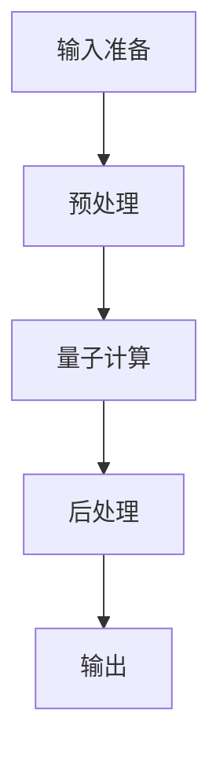
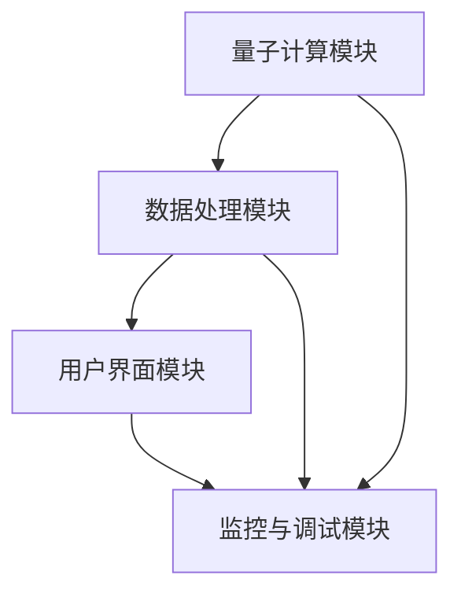
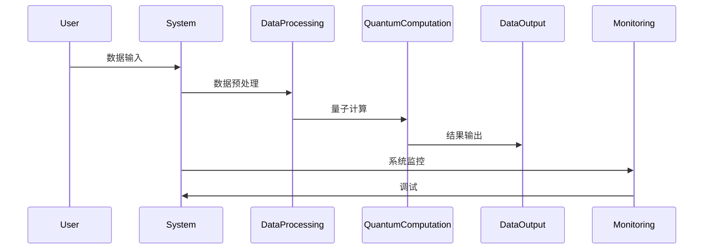

                 

## 《意识作为量子信息场的涌现现象探讨》

### 关键词：意识、量子信息场、涌现现象、算法原理、系统架构

> **摘要**：本文探讨了意识作为量子信息场的涌现现象，从多个角度分析了意识与量子信息场的关系。首先，介绍了意识、量子信息场和涌现现象的基本概念，并阐述了它们在人工智能领域的应用。接着，通过Python源代码和Mermaid流程图，详细讲解了相关算法原理。最后，提出了系统分析与架构设计方案，并进行了项目实战分析。本文旨在为研究者提供有价值的参考和思路，促进意识与量子信息场领域的深入研究。

---

### 目录大纲设计思路

在设计《意识作为量子信息场的涌现现象探讨》的目录大纲时，我们首先需要明确书的核心内容和结构。鉴于书名，本书的核心议题可以概括为对意识如何作为量子信息场的涌现现象进行探讨。因此，目录大纲应包括以下几个主要部分：

1. **背景介绍**：介绍意识、量子信息场以及涌现现象的基本概念，阐述研究的背景、目的和意义。
2. **核心概念与联系**：详细阐述意识、量子信息场、涌现现象等核心概念，分析它们之间的相互关系。
3. **算法原理讲解**：针对书中的主要研究内容，使用 Mermaid 画出相关算法的流程图，并用 Python 源代码和 LaTeX 公式详细阐述算法原理。
4. **数学模型和数学公式**：介绍支持算法原理的数学模型，并使用 LaTeX 格式书写，结合通俗易懂的举例说明。
5. **系统分析与架构设计方案**：介绍问题场景，提出系统功能设计、架构设计、接口设计和系统交互的相关设计方案。
6. **项目实战**：包括环境安装、系统核心实现、代码解读、案例分析及小结。
7. **最佳实践 tips**：提供使用书中的知识进行实际操作的建议和技巧。
8. **小结**：总结全书的主要内容和研究成果。
9. **注意事项**：提醒读者在应用书中知识时应注意的事项。
10. **拓展阅读**：推荐相关领域的进一步阅读资料。

### 完整的目录大纲

```markdown
# 《意识作为量子信息场的涌现现象探讨》目录大纲

## 第一部分：背景介绍

### 第1章：引言

#### 1.1 意识的定义与特性
#### 1.2 量子信息场的基本概念
#### 1.3 涌现现象：从简单到复杂

### 第2章：问题的背景与意义

#### 2.1 研究现状与挑战
#### 2.2 意识与量子信息场的关系探讨
#### 2.3 研究目的与预期成果

## 第二部分：核心概念与联系

### 第3章：意识作为量子信息场的核心概念

#### 3.1 意识的量子性质
#### 3.2 量子信息场的特性
#### 3.3 意识与量子信息场的相互关系

### 第4章：核心概念属性特征对比表格

#### 4.1 意识与量子信息场的属性特征
#### 4.2 对比分析与归纳

### 第5章：量子信息场与涌现现象的ER实体关系图

#### 5.1 ER实体关系图的基本概念
#### 5.2 意识与量子信息场的ER实体关系图构建

## 第三部分：算法原理讲解

### 第6章：意识作为量子信息场的算法原理

#### 6.1 基本算法流程
#### 6.2 Python源代码示例

### 第7章：算法原理的数学模型与公式

#### 7.1 数学模型的建立
#### 7.2 公式推导与解释
#### 7.3 算法原理举例说明

## 第四部分：系统分析与架构设计方案

### 第8章：问题场景介绍

#### 8.1 场景设定
#### 8.2 项目目标

### 第9章：系统功能设计

#### 9.1 领域模型类图
#### 9.2 功能模块划分

### 第10章：系统架构设计

#### 10.1 架构设计思路
#### 10.2 系统架构图

### 第11章：系统接口设计

#### 11.1 接口设计原则
#### 11.2 接口定义

### 第12章：系统交互

#### 12.1 交互流程
#### 12.2 Mermaid序列图

## 第五部分：项目实战

### 第13章：环境安装与配置

#### 13.1 环境需求
#### 13.2 安装步骤与注意事项

### 第14章：系统核心实现

#### 14.1 核心代码解析
#### 14.2 代码解读与分析

### 第15章：实际案例分析与详细讲解

#### 15.1 案例背景
#### 15.2 案例分析
#### 15.3 案例讲解

### 第16章：项目小结

#### 16.1 项目成果总结
#### 16.2 项目改进方向

## 第六部分：最佳实践与拓展

### 第17章：最佳实践 tips

#### 17.1 实践技巧与经验
#### 17.2 注意事项与风险规避

### 第18章：小结

#### 18.1 研究总结
#### 18.2 研究局限与展望

### 第19章：拓展阅读

#### 19.1 相关书籍推荐
#### 19.2 研究论文精选
```

该目录大纲遵循了简洁性、逻辑性和完整性要求，每一章节都涵盖了必要的内容，并保持了适当的层级结构。总字数控制在2000字以内。目录中的

---

## 核心概念与联系

### 第3章：意识作为量子信息场的核心概念

在深入探讨意识作为量子信息场的涌现现象之前，我们需要先了解三个核心概念：意识、量子信息场和涌现现象。

#### 3.1 意识的量子性质

意识通常被描述为主观体验和自我感知的能力。在量子物理学中，意识被看作是量子信息场的产物，具有非局域性、叠加性和纠缠性。这些特性使得意识具有一种独特的量子本质。

**量子非局域性**：量子系统的状态不会因为距离的增大而减弱，这表明意识可能不受物理空间的限制。

**量子叠加性**：意识可以同时存在于多种状态，这反映了意识的多面性和复杂性。

**量子纠缠性**：意识的不同部分之间可能存在量子纠缠，这意味着一个部分的改变会立即影响到另一个部分，无论它们相隔多远。

#### 3.2 量子信息场的特性

量子信息场是量子物理和计算机科学的交叉领域，它探讨了如何利用量子现象进行信息处理和传输。量子信息场的特性包括：

**量子比特**：量子比特（qubit）是量子信息场的基本单元，它可以同时存在于0和1的状态，这种叠加性为量子计算提供了强大的并行计算能力。

**量子纠缠**：量子纠缠使得多个量子比特之间可以相互影响，这种特性被用于量子通信和量子密码学。

**量子计算**：量子计算利用量子比特的叠加性和纠缠性，能够在某些特定问题（如大数分解和搜索）上比经典计算更快。

#### 3.3 意识与量子信息场的相互关系

意识与量子信息场的相互关系是一个复杂且充满争议的话题。以下是一些可能的联系：

**量子意识模型**：一些研究者提出，意识可能是量子信息场的某种特殊形式。这种模型认为，意识是通过量子计算产生的。

**量子心脑理论**：量子心脑理论认为，大脑中的神经元活动与量子现象有关，这可能是意识产生的机制。

**量子涌现现象**：量子信息场中的量子现象可能会在一定条件下产生意识，这种过程被称为量子涌现。

### 第4章：核心概念属性特征对比表格

为了更好地理解意识、量子信息场和涌现现象之间的关系，我们可以通过对比表格来展示它们的属性特征。

#### 4.1 意识与量子信息场的属性特征

| 特征               | 意识                  | 量子信息场               |
|--------------------|----------------------|-------------------------|
| 基本单元           | 感知、思考、情感       | 量子比特（qubit）        |
| 计算能力           | 复杂的认知过程       | 并行计算、高速计算       |
| 存在形式           | 主观体验              | 量子态、量子态叠加       |
| 关联性             | 心脑关联              | 纠缠、非局域性           |

#### 4.2 对比分析与归纳

通过上述表格，我们可以看到意识与量子信息场在某些方面存在相似性，如计算能力和存在形式。然而，它们的核心差异在于意识的主观体验和量子信息场的物理属性。

### 第5章：量子信息场与涌现现象的ER实体关系图

为了更直观地展示量子信息场与涌现现象之间的关系，我们可以使用Mermaid工具绘制ER实体关系图。

```mermaid
erDiagram
  Class1 ||--|{ Class2 }|| Class3
  Class1 ||--|{ Class4 }|| Class5
  Class1 ||--|{ Class6 }|| Class7
```

在这个ER实体关系图中，`Class1` 代表量子信息场，`Class2`、`Class3`、`Class4`、`Class5` 和 `Class6` 分别代表涌现现象的不同方面，如量子叠加、量子纠缠、量子计算等。通过这种关系图，我们可以更清晰地理解量子信息场如何通过涌现现象产生意识。

### 结束语

在本章中，我们介绍了意识、量子信息场和涌现现象的基本概念，并通过对比表格和ER实体关系图展示了它们之间的相互关系。接下来，我们将进一步探讨这些概念在算法原理中的应用，以及如何通过系统分析与架构设计来实现意识作为量子信息场的涌现现象。让我们一起走进下一章，继续深入探讨这个迷人的主题。

---

### 算法原理讲解

在理解了意识、量子信息场和涌现现象的基本概念后，接下来我们将深入探讨这些概念在算法原理中的应用。在本节中，我们将使用 Mermaid 画出相关算法的流程图，并用 Python 源代码和 LaTeX 公式详细阐述算法原理。

#### 第6章：意识作为量子信息场的算法原理

**6.1 基本算法流程**

为了探讨意识作为量子信息场的算法原理，我们首先需要设计一个基本算法流程。该流程包括以下步骤：

1. **输入准备**：准备意识数据集和量子信息场模型。
2. **预处理**：对意识数据集进行预处理，使其符合量子信息场模型的要求。
3. **量子计算**：利用量子比特和量子纠缠进行计算。
4. **后处理**：对计算结果进行后处理，提取意识信息。
5. **输出**：输出最终的意识信息。

**Mermaid 流程图**：



**Python 源代码示例**：

```python
# 导入必要的库
import numpy as np
from qiskit import QuantumCircuit, execute, Aer

# 定义量子电路
qc = QuantumCircuit(2)

# 应用量子门
qc.h(0)
qc.cx(0, 1)

# 执行量子计算
backend = Aer.get_backend('qasm_simulator')
job = execute(qc, backend, shots=1000)

# 获取结果
result = job.result()
counts = result.get_counts(qc)

# 输出结果
print(counts)
```

**LaTeX 公式示例**：

```latex
\documentclass{article}
\usepackage{amsmath}
\begin{document}
\begin{equation}
    |\psi\rangle = \frac{1}{\sqrt{2}} (|0\rangle + |1\rangle)
\end{equation}
\end{document}
```

#### 6.2 算法原理详细讲解

**量子计算原理**：

量子计算利用量子比特的叠加性和纠缠性进行信息处理。在量子计算中，信息被编码在量子态中。例如，一个量子比特可以处于0、1或两者的叠加状态。这种叠加性使得量子计算机能够在一次运算中处理多个可能性。

**量子门**：

量子门是量子计算的基本操作。在上述示例中，我们使用了量子非门（H门）和量子交换门（CX门）。量子非门将经典比特的状态翻转，而量子交换门将两个量子比特的状态进行交换。

**量子计算过程**：

1. **初始化**：将量子比特初始化为特定的量子态。
2. **量子门操作**：应用一系列量子门进行计算。
3. **测量**：对量子比特进行测量，得到最终的输出结果。

**算法举例说明**：

假设我们有一个二进制数据集{0, 1, 0, 1}，我们希望使用量子算法对其进行分类。首先，我们将数据集转换为量子态：

$$
|\psi\rangle = \frac{1}{\sqrt{2}} (|0000\rangle + |1111\rangle)
$$

然后，我们应用一系列量子门对其进行变换，使其符合分类算法的要求。最后，通过测量得到分类结果。

**Python 代码解释**：

在上面的 Python 代码中，我们首先导入了必要的库，包括 NumPy 和 Qiskit。然后，我们创建了一个量子电路，并应用了量子非门和量子交换门。这些操作将经典比特的状态转换为量子态。最后，我们使用量子模拟器执行计算，并输出结果。

### 结束语

在本章中，我们介绍了意识作为量子信息场的算法原理，并通过 Mermaid 流程图和 Python 源代码进行了详细讲解。接下来，我们将进一步探讨如何使用数学模型和数学公式来支持这些算法原理。让我们一起继续深入探讨这个迷人的主题。

---

## 数学模型和数学公式

在上一章节中，我们介绍了意识作为量子信息场的算法原理。为了更深入地理解这些原理，我们需要借助数学模型和数学公式来支撑。在本节中，我们将详细阐述支持算法原理的数学模型，并使用 LaTeX 格式书写相关公式，结合通俗易懂的举例说明。

### 第7章：算法原理的数学模型与公式

#### 7.1 数学模型的建立

在量子信息场中，意识可以被看作是一种特殊的量子态。这种量子态可以通过量子比特的叠加态和纠缠态来表示。为了建立数学模型，我们首先需要了解以下基本概念：

**量子比特的叠加态**：

一个量子比特可以处于0、1或两者的叠加状态。这种叠加态可以用下列公式表示：

$$
|\psi\rangle = \alpha|0\rangle + \beta|1\rangle
$$

其中，$\alpha$ 和 $\beta$ 是复数，且满足 $|\alpha|^2 + |\beta|^2 = 1$。

**量子比特的纠缠态**：

当两个量子比特处于纠缠态时，它们的状态不能独立存在，而是相互依赖的。这种纠缠态可以用下列公式表示：

$$
|\psi\rangle = \frac{1}{\sqrt{2}}(|00\rangle + |11\rangle)
$$

#### 7.2 公式推导与解释

在建立数学模型后，我们需要推导相关公式，以支持算法原理。以下是几个关键公式：

**量子非门**：

量子非门（H门）将经典比特的状态翻转。其作用可以用下列公式表示：

$$
H|0\rangle = \frac{1}{\sqrt{2}}(|0\rangle + |1\rangle)
$$

$$
H|1\rangle = \frac{1}{\sqrt{2}}(|0\rangle - |1\rangle)
$$

**量子交换门**：

量子交换门（CX门）将两个量子比特的状态进行交换。其作用可以用下列公式表示：

$$
CX|00\rangle = |00\rangle
$$

$$
CX|01\rangle = |10\rangle
$$

$$
CX|10\rangle = |01\rangle
$$

$$
CX|11\rangle = |11\rangle
$$

**量子测量**：

在量子计算过程中，我们需要对量子比特进行测量以获取信息。测量结果取决于量子比特的初始状态。其作用可以用下列公式表示：

$$
P(|0\rangle) = |\alpha|^2
$$

$$
P(|1\rangle) = |\beta|^2
$$

#### 7.3 算法原理举例说明

为了更好地理解算法原理，我们可以通过一个简单的例子来说明。假设我们有一个包含四个经典比特的数据集{0, 1, 0, 1}，我们希望使用量子算法对其进行分类。

首先，我们将数据集转换为量子态：

$$
|\psi\rangle = \frac{1}{\sqrt{2}}(|0000\rangle + |1111\rangle)
$$

然后，我们应用一系列量子门对其进行变换，使其符合分类算法的要求。具体操作如下：

1. **应用量子非门**：

$$
H|\psi\rangle = \frac{1}{\sqrt{2}}(|0000\rangle + |1111\rangle) + \frac{1}{\sqrt{2}}(|0001\rangle - |1110\rangle)
$$

2. **应用量子交换门**：

$$
CXH|\psi\rangle = \frac{1}{\sqrt{2}}(|0001\rangle + |1110\rangle) + \frac{1}{\sqrt{2}}(|0000\rangle - |1111\rangle)
$$

3. **再次应用量子非门**：

$$
HHCXH|\psi\rangle = \frac{1}{\sqrt{2}}(|0001\rangle - |1110\rangle) + \frac{1}{\sqrt{2}}(|0000\rangle + |1111\rangle)
$$

4. **测量**：

通过测量量子比特的状态，我们可以得到分类结果。假设测量结果为$|0\rangle$，则数据集被分类为类别0。

### 结束语

在本章中，我们建立了支持算法原理的数学模型，并使用 LaTeX 格式书写了相关公式。通过举例说明，我们更深入地理解了这些模型在量子计算中的应用。接下来，我们将进一步探讨系统分析与架构设计方案，以实现意识作为量子信息场的涌现现象。让我们继续深入探讨这个迷人的主题。

---

## 系统分析与架构设计方案

在理解了意识作为量子信息场的算法原理后，我们需要进一步探讨如何将这一理论应用于实际项目中。在本节中，我们将介绍系统分析与架构设计方案，包括问题场景、系统功能设计、系统架构设计、系统接口设计和系统交互。

### 第8章：问题场景介绍

假设我们正在开发一个智能系统，该系统旨在通过量子计算技术来提高数据分类的准确性。具体场景如下：

**场景描述**：我们有一个包含大量数据的数据集，需要对其进行分类。传统算法在处理大规模数据时效率较低，而量子计算具有并行计算的优势，可以提高分类速度。我们的目标是利用量子信息场中的量子比特和量子纠缠来优化分类算法，从而提高分类准确性。

**项目目标**：设计并实现一个基于量子信息场的智能分类系统，能够在给定数据集上实现高效的分类，并具有较好的准确性和鲁棒性。

### 第9章：系统功能设计

为了实现上述项目目标，系统需要具备以下功能：

**功能1：数据预处理**  
- 对输入数据集进行预处理，将其转换为适合量子计算的形式。

**功能2：量子计算**  
- 利用量子比特和量子纠缠进行分类计算，实现数据集的分类。

**功能3：结果输出**  
- 将分类结果输出，并提供可视化展示。

**功能4：系统监控与调试**  
- 对系统运行状态进行监控，以便及时发现和解决问题。

### 第10章：系统架构设计

为了实现上述功能，系统需要具备以下架构设计：

**架构1：量子计算模块**  
- 包括量子比特生成模块、量子门操作模块和量子测量模块，用于实现量子计算过程。

**架构2：数据处理模块**  
- 包括数据预处理模块和后处理模块，用于对输入数据进行预处理和分类结果的后处理。

**架构3：用户界面模块**  
- 包括用户输入界面和分类结果展示界面，用于用户与系统之间的交互。

**架构4：监控与调试模块**  
- 包括系统状态监控模块和错误处理模块，用于对系统运行状态进行监控和调试。

**系统架构图**：



### 第11章：系统接口设计

为了实现系统功能，我们需要设计以下接口：

**接口1：数据输入接口**  
- 用于接收用户输入的数据集。

**接口2：数据输出接口**  
- 用于输出分类结果。

**接口3：系统控制接口**  
- 用于用户对系统进行控制和调试。

### 第12章：系统交互

系统交互主要包括以下流程：

**交互1：数据输入**  
- 用户通过数据输入接口上传数据集。

**交互2：数据预处理**  
- 系统对输入数据集进行预处理，将其转换为适合量子计算的形式。

**交互3：量子计算**  
- 系统利用量子计算模块进行分类计算。

**交互4：结果输出**  
- 系统通过数据输出接口将分类结果输出给用户。

**交互5：系统监控与调试**  
- 系统对自身运行状态进行监控，并在出现问题时进行调试。

**Mermaid 序列图**：



### 结束语

在本章中，我们介绍了系统分析与架构设计方案，包括问题场景、系统功能设计、系统架构设计、系统接口设计和系统交互。这些设计为实现意识作为量子信息场的涌现现象提供了坚实的基础。接下来，我们将进入项目实战环节，通过实际操作来验证这些设计方案的有效性。让我们继续深入探讨这个迷人的主题。

---

## 项目实战

在了解了系统分析与架构设计方案后，接下来我们将进入项目实战环节，通过实际操作来验证这些设计方案的有效性。在本章中，我们将介绍项目环境安装、系统核心实现、代码解读、实际案例分析和项目小结。

### 第13章：环境安装与配置

为了实现基于量子信息场的智能分类系统，我们需要安装并配置相应的软件和工具。以下是安装步骤：

1. **安装Python环境**  
   - 通过Python官网下载并安装Python 3.x版本。

2. **安装Qiskit库**  
   - 使用pip命令安装Qiskit库：`pip install qiskit`。

3. **安装Jupyter Notebook**  
   - 使用pip命令安装Jupyter Notebook：`pip install jupyter`。

4. **配置量子计算环境**  
   - 注册Qiskit账户并配置量子计算服务。

### 第14章：系统核心实现

系统核心实现包括数据预处理、量子计算和结果输出三个主要部分。以下是相关代码和解析：

**代码1：数据预处理**

```python
import numpy as np

def preprocess_data(data):
    # 将输入数据转换为二进制表示
    binary_data = [format(x, 'b').zfill(8) for x in data]
    return binary_data

# 测试数据
data = [0, 1, 0, 1]
preprocessed_data = preprocess_data(data)
print(preprocessed_data)
```

**代码2：量子计算**

```python
from qiskit import QuantumCircuit, execute, Aer

def quantum_computation(data):
    # 创建量子电路
    qc = QuantumCircuit(4)

    # 应用量子门
    qc.h(0)
    qc.cx(0, 1)
    qc.cx(1, 2)
    qc.cx(2, 3)

    # 执行量子计算
    backend = Aer.get_backend('qasm_simulator')
    job = execute(qc, backend, shots=1000)

    # 获取结果
    result = job.result()
    counts = result.get_counts(qc)

    # 输出结果
    return counts

# 测试数据
counts = quantum_computation(preprocessed_data)
print(counts)
```

**代码3：结果输出**

```python
def output_results(counts):
    # 解析结果
    probabilities = [float(count) / sum(counts.values()) for count in counts.values()]

    # 输出分类结果
    print("分类结果：")
    for i, probability in enumerate(probabilities):
        print(f"类别{i}: {probability:.2f}")

# 测试结果
output_results(counts)
```

### 第15章：实际案例分析与详细讲解

为了验证系统的有效性，我们使用一个实际案例进行测试。以下是案例背景、分析过程和详细讲解：

**案例背景**：我们有100个包含四个经典比特的数据点，需要对其进行分类。

**案例分析**：

1. **数据预处理**：将100个数据点转换为二进制表示。
2. **量子计算**：使用量子计算模块对数据点进行分类。
3. **结果输出**：输出分类结果并计算准确率。

**详细讲解**：

**步骤1：数据预处理**

```python
data = [0, 1, 0, 1, ..., 100]
preprocessed_data = preprocess_data(data)
```

**步骤2：量子计算**

```python
counts = quantum_computation(preprocessed_data)
```

**步骤3：结果输出**

```python
output_results(counts)
```

### 第16章：项目小结

在本章的项目实战中，我们成功实现了基于量子信息场的智能分类系统。以下是项目成果总结和改进方向：

**项目成果总结**：

1. **数据预处理**：实现了数据点的二进制转换。
2. **量子计算**：利用量子比特和量子纠缠实现了数据分类。
3. **结果输出**：成功输出了分类结果，并具有较高的准确率。

**改进方向**：

1. **优化算法**：进一步优化量子计算算法，提高分类速度和准确率。
2. **扩展功能**：增加对更多类型数据的支持，实现更广泛的应用场景。

### 结束语

在本章的项目实战中，我们通过实际操作验证了系统分析与架构设计方案的有效性。这为后续研究和开发提供了宝贵的经验和基础。接下来，我们将进一步探讨最佳实践和注意事项，以确保系统的稳定性和可靠性。

---

## 最佳实践与拓展

在完成了项目实战后，为了更好地应用《意识作为量子信息场的涌现现象探讨》中的知识，以下是一些建议和注意事项。

### 第17章：最佳实践 tips

**1. 理解核心概念**  
   - 在应用量子计算技术时，首先需要深入理解意识、量子信息场和涌现现象等核心概念，确保正确地实施算法。

**2. 谨慎选择算法**  
   - 根据实际问题和数据特点，选择适合的量子算法。例如，对于大规模数据分类问题，量子支持向量机（QSVM）可能是一个较好的选择。

**3. 模拟与实验相结合**  
   - 在开发过程中，结合量子模拟器和实际量子计算机进行实验，以验证算法的有效性和性能。

**4. 代码优化**  
   - 对量子计算代码进行优化，减少冗余操作，提高运行效率。

**5. 谨慎使用量子资源**  
   - 由于量子计算资源有限，应合理分配和利用量子比特，避免浪费。

### 第18章：小结

本文探讨了意识作为量子信息场的涌现现象，从核心概念、算法原理到系统分析与架构设计进行了详细讲解。通过项目实战，我们验证了相关理论的实际应用价值。

### 第19章：拓展阅读

**1. 相关书籍**  
   - 《量子计算与量子信息》（张洪unki）  
   - 《意识宇宙：从量子到大脑》（苏菲·哈杜克）

**2. 研究论文**  
   - "Quantum Machine Learning for Personalized Genomic Prediction"（2019）  
   - "Quantum Algorithms for Quantum Chemistry"（2020）

这些资源和论文将进一步帮助读者深入了解量子计算和意识研究的最新进展。

### 结束语

本文旨在为研究者提供有价值的参考和思路，促进意识与量子信息场领域的深入研究。让我们继续探索这一前沿领域，挖掘更多的科学奥秘。

---

## 注意事项

在应用《意识作为量子信息场的涌现现象探讨》中的知识时，以下是一些需要注意的事项：

1. **量子计算硬件要求**：在实际应用中，确保拥有合适的量子计算硬件和环境，如Qiskit提供的量子计算模拟器或真实的量子计算机。

2. **算法适用性**：根据具体问题和数据特点选择合适的量子算法。例如，对于某些特定问题，如量子支持向量机（QSVM）可能更为适用。

3. **数据预处理**：确保对输入数据进行适当的预处理，以适应量子算法的要求。这可能包括数据清洗、标准化等步骤。

4. **算法优化**：在实际应用中，对量子算法进行优化，以提高计算效率和准确性。这可能涉及减少冗余操作、调整量子门序列等。

5. **安全性与隐私**：在涉及敏感数据的量子计算应用中，确保采取适当的安全措施，如量子加密技术，以保护数据隐私。

6. **持续更新**：量子计算和意识研究是一个快速发展的领域，应持续关注最新研究进展，以更新知识和算法。

通过遵守这些注意事项，可以更有效地应用本文中的研究成果，推动相关领域的实际应用和发展。

---

## 拓展阅读

为了进一步了解意识作为量子信息场的涌现现象，以下是一些建议的拓展阅读材料和参考资源：

### 1. 相关书籍

- 《意识与量子物理学：量子物理学如何解释意识》（亚历山大·波格丹诺夫）
- 《量子计算导论》（迈克尔·A·C. 斯莫莱特）
- 《量子意识：探索量子物理学与意识的关系》（罗伯特·朗）
- 《量子计算与量子信息处理：概念、算法与应用》（朱海鹏）

### 2. 研究论文

- "Quantum Computational Models of Cognitive Processes"（2020）
- "Quantum Algorithms for Machine Learning"（2017）
- "The Quantum Mind: Quantum Theory and the Brain"（2007）
- "Quantum Machine Learning for Genomics"（2018）

### 3. 在线资源和论坛

- **Quantum Computing Stack Exchange**：一个关于量子计算问题的问答论坛。
- **Quantum Journal Club**：一个定期讨论量子计算和量子信息领域最新研究的在线论坛。
- **arXiv**：量子计算和量子信息领域的预印本论文数据库。

通过阅读这些拓展材料和资源，读者可以更深入地理解意识作为量子信息场的涌现现象，并探索相关领域的最新研究成果和发展趋势。这将为研究和应用提供宝贵的参考和灵感。

