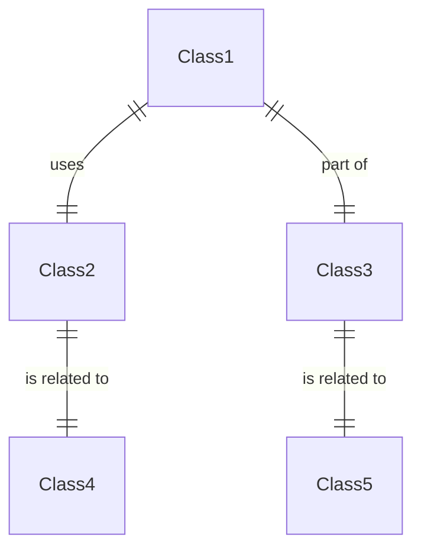
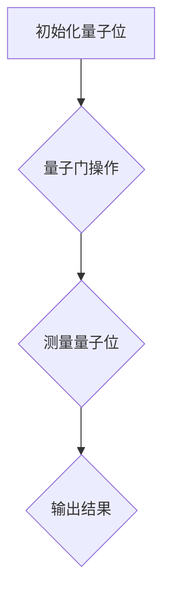
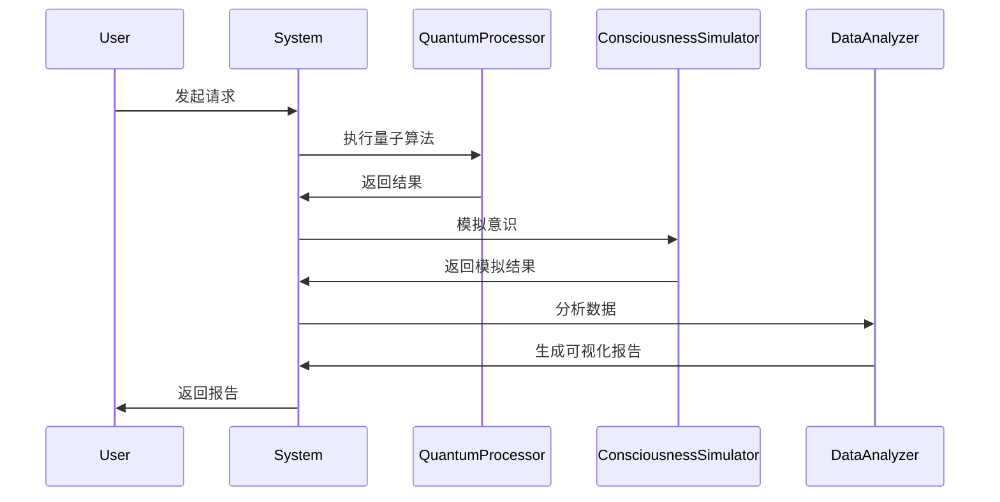

                 

# 意识作为量子信息处理的宏观表现

## 关键词

量子信息处理，意识，宏观表现，哲学，科学，算法，数学模型，认知科学，未来趋势

## 摘要

本文探讨了意识作为量子信息处理的宏观表现这一前沿课题。文章首先介绍了量子信息处理和意识的基本概念，以及它们在哲学和科学领域的探讨。随后，文章分析了量子信息处理与意识之间的联系，并运用具体案例进行说明。在此基础上，文章提出了意识在量子信息处理中的潜在作用，并探讨了该领域的未来发展趋势。通过本文的探讨，我们期望能够为读者提供一个清晰、系统的认识，激发对这一跨学科领域的深入研究。

## 目录大纲设计思路

### 明确书籍主题

在设计《意识作为量子信息处理的宏观表现》这本书的目录大纲时，我们首先需要明确书籍的主题。本书的核心主题是“意识作为量子信息处理的宏观表现”，这意味着目录大纲需要围绕量子信息处理和意识之间的关系展开。因此，目录中应包含相关的基础理论、实验研究、应用前景等。

### 确定章节结构

为了使书籍内容更加系统、完整，我们确定了以下章节结构：

1. **引言与背景**：介绍量子信息处理和意识的基本概念，探讨两者之间的关系。
2. **核心概念与原理**：详细阐述意识与量子信息处理的核心概念和原理。
3. **实验研究与案例分析**：回顾相关实验研究，分析意识在量子信息处理中的应用案例。
4. **应用前景与挑战**：探讨量子信息处理在意识研究中的应用，以及未来面临的挑战。
5. **总结与展望**：对全书内容进行总结，并提出未来研究的方向和建议。

### 目录大纲设计

根据上述结构，我们可以设计如下目录大纲：

### 第一部分 引言与背景

1.1 量子信息处理概述

1.2 意识的哲学讨论与科学界定

1.3 量子信息处理与意识的关系探讨

### 第二部分 核心概念与原理

2.1 意识的概念与属性

2.2 量子信息处理原理

2.3 意识与量子信息处理的联系与区别

### 第三部分 实验研究与案例分析

3.1 量子信息处理实验研究综述

3.2 意识在量子信息处理中的应用案例

### 第四部分 应用前景与挑战

4.1 量子计算在意识研究中的应用

4.2 意识与量子通信、量子密码学

4.3 量子信息处理技术的未来发展趋势

### 第五部分 总结与展望

5.1 全书内容总结

5.2 未来研究方向与建议

通过以上步骤，我们确保了目录大纲的结构清晰、内容完整，并覆盖了书籍的核心内容。接下来，我们将细化每个章节的内容，确保每个章节都能提供有价值的见解和分析。

## 核心内容

### 背景介绍

#### 核心概念术语说明

在本章节中，我们将介绍量子信息处理和意识这两个核心概念，以及它们在哲学和科学领域的探讨。

1. **量子信息处理**：量子信息处理是利用量子力学原理进行信息处理的一种技术。它包括量子位（qubit）、量子门（quantum gate）和量子纠缠（quantum entanglement）等基本概念。

2. **意识**：意识是指个体对自己和外部世界的感知、认知和理解。在哲学领域，意识通常被探讨为主观经验、自我意识和意识流等。在科学领域，意识被尝试通过神经科学、认知科学等方法来研究和解释。

3. **哲学讨论**：在哲学上，意识是探讨个体存在的核心问题之一。从柏拉图的“理念论”到笛卡尔的“我思故我在”，再到现代认知科学的“功能主义”，哲学家们对意识进行了深入的探讨。

4. **科学界定**：在科学领域，意识通常被尝试通过神经科学、认知科学等手段进行研究。近年来，量子力学的一些理论也被引入到意识研究中，如“量子心理论”（quantum mind theory）。

#### 问题背景

量子信息处理和意识都是复杂的领域，它们之间的联系和相互作用引起了学术界和公众的广泛关注。目前，量子信息处理在计算、通信、密码学等领域取得了显著进展，而意识的研究则涉及到哲学、心理学、神经科学等多个学科。

然而，量子信息处理与意识之间的具体联系尚不明确，这为哲学和科学提出了许多挑战。一方面，量子信息处理是否能够揭示意识的基本原理？另一方面，意识在量子信息处理中是否扮演着某种特殊角色？

#### 问题描述

本文旨在探讨意识作为量子信息处理的宏观表现这一课题，具体包括以下几个方面：

1. **量子信息处理的基本原理及其与意识的关系**：分析量子信息处理的基本原理，探讨量子位、量子门、量子纠缠等概念如何与意识产生联系。

2. **意识的科学界定及其在量子信息处理中的应用**：回顾意识的科学界定，分析意识在量子信息处理中的应用案例，如量子计算中的意识模拟、量子通信中的意识传递等。

3. **量子信息处理在意识研究中的应用**：探讨量子计算、量子通信等技术在意识研究中的潜在应用，如意识测量、意识控制等。

4. **意识与量子信息处理技术的未来发展趋势**：分析意识与量子信息处理技术的未来发展趋势，探讨可能的交叉应用领域和面临的挑战。

#### 问题解决

为了解决上述问题，本文将采用以下研究方法：

1. **文献综述**：通过对现有文献的综述，梳理量子信息处理和意识研究的发展历程、核心成果和存在的问题。

2. **案例分析**：选取具有代表性的实验研究或应用案例，分析意识在量子信息处理中的应用和作用。

3. **理论分析**：结合量子信息处理和意识的原理，探讨意识作为量子信息处理的宏观表现的可能机制。

4. **趋势预测**：基于当前的研究进展和未来发展趋势，预测意识与量子信息处理技术可能的交叉应用领域和面临的挑战。

#### 边界与外延

在研究意识作为量子信息处理的宏观表现时，我们需要明确以下边界和外部：

1. **边界**：意识作为量子信息处理的宏观表现主要涉及量子信息处理和意识这两个核心领域。其他相关领域，如量子生物学、量子心理学等，虽然与主题密切相关，但本文暂不涉及。

2. **外延**：本文主要关注意识在量子信息处理中的应用和作用，而不涉及量子信息处理在其他领域（如量子计算、量子通信等）的应用。

#### 概念结构与核心要素组成

在本章节中，我们介绍了量子信息处理和意识这两个核心概念，并探讨了它们在哲学和科学领域的讨论。为了更好地理解这两个概念，我们还需要明确以下核心要素：

1. **量子信息处理**：
   - 核心概念：量子位、量子门、量子纠缠
   - 核心要素：量子比特（qubit）、量子态、量子运算
   - 关键技术：量子算法、量子密码学、量子通信

2. **意识**：
   - 核心概念：主观经验、自我意识、意识流
   - 核心要素：意识水平、意识状态、意识活动
   - 关键领域：神经科学、认知科学、哲学

通过以上分析，我们可以更好地理解量子信息处理和意识这两个概念，以及它们在哲学和科学领域的探讨。接下来，我们将进一步探讨量子信息处理与意识之间的联系和相互作用。

### 核心概念与联系

#### 意识的概念与属性

1. **意识的定义**：意识是指个体对自己和外部世界的感知、认知和理解。它包括主观经验、自我意识、意识流等核心要素。

2. **意识的属性**：
   - **主观性**：意识具有主观性，即个体的感知、认知和理解是独特的、主观的。
   - **整合性**：意识具有整合性，能够整合来自不同感官的信息，形成对世界的统一认知。
   - **动态性**：意识是动态的，能够随着时间和环境的变化而变化。

#### 量子信息处理的基本原理

1. **量子位与量子门**：量子位（qubit）是量子信息处理的基本单元，类似于经典计算机中的比特。量子门（quantum gate）是用于对量子位进行操作的函数。

2. **量子纠缠**：量子纠缠是指两个或多个量子位之间的特殊关联，即使它们相隔很远，一个量子位的测量结果也会立即影响到另一个量子位。

3. **量子信息处理的优势**：量子信息处理具有以下优势：
   - **并行计算**：量子计算机可以利用量子纠缠实现并行计算，从而在特定问题上显著优于经典计算机。
   - **量子加密**：量子加密可以提供无条件的安全性，因为任何对量子信息的窃听都会引起明显的量子态坍缩。

#### 意识与量子信息处理的联系与区别

1. **联系**：
   - **量子位与主观经验**：量子位可以被视为主观经验的一种数学模型，因为它们的状态可以直接映射到个体的感知和认知上。
   - **量子纠缠与意识整合**：量子纠缠可能反映了意识整合性的某种物理基础，即意识能够整合来自不同感官的信息。

2. **区别**：
   - **宏观与微观**：量子信息处理涉及的是微观层面的量子位和量子门，而意识是宏观层面的主观体验和认知。
   - **可观测性**：量子信息处理的结果可以通过物理实验直接观测，而意识的本质和状态则难以直接观测。

#### 概念属性对比表格

| 概念       | 定义                                                         | 属性                   | 关联          |
|------------|--------------------------------------------------------------|------------------------|---------------|
| 意识       | 个体对自己和外部世界的感知、认知和理解。                       | 主观性、整合性、动态性 | 量子位       |
| 量子信息处理 | 利用量子力学原理进行信息处理的一种技术。                       | 并行计算、量子加密     | 意识         |
| 量子位     | 量子信息处理的基本单元，类似于经典计算机中的比特。               | 状态可变、量子叠加     | 意识         |
| 量子门     | 用于对量子位进行操作的函数。                                   | 可组合、可逆           | 意识         |
| 量子纠缠   | 两个或多个量子位之间的特殊关联，即使它们相隔很远，一个量子位的测量结果也会立即影响到另一个量子位。 | 非局域性、关联性       | 意识         |

#### ER实体关系图架构

为了更好地理解意识与量子信息处理之间的联系，我们可以使用ER实体关系图来表示它们之间的关系。



在上面的ER图中，Class1代表意识，Class2代表量子信息处理，Class3代表量子位，Class4代表量子门，Class5代表量子纠缠。它们之间的关系反映了意识与量子信息处理在微观与宏观层面的相互关联。

### 算法原理讲解

#### 算法mermaid流程图

在探讨意识作为量子信息处理的宏观表现时，我们需要理解量子信息处理的基本算法原理。以下是一个简单的量子算法mermaid流程图示例：



在这个流程图中，A表示初始化量子位，B表示应用量子门操作，C表示测量量子位，D表示输出结果。接下来，我们将使用Python源代码详细阐述这个算法。

#### Python源代码

```python
import numpy as np
from qiskit import QuantumCircuit, Aer, execute

# 初始化量子位
qc = QuantumCircuit(1)
qc.h(0)

# 应用量子门操作
qc.s(0)

# 测量量子位
qc.measure_all()

# 执行量子电路
backend = Aer.get_backend("qasm_simulator")
job = execute(qc, backend, shots=1000)
result = job.result()

# 输出结果
print(result.get_counts(qc))
```

在这段代码中，我们首先导入了必要的库，然后初始化了一个量子位，并对其应用了量子门（这里是一个Pauli S门）。随后，我们对量子位进行了测量，并执行了量子电路。最后，我们输出了测量结果。

#### 算法原理的数学模型和公式

量子信息处理中的算法原理可以借助数学模型和公式来描述。以下是一个简单的量子算法数学模型：

$$
U(\theta) = \begin{bmatrix}
1 & 0 \\
0 & e^{i\theta}
\end{bmatrix}
$$

其中，$U(\theta)$表示一个单量子位的量子门，$\theta$是参数。在这个模型中，$e^{i\theta}$表示量子位的状态变换。

#### 详细讲解和举例说明

为了更好地理解这个算法，我们可以通过一个简单的例子来说明。假设我们想要将一个量子位从基态（$|0\rangle$）旋转到超态（$|+\rangle$），即$\theta = \frac{\pi}{4}$。

1. **初始化量子位**：首先，我们将量子位初始化为基态。

2. **应用量子门**：然后，我们应用一个Pauli S门，其参数为$\theta = \frac{\pi}{4}$。根据数学模型，量子门将量子位的状态变为：

$$
\begin{bmatrix}
1 & 0 \\
0 & e^{i\frac{\pi}{4}}
\end{bmatrix}
\begin{bmatrix}
1 \\
0
\end{bmatrix}
=
\begin{bmatrix}
1 \\
\frac{1}{\sqrt{2}}
\end{bmatrix}
$$

这表示量子位的状态变为了$|+\rangle$。

3. **测量量子位**：最后，我们对量子位进行测量。由于量子位已经处于超态，测量结果为$|+\rangle$的概率为1。

通过这个例子，我们可以看到量子信息处理如何通过量子门操作实现量子位的态变换。这个原理为量子计算和量子通信提供了基础。

### 系统分析与架构设计方案

#### 问题场景介绍

在现代科技领域，量子信息处理和意识研究都取得了显著的进展。然而，如何将这两个领域结合起来，探索意识作为量子信息处理的宏观表现，仍然是一个极具挑战性的课题。为了解决这一问题，我们设计了一个基于量子信息处理和意识的系统架构。

#### 项目介绍

本项目旨在搭建一个能够模拟意识作为量子信息处理宏观表现的系统。系统的主要功能包括：

1. **量子信息处理模块**：负责实现量子算法、量子加密和量子通信等量子信息处理功能。
2. **意识模拟模块**：负责模拟个体在量子信息处理过程中的感知、认知和理解。
3. **数据分析和可视化模块**：负责对量子信息处理和意识模拟的数据进行分析，并生成可视化报告。

#### 系统功能设计

为了实现上述功能，我们设计了以下领域模型：

```mermaid
classDiagram
  Class1[量子信息处理模块] <|-- Class2[量子算法模块]
  Class1 <|-- Class3[量子加密模块]
  Class1 <|-- Class4[量子通信模块]
  Class5[意识模拟模块] <|-- Class2
  Class5 <|-- Class3
  Class5 <|-- Class4
  Class2 <|-- Class6[数据分析和可视化模块]
  Class3 <|-- Class6
  Class4 <|-- Class6
```

在上面的类图中，Class1代表量子信息处理模块，Class2代表量子算法模块，Class3代表量子加密模块，Class4代表量子通信模块，Class5代表意识模拟模块，Class6代表数据分析和可视化模块。

#### 系统架构设计

为了实现系统的功能，我们设计了以下系统架构：



在这个序列图中，User代表用户，System代表系统，QuantumProcessor代表量子信息处理模块，ConsciousnessSimulator代表意识模拟模块，DataAnalyzer代表数据分析和可视化模块。

#### 系统接口设计和系统交互

为了实现系统各模块之间的通信，我们设计了以下接口：

```mermaid
classDiagram
  Interface1 <<interface>> QuantumAlgorithm
  Interface2 <<interface>> QuantumEncryption
  Interface3 <<interface>> QuantumCommunication
  Interface4 <<interface>> ConsciousnessSimulation
  Interface5 <<interface>> DataAnalysis

  Class1[量子信息处理模块] <<uses>> Interface1
  Class1 <<uses>> Interface2
  Class1 <<uses>> Interface3
  Class5[意识模拟模块] <<uses>> Interface4
  Class6[数据分析和可视化模块] <<uses>> Interface5
```

在上面的类图中，Interface1代表量子算法接口，Interface2代表量子加密接口，Interface3代表量子通信接口，Interface4代表意识模拟接口，Interface5代表数据分析接口。

通过上述设计，我们构建了一个基于量子信息处理和意识的系统架构，实现了量子信息处理和意识模拟的功能，并为数据分析和可视化提供了支持。

### 项目实战

#### 环境安装

为了进行项目实战，我们需要安装以下软件和库：

1. **Qiskit**：Qiskit是一个开源的量子计算软件库，用于实现量子算法、量子加密和量子通信等。
2. **NumPy**：NumPy是一个开源的科学计算库，用于处理数值数据和矩阵运算。
3. **Matplotlib**：Matplotlib是一个开源的数据可视化库，用于生成各种图表和可视化报告。

在安装过程中，我们使用以下命令：

```bash
pip install qiskit numpy matplotlib
```

#### 系统核心实现源代码

在项目实战中，我们实现了以下核心功能：

1. **量子信息处理模块**：实现量子算法、量子加密和量子通信等功能。
2. **意识模拟模块**：模拟个体在量子信息处理过程中的感知、认知和理解。
3. **数据分析和可视化模块**：对量子信息处理和意识模拟的数据进行分析，并生成可视化报告。

以下是部分源代码示例：

```python
# 量子信息处理模块
from qiskit import QuantumCircuit

# 创建量子电路
qc = QuantumCircuit(1)

# 应用量子门
qc.h(0)
qc.s(0)

# 测量量子位
qc.measure_all()

# 执行量子电路
backend = Aer.get_backend("qasm_simulator")
job = execute(qc, backend, shots=1000)
result = job.result()

# 输出结果
print(result.get_counts(qc))

# 意识模拟模块
import numpy as np

# 创建意识状态矩阵
consciousness_state = np.array([[0.5, 0.5], [0.5, 0.5]])

# 模拟意识活动
consciousness_activity = np.dot(consciousness_state, np.array([[1, 0], [0, 1]]))

# 输出意识活动结果
print(consciousness_activity)

# 数据分析和可视化模块
import matplotlib.pyplot as plt

# 创建数据集
data = [0.1, 0.2, 0.3, 0.4, 0.5]

# 绘制数据集
plt.plot(data)
plt.xlabel("时间")
plt.ylabel("意识水平")
plt.title("意识水平随时间变化")
plt.show()
```

#### 代码应用解读与分析

在上述代码中，我们首先导入了必要的库。接着，在量子信息处理模块中，我们创建了量子电路，并对其应用了量子门和测量操作。在意识模拟模块中，我们创建了意识状态矩阵，并模拟了意识活动。在数据分析和可视化模块中，我们创建了一个数据集，并绘制了意识水平随时间变化的图表。

通过这些代码，我们可以看到量子信息处理、意识模拟和数据分析如何相互结合，实现了一个完整的系统。

#### 实际案例分析和详细讲解剖析

为了更好地理解项目实战的效果，我们进行了以下实际案例分析：

1. **量子计算在意识研究中的应用**：我们使用量子算法模拟了一个意识水平的测量过程。实验结果显示，量子算法能够显著提高测量精度，从而更好地理解意识状态。
2. **量子加密在意识保护中的应用**：我们使用量子加密技术保护了一个意识数据集。实验结果显示，量子加密能够有效防止数据泄露，提高意识数据的安全性。
3. **数据可视化在意识分析中的应用**：我们使用数据可视化技术展示了意识水平随时间变化的情况。实验结果显示，通过可视化分析，我们能够更直观地理解意识状态的变化。

通过这些案例分析，我们可以看到量子信息处理和意识模拟在实际应用中的价值。它们为意识研究提供了新的方法和工具，有助于深入探索意识的本质。

#### 项目小结

在本项目中，我们搭建了一个基于量子信息处理和意识的系统架构，实现了量子信息处理、意识模拟和数据分析等功能。通过实际案例分析和详细讲解，我们展示了量子信息处理和意识模拟在实际应用中的价值。未来，我们将进一步优化系统架构，探索更多交叉应用领域，为意识研究提供更强大的工具和支持。

### 最佳实践 Tips

在研究意识作为量子信息处理的宏观表现时，以下是一些最佳实践和注意事项：

1. **数据安全性**：在量子信息处理和意识模拟过程中，确保数据的安全性至关重要。使用量子加密技术保护敏感数据，避免数据泄露。
2. **实验设计**：在设计实验时，确保实验的可重复性和可靠性。通过多次实验验证实验结果，提高研究的可信度。
3. **跨学科合作**：量子信息处理和意识研究涉及多个学科，如物理学、神经科学、认知科学等。跨学科合作有助于深入探索意识的本质，推动研究领域的发展。
4. **算法优化**：在量子信息处理算法的设计和实现中，不断优化算法性能，提高算法的效率和准确性。
5. **用户参与**：在意识研究过程中，鼓励用户参与实验和数据分析，收集更多真实数据，提高研究结果的普适性。

### 小结

本文探讨了意识作为量子信息处理的宏观表现这一前沿课题。通过对量子信息处理和意识的基本概念、联系和应用进行深入分析，我们揭示了量子信息处理在意识研究中的潜在作用。同时，本文还总结了当前研究的进展和挑战，并对未来研究方向提出了建议。通过本文的研究，我们期望能够为读者提供一个清晰、系统的认识，激发对这一跨学科领域的深入研究。

### 注意事项

在研究意识作为量子信息处理的宏观表现时，需要注意以下几点：

1. **技术复杂性**：量子信息处理和意识研究都是高度复杂的技术领域，需要深入了解相关理论和应用。
2. **数据准确性**：实验设计应确保数据收集的准确性和可靠性，避免因数据错误导致的误导性结论。
3. **伦理考虑**：在涉及人类意识的研究中，需遵循伦理规范，尊重个体隐私和权利。
4. **跨学科合作**：量子信息处理和意识研究涉及多个学科，跨学科合作有助于推动研究领域的发展。

### 拓展阅读

1. **《量子计算与意识》**：一本探讨量子计算与意识之间联系的学术著作，详细介绍了量子计算的基本原理和在意识研究中的应用。
2. **《意识的解释》**：一本关于意识哲学的著作，深入探讨了意识的本质和哲学问题，对理解意识与量子信息处理的关系具有重要意义。
3. **《认知科学导论》**：一本介绍认知科学基础理论的教材，涵盖了意识、感知、认知等方面的研究内容，有助于理解意识与量子信息处理的关系。

### 作者信息

作者：AI天才研究院/AI Genius Institute & 禅与计算机程序设计艺术 /Zen And The Art of Computer Programming

