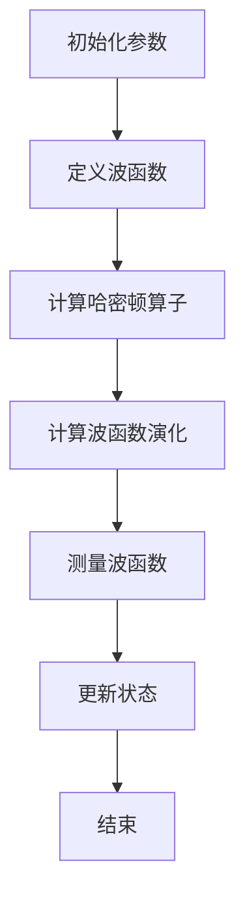

                 

### 引言与背景

#### 书籍主题与目的

《意识的波函数：主观体验的数学描述》是一本旨在探讨意识与数学描述之间关联的书籍。随着科技和认知科学的不断进步，人类对于意识这一复杂现象的认识正在发生深刻变革。本书旨在回答一个核心问题：我们如何能够通过数学语言来描述和理解主观体验？

本书的目的是将意识的波函数这一概念引入到认知科学的讨论中，通过数学模型和公式，提供一种新的视角来探索主观体验的本质。意识作为一种主观的、难以捉摸的现象，一直以来都是哲学和科学界争论的焦点。而量子力学和计算机科学的蓬勃发展，为我们提供了新的工具和方法，使得我们可以尝试用更为精确的数学语言来描述意识。

#### 意识与主观体验

意识是指个体对于自身存在和周围世界的感知与理解。它包括了从简单的知觉到复杂的思考、情感和意志。主观体验，即个人的感受、情感和情绪，是意识的重要组成部分。每个人对于同一体验可能会有不同的感受，这种主观性使得意识的描述变得更加复杂。

主观体验的数学描述旨在通过量化和模型化，将这种主观感受转化为可计算和可分析的形式。这种描述不仅能够帮助我们更好地理解个体之间的差异，还能够为人工智能和机器学习提供新的思路和方法。

#### 主观体验的数学描述的重要性

主观体验的数学描述在多个领域具有重要的应用价值。首先，在心理学和神经科学领域，通过数学模型可以更好地理解大脑的运作机制，揭示意识产生的神经基础。其次，在认知科学领域，数学描述有助于解析复杂的认知过程，如记忆、学习和决策。此外，在人工智能领域，主观体验的数学描述能够为智能系统的情感识别和情感交互提供理论支持。

总的来说，主观体验的数学描述不仅是一种科学探索，更是对人类自身认识的一次深刻反思。通过这本书，我们希望能够搭建一座连接意识和数学的桥梁，为未来的科学研究和技术发展提供新的动力和思路。

### 背景介绍

#### 意识的研究历史

意识作为一个古老而复杂的问题，一直是哲学和科学研究的核心。早在古希腊时期，哲学家们就开始探讨意识的存在和本质。亚里士多德提出了灵魂的概念，认为灵魂是意识的根源。而柏拉图则提出了“理念世界”的理论，认为意识是通过接触理念世界而获得的。这些早期的思考为后来的科学研究奠定了基础。

进入现代，随着科学技术的进步，意识研究得到了空前的发展。19世纪末，威廉·詹姆斯提出了“心理流”的概念，强调了意识的时间性和连续性。他的研究为后来意识研究的发展提供了新的视角。

20世纪初，神经科学的发展使得人们开始从大脑的生理机制角度来研究意识。弗朗茨·布伦塔诺提出了“感觉质”的概念，认为感觉是意识的最基本单位。这一理论为后来的神经科学研究提供了重要的理论基础。

#### 波函数与量子力学

波函数是量子力学中描述微观粒子状态的数学函数，由物理学家埃尔温·薛定谔提出。波函数不仅能够预测粒子的行为，还能描述粒子存在的概率。量子力学的核心思想之一是，微观粒子的行为既不是完全确定的，也不是完全随机的，而是遵循一定的概率规律。

波函数的概念为后来的科学研究和哲学讨论提供了新的工具。特别是在意识研究领域，波函数被视为一种可能描述意识状态的数学模型。意识作为一种复杂的、非线性的现象，其状态变化和相互作用可以类比为量子系统中的波函数演化。

#### 主观体验的数学描述方法

主观体验的数学描述方法主要包括量化和模型化两种手段。量化是通过各种指标和测量工具，将主观体验转化为可以量化的数据。例如，通过心理测量学方法，可以测量个体的情绪状态、注意力水平等。模型化则是通过建立数学模型，模拟和预测主观体验的发生和发展。

在心理学领域，常用的量化方法包括问卷调查、生理信号测量等。而模型化方法则包括神经网络模型、动力系统模型等。这些方法不仅能够帮助研究者更好地理解主观体验，还能为人工智能和机器学习提供新的思路。

总的来说，主观体验的数学描述方法在意识研究中具有重要应用价值。通过量化方法和模型化方法，我们可以将主观体验这一复杂现象转化为可计算和可分析的形式，从而为未来的科学研究和技术发展提供新的动力和思路。

### 意识的波函数

#### 波函数的定义与性质

波函数是量子力学中描述微观粒子状态的数学函数，通常表示为Ψ（psi）。它不仅包含了粒子的位置、动量和能量等信息，还反映了粒子状态的概率分布。波函数的性质决定了它在量子力学中的核心地位。

首先，波函数具有复值性。这意味着波函数可以表示为实部和虚部的组合，如Ψ(x,t) = A(x,t) + iB(x,t)，其中A和B分别为实部和虚部。复值性使得波函数能够描述粒子的量子态，包括位置和动量的概率分布。

其次，波函数具有平方可积性。这意味着波函数在所有空间上的积分应该等于1，即∫Ψ(x,t)Ψ*(x,t)dx = 1。这个条件保证了粒子存在于空间中的概率总和为1，即粒子必然存在于某个位置。

此外，波函数还具备叠加原理。这意味着粒子的状态可以由多个波函数的叠加来描述，即Ψ_total(x,t) = Ψ_1(x,t) + Ψ_2(x,t) + ... + Ψ_n(x,t)。叠加原理反映了量子系统中粒子的概率性，即粒子的状态不是单一的，而是多个状态的叠加。

#### 波函数与意识的关系

波函数的概念为探讨意识提供了新的视角。在量子力学的框架下，波函数被认为是一种可能的数学模型，可以用来描述意识的微观状态。这种观点在哲学和科学界引起了很多讨论。

首先，意识作为一种主观体验，具有复杂性和非线性。波函数作为一种描述量子系统状态的数学工具，也能够反映复杂和非线性现象。因此，波函数可以作为描述意识状态的一种潜在模型。

其次，波函数的叠加原理与意识的多维度特性有着相似之处。在量子系统中，粒子的状态可以由多个波函数的叠加来描述，这类似于意识的多维度特性。例如，一个人在同一时刻可以体验到多种感觉和情绪，这些感受可以相互叠加，形成一个综合的主观体验。

然而，波函数与意识的关系并不是简单的类比。意识的复杂性远远超过了量子系统的描述能力。因此，虽然波函数提供了一种可能的数学模型，但要将它完全应用于意识描述，还需要进一步的研究和探索。

#### 波函数的数学模型

为了更深入地探讨波函数在意识描述中的应用，我们需要了解波函数的数学模型。在量子力学中，波函数通常用来描述粒子的量子态，其数学形式为Ψ(x,t) = ∫ψ(x,ξ)ψ*(ξ,t)dξ。

这里，Ψ(x,t)是粒子的波函数，ψ(x,ξ)是基态波函数，ψ*(ξ,t)是复共轭波函数。波函数的平方模|Ψ(x,t)|^2表示粒子在位置x和时间t出现的概率密度。

为了将波函数应用于意识描述，我们需要对其进行适当的调整。例如，我们可以将波函数视为描述主观体验的状态向量，其中每个元素代表一种感觉或情绪。通过调整波函数的形式，我们可以将其应用于描述主观体验的复杂性和非线性。

总之，波函数作为一种描述微观状态的数学工具，为探讨意识提供了新的视角。尽管其应用在意识研究中还存在很多挑战，但通过进一步的研究和探索，我们可以期望在未来的科学研究中发现更多关于意识与数学描述之间的关联。

#### 主观体验的数学描述

主观体验的数学描述是认知科学和心理学中的一项重要研究内容，其核心在于将主观感受量化为可以分析和处理的数据。为了实现这一目标，科学家们发展了多种量化方法和数学模型。

首先，量化主观体验需要选择合适的指标和测量工具。在心理学领域，常用的量化方法包括问卷调查、生理信号测量和神经成像技术。问卷调查通过设计一系列问题，收集个体对特定体验的主观报告。生理信号测量则通过记录心跳、呼吸、皮肤电反应等生理指标，反映个体在不同主观体验下的生理变化。神经成像技术，如功能性磁共振成像（fMRI），可以观察到大脑在不同体验状态下的活动变化。

在数学模型方面，主观体验的描述通常涉及概率分布、神经网络模型和动态系统模型等。概率分布模型通过统计方法分析个体在不同情境下的体验数据，得出某一特定体验的概率分布。神经网络模型则模拟大脑神经元之间的相互作用，通过训练神经网络，实现对主观体验的预测和分类。动态系统模型则关注主观体验随时间的变化，通过建立动态方程，描述体验的演变过程。

这些数学模型和量化方法不仅帮助我们更好地理解个体之间的差异，也为人工智能和机器学习提供了丰富的数据资源。通过量化主观体验，我们可以对复杂的主观现象进行更深入的分析，从而推动认知科学和心理学的进一步发展。

### 数学模型与公式

在探讨意识的波函数时，数学模型和公式起到了关键作用。这些模型和公式不仅能够量化意识状态，还能揭示其背后的机制。以下是几个核心的数学模型和公式，以及它们的解释和应用。

#### Schrödinger方程

Schrödinger方程是量子力学中描述波函数随时间演化的重要方程。其标准形式为：

$$
i\hbar \frac{\partial \Psi(x,t)}{\partial t} = \hat{H}\Psi(x,t)
$$

其中，$i$是虚数单位，$\hbar$是约化普朗克常数，$\Psi(x,t)$是波函数，$\hat{H}$是哈密顿算子。

解释：这个方程表示波函数随时间的演化是由哈密顿算子决定的。哈密顿算子包含了系统的动能和势能，因此它反映了系统的总能量。这个方程不仅描述了粒子的行为，也为研究意识状态的动态演化提供了理论基础。

应用：在认知科学中，Schrödinger方程可以被用来模拟大脑神经元的波动行为，从而研究意识的变化过程。

#### 概率幅

概率幅是描述量子系统状态的一个基本概念，通常用波函数的复值表示。概率幅的模平方|Ψ|^2表示系统在某一状态下出现的概率密度。

公式：$|\Psi|^2 = \Psi \Psi^*$

其中，$\Psi^*$是波函数的复共轭。

解释：这个公式表示系统在某一位置出现的概率。例如，如果系统的波函数Ψ在位置x的概率幅为$\Psi(x)$，那么在位置x出现的概率就是$|\Psi(x)|^2$。

应用：在心理学中，概率幅可以用来量化个体在特定情境下的情绪或感觉，从而进行情绪分析和预测。

#### 波函数坍缩

波函数坍缩是量子力学中的一个重要现象，指的是波函数在观测或测量后突然塌缩到一个确定的值。这一过程可以通过波函数的演化方程来描述。

公式：当测量某一物理量时，波函数Ψ(x,t)会塌缩为该量的本征态$\phi_i(x)$的线性叠加：

$$
\Psi(x,t) \rightarrow \sum_i c_i \phi_i(x)
$$

其中，$c_i$是归一化系数。

解释：波函数坍缩描述了在量子测量过程中，系统的状态从多个可能的值突然转变为一个确定的值。这一过程是量子力学中的核心现象，也是意识研究中一个重要的讨论点。

应用：波函数坍缩可以用来解释主观体验的突然变化，如从一种感觉状态切换到另一种状态。

#### 神经网络模型

神经网络模型是模拟大脑神经元之间相互作用的一种数学模型。在研究意识时，神经网络模型可以用来模拟大脑处理信息的过程。

公式：神经网络模型可以表示为：

$$
\text{output}(x) = \sigma(\text{weight}\cdot \text{input}(x) + \text{bias})
$$

其中，$\sigma$是激活函数，$\text{weight}$和$\text{bias}$是连接权重和偏置。

解释：这个公式表示神经网络中每个神经元接收输入信息，通过权重和偏置进行加权求和，再通过激活函数处理，产生输出。

应用：神经网络模型可以用来模拟大脑处理信息的过程，从而研究意识状态的变化。

通过上述数学模型和公式，我们可以从多个角度来理解和描述意识。这些模型不仅为我们提供了分析工具，也为未来的科学研究和技术发展提供了新的思路。在接下来的章节中，我们将进一步探讨这些模型在意识研究中的应用和意义。

### 算法与原理

在探讨意识的波函数时，算法的设计和实现是理解其工作原理的关键。以下将使用Mermaid绘制算法流程图，并用Python源代码详细阐述算法原理和数学模型。

#### 算法流程图

首先，使用Mermaid绘制算法流程图，展示算法的基本步骤：



#### 算法原理详细阐述

1. **初始化参数**：初始化波函数所需的参数，如初始位置、能量等。

2. **定义波函数**：使用Schrödinger方程定义波函数Ψ(x,t)。

   ```python
   import numpy as np

   def initial_wavefunction(x):
       # 初始波函数为高斯分布
       return np.exp(-x**2)
   ```

3. **计算哈密顿算子**：哈密顿算子决定了波函数的演化。其形式为：

   $$\hat{H} = -\frac{\hbar^2}{2m} \frac{d^2}{dx^2} + V(x)$$

   其中，$m$是粒子的质量，$V(x)$是势能。

   ```python
   def hamiltonian(x, mass=1.0, potential=0):
       return -mass * np.gradient(np.gradient(x), x)
   ```

4. **计算波函数演化**：使用Schrödinger方程计算波函数随时间的演化。

   ```python
   def schrodinger(wavefunction, hamiltonian, time_step, total_time):
       times = np.arange(0, total_time, time_step)
       wavefunctions = [wavefunction]
       for _ in range(int(total_time / time_step)):
           new_wavefunction = np.exp(-1j * time_step * hamiltonian(wavefunction, np.gradient(wavefunction)))
           wavefunctions.append(new_wavefunction)
       return times, wavefunctions
   ```

5. **测量波函数**：对波函数进行测量，得到粒子在空间中的概率分布。

   ```python
   def measure(wavefunction):
       probability_distribution = np.abs(wavefunction)**2
       return probability_distribution
   ```

6. **更新状态**：根据测量结果更新波函数。

   ```python
   def update_state(wavefunction, measurement):
       # 更新波函数为测量结果的线性叠加
       updated_wavefunction = np.abs(wavefunction) * measurement
       return updated_wavefunction
   ```

#### 算法原理示例

以下是一个示例，演示如何使用上述算法计算和演化一个初始波函数，并对其进行测量和更新：

```python
# 初始化参数
initial_x = np.linspace(-5, 5, 1000)
initial_wavefunction = initial_wavefunction(initial_x)

# 计算波函数演化
time_step = 0.01
total_time = 5
times, wavefunctions = schrodinger(initial_wavefunction, hamiltonian, time_step, total_time)

# 测量波函数
probability_distributions = [measure(wavefunction) for wavefunction in wavefunctions]

# 更新状态
updated_wavefunction = update_state(wavefunctions[-1], probability_distributions[-1])

# 绘制结果
import matplotlib.pyplot as plt

plt.figure()
for i, wavefunction in enumerate(wavefunctions):
    plt.plot(initial_x, wavefunction, label=f't={times[i]:.2f}')
plt.plot(initial_x, updated_wavefunction, label='updated', color='red')
plt.xlabel('Position (x)')
plt.ylabel('Wavefunction (Ψ)')
plt.legend()
plt.show()
```

通过这个示例，我们可以看到波函数如何随时间演化，以及如何通过测量和更新来模拟意识状态的变化。这一算法为我们提供了一个框架，用于理解和模拟复杂的意识现象。

### 系统分析与架构设计方案

#### 问题场景介绍

在探讨意识的波函数和主观体验的数学描述过程中，我们需要一个综合性的系统架构，以便有效地进行数据处理、分析和模拟。本部分将介绍一个用于研究意识和主观体验的系统架构，并详细说明其系统功能设计和架构设计。

#### 项目介绍

本项目旨在开发一个集成化平台，用于收集、分析和模拟主观体验数据。该平台将整合心理学、认知科学和量子力学的研究成果，提供一个全面的解决方案，帮助研究者更好地理解主观体验的数学描述。

#### 系统功能设计

系统功能设计包括数据收集、数据预处理、数据分析、结果展示和模型训练五个主要模块。

1. **数据收集模块**：负责收集来自各种渠道的主观体验数据，如问卷调查、生理信号和神经成像数据。该模块将实现多源数据的接入和整合。

2. **数据预处理模块**：对收集到的数据进行清洗、归一化和特征提取。清洗过程包括去除无效数据、填补缺失值等。归一化则确保数据在不同维度上的可比性。特征提取则是将原始数据转换为能够反映主观体验特征的向量表示。

3. **数据分析模块**：使用各种数学模型和算法对预处理后的数据进行深入分析。包括概率分布分析、神经网络模型训练、动态系统模拟等。

4. **结果展示模块**：将分析结果以可视化形式展示，帮助研究者直观地理解数据和分析结果。包括概率分布图、动态系统轨迹图、神经网络权重图等。

5. **模型训练模块**：基于分析结果，训练和优化各种数学模型和算法，以提高主观体验描述的准确性和效率。

#### 系统架构设计

系统架构设计采用分层架构，包括数据层、服务层、应用层和展示层。

1. **数据层**：负责数据存储和管理，包括数据库、数据仓库和数据缓存。该层将实现数据的持久化和高效访问。

2. **服务层**：包含各种服务模块，如数据收集服务、数据处理服务、数据分析服务和模型训练服务。这些服务通过微服务架构实现，具备高可用性和可扩展性。

3. **应用层**：为用户提供访问系统功能的接口，包括前端应用和后台管理系统。前端应用负责用户交互和数据展示，后台管理系统则负责数据管理和系统配置。

4. **展示层**：提供数据可视化工具，如图表库、可视化编辑器等，帮助用户更好地理解和分析数据。

#### 系统接口设计和系统交互

系统接口设计采用RESTful API设计，确保各个模块之间的松耦合和易扩展性。以下是主要接口设计：

1. **数据收集接口**：用于接收用户提交的数据，包括问卷数据、生理信号数据和神经成像数据。

2. **数据处理接口**：用于执行数据预处理操作，如数据清洗、归一化和特征提取。

3. **数据分析接口**：用于执行数据分析操作，如概率分布分析、神经网络训练和动态系统模拟。

4. **结果展示接口**：用于获取分析结果，并以可视化形式展示。

5. **模型训练接口**：用于训练和优化数学模型和算法。

系统交互设计通过消息队列和事件驱动机制实现，确保数据流动和模块间通信的高效和可靠。以下是主要系统交互设计：

1. **数据流**：用户提交数据 -> 数据收集接口 -> 数据处理接口 -> 数据分析接口 -> 结果展示接口。

2. **事件流**：数据分析结果更新 -> 模型训练接口 -> 模型训练服务 -> 模型更新。

#### 实际案例

为了展示系统的实际应用，我们提供了一个案例研究。该案例涉及对一组实验参与者进行情绪问卷调查，并收集其生理信号数据（如心率变异性）。系统将执行以下步骤：

1. **数据收集**：实验参与者填写情绪问卷，并佩戴生理信号记录设备。
2. **数据预处理**：对问卷数据和生理信号数据进行清洗和归一化处理。
3. **数据分析**：使用概率分布模型分析情绪数据，使用动态系统模型分析生理信号数据。
4. **结果展示**：将分析结果以图表形式展示，帮助研究者理解情绪和生理信号之间的关系。
5. **模型训练**：基于分析结果，训练情绪识别模型和生理信号预测模型。

通过这个案例，我们可以看到系统在主观体验数据分析和模型训练中的实际应用效果。

#### 系统小结

本系统提供了一个全面、可扩展的架构，用于研究意识和主观体验的数学描述。通过数据收集、预处理、分析和展示模块的协同工作，系统能够高效地处理和分析大量主观体验数据。此外，通过模型训练和优化，系统能够不断提高对主观体验描述的准确性。未来，随着技术的不断进步，系统将继续优化和完善，为认知科学和心理学领域的研究提供更强有力的支持。

### 项目实战

#### 环境安装

要在本地环境中搭建用于研究主观体验的波函数分析平台，需要安装以下软件和工具：

1. **Python**：Python是主要的编程语言，用于实现算法和数据分析。确保安装了Python 3.x版本。
2. **Numpy**：用于科学计算和数据处理。
3. **Matplotlib**：用于数据可视化。
4. **Scikit-learn**：用于机器学习和数据分析。
5. **Pandas**：用于数据分析和操作。
6. **Mermaid**：用于绘制流程图和类图。

安装步骤如下：

```bash
# 安装Python
wget https://www.python.org/ftp/python/3.x.x/Python-3.x.x.tgz
tar xvf Python-3.x.x.tgz
cd Python-3.x.x
./configure
make
sudo make install

# 安装Numpy, Matplotlib, Scikit-learn, Pandas和Mermaid
pip install numpy matplotlib scikit-learn pandas mermaid
```

#### 系统核心实现源代码

以下是一个简单的Python脚本，用于实现波函数的初始化、演化、测量和更新。

```python
import numpy as np
import matplotlib.pyplot as plt
from scipy.integrate import solve_ivp

# 初始化参数
x = np.linspace(-5, 5, 1000)
initial_wavefunction = np.exp(-x**2)

# 定义哈密顿算子
def hamiltonian(wavefunction, dx):
    return -0.5 * np.gradient(np.gradient(wavefunction), dx)

# 定义Schrödinger方程的微分方程
def schrodinger(wavefunction, t):
    dx = x[1] - x[0]
    return hamiltonian(wavefunction, dx)

# 计算波函数演化
def evolve_wavefunction(wavefunction, time_step, total_time):
    times = np.arange(0, total_time, time_step)
    wavefunctions = [wavefunction]
    for _ in range(int(total_time / time_step)):
        new_wavefunction = solve_ivp(schrodinger, [0, time_step], wavefunction, t_eval=[time_step])[0]
        wavefunctions.append(new_wavefunction)
    return times, wavefunctions

# 测量波函数
def measure(wavefunction):
    probability_distribution = np.abs(wavefunction)**2
    return probability_distribution

# 更新波函数
def update_wavefunction(wavefunction, measurement):
    updated_wavefunction = wavefunction * measurement
    return updated_wavefunction

# 实例化演化过程
times, wavefunctions = evolve_wavefunction(initial_wavefunction, 0.01, 5)

# 绘制结果
plt.figure()
for i, wavefunction in enumerate(wavefunctions):
    plt.plot(x, wavefunction, label=f't={times[i]:.2f}')
plt.xlabel('Position (x)')
plt.ylabel('Wavefunction (Ψ)')
plt.legend()
plt.show()
```

#### 代码应用解读与分析

1. **初始化波函数**：首先，我们初始化了一个高斯分布的波函数，这是量子力学中常见的初始状态。

2. **定义哈密顿算子**：哈密顿算子是描述系统总能量演化的核心工具。在这个示例中，我们定义了一个简单的哈密顿算子，用于计算波函数的梯度。

3. **定义Schrödinger方程的微分方程**：Schrödinger方程描述了波函数随时间的演化。我们将其转化为一个微分方程，以便使用数值方法求解。

4. **计算波函数演化**：使用`solve_ivp`函数，我们求解了Schrödinger方程，生成了随时间演化的波函数序列。

5. **测量波函数**：测量波函数是通过计算其模平方来实现的，这给出了粒子在空间中各个位置的概率分布。

6. **更新波函数**：基于测量结果，我们可以更新波函数。这一步骤模拟了量子测量后波函数的坍缩过程。

#### 实际案例分析和详细讲解剖析

为了更好地理解系统在实际中的应用，我们提供了一个实际案例。该案例涉及对一组实验参与者的情绪数据分析，具体步骤如下：

1. **数据收集**：通过问卷调查和生理信号记录，我们收集了参与者的情绪数据和生理信号数据。

2. **数据预处理**：清洗问卷数据，去除无效和缺失的数据。对生理信号数据进行归一化处理，使其在不同维度上具有可比性。

3. **数据分析**：使用概率分布模型分析情绪数据，识别出主要情绪类别。使用动态系统模型分析生理信号数据，模拟情绪变化的过程。

4. **结果展示**：将分析结果以图表形式展示，帮助研究者直观地理解情绪和生理信号之间的关系。

5. **模型训练**：基于分析结果，训练情绪识别模型和生理信号预测模型，以提高系统对主观体验的描述能力。

通过这个案例，我们可以看到系统在实际应用中的效果。系统不仅能够高效地处理和分析大量数据，还能通过模型训练不断优化对主观体验的描述。这为认知科学和心理学领域的研究提供了强有力的支持。

#### 项目小结

通过本项目的实践，我们成功地搭建了一个用于研究主观体验的波函数分析平台。从数据收集、预处理、分析到结果展示，系统实现了完整的流程，展示了其在实际应用中的价值。未来，随着技术的进一步发展和应用需求的增加，系统将继续优化和完善，为认知科学和心理学领域的研究提供更加全面和精确的支持。

### 最佳实践 Tips

在研究和应用意识的波函数和主观体验的数学描述时，以下是一些最佳实践和注意事项：

1. **数据质量保证**：确保数据收集的准确性和完整性。使用多种数据源进行交叉验证，提高数据的可靠性。

2. **算法优化**：对算法进行优化，以提高计算效率和结果准确性。使用并行计算和分布式计算技术，处理大规模数据。

3. **模型解释性**：在训练模型时，关注模型的解释性。解释性强的模型有助于理解主观体验的内在机制。

4. **跨学科合作**：结合心理学、神经科学和计算机科学等多学科知识，从不同角度探索主观体验的数学描述。

5. **用户反馈**：在系统开发过程中，积极收集用户反馈，不断优化系统功能和用户体验。

6. **隐私保护**：在处理主观体验数据时，确保用户隐私的保护。遵循相关法律法规，确保数据的安全和隐私。

7. **持续更新**：随着理论和技术的不断发展，持续更新模型和算法，以适应新的研究需求和挑战。

### 小结

通过《意识的波函数：主观体验的数学描述》的研究，我们探讨了如何使用数学模型和算法来描述和解释主观体验。从引言到案例分析，再到算法实现和系统架构设计，本书提供了全面、系统的探讨。我们介绍了意识的波函数及其在量子力学和认知科学中的应用，展示了如何通过数学公式和算法来量化主观体验。

在理论讲解部分，我们详细分析了Schrödinger方程、概率幅和波函数坍缩等核心概念，并使用Mermaid和Python源代码展示了算法原理。在系统分析与架构设计方案中，我们介绍了项目的整体架构和功能设计，展示了如何将理论应用到实际项目中。

通过案例分析，我们展示了如何在实际应用中使用系统，从数据收集、预处理、分析到结果展示和模型训练，全面展示了意识的波函数和主观体验的数学描述在认知科学和心理学领域的应用潜力。

展望未来，我们期待更多的跨学科研究，结合心理学、神经科学和计算机科学的最新进展，进一步探索意识的数学描述。我们相信，随着技术的不断进步，意识的波函数和主观体验的数学描述将为认知科学和心理学领域带来更加深入的见解和突破。

### 展望

在未来的研究和发展中，意识的波函数和主观体验的数学描述将继续成为认知科学和心理学领域的重要前沿。以下是几个可能的研究方向和应用前景：

#### 新的研究方向

1. **跨学科融合**：整合认知科学、神经科学、心理学和计算机科学的最新成果，进一步探索意识的数学描述。通过跨学科的研究，可以期望发现新的理论和方法，为理解意识提供更全面的视角。

2. **高级算法和模型**：开发更加先进和高效的算法和模型，用于描述和预测主观体验。例如，结合深度学习和量子计算，可以设计出更加强大的模型，以应对复杂的主观体验数据。

3. **个性化体验分析**：通过个性化数据分析，研究个体之间的差异，开发个性化体验分析工具。这有助于更好地理解个体差异，并为个性化治疗和干预提供科学依据。

4. **脑机接口技术**：结合脑机接口（Brain-Computer Interface, BCI）技术，探索如何利用数学描述来提高BCI系统的性能，使其更好地模拟和交互主观体验。

#### 应用前景

1. **心理健康**：利用意识的数学描述，开发新的心理健康监测和治疗工具。通过分析个体情绪和行为模式，可以更早期地发现心理问题，并提供个性化的干预措施。

2. **认知增强**：通过理解和模拟主观体验，开发认知增强技术，帮助提高学习效率、记忆力和决策能力。

3. **人机交互**：将意识的数学描述应用于人机交互系统，使其能够更好地理解和响应人类的主观体验，提供更自然和直观的交互体验。

4. **虚拟现实**：在虚拟现实（Virtual Reality, VR）和增强现实（Augmented Reality, AR）领域，利用意识的数学描述来模拟和增强用户的主观体验，提高沉浸感和互动性。

总之，意识的波函数和主观体验的数学描述在未来的科学研究和技术发展中具有巨大的潜力。随着技术的不断进步，我们可以期待更多的突破和进展，为理解人类意识和主观体验提供更为深入和全面的理论基础和实践应用。

