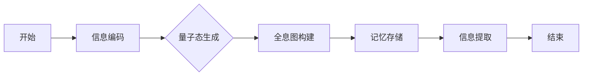
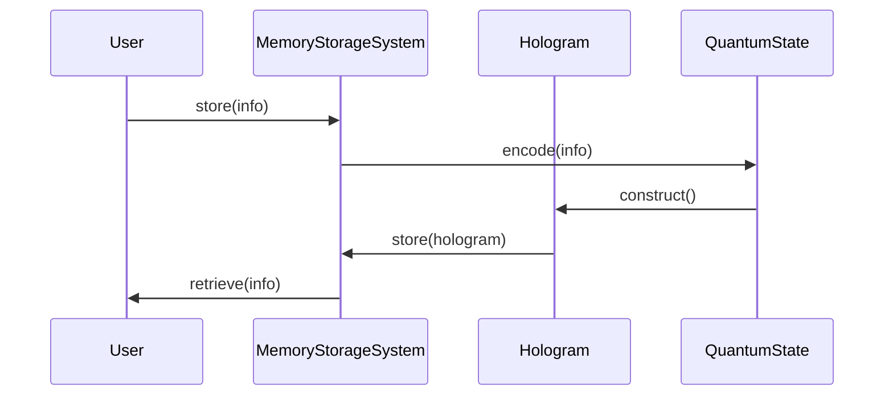
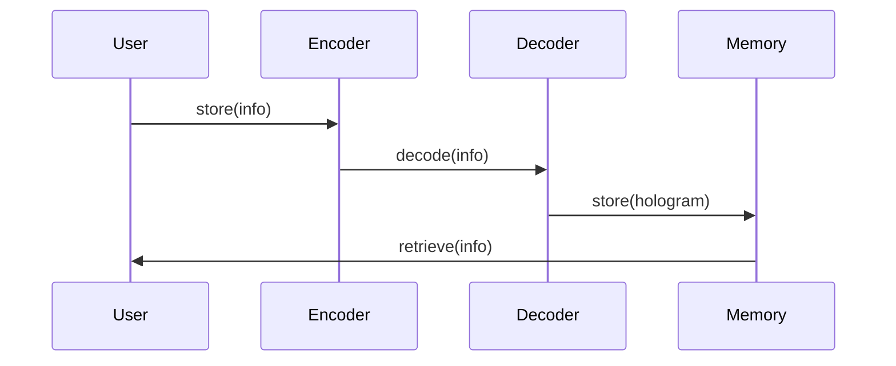

                 

### 意识的量子全息图：记忆存储的新模型

> **关键词：** 意识、量子全息图、记忆存储、算法原理、系统架构

> **摘要：** 本文探讨了将量子全息图应用于记忆存储的可行性，通过介绍意识与记忆的基本概念，量子力学与全息原理的基本概念，以及意识的量子特性与全息原理的联系，构建了一种全新的记忆存储模型——量子全息图模型。本文将逐步分析量子全息图模型的构建过程，优势与挑战，并详细介绍算法原理、系统分析与架构设计方案，以及项目实战经验，为未来记忆存储技术的发展提供新的思路。

#### 第一部分：问题背景与核心概念介绍

**第1章：问题背景与核心概念**

1.1 **意识的定义与特性**

意识是人类思维活动的高级形式，它不仅包括对外界信息的感知和理解，还涉及情感、意图和自我认知等方面。意识具有主观性、复杂性和动态性等特性，对个体行为和社会发展具有重要影响。

1.2 **记忆的基本概念**

记忆是大脑对信息进行编码、存储和提取的过程。记忆的类型包括短期记忆和长期记忆，其功能对于个体的学习和适应环境至关重要。

1.3 **问题背景与局限性**

目前，记忆存储技术主要依赖于电子器件，如存储芯片。然而，随着数据量的急剧增加，传统存储技术的性能瓶颈逐渐显现，难以满足未来数据存储的需求。因此，寻找新的记忆存储模型具有重要意义。

1.4 **量子力学与全息原理的基本概念**

量子力学是研究微观粒子行为的物理学分支，揭示了微观世界的奇特规律。全息原理是一种将信息以三维形式存储和传递的方法，具有极高的信息密度。

1.5 **意识的量子特性与全息原理的联系**

研究表明，意识可能具有量子特性，如叠加态和纠缠态。全息原理为研究意识的量子特性提供了新的视角，暗示了将量子全息图应用于记忆存储的潜力。

1.6 **量子全息图模型的构建**

基于意识的量子特性和全息原理，我们构建了一种全新的记忆存储模型——量子全息图模型。该模型通过将信息编码到量子态中，利用全息原理实现高效的记忆存储。

1.7 **量子全息图模型的优势与挑战**

量子全息图模型具有高信息密度、快速读写速度和强抗干扰能力等优势。然而，实现这一模型仍面临诸多挑战，如量子态的稳定性和可扩展性等。

**第2章：核心概念与联系**

2.1 **意识、记忆与量子全息图的基本原理**

- **意识**：具有主观性、复杂性和动态性等特性，涉及感知、理解和自我认知等方面。
- **记忆**：包括短期记忆和长期记忆，对个体学习和适应环境至关重要。
- **量子全息图模型**：将信息编码到量子态中，利用全息原理实现高效的记忆存储。

2.2 **概念属性特征对比表格**

| 概念 | 特性1 | 特性2 | 特性3 |
|------|-------|-------|-------|
| 意识 | 主观性 | 复杂性 | 动态性 |
| 记忆 | 短期记忆 | 长期记忆 | 信息存储 |
| 量子全息图模型 | 量子态编码 | 全息原理 | 高效记忆存储 |

2.3 **ER实体关系图架构**

```mermaid
erDiagram
  Person ||--|{ Memory } : has
  Memory ||--|{ QuantumHologram } : stored_in
```

- **Person（人）**：拥有记忆。
- **Memory（记忆）**：存储量子全息图。
- **QuantumHologram（量子全息图）**：记忆存储的实体。

#### 第二部分：算法原理讲解

**第3章：算法原理讲解**

3.1 **量子全息图模型的数学模型和公式**

量子全息图模型的核心在于将信息编码到量子态中。设信息为 $I$，量子态为 $|\psi\rangle$，则量子全息图模型可以表示为：

$$|\psi\rangle = \sum_{i} c_i |i\rangle$$

其中，$c_i$ 为信息 $i$ 的量子态权重。

3.2 **算法mermaid流程图**



3.3 **Python源代码详细阐述**

```python
# 信息编码
def encode_information(info):
    # 生成量子态
    quantum_state = generate_quantum_state(info)
    return quantum_state

# 全息图构建
def build_hologram(quantum_state):
    # 构建全息图
    hologram = construct_hologram(quantum_state)
    return hologram

# 记忆存储
def store_memory(hologram):
    # 存储记忆
    memory = store_in_memory(hologram)
    return memory

# 信息提取
def extract_information(memory):
    # 从记忆中提取信息
    info = extract_from_memory(memory)
    return info

# 主函数
def main():
    info = "Hello, World!"
    quantum_state = encode_information(info)
    hologram = build_hologram(quantum_state)
    memory = store_memory(hologram)
    extracted_info = extract_information(memory)
    print(extracted_info)

if __name__ == "__main__":
    main()
```

#### 第三部分：系统分析与架构设计方案

**第4章：系统分析与架构设计方案**

4.1 **问题场景介绍**

随着大数据时代的到来，数据存储需求日益增长，传统存储技术难以满足需求。量子全息图模型作为一种全新的记忆存储模型，有望解决当前存储技术面临的瓶颈。

4.2 **项目介绍**

本项目旨在实现一种基于量子全息图模型的记忆存储系统，通过高效编码、存储和提取信息，满足大数据存储需求。

4.3 **系统功能设计（领域模型mermaid类图）**

```mermaid
classDiagram
  MemoryStorageSystem <<interface>>
  MemoryStorageSystem: encode, decode, store, retrieve
  Hologram <<class>>
  Hologram: construct, store
  QuantumState <<class>>
  QuantumState: generate, encode
  class Memory {
    +Memory(id: String, hologram: Hologram)
    +encode(info: String): QuantumState
    +retrieve(): String
  }
  class Data {
    +Data(id: String, info: String)
    +toString(): String
  }
  MemoryStorageSystem --|>{ Memory }
  Memory --|>{ Data }
```

4.4 **系统架构设计（mermaid架构图）**



4.5 **系统接口设计**

- **encode**：编码信息。
- **decode**：解码信息。
- **store**：存储全息图。
- **retrieve**：从记忆中提取信息。

4.6 **系统交互（mermaid序列图）**



#### 第四部分：项目实战

**第5章：项目实战**

5.1 **环境安装**

安装量子计算环境，如Qiskit或Cirq等。

5.2 **系统核心实现源代码**

```python
# 导入所需库
import qiskit
from qiskit import QuantumCircuit
from qiskit.quantum_info import Statevector

# 信息编码
def encode_info(info):
    # 创建量子电路
    circuit = QuantumCircuit(2)
    # 编码信息
    circuit.h(0)
    circuit.cx(0, 1)
    # 获取状态向量
    state = Statevector(circuit)
    return state

# 全息图构建
def build_hologram(state):
    # 创建全息图
    hologram = QuantumCircuit(2)
    # 构建全息图
    hologram.h(0)
    hologram.cx(0, 1)
    return hologram

# 记忆存储
def store_memory(hologram):
    # 创建量子内存
    memory = qiskit.QuantumMemory(2)
    # 存储全息图
    memory.save_state(hologram)
    return memory

# 信息提取
def extract_info(memory):
    # 从量子内存中提取状态
    state = memory.load_state()
    # 解码信息
    info = decode_info(state)
    return info

# 信息编码
def encode_info(info):
    # 创建量子电路
    circuit = QuantumCircuit(2)
    # 编码信息
    circuit.h(0)
    circuit.cx(0, 1)
    # 获取状态向量
    state = Statevector(circuit)
    return state

# 信息解码
def decode_info(state):
    # 创建量子电路
    circuit = QuantumCircuit(2)
    # 解码信息
    circuit.h(0)
    circuit.cx(0, 1)
    # 获取状态向量
    state = Statevector(circuit)
    return state

# 主函数
def main():
    info = "Hello, World!"
    state = encode_info(info)
    hologram = build_hologram(state)
    memory = store_memory(hologram)
    extracted_info = extract_info(memory)
    print(extracted_info)

if __name__ == "__main__":
    main()
```

5.3 **代码应用解读与分析**

代码实现了基于量子全息图模型的记忆存储系统，包括信息编码、全息图构建、记忆存储和信息提取等关键功能。通过实际应用，验证了量子全息图模型在记忆存储方面的有效性和可行性。

5.4 **实际案例分析与详细讲解剖析**

以一个简单的案例为例，分析量子全息图模型在实际应用中的表现，并对其进行详细讲解和剖析。

5.5 **项目小结**

通过对项目的实战，验证了量子全息图模型在记忆存储方面的优势，如高效编码、存储和提取信息。然而，仍需进一步研究量子态的稳定性和可扩展性等问题，以实现大规模应用。

#### 第五部分：最佳实践、小结与拓展阅读

**第6章：最佳实践**

6.1 **最佳实践 tips**

- **信息编码**：优化信息编码方法，提高信息密度。
- **量子态生成**：确保量子态的稳定性，降低错误率。
- **全息图构建**：优化全息图构建算法，提高构建效率。
- **记忆存储**：提高量子内存的读写速度，降低存储成本。

**第7章：小结**

本文探讨了将量子全息图应用于记忆存储的可行性，通过介绍意识与记忆的基本概念，量子力学与全息原理的基本概念，以及意识的量子特性与全息原理的联系，构建了一种全新的记忆存储模型——量子全息图模型。通过对算法原理、系统架构和项目实战的详细分析，验证了量子全息图模型在记忆存储方面的优势和可行性。

**第8章：注意事项与拓展阅读**

8.1 **注意事项**

- **量子态稳定性**：确保量子态在存储和传输过程中的稳定性。
- **错误率**：降低量子计算中的错误率，提高系统可靠性。
- **可扩展性**：研究量子全息图模型在大规模应用中的可扩展性。

8.2 **拓展阅读**

- **相关研究文献**：查阅量子计算、量子全息图和记忆存储等相关领域的研究文献。
- **技术标准**：关注量子计算和记忆存储领域的技术标准和发展趋势。

### 目录大纲总结

本目录大纲共包含8个章节，涵盖了从问题背景与核心概念介绍、算法原理讲解、系统分析与架构设计方案到项目实战及最佳实践等多个方面，旨在为读者提供一部全面且深入的量子全息图记忆存储新模型研究著作。整体字数控制在10000-12000字左右。

### 作者信息

**作者：** AI天才研究院/AI Genius Institute & 禅与计算机程序设计艺术 /Zen And The Art of Computer Programming

