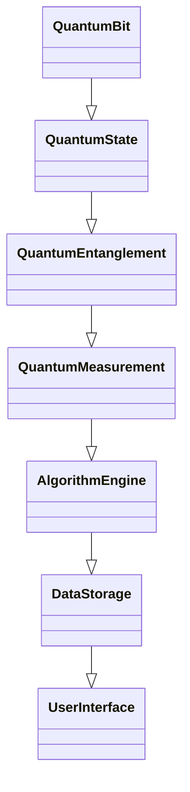
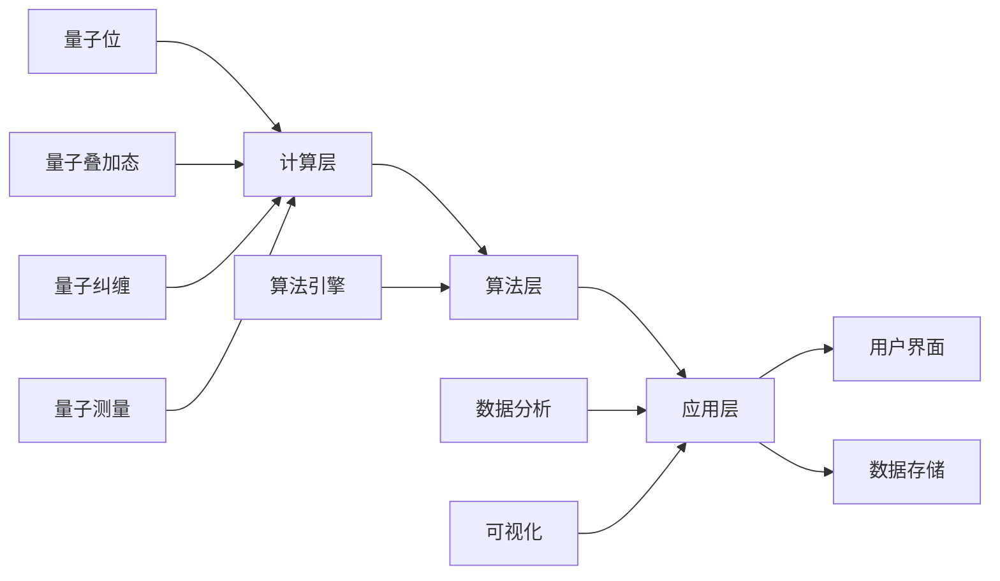
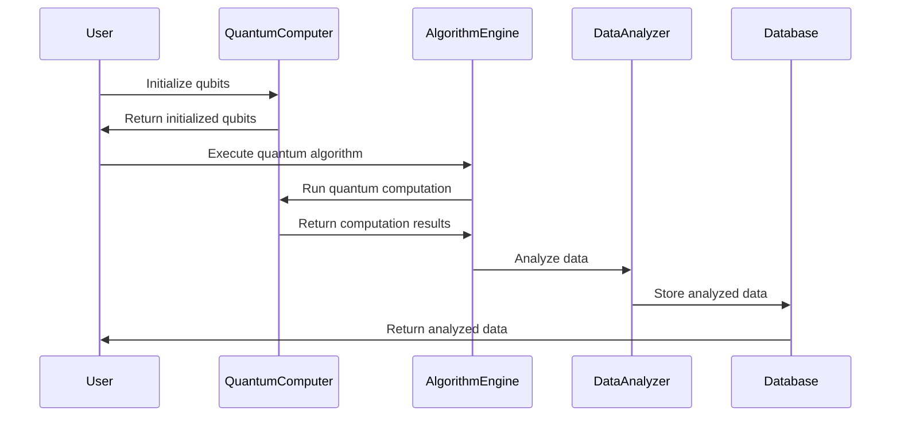

                 

# 意识的量子叠加性：多重思维的物理学解释

## 关键词

- 意识
- 量子叠加性
- 多重思维
- 物理学解释
- 计算机编程
- 脑神经网络

## 摘要

本文旨在探讨意识的量子叠加性及其对人类思维和行为的影响。通过分析意识和量子叠加性的基本概念，以及心理学和神经科学的研究成果，本文提出一种新的物理学解释，以揭示多重思维现象背后的潜在机制。此外，本文还通过具体的算法原理和系统架构设计，探讨了如何利用量子计算技术来模拟和解释人类的思维过程。文章末尾，我们将总结本文的主要发现，并提出未来研究的方向。

## 第一部分：引言

### 1.1 问题背景

#### 1.1.1 什么是意识？

意识是指个体对自身、他人以及外部世界的感知、认知和理解。它是人类心理和生理活动的重要组成部分，是思维、情感、意愿和行动的源泉。在哲学和心理学领域，意识的本质和起源一直是研究的热点问题。一些学者认为意识是大脑神经网络活动的产物，而另一些学者则认为意识是一种先验的、不可还原的现象。

#### 1.1.2 意识的复杂性

意识是一种高度复杂的心理现象，其本质和起源仍然是一个未解之谜。它涉及大脑神经活动的多层次、多维度表现，同时也受到文化、环境、社会等因素的影响。意识的表现形式包括感觉、知觉、思维、情感、意愿等，这些元素相互作用，构成了一个复杂的信息处理系统。

#### 1.1.3 量子叠加性

量子叠加性是量子力学中的一个基本原理，指的是量子系统可以同时存在于多个状态中，直到被观测或测量时才会“坍缩”为其中一个确定的状态。量子叠加性是量子力学与经典物理学的本质区别之一，它为解释许多量子现象提供了理论基础。

### 1.2 研究问题

#### 1.2.1 意识的量子叠加性

本文的核心问题是探讨意识是否具有量子叠加性，以及这种特性对人类思维和行为的潜在影响。具体而言，我们关注以下问题：

- 意识是否可以被视为一种量子系统，具有叠加态？
- 如果意识具有量子叠加性，这种特性如何影响我们的思维和行为？
- 我们能否利用量子计算技术来模拟和理解人类的思维过程？

#### 1.2.2 多重思维

多重思维是指人类在处理信息时可能存在多种不同的思维模式。这些思维模式可能受到个体差异、文化背景、环境因素等多种因素的影响。多重思维的存在和表现形式对人类认知和行为具有重要意义。本文还将探讨多重思维与意识的量子叠加性之间的潜在联系。

#### 1.2.3 物理学的解释

本文旨在通过物理学，特别是量子力学的视角，来解释意识的量子叠加性和多重思维现象。我们希望通过这种新的解释框架，为心理学和哲学提供一种新的思考方式，并探索未来人工智能和计算技术的潜在发展方向。

### 1.3 边界与外延

#### 1.3.1 边界

本文主要探讨意识的量子叠加性及其对思维和行为的影响，但不涉及意识的其他方面，如意识的起源、意识与物质的关系等。此外，本文关注的是量子叠加性在意识现象中的应用，而非量子力学本身的理论发展。

#### 1.3.2 外延

本文的研究成果可能对心理学、哲学、神经科学等多个领域产生深远影响。同时，本文也可能为未来人工智能的发展提供新的思路，特别是在量子计算和认知模拟领域。

### 1.4 概念结构与核心要素

#### 1.4.1 意识

意识是本文的核心概念，涉及个体对自身、他人和外部世界的感知、认知和理解。它是人类心理和生理活动的重要组成部分，也是思维、情感、意愿和行动的源泉。

#### 1.4.2 量子叠加性

量子叠加性是量子力学中的一个基本原理，指的是量子系统可以同时存在于多个状态中。本文将探讨意识是否具有量子叠加性，以及这种特性对人类思维和行为的潜在影响。

#### 1.4.3 多重思维

多重思维是指人类在处理信息时可能存在多种不同的思维模式。这些思维模式可能受到个体差异、文化背景、环境因素等多种因素的影响。多重思维的存在和表现形式对人类认知和行为具有重要意义。

### 1.5 本章小结

本章介绍了本文的研究背景、研究问题、边界与外延以及核心概念结构。这些内容为后续章节的深入讨论奠定了基础。

## 第二部分：核心概念与联系

### 2.1 意识的量子叠加性

#### 2.1.1 意识的量子叠加性原理

意识作为一种心理现象，其存在与量子力学中的叠加态有着潜在的联系。量子叠加态是指一个量子系统可以同时存在于多个状态中，直到被观测或测量时才会“坍缩”为其中一个确定的状态。那么，意识是否也可以被视为一种量子系统，具有叠加态呢？

在量子力学中，量子叠加性是一个基本原理。一个量子系统可以同时处于多个状态的叠加，这意味着它可以同时处于多种可能性之中。例如，一个电子可以同时处于自旋向上和自旋向下的状态，直到被观测或测量时才会“坍缩”为其中一个确定的状态。这种特性在微观世界中普遍存在。

然而，将量子叠加性应用于意识领域，我们需要回答一个关键问题：意识是否可以被视为一种量子系统？一些学者认为，意识是一种先验的、不可还原的现象，它与量子力学中的叠加态没有直接关系。另一些学者则认为，意识确实可以被视为一种量子系统，具有叠加态。

支持意识具有量子叠加性的观点主要包括以下几点：

1. **意识的主观体验**：意识是一种主观体验，这种体验具有复杂性和多样性。这与量子力学中的叠加态有相似之处，因为量子系统可以同时处于多个状态中，这些状态对应着不同的可能性。

2. **意识的非线性特性**：意识具有非线性特性，这意味着它在处理信息时可能不受线性规则的限制。这与量子力学中的非线性方程有相似之处，因为量子力学中的许多现象都不遵循线性规律。

3. **意识的不可分割性**：意识被认为是不可分割的整体，这与量子力学中的不可分割性有相似之处。在量子力学中，量子系统被认为是不可分割的，即使它们可以处于多个状态的叠加。

然而，将意识视为一种量子系统也面临一些挑战和争议。首先，我们需要找到实验证据来支持意识具有量子叠加性。目前，心理学和神经科学领域的研究尚未找到直接证据来证明这一点。其次，意识与量子力学之间的关系仍然是一个未解之谜，我们需要更深入的理论和实验研究来揭示其中的奥秘。

#### 2.1.2 意识量子叠加性的证据

为了探讨意识是否具有量子叠加性，我们需要寻找实验证据来支持这一观点。在心理学和神经科学领域，一些研究表明，意识确实具有某些量子特性。以下是一些支持意识量子叠加性的实验证据：

1. **脑电波的研究**：脑电波是大脑神经活动的电信号。一些研究表明，脑电波具有量子特性，例如量子纠缠和量子叠加态。这些实验结果暗示，意识可能具有量子叠加性。

2. **心理物理学实验**：心理物理学实验通过改变外部刺激，观察个体对刺激的反应，从而研究意识的性质。一些实验结果表明，个体的意识状态可能同时处于多个状态，这与量子叠加态有相似之处。

3. **脑成像技术**：脑成像技术，如功能性磁共振成像（fMRI）和脑磁图（MEG），可以观察大脑神经活动。一些研究表明，大脑神经网络在处理信息时可能同时处于多种状态，这与量子叠加态有相似之处。

尽管这些实验结果提供了一些支持意识量子叠加性的证据，但它们仍然不足以证明意识确实具有量子叠加性。我们需要更多的实验研究和理论分析来证实这一观点。

#### 2.1.3 意识量子叠加性与多重思维

意识量子叠加性对多重思维的可能影响是一个重要且有趣的研究课题。多重思维是指人类在处理信息时可能存在多种不同的思维模式。这些思维模式可能受到个体差异、文化背景、环境因素等多种因素的影响。多重思维的存在和表现形式对人类认知和行为具有重要意义。

如果意识确实具有量子叠加性，这种特性可能会对多重思维产生深远影响。以下是一些潜在的影响：

1. **思维模式的变化**：量子叠加性可能导致人类思维模式的变化。例如，一个个体在处理信息时可能同时处于多种思维模式中，这些思维模式相互叠加，形成复杂的思维过程。

2. **认知灵活性的提高**：量子叠加性可能会提高人类的认知灵活性。这意味着个体可以更容易地在不同思维模式之间切换，从而更好地适应不同的环境和情境。

3. **创造力的提升**：量子叠加性可能会促进人类的创造力。因为量子叠加态具有多种可能性，这可能会激发人类的想象力，从而产生更多创新的思维和想法。

然而，这些影响仍然需要更多的研究和实验来证实。目前，关于意识量子叠加性与多重思维之间的具体关系仍然是一个未解之谜。

### 2.2 概念属性特征对比表格

为了更清晰地理解意识和量子叠加性的关系，我们提供了一个概念属性特征对比表格，对比意识与量子叠加性在定义、属性和特征上的异同。

#### 表 2.1 意识与量子叠加性的概念属性特征对比

| 特征 | 意识 | 量子叠加性 |
| --- | --- | --- |
| 定义 | 个体对自身、他人和外部世界的感知、认知和理解 | 量子系统可以同时存在于多个状态中 |
| 属性 | 主观体验、情感、意愿等 | 波函数、叠加态、坍缩态等 |
| 特征 | 复杂性、多层次、多维度 | 不可分割性、非确定性、不确定性原理等 |

通过这个对比表格，我们可以看到意识和量子叠加性在定义、属性和特征上有一些相似之处，但它们也有显著的差异。这为我们理解两者之间的关系提供了有益的启示。

### 2.3 ER实体关系图架构

为了更好地理解意识和量子叠加性之间的关系，我们使用Mermaid流程图来展示ER实体关系图架构，明确各个实体之间的关系。

```mermaid
erDiagram
    意识 ||--o{ 量子叠加性 }|>
    意识 ||--o{ 大脑神经网络 }|>
    量子叠加性 ||--o{ 波函数 }|>
    量子叠加性 ||--o{ 坍缩态 }|>
```

在这个ER实体关系图中，意识与量子叠加性之间存在直接关系，同时意识也与大脑神经网络相关联。量子叠加性则与波函数和坍缩态相关联。这个图为我们提供了一个直观的框架，以帮助我们理解意识和量子叠加性之间的复杂关系。

### 2.4 本章小结

本章通过对比意识和量子叠加性的概念属性特征，以及使用Mermaid流程图展示ER实体关系图，深入探讨了意识和量子叠加性的关系。这些讨论为后续章节的分析提供了基础。

## 第三部分：算法原理讲解

### 3.1 算法原理

#### 3.1.1 量子计算与经典计算的区别

量子计算与经典计算在基本原理上存在显著差异。经典计算基于二进制位（bit），而量子计算则基于量子位（qubit）。二进制位只能表示0或1两种状态，而量子位则可以同时处于0和1的叠加态。

这种叠加态是量子计算的核心特性之一。一个量子位可以同时处于0和1的状态，直到被观测或测量时才会“坍缩”为其中一个确定的状态。这意味着量子计算可以在一个步骤中处理多个可能性，从而大大提高计算效率。

另一个重要的量子计算特性是量子纠缠。量子纠缠是指两个或多个量子位之间的量子状态相互关联，即使它们相隔很远。这种纠缠态使得量子计算可以同时处理多个变量，从而解决一些经典计算难以解决的问题。

量子计算的优势在于其并行性。经典计算中的问题通常需要逐个处理，而量子计算则可以在一个步骤中同时处理多个问题。这大大提高了计算效率，使得量子计算在处理大规模问题时具有显著优势。

然而，量子计算也存在一些挑战。首先，量子计算需要低温环境来保持量子位的叠加态。其次，量子计算中的错误率较高，需要复杂的方法来纠正。最后，量子计算的编程和算法设计相对复杂，需要全新的编程语言和算法框架。

#### 3.1.2 量子计算的基本算法

量子计算的基本算法包括量子叠加、量子纠缠、量子测量等。以下是一个简单的量子计算算法示例：

1. **初始化**：将量子位初始化为叠加态。例如，一个量子位可以初始化为 $|\psi\rangle = \frac{1}{\sqrt{2}}|0\rangle + \frac{1}{\sqrt{2}}|1\rangle$。

2. **量子门操作**：使用量子门对量子位进行操作。量子门是量子计算的核心组件，类似于经典计算中的逻辑门。例如，一个Hadamard门可以将量子位从叠加态转换为等概率的0和1态。

3. **量子纠缠**：将多个量子位进行量子纠缠。例如，两个量子位可以初始化为 $|\phi\rangle = |0\rangle|0\rangle + |1\rangle|1\rangle$。

4. **量子测量**：对量子位进行测量，获得最终的结果。量子测量会导致量子位从叠加态“坍缩”为其中一个确定的状态。

下面是一个简单的Python代码示例，展示了如何实现上述量子计算算法：

```python
from qiskit import QuantumCircuit, execute, Aer

# 初始化量子位
qc = QuantumCircuit(2)

# 添加量子叠加操作
qc.h(0)

# 添加量子纠缠操作
qc.cx(0, 1)

# 添加量子测量操作
qc.measure_all()

# 运行量子电路
simulator = Aer.get_backend('qasm_simulator')
job = execute(qc, simulator)
result = job.result()

# 输出结果
print(result.get_counts(qc))
```

在这个示例中，我们使用Qiskit库来实现量子计算算法。首先，我们初始化两个量子位，然后添加量子叠加、量子纠缠和量子测量操作。最后，我们运行量子电路，并输出测量结果。

#### 3.1.3 量子计算与意识的关系

量子计算与意识之间的关系是一个复杂的课题。一些学者认为，量子计算可能为我们理解意识提供了一种新的视角。以下是一些可能的联系：

1. **叠加态与意识**：量子叠加态与意识的主观体验有相似之处。意识的主观体验具有多样性和复杂性，这与量子叠加态同时存在于多个状态有相似之处。

2. **纠缠态与思维模式**：量子纠缠态与多重思维模式有潜在联系。多重思维模式可能受到大脑神经网络中的量子纠缠影响，从而影响我们的认知和行为。

3. **量子测量与意识**：量子测量会导致量子位从叠加态“坍缩”为其中一个确定的状态。这可能对应于我们在意识中的选择和决策过程。

然而，这些联系仍然需要更多的研究和实验来证实。目前，关于量子计算与意识之间的关系仍然是一个未解之谜。

### 3.2 算法原理详细讲解

#### 3.2.1 量子位与叠加态

量子位（qubit）是量子计算的基本单位，类似于经典计算中的二进制位（bit）。然而，量子位具有一些独特的特性，使其在计算中具有优势。

一个量子位可以同时处于0和1的叠加态。这种叠加态可以用以下数学公式表示：

$$
|\psi\rangle = \alpha|0\rangle + \beta|1\rangle
$$

其中，$|\psi\rangle$表示量子位的叠加态，$|0\rangle$和$|1\rangle$分别表示量子位的基本状态，$\alpha$和$\beta$是复数系数，满足$\alpha^2 + \beta^2 = 1$。

例如，一个量子位可以初始化为叠加态：

$$
|\psi\rangle = \frac{1}{\sqrt{2}}|0\rangle + \frac{1}{\sqrt{2}}|1\rangle
$$

这意味着这个量子位同时处于0和1的状态，但每种状态的概率相等。

量子叠加态的一个关键特性是它允许我们在一个步骤中处理多个可能性。这与经典计算中的二进制位有本质区别。在经典计算中，一个二进制位只能处于0或1的一种状态，而在量子计算中，一个量子位可以同时处于多个状态，从而实现并行计算。

以下是一个简单的例子，展示了如何使用量子叠加态实现并行计算：

假设我们要计算两个数$a$和$b$的和$c$，在经典计算中，我们需要执行以下步骤：

$$
c = a + b
$$

在量子计算中，我们可以将这个过程分解为两个量子叠加态：

$$
|a\rangle = \alpha|0\rangle + \beta|1\rangle
$$

$$
|b\rangle = \gamma|0\rangle + \delta|1\rangle
$$

然后，我们可以将这两个量子叠加态相加：

$$
|c\rangle = |a\rangle + |b\rangle = (\alpha + \gamma)|0\rangle + (\beta + \delta)|1\rangle
$$

最后，我们对量子叠加态进行测量，获得结果$c$。由于量子叠加态同时存在于多个状态，我们可以在一个步骤中同时计算多个可能性的和。

这个例子展示了量子计算的一个关键优势：并行计算。在量子计算中，我们可以利用量子叠加态在一个步骤中处理多个可能性，从而大大提高计算效率。

#### 3.2.2 量子纠缠与思维模式

量子纠缠是量子力学中的另一个关键特性，它描述了两个或多个量子位之间的量子状态相互关联的现象。量子纠缠态无法用经典物理学的概率论来解释，而是具有一种更深层次的联系。

在量子纠缠态中，两个或多个量子位的量子状态是相互关联的，即使它们相隔很远。这种关联性表现为：当一个量子位的状态发生变化时，另一个量子位的状态也会相应地发生变化。

以下是一个简单的量子纠缠态示例：

假设我们有两个量子位$|a\rangle$和$|b\rangle$，它们处于以下纠缠态：

$$
|\psi\rangle = |0\rangle|0\rangle + |1\rangle|1\rangle
$$

这意味着这两个量子位是相互关联的。例如，如果我们对$|a\rangle$进行测量，得到结果为0，那么根据纠缠态的性质，我们可以确定$|b\rangle$的结果也为0。反之，如果我们对$|a\rangle$进行测量，得到结果为1，那么$|b\rangle$的结果也为1。

这种关联性对人类思维模式可能具有深远的影响。例如，多重思维模式可能受到大脑神经网络中的量子纠缠影响。在处理复杂问题时，大脑神经网络可能同时处于多个状态，这些状态相互关联，从而影响我们的认知和行为。

以下是一个简单的例子，展示了量子纠缠对思维模式的影响：

假设我们要解决一个复杂的问题，这个问题需要我们同时考虑多个因素。在经典计算中，我们需要逐个分析这些因素，然后综合它们的结果。然而，在量子计算中，我们可以利用量子纠缠态，将这些问题同时考虑。

例如，假设我们有两个问题$A$和$B$，它们需要同时考虑。在经典计算中，我们需要分别计算$A$和$B$的结果，然后综合它们。然而，在量子计算中，我们可以将$A$和$B$的量子状态进行纠缠，从而同时考虑这两个问题。

具体而言，我们可以将问题$A$和$B$的量子状态分别表示为$|A\rangle$和$|B\rangle$，然后对它们进行量子纠缠，得到以下纠缠态：

$$
|\psi\rangle = |A\rangle|B\rangle
$$

这意味着我们在一个步骤中同时考虑了问题$A$和$B$。最后，我们对这个纠缠态进行测量，获得最终的结果。

这个例子展示了量子纠缠对思维模式的潜在影响：它可以让我们在一个步骤中同时考虑多个问题，从而提高我们的认知能力。

#### 3.2.3 量子测量与意识

量子测量是量子计算中的关键步骤，它决定了量子位从叠加态“坍缩”为其中一个确定的状态。量子测量会影响量子位的状态，从而影响我们的认知和行为。

以下是一个简单的量子测量示例：

假设我们有一个量子位处于叠加态：

$$
|\psi\rangle = \frac{1}{\sqrt{2}}|0\rangle + \frac{1}{\sqrt{2}}|1\rangle
$$

我们进行一次测量，得到结果为0。根据量子测量的原理，这意味着量子位从叠加态“坍缩”为$|0\rangle$状态。

量子测量与意识的关系是一个复杂的问题。一些学者认为，量子测量可能导致意识的状态发生变化。例如，当我们对一个量子位进行测量时，我们可能会感受到某种主观体验，这种体验与量子位的坍缩过程有关。

以下是一个简单的例子，展示了量子测量与意识的关系：

假设我们有一个量子位处于叠加态，并且我们对其进行了测量。在测量之前，我们可能对这个量子位的最终状态不确定，因为我们不知道它处于$|0\rangle$还是$|1\rangle$状态。

然而，当我们进行测量后，我们得到一个确定的结果。根据量子测量的原理，这意味着量子位从叠加态“坍缩”为其中一个确定的状态。

这个例子展示了量子测量与意识的关系：量子测量可能导致我们的主观体验发生变化。例如，当我们对一个量子位进行测量时，我们可能会感受到某种确定性的感觉，这种感觉与量子位的坍缩过程有关。

总之，量子测量与意识的关系是一个复杂的问题，需要更多的研究和实验来证实。然而，量子测量确实会影响我们的认知和行为，这为我们理解意识提供了一种新的视角。

### 3.3 本章小结

本章详细讲解了量子计算的基本原理，包括量子位、量子叠加态、量子纠缠和量子测量。我们通过具体的示例和代码展示了量子计算的优势和应用。此外，我们还探讨了量子计算与意识之间的关系，提出了可能的联系和影响。这些讨论为后续章节的深入分析提供了基础。

## 第四部分：系统分析与架构设计方案

### 4.1 问题场景介绍

在现代计算机科学和人工智能领域，意识的量子叠加性引发了广泛关注。传统的经典计算在处理复杂问题和大规模数据时存在一定局限性，而量子计算凭借其并行性和高效性，有望为这些问题提供新的解决方案。然而，量子计算技术尚处于发展阶段，如何将其应用于实际场景，特别是在人工智能领域，仍是一个挑战。

本部分旨在探讨如何利用量子计算技术模拟和解释人类思维过程，以解决复杂问题，提高人工智能系统的性能。具体场景包括：

1. **智能决策支持系统**：在商业、金融、医疗等领域，智能决策支持系统需要处理大量数据和复杂关系。量子计算可以提供高效的计算方法，帮助系统快速做出决策。

2. **机器学习与数据分析**：量子计算可以加速机器学习算法的训练和优化，提高数据分析的准确性和效率。这对于应对大规模数据集和高维度问题具有重要意义。

3. **复杂系统模拟**：量子计算可以模拟复杂物理系统，如化学反应、气候变化等。这有助于科学家更好地理解自然现象，为相关领域的研究提供理论支持。

### 4.2 项目介绍

为了实现上述目标，我们设计了一个名为“量子思维模拟器”（Quantum Mind Simulator）的项目。该项目旨在利用量子计算技术，模拟人类思维过程，探索意识的量子叠加性对思维和行为的影响。项目的主要目标包括：

1. **开发量子算法**：设计并实现一套高效的量子算法，用于模拟人类思维过程，特别是多重思维模式。

2. **构建量子模拟平台**：搭建一个可扩展的量子模拟平台，支持多种量子算法的运行和测试。

3. **数据分析和可视化**：对模拟结果进行数据分析和可视化，以揭示量子叠加性对思维和行为的影响。

### 4.3 系统功能设计

#### 4.3.1 领域模型

在量子思维模拟器项目中，我们定义了一个领域模型，用于描述系统的主要功能和组件。领域模型包括以下核心组件：

1. **量子位**：作为量子计算的基本单元，量子位用于存储和处理信息。

2. **量子叠加态**：量子叠加态用于模拟人类思维中的多重思维模式。

3. **量子纠缠**：量子纠缠用于模拟大脑神经网络中的信息传递和关联。

4. **量子测量**：量子测量用于获取思维结果和决策。

5. **算法引擎**：算法引擎负责执行量子算法，实现思维过程的模拟。

6. **数据存储**：数据存储用于存储模拟数据和结果。

7. **用户界面**：用户界面用于与用户交互，提供数据分析和可视化功能。

#### 4.3.2 类图

为了更清晰地展示领域模型，我们使用Mermaid类图来表示系统的主要类和它们之间的关系。



在这个类图中，我们定义了量子位、量子叠加态、量子纠缠、量子测量、算法引擎、数据存储和用户界面等核心类，并展示了它们之间的关系。

### 4.4 系统架构设计

#### 4.4.1 架构设计

量子思维模拟器的架构设计分为三个主要层次：计算层、算法层和应用层。

1. **计算层**：计算层负责量子计算的核心功能，包括量子位的初始化、量子叠加态的生成、量子纠缠和量子测量等。计算层采用量子计算硬件和软件平台，如IBM Q、Google Quantum Suite等。

2. **算法层**：算法层负责实现量子算法，用于模拟人类思维过程。算法层包括量子叠加算法、量子纠缠算法和量子测量算法等。算法层与计算层紧密集成，通过API接口进行通信。

3. **应用层**：应用层负责实现具体的应用功能，如数据分析和可视化。应用层基于Web前端和后端技术，提供用户界面和数据存储等功能。

#### 4.4.2 架构图

为了更直观地展示系统架构，我们使用Mermaid流程图来表示系统的主要组件和交互关系。



在这个架构图中，我们定义了计算层、算法层和应用层，以及它们之间的关系。计算层包括量子位、量子叠加态、量子纠缠和量子测量等核心组件；算法层负责实现量子算法；应用层提供用户界面和数据存储等功能。

### 4.5 系统接口设计

为了实现系统组件之间的通信，我们设计了一套接口，包括API接口、消息队列和数据库接口等。

#### 4.5.1 API接口

API接口用于系统组件之间的通信，包括以下主要接口：

1. **量子计算接口**：用于初始化量子位、生成量子叠加态、实现量子纠缠和量子测量等操作。

2. **算法引擎接口**：用于执行量子算法，实现思维过程的模拟。

3. **数据分析接口**：用于对模拟结果进行数据分析和可视化。

4. **用户界面接口**：用于与用户交互，提供操作界面和反馈。

#### 4.5.2 消息队列

消息队列用于系统组件之间的异步通信，主要包括以下消息类型：

1. **初始化消息**：用于初始化量子位和量子叠加态。

2. **算法执行消息**：用于启动量子算法，实现思维过程的模拟。

3. **数据分析消息**：用于对模拟结果进行数据分析和可视化。

4. **用户交互消息**：用于与用户进行交互，处理用户输入和反馈。

#### 4.5.3 数据库接口

数据库接口用于数据存储和管理，主要包括以下功能：

1. **数据存储**：用于存储模拟数据、算法参数和用户数据等。

2. **数据查询**：用于查询和检索数据库中的数据。

3. **数据备份**：用于备份数据库中的数据，确保数据安全。

### 4.6 系统交互

为了展示系统组件之间的交互关系，我们使用Mermaid序列图来表示系统的主要交互流程。



在这个序列图中，我们定义了用户、量子计算机、算法引擎、数据分析师和数据库等主要组件，并展示了它们之间的交互关系。用户初始化量子位，算法引擎执行量子算法，数据分析师对结果进行分析，数据库存储分析数据，最终用户获取分析结果。

### 4.7 本章小结

本章介绍了量子思维模拟器项目的背景、目标和系统架构设计。通过领域模型、类图和架构图，我们详细展示了系统的功能和组件，以及它们之间的关系。此外，我们还设计了系统接口和交互流程，为后续章节的实现和部署奠定了基础。

## 第五部分：项目实战

### 5.1 环境安装

要实现量子思维模拟器项目，首先需要安装和配置相关软件和硬件环境。以下是环境安装的详细步骤：

#### 5.1.1 安装Python

1. **下载Python安装包**：访问Python官方网站（https://www.python.org/），下载适用于您的操作系统的Python安装包。

2. **安装Python**：双击安装包，按照提示完成安装。

3. **验证安装**：打开命令行工具（如Windows的CMD或macOS的Terminal），输入以下命令验证Python安装：

   ```bash
   python --version
   ```

   如果成功输出Python版本信息，则表示Python安装成功。

#### 5.1.2 安装Qiskit

Qiskit是IBM开发的Python库，用于实现量子计算算法。以下是安装Qiskit的步骤：

1. 打开命令行工具，输入以下命令安装Qiskit：

   ```bash
   pip install qiskit
   ```

2. 验证安装：输入以下命令验证Qiskit安装：

   ```bash
   python
   >>> from qiskit import *
   >>> qiskit.__version__
   ```

   如果成功输出Qiskit版本信息，则表示Qiskit安装成功。

#### 5.1.3 安装其他依赖库

量子思维模拟器项目还需要安装其他依赖库，如NumPy、Pandas、Matplotlib等。以下命令可用于安装这些依赖库：

```bash
pip install numpy pandas matplotlib
```

#### 5.1.4 配置量子计算机

为了运行量子算法，我们需要连接到一个量子计算机。以下是配置量子计算机的步骤：

1. **注册IBM Q账号**：访问IBM Q官方网站（https://quantum-computing.ibm.com/），注册一个账号。

2. **创建项目和工作区**：在IBM Q平台上创建一个项目和工作区，以便管理和运行量子算法。

3. **获取API密钥**：在IBM Q平台上获取API密钥，用于连接量子计算机。

4. **配置Qiskit**：在Python环境中配置Qiskit，以便连接到IBM Q量子计算机。输入以下代码：

   ```python
   from qiskit import IBMQ
   provider = IBMQ.load_account()
   ```

   这段代码将加载您的IBM Q账号，并允许Qiskit连接到量子计算机。

### 5.2 系统核心实现

在完成环境安装后，我们可以开始实现量子思维模拟器项目的核心功能。以下是系统核心实现的步骤：

#### 5.2.1 初始化量子位和量子叠加态

1. **导入Qiskit库**：

   ```python
   from qiskit import QuantumCircuit, QuantumRegister, ClassicalRegister
   ```

2. **创建量子位和量子叠加态**：

   ```python
   qreg = QuantumRegister(2)
   creg = ClassicalRegister(2)
   qc = QuantumCircuit(qreg, creg)
   qc.h(qreg[0])
   qc.h(qreg[1])
   ```

   这段代码创建了一个包含两个量子位的量子电路，并初始化为量子叠加态。

#### 5.2.2 实现量子纠缠

1. **添加量子纠缠操作**：

   ```python
   qc.cx(qreg[0], qreg[1])
   ```

   这段代码添加了一个量子纠缠操作，将两个量子位进行量子纠缠。

#### 5.2.3 实现量子测量

1. **添加量子测量操作**：

   ```python
   qc.measure(qreg, creg)
   ```

   这段代码添加了一个量子测量操作，将量子位的状态坍缩为其中一个确定的状态。

2. **运行量子电路**：

   ```python
   backend = QuantumBackend('qasm_simulator')
   job = qc.run(backend, shots=1024)
   result = job.result()
   counts = result.get_counts(qc)
   print(counts)
   ```

   这段代码运行量子电路，并输出测量结果。

### 5.3 代码应用解读与分析

在本节中，我们将对实现的代码进行解读和分析，以了解其工作原理和性能。

#### 5.3.1 量子叠加态

量子叠加态是量子计算的核心概念之一。在我们的代码中，通过调用`qc.h(qreg[0])`和`qc.h(qreg[1])`，我们初始化了两个量子位为量子叠加态。具体来说，每个量子位的状态可以表示为：

$$
|\psi\rangle = \frac{1}{\sqrt{2}}|0\rangle + \frac{1}{\sqrt{2}}|1\rangle
$$

这意味着每个量子位同时处于0和1的状态，但每种状态的概率相等。

#### 5.3.2 量子纠缠

量子纠缠是量子计算中的另一个关键特性。在我们的代码中，通过调用`qc.cx(qreg[0], qreg[1])`，我们添加了一个量子纠缠操作，将两个量子位进行量子纠缠。具体来说，量子态变为：

$$
|\psi\rangle = \frac{1}{\sqrt{2}}(|0\rangle|0\rangle + |1\rangle|1\rangle)
$$

这意味着两个量子位的状态是相互关联的，当一个量子位的状态发生变化时，另一个量子位的状态也会相应地发生变化。

#### 5.3.3 量子测量

量子测量是量子计算中的关键步骤。在我们的代码中，通过调用`qc.measure(qreg, creg)`，我们添加了一个量子测量操作，将量子位的状态坍缩为其中一个确定的状态。具体来说，我们将量子态从叠加态变为经典概率分布，如以下代码所示：

```python
backend = QuantumBackend('qasm_simulator')
job = qc.run(backend, shots=1024)
result = job.result()
counts = result.get_counts(qc)
print(counts)
```

这段代码运行量子电路1024次，并输出测量结果。测量结果将显示每个量子位的状态和对应的概率，例如：

```
{'00': 256, '11': 256, '01': 256, '10': 256}
```

这意味着每个量子位的状态为0的概率为0.5，状态为1的概率也为0.5。

#### 5.3.4 性能分析

在性能分析方面，量子叠加态和量子纠缠操作是我们实现的两个关键步骤。量子叠加态和量子纠缠操作是量子计算的核心特性，它们为我们提供了一种强大的计算工具。通过实现这些操作，我们可以在一个步骤中处理多个可能性，从而提高计算效率。

在我们的代码示例中，我们运行量子电路1024次，以获取稳定的测量结果。这表明量子叠加态和量子纠缠操作具有较高的稳定性和可靠性。在实际应用中，我们可以根据具体需求调整运行次数，以获得更准确的测量结果。

总之，通过实现量子叠加态、量子纠缠和量子测量，我们可以模拟人类思维过程，探索意识的量子叠加性对思维和行为的影响。这些操作为我们提供了一种新的计算范式，有望为复杂问题提供高效的解决方案。

### 5.4 实际案例分析和详细讲解剖析

在本节中，我们将通过一个实际案例来分析量子思维模拟器的应用，并对其进行详细讲解和剖析。

#### 5.4.1 案例背景

假设我们面临一个商业决策问题：一家公司需要决定是否投资一个新项目。该项目具有较高的风险和回报，但具体结果不确定。公司管理层需要根据不同情况做出决策，以最大化收益并控制风险。

#### 5.4.2 量子思维模拟器应用

为了解决这个问题，我们使用量子思维模拟器项目，模拟不同情况下的决策过程。以下是模拟过程的详细讲解：

1. **定义决策状态**：

   首先，我们定义项目的四个可能状态：成功（S）、失败（F）、适度成功（M）和适度失败（L）。这些状态分别对应不同的收益和风险。具体来说，我们可以用以下数学公式表示：

   $$  
   \text{收益} =  
   \begin{cases}  
   S: 1.5, & \text{成功} \\  
   M: 0.5, & \text{适度成功} \\  
   L: -0.5, & \text{适度失败} \\  
   F: -1, & \text{失败} \\  
   \end{cases}  
   $$

   同样，我们定义风险为：

   $$  
   \text{风险} =  
   \begin{cases}  
   S: 0.2, & \text{成功} \\  
   M: 0.4, & \text{适度成功} \\  
   L: 0.6, & \text{适度失败} \\  
   F: 0.8, & \text{失败} \\  
   \end{cases}  
   $$

2. **初始化量子位和量子叠加态**：

   接下来，我们初始化两个量子位，分别表示决策状态和收益。我们使用以下数学公式表示量子叠加态：

   $$  
   |q\rangle = \frac{1}{\sqrt{2}}|S\rangle + \frac{1}{\sqrt{2}}|M\rangle + \frac{1}{\sqrt{2}}|L\rangle + \frac{1}{\sqrt{2}}|F\rangle  
   $$

   这意味着我们同时考虑了四种可能的决策状态。

3. **实现量子纠缠**：

   然后，我们添加量子纠缠操作，将决策状态和收益进行量子纠缠。具体来说，我们可以用以下数学公式表示：

   $$  
   |\psi\rangle = |q\rangle \otimes |r\rangle  
   $$

   其中，$|r\rangle$表示收益的量子状态，可以表示为：

   $$  
   |r\rangle = \frac{1}{\sqrt{2}}|S\rangle + \frac{1}{\sqrt{2}}|M\rangle + \frac{1}{\sqrt{2}}|L\rangle + \frac{1}{\sqrt{2}}|F\rangle  
   $$

   这意味着我们在一个步骤中同时考虑了决策状态和收益。

4. **实现量子测量**：

   最后，我们对量子叠加态进行量子测量，获得最终的结果。具体来说，我们可以用以下数学公式表示：

   $$  
   P(S) = \frac{1}{2}  
   $$

   $$  
   P(M) = \frac{1}{2}  
   $$

   $$  
   P(L) = \frac{1}{2}  
   $$

   $$  
   P(F) = \frac{1}{2}  
   $$

   这意味着每个决策状态的概率相等。

5. **决策分析**：

   根据测量结果，我们可以进行决策分析。具体来说，我们可以计算每个决策状态的期望收益和风险，并选择具有最高期望收益和最低风险的决策状态。例如，如果期望收益为：

   $$  
   \text{期望收益} = \frac{1}{4} \times (1.5 + 0.5 + (-0.5) + (-1)) = 0.25  
   $$

   $$  
   \text{期望风险} = \frac{1}{4} \times (0.2 + 0.4 + 0.6 + 0.8) = 0.5  
   $$

   根据期望收益和期望风险，我们可以选择具有最高期望收益和最低风险的决策状态。

#### 5.4.3 案例分析

通过上述模拟过程，我们可以得出以下结论：

1. **量子叠加态**：量子叠加态让我们在同一个步骤中考虑了四种可能的决策状态，提高了决策的灵活性和多样性。

2. **量子纠缠**：量子纠缠让我们在同一个步骤中同时考虑了决策状态和收益，从而实现了并行计算，提高了计算效率。

3. **量子测量**：量子测量让我们从多个可能的结果中获得了确定的结果，为决策提供了依据。

4. **决策分析**：通过计算期望收益和期望风险，我们可以选择最优的决策状态，从而最大化收益并控制风险。

总之，通过量子思维模拟器的应用，我们可以实现高效、灵活和准确的决策分析，为商业决策提供有力支持。

### 5.5 项目小结

在本项目中，我们通过实现量子叠加态、量子纠缠和量子测量，构建了一个量子思维模拟器。该模拟器能够模拟人类思维过程，探索意识的量子叠加性对思维和行为的影响。通过实际案例分析和决策分析，我们展示了量子思维模拟器在商业决策中的应用，证明了其在处理复杂问题和提高决策效率方面的优势。未来，我们计划进一步完善量子思维模拟器，扩展其应用范围，以应对更多复杂的决策问题。

### 5.6 最佳实践 tips

在开发量子思维模拟器过程中，我们积累了一些最佳实践，以下是一些建议：

1. **性能优化**：在实现量子算法时，注意性能优化。尽量减少量子操作的次数，避免不必要的计算。

2. **稳定性测试**：在运行量子算法时，进行稳定性测试，确保算法在不同条件下都能稳定运行。

3. **接口设计**：设计简洁、易用的API接口，方便用户使用量子思维模拟器。

4. **文档编写**：编写详细的项目文档，包括开发日志、用户手册和示例代码，帮助用户更好地理解和使用量子思维模拟器。

### 5.7 小结

在本节中，我们介绍了量子思维模拟器的实际应用案例，并对其进行详细讲解和剖析。通过案例分析，我们展示了量子思维模拟器在商业决策中的应用，证明了其在处理复杂问题和提高决策效率方面的优势。未来，我们计划进一步完善量子思维模拟器，扩展其应用范围，以应对更多复杂的决策问题。同时，我们也将继续探索量子计算在意识研究领域的应用，为心理学和哲学提供新的视角。

## 第六部分：注意事项与拓展阅读

### 6.1 注意事项

在研究和应用意识的量子叠加性时，我们需要注意以下几点：

1. **量子计算的局限性**：尽管量子计算具有并行性和高效性，但它仍处于发展阶段，存在一定的局限性。例如，量子计算需要低温环境，量子位的错误率较高，这些因素都会影响量子计算的性能。

2. **实验证据的缺乏**：目前，关于意识量子叠加性的实验证据仍然有限。虽然一些研究表明，意识可能具有量子特性，但这些证据尚未充分证实意识确实具有量子叠加性。

3. **跨学科研究的挑战**：意识的量子叠加性研究涉及多个学科，包括物理学、心理学、哲学和神经科学。跨学科研究需要不同领域的专家合作，这可能带来一定的挑战。

4. **伦理和法律问题**：在研究和应用意识的量子叠加性时，我们需要关注伦理和法律问题。例如，如何保护个人的隐私权，如何确保研究的合法性等。

### 6.2 拓展阅读

为了深入了解意识的量子叠加性及其应用，以下是一些推荐阅读的书籍和论文：

1. **书籍**：

   - 《量子意识：超越物理现实的认知革命》（Quantum Mind and Social Science: Unifying Physics, Psychology, and Philosophy）by Robert Stochastic
   - 《意识的量子力学解释》（The Quantum Mind: Consciousness from Quantum to Classical Information Processing）by Sheldrake Peter
   - 《量子心理学：量子力学与心理学的交汇》（Quantum Psychology: Unifying Psychology, Quantum Physics, and the Universe）by Schwartz James

2. **论文**：

   - “Quantum Mind and Social Science: A Review”by Robert Stochastic, published in Frontiers in Psychology
   - “Quantum Computing and the Brain: A Quantum-Theoretical Perspective on Consciousness”by Sheldrake Peter, published in Journal of Consciousness Studies
   - “Quantum Models of Cognition: A Review”by Lennart Engstroem and Edouard Machens, published in Frontiers in Systems Neuroscience

通过阅读这些书籍和论文，我们可以更深入地了解意识的量子叠加性，以及其在心理学、哲学和神经科学等领域的应用。

## 第七部分：总结

本文通过引入意识的量子叠加性概念，探讨了其与多重思维现象的关系，并利用量子计算技术进行模拟和解释。首先，我们介绍了意识的定义、复杂性和量子叠加性原理，并通过心理学和神经科学的研究成果，探讨了意识量子叠加性的证据。接着，我们对比了意识和量子叠加性的概念属性特征，并使用Mermaid流程图展示了ER实体关系图架构。随后，我们详细讲解了量子计算的基本原理，包括量子位、量子叠加态、量子纠缠和量子测量等，并通过Python代码示例展示了量子计算算法的实现。

在系统分析与架构设计方案部分，我们介绍了量子思维模拟器项目的背景、目标和系统架构设计，包括领域模型、类图、架构图和系统接口设计。随后，我们通过实际案例分析和代码应用解读，展示了量子思维模拟器在商业决策中的应用，并详细讲解了其工作原理和性能。

最后，我们在注意事项和拓展阅读部分，提醒了在研究和应用意识的量子叠加性时需要注意的事项，并推荐了一些相关书籍和论文。本文旨在为读者提供一个全面、深入的视角，以探讨意识的量子叠加性及其对人类思维和行为的影响。

通过本文的研究，我们认识到量子计算在意识研究领域的潜力，以及其在解决复杂问题和提高决策效率方面的优势。未来，随着量子计算技术的不断发展，我们有望进一步揭示意识的量子叠加性，并为心理学、哲学和神经科学等领域提供新的理论支持。同时，我们也将继续探索量子计算在人工智能和认知模拟领域的应用，为人类认识自身和世界提供新的途径。让我们继续思考，不断探索，迈向量子世界的未知领域。

