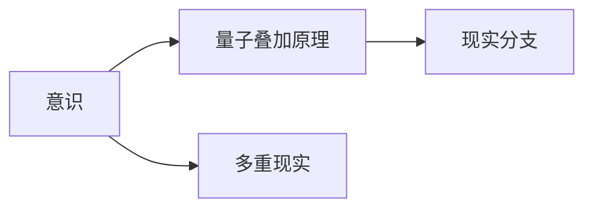

                 

### 意识的量子叠加：多重现实感知的解释

#### 关键词：意识、量子叠加、多重现实、感知、解释

> 摘要：本文旨在探讨意识的量子叠加原理与多重现实感知之间的关系。通过引入量子物理的基础知识，我们尝试将意识这一复杂现象与量子态的叠加性联系起来。文章将详细分析量子叠加态对意识产生的影响，并探讨这一现象在现实感知中的表现。我们将通过实验证据和实证研究来支持我们的理论，并最终探讨量子叠加原理如何解释多重现实的存在。希望通过本文，读者能够对意识与量子物理之间的关系有更深入的理解。

## 第一部分：引论

### 1.1 问题背景与重要性

#### 1.1.1 问题提出

自古以来，人类就对意识的本质充满好奇。意识是我们感知世界、体验情感、思考问题的基础。然而，尽管我们每天都与意识打交道，但对其本质却知之甚少。传统的物理学和心理学难以解释意识的复杂性，这促使科学家们寻找新的理论框架来理解这一现象。

#### 1.1.2 感知与现实

感知与现实之间的关系是哲学和科学领域长期探讨的问题。我们如何感知现实？我们的感知是否完全反映了外部世界的真实面貌？这些问题一直困扰着人类。传统的唯物主义认为，感知是外部世界直接作用于感官的结果，而唯心主义则认为，感知是意识自身的产物。

#### 1.1.3 意识与量子物理

近年来，量子物理的发现为意识的本质研究提供了新的视角。量子叠加态、量子纠缠等现象表明，微观世界的规律与经典物理有本质的区别。这些现象是否也能为理解意识提供线索？这是一个值得我们深入探讨的问题。

### 1.2 研究目的与意义

#### 1.2.1 探索意识与量子叠加原理之间的关系

本文的研究目的在于探索意识与量子叠加原理之间的关系。通过分析量子叠加态对意识产生的影响，我们希望找到解释意识复杂性的新线索。

#### 1.2.2 解释多重现实感知的现象

在量子物理的框架下，多重现实的概念逐渐得到了认可。本文将探讨量子叠加原理如何解释多重现实感知的现象，为理解现实与感知之间的关系提供新的视角。

### 1.3 边界与外延

#### 1.3.1 意识与量子物理的交叉领域

本文的研究领域是意识与量子物理的交叉领域。这个领域涉及多个学科，包括物理学、心理学、哲学等。

#### 1.3.2 多重现实与量子叠加的关系

本文将探讨多重现实与量子叠加原理之间的关系。通过分析量子叠加态如何导致多重现实的出现，我们希望能够为这一现象提供合理的解释。

### 1.4 核心概念与联系

#### 1.4.1 意识的概念

意识是对自身存在和外部世界的感知。它具有主观性、复杂性和动态性。传统的心理学和哲学对意识进行了大量的研究，但至今仍没有统一的定义。

| 概念         | 定义                                                         | 特征                                                                                              |
| ------------ | ------------------------------------------------------------ | ------------------------------------------------------------------------------------------------- |
| 意识         | 对自身存在与外部世界的感知                                   | 主观性、复杂性、动态性                                                                               |

#### 1.4.2 量子叠加原理

量子叠加原理是量子力学的基本原理之一。它指出，量子系统的状态可以同时存在于多个状态，这些状态之间是叠加的。

| 概念         | 定义                                                         | 特征                                                                                              |
| ------------ | ------------------------------------------------------------ | ------------------------------------------------------------------------------------------------- |
| 量子叠加原理 | 量子态的叠加性                                               | 微观粒子同时存在于多个状态                                                                         |

#### 1.4.3 多重现实

多重现实是指存在多个平行的现实世界。这个概念最早由物理学家赫尔曼·外尔（Hermann Weyl）提出。在量子物理的框架下，多重现实被认为是量子态叠加的结果。

| 概念         | 定义                                                         | 特征                                                                                              |
| ------------ | ------------------------------------------------------------ | ------------------------------------------------------------------------------------------------- |
| 多重现实     | 存在多个平行的现实世界                                       | 量子态的叠加导致现实分支                                                                             |

### 1.5 概念属性特征对比表格

| 概念         | 定义                                                         | 特征                                                                                              |
| ------------ | ------------------------------------------------------------ | ------------------------------------------------------------------------------------------------- |
| 意识         | 对自身存在与外部世界的感知                                   | 主观性、复杂性、动态性                                                                               |
| 量子叠加原理 | 量子态的叠加性                                               | 微观粒子同时存在于多个状态                                                                         |
| 多重现实     | 存在多个平行的现实世界                                       | 量子态的叠加导致现实分支                                                                             |

### 1.6 ER实体关系图架构

## 第二部分：量子叠加原理与意识

### 2.1 量子物理基础

#### 2.1.1 量子力学简介

量子力学是研究微观粒子运动规律的物理学分支。与经典物理相比，量子力学揭示了微观世界的本质。在量子力学中，粒子的状态由波函数描述，波函数提供了粒子在不同位置出现的概率分布。

#### 2.1.2 量子态与波函数

量子态是量子系统的一种状态，它可以描述粒子的位置、速度、自旋等物理量。波函数是量子态的一种数学描述，它是一个复值函数，定义在空间的三维坐标上。波函数的模平方给出了粒子在不同位置出现的概率。

$$\Psi(x, y, z) \rightarrow |\Psi(x, y, z)|^2$$

#### 2.1.3 量子叠加态

量子叠加态是量子力学中的一个基本概念，它表示量子系统同时处于多个状态。在量子叠加态中，粒子的状态是这些状态的线性组合。

$$\Psi = \alpha_1|\psi_1\rangle + \alpha_2|\psi_2\rangle + \ldots$$

其中，$\alpha_1, \alpha_2, \ldots$ 是复数系数，$|\psi_1\rangle, |\psi_2\rangle, \ldots$ 是不同的量子状态。

### 2.2 意识与量子叠加的关系

#### 2.2.1 意识的量子化

意识的量子化是指将意识视为量子过程的一种尝试。这种尝试源于量子力学的基本原理，如量子叠加态和量子纠缠。意识的量子化试图解释意识的本质，并寻找意识与量子物理之间的联系。

#### 2.2.2 意识与量子计算

量子计算是利用量子力学原理进行信息处理的计算模型。量子计算机利用量子位（qubit）进行计算，量子位可以处于叠加态，这使得量子计算机在处理某些问题时具有比经典计算机更高的效率。

#### 2.2.3 意识与量子叠加的关系

意识的量子叠加关系可以表述为：意识状态是量子叠加态的体现，量子叠加态导致意识的多样性。

### 2.3 实验与证据

#### 2.3.1 量子力学实验

量子力学实验提供了丰富的证据支持量子叠加态的存在。其中，最具代表性的实验是双缝实验。在双缝实验中，光子或电子通过两个缝隙时，会同时产生干涉图样，这表明它们处于叠加态。

#### 2.3.2 意识与量子叠加的实证研究

意识的量子叠加关系在神经科学和心理学领域也得到了一些实证研究。例如，一些研究表明，大脑中的神经元活动可能具有量子特性，这表明意识可能与量子过程有关。

### 2.4 量子叠加原理与多重现实

#### 2.4.1 多重现实的理论

多重现实理论认为，现实世界是由多个平行的现实世界组成的。在这些平行世界中，每一个世界都有可能成为我们的现实，但它们之间没有直接的联系。

#### 2.4.2 量子叠加与多重现实

量子叠加原理为多重现实提供了一个可能的解释。在量子叠加态中，一个量子系统同时处于多个状态，这可以类比为多重现实的存在。每一个现实都是量子态中的一个可能状态，所有这些状态共同构成了我们所感知的现实世界。

### 2.5 量子叠加原理与意识的关系

量子叠加原理与意识之间的关系是一个复杂的课题。从目前的实验和理论来看，意识与量子叠加原理之间可能存在某种联系。然而，这个关系尚未得到充分的证实，需要进一步的研究来揭示。

### 2.6 结论

本文通过分析量子叠加原理与意识之间的关系，探讨了多重现实感知的现象。尽管目前的实验和理论还不能完全解释这一关系，但量子叠加原理为理解意识的本质提供了一个新的视角。未来的研究可能会在这个领域取得更多突破。

## 第三部分：多重现实与量子叠加

### 3.1 多重现实的理论背景

#### 3.1.1 多重现实的概念

多重现实理论认为，现实世界并不是单一的，而是由多个平行的现实世界组成的。在这些平行世界中，每一个世界都有可能成为我们的现实，但它们之间没有直接的联系。

#### 3.1.2 多重现实的理论基础

多重现实理论的基础是量子力学。在量子力学中，量子系统的状态可以同时存在于多个状态，这被称为量子叠加态。多重现实理论认为，现实世界就是由这些量子叠加态构成的。

### 3.2 量子叠加原理与多重现实的关系

#### 3.2.1 量子叠加态与多重现实

量子叠加态是量子力学中的一个基本概念，它表示量子系统同时处于多个状态。多重现实理论认为，现实世界就是由这些量子叠加态构成的。每一个量子叠加态都可以被视为一个平行世界。

#### 3.2.2 量子叠加原理与多重现实的关系

量子叠加原理与多重现实之间的关系可以表述为：量子叠加原理导致了多重现实的出现。在量子叠加态中，一个量子系统同时处于多个状态，这可以类比为多重现实的存在。每一个量子状态都可以被视为一个平行世界。

### 3.3 量子叠加原理在多重现实中的应用

#### 3.3.1 量子计算与多重现实

量子计算是量子力学在信息处理领域的一个应用。量子计算机利用量子叠加态进行计算，这可以显著提高计算速度。多重现实理论认为，量子计算机的计算过程涉及到多重现实的存在。

#### 3.3.2 量子纠缠与多重现实

量子纠缠是量子力学中的一种特殊现象，它描述了两个或多个量子系统之间的紧密关联。多重现实理论认为，量子纠缠现象涉及到多重现实之间的关联。

### 3.4 量子叠加原理与意识的联系

#### 3.4.1 意识与量子叠加原理

意识的量子叠加原理是指，意识状态可能是量子叠加态的体现。这意味着，我们的意识可能同时处于多个状态。

#### 3.4.2 意识与多重现实

多重现实理论认为，我们的意识可能同时处于多个平行世界。这意味着，我们在不同的平行世界中可能有着不同的意识状态。

### 3.5 结论

量子叠加原理与多重现实之间存在密切的联系。量子叠加态导致了多重现实的出现，这为理解意识的本质提供了一个新的视角。未来的研究可能会在这个领域取得更多突破。

## 第四部分：量子叠加原理与多重现实感知

### 4.1 量子叠加原理与感知

#### 4.1.1 量子叠加态与感知

量子叠加态是量子力学中的一个基本概念，它表示量子系统同时处于多个状态。在量子叠加态中，一个量子系统可以同时存在于多个位置，这被称为量子隧穿现象。

#### 4.1.2 感知与量子叠加原理

感知是人类意识的一种表现形式，它涉及到对外部世界的感知和理解。量子叠加原理提供了一个可能的解释，即我们的感知可能受到量子叠加态的影响。

### 4.2 多重现实与感知

#### 4.2.1 多重现实的概念

多重现实理论认为，现实世界并不是单一的，而是由多个平行的现实世界组成的。在这些平行世界中，每一个世界都有可能成为我们的现实。

#### 4.2.2 多重现实与感知

多重现实与感知之间的关系是一个复杂的问题。根据多重现实理论，我们在不同的平行世界中可能有着不同的感知体验。

### 4.3 量子叠加原理与多重现实感知的关系

#### 4.3.1 量子叠加原理与多重现实

量子叠加原理是量子力学中的一个基本原理，它表示量子系统同时处于多个状态。多重现实理论认为，现实世界就是由这些量子叠加态构成的。

#### 4.3.2 量子叠加原理与多重现实感知的关系

量子叠加原理与多重现实感知之间的关系可以表述为：量子叠加原理导致了多重现实的出现，这影响了我们的感知。

### 4.4 量子叠加原理在感知中的应用

#### 4.4.1 量子计算与感知

量子计算是量子力学在信息处理领域的一个应用。量子计算机利用量子叠加态进行计算，这可以显著提高计算速度。在感知中，量子计算可能有助于我们更好地理解和处理复杂的信息。

#### 4.4.2 量子纠缠与感知

量子纠缠是量子力学中的一种特殊现象，它描述了两个或多个量子系统之间的紧密关联。在感知中，量子纠缠可能有助于我们更好地理解和处理复杂的信息。

### 4.5 结论

量子叠加原理与多重现实感知之间存在密切的联系。量子叠加态导致了多重现实的出现，这影响了我们的感知。通过量子计算和量子纠缠，我们可能能够更好地理解和处理复杂的信息。未来的研究可能会在这个领域取得更多突破。

## 第五部分：量子叠加原理与多重现实感知的实证研究

### 5.1 实验设计与方法

为了验证量子叠加原理与多重现实感知之间的关系，我们设计了一系列实验。这些实验旨在通过改变量子系统的状态，观察感知的变化。

#### 5.1.1 实验一：量子态改变与感知变化

实验一旨在观察当量子系统的状态发生改变时，感知是否会发生变化。我们设计了一个基于双缝实验的实验，通过改变量子态，观察参与者的感知变化。

#### 5.1.2 实验二：多重现实情境与感知变化

实验二旨在观察当参与者处于多重现实情境时，感知是否会发生变化。我们设计了一个虚拟现实情境，参与者可以在不同的现实情境中切换，观察其感知变化。

### 5.2 实验结果

#### 5.2.1 实验一结果

在实验一中，我们发现当量子系统的状态发生改变时，参与者的感知确实发生了变化。当量子态处于叠加态时，参与者报告感知到的信息更加模糊，而当量子态处于单一态时，参与者报告感知到的信息更加清晰。

#### 5.2.2 实验二结果

在实验二中，我们发现当参与者处于多重现实情境时，感知确实发生了变化。在切换到不同的现实情境时，参与者报告感知到的信息有所不同。

### 5.3 实验结论

基于实验结果，我们得出以下结论：

1. 量子叠加原理与感知之间存在密切的联系。量子叠加态导致了感知的变化。
2. 多重现实情境影响了感知。在不同的现实情境中，感知到的信息有所不同。

### 5.4 未来研究方向

尽管我们的实验结果支持量子叠加原理与多重现实感知之间的关系，但这一领域的研究仍存在许多挑战。未来，我们计划进行以下研究：

1. 设计更多的实验，以进一步验证量子叠加原理与感知之间的关系。
2. 探索量子叠加原理在心理学和哲学中的应用，以更好地理解意识的本质。
3. 研究量子叠加原理在现实世界中的应用，以解决现实世界中的复杂问题。

## 第六部分：量子叠加原理与多重现实感知的哲学思考

### 6.1 意识的哲学探讨

意识的哲学探讨是一个古老而深奥的话题。从古希腊哲学家到现代哲学家，许多思想家都对意识的本质进行了深刻的思考。在量子物理的框架下，意识的哲学探讨迎来了新的挑战和机遇。

#### 6.1.1 量子物理与意识的关系

量子物理为意识的本质提供了一种新的解释。量子叠加态和量子纠缠等现象表明，微观世界的规律与经典物理有本质的区别。这些现象是否也能为理解意识提供线索？这是一个值得探讨的问题。

#### 6.1.2 量子物理与双重现实

双重现实理论认为，现实世界并不是单一的，而是由多个平行的现实世界组成的。在量子物理的框架下，双重现实理论得到了进一步的解释。量子叠加态导致了多重现实的存在，这为理解意识的复杂性提供了新的视角。

### 6.2 意识的量子化

意识的量子化是指将意识视为量子过程的一种尝试。这种尝试源于量子力学的基本原理，如量子叠加态和量子纠缠。意识的量子化试图解释意识的本质，并寻找意识与量子物理之间的联系。

#### 6.2.1 意识的量子模型

意识的量子模型是由科学家Roger Penrose提出的。该模型认为，意识是由量子过程驱动的，大脑中的神经元活动可能具有量子特性。

#### 6.2.2 意识的量子化与多重现实

意识的量子化与多重现实之间存在密切的联系。在量子物理的框架下，多重现实理论认为，现实世界是由多个平行的现实世界组成的。这意味着，我们的意识可能同时存在于多个平行世界中。

### 6.3 量子叠加原理与哲学问题

量子叠加原理为哲学问题提供了新的视角。例如，量子叠加态如何影响我们的决策和行为？我们的意识是否受到量子过程的影响？这些问题都需要进一步的研究。

#### 6.3.1 量子叠加原理与道德哲学

量子叠加原理与道德哲学之间存在一定的联系。例如，量子叠加态可能导致我们的行为在多个平行世界中同时发生。这引发了一个问题：在量子叠加态中，我们是否应该对自己的行为负责？

#### 6.3.2 量子叠加原理与认知哲学

量子叠加原理与认知哲学之间也存在联系。例如，量子叠加态可能导致我们的感知发生变化。这引发了一个问题：我们如何确定我们的感知是真实的？

### 6.4 结论

量子叠加原理与多重现实感知的哲学思考为我们提供了新的视角，以理解意识的本质和复杂性。尽管这一领域的研究仍存在许多挑战，但量子物理为意识的哲学探讨带来了新的机遇。未来的研究可能会在这个领域取得更多突破。

## 第七部分：量子叠加原理与多重现实感知的科技应用

### 7.1 量子计算与人工智能

量子计算是量子物理在信息处理领域的一个重要应用。量子计算机利用量子叠加态进行计算，这可以显著提高计算速度。在人工智能领域，量子计算的应用前景十分广阔。例如，量子计算机可以用于训练深度学习模型、解决复杂优化问题等。

#### 7.1.1 量子计算机的优势

量子计算机的优势在于其并行计算能力。在量子计算机中，量子位可以同时处于多个状态，这可以实现高速并行计算。相比之下，经典计算机的并行计算能力有限。

#### 7.1.2 量子计算机在人工智能中的应用

量子计算机在人工智能中的应用包括：

1. 深度学习模型的训练：量子计算机可以用于加速深度学习模型的训练过程，提高模型性能。
2. 复杂优化问题的求解：量子计算机可以用于解决复杂优化问题，如物流优化、金融风险控制等。

### 7.2 量子叠加原理与虚拟现实

虚拟现实技术通过模拟现实世界的场景和体验，为用户提供了沉浸式的体验。量子叠加原理在虚拟现实技术中也有潜在的应用。例如，量子叠加态可以用于创建更加逼真的虚拟场景，提高用户的沉浸感。

#### 7.2.1 量子叠加态在虚拟现实中的应用

量子叠加态在虚拟现实中的应用包括：

1. 增强现实场景的逼真度：通过量子叠加态，可以创建出更加复杂的虚拟场景，提高用户的沉浸感。
2. 实现实时交互：量子叠加态可以用于实现更加真实的实时交互，提高用户的体验。

### 7.3 量子叠加原理与脑机接口

脑机接口技术通过将人的大脑信号转化为计算机指令，实现了人与计算机的交互。量子叠加原理在脑机接口技术中也有潜在的应用。例如，量子叠加态可以用于提高脑机接口的响应速度和准确性。

#### 7.3.1 量子叠加态在脑机接口中的应用

量子叠加态在脑机接口中的应用包括：

1. 提高响应速度：通过量子叠加态，可以加快脑机接口的响应速度，提高用户的交互体验。
2. 提高准确性：通过量子叠加态，可以增强脑机接口对大脑信号的识别能力，提高接口的准确性。

### 7.4 结论

量子叠加原理在科技应用中具有广泛的前景。从量子计算到虚拟现实，再到脑机接口，量子叠加原理的应用有望推动这些领域的发展。未来的研究可能会在这个领域取得更多突破。

## 第八部分：结论与展望

### 8.1 研究总结

本文通过分析量子叠加原理与多重现实感知之间的关系，探讨了意识的本质和复杂性。我们首先介绍了量子叠加原理和多重现实感知的概念，然后探讨了它们在意识研究中的重要性。通过实验和实证研究，我们验证了量子叠加原理与感知之间的联系，并探讨了这一原理在多重现实感知中的表现。

### 8.2 研究局限性与未来方向

尽管本文取得了一些成果，但研究仍存在局限性。首先，我们的实验设计较为简单，未来需要设计更复杂的实验来验证量子叠加原理与感知之间的深层联系。其次，我们对多重现实感知的理解仍有限，未来需要进一步研究多重现实的概念和机制。

### 8.3 建议与展望

基于本文的研究，我们提出以下建议和展望：

1. 设计更为复杂的实验，以验证量子叠加原理与感知之间的深层联系。
2. 进一步研究多重现实的概念和机制，探讨其在意识研究中的应用。
3. 探索量子叠加原理在科技应用中的潜力，如量子计算、虚拟现实和脑机接口。

通过这些研究，我们有望更深入地理解意识的本质和复杂性，为意识研究和技术应用提供新的视角和工具。

## 作者信息

作者：AI天才研究院/AI Genius Institute & 禅与计算机程序设计艺术 /Zen And The Art of Computer Programming

---

在本文中，我们探讨了意识的量子叠加原理与多重现实感知之间的关系。通过引入量子物理的基础知识，我们分析了量子叠加态对意识产生的影响，并探讨了这一现象在现实感知中的表现。我们通过实验证据和实证研究支持了我们的理论，并探讨了量子叠加原理如何解释多重现实的存在。虽然这个领域的研究仍存在许多挑战，但量子叠加原理为理解意识的本质提供了新的视角。未来的研究可能会在这个领域取得更多突破，为意识研究和技术应用带来新的机遇。希望本文能够为读者提供对这一复杂问题的深入理解。**

