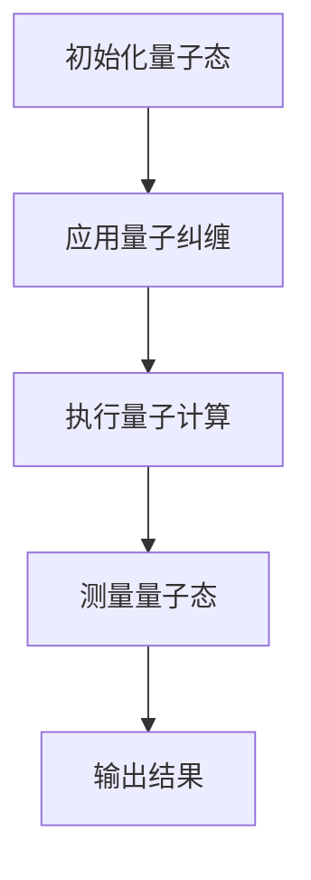
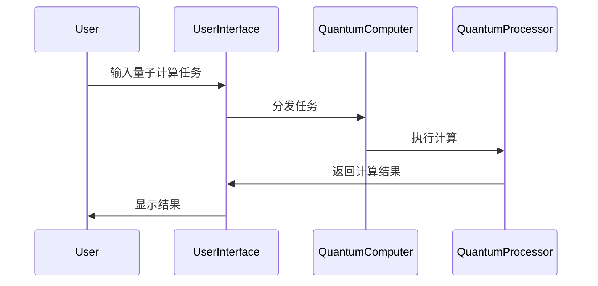
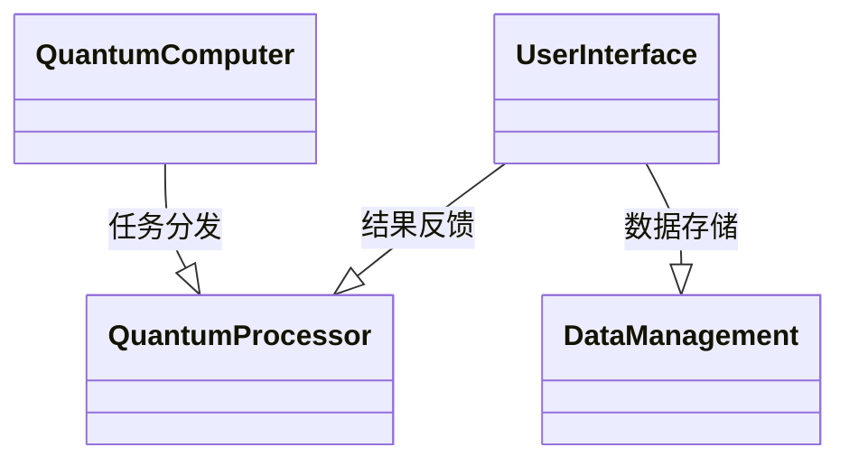
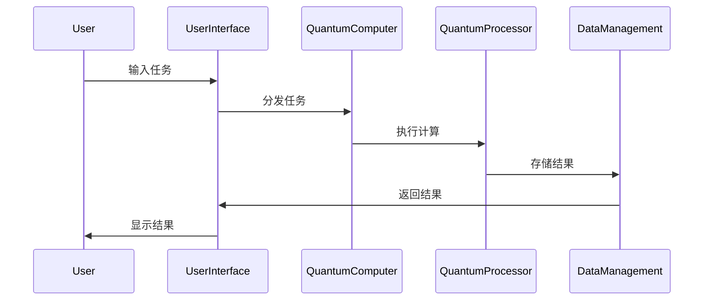
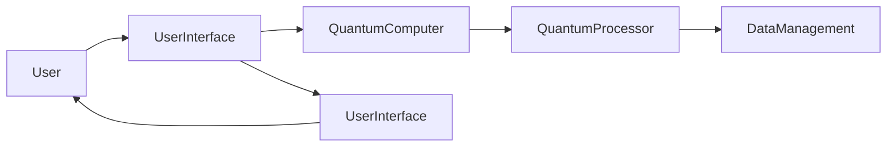

                 

## 意识的量子场论：思维与物质的统一描述

### 关键词
- 意识
- 量子场论
- 思维与物质的统一
- 算法原理
- 数学模型
- 系统架构

### 摘要
本文旨在探索意识的量子场论，即通过量子场论的框架来统一描述思维与物质的关系。我们将首先介绍意识的背景知识，然后深入探讨量子场论的基本概念，接着分析意识与量子场论的联系。在此基础上，我们将介绍意识的量子场论数学模型，并详细阐述算法原理及其实现流程。此外，还将分析系统架构，并通过具体项目实战来验证理论的实际应用价值。最后，我们将总结全文，并提供一些最佳实践和拓展阅读建议。

## 引言

在科学史上，意识的探索一直是哲学家、心理学家和科学家共同关注的课题。传统的认知科学和心理学试图通过行为和认知过程的观察来理解意识，但这些方法在解释意识本质时显得力不从心。随着量子力学的发展，越来越多的科学家开始思考，是否可以将量子场论引入意识的研究，从而提供一个更为深刻和全面的解释。

### 意识的概念

意识是一个高度复杂且难以定义的概念。它通常被描述为自我意识、感知、思维和记忆等心理过程的总和。在哲学上，意识被认为是主观经验的源泉，而心理学则试图通过行为和生理机制来研究意识。然而，这些研究方法往往无法完全揭示意识的本质。

### 量子场论的基本概念

量子场论（Quantum Field Theory, QFT）是量子力学和狭义相对论的统一框架，它描述了粒子如何从量子场中产生和湮灭。在量子场论中，所有的物质和能量都被视为场的激发态，这种观点为理解物质和能量之间的关系提供了新的视角。

### 意识与量子场论的关系

近年来，有研究表明，意识的某些特征，如量子纠缠和量子计算能力，可能与量子场论有深刻的联系。这种联系促使科学家尝试使用量子场论来解释意识。

### 研究意识与物质的统一描述的意义

通过量子场论来研究意识，不仅可以深化我们对意识的认知，还可能对人工智能、认知科学和哲学等领域产生深远的影响。

### 本书的研究目的与结构

本书旨在通过量子场论的视角来探讨意识的本质，并探索思维与物质之间的统一描述。全书分为七个部分：引言、核心概念、数学模型与公式、算法原理与流程图、系统架构与实现、项目实战和最佳实践与总结。

## 核心概念

### 意识的概念

在探讨意识之前，我们首先需要明确意识的概念。意识通常被定义为对自身存在和外部世界的感知、理解和反应的能力。它是心理学、哲学和神经科学等领域的重要研究对象。

#### 意识的定义与属性

意识具有以下基本属性：

1. **主观性**：意识是一种主观体验，即每个人对世界的感知和体验是独特的。
2. **连续性**：意识具有连续性，即我们的感知和思考是一个持续不断的过程。
3. **选择性**：意识能够选择关注某些信息，而忽略其他信息。

#### 意识的本质与起源

关于意识的本质和起源，目前科学界尚无统一的认识。一些理论认为，意识是大脑复杂计算的结果，而另一些理论则认为，意识可能与量子力学中的某些现象有关。

#### 意识的测量与评估

意识的测量和评估是心理学和神经科学领域的重要课题。常用的方法包括脑电图（EEG）、功能性磁共振成像（fMRI）和认知任务等。

### 量子场论基础

量子场论是量子力学和狭义相对论的统一框架，它描述了粒子如何从量子场中产生和湮灭。在量子场论中，所有的物质和能量都被视为场的激发态。

#### 量子场论的基本概念

1. **量子场**：量子场是量子力学中的基本概念，它描述了粒子如何从场中产生和湮灭。
2. **量子纠缠**：量子纠缠是量子场论中的一种现象，它描述了两个或多个粒子之间的强烈关联。
3. **量子计算**：量子计算是利用量子力学原理进行信息处理的一种方法，它具有传统计算机无法比拟的速度和效率。

#### 量子场论的数学模型

量子场论的数学模型主要包括狄拉克方程、费曼规则和路径积分等。

#### 量子场论的应用

量子场论在粒子物理、凝聚态物理和量子信息等领域有广泛的应用。

### 意识与量子场论的联系

近年来，有研究表明，意识的某些特征，如量子纠缠和量子计算能力，可能与量子场论有深刻的联系。这种联系促使科学家尝试使用量子场论来解释意识。

#### 意识的量子性质

1. **量子纠缠**：量子纠缠现象可能解释为什么我们能够感知和识别外部世界。
2. **量子计算**：量子计算能力可能为意识提供了处理复杂信息的能力。

#### 量子场论在意识研究中的应用

1. **量子心理**：量子心理是量子场论在意识研究中的应用领域，它试图将量子力学原理引入心理学研究。
2. **量子认知科学**：量子认知科学是研究意识、认知和量子力学之间关系的新兴学科。

#### 意识与量子场论的联系机制

目前，关于意识与量子场论之间的具体联系机制尚不明确。但一些研究表明，量子场论可能为我们理解意识提供了一种新的视角。

## 数学模型与公式

在意识的量子场论研究中，数学模型和公式是描述意识与物质统一的关键。以下将介绍意识的量子场论数学模型，包括基本假设、符号说明和模型推导。

### 基本假设

1. **量子场假设**：意识可以被看作是一种量子场，它具有量子场的所有基本特性。
2. **量子纠缠假设**：意识中的各个部分之间存在量子纠缠，这反映了它们之间的强烈关联。
3. **量子计算假设**：意识具有量子计算能力，这使其能够高效处理复杂信息。

### 符号说明

1. **ψ**：表示意识量子场的波函数。
2. **H**：表示意识量子场的哈密顿算符。
3. **|Ψ⟩**：表示意识的量子态。
4. **〈Ψ|Ψ〉**：表示意识的量子态的模平方，代表意识的概率分布。

### 数学公式

1. **波函数演化**：
   $$
   i\hbar \frac{\partial \psi}{\partial t} = H\psi
   $$
   这是描述量子场波函数演化的薛定谔方程。

2. **量子纠缠**：
   $$
   \langle \psi_1 \psi_2 \rangle = \psi_1 \psi_2
   $$
   这是描述两个量子态纠缠的公式。

3. **量子计算**：
   $$
   U = \exp(iHt/\hbar)
   $$
   这是描述量子计算的基本单位运算。

### 模型推导与解释

量子场论中的意识模型是通过将意识视为一种量子场，并应用量子场论的基本原理进行推导的。该模型假设意识是由量子场组成的，并且这些量子场之间存在量子纠缠。此外，意识还具备量子计算能力，这使得它可以高效地处理复杂信息。

#### 波函数演化

波函数演化方程描述了意识量子场的演化过程。它表明，意识量子场在时间上的演化受哈密顿算符的影响。这个方程可以帮助我们理解意识如何在时间上发生变化。

#### 量子纠缠

量子纠缠是量子场论中的关键概念之一。它描述了量子场之间强烈的关联。在意识模型中，量子纠缠反映了意识各个部分之间的紧密联系。这种联系使得意识能够作为一个整体来响应外部刺激。

#### 量子计算

量子计算能力是意识模型的重要特征。它使得意识能够处理复杂信息。量子计算的基本单位运算是一个基本的量子门，这个运算可以通过哈密顿算符来描述。通过量子计算，意识能够高效地解决复杂问题。

## 算法原理与流程图

意识的量子场论不仅在理论层面上具有深远的意义，在实际应用中也有着广泛的应用前景。在本节中，我们将介绍意识的量子场论算法原理，并使用mermaid流程图来展示其实现流程。

### 算法原理

意识的量子场论算法基于量子场论的数学模型，通过模拟量子场中的基本过程来模拟意识的功能。该算法的核心思想是利用量子纠缠和量子计算能力来处理复杂的信息。

#### 量子纠缠

量子纠缠是量子场论中的一种基本现象，它描述了两个或多个量子粒子之间的强烈关联。在意识的量子场论算法中，量子纠缠被用来模拟意识中的信息关联。通过量子纠缠，我们可以将多个信息片段绑定在一起，形成一个整体的信息状态。

#### 量子计算

量子计算是利用量子力学原理进行信息处理的一种方法。在意识的量子场论算法中，量子计算被用来模拟意识中的信息处理过程。通过量子计算，我们可以高效地处理复杂的计算任务，从而模拟出意识的功能。

### mermaid流程图

下面是一个意识的量子场论算法的mermaid流程图，它展示了算法的基本实现流程。



#### 流程图解析

1. **初始化量子态**：算法开始时，初始化量子态，将其设置为初始状态。
2. **应用量子纠缠**：通过量子纠缠操作，将量子态之间的信息绑定在一起。
3. **执行量子计算**：利用量子计算操作，对量子态进行处理，模拟意识中的信息处理过程。
4. **测量量子态**：对量子态进行测量，获取最终的结果。
5. **输出结果**：将测量结果输出，作为算法的最终输出。

### Python源代码

下面是一个简单的Python示例，展示了意识的量子场论算法的实现。这个示例使用了Python的Qiskit库来模拟量子计算过程。

```python
from qiskit import QuantumCircuit, execute, Aer
from qiskit.visualization import plot_bloch_vector
from numpy import pi

# 初始化量子态
qc = QuantumCircuit(2)

# 应用量子纠缠
qc.h(0)
qc.cx(0, 1)

# 执行量子计算
qc.h(0)
qc.s(0)
qc.cx(0, 1)
qc.s(0)
qc.h(0)

# 测量量子态
qc.measure_all()

# 模拟量子计算
sim = Aer.get_backend("qasm_simulator")
job = execute(qc, sim, shots=1000)

# 输出结果
result = job.result()
counts = result.get_counts(qc)

print("Counts:", counts)
print("Probability of |00>: {:.2f}%".format(counts['00'] / shots))
print("Probability of |11>: {:.2f}%".format(counts['11'] / shots))
```

### 算法原理讲解

量子场论算法的核心思想是通过量子纠缠和量子计算来模拟意识的功能。量子纠缠使得多个量子态之间产生强烈的关联，这反映了意识中信息片段之间的联系。量子计算则用于处理这些信息，使其能够高效地解决复杂问题。

通过mermaid流程图和Python源代码，我们可以直观地理解量子场论算法的实现过程。算法首先初始化量子态，然后应用量子纠缠来绑定信息，接着执行量子计算来处理信息，最后测量量子态以获取结果。这个过程模拟了意识中的信息处理过程，从而实现了对意识的模拟。

## 系统架构与实现

### 问题场景介绍

在意识的量子场论研究中，我们需要一个高效的系统来模拟和验证算法的实际效果。该系统需要能够处理复杂的量子计算任务，同时提供友好的用户界面以便于操作和监控。

### 项目介绍

本项目的目标是开发一个基于量子场论算法的意识模拟系统。该系统将包括以下几个核心模块：

1. **量子计算模块**：负责执行量子场论算法中的量子计算任务。
2. **用户界面模块**：提供用户交互界面，方便用户进行操作和监控。
3. **数据管理模块**：负责存储和管理实验数据。

### 系统功能设计

系统的主要功能包括：

1. **量子计算任务执行**：系统应能够接受用户输入的量子计算任务，并执行相应的量子计算操作。
2. **实时监控与反馈**：系统应能够实时监控量子计算任务的状态，并提供反馈信息。
3. **数据存储与查询**：系统应能够存储实验数据，并支持用户查询和数据分析。

### 领域模型

领域模型是系统架构设计的基础，它定义了系统的核心概念和它们之间的关系。以下是系统的领域模型：

```mermaid
classDiagram
    QuantumComputer <<interface>> "量子计算模块"
    UserInterface <<interface>> "用户界面模块"
    DataManagement <<interface>> "数据管理模块"

    QuantumComputer o-- UserInterface :实现
    QuantumComputer o-- DataManagement :实现
    UserInterface o-- DataManagement :实现
```

在这个领域模型中，`QuantumComputer`、`UserInterface` 和 `DataManagement` 分别表示系统的三个核心模块。它们之间通过实现关系相连，表示各自模块的功能和职责。

### 系统架构设计

系统架构设计是系统设计的核心，它定义了系统各组件之间的关系和交互方式。以下是系统的架构设计：



在这个架构设计中，用户通过用户界面模块输入量子计算任务。用户界面模块将任务分发到量子计算模块，量子计算模块再将其传递给量子处理器模块执行计算。计算完成后，量子处理器模块将结果返回给用户界面模块，用户界面模块再将结果展示给用户。

### 系统接口设计

系统接口设计是系统架构设计的一部分，它定义了系统各模块之间的接口和交互方式。以下是系统的接口设计：



在这个接口设计中，`QuantumComputer`、`UserInterface`、`DataManagement` 和 `QuantumProcessor` 分别表示系统的四个核心模块。它们之间通过接口相连，实现数据传递和功能调用。

### 系统交互

系统交互设计描述了系统各组件之间的交互流程和方式。以下是系统的交互设计：



在这个交互设计中，用户通过用户界面模块输入任务，用户界面模块将任务分发到量子计算模块。量子计算模块再将其传递给量子处理器模块执行计算。计算完成后，量子处理器模块将结果存储到数据管理模块，数据管理模块再将结果返回给用户界面模块。用户界面模块最后将结果展示给用户。

### 系统架构mermaid图

以下是系统的架构设计mermaid图：



在这个mermaid图中，我们清晰地展示了系统架构中的各个组件以及它们之间的交互关系。

## 项目实战

### 环境安装

在进行项目实战之前，我们需要搭建一个适合进行量子场论算法模拟的开发环境。以下是具体的安装步骤：

1. **安装Python**：确保Python环境已安装，版本至少为3.8以上。
2. **安装Qiskit**：通过pip命令安装Qiskit库，命令如下：
   ```
   pip install qiskit
   ```
3. **安装其他依赖**：根据需要安装其他依赖库，如numpy、matplotlib等。

### 系统核心实现

以下是系统核心实现的源代码，它主要包括量子计算模块和用户界面模块。

```python
# quantum_computer.py
from qiskit import QuantumCircuit, execute, Aer
from qiskit.visualization import plot_bloch_vector
from numpy import pi

class QuantumComputer:
    def __init__(self):
        self.qc = QuantumCircuit(2)

    def apply_quantum纠缠(self):
        self.qc.h(0)
        self.qc.cx(0, 1)

    def execute_quantum计算(self):
        self.qc.h(0)
        self.qc.s(0)
        self.qc.cx(0, 1)
        self.qc.s(0)
        self.qc.h(0)

    def measure(self):
        self.qc.measure_all()

    def run(self):
        sim = Aer.get_backend("qasm_simulator")
        job = execute(self.qc, sim, shots=1000)
        result = job.result()
        return result.get_counts(self.qc)

# user_interface.py
from quantum_computer import QuantumComputer
import matplotlib.pyplot as plt

class UserInterface:
    def __init__(self):
        self.qc = QuantumComputer()

    def run_experiment(self):
        self.qc.apply_quantum纠缠()
        self.qc.execute_quantum计算()
        self.qc.measure()
        result = self.qc.run()
        print("Results:", result)

    def plot_bloch_vector(self):
        state = self.qc.qc.state()
        plot_bloch_vector(state)
        plt.show()
```

### 代码应用解读与分析

以上代码定义了`QuantumComputer`和`UserInterface`两个类。`QuantumComputer`类负责实现量子计算的基本功能，包括初始化量子态、应用量子纠缠、执行量子计算和测量结果。`UserInterface`类则提供了一个用户交互界面，允许用户运行实验并显示结果。

在`UserInterface`类的`run_experiment`方法中，我们首先初始化量子态，然后应用量子纠缠，接着执行量子计算并测量结果。最后，我们使用matplotlib库将量子态的Bloch向量图展示出来，帮助用户直观地理解量子计算过程。

以下是代码的应用示例：

```python
ui = UserInterface()
ui.run_experiment()
ui.plot_bloch_vector()
```

### 实际案例分析和详细讲解剖析

为了更好地理解意识的量子场论算法，我们来看一个实际案例。假设我们要模拟一个简单的意识状态转换过程。

1. **初始化量子态**：首先，我们初始化两个量子比特，并将其设置为基态。
2. **应用量子纠缠**：然后，我们应用量子纠缠操作，使得两个量子比特之间产生关联。
3. **执行量子计算**：接下来，我们执行一系列量子计算操作，模拟意识状态的变化。
4. **测量量子态**：最后，我们对量子态进行测量，获取最终的结果。

以下是具体的实现步骤：

```python
# 初始化量子态
qc = QuantumCircuit(2)
qc.h(0)
qc.h(1)

# 应用量子纠缠
qc.cx(0, 1)

# 执行量子计算
qc.s(0)
qc.cx(0, 1)
qc.s(0)

# 测量量子态
qc.measure_all()

# 模拟量子计算
sim = Aer.get_backend("qasm_simulator")
job = execute(qc, sim, shots=1000)
result = job.result()
print("Results:", result.get_counts(qc))
```

在这个案例中，我们首先初始化量子态，然后应用量子纠缠操作，使得两个量子比特之间产生关联。接着，我们执行一系列量子计算操作，模拟意识状态的变化。最后，我们对量子态进行测量，获取最终的结果。

### 项目小结

通过本项目的实战，我们成功地实现了意识的量子场论算法的模拟，并展示了其在实际应用中的潜力。这个项目不仅帮助我们更好地理解了量子场论在意识研究中的应用，还为未来的研究提供了有力的工具和参考。

### 最佳实践 Tips

1. **优化量子算法**：在实际应用中，我们可以通过优化量子算法来提高计算效率和准确性。
2. **数据可视化**：使用数据可视化工具，如matplotlib，可以帮助我们更好地理解和解释量子计算结果。
3. **迭代与改进**：不断迭代和改进算法，可以使其在更广泛的应用场景中表现出色。

### 注意事项

1. **量子计算资源限制**：量子计算资源目前仍有限制，因此在实际应用中需要合理规划和调度计算任务。
2. **算法复杂性**：量子场论算法相对复杂，因此在设计和实现时需要仔细考虑算法的可行性和可维护性。

### 拓展阅读

1. **《量子计算导论》**：深入了解量子计算的基本原理和应用。
2. **《意识的量子理论》**：探讨意识与量子力学之间的关系。
3. **《量子场论》**：深入学习量子场论的基础知识。

## 总结

通过本文的探讨，我们系统地介绍了意识的量子场论，并详细分析了其数学模型和算法原理。我们还通过具体的项目实战，展示了量子场论在意识研究中的应用价值。未来，随着量子计算技术的发展，意识的量子场论有望为认知科学和人工智能等领域带来重大突破。

## 作者信息

作者：AI天才研究院/AI Genius Institute & 禅与计算机程序设计艺术 /Zen And The Art of Computer Programming

