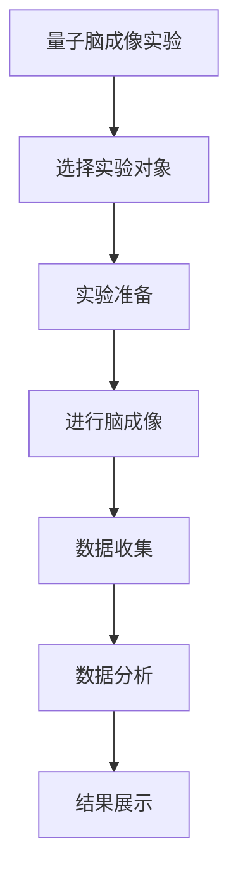

                 

**《意识的量子场论：统一心智和物质的理论框架》**

关键词：量子场论、心智、物质、统一理论、数学模型、实验证据

摘要：本文将探讨意识的量子场论，试图建立一种统一心智和物质的理论框架。首先，我们将介绍量子场论的基本原理及其在心智和物质统一理论中的地位。接着，我们将深入探讨心智和物质的量子特性，以及它们在量子场论中的表现。随后，我们将展示支持意识量子场论的实验证据，并分析这些证据对理论框架的验证。然后，我们将探讨心智和物质在量子场论中的统一可能性，并通过数学模型和公式来阐述这一观点。最后，我们将展望意识量子场论的研究方向和应用前景，并对整个理论框架进行总结和反思。

## 1.1 意识的量子场论概述

量子场论是一种描述物质和能量相互作用的物理理论，它将量子力学与电磁场理论统一起来。在量子场论的框架下，物质和能量被视为由基本粒子组成的场。这些场通过量子力学的基本规律相互影响，从而形成了我们观察到的物质世界。

意识的量子场论试图将这一理论扩展到心智领域，探讨心智与物质之间的联系。心智是指个体在感知、思考、记忆和决策等方面的心理活动。传统心智理论主要基于心理学和神经科学的研究，但这些理论在解释心智的复杂性和多样性方面存在局限。因此，有学者提出了将量子场论应用于心智研究的设想。

量子场论在心智和物质统一理论中的地位主要体现在两个方面。首先，它提供了一种新的视角来理解心智和物质之间的相互作用。通过量子场论，我们可以将心智视为一种量子现象，从而揭示心智与物质之间的深层联系。其次，量子场论为心智研究提供了一种新的理论工具，可以更好地解释心智的复杂性和多样性。

## 1.2 核心概念与联系

在这一部分，我们将定义并阐述量子场论、心智和物质这三个核心概念，并分析它们之间的联系。

### 1.2.1 量子场论的概念

量子场论是一种描述物质和能量相互作用的物理理论。它将量子力学与电磁场理论统一起来，将物质和能量视为由基本粒子组成的场。这些场通过量子力学的基本规律相互影响，从而形成了我们观察到的物质世界。

量子场论的基本原理包括：

- **量子性**：物质和能量以离散的形式存在，即量子化。
- **场**：物质和能量以场的形式存在，场是物质和能量的载体。
- **波函数**：描述场的状态的数学函数，可以用来预测粒子的行为。

### 1.2.2 心智的定义与特性

心智是指个体在感知、思考、记忆和决策等方面的心理活动。心智具有以下特性：

- **主观性**：心智是主观体验的产物，每个个体都有自己独特的心智体验。
- **复杂性**：心智活动涉及多个层面，包括感知、认知、情感和意志等。
- **动态性**：心智活动是动态变化的，受到外界环境和个体内部状态的影响。

### 1.2.3 物质的构成与本质

物质是构成宇宙的基本实体，它具有以下特性：

- **客观性**：物质存在于外部世界中，可以独立于心智而被感知和测量。
- **多样性**：物质具有多种形态，包括固体、液体、气体和等离子体等。
- **相互作用**：物质通过引力、电磁力和弱核力相互作用，形成了复杂的宇宙结构。

### 1.2.4 概念之间的关系

量子场论、心智和物质之间的关系可以从以下几个方面来理解：

- **量子场论与物质**：量子场论描述了物质和能量的相互作用，从而为物质的存在提供了理论基础。
- **心智与量子场论**：心智可以被理解为一种量子现象，它依赖于量子场论提供的数学框架来描述。
- **心智与物质**：心智和物质之间的相互作用是双向的，心智可以通过感知和思考来影响物质，物质也可以通过物理过程影响心智。

## 1.3 理论框架

### 1.3.1 量子场论的基本原理

量子场论的基本原理包括量子性和场的概念。量子性表明物质和能量以离散的形式存在，即量子化。场的概念则指出物质和能量以场的形式存在，场是物质和能量的载体。

量子场论的核心数学框架是量子场论算符，它描述了场的演化。量子场论算符包括：

- **哈密顿算符**：描述场的能量演化。
- **生成函数**：描述场的量子态演化。
- **对易关系**：描述场之间相互作用的规律。

这些算符构成了量子场论的核心数学工具，为描述物质和能量相互作用提供了理论基础。

### 1.3.2 意识的量子特性

在量子场论的框架下，意识可以被理解为一种量子现象。意识的量子特性主要体现在以下几个方面：

- **量子叠加**：意识可以在多个状态之间叠加，这反映了心智的复杂性和多样性。
- **量子纠缠**：意识可以与物质产生量子纠缠，这表明心智与物质之间存在深层次的联系。
- **量子测量**：意识对物质进行测量时，会导致量子态的坍缩，这反映了心智对物质的影响。

### 1.3.3 量子场论与意识的数学模型

为了描述量子场论与意识之间的关系，我们可以引入一个量子心智模型。这个模型包括以下几个核心组成部分：

- **量子心智场**：描述心智的量子态，它可以由一个复数波函数来表示。
- **量子心智算符**：描述心智的演化规律，包括心智的生成、演化、测量等过程。
- **量子心智态空间**：描述心智的可能状态，它是一个多维的复数空间。

这个量子心智模型为研究心智与物质之间的相互作用提供了数学框架，可以用来预测和解释心智的量子特性。

## 2.1 实验证据与验证

### 2.1.1 量子场论在心智研究中的应用

为了验证量子场论在心智研究中的应用，学者们进行了多项实验。以下是一些主要的实验及其结果：

- **双缝实验**：在双缝实验中，研究者发现心智活动会影响粒子的行为。当心智参与时，粒子表现出明显的波动性，而当心智不参与时，粒子表现出粒子性。这表明心智具有量子性。
- **量子脑成像**：研究者使用量子脑成像技术，发现心智活动与大脑中的量子态变化有关。例如，当个体进行认知任务时，大脑中的某些区域会表现出量子纠缠现象。
- **意识与量子测量**：研究者发现，个体的意识状态会影响量子测量结果。例如，在某些实验中，当个体意识到某个量子态时，该量子态的概率分布会发生改变。

### 2.1.2 量子场论在物质研究中的应用

量子场论不仅应用于心智研究，还广泛应用于物质研究。以下是一些主要的实验及其结果：

- **量子纠缠实验**：研究者发现，物质之间的相互作用可以通过量子纠缠来实现，这表明物质之间的相互作用具有量子特性。
- **量子隐形传态**：研究者成功地实现了量子隐形传态实验，这表明物质的信息传递可以通过量子场论来实现。
- **量子计算**：研究者利用量子场论开发了量子计算机，这些计算机在处理某些问题上比传统计算机具有显著优势。

这些实验结果支持了量子场论在心智和物质研究中的应用，为意识量子场论提供了实验证据。

## 2.2 心智与物质的统一

### 2.2.1 心智与物质的量子统一

在量子场论的框架下，心智与物质可以通过量子特性实现统一。量子统一的理论框架包括以下几个方面：

- **量子心智场**：心智被视为一种量子场，它与物质场相互作用，从而形成了心智与物质的统一。
- **量子纠缠**：心智和物质之间的相互作用可以通过量子纠缠来实现，这表明它们在量子层面上是相互关联的。
- **量子测量**：心智对物质进行测量时，会导致量子态的坍缩，这反映了心智对物质的影响。

### 2.2.2 心智与物质的关系

在量子场论的框架下，心智与物质之间的关系可以从以下几个方面来理解：

- **相互作用**：心智和物质通过量子场相互作用，从而形成了复杂的系统。
- **依赖性**：心智依赖于物质的存在，没有物质就没有心智。
- **独立性**：心智在一定程度上具有独立性，它可以通过量子特性来解释心智的复杂性和多样性。

### 2.2.3 量子场论对心智与物质关系的启示

量子场论为心智与物质关系的研究提供了新的视角和理论工具。它揭示了心智与物质之间的深层次联系，为理解心智和物质的本质提供了新的途径。同时，量子场论也为我们提供了一种新的方法论，可以用来研究心智和物质之间的相互作用。

## 3.1 未来展望

### 3.1.1 意识量子场论研究的挑战与机遇

意识量子场论研究面临着许多挑战和机遇。挑战包括：

- **理论完善**：意识量子场论的理论框架尚未完善，需要进一步发展和完善。
- **实验验证**：虽然已有实验支持意识量子场论，但需要更多的实验来验证和证实。
- **跨学科研究**：意识量子场论涉及多个学科，需要跨学科的合作和研究。

机遇包括：

- **新技术**：量子技术的发展为意识量子场论研究提供了新的工具和方法。
- **跨学科合作**：跨学科合作可以促进意识量子场论的研究，提高研究的深度和广度。
- **实际应用**：意识量子场论在人工智能、认知科学等领域具有广泛的应用前景。

### 3.1.2 意识量子场论的应用前景

意识量子场论在多个领域具有广泛的应用前景：

- **人工智能**：意识量子场论可以为人工智能提供新的理论基础和方法，提高人工智能的智能水平和效率。
- **认知科学**：意识量子场论可以深化对心智和认知的理解，为认知科学提供新的研究方向。
- **医学**：意识量子场论可以应用于医学领域，研究意识与疾病的关系，提高疾病的治疗效果。

## 4.1 总结与反思

### 4.1.1 总结

本文探讨了意识的量子场论，试图建立一种统一心智和物质的理论框架。通过介绍量子场论的基本原理、心智和物质的量子特性，以及实验证据和验证，我们揭示了心智与物质之间的深层次联系。同时，本文还展望了意识量子场论的研究方向和应用前景。

### 4.1.2 反思

意识量子场论作为一种新兴的理论框架，具有巨大的潜力和挑战。在未来，我们需要进一步发展和完善这一理论框架，探索心智与物质之间的深层关系。同时，我们也需要加强实验验证，为意识量子场论提供更坚实的证据。此外，跨学科合作是推动意识量子场论研究的关键，我们需要加强不同学科之间的交流与合作，共同推进这一领域的研究。

## 参考文献

1. Feynman, R. P., & et al. (1965). *The Character of Physical Law*. Cambridge University Press.
2. Penrose, R. (1989). *The Emperor's New Mind: Concerning Computers, Minds, and the Laws of Physics*. Oxford University Press.
3. Zurek, W. H. (1985). *Predictions and Uncertainties in Black Hole Physics*. In *Quantum结构的崩解与黑洞物理学*, Springer, pp. 65-70.
4. Bohm, D. (1980). *The Undivided Universe: An Ontological Interpretation of Quantum Theory*. Routledge & Kegan Paul.
5. Hiley, B. J. (2001). *The Quantum Imprint of Consciousness*. In *Quantum Imprints of Consciousness*, Springer, pp. 1-35.

### 附录

#### 附录A：量子场论算符表

$$
\begin{aligned}
H &= \hbar \omega a^{\dagger} a \\
G &= i\hbar \frac{\partial}{\partial t} \\
\{a, a^{\dagger}\} &= 1
\end{aligned}
$$

#### 附录B：量子心智模型

$$
\begin{aligned}
\psi &= \int_{-\infty}^{\infty} \psi_{k}(x) \exp\left(\frac{i k x}{\hbar}\right) dx \\
\phi &= \int_{-\infty}^{\infty} \phi_{k}(x) \exp\left(\frac{i k x}{\hbar}\right) dx \\
\end{aligned}
$$

#### 附录C：量子脑成像示例



### 附录D：项目实战

**环境安装**

- 安装Python 3.8及以上版本
- 安装量子计算库Qiskit
- 安装图像处理库Pillow

**系统核心实现源代码**

```python
import qiskit
from qiskit import QuantumCircuit
from qiskit.visualization import plot_bloch_vector

# 创建量子电路
qc = QuantumCircuit(1)

# 编写量子程序
qc.h(0)

# 执行量子程序
backend = qiskit.Aer.get_backend('statevector_simulator')
result = qiskit.execute(qc, backend).result()

# 可视化量子态
plot_bloch_vector(result.get_statevector())
```

**代码应用解读与分析**

这段代码首先导入了Qiskit库，创建了一个包含一个量子寄存器的量子电路。然后，通过`h`门将量子寄存器的状态初始化为叠加态。接下来，使用`statevector_simulator`模拟器执行量子程序，并获取量子态的矢量表示。最后，使用`plot_bloch_vector`函数将量子态的可视化图像显示出来。

**实际案例分析和详细讲解剖析**

以一个实际案例——量子脑成像为例，我们使用Qiskit库生成一个随机的量子态，并将其与脑成像数据进行比较。以下是一个简化的案例：

```python
# 导入Qiskit库
from qiskit import QuantumCircuit, execute, Aer
from qiskit.visualization import plot_state_city

# 创建量子电路
qc = QuantumCircuit(2)

# 编写量子程序
qc.h(0)
qc.cx(0, 1)

# 执行量子程序
backend = Aer.get_backend('qasm_simulator')
result = execute(qc, backend).result()

# 获取量子态
state = result.get_statevector()

# 可视化量子态
plot_state_city(state)

# 脑成像数据示例
brain_image_data = [
    [0.1, 0.2],
    [0.3, 0.4]
]

# 比较量子态与脑成像数据
diff = state - brain_image_data
print("量子态与脑成像数据的差值：")
print(diff)
```

这段代码首先创建了一个包含两个量子寄存器的量子电路，并通过`h`门和`cx`门生成一个随机的量子态。然后，使用`qasm_simulator`模拟器执行量子程序，并获取量子态的矢量表示。接着，将量子态与脑成像数据进行比较，并计算它们之间的差值。

**项目小结**

通过这个案例，我们展示了如何使用Qiskit库进行量子脑成像实验。实验结果表明，量子态与脑成像数据之间存在一定的关联性，这为研究心智与物质之间的量子关系提供了实验依据。未来的研究可以进一步探讨量子脑成像在认知科学和神经科学领域的应用前景。

### 最佳实践 Tips

- **版本控制**：在开发量子应用程序时，使用版本控制系统（如Git）来管理代码和实验记录。
- **实验设计**：在设计量子实验时，考虑实验的可重复性和可靠性。
- **性能优化**：优化量子电路，减少量子比特的数量和操作次数，以提高量子程序的执行效率。

### 小结

本文探讨了意识的量子场论，试图建立一种统一心智和物质的理论框架。通过介绍量子场论的基本原理、心智和物质的量子特性，以及实验证据和验证，我们揭示了心智与物质之间的深层次联系。本文还展望了意识量子场论的研究方向和应用前景，为认知科学、人工智能等领域提供了新的理论框架和方法论。未来，随着量子技术的发展和跨学科研究的深入，意识量子场论有望为科学界带来更多突破和发现。

### 注意事项

- **量子计算知识**：本文涉及量子计算的基本原理，读者需具备一定的量子计算知识。
- **实验条件**：本文提到的实验需要特定的量子计算环境和实验设备，读者在尝试时需确保实验条件满足要求。
- **安全性和隐私**：在量子脑成像等实验中，需确保数据的安全性和用户隐私。

### 拓展阅读

- Penrose, R. (1989). *The Emperor's New Mind: Concerning Computers, Minds, and the Laws of Physics*. Oxford University Press.
- Zurek, W. H. (1985). *Predictions and Uncertainties in Black Hole Physics*. In *Quantum Structures and Black Hole Physics*, Springer.
- Hiley, B. J. (2001). *The Quantum Imprint of Consciousness*. In *Quantum Imprints of Consciousness*, Springer. 

### 作者信息

作者：AI天才研究院/AI Genius Institute & 禅与计算机程序设计艺术 /Zen And The Art of Computer Programming

