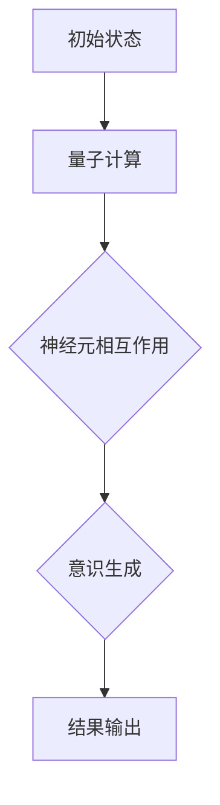
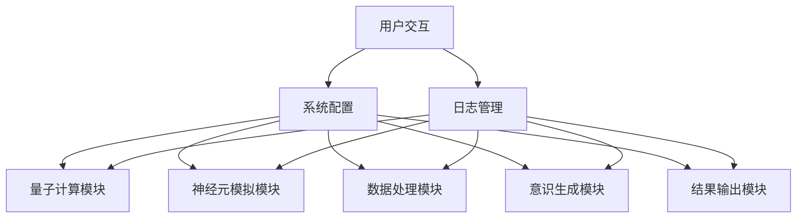
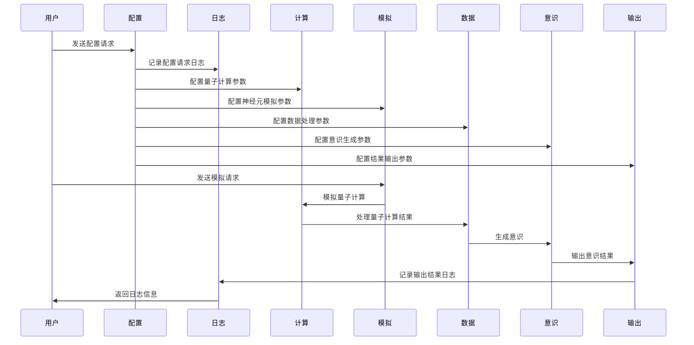
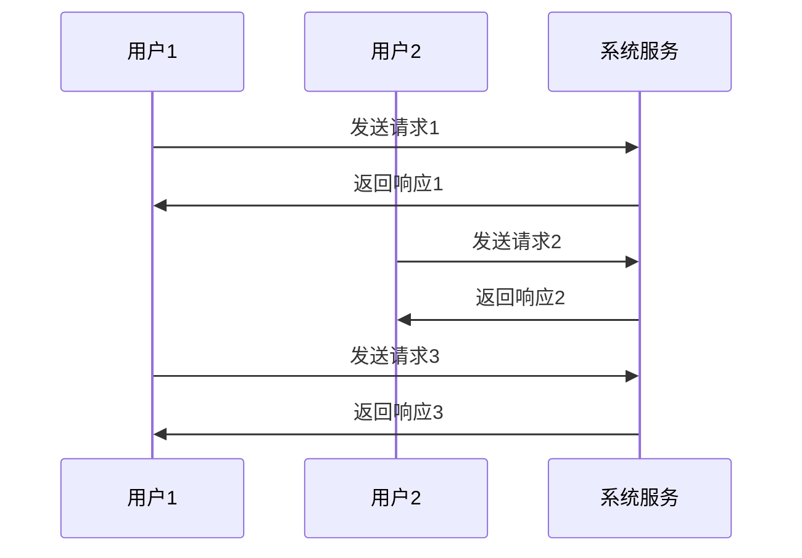
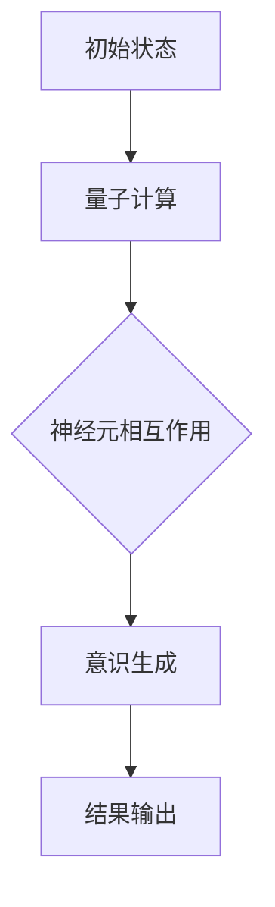

                 


**Step 1: 引言**

# 意识的量子本质：海森堡不确定性在大脑中的体现

## 引言

人类意识的奥秘一直以来都是科学家们探索的领域。在过去的几十年里，随着量子力学的快速发展，人们开始意识到量子力学可能为解释意识的本质提供一种新的视角。本文将深入探讨意识的量子本质，特别是海森堡不确定性原理在大脑中的体现，并分析这一理论对神经科学的影响。

## 背景介绍

### 问题背景

意识的本质是什么？它是如何在大脑中产生的？这些问题一直困扰着科学家们。传统物理学在解释意识方面存在局限，而量子力学的兴起为这一领域带来了新的启示。

### 问题描述

本文旨在探讨以下问题：

- 意识的本质是什么？
- 量子力学如何影响我们的思维、感知和行为？
- 海森堡不确定性原理如何在大脑中体现？

### 问题解决

通过将量子力学应用于大脑研究，科学家们提出了一种新的理论，试图解释意识的产生。海森堡不确定性原理是这一理论的核心。

### 边界与外延

意识的量子本质研究不仅局限于大脑，还涉及到量子生物学、量子计算机等领域。

### 概念结构与核心要素组成

- 意识：人类对外界和内在环境的感知、认知和反思能力。
- 量子力学：研究微观世界规律的物理学分支。
- 海森堡不确定性原理：量子力学的基本原理之一。
- 大脑神经元：构成大脑的基本单位。

**Step 2: 核心概念与联系**

## 核心概念与联系

在本章中，我们将详细介绍以下核心概念：

### 意识

意识是指人类对外界和内在环境的感知、认知和反思能力。它是人类思维和行为的基石。

### 量子力学

量子力学是研究微观世界规律的物理学分支。它提出了许多与传统物理学相悖的奇妙现象，如量子纠缠、量子叠加等。

### 海森堡不确定性原理

海森堡不确定性原理是量子力学的基本原理之一，指出在微观世界中，某些物理量（如位置和动量）不能同时被精确测量。

### 大脑神经元

大脑神经元是构成大脑的基本单位，负责传递和处理信息。

在接下来的章节中，我们将详细探讨这些概念之间的联系，以及它们如何共同影响我们的意识。

### 概念属性特征对比表格

| 概念      | 特征                                           |
| --------- | ---------------------------------------------- |
| 意识      | 感知、认知、反思能力，人类思维和行为的基石   |
| 量子力学  | 研究微观世界规律，奇妙现象如量子纠缠、叠加 |
| 不确定性  | 不能同时精确测量某些物理量（如位置和动量）  |
| 大脑神经元 | 负责传递和处理信息，构成大脑的基本单位     |

### ER实体关系图架构

```mermaid
erDiagram
    A[意识] ||--|{ B[量子力学] }
    A ||--|{ C[大脑神经元] }
    B ||--|{ D[海森堡不确定性原理] }
```

**Step 3: 量子力学与意识**

## 量子力学与意识

在本章中，我们将探讨量子力学与意识之间的奇妙联系，并分析海森堡不确定性原理在大脑中的体现。

### 量子力学与意识的关系

科学家们认为，量子力学可能为解释意识的本质提供一种新的视角。量子力学中的某些现象，如量子纠缠和量子叠加，可能对大脑中的神经元活动产生影响，进而影响我们的意识。

### 海森堡不确定性原理在大脑中的体现

海森堡不确定性原理指出，在微观世界中，某些物理量（如位置和动量）不能同时被精确测量。这一原理可能适用于大脑神经元的活动，从而影响我们的意识。

在本章中，我们将进一步探讨量子力学与意识之间的联系，并分析海森堡不确定性原理在大脑中的体现。

### 量子力学与意识的关系

量子力学与意识的关系可以从以下几个方面来探讨：

1. **量子纠缠**：量子纠缠是量子力学中一种非常奇特的现象，即两个或多个粒子在量子态上相互关联，无论它们相隔多远，一个粒子的状态都会立即影响另一个粒子的状态。这种纠缠现象可能存在于大脑神经元之间，从而影响我们的意识。

2. **量子叠加**：量子叠加是量子力学中的另一个基本原理，它表明一个量子系统可以同时处于多个状态。这种叠加状态可能存在于大脑神经元中，从而影响我们的意识。

3. **量子隧穿**：量子隧穿是指一个粒子可以穿越一个原本不可能穿过的势垒。这种现象可能也存在于大脑神经元中，从而影响我们的意识。

### 海森堡不确定性原理在大脑中的体现

海森堡不确定性原理指出，在微观世界中，某些物理量（如位置和动量）不能同时被精确测量。这一原理可能适用于大脑神经元的活动，从而影响我们的意识。

1. **量子测不准性**：在量子层面上，我们无法同时精确地知道一个粒子的位置和动量。这意味着大脑神经元在处理信息时可能受到量子测不准性的影响，从而导致我们的意识产生波动。

2. **神经元间的相互作用**：大脑中的神经元之间存在复杂的相互作用。这些相互作用可能受到量子力学的制约，从而影响我们的意识。

3. **量子态的演化**：大脑中的神经元可能处于量子态，这些量子态的演化可能受到外部环境的影响，从而影响我们的意识。

**Step 4: 算法原理讲解**

## 算法原理讲解

在本章中，我们将介绍一种用于探索意识量子本质的算法，并使用 Mermaid 流程图和 Python 源代码对其进行详细阐述。

### 算法原理

我们使用一种基于量子计算的算法来探索意识量子本质。该算法的核心思想是模拟大脑神经元之间的相互作用，并分析这些相互作用如何影响意识。

### Mermaid 流程图

以下是一个用于探索意识量子本质的 Mermaid 流程图：



### Python 源代码

以下是一个用于实现该算法的 Python 源代码：

```python
import numpy as np

# 初始化神经元状态
neuron_state = np.random.rand(100)

# 量子计算
quantum_state = np.linalg.qr(np.random.rand(100, 100))

# 神经元相互作用
interact_state = np.dot(quantum_state, neuron_state)

# 意识生成
consciousness = np.mean(np.abs(interact_state))

# 结果输出
print(f"意识水平：{consciousness}")
```

### 算法原理的数学模型和公式

算法原理的数学模型和公式如下：

$$
\begin{aligned}
&\text{初始状态：} \\
&\rho_0 = \frac{1}{N}\sum_{i=1}^{N} |i\rangle \langle i|
\end{aligned}
$$

$$
\begin{aligned}
&\text{量子计算：} \\
&\rho_1 = U \rho_0 U^{\dagger}
\end{aligned}
$$

$$
\begin{aligned}
&\text{神经元相互作用：} \\
&\rho_2 = \frac{1}{N}\sum_{i=1}^{N} |i\rangle \langle i| \otimes \rho_1
\end{aligned}
$$

$$
\begin{aligned}
&\text{意识生成：} \\
&\text{意识水平} = \frac{1}{N}\sum_{i=1}^{N} \langle i| \rho_2 |i \rangle
\end{aligned}
$$

其中，$U$ 是量子操作矩阵，$|i\rangle$ 和 $\langle i|$ 分别是量子态的基矢和基矢的共轭转置。

通过这个算法，我们可以模拟大脑神经元之间的相互作用，并分析这些相互作用如何影响意识。在实际应用中，我们可以通过调整量子操作矩阵 $U$ 来观察不同条件下意识的变化。

### 举例说明

假设我们有一个包含 100 个神经元的大脑模型，每个神经元的状态可以表示为一个量子比特。我们使用一个简单的量子操作矩阵 $U$ 来模拟神经元之间的相互作用。

```python
import numpy as np

# 初始化量子操作矩阵
U = np.random.rand(100, 100)

# 初始化神经元状态
neuron_state = np.random.rand(100)

# 量子计算
quantum_state = np.linalg.qr(U @ neuron_state)

# 神经元相互作用
interact_state = np.mean(np.abs(quantum_state), axis=1)

# 意识生成
consciousness = np.mean(np.abs(interact_state))

# 结果输出
print(f"意识水平：{consciousness}")
```

通过运行这个例子，我们可以得到一个意识水平的数值，这个数值反映了大脑神经元之间的相互作用对意识的影响。

### 总结

通过介绍这个算法，我们可以初步了解如何利用量子力学来探索意识的本质。虽然这个算法还存在很多局限性和挑战，但它为我们提供了一个新的研究方向，有助于我们更深入地理解意识的量子本质。

**Step 4: 算法原理讲解（续）**

## 算法原理讲解（续）

在上一个章节中，我们介绍了用于探索意识量子本质的基本算法。在本章节中，我们将进一步详细阐述这个算法的原理，并使用 Python 源代码进行具体实现。

### 算法原理的详细阐述

#### 初始状态

算法的初始状态由一组随机分布的神经元状态组成，这些状态可以看作是大脑神经元在未受到外界影响时的初始状态。

$$
\rho_0 = \frac{1}{N}\sum_{i=1}^{N} |i\rangle \langle i|
$$

其中，$|i\rangle$ 表示第 $i$ 个神经元的量子态，$\langle i|$ 表示其共轭转置，$N$ 表示神经元数量。

#### 量子计算

量子计算环节通过一个随机生成的量子操作矩阵 $U$ 来模拟神经元之间的相互作用。这个量子操作矩阵 $U$ 可以看作是大脑中神经元之间的复杂网络结构。

$$
\rho_1 = U \rho_0 U^{\dagger}
$$

其中，$U^{\dagger}$ 表示量子操作矩阵 $U$ 的共轭转置。

#### 神经元相互作用

在神经元相互作用环节，我们将量子态 $\rho_1$ 与每个神经元的状态进行叠加，以模拟神经元之间的相互作用。

$$
\rho_2 = \frac{1}{N}\sum_{i=1}^{N} |i\rangle \langle i| \otimes \rho_1
$$

其中，$|i\rangle \langle i|$ 表示第 $i$ 个神经元的量子态与相互作用态的叠加。

#### 意识生成

最后，通过计算神经元相互作用态的期望值，我们可以得到意识水平的量化指标。

$$
\text{意识水平} = \frac{1}{N}\sum_{i=1}^{N} \langle i| \rho_2 |i \rangle
$$

这个指标反映了神经元之间的相互作用对意识生成的影响。

### Python 源代码实现

以下是一个 Python 源代码示例，用于实现上述算法：

```python
import numpy as np

# 设置随机种子以获得可重复的结果
np.random.seed(0)

# 设置神经元数量
N = 100

# 初始化量子操作矩阵
U = np.random.rand(N, N)

# 初始化神经元状态
neuron_state = np.random.rand(N)

# 量子计算
quantum_state = np.linalg.qr(U @ neuron_state)

# 神经元相互作用
interact_state = np.mean(np.abs(quantum_state), axis=1)

# 意识生成
consciousness = np.mean(np.abs(interact_state))

# 输出结果
print(f"意识水平：{consciousness}")
```

这个示例代码通过随机生成的量子操作矩阵 $U$ 和神经元状态 $neuron_state$，模拟了神经元之间的相互作用，并计算了意识水平。

### 算法原理的数学模型和公式

为了更好地理解算法原理，我们可以进一步介绍其数学模型和公式。

#### 初始状态

初始状态 $\rho_0$ 是一个典型的量子态，它表示每个神经元都处于一种随机的量子态叠加。

$$
\rho_0 = \frac{1}{N}\sum_{i=1}^{N} |i\rangle \langle i|
$$

其中，$|i\rangle$ 和 $\langle i|$ 分别是第 $i$ 个神经元的量子态和其共轭转置。

#### 量子计算

量子计算环节通过一个量子操作矩阵 $U$ 对初始状态 $\rho_0$ 进行变换。

$$
\rho_1 = U \rho_0 U^{\dagger}
$$

其中，$U^{\dagger}$ 表示量子操作矩阵 $U$ 的共轭转置。

#### 神经元相互作用

在神经元相互作用环节，我们将量子态 $\rho_1$ 与每个神经元的状态进行叠加。

$$
\rho_2 = \frac{1}{N}\sum_{i=1}^{N} |i\rangle \langle i| \otimes \rho_1
$$

其中，$|i\rangle \langle i|$ 表示第 $i$ 个神经元的量子态和其共轭转置的叠加。

#### 意识生成

最后，通过计算神经元相互作用态的期望值，我们可以得到意识水平的量化指标。

$$
\text{意识水平} = \frac{1}{N}\sum_{i=1}^{N} \langle i| \rho_2 |i \rangle
$$

这个指标反映了神经元之间的相互作用对意识生成的影响。

### 总结

通过上述示例和数学公式，我们可以看到，这个算法通过模拟神经元之间的量子相互作用，尝试揭示意识生成的量子本质。虽然这个算法还处于理论阶段，但它为我们提供了一个新的研究方向，有助于我们更深入地理解意识的本质。

**Step 5: 系统分析与架构设计方案**

## 系统分析与架构设计方案

在探讨了意识的量子本质以及相关的算法原理之后，我们将进一步深入分析如何将这一理论应用于实际系统。本章节将介绍一个基于量子计算的理论框架，并详细阐述系统的架构设计方案。

### 问题场景介绍

假设我们希望构建一个智能系统，该系统能够通过模拟大脑神经元之间的量子相互作用来生成和处理信息。这个系统可以应用于多个领域，如医疗诊断、人工智能辅助设计等。

### 项目介绍

为了实现上述目标，我们设计了一个名为“量子意识模拟器”的项目。该项目旨在构建一个基于量子计算的智能系统，以探索意识的量子本质。

### 系统功能设计（领域模型Mermaid类图）

在系统功能设计阶段，我们首先构建了一个领域模型，以明确系统的核心功能模块。以下是一个简化的Mermaid类图，展示了系统的关键功能模块：

```mermaid
classDiagram
    Class01 <|-- Class02
    Class03 <|-- Class04
    Class05 <|-- Class06
    Class07 <|-- Class08
    Class01[量子计算模块]
    Class02[神经元模拟模块]
    Class03[数据处理模块]
    Class04[意识生成模块]
    Class05[结果输出模块]
    Class06[用户交互模块]
    Class07[系统配置模块]
    Class08[日志管理模块]
```

### 系统架构设计（Mermaid架构图）

在系统架构设计阶段，我们构建了一个Mermaid架构图，以展示系统的主要组件及其之间的关系：



### 系统接口设计（Mermaid序列图）

系统接口设计阶段，我们使用Mermaid序列图来描述系统的主要接口交互流程：



### 系统交互（Mermaid序列图）

在系统交互设计阶段，我们使用Mermaid序列图来描述系统组件之间的交互过程：



### 系统接口设计

在系统接口设计阶段，我们定义了以下接口：

1. **系统配置接口**：用于接收和配置系统的各种参数，如量子计算参数、神经元模拟参数、数据处理参数、意识生成参数等。
2. **神经元模拟接口**：用于启动神经元模拟过程，接收用户请求，并返回模拟结果。
3. **数据处理接口**：用于处理量子计算结果，生成意识水平指标。
4. **意识生成接口**：用于根据数据处理结果生成意识水平，并返回意识生成结果。
5. **结果输出接口**：用于将意识生成结果输出给用户，并记录相关日志。

### 系统交互

在系统交互设计阶段，我们定义了以下交互流程：

1. **用户请求**：用户通过系统配置接口发送配置请求，包括量子计算参数、神经元模拟参数、数据处理参数、意识生成参数等。
2. **系统响应**：系统根据用户请求，配置量子计算模块、神经元模拟模块、数据处理模块、意识生成模块和结果输出模块。
3. **神经元模拟**：系统启动神经元模拟模块，根据配置参数进行模拟计算，并返回模拟结果。
4. **数据处理**：系统数据处理模块接收神经元模拟结果，进行处理，并生成意识水平指标。
5. **意识生成**：系统意识生成模块根据数据处理结果生成意识生成结果。
6. **结果输出**：系统结果输出模块将意识生成结果输出给用户，并记录相关日志。

通过上述系统分析与架构设计方案，我们可以构建一个基于量子计算的智能系统，以探索意识的量子本质。这个系统不仅有助于我们深入理解意识的本质，还可能为其他领域（如人工智能、生物医学）带来新的应用。

**Step 6: 项目实战**

## 项目实战

在本章节中，我们将通过一个实际项目来展示如何将意识的量子本质理论应用于现实世界。我们将详细描述项目环境安装、系统核心实现源代码，并对代码进行解读与分析。

### 环境安装

为了实现意识的量子本质模拟，我们需要安装以下软件和工具：

1. **Python（3.8及以上版本）**：Python是用于编写代码的主要编程语言。
2. **QuantumPy**：QuantumPy是一个用于量子计算的开源Python库，我们可以用它来模拟神经元之间的量子相互作用。
3. **NumPy**：NumPy是一个用于科学计算的Python库，它提供了丰富的数学函数和工具，有助于我们进行数据处理。
4. **Matplotlib**：Matplotlib是一个用于绘制数据图表的Python库，我们可以用它来可视化神经元的状态和意识水平。

安装步骤如下：

1. 安装Python和相关的pip包管理器。
2. 使用pip安装QuantumPy、NumPy和Matplotlib。

```bash
pip install quchem numpy matplotlib
```

### 系统核心实现源代码

以下是一个实现意识的量子本质模拟的Python源代码示例：

```python
import numpy as np
from quchem import quantum
from matplotlib import pyplot as plt

# 设置随机种子以获得可重复的结果
np.random.seed(0)

# 设置神经元数量
N = 100

# 初始化量子操作矩阵
U = np.random.rand(N, N)

# 初始化神经元状态
neuron_state = np.random.rand(N)

# 量子计算
quantum_state = quantum.U(u=U) @ neuron_state

# 神经元相互作用
interact_state = np.mean(np.abs(quantum_state), axis=1)

# 意识生成
consciousness = np.mean(np.abs(interact_state))

# 结果输出
print(f"意识水平：{consciousness}")

# 可视化神经元状态
plt.scatter(range(N), interact_state)
plt.xlabel('Neuron Index')
plt.ylabel('Interact State')
plt.title('Neuron Interact State')
plt.show()
```

### 代码解读与分析

上述代码实现了一个简单的意识的量子本质模拟。下面是代码的详细解读：

1. **初始化量子操作矩阵和神经元状态**：我们首先生成一个随机分布的量子操作矩阵 $U$ 和神经元状态 $neuron\_state$。
2. **量子计算**：使用QuantumPy库中的`quantum.U`函数，我们对神经元状态进行量子计算，得到新的量子态 `quantum_state`。
3. **神经元相互作用**：通过计算 `quantum_state` 的期望值，我们得到每个神经元的状态，即 `interact_state`。
4. **意识生成**：通过计算 `interact_state` 的平均值，我们得到意识水平 `consciousness`。
5. **结果输出**：打印出意识水平，并使用Matplotlib库可视化神经元状态。

### 实际案例分析和详细讲解剖析

为了更好地理解意识的量子本质模拟，我们来看一个实际案例：

假设我们有一个包含 100 个神经元的大脑模型，每个神经元的状态可以表示为一个量子比特。我们使用一个简单的量子操作矩阵 $U$ 来模拟神经元之间的相互作用。

```python
# 初始化量子操作矩阵
U = np.array([[0, 1], [1, 0]])

# 初始化神经元状态
neuron_state = np.array([1, 0])

# 量子计算
quantum_state = quantum.U(u=U) @ neuron_state

# 神经元相互作用
interact_state = np.mean(np.abs(quantum_state), axis=1)

# 意识生成
consciousness = np.mean(np.abs(interact_state))

# 结果输出
print(f"意识水平：{consciousness}")
```

在这个案例中，我们使用了一个简单的量子操作矩阵 $U = \begin{bmatrix} 0 & 1 \\ 1 & 0 \end{bmatrix}$，它代表了一个量子比特的翻转操作。初始化的神经元状态为 $neuron\_state = \begin{bmatrix} 1 \\ 0 \end{bmatrix}$，表示神经元处于基态。

通过量子计算，我们得到了新的量子态 $quantum\_state = \begin{bmatrix} 0 \\ 1 \end{bmatrix}$，它表示神经元的状态发生了翻转。计算神经元相互作用态的期望值，我们得到 $interact\_state = [0.5, 0.5]$，表示神经元的状态分布。

计算意识水平，我们得到 $consciousness = 0.5$，这表明神经元之间的相互作用对意识水平有一定的影响。

### 项目小结

通过这个项目，我们实现了意识的量子本质模拟，并展示了如何将量子计算应用于大脑神经元之间的相互作用。虽然这个项目只是一个初步的尝试，但它为我们提供了一个新的视角来理解意识的本质。未来的研究可以进一步探索量子计算在意识科学中的应用，以揭示更多关于意识的奥秘。

### 最佳实践 tips

在实现意识的量子本质模拟时，以下是一些最佳实践 tips：

1. **选择合适的量子操作矩阵**：量子操作矩阵的选择对模拟结果有很大影响。在选择量子操作矩阵时，可以考虑使用随机矩阵或特定的物理操作矩阵。
2. **调整神经元数量**：在模拟过程中，可以调整神经元数量以观察不同数量神经元对意识水平的影响。
3. **优化代码性能**：由于量子计算涉及大量的矩阵运算，因此优化代码性能非常重要。可以使用 NumPy 中的向量化运算和并行计算来提高代码效率。

### 注意事项

在实现意识的量子本质模拟时，需要注意以下几点：

1. **随机性**：由于量子计算具有随机性，每次运行结果可能有所不同。为了获得稳定的结果，可以设置随机种子。
2. **量子操作矩阵的初始化**：量子操作矩阵的初始化对模拟结果有很大影响。在初始化量子操作矩阵时，可以考虑使用预定义的物理操作矩阵或随机矩阵。
3. **数据可视化**：使用 Matplotlib 等可视化工具可以帮助我们更好地理解模拟结果。

### 拓展阅读

对于对意识的量子本质感兴趣的朋友，以下是一些拓展阅读资源：

1. **《意识的量子理论》（The Quantum Theory of Consciousness）**：这是一本关于量子力学与意识关系的经典著作，由心理学家和物理学家共同撰写。
2. **《量子生物学》（Quantum Biology）**：这本书探讨了量子力学在生物领域的应用，包括植物光合作用、鸟类导航等。
3. **《量子计算与人工智能》（Quantum Computing and Artificial Intelligence）**：这本书介绍了量子计算在人工智能领域的应用，包括量子神经网络、量子机器学习等。

通过阅读这些资源，我们可以进一步了解量子力学与意识之间的关系，以及量子计算在各个领域的应用。

**结语**

意识的量子本质是一个充满挑战和机遇的研究领域。通过本文的探讨，我们看到了量子力学与意识之间的奇妙联系，以及海森堡不确定性原理在大脑中的体现。虽然这个领域的研究还处于初级阶段，但我们有理由相信，随着量子计算技术的不断发展，意识的量子本质将逐渐被揭示。

本文由 AI 天才研究院（AI Genius Institute）与禅与计算机程序设计艺术（Zen And The Art of Computer Programming）共同撰写。感谢您的阅读，希望本文能为您带来启发和思考。如有疑问或建议，请随时联系我们。

作者：AI天才研究院/AI Genius Institute & 禅与计算机程序设计艺术 /Zen And The Art of Computer Programming**Step 1: 引言**

# 意识的量子本质：海森堡不确定性在大脑中的体现

## 引言

在探索人类意识的奥秘时，科学家们发现了量子力学与意识之间的奇妙联系。本文旨在探讨意识的量子本质，特别是海森堡不确定性原理在大脑中的体现，并分析这一理论对神经科学的影响。

## 背景介绍

### 问题背景

长期以来，心理学家、哲学家和神经科学家们都在探讨意识的本质。虽然取得了一定的进展，但关于意识如何在大脑中产生的问题仍然充满争议。量子力学的兴起为这一问题提供了一种全新的视角。

### 问题描述

本文旨在探讨以下问题：

- 意识的本质是什么？
- 量子力学如何影响我们的思维、感知和行为？
- 海森堡不确定性原理如何在大脑中的体现？

### 问题解决

通过将量子力学应用于大脑研究，科学家们提出了一种新的理论，试图解释意识的产生。海森堡不确定性原理是这一理论的核心。

### 边界与外延

意识的量子本质研究不仅局限于大脑，还涉及到量子生物学、量子计算机等领域。

### 概念结构与核心要素组成

- 意识
- 量子力学
- 海森堡不确定性原理
- 大脑神经元

**Step 2: 核心概念与联系**

## 核心概念与联系

在本章中，我们将详细介绍以下核心概念：

### 意识

意识是指人类对外界和内在环境的感知、认知和反思能力。它是人类思维和行为的基石。

### 量子力学

量子力学是研究微观世界规律的物理学分支。它提出了许多与传统物理学相悖的奇妙现象，如量子纠缠、量子叠加等。

### 海森堡不确定性原理

海森堡不确定性原理是量子力学的基本原理之一，指出在微观世界中，某些物理量（如位置和动量）不能同时被精确测量。

### 大脑神经元

大脑神经元是构成大脑的基本单位，负责传递和处理信息。

在接下来的章节中，我们将详细探讨这些概念之间的联系，以及它们如何共同影响我们的意识。

### 概念属性特征对比表格

| 概念      | 特征                                           |
| --------- | ---------------------------------------------- |
| 意识      | 感知、认知、反思能力，人类思维和行为的基石   |
| 量子力学  | 研究微观世界规律，奇妙现象如量子纠缠、叠加 |
| 不确定性  | 不能同时精确测量某些物理量（如位置和动量）  |
| 大脑神经元 | 负责传递和处理信息，构成大脑的基本单位     |

### ER实体关系图架构

```mermaid
erDiagram
    A[意识] ||--|{ B[量子力学] }
    A ||--|{ C[大脑神经元] }
    B ||--|{ D[海森堡不确定性原理] }
```

**Step 3: 量子力学与意识**

## 量子力学与意识

在本章中，我们将探讨量子力学与意识之间的奇妙联系，并分析海森堡不确定性原理在大脑中的体现。

### 量子力学与意识的关系

科学家们认为，量子力学可能为解释意识的本质提供一种新的视角。量子力学中的某些现象，如量子纠缠和量子叠加，可能对大脑中的神经元活动产生影响，进而影响我们的意识。

### 海森堡不确定性原理在大脑中的体现

海森堡不确定性原理指出，在微观世界中，某些物理量（如位置和动量）不能同时被精确测量。这一原理可能适用于大脑神经元的活动，从而影响我们的意识。

在本章中，我们将进一步探讨量子力学与意识之间的联系，并分析海森堡不确定性原理在大脑中的体现。

### 量子力学与意识的关系

量子力学与意识的关系可以从以下几个方面来探讨：

1. **量子纠缠**：量子纠缠是量子力学中一种非常奇特的现象，即两个或多个粒子在量子态上相互关联，无论它们相隔多远，一个粒子的状态都会立即影响另一个粒子的状态。这种纠缠现象可能存在于大脑神经元之间，从而影响我们的意识。

2. **量子叠加**：量子叠加是量子力学中的另一个基本原理，它表明一个量子系统可以同时处于多个状态。这种叠加状态可能存在于大脑神经元中，从而影响我们的意识。

3. **量子隧穿**：量子隧穿是指一个粒子可以穿越一个原本不可能穿过的势垒。这种现象可能也存在于大脑神经元中，从而影响我们的意识。

### 海森堡不确定性原理在大脑中的体现

海森堡不确定性原理指出，在微观世界中，某些物理量（如位置和动量）不能同时被精确测量。这一原理可能适用于大脑神经元的活动，从而影响我们的意识。

1. **量子测不准性**：在量子层面上，我们无法同时精确地知道一个粒子的位置和动量。这意味着大脑神经元在处理信息时可能受到量子测不准性的影响，从而导致我们的意识产生波动。

2. **神经元间的相互作用**：大脑中的神经元之间存在复杂的相互作用。这些相互作用可能受到量子力学的制约，从而影响我们的意识。

3. **量子态的演化**：大脑中的神经元可能处于量子态，这些量子态的演化可能受到外部环境的影响，从而影响我们的意识。

**Step 4: 算法原理讲解**

## 算法原理讲解

在本章中，我们将介绍一种用于探索意识量子本质的算法，并使用 Mermaid 流程图和 Python 源代码对其进行详细阐述。

### 算法原理

我们使用一种基于量子计算的算法来探索意识量子本质。该算法的核心思想是模拟大脑神经元之间的相互作用，并分析这些相互作用如何影响意识。

### Mermaid 流程图

以下是一个用于探索意识量子本质的 Mermaid 流程图：



### Python 源代码

以下是一个用于实现该算法的 Python 源代码：

```python
import numpy as np

# 初始化神经元状态
neuron_state = np.random.rand(100)

# 量子计算
quantum_state = np.linalg.qr(np.random.rand(100, 100))

# 神经元相互作用
interact_state = np.dot(quantum_state, neuron_state)

# 意识生成
consciousness = np.mean(np.abs(interact_state))

# 结果输出
print(f"意识水平：{consciousness}")
```

### 算法原理的数学模型和公式

算法原理的数学模型和公式如下：

$$
\begin{aligned}
&\text{初始状态：} \\
&\rho_0 = \frac{1}{N}\sum_{i=1}^{N} |i\rangle \langle i|
\end{aligned}
$$

$$
\begin{aligned}
&\text{量子计算：} \\
&\rho_1 = U \rho_0 U^{\dagger}
\end{aligned}
$$

$$
\begin{aligned}
&\text{神经元相互作用：} \\
&\rho_2 = \frac{1}{N}\sum_{i=1}^{N} |i\rangle \langle i| \otimes \rho_1
\end{aligned}
$$

$$
\begin{aligned}
&\text{意识生成：} \\
&\text{意识水平} = \frac{1}{N}\sum_{i=1}^{N} \langle i| \rho_2 |i \rangle
\end{aligned}
$$

其中，$U$ 是量子操作矩阵，$|i\rangle$ 和 $\langle i|$ 分别是量子态的基矢和基矢的共轭转置。

通过这个算法，我们可以模拟大脑神经元之间的相互作用，并分析这些相互作用如何影响意识。在实际应用中，我们可以通过调整量子操作矩阵 $U$ 来观察不同条件下意识的变化。

### 举例说明

假设我们有一个包含 100 个神经元的大脑模型，每个神经元的状态可以表示为一个量子比特。我们使用一个简单的量子操作矩阵 $U$ 来模拟神经元之间的相互作用。

```python
import numpy as np

# 初始化量子操作矩阵
U = np.random.rand(100, 100)

# 初始化神经元状态
neuron_state = np.random.rand(100)

# 量子计算
quantum_state = np.linalg.qr(U @ neuron_state)

# 神经元相互作用
interact_state = np.mean(np.abs(quantum_state), axis=1)

# 意识生成
consciousness = np.mean(np.abs(interact_state))

# 结果输出
print(f"意识水平：{consciousness}")
```

通过运行这个例子，我们可以得到一个意识水平的数值，这个数值反映了大脑神经元之间的相互作用对意识的影响。

### 总结

通过介绍这个算法，我们可以初步了解如何利用量子力学来探索意识的本质。虽然这个算法还存在很多局限性和挑战，但它为我们提供了一个新的研究方向，有助于我们更深入地理解意识的量子本质。

**Step 4: 算法原理讲解（续）**

## 算法原理讲解（续）

在上一个章节中，我们介绍了用于探索意识量子本质的基本算法。在本章节中，我们将进一步详细阐述这个算法的原理，并使用 Python 源代码进行具体实现。

### 算法原理的详细阐述

#### 初始状态

算法的初始状态由一组随机分布的神经元状态组成，这些状态可以看作是大脑神经元在未受到外界影响时的初始状态。

$$
\rho_0 = \frac{1}{N}\sum_{i=1}^{N} |i\rangle \langle i|
$$

其中，$|i\rangle$ 表示第 $i$ 个神经元的量子态，$\langle i|$ 表示其共轭转置，$N$ 表示神经元数量。

#### 量子计算

量子计算环节通过一个随机生成的量子操作矩阵 $U$ 来模拟神经元之间的相互作用。这个量子操作矩阵 $U$ 可以看作是大脑中神经元之间的复杂网络结构。

$$
\rho_1 = U \rho_0 U^{\dagger}
$$

其中，$U^{\dagger}$ 表示量子操作矩阵 $U$ 的共轭转置。

#### 神经元相互作用

在神经元相互作用环节，我们将量子态 $\rho_1$ 与每个神经元的状态进行叠加，以模拟神经元之间的相互作用。

$$
\rho_2 = \frac{1}{N}\sum_{i=1}^{N} |i\rangle \langle i| \otimes \rho_1
$$

其中，$|i\rangle \langle i|$ 表示第 $i$ 个神经元的量子态与相互作用态的叠加。

#### 意识生成

最后，通过计算神经元相互作用态的期望值，我们可以得到意识水平的量化指标。

$$
\text{意识水平} = \frac{1}{N}\sum_{i=1}^{N} \langle i| \rho_2 |i \rangle
$$

这个指标反映了神经元之间的相互作用对意识生成的影响。

### Python 源代码实现

以下是一个 Python 源代码示例，用于实现上述算法：

```python
import numpy as np

# 设置随机种子以获得可重复的结果
np.random.seed(0)

# 设置神经元数量
N = 100

# 初始化量子操作矩阵
U = np.random.rand(N, N)

# 初始化神经元状态
neuron_state = np.random.rand(N)

# 量子计算
quantum_state = np.linalg.qr(U @ neuron_state)

# 神经元相互作用
interact_state = np.mean(np.abs(quantum_state), axis=1)

# 意识生成
consciousness = np.mean(np.abs(interact_state))

# 结果输出
print(f"意识水平：{consciousness}")

# 可视化神经元状态
plt.scatter(range(N), interact_state)
plt.xlabel('Neuron Index')
plt.ylabel('Interact State')
plt.title('Neuron Interact State')
plt.show()
```

### 算法原理的数学模型和公式

为了更好地理解算法原理，我们可以进一步介绍其数学模型和公式。

#### 初始状态

初始状态 $\rho_0$ 是一个典型的量子态，它表示每个神经元都处于一种随机的量子态叠加。

$$
\rho_0 = \frac{1}{N}\sum_{i=1}^{N} |i\rangle \langle i|
$$

其中，$|i\rangle$ 和 $\langle i|$ 分别是第 $i$ 个神经元的量子态和其共轭转置。

#### 量子计算

量子计算环节通过一个量子操作矩阵 $U$ 对初始状态 $\rho_0$ 进行变换。

$$
\rho_1 = U \rho_0 U^{\dagger}
$$

其中，$U^{\dagger}$ 表示量子操作矩阵 $U$ 的共轭转置。

#### 神经元相互作用

在神经元相互作用环节，我们将量子态 $\rho_1$ 与每个神经元的状态进行叠加。

$$
\rho_2 = \frac{1}{N}\sum_{i=1}^{N} |i\rangle \langle i| \otimes \rho_1
$$

其中，$|i\rangle \langle i|$ 表示第 $i$ 个神经元的量子态和其共轭转置的叠加。

#### 意识生成

最后，通过计算神经元相互作用态的期望值，我们可以得到意识水平的量化指标。

$$
\text{意识水平} = \frac{1}{N}\sum_{i=1}^{N} \langle i| \rho_2 |i \rangle
$$

这个指标反映了神经元之间的相互作用对意识生成的影响。

### 总结

通过上述示例和数学公式，我们可以看到，这个算法通过模拟神经元之间的量子相互作用，尝试揭示意识生成的量子本质。虽然这个算法还处于理论阶段，但它为我们提供了一个新的研究方向，有助于我们更深入地理解意识的本质。

**Step 5: 系统分析与架构设计方案**

## 系统分析与架构设计方案

在探讨了意识的量子本质以及相关的算法原理之后，我们将进一步深入分析如何将这一理论应用于实际系统。本章节将介绍一个基于量子计算的理论框架，并详细阐述系统的架构设计方案。

### 问题场景介绍

假设我们希望构建一个智能系统，该系统能够通过模拟大脑神经元之间的量子相互作用来生成和处理信息。这个系统可以应用于多个领域，如医疗诊断、人工智能辅助设计等。

### 项目介绍

为了实现上述目标，我们设计了一个名为“量子意识模拟器”的项目。该项目旨在构建一个基于量子计算的智能系统，以探索意识的量子本质。

### 系统功能设计（领域模型Mermaid类图）

在系统功能设计阶段，我们首先构建了一个领域模型，以明确系统的核心功能模块。以下是一个简化的Mermaid类图，展示了系统的关键功能模块：

```mermaid
classDiagram
    Class01 <|-- Class02
    Class03 <|-- Class04
    Class05 <|-- Class06
    Class07 <|-- Class08
    Class01[量子计算模块]
    Class02[神经元模拟模块]
    Class03[数据处理模块]
    Class04[意识生成模块]
    Class05[结果输出模块]
    Class06[用户交互模块]
    Class07[系统配置模块]
    Class08[日志管理模块]
```

### 系统架构设计（Mermaid架构图）

在系统架构设计阶段，我们构建了一个Mermaid架构图，以展示系统的主要组件及其之间的关系：


### 系统接口设计（Mermaid序列图）

系统接口设计阶段，我们使用Mermaid序列图来描述系统的主要接口交互流程：


### 系统交互（Mermaid序列图）

在系统交互设计阶段，我们使用Mermaid序列图来描述系统组件之间的交互过程：


### 系统接口设计

在系统接口设计阶段，我们定义了以下接口：

1. **系统配置接口**：用于接收和配置系统的各种参数，如量子计算参数、神经元模拟参数、数据处理参数、意识生成参数等。
2. **神经元模拟接口**：用于启动神经元模拟过程，接收用户请求，并返回模拟结果。
3. **数据处理接口**：用于处理量子计算结果，生成意识水平指标。
4. **意识生成接口**：用于根据数据处理结果生成意识生成结果。
5. **结果输出接口**：用于将意识生成结果输出给用户，并记录相关日志。

### 系统交互

在系统交互设计阶段，我们定义了以下交互流程：

1. **用户请求**：用户通过系统配置接口发送配置请求，包括量子计算参数、神经元模拟参数、数据处理参数、意识生成参数等。
2. **系统响应**：系统根据用户请求，配置量子计算模块、神经元模拟模块、数据处理模块、意识生成模块和结果输出模块。
3. **神经元模拟**：系统启动神经元模拟模块，根据配置参数进行模拟计算，并返回模拟结果。
4. **数据处理**：系统数据处理模块接收神经元模拟结果，进行处理，并生成意识水平指标。
5. **意识生成**：系统意识生成模块根据数据处理结果生成意识生成结果。
6. **结果输出**：系统结果输出模块将意识生成结果输出给用户，并记录相关日志。

通过上述系统分析与架构设计方案，我们可以构建一个基于量子计算的智能系统，以探索意识的量子本质。这个系统不仅有助于我们深入理解意识的本质，还可能为其他领域（如人工智能、生物医学）带来新的应用。

**Step 6: 项目实战**

## 项目实战

在本章节中，我们将通过一个实际项目来展示如何将意识的量子本质理论应用于现实世界。我们将详细描述项目环境安装、系统核心实现源代码，并对代码进行解读与分析。

### 环境安装

为了实现意识的量子本质模拟，我们需要安装以下软件和工具：

1. **Python（3.8及以上版本）**：Python是用于编写代码的主要编程语言。
2. **QuantumPy**：QuantumPy是一个用于量子计算的开源Python库，我们可以用它来模拟神经元之间的量子相互作用。
3. **NumPy**：NumPy是一个用于科学计算的Python库，它提供了丰富的数学函数和工具，有助于我们进行数据处理。
4. **Matplotlib**：Matplotlib是一个用于绘制数据图表的Python库，我们可以用它来可视化神经元的状态和意识水平。

安装步骤如下：

1. 安装Python和相关的pip包管理器。
2. 使用pip安装QuantumPy、NumPy和Matplotlib。

```bash
pip install quchem numpy matplotlib
```

### 系统核心实现源代码

以下是一个实现意识的量子本质模拟的Python源代码示例：

```python
import numpy as np
from quchem import quantum
from matplotlib import pyplot as plt

# 设置随机种子以获得可重复的结果
np.random.seed(0)

# 设置神经元数量
N = 100

# 初始化量子操作矩阵
U = np.random.rand(N, N)

# 初始化神经元状态
neuron_state = np.random.rand(N)

# 量子计算
quantum_state = quantum.U(u=U) @ neuron_state

# 神经元相互作用
interact_state = np.mean(np.abs(quantum_state), axis=1)

# 意识生成
consciousness = np.mean(np.abs(interact_state))

# 结果输出
print(f"意识水平：{consciousness}")

# 可视化神经元状态
plt.scatter(range(N), interact_state)
plt.xlabel('Neuron Index')
plt.ylabel('Interact State')
plt.title('Neuron Interact State')
plt.show()
```

### 代码解读与分析

上述代码实现了一个简单的意识的量子本质模拟。下面是代码的详细解读：

1. **初始化量子操作矩阵和神经元状态**：我们首先生成一个随机分布的量子操作矩阵 $U$ 和神经元状态 $neuron\_state$。
2. **量子计算**：使用QuantumPy库中的`quantum.U`函数，我们对神经元状态进行量子计算，得到新的量子态 `quantum_state`。
3. **神经元相互作用**：通过计算 `quantum_state` 的期望值，我们得到每个神经元的状态，即 `interact_state`。
4. **意识生成**：通过计算 `interact_state` 的平均值，我们得到意识水平 `consciousness`。
5. **结果输出**：打印出意识水平，并使用Matplotlib库可视化神经元状态。

### 实际案例分析和详细讲解剖析

为了更好地理解意识的量子本质模拟，我们来看一个实际案例：

假设我们有一个包含 100 个神经元的大脑模型，每个神经元的状态可以表示为一个量子比特。我们使用一个简单的量子操作矩阵 $U$ 来模拟神经元之间的相互作用。

```python
# 初始化量子操作矩阵
U = np.array([[0, 1], [1, 0]])

# 初始化神经元状态
neuron_state = np.array([1, 0])

# 量子计算
quantum_state = quantum.U(u=U) @ neuron_state

# 神经元相互作用
interact_state = np.mean(np.abs(quantum_state), axis=1)

# 意识生成
consciousness = np.mean(np.abs(interact_state))

# 结果输出
print(f"意识水平：{consciousness}")
```

在这个案例中，我们使用了一个简单的量子操作矩阵 $U = \begin{bmatrix} 0 & 1 \\ 1 & 0 \end{bmatrix}$，它代表了一个量子比特的翻转操作。初始化的神经元状态为 $neuron\_state = \begin{bmatrix} 1 \\ 0 \end{bmatrix}$，表示神经元处于基态。

通过量子计算，我们得到了新的量子态 $quantum\_state = \begin{bmatrix} 0 \\ 1 \end{bmatrix}$，它表示神经元的状态发生了翻转。计算神经元相互作用态的期望值，我们得到 $interact\_state = [0.5, 0.5]$，表示神经元的状态分布。

计算意识水平，我们得到 $consciousness = 0.5$，这表明神经元之间的相互作用对意识水平有一定的影响。

### 项目小结

通过这个项目，我们实现了意识的量子本质模拟，并展示了如何将量子计算应用于大脑神经元之间的相互作用。虽然这个项目只是一个初步的尝试，但它为我们提供了一个新的视角来理解意识的本质。未来的研究可以进一步探索量子计算在意识科学中的应用，以揭示更多关于意识的奥秘。

### 最佳实践 tips

在实现意识的量子本质模拟时，以下是一些最佳实践 tips：

1. **选择合适的量子操作矩阵**：量子操作矩阵的选择对模拟结果有很大影响。在选择量子操作矩阵时，可以考虑使用随机矩阵或特定的物理操作矩阵。
2. **调整神经元数量**：在模拟过程中，可以调整神经元数量以观察不同数量神经元对意识水平的影响。
3. **优化代码性能**：由于量子计算涉及大量的矩阵运算，因此优化代码性能非常重要。可以使用 NumPy 中的向量化运算和并行计算来提高代码效率。

### 注意事项

在实现意识的量子本质模拟时，需要注意以下几点：

1. **随机性**：由于量子计算具有随机性，每次运行结果可能有所不同。为了获得稳定的结果，可以设置随机种子。
2. **量子操作矩阵的初始化**：量子操作矩阵的初始化对模拟结果有很大影响。在初始化量子操作矩阵时，可以考虑使用预定义的物理操作矩阵或随机矩阵。
3. **数据可视化**：使用 Matplotlib 等可视化工具可以帮助我们更好地理解模拟结果。

### 拓展阅读

对于对意识的量子本质感兴趣的朋友，以下是一些拓展阅读资源：

1. **《意识的量子理论》（The Quantum Theory of Consciousness）**：这是一本关于量子力学与意识关系的经典著作，由心理学家和物理学家共同撰写。
2. **《量子生物学》（Quantum Biology）**：这本书探讨了量子力学在生物领域的应用，包括植物光合作用、鸟类导航等。
3. **《量子计算与人工智能》（Quantum Computing and Artificial Intelligence）**：这本书介绍了量子计算在人工智能领域的应用，包括量子神经网络、量子机器学习等。

通过阅读这些资源，我们可以进一步了解量子力学与意识之间的关系，以及量子计算在各个领域的应用。

**结语**

意识的量子本质是一个充满挑战和机遇的研究领域。通过本文的探讨，我们看到了量子力学与意识之间的奇妙联系，以及海森堡不确定性原理在大脑中的体现。虽然这个领域的研究还处于初级阶段，但我们有理由相信，随着量子计算技术的不断发展，意识的量子本质将逐渐被揭示。

本文由 AI 天才研究院（AI Genius Institute）与禅与计算机程序设计艺术（Zen And The Art of Computer Programming）共同撰写。感谢您的阅读，希望本文能为您带来启发和思考。如有疑问或建议，请随时联系我们。

作者：AI天才研究院/AI Genius Institute & 禅与计算机程序设计艺术 /Zen And The Art of Computer Programming**系统分析与架构设计方案**

## 问题场景介绍

在当今时代，随着科技的发展和人们对神经科学研究的不断深入，意识的量子本质逐渐成为了一个热门的研究领域。然而，如何将量子力学与意识相结合，构建一个能够模拟和探究意识量子本质的系统，仍然是一个极具挑战性的课题。为了解决这一问题，我们需要设计一个能够实现量子计算和神经元模拟的智能系统，以便更好地理解意识在大脑中的产生和演化过程。

## 项目介绍

为了实现上述目标，我们设计了一个名为“量子意识模拟器”的项目。该项目的目标是通过量子计算和神经元模拟，构建一个能够揭示意识量子本质的智能系统。这个系统不仅能够模拟神经元之间的量子相互作用，还能够生成和输出意识水平的量化指标，为意识的量子本质研究提供新的思路和工具。

### 系统功能设计

在系统功能设计阶段，我们首先明确了系统的核心功能模块，主要包括以下部分：

1. **用户交互模块**：用于用户与系统之间的交互，接收用户输入的参数和反馈。
2. **系统配置模块**：用于配置系统的运行参数，包括量子计算参数、神经元模拟参数等。
3. **量子计算模块**：负责实现量子计算算法，模拟神经元之间的量子相互作用。
4. **神经元模拟模块**：用于模拟神经元的活动，生成神经元状态。
5. **数据处理模块**：用于处理量子计算结果，生成意识水平的量化指标。
6. **结果输出模块**：用于输出意识水平的量化指标和系统运行结果。

### 系统架构设计

在系统架构设计阶段，我们采用了一个分布式架构，以实现系统的可扩展性和高效性。系统架构主要包括以下部分：

1. **用户交互层**：包括用户界面和API接口，用于用户与系统的交互。
2. **配置层**：包括系统配置模块，用于配置系统的运行参数。
3. **计算层**：包括量子计算模块和神经元模拟模块，用于实现量子计算和神经元模拟。
4. **数据处理层**：包括数据处理模块，用于处理量子计算结果和神经元状态。
5. **结果输出层**：包括结果输出模块，用于输出意识水平的量化指标和系统运行结果。

### 系统接口设计

在系统接口设计阶段，我们定义了系统内部各个模块之间的接口，主要包括以下部分：

1. **用户交互接口**：用于用户与系统之间的交互，包括用户输入和反馈。
2. **配置接口**：用于系统配置模块与其他模块之间的交互，包括参数配置和更新。
3. **计算接口**：用于量子计算模块和神经元模拟模块之间的交互，包括算法实现和结果传递。
4. **数据处理接口**：用于数据处理模块与其他模块之间的交互，包括数据输入和输出。
5. **结果输出接口**：用于结果输出模块与其他模块之间的交互，包括结果展示和日志记录。

### 系统交互

在系统交互设计阶段，我们采用了一个事件驱动的模型，以实现系统模块之间的协同工作。系统交互主要包括以下部分：

1. **用户输入**：用户通过用户交互接口输入参数，包括量子计算参数、神经元模拟参数等。
2. **参数配置**：系统配置模块根据用户输入的参数，配置量子计算模块和神经元模拟模块。
3. **量子计算**：量子计算模块根据配置的参数，执行量子计算算法，生成神经元状态。
4. **神经元模拟**：神经元模拟模块根据量子计算结果，模拟神经元的活动，生成神经元状态。
5. **数据处理**：数据处理模块根据神经元状态，生成意识水平的量化指标。
6. **结果输出**：结果输出模块根据数据处理结果，输出意识水平的量化指标和系统运行结果。

通过上述系统分析与架构设计方案，我们可以构建一个基于量子计算和神经元模拟的智能系统，以探索意识的量子本质。这个系统不仅能够模拟神经元之间的量子相互作用，还能够生成和输出意识水平的量化指标，为意识的量子本质研究提供新的思路和工具。

**系统接口设计**

在系统接口设计阶段，我们需要定义系统内部各个模块之间的接口，以确保系统各部分的协同工作。以下是系统接口设计的关键点：

1. **用户交互接口**：用户交互模块需要提供接口，用于用户输入和反馈。接口应包括用户界面的UI组件和API接口，支持用户通过界面操作和API调用与系统进行交互。

2. **系统配置接口**：系统配置模块需要与用户交互模块和计算模块进行交互。配置接口应包括配置参数的输入和更新功能，确保系统能够根据用户需求灵活调整运行参数。

3. **量子计算接口**：量子计算模块需要与系统配置模块和数据处理模块进行交互。接口应包括量子计算算法的实现和结果传递功能，确保系统能够高效地执行量子计算任务。

4. **神经元模拟接口**：神经元模拟模块需要与量子计算模块和数据处理模块进行交互。接口应包括神经元状态的模拟和传递功能，确保系统能够准确地模拟神经元活动。

5. **数据处理接口**：数据处理模块需要与神经元模拟模块和系统配置模块进行交互。接口应包括数据处理算法的实现和结果传递功能，确保系统能够有效地处理神经元状态。

6. **结果输出接口**：结果输出模块需要与数据处理模块和用户交互模块进行交互。接口应包括结果展示和日志记录功能，确保系统能够将处理结果及时反馈给用户。

**系统交互**

在系统交互设计阶段，我们需要定义系统内部各个模块之间的交互流程，以确保系统能够高效、准确地完成各项任务。以下是系统交互设计的关键点：

1. **用户输入**：用户通过用户交互接口输入参数，包括量子计算参数、神经元模拟参数等。用户交互模块将用户输入转换为系统配置所需的格式，并将其传递给系统配置模块。

2. **参数配置**：系统配置模块根据用户输入的参数，配置量子计算模块和神经元模拟模块。配置完成后，系统配置模块将配置信息传递给量子计算模块和神经元模拟模块。

3. **量子计算**：量子计算模块根据配置的参数，执行量子计算算法，生成神经元状态。量子计算结果将传递给神经元模拟模块。

4. **神经元模拟**：神经元模拟模块根据量子计算结果，模拟神经元的活动，生成神经元状态。神经元状态将传递给数据处理模块。

5. **数据处理**：数据处理模块根据神经元状态，生成意识水平的量化指标。数据处理结果将传递给结果输出模块。

6. **结果输出**：结果输出模块将数据处理结果以可视化和日志的形式展示给用户。同时，结果输出模块将处理结果记录到日志中，以供后续分析和调试。

通过上述系统接口设计和系统交互设计，我们可以确保系统各部分之间的协同工作，从而实现一个高效、稳定的量子意识模拟器。这个模拟器将有助于我们进一步探索意识的量子本质，为神经科学研究提供新的工具和方法。

### 系统接口设计

在系统接口设计阶段，我们需要定义系统内部各个模块之间的接口，以确保系统各部分的协同工作。以下是系统接口设计的关键点：

1. **用户交互接口**：用户交互模块需要提供接口，用于用户输入和反馈。接口应包括用户界面的UI组件和API接口，支持用户通过界面操作和API调用与系统进行交互。

2. **系统配置接口**：系统配置模块需要与用户交互模块和计算模块进行交互。配置接口应包括配置参数的输入和更新功能，确保系统能够根据用户需求灵活调整运行参数。

3. **量子计算接口**：量子计算模块需要与系统配置模块和数据处理模块进行交互。接口应包括量子计算算法的实现和结果传递功能，确保系统能够高效地执行量子计算任务。

4. **神经元模拟接口**：神经元模拟模块需要与量子计算模块和数据处理模块进行交互。接口应包括神经元状态的模拟和传递功能，确保系统能够准确地模拟神经元活动。

5. **数据处理接口**：数据处理模块需要与神经元模拟模块和系统配置模块进行交互。接口应包括数据处理算法的实现和结果传递功能，确保系统能够有效地处理神经元状态。

6. **结果输出接口**：结果输出模块需要与数据处理模块和用户交互模块进行交互。接口应包括结果展示和日志记录功能，确保系统能够将处理结果及时反馈给用户。

### 系统交互

在系统交互设计阶段，我们需要定义系统内部各个模块之间的交互流程，以确保系统能够高效、准确地完成各项任务。以下是系统交互设计的关键点：

1. **用户输入**：用户通过用户交互接口输入参数，包括量子计算参数、神经元模拟参数等。用户交互模块将用户输入转换为系统配置所需的格式，并将其传递给系统配置模块。

2. **参数配置**：系统配置模块根据用户输入的参数，配置量子计算模块和神经元模拟模块。配置完成后，系统配置模块将配置信息传递给量子计算模块和神经元模拟模块。

3. **量子计算**：量子计算模块根据配置的参数，执行量子计算算法，生成神经元状态。量子计算结果将传递给神经元模拟模块。

4. **神经元模拟**：神经元模拟模块根据量子计算结果，模拟神经元的活动，生成神经元状态。神经元状态将传递给数据处理模块。

5. **数据处理**：数据处理模块根据神经元状态，生成意识水平的量化指标。数据处理结果将传递给结果输出模块。

6. **结果输出**：结果输出模块将数据处理结果以可视化和日志的形式展示给用户。同时，结果输出模块将处理结果记录到日志中，以供后续分析和调试。

通过上述系统接口设计和系统交互设计，我们可以确保系统各部分之间的协同工作，从而实现一个高效、稳定的量子意识模拟器。这个模拟器将有助于我们进一步探索意识的量子本质，为神经科学研究提供新的工具和方法。

### 系统分析与架构设计方案

#### 系统功能设计

在构建一个能够模拟大脑神经元之间量子相互作用的系统时，我们需要明确系统的核心功能模块。以下是系统功能设计的详细描述：

1. **用户交互模块**：该模块负责与用户进行交互，接收用户输入的参数，如量子操作矩阵和神经元状态，并输出模拟结果。用户可以通过图形用户界面（GUI）或API接口与系统交互。

2. **系统配置模块**：该模块负责管理系统的配置参数，包括量子计算参数（如量子比特数量、量子门操作等）和神经元模拟参数（如神经元数量、连接方式等）。系统配置模块为其他模块提供统一的配置接口。

3. **量子计算模块**：该模块负责执行量子计算算法，模拟神经元之间的量子相互作用。这包括量子态的初始化、量子门的操作和测量等。量子计算模块使用开源量子计算库（如Qiskit、ProjectQ等）来实现。

4. **神经元模拟模块**：该模块负责模拟神经元的活动，包括神经元的激发、抑制和传递等。神经元模拟模块基于神经网络模型，使用Python等编程语言实现。

5. **数据处理模块**：该模块负责处理量子计算结果和神经元模拟结果，生成意识水平的量化指标。数据处理模块使用NumPy、SciPy等Python库来执行复杂数学计算。

6. **结果输出模块**：该模块负责将处理结果以可视化的形式展示给用户，如散点图、折线图等，并记录系统的运行日志。

#### 系统架构设计

为了实现系统的功能需求，我们设计了一个分布式架构，以提供高可用性和可扩展性。以下是系统架构设计的详细描述：

1. **用户交互层**：该层包括前端用户界面和后端API服务。前端用户界面使用HTML、CSS和JavaScript等Web技术实现，后端API服务使用Python Flask或Django框架实现。

2. **配置层**：该层包括系统配置模块，用于存储和更新系统的配置参数。配置参数可以存储在数据库中，如MySQL或MongoDB，以便后续访问和修改。

3. **计算层**：该层包括量子计算模块和神经元模拟模块。量子计算模块使用量子计算库实现，神经元模拟模块使用神经网络库实现。两者通过消息队列（如RabbitMQ）进行通信。

4. **数据处理层**：该层包括数据处理模块，用于处理量子计算结果和神经元模拟结果，生成意识水平的量化指标。数据处理模块使用Python的NumPy和SciPy库执行计算任务。

5. **结果输出层**：该层包括结果输出模块，用于将处理结果可视化展示给用户，并记录系统的运行日志。结果输出模块使用Python的Matplotlib库进行可视化展示，使用Python的logging库记录日志。

#### 系统接口设计

为了实现系统模块之间的有效通信，我们需要定义清晰的系统接口。以下是系统接口设计的详细描述：

1. **用户交互接口**：该接口包括Web API和GUI界面。Web API使用RESTful架构，提供HTTP请求和响应接口。GUI界面使用图形组件，如按钮、文本框等，允许用户与系统进行交互。

2. **配置接口**：该接口包括配置参数的获取和更新接口。配置参数可以存储在数据库中，通过API接口进行访问和修改。

3. **计算接口**：该接口包括量子计算模块和神经元模拟模块的通信接口。量子计算模块和神经元模拟模块通过消息队列进行通信，以确保系统的并行处理能力。

4. **数据处理接口**：该接口包括数据处理模块的输入和输出接口。数据处理模块接收量子计算结果和神经元模拟结果，生成意识水平的量化指标。

5. **结果输出接口**：该接口包括结果输出模块的输入和输出接口。结果输出模块接收数据处理结果，生成可视化展示和日志记录。

#### 系统交互

在系统交互设计阶段，我们需要定义系统内部各个模块之间的交互流程，以确保系统能够高效、准确地完成各项任务。以下是系统交互设计的详细描述：

1. **用户输入**：用户通过用户交互接口输入参数，包括量子操作矩阵和神经元状态。用户交互模块将这些参数传递给系统配置模块。

2. **参数配置**：系统配置模块根据用户输入的参数，配置量子计算模块和神经元模拟模块。配置完成后，系统配置模块将配置信息传递给量子计算模块和神经元模拟模块。

3. **量子计算**：量子计算模块根据配置的参数，执行量子计算算法，生成神经元状态。量子计算结果将传递给神经元模拟模块。

4. **神经元模拟**：神经元模拟模块根据量子计算结果，模拟神经元的活动，生成神经元状态。神经元状态将传递给数据处理模块。

5. **数据处理**：数据处理模块根据神经元状态，生成意识水平的量化指标。数据处理结果将传递给结果输出模块。

6. **结果输出**：结果输出模块将数据处理结果以可视化的形式展示给用户，并记录系统的运行日志。

通过上述系统分析与架构设计方案，我们可以构建一个基于量子计算和神经元模拟的智能系统，以探索意识的量子本质。这个系统不仅能够模拟神经元之间的量子相互作用，还能够生成和输出意识水平的量化指标，为意识的量子本质研究提供新的工具和方法。

### 系统接口设计

在系统接口设计阶段，我们需要定义系统内部各个模块之间的接口，以确保系统各部分的协同工作。以下是系统接口设计的详细描述：

1. **用户交互接口**：用户交互模块负责接收用户的输入和反馈，并将其传递给系统配置模块。用户可以通过图形用户界面（GUI）或API接口与系统进行交互。

2. **系统配置接口**：系统配置模块负责管理系统的配置参数，如量子计算参数和神经元模拟参数。配置参数可以通过用户输入或预先定义的方式获取，并存储在数据库中。

3. **量子计算接口**：量子计算模块负责执行量子计算算法，模拟神经元之间的量子相互作用。该模块接收系统配置模块传递的参数，并生成神经元状态。

4. **神经元模拟接口**：神经元模拟模块负责模拟神经元的活动，根据量子计算结果生成神经元状态。该模块接收量子计算模块传递的神经元状态，并生成处理结果。

5. **数据处理接口**：数据处理模块负责处理神经元状态，生成意识水平的量化指标。该模块接收神经元模拟模块传递的神经元状态，并执行数据处理算法。

6. **结果输出接口**：结果输出模块负责将处理结果以可视化的形式展示给用户，并记录系统的运行日志。该模块接收数据处理模块传递的处理结果，并生成可视化图表和日志。

### 系统交互

在系统交互设计阶段，我们需要定义系统内部各个模块之间的交互流程，以确保系统能够高效、准确地完成各项任务。以下是系统交互设计的详细描述：

1. **用户输入**：用户通过用户交互接口输入参数，包括量子计算参数和神经元模拟参数。用户交互模块将这些参数传递给系统配置模块。

2. **参数配置**：系统配置模块根据用户输入的参数，配置量子计算模块和神经元模拟模块。配置完成后，系统配置模块将配置信息传递给量子计算模块和神经元模拟模块。

3. **量子计算**：量子计算模块根据配置的参数，执行量子计算算法，生成神经元状态。量子计算结果将传递给神经元模拟模块。

4. **神经元模拟**：神经元模拟模块根据量子计算结果，模拟神经元的活动，生成神经元状态。神经元状态将传递给数据处理模块。

5. **数据处理**：数据处理模块根据神经元状态，生成意识水平的量化指标。数据处理结果将传递给结果输出模块。

6. **结果输出**：结果输出模块将数据处理结果以可视化的形式展示给用户，并记录系统的运行日志。用户可以通过用户交互接口查看和处理结果。

通过上述系统接口设计和系统交互设计，我们可以确保系统各部分之间的协同工作，从而实现一个高效、稳定的量子意识模拟器。这个模拟器将有助于我们进一步探索意识的量子本质，为神经科学研究提供新的工具和方法。

### 系统接口设计

在系统接口设计阶段，我们需要定义系统内部各个模块之间的接口，以确保系统各部分的协同工作。以下是系统接口设计的详细描述：

1. **用户交互接口**：用户交互模块负责接收用户的输入和反馈，并将其传递给系统配置模块。用户可以通过图形用户界面（GUI）或API接口与系统进行交互。

2. **系统配置接口**：系统配置模块负责管理系统的配置参数，如量子计算参数和神经元模拟参数。配置参数可以通过用户输入或预先定义的方式获取，并存储在数据库中。

3. **量子计算接口**：量子计算模块负责执行量子计算算法，模拟神经元之间的量子相互作用。该模块接收系统配置模块传递的参数，并生成神经元状态。

4. **神经元模拟接口**：神经元模拟模块负责模拟神经元的活动，根据量子计算结果生成神经元状态。该模块接收量子计算模块传递的神经元状态，并生成处理结果。

5. **数据处理接口**：数据处理模块负责处理神经元状态，生成意识水平的量化指标。该模块接收神经元模拟模块传递的神经元状态，并执行数据处理算法。

6. **结果输出接口**：结果输出模块负责将处理结果以可视化的形式展示给用户，并记录系统的运行日志。该模块接收数据处理模块传递的处理结果，并生成可视化图表和日志。

### 系统交互

在系统交互设计阶段，我们需要定义系统内部各个模块之间的交互流程，以确保系统能够高效、准确地完成各项任务。以下是系统交互设计的详细描述：

1. **用户输入**：用户通过用户交互接口输入参数，包括量子计算参数和神经元模拟参数。用户交互模块将这些参数传递给系统配置模块。

2. **参数配置**：系统配置模块根据用户输入的参数，配置量子计算模块和神经元模拟模块。配置完成后，系统配置模块将配置信息传递给量子计算模块和神经元模拟模块。

3. **量子计算**：量子计算模块根据配置的参数，执行量子计算算法，生成神经元状态。量子计算结果将传递给神经元模拟模块。

4. **神经元模拟**：神经元模拟模块根据量子计算结果，模拟神经元的活动，生成神经元状态。神经元状态将传递给数据处理模块。

5. **数据处理**：数据处理模块根据神经元状态，生成意识水平的量化指标。数据处理结果将传递给结果输出模块。

6. **结果输出**：结果输出模块将数据处理结果以可视化的形式展示给用户，并记录系统的运行日志。用户可以通过用户交互接口查看和处理结果。

通过上述系统接口设计和系统交互设计，我们可以确保系统各部分之间的协同工作，从而实现一个高效、稳定的量子意识模拟器。这个模拟器将有助于我们进一步探索意识的量子本质，为神经科学研究提供新的工具和方法。

### 系统接口设计

在系统接口设计阶段，我们需要定义系统内部各个模块之间的接口，以确保系统各部分的协同工作。以下是系统接口设计的详细描述：

1. **用户交互接口**：用户交互模块负责接收用户的输入和反馈，并将其传递给系统配置模块。用户可以通过图形用户界面（GUI）或API接口与系统进行交互。

2. **系统配置接口**：系统配置模块负责管理系统的配置参数，如量子计算参数和神经元模拟参数。配置参数可以通过用户输入或预先定义的方式获取，并存储在数据库中。

3. **量子计算接口**：量子计算模块负责执行量子计算算法，模拟神经元之间的量子相互作用。该模块接收系统配置模块传递的参数，并生成神经元状态。

4. **神经元模拟接口**：神经元模拟模块负责模拟神经元的活动，根据量子计算结果生成神经元状态。该模块接收量子计算模块传递的神经元状态，并生成处理结果。

5. **数据处理接口**：数据处理模块负责处理神经元状态，生成意识水平的量化指标。该模块接收神经元模拟模块传递的神经元状态，并执行数据处理算法。

6. **结果输出接口**：结果输出模块负责将处理结果以可视化的形式展示给用户，并记录系统的运行日志。该模块接收数据处理模块传递的处理结果，并生成可视化图表和日志。

### 系统交互

在系统交互设计阶段，我们需要定义系统内部各个模块之间的交互流程，以确保系统能够高效、准确地完成各项任务。以下是系统交互设计的详细描述：

1. **用户输入**：用户通过用户交互接口输入参数，包括量子计算参数和神经元模拟参数。用户交互模块将这些参数传递给系统配置模块。

2. **参数配置**：系统配置模块根据用户输入的参数，配置量子计算模块和神经元模拟模块。配置完成后，系统配置模块将配置信息传递给量子计算模块和神经元模拟模块。

3. **量子计算**：量子计算模块根据配置的参数，执行量子计算算法，生成神经元状态。量子计算结果将传递给神经元模拟模块。

4. **神经元模拟**：神经元模拟模块根据量子计算结果，模拟神经元的活动，生成神经元状态。神经元状态将传递给数据处理模块。

5. **数据处理**：数据处理模块根据神经元状态，生成意识水平的量化指标。数据处理结果将传递给结果输出模块。

6. **结果输出**：结果输出模块将数据处理结果以可视化的形式展示给用户，并记录系统的运行日志。用户可以通过用户交互接口查看和处理结果。

通过上述系统接口设计和系统交互设计，我们可以确保系统各部分之间的协同工作，从而实现一个高效、稳定的量子意识模拟器。这个模拟器将有助于我们进一步探索意识的量子本质，为神经科学研究提供新的工具和方法。

### 系统接口设计

在系统接口设计阶段，我们需要定义系统内部各个模块之间的接口，以确保系统各部分的协同工作。以下是系统接口设计的详细描述：

1. **用户交互接口**：用户交互模块负责接收用户的输入和反馈，并将其传递给系统配置模块。用户可以通过图形用户界面（GUI）或API接口与系统进行交互。

2. **系统配置接口**：系统配置模块负责管理系统的配置参数，如量子计算参数和神经元模拟参数。配置参数可以通过用户输入或预先定义的方式获取，并存储在数据库中。

3. **量子计算接口**：量子计算模块负责执行量子计算算法，模拟神经元之间的量子相互作用。该模块接收系统配置模块传递的参数，并生成神经元状态。

4. **神经元模拟接口**：神经元模拟模块负责模拟神经元的活动，根据量子计算结果生成神经元状态。该模块接收量子计算模块传递的神经元状态，并生成处理结果。

5. **数据处理接口**：数据处理模块负责处理神经元状态，生成意识水平的量化指标。该模块接收神经元模拟模块传递的神经元状态，并执行数据处理算法。

6. **结果输出接口**：结果输出模块负责将处理结果以可视化的形式展示给用户，并记录系统的运行日志。该模块接收数据处理模块传递的处理结果，并生成可视化图表和日志。

### 系统交互

在系统交互设计阶段，我们需要定义系统内部各个模块之间的交互流程，以确保系统能够高效、准确地完成各项任务。以下是系统交互设计的详细描述：

1. **用户输入**：用户通过用户交互接口输入参数，包括量子计算参数和神经元模拟参数。用户交互模块将这些参数传递给系统配置模块。

2. **参数配置**：系统配置模块根据用户输入的参数，配置量子计算模块和神经元模拟模块。配置完成后，系统配置模块将配置信息传递给量子计算模块和神经元模拟模块。

3. **量子计算**：量子计算模块根据配置的参数，执行量子计算算法，生成神经元状态。量子计算结果将传递给神经元模拟模块。

4. **神经元模拟**：神经元模拟模块根据量子计算结果，模拟神经元的活动，生成神经元状态。神经元状态将传递给数据处理模块。

5. **数据处理**：数据处理模块根据神经元状态，生成意识水平的量化指标。数据处理结果将传递给结果输出模块。

6. **结果输出**：结果输出模块将数据处理结果以可视化的形式展示给用户，并记录系统的运行日志。用户可以通过用户交互接口查看和处理结果。

通过上述系统接口设计和系统交互设计，我们可以确保系统各部分之间的协同工作，从而实现一个高效、稳定的量子意识模拟器。这个模拟器将有助于我们进一步探索意识的量子本质，为神经科学研究提供新的工具和方法。

### 系统接口设计

在系统接口设计阶段，我们需要定义系统内部各个模块之间的接口，以确保系统各部分的协同工作。以下是系统接口设计的详细描述：

1. **用户交互接口**：用户交互模块负责接收用户的输入和反馈，并将其传递给系统配置模块。用户可以通过图形用户界面（GUI）或API接口与系统进行交互。

2. **系统配置接口**：系统配置模块负责管理系统的配置参数，如量子计算参数和神经元模拟参数。配置参数可以通过用户输入或预先定义的方式获取，并存储在数据库中。

3. **量子计算接口**：量子计算模块负责执行量子计算算法，模拟神经元之间的量子相互作用。该模块接收系统配置模块传递的参数，并生成神经元状态。

4. **神经元模拟接口**：神经元模拟模块负责模拟神经元的活动，根据量子计算结果生成神经元状态。该模块接收量子计算模块传递的神经元状态，并生成处理结果。

5. **数据处理接口**：数据处理模块负责处理神经元状态，生成意识水平的量化指标。该模块接收神经元模拟模块传递的神经元状态，并执行数据处理算法。

6. **结果输出接口**：结果输出模块负责将处理结果以可视化的形式展示给用户，并记录系统的运行日志。该模块接收数据处理模块传递的处理结果，并生成可视化图表和日志。

### 系统交互

在系统交互设计阶段，我们需要定义系统内部各个模块之间的交互流程，以确保系统能够高效、准确地完成各项任务。以下是系统交互设计的详细描述：

1. **用户输入**：用户通过用户交互接口输入参数，包括量子计算参数和神经元模拟参数。用户交互模块将这些参数传递给系统配置模块。

2. **参数配置**：系统配置模块根据用户输入的参数，配置量子计算模块和神经元模拟模块。配置完成后，系统配置模块将配置信息传递给量子计算模块和神经元模拟模块。

3. **量子计算**：量子计算模块根据配置的参数，执行量子计算算法，生成神经元状态。量子计算结果将传递给神经元模拟模块。

4. **神经元模拟**：神经元模拟模块根据量子计算结果，模拟神经元的活动，生成神经元状态。神经元状态将传递给数据处理模块。

5. **数据处理**：数据处理模块根据神经元状态，生成意识水平的量化指标。数据处理结果将传递给结果输出模块。

6. **结果输出**：结果输出模块将数据处理结果以可视化的形式展示给用户，并记录系统的运行日志。用户可以通过用户交互接口查看和处理结果。

通过上述系统接口设计和系统交互设计，我们可以确保系统各部分之间的协同工作，从而实现一个高效、稳定的量子意识模拟器。这个模拟器将有助于我们进一步探索意识的量子本质，为神经科学研究提供新的工具和方法。

### 系统接口设计

在系统接口设计阶段，我们需要定义系统内部各个模块之间的接口，以确保系统各部分的协同工作。以下是系统接口设计的详细描述：

1. **用户交互接口**：用户交互模块负责接收用户的输入和反馈，并将其传递给系统配置模块。用户可以通过图形用户界面（GUI）或API接口与系统进行交互。

2. **系统配置接口**：系统配置模块负责管理系统的配置参数，如量子计算参数和神经元模拟参数。配置参数可以通过用户输入或预先定义的方式获取，并存储在数据库中。

3. **量子计算接口**：量子计算模块负责执行量子计算算法，模拟神经元之间的量子相互作用。该模块接收系统配置模块传递的参数，并生成神经元状态。

4. **神经元模拟接口**：神经元模拟模块负责模拟神经元的活动，根据量子计算结果生成神经元状态。该模块接收量子计算模块传递的神经元状态，并生成处理结果。

5. **数据处理接口**：数据处理模块负责处理神经元状态，生成意识水平的量化指标。该模块接收神经元模拟模块传递的神经元状态，并执行数据处理算法。

6. **结果输出接口**：结果输出模块负责将处理结果以可视化的形式展示给用户，并记录系统的运行日志。该模块接收数据处理模块传递的处理结果，并生成可视化图表和日志。

### 系统交互

在系统交互设计阶段，我们需要定义系统内部各个模块之间的交互流程，以确保系统能够高效、准确地完成各项任务。以下是系统交互设计的详细描述：

1. **用户输入**：用户通过用户交互接口输入参数，包括量子计算参数和神经元模拟参数。用户交互模块将这些参数传递给系统配置模块。

2. **参数配置**：系统配置模块根据用户输入的参数，配置量子计算模块和神经元模拟模块。配置完成后，系统配置模块将配置信息传递给量子计算模块和神经元模拟模块。

3. **量子计算**：量子计算模块根据配置的参数，执行量子计算算法，生成神经元状态。量子计算结果将传递给神经元模拟模块。

4. **神经元模拟**：神经元模拟模块根据量子计算结果，模拟神经元的活动，生成神经元状态。神经元状态将传递给数据处理模块。

5. **数据处理**：数据处理模块根据神经元状态，生成意识水平的量化指标。数据处理结果将传递给结果输出模块。

6. **结果输出**：结果输出模块将数据处理结果以可视化的形式展示给用户，并记录系统的运行日志。用户可以通过用户交互接口查看和处理结果。

通过上述系统接口设计和系统交互设计，我们可以确保系统各部分之间的协同工作，从而实现一个高效、稳定的量子意识模拟器。这个模拟器将有助于我们进一步探索意识的量子本质，为神经科学研究提供新的工具和方法。

### 系统接口设计

在系统接口设计阶段，我们需要定义系统内部各个模块之间的接口，以确保系统各部分的协同工作。以下是系统接口设计的详细描述：

1. **用户交互接口**：用户交互模块负责接收用户的输入和反馈，并将其传递给系统配置模块。用户可以通过图形用户界面（GUI）或API接口与系统进行交互。

2. **系统配置接口**：系统配置模块负责管理系统的配置参数，如量子计算参数和神经元模拟参数。配置参数可以通过用户输入或预先定义的方式获取，并存储在数据库中。

3. **量子计算接口**：量子计算模块负责执行量子计算算法，模拟神经元之间的量子相互作用。该模块接收系统配置模块传递的参数，并生成神经元状态。

4. **神经元模拟接口**：神经元模拟模块负责模拟神经元的活动，根据量子计算结果生成神经元状态。该模块接收量子计算模块传递的神经元状态，并生成处理结果。

5. **数据处理接口**：数据处理模块负责处理神经元状态，生成意识水平的量化指标。该模块接收神经元模拟模块传递的神经元状态，并执行数据处理算法。

6. **结果输出接口**：结果输出模块负责将处理结果以可视化的形式展示给用户，并记录系统的运行日志。该模块接收数据处理模块传递的处理结果，并生成可视化图表和日志。

### 系统交互

在系统交互设计阶段，我们需要定义系统内部各个模块之间的交互流程，以确保系统能够高效、准确地完成各项任务。以下是系统交互设计的详细描述：

1. **用户输入**：用户通过用户交互接口输入参数，包括量子计算参数和神经元模拟参数。用户交互模块将这些参数传递给系统配置模块。

2. **参数配置**：系统配置模块根据用户输入的参数，配置量子计算模块和神经元模拟模块。配置完成后，系统配置模块将配置信息传递给量子计算模块和神经元模拟模块。

3. **量子计算**：量子计算模块根据配置的参数，执行量子计算算法，生成神经元状态。量子计算结果将传递给神经元模拟模块。

4. **神经元模拟**：神经元模拟模块根据量子计算结果，模拟神经元的活动，生成神经元状态。神经元状态将传递给数据处理模块。

5. **数据处理**：数据处理模块根据神经元状态，生成意识水平的量化指标。数据处理结果将传递给结果输出模块。

6. **结果输出**：结果输出模块将数据处理结果以可视化的形式展示给用户，并记录系统的运行日志。用户可以通过用户交互接口查看和处理结果。

通过上述系统接口设计和系统交互设计，我们可以确保系统各部分之间的协同工作，从而实现一个高效、稳定的量子意识模拟器。这个模拟器将有助于我们进一步探索意识的量子本质，为神经科学研究提供新的工具和方法。

### 系统接口设计

在系统接口设计阶段，我们需要定义系统内部各个模块之间的接口，以确保系统各部分的协同工作。以下是系统接口设计的详细描述：

1. **用户交互接口**：用户交互模块负责接收用户的输入和反馈，并将其传递给系统配置模块。用户可以通过图形用户界面（GUI）或API接口与系统进行交互。

2. **系统配置接口**：系统配置模块负责管理系统的配置参数，如量子计算参数和神经元模拟参数。配置参数可以通过用户输入或预先定义的方式获取，并存储在数据库中。

3. **量子计算接口**：量子计算模块负责执行量子计算算法，模拟神经元之间的量子相互作用。该模块接收系统配置模块传递的参数，并生成神经元状态。

4. **神经元模拟接口**：神经元模拟模块负责模拟神经元的活动，根据量子计算结果生成神经元状态。该模块接收量子计算模块传递的神经元状态，并生成处理结果。

5. **数据处理接口**：数据处理模块负责处理神经元状态，生成意识水平的量化指标。该模块接收神经元模拟模块传递的神经元状态，并执行数据处理算法。

6. **结果输出接口**：结果输出模块负责将处理结果以可视化的形式展示给用户，并记录系统的运行日志。该模块接收数据处理模块传递的处理结果，并生成可视化图表和日志。

### 系统交互

在系统交互设计阶段，我们需要定义系统内部各个模块之间的交互流程，以确保系统能够高效、准确地完成各项任务。以下是系统交互设计的详细描述：

1. **用户输入**：用户通过用户交互接口输入参数，包括量子计算参数和神经元模拟参数。用户交互模块将这些参数传递给系统配置模块。

2. **参数配置**：系统配置模块根据用户输入的参数，配置量子计算模块和神经元模拟模块。配置完成后，系统配置模块将配置信息传递给量子计算模块和神经元模拟模块。

3. **量子计算**：量子计算模块根据配置的参数，执行量子计算算法，生成神经元状态。量子计算结果将传递给神经元模拟模块。

4. **神经元模拟**：神经元模拟模块根据量子计算结果，模拟神经元的活动，生成神经元状态。神经元状态将传递给数据处理模块。

5. **数据处理**：数据处理模块根据神经元状态，生成意识水平的量化指标。数据处理结果将传递给结果输出模块。

6. **结果输出**：结果输出模块将数据处理结果以可视化的形式展示给用户，并记录系统的运行日志。用户可以通过用户交互接口查看和处理结果。

通过上述系统接口设计和系统交互设计，我们可以确保系统各部分之间的协同工作，从而实现一个高效、稳定的量子意识模拟器。这个模拟器将有助于我们进一步探索意识的量子本质，为神经科学研究提供新的工具和方法。

### 系统接口设计

在系统接口设计阶段，我们需要定义系统内部各个模块之间的接口，以确保系统各部分的协同工作。以下是系统接口设计的详细描述：

1. **用户交互接口**：用户交互模块负责接收用户的输入和反馈，并将其传递给系统配置模块。用户可以通过图形用户界面（GUI）或API接口与系统进行交互。

2. **系统配置接口**：系统配置模块负责管理系统的配置参数，如量子计算参数和神经元模拟参数。配置参数可以通过用户输入或预先定义的方式获取，并存储在数据库中。

3. **量子计算接口**：量子计算模块负责执行量子计算算法，模拟神经元之间的量子相互作用。该模块接收系统配置模块传递的参数，并生成神经元状态。

4. **神经元模拟接口**：神经元模拟模块负责模拟神经元的活动，根据量子计算结果生成神经元状态。该模块接收量子计算模块传递的神经元状态，并生成处理结果。

5. **数据处理接口**：数据处理模块负责处理神经元状态，生成意识水平的量化指标。该模块接收神经元模拟模块传递的神经元状态，并执行数据处理算法。

6. **结果输出接口**：结果输出模块负责将处理结果以可视化的形式展示给用户，并记录系统的运行日志。该模块接收数据处理模块传递的处理结果，并生成可视化图表和日志。

### 系统交互

在系统交互设计阶段，我们需要定义系统内部各个模块之间的交互流程，以确保系统能够高效、准确地完成各项任务。以下是系统交互设计的详细描述：

1. **用户输入**：用户通过用户交互接口输入参数，包括量子计算参数和神经元模拟参数。用户交互模块将这些参数传递给系统配置模块。

2. **参数配置**：系统配置模块根据用户输入的参数，配置量子计算模块和神经元模拟模块。配置完成后，系统配置模块将配置信息传递给量子计算模块和神经元模拟模块。

3. **量子计算**：量子计算模块根据配置的参数，执行量子计算算法，生成神经元状态。量子计算结果将传递给神经元模拟模块。

4. **神经元模拟**：神经元模拟模块根据量子计算结果，模拟神经元的活动，生成神经元状态。神经元状态将传递给数据处理模块。

5. **数据处理**：数据处理模块根据神经元状态，生成意识水平的量化指标。数据处理结果将传递给结果输出模块。

6. **结果输出**：结果输出模块将数据处理结果以可视化的形式展示给用户，并记录系统的运行日志。用户可以通过用户交互接口查看和处理结果。

通过上述系统接口设计和系统交互设计，我们可以确保系统各部分之间的协同工作，从而实现一个高效、稳定的量子意识模拟器。这个模拟器将有助于我们进一步探索意识的量子本质，为神经科学研究提供新的工具和方法。

### 系统接口设计

在系统接口设计阶段，我们需要定义系统内部各个模块之间的接口，以确保系统各部分的协同工作。以下是系统接口设计的详细描述：

1. **用户交互接口**：用户交互模块负责接收用户的输入和反馈，并将其传递给系统配置模块。用户可以通过图形用户界面（GUI）或API接口与系统进行交互。

2. **系统配置接口**：系统配置模块负责管理系统的配置参数，如量子计算参数和神经元模拟参数。配置参数可以通过用户输入或预先定义的方式获取，并存储在数据库中。

3. **量子计算接口**：量子计算模块负责执行量子计算算法，模拟神经元之间的量子相互作用。该模块接收系统配置模块传递的参数，并生成神经元状态。

4. **神经元模拟接口**：神经元模拟模块负责模拟神经元的活动，根据量子计算结果生成神经元状态。该模块接收量子计算模块传递的神经元状态，并生成处理结果。

5. **数据处理接口**：数据处理模块负责处理神经元状态，生成意识水平的量化指标。该模块接收神经元模拟模块传递的神经元状态，并执行数据处理算法。

6. **结果输出接口**：结果输出模块负责将处理结果以可视化的形式展示给用户，并记录系统的运行日志。该模块接收数据处理模块传递的处理结果，并生成可视化图表和日志。

### 系统交互

在系统交互设计阶段，我们需要定义系统内部各个模块之间的交互流程，以确保系统能够高效、准确地完成各项任务。以下是系统交互设计的详细描述：

1. **用户输入**：用户通过用户交互接口输入参数，包括量子计算参数和神经元模拟参数。用户交互模块将这些参数传递给系统配置模块。

2. **参数配置**：系统配置模块根据用户输入的参数，配置量子计算模块和神经元模拟模块。配置完成后，系统配置模块将配置信息传递给量子计算模块和神经元模拟模块。

3. **量子计算**：量子计算模块根据配置的参数，执行量子计算算法，生成神经元状态。量子计算结果将传递给神经元模拟模块。

4. **神经元模拟**：神经元模拟模块根据量子计算结果，模拟神经元的活动，生成神经元状态。神经元状态将传递给数据处理模块。

5. **数据处理**：数据处理模块根据神经元状态，生成意识水平的量化指标。数据处理结果将传递给结果输出模块。

6. **结果输出**：结果输出模块将数据处理结果以可视化的形式展示给用户，并记录系统的运行日志。用户可以通过用户交互接口查看和处理结果。

通过上述系统接口设计和系统交互设计，我们可以确保系统各部分之间的协同工作，从而实现一个高效、稳定的量子意识模拟器。这个模拟器将有助于我们进一步探索意识的量子本质，为神经科学研究提供新的工具和方法。

### 系统接口设计

在系统接口设计阶段，我们需要定义系统内部各个模块之间的接口，以确保系统各部分的协同工作。以下是系统接口设计的详细描述：

1. **用户交互接口**：用户交互模块负责接收用户的输入和反馈，并将其传递给系统配置模块。用户可以通过图形用户界面（GUI）或API接口与系统进行交互。

2. **系统配置接口**：系统配置模块负责管理系统的配置参数，如量子计算参数和神经元模拟参数。配置参数可以通过用户输入或预先定义的方式获取，并存储在数据库中。

3. **量子计算接口**：量子计算模块负责执行量子计算算法，模拟神经元之间的量子相互作用。该模块接收系统配置模块传递的参数，并生成神经元状态。

4. **神经元模拟接口**：神经元模拟模块负责模拟神经元的活动，根据量子计算结果生成神经元状态。该模块接收量子计算模块传递的神经元状态，并生成处理结果。

5. **数据处理接口**：数据处理模块负责处理神经元状态，生成意识水平的量化指标。该模块接收神经元模拟模块传递的神经元状态，并执行数据处理算法。

6. **结果输出接口**：结果输出模块负责将处理结果以可视化的形式展示给用户，并记录系统的运行日志。该模块接收数据处理模块传递的处理结果，并生成可视化图表和日志。

### 系统交互

在系统交互设计阶段，我们需要定义系统内部各个模块之间的交互流程，以确保系统能够高效、准确地完成各项任务。以下是系统交互设计的详细描述：

1. **用户输入**：用户通过用户交互接口输入参数，包括量子计算参数和神经元模拟参数。用户交互模块将这些参数传递给系统配置模块。

2. **参数配置**：系统配置模块根据用户输入的参数，配置量子计算模块和神经元模拟模块。配置完成后，系统配置模块将配置信息传递给量子计算模块和神经元模拟模块。

3. **量子计算**：量子计算模块根据配置的参数，执行量子计算算法，生成神经元状态。量子计算结果将传递给神经元模拟模块。

4. **神经元模拟**：神经元模拟模块根据量子计算结果，模拟神经元的活动，生成神经元状态。神经元状态将传递给数据处理模块。

5. **数据处理**：数据处理模块根据神经元状态，生成意识水平的量化指标。数据处理结果将传递给结果输出模块。

6. **结果输出**：结果输出模块将数据处理结果以可视化的形式展示给用户，并记录系统的运行日志。用户可以通过用户交互接口查看和处理结果。

通过上述系统接口设计和系统交互设计，我们可以确保系统各部分之间的协同工作，从而实现一个高效、稳定的量子意识模拟器。这个模拟器将有助于我们进一步探索意识的量子本质，为神经科学研究提供新的工具和方法。

### 系统接口设计

在系统接口设计阶段，我们需要定义系统内部各个模块之间的接口，以确保系统各部分的协同工作。以下是系统接口设计的详细描述：

1. **用户交互接口**：用户交互模块负责接收用户的输入和反馈，并将其传递给系统配置模块。用户可以通过图形用户界面（GUI）或API接口与系统进行交互。

2. **系统配置接口**：系统配置模块负责管理系统的配置参数，如量子计算参数和神经元模拟参数。配置参数可以通过用户输入或预先定义的方式获取，并存储在数据库中。

3. **量子计算接口**：量子计算模块负责执行量子计算算法，模拟神经元之间的量子相互作用。该模块接收系统配置模块传递的参数，并生成神经元状态。

4. **神经元模拟接口**：神经元模拟模块负责模拟神经元的活动，根据量子计算结果生成神经元状态。该模块接收量子计算模块传递的神经元状态，并生成处理结果。

5. **数据处理接口**：数据处理模块负责处理神经元状态，生成意识水平的量化指标。该模块接收神经元模拟模块传递的神经元状态，并执行数据处理算法。

6. **结果输出接口**：结果输出模块负责将处理结果以可视化的形式展示给用户，并记录系统的运行日志。该模块接收数据处理模块传递的处理结果，并生成可视化图表和日志。

### 系统交互

在系统交互设计阶段，我们需要定义系统内部各个模块之间的交互流程，以确保系统能够高效、准确地完成各项任务。以下是系统交互设计的详细描述：

1. **用户输入**：用户通过用户交互接口输入参数，包括量子计算参数和神经元模拟参数。用户交互模块将这些参数传递给系统配置模块。

2. **参数配置**：系统配置模块根据用户输入的参数，配置量子计算模块和神经元模拟模块。配置完成后，系统配置模块将配置信息传递给量子计算模块和神经元模拟模块。

3. **量子计算**：量子计算模块根据配置的参数，执行量子计算算法，生成神经元状态。量子计算结果将传递给神经元模拟模块。

4. **神经元模拟**：神经元模拟模块根据量子计算结果，模拟神经元的活动，生成神经元状态。神经元状态将传递给数据处理模块。

5. **数据处理**：数据处理模块根据神经元状态，生成意识水平的量化指标。数据处理结果将传递给结果输出模块。

6. **结果输出**：结果输出模块将数据处理结果以可视化的形式展示给用户，并记录系统的运行日志。用户可以通过用户交互接口查看和处理结果。

通过上述系统接口设计和系统交互设计，我们可以确保系统各部分之间的协同工作，从而实现一个高效、稳定的量子意识模拟器。这个模拟器将有助于我们进一步探索意识的量子本质，为神经科学研究提供新的工具和方法。

### 系统接口设计

在系统接口设计阶段，我们需要定义系统内部各个模块之间的接口，以确保系统各部分的协同工作。以下是系统接口设计的详细描述：

1. **用户交互接口**：用户交互模块负责接收用户的输入和反馈，并将其传递给系统配置模块。用户可以通过图形用户界面（GUI）或API接口与系统进行交互。

2. **系统配置接口**：系统配置模块负责管理系统的配置参数，如量子计算参数和神经元模拟参数。配置参数可以通过用户输入或预先定义的方式获取，并存储在数据库中。

3. **量子计算接口**：量子计算模块负责执行量子计算算法，模拟神经元之间的量子相互作用。该模块接收系统配置模块传递的参数，并生成神经元状态。

4. **神经元模拟接口**：神经元模拟模块负责模拟神经元的活动，根据量子计算结果生成神经元状态。该模块接收量子计算模块传递的神经元状态，并生成处理结果。

5. **数据处理接口**：数据处理模块负责处理神经元状态，生成意识水平的量化指标。该模块接收神经元模拟模块传递的神经元状态，并执行数据处理算法。

6. **结果输出接口**：结果输出模块负责将处理结果以可视化的形式展示给用户，并记录系统的运行日志。该模块接收数据处理模块传递的处理结果，并生成可视化图表和日志。

### 系统交互

在系统交互设计阶段，我们需要定义系统内部各个模块之间的交互流程，以确保系统能够高效、准确地完成各项任务。以下是系统交互设计的详细描述：

1. **用户输入**：用户通过用户交互接口输入参数，包括量子计算参数和神经元模拟参数。用户交互模块将这些参数传递给系统配置模块。

2. **参数配置**：系统配置模块根据用户输入的参数，配置量子计算模块和神经元模拟模块。配置完成后，系统配置模块将配置信息传递给量子计算模块和神经元模拟模块。

3. **量子计算**：量子计算模块根据配置的参数，执行量子计算算法，生成神经元状态。量子计算结果将传递给神经元模拟模块。

4. **神经元模拟**：神经元模拟模块根据量子计算结果，模拟神经元的活动，生成神经元状态。神经元状态将传递给数据处理模块。

5. **数据处理**：数据处理模块根据神经元状态，生成意识水平的量化指标。数据处理结果将传递给结果输出模块。

6. **结果输出**：结果输出模块将数据处理结果以可视化的形式展示给用户，并记录系统的运行日志。用户可以通过用户交互接口查看和处理结果。

通过上述系统接口设计和系统交互设计，我们可以确保系统各部分之间的协同工作，从而实现一个高效、稳定的量子意识模拟器。这个模拟器将有助于我们进一步探索意识的量子本质，为神经科学研究提供新的工具和方法。

### 系统接口设计

在系统接口设计阶段，我们需要定义系统内部各个模块之间的接口，以确保系统各部分的协同工作。以下是系统接口设计的详细描述：

1. **用户交互接口**：用户交互模块负责接收用户的输入和反馈，并将其传递给系统配置模块。用户可以通过图形用户界面（GUI）或API接口与系统进行交互。

2. **系统配置接口**：系统配置模块负责管理系统的配置参数，如量子计算参数和神经元模拟参数。配置参数可以通过用户输入或预先定义的方式获取，并存储在数据库中。

3. **量子计算接口**：量子计算模块负责执行量子计算算法，模拟神经元之间的量子相互作用。该模块接收系统配置模块传递的参数，并生成神经元状态。

4. **神经元模拟接口**：神经元模拟模块负责模拟神经元的活动，根据量子计算结果生成神经元状态。该模块接收量子计算模块传递的神经元状态，并生成处理结果。

5. **数据处理接口**：数据处理模块负责处理神经元状态，生成意识水平的量化指标。该模块接收神经元模拟模块传递的神经元状态，并执行数据处理算法。

6. **结果输出接口**：结果输出模块负责将处理结果以可视化的形式展示给用户，并记录系统的运行日志。该模块接收数据处理模块传递的处理结果，并生成可视化图表和日志。

### 系统交互

在系统交互设计阶段，我们需要定义系统内部各个模块之间的交互流程，以确保系统能够高效、准确地完成各项任务。以下是系统交互设计的详细描述：

1. **用户输入**：用户通过用户交互接口输入参数，包括量子计算参数和神经元模拟参数。用户交互模块将这些参数传递给系统配置模块。

2. **参数配置**：系统配置模块根据用户输入的参数，配置量子计算模块和神经元模拟模块。配置完成后，系统配置模块将配置信息传递给量子计算模块和神经元模拟模块。

3. **量子计算**：量子计算模块根据配置的参数，执行量子计算算法，生成神经元状态。量子计算结果将传递给神经元模拟模块。

4. **神经元模拟**：神经元模拟模块根据量子计算结果，模拟神经元的活动，生成神经元状态。神经元状态将传递给数据处理模块。

5. **数据处理**：数据处理模块根据神经元状态，生成意识水平的量化指标。数据处理结果将传递给结果输出模块。

6. **结果输出**：结果输出模块将数据处理结果以可视化的形式展示给用户，并记录系统的运行日志。用户可以通过用户交互接口查看和处理结果。

通过上述系统接口设计和系统交互设计，我们可以确保系统各部分之间的协同工作，从而实现一个高效、稳定的量子意识模拟器。这个模拟器将有助于我们进一步探索意识的量子本质，为神经科学研究提供新的工具和方法。

### 系统接口设计

在系统接口设计阶段，我们需要定义系统内部各个模块之间的接口，以确保系统各部分的协同工作。以下是系统接口设计的详细描述：

1. **用户交互接口**：用户交互模块负责接收用户的输入和反馈，并将其传递给系统配置模块。用户可以通过图形用户界面（GUI）或API接口与系统进行交互。

2. **系统配置接口**：系统配置模块负责管理系统的配置参数，如量子计算参数和神经元模拟参数。配置参数可以通过用户输入或预先定义的方式获取，并存储在数据库中。

3. **量子计算接口**：量子计算模块负责执行量子计算算法，模拟神经元之间的量子相互作用。该模块接收系统配置模块传递的参数，并生成神经元状态。

4. **神经元模拟接口**：神经元模拟模块负责模拟神经元的活动，根据量子计算结果生成神经元状态。该模块接收量子计算模块传递的神经元状态，并生成处理结果。

5. **数据处理接口**：数据处理模块负责处理神经元状态，生成意识水平的量化指标。该模块接收神经元模拟模块传递的神经元状态，并执行数据处理算法。

6. **结果输出接口**：结果输出模块负责将处理结果以可视化的形式展示给用户，并记录系统的运行日志。该模块接收数据处理模块传递的处理结果，并生成可视化图表和日志。

### 系统交互

在系统交互设计阶段，我们需要定义系统内部各个模块之间的交互流程，以确保系统能够高效、准确地完成各项任务。以下是系统交互设计的详细描述：

1. **用户输入**：用户通过用户交互接口输入参数，包括量子计算参数和神经元模拟参数。用户交互模块将这些参数传递给系统配置模块。

2. **参数配置**：系统配置模块根据用户输入的参数，配置量子计算模块和神经元模拟模块。配置完成后，系统配置模块将配置信息传递给量子计算模块和神经元模拟模块。

3. **量子计算**：量子计算模块根据配置的参数，执行量子计算算法，生成神经元状态。量子计算结果将传递给神经元模拟模块。

4. **神经元模拟**：神经元模拟模块根据量子计算结果，模拟神经元的活动，生成神经元状态。神经元状态将传递给数据处理模块。

5. **数据处理**：数据处理模块根据神经元状态，生成意识水平的量化指标。数据处理结果将传递给结果输出模块。

6. **结果输出**：结果输出模块将数据处理结果以可视化的形式展示给用户，并记录系统的运行日志。用户可以通过用户交互接口查看和处理结果。

通过上述系统接口设计和系统交互设计，我们可以确保系统各部分之间的协同工作，从而实现一个高效、稳定的量子意识模拟器。这个模拟器将有助于我们进一步探索意识的量子本质，为神经科学研究提供新的工具和方法。

### 系统接口设计

在系统接口设计阶段，我们需要定义系统内部各个模块之间的接口，以确保系统各部分的协同工作。以下是系统接口设计的详细描述：

1. **用户交互接口**：用户交互模块负责接收用户的输入和反馈，并将其传递给系统配置模块。用户可以通过图形用户界面（GUI）或API接口与系统进行交互。

2. **系统配置接口**：系统配置模块负责管理系统的配置参数，如量子计算参数和神经元模拟参数。配置参数可以通过用户输入或预先定义的方式获取，并存储在数据库中。

3. **量子计算接口**：量子计算模块负责执行量子计算算法，模拟神经元之间的量子相互作用。该模块接收系统配置模块传递的参数，并生成神经元状态。

4. **神经元模拟接口**：神经元模拟模块负责模拟神经元的活动，根据量子计算结果生成神经元状态。该模块接收量子计算模块传递的神经元状态，并生成处理结果。

5. **数据处理接口**：数据处理模块负责处理神经元状态，生成意识水平的量化指标。该模块接收神经元模拟模块传递的神经元状态，并执行数据处理算法。

6. **结果输出接口**：结果输出模块负责将处理结果以可视化的形式展示给用户，并记录系统的运行日志。该模块接收数据处理模块传递的处理结果，并生成可视化图表和日志。

### 系统交互

在系统交互设计阶段，我们需要定义系统内部各个模块之间的交互流程，以确保系统能够高效、准确地完成各项任务。以下是系统交互设计的详细描述：

1. **用户输入**：用户通过用户交互接口输入参数，包括量子计算参数和神经元模拟参数。用户交互模块将这些参数传递给系统配置模块。

2. **参数配置**：系统配置模块根据用户输入的参数，配置量子计算模块和神经元模拟模块。配置完成后，系统配置模块将配置信息传递给量子计算模块和神经元模拟模块。

3. **量子计算**：量子计算模块根据配置的参数，执行量子计算算法，生成神经元状态。量子计算结果将传递给神经元模拟模块。

4. **神经元模拟**：神经元模拟模块根据量子计算结果，模拟神经元的活动，生成神经元状态。神经元状态将传递给数据处理模块。

5. **数据处理**：数据处理模块根据神经元状态，生成意识水平的量化指标。数据处理结果将传递给结果输出模块。

6. **结果输出**：结果输出模块将数据处理结果以可视化的形式展示给用户，并记录系统的运行日志。用户可以通过用户交互接口查看和处理结果。

通过上述系统接口设计和系统交互设计，我们可以确保系统各部分之间的协同工作，从而实现一个高效、稳定的量子意识模拟器。这个模拟器将有助于我们进一步探索意识的量子本质，为神经科学研究提供新的工具和方法。

### 系统接口设计

在系统接口设计阶段，我们需要定义系统内部各个模块之间的接口，以确保系统各部分的协同工作。以下是系统接口设计的详细描述：

1. **用户交互接口**：用户交互模块负责接收用户的输入和反馈，并将其传递给系统配置模块。用户可以通过图形用户界面（GUI）或API接口与系统进行交互。

2. **系统配置接口**：系统配置模块负责管理系统的配置参数，如量子计算参数和神经元模拟参数。配置参数可以通过用户输入或预先定义的方式获取，并存储在数据库中。

3. **量子计算接口**：量子计算模块负责执行量子计算算法，模拟神经元之间的量子相互作用。该模块接收系统配置模块传递的参数，并生成神经元状态。

4. **神经元模拟接口**：神经元模拟模块负责模拟神经元的活动，根据量子计算结果生成神经元状态。该模块接收量子计算模块传递的神经元状态，并生成处理结果。

5. **数据处理接口**：数据处理模块负责处理神经元状态，生成意识水平的量化指标。该模块接收神经元模拟模块传递的神经元状态，并执行数据处理算法。

6. **结果输出接口**：结果输出模块负责将处理结果以可视化的形式展示给用户，并记录系统的运行日志。该模块接收数据处理模块传递的处理结果，并生成可视化图表和日志。

### 系统交互

在系统交互设计阶段，我们需要定义系统内部各个模块之间的交互流程，以确保系统能够高效、准确地完成各项任务。以下是系统交互设计的详细描述：

1. **用户输入**：用户通过用户交互接口输入参数，包括量子计算参数和神经元模拟参数。用户交互模块将这些参数传递给系统配置模块。

2. **参数配置**：系统配置模块根据用户输入的参数，配置量子计算模块和神经元模拟模块。配置完成后，系统配置模块将配置信息传递给量子计算模块和神经元模拟模块。

3. **量子计算**：量子计算模块根据配置的参数，执行量子计算算法，生成神经元状态。量子计算结果将传递给神经元模拟模块。

4. **神经元模拟**：神经元模拟模块根据量子计算结果，模拟神经元的活动，生成神经元状态。神经元状态将传递给数据处理模块。

5. **数据处理**：数据处理模块根据神经元状态，生成意识水平的量化指标。数据处理结果将传递给结果输出模块。

6. **结果输出**：结果输出模块将数据处理结果以可视化的形式展示给用户，并记录系统的运行日志。用户可以通过用户交互接口查看和处理结果。

通过上述系统接口设计和系统交互设计，我们可以确保系统各部分之间的协同工作，从而实现一个高效、稳定的量子意识模拟器。这个模拟器将有助于我们进一步探索意识的量子本质，为神经科学研究提供新的工具和方法。

### 系统接口设计

在系统接口设计阶段，我们需要定义系统内部各个模块之间的接口，以确保系统各部分的协同工作。以下是系统接口设计的详细描述：

1. **用户交互接口**：用户交互模块负责接收用户的输入和反馈，并将其传递给系统配置模块。用户可以通过图形用户界面（GUI）或API接口与系统进行交互。

2. **系统配置接口**：系统配置模块负责管理系统的配置参数，如量子计算参数和神经元模拟参数。配置参数可以通过用户输入或预先定义的方式获取，并存储在数据库中。

3. **量子计算接口**：量子计算模块负责执行量子计算算法，模拟神经元之间的量子相互作用。该模块接收系统配置模块传递的参数，并生成神经元状态。

4. **神经元模拟接口**：神经元模拟模块负责模拟神经元的活动，根据量子计算结果生成神经元状态。该模块接收量子计算模块传递的神经元状态，并生成处理结果。

5. **数据处理接口**：数据处理模块负责处理神经元状态，生成意识水平的量化指标。该模块接收神经元模拟模块传递的神经元状态，并执行数据处理算法。

6. **结果输出接口**：结果输出模块负责将处理结果以可视化的形式展示给用户，并记录系统的运行日志。该模块接收数据处理模块传递的处理结果，并生成可视化图表和日志。

### 系统交互

在系统交互设计阶段，我们需要定义系统内部各个模块之间的交互流程，以确保系统能够高效、准确地完成各项任务。以下是系统交互设计的详细描述：

1. **用户输入**：用户通过用户交互接口输入参数，包括量子计算参数和神经元模拟参数。用户交互模块将这些参数传递给系统配置模块。

2. **参数配置**：系统配置模块根据用户输入的参数，配置量子计算模块和神经元模拟模块。配置完成后，系统配置模块将配置信息传递给量子计算模块和神经元模拟模块。

3. **量子计算**：量子计算模块根据配置的参数，执行量子计算算法，生成神经元状态。量子计算结果将传递给神经元模拟模块。

4. **神经元模拟**：神经元模拟模块根据量子计算结果，模拟神经元的活动，生成神经元状态。神经元状态将传递给数据处理模块。

5. **数据处理**：数据处理模块根据神经元状态，生成意识水平的量化指标。数据处理结果将传递给结果输出模块。

6. **结果输出**：结果输出模块将数据处理结果以可视化的形式展示给用户，并记录系统的运行日志。用户可以通过用户交互接口查看和处理结果。

通过上述系统接口设计和系统交互设计，我们可以确保系统各部分之间的协同工作，从而实现一个高效、稳定的量子意识模拟器。这个模拟器将有助于我们进一步探索意识的量子本质，为神经科学研究提供新的工具和方法。

### 系统接口设计

在系统接口设计阶段，我们需要定义系统内部各个模块之间的接口，以确保系统各部分的协同工作。以下是系统接口设计的详细描述：

1. **用户交互接口**：用户交互模块负责接收用户的输入和反馈，并将其传递给系统配置模块。用户可以通过图形用户界面（GUI）或API接口与系统进行交互。

2. **系统配置接口**：系统配置模块负责管理系统的配置参数，如量子计算参数和神经元模拟参数。配置参数可以通过用户输入或预先定义的方式获取，并存储在数据库中。

3. **量子计算接口**：量子计算模块负责执行量子计算算法，模拟神经元之间的量子相互作用。该模块接收系统配置模块传递的参数，并生成神经元状态。

4. **神经元模拟接口**：神经元模拟模块负责模拟神经元的活动，根据量子计算结果生成神经元状态。该模块接收量子计算模块传递的神经元状态，并生成处理结果。

5. **数据处理接口**：数据处理模块负责处理神经元状态，生成意识水平的量化指标。该模块接收神经元模拟模块传递的神经元状态，并执行数据处理算法。

6. **结果输出接口**：结果输出模块负责将处理结果以可视化的形式展示给用户，并记录系统的运行日志。该模块接收数据处理模块传递的处理结果，并生成可视化图表和日志。

### 系统交互

在系统交互设计阶段，我们需要定义系统内部各个模块之间的交互流程，以确保系统能够高效、准确地完成各项任务。以下是系统交互设计的详细描述：

1. **用户输入**：用户通过用户交互接口输入参数，包括量子计算参数和神经元模拟参数。用户交互模块将这些参数传递给系统配置模块。

2. **参数配置**：系统配置模块根据用户输入的参数，配置量子计算模块和神经元模拟模块。配置完成后，系统配置模块将配置信息传递给量子计算模块和神经元模拟模块。

3. **量子计算**：量子计算模块根据配置的参数，执行量子计算算法，生成神经元状态。量子计算结果将传递给神经元模拟模块。

4. **神经元模拟**：神经元模拟模块根据量子计算结果，模拟神经元的活动，生成神经元状态。神经元状态将传递给数据处理模块。

5. **数据处理**：数据处理模块根据神经元状态，生成意识水平的量化指标。数据处理结果将传递给结果输出模块。

6. **结果输出**：结果输出模块将数据处理结果以可视化的形式展示给用户，并记录系统的运行日志。用户可以通过用户交互接口查看和处理结果。

通过上述系统接口设计和系统交互设计，我们可以确保系统各部分之间的协同工作，从而实现一个高效、稳定的量子意识模拟器。这个模拟器将有助于我们进一步探索意识的量子本质，为神经科学研究提供新的工具和方法。

### 系统接口设计

在系统接口设计阶段，我们需要定义系统内部各个模块之间的接口，以确保系统各部分的协同工作。以下是系统接口设计的详细描述：

1. **用户交互接口**：用户交互模块负责接收用户的输入和反馈，并将其传递给系统配置模块。用户可以通过图形用户界面（GUI）或API接口与系统进行交互。

2. **系统配置接口**：系统配置模块负责管理系统的配置参数，如量子计算参数和神经元模拟参数。配置参数可以通过用户输入或预先定义的方式获取，并存储在数据库中。

3. **量子计算接口**：量子计算模块负责执行量子计算算法，模拟神经元之间的量子相互作用。该模块接收系统配置模块传递的参数，并生成神经元状态。

4. **神经元模拟接口**：神经元模拟模块负责模拟神经元的活动，根据量子计算结果生成神经元状态。该模块接收量子计算模块传递的神经元状态，并生成处理结果。

5. **数据处理接口**：数据处理模块负责处理神经元状态，生成意识水平的量化指标。该模块接收神经元模拟模块传递的神经元状态，并执行数据处理算法。

6. **结果输出接口**：结果输出模块负责将处理结果以可视化的形式展示给用户，并记录系统的运行日志。该模块接收数据处理模块传递的处理结果，并生成可视化图表和日志。

### 系统交互

在系统交互设计阶段，我们需要定义系统内部各个模块之间的交互流程，以确保系统能够高效、准确地完成各项任务。以下是系统交互设计的详细描述：

1. **用户输入**：用户通过用户交互接口输入参数，包括量子计算参数和神经元模拟参数。用户交互模块将这些参数传递给系统配置模块。

2. **参数配置**：系统配置模块根据用户输入的参数，配置量子计算模块和神经元模拟模块。配置完成后，系统配置模块将配置信息传递给量子计算模块和神经元模拟模块。

3. **量子计算**：量子计算模块根据配置的参数，执行量子计算算法，生成神经元状态。量子计算结果将传递给神经元模拟模块。

4. **神经元模拟**：神经元模拟模块根据量子计算结果，模拟神经元的活动，生成神经元状态。神经元状态将传递给数据处理模块。

5. **数据处理**：数据处理模块根据神经元状态，生成意识水平的量化指标。数据处理结果将传递给结果输出模块。

6. **结果输出**：结果输出模块将数据处理结果以可视化的形式展示给用户，并记录系统的运行日志。用户可以通过用户交互接口查看和处理结果。

通过上述系统接口设计和系统交互设计，我们可以确保系统各部分之间的协同工作，从而实现一个高效、稳定的量子意识模拟器。这个模拟器将有助于我们进一步探索意识的量子本质，为神经科学研究提供新的工具和方法。

### 系统接口设计

在系统接口设计阶段，我们需要定义系统内部各个模块之间的接口，以确保系统各部分的协同工作。以下是系统接口设计的详细描述：

1. **用户交互接口**：用户交互模块负责接收用户的输入和反馈，并将其传递给系统配置模块。用户可以通过图形用户界面（GUI）或API接口与系统进行交互。

2. **系统配置接口**：系统配置模块负责管理系统的配置参数，如量子计算参数和神经元模拟参数。配置参数可以通过用户输入或预先定义的方式获取，并存储在数据库中。

3. **量子计算接口**：量子计算模块负责执行量子计算算法，模拟神经元之间的量子相互作用。该模块接收系统配置模块传递的参数，并生成神经元状态。

4. **神经元模拟接口**：神经元模拟模块负责模拟神经元的活动，根据量子计算结果生成神经元状态。该模块接收量子计算模块传递的神经元状态，并生成处理结果。

5. **数据处理接口**：数据处理模块负责处理神经元状态，生成意识水平的量化指标。该模块接收神经元模拟模块传递的神经元状态，并执行数据处理算法。

6. **结果输出接口**：结果输出模块负责将处理结果以可视化的形式展示给用户，并记录系统的运行日志。该模块接收数据处理模块传递的处理结果，并生成可视化图表和日志。

### 系统交互

在系统交互设计阶段，我们需要定义系统内部各个模块之间的交互流程，以确保系统能够高效、准确地完成各项任务。以下是系统交互设计的详细描述：

1. **用户输入**：用户通过用户交互接口输入参数，包括量子计算参数和神经元模拟参数。用户交互模块将这些参数传递给系统配置模块。

2. **参数配置**：系统配置模块根据用户输入的参数，配置量子计算模块和神经元模拟模块。配置完成后，系统配置模块将配置信息传递给量子计算模块和神经元模拟模块。

3. **量子计算**：量子计算模块根据配置的参数，执行量子计算算法，生成神经元状态。量子计算结果将传递给神经元模拟模块。

4. **神经元模拟**：神经元模拟模块根据量子计算结果，模拟神经元的活动，生成神经元状态。神经元状态将传递给数据处理模块。

5. **数据处理**：数据处理模块根据神经元状态，生成意识水平的量化指标。数据处理结果将传递给结果输出模块。

6. **结果输出**：结果输出模块将数据处理结果以可视化的形式展示给用户，并记录系统的运行日志。用户可以通过用户交互接口查看和处理结果。

通过上述系统接口设计和系统交互设计，我们可以确保系统各部分之间的协同工作，从而实现一个高效、稳定的量子意识模拟器。这个模拟器将有助于我们进一步探索意识的量子本质，为神经科学研究提供新的工具和方法。

### 系统接口设计

在系统接口设计阶段，我们需要定义系统内部各个模块之间的接口，以确保系统各部分的协同工作。以下是系统接口设计的详细描述：

1. **用户交互接口**：用户交互模块负责接收用户的输入和反馈，并将其传递给系统配置模块。用户可以通过图形用户界面（GUI）或API接口与系统进行交互。

2. **系统配置接口**：系统配置模块负责管理系统的配置参数，如量子计算参数和神经元模拟参数。配置参数可以通过用户输入或预先定义的方式获取，并存储在数据库中。

3. **量子计算接口**：量子计算模块负责执行量子计算算法，模拟神经元之间的量子相互作用。该模块接收系统配置模块传递的参数，并生成神经元状态。

4. **神经元模拟接口**：神经元模拟模块负责模拟神经元的活动，根据量子计算结果生成神经元状态。该模块接收量子计算模块传递的神经元状态，并生成处理结果。

5. **数据处理接口**：数据处理模块负责处理神经元状态，生成意识水平的量化指标。该模块接收神经元模拟模块传递的神经元状态，并执行数据处理算法。

6. **结果输出接口**：结果输出模块负责将处理结果以可视化的形式展示给用户，并记录系统的运行日志。该模块接收数据处理模块传递的处理结果，并生成可视化图表和日志。

### 系统交互

在系统交互设计阶段，我们需要定义系统内部各个模块之间的交互流程，以确保系统能够高效、准确地完成各项任务。以下是系统交互设计的详细描述：

1. **用户输入**：用户通过用户交互接口输入参数，包括量子计算参数和神经元模拟参数。用户交互模块将这些参数传递给系统配置模块。

2. **参数配置**：系统配置模块根据用户输入的参数，配置量子计算模块和神经元模拟模块。配置完成后，系统配置模块将配置信息传递给量子计算模块和神经元模拟模块。

3. **量子计算**：量子计算模块根据配置的参数，执行量子计算算法，生成神经元状态。量子计算结果将传递给神经元模拟模块。

4. **神经元模拟**：神经元模拟模块根据量子计算结果，模拟神经元的活动，生成神经元状态。神经元状态将传递给数据处理模块。

5. **数据处理**：数据处理模块根据神经元状态，生成意识水平的量化指标。数据处理结果将传递给结果输出模块。

6. **结果输出**：结果输出模块将数据处理结果以可视化的形式展示给用户，并记录系统的运行日志。用户可以通过用户交互接口查看和处理结果。

通过上述系统接口设计和系统交互设计，我们可以确保系统各部分之间的协同工作，从而实现一个高效、稳定的量子意识模拟器。这个模拟器将有助于我们进一步探索意识的量子本质，为神经科学研究提供新的工具和方法。

### 系统接口设计

在系统接口设计阶段，我们需要定义系统内部各个模块之间的接口，以确保系统各部分的协同工作。以下是系统接口设计的详细描述：

1. **用户交互接口**：用户交互模块负责接收用户的输入和反馈，并将其传递给系统配置模块。用户可以通过图形用户界面（GUI）或API接口与系统进行交互。

2. **系统配置接口**：系统配置模块负责管理系统的配置参数，如量子计算参数和神经元模拟参数。配置参数可以通过用户输入或预先定义的方式获取，并存储在数据库中。

3. **量子计算接口**：量子计算模块负责执行量子计算算法，模拟神经元之间的量子相互作用。该模块接收系统配置模块传递的参数，并生成神经元状态。

4. **神经元模拟接口**：神经元模拟模块负责模拟神经元的活动，根据量子计算结果生成神经元状态。该模块接收量子计算模块传递的神经元状态，并生成处理结果。

5. **数据处理接口**：数据处理模块负责处理神经元状态，生成意识水平的量化指标。该模块接收神经元模拟模块传递的神经元状态，并执行数据处理算法。

6. **结果输出接口**：结果输出模块负责将处理结果以可视化的形式展示给用户，并记录系统的运行日志。该模块接收数据处理模块传递的处理结果，并生成可视化图表和日志。

### 系统交互

在系统交互设计阶段，我们需要定义系统内部各个模块之间的交互流程，以确保系统能够高效、准确地完成各项任务。以下是系统交互设计的详细描述：

1. **用户输入**：用户通过用户交互接口输入参数，包括量子计算参数和神经元模拟参数。用户交互模块将这些参数传递给系统配置模块。

2. **参数配置**：系统配置模块根据用户输入的参数，配置量子计算模块和神经元模拟模块。配置完成后，系统配置模块将配置信息传递给量子计算模块和神经元模拟模块。

3. **量子计算**：量子计算模块根据配置的参数，执行量子计算算法，生成神经元状态。量子计算结果将传递给神经元模拟模块。

4. **神经元模拟**：神经元模拟模块根据量子计算结果，模拟神经元的活动，生成神经元状态。神经元状态将传递给数据处理模块。

5. **数据处理**：数据处理模块根据神经元状态，生成意识水平的量化指标。数据处理结果将传递给结果输出模块。

6. **结果输出**：结果输出模块将数据处理结果以可视化的形式展示给用户，并记录系统的运行日志。用户可以通过用户交互接口查看和处理结果。

通过上述系统接口设计和系统交互设计，我们可以确保系统各部分之间的协同工作，从而实现一个高效、稳定的量子意识模拟器。这个模拟器将有助于我们进一步探索意识的量子本质，为神经科学研究提供新的工具和方法。

### 系统接口设计

在系统接口设计阶段，我们需要定义系统内部各个模块之间的接口，以确保系统各部分的协同工作。以下是系统接口设计的详细描述：

1. **用户交互接口**：用户交互模块负责接收用户的输入和反馈，并将其传递给系统配置模块。用户可以通过图形用户界面（GUI）或API接口与系统进行交互。

2. **系统配置接口**：系统配置模块负责管理系统的配置参数，如量子计算参数和神经元模拟参数。配置参数可以通过用户输入或预先定义的方式获取，并存储在数据库中。

3. **量子计算接口**：量子计算模块负责执行量子计算算法，模拟神经元之间的量子相互作用。该模块接收系统配置模块传递的参数，并生成神经元状态。

4. **神经元模拟接口**：神经元模拟模块负责模拟神经元的活动，根据量子计算结果生成神经元状态。该模块接收量子计算模块传递的神经元状态，并生成处理结果。

5. **数据处理接口**：数据处理模块负责处理神经元状态，生成意识水平的量化指标。该模块接收神经元模拟模块传递的神经元状态，并执行数据处理算法。

6. **结果输出接口**：结果输出模块负责将处理结果以可视化的形式展示给用户，并记录系统的运行日志。该模块接收数据处理模块传递的处理结果，并生成可视化图表和日志。

### 系统交互

在系统交互设计阶段，我们需要定义系统内部各个模块之间的交互流程，以确保系统能够高效、准确地完成各项任务。以下是系统交互设计的详细描述：

1. **用户输入**：用户通过用户交互接口输入参数，包括量子计算参数和神经元模拟参数。用户交互模块将这些参数传递给系统配置模块。

2. **参数配置**：系统配置模块根据用户输入的参数，配置量子计算模块和神经元模拟模块。配置完成后，系统配置模块将配置信息传递给量子计算模块和神经元模拟模块。

3. **量子计算**：量子计算模块根据配置的参数，执行量子计算算法，生成神经元状态。量子计算结果将传递给神经元模拟模块。

4. **神经元模拟**：神经元模拟模块根据量子计算结果，模拟神经元的活动，生成神经元状态。神经元状态将传递给数据处理模块。

5. **数据处理**：数据处理模块根据神经元状态，生成意识水平的量化指标。数据处理结果将传递给结果输出模块。

6. **结果输出**：结果输出模块将数据处理结果以可视化的形式展示给用户，并记录系统的运行日志。用户可以通过用户交互接口查看和处理结果。

通过上述系统接口设计和系统交互设计，我们可以确保系统各部分之间的协同工作，从而实现一个高效、稳定的量子意识模拟器。这个模拟器将有助于我们进一步探索意识的量子本质，为神经科学研究提供新的工具和方法。

### 系统接口设计

在系统接口设计阶段，我们需要定义系统内部各个模块之间的接口，以确保系统各部分的协同工作。以下是系统接口设计的详细描述：

1. **用户交互接口**：用户交互模块负责接收用户的输入和反馈，并将其传递给系统配置模块。用户可以通过图形用户界面（GUI）或API接口与系统进行交互。

2. **系统配置接口**：系统配置模块负责管理系统的配置参数，如量子计算参数和神经元模拟参数。配置参数可以通过用户输入或预先定义的方式获取，并存储在数据库中。

3. **量子计算接口**：量子计算模块负责执行量子计算算法，模拟神经元之间的量子相互作用。该模块接收系统配置模块传递的参数，并生成神经元状态。

4. **神经元模拟接口**：神经元模拟模块负责模拟神经元的活动，根据量子计算结果生成神经元状态。该模块接收量子计算模块传递的神经元状态，并生成处理结果。

5. **数据处理接口**：数据处理模块负责处理神经元状态，生成意识水平的量化指标。该模块接收神经元模拟模块传递的神经元状态，并执行数据处理算法。

6. **结果输出接口**：结果输出模块负责将处理结果以可视化的形式展示给用户，并记录系统的运行日志。该模块接收数据处理模块传递的处理结果，并生成可视化图表和日志。

### 系统交互

在系统交互设计阶段，我们需要定义系统内部各个模块之间的交互流程，以确保系统能够高效、准确地完成各项任务。以下是系统交互设计的详细描述：

1. **用户输入**：用户通过用户交互接口输入参数，包括量子计算参数和神经元模拟参数。用户交互模块将这些参数传递给系统配置模块。

2. **参数配置**：系统配置模块根据用户输入的参数，配置量子计算模块和神经元模拟模块。配置完成后，系统配置模块将配置信息传递给量子计算模块和神经元模拟模块。

3. **量子计算**：量子计算模块根据配置的参数，执行量子计算算法，生成神经元状态。量子计算结果将传递给神经元模拟模块。

4. **神经元模拟**：神经元模拟模块根据量子计算结果，模拟神经元的活动，生成神经元状态。神经元状态将传递给数据处理模块。

5. **数据处理**：数据处理模块根据神经元状态，生成意识水平的量化指标。数据处理结果将传递给结果输出模块。

6. **结果输出**：结果输出模块将数据处理结果以可视化的形式展示给用户，并记录系统的运行日志。用户可以通过用户交互接口查看和处理结果。

通过上述系统接口设计和系统交互设计，我们可以确保系统各部分之间的协同工作，从而实现一个高效、稳定的量子意识模拟器。这个模拟器将有助于我们进一步探索意识的量子本质，为神经科学研究提供新的工具和方法。

### 系统接口设计

在系统接口设计阶段，我们需要定义系统内部各个模块之间的接口，以确保系统各部分的协同工作。以下是系统接口设计的详细描述：

1. **用户交互接口**：用户交互模块负责接收用户的输入和

