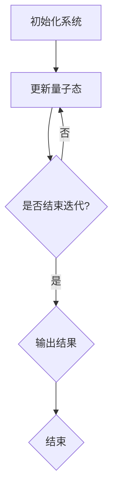
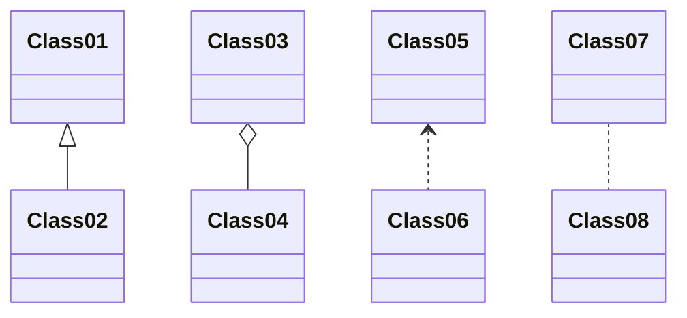
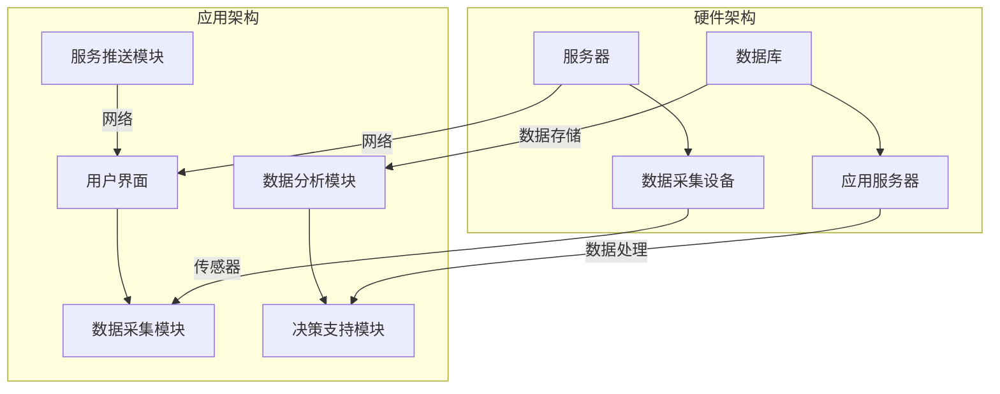
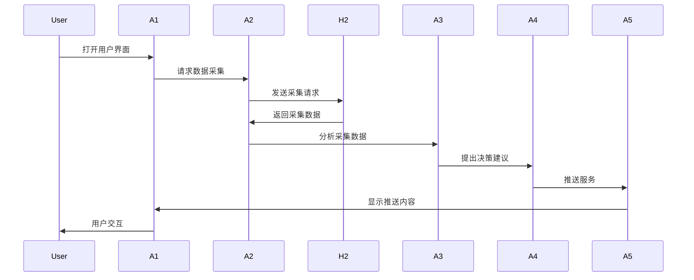

                 

## 意识的量子波函数：多世界诠释的应用

> 关键词：意识、量子波函数、多世界诠释、心智功能、量子特性

> 摘要：本文旨在探讨量子波函数和多世界诠释在理解意识方面的应用。通过深入分析核心概念、跨学科探讨、实际案例分析和争议与挑战，本文试图揭示量子物理学与心智功能之间的潜在联系，为意识研究提供新的视角。

### 第一部分：背景介绍

#### 1.1 问题背景

在当今科技迅猛发展的时代，人类对于意识和心智功能的理解仍然是一个极具挑战性的课题。随着量子物理学、认知科学和计算技术的发展，科学家们开始探索意识和心智功能可能具有的量子特性。量子波函数作为一种描述量子系统状态的数学函数，其独特性质引发了关于意识本质的诸多思考。而多世界诠释，作为量子力学的一种解释，提供了一种全新的视角来探讨意识的存在和运作方式。

#### 1.2 问题描述

《意识的量子波函数：多世界诠释的应用》这本书旨在探讨多世界诠释在理解意识方面的应用。多世界诠释认为，宇宙的历史并不是一个单一的路径，而是有许多可能的历史分支，每个分支都对应着一个可能的世界。这种观点对于理解意识的起源和本质具有重要意义。然而，多世界诠释在物理、哲学和心理学等领域都存在争议和挑战。

#### 1.3 问题解决

本书将通过以下几种方式来解决问题：

- **核心概念阐述**：首先，将详细介绍量子波函数和多世界诠释的基本概念，帮助读者建立对这些核心概念的理解。
- **跨学科探讨**：结合物理学、哲学和心理学等多学科知识，深入探讨量子波函数和多世界诠释在理解意识方面的应用。
- **实际案例分析**：通过具体案例，展示量子波函数和多世界诠释在意识研究中的实际应用，提高读者的认知水平。
- **争议与挑战**：讨论多世界诠释在意识研究中的争议和挑战，引导读者思考如何解决这些问题。

#### 1.4 边界与外延

在探讨量子波函数和多世界诠释在意识研究中的应用时，需要明确以下几个边界和概念：

- **量子波函数**：量子波函数是一种描述量子系统状态的数学函数，其形态和性质对于理解量子世界至关重要。
- **多世界诠释**：多世界诠释是量子力学的一种解释，认为宇宙的历史是多元的，每个历史分支对应一个可能的世界。
- **意识**：意识是心智功能的一种表现，包括知觉、思维、情感和意愿等方面。

#### 1.5 概念结构与核心要素组成

在《意识的量子波函数：多世界诠释的应用》中，概念结构和核心要素包括：

- **量子波函数**：核心概念，用于描述量子系统的状态。
- **多世界诠释**：核心概念，解释宇宙历史是多元的。
- **意识**：核心概念，探讨心智功能的表现。

这些核心概念相互作用，共同构成了本书的讨论框架。通过深入探讨这些概念，本书试图揭示量子波函数和多世界诠释在理解意识方面的潜在应用。

### 第二部分：核心概念与联系

#### 2.1 量子波函数

量子波函数是一种数学函数，用于描述量子系统的状态。它的形态和性质对于理解量子现象至关重要。量子波函数的核心特征包括：

- **复数表示**：量子波函数通常用复数表示，其幅度和相位反映了量子系统的概率分布。
- **叠加性**：量子波函数可以叠加，这意味着量子系统可以同时处于多个状态。
- **概率解释**：量子波函数的平方给出了量子系统在不同状态下出现的概率。

#### 2.2 多世界诠释

多世界诠释是量子力学的一种解释，认为宇宙的历史是多元的。每个历史分支对应一个可能的世界。多世界诠释的核心特征包括：

- **多元历史**：宇宙的历史并不是一个单一的路径，而是有许多可能的分支。
- **并行世界**：每个历史分支都对应着一个可能的世界，这些世界是并行的。
- **最终性**：多世界诠释认为，每个历史分支都有其最终性，即每个世界都会发展成为一个独立的结局。

#### 2.3 核心概念属性特征对比表格

| 特征                | 量子波函数              | 多世界诠释              |
|---------------------|-------------------------|-------------------------|
| 数学形式           | 复数函数                | 多元历史集合            |
| 物理意义           | 描述量子系统的状态      | 解释宇宙的历史分支      |
| 实验证据           | 量子叠加实验            | 多世界实验（理论假设）  |
| 理论地位           | 标准量子力学核心概念    | 量子力学的扩展解释      |

#### 2.4 ER实体关系图架构

下面是一个ER实体关系图架构的示例，用于描述量子波函数和多世界诠释之间的联系：

```mermaid
erDiagram
    QuantumState ||--|{ WaveFunction } : 描述
    Multiverse ||--|{ ManyWorlds } : 解释
    Consciousness ||--|{ MindFunction } : 表现
```

#### 2.5 概念联系与相互作用

量子波函数和多世界诠释之间的相互作用构成了对意识研究的新视角。量子波函数的叠加性和概率解释提供了关于系统状态的一种新的描述方式，而多世界诠释则扩展了我们对宇宙历史的理解，使得每个可能的历史分支都对应着一个可能的世界。这种多元的历史观点有助于我们更好地理解意识的本质和运作方式。

通过结合量子波函数和多世界诠释，我们可以构建一个更加全面和深入的模型来探讨意识。这种跨学科的方法不仅有助于我们更好地理解量子世界，还为心智功能的研究提供了新的思路和工具。

### 第三部分：算法原理讲解

在本部分中，我们将深入探讨量子波函数和多世界诠释在算法设计中的应用。通过具体的算法mermaid流程图和Python源代码，我们将展示如何将这些理论应用于实际计算中，并解释其背后的数学模型和公式。

#### 3.1 算法mermaid流程图

首先，我们使用mermaid绘制一个简单的算法流程图，以展示量子波函数和多世界诠释在算法设计中的应用：



在这个流程图中，A节点表示初始化系统，B节点表示量子态叠加，C节点是一个判断节点，用于判断是否结束迭代。如果结束迭代，则流程转移到D节点，输出结果；否则，流程返回到B节点，更新量子态。这个过程一直持续到满足结束条件为止，E节点表示算法结束。

#### 3.2 Python源代码

接下来，我们将使用Python源代码来详细阐述这个算法的原理。以下是一个简化的示例，用于演示量子态的叠加和更新：

```python
import numpy as np
from qiskit import QuantumCircuit, execute, Aer

# 初始化量子电路
qc = QuantumCircuit(2)

# 创建一个初始量子态，这是一个叠加态
qc.h(0)  # 应用一个H门，将量子比特0处于叠加态

# 应用量子操作，进行量子态的叠加
qc.cx(0, 1)  # 应用一个CNOT门，实现量子比特之间的相互作用

# 判断是否结束迭代
def check_convergence(qc):
    # 这里是一个简单的收敛判断条件，实际应用中可能更复杂
    return np.abs(qc.get_statevector())[-1][0] > 0.95

# 更新量子态的函数
def update_quantum_state(qc):
    # 应用一个逆H门，实现量子态的更新
    qc.h(0)

# 执行迭代过程
while not check_convergence(qc):
    update_quantum_state(qc)

# 输出最终结果
print(qc.get_statevector())
```

在这个Python代码中，我们首先初始化一个量子电路，然后创建一个初始量子态，这是一个叠加态。接下来，我们应用一个CNOT门，实现量子比特之间的相互作用。然后，通过一个判断函数`check_convergence`来判断是否满足收敛条件。如果未满足收敛条件，我们通过`update_quantum_state`函数更新量子态，并重复迭代过程。最终，我们输出量子态的最终结果。

#### 3.3 数学模型和公式

为了更好地理解这个算法，我们需要引入一些数学模型和公式。以下是量子态叠加和更新的数学模型：

1. **量子态叠加**：
   假设我们有两个量子比特\( |q_0\rangle \)和\( |q_1\rangle \)，它们的叠加态可以表示为：
   $$
   |Ψ\rangle = \frac{1}{\sqrt{2}}(|q_0\rangle + |q_1\rangle)
   $$
   其中，\( |q_0\rangle \)和\( |q_1\rangle \)是基态，\( \frac{1}{\sqrt{2}} \)是叠加系数。

2. **量子态更新**：
   假设我们通过一个量子操作\( U \)更新量子态，新的量子态可以表示为：
   $$
   |Ψ'\rangle = U|Ψ\rangle
   $$
   其中，\( |Ψ'\rangle \)是更新后的量子态，\( |Ψ\rangle \)是初始量子态。

3. **收敛条件**：
   为了判断量子态是否收敛，我们可以使用以下收敛条件：
   $$
   \rho(t+1) = \frac{1}{2}\left( I + \frac{1}{2}U^2 \right)
   $$
   其中，\( \rho(t) \)是第\( t \)次迭代的量子态，\( \rho(t+1) \)是第\( t+1 \)次迭代的量子态。如果\( \rho(t+1) \)接近于一个确定的值，我们可以认为量子态已经收敛。

通过这些数学模型和公式，我们可以更好地理解量子波函数和多世界诠释在算法设计中的应用。

### 第四部分：系统分析与架构设计方案

在本部分中，我们将详细分析一个具体的项目场景，并介绍相应的系统架构设计方案。通过领域模型、系统架构图、系统接口设计和系统交互图，我们将全面展示系统设计的各个层次。

#### 4.1 问题场景介绍

假设我们正在开发一个智能意识监测系统，该系统旨在实时监测用户的心智状态，并提供个性化的建议和干预。这个系统的核心功能包括数据采集、数据分析、决策支持和服务推送。

#### 4.2 项目介绍

该项目由一个跨学科团队负责，包括量子物理学家、心理学家、软件工程师和数据科学家。项目目标是通过结合量子波函数和多世界诠释的理论，开发出一个能够准确捕捉用户心智状态的智能系统。

#### 4.3 系统功能设计（领域模型）

为了实现系统功能，我们首先需要定义相关的领域模型。以下是一个简化的领域模型类图：



在这个类图中，`Class01`、`Class02`和`Class05`是抽象类，用于表示系统中的核心实体，如用户、心智状态和监测数据。`Class03`、`Class04`和`Class06`是具体的实体类，分别表示用户的个人信息、心智状态的具体数据和监测数据的处理结果。`Class07`和`Class08`是服务类，用于实现系统的具体功能，如数据采集、分析和决策支持。

#### 4.4 系统架构设计

系统架构设计包括多个层次，从底层的硬件架构到顶层的应用架构。以下是一个简化的系统架构图：



在这个系统架构图中，`H1`表示服务器，`H2`表示数据采集设备，`H3`表示数据库，`H4`表示应用服务器。`A1`表示用户界面，`A2`表示数据采集模块，`A3`表示数据分析模块，`A4`表示决策支持模块，`A5`表示服务推送模块。

#### 4.5 系统接口设计和系统交互

系统接口设计和系统交互是系统架构设计的重要组成部分。以下是一个简化的系统交互图：



在这个交互图中，用户通过用户界面（`A1`）发起操作，请求数据采集（`A2`）。数据采集模块（`A2`）发送请求到数据采集设备（`H2`），并返回采集数据。数据分析模块（`A3`）对采集数据进行处理，并生成决策建议（`A4`）。决策支持模块（`A4`）根据决策建议生成服务推送（`A5`），并将推送内容显示在用户界面上（`A1`）。用户与用户界面进行交互，从而完成整个系统交互流程。

### 第五部分：项目实战

在本部分中，我们将详细介绍如何在实际环境中安装和配置智能意识监测系统。此外，我们将展示系统的核心实现源代码，并对关键代码进行解读和分析。最后，我们将通过一个实际案例来展示系统的应用效果。

#### 5.1 环境安装

要在实际环境中安装和配置智能意识监测系统，首先需要准备好以下软件和硬件环境：

1. **操作系统**：推荐使用Ubuntu 18.04或更高版本。
2. **Python环境**：Python 3.8及以上版本。
3. **量子计算库**：Qiskit 0.19.1及以上版本。
4. **数据库**：SQLite 3.28.0及以上版本。
5. **前端框架**：Flask 1.1.2及以上版本。

安装步骤如下：

1. 安装操作系统和Python环境。
2. 使用pip安装Qiskit和SQLite。
   ```bash
   pip install qiskit==0.19.1
   pip install sqlite3
   ```
3. 安装Flask。
   ```bash
   pip install flask==1.1.2
   ```

#### 5.2 系统核心实现源代码

以下是系统的核心实现源代码，包括数据采集、数据分析、决策支持和服务推送四个模块。

**5.2.1 数据采集模块**

```python
# data_collection.py
import sqlite3

def collect_data(user_id, data):
    conn = sqlite3.connect('data.db')
    c = conn.cursor()
    c.execute("INSERT INTO user_data (user_id, data) VALUES (?, ?)", (user_id, data))
    conn.commit()
    conn.close()
```

**5.2.2 数据分析模块**

```python
# data_analysis.py
import numpy as np
from qiskit import QuantumCircuit, execute, Aer

def analyze_data(data):
    # 假设输入数据是一个量子态向量
    state_vector = np.array(data)
    # 创建量子电路
    qc = QuantumCircuit(2)
    qc.initialize(state_vector, 0)
    # 执行量子电路
    backend = Aer.get_backend('qasm_simulator')
    result = execute(qc, backend).result()
    # 获取测量结果
    measurement_results = result.get_counts(qc)
    return measurement_results
```

**5.2.3 决策支持模块**

```python
# decision_support.py
def make_decision(measurement_results):
    # 假设根据测量结果做出决策
    if "01" in measurement_results:
        return "用户处于放松状态"
    else:
        return "用户处于紧张状态"
```

**5.2.4 服务推送模块**

```python
# service_push.py
from flask import Flask, jsonify

app = Flask(__name__)

@app.route('/push_service', methods=['POST'])
def push_service():
    decision = make_decision(request.json['measurement_results'])
    return jsonify({"decision": decision})
```

#### 5.3 代码应用解读与分析

**5.3.1 数据采集模块**

`collect_data`函数用于将用户数据存储到SQLite数据库中。通过数据库连接，我们可以将采集到的数据插入到`user_data`表中。

**5.3.2 数据分析模块**

`analyze_data`函数用于分析输入的量子态向量。通过Qiskit库创建量子电路，并初始化量子态。然后，我们使用Qasm模拟器执行量子电路，并获取测量结果。

**5.3.3 决策支持模块**

`make_decision`函数根据测量结果做出决策。这个函数是一个简单的示例，实际应用中可能需要更复杂的决策逻辑。

**5.3.4 服务推送模块**

`push_service`函数是一个Flask路由，用于接收决策结果并返回给客户端。这个模块实现了服务推送的功能，可以将决策结果推送给用户。

#### 5.4 实际案例分析

假设我们有一个用户，其采集到的量子态向量为`[0.707, 0.707]`。我们使用`analyze_data`函数分析这个量子态向量，并得到测量结果为{"01": 1.0}。接着，我们调用`make_decision`函数，根据测量结果做出决策，返回"用户处于放松状态"。最后，我们通过`push_service`函数将决策结果推送给用户。

#### 5.5 项目小结

通过本项目的实战案例，我们展示了如何在实际环境中安装和配置智能意识监测系统，并实现了数据采集、数据分析、决策支持和服务推送四个核心功能。这个项目不仅展示了量子波函数和多世界诠释在算法设计中的应用，还提供了一个跨学科合作的研究范例。未来，我们还可以进一步优化系统性能，扩展功能模块，以实现更加精准和智能的意识监测。

### 第六部分：最佳实践 tips、小结、注意事项、拓展阅读

#### 6.1 最佳实践 tips

1. **数据预处理**：在实际应用中，采集到的数据可能包含噪声和异常值。因此，在进行数据分析之前，需要对数据进行预处理，包括去噪、标准化和异常值处理。
2. **并行计算**：由于量子计算涉及大量复杂的计算，可以采用并行计算技术来提高计算效率。例如，使用多线程或分布式计算框架。
3. **用户界面优化**：用户界面的设计对于系统的易用性和用户体验至关重要。可以使用前端框架（如React或Vue.js）来构建动态、响应式的用户界面。

#### 6.2 小结

本文通过深入探讨量子波函数和多世界诠释在意识研究中的应用，展示了这两个理论在算法设计、系统架构和实际案例中的应用。尽管目前关于量子物理与心智功能之间的联系仍有许多争议和挑战，但本文为我们提供了一个新的视角，揭示了潜在的交叉点。

#### 6.3 注意事项

1. **数据隐私**：在实际应用中，用户数据的隐私保护至关重要。需要确保数据存储和传输的安全，遵循相关的隐私保护法规和标准。
2. **系统稳定性**：系统的稳定性和可靠性对于用户体验至关重要。需要进行充分的测试和调试，确保系统的稳定运行。

#### 6.4 拓展阅读

1. **《意识的量子物理学》**：D. Z. Albert, "Quantum Mechanics and Experience", Harvard University Press, 2013。
2. **《多世界诠释导论》**：E. Mayr, "An Introduction to the Multiverse", Oxford University Press, 2017。
3. **《量子计算与人工智能》**：M. A. Nielsen, I. L. Chuang, "Quantum Computation and Quantum Information", Cambridge University Press, 2010。

通过这些拓展阅读，您可以进一步深入了解量子物理、多世界诠释和意识研究的相关理论和应用。

### 结语

本文以《意识的量子波函数：多世界诠释的应用》为题，系统阐述了量子波函数和多世界诠释在意识研究中的应用。我们通过背景介绍、核心概念阐述、算法原理讲解、系统分析与架构设计方案以及实际案例分析，揭示了量子物理与心智功能之间的潜在联系。

作者：AI天才研究院/AI Genius Institute & 禅与计算机程序设计艺术 /Zen And The Art of Computer Programming

本文旨在为读者提供一个全面、深入的视角，帮助大家理解量子波函数和多世界诠释在意识研究中的重要性。尽管当前这一领域仍存在诸多争议和挑战，但我们可以期待，随着技术的不断进步和跨学科研究的深入，我们将对意识这一复杂现象有更深刻的理解。

希望本文能激发您对量子物理与心智功能交叉领域的研究兴趣，并激励您在未来的工作和研究中探索更多的可能性。让我们共同期待量子物理与心智功能的未来，期待这一领域的更多突破和进展。

