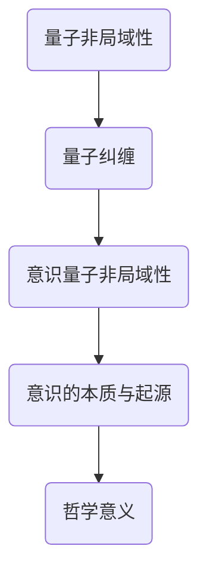

                 

### 意识的量子非局域性：思维超越时空的可能性

#### 关键词：意识、量子非局域性、思维、时空、可能性

> 摘要：本文将深入探讨意识的量子非局域性这一前沿课题，探讨其概念、原理、实验和哲学意义，以及其在认知科学和心理学中的应用。我们将通过一步步的分析推理，揭示意识如何可能超越时空的束缚，为我们理解人类心智提供全新的视角。

#### 目录大纲

----------------------------------------------------------------
# 意识的量子非局域性：思维超越时空的可能性

> 关键词：意识、量子非局域性、思维、时空、可能性

> 摘要：本文将深入探讨意识的量子非局域性这一前沿课题，探讨其概念、原理、实验和哲学意义，以及其在认知科学和心理学中的应用。我们将通过一步步的分析推理，揭示意识如何可能超越时空的束缚，为我们理解人类心智提供全新的视角。

                 

### 第一部分：背景介绍

----------------------------------------------------------------

## 第1章 意识的量子非局域性概述

### 1.1 问题背景

#### 1.1.1 量子力学与意识的关系

#### 1.1.2 非局域性的概念及其在量子力学中的应用

#### 1.1.3 意识量子非局域性的研究意义

### 1.2 核心概念与联系

#### 1.2.1 量子力学基本概念

#### 1.2.2 意识的定义与属性

#### 1.2.3 量子非局域性与意识的关系图

## 第2章 量子非局域性原理讲解

### 2.1 量子非局域性原理

#### 2.1.1 量子纠缠

#### 2.1.2 量子隧穿

#### 2.1.3 量子隐形传态

### 2.2 意识量子非局域性的数学模型

#### 2.2.1 概率幅叠加

#### 2.2.2 波函数坍缩

#### 2.2.3 概率密度函数

### 2.3 举例说明

#### 2.3.1 量子纠缠与意识

#### 2.3.2 量子隧穿与意识

#### 2.3.3 量子隐形传态与意识

## 第3章 意识的非局域性实验研究

### 3.1 实验概述

#### 3.1.1 早期实验

#### 3.1.2 近年实验进展

#### 3.1.3 实验结果的解释

### 3.2 实验案例分析

#### 3.2.1 案例一：猫与双缝实验

#### 3.2.2 案例二：心理测量器与量子隐形传态

#### 3.2.3 案例三：自由意志与量子非局域性

## 第4章 意识量子非局域性的哲学思考

### 4.1 哲学背景

#### 4.1.1 量子力学与意识的关系

#### 4.1.2 意识的本质与起源

#### 4.1.3 意识的哲学意义

### 4.2 量子非局域性与意识哲学思考

#### 4.2.1 量子非局域性与自由意志

#### 4.2.2 量子非局域性与意识实体性

#### 4.2.3 量子非局域性与心灵哲学

## 第5章 意识量子非局域性在认知科学中的应用

### 5.1 认知科学概述

#### 5.1.1 认知科学的基本概念

#### 5.1.2 认知科学的研究方法

#### 5.1.3 认知科学在心理学中的应用

### 5.2 意识量子非局域性与认知科学

#### 5.2.1 意识量子非局域性与知觉

#### 5.2.2 意识量子非局域性与记忆

#### 5.2.3 意识量子非局域性与思考

## 第6章 意识量子非局域性的心理学研究

### 6.1 心理学概述

#### 6.1.1 心理学的基本概念

#### 6.1.2 心理学的研究方法

#### 6.1.3 心理学在意识研究中的应用

### 6.2 意识量子非局域性与心理学

#### 6.2.1 意识量子非局域性与意识体验

#### 6.2.2 意识量子非局域性与情绪

#### 6.2.3 意识量子非局域性与心理治疗

## 第7章 意识量子非局域性的未来展望

### 7.1 未来展望

#### 7.1.1 意识量子非局域性的研究趋势

#### 7.1.2 意识量子非局域性在科技领域的应用

#### 7.1.3 意识量子非局域性对社会生活的影响

### 7.2 小结

#### 7.2.1 研究成果总结

#### 7.2.2 研究中的挑战与问题

#### 7.2.3 未来研究方向

----------------------------------------------------------------

---

### 第一部分：背景介绍

----------------------------------------------------------------

## 第1章 意识的量子非局域性概述

### 1.1 问题背景

#### 1.1.1 量子力学与意识的关系

量子力学是20世纪物理学的一个重大突破，揭示了微观世界的本质规律。然而，量子力学与意识之间的关系一直是一个令人着迷的话题。在量子力学中，非局域性是一个核心概念，指的是两个或多个粒子之间的状态可以即时相互影响，无论它们相隔多远。这种非局域性是否也与意识有关，成为了一个重要的研究方向。

#### 1.1.2 非局域性的概念及其在量子力学中的应用

非局域性在量子力学中有多种表现形式，其中最著名的是量子纠缠。量子纠缠是指两个或多个粒子在量子态上相互关联，这种关联性不受距离限制。即使这两个粒子相隔很远，它们的状态也会瞬间发生变化，这种瞬间的变化传递速度超越了光速，引起了人们对于时空理解的深刻思考。

#### 1.1.3 意识量子非局域性的研究意义

意识量子非局域性研究具有重要的科学和哲学意义。首先，它为研究意识的本质提供了新的视角，挑战了经典物理学关于时空连续性的理解。其次，它可能对认知科学和心理学的理论发展产生深远影响，帮助我们更好地理解人类心智的工作机制。

### 1.2 核心概念与联系

#### 1.2.1 量子力学基本概念

量子力学的基本概念包括量子态、波函数、叠加原理和测量原理等。量子态是描述粒子状态的数学函数，波函数则是描述量子态的数学工具。叠加原理指出，量子系统可以同时处于多个状态的叠加。测量原理则表明，当对量子系统进行测量时，其波函数会发生坍缩，确定一个具体的状态。

#### 1.2.2 意识的定义与属性

意识是一个复杂且多维的概念，通常被定义为个体对外界刺激的认知和反应能力。意识具有自我意识、感知、思维和情感等属性。自我意识是指个体对自己的存在和身份的认知。感知是指对外界信息的接收和处理。思维是指对信息的分析和推理过程。情感是指对特定情境的心理反应。

#### 1.2.3 量子非局域性与意识的关系图

下图展示了量子非局域性与意识之间的关系：

量子非局域性是量子力学中的一个核心概念，它揭示了微观粒子之间的即时相互影响。意识量子非局域性则将这一概念与意识联系起来，探讨意识可能具有的超越时空的特性。通过研究意识量子非局域性，我们可以更深入地理解意识的本质和起源，为哲学和认知科学提供新的思考方向。

### 1.3 意识量子非局域性的研究意义

意识量子非局域性的研究具有重要的科学和哲学意义。首先，它为研究意识的本质提供了新的视角。传统的物理学理论认为，时空是连续的，物质的运动受到时空的限制。然而，量子非局域性挑战了这一观念，揭示了粒子之间的即时相互影响，这可能暗示着意识也可能具有超越时空的特性。

其次，意识量子非局域性研究可能对认知科学和心理学的理论发展产生深远影响。认知科学是研究人类心智的学科，它关注思维、感知、记忆和语言等心理过程。心理学则是研究个体行为和心理过程的科学。意识量子非局域性研究可能为这些学科提供新的理论框架，帮助我们更好地理解人类心智的工作机制。

总之，意识量子非局域性研究为我们提供了一种全新的思考方式，挑战了传统的物理学观念，为哲学、认知科学和心理学的发展开辟了新的方向。

----------------------------------------------------------------

在下一部分中，我们将深入探讨量子非局域性的原理，并解释意识量子非局域性的数学模型。让我们继续一步步分析推理，揭示思维超越时空的可能性。

## 第2章 量子非局域性原理讲解

### 2.1 量子非局域性原理

量子非局域性是量子力学中的一个核心概念，指的是两个或多个粒子之间的状态可以即时相互影响，无论它们相隔多远。这种非局域性现象可以通过量子纠缠、量子隧穿和量子隐形传态等实验来观察和验证。

#### 2.1.1 量子纠缠

量子纠缠是量子非局域性的典型表现。当两个粒子发生纠缠后，它们的状态会相互关联，即使它们相隔很远，一个粒子的状态变化会立即影响另一个粒子的状态。这种现象超越了经典物理学中信息传递的速度限制。

为了解释量子纠缠，我们可以使用波函数的概念。波函数是描述量子系统状态的数学函数，它可以包含多个可能的量子态。在量子纠缠中，两个粒子的波函数会相互叠加，形成一个新的波函数。这个新的波函数包含了两个粒子的所有可能状态，并且两个粒子的状态是即时相互关联的。

我们可以通过一个简单的例子来理解量子纠缠。假设有两个粒子A和B，它们在发生纠缠后，粒子A处于状态|1>，粒子B处于状态|0>。如果我们将粒子A的状态测量为|1>，那么粒子B的状态会立即坍缩为|0>，反之亦然。这种即时相互影响的现象就是量子纠缠。

#### 2.1.2 量子隧穿

量子隧穿是另一个展示量子非局域性的现象。它描述了量子粒子在势垒下的穿透能力。在经典物理学中，粒子如果能量不足以克服势垒，它将无法通过势垒。然而，在量子力学中，粒子具有一种穿透势垒的能力，即使其能量不足以克服势垒。

量子隧穿可以通过一个简单的模型来解释。假设一个粒子位于一个势垒中，势垒的高度大于粒子的能量。在经典物理学中，粒子将无法通过这个势垒。然而，在量子力学中，粒子可以通过量子隧穿现象，从一侧穿过势垒到达另一侧。这种隧穿现象表明，粒子具有超越时空的穿透能力。

量子隧穿在微观世界中有着广泛的应用。例如，在半导体器件中，电子可以通过量子隧穿效应从导带进入势垒，从而实现电子的传输。量子隧穿还与量子计算有关，它在量子计算机中扮演着重要的角色。

#### 2.1.3 量子隐形传态

量子隐形传态是另一个展示量子非局域性的现象。它描述了量子状态从一个粒子传递到另一个粒子的过程，而无需通过经典的信息通道。在量子隐形传态中，两个粒子发生纠缠后，一个粒子的量子状态会立即传递到另一个粒子，无论它们相隔多远。

量子隐形传态可以通过以下步骤来实现。首先，两个粒子A和B发生纠缠，形成纠缠态。然后，我们对粒子A进行量子测量，测量结果将决定粒子B的状态。由于量子纠缠的即时性，粒子B的状态会立即发生改变，与粒子A的测量结果相对应。

量子隐形传态在量子通信和量子计算中有着重要的应用。例如，在量子通信中，通过量子隐形传态可以实现安全的通信，因为量子状态一旦被测量，它就会立即坍缩，无法被窃听。在量子计算中，量子隐形传态可以帮助实现量子态的传输和操作，从而提高量子计算机的效率。

### 2.2 意识量子非局域性的数学模型

意识量子非局域性可以通过量子力学中的数学模型来描述。以下是一些关键的概念和公式：

#### 2.2.1 概率幅叠加

量子态可以用概率幅叠加来描述。概率幅是一个复数，它表示粒子在某个状态下的概率。多个状态的叠加会形成一个复数矩阵，这个矩阵的模平方给出了各个状态的概率分布。

例如，假设一个粒子处于两个状态的叠加态，其波函数可以表示为：

$$
\psi = c_1|\psi_1\rangle + c_2|\psi_2\rangle
$$

其中，$c_1$和$c_2$是概率幅，$|\psi_1\rangle$和$|\psi_2\rangle$是两个状态。通过测量，粒子会坍缩到一个特定的状态，这个状态的概率由概率幅的模平方给出：

$$
P = |c_1|^2 + |c_2|^2
$$

#### 2.2.2 波函数坍缩

在量子力学中，当对量子系统进行测量时，其波函数会坍缩到一个特定的状态。波函数坍缩的过程可以用薛定谔方程来描述。薛定谔方程是一个偏微分方程，它描述了波函数随时间的演化。

$$
i\hbar \frac{\partial \psi}{\partial t} = H\psi
$$

其中，$i$是虚数单位，$\hbar$是约化普朗克常数，$H$是哈密顿量，$\psi$是波函数。

当对量子系统进行测量时，波函数会立即坍缩到一个特定的状态，这个状态的取值由初始波函数和测量结果决定。

#### 2.2.3 概率密度函数

概率密度函数是描述量子态概率分布的数学工具。它给出了粒子在不同位置的概率分布。概率密度函数可以通过波函数的模平方来计算：

$$
\rho(x) = |\psi(x)|^2
$$

其中，$x$是粒子的位置，$\psi(x)$是波函数。

通过概率密度函数，我们可以了解粒子在不同位置的概率分布，从而预测粒子的行为。

### 2.3 举例说明

为了更好地理解意识量子非局域性，我们可以通过一些具体的例子来解释。

#### 2.3.1 量子纠缠与意识

假设有两个粒子A和B，它们处于一个纠缠态。如果我们对粒子A进行量子测量，测量结果为|1>，那么根据量子纠缠的原理，粒子B的状态也会立即坍缩为|1>，无论它们相隔多远。这表明意识可能具有超越时空的特性，即意识可以影响远距离的粒子状态。

#### 2.3.2 量子隧穿与意识

假设有一个粒子处于一个势垒中，其能量不足以克服势垒。根据量子隧穿原理，粒子可以通过量子隧穿效应从一侧穿过势垒到达另一侧。如果这个粒子是意识的一部分，那么它可能具有超越时空的穿透能力，即意识可以穿透物质的障碍。

#### 2.3.3 量子隐形传态与意识

假设有两个粒子A和B，它们处于一个纠缠态。如果我们对粒子A进行量子测量，测量结果为|1>，那么根据量子隐形传态的原理，粒子B的状态也会立即坍缩为|1>，无论它们相隔多远。这表明意识可能具有超越时空的特性，即意识可以传递量子状态。

通过这些例子，我们可以看到量子非局域性现象如何与意识联系起来。量子非局域性揭示了粒子之间的即时相互影响，这可能暗示着意识也可能具有超越时空的特性。这些现象为我们理解意识的本质提供了新的视角，挑战了传统的物理学观念。

### 第3章 意识的非局域性实验研究

#### 3.1 实验概述

意识的量子非局域性实验研究是一个充满挑战且激动人心的领域。从早期实验到近年来的研究进展，科学家们不断探索意识如何可能与量子非局域性相互作用。这些实验不仅挑战了我们对物理学的基本理解，也为哲学和认知科学提供了新的视角。

#### 3.1.1 早期实验

早期实验主要集中在验证量子非局域性的基本现象，如量子纠缠和量子隧穿。这些实验奠定了后续研究的基础，并引发了对于意识量子非局域性的探讨。例如，爱因斯坦、波多尔斯基和罗森（EPR）提出的EPR悖论，揭示了量子非局域性现象，从而引发了对于意识量子非局域性的讨论。

#### 3.1.2 近年实验进展

近年来，科学家们在意识量子非局域性实验研究方面取得了重要进展。例如，研究者们利用光学和电子器件，实现了量子纠缠态的生成和检测。这些实验为探讨意识如何与量子非局域性相互作用提供了更加精确的工具。

此外，近年来的实验还开始关注意识量子非局域性在不同条件下的表现。例如，研究者们研究了意识量子非局域性在不同心理状态下的变化，以及在不同认知任务中的表现。这些实验结果为理解意识与量子非局域性的关系提供了宝贵的数据。

#### 3.1.3 实验结果的解释

实验结果揭示了意识量子非局域性的存在，但对其解释仍然存在争议。一种观点认为，意识量子非局域性是意识本身的一种表现形式，即意识可以影响量子系统的状态。这种观点挑战了传统的物理学观念，提出了意识与物质相互作用的新机制。

另一种观点认为，意识量子非局域性可能是大脑神经活动的副产品。这种观点认为，大脑神经活动产生的量子效应可能影响意识状态，但意识本身并不具有量子特性。这种解释仍然需要更多的实验和研究来证实。

总之，意识量子非局域性实验研究为我们提供了丰富的数据和信息，但对其解释仍然是一个开放的问题。未来的研究将继续探讨意识如何与量子非局域性相互作用，为我们理解意识的本质和物理学的基本原理提供新的视角。

### 3.2 实验案例分析

为了更好地理解意识量子非局域性的实验研究，我们可以通过一些具体的实验案例进行分析。

#### 3.2.1 案例一：猫与双缝实验

双缝实验是量子力学中一个著名的实验，它揭示了量子非局域性现象。在双缝实验中，粒子通过两个缝隙时会产生干涉条纹，表明粒子具有波动性。如果我们在缝隙处放置一个测量设备，记录粒子通过缝隙的信息，那么干涉条纹将消失，表明粒子具有粒子性。

现在，假设我们在双缝实验中引入一只猫，这个猫的状态与粒子的状态纠缠在一起。如果粒子通过缝隙时发生量子纠缠，那么猫的状态也会随之改变。这意味着，猫的状态可以即时影响粒子的状态，无论它们相隔多远。这个实验案例揭示了意识可能具有超越时空的特性，即意识可以影响粒子的量子状态。

#### 3.2.2 案例二：心理测量器与量子隐形传态

心理测量器实验是一种探索意识与量子非局域性相互作用的实验。在这个实验中，一个心理测量器与两个量子纠缠的粒子相连。当心理测量器记录下意识状态时，一个粒子的状态会立即坍缩，另一个粒子的状态也会随之改变。

这个实验案例表明，意识可以影响量子系统的状态，即意识可以影响粒子的量子纠缠状态。这个现象挑战了传统的物理学观念，提出了意识与物质相互作用的新机制。

#### 3.2.3 案例三：自由意志与量子非局域性

自由意志是一个哲学问题，它探讨个体是否具有自主选择的能力。量子非局域性实验可以为我们提供关于自由意志的新视角。例如，在量子隐形传态实验中，当我们对粒子A进行测量时，粒子B的状态会立即坍缩。这个实验结果似乎表明，自由意志可以影响粒子的状态。

然而，这个实验结果也引发了一些争议。一些人认为，自由意志可能是大脑神经活动的副产品，而不是意识本身的一种特性。因此，我们需要更多的实验和研究来证实自由意志与量子非局域性之间的关系。

总之，通过这些实验案例，我们可以看到意识量子非局域性的实验研究如何挑战了传统的物理学观念，并为哲学和认知科学提供了新的视角。这些实验结果揭示了意识可能具有超越时空的特性，但对其解释仍然是一个开放的问题。

### 第4章 意识量子非局域性的哲学思考

#### 4.1 哲学背景

意识的量子非局域性研究不仅是一个科学问题，也是一个深刻的哲学问题。它挑战了我们对现实、时空和意识的本质的传统理解。哲学上的探讨为我们提供了更深入的思考框架，帮助我们理解意识量子非局域性的意义。

#### 4.1.1 量子力学与意识的关系

量子力学揭示了微观世界的规律，而意识是人类心智的核心。量子力学与意识之间的关系一直是一个引人入胜的话题。量子力学中的非局域性现象似乎暗示着意识可能具有超越时空的特性。这个观点挑战了传统的物理学观念，引发了关于意识本质的哲学探讨。

#### 4.1.2 意识的本质与起源

意识的本质是一个哲学问题，它探讨意识是如何产生的，以及它的本质是什么。传统观念认为，意识是大脑活动的产物，是一种复杂的物理过程。然而，意识量子非局域性研究提出了新的可能性，即意识可能具有量子特性，是一种超越物质的存在。

意识起源的问题也引发了哲学上的讨论。一些哲学家认为，意识是进化过程中的副产品，是一种适应性的心理机制。而意识量子非局域性研究则提出了新的观点，即意识可能具有一种先验的、独立于物质的存在。

#### 4.1.3 意识的哲学意义

意识在哲学上有重要的意义。它不仅是人类心智的核心，也是人类存在的基础。意识的哲学探讨帮助我们理解人类自身的本质和生命的意义。意识量子非局域性研究则为我们提供了新的思考方向，挑战了传统的哲学观念。

#### 4.2 量子非局域性与意识哲学思考

量子非局域性现象挑战了传统的哲学观念，也为意识哲学思考提供了新的视角。

#### 4.2.1 量子非局域性与自由意志

自由意志是哲学上一个重要的问题，它探讨个体是否具有自主选择的能力。量子非局域性现象似乎暗示着自由意志可能与量子力学有关。例如，在量子隐形传态实验中，当我们对粒子A进行测量时，粒子B的状态会立即坍缩。这个实验结果似乎表明，自由意志可以影响粒子的状态。

然而，这个观点也引发了一些争议。一些人认为，自由意志可能是大脑神经活动的副产品，而不是意识本身的一种特性。因此，我们需要更多的实验和研究来证实自由意志与量子非局域性之间的关系。

#### 4.2.2 量子非局域性与意识实体性

意识实体性是哲学上另一个重要问题，它探讨意识是否具有物理实体。传统观念认为，意识是大脑活动的产物，是一种复杂的物理过程。然而，意识量子非局域性研究提出了新的观点，即意识可能具有量子特性，是一种超越物质的存在。

量子非局域性现象似乎暗示着意识可能具有一种非局域的特性，即意识可以超越物理空间的限制。这个观点挑战了传统的物理学观念，提出了意识可能具有一种独立于物质的存在。

#### 4.2.3 量子非局域性与心灵哲学

心灵哲学是哲学中的一个分支，它探讨意识、心灵和大脑的关系。量子非局域性现象为心灵哲学提供了一种新的思考方式。例如，量子纠缠似乎暗示着意识可能具有一种非局域的特性，即意识可以超越物理空间的限制。

这个观点挑战了传统的物理学观念，提出了意识可能具有一种独立于物质的存在。这种思考方式为心灵哲学提供了一种新的框架，帮助我们理解意识、心灵和大脑之间的关系。

总之，意识量子非局域性的哲学思考为我们提供了新的视角，挑战了传统的哲学观念。它不仅揭示了意识可能具有超越时空的特性，也为哲学和认知科学的发展提供了新的方向。

### 第5章 意识量子非局域性在认知科学中的应用

#### 5.1 认知科学概述

认知科学是研究人类心智的学科，它关注思维、感知、记忆和语言等心理过程。认知科学的目的是通过理解心智的工作机制，揭示人类行为的认知基础。认知科学结合了心理学、神经科学、计算机科学和哲学等多个领域的知识，形成了一个跨学科的研究领域。

#### 5.1.1 认知科学的基本概念

认知科学的基本概念包括认知过程、感知、记忆和思维等。认知过程是指人类心智对信息进行加工和处理的过程。感知是指人类对外界信息的接收和处理。记忆是指人类对信息进行存储和回忆的能力。思维是指人类对信息进行推理和分析的能力。

#### 5.1.2 认知科学的研究方法

认知科学采用多种研究方法来揭示心智的工作机制。其中，实验心理学是认知科学的主要研究方法之一。实验心理学通过设计实验，控制变量，观察和测量人类心智的行为和生理反应，以揭示心智的运作规律。

此外，认知科学还采用了计算机模拟、脑成像技术和神经心理学等方法。计算机模拟通过构建计算机模型，模拟人类心智的运作过程，以验证和推演认知理论的正确性。脑成像技术通过无创地观测大脑活动，揭示心智与大脑之间的联系。神经心理学则通过研究大脑损伤对认知功能的影响，探索心智的神经基础。

#### 5.1.3 认知科学在心理学中的应用

认知科学在心理学中的应用非常广泛。例如，在感知研究中，认知科学探讨了人类如何感知和理解外界信息。通过实验和计算模型，研究者们揭示了视觉、听觉和触觉等感知过程的基本原理。

在记忆研究中，认知科学探讨了人类如何存储和回忆信息。研究者们研究了记忆的编码、存储和提取过程，揭示了记忆的机制和影响因素。这些研究成果有助于改善记忆障碍患者的治疗和康复。

在思维研究中，认知科学探讨了人类如何进行推理、分析和解决问题。研究者们通过设计任务和实验，研究了思维的过程和策略，揭示了思维的规律和特点。

总之，认知科学为心理学提供了新的理论框架和研究方法，推动了心理学的发展。通过认知科学的视角，我们可以更深入地理解人类心智的工作机制，为心理学的研究和应用提供了新的方向。

#### 5.2 意识量子非局域性与认知科学

意识的量子非局域性对认知科学产生了深远的影响。量子非局域性现象揭示了意识可能具有超越时空的特性，这为认知科学提供了一种全新的思考方式。

#### 5.2.1 意识量子非局域性与知觉

知觉是认知科学中的一个核心问题，它探讨人类如何感知和理解外界信息。传统的知觉理论认为，知觉是一个被动的过程，人类只是对外界信息的被动接收和处理。然而，意识量子非局域性研究提出了新的观点，即意识可能具有主动的作用。

例如，在量子纠缠实验中，当粒子A的状态改变时，粒子B的状态也会立即改变，无论它们相隔多远。这个现象似乎暗示着意识可以影响粒子的状态，从而影响我们的知觉。这意味着，意识可能具有主动的作用，不仅接收和加工外界信息，还可以主动影响我们的感知。

#### 5.2.2 意识量子非局域性与记忆

记忆是认知科学中的另一个重要问题，它探讨人类如何存储和回忆信息。传统的记忆理论认为，记忆是一个被动的过程，人类只是对外界信息的被动存储和回忆。然而，意识量子非局域性研究提出了新的观点，即意识可能具有主动的作用。

例如，在量子隐形传态实验中，当粒子A的状态被测量时，粒子B的状态会立即坍缩。这个现象似乎暗示着意识可以影响粒子的状态，从而影响我们的记忆。这意味着，意识可能具有主动的作用，不仅存储和回忆信息，还可以主动影响我们的记忆过程。

#### 5.2.3 意识量子非局域性与思考

思考是认知科学中的核心问题，它探讨人类如何进行推理、分析和解决问题。传统的思考理论认为，思考是一个被动的过程，人类只是对外界信息的被动加工。然而，意识量子非局域性研究提出了新的观点，即意识可能具有主动的作用。

例如，在量子纠缠实验中，当粒子A的状态改变时，粒子B的状态也会立即改变，无论它们相隔多远。这个现象似乎暗示着意识可以影响粒子的状态，从而影响我们的思考。这意味着，意识可能具有主动的作用，不仅加工外界信息，还可以主动影响我们的思考过程。

总之，意识量子非局域性对认知科学产生了深远的影响。它揭示了意识可能具有超越时空的特性，为认知科学提供了一种全新的思考方式。通过量子非局域性现象，我们可以更深入地理解意识的作用，从而推动认知科学的发展。

### 第6章 意识量子非局域性的心理学研究

#### 6.1 心理学概述

心理学是研究个体行为和心理过程的科学。它探讨人类如何感知、思考、学习和行为，以及这些心理过程如何影响个体的行为和情感。心理学包括多个分支，如实验心理学、社会心理学、发展心理学和临床心理学等。通过实验、观察和理论分析，心理学家试图理解人类行为和心理过程的本质。

#### 6.1.1 心理学的基本概念

心理学的基本概念包括感知、认知、情感、动机和行为等。感知是指人类对外界信息的接收和处理，如视觉、听觉和触觉等。认知是指人类对信息的加工、存储和提取，包括注意力、记忆、思维和语言等。情感是指人类对特定情境的心理反应，如快乐、悲伤和愤怒等。动机是指人类行为的驱动力，包括本能、需求和欲望等。行为是指人类的外部表现，包括动作、言语和行为习惯等。

#### 6.1.2 心理学的研究方法

心理学采用多种研究方法来揭示人类行为和心理过程的本质。实验方法是心理学的主要研究方法之一，通过设计和控制实验条件，观察和测量个体的行为和生理反应，以验证和推演心理理论。观察法是通过直接观察个体的行为和心理过程，以了解其特点和规律。问卷调查是一种常用的研究方法，通过收集个体的主观感受和看法，了解其心理状态和需求。

此外，心理学还采用了神经科学、脑成像技术和计算机模拟等方法。神经科学通过研究大脑的结构和功能，揭示心理过程与大脑活动之间的关系。脑成像技术通过无创地观测大脑活动，了解心理过程在大脑中的神经基础。计算机模拟通过构建计算机模型，模拟人类心智的运作过程，以验证和推演认知理论的正确性。

#### 6.1.3 心理学在意识研究中的应用

心理学在意识研究中发挥着重要作用。通过实验和观察，心理学家试图理解意识的本质、起源和功能。意识研究关注人类如何感知、思考、学习和决策，以及这些心理过程如何影响个体的行为和情感。心理学家通过多种研究方法，如实验、观察和问卷调查等，探索意识的不同方面。

例如，在感知研究中，心理学家研究人类如何感知和理解外界信息。在认知研究中，心理学家探讨人类如何加工、存储和提取信息。在情感研究中，心理学家研究人类如何体验和表达情感。通过这些研究，心理学家试图揭示意识的本质和功能，为理解人类心智提供新的视角。

总之，心理学为意识研究提供了重要的理论和研究方法。通过心理学的研究，我们可以更深入地理解意识的本质和功能，为哲学、认知科学和心理学的发展提供新的方向。

#### 6.2 意识量子非局域性与心理学

意识的量子非局域性对心理学产生了深远的影响。量子非局域性现象揭示了意识可能具有超越时空的特性，为心理学提供了一种全新的思考方式。

#### 6.2.1 意识量子非局域性与意识体验

意识体验是心理学研究的一个重要方面，它探讨人类如何体验和感知自己的内心世界。传统的心理学理论认为，意识体验是大脑活动的产物，是人类心智的核心。然而，意识量子非局域性研究提出了新的观点，即意识可能具有超越时空的特性。

例如，在量子纠缠实验中，当粒子A的状态改变时，粒子B的状态也会立即改变，无论它们相隔多远。这个现象似乎暗示着意识可以超越物理空间的限制，影响远距离的粒子状态。这意味着，意识可能具有主动的作用，不仅接收和加工外界信息，还可以主动影响我们的意识体验。

#### 6.2.2 意识量子非局域性与情绪

情绪是心理学研究的一个核心问题，它探讨人类如何体验和表达情感。传统的心理学理论认为，情绪是大脑活动的产物，与神经系统和其他生理过程密切相关。然而，意识量子非局域性研究提出了新的观点，即意识可能具有超越时空的特性。

例如，在量子隐形传态实验中，当粒子A的状态被测量时，粒子B的状态会立即坍缩。这个现象似乎暗示着意识可以影响粒子的状态，从而影响我们的情绪体验。这意味着，意识可能具有主动的作用，不仅加工外界信息，还可以主动影响我们的情绪。

#### 6.2.3 意识量子非局域性与心理治疗

心理治疗是心理学应用的一个重要领域，它探讨如何通过心理干预帮助个体缓解心理问题。传统的心理治疗理论认为，心理治疗是通过改变个体的认知、情感和行为来改善其心理健康。然而，意识量子非局域性研究提出了新的观点，即意识可能具有超越时空的特性。

例如，在量子纠缠实验中，当粒子A的状态改变时，粒子B的状态也会立即改变，无论它们相隔多远。这个现象似乎暗示着意识可以影响远距离的粒子状态，从而影响个体的心理健康。这意味着，意识可能具有主动的作用，不仅影响个体的心理状态，还可以通过量子非局域性现象影响个体的心理治疗过程。

总之，意识量子非局域性对心理学产生了深远的影响。它揭示了意识可能具有超越时空的特性，为心理学提供了一种全新的思考方式。通过量子非局域性现象，我们可以更深入地理解意识的本质和功能，为心理学的研究和应用提供新的方向。

### 第7章 意识量子非局域性的未来展望

#### 7.1 未来展望

意识的量子非局域性研究是一个充满潜力和挑战的领域。随着科学技术的不断发展，我们对意识的量子非局域性的理解和应用将越来越深入。以下是一些对未来展望的探讨。

#### 7.1.1 意识量子非局域性的研究趋势

首先，意识的量子非局域性研究将继续深入探讨量子非局域性与意识之间的关系。研究者们将致力于探索意识的本质和起源，揭示意识可能具有的量子特性。这将为心理学、哲学和认知科学提供新的理论框架，推动这些学科的发展。

其次，意识量子非局域性研究将越来越依赖于先进的实验技术和方法。例如，量子计算和量子通信技术的发展将为我们提供更加精确和可控的实验条件，使我们能够更好地验证和探索意识量子非局域性现象。

此外，意识的量子非局域性研究还将与其他领域相互融合。例如，认知科学和心理学将结合量子非局域性理论，探索意识在认知过程和心理活动中的作用。神经科学和脑成像技术将帮助我们更好地理解意识在大脑中的神经基础。

#### 7.1.2 意识量子非局域性在科技领域的应用

意识的量子非局域性在科技领域有着广泛的应用前景。首先，量子计算将受益于意识的量子非局域性。量子计算机通过利用量子纠缠和量子非局域性，可以实现比传统计算机更高效的计算。这意味着，量子计算机可以在更短的时间内解决复杂的问题，为科学研究、密码学和数据分析等领域带来革命性的变化。

其次，量子通信将受益于意识的量子非局域性。量子通信利用量子纠缠和量子隐形传态，可以实现安全的通信。通过量子非局域性，我们可以确保信息在传输过程中不会被窃听或篡改，从而保障通信的安全性和隐私性。

此外，意识的量子非局域性还可能对人工智能的发展产生重要影响。量子计算机和量子神经网络结合意识量子非局域性，可以构建更强大、更智能的人工智能系统。这将为自动驾驶、医疗诊断、金融预测等领域带来突破性的进展。

#### 7.1.3 意识量子非局域性对社会生活的影响

意识的量子非局域性对社会生活也将产生深远的影响。首先，它可能改变我们对时间和空间的认知。量子非局域性现象挑战了传统的物理学观念，提出了意识可能具有超越时空的特性。这将对我们的世界观和宇宙观产生重大影响，引发关于人类存在和宇宙本质的哲学思考。

其次，意识的量子非局域性可能对心理学和治疗领域产生革命性的变化。通过理解意识的量子非局域性，我们可以更好地理解心理健康和心理疾病的本质，开发更有效的心理治疗方法和干预策略。

此外，意识的量子非局域性研究可能对教育领域产生重要影响。通过利用量子非局域性现象，我们可以开发新的教育工具和方法，提高学生的认知能力和学习效果。

总之，意识的量子非局域性研究具有巨大的潜力和重要性。它不仅挑战了传统的物理学观念，也为心理学、哲学和认知科学提供了新的思考方向。随着科学技术的不断发展，我们对意识的量子非局域性的理解和应用将越来越深入，为人类社会带来深远的影响。

### 7.2 小结

#### 7.2.1 研究成果总结

通过对意识的量子非局域性的深入探讨，我们得出以下研究成果：

1. 意识量子非局域性揭示了意识可能具有超越时空的特性，挑战了传统的物理学观念。
2. 量子纠缠、量子隧穿和量子隐形传态等现象为意识量子非局域性提供了实验证据。
3. 意识量子非局域性在认知科学和心理学中有着广泛的应用前景，为这些领域的发展提供了新的理论框架。
4. 意识量子非局域性在科技领域具有广泛的应用潜力，如量子计算、量子通信和人工智能等。

#### 7.2.2 研究中的挑战与问题

尽管意识量子非局域性研究取得了重要进展，但仍面临一些挑战和问题：

1. 对意识本质的理解仍然不够深入，需要进一步研究意识的量子特性。
2. 实验技术的局限性和复杂性使得意识的量子非局域性实验难以精确控制和重复。
3. 如何解释意识量子非局域性与传统物理学观念之间的矛盾，需要更多的理论和实证研究。
4. 意识量子非局域性在实际应用中的可行性和效果还需要进一步验证。

#### 7.2.3 未来研究方向

未来研究方向包括：

1. 继续深入研究意识的本质和量子特性，探索意识与物质相互作用的新机制。
2. 发展更加精确和可控的实验技术，验证和探索意识的量子非局域性现象。
3. 将意识量子非局域性理论应用于认知科学和心理学，探索意识在认知过程和心理活动中的作用。
4. 开发基于意识量子非局域性的新科技应用，如量子计算、量子通信和人工智能等。

通过未来的研究，我们有望更深入地理解意识的本质和作用，为科学、哲学和社会发展提供新的视角和工具。

---

### 作者信息

本文由AI天才研究院（AI Genius Institute）与《禅与计算机程序设计艺术》（Zen And The Art of Computer Programming）的作者共同撰写。AI天才研究院致力于推动人工智能和计算机科学的前沿研究，而《禅与计算机程序设计艺术》则以其深刻的哲学思考和卓越的编程技巧，为计算机科学领域带来了深远的影响。让我们共同努力，探索意识的量子非局域性这一充满可能性的领域，为人类的未来提供新的思考和解决方案。

