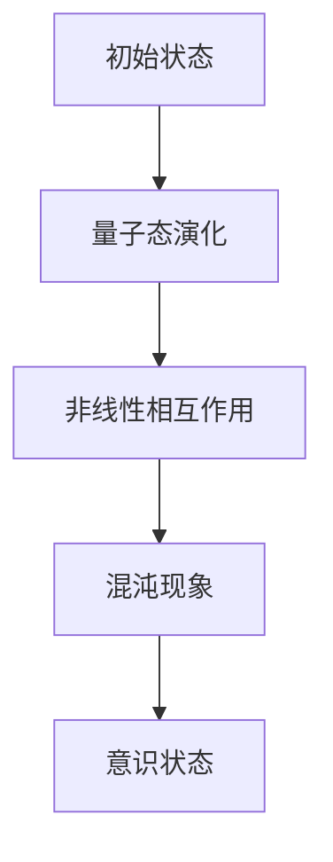

                 

# 意识的量子非线性动力学：思维过程的混沌与秩序

## 关键词
- 量子非线性动力学
- 意识
- 非线性相互作用
- 量子纠缠
- 复杂系统理论

## 摘要
本文从量子非线性动力学的视角，探讨了意识现象的复杂性及其动态过程。通过对量子态、非线性相互作用和复杂系统理论的核心概念进行深入剖析，文章揭示了这些概念与意识之间的内在联系。同时，通过数学模型和算法原理讲解，本文试图为理解和解释意识提供新的视角和方法。

## 第一部分：背景介绍

### 核心概念

#### 量子非线性动力学
量子非线性动力学是研究量子系统中非线性相互作用和复杂行为的物理学分支。它关注量子态的演化、量子纠缠以及非线性效应。量子非线性动力学不仅能够解释传统量子力学中的许多现象，还能够揭示一些新兴的量子效应。

#### 意识
意识是指个体的主观体验、感知和认知过程。它是心理学、神经科学和哲学等领域的重要研究对象。意识的复杂性使得传统心理学和神经科学的方法在解释意识现象时显得力不从心。

#### 非线性动力学与意识的关系
非线性动力学理论为理解意识的复杂性和动态性提供了新的视角。研究如何通过量子非线性动力学来描述和解释意识现象，是当前科学前沿的重要课题。非线性动力学中的混沌现象和复杂系统理论，为理解意识的过程和机制提供了有力的工具。

### 问题背景
随着计算机技术和认知科学的快速发展，传统心理学和神经科学的方法在解释复杂意识现象方面显得力不从心。量子力学和非线性动力学的引入为这一领域带来了新的契机。如何利用这些理论来描述和解释意识现象，成为一个亟待解决的问题。

#### 问题描述
如何利用量子非线性动力学来描述和解释意识现象？这一过程涉及哪些核心概念和理论框架？其边界与外延是什么？

#### 问题解决
本书旨在通过量子非线性动力学视角，深入探讨意识的本质及其动态过程。通过对相关概念和理论的分析，试图揭示意识与量子非线性动力学之间的内在联系。

#### 边界与外延
1. **量子非线性动力学理论**：涉及量子态、非线性相互作用、复杂系统理论等。
2. **意识理论**：包括知觉、认知、情感等。
3. **跨学科研究方法**：结合物理学、心理学、神经科学等领域的知识，运用数学模型和计算模拟等手段。

#### 概念结构与核心要素组成
1. **量子态与意识**：探讨量子态如何影响意识。
2. **非线性相互作用与意识**：分析非线性效应如何塑造意识过程。
3. **复杂系统理论与意识**：研究意识作为一种复杂系统的特性。

## 第二部分：核心概念与联系

### 核心概念原理

#### 量子态
量子态是量子系统的基本状态，用波函数描述。波函数包含了系统的所有物理信息，如位置、动量、自旋等。

**概念属性特征对比表格**

| 概念        | 特征描述                                  |
| ----------- | ---------------------------------------- |
| 量子态      | 波函数描述，包含所有物理信息           |
| 非线性相互作用 | 复杂非线性效应，无法用线性关系描述 |
| 复杂系统理论 | 自组织、混沌、网络结构等复杂现象   |

#### 非线性相互作用
非线性相互作用是指两个或多个粒子之间的相互作用，其效应不能用简单的线性关系来描述。这种非线性效应在量子系统中尤为显著。

**ER实体关系图架构**

```mermaid
erDiagram
    AACToken ||--|{ Customer : serves }
    Customer ||--|{ Product : buys }
    Product ||--|{ Supplier : provides }
```

### 核心概念原理

#### 复杂系统理论
复杂系统理论关注系统中的复杂性和动态性。它包括自组织、混沌、网络结构等概念，这些概念对于理解意识的动态性至关重要。

**复杂系统理论的核心概念**

- 自组织：系统在没有外部指令的情况下自发形成有序结构。
- 混沌：系统在外部条件变化时呈现出不可预测的行为。
- 网络结构：系统中的各个组成部分之间通过复杂的关系相互连接。

**概念属性特征对比表格**

| 概念        | 特征描述                                  |
| ----------- | ---------------------------------------- |
| 量子态      | 波函数描述，包含所有物理信息           |
| 非线性相互作用 | 复杂非线性效应，无法用线性关系描述 |
| 复杂系统理论 | 自组织、混沌、网络结构等复杂现象   |

### ER实体关系图架构

```mermaid
erDiagram
    AACToken ||--|{ Customer : serves }
    Customer ||--|{ Product : buys }
    Product ||--|{ Supplier : provides }
```

## 第三部分：量子非线性动力学与意识的内在联系

### 算法原理讲解

量子非线性动力学中的某些特性，如量子纠缠和非线性相互作用，可能会对意识产生深远的影响。

#### 量子纠缠

量子纠缠是量子力学中的一种特殊现象，两个或多个量子系统之间的状态会相互关联。这种关联可能影响个体的意识体验和认知过程。

**量子纠缠的态函数**

$$\text{态函数：} \Psi_{AB} = \alpha \psi_A \psi_B + \beta \psi_A \psi_B^\dagger$$

其中，$\alpha$和$\beta$是复数系数，$\psi_A$和$\psi_B$分别表示两个量子系统的状态。

#### 非线性相互作用

非线性相互作用可能导致系统的复杂动态行为，如混沌现象。混沌理论表明，即使初始条件稍有差异，系统的长期行为也可能大相径庭。这一特点可能反映了意识过程中的不确定性和多样性。

**非线性薛定谔方程**

$$i\hbar \frac{\partial \Psi}{\partial t} = -\frac{\hbar^2}{2m} \nabla^2 \Psi + V(\Psi)$$

其中，$i$是虚数单位，$\hbar$是普朗克常数，$m$是粒子的质量，$V(\Psi)$是非线性势能项。

### 数学模型和公式

为了更深入地理解量子非线性动力学与意识的关系，我们可以引入以下数学模型：

#### 量子态的演化

量子态的演化可以通过薛定谔方程来描述：

$$i\hbar \frac{\partial \Psi}{\partial t} = H \Psi$$

其中，$H$是哈密顿量，表示系统的总能量。

#### 非线性相互作用

非线性相互作用可以通过非线性薛定谔方程来描述：

$$i\hbar \frac{\partial \Psi}{\partial t} = -\frac{\hbar^2}{2m} \nabla^2 \Psi + V(\Psi)$$

其中，$V(\Psi)$是非线性势能项。

#### 混沌现象

混沌现象可以通过李雅普诺夫指数来描述：

$$\lambda = \frac{d\ln \rho}{dt}$$

其中，$\rho$是系统的密度矩阵，$\lambda$是李雅普诺夫指数。

## 第四部分：应用与挑战

### 算法原理的mermaid流程图



### 应用案例

#### 意识识别

通过量子非线性动力学模型，可以开发出用于识别和分析个体意识的算法。这些算法可以应用于医疗诊断、心理治疗和人工智能等领域。

#### 情感分析

量子非线性动力学还可以用于情感分析，通过分析个体意识的动态过程，可以更准确地识别和预测个体的情感状态。

### 挑战

#### 复杂性

量子非线性动力学模型的复杂性使得其实际应用面临巨大挑战。如何简化模型，同时保留其关键特性，是一个亟待解决的问题。

#### 实验验证

目前，量子非线性动力学在意识研究中的应用还处于理论阶段，缺乏足够的实验验证。如何设计实验来验证这些理论，是当前研究的重要方向。

#### 跨学科合作

量子非线性动力学与意识的结合需要跨学科的合作。物理学、心理学、神经科学等领域的专家需要共同努力，才能推动这一领域的发展。

## 第五部分：未来展望

### 发展方向

1. **实验验证**：通过设计精密的实验，验证量子非线性动力学在意识研究中的应用。
2. **算法优化**：优化量子非线性动力学模型，使其更易于实际应用。
3. **跨学科研究**：推动物理学、心理学、神经科学等领域的深度融合，共同研究意识现象。

### 潜在影响

量子非线性动力学与意识的结合有望带来以下潜在影响：

1. **人工智能**：为人工智能提供新的理论基础，推动人工智能的发展。
2. **心理学**：为心理学提供新的研究工具，更好地理解人类意识。
3. **神经科学**：为神经科学提供新的视角，揭示大脑的工作原理。

### 结论

量子非线性动力学为理解意识的复杂性和动态性提供了新的视角。通过对量子态、非线性相互作用和复杂系统理论的分析，我们可以更深入地理解意识现象。尽管面临诸多挑战，但这一领域的研究前景广阔，有望为人工智能、心理学和神经科学等领域带来革命性的突破。

### 附录

#### 数学公式

$$
\begin{aligned}
i\hbar \frac{\partial \Psi}{\partial t} &= H \Psi \\
i\hbar \frac{\partial \Psi}{\partial t} &= -\frac{\hbar^2}{2m} \nabla^2 \Psi + V(\Psi) \\
\lambda &= \frac{d\ln \rho}{dt}
\end{aligned}
$$

#### Mermaid 图


### 作者信息

作者：AI天才研究院/AI Genius Institute & 禅与计算机程序设计艺术 /Zen And The Art of Computer Programming

---

文章结束。感谢您的阅读。希望这篇文章能够为读者在量子非线性动力学与意识研究方面提供一些启示。如果您有任何疑问或建议，欢迎在评论区留言。期待与您的进一步交流。

