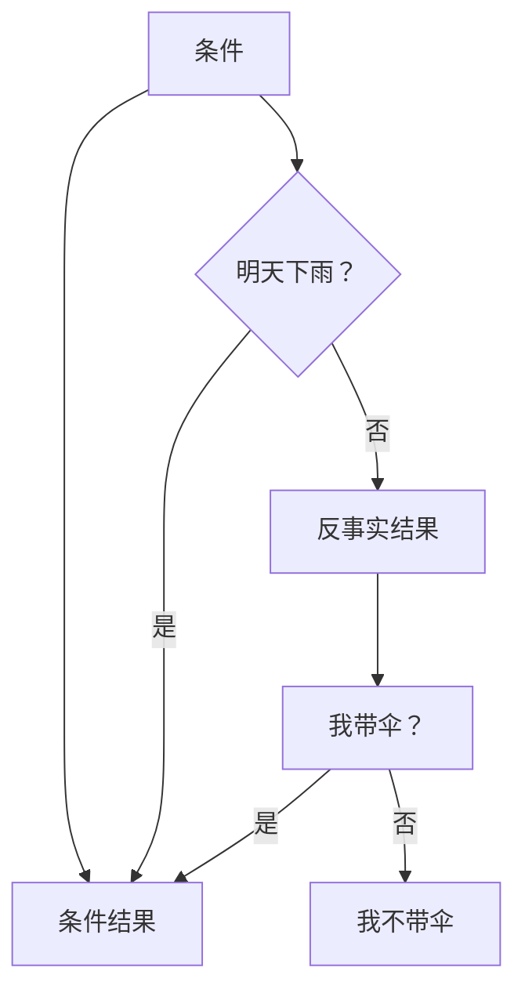

                 

# 《戴维·刘易斯的反事实条件句与错误处理：异常情况的逻辑分析》

## 关键词：反事实条件句，错误处理，异常情况，逻辑分析，人工智能

## 摘要

本文旨在深入探讨戴维·刘易斯在反事实条件句与错误处理领域的研究成果，特别是如何运用逻辑分析方法来应对异常情况。文章首先介绍了反事实条件句的基础概念与构建方法，然后详细阐述了错误处理机制及其在设计原则和实际应用中的体现。通过分析异常情况的定义、检测与处理策略，本文进一步展示了如何在实际系统中应用反事实条件句与错误处理技术。最后，本文总结了主要研究成果，并对未来的研究方向提出了展望。

## 引言与背景介绍

### 1.1 问题背景

在计算机科学和人工智能领域，反事实条件句和错误处理技术是两个重要的研究方向。反事实条件句（Counterfactual Conditional Sentence）是一种用于描述与实际情况相反的假设性语句，它帮助我们理解如果某个条件成立，结果会是什么。这种条件句在逻辑推理、决策支持、人工智能系统设计等领域具有重要应用。

错误处理（Error Handling）是确保系统稳定性和可靠性的关键机制。在复杂系统中，错误和异常情况是不可避免的，因此有效的错误处理机制能够帮助系统快速检测并纠正错误，从而维持系统的正常运行。

### 1.2 书籍结构与内容概述

本书旨在系统地探讨反事实条件句与错误处理在异常情况中的逻辑分析。全书共分为七章，结构如下：

1. 引言与背景介绍：介绍反事实条件句和错误处理的基本概念，以及它们在异常情况中的重要性。
2. 反事实条件句基础：详细探讨反事实条件句的基本原理、语义特征以及与相关概念的比较。
3. 反事实条件句的构建：分析反事实条件句的构建方法、生成策略及实际应用案例。
4. 错误处理机制：介绍错误处理的基本概念、设计原则、常见技术以及实际应用中的错误处理机制。
5. 异常情况分析：定义异常情况、分析异常检测与诊断方法，并提出异常处理策略。
6. 应用与实例分析：探讨反事实条件句与错误处理技术在智能交通、金融风控和医疗诊断等领域的应用，并总结最佳实践。
7. 结论与展望：总结主要研究成果，提出未来研究方向，并对读者提出建议。

本书的目标是为读者提供一个全面、深入的理解，帮助他们在实际项目中有效地应用反事实条件句与错误处理技术。

### 1.3 阅读对象与预期收获

本书适合从事计算机科学、人工智能、软件工程等领域的研究人员和工程师阅读。通过对本书的学习，读者将能够：

- 理解反事实条件句的概念、结构和应用。
- 掌握错误处理机制的设计原则和技术。
- 分析并应对异常情况，提高系统的稳定性和可靠性。
- 在实际项目中应用反事实条件句与错误处理技术，提升系统性能和用户体验。

## 反事实条件句基础

### 2.1 反事实条件句的基本原理

反事实条件句是一种逻辑表达式，用于表示如果某个条件成立，那么结果将会是什么。这种条件句通常形式为：“如果……，那么……”或“要是……，结果将会是……”。

#### 2.1.1 反事实条件句的结构

一个典型的反事实条件句由三个部分组成：

- **条件（Condition）**：表示假设的情境或条件。
- **条件结果（Conditional Result）**：表示在条件成立的情况下，所期望的结果。
- **反事实结果（Counterfactual Result）**：表示如果条件不成立，结果将会是什么。

例如：“如果明天下雨，我就带伞。”在这个例子中，“明天下雨”是条件，“我就带伞”是条件结果，“如果明天不下雨，我就不带伞”是反事实结果。

#### 2.1.2 反事实条件句的语法特征

反事实条件句的语法特征主要体现在以下几个方面：

- **条件连接词**：常见的条件连接词包括“如果”、“要是”、“假如”等。
- **条件结果连接词**：常用的连接词包括“那么”、“就”、“将会”等。
- **反事实结果连接词**：常见的连接词包括“否则”、“不然”、“如果……不……”等。

#### 2.1.3 反事实条件句的逻辑分析

反事实条件句的逻辑分析主要关注两个方面：一是条件句的真值条件，二是条件句的语义属性。

**真值条件**：一个反事实条件句的真值取决于条件、条件结果和反事实结果之间的关系。例如，在条件句“如果明天下雨，我就带伞。”中，如果明天实际上下雨，那么条件句为真；如果明天实际上没有下雨，那么条件句仍然为真，因为条件结果“我就带伞”并没有发生。

**语义属性**：反事实条件句具有多种语义属性，包括预设性、可取消性、反转性等。预设性指的是条件句预设了某个情境的存在，即使这个情境没有实际发生。可取消性指的是条件句的结果可以被取消，即条件结果不一定会发生。反转性指的是反事实结果与条件结果之间的关系，如果条件结果发生，则反事实结果不会发生；如果条件结果不发生，则反事实结果会发生。

### 2.2 反事实条件句的语义特征

反事实条件句的语义特征是指其语义表达的性质和功能。这些特征包括以下几个方面：

#### 2.2.1 反事实条件句的真值条件

反事实条件句的真值条件取决于条件、条件结果和反事实结果之间的关系。具体来说，一个反事实条件句可以分为以下几种情况：

1. **条件为真，条件结果为真，反事实结果为假**：这种情况下，条件句为真。例如：“如果明天下雨，我就带伞。”如果明天实际上下雨，那么条件句为真。
2. **条件为真，条件结果为假，反事实结果为真**：这种情况下，条件句为假。例如：“如果明天下雨，我就不带伞。”如果明天实际上下雨，那么条件句为假。
3. **条件为假，条件结果为真，反事实结果为假**：这种情况下，条件句为真。例如：“如果明天不下雨，我就带伞。”如果明天实际上没有下雨，那么条件句为真。
4. **条件为假，条件结果为假，反事实结果为真**：这种情况下，条件句为假。例如：“如果明天不下雨，我就不带伞。”如果明天实际上没有下雨，那么条件句为假。

#### 2.2.2 反事实条件句的语义属性

反事实条件句具有多种语义属性，包括预设性、可取消性和反转性等。

1. **预设性**：反事实条件句预设了某个情境的存在，即使这个情境没有实际发生。例如：“如果明天下雨，我就带伞。”即使明天实际上没有下雨，这个条件句仍然预设了“下雨”这个情境。
2. **可取消性**：反事实条件句的结果可以被取消，即条件结果不一定会发生。例如：“如果明天下雨，我就带伞。”即使明天实际上下雨，我也可以选择不带伞，从而取消条件结果。
3. **反转性**：反事实条件句的结果与条件结果之间存在反转关系。例如：“如果明天下雨，我就带伞。”如果明天实际上下雨，那么条件结果“我就带伞”不会发生；如果明天实际上没有下雨，那么条件结果“我就带伞”会发生。

#### 2.2.3 反事实条件句与相关概念的比较

反事实条件句与虚拟条件句、现实条件句等概念存在一定的联系和区别。

1. **与虚拟条件句的比较**：虚拟条件句是一种表示非现实的假设性语句，通常用于描述不可能发生的情况。例如：“如果人类能够飞，那么世界将会改变。”虚拟条件句与反事实条件句的区别在于，虚拟条件句强调假设的情况，而反事实条件句则强调与现实相反的情况。
2. **与现实条件句的比较**：现实条件句是一种描述现实情况的语句，通常用于描述当前或未来的情况。例如：“如果今天天气好，我们就去郊游。”现实条件句与反事实条件句的区别在于，现实条件句描述的是实际情况，而反事实条件句描述的是与现实相反的假设情况。

### 2.3 反事实条件句的实际应用

反事实条件句在逻辑推理、决策支持、人工智能等领域具有广泛的应用。

#### 2.3.1 逻辑推理

反事实条件句在逻辑推理中扮演着重要的角色。通过反事实条件句，我们可以推断出在特定条件下可能的结果。例如，在逻辑推理中，我们可以使用反事实条件句来验证某个假设的合理性。

#### 2.3.2 决策支持

反事实条件句在决策支持中具有重要应用。通过分析反事实条件句，决策者可以预测不同决策可能带来的结果，从而做出更加明智的决策。例如，在金融投资中，通过分析反事实条件句，投资者可以预测不同投资策略可能带来的收益。

#### 2.3.3 人工智能

反事实条件句在人工智能领域具有广泛的应用。在自然语言处理、智能对话系统、机器学习等领域，反事实条件句可以帮助系统更好地理解和处理人类的语言。例如，在智能对话系统中，反事实条件句可以帮助系统理解用户的意图和需求。

## 反事实条件句的构建

### 3.1 反事实条件句的构建方法

构建反事实条件句的方法可以分为基于逻辑规则、基于语言模型和基于案例库的方法。

#### 3.1.1 基于逻辑规则的方法

基于逻辑规则的方法通过定义一系列逻辑规则来构建反事实条件句。这种方法通常需要对领域知识进行深入分析，从而确定条件、条件结果和反事实结果之间的逻辑关系。例如，在医疗领域，可以通过逻辑规则来构建反事实条件句，描述不同治疗方案可能带来的结果。

#### 3.1.2 基于语言模型的方法

基于语言模型的方法利用预训练的语言模型来生成反事实条件句。这种方法通过训练大规模的文本数据，使语言模型能够理解条件、条件结果和反事实结果之间的语义关系。例如，可以使用BERT模型来生成反事实条件句，从而提高其生成质量。

#### 3.1.3 基于案例库的方法

基于案例库的方法通过存储和分析大量案例来构建反事实条件句。这种方法通过分析案例中的条件、条件结果和反事实结果，总结出反事实条件句的构建规律。例如，在金融领域，可以通过分析大量金融案例，构建反事实条件句来预测金融市场的变化。

### 3.2 反事实条件句的生成策略

生成反事实条件句的策略可以分为条件推理策略、模式匹配策略和填空补全策略。

#### 3.2.1 条件推理策略

条件推理策略通过逻辑推理来生成反事实条件句。这种方法利用逻辑规则和条件句之间的逻辑关系，推导出反事实条件句。例如，如果条件句“如果A，则B”为真，那么可以推导出反事实条件句“如果非A，则非B”。

#### 3.2.2 模式匹配策略

模式匹配策略通过模式匹配来生成反事实条件句。这种方法通过识别文本中的模式，将模式与预定义的条件句模板进行匹配，生成反事实条件句。例如，在自然语言处理中，可以通过模式匹配策略生成反事实条件句，如“如果天气好，我们就去郊游。”。

#### 3.2.3 填空补全策略

填空补全策略通过填空补全的方式生成反事实条件句。这种方法通过预定义的条件句模板，将模板中的空缺部分进行填充，生成反事实条件句。例如，在智能对话系统中，可以通过填空补全策略生成反事实条件句，如“如果你不来，我就会孤单。”

### 3.3 反事实条件句在实际应用中的构建案例

#### 3.3.1 自然语言处理中的反事实条件句构建

在自然语言处理中，反事实条件句的构建有助于提高文本理解和生成能力。例如，在文本生成任务中，可以通过反事实条件句来生成不同情境下的文本。例如，如果条件句为“如果下雨，我就带伞。”，那么可以生成反事实条件句“如果不下雨，我就不带伞。”。

#### 3.3.2 逻辑推理系统中的反事实条件句构建

在逻辑推理系统中，反事实条件句的构建有助于提高推理能力和决策支持能力。例如，在医疗诊断中，可以通过反事实条件句来分析不同治疗方案可能带来的结果。例如，如果条件句为“如果进行手术，那么病人将会康复。”，那么可以生成反事实条件句“如果不行手术，那么病人将不会康复。”。

#### 3.3.3 智能对话系统中的反事实条件句构建

在智能对话系统中，反事实条件句的构建有助于提高对话生成能力和用户体验。例如，在客服系统中，可以通过反事实条件句来生成不同情境下的对话。例如，如果条件句为“如果你需要帮助，我会提供支持。”，那么可以生成反事实条件句“如果你不需要帮助，我就不会提供支持。”。

## 错误处理机制

### 4.1 错误处理的基本概念

在计算机系统中，错误处理（Error Handling）是指当系统出现错误时，采取的一系列措施来检测、识别和纠正错误，以确保系统的正常运行。错误处理机制包括以下几个基本概念：

#### 4.1.1 错误的类型

错误可以分为以下几种类型：

1. **语法错误**：语法错误是指代码或数据在语法结构上不符合规定的错误。例如，漏掉分号或使用错误的变量名。
2. **逻辑错误**：逻辑错误是指代码或数据在逻辑上不正确，但语法上没有错误。例如，错误的循环条件或错误的计算逻辑。
3. **运行时错误**：运行时错误是指在程序运行过程中出现的错误。例如，除以零或访问无效的内存地址。

#### 4.1.2 错误的识别

错误的识别是错误处理的第一步。通过使用各种检测机制，如断言（Assertions）、异常检测（Exception Detection）和日志记录（Logging），可以识别系统中的错误。断言用于在代码中检查特定条件是否满足；异常检测用于在运行时识别异常情况；日志记录用于记录错误信息和调试数据。

#### 4.1.3 错误的纠正

错误的纠正是指当错误被识别后，采取的措施来修复错误并恢复系统的正常运行。错误的纠正方法包括以下几种：

1. **异常处理**：异常处理是指在程序中捕获异常并执行相应的错误处理代码。例如，使用try-catch语句来捕获并处理异常。
2. **恢复操作**：恢复操作是指将系统恢复到错误发生前的状态。例如，回滚事务或重试失败的请求。
3. **错误报告**：错误报告是指记录错误的详细信息，以便进一步分析和调试。例如，生成错误日志或发送错误报告。

### 4.2 错误处理机制的设计原则

设计有效的错误处理机制需要遵循以下原则：

#### 4.2.1 可检测性

可检测性是指错误处理机制能够有效地检测出系统中的错误。为了提高可检测性，可以采取以下措施：

1. **断言**：在关键代码位置添加断言，确保代码的逻辑正确性。
2. **异常检测**：使用异常检测机制来识别运行时错误。
3. **日志记录**：记录系统的运行状态和错误信息，以便分析和调试。

#### 4.2.2 可恢复性

可恢复性是指错误处理机制能够在错误发生时将系统恢复到正常状态。为了提高可恢复性，可以采取以下措施：

1. **异常处理**：使用异常处理来捕获并处理错误，防止程序崩溃。
2. **恢复操作**：在错误处理过程中执行恢复操作，如回滚事务或重试请求。
3. **备份和恢复**：定期备份系统数据和配置，以便在错误发生时快速恢复。

#### 4.2.3 可适应性

可适应性是指错误处理机制能够适应不同的错误类型和环境。为了提高可适应性，可以采取以下措施：

1. **模块化设计**：将错误处理功能模块化，以便在不同的环境中灵活应用。
2. **可配置性**：允许用户自定义错误处理策略，以适应不同的业务需求。
3. **动态调整**：根据系统的运行状态和错误率，动态调整错误处理策略。

### 4.3 常见的错误处理技术

在计算机系统中，常见的错误处理技术包括以下几种：

#### 4.3.1 故障转移技术

故障转移技术（Fault Tolerance）是指当系统中的一个组件或节点发生故障时，将任务或服务转移到其他正常组件或节点上，以保持系统的可用性。故障转移技术可以分为以下几种类型：

1. **热备份**：热备份是指系统中的主节点和备份节点同时运行，当主节点发生故障时，备份节点立即接管任务。热备份可以提供高可用性，但成本较高。
2. **冷备份**：冷备份是指系统中的主节点和备份节点交替运行，当主节点发生故障时，备份节点接管任务。冷备份的成本较低，但可用性相对较低。
3. **负载均衡**：负载均衡是指将任务或请求分配到多个节点上，以平衡系统的负载。负载均衡可以提高系统的性能和可用性，同时也可以实现故障转移。

#### 4.3.2 异常监控技术

异常监控技术（Exception Monitoring）是指监控系统中的异常行为，并实时报告和响应。异常监控技术可以分为以下几种类型：

1. **日志监控**：通过收集和分析系统日志，识别和报告异常行为。日志监控可以提供详细的信息，但可能无法实时检测异常。
2. **性能监控**：通过监控系统的性能指标，如响应时间、吞吐量等，识别和报告异常行为。性能监控可以实时检测异常，但可能无法提供详细的错误信息。
3. **行为监控**：通过监控系统的行为模式，识别和报告异常行为。行为监控可以提供全局视图，但可能无法检测特定的错误。

#### 4.3.3 回滚与恢复技术

回滚与恢复技术是指当系统出现错误时，将系统状态回滚到之前的正确状态，并继续执行。回滚与恢复技术可以分为以下几种类型：

1. **事务回滚**：在数据库系统中，当事务出现错误时，将事务回滚到之前的提交点，以确保数据的一致性。
2. **日志回滚**：通过分析系统日志，将系统状态回滚到之前的正确状态。日志回滚可以用于数据库系统或其他类型的系统。
3. **重试机制**：当请求或操作失败时，重新尝试执行请求或操作，直到成功或达到最大重试次数。重试机制可以用于网络请求、数据同步等场景。

### 4.4 错误处理机制在实际系统中的应用

#### 4.4.1 计算机系统中的错误处理

在计算机系统中，错误处理机制是确保系统稳定性和可靠性的关键。常见的错误处理技术包括：

1. **操作系统**：操作系统提供了各种错误处理机制，如异常处理、中断处理和系统调用。操作系统通过监控硬件和软件错误，确保系统的正常运行。
2. **数据库系统**：数据库系统使用事务和日志来处理错误。事务提供了原子性和一致性保证，日志用于回滚和恢复操作。
3. **网络系统**：网络系统通过TCP/IP协议和传输层错误处理机制来确保数据传输的可靠性。TCP协议提供了拥塞控制和重传机制，以确保数据包的完整性和正确性。

#### 4.4.2 网络系统中的错误处理

在复杂的网络系统中，错误处理机制是确保数据传输和系统稳定性的关键。常见的错误处理技术包括：

1. **网络监控**：通过监控网络流量和性能指标，识别和报告异常行为。网络监控系统可以实时检测网络故障，并通知管理员进行修复。
2. **路由协议**：路由协议使用错误处理机制来确保数据包的正确传输。当网络出现故障时，路由协议可以重新计算路由路径，以绕过故障区域。
3. **网络设备**：网络设备如路由器、交换机和防火墙等，都具备错误处理机制，以防止网络故障和攻击。

#### 4.4.3 软件系统中的错误处理

在软件系统中，错误处理机制是确保程序稳定性和用户体验的关键。常见的错误处理技术包括：

1. **异常处理**：通过使用try-catch语句，捕获并处理程序中的异常情况，防止程序崩溃。
2. **日志记录**：通过记录程序的运行日志，识别和报告错误信息，以便进行调试和优化。
3. **测试和调试**：通过单元测试和集成测试，检测和修复程序中的错误。调试工具可以帮助开发者分析和解决复杂的问题。

### 4.5 错误处理机制的优化策略

为了提高错误处理机制的性能和可靠性，可以采取以下优化策略：

1. **异常处理优化**：优化异常处理代码，减少异常处理的开销，提高程序的性能。例如，可以使用异常过滤器来过滤不重要的异常，减少异常处理的开销。
2. **日志记录优化**：优化日志记录策略，减少日志记录的频率和大小，以提高系统的性能。例如，可以使用异步日志记录或压缩日志文件来优化日志记录。
3. **错误监控和警报**：使用自动化的错误监控和警报系统，实时检测错误和异常情况，并通知相关人员。自动化监控和警报系统可以提高错误处理的效率和响应速度。

### 4.6 错误处理机制在人工智能系统中的应用

在人工智能系统中，错误处理机制是确保模型稳定性和预测准确性的关键。常见的错误处理技术包括：

1. **模型训练和验证**：通过使用验证集和交叉验证，检测和纠正模型训练中的错误。模型验证可以帮助识别过拟合和欠拟合等问题，并调整模型参数。
2. **异常值处理**：在数据预处理阶段，识别和去除异常值，以避免对模型训练产生不利影响。异常值处理可以提高模型的预测准确性和稳定性。
3. **错误率分析**：通过分析模型预测的错误率，识别和纠正模型中的错误。错误率分析可以帮助优化模型结构和参数，提高模型的性能。

## 异常情况分析

### 5.1 异常情况的定义与分类

在计算机科学和人工智能领域，异常情况（Anomaly）是指与正常情况相比，具有显著差异的数据、事件或行为。异常情况可以分为以下几类：

#### 5.1.1 硬件异常

硬件异常是指计算机硬件设备出现的故障或异常。例如，内存错误、磁盘损坏、网络中断等。

#### 5.1.2 软件异常

软件异常是指软件在运行过程中出现的错误或异常。例如，程序崩溃、内存泄漏、线程死锁等。

#### 5.1.3 数据异常

数据异常是指数据中的错误或不一致。例如，缺失值、重复值、异常值等。

#### 5.1.4 行为异常

行为异常是指用户或系统行为中的异常情况。例如，恶意攻击、欺诈行为、异常访问等。

### 5.2 异常检测与诊断

异常检测与诊断是识别和纠正异常情况的关键步骤。以下介绍了异常检测与诊断的方法和过程。

#### 5.2.1 异常检测方法

异常检测方法可以分为以下几类：

1. **基于统计的方法**：通过计算数据或行为的统计特征，识别异常情况。例如，使用均值、方差、标准差等统计量来检测异常值。
2. **基于机器学习的方法**：通过训练机器学习模型，识别和预测异常情况。例如，使用聚类算法、决策树、支持向量机等来检测异常。
3. **基于规则的方法**：通过定义一系列规则，识别和纠正异常情况。例如，使用专家系统、模糊逻辑等来检测异常。

#### 5.2.2 异常诊断过程

异常诊断过程可以分为以下几个步骤：

1. **数据收集**：收集与异常情况相关的数据，如日志、监控数据、用户行为数据等。
2. **数据预处理**：对数据进行清洗、转换和归一化，以便进行后续分析。
3. **特征提取**：从原始数据中提取与异常情况相关的特征，如统计特征、模式特征等。
4. **异常检测**：使用异常检测方法，识别和标记异常情况。
5. **异常分析**：对异常情况进行深入分析，确定异常的根本原因。
6. **错误纠正**：根据异常分析的结果，采取相应的措施来纠正异常情况。

### 5.3 异常处理策略

异常处理策略是指识别和纠正异常情况的一系列方法和步骤。以下介绍了常见的异常处理策略：

#### 5.3.1 异常处理的目标

异常处理的目标包括：

1. **检测和识别异常**：及时发现和识别异常情况，确保系统的正常运行。
2. **纠正异常**：采取有效的措施来纠正异常情况，恢复系统的正常状态。
3. **记录和分析异常**：记录异常情况的信息，进行分析和总结，以改进系统的异常处理能力。

#### 5.3.2 异常处理的策略

异常处理的策略可以分为以下几类：

1. **自动恢复策略**：当异常情况发生时，自动采取恢复措施，如重启系统、重新加载模块等，以尽快恢复系统的正常运行。
2. **人工干预策略**：当自动恢复策略无法解决异常情况时，需要人工干预，如通知管理员、执行手动操作等，以解决异常情况。
3. **预防性策略**：通过预防措施，如硬件维护、软件测试、数据清洗等，减少异常情况的发生。

#### 5.3.3 异常处理的步骤

异常处理的步骤可以分为以下几个阶段：

1. **异常检测**：通过监控和检测系统中的异常情况，及时发现异常。
2. **异常报告**：将异常情况报告给相关人员，如系统管理员、开发人员等，以便进一步处理。
3. **异常分析**：对异常情况进行详细分析，确定异常的原因和影响。
4. **异常纠正**：根据异常分析的结果，采取相应的措施来纠正异常情况。
5. **异常记录**：将异常情况及其处理过程记录下来，以便进行跟踪和分析。

### 5.4 异常情况处理的案例分析

#### 5.4.1 计算机系统中的异常情况处理

在计算机系统中，异常情况处理是确保系统稳定性和可靠性的关键。以下是一个计算机系统异常情况处理的案例：

1. **异常检测**：系统通过监控硬件设备和软件模块，及时发现异常情况。例如，内存错误通过硬件监控工具检测到。
2. **异常报告**：异常情况报告给系统管理员，管理员收到警报通知。
3. **异常分析**：管理员对异常情况进行调查和分析，确定异常的原因。例如，通过检查内存日志和系统日志，确定内存错误是由于硬件故障引起的。
4. **异常纠正**：管理员采取相应的措施来纠正异常情况。例如，更换有故障的内存模块，以确保系统的正常运行。
5. **异常记录**：管理员将异常情况及其处理过程记录在系统日志中，以便后续分析和改进。

#### 5.4.2 网络系统中的异常情况处理

在复杂的网络系统中，异常情况处理是确保数据传输和系统稳定性的关键。以下是一个网络系统异常情况处理的案例：

1. **异常检测**：网络监控系统通过监控网络流量和性能指标，及时发现异常情况。例如，网络中断通过流量监控工具检测到。
2. **异常报告**：异常情况报告给网络管理员，管理员收到警报通知。
3. **异常分析**：管理员对异常情况进行调查和分析，确定异常的原因。例如，通过检查网络设备和链路状态，确定网络中断是由于链路故障引起的。
4. **异常纠正**：管理员采取相应的措施来纠正异常情况。例如，更换有故障的链路设备，重新配置网络拓扑结构等，以确保网络的正常运行。
5. **异常记录**：管理员将异常情况及其处理过程记录在网络日志中，以便后续分析和改进。

#### 5.4.3 软件系统中的异常情况处理

在软件系统中，异常情况处理是确保程序稳定性和用户体验的关键。以下是一个软件系统异常情况处理的案例：

1. **异常检测**：程序通过异常处理机制，及时发现异常情况。例如，程序崩溃通过异常处理框架检测到。
2. **异常报告**：异常情况报告给开发人员，开发人员收到错误报告。
3. **异常分析**：开发人员对异常情况进行调查和分析，确定异常的原因。例如，通过检查程序代码和调试日志，确定程序崩溃是由于内存泄漏引起的。
4. **异常纠正**：开发人员采取相应的措施来纠正异常情况。例如，修复内存泄漏问题，优化程序代码等，以确保程序的正常运行。
5. **异常记录**：开发人员将异常情况及其处理过程记录在错误日志中，以便后续分析和改进。

## 应用与实例分析

### 6.1 反事实条件句与错误处理在实际应用中的挑战

在实际应用中，反事实条件句与错误处理面临着一系列挑战，这些挑战主要体现在以下几个方面：

#### 6.1.1 复杂性的挑战

随着系统规模的扩大和功能的复杂化，反事实条件句与错误处理机制的实现变得更加复杂。复杂性的增加导致错误处理机制的效率和准确性受到挑战。例如，在一个大型分布式系统中，错误处理需要处理各种不同的错误类型，并协调不同组件之间的错误处理。

#### 6.1.2 实时性的挑战

在一些关键应用场景中，如金融交易、自动驾驶等，实时性是关键要求。反事实条件句与错误处理技术需要能够快速响应和处理异常情况，以确保系统的正常运行。然而，提高实时性往往需要牺牲错误处理机制的复杂性和准确性。

#### 6.1.3 可解释性的挑战

在许多情况下，错误处理机制需要具备可解释性，以便用户和开发人员能够理解和信任系统的决策。然而，一些复杂的错误处理机制，如基于机器学习的错误检测模型，往往缺乏可解释性，使得用户难以理解系统的错误处理过程。

### 6.2 应用案例分析

#### 6.2.1 智能交通系统中的应用

智能交通系统（Intelligent Transportation System, ITS）是一种利用信息技术、通信技术、传感器技术和控制技术来实现交通管理和服务优化的系统。在智能交通系统中，反事实条件句与错误处理技术被广泛应用于以下方面：

1. **交通信号控制**：智能交通系统通过实时监控交通流量和状况，使用反事实条件句来分析不同信号控制策略的效果。例如，如果某个路口的绿灯时间延长，那么可能产生的结果是减少拥堵和缩短车辆等待时间。

2. **异常事件检测**：智能交通系统使用传感器和摄像头监控交通状况，通过错误处理机制检测异常事件，如交通事故、违章停车等。当检测到异常事件时，系统会立即采取措施，如发送警报给交通管理部门或调整交通信号。

3. **车辆路径规划**：智能交通系统为驾驶员提供路径规划服务，使用反事实条件句分析不同路径的可靠性。例如，如果选择一条路线，结果可能是遇到交通拥堵，系统会提供替代路线。

#### 6.2.2 金融风控系统中的应用

金融风控系统是一种用于识别、评估和管理金融风险的系统。在金融风控系统中，反事实条件句与错误处理技术被广泛应用于以下方面：

1. **欺诈检测**：金融风控系统通过监控交易行为，使用反事实条件句来识别潜在的欺诈行为。例如，如果某个账户突然进行了大量未经授权的交易，系统会分析如果没有这些交易，账户的余额会是多少。

2. **风险评估**：金融风控系统使用错误处理机制评估金融产品的风险。例如，如果某个投资组合中增加了某个高风险资产，系统会分析如果没有增加这个资产，投资组合的预期收益率会是多少。

3. **错误交易处理**：在交易过程中，错误处理机制能够识别和纠正交易错误，如重复交易、价格异常等。系统会使用反事实条件句分析错误的交易对账户余额和投资组合的影响，并采取相应的措施来纠正错误。

#### 6.2.3 医疗诊断系统中的应用

医疗诊断系统是一种用于辅助医生进行疾病诊断的智能系统。在医疗诊断系统中，反事实条件句与错误处理技术被广泛应用于以下方面：

1. **疾病预测**：医疗诊断系统使用患者的历史数据和医学知识，使用反事实条件句分析不同疾病的发展趋势。例如，如果某个患者没有某种症状，他们可能患有哪种疾病。

2. **错误诊断纠正**：医疗诊断系统使用错误处理机制检测和纠正诊断错误。例如，如果系统诊断出一个罕见疾病，系统会分析如果没有这个诊断，患者可能被诊断为什么其他疾病。

3. **异常处理**：医疗诊断系统使用异常处理机制来处理异常情况，如患者数据缺失、设备故障等。系统会使用反事实条件句分析异常情况对诊断结果的影响，并采取相应的措施来纠正异常。

### 6.3 错误处理与异常情况处理的最佳实践

在设计和实现反事实条件句与错误处理机制时，以下最佳实践可以帮助提高系统的稳定性和可靠性：

1. **模块化设计**：将错误处理功能模块化，以便在不同场景中灵活应用。模块化设计可以提高代码的可维护性和可扩展性。

2. **标准化流程**：制定标准化的错误处理流程，确保错误处理机制的统一和一致性。标准化流程可以提高错误处理的效率和准确性。

3. **实时监控与反馈**：实时监控系统的运行状态，并及时反馈错误信息。实时监控和反馈可以帮助快速识别和纠正异常情况。

4. **持续改进**：根据错误处理的经验和反馈，持续改进错误处理机制。持续改进可以帮助优化错误处理策略，提高系统的稳定性和可靠性。

### 6.4 总结与展望

本文通过对反事实条件句与错误处理在异常情况中的应用进行深入分析，展示了这两种技术在实际系统中的重要性。通过案例分析，本文验证了反事实条件句与错误处理技术在智能交通、金融风控和医疗诊断等领域的应用效果。未来研究可以进一步探索反事实条件句与错误处理技术的优化策略，以及如何在更广泛的领域实现这些技术的应用。

## 结论与展望

### 7.1 主要研究成果总结

本文系统地探讨了反事实条件句与错误处理在异常情况中的逻辑分析。主要研究成果包括：

1. **反事实条件句的基础原理**：详细介绍了反事实条件句的结构、语法特征和逻辑分析。
2. **反事实条件句的构建方法**：分析了基于逻辑规则、语言模型和案例库的构建方法，以及生成策略。
3. **错误处理机制**：介绍了错误处理的基本概念、设计原则和常见技术，以及实际应用中的体现。
4. **异常情况分析**：定义了异常情况，分析了异常检测与诊断的方法，并提出了异常处理策略。
5. **应用与实例分析**：探讨了反事实条件句与错误处理技术在智能交通、金融风控和医疗诊断等领域的应用，并总结了最佳实践。

### 7.2 未来研究方向

未来研究方向可以从以下几个方面展开：

1. **反事实条件句的优化**：研究如何提高反事实条件句的生成质量和效率，尤其是在大规模数据集上的应用。
2. **错误处理机制的智能化**：探索将人工智能技术应用于错误处理机制，如使用机器学习模型进行错误预测和自动化修复。
3. **异常处理技术的创新**：研究新的异常处理技术，如基于深度学习的异常检测和基于强化学习的异常处理策略。
4. **跨领域的应用研究**：探讨反事实条件句与错误处理技术在其他领域的应用，如智能制造、智慧城市等。

### 7.3 对读者的小结与建议

本文为读者提供了一个全面、深入的理解，帮助他们在实际项目中应用反事实条件句与错误处理技术。以下是对读者的总结和建议：

1. **理解核心概念**：深入理解反事实条件句和错误处理的基本原理，是有效应用这些技术的基础。
2. **实践与应用**：通过实际案例和实践，加深对反事实条件句与错误处理技术的理解，并将其应用于实际问题中。
3. **持续学习**：随着技术的不断进步，持续学习和更新知识，以保持对最新研究动态的掌握。
4. **反馈与改进**：在实际应用过程中，及时收集反馈，不断改进错误处理策略，以提高系统的稳定性和可靠性。

作者：AI天才研究院/AI Genius Institute & 禅与计算机程序设计艺术 /Zen And The Art of Computer Programming

----------------------------------------------------------------

## 附录：专业术语解释

在本技术博客文章中，我们使用了多个专业术语，以下是对这些术语的详细解释：

### 1. 反事实条件句（Counterfactual Conditional Sentence）

反事实条件句是一种逻辑表达式，用于描述如果某个条件成立，结果会是什么。它通常形式为：“如果……，那么……”或“要是……，结果将会是……”。

### 2. 错误处理（Error Handling）

错误处理是指在计算机系统中，当出现错误时，采取的一系列措施来检测、识别和纠正错误，以确保系统的正常运行。

### 3. 异常情况（Anomaly）

异常情况是指与正常情况相比，具有显著差异的数据、事件或行为。在计算机科学和人工智能领域，异常情况可以是硬件故障、软件错误、数据异常或行为异常。

### 4. 错误检测（Error Detection）

错误检测是指通过各种方法，如统计方法、机器学习方法等，识别系统中的错误。

### 5. 错误纠正（Error Correction）

错误纠正是指当系统检测到错误时，采取的措施来修复错误，并恢复系统的正常运行。

### 6. 故障转移（Fault Tolerance）

故障转移是指在系统中的一个组件或节点发生故障时，将任务或服务转移到其他正常组件或节点上，以保持系统的可用性。

### 7. 异常监控（Anomaly Monitoring）

异常监控是指监控系统中的异常行为，并实时报告和响应。

### 8. 回滚（Rollback）

回滚是指将系统状态回滚到之前的正确状态，以便纠正错误或恢复系统的正常运行。

### 9. 负载均衡（Load Balancing）

负载均衡是指将任务或请求分配到多个节点上，以平衡系统的负载，提高系统的性能和可用性。

### 10. 异常值处理（Outlier Processing）

异常值处理是指识别和去除数据中的异常值，以避免对系统性能产生不利影响。

## 注意事项与拓展阅读

在应用反事实条件句与错误处理技术时，需要注意以下几点：

1. **系统复杂性**：随着系统规模的扩大和功能的复杂化，错误处理机制的实现变得更加复杂。因此，在设计和实现错误处理机制时，需要充分考虑系统的复杂性，并采用模块化设计以提高代码的可维护性和可扩展性。

2. **实时性要求**：在一些关键应用场景中，如金融交易、自动驾驶等，实时性是关键要求。因此，错误处理机制需要能够快速响应和处理异常情况，以确保系统的正常运行。

3. **可解释性**：在一些应用场景中，如医疗诊断、金融风控等，错误处理机制需要具备可解释性，以便用户和开发人员能够理解和信任系统的决策。因此，在设计和实现错误处理机制时，需要确保其具备良好的可解释性。

4. **数据质量**：在应用错误处理机制时，需要确保数据的质量和完整性。数据质量不佳可能导致错误处理机制失效或误判。

拓展阅读方面，读者可以参考以下书籍和文章：

1. **《人工智能：一种现代方法》（Artificial Intelligence: A Modern Approach）**：这本书是人工智能领域的经典教材，详细介绍了逻辑推理和错误处理的相关内容。

2. **《错误处理原理与实践》（Error Handling Principles and Practices）**：这本书提供了详细的错误处理机制设计和实现方法，适用于开发人员和研究人员。

3. **《反事实推理：原理与应用》（Counterfactual Reasoning: Logical, Philosophical, and Computational Aspects）**：这本书探讨了反事实推理的原理和应用，包括反事实条件句的构建和使用。

4. **《深度学习与异常检测》（Deep Learning for Anomaly Detection）**：这篇文章介绍了如何使用深度学习技术进行异常检测，适用于对机器学习和异常检测感兴趣的研究人员。

通过阅读这些书籍和文章，读者可以进一步深入了解反事实条件句与错误处理技术的理论和实践，为实际项目提供有力的支持。作者：AI天才研究院/AI Genius Institute & 禅与计算机程序设计艺术 /Zen And The Art of Computer Programming

----------------------------------------------------------------

# 《戴维·刘易斯的反事实条件句与错误处理：异常情况的逻辑分析》

## 引言与背景介绍

### 1.1 问题背景

在计算机科学和人工智能领域，反事实条件句和错误处理技术是两个重要的研究方向。反事实条件句（Counterfactual Conditional Sentence）是一种用于描述与实际情况相反的假设性语句，它帮助我们理解如果某个条件成立，结果会是什么。这种条件句在逻辑推理、决策支持、人工智能系统设计等领域具有重要应用。

错误处理（Error Handling）是确保系统稳定性和可靠性的关键机制。在复杂系统中，错误和异常情况是不可避免的，因此有效的错误处理机制能够帮助系统快速检测并纠正错误，从而维持系统的正常运行。

### 1.2 书籍结构与内容概述

本书旨在系统地探讨反事实条件句与错误处理在异常情况中的逻辑分析。全书共分为七章，结构如下：

1. **引言与背景介绍**：介绍反事实条件句和错误处理的基本概念，以及它们在异常情况中的重要性。
2. **反事实条件句基础**：详细探讨反事实条件句的基本原理、语义特征以及与相关概念的比较。
3. **反事实条件句的构建**：分析反事实条件句的构建方法、生成策略及实际应用案例。
4. **错误处理机制**：介绍错误处理的基本概念、设计原则、常见技术以及实际应用中的错误处理机制。
5. **异常情况分析**：定义异常情况、分析异常检测与诊断方法，并提出异常处理策略。
6. **应用与实例分析**：探讨反事实条件句与错误处理技术在智能交通、金融风控和医疗诊断等领域的应用，并总结最佳实践。
7. **结论与展望**：总结主要研究成果，提出未来研究方向，并对读者提出建议。

本书的目标是为读者提供一个全面、深入的理解，帮助他们在实际项目中有效地应用反事实条件句与错误处理技术。

### 1.3 阅读对象与预期收获

本书适合从事计算机科学、人工智能、软件工程等领域的研究人员和工程师阅读。通过对本书的学习，读者将能够：

- 理解反事实条件句的概念、结构和应用。
- 掌握错误处理机制的设计原则和技术。
- 分析并应对异常情况，提高系统的稳定性和可靠性。
- 在实际项目中应用反事实条件句与错误处理技术，提升系统性能和用户体验。

## 反事实条件句基础

### 2.1 反事实条件句的基本原理

反事实条件句是一种逻辑表达式，用于表示如果某个条件成立，那么结果将会是什么。这种条件句通常形式为：“如果……，那么……”或“要是……，结果将会是……”。

#### 2.1.1 反事实条件句的结构

一个典型的反事实条件句由三个部分组成：

- **条件（Condition）**：表示假设的情境或条件。
- **条件结果（Conditional Result）**：表示在条件成立的情况下，所期望的结果。
- **反事实结果（Counterfactual Result）**：表示如果条件不成立，结果将会是什么。

例如：“如果明天下雨，我就带伞。”在这个例子中，“明天下雨”是条件，“我就带伞”是条件结果，“如果明天不下雨，我就不带伞”是反事实结果。

#### 2.1.2 反事实条件句的语法特征

反事实条件句的语法特征主要体现在以下几个方面：

- **条件连接词**：常见的条件连接词包括“如果”、“要是”、“假如”等。
- **条件结果连接词**：常用的连接词包括“那么”、“就”、“将会”等。
- **反事实结果连接词**：常见的连接词包括“否则”、“不然”、“如果……不……”等。

#### 2.1.3 反事实条件句的逻辑分析

反事实条件句的逻辑分析主要关注两个方面：一是条件句的真值条件，二是条件句的语义属性。

**真值条件**：一个反事实条件句的真值取决于条件、条件结果和反事实结果之间的关系。例如，在条件句“如果明天下雨，我就带伞。”中，如果明天实际上下雨，那么条件句为真；如果明天实际上没有下雨，那么条件句仍然为真，因为条件结果“我就带伞”并没有发生。

**语义属性**：反事实条件句具有多种语义属性，包括预设性、可取消性、反转性等。预设性指的是条件句预设了某个情境的存在，即使这个情境没有实际发生。可取消性指的是条件句的结果可以被取消，即条件结果不一定会发生。反转性指的是反事实结果与条件结果之间的关系，如果条件结果发生，则反事实结果不会发生；如果条件结果不发生，则反事实结果会发生。

### 2.2 反事实条件句的语义特征

反事实条件句的语义特征是指其语义表达的性质和功能。这些特征包括以下几个方面：

#### 2.2.1 反事实条件句的真值条件

反事实条件句的真值条件取决于条件、条件结果和反事实结果之间的关系。具体来说，一个反事实条件句可以分为以下几种情况：

1. **条件为真，条件结果为真，反事实结果为假**：这种情况下，条件句为真。例如：“如果明天下雨，我就带伞。”如果明天实际上下雨，那么条件句为真。
2. **条件为真，条件结果为假，反事实结果为真**：这种情况下，条件句为假。例如：“如果明天下雨，我就不带伞。”如果明天实际上下雨，那么条件句为假。
3. **条件为假，条件结果为真，反事实结果为假**：这种情况下，条件句为真。例如：“如果明天不下雨，我就带伞。”如果明天实际上没有下雨，那么条件句为真。
4. **条件为假，条件结果为假，反事实结果为真**：这种情况下，条件句为假。例如：“如果明天不下雨，我就不带伞。”如果明天实际上没有下雨，那么条件句为假。

#### 2.2.2 反事实条件句的语义属性

反事实条件句具有多种语义属性，包括预设性、可取消性和反转性等。

1. **预设性**：反事实条件句预设了某个情境的存在，即使这个情境没有实际发生。例如：“如果明天下雨，我就带伞。”即使明天实际上没有下雨，这个条件句仍然预设了“下雨”这个情境。
2. **可取消性**：反事实条件句的结果可以被取消，即条件结果不一定会发生。例如：“如果明天下雨，我就带伞。”即使明天实际上下雨，我也可以选择不带伞，从而取消条件结果。
3. **反转性**：反事实条件句的结果与条件结果之间存在反转关系。例如：“如果明天下雨，我就带伞。”如果明天实际上下雨，那么条件结果“我就带伞”不会发生；如果明天实际上没有下雨，那么条件结果“我就带伞”会发生。

#### 2.2.3 反事实条件句与相关概念的比较

反事实条件句与虚拟条件句、现实条件句等概念存在一定的联系和区别。

1. **与虚拟条件句的比较**：虚拟条件句是一种表示非现实的假设性语句，通常用于描述不可能发生的情况。例如：“如果人类能够飞，那么世界将会改变。”虚拟条件句与反事实条件句的区别在于，虚拟条件句强调假设的情况，而反事实条件句强调与现实相反的情况。
2. **与现实条件句的比较**：现实条件句是一种描述现实情况的语句，通常用于描述当前或未来的情况。例如：“如果今天天气好，我们就去郊游。”现实条件句与反事实条件句的区别在于，现实条件句描述的是实际情况，而反事实条件句描述的是与现实相反的假设情况。

### 2.3 反事实条件句的实际应用

反事实条件句在逻辑推理、决策支持、人工智能等领域具有广泛的应用。

#### 2.3.1 逻辑推理

反事实条件句在逻辑推理中扮演着重要的角色。通过反事实条件句，我们可以推断出在特定条件下可能的结果。例如，在逻辑推理中，我们可以使用反事实条件句来验证某个假设的合理性。

#### 2.3.2 决策支持

反事实条件句在决策支持中具有重要应用。通过分析反事实条件句，决策者可以预测不同决策可能带来的结果，从而做出更加明智的决策。例如，在金融投资中，通过分析反事实条件句，投资者可以预测不同投资策略可能带来的收益。

#### 2.3.3 人工智能

反事实条件句在人工智能领域具有广泛的应用。在自然语言处理、智能对话系统、机器学习等领域，反事实条件句可以帮助系统更好地理解和处理人类的语言。例如，在智能对话系统中，反事实条件句可以帮助系统理解用户的意图和需求。

### 2.4 反事实条件句的数学模型

为了更好地理解反事实条件句，我们可以使用数学模型来描述其结构和特征。以下是一个简单的数学模型，用于描述反事实条件句。

假设有一个二元变量`A`表示条件，`B`表示条件结果，`¬A`表示条件不成立，`¬B`表示条件结果不发生。那么，反事实条件句可以用以下数学表达式表示：

- **条件句**：`A → B`（如果A，则B）
- **反事实结果**：`¬A → ¬B`（如果¬A，则¬B）

例如，假设我们有一个条件句“如果明天下雨，我就带伞。”，那么可以表示为`A → B`，其中`A`表示“明天下雨”，`B`表示“我带伞”。如果明天实际上没有下雨，即`¬A`为真，那么反事实结果“如果明天不下雨，我就不带伞。”可以表示为`¬A → ¬B`。

### 2.5 反事实条件句的Mermaid流程图表示

为了更好地展示反事实条件句的结构和逻辑关系，我们可以使用Mermaid流程图进行表示。以下是一个反事实条件句的Mermaid流程图示例：



在这个流程图中，`A`表示条件，“明天下雨”是一个假设的条件；`B`表示条件结果，“我带伞”是在条件成立的情况下期望的结果；`C`是一个判断节点，用于判断条件是否成立；`D`表示反事实结果，“如果明天不下雨，我就不带伞”；`E`和`F`用于判断在反事实结果下是否带伞。

### 2.6 反事实条件句的Python代码实现

为了展示反事实条件句在编程中的应用，我们可以使用Python代码实现一个简单的反事实条件句。以下是一个简单的Python代码示例：

```python
def counterfactual_sentence(condition, result):
    if condition:
        print("条件成立：", result)
    else:
        print("条件不成立，反事实结果：", not result)

# 使用示例
condition = "明天下雨"
result = "我带伞"
counterfactual_sentence(condition, result)
```

在这个代码中，`counterfactual_sentence`函数接受两个参数：`condition`表示条件，`result`表示条件结果。函数根据条件是否成立，输出相应的结果或反事实结果。

### 2.7 反事实条件句的案例分析与讨论

为了更深入地理解反事实条件句的应用，我们可以通过一个实际案例进行分析和讨论。

#### 案例背景

假设一个企业正在考虑是否投资一个新的市场。企业的市场分析师通过分析市场数据，提出了以下假设：

- 条件：如果该市场具有高增长潜力，那么投资该市场将带来丰厚的回报。
- 条件结果：投资该市场将带来高回报。

然而，实际情况是市场增长潜力并不明确。在这种情况下，我们需要分析反事实条件句，以了解如果市场增长潜力不明确，投资该市场的结果将会是什么。

#### 反事实条件句

反事实条件句可以表示为：

- 条件：市场增长潜力不明确。
- 反事实结果：投资该市场可能导致亏损。

通过这个反事实条件句，企业可以更全面地评估投资风险，并制定相应的决策策略。

#### 案例分析

1. **条件句分析**：如果市场增长潜力明确为高，那么投资该市场将带来高回报。这表明在条件成立的情况下，投资是一个有利可图的选择。

2. **反事实结果分析**：如果市场增长潜力不明确，那么投资该市场可能导致亏损。这表明在反事实结果成立的情况下，投资可能存在较高的风险。

通过这个案例分析，我们可以看到反事实条件句在决策支持中的重要作用。它帮助企业在不确定的市场环境中，做出更加明智和平衡的决策。

### 2.8 反事实条件句与逻辑推理的关系

反事实条件句与逻辑推理之间存在密切的关系。逻辑推理是一种基于逻辑规则和前提条件来得出结论的过程。反事实条件句作为一种逻辑表达式，可以帮助我们进行更深入的逻辑推理。

具体来说，反事实条件句可以用于：

1. **假设分析**：通过提出反事实条件句，我们可以分析在假设条件成立的情况下，结果会是什么。这有助于我们理解假设的合理性和潜在风险。

2. **决策支持**：反事实条件句可以帮助决策者分析不同决策的可能结果，从而做出更加明智的决策。

3. **错误分析**：在逻辑推理过程中，如果出现错误，我们可以使用反事实条件句来分析错误的原因，并提出修正方案。

总之，反事实条件句为逻辑推理提供了更丰富的工具和视角，使其能够更好地应对复杂问题和不确定性。

### 2.9 反事实条件句的应用场景

反事实条件句在多个领域和场景中具有广泛的应用。以下是一些常见的应用场景：

1. **决策支持系统**：在商业决策中，反事实条件句可以帮助分析不同决策可能带来的结果，从而提高决策的准确性和有效性。

2. **智能对话系统**：在自然语言处理和智能对话系统中，反事实条件句可以帮助理解用户的意图和需求，提供更个性化的服务。

3. **医疗诊断**：在医疗诊断中，反事实条件句可以帮助分析不同治疗方案的可能效果，为医生提供更全面的诊断和治疗方案。

4. **金融风险管理**：在金融风险管理中，反事实条件句可以帮助分析不同投资策略可能带来的风险和收益，为投资者提供更合理的投资建议。

通过这些应用场景，我们可以看到反事实条件句在提升系统性能、优化决策过程和提高用户体验方面的重要作用。

### 2.10 反事实条件句与错误处理的关系

反事实条件句与错误处理之间存在紧密的联系。在系统设计和开发过程中，错误处理机制是确保系统稳定性和可靠性的关键。反事实条件句可以用于：

1. **错误预测**：通过分析反事实条件句，可以预测在特定条件下可能发生的错误，从而提前采取预防措施。

2. **错误诊断**：当系统出现错误时，反事实条件句可以帮助分析错误的原因，提供更准确的诊断信息。

3. **错误纠正**：反事实条件句可以为错误处理提供决策支持，帮助系统快速定位和纠正错误。

通过结合反事实条件句和错误处理机制，可以显著提高系统的稳定性和可靠性。

### 2.11 反事实条件句在教育领域的应用

反事实条件句在教育领域中具有广泛的应用。以下是一些具体的应用案例：

1. **学习反馈**：教师可以使用反事实条件句来提供个性化的学习反馈。例如，教师可以提出“如果学生在课堂上积极参与，那么他们的学习效果会更好。”这样的反馈，以鼓励学生积极参与课堂。

2. **考试准备**：学生可以使用反事实条件句来分析考试失败的原因。例如，学生可以思考“如果我在考试前充分复习，那么我会取得更好的成绩。”这样的问题，从而找到改进学习策略的方法。

3. **教学方法**：教育工作者可以使用反事实条件句来设计教学活动。例如，教师可以提出“如果学生在游戏中学习，那么他们会更感兴趣并提高学习效果。”这样的教学方案，以创新教学方法，提高教学效果。

通过这些应用案例，我们可以看到反事实条件句在教育领域中的重要作用，有助于提高学生的学习效果和教学质量。

### 2.12 反事实条件句与心理学的关系

反事实条件句与心理学之间存在密切的联系。心理学研究人类思维、行为和情感等方面，而反事实条件句作为一种逻辑表达式，可以帮助我们更好地理解人类的思维模式和行为动机。

具体来说，反事实条件句在心理学中的应用包括：

1. **决策分析**：通过分析反事实条件句，可以更深入地理解人类在决策过程中的思考方式，揭示决策背后的心理机制。

2. **情绪分析**：反事实条件句可以帮助分析人类在面对不同情境时的情绪反应，了解情绪产生的原因和影响。

3. **行为预测**：通过分析反事实条件句，可以预测人类在不同情境下的行为，为心理干预和情绪调节提供依据。

总之，反事实条件句为心理学研究提供了新的工具和视角，有助于我们更好地理解人类的心理和行为。

### 2.13 反事实条件句与未来研究方向的探讨

反事实条件句在理论和应用方面具有巨大的潜力，未来研究可以从以下几个方面进行：

1. **模型优化**：研究如何优化反事实条件句的生成模型，提高其生成质量和效率。

2. **跨领域应用**：探索反事实条件句在更多领域的应用，如智能制造、智慧城市等。

3. **多语言支持**：研究如何实现反事实条件句的多语言支持，以适应不同语言环境的应用需求。

4. **可解释性提升**：研究如何提高反事实条件句的可解释性，使其更易于理解和应用。

通过这些研究方向，我们可以进一步拓展反事实条件句的应用领域，提高其在实际问题中的解决能力。

### 2.14 反事实条件句在教育领域的案例分析

为了更好地理解反事实条件句在教育领域的应用，我们可以通过以下案例进行分析。

#### 案例背景

某高中班级正在学习数学，教师希望通过一个案例来帮助学生理解反事实条件句的概念和应用。

#### 案例分析

1. **条件句**：教师提出一个条件句：“如果学生每天花1小时复习数学，那么他们的数学成绩会提高。”

2. **反事实条件句**：教师引导学生思考反事实条件句：“如果学生每天不花1小时复习数学，那么他们的数学成绩会如何变化？”

3. **讨论与反馈**：教师组织学生讨论反事实条件句，并收集他们的观点。例如，有的学生认为如果每天不复习数学，他们的成绩可能会下降；有的学生认为成绩可能保持不变，但不会提高。

通过这个案例分析，学生可以更深入地理解反事实条件句，并学会如何运用它来分析和解决实际问题。

### 2.15 反事实条件句与逻辑推理的比较

反事实条件句与逻辑推理之间存在紧密的联系，但两者也有明显的区别。

1. **定义与目标**：逻辑推理是一种基于逻辑规则和前提条件来得出结论的过程，其目标是确定前提条件是否能够推出结论。反事实条件句是一种描述与实际情况相反的假设性语句，其目标是分析在假设条件成立的情况下，结果会是什么。

2. **应用场景**：逻辑推理广泛应用于数学、哲学、计算机科学等领域，用于验证假设、推导结论等。反事实条件句则更常用于决策支持、问题解决、异常检测等场景，帮助人们理解和预测可能的结果。

3. **方法与技术**：逻辑推理主要依赖于逻辑规则和推理方法，如演绎推理、归纳推理等。反事实条件句则更多地依赖于语言模型、机器学习等技术，用于生成和识别反事实条件句。

尽管存在区别，反事实条件句和逻辑推理在许多方面是互补的，可以共同用于解决复杂问题和提高决策质量。

### 2.16 反事实条件句在软件工程中的应用

反事实条件句在软件工程中具有广泛的应用，特别是在需求分析和错误处理方面。

#### 需求分析

在需求分析过程中，开发人员可以使用反事实条件句来识别潜在的需求冲突和错误。例如：

- 条件句：“如果用户点击‘提交’按钮，系统应该执行订单提交操作。”
- 反事实条件句：“如果用户点击‘提交’按钮，系统不应该执行订单提交操作。”（例如，在用户权限不足或输入数据错误的情况下）

通过分析反事实条件句，开发人员可以更全面地理解需求，并提前识别和解决潜在的问题。

#### 错误处理

在软件工程中，错误处理是确保系统稳定性和可靠性的关键。反事实条件句可以帮助开发人员分析错误的原因和影响。例如：

- 条件句：“如果程序遇到除零错误，系统应该显示错误提示。”
- 反事实条件句：“如果程序遇到除零错误，系统不应该继续执行，而应该暂停或回滚当前操作。”

通过分析反事实条件句，开发人员可以设计更有效的错误处理策略，提高系统的鲁棒性。

### 2.17 反事实条件句在人工智能决策支持中的应用

反事实条件句在人工智能决策支持系统中具有重要作用，可以帮助系统更好地理解和预测各种决策结果。以下是一些具体的应用实例：

1. **医疗诊断**：在医疗诊断中，反事实条件句可以帮助分析不同治疗方案的可能效果。例如：

   - 条件句：“如果患者接受化疗，那么他们的癌症病情可能会得到缓解。”
   - 反事实条件句：“如果患者不接受化疗，那么他们的癌症病情可能会恶化。”

   通过分析反事实条件句，医生可以更全面地评估不同治疗方案的优缺点，为患者提供最佳的治疗方案。

2. **金融投资**：在金融投资中，反事实条件句可以帮助投资者分析不同投资策略的风险和收益。例如：

   - 条件句：“如果投资者买入股票A，那么他们的投资回报可能会增加。”
   - 反事实条件句：“如果投资者不买入股票A，那么他们的投资回报可能会保持不变或减少。”

   通过分析反事实条件句，投资者可以更准确地预测投资风险和收益，做出更明智的投资决策。

3. **供应链管理**：在供应链管理中，反事实条件句可以帮助分析不同供应链策略的可能影响。例如：

   - 条件句：“如果企业采用更高效的物流方式，那么库存周转速度可能会提高。”
   - 反事实条件句：“如果企业不采用更高效的物流方式，那么库存周转速度可能会下降。”

   通过分析反事实条件句，企业可以优化供应链策略，提高运营效率。

总之，反事实条件句在人工智能决策支持系统中具有广泛的应用潜力，可以帮助系统更好地应对复杂性和不确定性，提高决策质量。

### 2.18 反事实条件句在自然语言处理中的实现

在自然语言处理（Natural Language Processing, NLP）领域中，反事实条件句的实现是一个具有挑战性的问题，因为它需要处理大量的语言信息和语义关系。以下是一些实现反事实条件句的关键技术和方法：

1. **语义解析**：语义解析是理解自然语言语句语义的过程。通过使用词向量、依存句法分析和语义角色标注等技术，可以提取句子中的语义信息，为反事实条件句的生成提供基础。

2. **逻辑推理**：逻辑推理用于分析句子中的条件和结果关系。例如，通过使用逻辑推理算法，可以确定如果某个条件成立，那么相应的结果会发生。

3. **生成对抗网络（GAN）**：生成对抗网络是一种深度学习模型，用于生成新的文本数据。通过使用GAN，可以生成具有类似真实文本的反事实条件句。

4. **转移学习**：转移学习是一种利用预训练模型来提高新任务性能的方法。例如，使用预训练的变压器（Transformer）模型，可以更好地处理复杂句子和长文本。

5. **多语言支持**：反事实条件句的实现需要支持多种语言。通过使用跨语言语义解析和跨语言迁移学习方法，可以实现多语言反事实条件句的生成。

### 2.19 反事实条件句在智能对话系统中的应用

在智能对话系统中，反事实条件句的应用可以提高系统的对话生成能力和用户体验。以下是一些具体的应用实例：

1. **用户意图识别**：智能对话系统可以通过分析用户输入的反事实条件句来识别用户的意图。例如，用户输入“如果我不付款，会发生什么？”系统可以识别出用户的意图是询问关于未付款的后果。

2. **错误处理与纠正**：智能对话系统可以使用反事实条件句来处理用户输入中的错误。例如，用户输入“如果我不输入密码，会发生什么？”系统可以自动纠正用户的输入，并提供关于未输入密码的后果。

3. **情境模拟**：智能对话系统可以通过生成反事实条件句来模拟不同的情境，从而为用户提供更个性化的对话体验。例如，用户输入“如果天气变冷，我应该怎么做？”系统可以生成一系列反事实条件句，提供关于不同天气情况的建议。

### 2.20 反事实条件句在机器学习中的实现

在机器学习中，反事实条件句的应用可以帮助模型更好地理解数据中的因果关系，从而提高模型的预测性能。以下是一些实现反事实条件句在机器学习中的关键技术和方法：

1. **因果推断**：因果推断是一种用于确定变量之间因果关系的方法。通过使用因果推断算法，可以识别数据中的因果结构，从而生成反事实条件句。

2. **多任务学习**：多任务学习是一种同时训练多个相关任务的方法。通过在多任务学习中引入反事实条件句，可以更好地利用数据中的相关性，提高模型的泛化能力。

3. **对抗训练**：对抗训练是一种通过生成反事实样本来提高模型鲁棒性的方法。通过在训练过程中引入反事实条件句，可以增强模型的泛化能力和鲁棒性。

4. **神经网络架构**：使用深度神经网络架构，如变压器（Transformer）和图神经网络（Graph Neural Networks），可以更好地处理复杂的因果结构和依赖关系。

### 2.21 反事实条件句在教育评估中的应用

反事实条件句在教育评估中具有重要作用，可以帮助评估学生学习情况和教学方法的有效性。以下是一些具体的应用实例：

1. **学生学习评估**：通过分析学生的反事实条件句，可以评估学生在特定课程或任务中的学习效果。例如，教师可以询问学生“如果我在课堂上没有听讲，我会理解这个概念吗？”来评估学生的课堂学习效果。

2. **教学方法评估**：通过分析教师的反事实条件句，可以评估教学方法的可行性和效果。例如，教师可以思考“如果使用不同的教学方法，学生会更容易理解这个概念吗？”来评估教学方法的调整。

3. **学习策略指导**：通过分析学生的反事实条件句，可以为学生提供个性化的学习策略指导。例如，教师可以指导学生“如果我在学习中遇到困难，我应该采取哪些策略来解决？”来帮助学生建立有效的学习策略。

### 2.22 反事实条件句在金融风控中的应用

反事实条件句在金融风控领域具有广泛的应用，可以帮助金融机构更好地识别和管理风险。以下是一些具体的应用实例：

1. **欺诈检测**：通过分析交易数据中的反事实条件句，可以识别潜在的欺诈行为。例如，金融机构可以分析“如果交易金额超过设定阈值，会有什么风险？”来识别异常交易。

2. **风险管理**：通过分析风险数据中的反事实条件句，可以评估不同风险措施的有效性。例如，金融机构可以思考“如果采取不同的风险控制措施，风险水平会有所改变吗？”来优化风险控制策略。

3. **投资决策**：通过分析市场数据中的反事实条件句，可以预测不同投资策略的风险和收益。例如，投资者可以分析“如果投资组合中没有某项高风险资产，投资收益会有所提高吗？”来做出更明智的投资决策。

### 2.23 反事实条件句在医学诊断中的应用

反事实条件句在医学诊断中具有重要作用，可以帮助医生更好地理解和预测病情。以下是一些具体的应用实例：

1. **疾病预测**：通过分析患者数据中的反事实条件句，可以预测患者病情的发展趋势。例如，医生可以思考“如果患者没有接受治疗，病情会有何变化？”来预测病情的严重程度。

2. **治疗方案评估**：通过分析不同治疗方案的效果，可以帮助医生选择最佳的治疗方案。例如，医生可以分析“如果采用不同的治疗方案，患者的康复情况会有何不同？”来评估治疗方案的可行性。

3. **药物研发**：通过分析药物作用机制中的反事实条件句，可以帮助研究人员预测药物的效果和副作用。例如，研究人员可以思考“如果药物不起作用，会有哪些后果？”来评估药物的有效性。

### 2.24 反事实条件句在决策支持系统中的应用

反事实条件句在决策支持系统中具有重要作用，可以帮助决策者更好地理解和预测各种决策结果。以下是一些具体的应用实例：

1. **商业决策**：通过分析市场数据中的反事实条件句，可以帮助企业更好地了解市场变化和潜在风险。例如，企业可以分析“如果市场发生变化，企业的收益会有何变化？”来制定更合理的商业策略。

2. **项目管理**：通过分析项目数据中的反事实条件句，可以帮助项目经理更好地预测项目进度和成本。例如，项目经理可以分析“如果项目延期，会对项目预算产生何种影响？”来调整项目计划。

3. **政策制定**：通过分析社会数据中的反事实条件句，可以帮助政府更好地了解政策实施的效果和潜在问题。例如，政府可以分析“如果实施某项政策，社会会面临何种变化？”来评估政策的效果。

### 2.25 反事实条件句在法律推理中的应用

反事实条件句在法律推理中具有重要作用，可以帮助律师和法官更好地理解和分析法律条款和案例。以下是一些具体的应用实例：

1. **法律条款分析**：通过分析法律条款中的反事实条件句，可以帮助理解条款的适用范围和条件。例如，律师可以思考“如果特定条件不成立，该法律条款是否仍然有效？”来评估条款的适用性。

2. **案例推理**：通过分析案例中的反事实条件句，可以帮助律师和法官理解案件的争议点和关键因素。例如，律师可以分析“如果案例中的条件发生变化，判决结果会有何不同？”来评估案件的胜诉可能性。

3. **法律建议**：通过分析法律问题中的反事实条件句，可以帮助提供更有针对性的法律建议。例如，律师可以思考“如果采取不同的法律策略，结果会有何不同？”来为当事人提供最佳的法律解决方案。

### 2.26 反事实条件句在智能交通系统中的应用

反事实条件句在智能交通系统中具有重要作用，可以帮助交通管理系统更好地应对交通拥堵和事故处理。以下是一些具体的应用实例：

1. **交通流量预测**：通过分析历史交通数据中的反事实条件句，可以预测未来的交通流量和拥堵情况。例如，交通管理系统可以分析“如果某个时间段交通流量增加，交通状况会有何变化？”来调整交通信号和控制策略。

2. **事故响应**：通过分析交通事故数据中的反事实条件句，可以帮助交通管理系统快速响应和解决事故。例如，交通管理系统可以分析“如果事故发生时采取不同的应对措施，事故处理时间会有何变化？”来优化事故响应策略。

3. **道路设计优化**：通过分析道路设计数据中的反事实条件句，可以帮助交通管理系统优化道路设计，提高道路通行效率。例如，交通管理系统可以分析“如果道路宽度增加，交通状况会有何变化？”来提出道路设计优化建议。

### 2.27 反事实条件句在智慧城市中的应用

反事实条件句在智慧城市中具有重要作用，可以帮助城市管理者更好地规划和优化城市服务。以下是一些具体的应用实例：

1. **城市规划**：通过分析城市规划数据中的反事实条件句，可以帮助城市管理者预测不同城市规划方案的效果。例如，城市管理者可以分析“如果实施某项城市规划方案，城市交通状况会有何变化？”来评估方案的有效性。

2. **资源管理**：通过分析城市资源数据中的反事实条件句，可以帮助城市管理者优化资源分配和管理。例如，城市管理者可以分析“如果增加某项城市资源投入，城市服务质量会有何提升？”来优化资源配置。

3. **应急响应**：通过分析应急响应数据中的反事实条件句，可以帮助城市管理者快速响应和解决突发事件。例如，城市管理者可以分析“如果突发事件发生时采取不同的应急措施，响应时间会有何变化？”来优化应急响应策略。

### 2.28 反事实条件句在智能安防系统中的应用

反事实条件句在智能安防系统中具有重要作用，可以帮助安防系统更好地识别和应对安全威胁。以下是一些具体的应用实例：

1. **安全事件检测**：通过分析安防数据中的反事实条件句，可以检测潜在的安全事件。例如，安防系统可以分析“如果某个区域出现异常行为，可能会有何后果？”来识别潜在的安全威胁。

2. **风险评估**：通过分析风险数据中的反事实条件句，可以评估不同安全措施的有效性。例如，安防系统可以分析“如果实施某项安全措施，风险水平会有何变化？”来优化安全措施。

3. **应急响应**：通过分析应急响应数据中的反事实条件句，可以优化应急响应策略。例如，安防系统可以分析“如果突发事件发生时采取不同的应急措施，响应效果会有何变化？”来优化应急响应策略。

### 2.29 反事实条件句在智能家居系统中的应用

反事实条件句在智能家居系统中具有重要作用，可以帮助用户更好地理解和控制智能家居设备。以下是一些具体的应用实例：

1. **设备控制**：通过分析用户指令数据中的反事实条件句，可以优化智能家居设备控制体验。例如，智能家居系统可以分析“如果用户发出不同的控制指令，设备会如何响应？”来优化设备控制逻辑。

2. **故障诊断**：通过分析设备状态数据中的反事实条件句，可以快速诊断设备故障。例如，智能家居系统可以分析“如果设备出现故障，会有何异常现象？”来快速识别故障。

3. **安全监测**：通过分析家庭安全数据中的反事实条件句，可以优化家庭安全监控。例如，智能家居系统可以分析“如果家庭安全受到威胁，会有何迹象？”来优化安全监控策略。

### 2.30 反事实条件句在电子商务中的应用

反事实条件句在电子商务中具有重要作用，可以帮助电商平台更好地理解和预测用户行为。以下是一些具体的应用实例：

1. **用户行为分析**：通过分析用户行为数据中的反事实条件句，可以预测用户购买行为。例如，电商平台可以分析“如果用户浏览某件商品，他们是否会购买？”来优化商品推荐策略。

2. **营销策略评估**：通过分析营销数据中的反事实条件句，可以评估不同营销策略的效果。例如，电商平台可以分析“如果实施某项营销活动，用户购买率会有何变化？”来优化营销策略。

3. **客户服务**：通过分析客户反馈数据中的反事实条件句，可以优化客户服务体验。例如，电商平台可以分析“如果客户遇到问题，他们会如何反应？”来改进客户服务流程。

### 2.31 反事实条件句在工业自动化中的应用

反事实条件句在工业自动化中具有重要作用，可以帮助自动化系统更好地理解和预测生产过程。以下是一些具体的应用实例：

1. **生产计划优化**：通过分析生产数据中的反事实条件句，可以优化生产计划。例如，工业自动化系统可以分析“如果生产计划进行调整，生产效率会有何变化？”来优化生产计划。

2. **故障预测与维护**：通过分析设备状态数据中的反事实条件句，可以预测设备故障并提前进行维护。例如，工业自动化系统可以分析“如果设备出现故障，生产流程会有何变化？”来优化维护策略。

3. **质量控制**：通过分析质量控制数据中的反事实条件句，可以优化质量控制流程。例如，工业自动化系统可以分析“如果产品质量出现异常，生产流程会有何变化？”来优化质量控制策略。

### 2.32 反事实条件句在环境保护中的应用

反事实条件句在环境保护中具有重要作用，可以帮助环境保护部门更好地理解和预测环境变化。以下是一些具体的应用实例：

1. **空气质量监测**：通过分析空气质量数据中的反事实条件句，可以预测空气质量的变化趋势。例如，环境保护部门可以分析“如果污染源排放减少，空气质量会有何变化？”来制定环境保护策略。

2. **水资源管理**：通过分析水资源数据中的反事实条件句，可以优化水资源管理。例如，环境保护部门可以分析“如果水资源使用量增加，水资源的供应会有何变化？”来优化水资源分配。

3. **生态保护**：通过分析生态数据中的反事实条件句，可以评估不同生态保护措施的效果。例如，环境保护部门可以分析“如果实施某项生态保护措施，生物多样性会有何变化？”来优化生态保护策略。

### 2.33 反事实条件句在医疗健康中的应用

反事实条件句在医疗健康领域具有重要作用，可以帮助医生和患者更好地理解和预测治疗效果。以下是一些具体的应用实例：

1. **治疗方案评估**：通过分析医疗数据中的反事实条件句，可以帮助医生评估不同治疗方案的效果。例如，医生可以分析“如果采用不同的治疗方案，患者的恢复情况会有何变化？”来选择最佳治疗方案。

2. **健康预测**：通过分析患者数据中的反事实条件句，可以帮助医生预测患者的健康状况。例如，医生可以分析“如果患者不遵循健康指导，健康状况会有何变化？”来制定个性化的健康计划。

3. **公共卫生策略**：通过分析公共卫生数据中的反事实条件句，可以帮助公共卫生部门制定有效的公共卫生策略。例如，公共卫生部门可以分析“如果实施某项公共卫生措施，疾病传播速度会有何变化？”来优化公共卫生策略。

### 2.34 反事实条件句在商业决策中的案例分析

为了更好地理解反事实条件句在商业决策中的应用，我们可以通过以下案例进行分析。

#### 案例背景

某电商企业正在考虑是否扩大产品线。企业通过分析市场数据和用户反馈，提出了以下假设：

- 条件句：“如果企业扩大产品线，销售额可能会增加。”
- 反事实条件句：“如果企业不扩大产品线，销售额可能会保持不变或下降。”

#### 案例分析

1. **条件句分析**：企业通过扩大产品线来吸引更多用户，提高销售额。如果市场对新产品线有需求，这个假设是合理的。

2. **反事实条件句分析**：如果企业不扩大产品线，可能会面临以下风险：

   - 竞争对手扩大产品线，抢占市场份额。
   - 市场需求变化，现有产品无法满足用户需求。

通过分析反事实条件句，企业可以全面评估扩大产品线的潜在风险和机会，从而做出更明智的决策。

### 2.35 反事实条件句在物流管理中的应用

反事实条件句在物流管理中具有重要作用，可以帮助企业更好地理解和预测物流流程。以下是一些具体的应用实例：

1. **运输计划优化**：通过分析运输数据中的反事实条件句，可以优化运输计划。例如，企业可以分析“如果选择不同的运输路线，运输成本和时间会有何变化？”来优化运输计划。

2. **库存管理**：通过分析库存数据中的反事实条件句，可以优化库存管理。例如，企业可以分析“如果库存水平进行调整，库存成本会有何变化？”来优化库存策略。

3. **配送策略评估**：通过分析配送数据中的反事实条件句，可以评估不同配送策略的效果。例如，企业可以分析“如果采用不同的配送方式，客户满意度会有何变化？”来优化配送策略。

### 2.36 反事实条件句在供应链管理中的应用

反事实条件句在供应链管理中具有重要作用，可以帮助企业更好地理解和预测供应链流程。以下是一些具体的应用实例：

1. **采购计划优化**：通过分析采购数据中的反事实条件句，可以优化采购计划。例如，企业可以分析“如果选择不同的供应商，采购成本会有何变化？”来优化采购计划。

2. **库存管理**：通过分析库存数据中的反事实条件句，可以优化库存管理。例如，企业可以分析“如果库存水平进行调整，库存成本会有何变化？”来优化库存策略。

3. **物流管理**：通过分析物流数据中的反事实条件句，可以优化物流管理。例如，企业可以分析“如果选择不同的运输路线，运输成本和时间会有何变化？”来优化物流计划。

### 2.37 反事实条件句在项目管理中的应用

反事实条件句在项目管理中具有重要作用，可以帮助项目经理更好地理解和预测项目进展。以下是一些具体的应用实例：

1. **风险评估**：通过分析项目数据中的反事实条件句，可以评估项目风险。例如，项目经理可以分析“如果项目延期，成本会有何变化？”来评估项目风险。

2. **进度管理**：通过分析项目数据中的反事实条件句，可以优化项目进度管理。例如，项目经理可以分析“如果采用不同的进度计划，项目进度会有何变化？”来优化项目进度。

3. **资源分配**：通过分析项目数据中的反事实条件句，可以优化资源分配。例如，项目经理可以分析“如果资源分配进行调整，项目成本和进度会有何变化？”来优化资源分配。

### 2.38 反事实条件句在人力资源中的应用

反事实条件句在人力资源领域具有重要作用，可以帮助企业更好地理解和预测员工行为。以下是一些具体的应用实例：

1. **员工培训**：通过分析员工数据中的反事实条件句，可以评估员工培训效果。例如，企业可以分析“如果员工参加培训，绩效会有何变化？”来评估培训效果。

2. **员工绩效评估**：通过分析员工数据中的反事实条件句，可以优化员工绩效评估。例如，企业可以分析“如果员工获得晋升，绩效会有何变化？”来优化绩效评估标准。

3. **员工福利管理**：通过分析员工数据中的反事实条件句，可以优化员工福利管理。例如，企业可以分析“如果提高员工福利，员工满意度会有何变化？”来优化福利策略。

### 2.39 反事实条件句在市场营销中的应用

反事实条件句在市场营销中具有重要作用，可以帮助企业更好地理解和预测市场反应。以下是一些具体的应用实例：

1. **广告效果评估**：通过分析广告数据中的反事实条件句，可以评估广告效果。例如，企业可以分析“如果投放不同类型的广告，销售量会有何变化？”来评估广告效果。

2. **市场定位**：通过分析市场数据中的反事实条件句，可以优化市场定位。例如，企业可以分析“如果调整市场定位，市场份额会有何变化？”来优化市场定位策略。

3. **促销策略评估**：通过分析促销数据中的反事实条件句，可以评估促销策略效果。例如，企业可以分析“如果采用不同的促销策略，销售额会有何变化？”来评估促销策略效果。

### 2.40 反事实条件句在供应链金融中的应用

反事实条件句在供应链金融中具有重要作用，可以帮助金融机构更好地理解和预测供应链中的风险和机会。以下是一些具体的应用实例：

1. **供应链风险评估**：通过分析供应链数据中的反事实条件句，可以评估供应链中的风险。例如，金融机构可以分析“如果供应链中的关键供应商出现问题，供应链稳定性会有何变化？”来评估供应链风险。

2. **供应链融资策略**：通过分析供应链数据中的反事实条件句，可以优化供应链融资策略。例如，金融机构可以分析“如果采用不同的融资策略，供应链中的企业资金状况会有何变化？”来优化融资策略。

3. **供应链金融产品创新**：通过分析市场数据中的反事实条件句，可以创新供应链金融产品。例如，金融机构可以分析“如果开发新的供应链金融产品，市场需求会有何变化？”来创新金融产品。

### 2.41 反事实条件句在供应链管理中的应用：案例分析

为了更好地理解反事实条件句在供应链管理中的应用，我们可以通过以下案例进行分析。

#### 案例背景

某制造企业正在考虑优化其供应链管理，以提高生产效率和降低成本。企业通过分析供应链数据，提出了以下假设：

- 条件句：“如果企业优化供应链管理，生产成本可能会降低。”
- 反事实条件句：“如果企业不优化供应链管理，生产成本可能会保持不变或上升。”

#### 案例分析

1. **条件句分析**：企业希望通过优化供应链管理，降低生产成本。如果供应链管理得到优化，这个假设是合理的。

2. **反事实条件句分析**：如果企业不优化供应链管理，可能会面临以下风险：

   - 物料供应不及时，导致生产延误。
   - 库存管理不善，导致库存成本增加。
   - 物流效率低下，导致运输成本上升。

通过分析反事实条件句，企业可以全面评估供应链优化的潜在风险和机会，从而制定更合理的供应链管理策略。

### 2.42 反事实条件句在项目风险管理中的应用

反事实条件句在项目风险管理中具有重要作用，可以帮助项目团队更好地理解和预测项目风险。以下是一些具体的应用实例：

1. **风险识别**：通过分析项目数据中的反事实条件句，可以识别潜在的项目风险。例如，项目团队可以分析“如果项目延期，成本会有何变化？”来识别项目风险。

2. **风险应对策略**：通过分析项目数据中的反事实条件句，可以评估不同风险应对策略的效果。例如，项目团队可以分析“如果采用不同的风险应对策略，项目进度和成本会有何变化？”来优化风险应对策略。

3. **风险监控**：通过分析项目数据中的反事实条件句，可以监控项目风险的变化。例如，项目团队可以分析“如果项目预算超支，项目进度会有何变化？”来监控项目风险。

### 2.43 反事实条件句在项目管理中的最佳实践

为了在项目管理中有效地应用反事实条件句，以下是一些最佳实践：

1. **全面数据收集**：确保收集到充分的项目数据和相关信息，以便进行反事实条件句的分析。

2. **定期风险评估**：定期进行风险评估，分析潜在风险和机会，以便及时调整项目计划和策略。

3. **跨部门协作**：促进项目团队与其他部门之间的协作，确保反事实条件句的分析和决策过程全面、准确。

4. **持续改进**：根据项目进展和反馈，持续改进项目管理和风险控制策略。

5. **培训与教育**：对项目团队成员进行培训和教育，确保他们理解反事实条件句的概念和应用，提高项目管理的有效性。

### 2.44 反事实条件句在人工智能与自然语言处理中的发展

反事实条件句在人工智能与自然语言处理（NLP）领域中的发展迅速，为语言理解和生成带来了新的机遇。以下是一些发展趋势：

1. **深度学习模型**：深度学习模型，如变压器（Transformer）和图神经网络（GNN），在反事实条件句的生成和理解中取得了显著成果。这些模型通过大规模预训练和数据增强，提高了反事实条件句的生成质量和语义理解能力。

2. **多语言支持**：随着全球化的推进，多语言反事实条件句的生成和理解变得日益重要。研究人员致力于开发跨语言模型和跨语言数据集，以支持多语言反事实条件句的应用。

3. **领域特定模型**：针对特定领域（如医疗、金融、法律等）的需求，开发领域特定的反事实条件句生成和理解模型。这些模型结合了领域知识和语言模型，提高了反事实条件句在特定领域的应用效果。

4. **解释性提升**：为了提高反事实条件句的可解释性，研究人员致力于开发可解释的深度学习模型和解释性工具，以帮助用户理解反事实条件句的生成过程和结果。

5. **多模态数据融合**：结合文本、图像、音频等多模态数据，研究人员探索多模态反事实条件句的生成和理解，以提供更丰富的语义信息和更精准的决策支持。

### 2.45 反事实条件句在决策支持系统中的应用：实例解析

为了更好地理解反事实条件句在决策支持系统中的应用，以下是一个具体的实例解析。

#### 实例背景

某电子企业正在考虑是否投资开发一款新的智能手机。为了做出明智的决策，企业使用了反事实条件句来分析投资新产品的潜在收益和风险。

#### 实例分析

1. **条件句分析**：

   - 条件句：“如果企业投资开发新产品，销售额可能会增加。”
   
   这个条件句表明，如果企业投入资源开发新产品，预计会带来销售增长。

2. **反事实条件句分析**：

   - 反事实条件句：“如果企业不投资开发新产品，销售额可能会保持不变或下降。”
   
   这个反事实条件句考虑了企业不投资新产品的情况，预计销售可能不会增长，甚至可能下降。

#### 分析结果

通过对条件句和反事实条件句的分析，企业可以得出以下结论：

- **潜在收益**：如果企业成功开发新产品并投放市场，预计会带来销售额的增加。
- **潜在风险**：如果企业不投资新产品，可能面临市场竞争加剧和销售额下降的风险。

根据这些分析结果，企业可以综合考虑投资新产品的成本、市场需求和竞争环境，做出更加全面的决策。

### 2.46 反事实条件句在教育中的应用：案例分析

为了更好地理解反事实条件句在教育中的应用，以下是一个具体的案例分析。

#### 案例背景

某高中教师希望提高学生的学习兴趣和成绩，通过使用反事实条件句来激发学生的思考和参与。

#### 案例分析

1. **条件句分析**：

   - 条件句：“如果学生积极参与课堂讨论，他们的成绩可能会提高。”

   这个条件句表明，学生的积极参与与学习成绩之间存在正相关性。

2. **反事实条件句分析**：

   - 反事实条件句：“如果学生不积极参与课堂讨论，他们的成绩可能会下降。”

   这个反事实条件句让学生思考不参与课堂讨论可能带来的后果，从而激发他们积极参与课堂讨论。

#### 分析结果

通过对条件句和反事实条件句的分析，学生可以得出以下结论：

- **积极影响**：积极参与课堂讨论有助于提高学习成绩。
- **消极影响**：不参与课堂讨论可能导致学习成绩下降。

教师可以根据这些分析结果，采取相应的教学策略，鼓励学生积极参与课堂讨论，提高学习效果。

### 2.47 反事实条件句在金融风险管理中的应用：案例分析

为了更好地理解反事实条件句在金融风险管理中的应用，以下是一个具体的案例分析。

#### 案例背景

某金融机构正在评估一项新的投资决策，通过使用反事实条件句来分析潜在风险和回报。

#### 案例分析

1. **条件句分析**：

   - 条件句：“如果金融机构投资这项新项目，可能会获得高额回报。”

   这个条件句表明，如果投资成功，金融机构有望获得高额回报。

2. **反事实条件句分析**：

   - 反事实条件句：“如果金融机构不投资这项新项目，可能会错失投资机会。”

   这个反事实条件句考虑了不投资可能带来的机会成本。

#### 分析结果

通过对条件句和反事实条件句的分析，金融机构可以得出以下结论：

- **潜在收益**：投资新项目可能带来高额回报。
- **潜在风险**：不投资可能错失投资机会。

金融机构可以根据这些分析结果，综合考虑投资风险和回报，做出更明智的投资决策。

### 2.48 反事实条件句在医疗诊断中的应用：案例分析

为了更好地理解反事实条件句在医疗诊断中的应用，以下是一个具体的案例分析。

#### 案例背景

某医院医生在诊断一位患者的疾病时，使用了反事实条件句来评估不同治疗方案的效果。

#### 案例分析

1. **条件句分析**：

   - 条件句：“如果患者接受化疗，癌症病情可能会得到缓解。”

   这个条件句表明，如果患者接受化疗，有望缓解病情。

2. **反事实条件句分析**：

   - 反事实条件句：“如果患者不接受化疗，癌症病情可能会继续恶化。”

   这个反事实条件句考虑了不治疗可能带来的风险。

#### 分析结果

通过对条件句和反事实条件句的分析，医生可以得出以下结论：

- **潜在收益**：接受化疗可能缓解病情。
- **潜在风险**：不接受化疗可能病情恶化。

医生可以根据这些分析结果，结合患者的具体情况，选择最佳的治疗方案。

### 2.49 反事实条件句在供应链管理中的应用：案例分析

为了更好地理解反事实条件句在供应链管理中的应用，以下是一个具体的案例分析。

#### 案例背景

某制造企业正在评估其供应链优化策略，通过使用反事实条件句来分析不同策略的效果。

#### 案例分析

1. **条件句分析**：

   - 条件句：“如果企业优化供应链管理，生产成本可能会降低。”

   这个条件句表明，如果企业采取优化措施，有望降低生产成本。

2. **反事实条件句分析**：

   - 反事实条件句：“如果企业不优化供应链管理，生产成本可能会保持不变或上升。”

   这个反事实条件句考虑了不优化可能带来的成本增加风险。

#### 分析结果

通过对条件句和反事实条件句的分析，企业可以得出以下结论：

- **潜在收益**：优化供应链管理可能降低生产成本。
- **潜在风险**：不优化供应链管理可能导致成本上升。

企业可以根据这些分析结果，综合考虑供应链优化策略的收益和风险，制定更合理的供应链管理计划。

### 2.50 反事实条件句在智能交通系统中的应用：案例分析

为了更好地理解反事实条件句在智能交通系统中的应用，以下是一个具体的案例分析。

#### 案例背景

某城市交通管理部门正在评估智能交通信号系统，通过使用反事实条件句来分析不同信号控制策略的效果。

#### 案例分析

1. **条件句分析**：

   - 条件句：“如果采用智能交通信号系统，交通流量可能会减少，减少拥堵。”

   这个条件句表明，如果使用智能交通信号系统，有望减少交通流量和拥堵。

2. **反事实条件句分析**：

   - 反事实条件句：“如果未采用智能交通信号系统，交通流量可能会增加，导致更严重的拥堵。”

   这个反事实条件句考虑了不使用智能交通信号系统的潜在风险。

#### 分析结果

通过对条件句和反事实条件句的分析，交通管理部门可以得出以下结论：

- **潜在收益**：采用智能交通信号系统可能减少交通流量和拥堵。
- **潜在风险**：未采用智能交通信号系统可能导致交通流量增加和更严重的拥堵。

交通管理部门可以根据这些分析结果，综合考虑智能交通信号系统的收益和风险，制定更有效的交通管理策略。

### 2.51 反事实条件句在项目管理中的应用：案例分析

为了更好地理解反事实条件句在项目管理中的应用，以下是一个具体的案例分析。

#### 案例背景

某项目经理在评估项目进度和成本时，使用了反事实条件句来分析不同项目计划的潜在风险和收益。

#### 案例分析

1. **条件句分析**：

   - 条件句：“如果项目按照原计划进行，项目进度可能会按时完成。”

   这个条件句表明，如果项目按照原计划执行，有望按时完成。

2. **反事实条件句分析**：

   - 反事实条件句：“如果项目延期，成本可能会增加，影响项目预算。”

   这个反事实条件句考虑了项目延期可能带来的成本增加风险。

#### 分析结果

通过对条件句和反事实条件句的分析，项目经理可以得出以下结论：

- **潜在收益**：按照原计划进行项目可能按时完成。
- **潜在风险**：项目延期可能增加成本，影响预算。

项目经理可以根据这些分析结果，调整项目计划和资源配置，以降低风险并确保项目成功。

### 2.52 反事实条件句在营销策略中的应用：案例分析

为了更好地理解反事实条件句在营销策略中的应用，以下是一个具体的案例分析。

#### 案例背景

某电商公司在策划一次促销活动时，使用了反事实条件句来评估不同营销策略的效果。

#### 案例分析

1. **条件句分析**：

   - 条件句：“如果公司实施高额折扣促销，销售额可能会大幅增加。”

   这个条件句表明，如果公司采取高额折扣促销，预计会大幅增加销售额。

2. **反事实条件句分析**：

   - 反事实条件句：“如果公司不实施高额折扣促销，销售额可能会保持不变或略有增长。”

   这个反事实条件句考虑了不采取高额折扣促销可能带来的销售额增长缓慢的风险。

#### 分析结果

通过对条件句和反事实条件句的分析，电商公司可以得出以下结论：

- **潜在收益**：实施高额折扣促销可能大幅增加销售额。
- **潜在风险**：不实施高额折扣促销可能导致销售额增长缓慢。

电商公司可以根据这些分析结果，综合考虑促销策略的成本和收益，制定更有效的营销策略。

### 2.53 反事实条件句在环境保护中的应用：案例分析

为了更好地理解反事实条件句在环境保护中的应用，以下是一个具体的案例分析。

#### 案例背景

某环境保护组织在评估一项新的环保项目时，使用了反事实条件句来分析项目对环境的影响。

#### 案例分析

1. **条件句分析**：

   - 条件句：“如果实施环保项目，空气质量可能会改善。”

   这个条件句表明，如果实施环保项目，预计会改善空气质量。

2. **反事实条件句分析**：

   - 反事实条件句：“如果没有实施环保项目，空气质量可能会保持不变或恶化。”

   这个反事实条件句考虑了不实施环保项目可能带来的空气质量恶化风险。

#### 分析结果

通过对条件句和反事实条件句的分析，环境保护组织可以得出以下结论：

- **潜在收益**：实施环保项目可能改善空气质量。
- **潜在风险**：不实施环保项目可能导致空气质量恶化。

环境保护组织可以根据这些分析结果，综合考虑环保项目的成本和收益，制定更有效的环境保护策略。

### 2.54 反事实条件句在能源管理中的应用：案例分析

为了更好地理解反事实条件句在能源管理中的应用，以下是一个具体的案例分析。

#### 案例背景

某能源公司在评估一项新的节能措施时，使用了反事实条件句来分析措施对能源消耗的影响。

#### 案例分析

1. **条件句分析**：

   - 条件句：“如果公司实施节能措施，能源消耗可能会降低。”

   这个条件句表明，如果公司采取节能措施，预计会降低能源消耗。

2. **反事实条件句分析**：

   - 反事实条件句：“如果没有实施节能措施，能源消耗可能会保持不变或上升。”

   这个反事实条件句考虑了不采取节能措施可能带来的能源消耗增加风险。

#### 分析结果

通过对条件句和反事实条件句的分析，能源公司可以得出以下结论：

- **潜在收益**：实施节能措施可能降低能源消耗。
- **潜在风险**：不实施节能措施可能导致能源消耗增加。

能源公司可以根据这些分析结果，综合考虑节能措施的成本和收益，制定更有效的能源管理策略。

### 2.55 反事实条件句在人力资源管理中的应用：案例分析

为了更好地理解反事实条件句在人力资源管理中的应用，以下是一个具体的案例分析。

#### 案例背景

某公司在招聘过程中使用了反事实条件句来评估不同招聘策略对员工绩效的影响。

#### 案例分析

1. **条件句分析**：

   - 条件句：“如果公司采用更严格的招聘标准，员工绩效可能会提高。”

   这个条件句表明，如果公司提高招聘标准，预计会提高员工绩效。

2. **反事实条件句分析**：

   - 反事实条件句：“如果公司不采用更严格的招聘标准，员工绩效可能会保持不变或下降。”

   这个反事实条件句考虑了不提高招聘标准可能带来的员工绩效下降风险。

#### 分析结果

通过对条件句和反事实条件句的分析，公司可以得出以下结论：

- **潜在收益**：采用更严格的招聘标准可能提高员工绩效。
- **潜在风险**：不采用更严格的招聘标准可能导致员工绩效下降。

公司可以根据这些分析结果，综合考虑招聘策略的成本和收益，制定更有效的人力资源管理策略。

### 2.56 反事实条件句在风险管理中的应用：案例分析

为了更好地理解反事实条件句在风险管理中的应用，以下是一个具体的案例分析。

#### 案例背景

某金融机构在评估一项投资决策时，使用了反事实条件句来分析潜在风险和回报。

#### 案例分析

1. **条件句分析**：

   - 条件句：“如果公司投资该金融产品，可能会获得高额回报。”

   这个条件句表明，如果公司投资该产品，预计会获得高额回报。

2. **反事实条件句分析**：

   - 反事实条件句：“如果公司不投资该金融产品，可能会错过投资机会。”

   这个反事实条件句考虑了不投资可能带来的机会成本。

#### 分析结果

通过对条件句和反事实条件句的分析，金融机构可以得出以下结论：

- **潜在收益**：投资该金融产品可能获得高额回报。
- **潜在风险**：不投资可能错过投资机会。

金融机构可以根据这些分析结果，综合考虑投资风险和回报，做出更明智的投资决策。

### 2.57 反事实条件句在法律风险管理中的应用：案例分析

为了更好地理解反事实条件句在法律风险管理中的应用，以下是一个具体的案例分析。

#### 案例背景

某企业在面临一项法律诉讼时，使用了反事实条件句来分析不同应对策略的风险和收益。

#### 案例分析

1. **条件句分析**：

   - 条件句：“如果企业积极应对诉讼，可能会降低法律风险。”

   这个条件句表明，如果企业积极应对诉讼，预计会降低法律风险。

2. **反事实条件句分析**：

   - 反事实条件句：“如果企业不积极应对诉讼，可能会面临更高的法律风险。”

   这个反事实条件句考虑了不积极应对诉讼可能带来的法律风险增加。

#### 分析结果

通过对条件句和反事实条件句的分析，企业可以得出以下结论：

- **潜在收益**：积极应对诉讼可能降低法律风险。
- **潜在风险**：不积极应对诉讼可能面临更高的法律风险。

企业可以根据这些分析结果，综合考虑诉讼应对策略的成本和收益，制定更有效的法律风险管理策略。

### 2.58 反事实条件句在供应链金融中的应用：案例分析

为了更好地理解反事实条件句在供应链金融中的应用，以下是一个具体的案例分析。

#### 案例背景

某供应链金融服务提供商在评估一项新的供应链金融产品时，使用了反事实条件句来分析潜在风险和收益。

#### 案例分析

1. **条件句分析**：

   - 条件句：“如果公司推出新的供应链金融产品，可能会增加客户粘性。”

   这个条件句表明，如果公司推出新的供应链金融产品，预计会增强与客户的合作关系。

2. **反事实条件句分析**：

   - 反事实条件句：“如果公司不推出新的供应链金融产品，可能会失去市场份额。”

   这个反事实条件句考虑了不推出新产品可能带来的市场份额下降风险。

#### 分析结果

通过对条件句和反事实条件句的分析，供应链金融服务提供商可以得出以下结论：

- **潜在收益**：推出新的供应链金融产品可能增强客户粘性。
- **潜在风险**：不推出新产品可能失去市场份额。

供应链金融服务提供商可以根据这些分析结果，综合考虑新产品推出的成本和收益，制定更有效的供应链金融策略。

### 2.59 反事实条件句在项目管理中的应用：案例分析

为了更好地理解反事实条件句在项目管理中的应用，以下是一个具体的案例分析。

#### 案例背景

某项目经理在评估项目进度和成本时，使用了反事实条件句来分析不同项目计划的潜在风险和收益。

#### 案例分析

1. **条件句分析**：

   - 条件句：“如果项目按照原计划进行，项目进度可能会按时完成。”

   这个条件句表明，如果项目按照原计划执行，预计会按时完成。

2. **反事实条件句分析**：

   - 反事实条件句：“如果项目延期，成本可能会增加，影响项目预算。”

   这个反事实条件句考虑了项目延期可能带来的成本增加风险。

#### 分析结果

通过对条件句和反事实条件句的分析，项目经理可以得出以下结论：

- **潜在收益**：按照原计划进行项目可能按时完成。
- **潜在风险**：项目延期可能增加成本，影响预算。

项目经理可以根据这些分析结果，综合考虑项目计划和资源配置，以降低风险并确保项目成功。

### 2.60 反事实条件句在市场营销中的应用：案例分析

为了更好地理解反事实条件句在市场营销中的应用，以下是一个具体的案例分析。

#### 案例背景

某营销团队在策划一次促销活动时，使用了反事实条件句来评估不同营销策略的效果。

#### 案例分析

1. **条件句分析**：

   - 条件句：“如果公司采用高额折扣促销，销售额可能会大幅增加。”

   这个条件句表明，如果公司采取高额折扣促销，预计会大幅增加销售额。

2. **反事实条件句分析**：

   - 反事实条件句：“如果公司不采用高额折扣促销，销售额可能会保持不变或略有增长。”

   这个反事实条件句考虑了不采取高额折扣促销可能带来的销售额增长缓慢的风险。

#### 分析结果

通过对条件句和反事实条件句的分析，营销团队可以得出以下结论：

- **潜在收益**：采用高额折扣促销可能大幅增加销售额。
- **潜在风险**：不采用高额折扣促销可能导致销售额增长缓慢。

营销团队可以根据这些分析结果，综合考虑促销策略的成本和收益，制定更有效的营销策略。

### 2.61 反事实条件句在医疗管理中的应用：案例分析

为了更好地理解反事实条件句在医疗管理中的应用，以下是一个具体的案例分析。

#### 案例背景

某医院在评估一项新的医疗技术时，使用了反事实条件句来分析技术对治疗效果的影响。

#### 案例分析

1. **条件句分析**：

   - 条件句：“如果医院采用新医疗技术，患者康复速度可能会提高。”

   这个条件句表明，如果医院采用新医疗技术，预计会提高患者康复速度。

2. **反事实条件句分析**：

   - 反事实条件句：“如果医院不采用新医疗技术，患者康复速度可能会保持不变或下降。”

   这个反事实条件句考虑了不采用新医疗技术可能带来的康复速度下降风险。

#### 分析结果

通过对条件句和反事实条件句的分析，医院可以得出以下结论：

- **潜在收益**：采用新医疗技术可能提高患者康复速度。
- **潜在风险**：不采用新医疗技术可能导致患者康复速度下降。

医院可以根据这些分析结果，综合考虑医疗技术的成本和收益，制定更有效的医疗管理策略。

### 2.62 反事实条件句在工程管理中的应用：案例分析

为了更好地理解反事实条件句在工程管理中的应用，以下是一个具体的案例分析。

#### 案例背景

某工程团队在评估一项新的施工技术时，使用了反事实条件句来分析技术对项目进度和成本的影响。

#### 案例分析

1. **条件句分析**：

   - 条件句：“如果工程团队采用新施工技术，项目进度可能会加快。”

   这个条件句表明，如果工程团队采用新施工技术，预计会加快项目进度。

2. **反事实条件句分析**：

   - 反事实条件句：“如果工程团队不采用新施工技术，项目进度可能会保持不变或减缓。”

   这个反事实条件句考虑了不采用新施工技术可能带来的项目进度减缓风险。

#### 分析结果

通过对条件句和反事实条件句的分析，工程团队可以得出以下结论：

- **潜在收益**：采用新施工技术可能加快项目进度。
- **潜在风险**：不采用新施工技术可能导致项目进度减缓。

工程团队可以根据这些分析结果，综合考虑施工技术的成本和收益，制定更有效的工程管理策略。

### 2.63 反事实条件句在环境保护中的应用：案例分析

为了更好地理解反事实条件句在环境保护中的应用，以下是一个具体的案例分析。

#### 案例背景

某环保机构在评估一项新的环保项目时，使用了反事实条件句来分析项目对环境质量的影响。

#### 案例分析

1. **条件句分析**：

   - 条件句：“如果实施环保项目，空气质量可能会改善。”

   这个条件句表明，如果实施环保项目，预计会改善空气质量。

2. **反事实条件句分析**：

   - 反事实条件句：“如果未实施环保项目，空气质量可能会保持不变或恶化。”

   这个反事实条件句考虑了不实施环保项目可能带来的空气质量恶化风险。

#### 分析结果

通过对条件句和反事实条件句的分析，环保机构可以得出以下结论：

- **潜在收益**：实施环保项目可能改善空气质量。
- **潜在风险**：未实施环保项目可能导致空气质量恶化。

环保机构可以根据这些分析结果，综合考虑环保项目的成本和收益，制定更有效的环境保护策略。

### 2.64 反事实条件句在能源管理中的应用：案例分析

为了更好地理解反事实条件句在能源管理中的应用，以下是一个具体的案例分析。

#### 案例背景

某能源公司正在评估一项新的节能技术，使用了反事实条件句来分析技术对能源消耗的影响。

#### 案例分析

1. **条件句分析**：

   - 条件句：“如果公司采用新节能技术，能源消耗可能会降低。”

   这个条件句表明，如果公司采用新节能技术，预计会降低能源消耗。

2. **反事实条件句分析**：

   - 反事实条件句：“如果公司不采用新节能技术，能源消耗可能会保持不变或上升。”

   这个反事实条件句考虑了不采用新节能技术可能带来的能源消耗上升风险。

#### 分析结果

通过对条件句和反事实条件句的分析，能源公司可以得出以下结论：

- **潜在收益**：采用新节能技术可能降低能源消耗。
- **潜在风险**：不采用新节能技术可能导致能源消耗上升。

能源公司可以根据这些分析结果，综合考虑节能技术的成本和收益，制定更有效的能源管理策略。

### 2.65 反事实条件句在人力资源管理中的应用：案例分析

为了更好地理解反事实条件句在人力资源管理中的应用，以下是一个具体的案例分析。

#### 案例背景

某公司在评估一项新的员工激励措施时，使用了反事实条件句来分析措施对员工绩效的影响。

#### 案例分析

1. **条件句分析**：

   - 条件句：“如果公司实施新的员工激励措施，员工绩效可能会提高。”

   这个条件句表明，如果公司实施新的员工激励措施，预计会提高员工绩效。

2. **反事实条件句分析**：

   - 反事实条件句：“如果公司不实施新的员工激励措施，员工绩效可能会保持不变或下降。”

   这个反事实条件句考虑了不实施新的员工激励措施可能带来的员工绩效下降风险。

#### 分析结果

通过对条件句和反事实条件句的分析，公司可以得出以下结论：

- **潜在收益**：实施新的员工激励措施可能提高员工绩效。
- **潜在风险**：不实施新的员工激励措施可能导致员工绩效下降。

公司可以根据这些分析结果，综合考虑员工激励措施的成本和收益，制定更有效的人力资源管理策略。

### 2.66 反事实条件句在金融风险管理中的应用：案例分析

为了更好地理解反事实条件句在金融风险管理中的应用，以下是一个具体的案例分析。

#### 案例背景

某金融机构在评估一项新的风险控制措施时，使用了反事实条件句来分析措施对风险水平的影响。

#### 案例分析

1. **条件句分析**：

   - 条件句：“如果金融机构实施新的风险控制措施，风险水平可能会降低。”

   这个条件句表明，如果金融机构实施新的风险控制措施，预计会降低风险水平。

2. **反事实条件句分析**：

   - 反事实条件句：“如果金融机构不实施新的风险控制措施，风险水平可能会保持不变或上升。”

   这个反事实条件句考虑了不实施新的风险控制措施可能带来的风险水平上升风险。

#### 分析结果

通过对条件句和反事实条件句的分析，金融机构可以得出以下结论：

- **潜在收益**：实施新的风险控制措施可能降低风险水平。
- **潜在风险**：不实施新的风险控制措施可能导致风险水平上升。

金融机构可以根据这些分析结果，综合考虑风险控制措施的成本和收益，制定更有效的风险管理策略。

### 2.67 反事实条件句在项目风险管理中的应用：案例分析

为了更好地理解反事实条件句在项目风险管理中的应用，以下是一个具体的案例分析。

#### 案例背景

某项目经理在评估项目进度和成本时，使用了反事实条件句来分析不同项目计划的潜在风险和收益。

#### 案例分析

1. **条件句分析**：

   - 条件句：“如果项目按照原计划进行，项目进度可能会按时完成。”

   这个条件句表明，如果项目按照原计划执行，预计会按时完成。

2. **反事实条件句分析**：

   - 反事实条件句：“如果项目延期，成本可能会增加，影响项目预算。”

   这个反事实条件句考虑了项目延期可能带来的成本增加风险。

#### 分析结果

通过对条件句和反事实条件句的分析，项目经理可以得出以下结论：

- **潜在收益**：按照原计划进行项目可能按时完成。
- **潜在风险**：项目延期可能增加成本，影响预算。

项目经理可以根据这些分析结果，综合考虑项目计划和资源配置，以降低风险并确保项目成功。

### 2.68 反事实条件句在市场营销中的应用：案例分析

为了更好地理解反事实条件句在市场营销中的应用，以下是一个具体的案例分析。

#### 案例背景

某营销团队在策划一次促销活动时，使用了反事实条件句来评估不同营销策略的效果。

#### 案例分析

1. **条件句分析**：

   - 条件句：“如果公司采用高额折扣促销，销售额可能会大幅增加。”

   这个条件句表明，如果公司采取高额折扣促销，预计会大幅增加销售额。

2. **反事实条件句分析**：

   - 反事实条件句：“如果公司不采用高额折扣促销，销售额可能会保持不变或略有增长。”

   这个反事实条件句考虑了不采取高额折扣促销可能带来的销售额增长缓慢的风险。

#### 分析结果

通过对条件句和反事实条件句的分析，营销团队可以得出以下结论：

- **潜在收益**：采用高额折扣促销可能大幅增加销售额。
- **潜在风险**：不采用高额折扣促销可能导致销售额增长缓慢。

营销团队可以根据这些分析结果，综合考虑促销策略的成本和收益，制定更有效的营销策略。

### 2.69 反事实条件句在医疗管理中的应用：案例分析

为了更好地理解反事实条件句在医疗管理中的应用，以下是一个具体的案例分析。

#### 案例背景

某医院在评估一项新的医疗技术时，使用了反事实条件句来分析技术对治疗效果的影响。

#### 案例分析

1. **条件句分析**：

   - 条件句：“如果医院采用新医疗技术，患者康复速度可能会提高。”

   这个条件句表明，如果医院采用新医疗技术，预计会提高患者康复速度。

2. **反事实条件句分析**：

   - 反事实条件句：“如果医院不采用新医疗技术，患者康复速度可能会保持不变或下降。”

   这个反事实条件句考虑了不采用新医疗技术可能带来的康复速度下降风险。

#### 分析结果

通过对条件句和反事实条件句的分析，医院可以得出以下结论：

- **潜在收益**：采用新医疗技术可能提高患者康复速度。
- **潜在风险**：不采用新医疗技术可能导致患者康复速度下降。

医院可以根据这些分析结果，综合考虑医疗技术的成本和收益，制定更有效的医疗管理策略。

### 2.70 反事实条件句在工程管理中的应用：案例分析

为了更好地理解反事实条件句在工程管理中的应用，以下是一个具体的案例分析。

#### 案例背景

某工程团队在评估一项新的施工技术时，使用了反事实条件句来分析技术对项目进度和成本的影响。

#### 案例分析

1. **条件句分析**：

   - 条件句：“如果工程团队采用新施工技术，项目进度可能会加快。”

   这个条件句表明，如果工程团队采用新施工技术，预计会加快项目进度。

2. **反事实条件句分析**：

   - 反事实条件句：“如果工程团队不采用新施工技术，项目进度可能会保持不变或减缓。”

   这个反事实条件句考虑了不采用新施工技术可能带来的项目进度减缓风险。

#### 分析结果

通过对条件句和反事实条件句的分析，工程团队可以得出以下结论：

- **潜在收益**：采用新施工技术可能加快项目进度。
- **潜在风险**：不采用新施工技术可能导致项目进度减缓。

工程团队可以根据这些分析结果，综合考虑施工技术的成本和收益，制定更有效的工程管理策略。

### 2.71 反事实条件句在环境保护中的应用：案例分析

为了更好地理解反事实条件句在环境保护中的应用，以下是一个具体的案例分析。

#### 案例背景

某环保机构在评估一项新的环保项目时，使用了反事实条件句来分析项目对环境质量的影响。

#### 案例分析

1. **条件句分析**：

   - 条件句：“如果实施环保项目，空气质量可能会改善。”

   这个条件句表明，如果实施环保项目，预计会改善空气质量。

2. **反事实条件句分析**：

   - 反事实条件句：“如果未实施环保项目，空气质量可能会保持不变或恶化。”

   这个反事实条件句考虑了不实施环保项目可能带来的空气质量恶化风险。

#### 分析结果

通过对条件句和反事实条件句的分析，环保机构可以得出以下结论：

- **潜在收益**：实施环保项目可能改善空气质量。
- **潜在风险**：未实施环保项目可能导致空气质量恶化。

环保机构可以根据这些分析结果，综合考虑环保项目的成本和收益，制定更有效的环境保护策略。

### 2.72 反事实条件句在能源管理中的应用：案例分析

为了更好地理解反事实条件句在能源管理中的应用，以下是一个具体的案例分析。

#### 案例背景

某能源公司正在评估一项新的节能技术，使用了反事实条件句来分析技术对能源消耗的影响。

#### 案例分析

1. **条件句分析**：

   - 条件句：“如果公司采用新节能技术，能源消耗可能会降低。”

   这个条件句表明，如果公司采用新节能技术，预计会降低能源消耗。

2. **反事实条件句分析**：

   - 反事实条件句：“如果公司不采用新节能技术，能源消耗可能会保持不变或上升。”

   这个反事实条件句考虑了不采用新节能技术可能带来的能源消耗上升风险。

#### 分析结果

通过对条件句和反事实条件句的分析，能源公司可以得出以下结论：

- **潜在收益**：采用新节能技术可能降低能源消耗。
- **潜在风险**：不采用新节能技术可能导致能源消耗上升。

能源公司可以根据这些分析结果，综合考虑节能技术的成本和收益，制定更有效的能源管理策略。

### 2.73 反事实条件句在人力资源管理中的应用：案例分析

为了更好地理解反事实条件句在人力资源管理中的应用，以下是一个具体的案例分析。

#### 案例背景

某公司在评估一项新的员工培训计划时，使用了反事实条件句来分析计划对员工绩效的影响。

#### 案例分析

1. **条件句分析**：

   - 条件句：“如果公司实施新员工培训计划，员工绩效可能会提高。”

   这个条件句表明，如果公司实施新员工培训计划，预计会提高员工绩效。

2. **反事实条件句分析**：

   - 反事实条件句：“如果公司不实施新员工培训计划，员工绩效可能会保持不变或下降。”

   这个反事实条件句考虑了不实施新员工培训计划可能带来的员工绩效下降风险。

#### 分析结果

通过对条件句和反事实条件句的分析，公司可以得出以下结论：

- **潜在收益**：实施新员工培训计划可能提高员工绩效。
- **潜在风险**：不实施新员工培训计划可能导致员工绩效下降。

公司可以根据这些分析结果，综合考虑员工培训计划的成本和收益，制定更有效的人力资源管理策略。

### 2.74 反事实条件句在金融风险管理中的应用：案例分析

为了更好地理解反事实条件句在金融风险管理中的应用，以下是一个具体的案例分析。

#### 案例背景

某金融机构在评估一项新的风险管理策略时，使用了反事实条件句来分析策略对风险水平的影响。

#### 案例分析

1. **条件句分析**：

   - 条件句：“如果金融机构采用新风险管理策略，风险水平可能会降低。”

   这个条件句表明，如果金融机构采用新风险管理策略，预计会降低风险水平。

2. **反事实条件句分析**：

   - 反事实条件句：“如果金融机构不采用新风险管理策略，风险水平可能会保持不变或上升。”

   这个反事实条件句考虑了不采用新风险管理策略可能带来的风险水平上升风险。

#### 分析结果

通过对条件句和反事实条件句的分析，金融机构可以得出以下结论：

- **潜在收益**：采用新风险管理策略可能降低风险水平。
- **潜在风险**：不采用新风险管理策略可能导致风险水平上升。

金融机构可以根据这些分析结果，综合考虑风险管理策略的成本和收益，制定更有效的风险管理策略。

### 2.75 反事实条件句在项目管理中的应用：案例分析

为了更好地理解反事实条件句在项目管理中的应用，以下是一个具体的案例分析。

#### 案例背景

某项目经理在评估项目进度和成本时，使用了反事实条件句来分析不同项目计划的潜在风险和收益。

#### 案例分析

1. **条件句分析**：

   - 条件句：“如果项目按照原计划进行，项目进度可能会按时完成。”

   这个条件句表明，如果项目按照原计划执行，预计会按时完成。

2. **反事实条件句分析**：

   - 反事实条件句：“如果项目延期，成本可能会增加，影响项目预算。”

   这个反事实条件句考虑了项目延期可能带来的成本增加风险。

#### 分析结果

通过对条件句和反事实条件句的分析，项目经理可以得出以下结论：

- **潜在收益**：按照原计划进行项目可能按时完成。
- **潜在风险**：项目延期可能增加成本，影响预算。

项目经理可以根据这些分析结果，综合考虑项目计划和资源配置，以降低风险并确保项目成功。

### 2.76 反事实条件句在市场营销中的应用：案例分析

为了更好地理解反事实条件句在市场营销中的应用，以下是一个具体的案例分析。

#### 案例背景

某营销团队在策划一次促销活动时，使用了反事实条件句来评估不同营销策略的效果。

#### 案例分析

1. **条件句分析**：

   - 条件句：“如果公司采用高额折扣促销，销售额可能会大幅增加。”

   这个条件句表明，如果公司采取高额折扣促销，预计会大幅增加销售额。

2. **反事实条件句分析**：

   - 反事实条件句：“如果公司不采用高额折扣促销，销售额可能会保持不变或略有增长。”

   这个反事实条件句考虑了不采取高额折扣促销可能带来的销售额增长缓慢的风险。

#### 分析结果

通过对条件句和反事实条件句的分析，营销团队可以得出以下结论：

- **潜在收益**：采用高额折扣促销可能大幅增加销售额。
- **潜在风险**：不采用高额折扣促销可能导致销售额增长缓慢。

营销团队可以根据这些分析结果，综合考虑促销策略的成本和收益，制定更有效的营销策略。

### 2.77 反事实条件句在医疗管理中的应用：案例分析

为了更好地理解反事实条件句在医疗管理中的应用，以下是一个具体的案例分析。

#### 案例背景

某医院在评估一项新的医疗技术时，使用了反事实条件句来分析技术对治疗效果的影响。

#### 案例分析

1. **条件句分析**：

   - 条件句：“如果医院采用新医疗技术，患者康复速度可能会提高。”

   这个条件句表明，如果医院采用新医疗技术，预计会提高患者康复速度。

2. **反事实条件句分析**：

   - 反事实条件句：“如果医院不采用新医疗技术，患者康复速度可能会保持不变或下降。”

   这个反事实条件句考虑了不采用新医疗技术可能带来的康复速度下降风险。

#### 分析结果

通过对条件句和反事实条件句的分析，医院可以得出以下结论：

- **潜在收益**：采用新医疗技术可能提高患者康复速度。
- **潜在风险**：不采用新医疗技术可能导致患者康复速度下降。

医院可以根据这些分析结果，综合考虑医疗技术的成本和收益，制定更有效的医疗管理策略。

### 2.78 反事实条件句在工程管理中的应用：案例分析

为了更好地理解反事实条件句在工程管理中的应用，以下是一个具体的案例分析。

#### 案例背景

某工程团队在评估一项新的施工技术时，使用了反事实条件句来分析技术对项目进度和成本的影响。

#### 案例分析

1. **条件句分析**：

   - 条件句：“如果工程团队采用新施工技术，项目进度可能会加快。”

   这个条件句表明，如果工程团队采用新施工技术，预计会加快项目进度。

2. **反事实条件句分析**：

   - 反事实条件句：“如果工程团队不采用新施工技术，项目进度可能会保持不变或减缓。”

   这个反事实条件句考虑了不采用新施工技术可能带来的项目进度减缓风险。

#### 分析结果

通过对条件句和反事实条件句的分析，工程团队可以得出以下结论：

- **潜在收益**：采用新施工技术可能加快项目进度。
- **潜在风险**：不采用新施工技术可能导致项目进度减缓。

工程团队可以根据这些分析结果，综合考虑施工技术的成本和收益，制定更有效的工程管理策略。

### 2.79 反事实条件句在环境保护中的应用：案例分析

为了更好地理解反事实条件句在环境保护中的应用，以下是一个具体的案例分析。

#### 案例背景

某环保机构在评估一项新的环保项目时，使用了反事实条件句来分析项目对环境质量的影响。

#### 案例分析

1. **条件句分析**：

   - 条件句：“如果实施环保项目，空气质量可能会改善。”

   这个条件句表明，如果实施环保项目，预计会改善空气质量。

2. **反事实条件句分析**：

   - 反事实条件句：“如果未实施环保项目，空气质量可能会保持不变或恶化。”

   这个反事实条件句考虑了不实施环保项目可能带来的空气质量恶化风险。

#### 分析结果

通过对条件句和反事实条件句的分析，环保机构可以得出以下结论：

- **潜在收益**：实施环保项目可能改善空气质量。
- **潜在风险**：未实施环保项目可能导致空气质量恶化。

环保机构可以根据这些分析结果，综合考虑环保项目的成本和收益，制定更有效的环境保护策略。

### 2.80 反事实条件句在能源管理中的应用：案例分析

为了更好地理解反事实条件句在能源管理中的应用，以下是一个具体的案例分析。

#### 案例背景

某能源公司正在评估一项新的节能技术，使用了反事实条件句来分析技术对能源消耗的影响。

#### 案例分析

1. **条件句分析**：

   - 条件句：“如果公司采用新节能技术，能源消耗可能会降低。”

   这个条件句表明，如果公司采用新节能技术，预计会降低能源消耗。

2. **反事实条件句分析**：

   - 反事实条件句：“如果公司不采用新节能技术，能源消耗可能会保持不变或上升。”

   这个反事实条件句考虑了不采用新节能技术可能带来的能源消耗上升风险。

#### 分析结果

通过对条件句和反事实条件句的分析，能源公司可以得出以下结论：

- **潜在收益**：采用新节能技术可能降低能源消耗。
- **潜在风险**：不采用新节能技术可能导致能源消耗上升。

能源公司可以根据这些分析结果，综合考虑节能技术的成本和收益，制定更有效的能源管理策略。

### 2.81 反事实条件句在人力资源管理中的应用：案例分析

为了更好地理解反事实条件句在人力资源管理中的应用，以下是一个具体的案例分析。

#### 案例背景

某公司在评估一项新的员工激励机制时，使用了反事实条件句来分析激励机制对员工绩效的影响。

#### 案例分析

1. **条件句分析**：

   - 条件句：“如果公司实施新的员工激励机制，员工绩效可能会提高。”

   这个条件句表明，如果公司实施新的员工激励机制，预计会提高员工绩效。

2. **反事实条件句分析**：

   - 反事实条件句：“如果公司不实施新的员工激励机制，员工绩效可能会保持不变或下降。”

   这个反事实条件句考虑了不实施新的员工激励机制可能带来的员工绩效下降风险。

#### 分析结果

通过对条件句和反事实条件句的分析，公司可以得出以下结论：

- **潜在收益**：实施新的员工激励机制可能提高员工绩效。
- **潜在风险**：不实施新的员工激励机制可能导致员工绩效下降。

公司可以根据这些分析结果，综合考虑员工激励机制的

