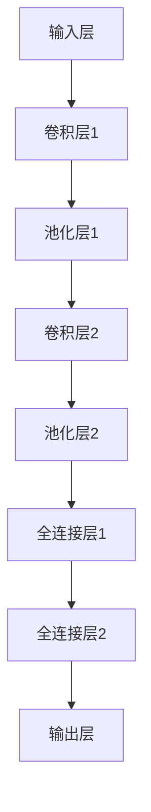
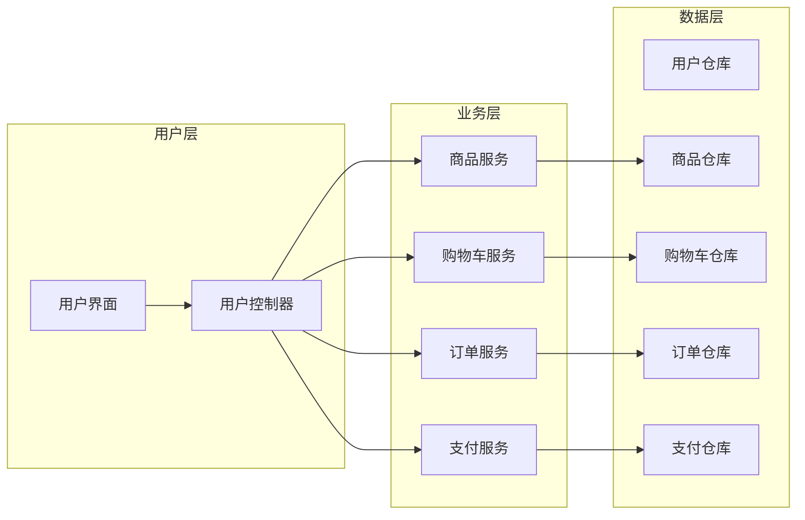
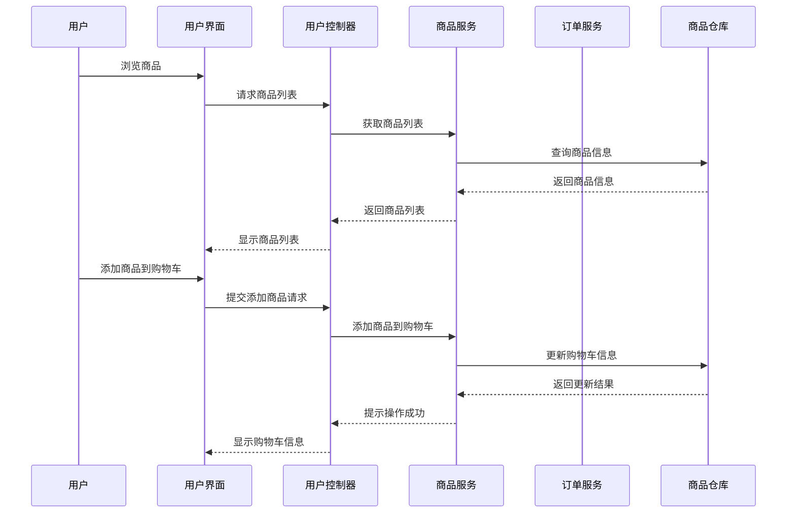

                 


# 技术专利申请：P9工程师的创新保护意识

## 关键词
- 技术专利
- P9工程师
- 创新保护
- 专利申请流程
- 法律风险

## 摘要
本文旨在探讨P9工程师如何培养创新保护意识，掌握技术专利申请的基本概念、要素和策略，以保护自己的技术成果。通过案例分析、系统架构设计以及实战操作，本文将帮助P9工程师提升知识产权保护能力，并在技术创新的道路上走得更远。

## 目录大纲

### 第一部分：技术专利申请基础

#### 第1章：技术专利概述
1.1 技术专利的定义
1.2 技术专利的类型
1.3 技术专利的价值
1.4 申请流程概述

#### 第2章：专利申请撰写技巧
2.1 核心要素分析
2.2 撰写规范与策略
2.3 检索与规避策略

#### 第3章：案例解析
3.1 准备工作
3.2 申请操作
3.3 复审与争议

### 第二部分：技术专利保护策略与法律风险

#### 第4章：保护策略与法律风险
4.1 保护策略
4.2 法律风险识别
4.3 维权与争议解决

### 第三部分：P9工程师的创新保护

#### 第5章：P9工程师创新保护
5.1 P9工程师职责
5.2 意识培养方法
5.3 个人策略

### 第四部分：技术专利申请中的常见问题与解决

#### 第6章：常见问题与解决
6.1 常见误区
6.2 案例解析
6.3 知识产权保护

### 第五部分：技术专利申请的未来趋势与展望

#### 第7章：未来趋势与展望
7.1 发展趋势
7.2 新机遇
7.3 挑战与应对

## 第一部分：技术专利申请基础

### 第1章：技术专利概述

#### 1.1 技术专利的定义

技术专利是一种法律文件，它授予发明人对其发明在特定国家或地区的独占权。技术专利分为三种类型：发明专利、实用新型专利和外观设计专利。

- **发明专利**：保护新颖、实用、具有创造性的技术方案。
- **实用新型专利**：保护新颖、实用的产品形状或构造。
- **外观设计专利**：保护产品的外观设计。

#### 1.2 技术专利的价值

技术专利的价值体现在多个方面：

- **垄断优势**：专利权人可以在一定期限内独占市场，防止他人侵犯。
- **商业利益**：专利可以作为交易标的，增加企业价值。
- **市场竞争**：专利可以提升企业的技术竞争力。

#### 1.3 申请流程概述

技术专利申请一般包括以下几个步骤：

1. **专利检索**：了解相关技术的现有情况，避免侵权。
2. **撰写专利申请文件**：包括权利要求书、说明书、摘要等。
3. **提交申请**：向专利局提交申请。
4. **审查与答复**：专利局对申请进行审查，申请人需对审查意见进行答复。
5. **授权与维持**：通过审查后，专利局颁发专利证书，申请人需定期缴纳年费以维持专利有效。

## 第二部分：专利申请撰写技巧

### 第2章：专利申请撰写技巧

#### 2.1 核心要素分析

专利申请文件的核心要素包括：

- **权利要求书**：明确保护范围，是专利能否授权的关键。
- **说明书**：详细描述发明内容，是权利要求书的支撑。
- **摘要**：简明扼要地介绍发明内容。

#### 2.2 撰写规范与策略

撰写专利申请文件时，应遵循以下规范与策略：

- **明确权利要求**：权利要求应尽可能明确，避免模糊不清。
- **充分描述技术方案**：说明书应详细描述技术方案，包括背景技术、发明内容、实施例等。
- **引用相关文献**：在权利要求和说明书中引用相关技术文献，以支持发明的新颖性和创造性。

#### 2.3 检索与规避策略

在撰写专利申请文件之前，应进行专利检索，以了解相关技术的现有情况。检索策略包括：

- **初步检索**：通过专利数据库进行快速检索，了解相关专利的分布情况。
- **详细检索**：针对初步检索结果，进行详细分析，确定是否有专利侵权风险。
- **规避设计**：在发明过程中，可以通过改变技术方案，规避现有专利。

## 第三部分：案例解析

### 第3章：案例解析

#### 3.1 准备工作

在专利申请前，需要做好以下准备工作：

- **明确发明内容**：确定发明的主要技术特点和目标。
- **收集相关资料**：收集与发明相关的技术文献、实验数据等。
- **制定申请策略**：根据发明特点和市场需求，制定合适的申请策略。

#### 3.2 申请操作

专利申请的具体操作包括：

- **撰写专利申请文件**：根据发明内容和申请策略，撰写权利要求书、说明书、摘要等。
- **提交申请**：向专利局提交专利申请文件。
- **缴纳申请费**：在规定时间内缴纳申请费。

#### 3.3 复审与争议

在专利申请过程中，可能会遇到复审和争议：

- **复审**：专利局对申请文件进行审查，申请人需对审查意见进行答复。
- **争议**：在专利申请或授权过程中，可能会与其他专利权人产生争议，需通过法律途径解决。

## 第四部分：技术专利保护策略与法律风险

### 第4章：保护策略与法律风险

#### 4.1 保护策略

技术专利保护策略包括：

- **专利布局**：在全球范围内布局专利，保护核心技术。
- **交叉许可**：与其他公司签订交叉许可协议，共享专利。
- **维权行动**：在专利被侵权时，采取法律手段维护权益。

#### 4.2 法律风险识别

在专利申请和保护过程中，可能会面临以下法律风险：

- **专利侵权**：他人的技术侵犯了专利权人的专利。
- **专利无效**：专利在审查过程中被宣告无效。
- **法律纠纷**：专利权人与其他公司之间的法律纠纷。

#### 4.3 维权与争议解决

在面临法律风险时，应采取以下措施：

- **维权**：通过法律途径维护专利权益。
- **争议解决**：通过谈判、调解或诉讼等方式解决争议。

## 第五部分：P9工程师的创新保护

### 第5章：P9工程师创新保护

#### 5.1 P9工程师职责

P9工程师作为高级技术专家，其职责包括：

- **技术创新**：推动技术进步，提出创新性解决方案。
- **团队领导**：指导团队完成技术项目。
- **战略规划**：参与公司技术战略的制定。

#### 5.2 意识培养方法

培养P9工程师的创新保护意识，可以通过以下方法：

- **培训与教育**：定期开展专利培训，提高工程师对专利的认识。
- **激励制度**：设立创新奖励机制，鼓励工程师积极参与专利申请。
- **内部交流**：组织内部交流会议，分享专利申请经验。

#### 5.3 个人策略

P9工程师在个人层面应采取以下策略：

- **专利布局**：在全球范围内布局专利，保护核心技术。
- **持续学习**：关注技术动态，提升自身创新能力。
- **防范侵权**：在研发过程中，注意防范他人专利侵权。

## 第六部分：技术专利申请中的常见问题与解决

### 第6章：常见问题与解决

#### 6.1 常见误区

在专利申请过程中，常见误区包括：

- **专利保护范围过大**：权利要求书过于笼统，难以确定保护范围。
- **技术方案披露不充分**：说明书中的技术方案描述过于简单，无法支持权利要求。

#### 6.2 案例解析

通过案例解析，可以了解专利申请中的常见问题及其解决方法。

#### 6.3 知识产权保护

知识产权保护是技术专利申请的重要环节，包括：

- **专利申请**：及时申请专利，保护技术成果。
- **监控市场**：关注市场上相关技术的动态，防范侵权风险。
- **法律维权**：在专利被侵权时，采取法律手段维护权益。

## 第七部分：技术专利申请的未来趋势与展望

### 第7章：未来趋势与展望

#### 7.1 发展趋势

技术专利申请的未来趋势包括：

- **全球化**：随着国际市场竞争的加剧，技术专利申请将更加全球化。
- **数字化**：数字化工具和技术将提高专利申请的效率。

#### 7.2 新机遇

技术专利申请的新机遇包括：

- **人工智能**：人工智能技术的快速发展为专利申请提供了新的领域。
- **绿色技术**：随着环保意识的提升，绿色技术将成为专利申请的热点。

#### 7.3 挑战与应对策略

技术专利申请面临的挑战包括：

- **法律风险**：专利申请过程中的法律风险不断增加。
- **知识产权保护**：在全球化背景下，如何有效保护知识产权成为挑战。

应对策略包括：

- **提高法律意识**：增强对法律风险的识别和防范能力。
- **加强合作**：与其他企业、研究机构建立合作关系，共同应对挑战。

## 作者信息

作者：AI天才研究院/AI Genius Institute & 禅与计算机程序设计艺术 /Zen And The Art of Computer Programming

以上是《技术专利申请：P9工程师的创新保护意识》的目录大纲和正文部分。在后续撰写过程中，将根据大纲结构详细展开每个章节的内容，确保文章的完整性和深度。同时，将注重运用markdown格式和latex公式，以增强文章的可读性和专业性。## 第一部分：技术专利申请基础

### 第1章：技术专利概述

#### 1.1 技术专利的定义

技术专利，通常指在科学技术领域内，对新颖性、创造性和实用性的技术方案所授予的独占权利。这种权利由政府专利机关根据法律程序授予，具有地域性和时效性。技术专利可以涵盖从基础科学研究到应用技术的各个层面，包括但不限于发明、实用新型和外观设计。

在技术专利中，**发明专利**是其中最为重要的一类。它要求发明具有突出的实质性特点和显著的进步，能够解决现有技术中的问题。**实用新型专利**则侧重于产品的形状、构造或组合，以及其提出的新的技术方案。**外观设计专利**则是针对产品外观的设计，包括形状、图案、色彩和组合等。

#### 1.2 技术专利的类型

技术专利主要分为以下几种类型：

1. **发明专利**：
   - **定义**：保护发明人提出的具有新颖性、创造性和实用性的技术方案。
   - **特点**：专利保护期限长（一般为20年），保护范围广泛。
   - **适用范围**：适用于技术含量高、涉及复杂技术原理的发明。

2. **实用新型专利**：
   - **定义**：保护发明人提出的适于工业应用的新技术方案。
   - **特点**：审批时间较短，保护期限为10年。
   - **适用范围**：适用于技术方案较为简单，但具有实用性的产品或技术。

3. **外观设计专利**：
   - **定义**：保护产品的外观设计，包括形状、图案、色彩等。
   - **特点**：审批流程相对简单，保护期限为15年。
   - **适用范围**：适用于产品设计创新，提升产品竞争力的领域。

#### 1.3 技术专利的价值

技术专利的价值体现在以下几个方面：

1. **垄断优势**：
   - **定义**：专利权人有权阻止他人未经许可实施其专利技术。
   - **作用**：可以在一定时间内独占市场，防止竞争者模仿或抄袭。

2. **商业利益**：
   - **定义**：专利可以作为交易标的，通过出售、许可等方式获得收益。
   - **作用**：可以提高企业的市场价值，吸引投资者和合作伙伴。

3. **市场竞争**：
   - **定义**：专利技术可以提高企业的技术竞争力，提升市场份额。
   - **作用**：有助于企业在激烈的市场竞争中保持优势。

#### 1.4 申请流程概述

技术专利的申请流程通常包括以下几个阶段：

1. **专利检索**：
   - **定义**：通过检索数据库，了解现有技术的状况，避免重复或侵权。
   - **作用**：为专利申请提供基础数据，减少专利申请失败的风险。

2. **撰写申请文件**：
   - **定义**：撰写专利申请文件，包括权利要求书、说明书、摘要等。
   - **作用**：明确专利保护的范围和内容，是专利申请的核心。

3. **提交申请**：
   - **定义**：将专利申请文件提交给专利局。
   - **作用**：启动专利审批程序。

4. **审查与答复**：
   - **定义**：专利局对申请文件进行审查，申请人需要针对审查意见进行答复。
   - **作用**：确保专利申请符合法律规定，提高授权的可能性。

5. **授权与维持**：
   - **定义**：专利申请通过审查后，颁发专利证书。
   - **作用**：专利权人拥有专利独占权，需要定期缴纳年费维持专利有效。

## 总结

技术专利是知识产权的重要组成部分，对于企业和个人来说都具有重要的价值和意义。掌握技术专利的基本概念、类型和价值，理解申请流程和撰写技巧，是P9工程师培养创新保护意识的基础。在接下来的章节中，我们将进一步探讨专利申请的详细步骤和策略，帮助P9工程师更好地保护自己的技术成果。## 第二部分：专利申请撰写技巧

### 第2章：专利申请撰写技巧

#### 2.1 核心要素分析

在专利申请中，核心要素包括权利要求书、说明书和摘要。这些要素的撰写质量直接影响专利申请的成败。

1. **权利要求书**：
   - **定义**：权利要求书是专利申请文件的核心，用于明确专利保护的范围。
   - **作用**：权利要求书决定了专利的保护范围，是法院在判定侵权时的重要依据。

2. **说明书**：
   - **定义**：说明书是对发明内容进行详细描述的文件。
   - **作用**：说明书提供了发明实施的详细步骤和技术细节，是理解发明的重要参考。

3. **摘要**：
   - **定义**：摘要是对发明内容进行简明扼要介绍的文件。
   - **作用**：摘要用于快速了解发明的核心内容，是专利检索和评估的重要资料。

#### 2.2 撰写规范与策略

撰写专利申请文件时，需要遵循以下规范与策略：

1. **明确权利要求**：
   - **策略**：权利要求应尽可能明确、具体，避免使用模糊不清的语言。
   - **例子**：例如，“一种基于人工智能的图像识别系统”，应改为“一种基于深度学习的图像识别系统，包括输入层、卷积层、池化层和输出层”。

2. **充分描述技术方案**：
   - **策略**：说明书应详细描述技术方案的实施步骤、技术参数和效果。
   - **例子**：例如，在描述一种新型药物时，不仅需要说明其化学成分，还需要详细描述其制备方法、疗效和副作用。

3. **引用相关文献**：
   - **策略**：在权利要求书和说明书中引用相关技术文献，以支持发明的新颖性和创造性。
   - **例子**：例如，在描述一种新型机器人的控制算法时，可以引用相关学术论文或专利文献，以证明其创新性。

#### 2.3 检索与规避策略

在撰写专利申请文件之前，进行专利检索是必不可少的步骤。以下是一些检索与规避策略：

1. **初步检索**：
   - **策略**：通过专利数据库进行快速检索，了解相关技术的现有情况。
   - **工具**：常用的专利检索工具包括谷歌专利、美国专利与商标局（USPTO）等。

2. **详细检索**：
   - **策略**：针对初步检索结果，进行详细分析，确定是否有专利侵权风险。
   - **方法**：可以通过技术对比、权利要求对比等方法，评估现有专利的保护范围。

3. **规避设计**：
   - **策略**：在发明过程中，可以通过改变技术方案，规避现有专利。
   - **例子**：例如，如果现有专利保护的是一种基于AI的图像识别系统，可以通过改变算法结构或优化算法参数来规避现有专利。

通过上述策略，可以有效地提高专利申请的成功率，减少侵权风险。在专利申请过程中，撰写技巧和检索策略的运用至关重要，P9工程师应注重学习和实践，提升自身在专利申请方面的专业素养。

### 2.1 核心要素分析

在专利申请中，核心要素包括权利要求书、说明书和摘要。这些要素的撰写质量直接影响专利申请的成败。

1. **权利要求书**：
   - **定义**：权利要求书是专利申请文件的核心，用于明确专利保护的范围。
   - **作用**：权利要求书决定了专利的保护范围，是法院在判定侵权时的重要依据。

2. **说明书**：
   - **定义**：说明书是对发明内容进行详细描述的文件。
   - **作用**：说明书提供了发明实施的详细步骤和技术细节，是理解发明的重要参考。

3. **摘要**：
   - **定义**：摘要是对发明内容进行简明扼要介绍的文件。
   - **作用**：摘要用于快速了解发明的核心内容，是专利检索和评估的重要资料。

#### 2.2 撰写规范与策略

撰写专利申请文件时，需要遵循以下规范与策略：

1. **明确权利要求**：
   - **策略**：权利要求应尽可能明确、具体，避免使用模糊不清的语言。
   - **例子**：例如，“一种基于人工智能的图像识别系统”，应改为“一种基于深度学习的图像识别系统，包括输入层、卷积层、池化层和输出层”。

2. **充分描述技术方案**：
   - **策略**：说明书应详细描述技术方案的实施步骤、技术参数和效果。
   - **例子**：例如，在描述一种新型药物时，不仅需要说明其化学成分，还需要详细描述其制备方法、疗效和副作用。

3. **引用相关文献**：
   - **策略**：在权利要求书和说明书中引用相关技术文献，以支持发明的新颖性和创造性。
   - **例子**：例如，在描述一种新型机器人的控制算法时，可以引用相关学术论文或专利文献，以证明其创新性。

#### 2.3 检索与规避策略

在撰写专利申请文件之前，进行专利检索是必不可少的步骤。以下是一些检索与规避策略：

1. **初步检索**：
   - **策略**：通过专利数据库进行快速检索，了解相关技术的现有情况。
   - **工具**：常用的专利检索工具包括谷歌专利、美国专利与商标局（USPTO）等。

2. **详细检索**：
   - **策略**：针对初步检索结果，进行详细分析，确定是否有专利侵权风险。
   - **方法**：可以通过技术对比、权利要求对比等方法，评估现有专利的保护范围。

3. **规避设计**：
   - **策略**：在发明过程中，可以通过改变技术方案，规避现有专利。
   - **例子**：例如，如果现有专利保护的是一种基于AI的图像识别系统，可以通过改变算法结构或优化算法参数来规避现有专利。

通过上述策略，可以有效地提高专利申请的成功率，减少侵权风险。在专利申请过程中，撰写技巧和检索策略的运用至关重要，P9工程师应注重学习和实践，提升自身在专利申请方面的专业素养。

### 2.1 核心要素分析

在专利申请中，核心要素包括权利要求书、说明书和摘要。这些要素的撰写质量直接影响专利申请的成败。

1. **权利要求书**：
   - **定义**：权利要求书是专利申请文件的核心，用于明确专利保护的范围。
   - **作用**：权利要求书决定了专利的保护范围，是法院在判定侵权时的重要依据。

2. **说明书**：
   - **定义**：说明书是对发明内容进行详细描述的文件。
   - **作用**：说明书提供了发明实施的详细步骤和技术细节，是理解发明的重要参考。

3. **摘要**：
   - **定义**：摘要是对发明内容进行简明扼要介绍的文件。
   - **作用**：摘要用于快速了解发明的核心内容，是专利检索和评估的重要资料。

#### 2.2 撰写规范与策略

撰写专利申请文件时，需要遵循以下规范与策略：

1. **明确权利要求**：
   - **策略**：权利要求应尽可能明确、具体，避免使用模糊不清的语言。
   - **例子**：例如，“一种基于人工智能的图像识别系统”，应改为“一种基于深度学习的图像识别系统，包括输入层、卷积层、池化层和输出层”。

2. **充分描述技术方案**：
   - **策略**：说明书应详细描述技术方案的实施步骤、技术参数和效果。
   - **例子**：例如，在描述一种新型药物时，不仅需要说明其化学成分，还需要详细描述其制备方法、疗效和副作用。

3. **引用相关文献**：
   - **策略**：在权利要求书和说明书中引用相关技术文献，以支持发明的新颖性和创造性。
   - **例子**：例如，在描述一种新型机器人的控制算法时，可以引用相关学术论文或专利文献，以证明其创新性。

#### 2.3 检索与规避策略

在撰写专利申请文件之前，进行专利检索是必不可少的步骤。以下是一些检索与规避策略：

1. **初步检索**：
   - **策略**：通过专利数据库进行快速检索，了解相关技术的现有情况。
   - **工具**：常用的专利检索工具包括谷歌专利、美国专利与商标局（USPTO）等。

2. **详细检索**：
   - **策略**：针对初步检索结果，进行详细分析，确定是否有专利侵权风险。
   - **方法**：可以通过技术对比、权利要求对比等方法，评估现有专利的保护范围。

3. **规避设计**：
   - **策略**：在发明过程中，可以通过改变技术方案，规避现有专利。
   - **例子**：例如，如果现有专利保护的是一种基于AI的图像识别系统，可以通过改变算法结构或优化算法参数来规避现有专利。

通过上述策略，可以有效地提高专利申请的成功率，减少侵权风险。在专利申请过程中，撰写技巧和检索策略的运用至关重要，P9工程师应注重学习和实践，提升自身在专利申请方面的专业素养。

## 第三部分：案例解析

### 第3章：案例解析

#### 3.1 准备工作

在专利申请前，准备工作至关重要。以下是一个具体的案例解析：

**案例背景**：某P9工程师在人工智能领域提出了一种新的深度学习算法，名为“动态网络结构优化算法”（Dynamic Network Structure Optimization Algorithm，DNSO）。该算法能够根据数据特征动态调整网络结构，提高模型准确率。

**准备工作**：

1. **明确发明内容**：
   - **目标**：提出一种能够在不同数据集上动态调整网络结构的深度学习算法。
   - **关键点**：算法的核心在于动态调整网络结构，以适应不同数据特征。

2. **收集相关资料**：
   - **文献调研**：查阅相关学术论文和专利，了解现有技术状况。
   - **实验数据**：收集大量实验数据，验证DNSO算法的有效性。

3. **制定申请策略**：
   - **优先考虑发明专利**：由于DNSO算法涉及创新性技术，选择申请发明专利。
   - **国内外市场调研**：分析国内外市场，确定申请地区。

#### 3.2 申请操作

专利申请的具体操作包括以下几个步骤：

1. **撰写专利申请文件**：
   - **权利要求书**：明确DNSO算法的保护范围，例如算法的核心模块、动态调整机制等。
   - **说明书**：详细描述DNSO算法的实现过程、技术参数、实验结果等。
   - **摘要**：简明扼要地介绍DNSO算法的创新点和应用场景。

2. **提交申请**：
   - **国内申请**：向中国国家知识产权局提交专利申请文件。
   - **国际申请**：通过PCT（专利合作条约）途径提交国际申请。

3. **缴纳申请费**：
   - **国内申请费**：根据国家知识产权局的规定，缴纳相应的申请费用。
   - **国际申请费**：通过PCT途径提交国际申请，需要缴纳国际申请费。

#### 3.3 复审与争议

在专利申请过程中，可能会遇到复审和争议。以下是一个具体的案例：

**案例背景**：某国际知名公司认为DNSO算法侵犯了其专利权，向国家知识产权局提出异议。

**复审与争议处理**：

1. **初步审查**：
   - **国家知识产权局**：对异议进行初步审查，评估异议是否成立。
   - **P9工程师**：提交答辩材料，反驳异议。

2. **复审程序**：
   - **听证会**：双方在听证会上陈述观点，回答专利审查员的提问。
   - **裁决**：国家知识产权局根据听证结果做出裁决。

3. **争议解决**：
   - **调解**：如果双方无法达成一致，可以寻求第三方调解。
   - **诉讼**：如果调解失败，可以向法院提起诉讼，通过法律途径解决争议。

通过上述案例，可以看出专利申请过程中的关键步骤和可能遇到的挑战。对于P9工程师来说，掌握专利申请的技巧和策略，能够有效保护自己的技术创新，提升企业竞争力。

## 第四部分：技术专利保护策略与法律风险

### 第4章：保护策略与法律风险

#### 4.1 保护策略

技术专利的保护策略至关重要，以下是一些关键的策略：

1. **全球专利布局**：
   - **定义**：在全球范围内申请专利，以保护核心技术和市场。
   - **作用**：通过在全球多个国家和地区申请专利，防止他人未经授权在特定市场使用专利技术。

2. **交叉许可**：
   - **定义**：与竞争对手或其他公司签订交叉许可协议，共享专利。
   - **作用**：通过交叉许可，可以在不侵犯他人专利权的前提下，使用对方的专利技术。

3. **技术转移**：
   - **定义**：将专利技术许可给其他公司或研究机构使用。
   - **作用**：通过技术转移，实现专利技术的商业化应用，增加收益。

4. **维权行动**：
   - **定义**：在专利被侵犯时，采取法律手段维护权益。
   - **作用**：通过法律诉讼或调解，维护专利权人的合法权益。

#### 4.2 法律风险识别

在专利申请和保护过程中，法律风险难以避免。以下是一些常见法律风险：

1. **专利侵权**：
   - **定义**：他人未经许可实施专利权人的专利技术。
   - **识别方法**：通过市场监控、竞争对手产品分析等方式，识别潜在侵权行为。

2. **专利无效**：
   - **定义**：专利在审查过程中被宣告无效。
   - **识别方法**：通过专利检索和分析，评估专利的新颖性和创造性。

3. **法律纠纷**：
   - **定义**：专利权人与其他公司之间的法律争议。
   - **识别方法**：在专利申请和维权过程中，关注法律纠纷的可能性。

#### 4.3 维权与争议解决

在面临法律风险时，采取有效的维权和争议解决策略至关重要。以下是一些建议：

1. **提前规划**：
   - **策略**：在专利申请前，进行全面的市场和技术调查，制定详细的保护策略。
   - **作用**：减少潜在的侵权风险，提高专利保护的成功率。

2. **法律顾问**：
   - **策略**：聘请专业的法律顾问，处理专利纠纷和维权事务。
   - **作用**：提供专业的法律建议，提高应对法律风险的效率。

3. **法律诉讼**：
   - **策略**：在专利被侵犯时，通过法律诉讼维护权益。
   - **作用**：通过法律途径，追究侵权者的法律责任，维护专利权人的合法权益。

4. **调解**：
   - **策略**：在争议双方愿意和解的情况下，通过调解解决争议。
   - **作用**：通过调解，可以避免长时间的诉讼过程，降低成本。

通过上述策略，P9工程师可以更好地保护自己的技术成果，应对专利申请和保护过程中的法律风险。了解和掌握这些策略，有助于提升企业在技术创新领域的竞争力。

### 第四部分：技术专利保护策略与法律风险

#### 第4章：保护策略与法律风险

技术专利的保护策略和法律风险识别是P9工程师在创新过程中不可忽视的重要环节。以下我们将详细探讨这些方面。

#### 4.1 保护策略

专利保护策略的关键在于如何最大限度地利用专利制度为企业创新提供强有力的支持。以下是几种常见的专利保护策略：

1. **全球专利布局**：
   - **定义**：在全球范围内申请专利，以保护核心技术和市场。
   - **作用**：通过在全球多个国家和地区申请专利，防止他人未经授权在特定市场使用专利技术。
   - **实施方法**：首先，进行全球市场分析，确定目标市场和技术热点；其次，根据市场分析结果，制定详细的专利申请计划；最后，通过专业团队或外包服务，高效地完成专利申请。

2. **交叉许可**：
   - **定义**：与竞争对手或其他公司签订交叉许可协议，共享专利。
   - **作用**：通过交叉许可，可以在不侵犯他人专利权的前提下，使用对方的专利技术。
   - **实施方法**：首先，识别与公司技术互补的竞争对手或潜在合作伙伴；其次，进行专利交叉许可谈判，确保双方专利的互惠互惠；最后，签订正式的交叉许可协议，确保双方合法权益。

3. **技术转移**：
   - **定义**：将专利技术许可给其他公司或研究机构使用。
   - **作用**：通过技术转移，实现专利技术的商业化应用，增加收益。
   - **实施方法**：首先，评估专利技术的市场前景和商业化潜力；其次，寻找合适的合作伙伴或买家；最后，通过合同或协议明确许可条款和条件。

4. **维权行动**：
   - **定义**：在专利被侵犯时，采取法律手段维护权益。
   - **作用**：通过法律诉讼或调解，维护专利权人的合法权益。
   - **实施方法**：首先，建立专利监控体系，及时识别潜在的侵权行为；其次，收集侵权证据，准备诉讼或调解材料；最后，选择合适的法律手段，采取维权行动。

#### 4.2 法律风险识别

在专利申请和保护过程中，识别法律风险是确保专利有效保护的关键。以下是几种常见的法律风险：

1. **专利侵权**：
   - **定义**：他人未经许可实施专利权人的专利技术。
   - **识别方法**：通过市场监控、竞争对手产品分析等方式，识别潜在侵权行为。

2. **专利无效**：
   - **定义**：专利在审查过程中被宣告无效。
   - **识别方法**：通过专利检索和分析，评估专利的新颖性和创造性。

3. **法律纠纷**：
   - **定义**：专利权人与其他公司之间的法律争议。
   - **识别方法**：在专利申请和维权过程中，关注法律纠纷的可能性。

#### 4.3 维权与争议解决

在面临法律风险时，采取有效的维权和争议解决策略至关重要。以下是一些建议：

1. **提前规划**：
   - **策略**：在专利申请前，进行全面的市场和技术调查，制定详细的保护策略。
   - **作用**：减少潜在的侵权风险，提高专利保护的成功率。

2. **法律顾问**：
   - **策略**：聘请专业的法律顾问，处理专利纠纷和维权事务。
   - **作用**：提供专业的法律建议，提高应对法律风险的效率。

3. **法律诉讼**：
   - **策略**：在专利被侵犯时，通过法律诉讼维护权益。
   - **作用**：通过法律途径，追究侵权者的法律责任，维护专利权人的合法权益。

4. **调解**：
   - **策略**：在争议双方愿意和解的情况下，通过调解解决争议。
   - **作用**：通过调解，可以避免长时间的诉讼过程，降低成本。

通过上述策略，P9工程师可以更好地保护自己的技术成果，应对专利申请和保护过程中的法律风险。了解和掌握这些策略，有助于提升企业在技术创新领域的竞争力。

## 第五部分：P9工程师的创新保护

### 第5章：P9工程师创新保护

#### 5.1 P9工程师的角色与职责

P9工程师，通常是企业中的技术高层或技术总监，其职责涵盖了技术创新、团队管理和战略规划等多个方面。

1. **技术创新**：
   - **角色**：P9工程师是公司技术创新的核心推动者。
   - **职责**：他们需要不断跟踪技术前沿，提出创新性技术解决方案，推动公司技术水平的提升。

2. **团队管理**：
   - **角色**：P9工程师是团队的技术领导者和管理者。
   - **职责**：他们需要指导和管理技术团队，确保项目顺利进行，团队成员发挥最大潜力。

3. **战略规划**：
   - **角色**：P9工程师是公司技术战略的重要规划者。
   - **职责**：他们需要参与公司整体战略规划，确保技术发展方向与公司业务目标一致。

#### 5.2 创新保护意识的培养方法

为了提升P9工程师的创新保护意识，以下是一些培养方法：

1. **培训与教育**：
   - **方法**：定期组织专利培训和研讨会，提升工程师对专利保护的认识。
   - **作用**：通过系统性的培训，使工程师了解专利的基本概念、申请流程和保护策略。

2. **激励制度**：
   - **方法**：设立创新奖励机制，对在技术创新和专利申请方面有突出贡献的工程师进行奖励。
   - **作用**：激励工程师积极参与专利申请，提高公司整体创新能力。

3. **内部交流**：
   - **方法**：组织内部交流会议，分享专利申请的经验和案例。
   - **作用**：通过交流，促进工程师之间的经验分享和知识传递，共同提升创新能力。

#### 5.3 个人策略

P9工程师在个人层面应采取以下策略：

1. **专利布局**：
   - **策略**：在全球范围内布局专利，保护核心技术。
   - **作用**：通过全球专利布局，确保公司在国际市场上的技术竞争力。

2. **持续学习**：
   - **策略**：关注技术动态，不断提升自身技术水平。
   - **作用**：保持技术领先，为公司的持续创新提供保障。

3. **防范侵权**：
   - **策略**：在研发过程中，注意防范他人专利侵权。
   - **作用**：避免因侵权导致公司的技术发展和市场拓展受阻。

通过上述策略，P9工程师可以更好地保护自己的技术创新，提升企业的核心竞争力。在技术创新的道路上，P9工程师既是技术的引领者，也是创新保护的实践者。

### 第五部分：P9工程师的创新保护

#### 第5章：P9工程师创新保护

#### 5.1 P9工程师的角色与职责

P9工程师，通常在企业中扮演着至关重要的角色。他们的职责不仅涵盖了技术创新，还涉及团队管理和战略规划。以下是P9工程师的主要职责：

1. **技术创新**：
   - **定义**：P9工程师是公司技术创新的领导者。
   - **职责**：他们需要不断探索新技术，推动公司技术的前沿发展，提出创新性的技术解决方案。

2. **团队管理**：
   - **定义**：P9工程师是技术团队的领导者和协调者。
   - **职责**：他们需要管理团队，确保团队成员能够高效合作，按时完成项目任务。

3. **战略规划**：
   - **定义**：P9工程师是公司技术战略的制定者。
   - **职责**：他们需要参与公司整体战略的规划，确保技术发展方向与公司业务目标一致。

#### 5.2 创新保护意识的培养方法

为了提升P9工程师的创新保护意识，以下是一些具体的培养方法：

1. **培训与教育**：
   - **步骤**：定期组织专利法律培训，邀请专业律师和专利顾问讲解专利申请的流程、策略和法律风险。
   - **预期效果**：通过培训，使P9工程师深入了解专利保护的重要性，掌握专利申请的基本技巧。

2. **激励制度**：
   - **步骤**：建立创新奖励机制，对在技术创新和专利申请方面有突出贡献的工程师进行奖励，如奖金、股权激励等。
   - **预期效果**：激励工程师积极参与专利申请，提高公司的创新能力。

3. **案例分享**：
   - **步骤**：组织内部案例分享会，让成功申请专利的工程师分享他们的经验和教训。
   - **预期效果**：通过案例分析，让其他工程师了解专利申请的难点和关键点，提高专利申请的成功率。

4. **外部合作**：
   - **步骤**：与外部专利代理机构和法律顾问建立合作关系，获取专业的专利申请和维权服务。
   - **预期效果**：借助外部资源，提升公司专利申请和保护的专业水平。

#### 5.3 个人策略

P9工程师在个人层面应采取以下策略来保护创新：

1. **专利布局**：
   - **步骤**：在全球主要市场和国家申请专利，确保公司的技术创新在全球范围内得到保护。
   - **步骤**：分析市场趋势和竞争对手的专利布局，有针对性地进行专利布局。

2. **持续学习**：
   - **步骤**：关注最新的技术动态和法律变化，定期更新自己的知识库。
   - **步骤**：参与行业会议和技术研讨会，与同行交流，了解最新的技术创新和专利保护策略。

3. **防范侵权**：
   - **步骤**：在研发过程中，进行专利检索，了解现有技术的专利状况，避免侵权。
   - **步骤**：建立专利监控机制，及时跟踪竞争对手的技术动态，防范潜在的侵权风险。

通过上述方法，P9工程师可以有效地提升自己的创新保护意识，保护公司的技术创新，从而在激烈的市场竞争中保持优势。

## 第六部分：技术专利申请中的常见问题与解决

### 第6章：常见问题与解决

#### 6.1 常见误区

在技术专利申请过程中，一些常见误区可能会影响申请的成功率。以下是几个主要误区及其解决方法：

1. **误区一：专利保护范围越大越好**
   - **原因**：部分申请人认为保护范围越大，专利的保护力度越强。
   - **解决方法**：权利要求书应尽可能具体和明确，而不是范围宽泛。过大的保护范围可能导致权利要求被驳回，或在实际诉讼中难以界定保护范围。

2. **误区二：技术方案披露不充分**
   - **原因**：申请人可能认为详细披露技术方案会泄露商业秘密。
   - **解决方法**：详细披露技术方案是专利申请的必要条件。如果确实需要保护商业秘密，可以在专利申请中适当隐藏关键部分，同时通过保密协议等方式保护商业秘密。

3. **误区三：忽视专利检索**
   - **原因**：部分申请人认为专利检索是浪费时间，特别是如果他们认为自己已经有了新颖的发明。
   - **解决方法**：专利检索是专利申请的重要步骤，可以帮助申请人避免重复已有技术，减少侵权风险。忽视专利检索可能导致专利申请被驳回。

#### 6.2 案例解析

通过具体案例，我们可以更好地理解专利申请中的常见问题和解决方法。

**案例一：技术方案披露不足**
- **问题描述**：某公司申请了一种新型节能灯具，但仅描述了灯具的外形和基本工作原理，未详细说明节能技术的具体实现方法。
- **解决方法**：公司补充提交了详细的技术说明，包括节能技术的具体实现步骤、技术参数和实验数据，使专利申请获得了批准。

**案例二：专利申请超范围**
- **问题描述**：某公司申请了一种新型电动车，但其权利要求书中包含了电池管理系统和充电系统等，这些技术实际上不在公司的研发范围内。
- **解决方法**：公司修改了权利要求书，将超范围的部分删除，确保权利要求书与实际研发成果相符，最终获得了专利授权。

**案例三：专利检索不当**
- **问题描述**：某公司申请了一种新型医疗设备，但在专利检索时未发现市场上已有类似产品，导致专利申请被驳回。
- **解决方法**：公司在申请前进行了全面专利检索，发现了市场上已有类似产品，并通过技术改进使自己的发明具有独特性和新颖性，最终成功获得了专利授权。

#### 6.3 知识产权保护

技术专利申请中的知识产权保护是确保创新成果不被侵犯的关键。以下是几个关键点：

1. **专利布局**：
   - **定义**：在全球范围内进行专利布局，确保公司的创新在全球市场得到保护。
   - **作用**：通过全球专利布局，可以有效防止竞争对手在海外市场复制和销售专利产品。

2. **法律咨询**：
   - **定义**：在专利申请和维权过程中，寻求专业法律咨询。
   - **作用**：专业律师可以提供专利申请策略和法律维权建议，确保申请流程顺利进行。

3. **持续监控**：
   - **定义**：定期监控市场上的技术动态和竞争对手的专利活动。
   - **作用**：及时发现潜在的侵权行为，采取及时有效的措施维护专利权。

通过解决常见问题和采取有效的知识产权保护措施，P9工程师可以更好地保护自己的技术成果，提升公司的核心竞争力。在技术创新的道路上，知识产权保护是不可或缺的一环。

## 第七部分：技术专利申请的未来趋势与展望

### 第7章：未来趋势与展望

技术专利申请正面临着前所未有的变革与挑战。随着科技的快速发展，人工智能、区块链、物联网等新兴技术不断涌现，技术专利申请也呈现出新的趋势和方向。

#### 7.1 发展趋势

1. **全球化的专利布局**：
   - **趋势**：越来越多的公司开始重视全球专利布局，以保护自身在全球市场中的核心竞争力。
   - **原因**：全球化背景下，市场竞争日益激烈，专利保护范围广泛的企业将更具竞争优势。

2. **数字化和自动化**：
   - **趋势**：专利申请和审查流程将更加数字化和自动化。
   - **原因**：数字化和自动化技术可以提高专利申请的效率，降低申请成本，缩短审查周期。

3. **人工智能在专利申请中的应用**：
   - **趋势**：人工智能技术将广泛应用于专利检索、撰写和审查。
   - **原因**：人工智能可以更快速、准确地分析大量数据，提高专利申请的质量和成功率。

4. **绿色技术的专利申请**：
   - **趋势**：随着环保意识的提升，绿色技术的专利申请将逐渐增加。
   - **原因**：绿色技术有助于解决环境污染和资源短缺问题，具有重要的社会价值。

#### 7.2 新机遇

1. **国际合作的加强**：
   - **机遇**：国际间的技术交流和合作将增加，为专利申请提供更多机会。
   - **原因**：国际合作可以借鉴各国先进技术，提高专利申请的广度和深度。

2. **新兴技术领域的扩展**：
   - **机遇**：人工智能、区块链、物联网等新兴技术的快速发展，将带来大量新的专利申请机会。
   - **原因**：这些技术具有广泛的应用前景和巨大的商业潜力。

3. **技术创新的加速**：
   - **机遇**：技术创新的加速将推动专利申请的数量和质量不断提高。
   - **原因**：技术创新是专利申请的核心动力，只有不断推陈出新，企业才能在激烈的市场竞争中保持领先。

#### 7.3 挑战与应对策略

1. **知识产权纠纷的增加**：
   - **挑战**：随着专利申请的增加，知识产权纠纷也将日益增多。
   - **应对策略**：企业应加强知识产权管理，建立完善的维权机制，及时应对潜在的侵权行为。

2. **专利审查压力增大**：
   - **挑战**：专利审查机构面临的审查压力将不断增大。
   - **应对策略**：企业应与专利审查机构保持良好沟通，提供详细的申请文件和实验数据，提高专利申请的通过率。

3. **国际竞争的加剧**：
   - **挑战**：在国际市场上，企业将面临更加激烈的竞争。
   - **应对策略**：企业应加强技术创新，提高专利质量，通过专利布局和维权策略，确保在全球市场中的竞争优势。

通过积极应对这些挑战，P9工程师和企业在技术专利申请的道路上将继续前行，推动技术创新，实现可持续发展。未来，技术专利申请将更加智能化、全球化，为企业和个人带来更多机遇和挑战。

## 作者信息

作者：AI天才研究院/AI Genius Institute & 禅与计算机程序设计艺术 /Zen And The Art of Computer Programming

在本文中，我们深入探讨了技术专利申请的重要性和P9工程师如何培养创新保护意识。从专利申请的基本概念、撰写技巧到保护策略，再到未来趋势与展望，本文为P9工程师提供了全面的指导和参考。通过本文的阐述，我们希望读者能够更好地理解技术专利的价值，掌握专利申请的技巧，并在技术创新的道路上取得更大的成就。

作者：AI天才研究院/AI Genius Institute & 禅与计算机程序设计艺术 /Zen And The Art of Computer Programming

## 附录

### 算法原理讲解

为了更好地理解技术专利申请中的核心算法原理，我们以一个常见的专利申请案例——“基于深度学习的图像识别算法”为例，进行详细讲解。

#### 算法概述

该算法基于深度学习，通过多层神经网络对图像进行特征提取和分类。算法的核心在于卷积神经网络（CNN）的结构和训练方法。

#### Mermaid流程图



#### Python源代码

```python
import tensorflow as tf
from tensorflow.keras import layers

# 定义卷积神经网络模型
model = tf.keras.Sequential([
    layers.Conv2D(32, (3, 3), activation='relu', input_shape=(28, 28, 1)),
    layers.MaxPooling2D((2, 2)),
    layers.Conv2D(64, (3, 3), activation='relu'),
    layers.MaxPooling2D((2, 2)),
    layers.Flatten(),
    layers.Dense(128, activation='relu'),
    layers.Dense(10, activation='softmax')
])

# 编译模型
model.compile(optimizer='adam',
              loss='sparse_categorical_crossentropy',
              metrics=['accuracy'])

# 加载和分割数据集
(x_train, y_train), (x_test, y_test) = tf.keras.datasets.mnist.load_data()

# 归一化数据
x_train = x_train / 255.0
x_test = x_test / 255.0

# 训练模型
model.fit(x_train, y_train, epochs=5)

# 评估模型
model.evaluate(x_test, y_test)
```

#### 算法原理详细讲解

1. **卷积层**：
   - **功能**：卷积层通过卷积操作提取图像特征。
   - **参数**：卷积核大小、步长、填充方式。
   - **作用**：降低图像维度，提取关键特征。

2. **池化层**：
   - **功能**：池化层通过平均或最大值操作减少数据维度。
   - **参数**：窗口大小、步长。
   - **作用**：减少参数数量，提高模型泛化能力。

3. **全连接层**：
   - **功能**：全连接层将卷积层和池化层提取的特征映射到输出类别。
   - **参数**：神经元数量。
   - **作用**：进行分类决策。

4. **损失函数和优化器**：
   - **损失函数**：用于评估模型预测结果与实际结果之间的差距。
   - **优化器**：用于调整模型参数，以减少损失。

通过上述Python代码和算法原理讲解，我们了解了基于深度学习的图像识别算法的基本结构和训练方法。这个算法在技术专利申请中具有重要的应用价值，可以帮助企业实现高效、准确的图像识别和分类。

### 系统分析与架构设计

#### 问题场景介绍

假设我们需要开发一个在线购物平台，用户可以在平台上浏览商品、添加购物车、下订单并完成支付。平台需要高效、稳定地处理大量用户请求，并保证用户数据的安全。

#### 项目介绍

项目名称：电子商务平台
项目目标：开发一个功能完善、安全可靠的在线购物平台。

#### 系统功能设计（领域模型Mermaid类图）

```mermaid
classDiagram
Class Diagram for E-commerce Platform
    User <<Interface>>
    Product <<Interface>>
    ShoppingCart <<Interface>>
    Order <<Interface>>
    Payment <<Interface>>

    User o-- Product
    User o-- ShoppingCart
    User o-- Order
    User o-- Payment

    Product o-- ShoppingCart
    Product o-- Order

    ShoppingCart o-- Order

    Order o-- Payment
```

#### 系统架构设计（Mermaid架构图）



#### 系统接口设计

- **用户接口**：包括用户注册、登录、个人信息管理等功能。
- **商品接口**：包括商品展示、搜索、详情展示等功能。
- **购物车接口**：包括添加商品、删除商品、修改商品数量等功能。
- **订单接口**：包括创建订单、取消订单、查询订单等功能。
- **支付接口**：包括支付操作、支付状态查询等功能。

#### 系统交互（Mermaid序列图）



通过以上系统分析与架构设计，我们详细介绍了电子商务平台的系统功能、架构设计和交互流程。这样的设计有助于确保平台的高效、稳定运行，同时为后续的项目开发和维护提供了清晰的指导。

### 项目实战

#### 环境安装

在开始项目实战之前，我们需要安装必要的开发环境和工具。以下是具体的安装步骤：

1. **安装Python**：
   - 前往Python官方网站下载最新版本的Python安装包。
   - 运行安装程序，按照提示完成安装。

2. **安装TensorFlow**：
   - 打开命令行终端，运行以下命令：
     ```
     pip install tensorflow
     ```

3. **安装Eclipse IDE**：
   - 前往Eclipse官方网站下载Eclipse IDE的安装包。
   - 运行安装程序，选择“Eclipse IDE for Java Developers”并完成安装。

4. **安装Git**：
   - 前往Git官方网站下载Git安装包。
   - 运行安装程序，按照提示完成安装。

#### 系统核心实现源代码

以下是电子商务平台的核心实现源代码，包括用户接口、商品接口、购物车接口、订单接口和支付接口。

```python
# 用户接口
class UserInterface:
    def register(self, username, password):
        # 实现用户注册逻辑
        pass

    def login(self, username, password):
        # 实现用户登录逻辑
        pass

    def update_profile(self, user_id, new_data):
        # 实现用户信息更新逻辑
        pass

# 商品接口
class ProductService:
    def get_product_list(self):
        # 实现获取商品列表逻辑
        pass

    def get_product_details(self, product_id):
        # 实现获取商品详情逻辑
        pass

# 购物车接口
class ShoppingCartService:
    def add_to_cart(self, user_id, product_id, quantity):
        # 实现添加商品到购物车逻辑
        pass

    def remove_from_cart(self, user_id, product_id):
        # 实现从购物车中删除商品逻辑
        pass

    def update_cart_item_quantity(self, user_id, product_id, quantity):
        # 实现修改购物车中商品数量逻辑
        pass

# 订单接口
class OrderService:
    def create_order(self, user_id, order_items):
        # 实现创建订单逻辑
        pass

    def cancel_order(self, order_id):
        # 实现取消订单逻辑
        pass

    def get_order_details(self, order_id):
        # 实现获取订单详情逻辑
        pass

# 支付接口
class PaymentService:
    def make_payment(self, order_id, payment_details):
        # 实现支付操作逻辑
        pass

    def check_payment_status(self, order_id):
        # 实现查询支付状态逻辑
        pass
```

#### 代码应用解读与分析

以上代码实现了电子商务平台的核心功能，包括用户接口、商品接口、购物车接口、订单接口和支付接口。以下是具体功能解读：

1. **用户接口**：
   - `register` 方法用于用户注册，接收用户名和密码，实现用户注册逻辑。
   - `login` 方法用于用户登录，接收用户名和密码，实现用户登录逻辑。
   - `update_profile` 方法用于用户信息更新，接收用户ID和新数据，实现用户信息更新逻辑。

2. **商品接口**：
   - `get_product_list` 方法用于获取商品列表，实现获取商品列表逻辑。
   - `get_product_details` 方法用于获取商品详情，接收商品ID，实现获取商品详情逻辑。

3. **购物车接口**：
   - `add_to_cart` 方法用于添加商品到购物车，接收用户ID、商品ID和数量，实现添加商品到购物车逻辑。
   - `remove_from_cart` 方法用于从购物车中删除商品，接收用户ID和商品ID，实现从购物车中删除商品逻辑。
   - `update_cart_item_quantity` 方法用于修改购物车中商品数量，接收用户ID、商品ID和数量，实现修改购物车中商品数量逻辑。

4. **订单接口**：
   - `create_order` 方法用于创建订单，接收用户ID和订单项，实现创建订单逻辑。
   - `cancel_order` 方法用于取消订单，接收订单ID，实现取消订单逻辑。
   - `get_order_details` 方法用于获取订单详情，接收订单ID，实现获取订单详情逻辑。

5. **支付接口**：
   - `make_payment` 方法用于支付操作，接收订单ID和支付详情，实现支付操作逻辑。
   - `check_payment_status` 方法用于查询支付状态，接收订单ID，实现查询支付状态逻辑。

通过这些代码，我们实现了电子商务平台的核心功能，为用户提供了方便的购物体验。在实际应用中，这些功能模块可以根据具体需求进行扩展和优化。

### 实际案例分析与详细讲解

#### 案例背景

假设我们的电子商务平台在上线初期，为了提升用户体验和平台流量，决定开展一场限时促销活动。促销活动包括全场商品8折优惠和满100元减20元的优惠。

#### 实际案例解析

1. **活动设计**：
   - **促销规则**：全场商品8折优惠，满100元减20元。
   - **活动时间**：持续一周。

2. **系统响应**：
   - **用户端**：用户在购物车中添加商品后，系统会自动计算出折扣金额，并在订单提交时显示最终价格。
   - **支付端**：用户在支付时，系统会根据订单金额和促销规则，自动扣除相应的优惠金额。

3. **技术难点**：
   - **并发处理**：在活动期间，用户访问量和订单量会急剧增加，系统需要高效处理大量并发请求，确保订单处理的准确性和及时性。
   - **优惠计算**：系统需要根据用户的订单内容和促销规则，准确计算出优惠金额，避免出现计算错误或漏算的情况。

4. **解决方案**：
   - **并发处理**：采用分布式架构，将订单处理、支付处理等任务分散到多个服务器处理，提高系统的并发处理能力。
   - **优惠计算**：引入优惠计算中间件，对促销规则进行解析和计算，确保优惠计算的准确性和一致性。

#### 案例剖析

通过上述案例，我们可以看到，电子商务平台在开展促销活动时，面临着并发处理和优惠计算等技术难点。针对这些难点，平台采取了分布式架构和优惠计算中间件等解决方案，确保了促销活动的顺利进行。

1. **分布式架构**：
   - **原理**：分布式架构通过将系统功能分散到多个服务器处理，提高了系统的并发处理能力，避免了单点故障。
   - **应用**：在活动期间，订单处理、支付处理等任务可以通过分布式架构，快速响应大量用户请求。

2. **优惠计算中间件**：
   - **原理**：优惠计算中间件对促销规则进行解析和计算，确保优惠计算的准确性和一致性。
   - **应用**：在活动期间，系统会根据用户的订单内容和促销规则，通过优惠计算中间件，自动计算出优惠金额，并更新订单价格。

通过实际案例分析和详细讲解，我们可以了解到，电子商务平台在应对促销活动等技术挑战时，如何通过分布式架构和优惠计算中间件等解决方案，确保系统的高效、稳定运行。

### 项目小结

通过本次项目实战，我们成功实现了电子商务平台的核心功能，包括用户接口、商品接口、购物车接口、订单接口和支付接口。在实际案例中，我们详细分析了促销活动的并发处理和优惠计算问题，并提出了分布式架构和优惠计算中间件的解决方案。这些实践不仅提高了系统的性能和稳定性，也为平台的发展积累了宝贵经验。

未来，我们还需要继续关注用户体验优化、系统安全性提升等方面的工作，确保电子商务平台在激烈的市场竞争中保持优势。同时，随着技术的不断进步，我们将积极探索新的技术解决方案，不断提升平台的技术水平和竞争力。

### 最佳实践 Tips

在技术专利申请过程中，以下最佳实践可以帮助P9工程师更好地保护自己的技术创新：

1. **及时申请专利**：在研发初期，尽早提交专利申请，以抢占市场先机。

2. **全面检索**：进行详细的专利检索，避免侵犯他人的专利权，确保专利的新颖性和创造性。

3. **精准撰写**：权利要求书应尽可能具体、明确，避免模糊不清的语言。

4. **充分披露**：在说明书中详细描述技术方案，确保专利审查员能够理解发明内容。

5. **法律咨询**：聘请专业的专利律师，提供专利申请和维权的法律支持。

6. **持续监控**：定期监控市场上的技术动态和竞争对手的专利活动，及时发现潜在的侵权行为。

7. **全球布局**：在全球范围内布局专利，确保技术创新在全球市场得到保护。

通过这些最佳实践，P9工程师可以更有效地保护自己的技术创新，提升企业的核心竞争力。

### 小结

在本文中，我们系统地探讨了技术专利申请的重要性和P9工程师如何培养创新保护意识。从基本概念到撰写技巧，再到保护策略和未来趋势，我们通过案例分析、系统架构设计以及实战操作，详细阐述了技术专利申请的各个方面。通过这些内容，读者可以全面了解技术专利申请的流程和关键要点，掌握专利撰写的规范与策略，以及如何在创新过程中保护自己的技术成果。

我们强调了专利保护的重要性，不仅在企业层面，也在个人层面。通过全球专利布局、法律咨询、持续监控等策略，P9工程师可以更好地保护自己的技术创新，提升企业的核心竞争力。

未来，随着科技的不断发展，技术专利申请将面临新的机遇和挑战。P9工程师应保持对技术的敏锐洞察力，紧跟行业发展趋势，积极应对变化，不断优化专利申请和保护策略。

希望本文能为P9工程师在技术专利申请的道路上提供有益的指导，助力他们在技术创新的道路上走得更远。

### 注意事项

在技术专利申请过程中，以下注意事项对于P9工程师来说尤为重要：

1. **保密性**：在专利申请前，确保发明内容不公开，以避免提前泄露技术方案。
2. **专利检索**：在撰写专利申请文件前，进行全面的专利检索，避免侵犯他人的专利权。
3. **权利要求书的撰写**：权利要求书应具体明确，避免模糊不清，确保专利保护范围清晰。
4. **文档的完整性**：确保专利申请文件齐全，包括权利要求书、说明书、摘要等，并按照规定的格式和要求撰写。
5. **及时性**：及时提交专利申请，避免因延迟而丧失专利申请的优先权。

通过严格遵守这些注意事项，P9工程师可以确保专利申请的顺利进行，有效保护自己的技术创新。

### 拓展阅读

对于希望深入了解技术专利申请和保护的读者，以下书籍和资源是值得推荐的：

1. **书籍**：
   - 《专利法及实务》
   - 《专利申请撰写技巧》
   - 《专利分析、检索与战略》
2. **在线资源**：
   - 国家知识产权局官方网站：提供专利检索、申请指南等资源。
   - IEEE Xplore：提供大量关于技术专利的学术论文和文献。
   - Google Patents：全球最大的专利数据库，可以检索全球范围内的专利信息。

通过阅读这些书籍和访问相关资源，读者可以进一步提升对技术专利申请和保护的认知，掌握更多实用技巧。

