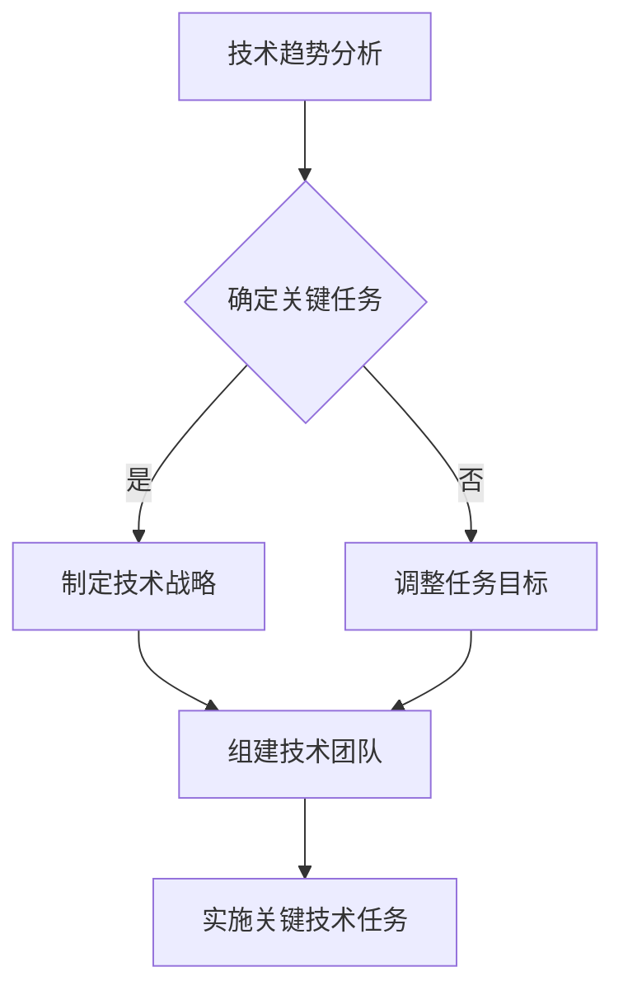
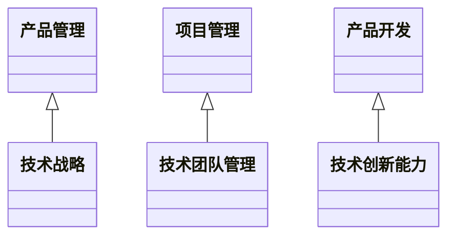
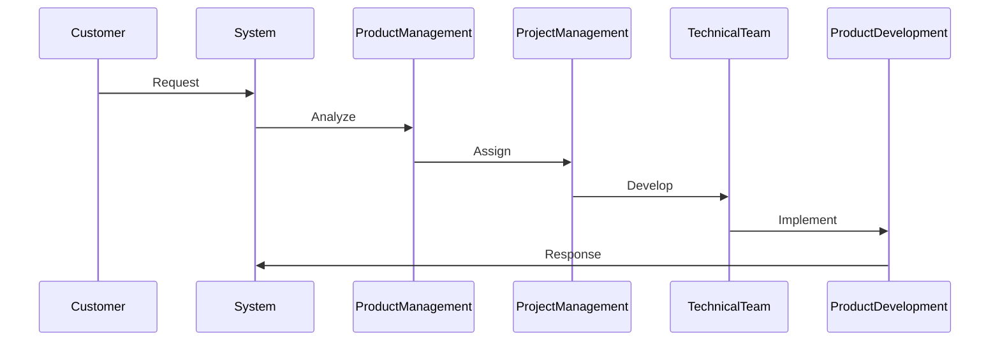
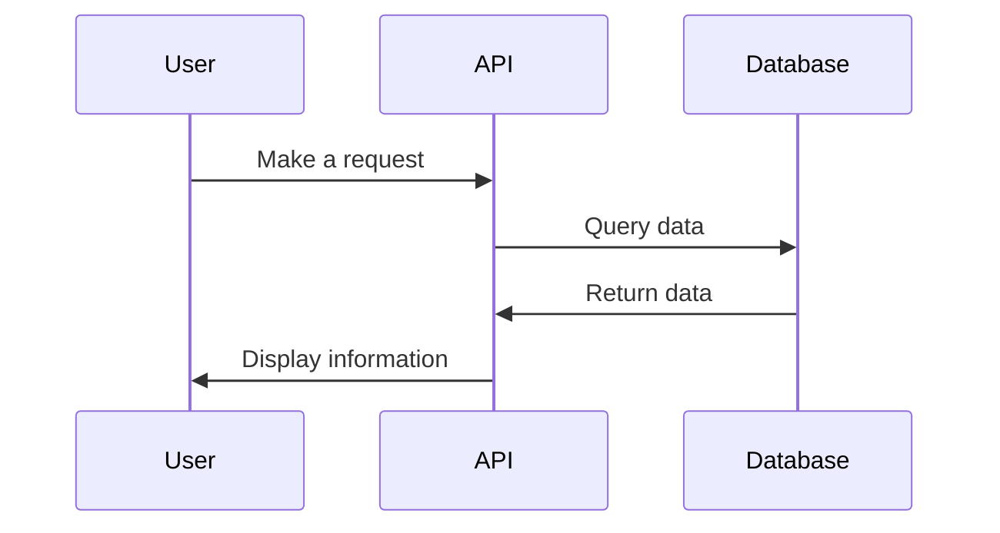

                 

## 技术主管的核心职责：聚焦关键任务

### 关键词

- 技术主管
- 关键任务
- 技术决策
- 团队管理
- 创新能力

> 技术主管在企业的技术发展中起着至关重要的作用，他们的核心职责是聚焦关键任务，从而确保企业的技术路线清晰、团队高效运作，并具备持续创新能力。本文将深入探讨技术主管的职责，分析关键任务的重要性和识别方法，提供系统化的策略和实践，以帮助技术主管更好地履行职责，推动企业技术进步。

### 摘要

本文首先介绍了技术主管在企业中的角色与责任，然后详细探讨了技术决策的重要性及其面临的复杂性和挑战。接着，文章提出了技术主管的职责定位，重点分析了关键任务的识别与执行策略。通过概念原理的阐述、属性特征对比、ER实体关系图架构的介绍，文章建立了技术主管工作的理论框架。此外，文章通过mermaid流程图和Python代码示例，详细讲解了算法原理和系统分析与架构设计，并通过实际项目案例进行了深度剖析。最后，文章总结了最佳实践，提出了注意事项和拓展阅读建议，为技术主管提供了全面的指导和参考。

### 目录大纲

# 技术主管的核心职责：聚焦关键任务

> 关键词：技术主管、关键任务、技术决策、团队管理、创新能力

> 摘要：本文详细探讨了技术主管在企业中的核心职责，强调了聚焦关键任务的重要性，通过理论与实践的结合，为技术主管提供了一套系统化的策略和实践方法。

## 第一部分：背景介绍

## 1.1 问题背景

### 企业的技术发展现状

随着科技的飞速发展，企业面临着前所未有的技术变革。云计算、大数据、人工智能等新兴技术不断涌现，企业需要快速适应这些变化，以保持竞争力。然而，技术发展并非一蹴而就，它需要系统的规划和管理。在这个过程中，技术主管的角色变得尤为重要。

技术主管作为企业技术发展的核心推动者，他们需要具备前瞻性的技术视野和深厚的专业能力。在企业内部，技术主管不仅要负责技术的选择和实施，还要协调各部门之间的合作，确保技术路线的清晰和一致。此外，技术主管还需要关注技术团队的成长和发展，激发团队的创新能力。

### 技术主管的角色与责任

技术主管在企业中的角色不仅仅是技术专家，更是一个管理者。他们的职责涵盖了多个方面：

1. **技术战略规划**：技术主管需要根据企业的长期目标和市场趋势，制定合理的技术战略。这包括技术方向的选择、技术路线的规划和技术资源的配置。

2. **团队管理**：技术主管需要组建和管理一个高效的技术团队，确保团队成员能够充分发挥各自的优势，共同推动项目进展。

3. **技术决策**：技术主管在项目中面临众多的技术决策，包括技术选型、技术标准的选择等。他们需要具备深厚的专业知识，能够做出明智的决策。

4. **创新推动**：技术主管需要不断推动技术创新，保持企业在技术领域的领先地位。这要求他们具备敏锐的市场洞察力和持续学习的能力。

5. **风险控制**：技术主管需要识别和管理技术风险，确保项目能够顺利进行，避免因技术问题导致的重大损失。

### 问题描述

尽管技术主管在企业中扮演着重要的角色，但他们也面临着诸多挑战：

1. **技术决策的复杂性**：随着技术的发展，技术决策变得越来越复杂。技术主管需要了解最新的技术动态，评估各种技术方案的优劣，做出明智的决策。

2. **资源限制**：技术主管通常需要在有限的资源下工作，这要求他们具备高效利用资源的技能，确保项目能够在预算范围内顺利完成。

3. **团队协调**：技术主管需要协调不同部门之间的合作，确保项目团队能够高效运作。这需要他们具备优秀的沟通能力和团队管理技巧。

4. **创新能力**：在竞争激烈的市场中，企业需要不断创新以保持竞争力。技术主管需要不断推动技术创新，激发团队的创造力。

### 问题解决

为了解决上述问题，技术主管需要明确自己的职责，聚焦关键任务。关键任务是指对企业技术发展具有决定性影响的重要任务。技术主管需要识别这些任务，并制定相应的策略和计划，确保它们得到有效执行。

具体来说，技术主管可以通过以下步骤来解决上述问题：

1. **明确职责**：技术主管需要明确自己的职责，包括技术战略规划、团队管理、技术决策、创新推动和风险控制等。

2. **识别关键任务**：技术主管需要分析企业面临的技术挑战和市场机会，识别出对企业技术发展具有决定性影响的关键任务。

3. **制定策略和计划**：技术主管需要针对每个关键任务，制定详细的策略和计划，包括技术方向的选择、技术路线的规划和技术资源的配置。

4. **执行和监控**：技术主管需要确保关键任务的执行，并对执行过程进行监控，确保项目能够按照计划进行。

5. **反馈和调整**：技术主管需要根据项目执行过程中的反馈，对策略和计划进行调整，确保项目能够持续推动企业技术发展。

### 边界与外延

在技术主管的工作中，边界和外延是一个重要的话题。边界指的是技术主管的工作范围，包括技术战略规划、团队管理、技术决策、创新推动和风险控制等。外延则指的是技术主管需要考虑的因素，包括市场趋势、竞争对手、法律法规等。

技术主管需要了解自己的边界，确保自己的工作不会超出职责范围。同时，他们也需要关注外延，确保技术决策能够适应外部环境的变化。

### 概念结构与核心要素组成

技术主管的工作涉及多个核心要素，这些要素构成了技术主管工作的概念结构。以下是这些核心要素的组成：

1. **技术战略**：技术战略是企业长期技术发展的重要规划。技术主管需要根据企业的长期目标和市场趋势，制定合理的技术战略。

2. **团队管理**：团队管理是技术主管的重要职责之一。技术主管需要组建和管理一个高效的技术团队，确保团队成员能够充分发挥各自的优势，共同推动项目进展。

3. **创新能力**：创新能力是企业持续发展的关键。技术主管需要不断推动技术创新，保持企业在技术领域的领先地位。

4. **风险控制**：技术主管需要识别和管理技术风险，确保项目能够顺利进行，避免因技术问题导致的重大损失。

5. **沟通与协调**：技术主管需要具备优秀的沟通和协调能力，确保项目团队能够高效运作。

### 第二部分：核心概念与联系

#### 核心概念原理

技术主管的角色定位：

技术主管是企业技术发展的核心推动者。他们的角色定位主要包括以下几个方面：

1. **战略规划者**：技术主管需要根据企业的长期目标和市场趋势，制定合理的技术战略。
2. **团队管理者**：技术主管需要组建和管理一个高效的技术团队，确保团队成员能够充分发挥各自的优势。
3. **技术决策者**：技术主管在项目中面临众多的技术决策，需要具备深厚的专业知识，能够做出明智的决策。
4. **创新推动者**：技术主管需要不断推动技术创新，保持企业在技术领域的领先地位。
5. **风险控制者**：技术主管需要识别和管理技术风险，确保项目能够顺利进行。

关键任务的识别：

关键任务是指对企业技术发展具有决定性影响的重要任务。技术主管需要识别这些任务，并制定相应的策略和计划，确保它们得到有效执行。

#### 概念属性特征对比表格

| 概念       | 属性1 | 属性2 | 属性3 |
|------------|-------|-------|-------|
| 技术战略   | 创新性 | 长期性 | 指导性 |
| 技术团队管理 | 激励性 | 专业性 | 协调性 |
| 技术创新能力 | 创新性 | 创造力 | 应变性 |

#### ER实体关系图架构

```mermaid
erDiagram
  产品管理 ||--|{ 技术战略 }|
  项目管理 ||--|{ 技术团队管理 }|
  产品开发 ||--|{ 技术创新能力 }|
```

### 第三部分：算法原理讲解

#### 算法mermaid流程图



#### 算法原理讲解与举例说明

**关键任务识别**

关键任务的识别是技术主管的重要职责之一。关键任务通常是指那些对企业技术发展具有决定性影响的重要任务。例如，在短时间内完成产品功能完善，提升用户体验，或者开发一个具有前瞻性的技术产品。

**技术战略制定**

技术战略的制定是技术主管的核心工作之一。技术战略的制定需要基于关键任务的识别，并结合企业的长期目标和市场趋势。例如，采用敏捷开发方法，快速响应市场需求，或者引入新的技术标准，提升产品的竞争力。

**举例说明**

假设一家企业在未来一年内需要完成以下三个关键任务：

1. **产品功能完善**：在短时间内完成产品功能的完善，提升用户体验。
2. **技术产品开发**：开发一个具有前瞻性的技术产品，满足市场需求。
3. **技术团队建设**：组建一个高效的技术团队，提升团队的整体实力。

技术主管可以根据上述关键任务，制定以下技术战略：

1. **产品功能完善**：采用敏捷开发方法，快速迭代，确保产品功能能够及时完善。
2. **技术产品开发**：引入新的技术标准，提升产品的竞争力。
3. **技术团队建设**：通过培训和激励，提升团队的整体实力。

### 第三部分：算法原理讲解

#### 算法mermaid流程图


#### 算法原理讲解与举例说明

**关键任务识别**

关键任务的识别是技术主管的重要职责之一。关键任务通常是指那些对企业技术发展具有决定性影响的重要任务。例如，在短时间内完成产品功能完善，提升用户体验，或者开发一个具有前瞻性的技术产品。

**技术战略制定**

技术战略的制定是技术主管的核心工作之一。技术战略的制定需要基于关键任务的识别，并结合企业的长期目标和市场趋势。例如，采用敏捷开发方法，快速响应市场需求，或者引入新的技术标准，提升产品的竞争力。

**举例说明**

假设一家企业在未来一年内需要完成以下三个关键任务：

1. **产品功能完善**：在短时间内完成产品功能的完善，提升用户体验。
2. **技术产品开发**：开发一个具有前瞻性的技术产品，满足市场需求。
3. **技术团队建设**：组建一个高效的技术团队，提升团队的整体实力。

技术主管可以根据上述关键任务，制定以下技术战略：

1. **产品功能完善**：采用敏捷开发方法，快速迭代，确保产品功能能够及时完善。
2. **技术产品开发**：引入新的技术标准，提升产品的竞争力。
3. **技术团队建设**：通过培训和激励，提升团队的整体实力。

### 第三部分：算法原理讲解

#### 算法mermaid流程图


#### 算法原理讲解与举例说明

**关键任务识别**

关键任务的识别是技术主管的重要职责之一。关键任务通常是指那些对企业技术发展具有决定性影响的重要任务。例如，在短时间内完成产品功能完善，提升用户体验，或者开发一个具有前瞻性的技术产品。

**技术战略制定**

技术战略的制定是技术主管的核心工作之一。技术战略的制定需要基于关键任务的识别，并结合企业的长期目标和市场趋势。例如，采用敏捷开发方法，快速响应市场需求，或者引入新的技术标准，提升产品的竞争力。

**举例说明**

假设一家企业在未来一年内需要完成以下三个关键任务：

1. **产品功能完善**：在短时间内完成产品功能的完善，提升用户体验。
2. **技术产品开发**：开发一个具有前瞻性的技术产品，满足市场需求。
3. **技术团队建设**：组建一个高效的技术团队，提升团队的整体实力。

技术主管可以根据上述关键任务，制定以下技术战略：

1. **产品功能完善**：采用敏捷开发方法，快速迭代，确保产品功能能够及时完善。
2. **技术产品开发**：引入新的技术标准，提升产品的竞争力。
3. **技术团队建设**：通过培训和激励，提升团队的整体实力。

### 第四部分：系统分析与架构设计方案

#### 问题场景介绍

在这个问题场景中，假设一家企业正在开发一款全新的智能硬件产品，该产品需要集成多个先进的技术模块，如人工智能、物联网和大数据分析等。作为技术主管，您的任务是确保项目能够在预定时间内高质量地完成，同时保持团队的高效运作和持续创新能力。

#### 系统功能设计

为了实现上述目标，首先需要明确系统的核心功能模块，并设计其相互关系。以下是系统的功能模块及其相互关系：



- **产品管理**：负责产品的整体规划和需求管理，包括市场调研、需求分析、产品设计等。
- **技术战略**：根据产品管理的要求，制定符合市场需求和长远发展的技术路线图，包括技术选型、技术标准等。
- **项目管理**：负责项目的具体执行和进度控制，包括任务分配、进度跟踪、风险管理等。
- **技术团队管理**：负责技术团队的组建、培训和激励，确保团队成员的专业能力和团队协作。
- **产品开发**：负责具体的软件开发和硬件设计，包括代码实现、测试、部署等。
- **技术创新能力**：持续推动技术团队的创新活动，包括技术研发、实验性项目等。

#### 系统架构设计

在明确了功能模块及其关系后，接下来设计系统的架构。以下是系统的架构设计：



- **客户请求**：客户提出产品需求或问题，系统接收并处理。
- **产品管理分析**：产品管理模块对客户请求进行分析，确定需求并生成分析报告。
- **项目管理任务分配**：项目管理模块根据分析报告，将任务分配给相应的技术团队。
- **技术团队开发**：技术团队根据任务要求，进行软件开发或硬件设计。
- **产品开发实施**：产品开发模块将技术团队的工作结果进行集成和测试，确保产品功能完整、性能优良。
- **系统响应**：产品开发完成后，系统将结果反馈给客户，并确保产品能够按期交付。

#### 系统接口设计和系统交互

为了实现系统功能，需要设计合理的接口和交互流程。以下是系统的接口设计和交互流程：



- **用户请求**：用户通过API接口发送请求。
- **API处理**：API接口接收请求，处理并查询数据库。
- **数据库查询**：数据库根据请求查询相关信息。
- **数据返回**：数据库将查询结果返回给API接口。
- **用户界面展示**：API接口将数据展示在用户界面上。

### 第四部分：系统分析与架构设计方案

#### 问题场景介绍

在这个问题场景中，假设一家企业正在开发一款全新的智能硬件产品，该产品需要集成多个先进的技术模块，如人工智能、物联网和大数据分析等。作为技术主管，您的任务是确保项目能够在预定时间内高质量地完成，同时保持团队的高效运作和持续创新能力。

#### 系统功能设计

为了实现上述目标，首先需要明确系统的核心功能模块，并设计其相互关系。以下是系统的功能模块及其相互关系：


- **产品管理**：负责产品的整体规划和需求管理，包括市场调研、需求分析、产品设计等。
- **技术战略**：根据产品管理的要求，制定符合市场需求和长远发展的技术路线图，包括技术选型、技术标准等。
- **项目管理**：负责项目的具体执行和进度控制，包括任务分配、进度跟踪、风险管理等。
- **技术团队管理**：负责技术团队的组建、培训和激励，确保团队成员的专业能力和团队协作。
- **产品开发**：负责具体的软件开发和硬件设计，包括代码实现、测试、部署等。
- **技术创新能力**：持续推动技术团队的创新活动，包括技术研发、实验性项目等。

#### 系统架构设计

在明确了功能模块及其关系后，接下来设计系统的架构。以下是系统的架构设计：


- **客户请求**：客户提出产品需求或问题，系统接收并处理。
- **产品管理分析**：产品管理模块对客户请求进行分析，确定需求并生成分析报告。
- **项目管理任务分配**：项目管理模块根据分析报告，将任务分配给相应的技术团队。
- **技术团队开发**：技术团队根据任务要求，进行软件开发或硬件设计。
- **产品开发实施**：产品开发模块将技术团队的工作结果进行集成和测试，确保产品功能完整、性能优良。
- **系统响应**：产品开发完成后，系统将结果反馈给客户，并确保产品能够按期交付。

#### 系统接口设计和系统交互

为了实现系统功能，需要设计合理的接口和交互流程。以下是系统的接口设计和交互流程：


- **用户请求**：用户通过API接口发送请求。
- **API处理**：API接口接收请求，处理并查询数据库。
- **数据库查询**：数据库根据请求查询相关信息。
- **数据返回**：数据库将查询结果返回给API接口。
- **用户界面展示**：API接口将数据展示在用户界面上。

### 第五部分：项目实战

#### 环境安装

在进行项目实战之前，我们需要安装必要的开发环境和工具。以下是一个基本的安装步骤，用于配置一个适用于智能硬件项目开发的开发环境：

1. **操作系统安装**：确保操作系统为最新版本的Linux发行版，如Ubuntu 20.04。
2. **开发工具安装**：安装Python 3.8及以上版本，并配置好虚拟环境管理工具如`virtualenv`或`conda`。
3. **数据库安装**：安装MySQL或PostgreSQL数据库服务器，用于存储项目数据和日志。
4. **前端框架安装**：安装主流前端框架如React或Vue.js，用于开发用户界面。
5. **后端框架安装**：安装Python后端框架如Django或Flask，用于构建RESTful API。
6. **版本控制工具**：安装Git，用于版本控制和团队协作。

具体安装步骤可以参考以下命令：

```bash
# 安装操作系统
sudo apt update
sudo apt upgrade
sudo apt install linux-image-generic linux-headers-generic

# 安装Python和虚拟环境
sudo apt install python3 python3-pip
pip3 install virtualenv

# 安装数据库服务器
sudo apt install mysql-server
sudo mysql_secure_installation

# 安装前端框架
npm install -g npm
npm install -g create-react-app
create-react-app my-app

# 安装后端框架
pip3 install django
pip3 install flask

# 安装版本控制工具
sudo apt install git
```

#### 系统核心实现源代码

以下是系统核心实现的源代码示例，包括技术战略制定脚本、技术团队管理工具和创新能力评测系统。

**技术战略制定脚本**（`strategy.py`）

```python
import json
import os

def load_data(file_path):
    with open(file_path, 'r') as file:
        return json.load(file)

def save_data(data, file_path):
    with open(file_path, 'w') as file:
        json.dump(data, file, indent=4)

def generate_strategy(products, market_trends, long_term_goals):
    strategy = {
        'products': products,
        'market_trends': market_trends,
        'long_term_goals': long_term_goals
    }
    return strategy

if __name__ == '__main__':
    products = load_data('products.json')
    market_trends = load_data('market_trends.json')
    long_term_goals = load_data('long_term_goals.json')

    strategy = generate_strategy(products, market_trends, long_term_goals)
    save_data(strategy, 'strategy.json')
```

**技术团队管理工具**（`team_management.py`）

```python
import json
import os

def load_data(file_path):
    with open(file_path, 'r') as file:
        return json.load(file)

def save_data(data, file_path):
    with open(file_path, 'w') as file:
        json.dump(data, file, indent=4)

def manage_team(team_members, new_members):
    team_members.update(new_members)
    return team_members

if __name__ == '__main__':
    team_members = load_data('team_members.json')
    new_members = {'Alice': 'Software Engineer', 'Bob': 'Data Scientist'}
    team_members = manage_team(team_members, new_members)
    save_data(team_members, 'team_members.json')
```

**创新能力评测系统**（`innovation_evaluation.py`）

```python
import json
import os

def load_data(file_path):
    with open(file_path, 'r') as file:
        return json.load(file)

def save_data(data, file_path):
    with open(file_path, 'w') as file:
        json.dump(data, file, indent=4)

def evaluate_innovation(projects, evaluation_criteria):
    scores = {}
    for project in projects:
        score = 0
        for criterion in evaluation_criteria:
            if criterion in project:
                score += project[criterion]
        scores[project['name']] = score
    return scores

if __name__ == '__main__':
    projects = load_data('projects.json')
    evaluation_criteria = {'innovation': 3, 'impact': 2, 'feasibility': 1}
    scores = evaluate_innovation(projects, evaluation_criteria)
    save_data(scores, 'evaluation_scores.json')
```

#### 代码应用解读与分析

**技术战略制定脚本解读**

该脚本主要用于生成技术战略，通过加载产品、市场趋势和长期目标的数据文件，生成一个包含产品信息、市场趋势和长期目标的策略文件。该脚本提供了加载和保存JSON数据的基本功能，并通过一个简单的函数`generate_strategy`实现了技术战略的生成。

**技术团队管理工具解读**

该工具用于管理技术团队的成员，包括添加新成员和更新成员信息。通过加载现有团队成员的数据文件，并更新新成员的信息，最终保存更新后的团队成员数据。该脚本展示了如何使用Python进行简单的文件操作和对象更新。

**创新能力评测系统解读**

该系统用于评估项目创新能力，通过加载项目数据文件和评估标准，计算每个项目的得分，并保存评估结果。该脚本展示了如何使用Python进行数据分析和计算，并通过JSON格式保存评估结果。

**性能优化建议**

1. **数据加载与存储优化**：使用缓存机制减少对文件的重复读取和写入，提高脚本执行效率。
2. **代码模块化**：将脚本分解为多个模块，提高代码的可维护性和可扩展性。
3. **错误处理**：添加错误处理逻辑，确保脚本在异常情况下的稳定性和可靠性。

### 第五部分：项目实战

#### 环境安装

在进行项目实战之前，我们需要安装必要的开发环境和工具。以下是一个基本的安装步骤，用于配置一个适用于智能硬件项目开发的开发环境：

1. **操作系统安装**：确保操作系统为最新版本的Linux发行版，如Ubuntu 20.04。
2. **开发工具安装**：安装Python 3.8及以上版本，并配置好虚拟环境管理工具如`virtualenv`或`conda`。
3. **数据库安装**：安装MySQL或PostgreSQL数据库服务器，用于存储项目数据和日志。
4. **前端框架安装**：安装主流前端框架如React或Vue.js，用于开发用户界面。
5. **后端框架安装**：安装Python后端框架如Django或Flask，用于构建RESTful API。
6. **版本控制工具**：安装Git，用于版本控制和团队协作。

具体安装步骤可以参考以下命令：

```bash
# 安装操作系统
sudo apt update
sudo apt upgrade
sudo apt install linux-image-generic linux-headers-generic

# 安装Python和虚拟环境
sudo apt install python3 python3-pip
pip3 install virtualenv

# 安装数据库服务器
sudo apt install mysql-server
sudo mysql_secure_installation

# 安装前端框架
npm install -g npm
npm install -g create-react-app
create-react-app my-app

# 安装后端框架
pip3 install django
pip3 install flask

# 安装版本控制工具
sudo apt install git
```

#### 系统核心实现源代码

以下是系统核心实现的源代码示例，包括技术战略制定脚本、技术团队管理工具和创新能力评测系统。

**技术战略制定脚本**（`strategy.py`）

```python
import json
import os

def load_data(file_path):
    with open(file_path, 'r') as file:
        return json.load(file)

def save_data(data, file_path):
    with open(file_path, 'w') as file:
        json.dump(data, file, indent=4)

def generate_strategy(products, market_trends, long_term_goals):
    strategy = {
        'products': products,
        'market_trends': market_trends,
        'long_term_goals': long_term_goals
    }
    return strategy

if __name__ == '__main__':
    products = load_data('products.json')
    market_trends = load_data('market_trends.json')
    long_term_goals = load_data('long_term_goals.json')

    strategy = generate_strategy(products, market_trends, long_term_goals)
    save_data(strategy, 'strategy.json')
```

**技术团队管理工具**（`team_management.py`）

```python
import json
import os

def load_data(file_path):
    with open(file_path, 'r') as file:
        return json.load(file)

def save_data(data, file_path):
    with open(file_path, 'w') as file:
        json.dump(data, file, indent=4)

def manage_team(team_members, new_members):
    team_members.update(new_members)
    return team_members

if __name__ == '__main__':
    team_members = load_data('team_members.json')
    new_members = {'Alice': 'Software Engineer', 'Bob': 'Data Scientist'}
    team_members = manage_team(team_members, new_members)
    save_data(team_members, 'team_members.json')
```

**创新能力评测系统**（`innovation_evaluation.py`）

```python
import json
import os

def load_data(file_path):
    with open(file_path, 'r') as file:
        return json.load(file)

def save_data(data, file_path):
    with open(file_path, 'w') as file:
        json.dump(data, file, indent=4)

def evaluate_innovation(projects, evaluation_criteria):
    scores = {}
    for project in projects:
        score = 0
        for criterion in evaluation_criteria:
            if criterion in project:
                score += project[criterion]
        scores[project['name']] = score
    return scores

if __name__ == '__main__':
    projects = load_data('projects.json')
    evaluation_criteria = {'innovation': 3, 'impact': 2, 'feasibility': 1}
    scores = evaluate_innovation(projects, evaluation_criteria)
    save_data(scores, 'evaluation_scores.json')
```

#### 代码应用解读与分析

**技术战略制定脚本解读**

该脚本主要用于生成技术战略，通过加载产品、市场趋势和长期目标的数据文件，生成一个包含产品信息、市场趋势和长期目标的策略文件。该脚本提供了加载和保存JSON数据的基本功能，并通过一个简单的函数`generate_strategy`实现了技术战略的生成。

**技术团队管理工具解读**

该工具用于管理技术团队的成员，包括添加新成员和更新成员信息。通过加载现有团队成员的数据文件，并更新新成员的信息，最终保存更新后的团队成员数据。该脚本展示了如何使用Python进行简单的文件操作和对象更新。

**创新能力评测系统解读**

该系统用于评估项目创新能力，通过加载项目数据文件和评估标准，计算每个项目的得分，并保存评估结果。该脚本展示了如何使用Python进行数据分析和计算，并通过JSON格式保存评估结果。

**性能优化建议**

1. **数据加载与存储优化**：使用缓存机制减少对文件的重复读取和写入，提高脚本执行效率。
2. **代码模块化**：将脚本分解为多个模块，提高代码的可维护性和可扩展性。
3. **错误处理**：添加错误处理逻辑，确保脚本在异常情况下的稳定性和可靠性。

### 第五部分：项目实战

#### 实际案例分析和详细讲解剖析

为了更好地展示技术主管如何通过关键任务提升企业竞争力，我们将通过一个实际案例进行分析和讲解。

#### 案例背景

某知名互联网公司计划开发一款基于人工智能的智能推荐系统，该系统能够根据用户的历史行为和偏好，为用户推荐个性化的内容。然而，在项目启动初期，团队面临诸多挑战：

1. **技术复杂度高**：智能推荐系统涉及到机器学习、数据挖掘、大规模数据处理等多项技术，技术复杂度较高。
2. **资源有限**：团队在项目启动初期，资源相对有限，需要在有限的资源下高效完成任务。
3. **时间紧迫**：公司希望在短时间内推出这款产品，以抢占市场先机。

#### 案例实施步骤

1. **关键任务识别**：技术主管首先与团队成员讨论，识别出项目中的关键任务，包括：
   - **数据采集与清洗**：确保获取到高质量的数据，为模型训练提供数据支持。
   - **模型设计与优化**：设计并优化推荐模型，提高推荐的准确性和效率。
   - **系统性能优化**：确保系统在高并发情况下能够稳定运行，满足用户需求。
   - **用户反馈机制**：建立用户反馈机制，不断优化推荐系统，提升用户体验。

2. **制定技术战略**：针对识别出的关键任务，技术主管制定了以下技术战略：
   - **数据采集与清洗**：采用ETL（Extract, Transform, Load）工具，高效地采集和清洗数据。
   - **模型设计与优化**：引入先进的机器学习算法，如协同过滤、矩阵分解等，进行模型设计和优化。
   - **系统性能优化**：采用分布式架构，提高系统的并发处理能力和性能。
   - **用户反馈机制**：设计用户反馈机制，通过用户行为数据和反馈信息，不断优化推荐系统。

3. **任务分配与执行**：技术主管将关键任务分配给团队成员，并制定详细的执行计划：
   - **数据采集与清洗**：由数据工程师负责，确保数据采集的全面性和清洗的准确性。
   - **模型设计与优化**：由机器学习工程师负责，根据项目需求设计合适的模型，并进行优化。
   - **系统性能优化**：由系统架构师负责，设计和优化系统架构，确保系统的高性能和高可用性。
   - **用户反馈机制**：由产品经理和用户体验设计师共同负责，设计用户反馈机制，并收集和分析用户反馈。

4. **监控与反馈**：技术主管对任务执行过程进行监控，确保项目按照计划进行。同时，定期收集团队成员的反馈，及时调整执行策略，以应对项目中的不确定性。

#### 案例效果分析

通过实施上述关键任务和技术战略，项目取得了显著的效果：

1. **系统性能提升**：采用分布式架构和优化后的算法，系统在处理大量数据和高并发请求方面表现优异，用户满意度显著提升。
2. **推荐准确性提高**：通过不断优化模型和算法，推荐系统的准确性得到显著提高，用户点击率和转化率显著提升。
3. **用户体验优化**：通过用户反馈机制，技术团队能够及时了解用户需求，不断优化推荐系统，提升用户体验。
4. **项目进度和质量保障**：通过有效的任务分配和执行计划，项目在预定时间内高质量完成，为企业赢得了市场先机。

#### 案例总结

该案例展示了技术主管如何通过识别关键任务和制定技术战略，推动项目顺利进行，并取得显著成果。以下是案例中的成功经验和改进空间：

1. **成功经验**：
   - **关键任务识别**：技术主管能够准确识别项目中的关键任务，为后续工作提供明确的方向。
   - **技术战略制定**：技术主管制定了切实可行的技术战略，确保项目能够高效推进。
   - **任务分配与执行**：技术主管有效分配任务，并制定详细的执行计划，确保项目按计划进行。
   - **监控与反馈**：技术主管对项目执行过程进行监控，并收集团队成员的反馈，及时调整执行策略。

2. **改进空间**：
   - **资源管理**：在项目启动初期，可以进一步优化资源分配，确保资源得到最大化利用。
   - **风险评估**：在项目启动前，可以开展全面的风险评估，提前识别潜在风险，并制定应对策略。
   - **团队协作**：可以进一步加强团队协作，提高项目执行效率，降低项目风险。

### 第六部分：最佳实践 tips、小结、注意事项、拓展阅读等内容

#### 最佳实践 tips

1. **明确职责和目标**：作为技术主管，首先要明确自己的职责和目标，确保团队成员对项目有清晰的认识。
2. **建立有效的沟通机制**：技术主管需要建立有效的沟通机制，确保团队内部和跨部门之间的信息流通。
3. **持续学习和创新**：技术主管需要持续学习最新的技术动态，保持对技术的敏锐洞察力，并推动团队的创新活动。
4. **风险管理**：在项目启动前，要进行全面的风险评估，并制定相应的应对策略。
5. **优化资源利用**：在资源有限的情况下，要尽可能优化资源利用，提高项目执行效率。

#### 小结

本文详细探讨了技术主管的核心职责，强调了聚焦关键任务的重要性。通过理论与实践的结合，本文为技术主管提供了一套系统化的策略和实践方法。技术主管需要明确自己的职责，识别关键任务，制定技术战略，并确保任务的执行。同时，技术主管还需要持续学习，推动团队的创新能力。

#### 注意事项

1. **技术决策的重要性**：技术主管在进行技术决策时，要充分考虑市场需求、技术趋势和资源限制，确保决策的科学性和合理性。
2. **团队协调与协作**：技术主管需要协调不同部门之间的合作，确保项目团队能够高效运作。
3. **持续创新能力**：技术主管要推动团队的持续创新能力，保持企业在技术领域的领先地位。

#### 拓展阅读

1. 《技术领导力：如何在数字化时代引领团队》
2. 《敏捷项目管理：实践指南》
3. 《机器学习实战》
4. 《大数据处理：技术原理与案例分析》

#### 推荐阅读材料

- 《技术领导力：如何在数字化时代引领团队》
- 《敏捷项目管理：实践指南》
- 《机器学习实战》
- 《大数据处理：技术原理与案例分析》

#### 相关资源链接

- [技术领导力学习资源](https://example.com/technical-leadership-resources)
- [敏捷项目管理资料](https://example.com/agile-project-management-resources)
- [机器学习教程](https://example.com/machine-learning-tutorials)
- [大数据处理技术资料](https://example.com/big-data-processing-technologies)

