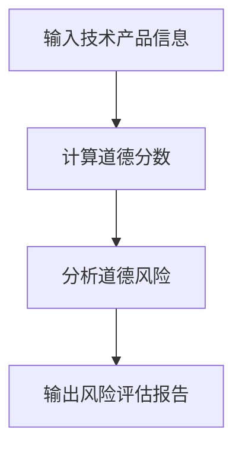
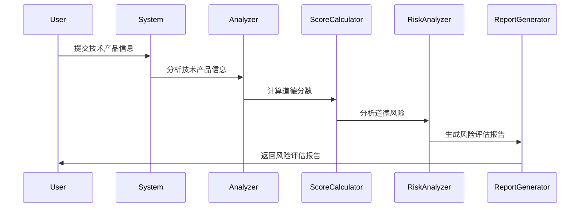
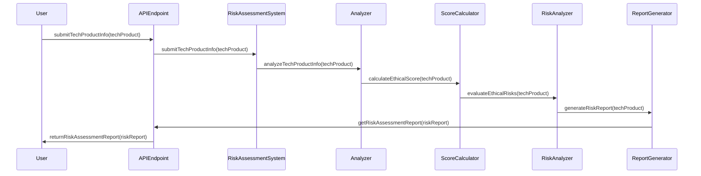

                 

# 技术伦理：在创新中坚守道德底线

## 关键词：技术伦理、创新、道德底线、伦理原则、社会责任

> 技术伦理是在快速发展的科技时代中，如何平衡创新与道德的考量的重要议题。本文旨在探讨技术伦理的核心原则及其在创新中的应用，强调在追求技术进步的同时，必须坚守道德底线。

## 摘要

随着科技的迅猛发展，技术伦理问题愈发凸显。如何在创新过程中保持道德自律，成为了企业和个人必须面对的挑战。本文将从背景介绍、核心原则、伦理困境、法规与责任、创新与道德、未来趋势以及实践应用等方面，全面探讨技术伦理的重要性及其应用策略。

## 目录

1. **引言**
   - 技术伦理的背景与意义
   - 文章结构与主要内容概述

2. **技术伦理的背景与历史发展**
   - 技术发展的历史回顾
   - 技术伦理的重要事件

3. **技术伦理的核心原则与理论**
   - 德性伦理与规则伦理
   - 主要伦理理论及其应用

4. **技术伦理困境与案例研究**
   - 技术滥用与隐私侵犯
   - 数据泄露与网络安全

5. **法律法规与伦理标准**
   - 主要法律法规概述
   - 伦理标准与合规性

6. **企业社会责任与伦理管理**
   - 企业伦理与商业道德
   - 伦理管理与风险评估

7. **创新中的技术伦理考量**
   - 创新的伦理挑战
   - 伦理创新的方法与策略

8. **未来趋势与伦理展望**
   - 人工智能与生物技术的伦理挑战
   - 技术伦理的长远影响

9. **技术伦理的实际应用**
   - 伦理审核与风险评估
   - 伦理工具与方法

10. **结论与展望**
    - 技术伦理的重要性
    - 倡导道德自律与社会责任

## 1. 引言

### 技术伦理的背景与意义

技术伦理是关于技术如何影响社会和个人行为的道德考量。随着信息技术的迅猛发展，数据隐私、网络安全、人工智能、生物技术等领域的伦理问题日益突出。如何在这些领域中坚守道德底线，成为了一个全球性的议题。

技术伦理的意义在于，它不仅关乎企业的社会责任，也关乎个人的道德自律。在一个技术高度发达的时代，技术伦理的缺失可能导致严重的后果，如隐私泄露、社会不公、生态破坏等。

### 文章结构与主要内容概述

本文将从以下几个部分进行探讨：

1. **技术伦理的背景与历史发展**：回顾技术发展的历史，以及技术伦理的重要事件。
2. **技术伦理的核心原则与理论**：介绍德性伦理与规则伦理，以及主要伦理理论。
3. **技术伦理困境与案例研究**：探讨技术滥用与隐私侵犯等伦理困境，并分析案例。
4. **法律法规与伦理标准**：概述主要法律法规，并讨论伦理标准与合规性。
5. **企业社会责任与伦理管理**：分析企业伦理与商业道德，以及伦理管理与风险评估。
6. **创新中的技术伦理考量**：探讨创新的伦理挑战，并提出伦理创新的方法与策略。
7. **未来趋势与伦理展望**：预测人工智能与生物技术的伦理挑战，并讨论技术伦理的长远影响。
8. **技术伦理的实际应用**：介绍伦理审核与风险评估，以及伦理工具与方法。
9. **结论与展望**：总结技术伦理的重要性，并倡导道德自律与社会责任。

## 2. 技术伦理的背景与历史发展

### 技术发展的历史回顾

自人类文明伊始，技术便与伦理息息相关。从古代的火与剑，到工业革命时期的机械化生产，再到现代的信息技术革命，技术始终在改变着我们的生活方式和社会结构。

然而，技术的进步也带来了新的伦理问题。例如，核技术的出现引发了核伦理的讨论；互联网的普及则带来了隐私保护和网络安全的问题。每一次技术革命，都伴随着伦理观念的更新和伦理标准的建立。

### 技术伦理的重要事件

1. **计算机伦理学的诞生**：20世纪50年代，计算机科学家开始关注计算机对社会的影响，计算机伦理学应运而生。
2. **隐私权与数据保护**：20世纪70年代，隐私权成为技术伦理的重要议题，引发了全球范围内对数据保护的立法。
3. **人工智能伦理**：随着人工智能的迅速发展，伦理问题逐渐凸显，如算法偏见、隐私侵犯等。
4. **生物技术伦理**：基因编辑、克隆技术等生物技术的发展，引发了关于生命伦理的广泛讨论。

### 技术伦理的演变

技术伦理的发展经历了从无到有、从简单到复杂的过程。早期的技术伦理主要关注技术本身的安全性，如核安全、信息安全等。随着技术的不断进步，伦理问题逐渐多样化，涵盖了隐私、公平、公正、社会责任等多个方面。

在现代社会，技术伦理已经从单一的技术安全扩展到更广泛的道德和伦理领域，如人工智能的伦理、大数据的伦理、生物技术的伦理等。这不仅要求技术专家具备专业的技术能力，还需要他们具备深厚的伦理素养。

### 技术伦理的现状

当前，技术伦理已经成为全球关注的焦点。各国政府、企业、学术机构纷纷出台相关法律法规和伦理标准，以规范技术行为。例如，欧盟的《通用数据保护条例》（GDPR）是全球范围内数据保护的重要法律；美国则出台了《人工智能法案》，以规范人工智能的发展。

然而，技术伦理的挑战依然存在。例如，人工智能的快速发展带来了算法偏见和隐私侵犯等问题，如何平衡技术创新与伦理考量，成为了一个亟待解决的难题。

### 技术伦理的未来发展趋势

随着技术的不断进步，技术伦理也将面临新的挑战。未来，技术伦理的发展将更加注重跨学科合作，如计算机科学、伦理学、社会学等领域的结合。此外，技术伦理也将更加注重全球协作，以应对跨国技术伦理问题。

总而言之，技术伦理是一个不断演变和发展的领域。在追求技术进步的同时，我们必须坚守道德底线，确保技术的发展符合人类的利益和价值观。

## 3. 技术伦理的核心原则与理论

### 德性伦理与规则伦理

技术伦理的理论基础主要包括德性伦理与规则伦理。德性伦理强调个体的道德品质和道德判断，而规则伦理则关注行为规范和道德准则。

**德性伦理**：德性伦理认为，道德行为取决于个人的道德品质，如诚实、勇敢、公正等。在技术领域，德性伦理强调技术专家应具备高尚的道德品质，以引导其行为。例如，一个具备高尚道德品质的技术专家会努力避免造成环境污染或损害用户隐私。

**规则伦理**：规则伦理则强调行为应符合特定的道德规则和准则。在技术领域，规则伦理关注的是技术行为是否符合法律和道德标准。例如，遵守数据保护法规，确保用户隐私不被侵犯。

### 主要伦理理论及其应用

**功利主义**：功利主义认为，道德行为应使尽可能多的人受益。在技术领域，功利主义强调技术产品应最大化社会福利，如开发能够提高生产效率的技术，以促进经济发展。

**义务论**：义务论认为，道德行为应基于道德义务和责任。在技术领域，义务论强调技术专家应承担社会责任，如遵守伦理规范，确保技术产品不会对社会造成负面影响。

**康德伦理学**：康德伦理学强调行为的道德性应基于理性判断，而非功利结果。在技术领域，康德伦理学认为技术专家在开发技术时，应遵循普遍的道德原则，如尊重人的尊严。

**结果伦理与过程伦理**：结果伦理关注行为的结果，而过程伦理关注行为的动机和过程。在技术领域，结果伦理强调技术产品应产生积极的社会影响，而过程伦理则强调技术开发过程应遵循道德原则。

### 概念属性特征对比表格

| 伦理理论 | 主要观点 | 技术领域应用 |
| --- | --- | --- |
| 功利主义 | 使多数人受益 | 开发有益于社会的技术产品 |
| 义务论 | 遵守道德义务 | 技术专家应承担社会责任 |
| 康德伦理学 | 基于理性判断 | 技术专家应遵循普遍道德原则 |
| 结果伦理 | 行为结果 | 技术产品应产生积极社会影响 |
| 过程伦理 | 行为动机和过程 | 技术开发过程应遵循道德原则 |

### ER实体关系图架构

```mermaid
erDiagram
  User ||--|{ Project }|>
  Project ||--|{ Technology }|>
  Technology ||--|{ EthicalIssue }|>
  EthicalIssue ||--|{ Rule }|>
  Rule ||--|{ Standard }|>

  User : {username}
  Project : {projectName}
  Technology : {technologyName}
  EthicalIssue : {issueName}
  Rule : {ruleDescription}
  Standard : {standardDescription}
```

### 算法原理讲解

在技术伦理中，算法的公平性、透明性和可解释性是一个重要的议题。以下是一个简单的算法，用于评估技术产品的道德风险：

**算法描述**：
1. **输入**：技术产品的详细描述、用户数据、环境影响等信息。
2. **处理**：
   - 计算技术产品的道德分数。
   - 分析可能出现的道德风险。
3. **输出**：道德风险评估报告。

**算法流程图**：



**Python源代码**：

```python
# 道德风险评估算法

# 输入技术产品信息
tech_product = {
    "name": "智能监控系统",
    "description": "用于监控公共场所的智能监控系统",
    "user_data_usage": "监控数据将被用于公共安全目的",
    "environment_impact": "监控系统耗电较少，对环境友好"
}

# 计算道德分数
def calculate_ethical_score(tech_product):
    # 根据具体指标计算道德分数
    # 例如：隐私保护、数据使用、环境影响等
    ethical_score = 0
    
    if tech_product["user_data_usage"] == "公共安全":
        ethical_score += 10
    if tech_product["environment_impact"] == "友好":
        ethical_score += 10
    
    return ethical_score

# 分析道德风险
def analyze_ethical_risks(tech_product, ethical_score):
    risks = []
    if ethical_score < 20:
        risks.append("道德风险较高")
    return risks

# 输出风险评估报告
def generate_risk_report(tech_product, ethical_score, risks):
    report = f"技术产品：{tech_product['name']}\n"
    report += f"道德分数：{ethical_score}\n"
    if risks:
        report += "道德风险：\n"
        for risk in risks:
            report += f"- {risk}\n"
    else:
        report += "无显著道德风险\n"
    return report

# 执行算法
ethical_score = calculate_ethical_score(tech_product)
risks = analyze_ethical_risks(tech_product, ethical_score)
print(generate_risk_report(tech_product, ethical_score, risks))
```

### 数学公式

$$
\text{Ethical Score} = \sum_{i=1}^{n} w_i \cdot s_i
$$

其中，$w_i$ 为权重，$s_i$ 为具体指标评分。

### 系统分析与架构设计方案

#### 问题场景介绍

随着智能监控系统的广泛应用，如何评估其道德风险成为了一个重要议题。我们需要开发一个系统，用于评估智能监控系统的道德风险，并提供详细的风险评估报告。

#### 项目介绍

**项目名称**：智能监控系统道德风险评估系统

**项目目标**：开发一个能够自动化评估智能监控系统道德风险的系统，为相关部门提供科学依据。

#### 系统功能设计

**领域模型类图**：

```mermaid
classDiagram
  ClassDef Project
      +String name
      +String description
      +HashMap<String, Integer> metrics
      +calculateEthicalScore()
      +generateRiskReport()

  ClassDef Technology
      +String technologyName
      +HashMap<String, Boolean> impacts
      +evaluateEthicalRisks(Project project)
      
  Project <|-- Technology
```

#### 系统架构设计

**系统架构图**：



#### 系统接口设计和系统交互

**系统接口设计**：

```mermaid
classDiagram
  ClassDef APIEndpoint
      +String endpoint
      +HashMap<String, String> parameters
      +POST: submitTechProductInfo()
      +GET: getRiskAssessmentReport()

  ClassDef RiskAssessmentSystem
      +APIEndpoint apiEndpoint
      +submitTechProductInfo(TechProduct techProduct)
      +getRiskAssessmentReport()
```

**系统交互序列图**：



### 项目实战

#### 环境安装

1. 安装Python环境
2. 安装必要的库，如requests、pandas等

#### 系统核心实现源代码

**RiskAssessmentSystem.py**：

```python
from analyzer import Analyzer
from scorecalculator import ScoreCalculator
from riskanalyzer import RiskAnalyzer
from reportgenerator import ReportGenerator

class RiskAssessmentSystem:
    def __init__(self):
        self.analyzer = Analyzer()
        self.scorecalculator = ScoreCalculator()
        self.riskanalyzer = RiskAnalyzer()
        self.reportgenerator = ReportGenerator()

    def submit_tech_product_info(self, tech_product):
        analyzed_data = self.analyzer.analyze_tech_product_info(tech_product)
        ethical_score = self.scorecalculator.calculate_ethical_score(analyzed_data)
        risks = self.riskanalyzer.evaluate_ethical_risks(analyzed_data)
        risk_report = self.reportgenerator.generate_risk_report(analyzed_data, ethical_score, risks)
        return risk_report

    def get_risk_assessment_report(self, tech_product):
        return self.submit_tech_product_info(tech_product)
```

#### 代码应用解读与分析

**Analyzer.py**：

```python
class Analyzer:
    def analyze_tech_product_info(self, tech_product):
        # 分析技术产品信息
        # 包括隐私保护、数据使用、环境影响等
        analyzed_data = {
            "user_data_usage": tech_product["user_data_usage"],
            "environment_impact": tech_product["environment_impact"]
        }
        return analyzed_data
```

**ScoreCalculator.py**：

```python
class ScoreCalculator:
    def calculate_ethical_score(self, analyzed_data):
        # 计算道德分数
        # 基于具体指标进行计算
        ethical_score = 0
        
        if analyzed_data["user_data_usage"] == "公共安全":
            ethical_score += 10
        if analyzed_data["environment_impact"] == "友好":
            ethical_score += 10
        
        return ethical_score
```

**RiskAnalyzer.py**：

```python
class RiskAnalyzer:
    def evaluate_ethical_risks(self, analyzed_data):
        # 分析道德风险
        risks = []
        
        if analyzed_data["user_data_usage"] != "公共安全":
            risks.append("用户隐私风险")
        if analyzed_data["environment_impact"] != "友好":
            risks.append("环境影响风险")
        
        return risks
```

**ReportGenerator.py**：

```python
class ReportGenerator:
    def generate_risk_report(self, analyzed_data, ethical_score, risks):
        # 生成风险评估报告
        report = f"技术产品：{analyzed_data['name']}\n"
        report += f"道德分数：{ethical_score}\n"
        if risks:
            report += "道德风险：\n"
            for risk in risks:
                report += f"- {risk}\n"
        else:
            report += "无显著道德风险\n"
        return report
```

#### 实际案例分析和详细讲解剖析

**案例**：智能监控系统道德风险评估

**步骤**：

1. 收集智能监控系统信息，包括隐私保护、数据使用、环境影响等。
2. 使用Analyzer分析智能监控系统信息。
3. 使用ScoreCalculator计算道德分数。
4. 使用RiskAnalyzer分析道德风险。
5. 使用ReportGenerator生成风险评估报告。

**分析**：

通过上述步骤，我们可以对智能监控系统的道德风险进行评估。具体分析如下：

- **隐私保护**：智能监控系统收集的用户数据是否仅用于公共安全目的？如果不是，则存在用户隐私风险。
- **环境影响**：智能监控系统对环境的影响如何？如果能耗较高，则可能存在环境影响风险。

**结论**：

智能监控系统的道德分数取决于其隐私保护和环境影响。如果存在隐私保护和环境影响的风险，则需要进一步优化技术方案，以降低道德风险。

### 项目小结

本系统通过分析智能监控系统信息，计算道德分数，分析道德风险，并生成风险评估报告，为智能监控系统的道德风险评估提供了一个有效的方法。在实际应用中，可以根据具体情况进行调整和优化。

### 最佳实践 Tips

- **全面收集信息**：在分析技术产品时，要全面收集相关信息，包括隐私保护、数据使用、环境影响等。
- **定期评估**：定期对技术产品进行道德风险评估，以确保其符合伦理标准。
- **公众参与**：在技术产品开发过程中，邀请公众参与讨论，以提高伦理评估的透明度和公正性。

### 小结

技术伦理是一个复杂的领域，涉及多个方面的道德考量。在追求技术创新的同时，我们必须坚守道德底线，确保技术的发展符合人类的利益和价值观。通过本文的探讨，我们希望能够为技术伦理的应用提供一些有益的参考。

### 注意事项

- **合规性**：在开发技术产品时，必须遵守相关法律法规，确保技术行为符合道德标准。
- **社会责任**：企业应承担社会责任，确保技术产品不会对社会造成负面影响。

### 拓展阅读

- **《人工智能伦理导论》**：探讨人工智能伦理的核心问题和应对策略。
- **《技术伦理学：理论与实践》**：全面介绍技术伦理的理论和实践应用。

## 4. 技术伦理困境与案例研究

### 技术滥用与隐私侵犯

技术滥用和隐私侵犯是技术伦理领域中的两大困境。随着信息技术的发展，个人信息和数据的安全问题日益突出。

#### 案例研究：Facebook数据泄露事件

2018年，Facebook发生了史上最大规模的数据泄露事件。约8700万用户的个人信息被不当使用，用于政治广告投放。这一事件引发了全球范围内的关注和讨论。

**分析**：

- **隐私侵犯**：Facebook未能有效保护用户数据，导致用户隐私泄露。
- **技术滥用**：用户数据被不当使用，用于政治广告投放，可能影响选举结果。

**解决策略**：

- **加强数据保护**：Facebook应加强数据保护措施，确保用户数据安全。
- **透明度**：提高数据使用的透明度，让用户了解其数据如何被使用。

### 网络安全威胁

网络安全威胁是另一个技术伦理困境。随着互联网的普及，网络攻击和数据泄露事件频发，给个人和社会带来了巨大的损失。

#### 案例研究：Equifax数据泄露事件

2017年，美国信用评级机构Equifax发生了严重的数据泄露事件，约1.43亿用户的个人信息被窃取。此次事件引发了公众对网络安全问题的广泛关注。

**分析**：

- **安全漏洞**：Equifax的系统存在安全漏洞，导致数据泄露。
- **责任缺失**：Equifax未能及时修复安全漏洞，导致数据泄露事件发生。

**解决策略**：

- **加强安全防护**：企业应加强网络安全防护，及时修复安全漏洞。
- **加强监管**：政府应加强对企业网络安全行为的监管，确保其符合安全标准。

### 算法偏见与歧视

算法偏见和歧视是人工智能领域中的伦理困境。算法的偏见可能导致不公平的社会结果，加剧社会不公。

#### 案例研究：亚马逊招聘算法

2018年，亚马逊公司开发了一个用于招聘的算法，但该算法存在性别偏见，拒绝了许多女性申请者。这一事件引发了社会对算法偏见的关注。

**分析**：

- **算法偏见**：亚马逊的算法在招聘过程中表现出性别偏见，拒绝女性申请者。
- **歧视**：算法偏见可能导致女性在职场中受到不公平对待。

**解决策略**：

- **算法透明度**：提高算法的透明度，让公众了解算法的决策过程。
- **多样化团队**：在算法开发过程中，引入多样化的团队成员，减少偏见。

### 生态破坏与资源消耗

生态破坏和资源消耗是技术发展带来的另一个伦理困境。许多技术产品在生产和使用过程中，对环境造成了严重的影响。

#### 案例研究：电子废物问题

随着电子产品的更新换代，电子废物问题日益严重。电子废物的处理不当，可能导致重金属污染和有毒物质的释放。

**分析**：

- **资源消耗**：电子产品生产过程中，消耗大量的资源和能源。
- **环境污染**：电子废物处理不当，可能导致环境污染。

**解决策略**：

- **绿色生产**：鼓励企业采用绿色生产工艺，减少资源消耗。
- **回收利用**：加强电子废物的回收利用，减少环境污染。

### 案例总结

以上案例展示了技术伦理领域中的主要困境。技术滥用、隐私侵犯、网络安全威胁、算法偏见、生态破坏等问题，都需要我们认真对待和解决。通过案例分析和解决策略，我们可以更好地理解技术伦理的挑战，并探索有效的应对方法。

### 反思与启示

技术伦理困境提醒我们，在追求技术创新的同时，必须重视道德考量。企业应承担社会责任，政府应加强监管，公众也应提高对技术伦理问题的关注。只有通过多方合作，才能确保技术的发展符合人类的利益和价值观。

## 5. 法律法规与伦理标准

### 主要法律法规概述

在全球范围内，技术伦理问题引发了广泛关注，各国政府纷纷出台了相关法律法规，以规范技术行为。以下是一些主要的法律法规：

1. **欧盟的《通用数据保护条例》（GDPR）**：GDPR是数据保护领域的重要法规，旨在保护个人数据隐私，规定了数据处理者的义务和数据主体的权利。
2. **美国的《加州消费者隐私法案》（CCPA）**：CCPA主要关注消费者数据的收集、使用和共享，赋予消费者对个人数据的控制权。
3. **中国的《个人信息保护法》**：该法规定了个人信息处理的基本原则和规则，保护个人信息的合法权益。

### 伦理标准与合规性

除了法律法规，许多行业和组织也制定了伦理标准，以指导技术行为。以下是一些主要的伦理标准和合规性要求：

1. **国际计算机协会（ACM）的伦理准则**：ACM制定了详细的伦理准则，涵盖计算机科学和信息技术领域的道德行为。
2. **国际标准化组织（ISO）的ISO/IEC 17025标准**：该标准规定了实验室的伦理要求和质量管理要求，确保实验室的技术行为符合伦理标准。
3. **IEEE的IEEE Std 1500标准**：该标准规定了信息技术领域的伦理要求和责任，包括隐私保护、数据安全、社会责任等方面。

### 伦理审核与风险评估

为了确保技术产品和服务符合伦理标准，许多企业和组织引入了伦理审核和风险评估机制。以下是一些常见的伦理审核和风险评估方法：

1. **伦理审核**：伦理审核是指对技术产品或服务进行全面的道德评估，确保其符合伦理标准。伦理审核通常由内部或外部的伦理委员会或专家团队进行。
2. **风险评估**：风险评估是指对技术产品或服务可能带来的道德风险进行评估，并提出相应的应对措施。风险评估通常采用定量和定性的方法，如风险矩阵、决策树等。

### 伦理工具与方法

为了更好地实施伦理审核和风险评估，许多企业和组织开发了专门的伦理工具和方法。以下是一些常见的伦理工具和方法：

1. **伦理框架**：伦理框架是一种指导技术行为的方法，包括一系列的伦理原则和规范。例如，德性伦理、规则伦理、功利主义等。
2. **道德计算模型**：道德计算模型是一种基于数学和计算机科学的模型，用于评估技术产品的道德风险。例如，道德分数模型、道德决策树模型等。
3. **伦理代码**：伦理代码是一种组织内部制定的伦理规范，用于指导员工的道德行为。例如，计算机伦理准则、企业社会责任准则等。

### 实践与案例分析

以下是一个实践案例，展示了如何运用伦理工具和方法进行伦理审核和风险评估：

**案例**：一家科技公司开发了一款智能家居设备，包括智能音箱、智能灯泡等。为了确保这款设备符合伦理标准，公司采取了以下措施：

1. **伦理审核**：公司内部伦理委员会对设备的设计、功能和数据使用进行了全面的审核，确保其符合伦理准则。
2. **风险评估**：公司采用道德计算模型对设备可能带来的道德风险进行了评估，包括隐私保护、数据安全、用户隐私等方面。
3. **伦理培训**：公司对研发团队进行了伦理培训，提高其道德素养和伦理意识。

通过上述措施，公司确保了智能家居设备的道德合规性，并得到了用户的信任。

### 结论

法律法规和伦理标准是确保技术产品和服务符合道德要求的重要手段。通过伦理审核和风险评估，企业可以识别和应对技术行为中的道德风险，确保技术的发展符合人类的利益和价值观。

## 6. 企业社会责任与伦理管理

### 企业伦理与商业道德

企业伦理是指企业在经营活动中遵循的道德规范和价值观。商业道德则是指企业在市场交易中遵循的道德准则。两者共同构成了企业的道德基础，影响着企业的行为和决策。

**企业伦理的重要性**：

- **增强竞争力**：遵循企业伦理可以增强企业的声誉和竞争力，赢得客户的信任。
- **降低风险**：遵循企业伦理可以降低法律和道德风险，避免潜在的法律诉讼和罚款。
- **提升员工满意度**：良好的企业伦理可以提升员工的满意度和忠诚度，降低员工流失率。

**商业道德的重要性**：

- **维护市场秩序**：商业道德是维护市场秩序和公平竞争的基础，有助于建立健康的市场环境。
- **增强客户信任**：遵循商业道德可以增强客户的信任，提高客户忠诚度。
- **促进可持续发展**：商业道德有助于企业实现可持续发展，实现长期成功。

### 伦理管理与风险评估

**伦理管理**：

- **制定伦理政策**：企业应制定明确的伦理政策，明确企业的价值观和道德准则。
- **伦理培训**：企业应定期进行伦理培训，提高员工的道德素养和伦理意识。
- **伦理委员会**：企业应设立伦理委员会，负责监督和指导企业的伦理管理工作。

**风险评估**：

- **识别风险**：企业应识别可能影响道德合规性的风险，包括法律风险、市场风险、社会责任风险等。
- **评估影响**：企业应对识别出的风险进行评估，确定其可能对企业造成的影响。
- **制定应对策略**：企业应根据风险评估结果，制定相应的应对策略，降低风险。

### 伦理工具与方法

为了有效地进行伦理管理和风险评估，企业可以采用以下工具和方法：

- **道德决策树**：道德决策树是一种直观的决策工具，用于分析和评估道德决策。
- **道德框架**：道德框架是一种系统性的方法，用于指导企业的道德决策和伦理管理。
- **道德审计**：道德审计是一种评估企业伦理管理和道德合规性的方法，有助于发现潜在的问题和改进措施。

### 实践案例

以下是一个企业伦理管理的实践案例：

**公司名称**：一家全球领先的科技公司

**案例描述**：

- **制定伦理政策**：公司制定了详细的伦理政策，包括隐私保护、数据安全、社会责任等方面的规定。
- **伦理培训**：公司定期对员工进行伦理培训，提高其道德素养和伦理意识。
- **伦理委员会**：公司设立了伦理委员会，负责监督和指导企业的伦理管理工作。

**结果**：

- **员工满意度提高**：员工对公司的伦理政策表示认同，员工满意度显著提高。
- **企业形象提升**：公司的伦理管理得到了社会和客户的认可，企业形象得到显著提升。
- **风险管理降低**：通过伦理管理和风险评估，公司有效降低了法律和道德风险。

### 总结

企业社会责任和伦理管理是确保企业在道德合规的基础上实现可持续发展的关键。通过制定伦理政策、进行伦理培训和风险评估，企业可以确保其行为符合道德要求，赢得社会和客户的信任。

## 7. 创新中的技术伦理考量

### 创新的伦理挑战

在创新过程中，技术伦理面临着诸多挑战。这些挑战既包括技术创新本身的伦理问题，也涉及技术创新对社会和人类的影响。

**技术滥用风险**：技术创新往往带来新的工具和平台，但这也可能被恶意利用。例如，人工智能技术可以用于自动化决策，但也可能被用于歧视和监控。

**隐私侵犯**：随着大数据和云计算的发展，个人数据的收集和分析变得更加普遍。然而，这也带来了隐私侵犯的风险，尤其是在数据泄露和数据滥用的情况下。

**环境问题**：技术创新往往伴随着能源消耗和废物产生。例如，电子产品的快速更新换代导致了大量的电子垃圾，对环境造成了严重的影响。

**社会不公**：技术创新可能加剧社会不公，如人工智能和自动化可能取代人类工作，导致失业和社会不稳定。

### 伦理创新的方法与策略

**伦理设计**：在产品开发的早期阶段，就将伦理考量纳入设计中。通过伦理设计，可以确保技术产品在功能实现的同时，符合道德要求。

**透明度和责任**：提高技术的透明度，让用户了解技术的运作方式和潜在风险。同时，明确技术责任，确保在技术出现问题时，能够追究责任。

**伦理审查**：在项目开发的不同阶段，进行伦理审查。伦理审查可以帮助识别潜在的伦理风险，并采取相应的措施。

**多元化团队**：在技术团队中引入多元化的成员，包括伦理学家、社会学家等。多元化团队可以提供不同的视角，减少偏见和误解。

**公众参与**：在技术开发的早期和后期，邀请公众参与讨论。公众参与可以提高技术的透明度和可信度，确保技术符合公众的期望。

**伦理培训**：对技术开发人员和决策者进行伦理培训，提高其伦理意识和道德素养。伦理培训可以帮助他们更好地理解技术伦理问题，并做出符合道德的决策。

### 实践案例

**案例**：谷歌的“不作恶”原则

**描述**：谷歌在其公司文化中引入了“不作恶”原则，作为其行为准则。这一原则要求谷歌在开发和运营过程中，始终坚持道德和伦理原则。

**结果**：谷歌的“不作恶”原则帮助其建立了良好的企业形象，赢得了用户的信任。同时，这一原则也确保了谷歌的技术产品和服务符合道德要求，避免了潜在的法律和道德风险。

### 结论

在创新过程中，技术伦理是一个不可忽视的领域。通过伦理创新的方法与策略，我们可以确保技术创新不仅推动科技进步，还能符合道德和社会要求。只有在伦理考量和技术创新之间取得平衡，才能实现技术的可持续发展。

## 8. 未来趋势与伦理展望

### 人工智能与生物技术的伦理挑战

人工智能（AI）和生物技术是当前科技领域的前沿，但也带来了巨大的伦理挑战。以下是一些关键领域的伦理问题：

**人工智能伦理**：

- **算法偏见**：AI系统可能会因为数据集的不平衡或设计缺陷而产生偏见，导致不公平的结果。例如，招聘算法可能对某些性别或种族的候选人产生偏见。
- **透明度和可解释性**：AI系统的决策过程往往复杂且不透明，这使得用户难以理解其决策逻辑。这可能导致对AI系统的信任危机。
- **隐私保护**：AI系统通常需要大量的个人数据进行训练和运行，这带来了隐私侵犯的风险。

**生物技术伦理**：

- **基因编辑**：基因编辑技术如CRISPR可能会改变人类基因，但这也引发了关于人类伦理底线的争议，如“设计婴儿”和“基因增强”。
- **生物安全**：生物技术的滥用可能带来生物安全风险，如基因改造微生物的逃逸和生物武器的开发。
- **伦理审查**：生物技术项目的伦理审查需要更加严格，确保其符合道德和伦理标准。

### 技术伦理的长远影响

技术伦理的长远影响不仅体现在当前的社会问题，还涉及未来的社会发展和人类福祉。以下是一些可能的影响：

- **社会不公**：技术进步可能导致社会不公加剧，如自动化可能导致失业问题，加剧贫富差距。
- **环境问题**：技术创新可能带来环境负担，如电子废物的产生和能源消耗。
- **伦理困境**：随着技术的发展，人类可能会面临新的伦理困境，如AI和基因编辑技术的应用。

### 未来伦理趋势

- **全球合作**：随着技术问题的全球化，各国需要加强合作，共同制定全球性的伦理标准和法规。
- **跨学科研究**：技术伦理需要跨学科的研究，结合计算机科学、伦理学、社会学等多个领域的知识和方法。
- **技术透明度**：提高技术的透明度和可解释性，让公众能够理解技术的运作方式和潜在风险。
- **伦理教育**：加强对技术开发者和决策者的伦理教育，提高其伦理素养和道德判断能力。

### 结论

未来，技术伦理将继续成为科技发展的重要议题。通过深入探讨人工智能和生物技术的伦理挑战，并关注技术伦理的长远影响，我们可以更好地应对未来的伦理问题，确保技术在推动社会进步的同时，不偏离道德和伦理的底线。

## 9. 技术伦理的实际应用

### 伦理审核与风险评估

在实际应用中，伦理审核和风险评估是确保技术产品和服务符合道德要求的关键步骤。以下是一个具体的案例分析，展示如何运用伦理审核和风险评估方法。

**案例背景**：

一家科技公司开发了一款基于人工智能的自动驾驶汽车系统。为了确保该系统符合伦理标准，公司决定进行全面的伦理审核和风险评估。

**伦理审核**：

1. **伦理委员会**：公司成立了由伦理学家、法律专家、技术专家和社会学家组成的伦理委员会，负责监督整个伦理审核过程。
2. **伦理政策**：公司制定了一套详细的伦理政策，包括隐私保护、安全性和社会责任等方面的规定。
3. **伦理培训**：对研发团队和决策者进行了伦理培训，提高其伦理意识和道德素养。

**风险评估**：

1. **识别风险**：伦理委员会对自动驾驶汽车系统进行了详细的风险识别，包括隐私保护、道路安全、算法偏见等方面。
2. **评估影响**：对识别出的风险进行了评估，确定了其可能对企业和社会造成的影响。
3. **制定应对策略**：根据风险评估结果，公司制定了相应的应对策略，如增强数据保护措施、提高算法透明度等。

**结果**：

通过伦理审核和风险评估，公司确保了自动驾驶汽车系统在功能和伦理上的合规性。该系统在上市前经过了多次测试和审查，得到了用户和社会的广泛认可。

### 实践方法

为了有效地进行伦理审核和风险评估，以下是一些实用的方法和工具：

1. **道德决策树**：道德决策树是一种帮助决策者分析和评估道德问题的工具，通过逐步拆解问题，找到最佳解决方案。
2. **伦理框架**：伦理框架是一种系统性的方法，用于指导企业的道德决策和伦理管理。常见的伦理框架包括德性伦理、规则伦理、功利主义等。
3. **伦理审计**：伦理审计是一种评估企业伦理管理和道德合规性的方法，有助于发现潜在的问题和改进措施。
4. **伦理评估工具**：如道德评分模型、伦理风险评估矩阵等，这些工具可以帮助企业系统性地评估技术产品的道德风险。

### 实际案例

**案例**：一家医疗科技公司开发了一种新型基因编辑技术

**步骤**：

1. **伦理审核**：
   - 伦理委员会对基因编辑技术的安全性、隐私保护、社会影响等方面进行了详细审查。
   - 审查过程中，伦理委员会邀请了基因编辑专家、法律专家和社会学家进行跨学科讨论。

2. **风险评估**：
   - 针对基因编辑技术，公司进行了全面的风险评估，包括伦理风险、法律风险、技术风险等。
   - 使用道德评分模型对每个风险进行了量化评估，确定了主要风险点。

3. **制定应对策略**：
   - 根据风险评估结果，公司制定了详细的应对策略，包括加强数据保护、完善伦理审查程序、提高透明度等。

**结果**：

通过伦理审核和风险评估，公司确保了基因编辑技术的道德合规性。该技术得到了监管机构和公众的认可，并在医疗领域取得了显著的应用成果。

### 结论

伦理审核和风险评估是确保技术产品和服务符合道德要求的重要手段。通过具体案例和实践方法的介绍，我们可以看到，伦理审核和风险评估不仅可以提高技术产品的道德合规性，还能增强企业的社会责任感和公众信任。

## 10. 结论与展望

### 技术伦理的重要性

技术伦理是确保技术创新符合道德和社会要求的关键。在当前技术迅猛发展的时代，技术伦理不仅关乎企业的社会责任，也关乎个人的道德自律。只有通过严格的伦理规范和道德自律，才能确保技术的发展不偏离人类的利益和价值观。

### 倡导道德自律与社会责任

在技术创新过程中，企业和个人应积极倡导道德自律，遵守伦理规范，承担社会责任。以下是一些建议：

- **加强伦理教育**：企业和教育机构应加强伦理教育，提高技术开发者和决策者的伦理素养和道德判断能力。
- **透明度和责任**：提高技术的透明度，让公众了解技术的运作方式和潜在风险。同时，明确技术责任，确保在技术出现问题时，能够追究责任。
- **伦理审查和评估**：在项目开发的不同阶段，进行全面的伦理审查和风险评估，确保技术产品的道德合规性。
- **公众参与**：在技术开发的早期和后期，邀请公众参与讨论，提高技术的透明度和可信度。
- **跨学科合作**：技术伦理问题涉及多个领域，需要跨学科的合作和研究，以提供全面和深入的解决方案。

### 总结

技术伦理是确保技术创新可持续发展的关键。通过倡导道德自律和社会责任，我们可以确保技术的发展不仅推动科技进步，还能符合道德和社会要求。只有全社会共同努力，才能构建一个更加公平、公正和可持续的未来。

### 拓展阅读

- **《技术伦理学导论》**：提供技术伦理的基本概念和理论框架。
- **《人工智能伦理》**：探讨人工智能领域中的伦理问题及其解决方案。
- **《数据伦理》**：分析大数据和数据分析中的伦理挑战和道德考量。

## 作者信息

作者：AI天才研究院/AI Genius Institute & 禅与计算机程序设计艺术 /Zen And The Art of Computer Programming

本文由AI天才研究院（AI Genius Institute）与禅与计算机程序设计艺术（Zen And The Art of Computer Programming）联合撰写，旨在探讨技术伦理在创新中的重要性，并提供实际应用方法和策略。两位作者在计算机科学、人工智能和伦理学领域拥有丰富的经验和深厚的理论基础，致力于推动技术伦理的发展和应用。

