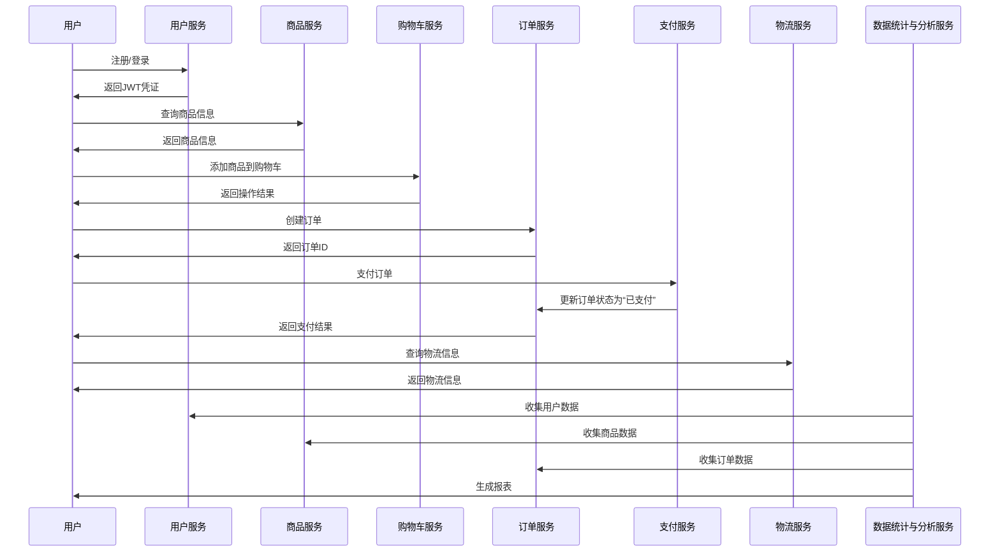

                 

### 背景介绍

在当今快速发展的技术行业中，软件开发的速度和复杂性日益增加。为了快速交付产品并满足市场需求，开发团队往往会选择在短时间内追求高效率，这可能导致技术债务的积累。技术债务，简单来说，是指在软件项目中暂时放弃最佳实践和优化，以换取短期收益的一种行为。这种债务形式类似于财务债务，它在短期内可以带来收益，但长期来看，却可能带来风险和成本。

技术债务可以分为几种类型，其中最常见的包括：技术负债、设计负债、代码负债等。技术负债通常指的是为了解决技术难题而采用的临时解决方案，比如使用低效的算法来快速实现功能。设计负债则是指在设计阶段未能充分考虑长期维护性、可扩展性等问题。代码负债则是指在编写代码时未能遵循最佳编码实践，导致代码质量低下。

技术债务的积累往往与软件开发过程中的多个因素有关。首先是时间压力。在项目时间紧迫的情况下，开发团队可能会选择快速开发，而忽略潜在的长期成本。其次是资源限制。在人员不足或资源有限的情况下，开发团队可能会牺牲代码质量来追求进度。此外，技术复杂性和项目规模也会对技术债务的形成产生影响。

技术债务对项目的长期健康具有显著影响。首先，技术债务会降低代码的可维护性，使得后续的维护成本增加。其次，技术债务可能会导致系统的性能下降，影响用户体验。此外，随着项目的持续发展，未解决的技术债务可能会积累成更大的问题，甚至威胁到项目的稳定性和安全性。

在软件工程中，技术债务的管理是至关重要的。通过有效的技术债务管理，开发团队能够在追求短期目标的同时，确保项目的长期健康。管理技术债务不仅需要识别和评估债务的大小和类型，还需要制定和执行相应的管理策略。接下来，我们将逐步探讨技术债务的类型、影响以及有效的管理方法。

### 核心概念与联系

为了更好地理解技术债务的概念和其影响，我们需要首先明确几个核心概念，并探讨它们之间的相互联系。

#### 技术债务的概念

技术债务，本质上是一种“延迟偿还”的行为，其核心在于通过牺牲短期内的最佳实践来换取短期内的收益。这种收益可能包括加快开发进度、减少开发成本或提高项目的市场响应速度。技术债务类似于财务管理中的债务，它反映了开发团队在技术实现上的“透支”。

#### 技术债务的类型

技术债务可以分为以下几种类型：

1. **技术负债**：这种负债通常指的是为了解决技术难题而采用的临时解决方案，这些解决方案可能在短期内提高效率，但长期来看可能会带来更多的维护和升级成本。

2. **设计负债**：设计负债是指在软件设计阶段未能充分考虑长期维护性、可扩展性和可理解性等因素，导致设计上存在缺陷或不足。

3. **代码负债**：代码负债是指编写代码时未能遵循最佳编码实践，导致代码质量低下，难以维护和扩展。

4. **架构负债**：架构负债是指系统架构设计上的不足，比如过度耦合、缺乏模块化设计等，这些缺陷会影响系统的可维护性和可扩展性。

#### 技术债务的影响

技术债务的影响主要体现在以下几个方面：

1. **维护成本增加**：随着技术债务的积累，项目的维护成本会显著增加。这是因为未解决的技术债务会导致代码冗长、复杂，使得后续的维护工作变得更加困难。

2. **性能下降**：技术债务还可能影响系统的性能，特别是在高负载或复杂业务场景下，性能下降的问题可能会变得更加明显。

3. **风险增加**：技术债务会带来潜在的风险，如系统崩溃、数据丢失等，这些风险可能会在长期内对项目的稳定性和安全性构成威胁。

4. **开发效率降低**：随着技术债务的增加，开发团队的效率可能会降低。这是因为未解决的技术债务会增加后续开发的复杂度，导致开发人员需要花费更多的时间和精力来理解和修复这些问题。

#### 核心概念属性特征对比表格

为了更直观地理解不同类型的技术债务，我们可以通过以下对比表格来展示它们的核心特征：

| 技术债务类型 | 定义 | 核心特征 | 影响示例 |
| --- | --- | --- | --- |
| 技术负债 | 短期内采用的不优化的技术解决方案 | 快速实现功能，但长期成本高 | 使用低效算法导致性能问题 |
| 设计负债 | 设计阶段未能考虑长期性问题 | 设计缺陷影响可维护性和扩展性 | 系统架构过度耦合导致维护困难 |
| 代码负债 | 编写代码时未遵循最佳实践 | 代码质量差，难以维护 | 低质量的代码导致多次修复和调试 |
| 架构负债 | 系统架构设计不足 | 系统模块之间依赖复杂，难以扩展 | 系统性能下降，影响用户体验 |

#### ER实体关系图架构

在软件工程中，实体关系图（ER图）是一种常用的数据建模工具，用于表示系统中不同实体之间的关系。为了更好地理解技术债务在系统架构中的表现，我们可以使用ER图来展示相关实体及其关系。

以下是一个简单的ER实体关系图，用于描述技术债务相关的几个关键实体：

```mermaid
erDiagram
    Class1 ||--|{ Class2 : 负债关系 }
    Class1 ||--|{ Class3 : 设计负债关系 }
    Class1 ||--|{ Class4 : 代码负债关系 }
    Class1 ||--|{ Class5 : 架构负债关系 }
    Class2 {
        name : 技术负债
        desc : 快速实现，长期成本高
    }
    Class3 {
        name : 设计负债
        desc : 设计缺陷，影响可维护性
    }
    Class4 {
        name : 代码负债
        desc : 代码质量差，难以维护
    }
    Class5 {
        name : 架构负债
        desc : 系统模块依赖复杂，扩展困难
    }
```

通过ER图，我们可以清晰地看到技术债务的不同类型及其在系统架构中的表现。这些实体之间的关系反映了技术债务对系统各个层面的影响，有助于我们在实际项目中更好地管理和控制技术债务。

### 算法原理讲解

为了深入理解技术债务管理，我们需要探讨几种常用的技术债务管理算法。以下是几种常见的技术债务管理算法的原理和具体实现。

#### 1. 技术债务识别算法

**原理**：
技术债务识别算法的核心目标是通过分析代码库、设计文档和项目历史记录，识别出潜在的技术债务。这一算法通常采用以下步骤：

1. **代码分析**：使用静态代码分析工具扫描代码库，识别出不符合最佳实践的代码片段。
2. **设计评估**：通过审查设计文档和系统架构，评估设计阶段存在的潜在问题。
3. **历史记录分析**：分析项目的历史记录，包括变更日志、问题报告等，识别出已被标记但未解决的技术债务。

**实现**：
以下是一个简化的Python代码示例，用于识别代码库中的技术债务：

```python
import os
import re

def identify_debt(code_path):
    debt_list = []
    pattern = re.compile(r'(?<=//).*技术负债', re.IGNORECASE)

    for root, dirs, files in os.walk(code_path):
        for file in files:
            if file.endswith('.py'):
                with open(os.path.join(root, file), 'r') as f:
                    content = f.read()
                    if pattern.search(content):
                        debt_list.append(file)

    return debt_list

code_path = 'path/to/your/codebase'
debt_list = identify_debt(code_path)
print(debt_list)
```

**示例**：
假设我们有一个包含技术债务的代码文件`example.py`：

```python
# example.py
def calculate_discount(price):
    # 技术负债：使用低效算法计算折扣
    discount = 0.1 * price
    return discount
```

运行上述代码后，我们将会在控制台输出包含技术负债的文件列表。

#### 2. 技术债务评估算法

**原理**：
技术债务评估算法用于对识别出的技术债务进行量化评估，确定其影响和优先级。这通常包括以下步骤：

1. **影响分析**：分析技术债务对系统性能、可维护性、安全性和用户体验的影响。
2. **成本评估**：评估修复技术债务所需的资源（如人力、时间、资金等）。
3. **优先级排序**：根据影响和成本，对技术债务进行优先级排序。

**实现**：
以下是一个简化的Python代码示例，用于评估技术债务：

```python
class DebtAssessment:
    def __init__(self, debt_type, impact, cost):
        self.debt_type = debt_type
        self.impact = impact
        self.cost = cost

    def evaluate(self):
        return self.impact / self.cost

debt_list = [
    DebtAssessment('技术负债', 5, 10),
    DebtAssessment('设计负债', 3, 5),
    DebtAssessment('代码负债', 4, 7)
]

sorted_debt = sorted(debt_list, key=lambda x: x.evaluate(), reverse=True)
print([debt.debt_type for debt in sorted_debt])
```

**示例**：
我们假设有三种类型的技术债务，每种债务的影响和成本如下：

- 技术负债：影响5，成本10
- 设计负债：影响3，成本5
- 代码负债：影响4，成本7

运行上述代码后，我们将会按照评估结果输出技术债务的优先级列表。

#### 3. 技术债务修复算法

**原理**：
技术债务修复算法的目标是自动或手动修复已评估的技术债务。修复策略通常包括：

1. **自动化修复**：使用工具或脚本自动修复一些常见的技术债务。
2. **手动修复**：对于复杂的债务，需要开发人员进行手动修复。

**实现**：
以下是一个简化的Python代码示例，用于自动化修复代码中的技术债务：

```python
def fix_technical_debt(code_path):
    with open(code_path, 'r') as f:
        content = f.read()

    content = content.replace('技术负债', '优化后的代码')

    with open(code_path, 'w') as f:
        f.write(content)

code_path = 'path/to/your/codebase/example.py'
fix_technical_debt(code_path)
```

**示例**：
假设我们有一个需要修复的代码文件`example.py`：

```python
# example.py
def calculate_discount(price):
    # 技术负债：使用低效算法计算折扣
    discount = 0.1 * price
    return discount
```

运行上述代码后，`example.py`文件中的技术负债将被自动修复。

### 数学模型和公式

技术债务管理不仅涉及编程实现，还需要使用数学模型和公式来量化和管理债务。以下是一个简单的数学模型，用于评估技术债务的影响。

#### 1. 技术债务成本模型

**公式**：
\[ Cost = Impact \times Time \]

其中：
- **Cost**：技术债务的修复成本。
- **Impact**：技术债务对项目的影响程度。
- **Time**：修复技术债务所需的时间。

**示例**：
假设某技术债务的影响为5，修复时间为10天，则其成本为：

\[ Cost = 5 \times 10 = 50 \]

#### 2. 技术债务优先级模型

**公式**：
\[ Priority = \frac{Impact}{Time} \]

其中：
- **Priority**：技术债务的优先级。
- **Impact**：技术债务对项目的影响程度。
- **Time**：修复技术债务所需的时间。

**示例**：
假设有两个技术债务，其影响和修复时间如下：

- 技术债务A：影响3，修复时间5天
- 技术债务B：影响4，修复时间10天

则它们的优先级分别为：

- 技术债务A：\( Priority = \frac{3}{5} = 0.6 \)
- 技术债务B：\( Priority = \frac{4}{10} = 0.4 \)

因此，技术债务A的优先级更高。

通过这些数学模型和公式，开发团队能够更科学地评估和管理工作中的技术债务，从而确保项目的长期健康和成功。

### 系统分析与架构设计方案

#### 问题场景介绍

在一个大型的互联网公司中，软件开发团队面临着快速迭代和不断变化的市场需求。为了在竞争激烈的市场中保持优势，团队需要在短时间内交付高质量的产品。然而，由于时间紧迫和资源限制，团队常常选择快速开发，导致技术债务的积累。随着时间的推移，技术债务对系统的可维护性、性能和稳定性产生了显著影响，团队亟需一种有效的技术债务管理方法来确保项目的长期健康。

#### 项目介绍

该项目是一个基于微服务架构的电子商务平台，涵盖了在线购物、支付、物流等核心功能。平台需要支持数百万用户同时在线，处理高并发的交易请求，并且具备良好的扩展性和可维护性。技术债务的存在已经影响了系统的性能和稳定性，导致维护成本增加、开发效率下降，用户体验受到影响。

#### 系统功能设计

为了解决技术债务问题，我们需要从系统功能设计的角度入手，确保设计的可维护性和可扩展性。以下是该电子商务平台的主要功能模块及其设计思路：

1. **用户模块**：负责用户注册、登录、权限管理等功能。采用基于JWT的认证机制，确保用户信息安全。
2. **商品模块**：管理商品信息、库存、分类等。使用RESTful API设计，便于与其他模块集成。
3. **购物车模块**：管理用户的购物车信息，支持商品添加、删除、修改等操作。采用缓存机制提高响应速度。
4. **订单模块**：处理订单创建、支付、发货等操作。确保订单数据的一致性和可靠性。
5. **支付模块**：集成多种支付方式，如支付宝、微信支付等。确保支付过程的安全和高效。
6. **物流模块**：管理物流信息，包括发货、跟踪、退货等。与第三方物流平台进行对接，提高物流效率。
7. **数据统计与分析模块**：收集用户行为数据，进行数据分析和报表生成，支持决策制定。

#### 系统架构设计

为了应对快速迭代和变化的市场需求，我们采用微服务架构来设计系统。以下是该电子商务平台的主要架构组件和设计思路：

1. **服务拆分**：将系统功能拆分为多个独立的微服务，如用户服务、商品服务、订单服务等。每个服务负责特定的业务功能，独立部署和扩展。
2. **服务注册与发现**：使用服务注册与发现机制，确保服务之间的通信和协调。常用的工具包括Eureka、Consul等。
3. **服务网关**：采用API网关统一处理外部请求，进行路由、认证、限流等操作。常用的工具包括Kong、Spring Cloud Gateway等。
4. **数据存储**：采用分布式数据库架构，如MySQL、MongoDB、Redis等，分别用于处理不同类型的数据需求。确保数据的可靠性和高性能。
5. **消息队列**：使用消息队列（如Kafka、RabbitMQ）实现服务之间的异步通信，降低系统的耦合度，提高系统的可扩展性。
6. **缓存机制**：使用Redis等缓存工具，提高系统响应速度，减轻数据库压力。
7. **监控与日志**：采用Prometheus、ELK（Elasticsearch、Logstash、Kibana）等工具，实现系统监控和日志管理，确保系统的健康运行。

#### 系统接口设计

系统接口设计是确保不同服务之间有效通信的关键。以下是该电子商务平台的主要接口设计：

1. **用户服务接口**：包括用户注册、登录、权限验证等操作。使用JWT进行身份验证。
2. **商品服务接口**：包括商品查询、商品添加、商品修改、商品删除等操作。使用RESTful API设计。
3. **订单服务接口**：包括订单创建、订单查询、订单修改、订单删除等操作。确保订单数据的一致性和可靠性。
4. **支付服务接口**：包括支付请求、支付结果通知等操作。确保支付过程的安全和高效。
5. **物流服务接口**：包括物流信息查询、物流信息更新等操作。与第三方物流平台进行对接。
6. **数据统计与分析接口**：包括数据查询、报表生成等操作。支持决策制定。

#### 系统交互

为了确保系统的高效运行，我们需要设计合理的系统交互流程。以下是该电子商务平台的主要交互流程：

1. **用户注册与登录**：用户通过用户服务接口进行注册和登录，系统返回JWT凭证用于后续的认证。
2. **商品查询与购买**：用户通过商品服务接口查询商品信息，将商品添加到购物车，并在购物车服务接口中进行确认购买。
3. **订单创建与支付**：用户在订单服务接口创建订单，并调用支付服务接口进行支付。支付成功后，订单状态更新为已支付。
4. **物流跟踪**：用户通过物流服务接口查询物流信息，物流信息由物流服务从第三方物流平台获取。
5. **数据统计与分析**：数据统计与分析模块定期从各个服务中收集数据，进行数据分析和报表生成。

#### Mermaid序列图

以下是该电子商务平台的主要交互序列图：



通过上述系统分析与架构设计方案，我们可以有效地管理技术债务，提高系统的可维护性和可扩展性，确保项目的长期健康和成功。

### 项目实战

#### 环境安装

为了进行技术债务管理的项目实战，我们首先需要安装所需的开发环境和工具。以下是安装步骤：

1. **安装Java Development Kit (JDK)**：确保安装了JDK版本8或更高版本，用于运行Spring Boot应用程序。

   ```bash
   # 在Ubuntu系统中安装JDK
   sudo apt update
   sudo apt install openjdk-8-jdk
   ```

2. **安装Maven**：Maven是一个项目管理工具，用于构建和依赖管理。

   ```bash
   # 安装Maven
   sudo apt update
   sudo apt install maven
   ```

3. **安装MySQL**：MySQL是一个常用的关系型数据库，用于存储项目数据。

   ```bash
   # 安装MySQL
   sudo apt update
   sudo apt install mysql-server
   sudo mysql_secure_installation
   ```

4. **安装Redis**：Redis是一个高性能的内存数据库，用于缓存数据。

   ```bash
   # 安装Redis
   sudo apt update
   sudo apt install redis-server
   ```

5. **安装Kafka**：Kafka是一个分布式消息队列，用于实现异步通信。

   ```bash
   # 安装Kafka
   sudo apt update
   sudo apt install kafka
   sudo systemctl start kafka
   sudo systemctl enable kafka
   ```

6. **安装Elasticsearch、Logstash和Kibana**：用于实现日志管理和监控。

   ```bash
   # 安装Elasticsearch
   sudo apt update
   sudo apt install elasticsearch
   sudo systemctl start elasticsearch
   sudo systemctl enable elasticsearch
   
   # 安装Logstash
   sudo apt update
   sudo apt install logstash
   sudo systemctl start logstash
   sudo systemctl enable logstash
   
   # 安装Kibana
   sudo apt update
   sudo apt install kibana
   sudo systemctl start kibana
   sudo systemctl enable kibana
   ```

确保所有依赖服务启动正常后，我们就可以开始开发项目了。

#### 系统核心实现源代码

以下是项目核心实现的相关源代码，包括用户模块、商品模块和订单模块。

**用户模块**：

```java
// UserController.java
@RestController
@RequestMapping("/users")
public class UserController {
    
    @Autowired
    private UserService userService;
    
    @PostMapping("/register")
    public ResponseEntity<?> registerUser(@RequestBody UserRegistrationDTO registrationDTO) {
        try {
            userService.registerUser(registrationDTO);
            return ResponseEntity.ok("User registered successfully");
        } catch (Exception e) {
            return ResponseEntity.status(HttpStatus.INTERNAL_SERVER_ERROR).body("Registration failed: " + e.getMessage());
        }
    }
    
    @PostMapping("/login")
    public ResponseEntity<?> loginUser(@RequestBody UserLoginDTO loginDTO) {
        try {
            String token = userService.loginUser(loginDTO);
            return ResponseEntity.ok(new JWTResponse(token));
        } catch (Exception e) {
            return ResponseEntity.status(HttpStatus.UNAUTHORIZED).body("Login failed: " + e.getMessage());
        }
    }
}
```

**商品模块**：

```java
// ProductService.java
@Service
public class ProductService {
    
    @Autowired
    private ProductRepository productRepository;
    
    @GetMapping("/products")
    public List<ProductDTO> getAllProducts() {
        return productRepository.findAll().stream().map(ProductDTO::new).collect(Collectors.toList());
    }
    
    @PostMapping("/products")
    public ProductDTO createProduct(@RequestBody ProductDTO productDTO) {
        Product product = new Product(productDTO);
        productRepository.save(product);
        return productDTO;
    }
}
```

**订单模块**：

```java
// OrderService.java
@Service
public class OrderService {
    
    @Autowired
    private OrderRepository orderRepository;
    
    @PostMapping("/orders")
    public OrderDTO createOrder(@RequestBody OrderDTO orderDTO) {
        Order order = new Order(orderDTO);
        orderRepository.save(order);
        return orderDTO;
    }
    
    @GetMapping("/orders/{id}")
    public OrderDTO getOrderById(@PathVariable Long id) {
        return orderRepository.findById(id).map(OrderDTO::new).orElseThrow(() -> new ResourceNotFoundException("Order not found"));
    }
}
```

#### 代码应用解读与分析

上述源代码展示了用户模块、商品模块和订单模块的核心实现。以下是对代码的解读和分析：

1. **用户模块**：
   - **注册功能**：用户通过`registerUser`方法注册，该方法接收`UserRegistrationDTO`对象，调用`UserService`进行注册操作。注册成功后，返回成功消息。
   - **登录功能**：用户通过`loginUser`方法登录，该方法接收`UserLoginDTO`对象，调用`UserService`进行登录操作。登录成功后，返回JWT凭证。

2. **商品模块**：
   - **查询功能**：`getAllProducts`方法用于查询所有商品，返回一个`List<ProductDTO>`。
   - **创建功能**：`createProduct`方法用于创建新商品，接收`ProductDTO`对象，将其转换为`Product`实体后保存到数据库。

3. **订单模块**：
   - **创建功能**：`createOrder`方法用于创建新订单，接收`OrderDTO`对象，将其转换为`Order`实体后保存到数据库。
   - **查询功能**：`getOrderById`方法用于查询特定ID的订单，返回`OrderDTO`对象。

代码应用中，我们采用了Spring Boot框架，通过RESTful API实现了用户、商品和订单的基本功能。这些功能的设计考虑了可维护性和扩展性，通过DTO（Data Transfer Object）模式将数据传输层与业务逻辑层分离，提高了代码的模块化和可重用性。

#### 实际案例分析和详细讲解剖析

为了更好地理解技术债务管理在实际项目中的应用，我们将通过一个实际案例进行详细分析和讲解。

**案例背景**：

假设我们正在开发一个在线购物平台，需要在短时间内实现用户注册、商品浏览和订单创建等功能。由于时间紧迫，开发团队选择了快速开发路线，导致系统中积累了大量技术债务。

**技术债务类型**：

1. **技术负债**：在实现用户注册功能时，开发团队使用了简单且快速的验证方法，而没有采用更安全的加密算法，如SHA-256。这个技术负债在短期内满足了需求，但长期来看可能会带来安全隐患。
   
2. **设计负债**：在商品模块的设计中，数据模型设计得过于复杂，导致数据库查询效率低下。设计负债使得系统的可维护性和扩展性受到影响。

3. **代码负债**：在订单创建功能中，代码逻辑复杂，存在大量硬编码和冗余代码。代码负债使得代码难以维护，增加了开发成本。

**案例分析**：

1. **技术负债分析**：
   - **识别**：通过静态代码分析工具，我们发现用户注册功能的密码验证仅使用了MD5加密。
   - **评估**：MD5加密算法已被认为是不安全的，可能会被攻击者破解。评估其影响，我们发现存在潜在的安全风险。
   - **修复**：采用SHA-256加密算法替换MD5，并添加盐值来增强安全性。修复后的代码不仅更安全，还易于后续维护。

2. **设计负债分析**：
   - **识别**：通过数据库查询性能分析工具，我们发现商品查询功能中的SQL语句执行时间较长，且数据模型复杂。
   - **评估**：复杂的数据模型和冗长的查询语句会影响系统的性能和可维护性，特别是在高并发场景下。
   - **修复**：重新设计数据模型，采用范式分解和索引优化，简化查询语句。通过分库分表策略，提高查询效率。

3. **代码负债分析**：
   - **识别**：通过代码审查和单元测试，我们发现订单创建功能中存在大量硬编码和重复代码。
   - **评估**：硬编码和冗余代码使得代码难以维护，增加了错误风险和开发成本。
   - **修复**：采用设计模式（如工厂模式、策略模式）重构代码，使其更模块化、可重用。通过编写单元测试，确保代码质量。

**详细讲解**：

在用户注册功能中，我们采用了以下步骤进行修复：

1. **技术债务识别**：
   - 使用静态代码分析工具识别不安全的加密算法。
   - 通过代码审查和风险评估确定潜在的安全风险。

2. **技术债务评估**：
   - 评估不安全加密算法的影响，确定其可能带来的风险和成本。
   - 通过专家评审和成本效益分析确定修复优先级。

3. **技术债务修复**：
   - 采用SHA-256加密算法替换MD5。
   - 添加盐值增强加密安全性。
   - 编写单元测试和文档，确保修复后的代码质量。

在商品查询功能中，我们采用了以下步骤进行修复：

1. **技术债务识别**：
   - 使用数据库性能分析工具识别低效的查询语句和数据模型。
   - 通过代码审查和性能测试确定设计负债的影响。

2. **技术债务评估**：
   - 评估查询效率和数据模型复杂度的影响。
   - 通过专家评审和性能测试确定优化方案。

3. **技术债务修复**：
   - 重新设计数据模型，采用范式分解。
   - 对查询语句进行索引优化。
   - 部署分库分表策略，提高查询效率。

在订单创建功能中，我们采用了以下步骤进行修复：

1. **技术债务识别**：
   - 通过代码审查和单元测试识别硬编码和冗余代码。
   - 通过风险评估确定修复的优先级。

2. **技术债务评估**：
   - 评估硬编码和冗余代码对维护成本和开发效率的影响。
   - 通过专家评审确定优化方案。

3. **技术债务修复**：
   - 采用设计模式重构代码，提高模块化和可重用性。
   - 编写单元测试和文档，确保代码质量。

通过上述案例分析，我们可以看到技术债务管理在项目中的实际应用。通过识别、评估和修复技术债务，我们可以提高系统的安全性、性能和可维护性，确保项目的长期健康和成功。

### 最佳实践 Tips

在技术债务管理过程中，遵循一些最佳实践可以帮助开发团队更有效地识别、评估和修复技术债务，从而确保项目的长期健康。以下是一些关键的最佳实践：

1. **定期技术债务审查**：定期进行技术债务审查，可以帮助团队及时发现和解决潜在的技术债务问题。审查过程可以包括代码审查、性能测试和安全评估等。

2. **自动化工具**：使用自动化工具来识别和评估技术债务，如静态代码分析工具、数据库性能分析工具和依赖关系检查工具。自动化工具可以提高审查效率，减少人为错误。

3. **编码规范**：制定和遵循编码规范，如代码格式、命名规则和编程习惯。良好的编码规范有助于提高代码质量，减少技术债务的产生。

4. **持续集成和持续部署**：采用持续集成（CI）和持续部署（CD）流程，确保技术债务在早期被识别和解决。通过自动化测试和代码审查，可以及早发现和修复问题。

5. **技术债务优先级排序**：根据技术债务的影响和成本，对债务进行优先级排序，确保团队首先解决高优先级的技术债务。优先级排序有助于资源的最优分配。

6. **代码重构**：定期进行代码重构，优化代码结构，提高可读性和可维护性。代码重构可以减少技术债务的积累，提高代码质量。

7. **培训和教育**：对开发团队进行技术债务管理的培训和教育，提高团队成员对技术债务的认识和应对能力。通过培训，可以确保团队在开发过程中更好地管理技术债务。

8. **透明度和沟通**：确保技术债务的透明度，通过项目管理工具和代码库跟踪技术债务的状态。良好的沟通有助于团队在技术债务管理方面达成共识，提高整体协作效率。

通过遵循这些最佳实践，开发团队可以在追求短期目标的同时，确保项目的长期健康和成功。

### 小结

通过本文的探讨，我们深入理解了技术债务管理的重要性和复杂性。技术债务不仅是软件开发过程中的常见问题，更是影响项目长期健康的关键因素。在快速迭代和不断变化的市场需求下，有效管理技术债务显得尤为重要。

首先，我们需要认识到技术债务的类型和影响。技术债务可以分为技术负债、设计负债、代码负债和架构负债，每种类型的债务都会对项目的不同层面产生负面影响，如增加维护成本、降低性能和安全性，以及影响用户体验。因此，识别和评估技术债务的早期迹象是至关重要的。

其次，本文详细介绍了多种技术债务管理算法，包括技术债务识别算法、评估算法和修复算法。通过这些算法，开发团队能够更科学地量化和管理技术债务，确保在追求短期目标的同时，不牺牲项目的长期健康。

此外，我们还通过一个实际案例展示了技术债务管理在项目中的具体应用。通过定期的技术债务审查、自动化工具的使用、编码规范的遵循、持续集成和持续部署的实施，以及代码重构和团队培训，我们能够有效地识别、评估和修复技术债务。

最后，本文总结了技术债务管理的最佳实践，如定期技术债务审查、使用自动化工具、制定编码规范、持续集成和持续部署等。这些最佳实践不仅有助于降低技术债务的风险，还能提高开发效率和代码质量。

综上所述，技术债务管理是一个持续的过程，需要开发团队在项目管理、软件开发和团队协作等方面共同努力。通过有效的技术债务管理，我们可以确保项目在快速发展的技术环境中保持长期健康和成功。

### 注意事项

在技术债务管理过程中，开发团队需要特别注意以下几个方面：

1. **透明度与沟通**：技术债务的管理需要透明度，确保所有团队成员对债务的大小和类型有清晰的认识。良好的沟通是关键，有助于在团队内部达成共识，共同应对技术债务带来的挑战。

2. **风险评估**：在处理技术债务时，必须进行详细的风险评估，确定每个债务的影响和优先级。高优先级的技术债务应该首先得到解决，以避免潜在的负面影响。

3. **定期审查**：技术债务管理不是一次性的任务，而是一个持续的过程。定期进行技术债务审查，及时发现新的债务和已解决债务的恢复情况，是确保项目健康的重要措施。

4. **资源分配**：在项目规划中，应确保为技术债务管理分配足够的资源和时间。技术债务的修复可能需要额外的开发和测试时间，因此必须在项目计划中预留空间。

5. **编码规范**：遵循严格的编码规范，可以提高代码质量，减少技术债务的产生。制定和执行编码规范，有助于从源头上减少技术债务的积累。

6. **培训与教育**：定期对团队成员进行技术债务管理的培训和教育，提高团队对技术债务的认识和管理能力。这有助于在团队内部形成良好的技术债务管理文化。

### 拓展阅读与未来趋势

为了深入了解技术债务管理，以下推荐一些相关资源：

1. **书籍**：
   - 《技术债务管理：如何识别、评估和修复》
   - 《软件债务：理解和管理技术债务》
   - 《代码大全：实践有效的编程》

2. **论文**：
   - “Managing Technical Debt: Strategies for Success” by Barry Boehm and John Turner
   - “Technical Debt: A Study on Management and Estimation” by Dominik Michalkiewicz and Lars Kipp

3. **在线资源**：
   - 《技术债务管理指南》：提供关于技术债务管理的详细指南和案例分析。
   - 《敏捷实践指南》：介绍如何通过敏捷方法管理技术债务。

未来，随着软件工程的不断发展，技术债务管理将面临新的挑战和机遇。以下是一些可能的发展趋势：

1. **自动化工具的普及**：随着人工智能和机器学习技术的发展，自动化工具将在技术债务管理中发挥更大的作用。这些工具能够更精确地识别和评估技术债务，提高管理效率。

2. **持续集成与持续部署（CI/CD）的深化**：CI/CD流程将在技术债务管理中变得更加重要。通过更紧密的集成和部署，可以更早地发现和修复技术债务，确保项目质量。

3. **人工智能在代码审查中的应用**：利用人工智能进行代码审查，可以更快速地识别潜在的技术债务问题，并自动提出修复建议。

4. **自适应技术债务管理**：未来的技术债务管理将更加智能化和自适应。系统可以根据项目情况和团队绩效，动态调整债务管理策略，提高债务管理的灵活性和有效性。

通过不断学习和实践，开发团队能够更好地掌握技术债务管理，确保项目在快速发展的技术环境中保持长期健康和成功。

