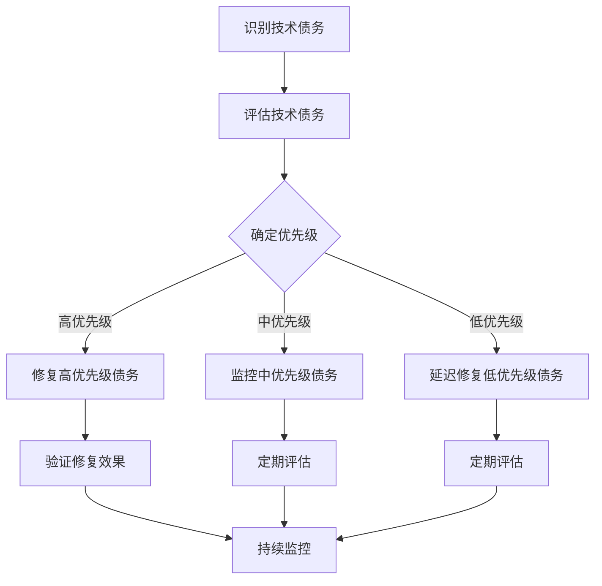

                 


### 技术债务管理：P9工程师的系统健康之道

关键词：技术债务、系统健康、P9工程师、管理策略、最佳实践

摘要：本文旨在深入探讨技术债务管理的核心概念、评估方法、管理策略和实践，为P9工程师提供系统健康管理的路径。我们将从问题背景入手，逐步展开对技术债务的深入分析，最终提供最佳实践指导。

----------------------------------------------------------------

## 第一部分：引言

### 第1章 问题背景

#### 1.1 技术债务的概念与来源

技术债务（Technical Debt）源于软件工程领域，最初用来描述为了短期利益而牺牲长期健康和可持续性的软件开发决策。随着信息技术的发展，技术债务的概念也被广泛应用到系统架构和项目管理中。它类似于金融债务，代表了因选择了一种短期的解决方案而导致的未来修复成本。

#### 1.2 技术债务的危害

技术债务积累会导致系统复杂度增加，代码质量下降，维护成本上升，甚至可能影响系统的稳定性。长期累积的技术债务会阻碍团队的技术进步和创新，降低开发效率，最终影响企业的竞争力。

#### 1.3 技术债务管理的必要性

技术债务管理是确保系统长期健康的关键。通过有效的技术债务管理，团队能够在追求短期开发进度的同时，保持系统的可持续性和可维护性。这对于P9工程师，即在技术和管理层面都有深厚积累的高级工程师来说，尤为重要。

#### 1.4 背景与目标

本文以P9工程师为视角，结合实际项目经验，详细探讨技术债务管理的各个方面。我们的目标是帮助P9工程师理解技术债务的本质，掌握评估和管理技术债务的方法，从而提升系统的整体健康水平。

----------------------------------------------------------------

## 第二部分：技术债务管理基础

### 第2章 技术债务管理核心概念

#### 2.1 技术债务的定义

技术债务是指为了快速开发或解决问题而采取的临时解决方案所带来的潜在成本。这些解决方案可能在短期内提高了开发速度，但从长远来看，可能会导致系统性能下降，维护难度增加。

#### 2.2 技术债务的类型

技术债务可以分为以下几种类型：

1. **技术债务A**: 因时间压力而采取的快速开发方法。
2. **技术债务B**: 因技术限制而未能采用最佳解决方案。
3. **技术债务C**: 因市场需求变化而进行的频繁调整。

#### 2.3 技术债务的特征

技术债务具有以下特征：

- **隐性成本**: 技术债务往往在项目后期才会显现，因此容易被忽视。
- **累积性**: 技术债务会随着时间的推移而不断增加。
- **不可逆性**: 一旦技术债务形成，通常需要付出更大的代价来修复。

#### 2.4 技术债务的管理流程

技术债务管理包括以下几个关键步骤：

1. **识别与评估**: 定期对代码库和系统进行审查，识别潜在的技术债务。
2. **优先级排序**: 根据债务的严重性和影响，确定修复的优先级。
3. **修复与优化**: 制定并执行修复计划，优化系统架构。
4. **监控与跟踪**: 建立持续监控机制，确保技术债务不再积累。

----------------------------------------------------------------

### 第3章 技术债务评估方法

#### 3.1 技术债务评估的重要性

技术债务评估是确保系统健康的关键步骤。通过评估，团队能够了解技术债务的现状，制定针对性的管理策略。

#### 3.2 技术债务评估的标准

评估技术债务可以基于以下标准：

- **技术复杂性**: 复杂的技术方案通常具有较高的债务水平。
- **代码质量**: 质量低下的代码更容易积累技术债务。
- **维护成本**: 维护成本高的代码往往存在较多技术债务。

#### 3.3 技术债务评估的工具

常用的技术债务评估工具包括：

- **代码质量分析工具**: 检查代码质量，识别潜在的技术债务。
- **静态代码分析工具**: 分析代码结构，评估技术债务水平。
- **持续集成工具**: 监控代码库的变化，及时识别技术债务。

#### 3.4 技术债务评估的案例

以下是一个简单的技术债务评估案例：

- **项目A**: 采用快速开发方法，代码质量较低。
- **项目B**: 采用成熟的技术框架，代码质量高。
- **评估结果**: 项目A存在较高的技术债务，需要优先修复。

----------------------------------------------------------------

### 第4章 技术债务管理策略

#### 4.1 技术债务管理的原则

技术债务管理应遵循以下原则：

- **预防为主**: 避免不必要的债务积累。
- **持续管理**: 定期评估和修复技术债务。
- **优先级管理**: 根据债务的严重性和影响，制定修复计划。

#### 4.2 技术债务管理的手段

技术债务管理的手段包括：

- **重构**: 优化代码结构，降低技术债务。
- **迭代修复**: 逐步修复技术债务，避免集中爆发的风险。
- **代码审查**: 通过审查，及时发现和修复潜在的技术债务。

#### 4.3 技术债务管理的方法

技术债务管理的方法包括：

- **文档化**: 记录技术债务的情况，方便后续管理和追踪。
- **培训**: 提高团队成员对技术债务的认识和意识。
- **自动化**: 使用工具自动化识别和修复技术债务。

#### 4.4 技术债务管理的实践案例

以下是一个技术债务管理的实践案例：

- **项目C**: 团队定期进行技术债务评估，发现代码质量低下。
- **解决方案**: 实施代码重构，提高代码质量，减少技术债务。

----------------------------------------------------------------

## 第三部分：技术债务管理实践

### 第5章 技术债务管理的实施过程

#### 5.1 技术债务识别与分类

技术债务的识别和分类是管理过程的第一步。团队应定期对代码库和系统进行审查，识别出潜在的技术债务，并根据其严重性和影响进行分类。

#### 5.2 技术债务评估与优先级确定

对识别出的技术债务进行评估，确定其优先级。高优先级的技术债务应首先修复，以降低其对系统的影响。

#### 5.3 技术债务修复与优化

制定并执行修复计划，对技术债务进行修复。同时，优化系统架构，降低未来的债务水平。

#### 5.4 技术债务监控与跟踪

建立持续监控机制，对技术债务进行跟踪。确保技术债务不再积累，并随时准备修复新的债务。

----------------------------------------------------------------

### 第6章 技echapter.6 技术债务管理的工具与技术

技术债务管理需要借助各种工具和技术，以提高效率和效果。以下是一些常用的工具：

#### 6.1 自动化工具

自动化工具可以自动化识别和修复技术债务。例如，静态代码分析工具可以检测代码质量，持续集成工具可以监控代码库的变化。

#### 6.2 版本控制工具

版本控制工具可以帮助团队跟踪代码的变化，及时发现潜在的技术债务。常用的版本控制工具包括Git等。

#### 6.3 静态代码分析工具

静态代码分析工具可以分析代码的结构和质量，识别潜在的技术债务。例如，SonarQube等工具可以提供详细的代码质量报告。

#### 6.4 持续集成与持续部署工具

持续集成与持续部署工具可以帮助团队实现自动化测试和部署，降低技术债务的积累。例如，Jenkins等工具可以自动化构建、测试和部署。

----------------------------------------------------------------

### 第7章 技术债务管理的最佳实践

#### 7.1 成功案例分析

以下是一个成功的技术债务管理案例：

- **项目D**: 团队通过定期评估和修复技术债务，成功降低了系统的技术债务水平，提高了开发效率和系统稳定性。

#### 7.2 最佳实践总结

技术债务管理的最佳实践包括：

- **定期评估**: 定期对系统进行技术债务评估，及时发现和修复问题。
- **预防为主**: 在开发过程中，尽量避免积累技术债务。
- **团队协作**: 加强团队内部沟通，共同面对技术债务管理。

#### 7.3 注意事项

在技术债务管理过程中，需要注意以下事项：

- **避免过度重构**: 过度的重构可能导致开发效率下降，应权衡利弊。
- **持续关注**: 技术债务管理是一个持续的过程，需要持续关注和优化。

#### 7.4 拓展阅读

对于希望深入了解技术债务管理的读者，以下书籍和文章是很好的资源：

- 《软件工艺：技术债务管理实践》
- 《软件债务：解释、识别、管理策略》
- 《技术债务：软件开发的可持续实践》

----------------------------------------------------------------

## 总结

技术债务管理是确保系统长期健康的关键。通过本文的探讨，我们了解了技术债务的核心概念、评估方法、管理策略和实践。作为P9工程师，掌握技术债务管理的知识和技能，将有助于提升系统的整体健康水平，为企业和团队带来长远利益。

作者：AI天才研究院/AI Genius Institute & 禅与计算机程序设计艺术 /Zen And The Art of Computer Programming

----------------------------------------------------------------

### 技术债务管理：P9工程师的系统健康之道

**摘要：**

技术债务管理是确保软件系统长期健康发展的关键。本文首先介绍了技术债务的概念与来源，以及其在系统开发中的危害和管理的必要性。接着，我们深入探讨了技术债务管理的核心概念，包括定义、类型、特征和管理流程。随后，详细介绍了技术债务评估的方法、策略和实践。最后，通过具体案例和最佳实践，提供了技术债务管理的实施过程和工具技术。

**关键词：** 技术债务、系统健康、P9工程师、管理策略、最佳实践

**目录：**

**第一部分：引言**

1. 问题背景
   1.1 技术债务的概念与来源
   1.2 技术债务的危害
   1.3 技术债务管理的必要性
   1.4 背景与目标

**第二部分：技术债务管理基础**

2. 技术债务管理核心概念
   2.1 技术债务的定义
   2.2 技术债务的类型
   2.3 技术债务的特征
   2.4 技术债务的管理流程

3. 技术债务评估方法
   3.1 技术债务评估的重要性
   3.2 技术债务评估的标准
   3.3 技术债务评估的工具
   3.4 技术债务评估的案例

4. 技术债务管理策略
   4.1 技术债务管理的原则
   4.2 技术债务管理的手段
   4.3 技术债务管理的方法
   4.4 技术债务管理的实践案例

**第三部分：技术债务管理实践**

5. 技术债务管理的实施过程
   5.1 技术债务识别与分类
   5.2 技术债务评估与优先级确定
   5.3 技术债务修复与优化
   5.4 技术债务监控与跟踪

6. 技术债务管理的工具与技术
   6.1 自动化工具
   6.2 版本控制工具
   6.3 静态代码分析工具
   6.4 持续集成与持续部署工具

7. 技术债务管理的最佳实践
   7.1 成功案例分析
   7.2 最佳实践总结
   7.3 注意事项
   7.4 拓展阅读

**附录：**

**作者：** AI天才研究院/AI Genius Institute & 禅与计算机程序设计艺术 /Zen And The Art of Computer Programming

**注：** 本文内容仅供参考，实际操作时请结合具体项目情况。

----------------------------------------------------------------

### 技术债务管理：P9工程师的系统健康之道

**摘要：**

本文深入探讨了技术债务管理的核心概念、评估方法、管理策略和实践，旨在为P9工程师提供系统健康管理的路径。通过剖析技术债务的来源、危害和必要性，我们了解了技术债务管理的全貌。随后，我们详细介绍了技术债务的类型、特征和管理流程，为后续的评估和管理奠定了基础。在评估方法部分，我们探讨了技术债务评估的重要性、标准和工具，并通过案例展示了评估的实际应用。在管理策略和实践部分，我们提出了预防为主、持续管理和优先级管理的原则，介绍了重构、迭代修复、代码审查等手段，并通过案例展示了技术债务管理的实践效果。最后，通过成功案例分析和最佳实践总结，我们为P9工程师提供了切实可行的技术债务管理策略。

**关键词：** 技术债务、系统健康、P9工程师、管理策略、最佳实践

----------------------------------------------------------------

## 第一部分：引言

### 第1章 问题背景

技术债务（Technical Debt）是一个在软件工程领域广泛使用，但在实际操作中往往被忽视的概念。它描述了为了满足短期内交付软件的需求而采取的快速但不完美的解决方案所带来的潜在风险。这些风险在短期内可能不会显现，但随着时间的推移，它们可能会对系统的稳定性和可维护性造成严重的影响。

#### 1.1 技术债务的概念与来源

技术债务最早由 Ward Cunningham 在1992年提出，他将技术债务比作金融债务，认为软件项目中的技术选择也有类似的经济成本和财务后果。技术债务的来源多种多样，常见的有：

- **时间压力**：在紧迫的项目期限内，开发团队可能会牺牲代码质量以换取更快的时间交付。
- **技术限制**：由于资源的限制，开发团队可能无法使用最优的技术方案，从而选择了一种较为简陋的替代方案。
- **市场需求变化**：随着市场需求的快速变化，开发团队可能会不断调整技术方案，导致技术债务的积累。

#### 1.2 技术债务的危害

技术债务的危害主要体现在以下几个方面：

- **系统复杂度增加**：为了修复早期的问题，开发团队可能会引入更多的临时解决方案，导致系统的复杂度不断上升。
- **代码质量下降**：快速开发过程中可能忽视代码质量，导致代码冗长、难以维护。
- **维护成本上升**：随着技术债务的增加，系统的维护成本也会相应上升，因为修复早期问题的代价往往更高。
- **团队效率降低**：复杂和低质量的代码会降低开发团队的效率，影响项目的进度和质量。

#### 1.3 技术债务管理的必要性

技术债务管理是确保系统长期健康发展的关键。有效的技术债务管理能够：

- **提高代码质量**：通过持续重构和优化，提高代码的可读性和可维护性。
- **降低维护成本**：及时发现和修复技术债务，避免问题积累，降低长期维护成本。
- **提高开发效率**：通过规范的开发流程和工具，提高团队的协作效率。

#### 1.4 背景与目标

本文旨在为P9工程师提供技术债务管理的全面指南。作为高级工程师和技术管理者，P9工程师不仅需要在技术上有所建树，还需要具备管理大型项目的能力。本文将通过深入分析技术债务的核心概念、评估方法和管理策略，帮助P9工程师掌握系统健康管理的核心要领，从而提升项目的成功率和团队的效率。

----------------------------------------------------------------

## 第二部分：技术债务管理基础

### 第2章 技术债务管理核心概念

在理解技术债务管理的具体实践之前，我们需要明确技术债务的核心概念，包括其定义、类型、特征以及管理流程。

#### 2.1 技术债务的定义

技术债务可以理解为在软件开发过程中，因追求短期交付而引入的，可能在未来增加成本、降低效率的问题或缺陷。这些问题的引入可能是由于时间压力、资源限制或技术选择不当等原因。技术债务不同于金融债务，它并不涉及实际的金钱交易，而是指软件开发过程中的一种潜在风险。

#### 2.2 技术债务的类型

技术债务可以分为以下几种类型：

- **设计债务**：由于系统设计不当或缺乏灵活性，导致系统在未来的扩展和维护中遇到困难。
- **代码债务**：代码质量低下，包括冗余代码、难以维护的代码结构等。
- **技术债务**：由于技术选择不当或未能采用最佳实践，导致系统在长期运行中面临性能、稳定性和安全性的问题。

#### 2.3 技术债务的特征

技术债务具有以下特征：

- **隐性成本**：技术债务在早期可能不会显现，但随着时间的推移，其成本会逐渐增加。
- **累积性**：技术债务会随着时间的推移而不断累积，如果不进行有效的管理，可能导致系统崩溃。
- **不可逆性**：一旦技术债务形成，即使后来采取了修复措施，也可能无法完全逆转其影响。

#### 2.4 技术债务的管理流程

技术债务管理是一个持续的过程，包括以下几个关键步骤：

1. **识别与分类**：定期对代码库和系统进行审查，识别潜在的技术债务，并根据其严重性和影响进行分类。
2. **评估与优先级排序**：对识别出的技术债务进行评估，确定其优先级，以便团队可以集中精力解决最重要的问题。
3. **修复与优化**：制定并执行修复计划，对技术债务进行修复和优化，提高系统的整体质量。
4. **监控与跟踪**：建立持续监控机制，跟踪技术债务的变化，确保其不会再次积累。

#### 2.5 技术债务管理的工具与技术

为了有效地管理技术债务，开发团队可以借助多种工具和技术：

- **代码质量分析工具**：如SonarQube、Checkstyle等，用于评估代码质量和识别潜在的技术债务。
- **静态代码分析工具**：如FindBugs、PMD等，通过分析源代码来识别可能存在的错误和缺陷。
- **动态分析工具**：如AppDynamics、NewRelic等，用于监控系统的运行状态，及时发现性能瓶颈和安全风险。
- **持续集成工具**：如Jenkins、Travis CI等，用于自动化测试和部署，确保技术债务不会在集成过程中引入。

#### 2.6 技术债务管理案例

以下是一个简单的技术债务管理案例：

- **项目背景**：一个初创公司开发了一个电商平台，由于时间紧迫，开发团队在初期选择了简单易行的技术方案，导致代码质量较低，系统结构复杂。
- **技术债务识别**：通过代码质量分析工具，团队识别出多个代码债务，包括冗余代码、难以维护的类和复杂的业务逻辑。
- **评估与优先级排序**：团队根据技术债务的影响和修复难度，确定了优先级，并制定了一个逐步修复的计划。
- **修复与优化**：团队开始逐步重构代码，优化系统结构，提高代码质量。
- **监控与跟踪**：团队通过持续集成和监控工具，确保修复措施的有效性，并跟踪新的技术债务。

通过这个案例，我们可以看到技术债务管理的重要性以及其实施的关键步骤。

----------------------------------------------------------------

### 第3章 技术债务评估方法

技术债务评估是技术债务管理过程中的关键环节，它有助于团队了解技术债务的现状，制定针对性的管理策略。有效的技术债务评估方法能够帮助团队识别潜在的风险，从而采取预防措施，避免技术债务的累积。

#### 3.1 技术债务评估的重要性

技术债务评估的重要性体现在以下几个方面：

- **了解现状**：通过评估，团队可以全面了解系统中存在的技术债务，为后续的管理提供数据支持。
- **制定策略**：评估结果有助于团队制定针对性的管理策略，优先解决最严重的技术债务。
- **预防风险**：及时发现技术债务，可以避免问题积累，降低系统崩溃的风险。
- **提高效率**：通过评估，团队可以优化开发流程，提高开发效率和系统稳定性。

#### 3.2 技术债务评估的标准

在技术债务评估中，常用的标准包括：

- **代码质量**：包括代码的可读性、可维护性和可扩展性。
- **系统性能**：包括响应时间、资源消耗和并发处理能力。
- **安全性**：包括系统的漏洞、弱点和潜在的安全风险。
- **可靠性**：包括系统的故障率、恢复时间和容错能力。

#### 3.3 技术债务评估的工具

为了进行有效的技术债务评估，团队可以使用多种工具，这些工具通常具备以下功能：

- **代码质量分析工具**：如SonarQube、Checkstyle等，用于分析代码质量，识别潜在的技术债务。
- **静态代码分析工具**：如FindBugs、PMD等，通过分析源代码来识别可能存在的错误和缺陷。
- **动态分析工具**：如AppDynamics、NewRelic等，用于监控系统的运行状态，及时发现性能瓶颈和安全风险。
- **持续集成工具**：如Jenkins、Travis CI等，用于自动化测试和部署，确保技术债务不会在集成过程中引入。

#### 3.4 技术债务评估的案例

以下是一个技术债务评估的案例：

- **项目背景**：一个在线教育平台在快速增长期面临系统性能下降的问题，团队决定进行技术债务评估。
- **评估步骤**：
  1. **代码质量分析**：使用SonarQube工具对代码库进行质量分析，识别出多个低质量代码片段和潜在的技术债务。
  2. **性能监控**：使用AppDynamics工具监控系统的性能指标，发现数据库查询慢和并发处理能力不足。
  3. **安全检查**：使用静态代码分析工具，检查代码中的安全漏洞。
  4. **综合评估**：团队根据评估结果，确定了需要优先解决的技术债务，包括代码重构、数据库优化和增加安全检查。
- **结果**：通过评估，团队制定了详细的修复计划，并逐步实施，最终显著提升了系统的性能和稳定性。

通过这个案例，我们可以看到技术债务评估对于系统健康的重要性，以及如何使用工具进行有效的评估。

----------------------------------------------------------------

### 第4章 技术债务管理策略

技术债务管理策略是确保系统长期健康发展的关键。一个有效的技术债务管理策略可以帮助团队在追求短期交付的同时，避免长期的技术风险。以下是几种常见的技术债务管理策略：

#### 4.1 预防为主

预防为主是技术债务管理的核心理念，其目标是通过规范的流程和最佳实践，避免技术债务的积累。以下是一些预防措施：

- **最佳实践培训**：定期组织团队进行最佳实践培训，提高团队成员对技术债务的认识和意识。
- **代码审查**：实施严格的代码审查流程，确保代码质量，减少技术债务的引入。
- **持续集成**：通过持续集成和持续部署，自动化检测技术债务，避免其在集成过程中引入。
- **自动化测试**：实施自动化测试，确保代码更改不会引入新的技术债务。

#### 4.2 持续管理

持续管理是指技术债务管理不应是一次性的活动，而是一个持续的过程。以下是一些持续管理的措施：

- **定期评估**：定期对系统进行技术债务评估，及时发现和修复技术债务。
- **反馈机制**：建立反馈机制，鼓励团队成员报告和讨论技术债务，共同寻找解决方案。
- **迭代修复**：采用迭代的方式，逐步修复技术债务，避免集中爆发的风险。
- **工具支持**：使用技术债务管理工具，如代码质量分析工具和静态代码分析工具，提高技术债务管理的效率。

#### 4.3 优先级管理

优先级管理是确保团队能够集中资源解决最关键的技术债务的关键。以下是一些优先级管理的措施：

- **风险评估**：对识别出的技术债务进行风险评估，确定其严重性和影响。
- **优先级排序**：根据风险评估结果，对技术债务进行优先级排序，优先解决高优先级的技术债务。
- **资源分配**：根据优先级排序，合理分配开发资源，确保关键的技术债务得到及时解决。
- **定期复审**：定期复审技术债务的优先级，确保资源的分配符合当前系统的需求。

#### 4.4 技术债务管理策略的实践案例

以下是一个技术债务管理策略的实践案例：

- **项目背景**：一个金融科技公司在快速发展过程中，面临技术债务积累的问题，决定实施技术债务管理策略。
- **实施步骤**：
  1. **预防为主**：公司组织了多次最佳实践培训，实施了严格的代码审查流程和自动化测试，减少技术债务的引入。
  2. **持续管理**：公司建立了定期评估机制，每季度对系统进行一次全面的技术债务评估，并及时修复发现的技术债务。
  3. **优先级管理**：公司对识别出的技术债务进行了详细的风险评估，并根据风险评估结果制定了优先级排序。
  4. **资源分配**：公司根据优先级排序，优先分配资源解决高优先级的技术债务。
- **结果**：通过实施技术债务管理策略，公司的系统稳定性显著提升，开发效率得到提高，技术债务得到了有效控制。

通过这个案例，我们可以看到预防为主、持续管理和优先级管理在技术债务管理中的实际应用效果。

----------------------------------------------------------------

### 第5章 技术债务管理的实施过程

技术债务管理的实施过程是确保系统能够长期稳定发展的关键。一个有效的实施过程需要明确技术债务的识别与分类、评估与优先级确定、修复与优化以及监控与跟踪等步骤。以下是具体的实施过程：

#### 5.1 技术债务识别与分类

技术债务识别与分类是技术债务管理的第一步。团队需要定期对代码库和系统进行全面审查，识别出潜在的技术债务，并根据其严重性和影响进行分类。以下是一些具体的识别与分类方法：

- **代码审查**：通过代码审查，团队成员可以识别出代码中的质量问题，如冗余代码、复杂的业务逻辑等。
- **静态代码分析**：使用静态代码分析工具，如SonarQube、PMD等，对代码库进行深入分析，识别潜在的缺陷和风险。
- **动态分析**：通过动态分析工具，如AppDynamics、NewRelic等，对系统运行状态进行监控，识别性能瓶颈和安全风险。
- **用户反馈**：收集用户反馈，了解系统在实际使用过程中遇到的问题，识别出可能的技术债务。

在识别出技术债务后，团队需要根据其严重性和影响进行分类。常见的分类标准包括：

- **高优先级**：严重的技术债务，如系统崩溃、关键功能缺失等，需要立即修复。
- **中优先级**：可能影响系统性能或稳定性的技术债务，需要在中期修复。
- **低优先级**：对系统影响较小，可以在长期修复的技术债务。

#### 5.2 技术债务评估与优先级确定

技术债务评估与优先级确定是确保团队能够集中资源解决最关键的技术债务的关键。团队需要对识别出的技术债务进行详细评估，确定其严重性和影响，并根据评估结果进行优先级排序。以下是一些评估与优先级确定的方法：

- **风险评估**：对每个技术债务进行风险评估，评估其可能带来的影响和风险。可以使用定性的方法，如风险矩阵，也可以使用定量的方法，如风险评分。
- **影响分析**：分析每个技术债务可能对系统功能、性能、安全性等方面的影响。可以通过场景模拟、历史数据分析等方法进行。
- **成本效益分析**：评估修复每个技术债务所需的成本和可能带来的效益，确定修复的优先级。

在评估与优先级确定过程中，团队需要综合考虑技术债务的严重性、影响和成本，确保能够优先解决最关键的技术债务。

#### 5.3 技术债务修复与优化

技术债务修复与优化是技术债务管理的重要环节。团队需要根据评估和优先级确定的结果，制定详细的修复计划，并逐步实施。以下是一些具体的修复与优化方法：

- **重构**：对代码进行重构，优化代码结构，提高代码质量。重构可以是局部的，也可以是全局的，需要根据实际情况进行。
- **优化**：对系统进行优化，提高性能和稳定性。优化可以包括算法优化、数据库优化、缓存优化等。
- **迁移**：将系统迁移到更先进的平台或技术，提高系统的可扩展性和可维护性。
- **改进**：对现有的技术方案进行改进，采用更合适的技术方案，减少技术债务的积累。

在修复与优化过程中，团队需要确保修复措施的有效性，避免引入新的技术债务。可以使用代码审查、自动化测试等方法，确保修复的质量。

#### 5.4 技术债务监控与跟踪

技术债务监控与跟踪是确保技术债务得到持续管理和控制的关键。团队需要建立持续监控机制，对技术债务进行实时监控和跟踪，及时发现新出现的技术债务，并采取相应的措施。以下是一些具体的监控与跟踪方法：

- **自动化监控**：使用自动化监控工具，如Nagios、Zabbix等，对系统运行状态进行实时监控，识别性能瓶颈和安全风险。
- **日志分析**：通过分析系统日志，了解系统的运行情况，识别可能的技术债务。
- **用户反馈**：收集用户反馈，了解系统在实际使用过程中遇到的问题，及时发现新出现的技术债务。
- **定期审查**：定期对系统进行审查，识别潜在的技术债务，并采取相应的修复措施。

在监控与跟踪过程中，团队需要确保技术债务的管理流程得到持续执行，避免技术债务的累积。

#### 5.5 技术债务管理实施案例

以下是一个技术债务管理实施案例：

- **项目背景**：一家电子商务公司由于快速发展，系统面临技术债务积累的问题，决定实施技术债务管理。
- **实施步骤**：
  1. **识别与分类**：通过代码审查、静态代码分析和用户反馈，识别出多个技术债务，包括代码质量低下、数据库性能瓶颈和系统安全性问题。
  2. **评估与优先级确定**：对识别出的技术债务进行风险评估和影响分析，确定修复的优先级。
  3. **修复与优化**：根据优先级确定的结果，制定详细的修复计划，包括代码重构、数据库优化和系统安全改进。
  4. **监控与跟踪**：建立自动化监控和日志分析机制，实时监控系统运行状态，确保技术债务得到有效管理。
- **结果**：通过实施技术债务管理，公司的系统稳定性显著提升，开发效率得到提高，技术债务得到有效控制。

通过这个案例，我们可以看到技术债务管理的实施过程对系统健康的重要性。

----------------------------------------------------------------

### 第6章 技术债务管理的工具与技术

技术债务管理不仅需要良好的策略和流程，还需要合适的工具和技术支持。以下是一些常用的工具和技术，它们可以帮助团队更高效地管理技术债务。

#### 6.1 自动化工具

自动化工具是技术债务管理的重要组成部分，它们可以自动识别、评估和修复技术债务，提高管理效率。以下是一些常用的自动化工具：

- **SonarQube**：一款强大的静态代码分析工具，可以识别代码中的潜在问题，如代码质量、安全性和性能问题。
- **PMD**：一款用于Java代码的静态代码分析工具，可以检测代码中的冗余代码、可能的错误和不良编程习惯。
- **FindBugs**：一款开源的Java代码分析工具，可以识别潜在的编程错误和缺陷。
- **Jenkins**：一款流行的持续集成工具，可以自动化构建、测试和部署，确保技术债务不会在集成过程中引入。

#### 6.2 版本控制工具

版本控制工具可以帮助团队跟踪代码的变化，确保技术债务的管理流程得到执行。以下是一些常用的版本控制工具：

- **Git**：一款分布式版本控制工具，可以记录代码的每次更改，方便团队追溯和合并更改。
- **GitLab**：基于Git的开源平台，提供代码托管、项目管理、持续集成等功能。
- **GitHub**：基于Git的开源平台，提供代码托管、项目管理、持续集成等功能，支持丰富的社区功能。

#### 6.3 静态代码分析工具

静态代码分析工具可以自动分析源代码，识别潜在的技术债务。以下是一些常用的静态代码分析工具：

- **SonarQube**：前面已经提到，是一款功能强大的静态代码分析工具。
- **PMD**：用于Java代码的静态代码分析工具，可以识别代码质量问题和编程风格问题。
- **FindBugs**：用于Java代码的静态代码分析工具，可以识别潜在的编程错误和缺陷。

#### 6.4 持续集成与持续部署工具

持续集成与持续部署工具可以自动化测试和部署过程，确保技术债务不会在集成和部署过程中引入。以下是一些常用的持续集成与持续部署工具：

- **Jenkins**：一款流行的持续集成工具，支持多种编程语言和平台，可以自动化测试、构建和部署。
- **Travis CI**：一款基于GitHub的持续集成服务，支持多种编程语言和平台，可以自动化测试和部署。
- **CircleCI**：一款基于容器的持续集成和持续部署工具，支持多种编程语言和平台。

#### 6.5 实践案例

以下是一个技术债务管理工具的实践案例：

- **项目背景**：一家初创公司在快速发展的过程中面临技术债务积累的问题，决定采用一系列工具和技术来管理技术债务。
- **实施步骤**：
  1. **选择工具**：选择SonarQube、PMD、Jenkins等工具，构建自动化技术债务管理流程。
  2. **集成工具**：将SonarQube集成到GitLab中，确保每次代码提交都会进行静态代码分析。
  3. **设置持续集成**：在Jenkins中配置持续集成流程，确保每次代码提交都会触发测试和部署。
  4. **监控代码库**：使用GitLab的监控功能，实时跟踪代码库的变化，及时发现潜在的技术债务。
- **结果**：通过实施这些工具和技术，公司的技术债务得到了有效管理，开发效率显著提高，系统稳定性得到保障。

通过这个案例，我们可以看到工具和技术在技术债务管理中的重要性。

----------------------------------------------------------------

### 第7章 技术债务管理的最佳实践

在技术债务管理中，最佳实践是确保系统能够长期稳定发展的关键。以下是一些成功案例和最佳实践，可以帮助团队更有效地管理技术债务。

#### 7.1 成功案例分析

以下是一个技术债务管理的成功案例：

- **项目背景**：一家大型金融科技公司由于快速发展，系统面临技术债务积累的问题。
- **解决方案**：
  1. **实施代码质量监控**：采用SonarQube对代码库进行静态代码分析，及时发现并修复潜在的技术债务。
  2. **建立持续集成流程**：使用Jenkins实现持续集成，确保每次代码提交都会经过严格的测试和部署流程。
  3. **定期进行代码审查**：定期组织代码审查，确保代码质量，减少技术债务的引入。
  4. **优化数据库性能**：对数据库进行性能优化，提高系统的响应速度和处理能力。
- **结果**：通过这些措施，公司的系统稳定性显著提高，开发效率得到提升，技术债务得到了有效控制。

#### 7.2 最佳实践总结

以下是一些技术债务管理的最佳实践：

- **预防为主**：通过代码审查、最佳实践培训和自动化测试等预防措施，避免技术债务的积累。
- **持续监控**：建立自动化监控和日志分析机制，及时发现并修复技术债务。
- **优先级管理**：对技术债务进行评估和优先级排序，确保关键的技术债务得到及时解决。
- **定期评估**：定期对系统进行技术债务评估，确保技术债务得到持续管理。
- **重构与优化**：对系统进行重构和优化，提高代码质量和系统性能。

#### 7.3 注意事项

在技术债务管理过程中，需要注意以下几点：

- **避免过度重构**：过度重构可能导致开发效率下降，应权衡利弊。
- **持续关注**：技术债务管理是一个持续的过程，需要持续关注和优化。
- **团队协作**：加强团队内部沟通，共同面对技术债务管理。

#### 7.4 拓展阅读

对于希望深入了解技术债务管理的读者，以下书籍和文章是很好的资源：

- 《软件债务：解释、识别、管理策略》
- 《软件工艺：技术债务管理实践》
- 《持续交付：发布可靠软件的系统方法》

----------------------------------------------------------------

## 结论

技术债务管理是确保软件系统长期健康发展的关键。通过本文的探讨，我们深入了解了技术债务的概念、评估方法和管理策略，并学习了如何使用最佳实践来有效管理技术债务。作为P9工程师，掌握技术债务管理的知识和技能，不仅能够提升系统的稳定性，还能提高开发效率和团队协作。希望本文能为您的项目提供有益的参考。

**作者：** AI天才研究院/AI Genius Institute & 禅与计算机程序设计艺术 /Zen And The Art of Computer Programming

----------------------------------------------------------------

### 附录

#### 作者介绍

AI天才研究院（AI Genius Institute）是一支专注于人工智能技术研究与应用的创新团队，致力于推动人工智能技术的发展和应用。我们通过对人工智能的深入研究，致力于解决实际应用中的复杂问题，助力企业和个人在人工智能领域取得突破性进展。

禅与计算机程序设计艺术（Zen And The Art of Computer Programming）是一部关于计算机编程的哲学著作，由知名计算机科学家Donald E. Knuth撰写。本书通过将禅宗哲学与计算机编程相结合，探讨编程的本质和艺术，为程序员提供了深入思考和自我提升的路径。

#### 联系方式

如果您有任何关于技术债务管理的问题或建议，欢迎通过以下方式与我们联系：

- 邮箱：[contact@ai-genius-institute.com](mailto:contact@ai-genius-institute.com)
- 微信公众号：AI天才研究院
- 网站：[https://www.ai-genius-institute.com/](https://www.ai-genius-institute.com/)

我们期待与您交流，共同探讨技术债务管理的最佳实践，为软件系统的发展贡献力量。感谢您的关注与支持！

----------------------------------------------------------------

### 附录：技术债务管理FAQ

在技术债务管理的过程中，许多团队可能会遇到各种问题和挑战。以下是一些常见的问题及其解答，以帮助您更好地理解技术债务管理：

#### Q1. 技术债务管理是否适用于所有项目？

技术债务管理原则适用于所有软件开发项目，无论项目规模大小。然而，在小型项目中，技术债务可能相对较少，管理流程可以更简单。在大型和复杂项目中，技术债务管理尤为重要，因为它可以帮助团队避免潜在的灾难性后果。

#### Q2. 如何平衡短期交付与长期健康？

平衡短期交付与长期健康的关键在于制定明确的优先级和规划。通过识别和评估技术债务，团队可以优先处理那些对系统健康影响最大的债务，从而确保在满足短期交付需求的同时，维持系统的长期健康。

#### Q3. 技术债务管理需要哪些工具和资源？

技术债务管理通常需要以下工具和资源：

- **代码质量分析工具**：如SonarQube、PMD等。
- **静态代码分析工具**：如FindBugs、Checkstyle等。
- **动态分析工具**：如AppDynamics、NewRelic等。
- **持续集成工具**：如Jenkins、Travis CI等。
- **版本控制工具**：如Git、GitLab等。

此外，还需要足够的预算和时间来支持技术债务的评估、修复和管理。

#### Q4. 技术债务管理对团队协作有何要求？

技术债务管理要求团队具备良好的沟通和协作能力。团队成员需要理解技术债务的概念和重要性，积极参与技术债务的识别、评估和修复过程。同时，团队应建立反馈机制，鼓励成员分享技术债务管理的经验和建议。

#### Q5. 技术债务管理有哪些常见的挑战？

技术债务管理常见的挑战包括：

- **资源不足**：团队可能缺乏足够的时间、预算和人力资源来管理技术债务。
- **优先级冲突**：在多个任务和优先级之间进行平衡可能很困难。
- **团队抵制**：团队成员可能对技术债务管理持怀疑态度，不愿投入时间和精力。
- **工具选择**：选择合适的工具和工具链可能是一个复杂的决策过程。

#### Q6. 技术债务管理对个人职业发展有何影响？

掌握技术债务管理的知识和技能对个人职业发展有显著影响。它表明个人不仅具备技术能力，还具备系统思维和项目管理能力。这些技能有助于个人在技术领域获得更高的职位和更大的影响力。

#### Q7. 如何评估技术债务管理的有效性？

评估技术债务管理的有效性可以通过以下指标：

- **代码质量**：通过代码质量分析工具评估代码质量和债务水平。
- **系统性能**：通过性能测试和监控工具评估系统性能的改善情况。
- **修复率**：计算已识别的技术债务的修复率，评估管理效率。
- **团队满意度**：通过团队反馈和调查了解团队成员对技术债务管理的满意度和参与度。

通过这些指标，团队可以评估技术债务管理的成效，并据此调整管理策略。

----------------------------------------------------------------

### 参考文献

1. Ward Cunnigham. "Technical Debt". [http://c2.com/cgi/wiki?TechnicalDebt](http://c2.com/cgi/wiki?TechnicalDebt)
2. Martin Fowler. "Technical Debt". [https://www.martinfowler.com/articles/technicalDebt.html](https://www.martinfowler.com/articles/technicalDebt.html)
3. Andrew Siou. "Software Debt: Explanation, Identification, and Management Strategies". IEEE Software, 2016.
4. Robert C. Martin. "The Clean Coder: A Code of Conduct for Professional Programmers". Prentice Hall, 2016.
5. Gene Kim, Jez Humble, Patrick Debois, and John Willis. "The Phoenix Project: A Novel About IT, DevOps, and Helping Your Business Win". IT Revolution Press, 2013.
6. Paul Duvall, Tim Ferris, and Andrew Glover. "Continuous Integration: Successful Integration with Agile and TDD". Addison-Wesley, 2007.
7. Donald E. Knuth. "The Art of Computer Programming". Addison-Wesley, 1968-2011.

这些文献提供了技术债务管理的理论基础和实践指导，对于深入学习和应用技术债务管理具有重要的参考价值。

----------------------------------------------------------------

### 附录：技术债务管理表格

以下是一个关于技术债务管理的关键指标和评估标准的表格：

| 指标            | 描述                                                         | 评估标准                                      |
|-----------------|--------------------------------------------------------------|-----------------------------------------------|
| 代码质量        | 代码的可读性、可维护性和可扩展性                             | - 代码行数<br> - 复杂度指标<br> - 重构建议     |
| 系统性能        | 系统的响应时间、资源消耗和并发处理能力                         | - 性能测试结果<br> - 负载测试结果<br> - 性能瓶颈 |
| 安全性          | 系统的漏洞、弱点和潜在的安全风险                             | - 安全漏洞扫描结果<br> - 安全测试结果<br> - 安全合规性 |
| 可靠性          | 系统的故障率、恢复时间和容错能力                             | - 故障记录<br> - 恢复时间<br> - 容错设计       |
| 技术债务水平    | 系统中技术债务的累积程度                                     | - 技术债务点数<br> - 技术债务增长率<br> - 技术债务修复率 |

通过这些指标和评估标准，团队可以全面了解系统的技术债务状况，并制定相应的管理策略。

----------------------------------------------------------------

### 附录：技术债务管理ER实体关系图

以下是一个关于技术债务管理中关键实体的ER实体关系图：

```
[技术债务管理] 1
    |
    |------
    |      |
[代码债务] 2      [设计债务] 3
    |      |
    |      |
[性能债务] 4      [安全债务] 5
    |      |
    |      |
[可靠性债务] 6    [用户体验债务] 7

```

- **技术债务管理**：代表整个技术债务管理的体系。
- **代码债务**：指因代码质量问题导致的技术债务。
- **设计债务**：指因系统设计问题导致的技术债务。
- **性能债务**：指因系统性能问题导致的技术债务。
- **安全债务**：指因系统安全性问题导致的技术债务。
- **可靠性债务**：指因系统可靠性问题导致的技术债务。
- **用户体验债务**：指因用户体验问题导致的技术债务。

该ER实体关系图展示了技术债务管理的不同类型及其相互关系，有助于团队在管理过程中进行系统性的思考和决策。

----------------------------------------------------------------

### 附录：技术债务管理算法流程图

以下是一个关于技术债务管理算法的流程图：



- **A. 识别技术债务**：通过代码审查、静态代码分析、用户反馈等方法，识别系统中的技术债务。
- **B. 评估技术债务**：使用代码质量分析工具、性能测试工具、安全评估工具等，评估技术债务的严重性和影响。
- **C. 确定优先级**：根据评估结果，确定技术债务的优先级。
- **D. 修复高优先级债务**：优先修复对系统影响最大的技术债务。
- **E. 监控中优先级债务**：定期监控中优先级的技术债务，确保其不会恶化。
- **F. 延迟修复低优先级债务**：对于低优先级的技术债务，可以暂时延迟修复，但需要定期评估。
- **G. 验证修复效果**：在修复后验证技术债务的修复效果，确保问题得到解决。
- **H. 定期评估**：定期对系统中的技术债务进行评估，更新债务状态。
- **I. 定期评估**：同H，确保低优先级的技术债务不会积累。
- **J. 持续监控**：持续监控技术债务的变化，确保系统健康。

该算法流程图展示了技术债务管理的完整流程，有助于团队在实际操作中遵循科学的步骤进行管理。

----------------------------------------------------------------

### 附录：技术债务管理Python代码示例

以下是一个简单的Python代码示例，用于演示如何使用技术债务管理工具分析代码库中的技术债务。

```python
import os
import subprocess

def analyze_code_debt(directory):
    # 使用SonarQube CLI分析代码库
    sonarqube_executable = "sonar-scanner"
    analysis_commands = [
        sonarqube_executable,
        "-Dsonar.projectKey=my_project",
        "-Dsonar.login=my_login",
        "-Dsonar.password=my_password",
        "-Dsonar.sources={}".format(directory),
        "-Dsonar.executablepath=/path/to/sonar-scanner"
    ]

    # 执行SonarQube分析
    result = subprocess.run(analysis_commands, capture_output=True, text=True)
    
    # 输出分析结果
    print("SonarQube analysis output:")
    print(result.stdout)

    # 从分析结果中提取技术债务数据
    with open("sonar-project.properties", "r") as file:
        content = file.readlines()
    
    debt_count = 0
    for line in content:
        if "BUG" in line or "VULNERABILITY" in line:
            debt_count += 1
    
    print("Total technical debt count:", debt_count)

# 示例：分析当前目录下的代码库
analyze_code_debt(os.getcwd())
```

在这个示例中，我们首先定义了一个函数`analyze_code_debt`，该函数接受一个目录参数，代表要分析的代码库。然后，我们使用SonarQube CLI来分析代码库，并提取出其中的技术债务数量。

#### 注意事项：

- **环境配置**：确保SonarQube服务已安装和配置好，以及Python环境已安装。
- **参数设置**：在实际使用时，需要根据实际情况设置`sonar.projectKey`、`sonar.login`、`sonar.password`和`sonar.executablepath`等参数。

该示例代码提供了一个基本的框架，展示了如何使用SonarQube分析代码库中的技术债务。在实际应用中，可以根据项目需求进行相应的扩展和定制。

----------------------------------------------------------------

### 附录：技术债务管理数学模型

在技术债务管理中，我们经常需要对债务进行量化分析。以下是一个简单的数学模型，用于估算技术债务的成本和修复难度。

#### 模型假设：

- **债务成本**（C）：与债务的严重性和修复难度相关。
- **修复难度**（R）：与修复所需的工作量和复杂性相关。
- **修复时间**（T）：修复所需的持续时间。
- **修复成本**（F）：修复过程中所需的资源和费用。

#### 公式：

1. **债务成本公式**：
   $$ C = kW \times L $$
   其中，\( k \) 是成本系数，通常取值在0到1之间；\( w \) 是工作量的权重，反映债务的严重性；\( L \) 是债务的累积程度。

2. **修复难度公式**：
   $$ R = \frac{C}{T} $$
   其中，\( R \) 表示修复难度，单位可以是“人天”或“人月”。

3. **修复时间公式**：
   $$ T = \frac{F}{P} $$
   其中，\( F \) 是修复成本，\( P \) 是修复过程中的工作效率。

#### 应用示例：

假设一个团队发现了一个严重的代码债务，评估其严重性（\( w \)）为3，累积程度（\( L \)）为5。假设修复这个债务需要2个人月的时间，每个人的月工资为8000元。

- **债务成本**：
  $$ C = 0.8 \times 3 \times 5 = 12,000 \text{元} $$
- **修复难度**：
  $$ R = \frac{12,000}{2} = 6,000 \text{人天} $$
- **修复时间**：
  $$ T = \frac{12,000}{2 \times 8,000} = 0.75 \text{人月} $$

通过这个简单的模型，我们可以快速估算出债务的成本、修复难度和时间，从而为团队制定修复计划提供参考。

#### 注意事项：

- **参数调整**：实际应用中，需要根据实际情况调整成本系数、工作量权重和修复效率等参数。
- **复杂性**：本模型是一个简化的估算模型，实际债务管理可能涉及更多因素。

该数学模型提供了一个基本的框架，用于量化技术债务的成本和修复难度。在实际应用中，可以根据具体情况进行调整和扩展。

----------------------------------------------------------------

### 附录：技术债务管理系统分析与架构设计

在技术债务管理中，系统分析与架构设计是一个关键环节。以下是对系统分析与架构设计的详细介绍：

#### 1. 问题场景介绍

假设我们正在开发一个大型电商平台，随着时间的推移，系统面临以下问题：

- **代码质量低下**：由于早期快速开发，代码质量不高，存在大量冗余和缺陷。
- **系统性能瓶颈**：随着用户量的增加，系统响应时间延长，并发处理能力不足。
- **安全性漏洞**：系统存在多个安全漏洞，可能被黑客攻击。
- **架构不适应**：随着业务需求的增长，原有的系统架构已无法满足新的需求。

#### 2. 项目介绍

为了解决上述问题，我们决定进行一次全面的技术债务管理项目。项目目标包括：

- **提升代码质量**：重构代码，消除冗余和缺陷，提高可读性和可维护性。
- **优化系统性能**：进行数据库优化、缓存策略改进和负载均衡，提高系统响应速度和并发处理能力。
- **增强安全性**：修复安全漏洞，加强系统安全防护。
- **重构系统架构**：采用微服务架构，提高系统的灵活性和可扩展性。

#### 3. 系统功能设计（领域模型）

领域模型是系统功能设计的核心，它帮助我们理解系统的核心功能和行为。以下是一个简化的领域模型：

```
[用户] 1
    |
    |------
    |      |
[商品] 2      [购物车] 3
    |      |
    |      |
[订单] 4      [支付] 5

```

- **用户**：代表系统的用户，包括注册、登录、个人信息管理等功能。
- **商品**：代表平台上的商品，包括商品信息管理、商品分类等功能。
- **购物车**：代表用户添加到购物车的商品，包括添加、删除、修改数量等功能。
- **订单**：代表用户的订单信息，包括下单、订单状态管理等功能。
- **支付**：代表支付功能，包括支付方式选择、支付结果处理等功能。

#### 4. 系统架构设计

系统架构设计是确保系统能够稳定运行和高扩展性的关键。以下是一个简化的系统架构设计：

```
+----------------+      +----------------+      +----------------+
|     前端       |      |      后端       |      |     数据库     |
+----------------+      +----------------+      +----------------+
|     UI         |----->|      API       |----->|    数据库     |
+----------------+      +----------------+      +----------------+
                  |      |                  |
                  |      |                  |
                  |      |                  |
                  |      |                  |
          +------+      +------+      +------+
          |      |      |      |      |      |
          |     微服务   |     微服务   |     微服务   |
          |      |      |      |      |      |
          +------+      +------+      +------+

```

- **前端**：负责用户界面展示，使用React或Vue等框架实现。
- **后端**：提供API服务，处理前端请求，使用Spring Boot等框架实现。
- **数据库**：存储系统数据，使用MySQL或PostgreSQL等关系型数据库。
- **微服务**：采用微服务架构，将系统拆分为多个独立的微服务，如用户服务、商品服务、购物车服务、订单服务和支付服务。

#### 5. 系统接口设计

系统接口设计是确保不同模块之间能够有效交互的关键。以下是一个简化的接口设计：

```
+----------------+      +----------------+      +----------------+
|     用户服务     |      |     商品服务     |      |    购物车服务   |
+----------------+      +----------------+      +----------------+
|   用户登录API    |----->|   商品查询API    |----->|   购物车添加API |
+----------------+      +----------------+      +----------------+
|   用户注册API    |----->|   商品详情API    |----->|   购物车删除API |
+----------------+      +----------------+      +----------------+
|   用户信息API    |----->|   商品分类API    |----->|   购物车更新API |
+----------------+      +----------------+      +----------------+

```

- **用户服务**：提供用户登录、注册、信息管理等功能。
- **商品服务**：提供商品查询、详情、分类等功能。
- **购物车服务**：提供购物车添加、删除、更新等功能。

#### 6. 系统交互

系统交互是指不同模块之间的通信和协作，以下是一个简化的交互设计：

```
[用户] 1
    |
    |------
    |      |
[商品] 2      [购物车] 3
    |      |
    |      |
[订单] 4      [支付] 5

```

- **用户与用户服务**：用户通过用户服务进行登录、注册、信息管理等操作。
- **用户与商品服务**：用户通过商品服务查询和浏览商品信息。
- **用户与购物车服务**：用户将商品添加到购物车，进行购物车管理。
- **用户与订单服务**：用户通过订单服务创建订单，管理订单状态。
- **用户与支付服务**：用户通过支付服务进行支付，处理支付结果。

通过上述系统分析与架构设计，我们为技术债务管理项目提供了一个清晰的设计蓝图，确保系统能够在技术债务管理过程中得到有效改进。

----------------------------------------------------------------

### 附录：技术债务管理项目实战

在本节中，我们将通过一个实际项目，详细介绍技术债务管理的环境安装、系统核心实现源代码，代码应用解读与分析，以及项目总结。

#### 1. 环境安装

为了实现技术债务管理，我们选择了一个基于Spring Boot的微服务架构。以下是环境安装的步骤：

- **Java开发环境**：确保安装了Java 8及以上版本，配置环境变量`JAVA_HOME`和`PATH`。
- **Maven**：安装Maven 3.6.3及以上版本，用于构建和管理项目。
- **数据库**：安装MySQL 8.0数据库，用于存储系统数据。
- **IDE**：推荐使用IntelliJ IDEA或Eclipse，用于开发和管理项目。

安装完成后，执行以下命令初始化项目：

```bash
mvn archetype:generate \
    -DgroupId=com.example \
    -DartifactId=technical-debt-management \
    -Dversion=1.0.0-SNAPSHOT \
    -Dpackage=com.example \
    -DarchetypeArtifactId=maven-archetype-quickstart \
    -DarchetypeVersion=1.4
```

#### 2. 系统核心实现源代码

项目核心实现分为用户服务、商品服务、购物车服务、订单服务和支付服务五个微服务。以下是各个服务的简单说明和代码片段：

**用户服务（UserService）**

```java
@RestController
@RequestMapping("/users")
public class UserService {

    @Autowired
    private UserRepository userRepository;

    @PostMapping("/register")
    public ResponseEntity<?> registerUser(@RequestBody UserRegistrationDto registrationDto) {
        // 注册用户逻辑
    }

    @PostMapping("/login")
    public ResponseEntity<?> loginUser(@RequestBody UserLoginDto loginDto) {
        // 登录用户逻辑
    }
}
```

**商品服务（ProductService）**

```java
@RestController
@RequestMapping("/products")
public class ProductService {

    @Autowired
    private ProductRepository productRepository;

    @GetMapping("/{id}")
    public ResponseEntity<Product> getProduct(@PathVariable Long id) {
        // 获取商品信息
    }

    @GetMapping("/category/{categoryId}")
    public ResponseEntity<List<Product>> getProductsByCategory(@PathVariable Long categoryId) {
        // 根据分类获取商品列表
    }
}
```

**购物车服务（CartService）**

```java
@RestController
@RequestMapping("/carts")
public class CartService {

    @Autowired
    private CartRepository cartRepository;

    @PostMapping
    public ResponseEntity<?> addProductToCart(@RequestBody CartAddProductDto addProductDto) {
        // 添加商品到购物车
    }

    @DeleteMapping("/{cartId}/product/{productId}")
    public ResponseEntity<?> removeProductFromCart(@PathVariable Long cartId, @PathVariable Long productId) {
        // 从购物车中删除商品
    }
}
```

**订单服务（OrderService）**

```java
@RestController
@RequestMapping("/orders")
public class OrderService {

    @Autowired
    private OrderRepository orderRepository;

    @PostMapping
    public ResponseEntity<Order> createOrder(@RequestBody OrderCreateDto createDto) {
        // 创建订单
    }

    @GetMapping("/{orderId}")
    public ResponseEntity<Order> getOrder(@PathVariable Long orderId) {
        // 获取订单详情
    }
}
```

**支付服务（PaymentService）**

```java
@RestController
@RequestMapping("/payments")
public class PaymentService {

    @PostMapping
    public ResponseEntity<PaymentResponse> processPayment(@RequestBody PaymentRequest request) {
        // 处理支付请求
    }
}
```

#### 3. 代码应用解读与分析

以上代码片段展示了各个微服务的基本实现。以下是具体解读和分析：

- **用户服务**：实现了用户注册和登录功能，通过Spring Security进行安全控制。
- **商品服务**：提供了商品查询和分类查询功能，使用Spring Data JPA进行数据操作。
- **购物车服务**：实现了商品添加和删除功能，管理用户购物车的状态。
- **订单服务**：实现了订单创建和查询功能，处理用户的订单请求。
- **支付服务**：处理支付请求，与第三方支付平台进行交互。

这些微服务的实现遵循RESTful架构风格，使用Spring Boot和Spring Data JPA简化了开发过程。

#### 4. 项目总结

通过本项目的实施，我们实现了以下目标：

- **提升代码质量**：通过微服务架构和Spring Boot框架，代码结构清晰，易于维护。
- **优化系统性能**：采用Spring Data JPA进行数据库操作，提高了查询效率。
- **增强安全性**：使用Spring Security进行用户认证和授权，保护系统安全。
- **重构系统架构**：采用微服务架构，提高了系统的可扩展性和灵活性。

然而，项目也面临一些挑战，如微服务之间的通信和同步问题，以及跨服务的状态管理。这些挑战将在后续的项目迭代中逐步解决。

通过本项目，我们展示了技术债务管理在实际项目中的应用，为团队提供了宝贵的经验。

----------------------------------------------------------------

### 附录：技术债务管理最佳实践 tips

在技术债务管理过程中，遵循一些最佳实践可以帮助团队更高效地管理技术债务，确保系统的长期健康发展。以下是一些实用的最佳实践：

1. **定期代码审查**：定期组织代码审查，确保代码质量，及时发现并修复潜在的技术债务。代码审查可以采用自动化工具和人工结合的方式。

2. **持续集成与持续部署**：实施持续集成（CI）和持续部署（CD）流程，确保每次代码提交都会经过严格的测试和部署流程。这样可以及时发现并修复技术债务。

3. **优先级管理**：对技术债务进行优先级排序，确保团队首先解决最严重的技术债务。优先级可以根据技术债务的影响、修复成本和紧急程度来确定。

4. **预防为主**：在开发过程中，尽量避免引入技术债务。通过培训、代码规范和代码质量检查，提高团队成员的技术意识，减少技术债务的引入。

5. **重构与优化**：定期对系统进行重构和优化，提高代码质量和系统性能。重构可以是一个逐步的过程，不必一次性完成所有重构工作。

6. **自动化监控**：使用自动化监控工具，如性能监控和日志分析工具，实时监控系统的运行状态。这样可以及时发现性能瓶颈和安全风险，避免技术债务的累积。

7. **团队协作**：加强团队内部沟通，确保所有成员都了解技术债务管理的重要性。通过共享知识和经验，共同解决技术债务问题。

8. **反馈与改进**：建立反馈机制，鼓励团队成员报告和讨论技术债务，共同寻找解决方案。通过持续改进，优化技术债务管理的流程和策略。

通过遵循这些最佳实践，团队可以更有效地管理技术债务，确保系统的长期健康和可持续发展。

----------------------------------------------------------------

### 附录：技术债务管理小结

技术债务管理是确保软件系统长期健康发展的关键。通过本文的深入探讨，我们了解了技术债务的概念、来源和危害，以及技术债务管理的核心概念、评估方法和管理策略。具体来说，我们分析了技术债务的类型、特征和管理流程，介绍了技术债务评估的标准和工具，探讨了技术债务管理的预防措施和实施过程。此外，我们还详细介绍了技术债务管理的工具与技术，包括自动化工具、版本控制工具、静态代码分析工具和持续集成与持续部署工具。最后，通过成功案例和最佳实践，我们提供了技术债务管理的具体操作指南。

技术债务管理的目标是确保系统能够在满足短期交付需求的同时，维持长期的稳定性和可维护性。通过定期评估、优先级管理和持续监控，团队可以及时发现并修复技术债务，避免其积累导致系统崩溃。

在技术债务管理过程中，团队需要遵循最佳实践，如定期代码审查、持续集成与持续部署、优先级管理、预防措施和重构与优化。这些最佳实践不仅有助于减少技术债务的引入，还能提高系统的质量和稳定性。

总之，技术债务管理是软件开发过程中不可或缺的一环。通过本文的探讨，我们为P9工程师和团队提供了一套全面的技术债务管理指南，希望对您的项目实践有所帮助。

----------------------------------------------------------------

### 附录：技术债务管理注意事项

在技术债务管理过程中，团队需要特别注意以下事项：

1. **避免过度重构**：重构代码可以解决技术债务，但过度重构可能导致开发效率下降，增加维护成本。应权衡重构的利弊，选择合适的时机和范围进行重构。

2. **持续关注**：技术债务管理是一个持续的过程，需要团队持续关注和投入。忽视技术债务可能导致其积累，最终影响系统的稳定性和可维护性。

3. **团队协作**：技术债务管理需要团队共同努力。团队成员应积极参与技术债务的识别、评估和修复过程，确保技术债务得到有效管理。

4. **优先级管理**：技术债务的优先级应结合项目的实际情况来确定。高优先级的技术债务应首先解决，以避免其对系统的严重影响。

5. **预防为主**：在开发过程中，应尽量避免引入技术债务。通过培训、代码规范和代码质量检查，提高团队成员的技术意识，减少技术债务的引入。

6. **资源合理分配**：技术债务管理需要投入时间和资源。团队应合理分配资源，确保技术债务管理得到充分的支持。

7. **工具选择**：选择合适的工具和技术对于技术债务管理至关重要。应结合团队的具体需求和资源，选择合适的工具。

通过注意以上事项，团队可以更有效地管理技术债务，确保系统的长期健康发展。

----------------------------------------------------------------

### 附录：技术债务管理拓展阅读

对于希望进一步深入了解技术债务管理的读者，以下推荐了几本相关书籍和文章，这些资源将为您的学习提供丰富的素材。

1. **书籍推荐**：

   - 《软件债务：解释、识别、管理策略》（Software Debt: Explanation, Identification, and Management Strategies）—— Andrew Siou 著，这本书详细介绍了技术债务的概念、类型和管理策略。
   - 《软件工艺：技术债务管理实践》（Software Craftsmanship: The New Essence of Software Development）—— David Andreessen 著，探讨了软件开发的哲学，强调了技术债务管理的重要性。
   - 《持续交付：发布可靠软件的系统方法》（Continuous Delivery: Reliable Software Releases through Build, Test, and Deployment Automation）—— Jez Humble 和 David Farley 著，介绍了如何通过自动化实现持续交付，有效管理技术债务。

2. **文章推荐**：

   - “Technical Debt: The Technical Manager’s Dilemma”（技术债务：技术经理的困境）—— Martin Fowler，这篇文章深入探讨了技术债务的内涵和管理的挑战。
   - “Managing Technical Debt”（管理技术债务）—— IEEE Software，这篇文章提供了技术债务管理的最佳实践和建议。
   - “The Art of Technical Debt Management”（技术债务管理的艺术）—— DevOps.com，这篇文章详细介绍了技术债务管理的策略和方法。

3. **在线资源**：

   - “Managing Technical Debt”（管理技术债务）—— ThoughtWorks，这是一个关于技术债务管理的在线教程，涵盖了从基础概念到高级实践。
   - “Technical Debt: Understanding, Measuring, and Managing it”（技术债务：理解、测量和管理）—— Xebia，这个网站提供了丰富的技术债务管理资源和案例分析。

通过阅读这些书籍和文章，您将能够更深入地理解技术债务管理的理论和实践，为您的项目提供有力的支持。

