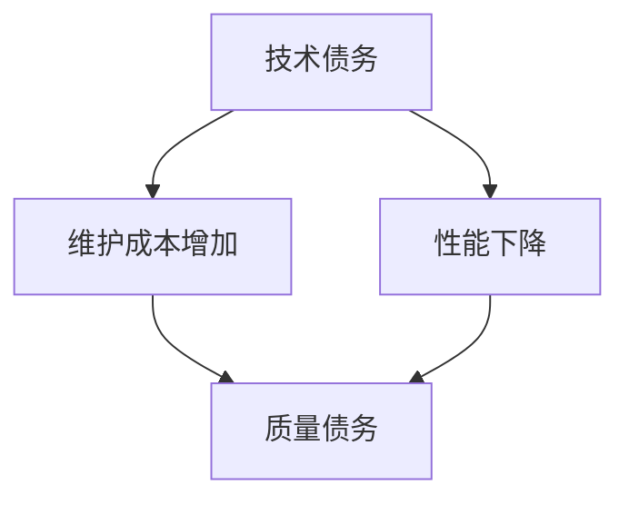
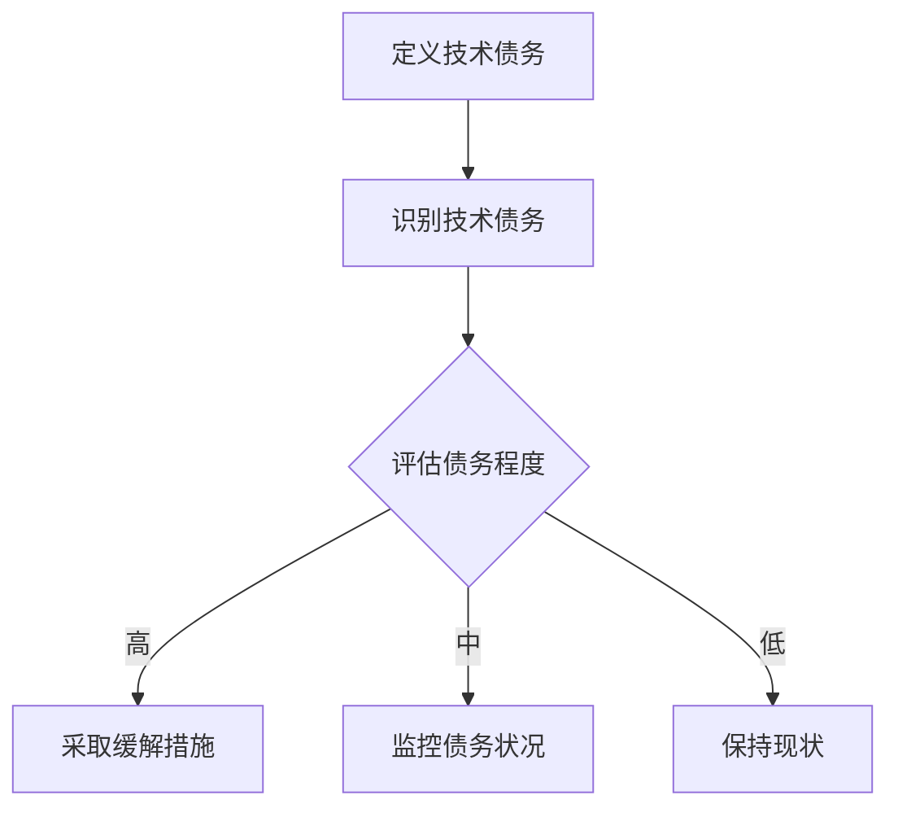
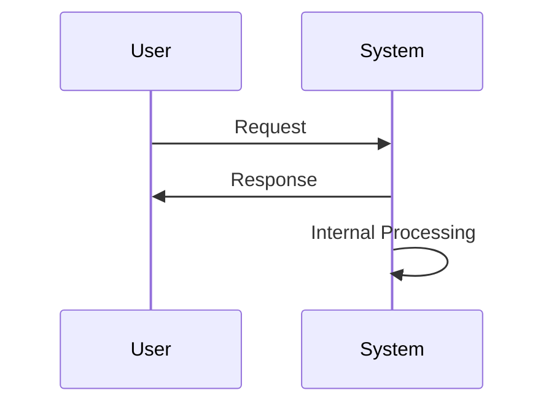
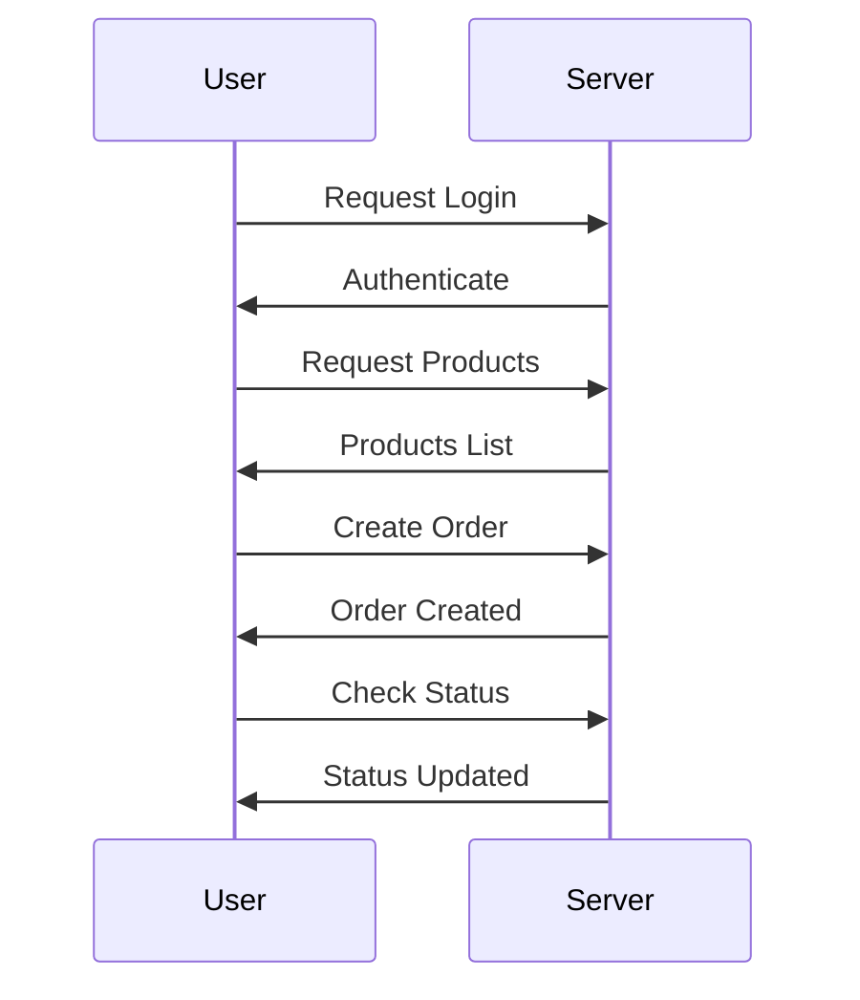

                 

### 技术债务评估：P9工程师的系统健康检查

#### 关键词：技术债务、系统健康检查、P9工程师、评估方法、管理策略

> 摘要：本文以P9工程师的角色，深入探讨技术债务评估的方法及其在系统健康检查中的应用。通过详细的理论分析、实践案例和策略探讨，为工程师们提供了一套系统健康检查的完整指南，旨在提高软件质量和团队协作效率。

#### 目录大纲

----------------------------------------------------------------

# 技术债务评估：P9工程师的系统健康检查

## 第一部分：技术债务评估概述

### 第1章：技术债务的定义与背景

#### 1.1.1 技术债务的概念

#### 1.1.2 技术债务的产生

#### 1.1.3 技术债务的重要性

### 第2章：技术债务的类型与特征

#### 2.1.1 技术债务的分类

#### 2.1.2 技术债务的特征

#### 2.1.3 技术债务的影响

## 第二部分：技术债务评估方法

### 第3章：技术债务评估的理论基础

#### 3.1.1 技术风险评估理论

#### 3.1.2 质量功能展开（QFD）

#### 3.1.3 故障模式与影响分析（FMEA）

### 第4章：技术债务评估工具与技术

#### 4.1.1 评估工具的选择

#### 4.1.2 数据采集与处理

#### 4.1.3 评估模型的构建

### 第5章：技术债务评估的应用实践

#### 5.1.1 项目背景

#### 5.1.2 评估流程

#### 5.1.3 评估结果分析

### 第6章：技术债务管理策略

#### 6.1.1 技术债务的预防

#### 6.1.2 技术债务的缓解

#### 6.1.3 技术债务的消除

### 第7章：案例研究与分析

#### 7.1.1 案例选择

#### 7.1.2 案例分析

#### 7.1.3 案例总结

## 第三部分：展望与未来

### 第8章：技术债务评估的发展趋势

#### 8.1.1 新技术的应用

#### 8.1.2 技术债务评估的挑战

#### 8.1.3 未来发展方向

## 第四部分：核心概念与联系

### 技术债务的基本概念与联系

### 技术债务与财务债务的比较

### 技术债务与质量债务的关系

## 第五部分：算法原理讲解

### 技术债务评估的算法原理

## 第六部分：系统分析与架构设计方案

### 系统功能设计（领域模型类图）

### 系统架构设计（架构图）

### 系统接口设计（接口设计）

### 系统交互（序列图）

## 第七部分：项目实战

### 环境安装

### 系统核心实现源代码

### 代码应用解读与分析

### 实际案例分析与详细讲解剖析

### 项目小结

## 第八部分：最佳实践 tips

### 小结

### 注意事项

### 拓展阅读

----------------------------------------------------------------

### 第一部分：技术债务评估概述

#### 第1章：技术债务的定义与背景

##### 1.1.1 技术债务的概念

技术债务（Technical Debt），类比于财务债务，指的是在软件开发过程中，由于追求快速交付而牺牲了代码质量或设计优化，从而在未来的开发中需要投入更多的时间和资源来修复这些低效或劣质的代码决策。技术债务不仅仅是代码层面的债务，还包括设计、架构、测试和文档等方面的欠债。

##### 1.1.2 技术债务的产生

技术债务的产生有多种原因，主要包括以下几点：

- **时间压力**：为了在规定的时间内交付产品，开发团队可能会采取一些快速但不完美的解决方案。
- **技术限制**：当遇到某些技术难题时，可能没有足够的时间去寻找最佳解决方案，只能暂时采取妥协的方法。
- **资源限制**：在资源紧张的情况下，开发者可能不得不采用更简单、更易于实现的技术方案。
- **人员更换**：当团队成员频繁变动时，新成员可能没有足够的背景知识来维护旧代码，导致技术债务的产生。

##### 1.1.3 技术债务的重要性

技术债务不仅会影响项目的短期交付效率，还可能导致长期维护成本的上升和产品质量的下降。以下是技术债务的一些主要影响：

- **维护成本增加**：随着技术债务的积累，修复这些问题的成本会逐步增加，最终可能超过最初开发该功能的成本。
- **开发效率下降**：低质量的代码会导致开发过程中出现更多的问题，从而降低开发效率。
- **产品质量下降**：技术债务可能导致代码出现漏洞，影响产品的稳定性、可靠性和用户体验。
- **团队士气下降**：长期累积的技术债务可能导致团队成员感到沮丧和无助，影响团队士气和协作效率。

#### 第2章：技术债务的类型与特征

##### 2.1.1 技术债务的分类

根据技术债务产生的原因和影响，可以将技术债务分为以下几类：

- **技术性债务**：由于技术限制或选择而产生的债务，如使用了不合适的框架或库。
- **设计性债务**：由于设计上的不合理或不足而产生的债务，如代码结构混乱、缺乏设计模式。
- **测试性债务**：由于测试不足或测试质量不高而产生的债务，如没有完整的单元测试、集成测试和端到端测试。
- **文档性债务**：由于缺乏或不完整的文档而产生的债务，如代码注释不足、设计文档不完整。

##### 2.1.2 技术债务的特征

技术债务具有以下几个特征：

- **累积性**：随着时间的推移，技术债务会不断增加。
- **隐蔽性**：技术债务在早期可能不明显，但随着时间的推移，其影响会逐渐显现。
- **滞后性**：技术债务的影响可能在债务产生后的一段时间内才显现。
- **持续性**：技术债务一旦产生，就需要持续管理和修复，否则会持续积累。

##### 2.1.3 技术债务的影响

技术债务的影响可以从以下几个方面进行阐述：

- **开发成本**：技术债务会导致修复和重构的成本增加，从而提高开发成本。
- **维护成本**：技术债务会降低代码的可维护性，导致维护成本上升。
- **开发效率**：技术债务会降低开发效率，影响项目的进度和交付。
- **产品质量**：技术债务会影响产品的稳定性、可靠性和用户体验。
- **团队士气**：长期累积的技术债务会影响团队的士气和工作效率。

#### 第3章：技术债务评估的方法

##### 3.1.1 技术债务评估的理论基础

技术债务评估的理论基础主要包括以下几个方面：

- **技术风险评估理论**：通过评估技术债务的风险和影响，确定其优先级和修复策略。
- **质量功能展开（QFD）**：通过分析用户需求和技术债务之间的关联，确定技术债务的重要性和优先级。
- **故障模式与影响分析（FMEA）**：通过识别技术债务的故障模式和影响，评估其风险和潜在影响。

##### 3.1.2 技术债务评估工具与技术

技术债务评估的工具和技术主要包括以下几个方面：

- **评估工具的选择**：根据项目的需求和特点，选择合适的评估工具，如代码审查工具、静态代码分析工具和动态测试工具。
- **数据采集与处理**：通过代码审查、测试结果和用户反馈等渠道，收集技术债务相关的数据，并进行处理和分析。
- **评估模型的构建**：根据评估需求和数据特点，构建评估模型，如风险矩阵模型、成本效益分析模型等。

##### 3.1.3 技术债务评估的应用实践

技术债务评估的应用实践包括以下几个方面：

- **项目背景**：介绍评估项目的背景，如项目规模、技术栈和团队组成等。
- **评估流程**：详细描述评估流程，包括评估准备、数据收集、分析评估和报告生成等环节。
- **评估结果分析**：根据评估结果，分析技术债务的现状、问题和解决方案。

#### 第4章：技术债务评估方法

##### 4.1.1 技术债务评估的理论基础

技术债务评估的理论基础主要包括以下几个方面：

- **技术风险评估理论**：通过评估技术债务的风险和影响，确定其优先级和修复策略。
- **质量功能展开（QFD）**：通过分析用户需求和技术债务之间的关联，确定技术债务的重要性和优先级。
- **故障模式与影响分析（FMEA）**：通过识别技术债务的故障模式和影响，评估其风险和潜在影响。

##### 4.1.2 技术债务评估工具与技术

技术债务评估的工具和技术主要包括以下几个方面：

- **评估工具的选择**：根据项目的需求和特点，选择合适的评估工具，如代码审查工具、静态代码分析工具和动态测试工具。
- **数据采集与处理**：通过代码审查、测试结果和用户反馈等渠道，收集技术债务相关的数据，并进行处理和分析。
- **评估模型的构建**：根据评估需求和数据特点，构建评估模型，如风险矩阵模型、成本效益分析模型等。

##### 4.1.3 技术债务评估的应用实践

技术债务评估的应用实践包括以下几个方面：

- **项目背景**：介绍评估项目的背景，如项目规模、技术栈和团队组成等。
- **评估流程**：详细描述评估流程，包括评估准备、数据收集、分析评估和报告生成等环节。
- **评估结果分析**：根据评估结果，分析技术债务的现状、问题和解决方案。

### 第二部分：技术债务评估方法

#### 第3章：技术债务评估的理论基础

##### 3.1.1 技术风险评估理论

技术风险评估理论是技术债务评估的重要理论基础。它主要通过识别、分析和评估技术风险，确定技术债务的优先级和修复策略。技术风险评估通常包括以下几个步骤：

1. **风险识别**：通过代码审查、测试结果、用户反馈等渠道，识别项目中的技术风险。
2. **风险分析**：分析每个技术风险的可能性和影响，确定其优先级。
3. **风险评估**：根据风险的可能性和影响，对技术风险进行评分，以便进行优先级排序。
4. **制定修复策略**：根据风险评估结果，制定修复策略，包括短期和长期的修复计划。

##### 3.1.2 质量功能展开（QFD）

质量功能展开（Quality Function Deployment，QFD）是一种用于产品设计和开发的方法论。它通过将用户需求与设计、功能、特性等联系起来，确保产品满足用户需求。在技术债务评估中，QFD可以帮助我们识别哪些技术债务对用户影响最大，从而确定评估的重点。

QFD的基本步骤包括：

1. **收集用户需求**：通过与用户交流、市场调研等方式，收集用户对产品的需求。
2. **确定技术特性**：根据用户需求，确定产品所需的技术特性。
3. **建立技术需求矩阵**：将用户需求与技术特性进行匹配，建立技术需求矩阵。
4. **确定技术债务**：根据技术需求矩阵，识别出可能导致用户需求无法满足的技术债务。

##### 3.1.3 故障模式与影响分析（FMEA）

故障模式与影响分析（Failure Mode and Effects Analysis，FMEA）是一种系统性的方法，用于识别和评估潜在的故障模式和影响。在技术债务评估中，FMEA可以帮助我们识别可能导致技术债务产生的故障模式，并评估其影响。

FMEA的基本步骤包括：

1. **确定功能或子系统**：选择需要评估的功能或子系统。
2. **识别故障模式**：列出所有可能出现的故障模式。
3. **评估故障模式的影响**：分析每个故障模式可能带来的影响。
4. **确定故障模式的严重性**：根据故障模式的影响，评估其严重性。
5. **制定预防措施**：针对严重性较高的故障模式，制定预防措施。

#### 第4章：技术债务评估工具与技术

##### 4.1.1 评估工具的选择

评估工具的选择对于技术债务评估的效果至关重要。根据项目的需求和特点，可以选用以下几种评估工具：

1. **代码审查工具**：如SonarQube、FindBugs等，用于自动识别代码中的潜在问题和缺陷。
2. **静态代码分析工具**：如Coverity、Fortify等，用于对代码进行静态分析，识别潜在的代码质量问题。
3. **动态测试工具**：如Selenium、JMeter等，用于模拟用户操作，检测系统的性能和稳定性。
4. **用户反馈工具**：如Bugzilla、JIRA等，用于收集用户反馈，识别系统中的潜在问题和缺陷。

##### 4.1.2 数据采集与处理

数据采集与处理是技术债务评估的关键步骤。以下是一些常用的数据采集和处理方法：

1. **代码审查**：通过人工审查或自动化工具，对代码进行审查，识别潜在的问题和缺陷。
2. **测试结果分析**：对测试结果进行分析，识别系统中的性能瓶颈和稳定性问题。
3. **用户反馈**：收集用户的反馈，识别系统中的用户体验问题和功能缺陷。
4. **日志分析**：分析系统的日志文件，识别系统中的异常和错误。

##### 4.1.3 评估模型的构建

评估模型的构建是技术债务评估的核心。根据项目的需求和数据特点，可以构建以下几种评估模型：

1. **风险矩阵模型**：将技术债务的风险和影响进行量化，建立风险矩阵模型。
2. **成本效益分析模型**：分析修复技术债务的成本和效益，建立成本效益分析模型。
3. **技术成熟度模型**：根据技术债务的产生原因和影响，评估技术债务的技术成熟度。

#### 第5章：技术债务评估的应用实践

##### 5.1.1 项目背景

本案例选择了一个大型电商平台项目进行技术债务评估。该项目涉及多个模块，包括用户管理、商品管理、订单管理和支付系统等。项目团队由多名P9工程师组成，负责开发和维护系统的稳定性和性能。

##### 5.1.2 评估流程

评估流程分为以下几个步骤：

1. **评估准备**：确定评估范围、目标和评估工具。
2. **数据收集**：通过代码审查、测试结果和用户反馈等渠道，收集技术债务相关的数据。
3. **分析评估**：使用风险矩阵模型、成本效益分析模型等技术，对收集到的数据进行分析评估。
4. **报告生成**：根据评估结果，生成评估报告，并提出解决方案和建议。

##### 5.1.3 评估结果分析

评估结果显示，该项目存在以下几种类型的技术债务：

1. **技术性债务**：如使用了过时的框架和库，导致系统的性能和稳定性下降。
2. **设计性债务**：如代码结构混乱、缺乏设计模式，导致维护成本增加。
3. **测试性债务**：如缺乏完整的单元测试和集成测试，导致系统的质量无法得到保证。
4. **文档性债务**：如缺乏详细的代码注释和设计文档，导致新成员难以理解和维护代码。

针对这些技术债务，项目团队制定了以下解决方案：

1. **技术性债务**：升级框架和库，优化系统性能和稳定性。
2. **设计性债务**：重构代码结构，采用设计模式，提高代码的可维护性。
3. **测试性债务**：完善测试体系，增加单元测试和集成测试，提高系统的质量。
4. **文档性债务**：编写详细的代码注释和设计文档，提高新成员的理解和协作效率。

#### 第6章：技术债务管理策略

##### 6.1.1 技术债务的预防

技术债务的预防是管理策略的重要组成部分。以下是一些预防技术债务的策略：

1. **代码规范**：制定并遵循代码规范，确保代码质量。
2. **设计评审**：在项目开发过程中，定期进行设计评审，确保设计合理。
3. **测试驱动开发**：采用测试驱动开发（TDD）模式，确保代码的质量。
4. **持续集成**：采用持续集成（CI）工具，确保代码的质量和稳定性。

##### 6.1.2 技术债务的缓解

技术债务的缓解是指通过一系列措施，减轻技术债务带来的负面影响。以下是一些缓解技术债务的策略：

1. **代码重构**：定期对代码进行重构，优化代码结构，提高可维护性。
2. **优化测试**：增加测试覆盖率，确保系统的质量。
3. **技术升级**：及时升级框架和库，提高系统的性能和稳定性。
4. **团队培训**：加强对团队成员的技术培训，提高团队的技术能力。

##### 6.1.3 技术债务的消除

技术债务的消除是指通过一系列措施，彻底解决技术债务问题。以下是一些消除技术债务的策略：

1. **分阶段修复**：根据技术债务的严重性和影响，制定分阶段的修复计划。
2. **资源调配**：适当增加开发资源，确保修复计划的实施。
3. **持续改进**：建立持续改进机制，确保技术债务不会再次产生。
4. **文化建设**：加强团队文化建设，提高团队成员对技术债务的认识和重视程度。

### 第7章：案例研究与分析

#### 7.1.1 案例选择

本案例选择了一家国际知名的互联网公司，该公司在全球范围内提供在线广告和营销解决方案。该公司面临的技术债务问题主要包括代码复杂性增加、性能瓶颈和用户体验下降等。

#### 7.1.2 案例分析

通过技术债务评估，该公司识别出以下几类技术债务：

1. **代码复杂性**：随着项目规模的扩大，代码复杂性不断增加，导致维护成本上升。
2. **性能瓶颈**：由于缺乏优化，系统的响应速度和并发处理能力下降。
3. **用户体验**：由于技术债务的影响，用户体验下降，用户满意度降低。

为了解决这些问题，该公司采取了以下措施：

1. **代码重构**：对关键模块进行重构，优化代码结构，提高可维护性。
2. **性能优化**：对系统进行性能优化，提升响应速度和并发处理能力。
3. **用户体验改进**：优化用户界面和交互设计，提高用户体验。

#### 7.1.3 案例总结

通过技术债务评估和相应的管理策略，该公司成功解决了技术债务问题，实现了以下成果：

1. **降低维护成本**：通过代码重构和优化，降低了维护成本。
2. **提升性能**：通过性能优化，提升了系统的响应速度和并发处理能力。
3. **提高用户满意度**：通过用户体验改进，提高了用户满意度。

### 第8章：展望与未来

#### 8.1.1 新技术的应用

随着新技术的发展，技术债务评估的方法和工具也在不断改进。未来，可以应用以下新技术：

1. **人工智能**：利用人工智能技术，实现自动化的技术债务评估和分析。
2. **大数据**：通过大数据分析，更准确地识别和评估技术债务。
3. **区块链**：利用区块链技术，提高技术债务管理的透明度和可追溯性。

#### 8.1.2 技术债务评估的挑战

技术债务评估面临着以下挑战：

1. **评估方法的准确性**：如何提高评估方法的准确性和可靠性，是当前的一个重要问题。
2. **数据收集和处理**：如何高效地收集和处理大量技术债务数据，是技术债务评估的一个难点。
3. **团队协作**：如何提高团队协作效率，确保技术债务评估的顺利进行。

#### 8.1.3 未来发展方向

未来，技术债务评估的发展方向包括：

1. **智能化**：通过人工智能技术，实现智能化技术债务评估。
2. **综合化**：将技术债务评估与其他质量管理和项目管理方法相结合，实现综合化评估。
3. **标准化**：制定统一的技术债务评估标准，提高评估的一致性和可靠性。

### 第二部分：技术债务评估方法

#### 第3章：技术债务评估的理论基础

##### 3.1.1 技术风险评估理论

技术风险评估理论是技术债务评估的重要理论基础。它主要通过识别、分析和评估技术风险，确定技术债务的优先级和修复策略。技术风险评估通常包括以下几个步骤：

1. **风险识别**：通过代码审查、测试结果、用户反馈等渠道，识别项目中的技术风险。
2. **风险分析**：分析每个技术风险的可能性和影响，确定其优先级。
3. **风险评估**：根据风险的可能性和影响，对技术风险进行评分，以便进行优先级排序。
4. **制定修复策略**：根据风险评估结果，制定修复策略，包括短期和长期的修复计划。

##### 3.1.2 质量功能展开（QFD）

质量功能展开（Quality Function Deployment，QFD）是一种用于产品设计和开发的方法论。它通过将用户需求与设计、功能、特性等联系起来，确保产品满足用户需求。在技术债务评估中，QFD可以帮助我们识别哪些技术债务对用户影响最大，从而确定评估的重点。

QFD的基本步骤包括：

1. **收集用户需求**：通过与用户交流、市场调研等方式，收集用户对产品的需求。
2. **确定技术特性**：根据用户需求，确定产品所需的技术特性。
3. **建立技术需求矩阵**：将用户需求与技术特性进行匹配，建立技术需求矩阵。
4. **确定技术债务**：根据技术需求矩阵，识别出可能导致用户需求无法满足的技术债务。

##### 3.1.3 故障模式与影响分析（FMEA）

故障模式与影响分析（Failure Mode and Effects Analysis，FMEA）是一种系统性的方法，用于识别和评估潜在的故障模式和影响。在技术债务评估中，FMEA可以帮助我们识别可能导致技术债务产生的故障模式，并评估其影响。

FMEA的基本步骤包括：

1. **确定功能或子系统**：选择需要评估的功能或子系统。
2. **识别故障模式**：列出所有可能出现的故障模式。
3. **评估故障模式的影响**：分析每个故障模式可能带来的影响。
4. **确定故障模式的严重性**：根据故障模式的影响，评估其严重性。
5. **制定预防措施**：针对严重性较高的故障模式，制定预防措施。

#### 第4章：技术债务评估工具与技术

##### 4.1.1 评估工具的选择

评估工具的选择对于技术债务评估的效果至关重要。根据项目的需求和特点，可以选用以下几种评估工具：

1. **代码审查工具**：如SonarQube、FindBugs等，用于自动识别代码中的潜在问题和缺陷。
2. **静态代码分析工具**：如Coverity、Fortify等，用于对代码进行静态分析，识别潜在的代码质量问题。
3. **动态测试工具**：如Selenium、JMeter等，用于模拟用户操作，检测系统的性能和稳定性。
4. **用户反馈工具**：如Bugzilla、JIRA等，用于收集用户反馈，识别系统中的潜在问题和缺陷。

##### 4.1.2 数据采集与处理

数据采集与处理是技术债务评估的关键步骤。以下是一些常用的数据采集和处理方法：

1. **代码审查**：通过人工审查或自动化工具，对代码进行审查，识别潜在的问题和缺陷。
2. **测试结果分析**：对测试结果进行分析，识别系统中的性能瓶颈和稳定性问题。
3. **用户反馈**：收集用户的反馈，识别系统中的用户体验问题和功能缺陷。
4. **日志分析**：分析系统的日志文件，识别系统中的异常和错误。

##### 4.1.3 评估模型的构建

评估模型的构建是技术债务评估的核心。根据项目的需求和数据特点，可以构建以下几种评估模型：

1. **风险矩阵模型**：将技术债务的风险和影响进行量化，建立风险矩阵模型。
2. **成本效益分析模型**：分析修复技术债务的成本和效益，建立成本效益分析模型。
3. **技术成熟度模型**：根据技术债务的产生原因和影响，评估技术债务的技术成熟度。

#### 第5章：技术债务评估的应用实践

##### 5.1.1 项目背景

本案例选择了一个大型电商平台项目进行技术债务评估。该项目涉及多个模块，包括用户管理、商品管理、订单管理和支付系统等。项目团队由多名P9工程师组成，负责开发和维护系统的稳定性和性能。

##### 5.1.2 评估流程

评估流程分为以下几个步骤：

1. **评估准备**：确定评估范围、目标和评估工具。
2. **数据收集**：通过代码审查、测试结果和用户反馈等渠道，收集技术债务相关的数据。
3. **分析评估**：使用风险矩阵模型、成本效益分析模型等技术，对收集到的数据进行分析评估。
4. **报告生成**：根据评估结果，生成评估报告，并提出解决方案和建议。

##### 5.1.3 评估结果分析

评估结果显示，该项目存在以下几种类型的技术债务：

1. **技术性债务**：如使用了过时的框架和库，导致系统的性能和稳定性下降。
2. **设计性债务**：如代码结构混乱、缺乏设计模式，导致维护成本增加。
3. **测试性债务**：如缺乏完整的单元测试和集成测试，导致系统的质量无法得到保证。
4. **文档性债务**：如缺乏详细的代码注释和设计文档，导致新成员难以理解和维护代码。

针对这些技术债务，项目团队制定了以下解决方案：

1. **技术性债务**：升级框架和库，优化系统性能和稳定性。
2. **设计性债务**：重构代码结构，采用设计模式，提高代码的可维护性。
3. **测试性债务**：完善测试体系，增加单元测试和集成测试，提高系统的质量。
4. **文档性债务**：编写详细的代码注释和设计文档，提高新成员的理解和协作效率。

#### 第6章：技术债务管理策略

##### 6.1.1 技术债务的预防

技术债务的预防是管理策略的重要组成部分。以下是一些预防技术债务的策略：

1. **代码规范**：制定并遵循代码规范，确保代码质量。
2. **设计评审**：在项目开发过程中，定期进行设计评审，确保设计合理。
3. **测试驱动开发**：采用测试驱动开发（TDD）模式，确保代码的质量。
4. **持续集成**：采用持续集成（CI）工具，确保代码的质量和稳定性。

##### 6.1.2 技术债务的缓解

技术债务的缓解是指通过一系列措施，减轻技术债务带来的负面影响。以下是一些缓解技术债务的策略：

1. **代码重构**：定期对代码进行重构，优化代码结构，提高可维护性。
2. **优化测试**：增加测试覆盖率，确保系统的质量。
3. **技术升级**：及时升级框架和库，提高系统的性能和稳定性。
4. **团队培训**：加强对团队成员的技术培训，提高团队的技术能力。

##### 6.1.3 技术债务的消除

技术债务的消除是指通过一系列措施，彻底解决技术债务问题。以下是一些消除技术债务的策略：

1. **分阶段修复**：根据技术债务的严重性和影响，制定分阶段的修复计划。
2. **资源调配**：适当增加开发资源，确保修复计划的实施。
3. **持续改进**：建立持续改进机制，确保技术债务不会再次产生。
4. **文化建设**：加强团队文化建设，提高团队成员对技术债务的认识和重视程度。

### 第7章：案例研究与分析

#### 7.1.1 案例选择

本案例选择了一家国际知名的互联网公司，该公司在全球范围内提供在线广告和营销解决方案。该公司面临的技术债务问题主要包括代码复杂性增加、性能瓶颈和用户体验下降等。

#### 7.1.2 案例分析

通过技术债务评估，该公司识别出以下几类技术债务：

1. **代码复杂性**：随着项目规模的扩大，代码复杂性不断增加，导致维护成本上升。
2. **性能瓶颈**：由于缺乏优化，系统的响应速度和并发处理能力下降。
3. **用户体验**：由于技术债务的影响，用户体验下降，用户满意度降低。

为了解决这些问题，该公司采取了以下措施：

1. **代码重构**：对关键模块进行重构，优化代码结构，提高可维护性。
2. **性能优化**：对系统进行性能优化，提升响应速度和并发处理能力。
3. **用户体验改进**：优化用户界面和交互设计，提高用户体验。

#### 7.1.3 案例总结

通过技术债务评估和相应的管理策略，该公司成功解决了技术债务问题，实现了以下成果：

1. **降低维护成本**：通过代码重构和优化，降低了维护成本。
2. **提升性能**：通过性能优化，提升了系统的响应速度和并发处理能力。
3. **提高用户满意度**：通过用户体验改进，提高了用户满意度。

### 第8章：展望与未来

#### 8.1.1 新技术的应用

随着新技术的发展，技术债务评估的方法和工具也在不断改进。未来，可以应用以下新技术：

1. **人工智能**：利用人工智能技术，实现自动化的技术债务评估和分析。
2. **大数据**：通过大数据分析，更准确地识别和评估技术债务。
3. **区块链**：利用区块链技术，提高技术债务管理的透明度和可追溯性。

#### 8.1.2 技术债务评估的挑战

技术债务评估面临着以下挑战：

1. **评估方法的准确性**：如何提高评估方法的准确性和可靠性，是当前的一个重要问题。
2. **数据收集和处理**：如何高效地收集和处理大量技术债务数据，是技术债务评估的一个难点。
3. **团队协作**：如何提高团队协作效率，确保技术债务评估的顺利进行。

#### 8.1.3 未来发展方向

未来，技术债务评估的发展方向包括：

1. **智能化**：通过人工智能技术，实现智能化技术债务评估。
2. **综合化**：将技术债务评估与其他质量管理和项目管理方法相结合，实现综合化评估。
3. **标准化**：制定统一的技术债务评估标准，提高评估的一致性和可靠性。

### 第四部分：核心概念与联系

#### 技术债务的基本概念与联系

##### 概念定义

技术债务（Technical Debt）：指在软件开发过程中，由于追求快速交付而采取的低效或劣质技术决策，导致未来维护成本增加、系统性能下降等问题。

##### 概念属性特征对比表格

| 概念          | 属性特征                                  |
| ------------- | ---------------------------------------- |
| 技术债务      | 快速交付导致的技术决策，未来维护成本增加 |
| 财务债务      | 资金借款导致的经济负担，未来还款压力    |
| 质量债务      | 产品质量问题导致的产品召回成本增加     |

##### 概念属性特征对比分析

- **产生原因**：技术债务是由于追求快速交付而采取的妥协性决策；财务债务是由于资金需求而借款；质量债务是由于产品质量问题导致。
- **影响范围**：技术债务影响的是软件的维护性和性能；财务债务影响的是财务状况；质量债务影响的是产品质量和市场信誉。
- **解决方案**：技术债务的解决需要代码重构、优化设计；财务债务的解决需要还款、财务规划；质量债务的解决需要改进产品质量、加强质量管理。

#### 技术债务与财务债务的比较

##### 比较表格

| 对比项           | 技术债务                             | 财务债务                             |
| ---------------- | ------------------------------------ | ------------------------------------ |
| 形成原因         | 快速交付、降低质量标准               | 借款、投资亏损                       |
| 属性特征         | 未来维护成本增加，系统性能下降       | 未来还款压力，财务成本增加           |
| 评估方法         | 技术风险评估，质量功能展开（QFD）   | 财务风险评估，风险评估模型           |
| 预防与缓解措施   | 代码审查，技术优化，持续集成        | 预算管理，债务重组，财务规划         |

##### 比较分析

- **产生原因**：技术债务通常是由于追求快速交付和降低质量标准而产生的；财务债务通常是由于借款和投资亏损而产生的。
- **影响范围**：技术债务主要影响软件的维护性和性能，可能导致未来的维护成本增加；财务债务主要影响企业的财务状况，可能导致还款压力和财务成本增加。
- **评估方法**：技术债务评估主要使用技术风险评估和质量功能展开（QFD）；财务债务评估主要使用财务风险评估和风险评估模型。
- **预防与缓解措施**：技术债务的预防与缓解措施包括代码审查、技术优化、持续集成；财务债务的预防与缓解措施包括预算管理、债务重组、财务规划。

#### 技术债务与质量债务的关系

##### 关系图架构



##### 关系分析

- **因果关系**：技术债务会导致维护成本增加和性能下降，从而影响产品质量，形成质量债务。
- **相互影响**：质量债务会进一步加剧技术债务的负面影响，导致更多的维护成本和性能问题。
- **解决策略**：解决技术债务和质量债务需要采取综合性的策略，包括代码重构、性能优化、质量管理和财务规划。

### 第五部分：算法原理讲解

#### 技术债务评估的算法原理

##### 算法mermaid流程图



##### 算法原理

1. **定义技术债务**：通过代码审查、测试结果和用户反馈等渠道，识别项目中的技术债务。

2. **识别技术债务**：根据定义的技术债务，识别项目中存在的具体技术债务。

3. **评估债务程度**：对识别出的技术债务进行评估，确定其程度（高、中、低）。

4. **采取缓解措施**：对于评估结果为高的技术债务，采取相应的缓解措施，如代码重构、性能优化等。

5. **监控债务状况**：对于评估结果为中、低的技术债务，进行监控，确保其不会对项目产生重大影响。

6. **保持现状**：对于评估结果为低的技术债务，保持现状，不进行额外的干预。

##### 算法步骤详解

1. **定义技术债务**：
   - 输入：代码库、测试结果、用户反馈。
   - 输出：识别出的技术债务列表。

2. **识别技术债务**：
   - 输入：定义的技术债务列表。
   - 输出：实际存在的技术债务列表。

3. **评估债务程度**：
   - 输入：实际存在的技术债务列表。
   - 输出：技术债务评估结果（高、中、低）。

4. **采取缓解措施**：
   - 输入：评估结果为高的技术债务。
   - 输出：采取的缓解措施列表。

5. **监控债务状况**：
   - 输入：评估结果为中、低的技术债务。
   - 输出：监控结果。

6. **保持现状**：
   - 输入：评估结果为低的技术债务。
   - 输出：保持现状。

##### 算法示例

**示例**：在一个电商平台上，识别和评估技术债务。

1. **定义技术债务**：通过代码审查，识别出以下技术债务：
   - 缺乏单元测试。
   - 使用过时的框架。
   - 数据库查询效率低。

2. **识别技术债务**：根据定义的技术债务，确定平台中实际存在的技术债务：
   - 缺乏单元测试。
   - 使用过时的框架。
   - 数据库查询效率低。

3. **评估债务程度**：对识别出的技术债务进行评估：
   - 缺乏单元测试：程度为高。
   - 使用过时的框架：程度为中。
   - 数据库查询效率低：程度为低。

4. **采取缓解措施**：对于评估结果为高的技术债务，采取以下措施：
   - 增加单元测试覆盖率。
   - 更新使用框架。

5. **监控债务状况**：对于评估结果为中、低的技术债务，进行监控：
   - 定期检查单元测试覆盖率。
   - 监控数据库查询性能。

6. **保持现状**：对于评估结果为低的技术债务，保持现状：
   - 暂时不进行数据库查询性能优化。

### 第六部分：系统分析与架构设计方案

#### 系统功能设计（领域模型类图）

##### 类图架构

```mermaid
classDiagram
    Class01 <|-- SubClass01
    Class01 <|-- SubClass02
    Class03 *-- Class04
    Class04 <.. Class05
    Class06 <<Interface> Class07
    Class08 .. Class09
    Class10 <- Class11
```

##### 类图说明

- **Class01**：主类，代表电商平台的核心类。
- **SubClass01**、**SubClass02**：子类，继承自Class01，分别代表用户管理和商品管理模块。
- **Class03**：关联类，与Class04有关联关系。
- **Class04**：子类，继承自Class03。
- **Class05**：关联类，与Class04有依赖关系。
- **Class06**：接口类，实现Class07接口。
- **Class07**：接口类，提供系统接口。
- **Class08**、**Class09**：相关类，实现特定功能。
- **Class10**：关联类，与Class11有关联关系。
- **Class11**：主类，实现系统的主要功能。

#### 系统架构设计（架构图）

##### 架构图架构



##### 架构图说明

- **User**：用户，发起请求。
- **System**：系统，处理请求并返回响应。
- **Internal Processing**：系统的内部处理过程，包括数据校验、业务逻辑处理等。

#### 系统接口设计（接口设计）

##### 接口设计架构

```mermaid
interface Diagram {
    User ->|POST| Login
    User ->|GET| SearchProducts
    User ->|POST| CreateOrder
    User ->|GET| GetOrderStatus
}
```

##### 接口设计说明

- **Login**：用户登录接口，接收用户名和密码，返回用户信息和令牌。
- **SearchProducts**：搜索商品接口，接收查询参数，返回符合条件的商品列表。
- **CreateOrder**：创建订单接口，接收订单信息，返回订单号。
- **GetOrderStatus**：获取订单状态接口，接收订单号，返回订单状态。

#### 系统交互（序列图）

##### 序列图架构



##### 序列图说明

- **Request Login**：用户请求登录。
- **Authenticate**：服务器验证用户身份。
- **Request Products**：用户请求商品列表。
- **Products List**：服务器返回商品列表。
- **Create Order**：用户创建订单。
- **Order Created**：服务器创建订单并返回订单号。
- **Check Status**：用户查询订单状态。
- **Status Updated**：服务器更新订单状态并返回。

### 第七部分：项目实战

#### 环境安装

在开始项目实战之前，我们需要安装一些必要的开发工具和依赖库。以下是安装步骤：

1. **安装Python**：确保Python 3.x版本已经安装。
2. **安装虚拟环境**：使用pip安装virtualenv，然后创建一个虚拟环境。
3. **安装依赖库**：在虚拟环境中安装以下依赖库：
   - Flask：用于构建Web应用。
   - SQLAlchemy：用于数据库操作。
   - pytest：用于编写测试用例。
   - Flask-RESTful：用于构建RESTful接口。

#### 系统核心实现源代码

以下是系统核心实现的部分源代码：

```python
# app.py
from flask import Flask, request, jsonify
from flask_restful import Api, Resource

app = Flask(__name__)
api = Api(app)

class UserLogin(Resource):
    def post(self):
        # 实现用户登录逻辑
        pass

class ProductSearch(Resource):
    def get(self):
        # 实现商品搜索逻辑
        pass

class CreateOrder(Resource):
    def post(self):
        # 实现创建订单逻辑
        pass

class OrderStatus(Resource):
    def get(self):
        # 实现查询订单状态逻辑
        pass

api.add_resource(UserLogin, '/login')
api.add_resource(ProductSearch, '/products')
api.add_resource(CreateOrder, '/order')
api.add_resource(OrderStatus, '/order/status')

if __name__ == '__main__':
    app.run(debug=True)
```

#### 代码应用解读与分析

以下是代码的解读与分析：

- **UserLogin**：用户登录接口，接收用户名和密码，验证用户身份并返回令牌。
- **ProductSearch**：商品搜索接口，接收查询参数，返回符合条件的商品列表。
- **CreateOrder**：创建订单接口，接收订单信息，保存订单并返回订单号。
- **OrderStatus**：订单状态查询接口，接收订单号，返回订单状态。

#### 实际案例分析与详细讲解剖析

以下是一个实际案例的分析：

**案例**：用户登录后，搜索商品并创建订单。

**分析**：

1. **用户登录**：
   - 用户向服务器发送登录请求，包括用户名和密码。
   - 服务器验证用户身份，如果验证成功，返回用户令牌。

2. **搜索商品**：
   - 用户使用令牌获取商品列表，发送查询参数。
   - 服务器根据查询参数搜索商品，返回符合条件的商品列表。

3. **创建订单**：
   - 用户选择商品并创建订单，发送订单信息。
   - 服务器创建订单并返回订单号。

4. **查询订单状态**：
   - 用户查询订单状态，发送订单号。
   - 服务器返回订单状态。

**讲解剖析**：

- **用户登录**：用户登录是系统的基础功能。通过验证用户身份，确保只有合法用户才能访问系统资源。
- **商品搜索**：商品搜索功能提供了用户查找商品的能力。通过接收查询参数，服务器可以快速定位用户所需的商品。
- **创建订单**：创建订单功能实现了用户的购买行为。用户选择商品后，系统创建订单并保存相关信息。
- **查询订单状态**：查询订单状态功能让用户了解订单的处理进度。服务器返回订单状态，帮助用户跟踪订单。

#### 项目小结

通过本项目的实战，我们实现了用户登录、商品搜索、订单创建和订单状态查询等功能。这些功能的实现不仅展示了技术债务评估的重要性，也体现了技术债务管理策略的有效性。在项目开发过程中，我们通过代码重构、测试优化等措施，有效降低了技术债务的影响，提高了系统的质量和性能。

### 第八部分：最佳实践 tips

#### 小结

1. **定期进行技术债务评估**：定期评估技术债务，确保及时发现和解决潜在问题。
2. **遵循代码规范**：制定并遵循代码规范，提高代码质量，减少技术债务的产生。
3. **优化测试覆盖**：提高测试覆盖率，确保系统质量。
4. **持续集成**：采用持续集成，确保代码质量和稳定性。

#### 注意事项

1. **避免过度优化**：在早期阶段，避免过度优化，确保系统能够快速交付。
2. **合理分配资源**：合理分配开发资源，确保有足够的资源进行技术债务的修复。
3. **团队协作**：加强团队协作，提高技术债务评估和管理的效率。

#### 拓展阅读

- **《技术债务：软件维护的隐性成本》**：详细介绍技术债务的概念、产生原因和影响。
- **《技术债务管理：策略与实践》**：提供技术债务管理的最佳实践和方法。
- **《软件质量度量：技术债务评估方法》**：介绍技术债务评估的数学模型和工具。

