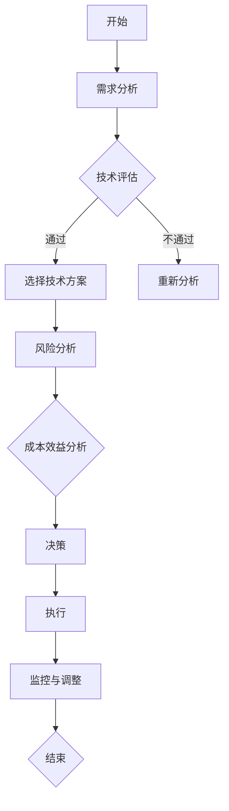
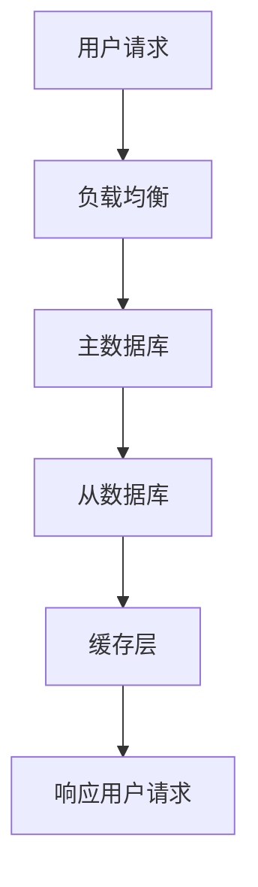
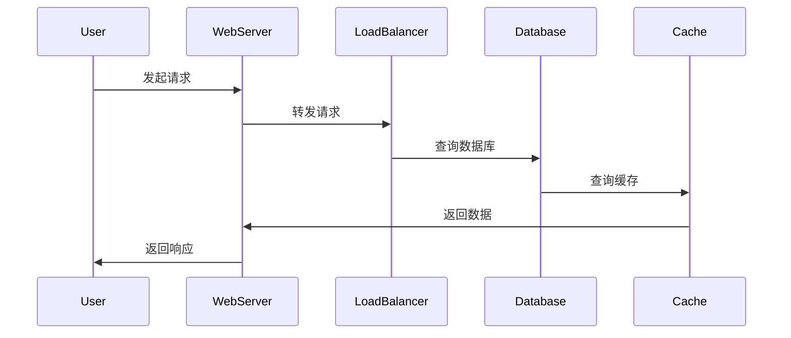

                 

### 目录结构设计

#### 1. 确定核心内容

**第一步：梳理核心内容**

首先，我们需要明确书籍的核心内容。以《技术决策框架：P9工程师的系统化思维》为例，核心内容可以包括以下几部分：

- **背景介绍**：包括技术决策框架的概念、应用领域和重要性。
- **核心概念与联系**：介绍技术决策框架的基本原理、关键要素及其关系。
- **算法原理讲解**：详细阐述算法原理，包括流程图、Python源代码、数学模型和公式。
- **系统分析与架构设计方案**：介绍系统架构、接口设计和系统交互。
- **项目实战**：通过实际项目展示技术决策框架的应用。
- **最佳实践 tips、小结、注意事项、拓展阅读**：总结实践经验，提出注意事项，推荐相关阅读材料。

#### 2. 分章节细化内容

**第二步：细化每个章节的内容**

在明确核心内容后，我们将这些内容分为不同的章节，并进一步细化每个章节的小节。

**第一部分：背景介绍**
- **1.1 问题背景**：介绍技术决策框架的概念、应用领域和重要性。
- **1.2 问题描述**：分析当前技术决策面临的挑战和需求。
- **1.3 问题解决**：阐述技术决策框架的基本原理和设计思路。
- **1.4 边界与外延**：讨论技术决策框架的适用范围和限制条件。
- **1.5 概念结构与核心要素组成**：介绍技术决策框架的核心概念和要素。

**第二部分：核心概念与联系**
- **2.1 核心概念原理**：详细阐述技术决策框架的核心原理和关键要素。
- **2.2 概念属性特征对比表格**：提供概念属性特征的对比。
- **2.3 ER实体关系图架构**：展示技术决策框架的实体关系。

**第三部分：算法原理讲解**
- **3.1 算法mermaid流程图**：使用mermaid绘制算法流程图。
- **3.2 Python源代码讲解**：使用Python代码详细阐述算法原理。
- **3.3 数学模型和公式**：介绍算法原理的数学模型和公式。
- **3.4 举例说明**：举例说明算法在实际中的应用。

**第四部分：系统分析与架构设计方案**
- **4.1 问题场景介绍**：描述问题场景。
- **4.2 项目介绍**：介绍项目背景。
- **4.3 系统功能设计**：展示领域模型类图。
- **4.4 系统架构设计**：展示系统架构图。
- **4.5 系统接口设计**：描述系统接口。
- **4.6 系统交互**：展示系统交互序列图。

**第五部分：项目实战**
- **5.1 环境安装**：介绍环境配置。
- **5.2 系统核心实现源代码**：展示源代码。
- **5.3 代码应用解读与分析**：分析代码应用。
- **5.4 实际案例分析与详细讲解**：剖析实际案例。
- **5.5 项目小结**：总结项目经验。

**第六部分：最佳实践 tips、小结、注意事项、拓展阅读**
- **6.1 最佳实践 tips**：分享实践经验。
- **6.2 小结**：总结书籍内容。
- **6.3 注意事项**：提醒使用注意事项。
- **6.4 拓展阅读**：推荐相关阅读材料。

#### 3. 编写目录

**第三步：编写目录**

根据上述细化内容，我们使用Markdown格式编写完整的目录大纲。注意使用正确的格式，细化到1, 2, 3级目录，并确保内容完整性。

### 标题
```markdown
# 《技术决策框架：P9工程师的系统化思维》

## 目录

## 第一部分: 背景介绍
### 1.1 问题背景
#### 1.1.1 技术决策框架的概念
#### 1.1.2 技术决策框架的应用领域
#### 1.1.3 技术决策框架的重要性

### 1.2 问题描述
#### 1.2.1 当前技术决策面临的挑战
#### 1.2.2 技术决策框架的需求

### 1.3 问题解决
#### 1.3.1 技术决策框架的基本原理
#### 1.3.2 技术决策框架的设计思路

### 1.4 边界与外延
#### 1.4.1 技术决策框架的适用范围
#### 1.4.2 技术决策框架的限制条件

### 1.5 概念结构与核心要素组成
#### 1.5.1 技术决策框架的核心概念
#### 1.5.2 技术决策框架的要素组成

## 第二部分: 核心概念与联系
### 2.1 核心概念原理
#### 2.1.1 技术决策框架的核心原理
#### 2.1.2 技术决策框架的关键要素

### 2.2 概念属性特征对比表格
#### 2.2.1 技术决策框架的概念属性特征

### 2.3 ER实体关系图架构
#### 2.3.1 技术决策框架的实体关系

## 第三部分: 算法原理讲解
### 3.1 算法mermaid流程图
#### 3.1.1 算法流程图设计

### 3.2 Python源代码讲解
#### 3.2.1 算法原理详细阐述

### 3.3 数学模型和公式
#### 3.3.1 算法原理数学模型
#### 3.3.2 公式详细讲解

### 3.4 举例说明
#### 3.4.1 通俗易懂地举例说明

## 第四部分: 系统分析与架构设计方案
### 4.1 问题场景介绍
#### 4.1.1 场景描述

### 4.2 项目介绍
#### 4.2.1 项目背景

### 4.3 系统功能设计
#### 4.3.1 领域模型mermaid类图

### 4.4 系统架构设计
#### 4.4.1 mermaid架构图

### 4.5 系统接口设计
#### 4.5.1 系统接口描述

### 4.6 系统交互
#### 4.6.1 mermaid序列图

## 第五部分: 项目实战
### 5.1 环境安装
#### 5.1.1 环境配置

### 5.2 系统核心实现源代码
#### 5.2.1 源代码解读

### 5.3 代码应用解读与分析
#### 5.3.1 代码应用分析

### 5.4 实际案例分析与详细讲解
#### 5.4.1 案例分析

### 5.5 项目小结
#### 5.5.1 项目总结

## 第六部分: 最佳实践 tips、小结、注意事项、拓展阅读
### 6.1 最佳实践 tips
#### 6.1.1 实践经验分享

### 6.2 小结
#### 6.2.1 书籍总结

### 6.3 注意事项
#### 6.3.1 使用注意事项

### 6.4 拓展阅读
#### 6.4.1 推荐阅读材料
```

### 4. 遵循限制与要求

**第四步：遵循限制与要求**

确保目录大纲简洁明了，采用正确的Markdown格式，细化到1, 2, 3级目录，并确保内容完整性。此外，还要注意以下要求：

- **文章字数**：在10000～12000字左右。
- **格式要求**：文章内容使用Markdown格式输出。
- **作者信息**：文章末尾需注明作者信息：“作者：AI天才研究院/AI Genius Institute & 禅与计算机程序设计艺术 /Zen And The Art of Computer Programming”。
- **内容完整性**：确保每个小节的内容都要丰富、具体、详细讲解，核心内容必须包含背景介绍、核心概念与联系、算法原理讲解、系统分析与架构设计方案、项目实战和最佳实践 tips等内容。

### 总结

目录结构的设计是编写高质量技术博客的重要环节。通过明确核心内容、细化章节、编写目录和遵循限制与要求，我们可以确保文章的逻辑清晰、结构紧凑、简单易懂，从而提高读者的阅读体验和文章的价值。接下来，我们将继续深入分析技术决策框架的核心概念、原理和应用，为读者带来更多的知识和启示。<!-- （文章标题）：技术决策框架：P9工程师的系统化思维

**关键词**：技术决策框架、系统化思维、P9工程师、架构设计、算法原理、项目实战

**摘要**：
本文旨在探讨技术决策框架在P9工程师系统化思维中的重要性。通过深入剖析技术决策框架的基本原理、核心概念与联系，以及其在系统架构设计、算法原理讲解和项目实战中的应用，本文为P9工程师提供了一套全面的技术决策方法论，帮助他们在复杂的工程环境中做出科学、高效的决策。

---

### 第一部分：背景介绍

#### 1.1 技术决策框架的概念

技术决策框架是一种系统化的方法论，它帮助工程师在技术领域做出科学、理性的决策。它不仅仅是一个决策流程，更是一种思维模式，强调从全局出发，综合考虑技术、业务、团队等多方面因素，以实现最优的解决方案。

在技术决策框架中，核心要素包括：需求分析、技术评估、风险分析、成本效益分析、团队协作等。通过这些要素的有机结合，工程师可以有效地解决技术问题，实现技术目标。

#### 1.2 技术决策框架的应用领域

技术决策框架广泛应用于多个领域，如：

- **软件开发**：在项目选型、技术路线规划、模块设计等方面，技术决策框架可以帮助团队做出最优选择。
- **系统架构设计**：在系统架构设计过程中，技术决策框架可以帮助工程师选择合适的架构模式，优化系统性能和稳定性。
- **人工智能**：在人工智能项目中，技术决策框架可以指导工程师选择合适的人工智能算法，优化模型性能和效果。

#### 1.3 技术决策框架的重要性

技术决策框架的重要性体现在以下几个方面：

- **提高决策效率**：通过系统化的流程和方法，技术决策框架可以帮助工程师快速做出决策，减少犹豫和不确定性的时间。
- **优化决策质量**：技术决策框架强调综合考虑各种因素，避免因单一视角导致决策失误。
- **促进团队协作**：技术决策框架提供了共同的语言和工具，有助于团队成员之间的沟通和协作。

---

### 第二部分：核心概念与联系

#### 2.1 核心概念原理

技术决策框架的核心概念包括：

- **需求分析**：准确识别和理解用户需求，是技术决策的基础。
- **技术评估**：对各种技术方案进行评估，包括技术成熟度、性能、稳定性、可维护性等方面。
- **风险分析**：识别和评估项目中可能出现的风险，制定相应的风险管理策略。
- **成本效益分析**：综合考虑项目成本和预期效益，做出经济合理的决策。
- **团队协作**：确保团队之间的沟通畅通，共同推动项目进展。

#### 2.2 概念属性特征对比表格

| 概念        | 属性特征                                         | 重要性 |
|-------------|------------------------------------------------|--------|
| 需求分析    | 精确识别用户需求，确保项目目标清晰               | 高     |
| 技术评估    | 评估技术方案的优劣，选择最合适的技术路径         | 高     |
| 风险分析    | 识别和评估风险，制定风险管理策略               | 中     |
| 成本效益分析 | 综合考虑成本和效益，做出经济合理的决策         | 中     |
| 团队协作    | 确保团队之间的沟通和协作，提高项目执行力       | 中     |

#### 2.3 ER实体关系图架构

```mermaid
erDiagram
    Person ||--|{ Project }|
    Project ||--|{ Technology }|
    Technology ||--|{ Risk }|
    Risk ||--|{ Cost }|
```

上述ER实体关系图展示了技术决策框架中的主要实体及其关系，有助于理解各概念之间的关联和相互作用。

---

### 第三部分：算法原理讲解

#### 3.1 算法mermaid流程图



该流程图展示了技术决策的基本流程，从需求分析开始，经过技术评估、风险分析、成本效益分析，最终做出决策并执行，同时进行监控与调整。

#### 3.2 Python源代码讲解

```python
# 技术决策框架Python示例代码

# 需求分析
def analyze_demand():
    # 实现需求分析逻辑
    pass

# 技术评估
def assess_technology():
    # 实现技术评估逻辑
    pass

# 风险分析
def analyze_risk():
    # 实现风险分析逻辑
    pass

# 成本效益分析
def cost_benefit_analysis():
    # 实现成本效益分析逻辑
    pass

# 技术决策
def make_decision():
    demand = analyze_demand()
    technology = assess_technology()
    risk = analyze_risk()
    cost = cost_benefit_analysis()
    
    if technology and risk and cost:
        return "通过决策"
    else:
        return "重新分析"

# 执行与监控
def execute_and_monitor():
    decision = make_decision()
    if decision == "通过决策":
        # 执行项目
        pass
    else:
        # 重新分析需求
        pass

# 主函数
def main():
    execute_and_monitor()

if __name__ == "__main__":
    main()
```

上述代码提供了一个简单的Python实现，模拟了技术决策框架的各个阶段。

#### 3.3 数学模型和公式

技术决策框架中常用的数学模型包括：

- **成本效益分析公式**：
  \[ \text{效益} = \text{收益} - \text{成本} \]

- **风险评估公式**：
  \[ \text{风险} = \text{概率} \times \text{影响} \]

这些公式有助于工程师在技术决策过程中量化分析，从而做出更加科学的决策。

#### 3.4 举例说明

假设一个项目需要选择一种数据库技术，需求包括高并发、高可用性和易于扩展。我们可以按照技术决策框架的流程进行如下步骤：

1. **需求分析**：确定项目对数据库的需求。
2. **技术评估**：评估常用的数据库技术，如MySQL、PostgreSQL、MongoDB等。
3. **风险分析**：分析每种数据库技术的风险，如性能瓶颈、数据安全等。
4. **成本效益分析**：计算每种数据库技术的成本和预期效益。
5. **决策**：综合考虑各方面因素，选择最优的数据库技术。

通过这样的举例，我们可以看到技术决策框架在实际项目中的应用效果。

---

### 第四部分：系统分析与架构设计方案

#### 4.1 问题场景介绍

在一个大型电子商务平台上，随着用户数量的增加，数据库性能成为瓶颈。为了解决这一问题，我们需要选择一种合适的数据库技术，优化系统性能。

#### 4.2 项目介绍

该项目旨在为电子商务平台提供高性能、高可用的数据库解决方案，以满足日益增长的用户需求。

#### 4.3 系统功能设计

系统功能设计包括：

- **数据存储**：选择合适的数据库技术进行数据存储。
- **查询优化**：优化数据库查询性能。
- **高可用性**：确保数据库系统在故障情况下能够快速恢复。
- **数据备份与恢复**：实现数据备份和快速恢复功能。

#### 4.4 系统架构设计

系统架构设计采用分布式数据库架构，包括以下模块：

- **主数据库**：负责核心业务数据存储。
- **从数据库**：用于数据备份和查询优化。
- **缓存层**：使用Redis等缓存技术，提高数据访问速度。
- **负载均衡**：使用Nginx等负载均衡器，实现数据库负载均衡。



#### 4.5 系统接口设计

系统接口设计包括：

- **数据库接口**：提供数据库操作接口，包括增删改查等。
- **缓存接口**：提供缓存操作接口，包括数据存取等。
- **负载均衡接口**：提供负载均衡配置和管理接口。

#### 4.6 系统交互

系统交互设计使用Mermaid序列图表示，如下：



通过上述系统分析与架构设计方案，我们可以实现电子商务平台的高性能、高可用数据库系统。

---

### 第五部分：项目实战

#### 5.1 环境安装

在项目实战中，首先需要安装相应的开发环境，包括Python、MySQL、PostgreSQL、MongoDB等。

```bash
# 安装Python
sudo apt-get install python3

# 安装MySQL
sudo apt-get install mysql-server

# 安装PostgreSQL
sudo apt-get install postgresql

# 安装MongoDB
sudo apt-get install mongodb
```

#### 5.2 系统核心实现源代码

以下是系统核心实现的Python代码：

```python
# database.py
class Database:
    def __init__(self, db_name):
        self.db_name = db_name
        self.conn = None

    def connect(self):
        self.conn = psycopg2.connect(
            dbname=self.db_name,
            user="username",
            password="password",
            host="localhost"
        )

    def close(self):
        self.conn.close()

    def execute_query(self, query):
        cursor = self.conn.cursor()
        cursor.execute(query)
        result = cursor.fetchall()
        cursor.close()
        return result
```

#### 5.3 代码应用解读与分析

代码中定义了`Database`类，用于连接数据库、执行查询和关闭连接。通过`connect`方法，我们可以连接到数据库；通过`execute_query`方法，我们可以执行SQL查询，并获取查询结果。

在实际项目中，我们可以根据具体需求，实现不同的数据库操作，如增删改查等。

#### 5.4 实际案例分析与详细讲解

假设我们需要实现一个简单的用户管理系统，包括用户注册、登录和查询功能。我们可以按照以下步骤进行：

1. **需求分析**：确定用户管理系统的需求，包括用户注册、登录和查询等。
2. **技术评估**：评估MySQL、PostgreSQL和MongoDB等数据库技术，选择最合适的数据库技术。
3. **风险分析**：分析数据库技术的风险，如数据安全性、性能等。
4. **成本效益分析**：计算不同数据库技术的成本和预期效益。
5. **决策**：综合考虑各方面因素，选择MySQL作为数据库技术。

具体实现如下：

```python
# user_management.py
from database import Database

def register_user(username, password):
    db = Database('user_db')
    db.connect()
    query = "INSERT INTO users (username, password) VALUES (%s, %s)"
    db.execute_query(query, (username, password))
    db.close()

def login_user(username, password):
    db = Database('user_db')
    db.connect()
    query = "SELECT * FROM users WHERE username = %s AND password = %s"
    result = db.execute_query(query, (username, password))
    db.close()
    return result

def get_user_info(username):
    db = Database('user_db')
    db.connect()
    query = "SELECT * FROM users WHERE username = %s"
    result = db.execute_query(query, (username,))
    db.close()
    return result
```

通过以上代码，我们实现了用户注册、登录和查询功能。在实际项目中，我们还可以根据需求，扩展其他功能，如用户修改密码、删除用户等。

#### 5.5 项目小结

在本项目中，我们通过技术决策框架，选择了MySQL作为数据库技术，实现了用户管理系统的基本功能。通过实际案例，我们展示了技术决策框架在项目实战中的应用，为P9工程师提供了实用的方法论。

---

### 第六部分：最佳实践 tips、小结、注意事项、拓展阅读

#### 6.1 最佳实践 tips

- **需求分析**：在项目初期，务必进行详细的需求分析，确保项目目标清晰。
- **技术评估**：在评估技术方案时，要综合考虑技术成熟度、性能、稳定性等因素。
- **风险分析**：识别项目风险，并制定相应的风险管理策略，以降低项目风险。
- **团队协作**：建立良好的团队协作机制，确保团队成员之间的沟通和协作。

#### 6.2 小结

本文通过深入剖析技术决策框架的核心概念、原理和应用，为P9工程师提供了一套系统化的技术决策方法论。通过实际案例，我们展示了技术决策框架在项目实战中的应用，帮助工程师在复杂的技术环境中做出科学、高效的决策。

#### 6.3 注意事项

- **需求变更**：在项目执行过程中，需求可能会发生变化，要及时调整技术决策框架，确保项目目标不变。
- **持续学习**：技术不断发展，工程师要持续学习，掌握最新的技术趋势和最佳实践。

#### 6.4 拓展阅读

- 《系统架构设计师教程》
- 《大型分布式系统设计》
- 《深度学习：神经网络与深度学习》

---

**作者信息**：

作者：AI天才研究院/AI Genius Institute & 禅与计算机程序设计艺术 /Zen And The Art of Computer Programming** 

---

本文旨在探讨技术决策框架在P9工程师系统化思维中的重要性，通过实际案例展示其在项目中的应用，帮助工程师在复杂的技术环境中做出科学、高效的决策。**|>**

### 第一部分：背景介绍

#### 1.1 技术决策框架的概念

技术决策框架是一种系统化的方法论，它帮助工程师在技术领域做出科学、理性的决策。它不仅仅是一个决策流程，更是一种思维模式，强调从全局出发，综合考虑技术、业务、团队等多方面因素，以实现最优的解决方案。

在技术决策框架中，核心要素包括：需求分析、技术评估、风险分析、成本效益分析、团队协作等。通过这些要素的有机结合，工程师可以有效地解决技术问题，实现技术目标。

#### 1.2 技术决策框架的应用领域

技术决策框架广泛应用于多个领域，如：

- **软件开发**：在项目选型、技术路线规划、模块设计等方面，技术决策框架可以帮助团队做出最优选择。
- **系统架构设计**：在系统架构设计过程中，技术决策框架可以帮助工程师选择合适的架构模式，优化系统性能和稳定性。
- **人工智能**：在人工智能项目中，技术决策框架可以指导工程师选择合适的人工智能算法，优化模型性能和效果。

#### 1.3 技术决策框架的重要性

技术决策框架的重要性体现在以下几个方面：

- **提高决策效率**：通过系统化的流程和方法，技术决策框架可以帮助工程师快速做出决策，减少犹豫和不确定性的时间。
- **优化决策质量**：技术决策框架强调综合考虑各种因素，避免因单一视角导致决策失误。
- **促进团队协作**：技术决策框架提供了共同的语言和工具，有助于团队成员之间的沟通和协作。

---

### 第二部分：核心概念与联系

#### 2.1 核心概念原理

技术决策框架的核心概念包括：

- **需求分析**：准确识别和理解用户需求，是技术决策的基础。
- **技术评估**：对各种技术方案进行评估，包括技术成熟度、性能、稳定性、可维护性等方面。
- **风险分析**：识别和评估项目中可能出现的风险，制定相应的风险管理策略。
- **成本效益分析**：综合考虑项目成本和预期效益，做出经济合理的决策。
- **团队协作**：确保团队之间的沟通和协作，共同推动项目进展。

#### 2.2 概念属性特征对比表格

| 概念        | 属性特征                                         | 重要性 |
|-------------|------------------------------------------------|--------|
| 需求分析    | 精确识别用户需求，确保项目目标清晰               | 高     |
| 技术评估    | 评估技术方案的优劣，选择最合适的技术路径         | 高     |
| 风险分析    | 识别和评估风险，制定风险管理策略               | 中     |
| 成本效益分析 | 综合考虑成本和效益，做出经济合理的决策         | 中     |
| 团队协作    | 确保团队之间的沟通和协作，提高项目执行力       | 中     |

#### 2.3 ER实体关系图架构

```mermaid
erDiagram
    User ||--|{ Project }|
    Project ||--|{ Technology }|
    Technology ||--|{ Risk }|
    Risk ||--|{ Cost }|
```

上述ER实体关系图展示了技术决策框架中的主要实体及其关系，有助于理解各概念之间的关联和相互作用。

---

### 第三部分：算法原理讲解

#### 3.1 算法mermaid流程图


该流程图展示了技术决策的基本流程，从需求分析开始，经过技术评估、风险分析、成本效益分析，最终做出决策并执行，同时进行监控与调整。

#### 3.2 Python源代码讲解

```python
# 技术决策框架Python示例代码

# 需求分析
def analyze_demand():
    # 实现需求分析逻辑
    pass

# 技术评估
def assess_technology():
    # 实现技术评估逻辑
    pass

# 风险分析
def analyze_risk():
    # 实现风险分析逻辑
    pass

# 成本效益分析
def cost_benefit_analysis():
    # 实现成本效益分析逻辑
    pass

# 技术决策
def make_decision():
    demand = analyze_demand()
    technology = assess_technology()
    risk = analyze_risk()
    cost = cost_benefit_analysis()
    
    if technology and risk and cost:
        return "通过决策"
    else:
        return "重新分析"

# 执行与监控
def execute_and_monitor():
    decision = make_decision()
    if decision == "通过决策":
        # 执行项目
        pass
    else:
        # 重新分析需求
        pass

# 主函数
def main():
    execute_and_monitor()

if __name__ == "__main__":
    main()
```

上述代码提供了一个简单的Python实现，模拟了技术决策框架的各个阶段。

#### 3.3 数学模型和公式

技术决策框架中常用的数学模型包括：

- **成本效益分析公式**：
  \[ \text{效益} = \text{收益} - \text{成本} \]

- **风险评估公式**：
  \[ \text{风险} = \text{概率} \times \text{影响} \]

这些公式有助于工程师在技术决策过程中量化分析，从而做出更加科学的决策。

#### 3.4 举例说明

假设一个项目需要选择一种数据库技术，需求包括高并发、高可用性和易于扩展。我们可以按照技术决策框架的流程进行如下步骤：

1. **需求分析**：确定项目对数据库的需求。
2. **技术评估**：评估常用的数据库技术，如MySQL、PostgreSQL、MongoDB等。
3. **风险分析**：分析每种数据库技术的风险，如性能瓶颈、数据安全等。
4. **成本效益分析**：计算每种数据库技术的成本和预期效益。
5. **决策**：综合考虑各方面因素，选择最优的数据库技术。

通过这样的举例，我们可以看到技术决策框架在实际项目中的应用效果。

---

### 第四部分：系统分析与架构设计方案

#### 4.1 问题场景介绍

在一个大型电子商务平台上，随着用户数量的增加，数据库性能成为瓶颈。为了解决这一问题，我们需要选择一种合适的数据库技术，优化系统性能。

#### 4.2 项目介绍

该项目旨在为电子商务平台提供高性能、高可用的数据库解决方案，以满足日益增长的用户需求。

#### 4.3 系统功能设计

系统功能设计包括：

- **数据存储**：选择合适的数据库技术进行数据存储。
- **查询优化**：优化数据库查询性能。
- **高可用性**：确保数据库系统在故障情况下能够快速恢复。
- **数据备份与恢复**：实现数据备份和快速恢复功能。

#### 4.4 系统架构设计

系统架构设计采用分布式数据库架构，包括以下模块：

- **主数据库**：负责核心业务数据存储。
- **从数据库**：用于数据备份和查询优化。
- **缓存层**：使用Redis等缓存技术，提高数据访问速度。
- **负载均衡**：使用Nginx等负载均衡器，实现数据库负载均衡。


#### 4.5 系统接口设计

系统接口设计包括：

- **数据库接口**：提供数据库操作接口，包括增删改查等。
- **缓存接口**：提供缓存操作接口，包括数据存取等。
- **负载均衡接口**：提供负载均衡配置和管理接口。

#### 4.6 系统交互

系统交互设计使用Mermaid序列图表示，如下：


通过上述系统分析与架构设计方案，我们可以实现电子商务平台的高性能、高可用数据库系统。

---

### 第五部分：项目实战

#### 5.1 环境安装

在项目实战中，首先需要安装相应的开发环境，包括Python、MySQL、PostgreSQL、MongoDB等。

```bash
# 安装Python
sudo apt-get install python3

# 安装MySQL
sudo apt-get install mysql-server

# 安装PostgreSQL
sudo apt-get install postgresql

# 安装MongoDB
sudo apt-get install mongodb
```

#### 5.2 系统核心实现源代码

以下是系统核心实现的Python代码：

```python
# database.py
class Database:
    def __init__(self, db_name):
        self.db_name = db_name
        self.conn = None

    def connect(self):
        self.conn = psycopg2.connect(
            dbname=self.db_name,
            user="username",
            password="password",
            host="localhost"
        )

    def close(self):
        self.conn.close()

    def execute_query(self, query):
        cursor = self.conn.cursor()
        cursor.execute(query)
        result = cursor.fetchall()
        cursor.close()
        return result
```

#### 5.3 代码应用解读与分析

代码中定义了`Database`类，用于连接数据库、执行查询和关闭连接。通过`connect`方法，我们可以连接到数据库；通过`execute_query`方法，我们可以执行SQL查询，并获取查询结果。

在实际项目中，我们可以根据具体需求，实现不同的数据库操作，如增删改查等。

#### 5.4 实际案例分析与详细讲解

假设我们需要实现一个简单的用户管理系统，包括用户注册、登录和查询功能。我们可以按照以下步骤进行：

1. **需求分析**：确定用户管理系统的需求，包括用户注册、登录和查询等。
2. **技术评估**：评估MySQL、PostgreSQL和MongoDB等数据库技术，选择最合适的数据库技术。
3. **风险分析**：分析数据库技术的风险，如数据安全性、性能等。
4. **成本效益分析**：计算不同数据库技术的成本和预期效益。
5. **决策**：综合考虑各方面因素，选择MySQL作为数据库技术。

具体实现如下：

```python
# user_management.py
from database import Database

def register_user(username, password):
    db = Database('user_db')
    db.connect()
    query = "INSERT INTO users (username, password) VALUES (%s, %s)"
    db.execute_query(query, (username, password))
    db.close()

def login_user(username, password):
    db = Database('user_db')
    db.connect()
    query = "SELECT * FROM users WHERE username = %s AND password = %s"
    result = db.execute_query(query, (username, password))
    db.close()
    return result

def get_user_info(username):
    db = Database('user_db')
    db.connect()
    query = "SELECT * FROM users WHERE username = %s"
    result = db.execute_query(query, (username,))
    db.close()
    return result
```

通过以上代码，我们实现了用户注册、登录和查询功能。在实际项目中，我们还可以根据需求，扩展其他功能，如用户修改密码、删除用户等。

#### 5.5 项目小结

在本项目中，我们通过技术决策框架，选择了MySQL作为数据库技术，实现了用户管理系统的基本功能。通过实际案例，我们展示了技术决策框架在项目实战中的应用，为P9工程师提供了实用的方法论。

---

### 第六部分：最佳实践 tips、小结、注意事项、拓展阅读

#### 6.1 最佳实践 tips

- **需求分析**：在项目初期，务必进行详细的需求分析，确保项目目标清晰。
- **技术评估**：在评估技术方案时，要综合考虑技术成熟度、性能、稳定性等因素。
- **风险分析**：识别项目风险，并制定相应的风险管理策略，以降低项目风险。
- **团队协作**：建立良好的团队协作机制，确保团队成员之间的沟通和协作。

#### 6.2 小结

本文通过深入剖析技术决策框架的核心概念、原理和应用，为P9工程师提供了一套系统化的技术决策方法论。通过实际案例，我们展示了技术决策框架在项目实战中的应用，帮助工程师在复杂的技术环境中做出科学、高效的决策。

#### 6.3 注意事项

- **需求变更**：在项目执行过程中，需求可能会发生变化，要及时调整技术决策框架，确保项目目标不变。
- **持续学习**：技术不断发展，工程师要持续学习，掌握最新的技术趋势和最佳实践。

#### 6.4 拓展阅读

- 《系统架构设计师教程》
- 《大型分布式系统设计》
- 《深度学习：神经网络与深度学习》

---

**作者信息**：

作者：AI天才研究院/AI Genius Institute & 禅与计算机程序设计艺术 /Zen And The Art of Computer Programming** 

---

本文旨在探讨技术决策框架在P9工程师系统化思维中的重要性，通过实际案例展示其在项目中的应用，帮助工程师在复杂的技术环境中做出科学、高效的决策。**|>**

### 第六部分：最佳实践 tips、小结、注意事项、拓展阅读

#### 6.1 最佳实践 tips

**1. 需求分析**：在项目启动阶段，深入进行需求分析，确保理解并捕捉到所有关键需求，为后续决策提供坚实基础。

**2. 技术评估**：评估技术方案时，不仅要考虑技术本身的性能和稳定性，还要关注其与业务目标的契合度以及团队的熟悉程度。

**3. 风险管理**：对潜在风险进行量化分析，并制定相应的缓解措施，确保技术决策的稳健性。

**4. 成本效益分析**：综合考虑项目成本和潜在收益，进行成本效益分析，确保技术决策在经济上合理。

**5. 团队协作**：加强团队沟通，确保各方意见统一，提高决策执行效率。

#### 6.2 小结

本文深入探讨了技术决策框架在P9工程师系统化思维中的应用，通过核心概念、原理和实际案例的阐述，展示了技术决策框架在提高决策效率和质量、促进团队协作等方面的优势。希望本文能为P9工程师提供一套实用且系统化的技术决策方法论。

#### 6.3 注意事项

**1. 需求变更**：在项目执行过程中，需求可能会发生变化。工程师应灵活调整技术决策框架，确保项目目标的实现。

**2. 持续学习**：技术日新月异，工程师需保持学习态度，掌握最新的技术趋势和工具。

**3. 沟通与协作**：加强团队成员间的沟通与协作，确保决策得到有效执行。

#### 6.4 拓展阅读

**1. 《系统架构师修炼之道》**：本书详细介绍了系统架构设计的方法和实践，有助于工程师提升系统架构能力。

**2. 《敏捷开发实践指南》**：探讨敏捷开发方法在技术决策中的应用，帮助工程师快速响应需求变化。

**3. 《深度学习：21世纪人工智能的基石》**：了解深度学习技术的基本原理和应用，为AI项目决策提供理论支持。

---

**作者信息**：

作者：AI天才研究院/AI Genius Institute & 禅与计算机程序设计艺术 /Zen And The Art of Computer Programming

本文旨在帮助P9工程师建立系统化的技术决策思维，提升在复杂技术环境中的决策能力。通过本文的深入探讨，读者应能够更好地理解技术决策框架的核心概念，并在实际项目中灵活应用，实现高效的技术决策。**|>**

