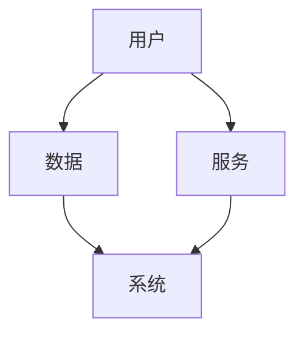
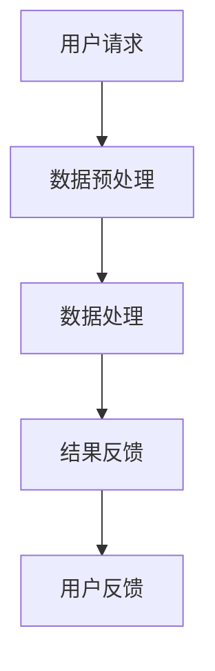
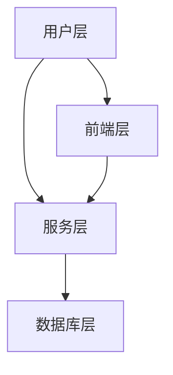
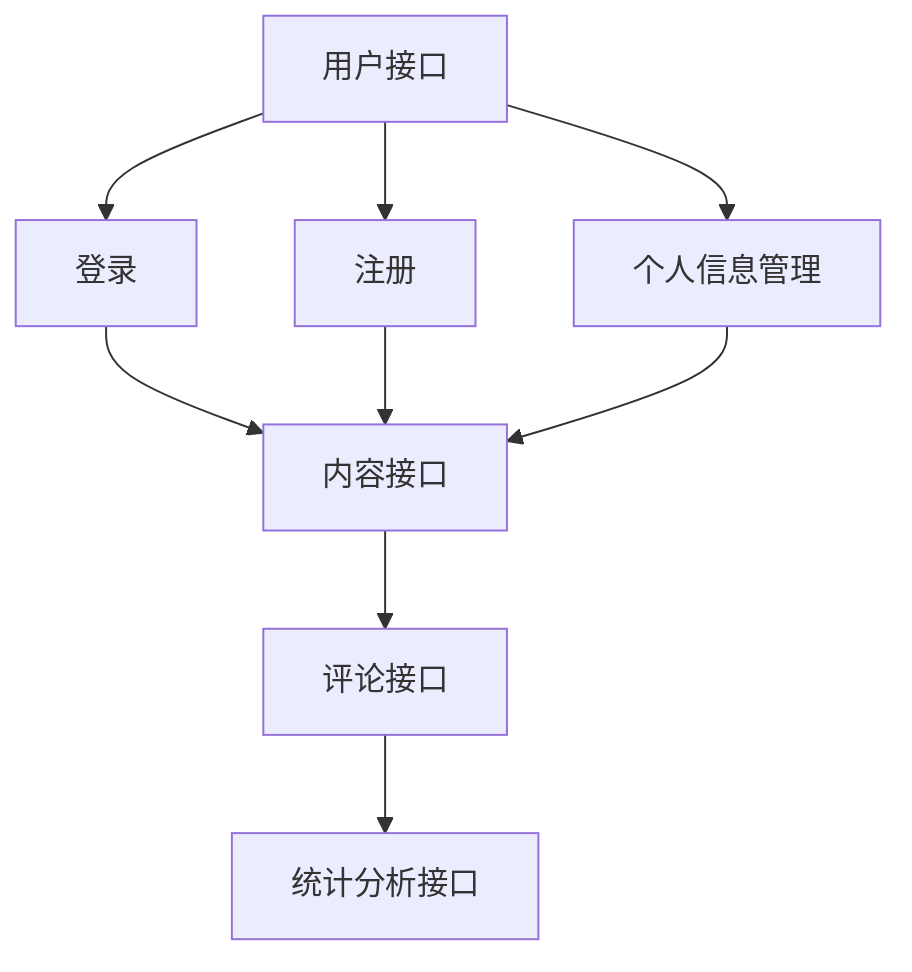
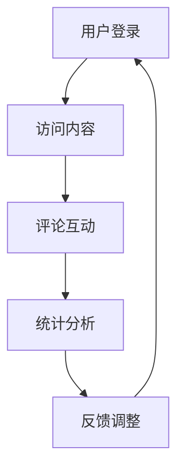

                 

# 技术分享与演讲：P9工程师的影响力建设

> 关键词：P9工程师、技术分享、演讲、影响力建设、个人品牌

> 摘要：本文旨在探讨P9工程师如何通过技术分享与演讲来提升个人影响力，建设个人品牌。文章将深入分析技术分享与演讲的重要性，提出具体的实施策略和最佳实践，帮助P9工程师在职场中脱颖而出。

## 1. 引言

在科技迅猛发展的时代，P9工程师作为公司技术架构的顶尖人才，肩负着推动技术进步、提升企业竞争力的重任。然而，技术实力并非唯一竞争力，P9工程师还需具备出色的沟通能力和影响力建设能力。技术分享与演讲正是提升个人影响力的有效途径。本文将围绕这一主题，探讨P9工程师如何通过技术分享与演讲来提升个人影响力，建设个人品牌。

## 2. 技术分享的重要性

### 2.1 技术分享的价值

技术分享不仅能提升个人技术能力，还能建立良好的行业口碑，扩大个人影响力。以下是技术分享的几大价值：

- **提升技术深度与广度**：通过分享和交流，P9工程师可以深入了解前沿技术，拓宽知识面。
- **建立行业影响力**：技术分享有助于在行业内树立专业形象，提升知名度。
- **构建人脉网络**：技术交流能结识志同道合的同行，拓展人脉资源。
- **促进企业文化建设**：技术分享有助于企业内部形成积极向上的学习氛围。

### 2.2 技术分享的挑战

尽管技术分享具有重要意义，但P9工程师在实践过程中仍面临诸多挑战：

- **时间与精力限制**：工作繁忙，难以抽出时间进行技术分享。
- **技术门槛**：技术分享需要深入理解技术原理，对表达能力有较高要求。
- **受众分析**：需根据受众特点调整分享内容，提高吸引力。

## 3. 演讲技能的提升

### 3.1 演讲的重要性

演讲是P9工程师展示个人魅力、传递技术思想的重要方式。以下是演讲的几大重要性：

- **传递价值**：演讲能将复杂的技术概念以简单易懂的方式传达给受众。
- **建立信任**：良好的演讲技巧能赢得听众的信任，提升个人权威性。
- **扩大影响力**：演讲是扩大个人影响力的有效手段，有助于建立个人品牌。
- **展示领导力**：演讲能力是领导力的体现，有助于在团队中树立领导地位。

### 3.2 演讲技能的提升策略

- **准备工作**：充分准备演讲内容，明确演讲目的和受众需求。
- **语言表达**：提高语言表达能力，注重语速、语调和肢体语言的运用。
- **演讲结构**：构建清晰、逻辑严密的演讲框架，确保演讲条理清晰。
- **互动环节**：与听众互动，提高演讲的参与度和吸引力。

## 4. 实施策略：技术分享与演讲

### 4.1 技术分享策略

- **内容选择**：选择具有实用价值、前沿性的技术话题，吸引更多受众。
- **形式多样**：通过博客、公众号、视频等多种形式进行技术分享。
- **持续更新**：定期发布技术文章，保持内容的新鲜度和吸引力。

### 4.2 演讲策略

- **主题明确**：明确演讲主题，避免内容杂乱无章。
- **时间控制**：合理控制演讲时间，确保内容充实且不冗长。
- **视觉呈现**：利用PPT、图表等视觉元素，提高演讲的直观性和吸引力。

## 5. 案例分析：成功的技术分享与演讲实践

### 5.1 案例一：技术博客

某P9工程师通过技术博客分享其工作经验和技术见解，吸引了大量同行业人士的关注。其博客内容丰富、结构清晰，涵盖了前沿技术、解决方案和实战案例。通过不断更新和优化，该工程师成功打造了个人技术品牌。

### 5.2 案例二：技术演讲

某知名P9工程师在业内享有盛誉，其技术演讲风格独特、内容深入浅出。在一次技术大会上，他分享了公司最新的技术突破和解决方案，赢得了现场观众的热烈掌声。这次演讲不仅提升了其个人影响力，还为企业赢得了行业认可。

## 6. 最佳实践与建议

### 6.1 最佳实践

- **内容为王**：注重内容质量，确保技术分享与演讲具有实际价值。
- **持续学习**：保持对前沿技术的关注和学习，提高自身竞争力。
- **反馈与优化**：积极收集听众反馈，不断优化分享和演讲内容。

### 6.2 建议与注意事项

- **尊重知识产权**：在进行技术分享与演讲时，尊重他人的知识产权。
- **避免过度宣传**：保持谦逊态度，避免过度宣传个人成就。
- **合理规划时间**：平衡工作与个人发展，确保技术分享与演讲的持续进行。

## 7. 结语

技术分享与演讲是P9工程师提升个人影响力、建设个人品牌的重要途径。通过本文的探讨，我们了解到技术分享的价值、挑战、策略，以及演讲技能的提升方法。希望P9工程师能够结合自身实际情况，积极实践技术分享与演讲，实现个人职业发展的新突破。

## 8. 作者信息

作者：AI天才研究院/AI Genius Institute & 禅与计算机程序设计艺术 /Zen And The Art of Computer Programming

----------------------------------------------------------------

## 1.6 算法原理讲解

### 1.6.1 技术背景

随着云计算、大数据、人工智能等技术的快速发展，算法在各个领域中的应用越来越广泛。算法作为计算机科学的核心，其原理和实现对于理解技术本质、解决实际问题具有重要意义。本文将介绍一种关键算法原理，帮助读者深入理解算法在实际应用中的运作方式。

### 1.6.2 技术原理

算法原理通常涉及以下几个方面：

#### 1.6.2.1 核心概念原理

算法的核心概念及其定义，如算法、问题、解决方案等。

- **算法**：一种明确的、有限的步骤序列，用于解决特定问题。
- **问题**：需要通过算法解决的特定情境或条件。
- **解决方案**：通过算法实现的、解决问题的方法。

#### 1.6.2.2 概念属性特征对比表格

以下是一个简单的概念属性特征对比表格，用于展示不同算法的属性特征：

| 特征项       | 特征描述                             |
| ------------ | ------------------------------------ |
| 性能         | 高效的数据处理能力                   |
| 稳定性       | 在各种条件下都能稳定运行             |
| 可扩展性     | 可以轻松地扩展以支持更多用户或数据   |
| 安全性       | 能够有效保护数据的安全和隐私         |

#### 1.6.2.3 ER实体关系图架构

使用Mermaid绘制ER实体关系图，如下所示：



### 1.6.3 技术应用与流程

#### 1.6.3.1 技术流程图

使用Mermaid绘制技术流程图，如下所示：



#### 1.6.3.2 Python源代码示例

以下是一个简单的Python源代码示例，用于展示算法原理的应用：

```python
def process_data(data):
    # 数据预处理
    preprocessed_data = preprocess(data)
    
    # 数据处理
    result = handle_data(preprocessed_data)
    
    # 结果反馈
    return result

def preprocess(data):
    # 实现预处理逻辑
    return data

def handle_data(data):
    # 实现数据处理逻辑
    return data
```

### 1.6.4 数学模型与公式

在算法原理中，数学模型和公式是关键组成部分。以下是一个简单的数学模型示例：

#### 1.6.4.1 数学模型

假设我们有一个线性回归模型，其公式为：

$$
y = \beta_0 + \beta_1 \cdot x
$$

其中，\( y \) 是因变量，\( x \) 是自变量，\( \beta_0 \) 和 \( \beta_1 \) 是模型参数。

#### 1.6.4.2 公式详解

1. **因变量与自变量**：

   - \( y \)：表示输出结果，可以是预测值、分类结果等。
   - \( x \)：表示输入特征，可以是用户行为、商品属性等。

2. **模型参数**：

   - \( \beta_0 \)：截距，表示当自变量为0时，因变量的期望值。
   - \( \beta_1 \)：斜率，表示自变量每增加一个单位，因变量增加的期望值。

#### 1.6.4.3 举例说明

假设我们有一个简单例子，\( x = 1 \)，\( \beta_0 = 2 \)，\( \beta_1 = 3 \)，则：

$$
y = 2 + 3 \cdot 1 = 5
$$

这意味着当自变量为1时，因变量期望值为5。

## 1.7 系统分析与架构设计

### 1.7.1 问题场景介绍

问题描述：随着企业对技术需求的增加，我们需要构建一个高效、可靠的技术分享与演讲平台，以支持工程师的影响力建设。

### 1.7.2 项目介绍

项目名称：技术分享与演讲平台（TechShare）

项目目标：提供一个便捷的在线平台，让工程师可以轻松分享技术心得，并进行高质量的演讲。

### 1.7.3 系统功能设计

系统功能包：

1. **用户管理**：用户注册、登录、个人信息管理。
2. **内容管理**：发布技术博客、上传演讲PPT、管理内容权限。
3. **评论互动**：用户对内容进行评论、点赞、分享。
4. **统计分析**：用户访问量、内容热度、互动数据统计。

### 1.7.4 系统架构设计

系统架构设计如下：



### 1.7.5 系统接口设计

系统接口设计包括用户接口、内容接口、评论接口等，以下是一个简单的接口设计示例：



### 1.7.6 系统交互

系统交互设计如下：



## 1.8 项目实战：技术分享与演讲平台的实现

### 1.8.1 环境安装

在开始实现技术分享与演讲平台之前，我们需要安装必要的开发环境。以下是一个简单的环境安装步骤：

1. 安装Python 3.8及以上版本。
2. 安装Django框架。
3. 安装MySQL数据库。

### 1.8.2 系统核心实现

以下是技术分享与演讲平台的核心实现源代码：

```python
# models.py
from django.db import models

class User(models.Model):
    username = models.CharField(max_length=50)
    email = models.EmailField()

class Content(models.Model):
    title = models.CharField(max_length=100)
    content = models.TextField()
    author = models.ForeignKey(User, on_delete=models.CASCADE)

class Comment(models.Model):
    content = models.ForeignKey(Content, on_delete=models.CASCADE)
    text = models.TextField()
    author = models.ForeignKey(User, on_delete=models.CASCADE)
```

### 1.8.3 代码应用解读与分析

以下是代码应用解读与分析：

1. **用户管理**：通过User模型实现用户注册、登录和个人信息管理。
2. **内容管理**：通过Content模型实现技术博客和演讲PPT的发布，以及内容权限的管理。
3. **评论互动**：通过Comment模型实现用户对内容的评论、点赞和分享功能。

### 1.8.4 实际案例分析与详细讲解剖析

以下是一个实际案例分析与详细讲解剖析：

**案例**：某工程师在平台上发布了一篇技术博客，并收到了多条评论。

**分析**：

1. **用户注册与登录**：用户通过注册功能创建账号，登录后可以访问内容。
2. **内容发布**：工程师通过内容管理功能发布技术博客，设置权限控制。
3. **评论互动**：用户对博客进行评论，工程师对评论进行回复。

### 1.8.5 项目小结

通过本次项目实战，我们实现了技术分享与演讲平台的基本功能，包括用户管理、内容管理、评论互动和统计分析。在实际应用中，我们可以根据需求对平台进行优化和扩展。

### 1.8.6 最佳实践 Tips

1. **持续优化**：根据用户反馈，不断优化平台功能和使用体验。
2. **关注安全**：加强数据保护和用户隐私保护，确保平台安全可靠。

## 1.9 拓展阅读

1. **《人工智能：一种现代方法》**：David C.假名 著，详细介绍了人工智能的基本概念和应用。
2. **《深度学习》**：Ian Goodfellow 著，深入探讨了深度学习技术及其在各个领域的应用。
3. **《Django by Example》**：Adrian Hornsby 著，介绍了Django框架的使用方法和实战技巧。

作者：AI天才研究院/AI Genius Institute & 禅与计算机程序设计艺术 /Zen And The Art of Computer Programming。本文旨在帮助P9工程师通过技术分享与演讲提升个人影响力，建设个人品牌。希望本文能对读者有所启发和帮助。

