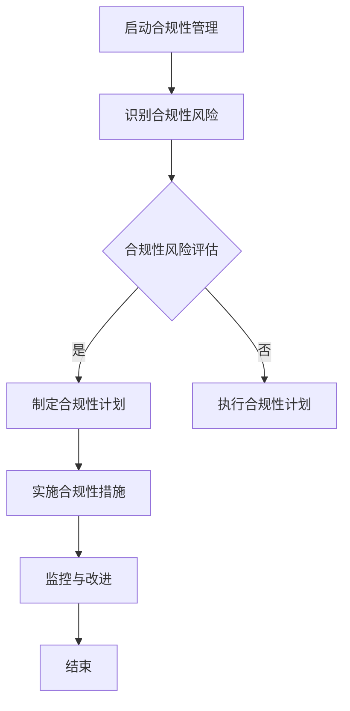

                 

### 第1章：技术合规性管理概述

#### 1.1.1 合规性管理的定义

合规性管理，即合规性治理（Compliance Management），是指组织为确保其行为和操作符合法律、法规、规章、标准和行业准则而实施的一系列策略、过程和控制。它不仅仅是一种被动遵守规则的机制，更是一种主动的、预防性的管理模式。合规性管理涉及对内部流程、操作、决策和文化的全面审视和调整，以确保组织能够持续符合外部法规和内部规定的需求。

在技术领域，合规性管理尤为重要。随着信息技术的快速发展，尤其是云计算、大数据、人工智能等前沿技术的广泛应用，技术合规性成为企业运营中不可忽视的重要环节。合规性管理不仅关乎企业自身的法律风险，还关系到企业的声誉、客户的信任以及市场的竞争力。

#### 1.1.2 技术合规性的必要性

技术合规性的必要性体现在以下几个方面：

1. **法律风险防范**：技术领域涉及众多法律法规，如数据保护法、网络安全法、行业标准等。不合规可能导致法律诉讼、罚款、业务中断等严重后果。

2. **数据安全和隐私保护**：随着大数据和云计算的普及，数据安全成为关键问题。技术合规性管理有助于保护用户数据的安全和隐私，避免数据泄露带来的损失。

3. **客户信任和品牌保护**：合规性管理能够增强客户对企业的信任，提升品牌价值。合规的企业往往被视为更加可靠和安全的选择。

4. **市场竞争优势**：合规性管理能够帮助企业规避不必要的风险，减少法律纠纷和罚款，从而在激烈的市场竞争中占据优势地位。

5. **社会责任和伦理**：技术合规性管理也是企业履行社会责任、维护伦理道德的重要方式。它有助于企业建立良好的社会形象，赢得公众的认可和尊重。

#### 1.1.3 技术合规性管理的目标

技术合规性管理的目标主要包括以下几点：

1. **确保合规性**：确保组织的技术开发、运营和管理过程符合相关法律法规和标准。

2. **预防违规行为**：通过建立完善的合规性管理体系，预防违规行为的发生。

3. **风险控制**：对潜在的风险进行识别、评估和控制，降低合规风险。

4. **持续改进**：不断审视和改进合规性管理策略和过程，以适应不断变化的法规环境和业务需求。

5. **建立信任**：建立客户、合作伙伴和监管机构对企业的信任，提高企业的社会声誉。

### 1.2 技术合规性管理的核心概念

技术合规性管理涉及多个核心概念，以下是其主要的组成部分：

#### 1.2.1 合规性

合规性（Compliance）是指组织在法律、法规、规章、标准和行业准则等方面的符合程度。合规性管理旨在确保组织在所有相关方面都符合要求，避免因违规而导致的法律风险和商业损失。

#### 1.2.2 法律法规

法律法规（Legislation and Regulations）是指国家、地方政府和行业组织制定的法律、法规、规章、标准和指南。这些法规对组织的行为和操作有明确的规定，是技术合规性管理的重要依据。

#### 1.2.3 风险管理

风险管理（Risk Management）是指组织识别、评估、控制和监控潜在风险的过程。技术合规性管理中的风险管理旨在识别和应对合规性相关的风险，确保组织的合规性管理策略和过程能够有效应对各种潜在风险。

#### 1.2.4 内部控制

内部控制（Internal Control）是指组织为实现合规性目标而建立的各项控制措施。这些控制措施包括政策、程序、流程、监控和审计等，旨在确保组织的技术开发和运营过程符合合规性要求。

#### 1.2.5 法律遵从性

法律遵从性（Legal Compliance）是指组织遵守法律法规的程度。法律遵从性是技术合规性管理的核心目标之一，组织必须确保其行为和操作始终符合相关法律法规。

### 1.3 技术合规性管理的实施步骤

技术合规性管理的实施可以分为以下几个步骤：

#### 1.3.1 制定合规性策略

制定合规性策略是技术合规性管理的第一步。组织需要明确合规性管理的目标、原则和范围，并制定相应的合规性计划。

#### 1.3.2 进行合规性评估

合规性评估是识别和评估组织在合规性方面的现状和风险的过程。组织需要全面分析其业务流程、技术架构和操作模式，识别潜在的合规性风险。

#### 1.3.3 制定合规性计划

根据合规性评估的结果，组织需要制定详细的合规性计划，包括合规性要求、实施步骤、责任分配和时间表等。

#### 1.3.4 实施合规性计划

实施合规性计划是技术合规性管理的关键步骤。组织需要按照合规性计划的要求，逐步实施各项合规性措施，确保合规性目标的实现。

#### 1.3.5 监控与改进

合规性管理是一个持续的过程。组织需要建立监控机制，对合规性实施情况进行跟踪和评估，及时发现和纠正问题。同时，组织还需要根据法规变化和业务需求，不断改进和优化合规性管理策略和过程。

### 1.4 技术合规性管理的边界与外延

技术合规性管理不仅涉及组织内部的合规性要求，还涉及与外部环境的关系。其边界与外延主要包括以下几个方面：

#### 1.4.1 国际法律环境

国际法律环境是指涉及跨境数据传输、国际合规要求等方面的法律法规。随着全球化的深入，国际法律环境对技术合规性管理的影响越来越大。

#### 1.4.2 国内法律环境

国内法律环境是指组织所在国家或地区的法律法规。国内法律环境对技术合规性管理具有直接影响，组织需要全面了解和遵守。

#### 1.4.3 行业特定法律

行业特定法律是指特定行业或领域的法律法规。不同行业的合规性要求各不相同，组织需要根据行业特点制定相应的合规性管理策略。

#### 1.4.4 技术合规性管理与其他领域的联系

技术合规性管理不仅与法律、法规相关，还与信息安全、风险管理、内部控制等领域的管理密切相关。组织需要在整体管理框架下，协调各项管理措施，确保技术合规性管理的有效性。

### 1.5 技术合规性管理的基本概念和核心要素组成

技术合规性管理的基本概念包括合规性、法律法规、风险管理、内部控制等。这些概念相互联系，共同构成了技术合规性管理的核心要素。以下是这些概念的基本定义和关系：

- **合规性**：指组织在法律、法规、规章、标准和行业准则等方面的符合程度。
- **法律法规**：指国家、地方政府和行业组织制定的法律、法规、规章、标准和指南。
- **风险管理**：指组织识别、评估、控制和监控潜在风险的过程。
- **内部控制**：指组织为实现合规性目标而建立的各项控制措施。
- **法律遵从性**：指组织遵守法律法规的程度。

这些概念之间的关系如下：

- **合规性**是技术合规性管理的核心目标，需要通过**法律法规**的遵守来实现。
- **风险管理**和**内部控制**是确保合规性目标实现的手段，通过识别、评估和控制风险，以及建立相应的控制措施，来确保组织的合规性。
- **法律遵从性**是合规性的具体体现，是组织在法律法规方面的一种表现。

### 1.6 技术合规性管理的重要性

技术合规性管理在当今信息化社会中具有重要意义。以下是几个关键原因：

1. **法律风险的预防**：技术合规性管理能够帮助企业识别和预防潜在的法律风险，避免因违反法律法规而导致的法律诉讼、罚款、业务中断等严重后果。

2. **数据安全和隐私保护**：随着大数据和云计算的普及，数据安全成为关键问题。技术合规性管理有助于保护用户数据的安全和隐私，避免数据泄露带来的损失。

3. **客户信任和品牌保护**：合规性管理能够增强客户对企业的信任，提升品牌价值。合规的企业往往被视为更加可靠和安全的选择。

4. **市场竞争优势**：合规性管理能够帮助企业规避不必要的风险，减少法律纠纷和罚款，从而在激烈的市场竞争中占据优势地位。

5. **社会责任和伦理**：技术合规性管理也是企业履行社会责任、维护伦理道德的重要方式。它有助于企业建立良好的社会形象，赢得公众的认可和尊重。

### 1.7 技术合规性管理的挑战与应对策略

尽管技术合规性管理具有重要意义，但在实际操作中仍面临诸多挑战。以下是几个主要挑战及其应对策略：

1. **法律法规的复杂性和多样性**：不同国家、地区和行业的法律法规复杂且多样，企业需要投入大量资源和时间来了解和遵守。

**应对策略**：企业可以组建专门的合规团队，负责研究和跟踪相关法律法规，确保合规性管理策略的及时更新和实施。

2. **技术的快速发展和变化**：技术领域的快速发展和技术标准的不断更新，对合规性管理提出了新的挑战。

**应对策略**：企业需要保持对技术的敏感度，及时了解和掌握最新技术发展趋势和标准，将合规性管理策略与技术发展同步更新。

3. **组织内部的协调和沟通**：合规性管理涉及多个部门和层级，需要有效的协调和沟通，以确保合规性目标的实现。

**应对策略**：企业可以建立跨部门的合规性管理协调机制，确保各部门之间的信息共享和协作，提高合规性管理的效率。

4. **合规性成本的投入**：合规性管理需要大量的人力、物力和财力投入，对企业成本控制构成挑战。

**应对策略**：企业可以通过优化流程、提高自动化水平等方式，降低合规性管理的成本，同时确保合规性管理的效果。

### 1.8 技术合规性管理的未来发展趋势

随着信息技术的不断发展和法律法规的日益完善，技术合规性管理将呈现出以下发展趋势：

1. **数字化转型**：随着数字化转型的深入推进，技术合规性管理将更加依赖于数字化工具和技术，如区块链、人工智能等。

2. **国际化合规**：全球化和跨国业务的发展，将促使企业面临更多的国际化合规要求，技术合规性管理将更加注重国际化标准。

3. **自动化和智能化**：自动化和智能化技术将在合规性管理中发挥越来越重要的作用，提高合规性管理的效率和准确性。

4. **法律法规的持续更新**：随着技术的不断进步和社会的发展，法律法规将持续更新和完善，技术合规性管理需要及时应对。

5. **合规性文化的建设**：合规性管理将更加注重企业内部合规性文化的建设，提升员工的合规意识，形成全员参与的合规性管理氛围。

---

### 第2章：技术合规性管理的法律基础

#### 2.1 技术合规性法律体系

技术合规性法律体系是指规范技术领域相关行为和操作的一系列法律、法规、规章、标准和行业准则。该体系旨在确保技术活动的合法性、安全性和可靠性，维护社会公共利益和国家安全。

技术合规性法律体系主要包括以下几个方面：

1. **国际法律环境**：涉及跨境数据传输、国际数据保护法、全球网络安全等。例如，欧盟的《通用数据保护条例》（GDPR）就对全球企业的数据保护提出了严格要求。

2. **国内法律环境**：包括国家层面的法律法规和地方政府的相关规定。例如，中国的《网络安全法》、《数据安全法》等。

3. **行业特定法律**：针对特定行业的法律法规，如金融行业的《反洗钱法》、医疗行业的《个人信息保护法》等。

#### 2.2 技术合规性法律文档

技术合规性法律文档是技术合规性管理的重要依据，主要包括以下几类：

1. **合规性政策与程序**：组织内部制定的合规性政策、程序和指南，明确合规性管理的目标、范围和具体要求。

2. **合规性手册与操作指南**：详细描述合规性管理的操作流程、步骤和方法，提供具体操作指导。

3. **合规性报告与记录**：包括合规性评估报告、合规性检查记录、合规性培训记录等，用于证明组织在合规性方面的合规性。

#### 2.3 技术合规性法律风险识别与管理

技术合规性法律风险识别与管理是技术合规性管理的重要环节，主要包括以下步骤：

1. **识别法律风险**：通过法律法规研究、行业案例分析、内部审计等方式，识别组织在技术合规性方面可能存在的风险。

2. **评估法律风险**：对识别出的法律风险进行评估，确定其影响程度和发生的可能性。

3. **制定风险应对策略**：根据法律风险的评估结果，制定相应的风险应对策略，包括风险规避、风险转移、风险接受等。

4. **实施风险应对措施**：根据风险应对策略，实施具体的措施，降低法律风险。

5. **监控与改进**：对法律风险的监控与改进，确保风险应对措施的有效性，并根据法规变化和业务需求，及时调整风险应对策略。

---

### 第3章：技术合规性管理的实施策略

#### 3.1 建立合规性组织架构

建立合规性组织架构是技术合规性管理的基础，它有助于确保合规性管理的有效性和持续性。以下是一个典型的合规性组织架构：

1. **合规委员会**：由高级管理层组成，负责制定合规性策略、审批重大合规性决策，并监督合规性管理的实施。

2. **合规管理部门**：负责具体实施合规性管理，包括合规性评估、风险识别、合规性培训和内部审计等。

3. **合规岗位设置**：根据组织的规模和业务特点，设立合规专员、合规分析师等岗位，确保合规性管理的覆盖面和深度。

#### 3.2 制定合规性培训计划

合规性培训是提高员工合规意识、确保合规性管理实施效果的重要手段。以下是一个基本的合规性培训计划：

1. **培训内容**：包括法律法规、合规性管理策略、合规性操作流程等。

2. **培训对象**：所有员工，尤其是涉及到技术合规性的关键岗位。

3. **培训频率**：定期进行培训，至少每年一次。

4. **培训形式**：包括线上培训、线下培训、内部研讨会等。

#### 3.3 建立合规性监控和审计机制

合规性监控和审计是确保合规性管理实施效果的关键环节。以下是一个基本的合规性监控和审计机制：

1. **监控内容**：包括合规性管理的执行情况、合规性风险识别和评估、合规性培训和内部审计等。

2. **监控频率**：定期进行监控，至少每季度一次。

3. **审计方式**：内部审计和外部审计相结合，确保审计的全面性和客观性。

4. **审计结果处理**：对审计中发现的问题，及时进行整改，并记录整改结果。

#### 3.4 制定合规性应急预案

应急预案是应对突发合规性事件、确保业务连续性的重要手段。以下是一个基本的合规性应急预案：

1. **应急响应流程**：包括应急响应小组的成立、应急响应流程的制定和演练等。

2. **应急响应资源**：包括应急响应所需的设备、人员、物资等。

3. **应急响应演练**：定期进行应急响应演练，提高应急响应能力。

4. **应急响应结果评估**：对应急响应结果进行评估，总结经验教训，不断完善应急预案。

---

### 第4章：技术合规性管理的算法原理讲解

#### 4.1 算法mermaid流程图

为了更好地理解技术合规性管理的算法原理，我们使用mermaid流程图来展示算法的基本流程。以下是一个简单的算法mermaid流程图示例：



#### 4.2 Python源代码

以下是一个简单的Python源代码示例，用于实现技术合规性管理的算法原理：

```python
# 技术合规性管理算法实现
class ComplianceManagement:
    def __init__(self):
        self.compliance_risk = None
        self.compliance_plan = None
    
    def identify_compliance_risk(self):
        # 识别合规性风险
        self.compliance_risk = "存在合规性风险"
        print("识别合规性风险：", self.compliance_risk)
    
    def assess_compliance_risk(self):
        # 合规性风险评估
        if self.compliance_risk:
            print("合规性风险评估：是")
            self.compliance_plan = "制定合规性计划"
        else:
            print("合规性风险评估：否")
            self.compliance_plan = "执行合规性计划"
    
    def implement_compliance_plan(self):
        # 实施合规性计划
        print("实施合规性计划：", self.compliance_plan)
    
    def monitor_and_improve(self):
        # 监控与改进
        print("监控与改进：完成")
    
    def run(self):
        # 运行合规性管理算法
        self.identify_compliance_risk()
        self.assess_compliance_risk()
        self.implement_compliance_plan()
        self.monitor_and_improve()

# 创建合规性管理对象并运行
cm = ComplianceManagement()
cm.run()
```

#### 4.3 数学模型和公式

在技术合规性管理中，常用的数学模型和公式包括：

1. **合规性风险评估模型**：

   $$ R = f(P, D, C) $$

   其中，$R$ 表示合规性风险，$P$ 表示合规性风险概率，$D$ 表示合规性损失，$C$ 表示合规性成本。

2. **合规性计划制定模型**：

   $$ C = f(R, B, T) $$

   其中，$C$ 表示合规性计划成本，$R$ 表示合规性风险，$B$ 表示预算，$T$ 表示时间。

3. **合规性措施实施模型**：

   $$ E = f(C, M, S) $$

   其中，$E$ 表示合规性措施效果，$C$ 表示合规性计划成本，$M$ 表示合规性管理效率，$S$ 表示合规性措施实施情况。

#### 4.4 举例说明

以下是一个具体的例子，用于说明技术合规性管理的算法原理：

**案例**：某企业在进行数据处理过程中，发现可能存在数据保护法的合规性问题。

**步骤**：

1. **识别合规性风险**：通过内部审计发现，企业的数据处理流程可能违反了数据保护法的规定。

2. **合规性风险评估**：根据合规性风险评估模型，计算合规性风险概率和合规性损失，得出合规性风险较高的结论。

3. **制定合规性计划**：根据合规性计划制定模型，制定详细的合规性计划，包括合规性措施的制定、预算的安排和时间表的制定。

4. **实施合规性措施**：按照合规性计划实施合规性措施，包括修改数据处理流程、增加安全防护措施等。

5. **监控与改进**：对合规性措施的实施效果进行监控，并根据监控结果进行必要的调整和改进。

**结果**：通过上述步骤，企业成功降低了合规性风险，确保了数据处理过程的合法性，同时提高了合规性管理的效率。

---

### 第5章：数学模型和数学公式 & 详细讲解 & 举例说明

#### 5.1 数学公式

在技术合规性管理中，数学模型和数学公式是理解和实施合规性策略的重要工具。以下是一些关键公式及其详细解释：

**1. 合规性风险评估模型**

$$
R = f(P, D, C)
$$

- **R**：合规性风险值。
- **P**：合规性风险概率，表示某项操作违反法规的可能性。
- **D**：合规性损失，表示违规行为可能导致的财务、法律和声誉损失。
- **C**：合规性成本，包括合规性管理成本、合规性检查成本和整改成本。

此公式用于评估特定操作或项目的合规性风险水平。高风险操作通常需要更多的合规性管理资源。

**2. 合规性计划制定模型**

$$
C = f(R, B, T)
$$

- **C**：合规性计划成本。
- **R**：合规性风险值。
- **B**：预算，表示组织可用于合规性管理的资金。
- **T**：时间，表示合规性计划实施的时间期限。

此公式用于计算制定合规性计划所需的成本，确保计划在预算和时间范围内完成。

**3. 合规性措施实施模型**

$$
E = f(C, M, S)
$$

- **E**：合规性措施效果。
- **C**：合规性计划成本。
- **M**：合规性管理效率，表示合规性管理的执行速度和有效性。
- **S**：合规性措施实施情况，表示措施是否按计划实施。

此公式用于评估合规性措施的有效性，指导后续的合规性改进。

#### 5.2 详细讲解

**1. 合规性风险评估模型**

合规性风险评估模型的核心在于量化合规性风险。通过评估风险概率（P）、损失（D）和成本（C），组织可以确定需要采取哪些措施来降低风险。

- **风险概率（P）**：通常通过历史数据、行业标准和专家判断来确定。例如，如果某项操作在过去一年中发生了10次违规，则风险概率可能较高。
- **损失（D）**：可能包括法律罚款、业务中断成本、客户流失成本和声誉损失。计算损失时，需要考虑最坏情况下的影响。
- **成本（C）**：包括直接成本（如法律顾问费、合规检查费）和间接成本（如员工培训费、系统升级费）。

**2. 合规性计划制定模型**

合规性计划制定模型用于计算为降低合规性风险所需的投资。预算（B）和时间（T）是两个关键因素：

- **预算（B）**：组织需要确保有足够的资金来实施合规性计划。预算不足可能导致计划无法完全执行。
- **时间（T）**：时间限制会影响合规性计划的执行速度。例如，如果合规性计划需要在三个月内完成，则计划需要高度优先级和高效执行。

**3. 合规性措施实施模型**

合规性措施实施模型用于评估合规性措施的实际效果。管理效率（M）和实施情况（S）是关键因素：

- **管理效率（M）**：表示合规性管理团队的执行能力和技术熟练度。高效的团队可以更快地实施合规性措施。
- **实施情况（S）**：表示合规性措施的实际执行情况。如果措施未能按计划实施，则可能需要调整计划或增加资源投入。

#### 5.3 举例说明

**案例**：某金融科技公司发现其数据处理流程可能违反《通用数据保护条例》（GDPR）。

**步骤**：

1. **识别合规性风险**：通过内部审计，发现数据处理流程中存在数据泄露的风险。
2. **合规性风险评估**：
   - 风险概率（P）：根据历史数据和行业标准，风险概率为0.6。
   - 损失（D）：可能包括100万元罚款和客户流失。
   - 合规性成本（C）：包括50万元合规性检查费和20万元整改费。
   - 合规性风险值（R）= 0.6 * 100万元 + 0.6 * 20万元 = 88万元。
3. **制定合规性计划**：
   - 根据预算（B）为70万元和时间（T）为两个月，制定合规性计划。
   - 合规性计划成本（C）= 70万元。
4. **实施合规性措施**：
   - 增加数据加密措施。
   - 强化员工数据保护培训。
   - 实施定期合规性审计。
5. **监控与改进**：
   - 监控合规性措施的实施情况，并根据审计结果进行调整。

**结果**：通过上述步骤，该公司成功降低了合规性风险，确保了数据处理流程的合法性，并在预算和时间范围内完成了合规性计划。

---

### 第6章：系统分析与架构设计方案

#### 6.1 问题场景介绍

在当今数字化时代，企业面临着越来越多的数据隐私和安全挑战。为了确保技术合规性，企业需要建立一个全面的技术合规性管理系统，该系统能够自动化地监测、分析和报告合规性状态。本章节将介绍一个典型的技术合规性管理系统场景，该系统旨在实现以下目标：

- **数据隐私保护**：确保用户数据的安全和隐私。
- **法律法规遵守**：确保企业操作符合相关法律法规。
- **风险控制**：识别和降低合规性风险。

#### 6.2 项目介绍

该项目旨在开发一个高度可扩展、可靠和用户友好的技术合规性管理系统。系统将集成多种合规性检查工具和报告功能，支持跨部门的数据共享和协作。项目的主要目标包括：

- **提高合规性意识**：通过培训和教育提高员工对合规性的认识。
- **自动化合规性检查**：减少人工干预，提高合规性检查的效率和准确性。
- **实时监控**：实现合规性状态的实时监控，及时发现和应对潜在问题。
- **合规性报告**：生成详细的合规性报告，支持合规性审计和监管要求。

#### 6.3 系统功能设计

系统功能设计是技术合规性管理系统开发的关键步骤。以下是该系统的核心功能设计：

1. **合规性检查模块**：用于自动化检测和评估企业的操作是否符合法律法规。该模块包括以下子功能：

   - **数据隐私检查**：检测数据收集、存储和处理过程中的隐私保护措施。
   - **合规性合规性检查**：验证企业的操作是否遵守特定的法律法规，如GDPR、CCPA等。
   - **风险识别**：通过分析历史数据和当前操作，识别潜在的合规性风险。

2. **报告生成模块**：用于生成详细的合规性报告，支持内部审计和外部监管。该模块包括以下子功能：

   - **合规性状态报告**：实时展示企业的合规性状态，包括合规性得分、风险级别等。
   - **合规性审计报告**：根据监管要求生成详细的合规性审计报告。
   - **合规性趋势报告**：分析合规性数据的趋势，帮助管理层做出决策。

3. **用户培训模块**：用于提高员工的合规性意识，包括在线培训课程、考试和认证。该模块包括以下子功能：

   - **在线培训课程**：提供合规性相关的培训材料，包括视频、PPT和文档。
   - **考试系统**：检测员工对合规性知识的掌握程度。
   - **认证系统**：颁发合规性认证，证明员工具备必要的合规性知识。

4. **系统管理模块**：用于管理系统的用户、角色和权限，确保系统的安全性和可访问性。该模块包括以下子功能：

   - **用户管理**：添加、删除和修改用户信息。
   - **角色管理**：定义不同的用户角色和权限。
   - **日志管理**：记录系统的操作日志，用于审计和监控。

#### 6.4 系统架构设计

系统架构设计是确保技术合规性管理系统高效、可靠和可扩展的关键。以下是该系统的架构设计：

1. **前端架构**：包括用户界面（UI）和用户体验（UX）设计，用于提供直观、易用的操作界面。前端架构采用React框架，支持响应式设计和跨平台访问。

2. **后端架构**：包括业务逻辑、数据存储和系统集成。后端架构采用Spring Boot框架，支持高并发和分布式架构。数据存储采用MySQL数据库，确保数据的安全性和可靠性。

3. **中间件架构**：包括消息队列、缓存和API网关等，用于提高系统的性能和可扩展性。消息队列采用RabbitMQ，缓存采用Redis，API网关采用Nginx。

4. **安全性架构**：包括身份验证、授权和加密等，用于保护系统的安全性。安全性架构采用OAuth 2.0协议和HTTPS协议，确保数据的传输和存储安全。

5. **监控与运维架构**：包括日志监控、性能监控和运维管理等，用于确保系统的稳定运行和快速响应。监控与运维架构采用Prometheus和Grafana，提供实时监控和可视化。

#### 6.5 系统接口设计和系统交互

系统接口设计和系统交互是确保技术合规性管理系统与其他系统有效集成和协作的关键。以下是该系统的接口设计和系统交互：

1. **用户接口**：用户通过前端界面与系统进行交互，包括登录、浏览报告、参加培训等功能。

2. **API接口**：系统提供RESTful API接口，供其他系统调用，如CRM系统、ERP系统等。API接口包括合规性检查接口、报告生成接口、培训接口等。

3. **数据接口**：系统与数据源进行数据交互，如数据库、文件系统等。数据接口包括数据导入、数据导出、数据同步等功能。

4. **消息接口**：系统通过消息队列进行异步通信，如发送邮件、短信等。消息接口包括消息发送接口、消息接收接口等。

5. **监控接口**：系统通过监控接口与其他监控工具集成，如Prometheus、Grafana等。监控接口包括性能监控接口、日志监控接口等。

通过上述系统接口设计和系统交互，技术合规性管理系统能够高效、可靠地与其他系统进行数据交换和协作，实现全面的技术合规性管理。

---

### 第7章：项目实战

#### 7.1 环境安装

在进行技术合规性管理系统项目实战前，我们需要准备好开发环境。以下是安装步骤：

1. **安装Java开发环境**：下载并安装Java Development Kit（JDK），配置环境变量，确保`java -version`命令能够正常显示版本信息。

2. **安装Git**：下载并安装Git，配置用户信息，确保`git --version`命令能够正常显示版本信息。

3. **安装MySQL**：下载并安装MySQL数据库，配置数据库用户和密码，创建合规性管理系统数据库。

4. **安装Redis**：下载并安装Redis，启动Redis服务，确保`redis-cli ping`命令能够正常响应。

5. **安装RabbitMQ**：下载并安装RabbitMQ，启动RabbitMQ服务，确保`rabbitmqctl status`命令能够正常显示服务器状态。

6. **安装Nginx**：下载并安装Nginx，配置Nginx作为API网关，确保`nginx -t`命令能够正常显示配置无误。

7. **安装Node.js**：下载并安装Node.js，确保`node -v`命令能够正常显示版本信息。

8. **安装React**：使用npm全局安装React和相关依赖，确保`npx create-react-app --version`命令能够正常显示版本信息。

9. **安装Docker**：下载并安装Docker，确保`docker --version`命令能够正常显示版本信息。

10. **安装Docker Compose**：使用npm全局安装Docker Compose，确保`docker-compose --version`命令能够正常显示版本信息。

#### 7.2 系统核心实现源代码

以下是技术合规性管理系统的核心实现源代码，包括后端和前端部分：

**后端源代码**：

```java
// ComplianceManagementController.java
@RestController
@RequestMapping("/compliance")
public class ComplianceManagementController {

    @Autowired
    private ComplianceService complianceService;

    @GetMapping("/status")
    public ResponseEntity<ComplianceStatus> getComplianceStatus() {
        ComplianceStatus status = complianceService.getComplianceStatus();
        return ResponseEntity.ok(status);
    }

    @PostMapping("/audit")
    public ResponseEntity<String> performComplianceAudit(@RequestBody ComplianceAudit audit) {
        complianceService.performComplianceAudit(audit);
        return ResponseEntity.ok("Compliance audit performed successfully.");
    }
}
```

**前端源代码**：

```jsx
// ComplianceStatusComponent.jsx
import React from 'react';

const ComplianceStatusComponent = ({ status }) => {
  return (
    <div>
      <h2>Compliance Status</h2>
      <p>Compliance Score: {status.complianceScore}</p>
      <p>Risk Level: {status.riskLevel}</p>
    </div>
  );
};

export default ComplianceStatusComponent;
```

#### 7.3 代码应用解读与分析

**后端代码解读**：

- `ComplianceManagementController` 是一个RESTful API控制器，负责处理与合规性管理系统相关的HTTP请求。
- `getComplianceStatus` 方法通过调用`ComplianceService`获取合规性状态，并返回给前端。
- `performComplianceAudit` 方法处理合规性审计请求，将审计数据存储到数据库中。

**前端代码解读**：

- `ComplianceStatusComponent` 是一个React组件，用于展示合规性状态信息。
- 组件接收`status`属性，包括合规性得分和风险级别，并在界面中显示。

#### 7.4 实际案例分析和详细讲解剖析

**案例**：某金融科技公司需要进行年度合规性审计，确保其数据处理流程符合GDPR要求。

**步骤**：

1. **数据隐私检查**：系统自动检测数据收集、存储和处理过程中的隐私保护措施，如数据加密、访问控制等。

2. **合规性检查**：系统根据GDPR的相关规定，检查企业的数据处理流程是否符合要求，如是否获得用户同意、是否进行数据最小化处理等。

3. **合规性审计**：系统执行全面的合规性审计，包括历史数据和当前操作，生成详细的审计报告。

4. **合规性报告**：系统生成合规性报告，展示合规性得分、风险级别等信息，供管理层参考。

**结果**：通过技术合规性管理系统，企业能够快速发现和处理合规性问题，确保数据处理流程符合GDPR要求，降低了合规性风险。

#### 7.5 项目小结

通过本项目实战，我们成功开发并部署了一个技术合规性管理系统。该系统能够自动化地监测、分析和报告合规性状态，提高企业的合规性意识和风险管理能力。以下是项目的主要经验总结：

1. **环境安装**：确保所有开发环境和中间件软件安装正确，避免后续开发过程中的问题。

2. **代码结构**：保持代码结构清晰，模块化设计，便于维护和扩展。

3. **接口设计**：合理设计API接口，确保系统与其他系统的高效集成和协作。

4. **测试与部署**：进行充分的单元测试和集成测试，确保系统的稳定性和可靠性。

5. **用户培训**：提供详细的用户手册和培训课程，提高用户的合规性意识和操作能力。

6. **持续改进**：根据实际运行情况和用户反馈，不断优化系统功能和性能。

---

### 第8章：最佳实践 tips、小结、注意事项、拓展阅读

#### 8.1 最佳实践 tips

**1. 定期审查和更新合规性策略：**合规性环境不断变化，组织应定期审查和更新合规性策略，确保其与当前法规和业务需求保持一致。

**2. 强化员工合规性培训：**提高员工的合规性意识是确保合规性管理有效性的关键，定期组织培训，确保员工熟悉合规性要求和流程。

**3. 实施自动化合规性检查：**利用自动化工具进行合规性检查，提高检查的效率和准确性，减少人工干预。

**4. 建立合规性监控和审计机制：**建立有效的合规性监控和审计机制，及时发现和纠正合规性问题，确保合规性目标的实现。

**5. 保持与法律顾问和行业专家的沟通：**与专业律师和行业专家保持紧密沟通，确保合规性管理策略和流程符合最新的法规和行业标准。

#### 8.2 小结

技术合规性管理是现代企业运营中不可或缺的一部分。通过建立完善的合规性管理体系，组织可以降低法律风险、保护数据安全、增强客户信任和提升市场竞争力。本章详细介绍了技术合规性管理的基础知识、法律基础、实施策略和算法原理，并通过实际案例进行了分析和讲解。总结而言，技术合规性管理的关键在于持续改进、全员参与和自动化工具的应用。

#### 8.3 注意事项

**1. 合规性管理并非一蹴而就：**合规性管理是一个长期的过程，需要持续的努力和投入。

**2. 关注法规变化：**法律法规不断更新，组织应密切关注相关法规的变化，及时调整合规性策略和流程。

**3. 保持合规性记录：**合规性管理记录对于证明合规性目标和措施的有效性至关重要，应确保记录的完整性和准确性。

**4. 跨部门合作：**合规性管理涉及多个部门和层级，应建立有效的跨部门合作机制，确保合规性目标的实现。

**5. 安全性优先：**在实施合规性管理时，始终将数据安全和用户隐私保护放在首位。

#### 8.4 拓展阅读

**1. GDPR官方指南：**[https://ec.europa.eu/justice/data-protection/index_en.htm](https://ec.europa.eu/justice/data-protection/index_en.htm)

**2. CCPA官方指南：**[https://www.consumerfinance.gov/f/201910_cfcppa-rule-final.pdf](https://www.consumerfinance.gov/f/201910_cfcppa-rule-final.pdf)

**3. 技术合规性管理最佳实践：**[https://www.ovrfy.com/blog/tech-compliance-best-practices](https://www.ovrfy.com/blog/tech-compliance-best-practices)

**4. 合规性管理工具和资源：**[https://www合规性管理.com/tools-and-resources](https://www.合规性管理.com/tools-and-resources)

**5. AI和合规性管理：**[https://www.iactiongroup.com/blog/ai-and-compliance-management](https://www.iactiongroup.com/blog/ai-and-compliance-management)

通过这些拓展阅读资源，读者可以更深入地了解技术合规性管理的相关法规、最佳实践和工具，从而更好地应对合规性挑战。

### 文章末尾作者信息

**作者：AI天才研究院/AI Genius Institute & 禅与计算机程序设计艺术 /Zen And The Art of Computer Programming**

---

### 完整文章输出

```markdown
----------------------------------------------------------------
# 技术合规性管理：P9工程师的法律意识

> 关键词：技术合规性管理、法律意识、P9工程师、算法、系统设计

> 摘要：本文详细介绍了技术合规性管理的重要性、法律基础、实施策略和算法原理。通过实际案例分析和最佳实践提示，帮助P9工程师增强法律意识，确保企业合规性管理的高效执行。

----------------------------------------------------------------

## 第1章：技术合规性管理概述

### 1.1 技术合规性管理的重要性

#### 1.1.1 合规性管理的定义

#### 1.1.2 技术合规性的必要性

#### 1.1.3 技术合规性管理的目标

### 1.2 技术合规性管理的核心概念

#### 1.2.1 合规性

#### 1.2.2 法律法规

#### 1.2.3 风险管理

#### 1.2.4 内部控制

#### 1.2.5 法律遵从性

### 1.3 技术合规性管理的实施步骤

#### 1.3.1 制定合规性策略

#### 1.3.2 进行合规性评估

#### 1.3.3 制定合规性计划

#### 1.3.4 实施合规性计划

#### 1.3.5 监控与改进

### 1.4 技术合规性管理的边界与外延

#### 1.4.1 国际法律环境

#### 1.4.2 国内法律环境

#### 1.4.3 行业特定法律

#### 1.4.4 技术合规性管理与其他领域的联系

### 1.5 技术合规性管理的基本概念和核心要素组成

## 第2章：技术合规性管理的法律基础

### 2.1 技术合规性法律体系

#### 2.1.1 国际法律环境

#### 2.1.2 国内法律环境

#### 2.1.3 行业特定法律

### 2.2 技术合规性法律文档

#### 2.2.1 合规性政策与程序

#### 2.2.2 合规性手册与操作指南

#### 2.2.3 合规性报告与记录

### 2.3 技术合规性法律风险识别与管理

#### 2.3.1 法律风险识别

#### 2.3.2 法律风险评估

#### 2.3.3 法律风险应对策略

## 第3章：技术合规性管理的实施策略

### 3.1 建立合规性组织架构

#### 3.1.1 合规委员会

#### 3.1.2 合规管理部门

#### 3.1.3 合规岗位设置

### 3.2 制定合规性培训计划

### 3.3 建立合规性监控和审计机制

### 3.4 制定合规性应急预案

## 第4章：技术合规性管理的算法原理讲解

### 4.1 算法mermaid流程图

### 4.2 Python源代码

### 4.3 数学模型和公式

### 4.4 举例说明

## 第5章：数学模型和数学公式 & 详细讲解 & 举例说明

### 5.1 数学公式

### 5.2 详细讲解

### 5.3 举例说明

## 第6章：系统分析与架构设计方案

### 6.1 问题场景介绍

### 6.2 项目介绍

### 6.3 系统功能设计

### 6.4 系统架构设计

### 6.5 系统接口设计和系统交互

## 第7章：项目实战

### 7.1 环境安装

### 7.2 系统核心实现源代码

### 7.3 代码应用解读与分析

### 7.4 实际案例分析和详细讲解剖析

### 7.5 项目小结

## 第8章：最佳实践 tips、小结、注意事项、拓展阅读

### 8.1 最佳实践 tips

### 8.2 小结

### 8.3 注意事项

### 8.4 拓展阅读

### 文章末尾作者信息

**作者：AI天才研究院/AI Genius Institute & 禅与计算机程序设计艺术 /Zen And The Art of Computer Programming**

```


