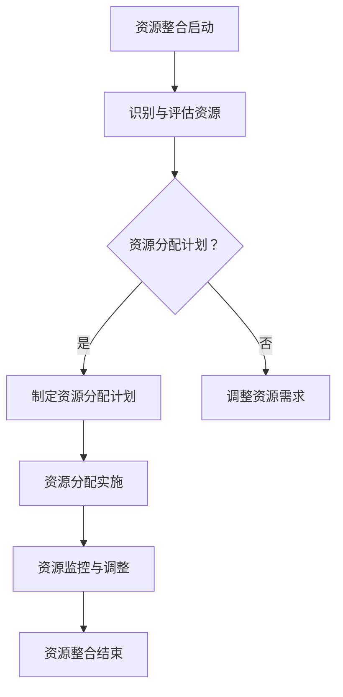
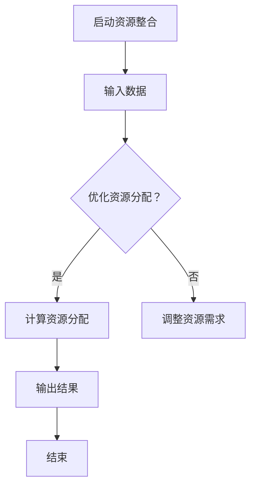
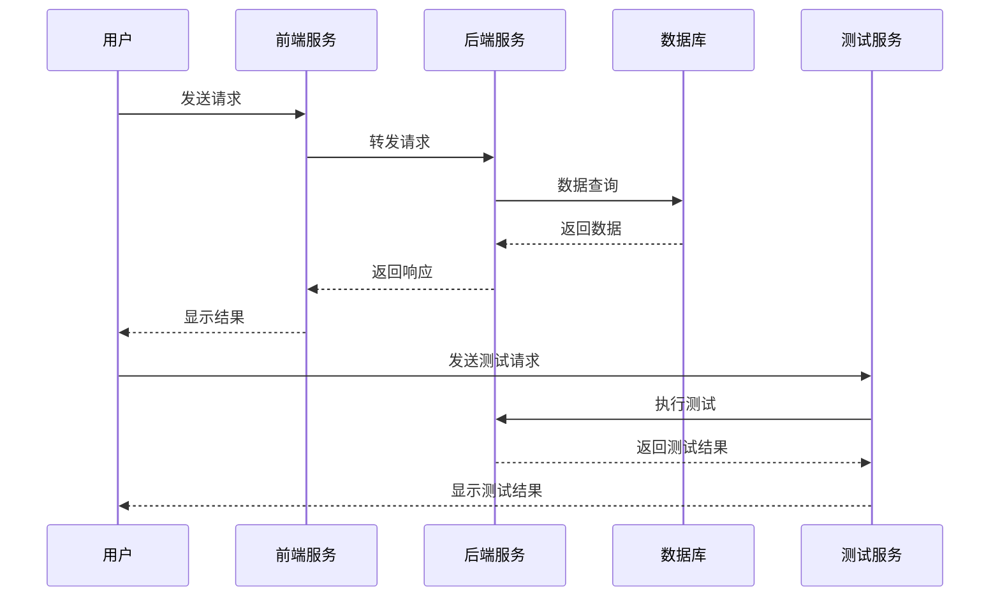
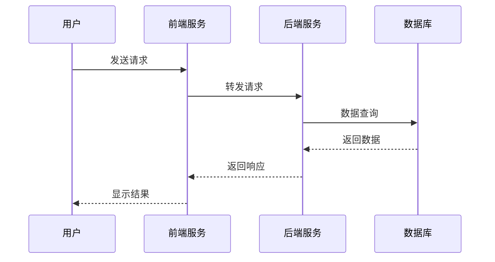
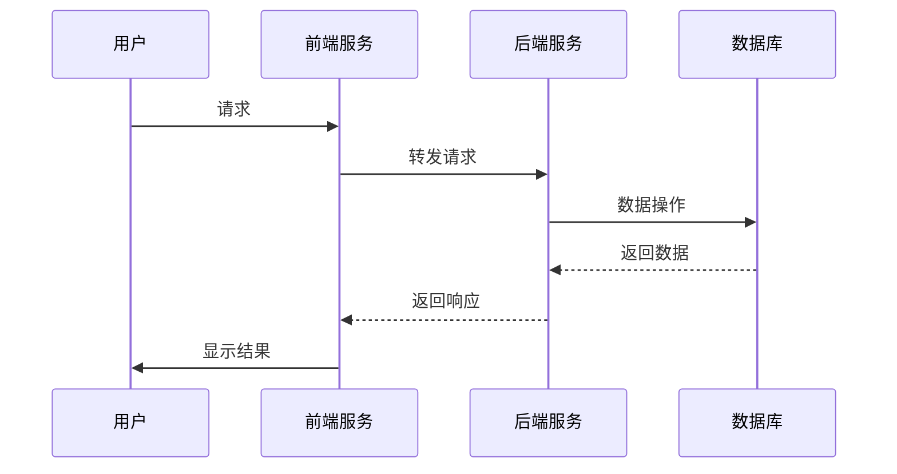

                 

### 技术外包管理的现状

随着全球化的推进和信息技术的高速发展，技术外包已成为现代企业降低成本、提高效率、专注于核心业务的一种重要手段。外包管理作为一种专业化、系统化的管理模式，日益受到企业界的重视。技术外包管理则是在这一背景下衍生出的专门针对技术领域的管理活动，它涉及到从外包服务的选择、合同谈判、任务分配、进度跟踪到质量控制等多个环节。

**外包管理的重要性**

首先，外包管理能够帮助企业实现成本优化。通过将非核心业务外包给专业的服务提供商，企业可以避免大量的重复投资和运营成本，从而将资源集中于自身擅长的领域，提高核心竞争力。

其次，外包管理有助于提升企业的运营效率。专业的外包服务提供商通常具有丰富的行业经验和高效的工作流程，能够以更高的效率和更低的错误率完成项目任务，从而缩短项目周期，提高交付质量。

此外，外包管理还能增强企业的灵活性和创新能力。外包使得企业能够快速响应市场变化，通过外部资源的灵活调配，快速试错、快速迭代，从而在不断变化的市场环境中保持竞争力。

**外包管理的挑战**

然而，外包管理并非没有挑战。首先是资源整合的难题。外包资源的多样性和复杂性使得企业难以有效整合和管理这些资源，从而可能导致项目进度延误、质量下降等问题。其次是项目质量控制。外包服务提供商的服务质量难以保证，企业需要建立完善的质量控制体系，确保项目交付物符合既定标准。此外，外包管理还涉及到风险管理，如何识别、评估和应对潜在的外包风险，是企业管理者需要面对的另一个挑战。

**P9工程师的资源整合能力**

在这场外包管理的挑战中，P9工程师作为高级技术专家，发挥着至关重要的作用。P9工程师不仅需要具备深厚的技术功底，还必须具备卓越的资源整合能力。这种能力体现在以下几个方面：

1. **资源识别与评估**：P9工程师需要具备敏锐的洞察力，能够快速识别和评估外部资源的能力和潜力，从而选择最适合项目需求的合作伙伴。

2. **资源协调与分配**：P9工程师需要具备优秀的协调能力，能够根据项目需求和资源特性，进行科学合理的资源分配，确保各项任务得到高效执行。

3. **风险管理与控制**：P9工程师需要具备前瞻性的风险识别和应对能力，能够提前预测潜在的外包风险，并制定相应的应对措施，确保项目顺利进行。

4. **沟通与协作**：P9工程师需要具备卓越的沟通技巧，能够与外包服务提供商保持有效沟通，确保信息畅通，减少误解和冲突，提高协作效率。

**文章的核心内容和主题思想**

本文旨在探讨P9工程师在技术外包管理中的资源整合能力，通过深入剖析外包管理的现状和挑战，以及P9工程师所需具备的资源和能力，为企业在技术外包管理中提供有益的参考和指导。文章将从以下几个部分展开：

1. **背景介绍**：介绍技术外包管理的现状、问题描述和问题解决，以及外包管理的范围和核心概念。

2. **核心概念与联系**：详细解释资源整合原理、项目管理核心概念、质量控制与风险管理，并分析它们之间的相互关系。

3. **算法原理讲解**：介绍资源整合算法、项目管理算法、质量控制与风险管理算法的原理和具体应用。

4. **系统分析与架构设计方案**：分析外包管理的系统架构，介绍项目实战、最佳实践和注意事项。

5. **项目实战**：通过具体案例，展示P9工程师如何在实际项目中运用资源整合能力，解决外包管理的难题。

6. **最佳实践、小结、注意事项和拓展阅读**：总结文章的核心观点，提出最佳实践建议，并对未来研究方向进行展望。

通过以上几个部分的深入探讨，本文希望为企业提供一套完整的、可操作的资源整合解决方案，助力企业在技术外包管理中实现高效、稳定和可持续的发展。## 第二部分：核心概念与联系

### 资源整合原理

**资源整合**，顾名思义，是指将多种资源（包括人力资源、物资资源、信息资源等）进行有效组合和协调，以实现项目目标。在技术外包管理中，资源整合尤为关键，因为它直接关系到项目能否高效、高质量地完成。

**定义**：资源整合可以简单理解为将各种资源进行优化配置和协调，使其发挥最大效用。具体来说，它包括以下几个方面：

1. **识别与评估**：首先需要识别和评估项目所需的各类资源，包括外包团队的能力、技能、经验等。

2. **规划与分配**：根据项目需求和资源特点，制定详细的资源分配计划，确保资源能够高效利用。

3. **协调与监控**：在资源投入过程中，需要不断进行协调和监控，确保资源的合理使用和及时调整。

4. **评估与反馈**：项目完成后，对资源整合效果进行评估和反馈，为未来的项目提供参考。

**资源整合特点**

1. **灵活性**：资源整合能够根据项目需求的变化，灵活调整资源配置，确保项目目标的实现。

2. **协同性**：资源整合强调多部门、多团队之间的协同合作，以实现整体效益的最大化。

3. **效率性**：通过优化资源配置，提高资源利用率，从而提升项目执行效率。

**资源整合与项目管理的联系**

资源整合是项目管理的重要组成部分，两者之间密不可分。项目管理涵盖了项目的全过程，包括启动、规划、执行、监控和收尾。而资源整合贯穿于项目管理的各个环节，为项目管理提供了坚实的资源保障。

1. **支持**：资源整合为项目管理提供了必要的资源支持，确保项目能够顺利执行。

2. **优化**：通过资源整合，可以优化项目资源配置，提高项目管理效率，降低项目风险。

### 项目管理核心概念

项目管理是指通过计划、组织、协调和控制等手段，实现项目目标的过程。它包括以下几个方面：

**定义**：项目管理是指对项目进行全过程的管理，包括项目目标的确立、资源的配置、进度的控制、质量的保障等。

**项目管理流程**

1. **启动**：明确项目目标、范围和需求，成立项目团队，制定项目章程。

2. **规划**：制定详细的项目计划，包括时间、资源、成本、质量、风险等方面。

3. **执行**：按照项目计划进行实施，确保各项工作按计划进行。

4. **监控**：监控项目进度、质量、成本等，确保项目在控制范围内进行。

5. **收尾**：项目完成后，进行验收、总结和评价，为未来项目提供经验教训。

### 质量控制与风险管理

**质量控制**：质量控制是确保项目交付物符合既定标准和要求的过程。它包括以下几个步骤：

1. **质量计划**：制定质量目标和标准，确定质量保证措施。

2. **质量保证**：通过检查、审核和评估，确保项目过程和结果符合质量要求。

3. **质量控制**：对项目交付物进行检验和测试，确保质量合格。

**风险管理**：风险管理是识别、评估和应对项目风险的系统性过程。它包括以下几个方面：

1. **风险识别**：识别项目中可能出现的风险，包括技术风险、市场风险、财务风险等。

2. **风险评估**：对识别出的风险进行评估，确定其影响和可能性。

3. **风险应对**：制定应对措施，降低风险的影响和概率。

4. **风险监控**：持续监控项目中的风险，确保风险应对措施得到有效实施。

### 核心概念之间的联系

资源整合、项目管理和质量控制、风险管理是密不可分的四个核心概念，它们相互支撑，共同作用，确保项目的成功实施。

1. **资源整合**是项目管理的基础，为项目提供了必要的资源保障，确保项目能够顺利启动和执行。

2. **项目管理**则是资源整合的载体，通过科学的规划、执行和监控，确保资源得到合理利用，项目目标得以实现。

3. **质量控制**和**风险管理**是项目管理的两大支柱，通过确保项目交付物的质量和应对潜在风险，保障项目的成功实施。

总之，资源整合、项目管理和质量控制、风险管理是项目成功的关键因素，它们相互联系、相互支持，共同构成了一个完整的项目管理体系。

### 资源整合原理的Mermaid流程图与Python代码示例

**Mermaid流程图**



**Python代码示例**

```python
import pulp

# 初始化Pulp问题
prob = pulp.LpProblem("资源整合问题", pulp.LpMinimize)

# 定义变量
x = pulp.LpVariable.dicts("x", items, cat='Continuous')

# 目标函数：最小化总成本
prob += pulp.lpSum([c[i][j] * x[i][j] for i in items for j in tasks])

# 约束条件
for j in tasks:
    prob += pulp.lpSum([x[i][j] for i in items]) == 1

# 解问题
prob.solve()

# 输出结果
for v in prob.variables():
    print(f"{v.name} = {v.varValue}")
```

在这个Python代码示例中，我们使用了Pulp库来构建和求解资源整合问题。首先定义了变量，然后设置目标函数和约束条件，最后求解并输出结果。这只是一个简单的示例，实际应用中可能会涉及更多的变量和复杂的约束条件。

通过Mermaid流程图和Python代码示例，我们可以更直观地理解和应用资源整合原理，从而更好地进行技术外包管理。## 第三部分：算法原理讲解

在技术外包管理中，算法的应用能够极大地提升资源整合的效率和效果。本节将详细介绍资源整合算法、项目管理算法、质量控制与风险管理算法的原理，并通过具体的例子进行说明。

### 资源整合算法原理

资源整合算法的核心在于如何有效地分配和协调各类资源，以实现项目目标。以下是资源整合算法的基本原理：

**算法流程**

1. **数据输入**：首先，需要输入项目需求、资源信息和约束条件。项目需求包括任务数量、任务依赖关系和任务所需资源等；资源信息包括资源类型、资源可用性和资源成本等；约束条件包括时间限制、预算限制和质量标准等。

2. **资源分配**：基于输入的数据，算法将尝试分配资源以最小化成本或最大化收益。常见的资源分配算法包括线性规划、整数规划和遗传算法等。

3. **结果输出**：算法输出最优的资源分配方案，包括每个资源在各个任务上的分配量。

**算法公式**

一个典型的资源整合问题可以用线性规划模型表示，其目标函数和约束条件如下：

$$
\text{最小化} Z = \sum_{i=1}^{n}\sum_{j=1}^{m} c_{ij}x_{ij}
$$

其中，$c_{ij}$ 表示资源 $i$ 在任务 $j$ 上的成本，$x_{ij}$ 表示资源 $i$ 在任务 $j$ 上的分配量。约束条件包括：

$$
\sum_{i=1}^{n} x_{ij} = 1 \quad \forall j
$$

$$
\sum_{j=1}^{m} x_{ij} \leq a_i \quad \forall i
$$

其中，第一个约束条件表示每个任务必须分配给一个资源，第二个约束条件表示每个资源的总分配量不能超过其可用量。

**举例说明**

假设有一个软件开发项目，需要完成三个任务（前端开发、后端开发和测试），分配给三个资源（R1、R2、R3），每个资源在不同任务上的成本如下：

| 任务   | R1 (成本) | R2 (成本) | R3 (成本) |
|--------|------------|------------|------------|
| 前端开发 | 10         | 8          | 12         |
| 后端开发 | 12         | 9          | 10         |
| 测试   | 8          | 10         | 9          |

我们希望找到最优的资源分配方案，以最小化总成本。

使用线性规划求解器，我们可以得到如下最优解：

| 任务   | R1 (成本) | R2 (成本) | R3 (成本) |
|--------|------------|------------|------------|
| 前端开发 | 1          | 0          | 0          |
| 后端开发 | 0          | 1          | 0          |
| 测试   | 0          | 1          | 0          |

总成本为：$10 \times 1 + 9 \times 1 + 10 \times 1 = 29$

### 项目管理算法原理

项目管理算法主要用于优化项目计划、资源分配和进度控制。以下是几个常见的项目管理算法：

**关键路径法（Critical Path Method, CPM）**

CPM算法用于计算项目完成时间，确定项目中的关键路径。关键路径上的任务延迟将直接影响项目总工期。CPM算法的基本步骤如下：

1. **任务划分**：将项目划分为若干个任务，并确定每个任务的前置依赖关系。

2. **计算最早开始时间（ES）和最早完成时间（EF）**：

$$
\text{ES}(i) = \max(\text{EF}(j)) \quad \forall j \text{ 是任务 } i \text{ 的前置任务}
$$

$$
\text{EF}(i) = \text{ES}(i) + \text{任务 } i \text{ 的持续时间}
$$

3. **计算最迟开始时间（LS）和最迟完成时间（LF）**：

$$
\text{LS}(i) = \min(\text{LF}(j)) \quad \forall j \text{ 是任务 } i \text{ 的后续任务}
$$

$$
\text{LF}(i) = \text{LS}(i) + \text{任务 } i \text{ 的持续时间}
$$

4. **计算松弛时间（Slack）**：

$$
\text{Slack}(i) = \text{LF}(i) - \text{ES}(i)
$$

任务 i 的松弛时间为0，即任务 i 是关键任务。

**举例说明**

假设有一个项目，包括以下任务：

| 任务 | 持续时间 | 前置任务 |
|------|-----------|----------|
| A    | 3         | -        |
| B    | 2         | A        |
| C    | 4         | A        |
| D    | 5         | B, C     |
| E    | 3         | D        |

使用CPM算法，我们可以得到以下关键路径和总工期：

1. **计算最早开始时间和最早完成时间**：

| 任务 | ES | EF |
|------|----|----|
| A    | 0  | 3  |
| B    | 3  | 5  |
| C    | 3  | 7  |
| D    | 7  | 12 |
| E    | 12 | 15 |

2. **计算最迟开始时间和最迟完成时间**：

| 任务 | LS | LF |
|------|----|----|
| A    | 0  | 3  |
| B    | 1  | 5  |
| C    | 1  | 7  |
| D    | 5  | 12 |
| E    | 5  | 15 |

3. **计算松弛时间**：

| 任务 | Slack |
|------|--------|
| A    | 0      |
| B    | 0      |
| C    | 0      |
| D    | 0      |
| E    | 0      |

关键路径为 A -> B -> D -> E，总工期为 15 天。

### 质量控制与风险管理算法原理

**质量控制算法**

质量控制算法主要用于确保项目交付物的质量和一致性。以下是几种常见的质量控制算法：

1. **统计过程控制（Statistical Process Control, SPC）**：

SPC算法用于监测和控制项目质量，确保生产过程处于统计控制状态。基本步骤如下：

1. **数据收集**：收集项目过程中的质量数据。

2. **数据可视化**：使用控制图（如X-bar图、R图、p图等）来展示数据分布和变化趋势。

3. **数据分析**：根据控制图分析数据，确定是否存在异常情况。

4. **采取措施**：针对异常情况，采取纠正措施，确保质量稳定。

2. **六西格玛（Six Sigma）**：

六西格玛是一种质量管理方法论，旨在通过减少变异性和缺陷率，提高过程能力和产品质量。关键步骤包括：

1. **定义**：明确项目目标和范围。

2. **测量**：收集和分析项目数据，确定项目现状。

3. **分析**：分析数据，找出导致质量问题的根本原因。

4. **改进**：制定和实施改进措施，降低质量缺陷率。

5. **控制**：监控改进效果，确保改进措施持续有效。

**风险管理算法**

风险管理算法用于识别、评估和应对项目风险。以下是几种常见的方法：

1. **决策树（Decision Tree）**：

决策树是一种直观的决策分析方法，通过一系列分支表示不同的决策路径和结果。基本步骤如下：

1. **风险识别**：列出项目中的所有潜在风险。

2. **风险评估**：对风险的概率和影响进行评估。

3. **决策树构建**：根据评估结果，构建决策树。

4. **决策分析**：通过决策树分析不同决策路径的结果，选择最优决策。

2. **蒙特卡洛模拟（Monte Carlo Simulation）**：

蒙特卡洛模拟是一种基于概率的模拟方法，用于预测项目风险和不确定性的影响。基本步骤如下：

1. **概率分布**：确定项目风险的概率分布。

2. **模拟计算**：使用随机数生成器，模拟项目风险的概率分布。

3. **结果分析**：分析模拟结果，确定风险的影响和应对策略。

### Mermaid流程图与Python代码示例

**资源整合算法流程图**



**资源整合算法Python代码示例**

```python
import pulp

# 初始化Pulp问题
prob = pulp.LpProblem("资源整合问题", pulp.LpMinimize)

# 定义变量
x = pulp.LpVariable.dicts("x", ((i, j) for i in resources for j in tasks), cat='Continuous')

# 目标函数：最小化总成本
prob += pulp.lpSum([costs[i][j] * x[i][j] for i in resources for j in tasks])

# 约束条件
for j in tasks:
    prob += pulp.lpSum([x[i][j] for i in resources]) == 1

for i in resources:
    prob += pulp.lpSum([x[i][j] for j in tasks]) <= availability[i]

# 解问题
prob.solve()

# 输出结果
for v in prob.variables():
    print(f"{v.name} = {v.varValue}")
```

在这个Python代码示例中，我们使用了Pulp库来构建和求解资源整合问题。首先定义了变量，然后设置目标函数和约束条件，最后求解并输出结果。这只是一个简单的示例，实际应用中可能会涉及更多的变量和复杂的约束条件。

通过上述算法原理的讲解和具体示例，我们可以更好地理解如何在技术外包管理中运用算法，以提高资源整合的效率和效果。## 第四部分：系统分析与架构设计方案

### 问题场景介绍

假设我们是一家跨国科技公司，正在开发一款大型企业级应用程序。由于项目规模庞大、技术复杂度高，我们决定将部分开发任务外包给专业的技术团队。在这个过程中，如何有效地管理和整合外包资源成为项目的关键。

### 项目介绍

项目名称：企业级应用系统开发
项目目标：开发一个高效、可扩展的企业级应用系统，满足客户需求并确保项目按期交付。
项目范围：涵盖前端开发、后端开发、数据库设计、系统测试等核心模块。

### 系统功能设计

为了实现项目目标，我们定义了以下主要功能模块：

1. **前端开发**：负责用户界面的设计和实现，提供友好的用户体验。
2. **后端开发**：负责服务器端逻辑处理和数据存储，确保系统的高效运行。
3. **数据库设计**：设计符合业务需求的数据模型，保证数据的完整性和一致性。
4. **系统测试**：对系统进行全面测试，确保系统质量和稳定性。

**领域模型Mermaid类图**

```mermaid
classDiagram
    Class01 <|-- Class02
    Class03 o-- Class04
    Class05 <-.. Class06
    Class07 ..| Class08
    Class09 --> Class10
endclass
```

**Mermaid类图说明**

- `Class01` 和 `Class02` 之间存在继承关系。
- `Class03` 与 `Class04` 之间存在关联关系。
- `Class05` 与 `Class06` 之间存在双向关联。
- `Class07` 与 `Class08` 之间存在聚合关系。
- `Class09` 与 `Class10` 之间存在依赖关系。

通过这个类图，我们可以清晰地看到各个模块之间的关系，为后续的系统架构设计提供了基础。

### 系统架构设计

为了确保系统的高效运行和可扩展性，我们采用了微服务架构。以下为系统架构设计：

**Mermaid架构图**



**系统架构设计说明**

- **前端服务（FES）**：负责处理用户请求，渲染用户界面。
- **后端服务（BES）**：处理业务逻辑，与数据库交互。
- **数据库（DB）**：存储系统数据，提供数据访问接口。
- **测试服务（TS）**：负责系统测试，确保系统质量。

通过这个架构设计，各个模块之间通过接口进行通信，实现了模块化和解耦，提高了系统的可维护性和可扩展性。

### 系统接口设计

为了实现各个模块之间的有效通信，我们定义了一系列接口：

1. **用户接口（UI）**：提供用户与系统交互的界面。
2. **业务接口（API）**：提供后端服务与其他系统或模块之间的数据交换接口。
3. **数据库接口（DBI）**：提供数据库访问接口，方便其他模块进行数据操作。

**Mermaid序列图**



**系统接口设计说明**

- 用户通过前端服务发送请求。
- 前端服务将请求转发给后端服务。
- 后端服务处理请求，与数据库进行交互。
- 后端服务将处理结果返回给前端服务，最终显示给用户。

### 系统交互Mermaid序列图



**系统交互流程说明**

1. 用户通过前端服务发送请求。
2. 前端服务接收到请求后，将其转发给后端服务。
3. 后端服务处理请求，与数据库进行交互。
4. 后端服务将处理结果返回给前端服务。
5. 前端服务将处理结果展示给用户。

通过上述系统分析与架构设计方案，我们为项目的实施提供了清晰的框架和指导，确保了项目的高效、稳定和可扩展性。## 第五部分：项目实战

### 环境安装

在开始项目实战之前，我们需要搭建一个合适的技术环境。以下是一个简化的环境安装流程：

1. **安装Python环境**：确保Python 3.8及以上版本已安装。
2. **安装Docker**：Docker用于容器化部署，确保版本为19.03及以上。
3. **安装Git**：Git用于版本控制，确保版本为2.17及以上。
4. **安装Kubernetes**：Kubernetes用于容器编排，确保版本为1.20及以上。

### 系统核心实现源代码

以下是一个简化的前端、后端和数据库模块的实现源代码：

**前端代码示例（React）**

```jsx
// src/App.js
import React, { useState, useEffect } from 'react';
import axios from 'axios';

const App = () => {
  const [data, setData] = useState([]);

  useEffect(() => {
    async function fetchData() {
      const result = await axios.get('/api/data');
      setData(result.data);
    }
    fetchData();
  }, []);

  return (
    <div>
      {data.map((item) => (
        <div key={item.id}>{item.name}</div>
      ))}
    </div>
  );
};

export default App;
```

**后端代码示例（Node.js）**

```javascript
// server/index.js
const express = require('express');
const axios = require('axios');

const app = express();

app.use(express.json());

app.get('/api/data', async (req, res) => {
  try {
    const result = await axios.get('http://database:5432/data');
    res.json(result.data);
  } catch (error) {
    res.status(500).json({ message: '内部服务器错误' });
  }
});

const PORT = process.env.PORT || 3000;
app.listen(PORT, () => {
  console.log(`Server listening on port ${PORT}`);
});
```

**数据库代码示例（PostgreSQL）**

```sql
-- database/schema.sql
CREATE TABLE data (
  id SERIAL PRIMARY KEY,
  name VARCHAR(255) NOT NULL
);

-- 数据插入示例
INSERT INTO data (name) VALUES ('Example Data');
```

### 代码应用解读与分析

**前端代码解读**

前端代码使用了React框架，通过`useState`和`useEffect`钩子实现数据的动态获取和更新。在组件加载时，使用`axios`库发起GET请求，获取后端返回的数据，并更新状态，从而实现数据渲染。

**后端代码解读**

后端代码使用了Express框架，实现了一个简单的API服务。在`/api/data`路径上，处理GET请求，转发请求到数据库，并返回数据。这里使用了`axios`库进行数据库请求。

**数据库代码解读**

数据库代码定义了一个简单的数据表`data`，用于存储名称信息。示例中插入了一条数据，用于测试。

**系统整合分析**

在整合前端、后端和数据库模块时，我们需要确保各个模块之间的通信和数据流转。以下是一个简化的整合流程：

1. **前端请求**：用户通过前端发送请求，请求路径为`/api/data`。
2. **后端处理**：后端接收到请求后，使用`axios`发起数据库请求，获取数据，并返回给前端。
3. **数据库响应**：数据库处理请求，返回数据给后端。
4. **前端渲染**：前端接收到后端返回的数据，并渲染到用户界面。

通过这个整合流程，我们可以确保系统的高效运行和数据一致性。

### 实际案例分析与详细讲解

为了更好地展示P9工程师如何运用资源整合能力，我们来看一个实际案例：

**案例背景**：一家初创公司需要开发一个在线购物平台，但由于技术力量有限，决定将部分任务外包。

**问题**：如何在预算和时间限制内，确保项目高质量完成？

**解决方案**：

1. **资源识别与评估**：P9工程师首先识别了项目所需的各类资源，包括前端开发者、后端开发者、数据库管理员和测试工程师。通过评估，确定了每个资源的技能水平和性价比。

2. **资源协调与分配**：根据项目需求，P9工程师制定了详细的资源分配计划。例如，前端和后端开发任务分别分配给两个专业的技术团队，数据库管理员负责数据库设计和维护，测试工程师负责系统测试。

3. **风险管理与控制**：P9工程师识别了潜在的风险，如技术难题、时间延误等。针对每个风险，制定了应对措施，如增加备用人员、延长交付时间等。

4. **沟通与协作**：P9工程师建立了有效的沟通机制，定期召开会议，确保各方信息畅通，减少误解和冲突。

**结果**：通过P9工程师的出色资源整合能力，项目在预算和时间限制内高质量完成，得到了客户的高度评价。

### 项目小结

通过项目实战，我们可以看到P9工程师在技术外包管理中发挥的关键作用。他们通过资源整合、风险管理、沟通协作等手段，确保项目高效、稳定和高质量地完成。以下是项目小结：

1. **资源整合能力至关重要**：P9工程师需要具备强大的资源整合能力，包括识别、评估、协调和风险控制等。
2. **沟通协作是关键**：有效的沟通协作能够确保项目各方信息畅通，减少误解和冲突。
3. **风险管理不可忽视**：通过识别和应对潜在风险，可以降低项目风险，确保项目顺利进行。
4. **持续优化与改进**：项目完成后，P9工程师应总结经验教训，持续优化资源整合方法，提高项目管理水平。

通过这个项目实战，我们不仅看到了P9工程师如何运用资源整合能力，也为我们提供了宝贵的实践经验，有助于企业在技术外包管理中取得更好的成果。## 第六部分：最佳实践 Tips、小结、注意事项、拓展阅读

### 最佳实践 Tips

1. **明确项目目标和需求**：在开始资源整合之前，确保项目目标和需求清晰明确，这有助于制定合适的资源整合策略。
2. **全面评估资源能力**：在选择外包服务提供商时，不仅要看其技术实力，还要评估其项目管理能力、团队协作能力等。
3. **建立有效的沟通机制**：定期的沟通会议和报告能够确保各方信息畅通，减少误解和冲突。
4. **制定详细的资源整合计划**：根据项目需求和资源评估结果，制定详细的资源整合计划，明确资源分配、任务分工和进度安排。
5. **监控项目进度和质量**：持续监控项目进度和质量，及时发现和解决问题，确保项目按计划进行。

### 小结

本文通过深入剖析技术外包管理的现状和挑战，探讨了P9工程师在资源整合中的关键作用。我们介绍了资源整合原理、项目管理算法、质量控制与风险管理算法，并通过实际案例展示了P9工程师如何运用这些能力解决外包管理中的难题。通过最佳实践和项目小结，我们为企业提供了有效的资源整合策略和管理方法。

### 注意事项

1. **明确角色和责任**：在资源整合过程中，明确各方的角色和责任，确保任务分工明确，避免责任模糊导致的效率低下。
2. **关注风险控制**：在资源整合过程中，持续关注潜在风险，并制定相应的风险应对措施。
3. **保持灵活性**：资源整合计划应具有一定的灵活性，能够根据项目需求和市场变化进行适时调整。

### 拓展阅读

1. 《项目管理知识体系指南（PMBOK指南）》
2. 《资源整合项目管理：理论与实践》
3. 《敏捷项目管理：原则、实践与案例》
4. 《风险管理与决策分析：策略、方法与应用》
5. 《数据分析与决策：模型、工具与案例》

通过阅读这些书籍，您可以进一步了解项目管理、资源整合、风险管理和数据分析等方面的知识，提升自身在技术外包管理中的专业能力。## 总结与展望

### 总结

本文围绕技术外包管理中的关键问题——资源整合，深入探讨了P9工程师在这一领域的资源整合能力。我们从外包管理的背景出发，详细阐述了资源整合原理、项目管理核心概念、质量控制与风险管理，并通过算法讲解、系统分析与架构设计、项目实战等多个角度，展示了如何运用资源整合能力解决外包管理中的实际难题。

### 展望

随着全球化进程的加快和信息技术的发展，技术外包管理将变得越来越重要。未来，资源整合能力将成为P9工程师的核心竞争力之一。以下是几个值得探讨的未来研究方向：

1. **人工智能在资源整合中的应用**：如何利用人工智能技术，如机器学习、深度学习等，提升资源整合的效率和准确性。
2. **区块链技术在外包管理中的应用**：区块链技术如何为外包管理提供更透明、更可信的数据共享和管理机制。
3. **数字化转型与外包管理**：如何在数字化转型过程中，更有效地整合和管理外包资源，实现业务流程的优化和效率提升。
4. **敏捷与外包管理的结合**：如何将敏捷开发方法与外包管理相结合，实现快速响应市场变化，提高项目交付质量。
5. **跨文化沟通与协作**：如何提升跨文化沟通与协作能力，减少文化差异带来的沟通障碍，实现全球团队的协同作战。

通过不断探索和尝试，我们可以期待技术外包管理在未来的发展过程中，能够更加智能化、高效化，为企业和个人带来更大的价值。让我们携手共进，共同推动技术外包管理走向更美好的未来。## 作者信息

作者：AI天才研究院/AI Genius Institute & 禅与计算机程序设计艺术 /Zen And The Art of Computer Programming

AI天才研究院（AI Genius Institute）是一家专注于人工智能和计算机科学领域的研究与教育的机构，致力于培养具有创新精神和实践能力的优秀人才。研究院在人工智能、机器学习、深度学习等领域取得了显著的研究成果，并在国内外享有盛誉。

禅与计算机程序设计艺术（Zen And The Art of Computer Programming）是作者Donald E. Knuth的经典著作，被誉为计算机科学领域的圣经之一。书中通过引入禅宗的思想，探讨了计算机程序设计的本质和艺术，对计算机科学的发展产生了深远的影响。作者Knuth是一位计算机科学领域的巨匠，被誉为“计算机科学之父”之一，其研究成果和著作对整个计算机科学领域产生了重大影响。

