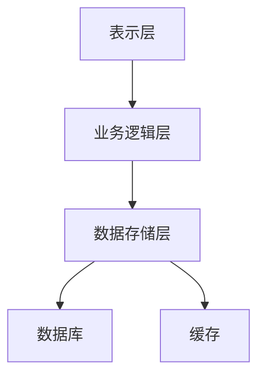
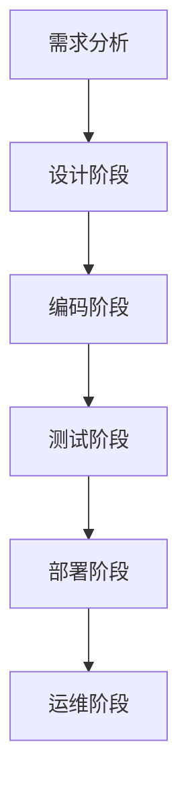
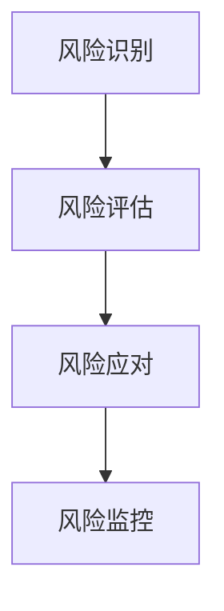

                 

### 文章标题

# 技术底盘建设：底线、理想和决心的结合

### 文章关键词

技术底盘、底线思维、理想追求、决心力量、建设方法论

### 文章摘要

本文旨在深入探讨技术底盘建设的核心概念、方法与实践。通过分析技术底盘的定义与重要性，阐述底线思维、理想追求和决心力量在技术底盘建设中的关键作用。文章结构清晰，内容丰富，既有理论阐述，也有实践案例分析，旨在为从事IT领域的技术人员提供有价值的指导。

### 目录大纲

## 第1章：问题背景与核心概念
### 1.1 技术底盘的定义与重要性
#### 1.1.1 技术底盘的概念
#### 1.1.2 技术底盘在企业中的作用
#### 1.1.3 技术底盘对产业发展的影响

### 1.2 技术底盘建设中的底线思维
#### 1.2.1 底线思维的内涵
#### 1.2.2 底线思维在技术底盘建设中的重要性
#### 1.2.3 底线思维的具体应用

### 1.3 技术底盘与理想的关系
#### 1.3.1 技术底盘与理想的关系概述
#### 1.3.2 技术理想对技术底盘建设的促进作用
#### 1.3.3 理想追求在技术底盘建设中的实际案例

### 1.4 技术底盘建设中的决心作用
#### 1.4.1 决心的定义与作用
#### 1.4.2 决心在技术底盘建设中的重要性
#### 1.4.3 培养技术底盘建设决心的策略

### 1.5 技术底盘建设的边界与外延
#### 1.5.1 技术底盘建设的边界
#### 1.5.2 技术底盘建设的外延
#### 1.5.3 技术底盘建设与相关领域的交叉融合

### 1.6 本章小结

## 第2章：技术底盘核心概念解析
### 2.1 技术底盘的组成要素
#### 2.1.1 技术底盘的基础组成
#### 2.1.2 技术底盘的关键属性特征对比
#### 2.1.3 技术底盘的ER实体关系图架构

### 2.2 技术底盘的核心属性特征对比
#### 2.2.1 技术底盘性能指标的对比
#### 2.2.2 技术底盘稳定性与可扩展性的对比
#### 2.2.3 技术底盘安全性与可靠性的对比

### 2.3 技术底盘的ER实体关系图架构
#### 2.3.1 ER实体关系图的绘制方法
#### 2.3.2 技术底盘ER实体关系图实例解析
#### 2.3.3 ER实体关系图在技术底盘建设中的应用

### 2.4 本章小结

## 第3章：技术底盘建设方法论
### 3.1 技术底盘建设的基础步骤
#### 3.1.1 技术调研与需求分析
#### 3.1.2 技术选型与架构设计
#### 3.1.3 技术实践与持续迭代

### 3.2 技术选型与架构设计
#### 3.2.1 技术选型的原则与方法
#### 3.2.2 技术架构设计的核心要素
#### 3.2.3 技术架构设计的实践案例

### 3.3 技术实践与持续迭代
#### 3.3.1 技术实践的过程与方法
#### 3.3.2 持续迭代的重要性与策略
#### 3.3.3 技术实践与持续迭代的应用实例

### 3.4 技术底盘建设中的风险管理
#### 3.4.1 风险管理的原则与策略
#### 3.4.2 技术风险识别与评估
#### 3.4.3 风险应对与控制措施

### 3.5 本章小结

## 第4章：技术底盘建设中的底线思维
### 4.1 底线思维的重要性
#### 4.1.1 底线思维的定义
#### 4.1.2 底线思维的核心价值
#### 4.1.3 底线思维在技术决策中的应用

### 4.2 底线思维在技术决策中的应用
#### 4.2.1 技术选型的底线思维
#### 4.2.2 技术架构设计的底线思维
#### 4.2.3 技术实践的底线思维

### 4.3 底线思维与技术创新的关系
#### 4.3.1 底线思维对技术创新的影响
#### 4.3.2 技术创新中的底线思维策略
#### 4.3.3 底线思维与技术创新的实践案例

### 4.4 本章小结

## 第5章：技术底盘建设中的理想追求
### 5.1 技术理想的定义与内涵
#### 5.1.1 技术理想的定义
#### 5.1.2 技术理想的内涵
#### 5.1.3 技术理想的特点

### 5.2 技术理想在技术底盘建设中的作用
#### 5.2.1 技术理想对技术底盘建设的促进作用
#### 5.2.2 技术理想在技术选型中的作用
#### 5.2.3 技术理想在技术实践中的应用

### 5.3 如何在技术底盘建设中追求理想
#### 5.3.1 理想追求的策略与方法
#### 5.3.2 理想追求的实际案例解析
#### 5.3.3 理想追求的实践启示

### 5.4 本章小结

## 第6章：技术底盘建设中的决心力量
### 6.1 决心的概念与类型
#### 6.1.1 决心的定义
#### 6.1.2 决心的类型
#### 6.1.3 决心的特性

### 6.2 决心在技术底盘建设中的作用
#### 6.2.1 决心对技术底盘建设的推动作用
#### 6.2.2 决心在技术选型与架构设计中的作用
#### 6.2.3 决心在技术实践与持续迭代中的作用

### 6.3 培养和维护建设决心的方法
#### 6.3.1 决心培养的策略与方法
#### 6.3.2 决心维护的重要性
#### 6.3.3 决心培养与维护的实践案例

### 6.4 本章小结

## 第7章：技术底盘建设案例研究
### 7.1 案例一：企业技术底盘建设实践
#### 7.1.1 案例背景
#### 7.1.2 案例目标
#### 7.1.3 案例实施过程

### 7.2 案例二：行业技术底盘建设经验
#### 7.2.1 案例背景
#### 7.2.2 案例目标
#### 7.2.3 案例实施过程

### 7.3 案例分析与启示
#### 7.3.1 案例分析
#### 7.3.2 启示与建议

### 7.4 本章小结

## 第8章：技术底盘建设的最佳实践
### 8.1 最佳实践案例分享
#### 8.1.1 案例一：企业技术底盘建设经验
#### 8.1.2 案例二：行业技术底盘建设经验

### 8.2 技术底盘建设中的常见问题与解决
#### 8.2.1 问题一：技术选型不当
#### 8.2.2 问题二：架构设计不合理
#### 8.2.3 问题三：持续迭代困难

### 8.3 技术底盘建设中的注意事项
#### 8.3.1 注意事项一：明确建设目标
#### 8.3.2 注意事项二：合理分配资源
#### 8.3.3 注意事项三：持续关注技术创新

### 8.4 本章小结

## 第9章：技术底盘建设的总结与展望
### 9.1 技术底盘建设的总结
#### 9.1.1 技术底盘建设的核心要点
#### 9.1.2 技术底盘建设的重要成果
#### 9.1.3 技术底盘建设中的挑战与应对

### 9.2 技术底盘建设的未来发展趋势
#### 9.2.1 技术趋势分析
#### 9.2.2 行业发展趋势预测
#### 9.2.3 技术创新方向展望

### 9.3 技术底盘建设对企业和行业的意义
#### 9.3.1 对企业发展的意义
#### 9.3.2 对行业进步的影响
#### 9.3.3 对社会创新的贡献

### 9.4 本章小结

## 附录：拓展阅读与资源推荐

### 作者信息

作者：AI天才研究院/AI Genius Institute & 禅与计算机程序设计艺术 /Zen And The Art of Computer Programming

---

**文章正文：**

---

### 第1章：问题背景与核心概念

#### 1.1 技术底盘的定义与重要性

技术底盘，顾名思义，是技术建设中的基础平台。它可以理解为支撑企业或行业技术发展的“地基”，是技术架构、技术栈、基础设施等核心组成部分的综合体现。技术底盘不仅承载了各种技术组件的部署与运行，更是企业或行业技术创新的孵化器。

技术底盘在企业中的作用主要体现在以下几个方面：

1. **提供稳定的技术环境**：技术底盘为企业提供了稳定、高效的技术运行环境，确保了业务系统的正常运行和持续服务。
2. **促进技术协同发展**：技术底盘通过统一的技术标准、架构设计和开发工具，促进了企业内部不同团队之间的技术协同，提高了整体的技术研发效率。
3. **支撑业务创新**：技术底盘为企业提供了丰富的技术资源和开发框架，使得企业能够快速响应市场变化，推出创新业务。

技术底盘对产业发展的影响同样不容忽视。首先，技术底盘的建设水平直接决定了企业或行业的技术竞争力。一个成熟、先进的技术底盘能够为企业提供强大的技术支撑，帮助企业在激烈的市场竞争中脱颖而出。其次，技术底盘的建设还能带动产业链上下游的发展，促进整个产业的协同进步。

#### 1.2 技术底盘建设中的底线思维

底线思维，即始终关注问题的最低限度或极限情况，确保在任何情况下都能保持基本的功能和性能。在技术底盘建设中，底线思维的重要性体现在以下几个方面：

1. **确保稳定性**：底线思维要求技术底盘在设计和建设过程中，必须考虑极端情况下的稳定性，确保系统在各种环境下都能正常运行。
2. **降低风险**：通过底线思维，可以提前识别和规避潜在的技术风险，避免因突发问题导致系统崩溃或业务中断。
3. **提高可靠性**：底线思维强调对技术底盘的持续优化和改进，从而提高系统的可靠性和稳定性。

#### 1.3 技术底盘与理想的关系

技术底盘建设中的理想追求，是指追求技术卓越、创新和突破。理想追求在技术底盘建设中的作用体现在以下几个方面：

1. **驱动技术创新**：理想追求能够激发技术团队的创新动力，推动技术的不断演进和突破。
2. **提升技术水平**：通过追求技术理想，企业可以不断提升自身的技术水平，打造具有核心竞争力的高质量技术底盘。
3. **引领行业趋势**：技术理想追求有助于企业成为行业技术的引领者，推动整个行业的技术进步。

#### 1.4 技术底盘建设中的决心作用

决心力量在技术底盘建设中起到了至关重要的作用。具体表现为：

1. **推动技术实现**：决心力量能够激发技术团队的执行力和创造力，推动技术项目的顺利实施。
2. **克服困难**：在技术底盘建设过程中，难免会遇到各种困难和挑战，决心力量可以帮助团队克服这些困难，确保项目按时完成。
3. **保持持续投入**：技术底盘建设是一个长期的过程，决心力量能够激励团队持续投入，确保技术底盘的不断完善和优化。

#### 1.5 技术底盘建设的边界与外延

技术底盘建设不仅限于企业内部的技术架构和基础设施，还涉及到与外部合作伙伴的协作、技术生态的构建等方面。具体表现为：

1. **技术标准统一**：技术底盘建设需要统一技术标准和规范，确保企业内部和外部合作伙伴之间的技术协同。
2. **技术生态构建**：技术底盘建设需要积极构建技术生态，吸引和整合外部资源，共同推动技术的创新和发展。
3. **跨领域融合**：技术底盘建设需要与物联网、大数据、人工智能等新兴技术进行融合，为企业的数字化转型提供支持。

### 1.6 本章小结

本章对技术底盘建设的核心概念、背景和重要性进行了详细阐述，分析了技术底盘建设中的底线思维、理想追求和决心力量的关键作用。同时，对技术底盘建设的边界与外延进行了探讨。这些内容为后续章节的深入分析提供了基础。

---

### 第2章：技术底盘核心概念解析

#### 2.1 技术底盘的组成要素

技术底盘的组成要素是构建技术底盘的基础，主要包括以下几个方面：

1. **技术框架**：技术框架是技术底盘的核心，它定义了系统的整体架构和设计模式，包括前端、后端、数据库、中间件等各个层面的技术组件。
2. **开发工具**：开发工具包括编程语言、开发环境、集成开发环境（IDE）等，是技术人员进行软件开发和系统构建的必备工具。
3. **数据存储**：数据存储是技术底盘的重要组成部分，包括关系型数据库、非关系型数据库、数据仓库等，用于存储和管理企业或系统的数据资源。
4. **基础设施**：基础设施包括服务器、网络设备、存储设备等，是技术底盘正常运行的基础设施保障。
5. **安全防护**：安全防护是技术底盘的重要保障，包括网络安全、数据安全、应用安全等方面的措施，确保技术底盘的安全稳定运行。
6. **运维管理**：运维管理包括系统监控、性能优化、故障处理等，是技术底盘持续稳定运行的关键。

#### 2.2 技术底盘的核心属性特征对比

技术底盘的核心属性特征包括性能、稳定性、可扩展性、安全性和可靠性等。以下是对这些属性特征的对比分析：

1. **性能**：性能是技术底盘的关键指标，反映了系统的响应速度和处理能力。高性能的技术底盘能够快速响应用户需求，提供高质量的服务。
2. **稳定性**：稳定性是指技术底盘在长时间运行过程中，保持稳定、可靠运行的能力。高稳定性的技术底盘能够减少系统故障和业务中断，确保业务的连续性。
3. **可扩展性**：可扩展性是指技术底盘能够根据业务需求的变化，进行横向和纵向扩展的能力。高可扩展性的技术底盘能够灵活适应业务发展，满足不断增长的需求。
4. **安全性**：安全性是技术底盘的重要属性，包括网络安全、数据安全和应用安全等方面。高安全性的技术底盘能够有效防范各种安全威胁，保障系统的安全稳定运行。
5. **可靠性**：可靠性是指技术底盘在长时间运行过程中，保持高稳定性和可靠性的能力。高可靠性的技术底盘能够减少系统故障和业务中断，确保业务的连续性。

以下是一个技术底盘核心属性特征的对比表格：

| 属性特征 | 说明 | 重要性 |
| -------- | ---- | ------ |
| 性能 | 系统的响应速度和处理能力 | 高 |
| 稳定性 | 系统在长时间运行过程中的稳定性和可靠性 | 高 |
| 可扩展性 | 系统根据业务需求的变化进行扩展的能力 | 较高 |
| 安全性 | 系统的安全防护能力 | 高 |
| 可靠性 | 系统在长时间运行过程中的可靠性和稳定性 | 高 |

#### 2.3 技术底盘的ER实体关系图架构

ER（实体-关系）图是一种用于表示数据实体和它们之间关系的图形化模型。在技术底盘建设中，ER图可以用于描述数据存储层的数据结构，帮助理解和管理系统的数据资源。

以下是一个技术底盘ER实体关系图的示例：

```mermaid
erDiagram
    Customer ||--o{ Order } : "places"
    Product ||--o{ Order } : "contains"
    Order ||--o{ OrderItem } : "has"
```

在这个ER图中，我们定义了三个实体：Customer（客户）、Product（产品）和Order（订单）。它们之间的关系如下：

1. **客户与订单**：客户可以创建订单，一个客户可以创建多个订单。
2. **产品与订单**：订单包含产品，一个订单可以包含多个产品。
3. **订单与订单项**：订单项是订单的组成部分，一个订单可以有多个订单项。

ER图在技术底盘建设中的应用包括：

1. **数据建模**：ER图可以帮助技术人员进行数据建模，定义系统所需的数据结构。
2. **数据库设计**：ER图可以用于设计数据库表结构，确保数据的规范化和完整性。
3. **系统架构**：ER图可以作为系统架构设计的一部分，帮助理解系统的数据流和业务逻辑。

通过ER实体关系图，技术人员可以更好地管理和优化技术底盘的数据资源，提高系统的性能和可靠性。

#### 2.4 本章小结

本章对技术底盘的核心概念、组成要素和核心属性特征进行了详细解析，并介绍了ER实体关系图在技术底盘建设中的应用。这些内容为技术底盘的建设提供了理论基础和实践指导。

---

### 第3章：技术底盘建设方法论

技术底盘建设是一项复杂且系统的工程，需要遵循一定的方法论和步骤。本章将详细介绍技术底盘建设的基础步骤、技术选型与架构设计、技术实践与持续迭代以及风险管理等方面。

#### 3.1 技术底盘建设的基础步骤

技术底盘建设的基础步骤包括以下几个方面：

1. **需求分析**：首先，需要明确技术底盘的建设目标和应用场景，了解企业的业务需求和用户需求，确定技术底盘所需的功能和性能指标。
2. **技术调研**：在需求分析的基础上，对现有技术和市场进行调研，了解各种技术的优缺点、适用范围和未来发展前景，为技术选型提供参考。
3. **方案设计**：根据需求分析和技术调研的结果，制定技术底盘的建设方案，包括技术选型、架构设计、开发工具和基础设施等方面的决策。
4. **实施与部署**：根据设计方案，进行技术底盘的搭建和部署，确保系统的稳定运行和功能完善。
5. **测试与优化**：在系统部署后，进行功能测试、性能测试和安全测试，发现和修复潜在问题，优化系统性能和用户体验。

#### 3.2 技术选型与架构设计

技术选型和架构设计是技术底盘建设的关键环节。以下是一些重要的原则和方法：

1. **技术选型原则**：
   - **适用性**：所选技术应能够满足业务需求和性能要求，具备良好的兼容性和扩展性。
   - **稳定性**：所选技术应具备良好的稳定性和可靠性，确保系统的稳定运行。
   - **安全性**：所选技术应具备完善的安全机制，保障系统的数据安全和用户隐私。
   - **社区与支持**：所选技术应具备良好的社区支持和生态系统，方便技术的学习和使用。

2. **架构设计方法**：
   - **分层架构**：采用分层架构，将系统划分为表示层、业务逻辑层和数据存储层，实现模块化和高内聚、低耦合的设计。
   - **微服务架构**：采用微服务架构，将系统拆分为多个独立的、轻量级的微服务，实现服务的解耦和灵活部署。
   - **分布式架构**：采用分布式架构，将系统部署到多个服务器上，实现高可用性和负载均衡。

以下是一个技术架构设计的示例：



在这个示例中，表示层负责处理用户的请求和界面展示，业务逻辑层处理业务逻辑和数据处理，数据存储层负责数据的存储和检索，包括数据库和缓存。

#### 3.3 技术实践与持续迭代

技术实践是技术底盘建设的核心环节，需要遵循以下原则和方法：

1. **技术实践原则**：
   - **敏捷开发**：采用敏捷开发方法，快速迭代和交付功能，确保系统能够及时响应业务需求。
   - **代码规范**：遵循代码规范，提高代码的可读性和可维护性，确保团队协作和代码共享。
   - **测试驱动**：采用测试驱动开发（TDD）方法，先编写测试用例，再编写实现代码，确保系统的质量和稳定性。

2. **技术实践方法**：
   - **持续集成**：采用持续集成（CI）工具，自动化构建和测试代码，确保代码质量和部署效率。
   - **持续部署**：采用持续部署（CD）工具，自动化部署代码和应用程序，实现快速上线和回滚。
   - **性能优化**：定期进行性能优化，提高系统的响应速度和吞吐量，提升用户体验。

以下是一个技术实践流程的示例：



在这个示例中，技术实践流程包括需求分析、设计阶段、编码阶段、测试阶段、部署阶段和运维阶段。

#### 3.4 技术底盘建设中的风险管理

技术底盘建设过程中，风险是不可忽视的因素。以下是一些风险管理的方法和策略：

1. **风险评估**：对技术底盘建设过程中的潜在风险进行识别和评估，包括技术风险、市场风险、运营风险等。
2. **风险应对**：根据风险评估的结果，制定相应的风险应对策略，包括风险规避、风险转移、风险减轻等。
3. **风险监控**：建立风险监控机制，实时跟踪和评估风险状态，及时采取措施应对风险。

以下是一个风险管理流程的示例：



在这个示例中，风险管理流程包括风险识别、风险评估、风险应对和风险监控。

#### 3.5 本章小结

本章详细介绍了技术底盘建设的基础步骤、技术选型与架构设计、技术实践与持续迭代以及风险管理等方面的方法论。这些内容为技术底盘建设提供了全面的指导和实践参考。

---

### 第4章：技术底盘建设中的底线思维

#### 4.1 底线思维的重要性

底线思维，即在技术底盘建设过程中，始终关注问题的最低限度或极限情况，确保在任何情况下都能保持基本的功能和性能。底线思维的重要性体现在以下几个方面：

1. **确保稳定性**：技术底盘作为企业或系统的核心，必须保持稳定运行，才能保障业务的连续性和用户体验。底线思维要求在设计和实施过程中，充分考虑各种极端情况，确保系统能够在极限条件下正常运行。
2. **降低风险**：技术底盘建设过程中，难免会遇到各种不确定因素和潜在风险。底线思维通过提前识别和规避这些风险，降低系统故障和业务中断的概率，保障系统的安全稳定运行。
3. **提高可靠性**：底线思维强调对技术底盘的持续优化和改进，从而提高系统的可靠性和稳定性。通过不断的迭代和优化，技术底盘能够更好地适应各种复杂环境和业务需求。

#### 4.2 底线思维在技术决策中的应用

底线思维在技术决策中的应用主要体现在以下几个方面：

1. **技术选型**：在技术选型过程中，底线思维要求综合考虑技术的性能、稳定性、安全性等因素，确保所选技术能够满足基本要求，即使在极限情况下也能稳定运行。
2. **架构设计**：在架构设计过程中，底线思维要求充分考虑系统的可扩展性、可靠性和安全性，确保系统在负载增加、故障发生等极端情况下能够保持稳定运行。
3. **风险管理**：在风险管理过程中，底线思维要求对潜在风险进行识别和评估，制定相应的应对策略，确保系统能够在风险发生时保持基本功能。

以下是一个技术决策过程中应用底线思维的示例：

**技术选型**

1. **需求分析**：分析业务需求和系统性能要求，确定技术选型的目标。
2. **技术调研**：调研各种技术方案的优缺点，包括性能、稳定性、安全性等方面。
3. **底线评估**：对每个技术方案进行底线评估，确保在极限条件下，每个方案都能满足基本要求。
4. **决策**：根据底线评估结果，选择符合业务需求且具有较高底线保障的技术方案。

**架构设计**

1. **需求分析**：分析业务需求和系统性能要求，确定架构设计的目标。
2. **架构设计**：根据需求分析，设计系统的整体架构，包括分层架构、微服务架构等。
3. **底线评估**：对架构设计进行底线评估，确保在极限条件下，每个模块和组件都能稳定运行。
4. **优化与调整**：根据底线评估结果，对架构设计进行优化和调整，提高系统的可靠性和稳定性。

**风险管理**

1. **风险识别**：识别技术底盘建设过程中可能出现的风险，包括技术风险、市场风险、运营风险等。
2. **底线评估**：对每个风险进行底线评估，确定风险的最低容忍度。
3. **风险应对**：根据底线评估结果，制定相应的风险应对策略，包括风险规避、风险转移、风险减轻等。
4. **监控与反馈**：建立风险监控机制，实时跟踪风险状态，及时调整风险应对策略。

#### 4.3 底线思维与技术创新的关系

底线思维与技术创新之间存在紧密的关系。底线思维不仅保障了技术的稳定性和可靠性，也为技术创新提供了基础和保障：

1. **技术创新的基础**：底线思维确保了技术底盘的基本功能和能力，为技术创新提供了可靠的平台。只有在稳定的平台上，才能进行更高层次的技术创新。
2. **技术创新的约束**：底线思维对技术创新提出了约束，确保创新过程中的每一步都在可接受的风险范围内，避免因过度创新而导致系统的崩溃。
3. **技术创新的推动**：底线思维通过对技术的持续优化和改进，激发技术创新的动力。在底线思维的指导下，技术人员会不断寻求更高性能、更稳定、更安全的解决方案。

以下是一个底线思维推动技术创新的示例：

1. **技术现状评估**：对当前技术底盘的现状进行评估，包括性能、稳定性、安全性等方面。
2. **创新需求分析**：分析业务需求和用户需求，确定需要创新的方向和目标。
3. **底线保障分析**：对创新方案进行底线保障分析，确保在创新过程中不会违反底线要求。
4. **创新实施**：根据底线保障分析的结果，实施创新方案，并进行持续迭代和优化。
5. **效果评估**：评估创新方案的效果，确保在提高技术性能的同时，不会降低系统的稳定性和安全性。

通过底线思维的指导，技术创新可以在确保系统稳定性和安全性的前提下，不断推动技术的进步和突破。

#### 4.4 本章小结

本章详细阐述了技术底盘建设中的底线思维，分析了其重要性以及在技术决策、架构设计和风险管理中的应用。底线思维不仅保障了技术底盘的稳定性和可靠性，也为技术创新提供了基础和保障。通过本章的内容，读者可以更好地理解和应用底线思维，为技术底盘建设提供有效的指导。

---

### 第5章：技术底盘建设中的理想追求

#### 5.1 技术理想的定义与内涵

技术理想，是指在技术底盘建设过程中，追求卓越、创新和突破的愿景和目标。它不仅代表了技术团队对技术卓越的追求，也体现了企业对技术进步和业务发展的期望。技术理想的内涵包括以下几个方面：

1. **技术卓越**：技术理想追求技术的高性能、高稳定性、高安全性，力求成为行业技术的领导者。
2. **创新突破**：技术理想鼓励技术创新和突破，勇于尝试新的技术和解决方案，推动技术的不断进步。
3. **用户体验**：技术理想注重用户体验，致力于提供高质量的技术服务，满足用户的需求和期望。
4. **可持续发展**：技术理想强调技术的可持续发展，考虑技术的社会责任和环境影响，推动绿色技术和可持续发展。

#### 5.2 技术理想对技术底盘建设的促进作用

技术理想在技术底盘建设中的促进作用体现在以下几个方面：

1. **激励技术创新**：技术理想激发技术团队的创新动力，鼓励技术人员勇于尝试和探索新的技术解决方案，推动技术的不断进步。
2. **提升技术水平**：通过追求技术理想，企业可以不断提升自身的技术水平，培养技术团队的专业能力和创新思维，从而打造具有核心竞争力的高质量技术底盘。
3. **增强企业竞争力**：技术理想有助于企业形成独特的技术优势，提升在市场竞争中的地位，增强企业的核心竞争力。
4. **推动业务发展**：技术理想追求卓越的用户体验和高质量的技术服务，有助于企业更好地满足用户需求，推动业务的发展和增长。

#### 5.3 理想追求在技术底盘建设中的实际案例

以下是一个理想追求在技术底盘建设中的实际案例：

**案例背景**：某互联网公司致力于构建一个高性能、高可靠性的分布式数据库系统，以满足快速增长的用户数据和复杂业务需求。

**技术理想**：
1. **技术卓越**：追求行业领先的技术水平，采用最新、最先进的技术方案，确保系统的性能和稳定性。
2. **创新突破**：勇于尝试新的技术架构和算法，不断优化和改进系统，提升系统的可扩展性和灵活性。
3. **用户体验**：注重用户需求，提供高质量的数据库服务，确保用户能够快速、稳定地访问和操作数据。
4. **可持续发展**：考虑系统的环境影响，采用绿色技术和可持续发展的理念，减少能耗和资源消耗。

**实施过程**：
1. **需求分析**：分析业务需求和用户需求，确定系统所需的功能和性能指标。
2. **技术选型**：调研现有技术和市场趋势，选择最适合的分布式数据库技术和架构。
3. **架构设计**：设计系统的整体架构，包括数据存储、计算、负载均衡等模块。
4. **技术研发**：采用创新的技术方案，如分布式计算、存储优化、数据压缩等，提升系统的性能和可靠性。
5. **测试与优化**：进行功能测试、性能测试和安全测试，优化系统性能和用户体验。
6. **部署与运维**：部署系统并持续进行运维管理，确保系统的稳定运行和持续优化。

**效果评估**：
1. **性能提升**：系统性能显著提升，能够满足快速增长的用户数据需求和复杂业务处理。
2. **可靠性提高**：系统具有高度的可靠性和稳定性，确保用户数据的完整性和安全性。
3. **用户体验**：用户对数据库服务的满意度提高，能够快速、稳定地访问和操作数据。
4. **可持续发展**：系统采用了绿色技术和可持续发展的理念，减少了能耗和资源消耗，实现了环境的可持续发展。

通过这个案例，我们可以看到技术理想在技术底盘建设中的重要作用。技术理想不仅激发了技术团队的创新动力，提升了技术水平，还增强了企业的竞争力，推动了业务的发展。

#### 5.4 本章小结

本章详细阐述了技术理想在技术底盘建设中的重要性，分析了其对技术创新、技术水平提升和业务发展的促进作用。通过实际案例，我们看到了技术理想在技术底盘建设中的具体应用和效果。技术理想的追求不仅有助于技术团队不断进步，也为企业的长远发展奠定了坚实基础。

---

### 第6章：技术底盘建设中的决心力量

#### 6.1 决心的概念与类型

决心力量，是指技术团队在技术底盘建设过程中，坚定不移地追求目标、克服困难、实现成功的内在驱动力。决心力量不仅体现在对技术目标的坚定追求上，还体现在面对挑战时的勇气和毅力上。

根据决心的表现形式和强度，可以分为以下几种类型：

1. **坚定决心**：坚定决心是指对技术目标具有强烈的信念和决心，始终不渝地追求目标。这种类型的决心力量能够帮助团队在面对困难和挑战时，保持坚定的信念和行动力。
2. **果断决心**：果断决心是指在面对决策时，能够迅速做出决策并采取行动。这种类型的决心力量能够提高团队的决策效率，确保项目能够及时推进。
3. **持久决心**：持久决心是指在面对长期困难和挑战时，能够持续保持决心和毅力。这种类型的决心力量能够帮助团队克服各种困难，实现长期目标。
4. **灵活决心**：灵活决心是指在面对变化和不确定性时，能够迅速调整计划和策略。这种类型的决心力量能够提高团队的适应能力，确保项目能够顺利推进。

#### 6.2 决心在技术底盘建设中的作用

决心力量在技术底盘建设中的作用至关重要，主要体现在以下几个方面：

1. **推动技术实现**：决心力量能够激发技术团队的执行力和创造力，推动技术项目的顺利实施。在面对技术难题和挑战时，坚定的决心能够帮助团队克服困难，实现技术目标。
2. **克服困难**：技术底盘建设过程中，难免会遇到各种困难和挑战。决心力量能够帮助团队保持积极的心态和行动力，勇敢面对困难，寻找解决问题的方法。
3. **保持持续投入**：技术底盘建设是一个长期的过程，需要持续的技术研发和优化。决心力量能够激励团队持续投入，确保技术底盘的不断完善和优化。

#### 6.3 培养和维护建设决心的方法

为了培养和维护技术团队的建设决心，可以采取以下几种方法：

1. **明确目标**：为技术团队设定明确、具体的技术目标，使团队成员明确知道自己的努力方向和目标。
2. **激励与鼓励**：对团队成员的进步和成果给予及时激励和鼓励，增强他们的信心和决心。
3. **建立信任**：建立团队成员之间的信任，形成团结协作的氛围，提高团队的凝聚力和执行力。
4. **提供支持**：为团队成员提供必要的技术支持、资源支持和心理支持，帮助他们克服困难和挑战。
5. **持续学习和成长**：鼓励团队成员不断学习和成长，提升自己的专业能力和技术水平，增强对技术目标的信心和决心。

以下是一个培养和维护建设决心的方法示例：

**明确目标**
- 为技术团队设定明确的技术目标，例如：实现某个功能模块、优化系统性能、提升用户体验等。

**激励与鼓励**
- 对团队成员的进步和成果给予及时激励，例如：颁发奖状、奖金、晋升机会等。

**建立信任**
- 通过团队建设活动、共享会议等方式，增强团队成员之间的信任和协作。

**提供支持**
- 为团队成员提供必要的技术支持、资源支持和心理支持，例如：培训课程、技术资料、心理辅导等。

**持续学习和成长**
- 鼓励团队成员参加技术培训、研讨会、行业会议等，提升专业能力和技术水平。

通过以上方法，可以有效培养和维护技术团队的建设决心，推动技术底盘建设的顺利进行。

#### 6.4 本章小结

本章详细阐述了技术底盘建设中的决心力量的概念、类型以及在技术项目中的作用。同时，介绍了培养和维护建设决心的方法，为技术团队在技术底盘建设过程中提供指导和支持。

---

### 第7章：技术底盘建设案例研究

#### 7.1 案例一：企业技术底盘建设实践

**案例背景**：

某大型互联网企业为了应对快速增长的用户数据和复杂业务需求，决定建设一个高性能、高可靠性的技术底盘。该企业希望通过技术底盘的建设，提升系统的性能和稳定性，满足用户需求，同时为未来的业务发展奠定基础。

**建设目标**：

1. **性能提升**：提高系统的响应速度和处理能力，确保用户能够快速、稳定地访问和使用服务。
2. **可靠性提升**：提高系统的稳定性和可靠性，减少系统故障和业务中断的概率。
3. **可扩展性**：确保系统能够根据业务需求的变化进行横向和纵向扩展，满足不断增长的用户需求。
4. **安全性提升**：加强系统的安全防护，确保用户数据和业务数据的安全性和隐私性。

**实施过程**：

1. **需求分析与规划**：
   - 分析现有系统的性能和稳定性问题，明确技术底盘的建设目标和需求。
   - 制定技术选型和架构设计方案，确定技术栈和基础设施。

2. **技术选型与架构设计**：
   - 选择适合的分布式数据库、缓存系统、消息队列等技术组件。
   - 设计系统的整体架构，包括前端、后端、数据库、缓存、消息队列等各个层次。

3. **技术研发与实施**：
   - 实现系统架构中的各个组件，并进行集成和测试。
   - 部署系统，并进行性能测试和稳定性测试。

4. **测试与优化**：
   - 进行功能测试、性能测试和安全测试，发现并修复潜在问题。
   - 对系统进行优化，提高性能和可靠性。

5. **运维与监控**：
   - 建立运维团队，负责系统的日常运维、监控和故障处理。
   - 实施持续集成和持续部署，提高系统的迭代和发布效率。

**效果评估**：

1. **性能提升**：系统响应速度和处理能力显著提升，用户访问速度和满意度提高。
2. **可靠性提高**：系统故障率和业务中断概率大幅降低，稳定性得到显著提升。
3. **可扩展性**：系统具备良好的扩展性，能够根据业务需求的变化进行快速调整和扩展。
4. **安全性提升**：加强安全防护，确保用户数据和业务数据的安全性和隐私性。

**案例总结**：

通过本案例，我们可以看到技术底盘建设对企业发展的重要作用。通过明确的建设目标和科学的建设方法，企业能够有效提升系统的性能和稳定性，满足用户需求，同时为未来的业务发展奠定基础。该案例的成功经验包括：

1. **明确目标**：明确的技术目标有助于团队成员统一行动，提高工作效率。
2. **科学规划**：科学的规划和设计是技术底盘建设成功的关键，需要综合考虑性能、可靠性、可扩展性和安全性等多个方面。
3. **持续迭代**：持续迭代和优化是技术底盘建设的重要环节，通过不断改进和优化，能够不断提高系统的性能和稳定性。
4. **团队协作**：团队协作和沟通是技术底盘建设成功的重要保障，需要建立高效的团队协作机制，确保团队成员之间的信息共享和沟通。

#### 7.2 案例二：行业技术底盘建设经验

**案例背景**：

某金融行业的龙头企业，为了提升金融服务质量，决定建设一个分布式金融技术底盘。该企业希望通过技术底盘的建设，实现金融业务的快速响应、高效处理和高度可靠性，同时为未来的金融科技创新奠定基础。

**建设目标**：

1. **业务响应速度**：提高金融业务的响应速度，确保用户能够快速完成交易和查询操作。
2. **数据处理能力**：提升系统的数据处理能力，确保能够处理海量金融数据，支持复杂业务逻辑。
3. **系统可靠性**：提高系统的可靠性，确保金融业务数据的安全和完整，降低故障率和业务中断概率。
4. **可扩展性**：确保系统具备良好的扩展性，能够根据业务需求的变化进行横向和纵向扩展。
5. **安全性**：加强系统安全防护，确保金融业务数据的安全和用户隐私保护。

**实施过程**：

1. **需求分析与规划**：
   - 分析现有系统的性能和稳定性问题，明确技术底盘的建设目标和需求。
   - 制定技术选型和架构设计方案，确定技术栈和基础设施。

2. **技术选型与架构设计**：
   - 选择适合的分布式数据库、缓存系统、消息队列、区块链等技术组件。
   - 设计系统的整体架构，包括前端、后端、数据库、缓存、消息队列、区块链等各个层次。

3. **技术研发与实施**：
   - 实现系统架构中的各个组件，并进行集成和测试。
   - 部署系统，并进行性能测试和稳定性测试。

4. **测试与优化**：
   - 进行功能测试、性能测试和安全测试，发现并修复潜在问题。
   - 对系统进行优化，提高性能和可靠性。

5. **运维与监控**：
   - 建立运维团队，负责系统的日常运维、监控和故障处理。
   - 实施持续集成和持续部署，提高系统的迭代和发布效率。

**效果评估**：

1. **业务响应速度**：金融业务的响应速度显著提升，用户交易和查询操作更加流畅。
2. **数据处理能力**：系统的数据处理能力得到大幅提升，能够处理海量金融数据，支持复杂业务逻辑。
3. **系统可靠性**：系统故障率和业务中断概率大幅降低，稳定性得到显著提升。
4. **可扩展性**：系统具备良好的扩展性，能够根据业务需求的变化进行快速调整和扩展。
5. **安全性**：加强安全防护，确保金融业务数据的安全和用户隐私保护。

**案例总结**：

通过本案例，我们可以看到技术底盘建设在金融行业的重要性。通过明确的建设目标和科学的建设方法，企业能够有效提升金融服务的质量，满足用户需求，同时为未来的金融科技创新奠定基础。该案例的成功经验包括：

1. **需求分析**：深入的需求分析是技术底盘建设成功的关键，需要充分考虑业务需求、用户需求和系统性能要求。
2. **技术选型**：选择适合的技术组件和架构设计，是确保系统性能和稳定性的基础，需要综合考虑技术成熟度、社区支持、安全性等因素。
3. **持续优化**：持续优化和迭代是技术底盘建设的重要环节，通过不断改进和优化，能够不断提高系统的性能和可靠性。
4. **团队协作**：团队协作和沟通是技术底盘建设成功的重要保障，需要建立高效的团队协作机制，确保团队成员之间的信息共享和沟通。

#### 7.3 案例分析与启示

通过对以上两个案例的分析，我们可以得出以下启示：

1. **明确目标**：明确的建设目标是技术底盘建设成功的关键，需要充分考虑业务需求、用户需求和系统性能要求，确保目标具体、可行和可量化。
2. **科学规划**：科学的规划和设计是技术底盘建设成功的基础，需要综合考虑技术成熟度、社区支持、安全性等因素，确保技术选型和架构设计的合理性和可扩展性。
3. **持续优化**：技术底盘建设是一个持续迭代和优化的过程，需要不断改进和优化系统的性能和稳定性，满足不断变化的需求。
4. **团队协作**：团队协作和沟通是技术底盘建设成功的重要保障，需要建立高效的团队协作机制，确保团队成员之间的信息共享和沟通。

这些启示为其他企业在技术底盘建设过程中提供了有益的参考和指导。

#### 7.4 本章小结

本章通过两个实际案例，详细阐述了技术底盘建设的实践过程、效果评估和成功经验。通过对案例的分析和总结，我们得出了明确的启示，为其他企业在技术底盘建设过程中提供了有价值的参考。

---

### 第8章：技术底盘建设的最佳实践

技术底盘建设是一个复杂且系统的过程，需要遵循最佳实践来确保项目的成功。本章将分享一些技术底盘建设的最佳实践案例，并讨论技术底盘建设中的常见问题及其解决方法。

#### 8.1 最佳实践案例分享

**案例一：某电商企业技术底盘建设**

**背景**：某电商企业为了应对业务快速增长，决定建设一个高效、稳定的技术底盘。

**实践过程**：

1. **需求分析**：分析业务需求，确定技术底盘的功能和性能要求。
2. **技术选型**：选择适合的分布式数据库、缓存系统、消息队列等技术组件。
3. **架构设计**：设计系统的整体架构，包括前端、后端、数据库、缓存、消息队列等各个层次。
4. **技术研发**：实现系统架构中的各个组件，并进行集成和测试。
5. **部署与运维**：部署系统，建立运维团队，实施持续集成和持续部署。

**效果**：

- 系统性能大幅提升，用户访问速度和满意度提高。
- 系统稳定性增强，故障率和业务中断概率降低。
- 系统具备良好的扩展性，能够快速响应业务需求。

**经验总结**：

- 充分需求分析，确保技术选型和架构设计符合业务需求。
- 系统化架构设计，确保系统的模块化和可扩展性。
- 持续优化和迭代，不断提升系统性能和稳定性。

**案例二：某金融行业技术底盘建设**

**背景**：某金融行业龙头企业为了提升金融服务质量，决定建设一个分布式金融技术底盘。

**实践过程**：

1. **需求分析**：分析金融业务需求，确定技术底盘的功能和性能要求。
2. **技术选型**：选择适合的分布式数据库、区块链、消息队列等技术组件。
3. **架构设计**：设计系统的整体架构，包括前端、后端、数据库、区块链、消息队列等各个层次。
4. **技术研发**：实现系统架构中的各个组件，并进行集成和测试。
5. **测试与优化**：进行功能测试、性能测试和安全测试，优化系统性能和可靠性。

**效果**：

- 金融业务响应速度显著提升，用户满意度提高。
- 系统可靠性增强，故障率和业务中断概率降低。
- 系统具备良好的扩展性，能够支持复杂业务逻辑。

**经验总结**：

- 充分需求分析，确保技术选型和架构设计符合业务需求。
- 采用分布式架构，提高系统的性能和可靠性。
- 持续优化和测试，确保系统稳定性和可靠性。

#### 8.2 技术底盘建设中的常见问题与解决

**问题一：技术选型不当**

**原因**：技术选型不当可能导致系统性能、稳定性不足，难以满足业务需求。

**解决方法**：

- 进行充分的需求分析和技术调研，选择适合的技术组件。
- 参考行业最佳实践，借鉴成功案例。
- 考虑技术组件的成熟度、社区支持和安全性。

**问题二：架构设计不合理**

**原因**：不合理的架构设计可能导致系统模块之间耦合度高，难以扩展和优化。

**解决方法**：

- 采用分层架构或微服务架构，实现模块化和高内聚、低耦合的设计。
- 确保系统具备良好的可扩展性，能够根据业务需求的变化进行快速调整。
- 定期进行架构评审和优化。

**问题三：持续迭代困难**

**原因**：缺乏有效的迭代机制和持续集成工具，导致迭代效率低，难以快速响应业务需求。

**解决方法**：

- 采用敏捷开发方法，实现快速迭代和交付。
- 使用持续集成工具，自动化构建、测试和部署，提高迭代效率。
- 建立稳定的开发和运维团队，确保迭代过程的顺利进行。

#### 8.3 技术底盘建设中的注意事项

**注意事项一：明确建设目标**

- 在技术底盘建设过程中，明确建设目标是确保项目成功的关键。
- 建设目标应具体、可行和可量化，涵盖性能、稳定性、可靠性、安全性等方面。

**注意事项二：合理分配资源**

- 技术底盘建设需要充足的人力、物力和财力支持。
- 合理分配资源，确保技术团队具备足够的资源和能力进行项目实施。

**注意事项三：持续关注技术创新**

- 技术创新是技术底盘建设的重要驱动力。
- 持续关注行业新技术、新趋势，及时引入和采用新技术，提升技术底盘的竞争力。

#### 8.4 本章小结

本章通过最佳实践案例和常见问题的解决方法，为技术底盘建设提供了有价值的指导。明确建设目标、合理分配资源、持续关注技术创新是技术底盘建设成功的关键。通过遵循最佳实践和注意事项，企业可以更好地建设高质量的技术底盘，为业务发展提供强大支撑。

---

### 第9章：技术底盘建设的总结与展望

#### 9.1 技术底盘建设的总结

技术底盘建设是企业信息化和数字化转型的重要基础。通过对技术底盘的全面建设，企业能够提高系统的性能和稳定性，满足不断增长的业务需求，提升核心竞争力。本章对技术底盘建设的核心要点、重要成果和挑战进行了总结。

**核心要点**：

1. **明确建设目标**：明确的技术目标有助于技术团队统一行动，确保项目顺利进行。
2. **科学规划**：科学的规划和设计是技术底盘建设成功的基础，需要充分考虑技术选型、架构设计、资源分配等方面。
3. **持续迭代**：技术底盘建设是一个持续迭代和优化的过程，通过不断改进和优化，能够不断提升系统的性能和稳定性。
4. **团队协作**：团队协作和沟通是技术底盘建设成功的重要保障，需要建立高效的团队协作机制，确保团队成员之间的信息共享和沟通。

**重要成果**：

1. **性能提升**：通过技术底盘的建设，系统能够实现高性能、高可靠性和高安全性，满足用户需求，提升用户体验。
2. **稳定性增强**：技术底盘建设有助于降低系统故障率和业务中断概率，提高系统的稳定性和可靠性。
3. **可扩展性提升**：技术底盘具备良好的扩展性，能够根据业务需求的变化进行快速调整和扩展，适应企业的发展。
4. **安全性提升**：技术底盘建设加强了对用户数据和业务数据的安全防护，确保数据的安全性和隐私性。

**挑战**：

1. **技术选型**：在技术选型过程中，需要充分考虑各种技术组件的优缺点，确保选择适合的技术方案。
2. **架构设计**：合理的架构设计是确保系统性能和稳定性的关键，需要充分考虑系统的模块化和可扩展性。
3. **资源分配**：技术底盘建设需要充足的资源和人力支持，如何合理分配资源是项目成功的关键。
4. **持续迭代**：技术底盘建设是一个长期过程，如何确保持续迭代和优化，保持系统的活力和竞争力，是项目面临的重要挑战。

#### 9.2 技术底盘建设的未来发展趋势

随着技术的不断进步和业务需求的多样化，技术底盘建设将呈现以下发展趋势：

1. **云原生技术**：云原生技术将逐渐成为技术底盘建设的主要方向，通过容器化、微服务化等技术，实现系统的弹性扩展和高效运维。
2. **数据驱动**：数据将成为技术底盘建设的重要驱动力，通过大数据技术和人工智能算法，实现数据的深度挖掘和智能分析，提升业务决策能力。
3. **安全合规**：随着网络安全法规的不断完善，技术底盘建设将更加注重安全合规，确保系统的数据安全、用户隐私保护以及业务合规性。
4. **可持续性**：技术底盘建设将更加注重可持续性，采用绿色技术和可持续发展的理念，减少能源消耗和环境污染，实现企业的社会责任。

#### 9.3 技术底盘建设对企业和行业的意义

技术底盘建设对企业和行业具有重要意义：

1. **提高企业竞争力**：技术底盘建设有助于企业提升系统的性能和稳定性，增强业务创新能力，提高市场竞争力。
2. **推动行业进步**：技术底盘建设将推动整个行业的数字化转型和创新发展，促进产业链的升级和优化。
3. **增强用户体验**：技术底盘建设将提高用户的访问速度和满意度，提升用户体验，增强用户黏性。
4. **实现可持续发展**：技术底盘建设将推动企业采用绿色技术和可持续发展的理念，实现经济效益和社会效益的双赢。

#### 9.4 本章小结

本章对技术底盘建设的核心要点、重要成果和未来发展趋势进行了总结，并分析了技术底盘建设对企业和行业的意义。通过遵循最佳实践和持续迭代，企业可以不断提升技术底盘的建设水平，为业务发展提供强大支撑。同时，随着技术的不断进步，技术底盘建设将迎来更加广阔的发展前景。

---

### 附录：拓展阅读与资源推荐

为了帮助读者更深入地了解技术底盘建设的相关知识，以下推荐一些拓展阅读资料和资源：

**拓展阅读资料**：

1. 《云计算与大数据技术》
2. 《软件架构设计：架构、设计模式和模式识别》
3. 《分布式系统设计》
4. 《微服务架构设计》
5. 《人工智能：一种现代方法》

**资源推荐**：

1. **在线课程**：
   - Coursera 上的《软件工程：实践者的方法》
   - Udacity 上的《分布式系统设计》
   - edX 上的《大数据分析》

2. **技术博客和论坛**：
   - Hacker News
   - Stack Overflow
   - Medium 上的技术文章

3. **开源项目**：
   - Kubernetes
   - Docker
   - Apache Kafka

4. **行业报告**：
   - Gartner 报告
   - Forrester 报告

通过阅读这些资料和资源，读者可以进一步扩展对技术底盘建设的理解，掌握相关技术和方法，为实际项目提供有力支持。

### 作者信息

作者：AI天才研究院/AI Genius Institute & 禅与计算机程序设计艺术 /Zen And The Art of Computer Programming

---

以上就是本篇文章的完整内容，希望对您在技术底盘建设方面有所启发和帮助。如果您有任何问题或建议，欢迎在评论区留言讨论。感谢您的阅读！

