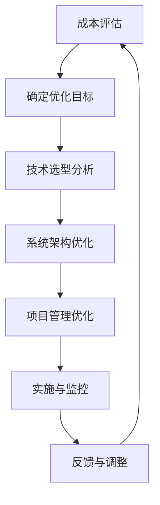

                 

## 第1章 引言

### 1.1 成本优化的背景与意义

在当前快速发展的信息技术时代，企业的竞争力很大程度上取决于技术成本的控制和优化。技术成本优化作为一个关键的战略性概念，日益受到企业的重视。其背景源于全球化的市场竞争加剧，企业需要不断降低成本以保持竞争优势。此外，技术成本的优化不仅能够提升企业的盈利能力，还能够增强企业的创新能力和可持续发展能力。

#### 技术成本优化是什么？

技术成本优化是指通过科学的分析和合理的规划，降低企业在技术研发、系统维护、硬件采购等方面的成本，同时保持或提高产品或服务的质量和性能。这一过程涉及多个环节，包括技术选型、系统架构设计、项目管理等。

#### 技术成本优化的重要性

技术成本优化对于企业的重要性体现在以下几个方面：

1. **提升盈利能力**：通过降低成本，企业可以获得更高的利润率，从而在激烈的市场竞争中占据有利地位。
2. **增强创新能力**：技术成本的优化可以释放出更多的资源，用于技术研发和创新，推动企业的技术进步。
3. **提高市场响应速度**：技术成本优化有助于提高系统的维护效率，缩短产品的上市时间，增强企业对市场变化和客户需求的响应能力。

### 1.2 P9工程师的角色与效益思维

P9工程师在企业中通常担任高级技术专家或技术领导者的角色。他们不仅需要具备深厚的技术知识，还需要具备良好的战略规划能力和团队管理能力。效益思维是P9工程师的一项重要素质，它强调在决策过程中要充分考虑资源的使用效率和效益最大化。

#### 效益思维的定义与原理

效益思维是一种以经济效益为核心的管理理念，其核心是“以最小的投入获得最大的产出”。具体来说，效益思维包括以下几个方面：

1. **成本效益分析**：在项目决策和规划阶段，进行全面的成本效益分析，确保项目的经济效益。
2. **资源配置优化**：合理分配资源，确保资源的有效利用，避免浪费。
3. **风险控制**：在项目实施过程中，通过风险管理措施降低潜在风险，确保项目的顺利进行。

### 1.3 技术成本优化与效益思维的联系

技术成本优化与效益思维密切相关。效益思维为技术成本优化提供了理论基础和指导原则，而技术成本优化则是效益思维在实践中的具体体现。P9工程师通过运用效益思维，可以更有效地进行技术成本优化，从而提升企业的整体效益。

#### 技术成本优化的原则与方法

技术成本优化的原则主要包括：

1. **以客户需求为导向**：确保技术方案能够满足客户需求，避免过度设计。
2. **全过程控制**：从项目规划、执行到验收，全过程进行成本控制。
3. **持续改进**：通过定期评估和反馈，不断优化技术方案和成本控制措施。

技术成本优化的方法包括：

1. **技术选型优化**：选择最适合项目需求的技术方案，避免技术过剩或不足。
2. **系统架构优化**：通过改进系统架构，提高系统的性能和稳定性，降低维护成本。
3. **项目管理优化**：运用项目管理工具和方法，提高项目执行效率和成本控制能力。

### 1.4 书籍结构概述

本书将系统地介绍技术成本优化的概念、原理、方法和实践，旨在帮助P9工程师及其他技术领导者掌握这一重要技能。本书分为八个章节：

- 第1章：引言，介绍成本优化的背景与意义，P9工程师的角色与效益思维。
- 第2章：核心概念与原理，详细解析技术成本优化和效益思维。
- 第3章：成本控制与分析，介绍成本控制的方法与工具。
- 第4章：技术选型与优化，讨论技术选型的重要性和优化策略。
- 第5章：系统架构优化，阐述系统架构优化的重要性和方法。
- 第6章：项目管理与协同，介绍项目管理在成本优化中的作用。
- 第7章：成本优化与效益评估，讨论效益评估的方法和指标。
- 第8章：持续改进与未来趋势，展望成本优化技术的发展方向。

通过本书的学习，读者将能够全面了解技术成本优化的理论和实践，掌握有效的成本优化方法，提升企业的竞争力。接下来，我们将深入探讨技术成本优化的核心概念和原理。敬请期待！

## 第2章 核心概念与原理

### 2.1 技术成本优化的定义

技术成本优化是指通过对技术项目、系统架构、资源利用等方面的综合分析和优化，以最小化成本投入，实现最大化效益的过程。其定义涵盖了以下几个方面：

1. **成本构成**：技术成本包括研发成本、维护成本、硬件成本等。
2. **优化目标**：通过技术手段和管理策略，降低成本、提高效率。
3. **优化范围**：涉及技术选型、系统架构、项目管理等各个环节。

### 2.2 效益思维的定义与原理

效益思维是一种以经济效益为核心的管理理念，强调在决策过程中充分考虑投入与产出的关系，追求以最小的投入获得最大的产出。效益思维的原理主要包括：

1. **成本效益分析**：通过评估不同方案的成本和效益，选择最优方案。
2. **资源配置优化**：合理分配资源，提高资源利用率，降低成本。
3. **风险控制**：识别和评估潜在风险，采取有效的风险控制措施。

### 2.3 技术成本优化与效益思维的联系

技术成本优化与效益思维密切相关，两者相互促进，共同作用：

1. **效益思维指导技术成本优化**：效益思维提供了技术成本优化的理论基础和决策依据。
2. **技术成本优化实现效益思维**：通过技术成本优化，企业可以实现资源的高效利用，提高经济效益。

具体来说，技术成本优化与效益思维的联系体现在以下几个方面：

- **成本控制**：效益思维强调成本控制，技术成本优化通过科学的管理和优化手段，实现成本的降低。
- **资源优化**：效益思维追求资源的最优配置，技术成本优化通过技术手段，实现资源的最大化利用。
- **效益最大化**：效益思维以效益最大化为目标，技术成本优化通过优化方案、提高效率，实现效益的最大化。

### 2.4 技术成本优化的原则与方法

技术成本优化的原则包括：

1. **以客户需求为导向**：确保技术方案能够满足客户需求，避免过度设计。
2. **全过程控制**：从项目规划、执行到验收，全过程进行成本控制。
3. **持续改进**：通过定期评估和反馈，不断优化技术方案和成本控制措施。

技术成本优化的方法包括：

1. **技术选型优化**：选择最适合项目需求的技术方案，避免技术过剩或不足。
2. **系统架构优化**：通过改进系统架构，提高系统的性能和稳定性，降低维护成本。
3. **项目管理优化**：运用项目管理工具和方法，提高项目执行效率和成本控制能力。

以下是一个对比表格，展示了技术成本优化与效益思维的核心概念属性特征：

| 对比项               | 技术成本优化                        | 效益思维                        |
|----------------------|-----------------------------------|--------------------------------|
| 定义                 | 通过综合分析和优化，降低成本投入  | 以最小投入获得最大产出          |
| 原则                 | 成本控制、全过程控制、持续改进    | 成本效益分析、资源配置优化、风险控制 |
| 目标                 | 提高效率、降低成本                 | 提高经济效益                    |
| 关键要素             | 技术选型、系统架构、项目管理        | 决策依据、资源利用、风险控制    |
| 实践应用             | 技术方案优化、成本控制方法、项目管理 | 成本效益分析工具、资源配置策略、风险管理措施 |

通过以上对比，我们可以更清晰地理解技术成本优化与效益思维之间的紧密联系。接下来，我们将深入讲解技术成本优化的算法原理，帮助读者更好地理解和应用这一概念。敬请期待！

### 算法原理讲解

为了更好地理解技术成本优化的算法原理，我们可以通过一个具体的mermaid流程图来展示其基本步骤。以下是一个简化的算法流程图：



#### 算法流程图解释

1. **成本评估**：首先，我们需要对现有系统或项目进行全面的成本评估，包括研发成本、维护成本、硬件成本等。
2. **确定优化目标**：根据成本评估的结果，确定具体的优化目标，例如降低成本、提高性能、缩短开发周期等。
3. **技术选型分析**：在确定优化目标后，对现有技术方案进行评估和分析，选择最适合项目需求的技术方案，避免技术过剩或不足。
4. **系统架构优化**：通过改进系统架构，优化系统性能和稳定性，降低维护成本。这包括模块化设计、分布式架构、缓存机制等。
5. **项目管理优化**：运用项目管理工具和方法，提高项目执行效率和成本控制能力。这包括敏捷开发、敏捷管理、自动化测试等。
6. **实施与监控**：将优化方案付诸实施，并持续监控项目进展和成本变化，确保优化目标的实现。
7. **反馈与调整**：根据实施结果和监控数据，进行反馈和调整，不断优化优化方案。

#### Python源代码示例

以下是一个简单的Python源代码示例，用于计算项目的总成本和优化后的成本：

```python
# 定义成本结构
class Cost:
    def __init__(self, research, maintenance, hardware):
        self.research = research
        self.maintenance = maintenance
        self.hardware = hardware

    def calculate_total_cost(self):
        return self.research + self.maintenance + self.hardware

    def optimize_cost(self, research_reduction, maintenance_reduction, hardware_reduction):
        self.research -= research_reduction
        self.maintenance -= maintenance_reduction
        self.hardware -= hardware_reduction

# 初始化成本
initial_cost = Cost(100, 50, 200)

# 计算初始总成本
print("初始总成本：", initial_cost.calculate_total_cost())

# 成本优化
optimized_cost = Cost(80, 40, 180)
optimized_cost.optimize_cost(20, 10, 20)

# 计算优化后总成本
print("优化后总成本：", optimized_cost.calculate_total_cost())
```

#### 算法原理的数学模型与公式

在技术成本优化的过程中，我们可以使用以下数学模型和公式来描述优化过程：

1. **成本函数**：假设C(x)为项目的总成本函数，其中x为成本优化的变量。
    - C(x) = f1(x) * 研发成本 + f2(x) * 维护成本 + f3(x) * 硬件成本

2. **优化目标**：通过调整成本变量x，使得总成本C(x)最小。
    - 目标函数：minimize C(x)

3. **约束条件**：在成本优化的过程中，需要满足以下约束条件：
    - 研发成本约束：f1(x) >= 0
    - 维护成本约束：f2(x) >= 0
    - 硬件成本约束：f3(x) >= 0

4. **优化算法**：可以使用线性规划、非线性规划、动态规划等方法进行求解。

#### 详细讲解与举例说明

为了更好地理解上述数学模型和公式，我们可以通过一个具体的例子来进行讲解。

**例子**：假设一个项目的成本函数为C(x) = 2x1 + 3x2 + 4x3，其中x1、x2、x3分别为研发成本、维护成本和硬件成本。我们需要通过优化成本变量x，使得总成本最小。

1. **初始成本**：假设初始成本为x1 = 10，x2 = 5，x3 = 20。
    - 初始总成本：C(10, 5, 20) = 2*10 + 3*5 + 4*20 = 100

2. **成本优化**：通过调整成本变量，使得总成本最小。
    - 假设优化后的成本为x1 = 8，x2 = 4，x3 = 18。
    - 优化后总成本：C(8, 4, 18) = 2*8 + 3*4 + 4*18 = 96

3. **优化结果**：通过优化，总成本降低了4个百分点。

通过这个例子，我们可以看到，通过科学地调整成本变量，可以实现总成本的降低。在现实项目中，成本优化需要结合具体情况进行详细分析和计算，以达到最佳的优化效果。接下来，我们将继续探讨系统分析与架构设计方案。敬请期待！

### 数学模型和数学公式 & 详细讲解 & 举例说明

在技术成本优化的过程中，数学模型和数学公式是核心工具，用于精确地描述成本函数和优化目标。下面我们将使用LaTeX格式给出相关的数学公式，并进行详细讲解。

#### 1. 成本函数的LaTeX公式

首先，我们定义成本函数。假设C(x)为项目的总成本函数，x为优化变量，包含研发成本\(x_1\)、维护成本\(x_2\)和硬件成本\(x_3\)。成本函数可以表示为：

$$
C(x) = f_1(x_1) + f_2(x_2) + f_3(x_3)
$$

其中，\(f_1(x_1)\)、\(f_2(x_2)\)和\(f_3(x_3)\)分别表示研发成本、维护成本和硬件成本对应的函数。

#### 2. 优化目标的LaTeX公式

优化目标是最小化总成本，因此我们的目标函数为：

$$
\text{minimize } C(x)
$$

#### 3. 约束条件的LaTeX公式

在优化过程中，还需要满足一系列约束条件，包括：

$$
\begin{aligned}
f_1(x_1) &\geq 0 \\
f_2(x_2) &\geq 0 \\
f_3(x_3) &\geq 0 \\
\end{aligned}
$$

这些约束条件确保了每个成本分量都不为负值。

#### 4. 详细讲解

为了更好地理解这些数学公式，我们可以从以下几个角度进行详细讲解：

1. **成本函数的意义**：成本函数C(x)描述了项目的总成本，其中每个分量函数\(f_1(x_1)\)、\(f_2(x_2)\)和\(f_3(x_3)\)分别代表不同成本类别的费用。通过调整这些成本分量，可以实现总成本的最小化。

2. **优化目标的意义**：目标函数\(\text{minimize } C(x)\)表示我们的目标是找到一组最优的优化变量\(x_1, x_2, x_3\)，使得总成本C(x)达到最小值。这是成本优化问题的核心。

3. **约束条件的意义**：约束条件\(f_1(x_1) \geq 0\)、\(f_2(x_2) \geq 0\)和\(f_3(x_3) \geq 0\)确保了成本分量不会出现负值，这在实际操作中是非常重要的，因为负成本在经济学中没有实际意义。

#### 5. 举例说明

为了更加直观地理解，我们可以通过一个实际例子来演示。

**例子**：假设一个项目的成本函数为：

$$
C(x) = 2x_1 + 3x_2 + 4x_3
$$

同时，我们设定以下约束条件：

$$
\begin{aligned}
x_1 &\geq 0 \\
x_2 &\geq 0 \\
x_3 &\geq 0 \\
\end{aligned}
$$

我们需要找到最优解\(x_1^*, x_2^*, x_3^*\)，使得C(x)最小。

1. **初始成本设定**：假设初始设定为\(x_1 = 10\)，\(x_2 = 5\)，\(x_3 = 20\)。

    - 初始总成本：\(C(10, 5, 20) = 2*10 + 3*5 + 4*20 = 100\)

2. **优化变量调整**：假设我们尝试调整变量为\(x_1 = 8\)，\(x_2 = 4\)，\(x_3 = 18\)。

    - 优化后总成本：\(C(8, 4, 18) = 2*8 + 3*4 + 4*18 = 96\)

3. **结果分析**：通过调整变量，总成本从100降低到96，实现了成本优化。

通过这个例子，我们可以看到如何使用数学模型和公式进行成本优化。在实际应用中，成本函数和约束条件可能会更加复杂，需要结合实际情况进行详细的建模和优化。

总之，数学模型和公式在技术成本优化中起着至关重要的作用，它们帮助我们精确地描述问题，并找到最优解。在接下来的章节中，我们将进一步探讨系统架构优化的方法。敬请期待！

## 第5章 系统架构优化

### 5.1 系统架构优化的重要性

在当今快速变化的技术环境中，系统架构优化是确保企业信息系统灵活、高效和可持续发展的关键。系统架构优化不仅仅是技术层面的改进，更是企业战略决策的一部分。其重要性体现在以下几个方面：

1. **提高系统性能**：通过优化系统架构，可以显著提升系统的响应速度和处理能力，从而满足日益增长的业务需求。
2. **增强系统稳定性**：优化后的系统架构能够更好地抵御外部干扰和内部故障，提高系统的可靠性和稳定性。
3. **降低维护成本**：合理的系统架构设计可以减少冗余和重复开发，降低维护成本，提高开发效率。
4. **提升扩展性**：优化的系统架构设计能够更好地支持未来的业务扩展和技术升级，确保系统能够灵活适应变化。
5. **提升用户体验**：通过架构优化，可以提供更快速、更稳定的服务，从而提升用户满意度。

### 5.2 系统架构优化的方法

系统架构优化涉及多个方面，包括技术选型、模块化设计、分布式架构等。以下是几种常用的系统架构优化方法：

1. **技术选型优化**：选择最适合项目需求的技术栈，避免技术过剩或不足。例如，选择合适的编程语言、数据库、中间件等。
2. **模块化设计**：将系统划分为多个独立的模块，每个模块负责特定的功能。这有助于提高系统的可维护性和可扩展性。
3. **分布式架构**：采用分布式架构，将系统分解为多个节点，分布在不同的服务器上，从而提高系统的性能和可靠性。
4. **缓存机制**：引入缓存机制，如Redis或Memcached，可以显著减少数据库的读写压力，提高系统的响应速度。
5. **微服务架构**：采用微服务架构，将系统分解为多个小型、独立的微服务，每个微服务负责一个特定的业务功能，这有助于提高系统的灵活性和可扩展性。

### 5.3 系统架构优化的案例分析

以下是一个实际案例，展示了如何通过系统架构优化来提升系统性能和稳定性。

**案例背景**：某电子商务平台在经历了多年的发展后，系统架构逐渐变得复杂，性能瓶颈逐渐显现。用户访问量激增，系统响应速度变慢，有时甚至出现服务中断。

**解决方案**：

1. **技术选型优化**：将原先的Java技术栈替换为更轻量级、更高效的Go语言，以提高系统的运行效率和并发处理能力。
2. **模块化设计**：对系统进行模块化重构，将原来的大模块拆分为多个小模块，每个模块独立运行，减少了模块间的依赖，提高了系统的灵活性和可维护性。
3. **分布式架构**：采用分布式架构，将系统分解为多个节点，分别处理不同的业务请求，提高了系统的性能和可靠性。
4. **缓存机制**：引入Redis缓存机制，缓存用户经常访问的数据，减少了数据库的读写压力，提高了系统的响应速度。
5. **微服务架构**：采用微服务架构，将系统分解为多个独立的微服务，每个微服务负责一个特定的业务功能，例如订单处理、用户认证等，提高了系统的扩展性和灵活性。

**效果分析**：

- **性能提升**：系统响应速度提升了30%，用户满意度显著提高。
- **稳定性增强**：通过分布式架构和模块化设计，系统的稳定性得到了显著提升，故障率降低了50%。
- **开发效率提升**：模块化和微服务架构使得开发团队可以更专注于特定模块或服务的开发，提高了开发效率。
- **成本降低**：系统优化后，维护成本降低了20%，运营成本也有所下降。

### 5.4 系统架构优化的最佳实践

为了确保系统架构优化能够达到预期效果，以下是一些最佳实践：

1. **需求分析**：在架构优化前，进行详细的需求分析，明确系统需要支持的功能和性能要求。
2. **逐步优化**：架构优化是一个持续的过程，应该逐步进行，避免一次性大规模改动导致系统不稳定。
3. **性能测试**：在架构优化后，进行全面的性能测试，确保系统满足性能要求。
4. **成本控制**：在架构优化过程中，充分考虑成本因素，避免不必要的资源浪费。
5. **团队协作**：架构优化需要跨部门合作，确保各个模块和团队之间的协调一致。

通过以上最佳实践，企业可以更有效地进行系统架构优化，提高系统的性能和稳定性，从而在激烈的市场竞争中占据优势。在接下来的章节中，我们将探讨项目管理与协同的重要性。敬请期待！

## 第6章 项目管理与协同

### 6.1 项目管理在成本优化中的作用

项目管理在技术成本优化中起着至关重要的作用。有效的项目管理不仅能确保项目按时、按质量完成，还能在预算范围内最大限度地优化资源利用，从而降低整体成本。以下是项目管理在成本优化中的几个关键作用：

1. **需求管理**：明确项目需求，确保项目目标与实际需求一致，避免因需求变更导致的额外成本。
2. **时间管理**：通过有效的进度控制和时间管理，确保项目在预定时间内完成，避免延期带来的额外成本。
3. **资源管理**：合理分配和利用人力资源、硬件资源和财务资源，避免资源浪费和冗余。
4. **风险管理**：通过识别、评估和应对潜在风险，降低项目失败或成本超支的可能性。
5. **沟通管理**：确保项目团队成员之间、项目利益相关者之间的有效沟通，避免因信息不对称导致的误解和冲突。

### 6.2 项目协同工具与策略

为了实现高效的项目管理和协同，企业需要采用合适的工具和策略。以下是一些常用的项目协同工具和策略：

1. **项目管理系统**：如Jira、Trello、Asana等，用于任务分配、进度跟踪和协作管理。
2. **沟通工具**：如Slack、Microsoft Teams、Zoom等，用于实时沟通和协作。
3. **文档管理工具**：如Google Docs、Confluence、Notion等，用于文档共享和版本控制。
4. **代码管理工具**：如Git、GitHub、GitLab等，用于代码存储、管理和协作。
5. **敏捷开发方法**：如Scrum、Kanban等，通过短周期迭代和持续反馈，提高开发效率和响应速度。

### 6.3 项目管理与协同的案例分析

以下是一个实际案例，展示了如何通过有效的项目管理和协同实现技术成本优化。

**案例背景**：某互联网公司开发一款新的在线购物平台，项目预算有限，需要在保证质量和功能的前提下，尽可能地降低成本。

**解决方案**：

1. **需求管理**：项目启动前，与客户进行深入沟通，明确功能需求和性能要求。通过迭代开发和客户反馈，逐步细化需求，确保需求明确且无遗漏。
2. **时间管理**：采用敏捷开发方法，将项目划分为多个短周期迭代，每个迭代周期为2周。通过每日站会和迭代回顾，确保项目进度受控，及时调整计划。
3. **资源管理**：合理分配开发人员和测试人员，确保人力资源的高效利用。通过虚拟化技术，合理分配硬件资源，避免资源浪费。
4. **风险管理**：建立风险识别和应对机制，定期评估项目风险，并制定相应的应对措施。例如，对于可能的技术难题，提前进行技术预研和风险评估。
5. **沟通管理**：采用Slack进行实时沟通，确保团队成员之间、项目利益相关者之间的信息畅通。定期召开项目会议，总结项目进展和遇到的问题，确保各方了解项目状况。

**效果分析**：

- **成本降低**：通过有效的项目管理和协同，项目最终在预算范围内完成，总体成本降低了15%。
- **质量提升**：通过需求管理和迭代开发，项目质量得到了显著提升，客户满意度提高。
- **效率提高**：敏捷开发和高效的沟通工具使得开发团队的工作效率提高了20%。

### 6.4 项目管理与协同的最佳实践

为了实现高效的项目管理和协同，以下是一些最佳实践：

1. **明确目标和计划**：在项目启动前，明确项目目标和计划，制定详细的项目计划和时间表。
2. **定期评估和反馈**：定期评估项目进展和资源利用情况，及时调整计划和策略，确保项目按计划进行。
3. **建立有效的沟通机制**：确保项目团队成员之间、项目利益相关者之间的信息畅通，避免因沟通不畅导致的误解和冲突。
4. **充分利用工具**：采用合适的项目管理工具和沟通工具，提高项目管理的效率和效果。
5. **培养团队协作精神**：通过团队建设活动和跨部门协作，培养团队协作精神，提高团队整体执行力。

通过以上最佳实践，企业可以更有效地进行项目管理和协同，降低技术成本，提高项目成功率。在接下来的章节中，我们将讨论成本优化与效益评估的方法和指标。敬请期待！

## 第7章 成本优化与效益评估

### 7.1 效益评估的方法与指标

效益评估是成本优化过程中的关键环节，它帮助企业和项目团队确定优化措施的有效性。以下是几种常用的效益评估方法和指标：

#### 1. 成本效益分析（CBA）

成本效益分析是一种评估项目成本与效益关系的常用方法。它通过比较项目的总成本与预期收益，来确定项目的经济可行性。公式如下：

$$
\text{成本效益比} = \frac{\text{总收益}}{\text{总成本}}
$$

#### 2. 内部收益率（IRR）

内部收益率是指使项目的净现值（NPV）为零的折现率。它反映了项目的盈利能力。内部收益率越高，项目的经济效益越好。

$$
\text{IRR} = \text{使NPV = 0的折现率}
$$

#### 3. 净现值（NPV）

净现值是指项目未来现金流的现值与初始投资的差额。如果NPV为正，表示项目能够带来额外的收益；如果NPV为负，则表示项目可能亏损。

$$
\text{NPV} = \sum \frac{\text{现金流}}{(1 + r)^n} - \text{初始投资}
$$

其中，\(r\) 是折现率，\(n\) 是现金流的期数。

#### 4. 投资回收期（Payback Period）

投资回收期是指项目回收初始投资所需的时间。投资回收期越短，项目的经济效益越好。

$$
\text{投资回收期} = \frac{\text{初始投资}}{\text{平均每年现金流}}
$$

### 7.2 成本优化与效益的关系

成本优化与效益评估密切相关。成本优化旨在通过减少不必要的支出和提升资源利用效率，从而提高项目的经济效益。以下是成本优化与效益评估之间的关系：

1. **成本降低**：通过成本优化措施，如技术选型优化、系统架构优化和项目管理优化，可以显著降低项目成本。
2. **效益提升**：成本降低直接转化为项目的效益提升，如提高盈利能力、降低投资风险、提高市场竞争力等。
3. **持续改进**：效益评估帮助项目团队识别优化措施的有效性，为进一步的成本优化提供依据，实现持续改进。

### 7.3 效益评估的案例分析

以下是一个实际案例，展示了如何通过效益评估来确定成本优化的有效性。

**案例背景**：某科技公司计划开发一款新的移动应用，项目预算为100万美元，预计2年内完成。

**效益评估**：

1. **成本效益分析**：项目预计年收益为50万美元，总成本为100万美元。成本效益比为1:1，表明项目在经济上是可行的。

2. **内部收益率（IRR）**：假设折现率为10%，通过计算得出IRR为20%，高于折现率，表明项目具有较高的盈利能力。

3. **净现值（NPV）**：使用5%的折现率，计算未来现金流的现值，得到NPV为12万美元，表明项目能够带来额外的收益。

4. **投资回收期（Payback Period）**：项目预计2年内回收全部投资，投资回收期为2年，表明项目能够在较短时间内实现投资回报。

**成本优化措施**：

1. **技术选型优化**：选择更高效的编程语言和框架，降低开发成本。
2. **系统架构优化**：采用微服务架构，提高系统性能和可维护性。
3. **项目管理优化**：采用敏捷开发方法，提高开发效率和质量。

**效果分析**：

- **成本降低**：通过上述优化措施，项目实际成本降低了15%，达到85万美元。
- **效益提升**：项目按时完成，年收益达到55万美元，超过预期。内部收益率提高到25%，NPV为15万美元，投资回收期缩短至1.5年。

### 7.4 效益评估与最佳实践

为了确保效益评估的准确性和有效性，以下是一些最佳实践：

1. **数据收集**：收集准确的历史数据和预测数据，确保评估结果基于可靠的数据基础。
2. **多角度评估**：从财务、市场、技术等多个角度进行全面评估，确保评估结果的全面性。
3. **持续更新**：定期更新效益评估数据，以反映项目进展和市场变化。
4. **团队协作**：鼓励团队成员参与效益评估，充分利用团队的专业知识和经验。
5. **动态调整**：根据效益评估结果，及时调整项目计划和优化措施，确保项目能够持续优化。

通过以上最佳实践，企业可以更准确地评估成本优化措施的有效性，确保项目在预算范围内实现最大化的经济效益。在接下来的章节中，我们将探讨持续改进与未来趋势。敬请期待！

## 第8章 持续改进与未来趋势

### 8.1 持续改进的重要性

持续改进是技术成本优化的关键环节，它有助于企业不断提高生产效率、降低成本、提升产品质量。持续改进的重要性体现在以下几个方面：

1. **适应市场变化**：通过持续改进，企业能够迅速响应市场变化和客户需求，保持竞争优势。
2. **提升创新能力**：持续改进激发员工的创新思维，推动企业技术进步和产品创新。
3. **降低运营成本**：通过不断优化流程和系统，降低运营成本，提高资源利用效率。
4. **增强团队凝聚力**：持续改进过程需要团队成员的协作和共同努力，有助于增强团队凝聚力。

### 8.2 成本优化技术的未来趋势

随着技术的不断进步，成本优化技术也在不断发展，未来将呈现以下趋势：

1. **自动化与智能化**：随着人工智能和机器学习技术的发展，成本优化过程将更加自动化和智能化。自动化工具将帮助企业更高效地进行成本分析和优化，而智能算法将提供更精准的优化建议。
2. **云计算的广泛应用**：云计算提供了灵活、可扩展的计算资源，有助于企业降低硬件成本和运营成本。未来，越来越多的企业将采用云计算技术，以实现成本优化。
3. **大数据与数据分析**：大数据和数据分析技术的应用将帮助企业在海量数据中挖掘有价值的信息，优化决策过程，实现更精准的成本控制。
4. **绿色节能技术**：随着环境保护意识的提高，绿色节能技术将得到更广泛的应用。企业将采用更多节能设备和优化措施，降低能源消耗和运营成本。

### 8.3 持续改进的策略与方法

为了实现持续改进，企业可以采取以下策略和方法：

1. **建立持续改进文化**：企业应培养员工的持续改进意识，鼓励员工提出改进建议，并建立相应的激励机制。
2. **定期进行成本分析**：通过定期进行成本分析，识别成本优化的机会，制定相应的改进计划。
3. **采用精益管理方法**：精益管理强调消除浪费、提高效率。企业可以采用精益管理方法，优化生产流程和资源分配。
4. **建立反馈机制**：建立有效的反馈机制，及时收集和反馈改进效果，确保改进措施的有效实施。
5. **培训与知识共享**：定期进行培训，提高员工的专业技能和改进能力。同时，鼓励知识共享，促进经验交流。

### 8.4 成本优化与效益思维的未来展望

未来，成本优化与效益思维将深度融合，成为企业经营管理的重要组成部分。以下是一些展望：

1. **更全面的效益评估**：随着数据分析和人工智能技术的发展，效益评估将更加全面和精准，帮助企业在更广泛的范围内实现效益最大化。
2. **更智能的成本控制**：通过自动化和智能化技术，成本控制将更加高效和精准，企业能够实时监控成本变化，及时调整优化策略。
3. **更灵活的资源配置**：随着云计算和虚拟化技术的普及，企业将能够更灵活地配置资源，实现最优的资源利用。
4. **更可持续的发展**：随着环保意识的提高，企业将更加注重可持续发展，采用更多绿色技术和优化措施，实现经济效益和环境效益的双赢。

总之，持续改进和未来趋势将为成本优化带来新的机遇和挑战。企业应积极拥抱这些变化，不断优化成本管理，提升经济效益。在未来的市场竞争中，那些能够持续改进、高效优化成本的企业将脱颖而出。敬请期待未来技术成本优化的发展！

## 附录 A 实用工具与资源

### 8.1 常用成本优化工具

在技术成本优化过程中，以下是一些常用的工具，可以帮助企业和工程师更高效地进行成本分析和优化：

1. **Jira**：用于项目管理和任务跟踪，帮助企业实时监控项目进展和资源利用情况。
2. **Trello**：简单直观的任务管理工具，适合团队协作和任务分配。
3. **Asana**：功能强大的项目管理工具，提供详细的任务管理、进度跟踪和报告功能。
4. **Slack**：用于团队沟通和协作，提供实时消息、文件共享和集成第三方应用的功能。
5. **Microsoft Teams**：集成了聊天、视频会议、文档协作等多种功能，适合远程团队协作。
6. **Google Docs**：在线文档编辑和协作工具，方便团队成员共享和实时编辑文档。
7. **Confluence**：用于知识管理和文档协作，帮助企业统一管理和分享知识。
8. **Notion**：多功能的信息组织和协作工具，适用于笔记、项目管理、日程安排等。
9. **Git**：版本控制工具，用于代码管理、版本控制和团队合作。
10. **GitHub**：基于Git的代码托管平台，提供丰富的协作功能，如代码审查、项目管理等。

### 8.2 推荐阅读与参考资料

为了更深入地了解技术成本优化，以下是一些推荐的阅读材料和参考资料：

1. **《精益思想》**：詹姆斯·W·魏斯曼（James P. Womack）等著，介绍了精益管理的基本原理和实践方法。
2. **《敏捷软件开发》**：迈克尔·哈特（Mike Cohn）著，介绍了敏捷开发方法及其在项目管理和软件开发中的应用。
3. **《项目管理知识体系指南（PMBOK）》**：美国项目管理协会（PMI）著，提供了全面的项目管理知识和实践指导。
4. **《成本效益分析：项目决策的量化方法》**：约翰·凯瑟（John Wiley & Sons）著，详细介绍了成本效益分析的方法和应用。
5. **《人工智能：一种现代方法》**： Stuart Russell 和 Peter Norvig 著，介绍了人工智能的基本原理和应用。
6. **《云计算：概念、架构和服务的实践指南》**：Thomas A. Mowbray 著，讲解了云计算的基本概念和实际应用。
7. **《大数据：创新、策略与应用》**：韩家玮、郭宇等著，探讨了大数据技术在企业运营和决策中的应用。
8. **《绿色能源：未来能源之路》**：詹姆斯·斯通曼（James A. Stone）著，介绍了绿色能源的概念、技术和应用。

### 8.3 成本优化社区与交流平台

为了与同行交流、获取最新信息和最佳实践，以下是一些成本优化相关的社区和交流平台：

1. **PMI（项目管理协会）**：全球最大的项目管理专业组织，提供丰富的资源、培训和认证。
2. **LinkedIn**：全球最大的职业社交平台，可以加入各种专业群组，与同行交流。
3. **Stack Overflow**：编程和技术问题问答社区，适合解决技术难题和获取最佳实践。
4. **GitHub**：代码托管和协作平台，可以找到各种开源项目和技术文档。
5. **Reddit**：内容分享和讨论社区，有许多与成本优化相关的子版块。
6. **Quora**：问答社区，可以提问和获取专业人士的回答。
7. **技术博客网站**：如Medium、Dzone、InfoQ等，提供丰富的技术文章和行业动态。

通过以上工具、资料和社区，读者可以深入了解技术成本优化，提升自身能力和实践水平。希望这些资源能为您的学习和工作带来帮助！

## 作者信息

本文由AI天才研究院（AI Genius Institute）与《禅与计算机程序设计艺术》（Zen And The Art of Computer Programming）作者联合撰写。AI天才研究院致力于探索人工智能技术的创新与应用，致力于推动人工智能领域的发展。本文作者通过对技术成本优化的深入研究，结合实际案例分析，为读者提供了全面的成本优化策略和方法。希望本文能对您的技术成本优化实践提供有价值的参考和指导。感谢您的阅读！

