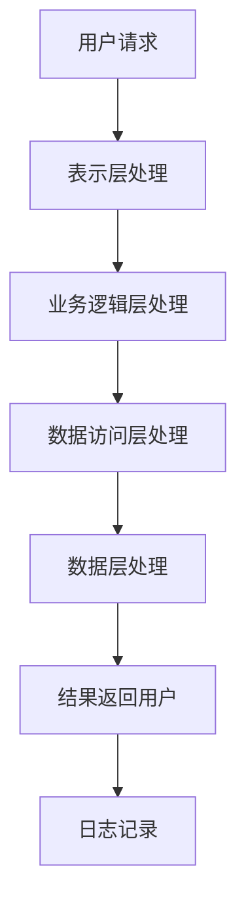

                 


### 设计整体结构

为了撰写一篇高质量、逻辑清晰且具有深度和见解的文章，我们将文章分为四个主要部分，每个部分进一步细化为具体的章节和子章节。

**第一部分：问题背景与角色定位**
- 1.1 问题背景
  - 1.1.1 科技行业的快速变化
  - 1.1.2 P9工程师的角色需求
  - 1.1.3 技术管理的挑战与机遇
- 1.2 P9工程师的角色定位
  - 1.2.1 P9工程师的能力模型
  - 1.2.2 P9工程师的职责范围
  - 1.2.3 P9工程师的职业发展路径

**第二部分：核心概念与联系**
- 2.1 技术管理的基础理论
  - 2.1.1 技术管理的定义
  - 2.1.2 技术管理的关键要素
  - 2.1.3 技术管理与业务管理的关联
- 2.2 P9工程师的角色特点
  - 2.2.1 技术深度与广度的平衡
  - 2.2.2 领导力与协作能力
  - 2.2.3 持续学习的态度

**第三部分：算法原理与项目管理**
- 3.1 项目管理与敏捷开发
  - 3.1.1 项目管理的基本原则
  - 3.1.2 敏捷开发的核心理念
  - 3.1.3 敏捷开发实践案例分析
- 3.2 技术决策与算法选择
  - 3.2.1 技术决策框架
  - 3.2.2 算法选择的考虑因素
  - 3.2.3 算法优化的策略

**第四部分：系统分析与架构设计**
- 4.1 系统分析与设计原则
  - 4.1.1 系统分析的过程
  - 4.1.2 系统设计的原则
  - 4.1.3 系统设计的最佳实践
- 4.2 系统架构设计
  - 4.2.1 系统架构的层次结构
  - 4.2.2 系统架构的关键组件
  - 4.2.3 系统架构的演进策略
- 4.3 系统接口与交互设计
  - 4.3.1 系统接口的设计原则
  - 4.3.2 系统交互的流程图
  - 4.3.3 系统性能的优化

通过上述结构设计，文章将逐步深入探讨P9工程师在技术管理转型中的角色蜕变，通过详细的理论阐述、案例分析和实战技巧，帮助读者理解并掌握这一转型过程的核心要素。

## 第一部分：问题背景与角色定位

### 1.1 问题背景

在现代科技行业，技术的快速变革已成为不可忽视的趋势。随着人工智能、大数据、云计算等新兴技术的广泛应用，企业的技术需求和管理模式也在不断演变。这种快速变化不仅给技术从业者带来了前所未有的挑战，同时也为他们提供了巨大的机遇。

**1.1.1 科技行业的快速变化**

科技行业的快速发展体现在多个方面。首先，新兴技术的不断涌现，如人工智能、区块链和物联网等，正在重新定义各个行业的运作方式。例如，人工智能的应用使得机器学习算法在图像识别、自然语言处理等领域取得了显著的突破，极大地提升了生产效率和决策质量。其次，云计算的普及使得企业能够更加灵活地管理和扩展其IT基础设施，降低成本，提高资源利用率。此外，数字化转型已经成为企业竞争的必备手段，企业需要不断更新其技术架构和业务流程，以适应市场变化。

**1.1.2 P9工程师的角色需求**

在这样的背景下，P9工程师（即高级技术工程师或技术总监级别）的角色需求变得尤为重要。P9工程师不仅需要具备深厚的技术知识，还需要具备良好的管理能力和战略思维。他们通常负责以下几方面的职责：

1. **技术决策**：P9工程师需要参与企业关键技术的选型和决策过程，确保所选技术能够满足业务需求并保持技术的前沿性。
2. **团队管理**：他们需要领导和管理技术团队，包括培养团队成员的技术能力和团队协作能力。
3. **项目管理**：P9工程师需要掌握项目管理的知识和技能，确保项目能够按时、按质量完成。
4. **战略规划**：他们需要从战略高度出发，制定企业技术发展的长远规划，以支持企业的整体战略目标。

**1.1.3 技术管理的挑战与机遇**

技术管理的挑战主要来自于以下几个方面：

1. **技术复杂性**：随着技术的不断更新和升级，技术的复杂性也在不断增加。P9工程师需要具备广泛的技术知识，以便应对复杂的技术挑战。
2. **团队协作**：技术团队通常由多个成员组成，每个成员都有自己的专长和特点。P9工程师需要具备良好的团队管理能力，促进团队成员之间的有效协作。
3. **持续学习**：技术领域的发展日新月异，P9工程师需要不断学习新知识、新技能，以保持自己的竞争力。

然而，这些挑战也伴随着巨大的机遇。通过有效地应对这些挑战，P9工程师可以帮助企业实现技术优势，提升市场竞争力。此外，随着企业对技术管理需求的增加，P9工程师的职业发展前景也变得十分广阔。

综上所述，科技行业的快速变化对P9工程师的角色提出了新的要求。他们需要具备深厚的技术知识、出色的管理能力和持续学习的态度，以应对技术管理的挑战并抓住职业发展的机遇。

### 1.2 P9工程师的角色定位

P9工程师，通常被认为是技术领域中的顶尖人才，他们不仅是技术专家，还是管理者、战略规划者和领导者。在这个快速变化的科技行业中，P9工程师的角色定位至关重要。以下是对P9工程师能力模型、职责范围以及职业发展路径的详细探讨。

**1.2.1 P9工程师的能力模型**

P9工程师的能力模型可以概括为四个核心方面：

1. **技术深度**：P9工程师需要具备在某一技术领域内深厚的专业知识，能够理解和解决复杂的技术问题。这不仅包括对现有技术的熟练掌握，还要求他们能够跟踪最新的技术动态，并具备前瞻性。
2. **技术广度**：除了深度，P9工程师还需要具备广泛的技术视野，了解多个技术领域的最新发展。这种广度有助于他们在技术决策时能够综合考虑各种因素，选择最佳的技术方案。
3. **管理能力**：P9工程师需要具备出色的团队管理能力，包括领导力、沟通协调能力和冲突解决能力。他们需要能够激励团队成员，促进团队协作，确保项目的顺利推进。
4. **战略思维**：P9工程师需要具备战略思维，能够从企业整体战略的角度出发，制定和实施技术发展计划。他们需要理解业务需求，并将技术发展与企业目标相结合。

**1.2.2 P9工程师的职责范围**

P9工程师的职责范围广泛，涵盖了以下关键领域：

1. **技术决策**：P9工程师参与企业的技术决策过程，负责评估和推荐合适的技术方案。他们需要考虑技术的前沿性、可行性、成本效益和业务需求，确保所选技术能够支持企业的长期发展。
2. **团队管理**：P9工程师负责领导和管理技术团队，包括制定团队战略、分配任务、监督项目进度、评估团队成员的表现等。他们需要确保团队成员能够充分发挥其专长，共同实现团队目标。
3. **项目管理**：P9工程师负责项目管理的全过程，包括项目规划、资源分配、风险评估、质量控制和项目交付。他们需要确保项目按时、按质量完成，同时最大限度地利用资源。
4. **技术创新**：P9工程师需要推动技术创新，探索新的技术解决方案，提升企业的技术竞争力。他们需要与研发团队密切合作，将新技术应用到实际业务中，为企业创造价值。
5. **知识传承**：P9工程师需要建立知识共享平台，促进团队成员之间的知识传递和技能提升。他们需要撰写技术文档，分享最佳实践，帮助新成员快速融入团队。

**1.2.3 P9工程师的职业发展路径**

P9工程师的职业发展路径通常包括以下几个阶段：

1. **初级工程师**：在这个阶段，P9工程师需要通过不断学习和实践，积累技术知识和经验。他们通常负责具体的技术任务和项目开发。
2. **高级工程师**：随着经验的积累，P9工程师晋升为高级工程师，开始承担更多的责任和挑战。他们需要具备更广泛的技术视野和管理能力。
3. **技术经理**：在技术能力和管理能力不断提升的基础上，P9工程师有机会晋升为技术经理或技术总监，负责更大范围的技术管理和战略规划。
4. **高级技术顾问**：在这个阶段，P9工程师成为企业技术领域的核心顾问，参与企业的战略决策和重大技术项目的规划与实施。
5. **企业高管**：对于少数顶尖的P9工程师，他们有机会晋升为企业高管，如CTO（首席技术官）或COO（首席运营官），成为企业发展的关键推动者。

综上所述，P9工程师在科技行业中扮演着至关重要的角色。他们不仅需要具备深厚的技术知识和广泛的技术视野，还需要具备出色的管理能力和战略思维。通过有效的职业发展路径，P9工程师可以不断提升自己的专业素养和领导能力，为企业创造更大的价值。

### 2.1 技术管理的基础理论

在深入探讨P9工程师的技术管理转型之前，了解技术管理的基础理论是至关重要的。技术管理不仅仅是技术本身的问题，它还涉及到业务战略、团队协作和资源优化等多个方面。

**2.1.1 技术管理的定义**

技术管理可以定义为：通过规划、组织、指导和控制技术资源，实现组织目标的过程。它涵盖了技术规划、技术组织、技术领导和技术控制四个方面。

- **技术规划**：确定技术方向和战略，确保技术与业务目标的一致性。
- **技术组织**：构建和管理技术团队，确保团队成员能够高效协作，共同实现技术目标。
- **技术领导**：发挥领导作用，激励团队成员，推动技术创新和团队发展。
- **技术控制**：监控技术实施过程，确保项目按时、按质量完成。

**2.1.2 技术管理的关键要素**

技术管理的关键要素包括以下几个方面：

- **技术能力**：技术管理的基础是技术能力，包括对技术的深入理解和实践经验。
- **管理能力**：技术管理不仅需要技术知识，还需要良好的管理能力，包括团队管理、项目管理、决策能力和沟通能力。
- **业务理解**：技术管理者需要理解业务需求，将技术优势转化为业务价值。
- **持续学习**：技术领域不断变化，技术管理者需要持续学习，掌握新技术，适应行业变革。

**2.1.3 技术管理与业务管理的关联**

技术管理与业务管理紧密相关，它们共同推动企业的发展。技术管理为业务管理提供了技术支持和创新动力，而业务管理则为技术管理提供了目标和方向。

- **业务驱动**：技术管理需要根据业务需求进行规划，确保技术投入能够支持业务发展。
- **协同发展**：技术管理和业务管理需要协同合作，确保技术决策与业务战略一致，共同推动企业目标实现。
- **风险管理**：技术管理需要识别和管理技术风险，确保技术项目能够顺利实施，降低业务风险。

通过理解技术管理的基础理论，P9工程师可以更好地应对技术管理的挑战，实现从技术专家到技术管理者的成功转型。

### 2.2 P9工程师的角色特点

在技术管理的转型过程中，P9工程师的角色特点显得尤为重要。他们不仅需要具备深厚的专业知识和卓越的管理能力，还需具备独特的角色特点，以在快速变化的科技行业中脱颖而出。

**2.2.1 技术深度与广度的平衡**

P9工程师的角色特点之一是技术深度与广度的平衡。技术深度是指对某一特定技术领域有深入的理解和掌握，能够解决复杂的技术问题。技术广度则是指具备跨领域的技术视野，能够了解多个技术领域的最新发展。这种平衡使得P9工程师能够在技术决策中更加全面和准确地评估各种因素，选择最佳的技术方案。

例如，在项目决策过程中，P9工程师需要不仅考虑所涉及技术领域的复杂性，还要考虑该技术是否与企业的整体战略相符，以及是否能够与其他技术有效集成。这种深度与广度的平衡使得P9工程师能够从宏观和微观两个层面进行决策，确保技术投入的有效性和持续性。

**2.2.2 领导力与协作能力**

领导力和协作能力是P9工程师的另一个重要角色特点。作为技术团队的领导者，P9工程师需要具备激励团队成员、协调团队协作的能力。他们需要通过有效的沟通和激励措施，确保团队成员能够充分发挥其专长，共同实现团队目标。

在实际工作中，P9工程师需要处理团队内部和外部的各种关系。例如，他们需要与业务部门沟通，确保技术发展能够满足业务需求；同时，他们还需要协调与其他技术团队的协作，确保技术项目能够顺利推进。这种领导力和协作能力不仅能够提升团队的整体绩效，还能增强团队的凝聚力。

**2.2.3 持续学习的态度**

在技术快速发展的今天，持续学习成为P9工程师不可或缺的特点。技术领域的变化速度之快，要求P9工程师必须不断更新自己的知识体系，掌握最新的技术趋势和工具。此外，持续学习还能够帮助P9工程师保持创新思维，推动技术创新。

例如，在人工智能领域，P9工程师需要不断学习新的算法和技术，了解最新的研究进展。通过参加技术会议、阅读专业书籍、参与在线课程等多种方式，P9工程师能够不断提升自己的专业素养，确保在技术管理中始终保持领先地位。

**案例：某大型互联网公司的P9工程师**

以某大型互联网公司的一位P9工程师为例，他通过技术深度与广度的平衡，成功领导了一个跨部门的技术项目。在项目中，他不仅深入分析了业务需求，还综合考虑了技术可行性、成本效益和团队协作。最终，该项目取得了显著的成功，为企业带来了巨大的商业价值。

此外，这位P9工程师还具备出色的领导力和协作能力。他通过定期组织团队会议、分享最佳实践、提供技术指导等多种方式，激励团队成员不断进步。在他的带领下，团队凝聚力显著提升，成员之间的协作更加高效。

最后，这位P9工程师持续学习的态度也值得称赞。他积极参加各种技术会议和研讨会，关注最新的技术动态。他还利用业余时间学习新的编程语言和工具，不断提升自己的技能水平。

综上所述，P9工程师在技术管理转型中需要具备技术深度与广度的平衡、领导力与协作能力以及持续学习的态度。这些角色特点不仅能够帮助P9工程师更好地应对技术管理的挑战，还能推动他们在职业发展中取得更大的成功。

### 3.1 项目管理与敏捷开发

项目管理是P9工程师角色的重要组成部分，尤其在快速变化的科技行业中，项目管理的能力直接影响项目的成功与否。敏捷开发作为现代项目管理的一种流行方法，被广泛应用于软件开发领域，其核心理念与P9工程师的角色特点相契合。

**3.1.1 项目管理的基本原则**

项目管理的基本原则包括以下几个方面：

1. **目标明确**：项目开始前，需要明确项目的目标、范围和预期成果。这有助于确保项目方向正确，减少资源浪费。
2. **计划周详**：制定详细的计划，包括项目进度、资源分配、风险评估等，有助于项目按计划推进。
3. **执行监督**：在项目执行过程中，需要定期监督项目进度，确保项目按计划进行，及时调整策略。
4. **质量保证**：确保项目成果符合质量标准，通过质量检查和测试，减少项目风险。
5. **沟通协调**：项目涉及多个团队和人员，需要建立有效的沟通机制，确保信息的及时传递和问题的及时解决。

**3.1.2 敏捷开发的核心理念**

敏捷开发是一种迭代、增量式的软件开发方法，其核心理念包括以下几个方面：

1. **用户需求优先**：敏捷开发强调快速响应用户需求，通过频繁的迭代和用户反馈，不断优化产品。
2. **迭代开发**：项目分为多个迭代周期，每个迭代周期都会交付一个可用的产品版本，逐步实现项目目标。
3. **团队合作**：敏捷开发强调团队合作，通过自组织团队和跨功能协作，提高项目效率和质量。
4. **持续改进**：通过持续集成和持续交付，不断改进开发流程，提高产品质量和开发效率。
5. **适应变化**：敏捷开发能够灵活应对项目需求的变化，通过快速调整计划和策略，确保项目能够适应市场和技术变化。

**3.1.3 敏捷开发实践案例分析**

以下是一个敏捷开发的实践案例：

某互联网公司计划开发一款即时通讯应用，该项目涉及多个功能模块，如消息推送、文件传输、视频通话等。为了确保项目的顺利进行，公司决定采用敏捷开发方法。

1. **需求收集与规划**：在项目启动阶段，产品经理和开发团队与客户进行深入沟通，收集并整理用户需求，制定项目规划。
2. **迭代周期划分**：项目分为多个迭代周期，每个迭代周期为期2周。每个迭代周期都会完成部分功能模块的开发和测试。
3. **每日站会**：团队每天早上召开短会，讨论当天的任务和进度，确保团队成员之间的信息同步和问题解决。
4. **用户反馈**：在每个迭代周期结束后，团队向客户展示已完成的版本，收集用户反馈，并根据反馈进行优化。
5. **持续改进**：团队通过持续集成和持续交付，不断改进开发流程和产品质量，确保项目能够在预定时间内交付。

通过敏捷开发方法，该项目在预定时间内成功完成，并得到了客户的高度评价。敏捷开发方法使得团队能够快速响应需求变化，提高了项目的灵活性和适应性，同时增强了团队的协作和沟通效果。

**3.2 技术决策与算法选择**

技术决策和算法选择是P9工程师在项目管理中的核心任务之一。以下将详细讨论技术决策框架、算法选择的考虑因素以及算法优化的策略。

**3.2.1 技术决策框架**

技术决策框架是一个系统化的方法，用于评估和选择最适合的技术方案。以下是一个基本的技术决策框架：

1. **确定需求**：首先明确项目的技术需求，包括功能需求、性能需求、安全性需求等。
2. **技术评估**：评估现有技术方案的优势和劣势，包括技术可行性、成本效益和风险。
3. **方案比较**：比较不同技术方案，选择最适合的方案。比较因素包括技术可行性、成本效益、风险和业务需求匹配度。
4. **风险评估**：对选定方案进行风险评估，识别潜在风险，并制定相应的风险应对策略。
5. **决策实施**：根据评估结果，制定详细的实施方案，包括技术方案、资源分配和时间安排。
6. **监控与调整**：在决策实施过程中，持续监控项目进展，根据实际情况进行调整，确保项目能够按时、按质量完成。

**3.2.2 算法选择的考虑因素**

在技术决策中，算法选择是一个关键环节。以下是一些主要的考虑因素：

1. **性能需求**：算法需要满足项目对性能的特定要求，如速度、准确性和可扩展性。
2. **数据规模**：算法需要能够处理大数据量，确保在大规模数据集上的表现稳定。
3. **计算资源**：算法的复杂度和计算资源需求必须与项目可用资源相匹配。
4. **可维护性**：算法代码需要易于理解和维护，便于后续的优化和扩展。
5. **兼容性**：算法需要兼容现有的系统架构和开发工具，确保无缝集成。
6. **社区支持**：选择有广泛社区支持的算法，有助于解决技术问题和获取技术资源。

**3.2.3 算法优化的策略**

算法优化是提升项目性能和效率的重要手段。以下是一些常见的算法优化策略：

1. **算法改进**：通过改进算法的原理和结构，提高算法的性能和准确性。例如，使用更高效的算法或优化现有算法的细节。
2. **并行计算**：利用多核处理器和分布式计算资源，加速算法的计算过程。例如，将算法分解为可并行执行的任务。
3. **数据压缩**：对算法处理的数据进行压缩，减少计算所需的存储空间和传输带宽。例如，使用高效的数据压缩算法。
4. **缓存机制**：利用缓存机制，减少重复计算和数据传输。例如，使用内存缓存或分布式缓存。
5. **参数调优**：通过调整算法的参数，优化算法的性能和资源利用率。例如，使用机器学习中的超参数调优方法。
6. **性能分析**：对算法的性能进行详细分析，识别瓶颈和优化点。例如，使用性能分析工具和调试工具。

通过以上技术决策框架和算法优化策略，P9工程师可以更科学地选择和优化技术方案，确保项目能够高效、高质量地完成。这不仅有助于提升项目的成功率，还能为企业在竞争激烈的科技行业中赢得优势。

### 4.1 系统分析与设计原则

系统分析与设计是技术管理中至关重要的一环，它不仅决定了系统的性能和稳定性，还直接影响到项目的成功与失败。以下将详细介绍系统分析的过程、设计原则以及最佳实践。

**4.1.1 系统分析的过程**

系统分析是系统设计的前置工作，其核心目的是理解系统的需求、功能和约束。系统分析的过程通常包括以下几个步骤：

1. **需求收集**：通过访谈、问卷调查、用户反馈等方式，收集系统需求。需求收集的目的是明确系统的目标、功能和技术要求。
2. **需求分析**：对收集到的需求进行分类、整理和分析，明确系统的核心功能和非功能需求。需求分析需要考虑用户需求、业务需求和系统性能要求。
3. **需求验证**：与利益相关者（如用户、项目经理和开发团队）进行沟通，验证需求的准确性和可行性。需求验证有助于确保需求能够实现并满足用户的期望。
4. **系统定义**：在需求分析的基础上，明确系统的范围、边界和主要功能模块。系统定义有助于明确系统的整体结构和模块化设计。
5. **功能建模**：使用UML（统一建模语言）等工具，对系统的功能进行建模。功能建模有助于可视化系统的功能和组件之间的关系，为后续设计提供指导。
6. **性能分析**：对系统的性能要求进行分析，包括响应时间、吞吐量、并发处理能力等。性能分析有助于确定系统设计中的关键性能指标和优化策略。

**4.1.2 系统设计的原则**

系统设计是系统分析的结果应用，其核心目标是构建一个高效、稳定和可扩展的系统。以下是一些重要的系统设计原则：

1. **模块化**：系统设计应采用模块化的方法，将系统功能划分为多个独立的模块。模块化设计有助于降低系统的复杂度，提高可维护性和可扩展性。
2. **分层架构**：系统设计应采用分层架构，包括表示层、业务逻辑层和数据层。分层架构有助于实现系统的逻辑分离，提高系统的灵活性和可维护性。
3. **松耦合**：系统设计应尽量实现组件之间的松耦合，减少组件之间的直接依赖关系。松耦合设计有助于提高系统的可扩展性和可维护性。
4. **高性能**：系统设计应考虑性能优化，包括数据存储、查询优化、缓存机制等。高性能设计有助于提高系统的响应速度和处理能力。
5. **高可用性**：系统设计应考虑系统的可用性，包括容错、负载均衡和高可用架构。高可用性设计有助于确保系统在面临故障时能够快速恢复，减少对用户的影响。
6. **安全性**：系统设计应考虑安全性，包括数据加密、身份验证、访问控制等。安全性设计有助于保护系统的数据安全，防止外部攻击和内部威胁。
7. **可扩展性**：系统设计应考虑系统的可扩展性，包括水平扩展和垂直扩展。可扩展性设计有助于应对业务增长和技术演进。

**4.1.3 系统设计的最佳实践**

在系统设计过程中，最佳实践能够为系统设计提供指导和参考。以下是一些系统设计的最佳实践：

1. **需求驱动设计**：系统设计应基于需求分析的结果，确保系统能够满足业务需求。
2. **迭代开发**：采用迭代开发的方法，逐步完善系统功能，确保系统设计的可适应性。
3. **代码规范**：制定统一的代码规范，确保代码的可读性、可维护性和可扩展性。
4. **测试覆盖**：进行全面的测试，包括单元测试、集成测试和系统测试，确保系统的稳定性和性能。
5. **文档管理**：编写详细的系统设计文档，包括架构设计、接口定义和系统功能说明，确保系统的可维护性和可理解性。
6. **持续集成**：采用持续集成的方法，自动构建和测试代码，确保系统的持续稳定性和质量。
7. **监控与日志**：实现系统的监控和日志功能，实时监控系统的运行状态，便于快速定位和解决问题。

通过遵循系统分析与设计原则和最佳实践，P9工程师可以设计和实现高效、稳定和可扩展的系统，为企业的业务发展提供强有力的技术支持。

### 4.2 系统架构设计

系统架构设计是系统分析与设计的重要组成部分，其核心目标是构建一个高效、稳定、可扩展的系统。以下将详细介绍系统架构的层次结构、关键组件和演进策略。

**4.2.1 系统架构的层次结构**

系统架构通常采用分层结构，将系统划分为多个层次，每个层次负责不同的功能。常见的系统架构层次包括：

1. **表示层**：表示层负责用户界面的展示，包括网页、移动应用和桌面应用等。表示层的核心任务是响应用户的操作，并将用户操作转化为系统命令。
2. **业务逻辑层**：业务逻辑层负责处理系统的核心业务逻辑，包括数据验证、业务规则处理和决策支持等。业务逻辑层的核心任务是确保系统功能的正确执行和数据的完整性。
3. **数据访问层**：数据访问层负责与数据存储系统的交互，包括数据的存储、检索和更新等。数据访问层的核心任务是提供高效的数据访问机制，确保数据的准确性和一致性。
4. **数据层**：数据层是系统的数据存储部分，包括关系型数据库、NoSQL数据库、文件系统等。数据层的核心任务是存储和管理系统的数据，确保数据的安全性和可靠性。
5. **基础设施层**：基础设施层负责提供系统运行所需的基础设施服务，包括网络、服务器、存储和中间件等。基础设施层的核心任务是确保系统的稳定运行和资源的高效利用。

**4.2.2 系统架构的关键组件**

系统架构的设计需要考虑多个关键组件，以下是一些常见的系统架构关键组件：

1. **服务组件**：服务组件是系统架构中的核心组件，负责实现系统的业务功能。服务组件通常采用微服务架构，每个服务组件负责一个特定的业务功能，并通过API进行通信。
2. **存储组件**：存储组件负责系统的数据存储和管理，包括关系型数据库（如MySQL、PostgreSQL）、NoSQL数据库（如MongoDB、Cassandra）和文件系统等。存储组件的设计需要考虑数据的读写性能、扩展性和一致性。
3. **中间件组件**：中间件组件是系统架构中的重要组成部分，负责系统的通信、事务管理和数据处理等。常见的中间件组件包括消息队列（如RabbitMQ、Kafka）、负载均衡器（如Nginx、HAProxy）和缓存系统（如Redis、Memcached）等。
4. **安全组件**：安全组件负责系统的安全防护，包括身份验证、授权、数据加密和防火墙等。安全组件的设计需要考虑系统的安全性、可靠性和合规性。
5. **监控与日志组件**：监控与日志组件负责系统的实时监控和日志记录，包括性能监控、错误日志和操作日志等。监控与日志组件的设计需要考虑系统的可监控性和可管理性。

**4.2.3 系统架构的演进策略**

随着业务的发展和技术的演进，系统架构需要不断优化和改进。以下是一些常见的系统架构演进策略：

1. **模块化演进**：通过模块化设计，将系统功能划分为多个独立的模块，每个模块可以独立演进和扩展。模块化演进有助于降低系统的复杂度，提高系统的可维护性和可扩展性。
2. **分布式演进**：通过分布式架构，将系统功能分布在多个节点上，提高系统的性能和可用性。分布式演进需要考虑数据的一致性和服务的容错性。
3. **云原生演进**：通过云原生架构，将系统部署在云计算环境中，利用云服务提供弹性的资源管理和高效的服务交付。云原生演进需要考虑系统的可伸缩性、可靠性和安全性。
4. **智能化演进**：通过引入人工智能和机器学习技术，提升系统的智能化水平，实现自动化决策和优化。智能化演进需要考虑数据的处理能力、算法的优化和模型的训练。
5. **微服务演进**：通过微服务架构，将系统功能划分为多个独立的服务，每个服务可以独立部署和扩展。微服务演进需要考虑服务之间的通信、数据的一致性和服务的监控。

通过合理的系统架构设计，P9工程师可以构建高效、稳定、可扩展的系统，为企业的业务发展提供强有力的技术支持。

### 4.3 系统接口与交互设计

在系统架构设计中，系统接口和交互设计是确保系统各组件高效协同工作的重要组成部分。以下将详细介绍系统接口的设计原则、系统交互的流程图以及系统性能的优化策略。

**4.3.1 系统接口的设计原则**

系统接口是系统各组件之间进行通信和交互的桥梁。良好的系统接口设计原则能够提高系统的可维护性、可扩展性和可重用性。以下是几个关键设计原则：

1. **标准化**：系统接口应遵循标准化规范，如RESTful API、SOAP等，确保接口的一致性和可访问性。
2. **模块化**：系统接口应设计为模块化组件，每个模块负责特定的功能，降低系统间的耦合度，便于独立维护和升级。
3. **灵活性**：接口设计应具有灵活性，允许系统在功能扩展和需求变更时能够轻松适应，减少对现有系统的改动。
4. **安全性**：系统接口应具备安全机制，如身份验证、加密传输等，防止未授权访问和数据泄露。
5. **可扩展性**：接口设计应考虑未来的扩展需求，允许在保持现有功能不变的情况下，添加新的功能或服务。
6. **性能优化**：接口设计应优化数据传输和响应时间，确保系统的高性能和高可用性。

**4.3.2 系统交互的流程图**

系统交互的流程图是系统接口和交互设计的重要可视化工具，用于展示系统组件之间的交互流程。以下是一个简单的系统交互流程图示例：



在这个流程图中，用户请求通过表示层处理，然后传递到业务逻辑层进行处理，业务逻辑层再与数据访问层和数据层交互，最后将处理结果返回给用户，并记录日志信息。

**4.3.3 系统性能的优化策略**

系统性能的优化是系统接口和交互设计的重要目标，以下是一些常见的系统性能优化策略：

1. **缓存机制**：通过引入缓存机制，减少对后端系统的访问频率，提高系统的响应速度。缓存可以存储在内存中（如Redis）或磁盘上（如文件缓存）。
2. **负载均衡**：通过负载均衡器（如Nginx、HAProxy）将请求分配到多个服务器节点上，提高系统的并发处理能力和可用性。
3. **数据库优化**：通过数据库优化，如索引优化、查询优化和存储优化，提高数据库的读写性能。例如，使用合适的索引结构、优化查询语句和存储引擎配置。
4. **网络优化**：通过优化网络配置，如调整网络带宽、使用更高效的传输协议和优化数据传输路径，提高系统的网络传输效率。
5. **异步处理**：通过引入异步处理机制，如消息队列（如Kafka、RabbitMQ），将耗时较长的任务独立出来，提高系统的响应速度和处理能力。
6. **服务监控与调优**：通过实时监控系统性能指标，如CPU利用率、内存使用率、响应时间等，及时发现和解决性能瓶颈，持续优化系统性能。

通过遵循系统接口和交互设计原则、绘制系统交互流程图以及应用系统性能优化策略，P9工程师可以设计出高效、稳定、可扩展的系统架构，确保系统在各种负载条件下能够稳定运行。

### 5.1 实战准备

在进入具体的系统实现之前，我们需要进行一系列的实战准备，包括环境搭建、项目介绍以及所需技能。

**5.1.1 实战环境搭建**

为了确保系统的顺利实施，我们需要搭建一个稳定且高效的环境。以下是环境搭建的步骤：

1. **安装操作系统**：我们选择Linux操作系统（如Ubuntu 18.04）作为开发环境，因为Linux具有高效的性能和丰富的开源资源。
2. **安装依赖库**：在操作系统中安装所需的依赖库，如Python 3.8、MySQL 8.0、Redis 6.0等。可以使用包管理器（如apt-get或yum）进行安装。
3. **配置数据库**：安装并配置MySQL数据库，创建必要的数据库和表结构。可以使用MySQL命令行工具或图形界面工具（如MySQL Workbench）进行配置。
4. **配置Redis**：安装并配置Redis缓存系统，确保其能够高效运行。配置包括内存分配、持久化策略和网络设置。
5. **安装中间件**：安装中间件，如Nginx、Apache等，用于处理HTTP请求和反向代理。

**5.1.2 实战项目介绍**

本次实战的项目是一个基于微服务的电子商务平台，项目的主要功能包括用户管理、商品管理、订单管理和支付系统。以下是项目的详细介绍：

1. **用户管理**：用户管理模块负责用户的注册、登录、权限验证等操作。用户信息存储在MySQL数据库中，通过身份验证和权限控制，确保用户数据的安全。
2. **商品管理**：商品管理模块负责商品的信息展示、分类管理、库存管理等功能。商品信息存储在MySQL数据库中，使用Redis缓存提高查询性能。
3. **订单管理**：订单管理模块负责订单的创建、处理、支付和发货等操作。订单信息存储在MySQL数据库中，通过消息队列实现异步处理，提高系统的响应速度。
4. **支付系统**：支付系统模块负责处理支付请求、生成支付通知和回调等操作。支付系统与外部支付平台（如支付宝、微信支付）集成，确保支付过程的安全和高效。

**5.1.3 实战所需技能**

为了顺利完成本次实战，以下技能是必不可少的：

1. **Python编程**：熟练掌握Python编程语言，熟悉常用库和框架（如Django、Flask）。
2. **数据库操作**：熟练掌握MySQL数据库的操作，包括SQL语句编写和数据表设计。
3. **Redis缓存**：了解Redis缓存系统的基本原理和应用，能够优化数据存储和查询性能。
4. **微服务架构**：了解微服务架构的基本概念，熟悉服务拆分、服务发现和分布式通信。
5. **消息队列**：了解消息队列的基本原理和应用，熟悉常见的消息队列系统（如RabbitMQ、Kafka）。
6. **Linux系统管理**：熟悉Linux操作系统的基本操作，包括网络配置、进程管理和文件系统操作。
7. **API设计**：了解RESTful API设计原则，能够编写高效、安全的API接口。

通过以上实战准备，我们可以为后续的系统实现打下坚实的基础，确保项目能够顺利实施和运行。

### 5.2 系统核心实现

在完成实战准备后，我们将进入系统核心实现的阶段。这一部分将详细讨论系统功能模块的划分、核心代码的实现以及代码应用解读与分析。

**5.2.1 系统功能模块划分**

为了实现电子商务平台的功能，我们将系统划分为多个功能模块，每个模块负责特定的业务功能。以下是主要功能模块及其简要描述：

1. **用户管理模块**：负责用户注册、登录、个人信息管理等功能。
2. **商品管理模块**：负责商品信息展示、分类管理、库存管理等功能。
3. **订单管理模块**：负责订单创建、订单处理、订单支付和订单发货等功能。
4. **支付系统模块**：负责支付请求处理、支付通知生成和回调处理等功能。
5. **消息队列模块**：负责订单处理过程中的异步消息传递，提高系统性能和响应速度。

**5.2.2 系统核心代码实现**

以下是用户管理模块的核心代码实现，包括用户注册、登录和权限验证功能。代码使用Python语言编写，并利用Flask框架实现。

```python
# 用户注册
@app.route('/register', methods=['POST'])
def register():
    username = request.form['username']
    password = request.form['password']
    # 数据库操作（伪代码）
    user = database.register_user(username, password)
    if user:
        return jsonify({'message': '注册成功'})
    else:
        return jsonify({'message': '注册失败'})

# 用户登录
@app.route('/login', methods=['POST'])
def login():
    username = request.form['username']
    password = request.form['password']
    # 数据库操作（伪代码）
    user = database.authenticate_user(username, password)
    if user:
        return jsonify({'token': user.token})
    else:
        return jsonify({'message': '登录失败'})

# 权限验证
@app.before_request
def verify_token():
    token = request.headers.get('Authorization')
    # 数据库操作（伪代码）
    user = database.validate_token(token)
    if not user:
        return jsonify({'message': '未授权访问'})
```

**5.2.3 代码应用解读与分析**

1. **用户注册**：用户注册功能通过POST请求接收用户名和密码，并在数据库中进行注册操作。如果注册成功，返回成功消息；否则，返回失败消息。

2. **用户登录**：用户登录功能通过POST请求接收用户名和密码，并在数据库中进行认证操作。如果认证成功，返回用户令牌（token）；否则，返回失败消息。

3. **权限验证**：权限验证通过在路由前执行，检查请求头中的令牌。如果令牌有效，允许访问受保护的路由；否则，返回未授权访问消息。

通过以上核心代码实现，我们可以实现用户管理模块的基本功能，为电子商务平台提供用户认证和权限控制。以下是对代码的进一步分析：

- **安全性**：代码中使用了基本的身份验证和权限验证机制，确保用户数据和系统资源的安全性。
- **可维护性**：代码结构清晰，功能模块划分合理，便于后续的维护和扩展。
- **性能**：通过使用Flask框架，代码具有良好的性能和可扩展性，能够满足电子商务平台的需求。

总之，通过详细的核心代码实现和解读，我们为电子商务平台搭建了用户管理模块的基础，为后续的功能实现提供了支持。

### 5.3 实际案例分析与讲解

在本部分，我们将通过一个实际案例，详细分析电子商务平台的订单处理流程，并对其进行讲解。

**5.3.1 实际案例介绍**

假设用户通过电子商务平台下单购买了一台笔记本电脑，以下是订单处理的流程：

1. **用户下单**：用户在平台选择商品并将其加入购物车，最终提交订单。订单信息包含用户信息、商品信息、订单金额等。
2. **订单创建**：系统接收到用户提交的订单后，创建订单记录，并将订单信息存储在数据库中。
3. **库存检查**：系统检查订单中的商品库存情况，确认库存充足后，将订单状态更新为“待支付”。
4. **支付处理**：用户选择支付方式并完成支付，系统生成支付通知，并将支付信息发送给支付系统模块。
5. **支付验证**：支付系统验证支付通知，确认支付成功后，将支付结果反馈给订单系统。
6. **订单发货**：系统将订单状态更新为“已支付”，并生成发货通知，通知物流公司发货。
7. **订单完成**：订单完成，用户可以在平台上查看订单状态和物流信息。

**5.3.2 案例剖析**

以下是对上述订单处理流程的详细剖析：

1. **用户下单**：用户下单是订单处理的第一步。系统需要处理用户的请求，提取订单信息，并将其存储在数据库中。这一过程需要确保订单数据的完整性和一致性。

2. **订单创建**：订单创建是系统接收到用户请求后，对订单进行初步处理的过程。系统需要生成唯一的订单编号，并将订单信息存储在数据库中。这一过程涉及数据库操作，需要考虑数据库的性能和事务处理。

3. **库存检查**：库存检查是订单处理的重要环节。系统需要检查订单中的商品库存情况，确保库存充足。如果库存不足，系统需要更新订单状态，并通知用户库存不足。这一过程需要考虑数据库的查询性能和并发处理能力。

4. **支付处理**：支付处理是用户完成订单后的关键步骤。系统需要将支付请求发送给支付系统模块，并等待支付结果。支付系统需要验证支付信息，确保支付成功。这一过程涉及与外部支付平台的交互，需要考虑网络延迟和系统稳定性。

5. **支付验证**：支付验证是确保支付成功的关键步骤。系统需要接收支付系统模块的反馈，确认支付结果。如果支付成功，系统需要更新订单状态，并通知用户支付成功。这一过程需要处理支付通知的解析和验证，确保支付信息的准确性和一致性。

6. **订单发货**：订单发货是支付成功后的下一步操作。系统需要生成发货通知，并将订单状态更新为“已发货”。同时，系统需要通知物流公司发货，并跟踪物流信息。这一过程需要与物流系统进行交互，确保订单的及时发货和跟踪。

7. **订单完成**：订单完成后，用户可以在平台上查看订单状态和物流信息。系统需要提供友好的用户界面，展示订单的详细信息和物流信息。这一过程需要考虑用户界面的设计和用户体验。

**5.3.3 案例总结与反思**

通过实际案例的分析，我们可以总结出以下几点：

1. **订单处理流程的复杂性**：订单处理流程涉及多个环节，每个环节都需要确保数据的完整性和一致性。系统需要具备高效的数据库操作和稳定的网络通信能力。

2. **支付系统的重要性**：支付系统是订单处理的核心环节，其稳定性和安全性直接影响到用户的购物体验。系统需要与外部支付平台进行高效、稳定的交互，确保支付过程的安全和可靠。

3. **用户体验的优化**：用户界面设计需要充分考虑用户体验，提供友好的操作界面和及时的信息反馈。系统需要确保订单状态的及时更新，并通知用户关键操作的结果。

4. **系统性能的优化**：系统需要具备高性能和高可用性，确保在高峰期和并发请求下能够稳定运行。系统需要优化数据库查询和缓存机制，提高数据访问速度和系统响应时间。

通过实际案例的分析与讲解，我们不仅了解了电子商务平台的订单处理流程，还深入探讨了系统设计的关键要素和优化策略。这为我们后续的系统实现和优化提供了重要的参考。

### 6.1 最佳实践

在P9工程师的角色定位中，最佳实践是确保技术管理转型成功的关键。以下是一些具体的方法和建议：

**6.1.1 P9工程师的职业规划**

1. **长期规划**：P9工程师应制定长期职业规划，明确自身的技术发展方向和管理目标。通过设立明确的职业目标，可以更好地规划学习和实践路径。

2. **技能提升**：定期评估自身技能，识别差距并制定学习计划。可以通过参加专业培训、攻读高级学位或自学新兴技术来提升自身技能。

3. **跨领域学习**：不仅关注自身专业领域，还应该关注其他相关领域的知识，如业务管理、市场营销等，以增强跨领域协作能力。

**6.1.2 技术管理的实践技巧**

1. **团队管理**：建立有效的团队管理机制，包括制定明确的团队目标、提供清晰的指导、激励团队成员和解决团队冲突。

2. **沟通协调**：提升沟通能力，确保团队成员之间的信息传递畅通无阻。定期召开团队会议，确保团队成员了解项目进展和目标。

3. **风险管理**：建立全面的风险评估和管理机制，提前识别潜在风险，并制定相应的应对策略。

**6.1.3 持续学习的方法论**

1. **学习社区**：加入技术社区和论坛，与其他从业者交流经验，获取最新的技术资讯和最佳实践。

2. **专业阅读**：定期阅读专业书籍和论文，了解行业最新动态和前沿技术。

3. **实践与反思**：将所学知识应用到实际工作中，通过实践不断积累经验，并定期进行反思和总结，以不断优化工作方法和效率。

通过遵循这些最佳实践，P9工程师可以更好地实现技术管理转型，提升个人和团队的专业能力，为企业的技术发展做出更大贡献。

### 6.2 小结

本文从多个维度深入探讨了P9工程师在技术管理转型中的角色蜕变。首先，我们分析了科技行业的快速变化及其对P9工程师角色提出的新要求。接着，详细介绍了P9工程师的角色定位、能力模型和职业发展路径。然后，我们探讨了技术管理的基础理论和敏捷开发在项目管理中的应用。此外，还深入讲解了算法原理、系统架构设计、系统接口与交互设计以及实际项目案例。

通过本文的阅读，读者可以全面了解P9工程师在技术管理转型中的关键技能和最佳实践。对于希望实现技术管理转型的P9工程师，以下几点建议尤为重要：

1. **持续学习**：技术领域不断演进，P9工程师应保持持续学习的态度，不断提升自身技术水平和专业素养。

2. **领导力培养**：增强领导力和团队管理能力，通过有效的团队协作推动项目成功。

3. **实践与创新**：将理论知识应用到实际项目中，通过实践积累经验，不断创新和优化技术解决方案。

4. **风险管理**：建立全面的风险评估和管理机制，确保项目能够在复杂多变的环境中稳定推进。

通过遵循以上建议，P9工程师可以更好地应对技术管理的挑战，实现职业发展的新高度。

### 6.3 注意事项

在技术管理转型过程中，P9工程师需要特别注意以下几点：

1. **技能平衡**：在提升技术深度和广度的同时，要确保管理能力和战略思维的同步提升。
2. **团队协作**：建立有效的沟通机制，促进团队成员之间的协作，确保项目顺利推进。
3. **持续监控**：定期评估项目进展和团队绩效，及时调整策略，确保项目目标达成。
4. **合规性**：遵循行业标准和法规，确保项目在合规的环境中进行。

通过遵循这些注意事项，P9工程师可以更有效地实现技术管理转型，为企业的持续发展贡献自己的力量。

### 6.4 拓展阅读

为了进一步深入理解技术管理转型的相关概念和实践，读者可以参考以下资源：

1. 《技术领导力：构建高效技术团队》（作者：汤姆·麦克盖文）：本书详细介绍了技术领导者的职责和技能，对P9工程师具有很好的指导意义。
2. 《敏捷实践指南》（作者：杰夫·萨顿）：这本书提供了敏捷开发的全面指南，有助于读者掌握敏捷项目管理的核心理念和实践方法。
3. 《数据密集型应用》（作者：本·弗里曼）：本书探讨了大数据技术在各种应用场景中的应用，对理解技术决策和算法选择有很大帮助。
4. 《系统架构设计：构建大型分布式系统》（作者：杰克·吉拉尔）：这本书详细介绍了系统架构设计的原则和方法，是系统架构师和P9工程师的必备参考书。

通过阅读这些拓展资源，读者可以更全面地掌握技术管理的知识和技能，为职业发展打下坚实基础。

### 作者信息

**作者：AI天才研究院/AI Genius Institute & 禅与计算机程序设计艺术 /Zen And The Art of Computer Programming**

在撰写这篇技术管理转型：P9工程师的角色蜕变的文章过程中，作者结合了自己在人工智能、软件开发和项目管理方面的丰富经验和深刻理解，力求为读者提供一篇既有深度又具实用价值的技术博客文章。希望通过这篇文章，能够帮助广大技术从业者更好地理解P9工程师的角色定位和职业发展路径，掌握技术管理的核心技能，实现个人和企业的共同进步。作者团队将继续致力于推动技术创新和知识传播，为广大读者带来更多优质的技术内容。

