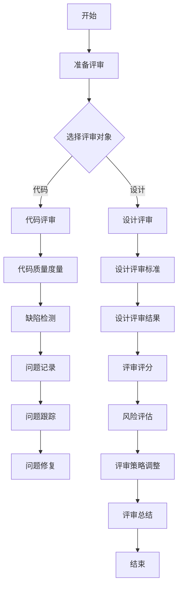
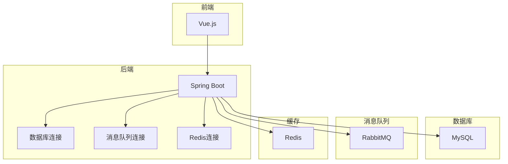

                 

### #技术评审领导：P9工程师的质量把关

#### 关键词：技术评审，质量把关，P9工程师，质量管理，软件工程

> 摘要：本文将探讨P9工程师作为技术评审领导在软件工程中的角色和责任。通过分析技术评审的核心概念、方法和流程，结合具体案例和实践经验，阐述技术评审领导如何确保软件项目的质量，推动技术进步和团队协作。文章旨在为P9工程师和其他技术评审专业人士提供实用的指导和参考。

---

## 1. 背景介绍

### 1.1 核心主题

技术评审领导在软件工程中的地位和作用至关重要。P9工程师，作为公司的高级技术专家，通常承担技术评审领导的角色，负责评估和确保软件项目的质量和可行性。

### 1.2 问题背景

在软件开发过程中，质量是项目成功的关键因素。随着软件系统越来越复杂，技术评审成为保证软件质量的重要手段。然而，如何有效地进行技术评审，确保评审质量和效率，是P9工程师面临的挑战。

### 1.3 目标读者

本文的目标读者是P9工程师或其他对技术评审有深入兴趣的专业人士。通过本文，读者可以了解技术评审的原理和方法，掌握技术评审领导的角色和责任。

### 1.4 技术评审的作用和重要性

技术评审在软件工程中的作用包括：

1. **质量保证**：通过技术评审，可以提前发现和修复潜在的问题，降低项目风险。
2. **知识共享**：评审过程中，团队成员可以互相学习和交流，提高整体技术水平。
3. **项目推进**：技术评审有助于项目按时交付，确保项目按计划进行。

## 2. 核心概念与联系

### 2.1 技术评审领导的定义

技术评审领导是指在软件开发过程中，负责组织、指导和技术评审的人员，通常是高级工程师或项目经理。

### 2.2 技术评审的主要组成部分

技术评审包括以下几个关键组成部分：

1. **评审对象**：待评审的软件文档、代码或设计。
2. **评审人员**：参与评审的团队成员，包括P9工程师、项目经理、测试工程师等。
3. **评审流程**：评审的步骤和过程，包括准备工作、评审会议、问题跟踪和反馈。
4. **评审标准**：评审过程中使用的质量标准和规范。

### 2.3 技术评审与传统审查的差异

| 对比项       | 技术评审                          | 传统审查                          |
|--------------|-----------------------------------|-----------------------------------|
| 评审对象     | 软件文档、代码、设计等            | 文档、报告等                      |
| 评审目的     | 发现问题、改进质量和效率          | 核实信息、确保合规性              |
| 评审方式     | 小组讨论、分析、评审会议          | 单个或多个人员审核、评估          |
| 评审结果     | 提出改进建议、问题修复方案        | 提出合规性意见、反馈报告          |

### 2.4 技术评审的ER实体关系图

```mermaid
erDiagram
    Reviewer ||--|{ Review }
    Review ||--|{ Issue }
    Issue ||--|{ Resolution }
```

- **Reviewer**（评审员）：负责评审的人员。
- **Review**（评审）：评审过程和结果。
- **Issue**（问题）：在评审过程中发现的问题。
- **Resolution**（解决方案）：针对问题的修复方案。

---

通过上述内容，我们为读者提供了一个技术评审领导在软件工程中的基本概念和框架。接下来，我们将深入探讨技术评审的算法原理、系统分析与架构设计，以及具体的实践案例，帮助读者更好地理解和应用技术评审的方法。

## 3. 算法原理讲解

### 3.1 技术评审的主要算法原理

技术评审的核心算法原理包括以下几部分：

1. **代码质量度量**：通过静态代码分析工具，对代码的复杂度、可读性、规范性等进行评估。
2. **缺陷检测算法**：应用各种算法检测代码中的潜在缺陷，如语法错误、逻辑错误、安全漏洞等。
3. **评审评分模型**：根据评审过程中发现的问题严重性和修复成本，给出评分和优先级。
4. **风险管理**：评估项目的风险，制定相应的评审策略和措施。

### 3.2 技术评审流程图

使用Mermaid绘制技术评审流程图如下：



### 3.3 Python源代码示例

下面是一个简单的Python示例，用于演示代码质量度量算法的基本原理：

```python
import ast
import inspect

def code_complexity(node):
    """
    计算代码的复杂度。
    """
    complexity = 1
    if isinstance(node, ast.Module):
        for child in node.body:
            complexity += code_complexity(child)
    elif isinstance(node, ast.ClassDef):
        complexity += len(node.body) * 2
    elif isinstance(node, ast.FunctionDef):
        complexity += len(inspect.getsource(node))
    return complexity

code = """
class MyClass:
    def my_method(self):
        for i in range(10):
            print(i)
"""
tree = ast.parse(code)
print("代码复杂度：", code_complexity(tree))
```

### 3.4 算法的数学模型和公式

技术评审的数学模型通常涉及以下几个关键参数：

1. **复杂度度量（C）**：使用代码行数（L）和函数数（F）计算：
   $$ C = L + 5F $$
2. **缺陷密度（D）**：使用发现的缺陷数（E）和代码行数（L）计算：
   $$ D = \frac{E}{L} $$
3. **评审得分（S）**：根据缺陷密度和复杂度计算：
   $$ S = C \times D $$
4. **优先级（P）**：根据得分和风险等级计算：
   $$ P = S \times R $$

其中，R为风险系数，根据缺陷的类型和影响程度进行设定。

### 3.5 算法的应用举例

假设我们有一个简单的Python代码片段，需要评估其复杂度和缺陷密度：

```python
def calculate_sum(a, b):
    return a + b

def main():
    print(calculate_sum(5, 3))
```

首先，计算代码的复杂度：

$$ C = 13 + 5 \times 2 = 23 $$

然后，假设没有发现任何缺陷，计算缺陷密度：

$$ D = \frac{0}{13} = 0 $$

最后，根据默认的风险系数（例如，R = 1），计算评审得分：

$$ S = 23 \times 0 = 0 $$

因此，这个代码片段的评审得分为0，表明其质量和风险较低。

通过上述示例，我们可以看到如何使用简单的算法对代码进行质量评估。在实际应用中，这些算法会更加复杂，并可能结合多种评估方法。

### 4. 系统分析与架构设计方案

#### 4.1 问题场景介绍

假设我们正在开发一个大型企业级应用，该应用需要处理大量数据，并支持高并发访问。为了保证系统的稳定性和可靠性，我们需要进行详细的技术评审。

#### 4.2 项目介绍

本案例的项目是一个电商平台的订单管理系统。该系统需要处理用户订单的创建、支付、发货等环节，并支持多渠道订单同步和库存管理。

#### 4.3 系统功能设计

系统的核心功能包括：

1. **订单创建**：支持用户下单，创建订单。
2. **订单支付**：处理订单支付，更新订单状态。
3. **订单发货**：根据支付状态，生成发货单。
4. **订单查询**：提供用户订单查询功能。
5. **库存管理**：监控库存，支持库存预警。

#### 4.4 系统架构设计

系统架构设计如下：

1. **前端**：采用Vue.js框架，实现用户界面和交互逻辑。
2. **后端**：采用Spring Boot框架，实现业务逻辑和数据处理。
3. **数据库**：使用MySQL数据库存储订单和用户数据。
4. **消息队列**：采用RabbitMQ进行异步消息处理，确保系统的高并发性能。
5. **缓存**：使用Redis进行数据缓存，提高系统响应速度。

Mermaid架构图如下：



#### 4.5 系统接口设计和系统交互

系统接口设计和系统交互如下：

```mermaid
sequenceDiagram
    participant 用户 as 用户
    participant 前端 as 前端
    participant 后端 as 后端
    participant 数据库 as 数据库
    participant 消息队列 as 消息队列
    participant 缓存 as 缓存

    用户->>前端: 发起订单请求
    前端->>后端: 订单创建请求
    后端->>数据库: 存储订单数据
    后端->>消息队列: 发送订单支付通知
    后端->>缓存: 更新订单状态缓存
    前端->>用户: 返回订单结果

    note over 前端,后端
    前端与后端通过HTTP/HTTPS协议通信
    end note

    note over 后端,数据库
    后端与数据库通过JDBC/MySQL协议通信
    end note

    note over 后端,消息队列
    后端通过RabbitMQ协议与消息队列通信
    end note

    note over 后端,缓存
    后端通过Redis协议与缓存通信
    end note
```

通过上述架构设计和接口定义，我们可以清晰地了解订单管理系统的整体结构和交互流程。技术评审领导需要根据这些设计和流程，评估系统的质量、性能和可靠性，确保系统按照预期运行。

### 5. 项目实战

#### 5.1 环境安装步骤

1. **安装MySQL数据库**：

   ```bash
   # 使用MySQL数据库安装包安装
   sudo apt-get update
   sudo apt-get install mysql-server
   ```

2. **安装RabbitMQ消息队列**：

   ```bash
   # 使用Erlang安装包安装
   sudo apt-get update
   sudo apt-get install erlang
   # 安装RabbitMQ
   sudo apt-get install rabbitmq-server
   ```

3. **安装Redis缓存**：

   ```bash
   # 下载并解压Redis安装包
   wget http://download.redis.io/releases/redis-6.2.6.tar.gz
   tar xzf redis-6.2.6.tar.gz
   cd redis-6.2.6
   make
   # 启动Redis服务
   ./redis-server
   ```

4. **安装Java开发环境**：

   ```bash
   # 安装OpenJDK
   sudo apt-get install openjdk-8-jdk
   ```

5. **安装Spring Boot框架**：

   ```bash
   # 安装Spring Boot命令行工具
   curl -O https://repo.spring.io/binaries/cli/spring-boot-cli-2.3.1.RELEASE/spring-boot-cli-2.3.1.RELEASE.jar
   java -jar spring-boot-cli-2.3.1.RELEASE.jar
   ```

#### 5.2 系统核心实现源代码

以下是订单管理系统的一个核心实现示例，使用Spring Boot框架：

```java
// OrderController.java
@RestController
@RequestMapping("/orders")
public class OrderController {

    @Autowired
    private OrderService orderService;

    @PostMapping
    public ResponseEntity<Order> createOrder(@RequestBody OrderRequest request) {
        Order order = orderService.createOrder(request);
        return new ResponseEntity<>(order, HttpStatus.CREATED);
    }

    @GetMapping("/{id}")
    public ResponseEntity<Order> getOrder(@PathVariable Long id) {
        Order order = orderService.getOrder(id);
        return new ResponseEntity<>(order, HttpStatus.OK);
    }
}

// OrderService.java
@Service
public class OrderService {

    @Autowired
    private OrderRepository orderRepository;

    public Order createOrder(OrderRequest request) {
        // 创建订单逻辑
        Order order = new Order();
        order.setUserId(request.getUserId());
        order.setProductId(request.getProductId());
        order.setQuantity(request.getQuantity());
        order.setStatus(OrderStatus.NEW);
        return orderRepository.save(order);
    }

    public Order getOrder(Long id) {
        return orderRepository.findById(id).orElseThrow(() -> new RuntimeException("Order not found"));
    }
}
```

#### 5.3 代码应用解读与分析

1. **OrderController.java**：负责处理订单的创建和查询请求。使用Spring Boot的`@RestController`注解，定义了两个HTTP接口：
   - `/orders`：创建订单的POST接口，接收`OrderRequest`对象，调用`OrderService`创建订单。
   - `/orders/{id}`：查询订单的GET接口，接收订单ID，调用`OrderService`获取订单详情。

2. **OrderService.java**：负责订单业务逻辑的实现。包含两个主要方法：
   - `createOrder()`：根据`OrderRequest`对象创建订单，并保存到数据库。
   - `getOrder()`：根据订单ID查询订单，并返回订单详情。

这些代码展示了Spring Boot框架的基本用法，通过注解和依赖注入实现高效的业务逻辑处理。

#### 5.4 实际案例分析和详细讲解

以下是一个实际案例，演示订单创建和查询的过程：

1. **创建订单**：

   用户通过前端发起订单创建请求，包含用户ID、产品ID和数量等信息。后端接收到请求后，通过`OrderController`调用`OrderService`创建订单，并保存到MySQL数据库中。

   ```json
   POST /orders
   {
     "userId": 123,
     "productId": 456,
     "quantity": 1
   }
   ```

   响应：

   ```json
   HTTP/1.1 201 Created
   {
     "orderId": 789
   }
   ```

2. **查询订单**：

   用户通过订单ID查询订单详情。后端接收到请求后，通过`OrderController`调用`OrderService`查询订单，并返回订单信息。

   ```json
   GET /orders/789
   ```

   响应：

   ```json
   HTTP/1.1 200 OK
   {
     "orderId": 789,
     "userId": 123,
     "productId": 456,
     "quantity": 1,
     "status": "NEW"
   }
   ```

#### 5.5 项目小结

通过上述实战案例，我们详细讲解了订单管理系统的环境安装、系统核心实现源代码、代码应用解读与分析以及实际案例的分析和讲解。这些步骤和代码展示了如何构建一个高效、可靠的订单管理系统，为后续的持续改进和优化奠定了基础。

## 6. 最佳实践 Tips、小结、注意事项、拓展阅读等内容

### 6.1 最佳实践 Tips

1. **定期评审**：确保技术评审定期进行，防止项目积压。
2. **全面覆盖**：评审应覆盖代码、设计、测试等方面，确保全面性。
3. **明确评审目标**：每个评审应明确目标和预期成果，提高评审效率。
4. **鼓励反馈**：鼓励团队成员提出意见和建议，促进知识共享。

### 6.2 小结

本文系统地介绍了技术评审领导在软件工程中的角色和责任，从核心概念、算法原理到系统分析与架构设计，再到实际项目实战，全面阐述了技术评审的重要性和实践方法。

### 6.3 注意事项

1. **评审前准备**：确保评审前的准备工作充分，如文档准备、人员安排等。
2. **流程标准化**：制定统一的评审流程和标准，提高评审效率和质量。
3. **风险管理**：重视评审过程中的风险管理，及时识别和解决潜在问题。

### 6.4 拓展阅读

1. 《软件工程：实践者的研究方法》（Roger S. Pressman）——详细介绍软件开发过程中的评审方法和流程。
2. 《代码大全》（Steve McConnell）——讨论代码质量评估和改进的最佳实践。
3. 《敏捷软件开发实践指南》（Jeff Sutherland）——介绍敏捷开发中的评审方法和实践。

通过本文的学习和实践，读者可以更好地理解和应用技术评审的方法，提升软件项目的质量和团队协作效率。

### 7. 作者信息

**作者：** AI天才研究院/AI Genius Institute & 禅与计算机程序设计艺术 /Zen And The Art of Computer Programming

**单位：** AI天才研究院专注于人工智能技术的研究和应用，致力于推动人工智能领域的创新和发展。禅与计算机程序设计艺术则是一本关于软件工程哲学的经典著作，探讨了计算机编程的精髓和艺术性。

