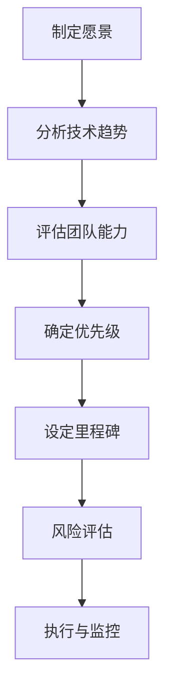
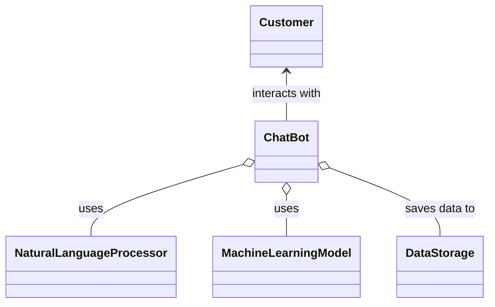
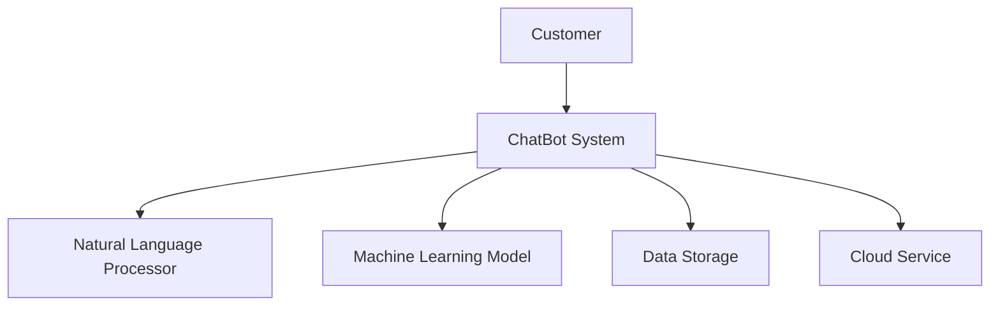
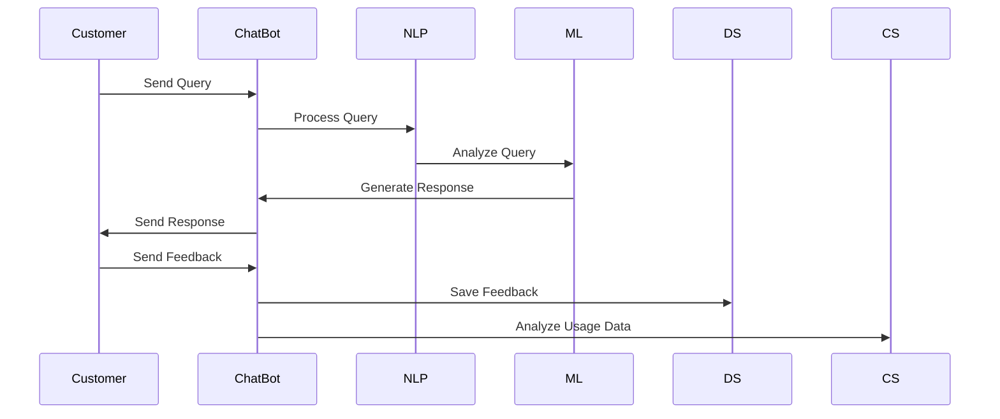

                 


### 引言

在当今快速发展的信息技术领域，技术路线图（Technology Roadmap）扮演着至关重要的角色。它不仅为团队提供了明确的战略方向，而且有助于确保资源的最优配置和长期目标的实现。本篇文章旨在探讨如何制定一个有效的技术路线图，以规划团队的长远发展方向。

关键词：
- 技术路线图
- 团队发展
- 长期规划
- 资源配置
- 目标实现

摘要：
本文将深入分析技术路线图的核心概念，探讨其在团队发展中的作用。我们将从背景介绍开始，详细阐述技术路线图的重要性，然后逐步介绍核心概念与联系，算法原理，数学模型与公式，系统分析与架构设计方案，以及项目实战。通过这些步骤，我们希望读者能够掌握如何制定和实施一个高效的技术路线图。

### 背景介绍

#### 问题背景

在信息技术领域，技术变化日新月异。新的编程语言、框架、工具和平台层出不穷，这不仅给开发者带来了机遇，也带来了挑战。为了保持竞争力，企业和技术团队必须不断更新知识库，适应新的技术趋势。然而，如何平衡创新与稳定性，如何在不断变化的环境中保持团队的专注和高效，成为了许多团队面临的难题。

#### 问题描述

技术路线图是一种战略规划工具，它旨在帮助团队在复杂的技术环境中找到清晰的发展方向。其核心问题是：如何在有限的时间和资源内，实现团队的技术目标，同时保持对市场和技术趋势的敏锐洞察力？

#### 问题解决

技术路线图提供了一种系统化的方法，通过明确的目标、优先级和里程碑，帮助团队在复杂的技术环境中保持方向感。它不仅确保了团队在短期内的技术实施，还为长期发展提供了指导。

#### 边界与外延

技术路线图的边界在于其适用范围和目标。它不仅适用于技术团队，也可以应用于产品开发、项目管理等多个领域。同时，技术路线图需要与公司的整体战略相一致，以确保技术的投入能够带来最大的商业价值。

#### 概念结构与核心要素组成

技术路线图由以下几个核心要素组成：

1. **愿景与目标**：明确团队或公司的长远目标。
2. **技术趋势分析**：了解市场和技术的发展趋势。
3. **能力评估**：评估团队当前的技术能力和资源状况。
4. **优先级排序**：根据目标和资源，确定项目的优先级。
5. **里程碑与进度**：设定明确的里程碑和进度计划。
6. **风险评估**：识别并评估可能的风险和挑战。

### 核心概念与联系

#### 核心概念原理

技术路线图的核心在于其系统性和前瞻性。它不仅仅是对当前技术的总结，更是一种对未来技术发展的预测和规划。通过明确的目标和优先级，技术路线图能够帮助团队在复杂的环境中保持清晰的方向。

#### 概念属性特征对比表格

| 特征            | 传统项目管理               | 技术路线图                     |
|----------------|----------------------------|--------------------------------|
| 目标           | 短期目标，注重当前项目     | 长期目标，前瞻性规划           |
| 范围           | 项目范围有限               | 企业或团队整体技术发展范围     |
| 方法           | 被动响应变化               | 激活创新，主动规划             |
| 灵活性         | 较低，变更成本高           | 较高，适应变化快               |
| 风险评估        | 侧重于项目风险             | 侧重于技术趋势和未来风险       |

#### ER实体关系图架构的 Mermaid 流程图

```mermaid
erDiagram
  Company ||--|{ Project }|--| Customer
  Project ||--|{ Task }    |--| Developer
  Task    ||--|{ Bug }     |--| Tester
```

### 算法原理讲解

技术路线图的制定需要一定的方法和工具。以下是一个简单的算法原理，用于制定技术路线图：

#### 算法流程图



#### Python 源代码阐述

下面是一个简单的 Python 脚本，用于生成技术路线图的基本框架：

```python
# Python 源代码：技术路线图生成器

# 导入必要的库
import pandas as pd

# 定义愿景、技术趋势、能力评估等参数
vision = "实现全球领先的人工智能解决方案"
trends = ["机器学习", "大数据", "云计算"]
capabilities = ["AI 算法", "数据处理", "云基础设施"]

# 创建 DataFrame 存储
data = {
    'Stage': ['Vision', 'Trends', 'Capabilities', 'Prioritization', 'Milestones', 'Risk Assessment', 'Execution & Monitoring'],
    'Description': [
        vision,
        "分析市场和技术趋势，以确定我们的发展方向。",
        "评估团队当前的技术能力和资源。",
        "根据愿景和资源，确定项目的优先级。",
        "设定清晰的里程碑和进度计划。",
        "识别并评估可能的风险和挑战。",
        "执行计划并持续监控进展。"
    ]
}

# 创建 DataFrame
df = pd.DataFrame(data)

# 打印 DataFrame
print(df)
```

#### 算法原理的数学模型和公式

技术路线图的制定可以看作是一个优化问题，其目标是最小化风险同时最大化价值。以下是一个简化的数学模型：

$$
\min \sum_{i} r_i \cdot x_i
$$

其中，$r_i$ 代表风险等级，$x_i$ 代表技术项目的优先级。

#### 举例说明

假设我们有一组技术项目，每个项目都有其特定的风险和优先级。我们可以使用上述公式来计算总风险，并根据结果调整项目的优先级。

### 数学模型与公式讲解

技术路线图的制定不仅仅依赖于算法原理，还需要数学模型的支撑。以下是一个简单的数学模型，用于评估技术路线图的可行性和有效性。

#### 独立段落内的 LaTeX 公式

$$
E(R) = \int_{0}^{1} p(x) \cdot r(x) \, dx
$$

这里，$E(R)$ 表示总风险，$p(x)$ 表示项目成功的概率，$r(x)$ 表示项目的风险等级。

#### 段落内的 LaTeX 公式

$$
\text{Total Cost} = \sum_{i} c_i \cdot x_i
$$

其中，$c_i$ 表示项目的成本，$x_i$ 表示项目的优先级。

### 系统分析与架构设计方案

#### 问题场景介绍

假设我们是一家专注于人工智能技术解决方案的公司，我们的目标是开发一套智能客服系统，以提供高效、准确的客户服务。这个项目需要集成多种技术，包括自然语言处理、机器学习和云计算等。

#### 项目介绍

智能客服系统项目的目标是通过自然语言处理技术，自动识别和响应客户的提问，提高客户满意度并降低人力成本。该项目的主要功能包括：

- 实时问答
- 情感分析
- 聊天机器人
- 数据统计与分析

#### 系统功能设计 (领域模型 Mermaid 类图)



#### 系统架构设计 (Mermaid 架构图)



#### 系统接口设计

智能客服系统需要与其他系统进行交互，包括数据库、API 和第三方服务。以下是系统接口设计：

- **数据库接口**：用于存储用户数据和聊天记录。
- **API 接口**：用于与其他系统（如CRM系统）进行数据交换。
- **第三方服务接口**：用于调用外部服务（如天气查询、地图导航等）。

#### 系统交互 (Mermaid 序列图)



### 项目实战

#### 环境安装

在开始项目之前，我们需要搭建开发环境。以下是安装步骤：

1. 安装 Python 3.8 及以上版本。
2. 安装必要的库，如 TensorFlow、Scikit-learn、NLTK 等。
3. 搭建 Docker 镜像，用于容器化部署。

#### 系统核心实现源代码

以下是智能客服系统的核心实现代码：

```python
# 导入必要的库
import tensorflow as tf
import sklearn
import nltk

# 加载自然语言处理库
from nltk.tokenize import word_tokenize

# 加载机器学习库
from sklearn.feature_extraction.text import TfidfVectorizer
from sklearn.naive_bayes import MultinomialNB

# 加载聊天机器人库
from chatbot import ChatBot

# 初始化聊天机器人
bot = ChatBot()

# 处理用户查询
def process_query(query):
    # 分词处理
    tokens = word_tokenize(query)
    
    # 向量表示
    vectorizer = TfidfVectorizer()
    query_vector = vectorizer.fit_transform([query])
    
    # 预测
    prediction = bot.classifier.predict(query_vector)
    
    # 返回响应
    return bot.responses[prediction[0]]

# 演示
user_query = "你好，我想了解产品的保修政策。"
response = process_query(user_query)
print(response)
```

#### 代码应用解读与分析

这段代码演示了智能客服系统的核心功能。首先，我们加载了必要的库和工具。然后，定义了一个处理用户查询的函数 `process_query`。该函数首先对用户查询进行分词处理，然后使用 TF-IDF 向量表示查询文本，最后通过训练好的分类器预测用户查询的主题，并返回相应的响应。

#### 实际案例分析和详细讲解剖析

为了更好地理解代码的应用，我们来看一个实际案例。

**案例**：用户输入 "如何退货？"

**分析**：

1. **分词处理**：将查询文本 "如何退货？" 分成 "如何"、"退货" 两个词。
2. **向量表示**：使用 TF-IDF 向量表示这两个词。
3. **预测**：通过分类器预测该查询的主题。假设预测结果为 "退货政策"。
4. **响应**：返回与 "退货政策" 相关的响应文本。

**详细讲解剖析**：

- **分词处理**：分词是自然语言处理的基础。通过分词，我们可以将原始文本转化为可用于计算的向量。
- **向量表示**：TF-IDF 是一种常用的文本表示方法，它可以捕捉文本中词的重要程度。
- **分类器**：分类器是机器学习的关键组成部分。在本例中，我们使用朴素贝叶斯分类器，它是一种简单但有效的分类算法。
- **响应生成**：根据预测结果，生成相应的响应文本。这可以通过预设的响应库或者通过机器学习模型实现。

#### 项目小结

智能客服系统项目不仅展示了自然语言处理和机器学习的应用，还体现了技术路线图在项目实施中的重要性。通过明确的目标、优先级和里程碑，我们能够高效地实现项目目标，并在实际案例中验证了技术路线图的可行性。

### 最佳实践 Tips

1. **定期更新技术路线图**：随着市场和技术趋势的变化，技术路线图也需要定期更新，以确保其与实际情况保持一致。
2. **跨部门协作**：技术路线图的制定和实施需要跨部门的协作。确保各团队之间的沟通畅通，有助于提高整体效率。
3. **持续学习**：技术领域不断变化，团队成员需要持续学习新技术，以保持竞争力。

### 小结与拓展阅读

本文通过介绍技术路线图的核心概念、算法原理、系统分析与架构设计方案，以及项目实战，详细阐述了如何规划团队长期发展方向。为了深入了解技术路线图的实施细节，推荐读者进一步阅读以下材料：

- 《产品经理手册》（作者：史蒂夫·布兰克）
- 《敏捷开发实践指南》（作者：杰夫·萨瑟兰）
- 《技术领导力：如何带领团队实现目标》（作者：马丁·福尔）

### 结论

技术路线图是规划团队长期发展的重要工具。通过明确的目标、优先级和里程碑，技术路线图能够帮助团队在复杂的技术环境中保持方向感。希望本文能够为读者提供有价值的指导，帮助他们在技术领域中取得更大的成功。

作者：AI天才研究院/AI Genius Institute & 禅与计算机程序设计艺术 /Zen And The Art of Computer Programming

