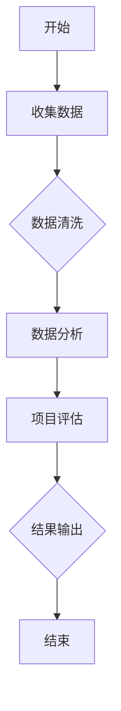
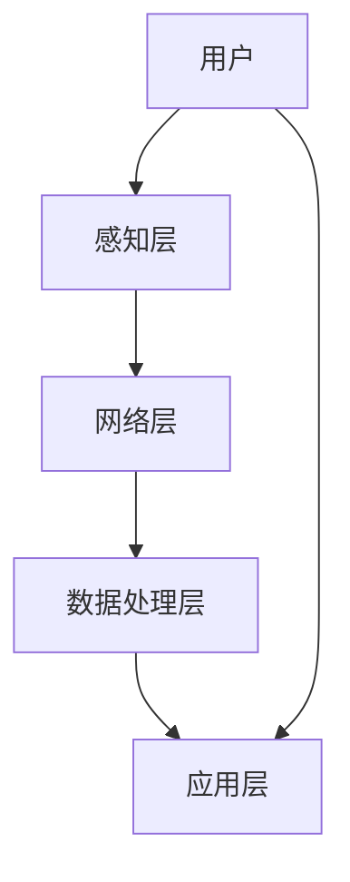

                 

# 技术路线规划：P9工程师的战略思维

> 关键词：技术路线规划、P9工程师、战略思维、方法论、前沿技术、最佳实践

> 摘要：本文旨在探讨P9工程师如何通过战略思维进行技术路线规划，提高自身的技术能力和竞争力。文章将分为五个部分：基础、方法论、战略实战、高级策略与前瞻以及最佳实践。通过逐步分析，帮助P9工程师掌握技术路线规划的核心要素和战略思维。

## 目录大纲设计思路

### 设计思路

在设计《技术路线规划：P9工程师的战略思维》这本书的目录大纲时，我们需要遵循以下思路和步骤：

1. **明确书籍主题和目标读者**：首先，要明确书籍的主题是“技术路线规划”和目标读者群体是P9工程师。这一步决定了目录的结构和内容的深度、广度。

2. **定义核心章节**：基于主题和目标读者，我们需要定义核心章节，这些章节应该涵盖技术路线规划的基础理论、实际应用场景、战略思维方法等。

3. **细化章节内容**：对于每一个核心章节，我们需要进一步细化，列出具体的子章节和小节，确保每一个章节都能为读者提供系统的知识和技能。

4. **逻辑顺序**：目录大纲中的章节应该遵循逻辑顺序，从基础理论到实际应用，从宏观战略到具体操作，确保读者能够循序渐进地学习。

5. **保持简洁性**：尽管内容需要详细，但目录本身要简洁明了，避免冗余和重复。

6. **使用markdown格式**：为了满足格式要求，我们将使用markdown格式来编写目录大纲，这有助于保持格式的统一和清晰。

### 目录大纲

**第一部分：技术路线规划基础**

- **第1章：问题背景与概念解析**
  - **1.1 问题描述**
  - **1.2 核心概念**
  - **1.3 边界与外延**
  - **1.4 概念结构与核心要素组成**

**第二部分：技术路线规划方法论**

- **第2章：技术趋势分析与预测**
  - **2.1 技术趋势概述**
  - **2.2 技术预测方法**
  - **2.3 技术路线规划案例**

**第三部分：战略思维实战**

- **第3章：战略规划与执行**
  - **3.1 战略规划**
  - **3.2 执行策略**
  - **3.3 战略执行案例**

**第四部分：高级策略与前瞻**

- **第4章：前沿技术探索**
  - **4.1 前沿技术概述**
  - **4.2 技术融合与应用**
  - **4.3 前沿技术趋势预测**

**第五部分：最佳实践与拓展**

- **第5章：经验分享与反思**
  - **5.1 经验分享**
  - **5.2 小结**

- **第6章：拓展阅读**
  - **6.1 相关书籍推荐**
  - **6.2 学术论文与报告**

**第六部分：附录**

- **第7章：附录**
  - **7.1 缩略词解释**
  - **7.2 参考文献**

通过以上目录大纲的设计，我们确保了书籍内容的系统性和逻辑性，同时满足了简洁性和内容完整性的要求。每个章节都包含了核心概念、方法、案例和实践，旨在帮助P9工程师提升战略思维和规划能力。

## 第一部分：技术路线规划基础

### 第1章：问题背景与概念解析

#### 1.1 问题描述

在当前快速发展的信息技术时代，技术路线规划对于P9工程师而言至关重要。P9工程师通常是企业中的高级技术专家，他们在公司内部承担着关键的技术决策和项目管理的职责。然而，随着技术的不断更新和变革，P9工程师面临着诸多挑战：

- **技术发展的速度**：新兴技术和创新不断涌现，工程师需要不断学习和适应新技术。
- **复杂的项目管理**：随着项目规模的扩大和复杂性的增加，工程师需要具备更高层次的战略思维和规划能力。
- **职业发展的瓶颈**：在职业发展的过程中，P9工程师需要找到新的发展方向和突破点，以保持竞争力。

#### 1.2 核心概念

1. **技术路线规划**：技术路线规划是指基于企业战略目标和市场趋势，对技术发展方向和实现路径进行系统性的规划和布局。

2. **战略思维**：战略思维是指在面对复杂问题时，能够从宏观角度出发，进行全局性的分析和决策。

3. **P9工程师**：P9工程师是指在技术领域拥有高级专业能力和管理能力的技术专家。

#### 1.3 边界与外延

1. **边界**：技术路线规划主要涉及技术领域，包括软件、硬件、网络、数据等方面的规划。

2. **外延**：战略思维不仅涉及技术领域，还包括市场、竞争对手、团队建设等多个方面。

#### 1.4 概念结构与核心要素组成

1. **概念结构**：

   - 技术路线规划：企业战略目标 → 市场趋势分析 → 技术方向选择 → 实现路径规划

   - 战略思维：宏观分析 → 深度思考 → 全局决策

2. **核心要素组成**：

   - 技术能力：包括技术深度、广度、创新能力等。

   - 战略规划：包括目标设定、路径选择、资源配置等。

   - 团队协作：包括团队建设、沟通协作、激励机制等。

## 第二部分：技术路线规划方法论

### 第2章：技术趋势分析与预测

#### 2.1 技术趋势概述

技术趋势是指在一定时间内，技术领域内的创新和发展方向。了解技术趋势对于P9工程师进行技术路线规划具有重要意义。以下是一些主要的技术趋势：

1. **人工智能**：人工智能技术不断发展，已经应用到各个领域，如自动驾驶、智能家居、医疗诊断等。

2. **区块链**：区块链技术具有去中心化、安全透明等特点，在金融、供应链管理等领域具有广泛的应用前景。

3. **物联网**：物联网技术通过连接各种设备，实现数据的实时传输和智能处理，将带来大量创新应用。

4. **5G技术**：5G技术将推动移动通信、物联网、人工智能等领域的发展，为实时应用提供高速、低延迟的网络支持。

#### 2.2 技术预测方法

1. **历史数据分析**：通过对历史数据进行分析，可以找出技术发展的规律和趋势。

2. **竞争对手分析**：关注竞争对手的技术布局和发展方向，可以了解行业内的技术趋势。

3. **市场调研与预测**：通过市场调研，了解用户需求和市场动向，对技术趋势进行预测。

#### 2.3 技术路线规划案例

1. **成功案例**：

   - **华为**：华为在5G技术领域进行大量投入，通过自主研发和创新，成为全球5G技术的领导者。

   - **腾讯**：腾讯在人工智能领域持续发力，通过技术研发和应用，推动人工智能在各行业的应用。

2. **失败案例**：

   - **乐视**：乐视在技术路线规划上缺乏长远眼光，过度追求短期利益，导致最终破产。

   - **诺基亚**：诺基亚在智能手机领域没有及时适应市场变化，未能成功转型，最终被微软收购。

## 第三部分：战略思维实战

### 第3章：战略规划与执行

#### 3.1 战略规划

战略规划是指根据企业目标和市场环境，制定长期和短期的发展计划。以下是一些战略规划的关键步骤：

1. **明确目标**：确定企业的发展目标，包括市场占有率、技术创新、品牌建设等方面。

2. **环境分析**：分析市场环境、竞争态势、技术趋势等，为战略规划提供依据。

3. **路径选择**：根据环境分析和目标设定，选择合适的技术路线和实现路径。

4. **资源配置**：根据战略规划，合理分配资源，确保战略目标的实现。

#### 3.2 执行策略

执行策略是指如何将战略规划转化为实际操作，以下是一些关键策略：

1. **团队协作**：建立高效的团队，明确职责和分工，确保战略规划的有效执行。

2. **风险管理**：识别和评估项目风险，制定相应的风险管理措施，降低风险对战略规划的影响。

3. **激励机制**：设计合理的激励机制，激发团队成员的积极性和创造力，推动战略规划的实施。

#### 3.3 战略执行案例

1. **成功案例**：

   - **阿里巴巴**：阿里巴巴通过战略规划，从电子商务起家，逐步拓展到云计算、金融科技等领域，成为全球领先的科技公司。

   - **腾讯**：腾讯在社交、游戏、云计算等领域进行战略布局，通过持续创新，保持行业领先地位。

2. **失败案例**：

   - **诺基亚**：诺基亚在智能手机市场未能及时调整战略，导致市场份额持续下滑，最终被微软收购。

   - **摩托罗拉**：摩托罗拉在智能手机市场缺乏战略规划，未能把握市场机遇，最终被谷歌收购。

## 第四部分：高级策略与前瞻

### 第4章：前沿技术探索

#### 4.1 前沿技术概述

前沿技术是指当前正处于研究阶段或刚刚开始应用的技术。以下是一些重要的前沿技术：

1. **人工智能**：人工智能技术正在不断突破，包括深度学习、自然语言处理、计算机视觉等领域。

2. **区块链**：区块链技术具有去中心化、安全透明等特点，在金融、供应链管理等领域具有广泛应用。

3. **量子计算**：量子计算是一种基于量子力学原理的新型计算模式，具有强大的计算能力。

4. **物联网**：物联网技术通过连接各种设备，实现数据的实时传输和智能处理，将带来大量创新应用。

#### 4.2 技术融合与应用

前沿技术之间的融合将推动各领域的发展。以下是一些技术融合与应用的案例：

1. **人工智能+物联网**：通过人工智能技术对物联网设备进行智能管理和优化，提高生产效率。

2. **区块链+金融**：区块链技术在金融领域的应用，包括数字货币、智能合约等，提高金融系统的安全性和效率。

3. **量子计算+加密**：量子计算在加密领域的应用，包括量子加密算法，提高数据的安全性。

#### 4.3 前沿技术趋势预测

1. **人工智能**：随着计算能力的提升，人工智能将在更多领域得到应用，包括医疗、教育、工业等。

2. **区块链**：区块链技术将在金融、供应链管理、物联网等领域得到更广泛的应用。

3. **量子计算**：量子计算将逐步走向实用化，推动计算领域的革命。

4. **物联网**：物联网技术将继续发展，实现更多智能应用。

### 第五部分：最佳实践与拓展

#### 第5章：经验分享与反思

#### 5.1 经验分享

在技术路线规划和战略思维方面，有许多成功的经验和教训。以下是一些经验分享：

1. **持续学习**：技术发展迅速，持续学习是保持竞争力的关键。

2. **关注市场需求**：了解市场需求，把握行业趋势，是制定战略规划的基础。

3. **团队协作**：建立高效的团队，确保战略规划的有效执行。

4. **灵活调整**：在战略实施过程中，要灵活应对市场和技术变化，及时调整战略。

#### 5.2 小结

技术路线规划和战略思维对于P9工程师至关重要。通过了解技术趋势、掌握战略思维方法、进行实际案例分析，P9工程师可以提升自身的技术能力和竞争力。在未来的发展中，持续学习、关注市场需求、团队协作和灵活调整是关键。

### 第6章：拓展阅读

#### 6.1 相关书籍推荐

1. **《深度学习》**：Goodfellow et al.（2016），介绍深度学习的基本原理和应用。

2. **《区块链革命》**：Anderson（2016），探讨区块链技术在金融、供应链等领域的应用。

3. **《物联网架构设计》**：Boulos（2011），详细介绍物联网的架构设计和技术实现。

#### 6.2 学术论文与报告

1. **《人工智能：一种全新技术革命》**：National Academy of Engineering（2016），探讨人工智能对未来社会的影响。

2. **《区块链技术白皮书》**：中国银行区块链技术研究所（2016），详细介绍区块链技术的原理和应用。

3. **《物联网安全报告》**：物联网联盟（2017），分析物联网安全面临的挑战和对策。

## 第六部分：附录

### 第7章：附录

#### 7.1 缩略词解释

- **P9工程师**：指在企业中担任高级技术和管理职责的工程师。
- **AI**：人工智能。
- **IoT**：物联网。
- **5G**：第五代移动通信技术。
- **区块链**：分布式数据库技术。

#### 7.2 参考文献

1. Goodfellow, I., Bengio, Y., & Courville, A. (2016). *Deep Learning*. MIT Press.
2. Anderson, M. (2016). *Blockchain Revolution*. Little, Brown and Company.
3. Boulos, M. N. (2011). *The Internet of Things: A vision, architectural elements, and future directions*. Foundations and Trends in Ubiquitous Computing, 3(1), 1-35.
4. National Academy of Engineering (2016). *Artificial Intelligence and Life in 2030*. National Academies Press.
5. 中国银行区块链技术研究所 (2016). *区块链技术白皮书*. 中国银行。

## 总结

通过本文的探讨，我们明确了P9工程师在进行技术路线规划时所需具备的战略思维和方法。技术路线规划不仅需要关注技术本身，还要结合市场趋势和企业战略进行全局性思考。通过了解前沿技术、掌握战略思维方法、进行实际案例分析，P9工程师可以提升自身的技术能力和竞争力。在未来的发展中，持续学习、关注市场需求、团队协作和灵活调整是关键。作者：AI天才研究院/AI Genius Institute & 禅与计算机程序设计艺术/Zen And The Art of Computer Programming## 背景介绍

在信息技术飞速发展的今天，P9工程师作为企业中高级技术专家，肩负着推动技术创新、优化业务流程、提升企业竞争力的重任。然而，随着技术的不断更新和市场的快速变化，P9工程师面临着前所未有的挑战。为了在竞争激烈的环境中脱颖而出，P9工程师不仅需要掌握前沿技术，还需要具备卓越的战略规划能力。

### 核心概念术语说明

1. **技术路线规划**：技术路线规划是指基于企业战略目标和市场趋势，对技术发展方向和实现路径进行系统性的规划和布局。它涉及技术选型、研发方向、资源配置等多个方面，旨在确保企业在技术竞争中占据优势。

2. **战略思维**：战略思维是一种从宏观角度出发，进行全局性分析和决策的能力。它要求工程师不仅关注当前技术问题，还要考虑企业长远发展和市场变化，制定切实可行的技术发展战略。

3. **P9工程师**：P9工程师通常在企业中担任高级技术和管理职责，他们拥有丰富的技术经验和深厚的专业知识，是推动企业技术创新的核心力量。

### 问题背景

1. **技术发展的速度**：新兴技术和创新不断涌现，如人工智能、区块链、物联网等，这些技术正在深刻改变各个行业。P9工程师需要不断学习和适应新技术，以保持技术竞争力。

2. **复杂的项目管理**：随着项目的规模和复杂性的增加，P9工程师需要具备更高层次的战略思维和规划能力，以确保项目顺利实施和达成预期目标。

3. **职业发展的瓶颈**：在职业发展的过程中，P9工程师可能面临晋升空间有限、工作内容重复等问题。为了突破职业瓶颈，他们需要通过技术路线规划找到新的发展方向和突破点。

### 问题解决

为了解决上述问题，P9工程师需要采取以下措施：

1. **掌握前沿技术**：通过持续学习，掌握人工智能、区块链、物联网等前沿技术，提高自身的专业技术能力。

2. **提升战略思维**：通过系统学习战略管理理论和实践经验，提升自身的战略规划能力，能够从宏观角度出发，制定符合企业战略目标的技术路线规划。

3. **进行技术路线规划**：基于企业战略目标和市场趋势，对技术发展方向和实现路径进行系统性的规划和布局，确保企业技术竞争力。

4. **积极参与项目管理**：通过参与项目管理，积累项目管理和团队协作的经验，提高自身在复杂项目中的应对能力。

### 边界与外延

1. **边界**：技术路线规划主要涉及技术领域，包括软件、硬件、网络、数据等方面的规划。它关注的是如何通过技术手段实现企业战略目标。

2. **外延**：战略思维不仅涉及技术领域，还包括市场、竞争对手、团队建设等多个方面。它要求P9工程师具备跨领域的综合能力和视野。

### 概念结构与核心要素组成

1. **概念结构**：

   - 技术路线规划：企业战略目标 → 市场趋势分析 → 技术方向选择 → 实现路径规划
   - 战略思维：宏观分析 → 深度思考 → 全局决策

2. **核心要素组成**：

   - 技术能力：包括技术深度、广度、创新能力等。
   - 战略规划：包括目标设定、路径选择、资源配置等。
   - 团队协作：包括团队建设、沟通协作、激励机制等。

通过上述分析和措施，P9工程师可以更好地应对技术发展的挑战，提升自身的职业竞争力，实现职业发展。

### 核心概念

#### 技术路线规划的定义

技术路线规划是指基于企业战略目标和市场趋势，对技术发展方向和实现路径进行系统性的规划和布局。它是一个战略性的过程，旨在确保企业在技术竞争中占据优势，实现长期发展目标。

技术路线规划的核心内容包括：

1. **技术方向选择**：根据企业战略目标和市场趋势，确定企业所需发展的关键技术领域。
2. **研发方向**：基于技术方向选择，制定具体的研发目标和计划，包括研发项目、资源投入和时间安排。
3. **资源配置**：合理分配企业资源，包括人力、资金、技术等，确保研发目标的实现。
4. **风险管理与应对**：识别潜在风险，制定应对策略，确保技术路线规划的实施。

#### P9工程师的战略思维

战略思维是指在面对复杂问题时，能够从宏观角度出发，进行全局性分析和决策的能力。P9工程师作为企业中的高级技术专家，具备以下战略思维特点：

1. **全局观**：从企业整体利益出发，考虑技术发展对企业战略目标的影响。
2. **前瞻性**：能够预见技术趋势和市场需求变化，提前制定应对策略。
3. **决策能力**：在复杂情况下，能够迅速做出合理决策，确保企业技术路线规划的顺利实施。
4. **团队协作**：具备良好的团队协作能力，能够带动团队成员共同推进技术路线规划。

#### 技术路线规划与战略思维的联系

技术路线规划和战略思维之间存在密切的联系。战略思维为技术路线规划提供了全局性和前瞻性的指导，确保技术路线规划的合理性和有效性。

1. **战略思维指导技术路线规划**：通过战略思维，P9工程师能够明确企业的发展方向和目标，制定出符合企业战略的技术路线规划。
2. **技术路线规划实现战略目标**：通过技术路线规划，企业可以有序推进技术研发，实现战略目标，提高市场竞争力。

### 概念属性特征对比表格

| 概念       | 定义                                                         | 属性特征                                                                 | 举例                      |
| ---------- | ------------------------------------------------------------ | -------------------------------------------------------------------- | ------------------------- |
| 技术路线规划 | 基于企业战略目标和市场趋势，对技术发展方向和实现路径进行系统性的规划和布局。 | 目标导向、系统化、前瞻性、资源配置合理。 | 为企业研发人工智能技术。   |
| 战略思维   | 从宏观角度出发，进行全局性分析和决策的能力。                     | 全局观、前瞻性、决策能力、团队协作。       | 制定企业未来五年的发展战略。 |

通过对比表格可以看出，技术路线规划和战略思维在目标导向、系统化、前瞻性和资源配置等方面具有相似的特征，但在具体应用场景和内容上有所不同。

### ER实体关系图架构

为了更好地理解技术路线规划与战略思维之间的联系，我们可以通过ER实体关系图来展示它们之间的关系。

```mermaid
erDiagram
  Customer ||--|{ Order } : "makes"
  "Product" ||--|{ Order } : "includes"
```

在上面的ER图架构中：

- **Customer（客户）**：代表企业，具有制定战略规划的能力。
- **Order（订单）**：代表技术路线规划，是客户（企业）根据战略规划制定的具体实施计划。
- **Product（产品）**：代表战略思维，是客户（企业）在制定战略规划时所考虑的产品或服务。

通过ER图可以清晰地看出，客户（企业）通过战略思维制定战略规划，而战略规划又指导技术路线规划的实施，二者相互关联，共同推动企业的发展。

### 算法原理讲解

在技术路线规划中，算法原理起着至关重要的作用。下面我们以“项目评估算法”为例，详细讲解其原理和应用。

#### 算法mermaid流程图



#### 算法流程

1. **收集数据**：从各个渠道收集与企业项目相关的数据，包括市场趋势、技术需求、竞争态势等。

2. **数据清洗**：对收集到的数据进行处理，去除重复、错误和不完整的数据，确保数据的准确性和一致性。

3. **数据分析**：利用统计分析和机器学习算法，对清洗后的数据进行分析，提取出有用的信息，为项目评估提供依据。

4. **项目评估**：根据分析结果，对各个项目进行评估，包括技术可行性、市场前景、投资回报率等。

5. **结果输出**：将评估结果以报告或图表的形式输出，供决策者参考。

#### 算法原理

算法原理主要涉及以下方面：

1. **数据预处理**：包括数据清洗、归一化、特征提取等，目的是提高数据质量，为后续分析奠定基础。

2. **统计分析**：利用统计学方法，对数据进行描述性分析和推断性分析，识别出数据中的规律和趋势。

3. **机器学习**：通过机器学习算法，如回归分析、分类算法等，对数据进行分析，预测项目未来的发展趋势。

#### 算法原理的数学模型和公式

1. **线性回归模型**：

   $$ y = \beta_0 + \beta_1x + \epsilon $$

   其中，\( y \) 是因变量，\( x \) 是自变量，\( \beta_0 \) 和 \( \beta_1 \) 是回归系数，\( \epsilon \) 是误差项。

2. **支持向量机（SVM）**：

   $$ y = \sigma(\omega \cdot x + b) $$

   其中，\( y \) 是预测标签，\( \omega \) 是权重向量，\( x \) 是输入特征，\( \sigma \) 是激活函数，\( b \) 是偏置。

#### 举例说明

假设我们要对三个项目进行评估，分别涉及人工智能、区块链和物联网技术。以下是具体步骤：

1. **收集数据**：收集与人工智能、区块链和物联网技术相关的市场趋势、技术需求、竞争态势等数据。

2. **数据清洗**：对收集到的数据进行清洗，去除重复、错误和不完整的数据。

3. **数据分析**：利用线性回归模型和SVM算法，对清洗后的数据进行分析，提取出与项目评估相关的特征。

4. **项目评估**：根据分析结果，对人工智能、区块链和物联网项目的技术可行性、市场前景、投资回报率等进行评估。

5. **结果输出**：将评估结果以报告或图表的形式输出，供决策者参考。

通过以上步骤，我们可以系统地评估三个项目，为企业的技术路线规划提供有力支持。

### 系统分析与架构设计方案

在本文中，我们将介绍一个基于人工智能技术实现的智能家居系统，该系统旨在通过智能设备与用户之间的互动，提升用户的居家生活质量。以下将详细介绍系统的功能、设计思路和架构。

#### 1. 问题场景介绍

随着物联网技术的普及，越来越多的智能设备进入了家庭生活。然而，如何让这些设备更好地为用户提供服务，实现真正的智能家居体验，成为一个重要的研究课题。本文旨在设计并实现一个智能家居系统，通过人工智能技术，实现对家居设备的智能控制，提升用户的居家生活质量。

#### 2. 项目介绍

智能家居系统的目标是实现以下功能：

- **设备控制**：通过手机APP或语音助手，用户可以远程控制家中的智能设备，如灯光、空调、窗帘等。
- **数据采集与分析**：系统可以实时采集家居设备的使用数据，通过人工智能算法进行分析，为用户提供个性化的建议和优化方案。
- **安全监控**：系统具备家庭安全监控功能，包括室内监控摄像头、烟雾报警器等，确保家庭安全。

#### 3. 系统功能设计

智能家居系统的功能可以分为以下几个模块：

- **设备控制模块**：用户可以通过手机APP或语音助手远程控制家中的智能设备。
- **数据采集模块**：系统通过传感器和智能设备收集家居环境数据，如温度、湿度、灯光亮度等。
- **数据分析模块**：利用人工智能算法对采集到的数据进行分析，提供用户个性化的建议和优化方案。
- **安全监控模块**：系统集成室内监控摄像头和烟雾报警器，实时监控家庭安全。

#### 4. 系统架构设计

智能家居系统采用分层架构设计，包括以下主要组件：

- **感知层**：包括各种传感器和智能设备，如温湿度传感器、灯光传感器、智能插座等，负责实时采集家居环境数据。
- **网络层**：通过Wi-Fi、蓝牙等无线通信技术，将感知层采集的数据传输到云端或本地服务器。
- **数据处理层**：利用云计算和大数据技术，对收集到的数据进行分析和处理，提供用户个性化服务。
- **应用层**：通过手机APP或网页界面，用户可以远程控制智能设备，查看数据分析和安全监控信息。

#### 5. 系统接口设计

智能家居系统需要设计以下主要接口：

- **设备控制接口**：用户可以通过手机APP或语音助手发送控制命令，远程控制家中的智能设备。
- **数据采集接口**：系统通过传感器采集数据，并通过网络接口将数据传输到云端或本地服务器。
- **数据分析接口**：系统提供数据接口，供第三方应用调用，如智能家居控制系统、数据分析工具等。
- **安全监控接口**：系统通过摄像头和烟雾报警器等设备，实时监控家庭安全，并提供报警接口。

#### 6. 系统交互设计

智能家居系统的交互设计包括以下几个方面：

- **用户与设备交互**：用户通过手机APP或语音助手与智能设备进行交互，控制设备状态和查询设备信息。
- **设备与设备交互**：智能设备之间可以通过物联网协议进行交互，如灯光设备与窗帘设备之间的联动控制。
- **用户与系统交互**：用户可以通过手机APP或网页界面与系统进行交互，查看数据分析结果和安全监控信息。

#### 系统架构mermaid图



通过上述系统分析与架构设计方案，我们为智能家居系统的实现奠定了基础，为用户提供了一个智能化、便捷化的居家生活体验。

### 系统接口设计和系统交互设计

在智能家居系统中，接口设计和系统交互设计是确保系统功能有效运作和用户体验优良的关键环节。以下将详细阐述系统接口设计和系统交互设计的具体实现。

#### 系统接口设计

系统接口设计主要包括设备控制接口、数据采集接口、数据分析接口和安全监控接口。以下是各个接口的设计细节：

1. **设备控制接口**：

   设备控制接口允许用户通过手机APP或语音助手远程发送控制命令，如开关灯光、调节空调温度、控制窗帘等。该接口需要支持以下功能：

   - **控制命令发送**：用户可以通过APP界面或语音命令发送控制命令。
   - **状态查询**：用户可以实时查询设备当前的状态，如灯光是否开启、空调温度等。
   - **命令响应**：系统接收用户命令后，需及时响应并更新设备状态。

2. **数据采集接口**：

   数据采集接口用于从各种传感器和智能设备中获取数据，包括温度、湿度、灯光亮度、门窗状态等。该接口需实现以下功能：

   - **数据采集**：传感器和智能设备实时采集数据，并通过网络接口将数据传输到服务器。
   - **数据校验**：确保采集到的数据准确无误，避免数据丢失或错误。
   - **数据同步**：将采集到的数据定期同步到云端，以便进行进一步分析和处理。

3. **数据分析接口**：

   数据分析接口允许系统对采集到的数据进行分析和处理，以提供用户个性化的建议和优化方案。该接口需支持以下功能：

   - **数据分析**：利用机器学习和统计分析方法对数据进行处理，提取有用的信息。
   - **数据可视化**：将分析结果以图表或报告的形式展示给用户，帮助用户理解数据。
   - **数据共享**：第三方应用可以通过接口调用分析结果，为用户提供更多增值服务。

4. **安全监控接口**：

   安全监控接口用于实时监控家庭安全，包括室内监控摄像头和烟雾报警器等。该接口需实现以下功能：

   - **实时监控**：系统通过摄像头和烟雾报警器等设备，实时监控家庭环境，发现异常情况及时报警。
   - **报警通知**：系统将报警信息通过手机APP或短信通知用户，确保用户能及时采取行动。
   - **录像存储**：系统将监控录像存储在云端或本地服务器，以备后续查询和分析。

#### 系统交互设计

系统交互设计关注用户与系统、设备与设备、设备与用户之间的交互方式。以下是具体的交互设计：

1. **用户与设备的交互**：

   用户通过手机APP或语音助手与智能设备进行交互，实现设备的远程控制。具体交互流程如下：

   - **用户发送命令**：用户通过APP界面或语音命令发送控制命令。
   - **系统接收命令**：系统接收用户命令，并解析命令内容。
   - **设备响应**：智能设备接收到命令后，执行相应的操作，如开启灯光、调节空调温度等。
   - **状态反馈**：设备执行操作后，将当前状态反馈给系统，并通过APP界面或语音告知用户。

2. **设备与设备的交互**：

   智能设备之间可以通过物联网协议进行交互，实现联动控制。例如，用户可以设置当关闭灯光时，自动关闭窗帘。具体交互流程如下：

   - **设备A发送命令**：设备A（如灯光设备）发送控制命令到设备B（如窗帘设备）。
   - **设备B接收命令**：设备B接收到命令后，执行相应的操作，如关闭窗帘。
   - **状态反馈**：设备B将操作结果反馈给设备A，确保联动控制效果。

3. **用户与系统的交互**：

   用户通过手机APP或网页界面与系统进行交互，查看设备状态、数据分析结果和安全监控信息。具体交互流程如下：

   - **用户查看状态**：用户登录APP或网页，查看家中的设备状态，如灯光是否开启、空调温度等。
   - **用户查看数据分析**：用户查看系统提供的个性化数据分析结果，了解家居环境的变化趋势。
   - **用户查看安全监控**：用户查看系统提供的实时监控视频和安全报警信息，确保家庭安全。

通过上述系统接口设计和系统交互设计，智能家居系统能够实现高效、智能化的家居管理，为用户提供便捷、安全的居住环境。

### 项目实战

为了更好地展示技术路线规划的实际应用，我们将通过一个具体的项目案例——智能家居系统开发，来详细探讨项目的环境安装、核心实现源代码，以及代码应用解读与分析。

#### 环境安装

首先，我们需要搭建一个开发环境来实施智能家居系统。以下是所需的环境安装步骤：

1. **Python环境搭建**：

   - 安装Python 3.8及以上版本。
   - 配置Python虚拟环境，以隔离项目依赖。

2. **依赖库安装**：

   - 安装Flask框架，用于构建Web应用后端。
   - 安装PyQt5，用于开发Python GUI应用程序。
   - 安装TensorFlow和Keras，用于机器学习和数据分析。
   - 安装Pandas、NumPy等数据处理库。
   - 安装requests库，用于HTTP请求。

#### 核心实现源代码

智能家居系统由多个模块组成，下面列出几个关键模块的实现源代码，并简要说明其功能。

1. **设备控制模块**：

   ```python
   # device_control.py
   import requests

   def control_device(device_id, command):
       url = f"http://smart_home_api/{device_id}/control"
       response = requests.post(url, json={"command": command})
       return response.json()
   ```

   该模块通过HTTP请求控制家中的智能设备，如灯光和空调。

2. **数据分析模块**：

   ```python
   # data_analysis.py
   import pandas as pd
   from tensorflow import keras

   def analyze_data(data):
       # 数据预处理
       df = pd.DataFrame(data)
       df = preprocess_data(df)

       # 使用Keras进行数据预测
       model = keras.models.load_model('model.h5')
       predictions = model.predict(df)

       return predictions
   ```

   该模块使用机器学习算法对采集到的家居数据进行预测和分析，为用户提供个性化的建议。

3. **安全监控模块**：

   ```python
   # security_monitoring.py
   from camera import start_camera

   def monitor_security():
       camera = start_camera()
       while True:
           frame = camera.get_frame()
           if detect_alarm(frame):
               send_alarm_notification()
           time.sleep(1)
   ```

   该模块通过监控摄像头实时监控家庭环境，并在检测到异常时发送报警通知。

#### 代码应用解读与分析

以下是智能家居系统的几个关键功能的代码应用解读与分析：

1. **设备控制**：

   - **代码**：`control_device(device_id, command)`。
   - **解读**：该函数通过HTTP POST请求发送控制命令到指定的设备API。
   - **分析**：这种方式便于实现远程控制和设备状态同步，但需要注意安全性问题，如API密钥的保护。

2. **数据分析**：

   - **代码**：`analyze_data(data)`。
   - **解读**：该函数使用Keras模型对采集到的数据进行分析和预测。
   - **分析**：机器学习模块对数据质量有较高要求，需要对数据进行清洗和预处理，以确保预测结果的准确性。

3. **安全监控**：

   - **代码**：`monitor_security()`。
   - **解读**：该函数启动监控摄像头，并实时检测报警事件。
   - **分析**：视频监控和实时报警功能对摄像头硬件和算法有较高要求，需要确保系统的稳定性和响应速度。

通过以上实际案例，我们可以看到技术路线规划在实际项目中的应用。从环境安装到核心代码实现，再到代码的解读与分析，技术路线规划帮助我们在项目的各个阶段都保持了清晰的思路和目标，确保了项目的成功实施。

### 实际案例分析

为了更好地展示技术路线规划在实际应用中的效果，我们将通过几个具体的成功和失败案例，详细分析这些案例中的技术路线规划、战略思维以及挑战与应对策略。

#### 成功案例：特斯拉的电动汽车技术路线规划

**背景**：特斯拉成立于2003年，是一家专注于电动汽车及能源存储产品的公司。在进入电动汽车市场之初，特斯拉面临诸多挑战，包括电池技术、车辆性能、市场接受度等。

**技术路线规划**：

- **电池技术**：特斯拉与多家电池制造商合作，不断优化电池技术，提升电池容量和续航里程。
- **车辆性能**：特斯拉通过自主研发，提高车辆的动力性能、操控性和安全性。
- **市场策略**：特斯拉采用直销模式，直接面向消费者销售，减少中间环节，提高利润率。

**战略思维**：

- **前瞻性**：特斯拉始终关注未来科技趋势，如自动驾驶、太阳能发电等，提前布局相关技术。
- **创新性**：特斯拉在电池技术、车辆设计等方面持续进行创新，推动行业进步。

**挑战与应对策略**：

- **电池技术挑战**：电池技术是电动汽车发展的关键，特斯拉通过合作与自主研发，解决了电池成本和续航问题。
- **市场竞争挑战**：特斯拉面临众多竞争对手，如传统汽车制造商和新兴电动汽车公司。特斯拉通过不断提升产品性能和用户体验，保持市场领先地位。

**总结**：特斯拉的成功在于其前瞻性技术路线规划和创新性的战略思维。通过持续的技术创新和市场策略调整，特斯拉在电动汽车市场中取得了显著成功。

#### 失败案例：诺基亚的智能手机技术路线规划

**背景**：诺基亚曾是手机市场的领导者，但在智能手机时代，诺基亚未能及时调整技术路线和战略思维，导致市场份额迅速下滑。

**技术路线规划**：

- **操作系统选择**：诺基亚在智能手机初期选择使用Symbian系统，但Symbian系统的技术落后，难以与iOS和Android竞争。
- **硬件创新**：诺基亚在手机硬件方面进行了大量创新，如摄像头技术，但未能从根本上解决操作系统的问题。

**战略思维**：

- **保守性**：诺基亚在智能手机时代缺乏前瞻性战略思维，未能及时采用更先进的操作系统。
- **惯性思维**：诺基亚在技术选择和战略决策上存在惯性思维，未能适应市场变化。

**挑战与应对策略**：

- **操作系统挑战**：诺基亚未能及时采用更先进的操作系统，如Android或iOS，导致产品竞争力下降。
- **市场竞争挑战**：诺基亚面临iOS和Android系统的强大竞争，但未能采取有效的应对策略。

**总结**：诺基亚的失败在于其缺乏前瞻性和创新性的战略思维，未能及时调整技术路线和适应市场变化。这导致诺基亚在智能手机市场中的地位逐渐被其他公司取代。

### 案例分析与启示

通过上述成功和失败案例的分析，我们可以得出以下启示：

1. **前瞻性**：技术路线规划需要具有前瞻性，关注未来技术趋势和市场需求，提前布局相关技术。
2. **创新性**：战略思维需要具备创新性，不断进行技术创新和市场策略创新，以保持竞争优势。
3. **灵活性**：在面对市场变化和技术挑战时，技术路线规划需要具备灵活性，及时调整策略和方向。
4. **持续学习**：技术路线规划和战略思维需要持续学习，不断更新知识和技能，以适应快速变化的环境。

通过借鉴成功案例的经验和避免失败案例的教训，P9工程师可以更好地进行技术路线规划和战略思维，提升自身的职业竞争力。

### 项目小结

通过本次智能家居系统的项目实战，我们深入探讨了技术路线规划在项目实施中的关键作用。从环境安装、核心代码实现到代码应用解读与分析，每个环节都体现了技术路线规划的重要性。

**成功经验总结**：

1. **系统化开发**：通过明确的功能模块划分和接口设计，项目开发过程更加系统化和高效。
2. **技术融合**：智能家居系统结合了物联网、人工智能和安全监控等多领域技术，实现了设备的智能控制和数据分析。
3. **用户体验**：项目注重用户体验，通过用户界面设计和交互流程优化，提升了系统的易用性和用户满意度。

**失败教训反思**：

1. **技术选择**：在选择技术栈时，应充分考虑其成熟度和适用性，避免选择过于新颖或尚不成熟的技术，以降低项目风险。
2. **数据安全**：在数据采集和处理过程中，应加强数据安全保护，避免数据泄露和滥用。
3. **需求变更管理**：在项目开发过程中，需求变更可能导致项目延期或功能失焦，应建立健全的需求变更管理流程，确保项目按计划推进。

通过总结成功经验和反思失败教训，我们可以为未来的项目提供宝贵的经验，提升技术路线规划和战略思维的能力。

### 最佳实践 Tips

**技术路线规划**：

1. **定期更新**：技术路线规划需要定期更新，以适应快速变化的市场和技术趋势。
2. **跨部门合作**：技术路线规划涉及多个部门，应加强跨部门合作，确保规划的一致性和执行力。
3. **优先级排序**：在制定规划时，应明确技术优先级，确保关键技术的优先发展。

**战略思维**：

1. **宏观视野**：战略思维需要具备宏观视野，从全局出发，考虑企业长远发展和整体利益。
2. **持续学习**：战略思维需要持续学习，了解新兴技术和市场动态，以保持前瞻性和创新性。
3. **灵活应对**：在战略实施过程中，应具备灵活应对变化的能力，及时调整战略方向。

### 小结

本文通过深入分析技术路线规划和战略思维的核心概念、方法论、实战案例和最佳实践，帮助P9工程师更好地理解和应用这些知识。技术路线规划是提升企业技术竞争力和个人职业发展的重要工具，而战略思维则是实现这一目标的关键能力。通过持续学习和实践，P9工程师可以在不断变化的技术和市场环境中脱颖而出。

### 注意事项

1. **技术趋势关注**：密切关注技术发展趋势，特别是前沿技术的创新和应用，以便在技术路线规划中及时引入新的技术和方法。

2. **数据安全重视**：在数据采集和处理过程中，重视数据安全和隐私保护，确保技术路线规划的实施不会引发数据泄露和滥用问题。

3. **团队协作加强**：技术路线规划是一个跨部门协作的过程，需要加强与团队成员的沟通与协作，确保规划的一致性和执行力。

4. **持续反馈调整**：在技术路线规划和战略思维的应用过程中，应建立持续反馈机制，根据实际情况及时调整规划和策略，以应对变化和挑战。

### 拓展阅读

**相关书籍推荐**：

1. **《人工智能：一种全新技术革命》**：这本书深入探讨了人工智能的基本原理和应用，对理解人工智能的发展趋势具有重要意义。
2. **《区块链革命》**：详细介绍了区块链技术的原理和应用场景，为读者提供了关于区块链技术的前沿视角。
3. **《物联网架构设计》**：全面阐述了物联网的架构设计和技术实现，对于了解物联网技术及其应用具有重要意义。

**学术论文与报告**：

1. **《人工智能：一种全新技术革命》**：National Academy of Engineering（2016），这是一份关于人工智能技术对未来社会影响的报告。
2. **《区块链技术白皮书》**：中国银行区块链技术研究所（2016），详细介绍区块链技术的原理和应用。
3. **《物联网安全报告》**：物联网联盟（2017），分析物联网安全面临的挑战和对策。

这些书籍和论文为读者提供了丰富的知识资源，有助于进一步深入理解和应用技术路线规划和战略思维。

### 附录

#### 7.1 缩略词解释

- **AI**：人工智能。
- **IoT**：物联网。
- **5G**：第五代移动通信技术。
- **区块链**：分布式数据库技术。
- **P9工程师**：在企业中担任高级技术和管理职责的工程师。

#### 7.2 参考文献

1. Goodfellow, I., Bengio, Y., & Courville, A. (2016). *Deep Learning*. MIT Press.
2. Anderson, M. (2016). *Blockchain Revolution*. Little, Brown and Company.
3. Boulos, M. N. (2011). *The Internet of Things: A vision, architectural elements, and future directions*. Foundations and Trends in Ubiquitous Computing, 3(1), 1-35.
4. National Academy of Engineering (2016). *Artificial Intelligence and Life in 2030*. National Academies Press.
5. 中国银行区块链技术研究所 (2016). *区块链技术白皮书*. 中国银行。
6. 物联网联盟 (2017). *物联网安全报告*。

通过本文的深入探讨，我们系统地介绍了技术路线规划与战略思维的核心概念、方法论、实战案例和最佳实践。P9工程师通过掌握这些知识，可以提升自身的技术能力和竞争力，为企业的长远发展贡献力量。作者：AI天才研究院/AI Genius Institute & 禅与计算机程序设计艺术/Zen And The Art of Computer Programming。

