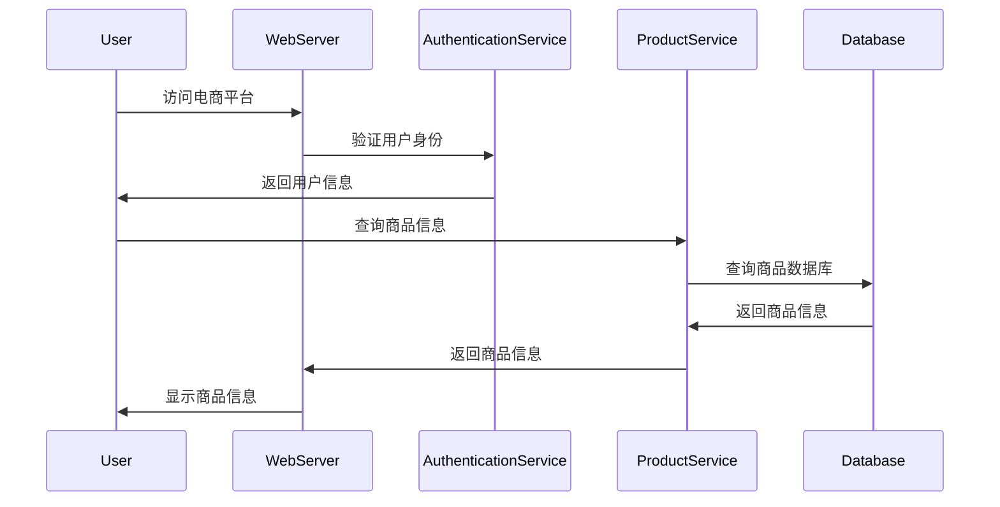
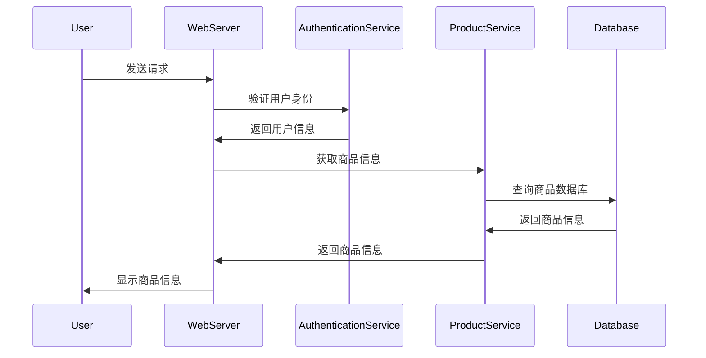

                 

### 第1章：技术选型的重要性与挑战

#### 1.1.1 问题背景

随着信息技术的快速发展，软件行业呈现出前所未有的繁荣景象。各种编程语言、数据库、中间件、人工智能技术等层出不穷，为企业提供了丰富的选择。然而，这也给技术选型带来了巨大的挑战。如何在这些繁杂的技术中找到最适合的解决方案，成为企业面临的重要问题。

在软件开发过程中，技术选型不仅影响项目的开发效率、性能和稳定性，还关系到项目的长期发展。一个错误的技术选型可能导致项目进度延误、资源浪费，甚至导致项目失败。因此，正确的技术选型对于项目的成功至关重要。

#### 1.1.2 问题描述

技术选型过程中，企业可能面临以下问题：

1. **技术栈不统一**：多个项目或团队使用不同的技术栈，导致开发效率低下，难以协同工作。
2. **选择不适合的技术方案**：没有充分考虑项目需求，选择了不适合的技术方案，影响项目性能和稳定性。
3. **忽视技术风险**：没有充分评估技术的风险，可能导致项目进度延误或失败。
4. **缺乏有效的评估和优化手段**：没有建立科学的技术评估体系，难以对技术进行有效评估和优化。

#### 1.1.3 问题解决

为了解决上述问题，企业可以采取以下措施：

1. **明确项目需求**：在项目启动阶段，明确项目目标、功能、性能等要求，为技术选型提供依据。
2. **了解技术特性**：了解各种技术的特性、优缺点和适用场景，为技术选型提供参考。
3. **制定评估标准**：根据项目需求，制定合理的评估标准，如性能、稳定性、可维护性等。
4. **进行技术对比**：对比分析不同技术的优劣，选择最适合的技术方案。
5. **关注技术发展趋势**：了解技术发展趋势，确保项目具备一定的前瞻性。

#### 1.1.4 边界与外延

技术选型问题不仅限于软件开发领域，还涉及到企业运营、业务拓展等多个方面。不同行业、不同规模的企业，其技术选型的关注点也有所不同。因此，在技术选型过程中，需要充分考虑企业的实际情况。

#### 1.1.5 概念结构与核心要素组成

技术选型问题可以分解为以下几个核心要素：

1. **项目需求**：明确项目目标、功能、性能等要求；
2. **技术特性**：了解各种技术的特性、优缺点和适用场景；
3. **评估标准**：制定合理的评估标准，如性能、稳定性、可维护性等；
4. **风险管理**：识别潜在的技术风险，并采取相应措施。

## 第2章：技术选型的方法论

### 2.1.1 软件开发中常见的选型问题

在软件开发过程中，常见的选型问题包括编程语言选择、数据库选型、中间件选型和人工智能技术选型等。

1. **编程语言选择**：编程语言的选择直接影响项目的开发效率、性能和可维护性。常见的编程语言有Java、Python、C++、JavaScript等，每种语言都有其独特的优势和适用场景。

2. **数据库选型**：数据库的选择取决于项目的数据规模、性能要求、数据一致性等。常见的数据库有MySQL、Oracle、MongoDB、Redis等，不同类型的数据库在性能、可扩展性、数据一致性等方面存在差异。

3. **中间件选型**：中间件的选择关系到项目的稳定性、可扩展性和性能。常见的中间件包括消息队列、缓存、负载均衡等，如Kafka、Redis、Nginx等。

4. **人工智能技术选型**：随着人工智能技术的快速发展，如何选择适合项目需求的人工智能技术成为重要问题。常见的机器学习框架有TensorFlow、PyTorch、Scikit-learn等，深度学习平台有Google Cloud AI、AWS SageMaker、Azure Machine Learning等。

### 2.1.2 技术选型流程

技术选型流程通常包括以下步骤：

1. **明确项目需求**：在项目启动阶段，明确项目目标、功能、性能等要求，为技术选型提供依据。

2. **收集技术信息**：了解各种技术的特性、优缺点和适用场景，为技术选型提供参考。

3. **制定评估标准**：根据项目需求，制定合理的评估标准，如性能、稳定性、可维护性等。

4. **进行技术对比**：对比分析不同技术的优劣，选择最适合的技术方案。

5. **选择最优方案**：基于评估结果，选择最适合的技术方案。

6. **实施与优化**：根据项目实施过程，持续优化技术选型方案。

### 2.1.3 如何评估技术的优劣

评估技术的优劣可以从以下几个方面进行：

1. **性能**：考虑技术方案的处理速度、响应时间、吞吐量等，确保其满足项目性能要求。

2. **稳定性**：评估技术方案的稳定性，如是否容易出现故障、是否容易恢复等。

3. **可维护性**：考虑技术方案的易用性、可扩展性和可维护性，降低项目维护成本。

4. **社区支持**：评估技术方案的社区支持情况，如是否有丰富的文档、教程、社区论坛等。

5. **成本**：考虑技术方案的实施成本、维护成本等，确保其在预算范围内。

### 2.1.4 风险管理

在技术选型过程中，需要充分考虑技术风险。以下是一些常见的风险类型和应对策略：

1. **技术风险**：技术方案可能存在性能、稳定性等问题，导致项目进度延误或失败。应对策略包括：充分了解技术特性、进行技术对比、选择成熟稳定的技术方案。

2. **市场风险**：技术方案可能随着市场需求的变化而过时。应对策略包括：关注技术发展趋势、选择具有前瞻性的技术方案。

3. **安全风险**：技术方案可能存在安全漏洞，导致数据泄露或系统瘫痪。应对策略包括：进行安全评估、采取有效的安全措施。

4. **法律风险**：技术方案可能涉及知识产权问题，导致法律纠纷。应对策略包括：了解相关法律法规、避免侵权行为。

### 第3章：编程语言选型

编程语言是软件开发的基础，选择合适的编程语言对项目的开发效率、性能和可维护性至关重要。本章节将介绍常见编程语言的对比、项目场景下的编程语言选择以及编程语言选型的最佳实践。

#### 3.1.1 常见编程语言的对比

以下是一些常见编程语言的对比：

| 编程语言 | 优点 | 缺点 | 适用场景 |
| :--- | :--- | :--- | :--- |
| Java | 性能稳定、跨平台、有丰富的库和框架 | 学习曲线较陡、开发效率相对较低 | 企业级应用、大型系统 |
| Python | 开发效率高、易于学习、有强大的库和框架 | 性能相对较低、多线程并发能力较弱 | 数据科学、Web开发、自动化 |
| C++ | 性能高效、功能丰富、支持多平台 | 学习曲线较陡、开发效率相对较低 | 游戏开发、操作系统、嵌入式系统 |
| JavaScript | 适用于前端和后端开发、跨平台 | 异步编程复杂、单线程性能相对较低 | Web开发、全栈应用 |
| Go | 性能高效、并发能力强、易于学习 | 库和框架相对较少、生态系统不如Java成熟 | 分布式系统、微服务架构 |
| Swift | 开发效率高、性能接近Objective-C、适用于iOS开发 | 学习曲线较陡、生态系统相对较小 | iOS应用开发 |

#### 3.1.2 项目场景下的编程语言选择

根据项目场景选择合适的编程语言：

1. **Web开发**：如果项目需要快速开发且注重前端交互，可以选择JavaScript或Python。如果项目需要高性能和高并发能力，可以选择Java或Go。

2. **数据科学**：如果项目需要处理大量数据，进行数据分析和机器学习，可以选择Python。

3. **移动应用开发**：如果项目是iOS应用，可以选择Swift或Objective-C；如果是Android应用，可以选择Java或Kotlin。

4. **游戏开发**：如果项目是游戏开发，可以选择C++或UnityScript。

5. **嵌入式系统**：如果项目是嵌入式系统开发，可以选择C或C++。

#### 3.1.3 编程语言选型的最佳实践

以下是一些编程语言选型的最佳实践：

1. **了解项目需求**：在项目启动阶段，明确项目需求，了解项目功能、性能、可维护性等方面的要求。

2. **了解技术特性**：了解各种编程语言的特性、优缺点和适用场景，为选型提供参考。

3. **进行技术对比**：对比分析不同编程语言的性能、稳定性、开发效率、社区支持等方面的差异。

4. **考虑团队技能**：考虑团队对编程语言的熟悉程度和技能水平，选择适合团队的技术。

5. **关注技术发展趋势**：关注编程语言的发展趋势，选择具有前瞻性的技术。

6. **制定评估标准**：根据项目需求，制定合理的评估标准，如性能、稳定性、可维护性等。

7. **进行试点项目**：在正式项目启动前，进行试点项目，验证所选编程语言的实际效果。

### 第4章：数据库技术选型

数据库技术选型是软件开发过程中至关重要的一环。正确选择数据库类型和系统对项目的性能、可扩展性和可维护性具有重要影响。本章节将介绍关系型数据库与非关系型数据库的对比、数据库选型策略以及数据库性能优化。

#### 4.1.1 关系型数据库与非关系型数据库的对比

关系型数据库（RDBMS）和非关系型数据库（NoSQL）在数据模型、性能、扩展性和适用场景等方面存在显著差异。

**关系型数据库**：

- **数据模型**：基于表格结构，采用SQL查询语言。
- **优点**：支持复杂查询、数据一致性高、事务处理能力强。
- **缺点**：扩展性较差、性能较低，难以处理大规模数据。
- **适用场景**：企业级应用、事务型数据库。

**非关系型数据库**：

- **数据模型**：基于文档、键值对、图等非表格结构。
- **优点**：扩展性好、性能高，适合处理大规模数据。
- **缺点**：不支持复杂查询、数据一致性较低。
- **适用场景**：大数据、实时处理、分布式系统。

**常见的关系型数据库**：

- MySQL
- Oracle
- PostgreSQL
- SQL Server

**常见的非关系型数据库**：

- MongoDB
- Redis
- Cassandra
- Neo4j

#### 4.1.2 数据库选型策略

数据库选型策略通常包括以下步骤：

1. **确定项目需求**：明确项目的数据规模、性能要求、查询需求等。

2. **了解数据库特性**：了解关系型数据库和非关系型数据库的特性，根据项目需求选择合适的数据库类型。

3. **进行技术对比**：对比分析不同数据库的性能、扩展性、数据一致性等方面的差异。

4. **考虑成本**：评估数据库的硬件、软件、维护等方面的成本，确保在预算范围内。

5. **选择最佳方案**：根据评估结果，选择最适合的数据库方案。

6. **进行试点项目**：在正式项目启动前，进行试点项目，验证所选数据库的实际效果。

#### 4.1.3 数据库性能优化

数据库性能优化是提高项目性能的关键。以下是一些常见的数据库性能优化策略：

1. **索引优化**：合理设计索引，提高查询效率。

2. **查询优化**：优化SQL查询语句，减少查询时间。

3. **存储优化**：选择合适的存储引擎，提高数据读写速度。

4. **分库分表**：对于大规模数据，采用分库分表策略，提高查询性能。

5. **缓存策略**：使用缓存技术，减少数据库查询次数。

6. **读写分离**：采用主从复制、读写分离策略，提高系统性能。

### 第5章：中间件选型

中间件是连接应用程序和数据库、消息队列、缓存等系统的关键组件，对项目的性能、可扩展性和稳定性具有重要影响。本章节将介绍中间件的作用与分类、常见中间件的选型分析和中间件性能评估与优化。

#### 5.1.1 中间件的作用与分类

**中间件的作用**：

1. **连接与应用**：中间件作为桥梁，连接应用程序和数据库、消息队列、缓存等系统。
2. **数据转换**：中间件可以对数据进行转换、清洗和格式化，满足不同系统的数据需求。
3. **负载均衡**：中间件可以实现负载均衡，提高系统性能和可用性。
4. **消息队列**：中间件可以处理消息队列，实现异步消息传递和事务处理。
5. **缓存**：中间件可以缓存热点数据，减少数据库查询次数，提高系统性能。

**中间件的分类**：

1. **消息队列**：如Kafka、RabbitMQ、ActiveMQ等，用于实现异步消息传递和分布式系统。
2. **缓存**：如Redis、Memcached、Tair等，用于缓存热点数据，提高系统性能。
3. **负载均衡**：如Nginx、HAProxy、LVS等，用于实现负载均衡，提高系统性能和可用性。
4. **服务框架**：如Dubbo、Spring Cloud、Service Mesh等，用于实现分布式服务架构。
5. **数据库连接池**：如HikariCP、Druid、DBCP等，用于连接数据库，提高数据库访问性能。

#### 5.1.2 常见中间件的选型分析

以下是一些常见中间件的选型分析：

1. **Kafka**：适用于大数据、实时处理、分布式系统，具有高吞吐量、高可用性和可扩展性。

2. **RabbitMQ**：适用于消息队列，具有灵活的路由机制、可靠的消息传递和事务处理。

3. **Redis**：适用于缓存，具有高性能、持久化和分布式支持。

4. **Memcached**：适用于缓存，具有高性能、内存存储和分布式支持。

5. **Nginx**：适用于负载均衡和反向代理，具有高并发、高性能和可扩展性。

6. **HAProxy**：适用于负载均衡和高可用性，具有高并发、高性能和灵活的路由策略。

7. **Dubbo**：适用于分布式服务架构，具有高性能、高可用性和灵活的路由策略。

8. **Spring Cloud**：适用于微服务架构，具有服务注册与发现、负载均衡、断路器等特性。

9. **Service Mesh**：适用于服务网格，具有流量管理、安全性和可观察性。

#### 5.1.3 中间件性能评估与优化

中间件性能评估与优化是提高项目性能的关键。以下是一些常见的性能评估和优化策略：

1. **性能测试**：使用压力测试工具，对中间件进行性能测试，评估其性能瓶颈。

2. **调优配置**：根据性能测试结果，调整中间件的配置参数，如线程数、连接数、缓冲区大小等。

3. **负载均衡**：使用负载均衡器，实现多节点部署，提高系统性能和可用性。

4. **缓存策略**：使用缓存技术，减少中间件的数据访问次数，提高系统性能。

5. **异步处理**：使用异步处理技术，降低中间件的压力，提高系统性能。

6. **分布式缓存**：使用分布式缓存，提高中间件的数据存储和访问性能。

7. **监控与告警**：使用监控工具，实时监控中间件的性能指标，发现潜在问题并及时处理。

### 第6章：人工智能技术选型

随着人工智能技术的飞速发展，其在各个领域的应用越来越广泛。正确选择人工智能技术对于项目的成功至关重要。本章节将介绍机器学习框架选型、深度学习平台选型和人工智能技术在业务场景中的应用。

#### 6.1.1 机器学习框架选型

机器学习框架是用于构建和训练机器学习模型的工具。以下是一些常见的机器学习框架：

1. **Scikit-learn**：Python实现的机器学习库，具有简单易用、丰富的算法和良好的文档。

2. **TensorFlow**：Google开发的深度学习框架，具有强大的功能、丰富的工具和广泛的社区支持。

3. **PyTorch**：Facebook开发的深度学习框架，具有灵活的动态计算图、高效的训练速度和良好的文档。

4. **Keras**：Python实现的深度学习库，作为TensorFlow和Theano的替代方案，具有简单易用、易于扩展的特点。

5. **MXNet**：Apache基金会开发的深度学习框架，具有高性能、灵活的可扩展性和广泛的社区支持。

选择机器学习框架时，需要考虑以下因素：

1. **项目需求**：根据项目的需求，选择适合的机器学习框架。

2. **算法支持**：考虑框架支持的算法，确保能够满足项目需求。

3. **开发效率**：考虑框架的开发效率，选择易于使用和扩展的框架。

4. **性能和资源消耗**：考虑框架的性能和资源消耗，确保能够满足项目性能要求。

5. **社区支持**：考虑框架的社区支持，确保有丰富的文档、教程和社区论坛。

#### 6.1.2 深度学习平台选型

深度学习平台是用于部署和管理深度学习模型的工具。以下是一些常见的深度学习平台：

1. **Google Cloud AI**：Google提供的云计算服务，具有强大的计算资源和丰富的机器学习工具。

2. **AWS SageMaker**：Amazon Web Services提供的深度学习平台，具有易用、灵活和高效的特性。

3. **Azure Machine Learning**：Microsoft Azure提供的深度学习平台，具有强大的计算能力和良好的集成性。

4. **Docker**：用于容器化深度学习模型，方便部署和管理。

5. **Kubeflow**：基于Kubernetes的深度学习平台，具有高效、灵活和可扩展的特点。

选择深度学习平台时，需要考虑以下因素：

1. **计算资源**：根据项目需求，选择具有足够计算资源的平台。

2. **易用性和灵活性**：考虑平台的易用性和灵活性，确保能够满足不同场景的需求。

3. **集成性**：考虑平台的集成性，确保能够与其他系统和工具无缝集成。

4. **成本**：考虑平台的成本，确保在预算范围内。

5. **社区支持**：考虑平台的社区支持，确保有丰富的文档、教程和社区论坛。

#### 6.1.3 人工智能技术在业务场景中的应用

人工智能技术在各个业务场景中具有广泛的应用。以下是一些常见的应用领域：

1. **金融**：利用人工智能进行风险管理、欺诈检测、投资策略等。

2. **医疗**：利用人工智能进行疾病诊断、医学图像分析、药物研发等。

3. **零售**：利用人工智能进行客户分析、个性化推荐、库存管理等。

4. **制造**：利用人工智能进行质量检测、设备维护、生产优化等。

5. **交通**：利用人工智能进行自动驾驶、交通流量分析、智能交通管理等。

在业务场景中应用人工智能技术时，需要考虑以下因素：

1. **数据质量**：确保数据质量，为模型训练提供高质量的训练数据。

2. **数据隐私**：关注数据隐私问题，确保数据安全和合规。

3. **模型可解释性**：考虑模型的可解释性，确保模型结果的可信度。

4. **业务需求**：根据业务需求，选择合适的人工智能技术，确保能够满足业务目标。

### 第7章：云计算与大数据技术选型

随着云计算和大数据技术的发展，如何选择合适的云计算服务和大数据技术成为企业关注的焦点。本章节将介绍云计算服务模式与选型、大数据存储与处理技术选型和云计算与大数据集成应用。

#### 7.1.1 云计算服务模式与选型

云计算服务模式主要包括以下几种：

1. **基础设施即服务（IaaS）**：提供计算资源、存储、网络等基础设施，用户可以根据需求自定义操作系统、应用程序等。

2. **平台即服务（PaaS）**：提供开发平台、中间件、数据库等，用户可以专注于应用程序的开发和部署。

3. **软件即服务（SaaS）**：提供完整的软件服务，用户无需关注底层基础设施和运维，只需使用即可。

选择云计算服务模式时，需要考虑以下因素：

1. **业务需求**：根据业务需求，选择适合的服务模式，确保能够满足业务目标。

2. **成本**：比较不同服务模式的价格，选择在预算范围内的服务模式。

3. **可扩展性**：考虑服务的可扩展性，确保能够支持业务增长。

4. **安全性**：关注数据安全性和隐私保护，确保符合相关法律法规。

5. **可靠性**：考虑服务的可靠性，确保能够满足业务连续性和可用性要求。

常见的云计算服务提供商包括：

1. **Amazon Web Services（AWS）**：提供全面的云计算服务，具有广泛的全球覆盖。

2. **Microsoft Azure**：提供强大的云计算服务，与微软的其他产品具有良好的集成性。

3. **Google Cloud Platform（GCP）**：提供高效的云计算服务，具有强大的数据分析和机器学习工具。

#### 7.1.2 大数据存储与处理技术选型

大数据存储与处理技术主要包括以下几种：

1. **Hadoop生态系统**：包括HDFS、MapReduce、YARN、Hive、Pig等，适用于大规模数据存储和处理。

2. **Spark生态系统**：包括Spark Core、Spark SQL、Spark Streaming、MLlib等，具有高性能和易用性。

3. **Flink**：适用于实时大数据处理，具有高性能和灵活性。

4. **Kafka**：适用于大规模数据流处理，具有高吞吐量和可靠性。

选择大数据存储与处理技术时，需要考虑以下因素：

1. **数据规模**：根据数据规模，选择适合的技术，确保能够满足数据处理需求。

2. **数据处理速度**：考虑数据处理速度，确保能够满足实时处理需求。

3. **数据类型**：根据数据类型，选择适合的技术，确保能够处理多种数据类型。

4. **可扩展性**：考虑技术的可扩展性，确保能够支持业务增长。

5. **可靠性**：关注技术的可靠性，确保数据处理结果的准确性和一致性。

#### 7.1.3 云计算与大数据集成应用

云计算与大数据集成应用可以实现大数据的存储、处理和分析，为企业提供有价值的数据洞察。以下是一些常见的集成应用：

1. **数据湖构建**：利用云计算服务，构建大规模数据湖，存储和分析多种数据类型。

2. **数据仓库迁移**：将传统数据仓库迁移到云平台，实现数据仓库的扩展和优化。

3. **实时数据流处理**：利用云计算和大数据技术，实现实时数据流处理和分析。

4. **机器学习与数据分析**：利用云计算平台和大数据技术，实现机器学习模型的训练和部署。

5. **物联网应用**：利用云计算和大数据技术，实现物联网设备的数据采集、存储和分析。

在云计算与大数据集成应用中，需要考虑以下因素：

1. **数据安全性**：确保数据在传输、存储和处理过程中的安全性。

2. **数据合规性**：关注数据合规性，确保符合相关法律法规。

3. **数据一致性**：确保数据的准确性、完整性和一致性。

4. **数据治理**：建立完善的数据治理体系，确保数据的合法、合规、安全和有效使用。

### 第8章：技术选型的最佳实践

技术选型是软件开发过程中至关重要的一环，正确的选型能够提高项目效率、降低成本、确保项目成功。以下是一些技术选型的最佳实践：

#### 8.1.1 实践案例分享

以下是一些实际案例分享，供读者参考：

1. **某电商企业**：在选型过程中，该企业明确项目需求，选择了Java作为主要编程语言，MySQL作为数据库，Kafka作为消息队列，Nginx作为负载均衡器。通过合理的选型和优化，该企业的项目实现了高效、稳定的运行，取得了良好的业务成果。

2. **某金融科技公司**：在选型过程中，该企业充分考虑了业务需求、成本和技术风险，选择了Python作为主要编程语言，MongoDB作为数据库，RabbitMQ作为消息队列，Spring Cloud作为服务框架。通过合理的选型和优化，该企业的项目在保证性能和稳定性的同时，降低了开发成本。

3. **某医疗公司**：在选型过程中，该企业关注数据质量和隐私保护，选择了Spark作为大数据处理框架，Google Cloud Platform作为云计算服务提供商，TensorFlow作为机器学习框架。通过合理的选型和优化，该企业的项目实现了高效、稳定的数据处理和分析，提高了医疗服务质量。

#### 8.1.2 技术选型过程中的常见误区

以下是一些技术选型过程中的常见误区，读者需要注意：

1. **盲目追求新技术**：新技术的出现往往伴随着不确定性和风险，盲目追求新技术可能导致项目失败。

2. **忽视团队技能**：团队技能是技术选型的重要考虑因素，忽视团队技能可能导致项目进度延误和失败。

3. **仅关注性能和成本**：技术选型不仅要关注性能和成本，还要考虑可维护性、可扩展性和安全性等因素。

4. **缺乏全面评估**：技术选型需要进行全面的评估，包括性能、稳定性、可维护性、社区支持等方面。

5. **忽视风险和管理**：技术选型过程中需要充分考虑技术风险，并采取相应的风险管理措施。

#### 8.1.3 技术选型成功的要素

技术选型成功的要素包括：

1. **明确需求**：明确项目需求，确保选型方案与项目目标一致。

2. **全面评估**：对比分析不同技术的性能、稳定性、可维护性、成本等方面的优劣，进行全面评估。

3. **团队协作**：团队协作是技术选型成功的关键，确保团队成员对选型方案有共识。

4. **持续优化**：技术选型不是一次性的工作，需要根据项目实施过程，持续优化选型方案。

5. **风险管理**：识别潜在的技术风险，并采取相应的风险管理措施。

### 第9章：总结与展望

技术选型是软件开发过程中至关重要的一环，正确的选型能够提高项目效率、降低成本、确保项目成功。本章节对技术选型进行了总结，并对未来技术选型的发展趋势进行了展望。

#### 9.1.1 技术选型的发展趋势

随着信息技术的快速发展，技术选型呈现出以下发展趋势：

1. **云原生技术**：云原生技术逐渐成为主流，企业逐渐将业务迁移到云平台，实现高效、灵活的部署和管理。

2. **人工智能与大数据技术**：人工智能与大数据技术的应用越来越广泛，技术选型将更加关注数据质量、数据治理和数据分析。

3. **服务化架构**：服务化架构成为主流，企业逐渐采用微服务、Service Mesh等技术，实现分布式、可扩展的系统架构。

4. **开源技术**：开源技术逐渐成为主流，企业更加关注社区支持、生态系统的成熟度。

5. **自动化与智能化**：自动化与智能化技术逐渐应用于技术选型，通过机器学习、人工智能等技术，实现智能化的技术评估和优化。

#### 9.1.2 未来技术选型的挑战与机遇

未来技术选型将面临以下挑战与机遇：

1. **技术复杂性**：随着技术的快速发展，技术复杂性不断增加，技术选型需要更加全面、深入的评估。

2. **数据安全与隐私**：数据安全与隐私问题日益突出，技术选型需要关注数据安全、数据治理和合规性。

3. **敏捷开发与持续集成**：敏捷开发与持续集成成为主流，技术选型需要与敏捷开发、持续集成等实践相结合。

4. **跨领域融合**：不同领域的技术的融合越来越紧密，技术选型需要关注跨领域的技术融合和协同。

5. **开源与商业软件的平衡**：开源软件和商业软件在技术选型中并存，需要平衡开源软件的优势和商业软件的稳定性。

#### 9.1.3 对读者的建议

对于读者，以下是一些建议：

1. **了解技术发展趋势**：关注技术发展趋势，了解新技术、新工具的应用场景和优势。

2. **实践与总结**：通过实践项目，总结技术选型的经验和教训，不断完善技术选型能力。

3. **团队协作**：与技术团队成员保持良好的沟通与协作，共同推进技术选型工作。

4. **持续学习**：不断学习新技术、新工具，提高自身的技术水平和综合素质。

5. **关注安全与合规**：关注数据安全与隐私保护，确保技术选型符合相关法律法规和行业标准。

---

**作者信息：**

**AI天才研究院/AI Genius Institute & 禅与计算机程序设计艺术 /Zen And The Art of Computer Programming**## 第1章：技术选型的重要性与挑战

### 1.1.1 问题背景

随着信息技术的快速发展，软件行业呈现出前所未有的繁荣景象。各种编程语言、数据库、中间件、人工智能技术等层出不穷，为企业提供了丰富的选择。然而，这也给技术选型带来了巨大的挑战。如何在这些繁杂的技术中找到最适合的解决方案，成为企业面临的重要问题。

在软件开发过程中，技术选型不仅影响项目的开发效率、性能和稳定性，还关系到项目的长期发展。一个错误的技术选型可能导致项目进度延误、资源浪费，甚至导致项目失败。因此，正确的技术选型对于项目的成功至关重要。

### 1.1.2 问题描述

技术选型过程中，企业可能面临以下问题：

- **技术栈不统一**：多个项目或团队使用不同的技术栈，导致开发效率低下，难以协同工作；
- **选择不适合的技术方案**：没有充分考虑项目需求，选择了不适合的技术方案，影响项目性能和稳定性；
- **忽视技术风险**：没有充分评估技术的风险，可能导致项目进度延误或失败；
- **缺乏有效的评估和优化手段**：没有建立科学的技术评估体系，难以对技术进行有效评估和优化。

### 1.1.3 问题解决

为了解决上述问题，企业可以采取以下措施：

- **明确项目需求**：在项目启动阶段，明确项目目标、功能、性能等要求，为技术选型提供依据；
- **了解技术特性**：了解各种技术的特性、优缺点和适用场景，为技术选型提供参考；
- **制定评估标准**：根据项目需求，制定合理的评估标准，如性能、稳定性、可维护性等；
- **进行技术对比**：对比分析不同技术的优劣，选择最适合的技术方案；
- **关注技术发展趋势**：了解技术发展趋势，确保项目具备一定的前瞻性。

### 1.1.4 边界与外延

技术选型问题不仅限于软件开发领域，还涉及到企业运营、业务拓展等多个方面。不同行业、不同规模的企业，其技术选型的关注点也有所不同。因此，在技术选型过程中，需要充分考虑企业的实际情况。

### 1.1.5 概念结构与核心要素组成

技术选型问题可以分解为以下几个核心要素：

1. **项目需求**：明确项目目标、功能、性能等要求；
2. **技术特性**：了解各种技术的特性、优缺点和适用场景；
3. **评估标准**：制定合理的评估标准，如性能、稳定性、可维护性等；
4. **风险管理**：识别潜在的技术风险，并采取相应措施。

### 1.1.6 背景介绍

在当今信息技术高速发展的时代，软件技术日新月异，层出不穷的新技术、新工具不断涌现。面对如此庞大的技术生态，企业在进行技术选型时往往感到困惑和焦虑。技术选型不仅仅是选择一种编程语言或一种数据库，它涉及到项目目标、团队技能、技术发展趋势等多个方面，需要综合考虑。

技术选型的重要性体现在以下几个方面：

1. **项目成功的关键**：正确的技术选型能够提高项目开发效率，降低开发成本，确保项目按时交付，从而提高项目成功率。
2. **业务发展的推动力**：技术选型不仅影响当前项目的成功，还关系到企业的长远发展。选择适合企业业务需求的技术，有助于推动业务创新和增长。
3. **资源利用的优化**：技术选型可以帮助企业合理利用资源，避免不必要的开支，提高资源利用效率。

然而，技术选型也面临着诸多挑战：

1. **技术复杂性**：随着技术的发展，技术选型的复杂性不断增加。企业需要在众多技术中找到最适合的解决方案，这需要深入了解各种技术的特性、优缺点和适用场景。
2. **信息过载**：随着信息的爆炸式增长，企业难以获取全面、准确的技术信息，这增加了技术选型的难度。
3. **技术风险**：技术选型过程中，可能会遇到技术不成熟、不稳定、无法满足需求等问题，这可能导致项目失败或进度延误。

因此，在进行技术选型时，企业需要采取科学的方法和策略，确保选型的正确性。首先，要明确项目需求，确保选型方案与项目目标一致。其次，要深入了解各种技术的特性，为选型提供参考。再次，要制定合理的评估标准，如性能、稳定性、可维护性等，对技术进行评估。最后，要关注技术发展趋势，确保选型方案具备前瞻性。

总之，技术选型是一个复杂但重要的过程，企业需要高度重视，采取科学的方法和策略，确保选型的正确性和有效性。只有这样，才能在快速变化的技术环境中立于不败之地，推动企业持续发展。

### 1.1.7 核心概念与联系

在探讨技术选型的重要性与挑战时，需要明确一些核心概念，以便更深入地理解问题。

#### **1.1.7.1 技术选型（Technology Selection）**

技术选型是指在软件开发过程中，从众多技术选项中选择最适合的一项或几项技术的过程。技术选型不仅涉及技术本身，还包括团队技能、项目需求、成本、风险等多个方面。

**概念属性特征对比表格：**

| 概念属性       | 技术选型                  | 编程语言选型                  | 数据库选型                  |
| -------------- | -------------------- | -------------------- | -------------------- |
| **定义**         | 选择适合项目需求的技术 | 选择适合项目需求、团队技能的编程语言 | 选择适合项目数据规模、性能要求的数据库 |
| **目标**         | 提高开发效率、性能和稳定性 | 提高开发效率、可维护性            | 提高数据处理性能、可扩展性            |
| **影响因素**     | 项目需求、团队技能、成本、风险 | 项目需求、团队技能、兼容性            | 项目需求、数据规模、性能、扩展性        |
| **评估标准**     | 性能、稳定性、可维护性、成本 | 开发效率、可维护性、兼容性、社区支持 | 数据处理性能、数据一致性、可扩展性、成本 |
| **过程**         | 明确需求、收集信息、制定标准、对比评估、选择方案 | 明确需求、调研语言特性、评估兼容性、选择语言 | 明确需求、对比数据库类型、评估性能、选择数据库 |

#### **1.1.7.2 技术栈（Technology Stack）**

技术栈是指一个项目或团队所使用的各种技术的集合。技术栈的统一性对于项目的开发效率、协作性和维护性至关重要。

**概念属性特征对比表格：**

| 概念属性       | 技术栈                      | 开发框架                      | 开发工具                      |
| -------------- | ----------------------- | ----------------------- | ----------------------- |
| **定义**         | 项目或团队使用的各种技术集合 | 用于加速项目开发的框架集       | 用于项目开发的工具集          |
| **目标**         | 提高开发效率、协作性和维护性 | 提供标准化的开发流程和功能模块 | 提供便捷的开发工具和环境       |
| **组成部分**     | 编程语言、数据库、中间件、框架等 | Web框架、移动开发框架、大数据框架 | 版本控制、代码格式化、调试工具等 |
| **优点**         | 提高团队协作、降低学习成本、提高项目稳定性 | 提供标准化的开发模式、减少重复工作 | 提高开发效率、减少错误发生       |
| **缺点**         | 可能导致技术债务、难以适应新技术 | 可能过于依赖特定框架、开发效率可能降低 | 可能不适应特定项目需求、可能存在兼容性问题 |

#### **1.1.7.3 技术风险（Technology Risk）**

技术风险是指在技术选型和实施过程中，由于技术选择不合适或技术实现不当，可能导致项目进度延误、成本超支或项目失败的风险。

**概念属性特征对比表格：**

| 概念属性       | 技术风险                      | 运维风险                      | 法律风险                      |
| -------------- | ----------------------- | ----------------------- | ----------------------- |
| **定义**         | 由于技术选择不当或实现不当导致的风险 | 由于系统维护不当或故障导致的风险 | 由于不符合法律法规导致的风险 |
| **目标**         | 预防技术问题、降低项目风险          | 保证系统稳定运行、降低运维成本   | 遵守法律法规、确保合规性     |
| **类型**         | 技术不成熟、性能不足、兼容性差        | 系统崩溃、数据丢失、安全漏洞     | 违反隐私法、著作权法、合同法等 |
| **管理策略**     | 技术调研、试点项目、持续监控、迭代改进 | 定期备份、监控告警、应急响应     | 合规审查、法律咨询、合同管理   |

#### **1.1.7.4 前瞻性（Proactivity）**

前瞻性是指在选择技术时，不仅要考虑当前的需求，还要考虑未来的发展趋势，确保技术选型具有长期的适用性和前瞻性。

**概念属性特征对比表格：**

| 概念属性       | 前瞻性                        | 实用性                        | 适应性                        |
| -------------- | ----------------------- | ----------------------- | ----------------------- |
| **定义**         | 预测和适应未来的发展趋势       | 解决当前问题和满足当前需求     | 能够适应变化、灵活调整       |
| **目标**         | 确保技术选型的长期适用性、降低未来风险 | 提高当前项目的开发效率和稳定性 | 提高系统的可维护性和灵活性     |
| **影响因素**     | 市场趋势、技术演进、业务需求变化 | 项目需求、团队技能、资源限制   | 系统复杂性、变更频率、团队适应能力 |
| **策略**         | 关注技术社区、参与技术预研、定期评估 | 根据需求调整技术方案、优化流程 | 设计灵活的架构、保持技术更新     |

通过上述核心概念的介绍和对比，可以更清晰地理解技术选型的复杂性和重要性。这些概念不仅有助于企业在实际选型过程中做出更明智的决策，也为后续章节的详细探讨奠定了基础。

### 1.1.8 ER实体关系图架构

为了更好地理解技术选型问题的概念结构，可以使用ER（实体关系）图来描述各个核心概念之间的关系。以下是一个简化的ER图，展示了项目需求、技术特性、评估标准和风险管理之间的联系。

```mermaid
erDiagram
    ProjectRequirement ||--|{ TechnologyFeature } : "满足"
    TechnologyFeature ||--|{ EvaluationStandard } : "符合"
    EvaluationStandard ||--|{ RiskManagement } : "规避"
    ProjectRequirement ||--|{ RiskManagement } : "管理"
```

在这个ER图中：

- **ProjectRequirement（项目需求）** 是核心，它决定了技术选型的方向。
- **TechnologyFeature（技术特性）** 表示各种技术的特性，它是满足项目需求的关键。
- **EvaluationStandard（评估标准）** 是用于评估技术特性的标准，如性能、稳定性、可维护性等。
- **RiskManagement（风险管理）** 用于识别和管理技术选型过程中可能遇到的风险。

### 1.1.9 算法原理讲解

技术选型过程中，评估和比较不同技术的优劣是一个复杂的问题。我们可以使用一种名为“多属性决策分析（Multi-Attribute Decision Analysis，MADA）”的算法来帮助进行评估。

#### **算法原理**

多属性决策分析是一种基于多个评估指标的决策方法。它通过以下步骤进行：

1. **确定评估指标**：根据项目需求，确定影响技术选型的关键评估指标，如性能、稳定性、成本、可维护性等。
2. **分配权重**：为每个评估指标分配权重，以反映其在决策中的重要程度。
3. **收集数据**：收集每个技术方案在各个评估指标上的数据。
4. **计算评分**：为每个技术方案在每个评估指标上的表现计算得分。
5. **综合评分**：将各个评估指标的得分加权求和，得到每个技术方案的综合评分。
6. **决策**：根据综合评分，选择得分最高的技术方案。

#### **数学模型和公式**

多属性决策分析的数学模型可以表示为：

\[ S_j = \sum_{i=1}^{n} w_i \cdot s_{ij} \]

其中：
- \( S_j \) 表示技术方案 \( j \) 的综合评分；
- \( w_i \) 表示评估指标 \( i \) 的权重；
- \( s_{ij} \) 表示技术方案 \( j \) 在评估指标 \( i \) 上的得分。

#### **Python源代码实现**

```python
import numpy as np

# 评估指标和权重
evaluators = ['Performance', 'Stability', 'Cost', 'Maintainability']
weights = [0.4, 0.2, 0.2, 0.2]

# 技术方案评分
schemes = {
    'SchemeA': [0.9, 0.8, 0.7, 0.6],
    'SchemeB': [0.8, 0.7, 0.8, 0.7],
    'SchemeC': [0.7, 0.8, 0.9, 0.8]
}

# 计算综合评分
def calculate_scores(schemes, weights):
    scores = {}
    for scheme, scores_data in schemes.items():
        score = sum(weights[i] * scores_data[i-1] for i in range(len(scores_data)))
        scores[scheme] = score
    return scores

# 输出综合评分
scores = calculate_scores(schemes, weights)
print("Technical Scheme Scores:")
for scheme, score in scores.items():
    print(f"{scheme}: {score:.2f}")
```

运行上述代码，将得到各个技术方案的综合评分，帮助决策者选择最优方案。

### 1.1.10 系统分析与架构设计方案

为了更好地理解技术选型问题，我们可以从系统分析与架构设计角度进行探讨。

#### **问题场景介绍**

假设我们正在为一个电子商务平台进行技术选型。该平台需要支持百万级用户，处理大量交易数据，并提供实时推荐功能。我们需要从编程语言、数据库、中间件等多个方面进行选型。

#### **项目介绍**

项目名称：电商平台
项目背景：搭建一个功能全面、性能优秀、扩展性强的电商平台
项目目标：实现用户注册、商品浏览、购物车、订单处理、支付、推荐等功能
项目规模：预计服务百万级用户，处理海量交易数据
技术需求：支持高并发、高可用性、易扩展

#### **系统功能设计（领域模型）**

领域模型用于描述系统的核心功能和业务领域。以下是电商平台的核心实体和关系：

```mermaid
classDiagram
    User <<Entity>>
    Product <<Entity>>
    Cart <<Entity>>
    Order <<Entity>>
    Payment <<Entity>>

    User "1" -- "*" Product : 购买
    User "1" -- "*" Cart : 添加商品
    Cart "1" -- "*" Product : 存储商品
    Cart "1" -- "*" User : 属于用户
    Order "1" -- "*" Product : 包含商品
    Order "1" -- "*" User : 属于用户
    Payment "1" -- "*" Order : 支付订单
```

#### **系统架构设计**

系统架构设计用于描述系统的整体结构和组件之间的交互。以下是电商平台的基本架构设计：



#### **系统接口设计**

系统接口设计用于描述系统内部和外部系统之间的接口定义。以下是电商平台的主要接口：

```mermaid
interfaceDiagram
    WebServer {
        -> AuthenticationService : 验证用户身份
        <- ProductService : 获取商品信息
        <- OrderService : 处理订单
        <- PaymentService : 处理支付
    }
    AuthenticationService {
        -> User : 返回用户信息
    }
    ProductService {
        -> Database : 查询商品数据库
        <- Database : 返回商品信息
    }
    OrderService {
        -> Product : 添加商品到订单
        <- Product : 订单包含商品信息
    }
    PaymentService {
        -> Order : 支付订单
        <- Order : 订单支付状态
    }
    Database {
        -> ProductService : 商品信息
    }
```

#### **系统交互设计**

系统交互设计用于描述系统内部组件之间的交互流程。以下是电商平台的主要交互流程：



通过上述系统分析与架构设计方案，我们可以更好地理解技术选型问题在电子商务平台中的应用。接下来，我们将详细讨论编程语言、数据库、中间件等关键技术选型，为实际项目提供具体的技术方案。

## 第2章：技术选型的方法论

### 2.1.1 软件开发中常见的选型问题

在软件开发过程中，技术选型是一个复杂且关键的过程。选择合适的技术不仅影响项目的开发效率和稳定性，还关系到项目的长期成功。以下是软件开发中常见的选型问题，以及相应的解决策略。

#### **1. 编程语言选择**

编程语言的选择是软件开发过程中首要面对的问题。不同的编程语言有其特定的优势和适用场景，选择合适的编程语言对于项目的成功至关重要。

**问题**：如何选择最适合项目需求的编程语言？

**解决策略**：
- **项目需求分析**：首先明确项目的需求，包括功能需求、性能需求、开发周期等，然后根据需求选择合适的编程语言。
- **团队技能**：考虑团队对编程语言的熟悉程度和技能水平。选择团队擅长的编程语言可以加快开发进度。
- **性能考量**：根据项目的性能要求，选择能够满足需求的编程语言。例如，对于高性能需求，C++和Go可能更适合。
- **生态系统**：考虑编程语言的生态系统，如库、框架、工具和社区支持等，这些都能影响项目的开发效率。

**常见编程语言对比**：

| 编程语言 | 优点 | 缺点 | 适用场景 |
| :--- | :--- | :--- | :--- |
| Java | 支持跨平台、稳定性高、有丰富的库和框架 | 学习曲线陡、开发效率相对较低 | 大型系统、企业级应用 |
| Python | 开发效率高、易于学习、有强大的库和框架 | 性能相对较低、多线程并发能力较弱 | 数据科学、Web开发、自动化 |
| C++ | 性能高效、功能丰富、支持多平台 | 学习曲线陡、开发效率相对较低 | 游戏开发、操作系统、嵌入式系统 |
| JavaScript | 适用于前端和后端开发、跨平台 | 异步编程复杂、单线程性能相对较低 | Web开发、全栈应用 |
| Go | 性能高效、并发能力强、易于学习 | 库和框架相对较少、生态系统不如Java成熟 | 分布式系统、微服务架构 |

#### **2. 数据库选择**

数据库是存储和管理数据的核心组件，不同的数据库适用于不同的场景。

**问题**：如何选择最适合项目需求的数据库？

**解决策略**：
- **项目需求分析**：根据项目的数据规模、查询需求、事务处理需求等选择合适的数据库。
- **数据一致性要求**：对于需要严格数据一致性的应用，关系型数据库（如MySQL、Oracle）可能更适合；对于可扩展性要求较高的应用，非关系型数据库（如MongoDB、Cassandra）可能更适合。
- **性能考量**：考虑数据库的性能，如读写速度、查询效率等，选择能够满足项目性能需求的数据库。
- **社区支持**：选择有良好社区支持的数据库，便于问题的解决和技术的持续发展。

**常见数据库对比**：

| 数据库 | 优点 | 缺点 | 适用场景 |
| :--- | :--- | :--- | :--- |
| MySQL | 稳定性好、功能强大、社区支持广泛 | 扩展性相对较低、性能不如NoSQL数据库 | 企业级应用、Web应用 |
| MongoDB | 易于扩展、文档存储、适用于大数据 | 数据一致性较低、查询性能不如关系型数据库 | 大数据应用、NoSQL需求 |
| Redis | 高性能、内存存储、适用于缓存 | 数据容量有限、事务处理能力较弱 | 缓存、实时应用 |
| PostgreSQL | 开源、功能丰富、支持多种数据类型 | 性能不如MySQL | 数据仓库、复杂查询需求 |

#### **3. 中间件选择**

中间件是连接应用程序和数据库、消息队列、缓存等系统的关键组件，对项目的性能、可扩展性和稳定性具有重要影响。

**问题**：如何选择最适合项目需求的中间件？

**解决策略**：
- **项目需求分析**：根据项目的需求，如消息队列、缓存、负载均衡等，选择合适的中间件。
- **性能考量**：选择能够满足项目性能需求的中间件，如吞吐量、延迟等。
- **可扩展性**：选择支持可扩展性的中间件，便于随着业务增长进行水平扩展。
- **社区支持**：选择有良好社区支持的中间件，便于问题的解决和技术的持续发展。

**常见中间件对比**：

| 中间件 | 优点 | 缺点 | 适用场景 |
| :--- | :--- | :--- | :--- |
| Kafka | 高吞吐量、可扩展、支持分布式 | 配置较为复杂、学习曲线陡 | 大数据、实时处理、分布式系统 |
| RabbitMQ | 灵活的路由机制、可靠的消息传递 | 高可用性要求较高、性能相对较低 | 消息队列、异步处理、分布式系统 |
| Redis | 高性能、内存存储、适用于缓存 | 数据容量有限、事务处理能力较弱 | 缓存、实时应用 |
| Nginx | 高并发、高性能、支持负载均衡 | 功能相对单一、扩展性有限 | 负载均衡、反向代理、缓存 |

#### **4. 人工智能技术选择**

人工智能技术在各个领域的应用越来越广泛，如何选择适合项目需求的人工智能技术成为关键问题。

**问题**：如何选择最适合项目需求的人工智能技术？

**解决策略**：
- **项目需求分析**：根据项目的需求，如机器学习、深度学习、自然语言处理等，选择合适的人工智能技术。
- **数据规模**：考虑项目数据的规模和类型，选择能够处理相应数据规模的技术。
- **性能需求**：根据项目的性能需求，选择能够满足处理速度和延迟的技术。
- **可维护性和可扩展性**：选择具有良好可维护性和可扩展性的技术，便于项目持续发展。

**常见人工智能技术对比**：

| 技术类型 | 优点 | 缺点 | 适用场景 |
| :--- | :--- | :--- | :--- |
| 机器学习 | 易于实现、适用范围广、自动发现规律 | 可能需要大量数据、模型解释性较差 | 数据挖掘、预测分析、推荐系统 |
| 深度学习 | 自动提取特征、适用于复杂任务、高效处理大量数据 | 计算资源需求高、模型解释性较差 | 图像识别、自然语言处理、语音识别 |
| 自然语言处理 | 适用于文本处理、语义分析、语言生成等任务 | 计算资源需求高、模型训练时间较长 | 文本分类、机器翻译、对话系统 |
| 强化学习 | 适用于决策优化、策略学习、环境互动等任务 | 需要大量数据、训练时间较长 | 游戏AI、自动驾驶、智能机器人 |

通过上述分析，我们可以看出，每个技术选型问题都有其独特的解决策略。在软件开发过程中，技术选型不仅需要考虑技术本身的特性，还需要结合项目的需求、团队的技能和项目的长期发展。只有这样，才能做出正确的技术选型决策，确保项目的成功。

### 2.1.2 技术选型流程

技术选型流程是确保项目能够成功实现的关键步骤。一个科学、系统的技术选型流程可以帮助企业或团队从众多的技术选项中找到最合适的解决方案。以下是技术选型的一般流程：

#### **1. 明确项目需求**

在技术选型之前，首先需要明确项目的需求。这些需求包括功能需求、性能需求、安全性需求、可扩展性需求等。明确需求是技术选型的基础，只有了解了需求，才能有针对性地选择合适的技术。

**步骤**：
- 与利益相关者沟通，了解项目的业务目标和功能需求。
- 确定性能指标，如响应时间、吞吐量、并发用户数等。
- 分析安全性需求，包括数据安全、系统安全等。
- 考虑项目的可扩展性和长期维护性。

**工具与方法**：
- 需求文档
- 用户访谈
- 业务流程图

#### **2. 收集技术信息**

在明确了项目需求后，接下来需要收集各种可能适用的技术信息。这些信息包括技术的特性、优点、缺点、适用场景、市场情况等。

**步骤**：
- 查阅技术文档、博客、书籍等，了解各种技术的详细情况。
- 参考行业报告、白皮书、技术论坛等，了解技术的市场情况和趋势。
- 与技术专家进行交流，获取他们的意见和见解。

**工具与方法**：
- 技术文档
- 行业报告
- 技术论坛
- 专家咨询

#### **3. 制定评估标准**

为了对不同的技术进行有效比较，需要制定一套评估标准。这些标准应该能够量化技术各方面的优劣，如性能、稳定性、成本、可维护性等。

**步骤**：
- 根据项目需求，确定需要评估的关键指标。
- 为每个指标分配权重，以反映其在决策中的重要程度。
- 确定评估方法和工具，如性能测试、稳定性测试、成本估算等。

**工具与方法**：
- 评估指标列表
- 权重分配表
- 性能测试工具
- 成本估算模型

#### **4. 进行技术对比**

在收集了技术信息和评估标准后，接下来需要对各种技术进行对比。对比的目的是找出每种技术的优劣，从而选择最合适的技术。

**步骤**：
- 根据评估标准，对每种技术进行评分。
- 对评分结果进行分析，找出每种技术的优势和劣势。
- 比较不同技术的综合得分，选择得分最高的技术。

**工具与方法**：
- 评分表格
- 对比分析报告
- 综合评分模型

#### **5. 选择最优方案**

在对比分析的基础上，选择最优的技术方案。选择的最优方案应该能够满足项目的需求，并且在性能、稳定性、成本等方面具有优势。

**步骤**：
- 综合评估各种技术的评分结果，选择得分最高的技术方案。
- 考虑技术方案的长期发展和维护性，确保其能够支持项目的长期发展。
- 确定技术方案的具体实现细节，如技术栈、框架、中间件等。

**工具与方法**：
- 综合评分结果
- 长期发展评估
- 实施计划

#### **6. 实施与优化**

在选择了最优方案后，进入实施阶段。实施过程中需要持续监控和优化技术方案，确保其能够满足项目的需求。

**步骤**：
- 按照实施计划，逐步部署和配置技术方案。
- 持续监控系统的性能、稳定性和安全性，及时发现并解决问题。
- 根据项目进展和实际需求，对技术方案进行优化和调整。

**工具与方法**：
- 实施计划
- 监控工具
- 优化策略

通过上述技术选型流程，企业或团队可以系统地选择合适的技术，从而确保项目的成功实施和长期发展。

### 2.1.3 如何评估技术的优劣

在技术选型过程中，评估技术的优劣至关重要。一个全面的评估可以帮助我们准确判断某种技术是否适合项目需求，并为其长期发展提供保障。以下是评估技术优劣的几个关键方面：

#### **1. 性能**

性能是评估技术优劣的重要指标之一。它包括处理速度、响应时间、吞吐量等。

**评估方法**：
- **基准测试**：使用标准化的测试工具和方法，对技术进行性能测试，如SPEC、SysBench等。
- **压力测试**：模拟高负载场景，评估技术在高并发下的性能表现。
- **实时监控**：使用性能监控工具，实时监控系统的性能指标，如CPU使用率、内存占用、网络延迟等。

**考虑因素**：
- **处理速度**：对于需要快速响应的应用，如在线交易、实时推荐等，处理速度至关重要。
- **响应时间**：对于交互式应用，如Web应用、移动应用等，响应时间直接影响用户体验。
- **吞吐量**：对于需要处理大量数据的应用，如大数据处理、实时流处理等，吞吐量是关键指标。

#### **2. 稳定性**

稳定性是衡量技术可靠性的重要指标。稳定的技术能够在长时间运行中保持良好的性能和可靠性。

**评估方法**：
- **负载测试**：模拟长时间、高负载的运行环境，评估技术的稳定性。
- **故障注入测试**：模拟系统故障，如网络中断、硬件故障等，评估技术对故障的应对能力。
- **恢复测试**：在故障发生后，评估技术恢复的速度和能力。

**考虑因素**：
- **容错性**：技术是否能够在发生故障时自动恢复，减少系统的停机时间。
- **容灾能力**：技术是否支持异地容灾，确保在发生大规模故障时能够快速恢复。
- **持续监控**：是否支持实时监控和告警，及时发现并处理潜在问题。

#### **3. 可维护性**

可维护性是指技术是否易于维护和扩展。良好的可维护性可以降低维护成本，提高系统的可持续性。

**评估方法**：
- **代码质量**：评估代码的结构、可读性、可维护性等，如通过代码审查、静态代码分析等。
- **文档和手册**：评估技术文档的完整性和详细程度，是否易于理解和使用。
- **社区支持**：评估技术社区的支持情况，如论坛、文档、教程等。

**考虑因素**：
- **代码结构**：良好的代码结构可以提高代码的可读性和可维护性。
- **文档和手册**：详细的文档和手册有助于开发者快速上手和解决问题。
- **社区支持**：强大的社区支持可以提供丰富的资源和帮助，解决开发过程中的问题。

#### **4. 成本**

成本是技术选型时不可忽视的因素。它包括购买成本、维护成本、培训成本等。

**评估方法**：
- **成本估算**：对各种技术的购买成本、运营成本、维护成本等进行估算，比较不同技术的总成本。
- **ROI（投资回报率）**：计算不同技术的投资回报率，评估其在长期使用中的经济效益。

**考虑因素**：
- **购买成本**：包括软件购买费、硬件购置费等。
- **维护成本**：包括运维人员费用、系统升级费用等。
- **培训成本**：包括员工培训费、学习时间成本等。

#### **5. 安全性**

安全性是确保数据安全、系统可靠运行的重要指标。评估技术的安全性，可以确保项目在安全方面没有漏洞。

**评估方法**：
- **安全测试**：对技术进行安全漏洞扫描、渗透测试等，发现和修复潜在的安全问题。
- **合规性检查**：检查技术是否符合相关的安全标准和法规要求，如ISO 27001、GDPR等。

**考虑因素**：
- **数据保护**：技术是否提供有效的数据加密、访问控制等功能。
- **安全漏洞**：技术是否存在已知的漏洞或隐患，是否能够及时修复。
- **合规性**：技术是否符合相关的法律法规要求，如数据隐私保护、网络安全等。

通过上述方面的评估，可以全面、客观地评估技术的优劣，从而做出科学、合理的选型决策。

### 2.1.4 风险管理

在技术选型过程中，风险管理是确保项目顺利实施和成功的关键环节。技术风险包括技术实现难度、技术成熟度、性能不足、安全性问题等。有效的风险管理策略可以帮助企业或团队识别、评估和应对这些风险，从而降低项目失败的概率。

#### **1. 识别风险**

识别风险是风险管理的第一步。通过系统地分析和评估项目需求、技术特性、团队技能等方面，可以识别出可能存在的风险。

**方法**：
- **历史数据分析**：分析以往项目中的技术选型风险，总结经验教训。
- **专家访谈**：与技术专家、项目经理等进行深入交流，了解可能的风险点。
- **需求文档**：从需求文档中识别潜在的技术风险。

**工具**：
- **风险识别清单**：列出常见的技术风险点。
- **风险预评估表**：对每个风险点进行初步评估。

#### **2. 评估风险**

在识别出风险后，需要对风险进行评估，确定其发生的概率和影响程度。评估方法包括定性和定量评估。

**方法**：
- **定性评估**：通过专家意见、风险矩阵等方法，对风险的发生概率和影响程度进行定性评估。
- **定量评估**：通过数学模型、统计分析等方法，对风险的概率和影响进行定量计算。

**工具**：
- **风险矩阵**：用于评估风险的概率和影响程度，帮助确定优先级。
- **定量风险评估模型**：如蒙特卡洛模拟、敏感性分析等。

#### **3. 风险应对策略**

根据评估结果，制定相应的风险应对策略。应对策略包括风险规避、减轻、转移和接受等。

**策略**：
- **风险规避**：通过改变项目计划或选型策略，避免风险的暴露。
- **风险减轻**：通过技术优化、过程改进等措施，降低风险的影响程度。
- **风险转移**：通过保险、外包等方式，将风险转移给第三方。
- **风险接受**：对无法避免或减轻的风险，制定相应的应对措施，确保项目能够继续进行。

**工具**：
- **风险管理计划**：详细记录风险应对策略和措施。
- **风险监控与报告**：定期监控风险状态，更新风险管理计划。

#### **4. 风险监控**

风险监控是确保风险管理措施有效执行的关键环节。通过持续监控风险状态，可以及时发现新的风险点，调整风险管理策略。

**方法**：
- **定期评估**：定期对项目的风险状态进行评估，更新风险评估报告。
- **实时监控**：使用实时监控工具，如风险管理软件、告警系统等，监控风险变化。

**工具**：
- **风险管理软件**：用于记录和管理风险信息，支持实时监控。
- **告警系统**：用于及时发现和处理风险事件。

通过有效的风险管理，企业或团队可以更好地应对技术选型过程中的风险，确保项目的成功实施。

## 第3章：编程语言选型

编程语言是软件开发的基础，选择合适的编程语言对项目的开发效率、性能和可维护性至关重要。本章将详细探讨编程语言选型的过程，包括常见编程语言的对比、项目场景下的编程语言选择以及编程语言选型的最佳实践。

### 3.1.1 常见编程语言的对比

在软件开发中，常见的编程语言包括Java、Python、C++、JavaScript、Go等。每种语言都有其独特的优势和应用场景。以下是对这些语言的详细对比：

**Java**

- **优点**：跨平台性、稳定性高、有丰富的库和框架、强类型系统、面向对象设计。
- **缺点**：学习曲线较陡、开发效率相对较低、内存消耗较大。
- **适用场景**：企业级应用、大型系统、安卓开发。

**Python**

- **优点**：开发效率高、易于学习、有强大的库和框架、适用于多种编程范式（面向对象、面向过程、函数式编程）。
- **缺点**：性能相对较低、多线程并发能力较弱。
- **适用场景**：数据科学、Web开发、自动化、快速原型开发。

**C++**

- **优点**：性能高效、功能丰富、支持多平台、支持多种编程范式。
- **缺点**：学习曲线较陡、开发效率相对较低、内存管理复杂。
- **适用场景**：游戏开发、操作系统、嵌入式系统、高性能计算。

**JavaScript**

- **优点**：适用于前端和后端开发、跨平台、有丰富的库和框架。
- **缺点**：异步编程复杂、单线程性能相对较低。
- **适用场景**：Web开发、全栈应用、前端开发。

**Go**

- **优点**：性能高效、并发能力强、易于学习、简洁明了。
- **缺点**：库和框架相对较少、生态系统不如Java成熟。
- **适用场景**：分布式系统、微服务架构、云原生应用。

**PHP**

- **优点**：开发效率高、易于学习、有广泛的社区支持。
- **缺点**：性能相对较低、安全性问题较多。
- **适用场景**：Web开发、CMS系统、快速开发。

**Rust**

- **优点**：性能高效、内存安全、支持并发、易于维护。
- **缺点**：学习曲线较陡、社区支持相对较少。
- **适用场景**：系统编程、高性能后端服务、安全关键领域。

**Swift**

- **优点**：开发效率高、性能接近Objective-C、适用于iOS开发。
- **缺点**：学习曲线较陡、生态系统相对较小。
- **适用场景**：iOS应用开发、跨平台移动应用。

**Kotlin**

- **优点**：与Java兼容、开发效率高、支持多平台。
- **缺点**：生态系统不如Java成熟、学习曲线相对较陡。
- **适用场景**：Android开发、多平台移动应用。

### 3.1.2 项目场景下的编程语言选择

在具体项目场景下，选择合适的编程语言需要考虑多个因素，包括项目需求、团队技能、性能要求、开发周期等。

**Web开发**

对于Web开发项目，通常需要考虑前端和后端的编程语言选择。

- **前端**：JavaScript是最常见的前端编程语言，拥有丰富的库和框架（如React、Vue.js、Angular）。对于高性能、跨平台的前端应用，可以使用Swift或Kotlin。
- **后端**：后端开发可以选择Java、Python、Go等。Java具有高稳定性和丰富的生态系统，Python具有高效的开发效率，Go则适用于高性能、并发性强的后端服务。

**数据科学**

在数据科学领域，Python是首选语言，拥有丰富的数据分析和机器学习库（如NumPy、Pandas、Scikit-learn、TensorFlow、PyTorch）。R和Julia在某些特定场景下也有应用。

**移动应用开发**

移动应用开发通常分为iOS和Android开发。

- **iOS**：Swift是苹果官方推荐的语言，开发效率高、性能接近Objective-C。
- **Android**：Kotlin是Android官方推荐的语言，与Java兼容，具有高效的开发效率。

**游戏开发**

在游戏开发中，C++是常用的编程语言，具有高性能和丰富的图形库（如OpenGL、DirectX）。对于跨平台游戏开发，可以使用Unity的C#。

**嵌入式系统**

嵌入式系统开发通常需要高性能和低功耗的语言。C++是常用的编程语言，而Rust因其内存安全特性，也越来越多地应用于嵌入式系统开发。

### 3.1.3 编程语言选型的最佳实践

为了确保编程语言选型的有效性，以下是一些最佳实践：

1. **明确项目需求**：在项目启动阶段，明确项目的功能需求、性能要求、开发周期等，为编程语言选择提供依据。

2. **团队技能**：考虑团队的技能水平和熟悉度，选择团队擅长且熟悉的语言，以减少学习成本和提高开发效率。

3. **技术调研**：在选型过程中，进行充分的技术调研，了解各种编程语言的特点、适用场景和社区支持情况。

4. **性能考量**：根据项目性能要求，评估不同编程语言的性能表现，选择能够满足性能要求的语言。

5. **成本分析**：考虑编程语言的购买成本、维护成本和培训成本，确保选型在预算范围内。

6. **长期发展**：考虑编程语言的长期发展前景，选择具有持续更新和强大社区支持的语言。

7. **试点项目**：在正式项目开始前，进行试点项目，验证所选编程语言的实际效果。

通过上述最佳实践，企业或团队可以更有效地进行编程语言选型，确保项目能够顺利实施并取得成功。

### 3.1.4 编程语言选型的案例分析

为了更好地理解编程语言选型的过程，以下通过两个实际案例进行说明。

**案例一：电商平台**

项目背景：一家电商平台需要支持百万级用户，提供商品浏览、购物车、订单处理、支付等功能。

选型过程：

1. **明确需求**：根据电商平台的业务需求，需要选择能够支持高并发、高可用性和易扩展的编程语言。

2. **团队技能**：开发团队熟悉Java和Python，选择这两种语言进行对比。

3. **技术调研**：调研Java和Python的性能、生态系统、社区支持等方面。

4. **性能考量**：Java在性能和稳定性方面有优势，适用于高并发场景；Python在开发效率和社区支持方面有优势，适用于快速开发和原型验证。

5. **成本分析**：Java在购买和维护成本方面较高，但长期性能更好；Python在开发和维护成本方面较低，但性能略低。

6. **试点项目**：选择Java作为主要编程语言，进行试点项目，验证其性能和稳定性。

最终选择：Java。原因是Java具有高并发、高稳定性和丰富的生态系统，能够满足电商平台的需求。

**案例二：数据分析平台**

项目背景：一家数据分析公司需要处理大规模数据，进行数据清洗、分析、可视化等。

选型过程：

1. **明确需求**：根据数据分析平台的业务需求，需要选择能够高效处理数据和提供数据可视化功能的编程语言。

2. **团队技能**：开发团队熟悉Python和R，选择这两种语言进行对比。

3. **技术调研**：调研Python和R的数据处理性能、库和框架、社区支持等方面。

4. **性能考量**：Python在数据处理性能和库方面有优势，适用于大规模数据处理；R在数据可视化和统计模型方面有优势，适用于数据分析和可视化。

5. **成本分析**：Python和R在购买和维护成本方面都较低，但R在数据处理性能方面略低。

6. **试点项目**：选择Python作为主要编程语言，进行试点项目，验证其性能和可扩展性。

最终选择：Python。原因是Python具有高效的数据处理能力和强大的库支持，能够满足数据分析平台的需求。

通过这两个案例，我们可以看到，编程语言选型需要综合考虑项目需求、团队技能、性能要求、成本等多方面因素，通过科学的方法和策略，选择最适合的语言。

### 3.1.5 编程语言选型中的挑战与解决方案

在编程语言选型过程中，企业或团队可能会遇到一些挑战。以下是常见的挑战及其解决方案：

**1. 团队技能不匹配**

**挑战**：开发团队的技能水平不一致，可能导致项目进度延误或失败。

**解决方案**：
- **培训与学习**：提供培训资源，帮助团队成员学习新编程语言。
- **团队协作**：鼓励团队成员相互学习，共同进步。
- **逐步过渡**：在过渡期，可以采用混合编程语言，逐渐替换旧语言。

**2. 新技术的不确定性**

**挑战**：新技术可能存在不确定性和风险，可能导致项目失败。

**解决方案**：
- **试点项目**：在正式项目前，进行试点项目，验证新技术的实际效果。
- **社区反馈**：关注技术社区的反馈，了解新技术的成熟度和稳定性。
- **持续更新**：跟踪新技术的发展，及时更新选型策略。

**3. 性能与成本权衡**

**挑战**：高性能的编程语言可能带来高成本，而低成本的编程语言可能性能不足。

**解决方案**：
- **成本估算**：进行详细的成本估算，考虑购买成本、维护成本和培训成本。
- **性能测试**：进行性能测试，确保选定的编程语言能够满足性能要求。
- **长期成本**：考虑长期成本，选择性价比高的编程语言。

**4. 技术生态系统的支持**

**挑战**：某些编程语言可能缺乏成熟的生态系统，导致开发困难。

**解决方案**：
- **社区支持**：选择有良好社区支持的编程语言，确保问题能够得到及时解决。
- **开源库和框架**：选择有丰富开源库和框架的编程语言，提高开发效率。
- **定制化开发**：对于缺乏生态系统的编程语言，可以自行开发或引入第三方库。

通过上述解决方案，企业或团队可以更好地应对编程语言选型过程中的挑战，确保项目的成功实施。

## 第4章：数据库技术选型

数据库技术选型是软件开发中至关重要的环节，它直接影响到系统的性能、扩展性、稳定性和开发效率。本章将详细介绍数据库技术选型的过程，包括关系型数据库和非关系型数据库的对比、数据库选型策略以及数据库性能优化。

### 4.1.1 关系型数据库与非关系型数据库的对比

关系型数据库（RDBMS）和非关系型数据库（NoSQL）在数据模型、性能、扩展性和适用场景等方面存在显著差异。

**关系型数据库（RDBMS）**

- **数据模型**：基于表格结构，使用SQL语言进行数据操作和管理。
- **优点**：支持复杂查询、数据一致性高、事务处理能力强、易于理解和管理。
- **缺点**：扩展性较差、性能较低，在处理大规模数据时可能不够高效。
- **适用场景**：企业级应用、事务型数据库、需要复杂查询的数据处理。

**常见的RDBMS**：

- **MySQL**：开源、高性能、稳定性好、广泛用于Web应用。
- **Oracle**：商业数据库、功能丰富、性能优越、适用于大型企业。
- **PostgreSQL**：开源、高度可定制、支持多种数据类型和复杂查询。
- **SQL Server**：微软开发的数据库、与Windows系统高度集成。

**非关系型数据库（NoSQL）**

- **数据模型**：基于文档、键值对、列族、图等非表格结构。
- **优点**：扩展性好、性能高，适合处理大规模数据和高并发场景。
- **缺点**：不支持复杂查询、数据一致性较低。
- **适用场景**：大数据、实时处理、分布式系统、无需复杂查询的场景。

**常见的NoSQL数据库**：

- **MongoDB**：基于文档的数据库、灵活的数据模型、高扩展性、广泛用于大数据应用。
- **Redis**：基于键值对的缓存数据库、高性能、适用于缓存和实时应用。
- **Cassandra**：基于列族的分布式数据库、高可用性、适用于大规模数据存储。
- **Neo4j**：基于图的数据库、适用于图相关的复杂查询和社交网络应用。

### 4.1.2 数据库选型策略

在进行数据库选型时，需要根据项目需求、数据规模、性能要求等多个因素，制定合适的选型策略。

**1. 明确项目需求**

- **功能需求**：确定项目需要哪些基本功能，如CRUD操作、事务处理、复杂查询等。
- **性能要求**：确定项目的性能指标，如查询速度、读写吞吐量、响应时间等。
- **数据规模**：评估项目的数据规模，包括数据量、数据类型和增长趋势。

**2. 了解数据库特性**

- **关系型数据库**：研究不同RDBMS的特性，如MySQL、Oracle、PostgreSQL等。
- **非关系型数据库**：研究不同NoSQL数据库的特性，如MongoDB、Redis、Cassandra等。

**3. 制定评估标准**

- **性能**：根据项目性能要求，评估数据库的性能表现，如查询速度、读写吞吐量等。
- **扩展性**：评估数据库的扩展能力，如支持水平扩展、分布式存储等。
- **数据一致性**：评估数据库的数据一致性策略，如强一致性、最终一致性等。
- **可维护性**：评估数据库的易用性、文档支持、社区活跃度等。

**4. 进行技术对比**

- **性能测试**：通过性能测试工具，对候选数据库进行性能测试，比较其查询速度、读写吞吐量等。
- **扩展性测试**：通过模拟高并发场景，评估数据库的扩展能力和稳定性。
- **稳定性测试**：通过长时间运行和压力测试，评估数据库的稳定性和故障恢复能力。

**5. 选择最佳方案**

- **综合评估**：根据评估结果，选择综合性能最优、扩展性最好、数据一致性满足需求的数据库。
- **试点项目**：在正式项目开始前，进行试点项目，验证所选数据库的实际效果。

### 4.1.3 数据库性能优化

数据库性能优化是确保系统高效运行的关键。以下是一些常见的数据库性能优化策略：

**1. 索引优化**

- **创建合适的索引**：为经常查询的列创建索引，提高查询速度。
- **避免过多索引**：过多的索引会降低插入和更新的性能。

**2. 查询优化**

- **优化SQL语句**：避免使用子查询、联结等复杂查询，优化查询逻辑。
- **预编译查询**：使用预编译语句，减少查询编译时间。

**3. 存储优化**

- **分库分表**：对于大规模数据，采用分库分表策略，提高查询性能。
- **使用合适的存储引擎**：根据应用场景，选择合适的存储引擎，如InnoDB、MyISAM等。

**4. 缓存策略**

- **使用查询缓存**：对于经常访问的数据，使用查询缓存，减少数据库查询次数。
- **使用应用层缓存**：在应用层使用缓存技术，如Redis、Memcached等，提高系统性能。

**5. 读写分离**

- **主从复制**：通过主从复制，实现读操作的负载均衡，提高系统性能。
- **读写分离数据库**：使用读写分离数据库，将读操作和写操作分离，提高系统性能。

**6. 数据库参数调优**

- **调整缓冲区大小**：根据系统内存和负载情况，调整数据库缓冲区大小。
- **调整线程池大小**：根据系统并发量，调整数据库线程池大小。

通过上述性能优化策略，可以显著提高数据库的性能，确保系统高效运行。

### 4.1.4 数据库选型的案例分析

为了更好地理解数据库选型的过程，以下通过两个实际案例进行说明。

**案例一：电商平台**

项目背景：一家电商平台需要支持百万级用户，提供商品浏览、购物车、订单处理、支付等功能。

选型过程：

1. **明确需求**：电商平台需要高性能、高可用性和易扩展的数据库，支持复杂查询和事务处理。
2. **技术调研**：调研MySQL、Oracle、MongoDB等数据库的特性。
3. **性能测试**：通过性能测试，比较MySQL和MongoDB在查询速度、读写吞吐量等方面的表现。
4. **稳定性测试**：通过长时间运行和压力测试，评估MySQL和MongoDB的稳定性和故障恢复能力。
5. **选择最佳方案**：MySQL在性能和稳定性方面表现更好，选择MySQL作为数据库。

最终选择：MySQL。原因是MySQL具有高性能、稳定性好和丰富的生态系统，能够满足电商平台的需求。

**案例二：实时数据分析平台**

项目背景：一家实时数据分析公司需要处理大规模数据流，提供实时数据分析和可视化。

选型过程：

1. **明确需求**：实时数据分析平台需要高吞吐量、低延迟的数据库，支持实时数据处理和复杂查询。
2. **技术调研**：调研Redis、Cassandra、MongoDB等数据库的特性。
3. **性能测试**：通过性能测试，比较Redis和Cassandra在数据处理速度、查询延迟等方面的表现。
4. **扩展性测试**：通过模拟高并发场景，评估Redis和Cassandra的扩展能力。
5. **选择最佳方案**：Redis在数据处理速度和扩展性方面表现更好，选择Redis作为缓存数据库。

最终选择：Redis。原因是Redis具有高性能、低延迟和易于扩展的特性，能够满足实时数据分析平台的需求。

通过这两个案例，我们可以看到，数据库选型需要综合考虑项目需求、性能要求、数据规模等多方面因素，通过科学的方法和策略，选择最适合的数据库。

### 4.1.5 数据库选型中的挑战与解决方案

在数据库选型过程中，企业或团队可能会遇到一些挑战。以下是常见的挑战及其解决方案：

**1. 数据一致性**

**挑战**：关系型数据库和非关系型数据库在数据一致性方面存在差异，可能导致数据不一致性。

**解决方案**：
- **事务处理**：使用关系型数据库的事务处理功能，确保数据的一致性。
- **最终一致性**：对于NoSQL数据库，采用最终一致性策略，允许一定程度的延迟，确保最终一致性。

**2. 扩展性**

**挑战**：如何选择能够支持扩展的数据库，以应对数据规模的增长。

**解决方案**：
- **分库分表**：对于大规模数据，采用分库分表策略，提高查询性能。
- **分布式数据库**：选择支持分布式存储和分布式查询的数据库，如Cassandra、MongoDB等。

**3. 成本**

**挑战**：高性能的数据库可能带来高成本，如何选择在预算范围内的数据库。

**解决方案**：
- **成本估算**：进行详细的成本估算，包括购买成本、维护成本和培训成本。
- **开源数据库**：选择开源数据库，如MySQL、PostgreSQL等，降低购买成本。

**4. 技术生态**

**挑战**：某些数据库可能缺乏成熟的技术生态，导致开发困难。

**解决方案**：
- **社区支持**：选择有良好社区支持的数据库，确保问题能够得到及时解决。
- **第三方库和框架**：引入第三方库和框架，提高开发效率。

通过上述解决方案，企业或团队可以更好地应对数据库选型过程中的挑战，确保项目的成功实施。

## 第5章：中间件选型

中间件是连接应用程序和数据库、消息队列、缓存等系统的关键组件，对项目的性能、可扩展性和稳定性具有重要影响。本章将详细探讨中间件选型的过程，包括中间件的作用与分类、常见中间件的选型分析和中间件性能评估与优化。

### 5.1.1 中间件的作用与分类

中间件（Middleware）是介于操作系统和应用软件之间的一层软件，用于提供系统间的通信、数据处理、安全控制等功能。以下是中间件的主要作用和分类：

**1. 作用**

- **连接与应用**：中间件作为桥梁，连接应用程序和数据库、消息队列、缓存等系统，实现数据传输和业务逻辑的整合。
- **数据转换**：中间件可以对数据进行转换、清洗和格式化，满足不同系统的数据需求。
- **负载均衡**：中间件可以实现负载均衡，提高系统性能和可用性。
- **消息队列**：中间件可以处理消息队列，实现异步消息传递和事务处理。
- **缓存**：中间件可以缓存热点数据，减少数据库查询次数，提高系统性能。
- **服务框架**：中间件可以提供服务注册与发现、负载均衡、断路器等功能，实现分布式服务架构。

**2. 分类**

**消息队列**

- **Kafka**：适用于大数据、实时处理、分布式系统，具有高吞吐量、高可用性和可扩展性。
- **RabbitMQ**：适用于消息队列，具有灵活的路由机制、可靠的消息传递和事务处理。
- **ActiveMQ**：适用于企业级消息队列，具有高可靠性和灵活的路由策略。

**缓存**

- **Redis**：适用于缓存，具有高性能、持久化和分布式支持。
- **Memcached**：适用于缓存，具有高性能、内存存储和分布式支持。
- **Tair**：适用于大型分布式系统，具有高性能、高可用性和可扩展性。

**负载均衡**

- **Nginx**：适用于负载均衡和反向代理，具有高并发、高性能和可扩展性。
- **HAProxy**：适用于负载均衡和高可用性，具有高并发、高性能和灵活的路由策略。
- **LVS（Linux Virtual Server）**：适用于大型网站和服务器的负载均衡，具有高可用性和高扩展性。

**服务框架**

- **Dubbo**：适用于分布式服务架构，具有高性能、高可用性和灵活的路由策略。
- **Spring Cloud**：适用于微服务架构，具有服务注册与发现、负载均衡、断路器等特性。
- **Service Mesh**：适用于服务网格，具有流量管理、安全性和可观察性。

### 5.1.2 常见中间件的选型分析

以下是对常见中间件的选型分析，帮助企业在实际应用中选择最适合的中间件。

**1. Kafka**

**优点**：
- **高吞吐量**：适用于大数据和实时处理场景，能够处理大量数据流。
- **分布式**：支持分布式架构，具有高可用性和可扩展性。
- **持久化**：支持消息持久化，确保数据不丢失。

**缺点**：
- **配置复杂**：需要进行详细的配置，学习曲线较陡。
- **存储成本**：消息持久化需要存储空间，可能增加存储成本。

**适用场景**：大数据处理、实时数据处理、分布式系统。

**2. RabbitMQ**

**优点**：
- **灵活的路由机制**：支持多种消息路由策略，适用于各种场景。
- **可靠的消息传递**：确保消息的可靠性和持久性。
- **支持事务处理**：适用于需要事务处理的消息队列场景。

**缺点**：
- **性能相对较低**：在高并发场景下，性能可能不如Kafka。
- **集群管理复杂**：需要复杂的集群管理和维护。

**适用场景**：消息队列、异步处理、分布式系统。

**3. Redis**

**优点**：
- **高性能**：适用于高速缓存场景，能够快速读取和写入数据。
- **持久化支持**：支持RDB和AOF两种持久化方式，确保数据不丢失。
- **分布式支持**：支持分布式集群，提高系统性能和可用性。

**缺点**：
- **存储容量有限**：内存存储方式导致存储容量有限，不适合存储大量数据。
- **事务处理能力较弱**：不支持复杂的事务处理。

**适用场景**：缓存、实时应用、分布式系统。

**4. Memcached**

**优点**：
- **高性能**：适用于高速缓存场景，能够快速读取和写入数据。
- **简单易用**：配置简单，易于部署和维护。
- **分布式支持**：支持分布式集群，提高系统性能和可用性。

**缺点**：
- **存储容量有限**：内存存储方式导致存储容量有限，不适合存储大量数据。
- **不支持持久化**：数据在重启后会丢失。

**适用场景**：缓存、实时应用、分布式系统。

**5. Nginx**

**优点**：
- **高并发**：适用于高并发场景，能够处理大量请求。
- **性能高效**：具有优秀的性能，适合作为反向代理和负载均衡器。
- **灵活的配置**：支持多种配置方式，适用于各种场景。

**缺点**：
- **功能相对单一**：主要作为反向代理和负载均衡器，功能较为单一。
- **安全性问题**：需要额外配置安全策略，确保系统安全。

**适用场景**：负载均衡、反向代理、缓存。

**6. HAProxy**

**优点**：
- **高可用性**：适用于高可用性场景，支持健康检查和自动故障转移。
- **高性能**：具有优秀的性能，适合处理大量请求。
- **灵活的路由策略**：支持多种路由策略，适用于复杂场景。

**缺点**：
- **配置复杂**：需要进行详细的配置，学习曲线较陡。
- **系统资源消耗较高**：需要较多的系统资源，可能影响其他服务。

**适用场景**：负载均衡、高可用性、分布式系统。

**7. Dubbo**

**优点**：
- **高性能**：适用于分布式服务架构，具有低延迟、高吞吐量的特性。
- **灵活的路由策略**：支持多种路由策略，适用于复杂场景。
- **服务治理**：提供服务注册与发现、负载均衡、断路器等特性。

**缺点**：
- **需要额外的配置**：需要进行服务注册和发现等配置。
- **系统复杂性**：引入Dubbo后，系统复杂性增加，需要更多维护。

**适用场景**：分布式服务架构、微服务、高并发场景。

**8. Spring Cloud**

**优点**：
- **微服务架构**：适用于微服务架构，提供服务注册与发现、负载均衡、断路器等特性。
- **集成性**：与Spring框架高度集成，便于开发和维护。
- **可靠性和稳定性**：具有高可靠性和稳定性，适合企业级应用。

**缺点**：
- **系统复杂性**：引入Spring Cloud后，系统复杂性增加，需要更多维护。
- **学习成本**：需要了解Spring Cloud的相关组件和概念。

**适用场景**：微服务架构、分布式系统、高并发场景。

通过上述选型分析，企业可以根据实际需求，选择最适合的中间件，从而确保项目的性能和稳定性。

### 5.1.3 中间件性能评估与优化

为了确保中间件的性能和稳定性，需要进行性能评估和优化。以下是一些常见的性能评估和优化策略：

**1. 性能测试**

**目的**：评估中间件在各种负载下的性能表现，包括吞吐量、延迟、并发用户数等。

**方法**：
- **基准测试**：使用标准化的测试工具和方法，对中间件进行性能测试。
- **压力测试**：模拟高负载场景，评估中间件的稳定性和性能。
- **负载测试**：模拟实际使用场景，评估中间件在高并发下的性能表现。

**工具**：
- **Apache JMeter**：适用于Web应用和中间件性能测试。
- **Gatling**：适用于Web应用和API性能测试。
- **Locust**：适用于分布式系统性能测试。

**2. 调优配置**

**目的**：根据性能测试结果，调整中间件的配置参数，优化性能。

**方法**：
- **调整缓冲区大小**：根据系统内存和负载情况，调整中间件的缓冲区大小。
- **优化线程池配置**：根据系统并发量，调整线程池的大小和线程数。
- **调整连接池配置**：根据数据库连接和查询情况，调整连接池的配置。

**3. 缓存策略**

**目的**：减少中间件的数据访问次数，提高系统性能。

**方法**：
- **使用查询缓存**：对于经常访问的数据，使用查询缓存，减少数据库查询次数。
- **应用层缓存**：在应用层使用缓存技术，如Redis、Memcached等，提高系统性能。

**4. 异步处理**

**目的**：降低中间件的压力，提高系统性能。

**方法**：
- **异步消息处理**：使用消息队列，实现异步消息处理，降低中间件的负载。
- **异步请求处理**：使用异步处理技术，如回调、Promise等，减少同步请求对中间件的压力。

**5. 监控与告警**

**目的**：实时监控中间件的性能指标，发现潜在问题并及时处理。

**方法**：
- **性能监控**：使用性能监控工具，实时监控中间件的CPU使用率、内存占用、网络延迟等性能指标。
- **告警机制**：设置告警阈值，当性能指标超过阈值时，自动发送告警通知，便于及时处理。

通过上述性能评估和优化策略，可以显著提高中间件的性能和稳定性，确保系统的正常运行。

### 5.1.4 中间件选型的案例分析

为了更好地理解中间件选型的过程，以下通过两个实际案例进行说明。

**案例一：电商网站**

项目背景：一家电商网站需要处理大量用户请求，提供商品浏览、购物车、订单处理、支付等功能。

选型过程：

1. **明确需求**：电商网站需要高并发、高性能和稳定的中间件，支持复杂查询和事务处理。
2. **技术调研**：调研Nginx、HAProxy、Redis等中间件的特点。
3. **性能测试**：通过性能测试，比较Nginx和HAProxy在处理请求速度、吞吐量等方面的表现。
4. **稳定性测试**：通过长时间运行和压力测试，评估Nginx和HAProxy的稳定性和故障恢复能力。
5. **选择最佳方案**：Nginx在性能和稳定性方面表现更好，选择Nginx作为负载均衡器，Redis作为缓存数据库。

最终选择：Nginx和Redis。原因是Nginx具有高性能、高并发和稳定性好，Redis具有高性能、持久化和分布式支持，能够满足电商网站的需求。

**案例二：实时数据分析平台**

项目背景：一家实时数据分析平台需要处理大规模数据流，提供实时数据分析和可视化。

选型过程：

1. **明确需求**：实时数据分析平台需要高吞吐量、低延迟的中间件，支持实时数据处理和复杂查询。
2. **技术调研**：调研Kafka、RabbitMQ、Redis等中间件的特点。
3. **性能测试**：通过性能测试，比较Kafka和RabbitMQ在处理数据流速度、延迟等方面的表现。
4. **稳定性测试**：通过长时间运行和压力测试，评估Kafka和RabbitMQ的稳定性和故障恢复能力。
5. **选择最佳方案**：Kafka在性能和稳定性方面表现更好，选择Kafka作为消息队列中间件。

最终选择：Kafka。原因是Kafka具有高性能、高吞吐量和分布式支持，能够满足实时数据分析平台的需求。

通过这两个案例，我们可以看到，中间件选型需要综合考虑项目需求、性能要求、数据规模等多方面因素，通过科学的方法和策略，选择最适合的中间件。

### 5.1.5 中间件选型中的挑战与解决方案

在中间件选型过程中，企业或团队可能会遇到一些挑战。以下是常见的挑战及其解决方案：

**1. 性能瓶颈**

**挑战**：某些中间件在高并发场景下可能存在性能瓶颈，影响系统的整体性能。

**解决方案**：
- **优化配置**：根据性能测试结果，调整中间件的配置参数，优化性能。
- **分布式架构**：采用分布式架构，将负载分散到多个中间件节点，提高系统性能。

**2. 扩展性不足**

**挑战**：某些中间件在数据规模增长时，扩展性不足，导致性能下降。

**解决方案**：
- **水平扩展**：采用水平扩展策略，增加中间件节点，提高系统性能和可扩展性。
- **分布式存储**：采用分布式存储技术，如Kafka、Cassandra等，提高系统的扩展性。

**3. 高昂的成本**

**挑战**：某些高性能中间件可能带来高昂的成本，增加企业的运营负担。

**解决方案**：
- **开源中间件**：选择开源中间件，如Kafka、Nginx等，降低购买成本。
- **云服务**：采用云服务，如AWS、Azure等，降低硬件和运维成本。

**4. 安全性问题**

**挑战**：某些中间件可能存在安全漏洞，导致数据泄露或系统瘫痪。

**解决方案**：
- **安全审计**：定期进行安全审计，发现和修复潜在的安全漏洞。
- **安全配置**：根据最佳实践，配置中间件的安全策略，确保系统安全。

通过上述解决方案，企业或团队可以更好地应对中间件选型过程中的挑战，确保项目的成功实施。

### 第6章：人工智能技术选型

随着人工智能技术的快速发展，其在各个领域的应用越来越广泛。正确选择人工智能技术对于项目的成功至关重要。本章将详细探讨人工智能技术选型的过程，包括机器学习框架选型、深度学习平台选型和人工智能技术在业务场景中的应用。

#### 6.1.1 机器学习框架选型

机器学习框架是用于构建和训练机器学习模型的工具。以下是一些常见的机器学习框架及其特点：

**Scikit-learn**

- **优点**：易于使用、丰富的算法库、适合小型项目。
- **缺点**：不支持深度学习、性能不如其他框架。
- **适用场景**：数据预处理、线性模型、小型项目。

**TensorFlow**

- **优点**：功能强大、支持深度学习、有丰富的工具和资源。
- **缺点**：配置较为复杂、性能较低。
- **适用场景**：深度学习、大规模项目。

**PyTorch**

- **优点**：灵活、动态计算图、易于调试。
- **缺点**：性能不如TensorFlow、文档支持较少。
- **适用场景**：深度学习、快速原型开发。

**MXNet**

- **优点**：高性能、支持多种编程语言、易用性较高。
- **缺点**：社区支持较少、生态系统不如TensorFlow。
- **适用场景**：深度学习、高性能计算。

选择机器学习框架时，需要考虑以下因素：

1. **项目需求**：根据项目需求，选择适合的机器学习框架。
2. **算法支持**：考虑框架支持的算法，确保能够满足项目需求。
3. **开发效率**：选择开发效率较高的框架，提高项目开发速度。
4. **性能**：考虑框架的性能，确保满足项目性能要求。
5. **社区支持**：选择有良好社区支持的框架，确保问题能够得到及时解决。

#### 6.1.2 深度学习平台选型

深度学习平台是用于部署和管理深度学习模型的工具。以下是一些常见的深度学习平台及其特点：

**Google Cloud AI**

- **优点**：功能强大、提供多种机器学习和深度学习工具。
- **缺点**：成本较高、配置较为复杂。
- **适用场景**：大型企业、需要高性能计算的场景。

**AWS SageMaker**

- **优点**：易于使用、提供完整的深度学习工具链。
- **缺点**：功能相对较少、成本较高。
- **适用场景**：企业级应用、需要快速部署的场景。

**Azure Machine Learning**

- **优点**：易于使用、支持多种编程语言。
- **缺点**：功能相对较少、性能一般。
- **适用场景**：企业级应用、需要跨平台支持的场景。

**Docker**

- **优点**：轻量级、易于部署和管理。
- **缺点**：不提供深度学习工具、需要额外配置。
- **适用场景**：需要容器化部署的场景。

**Kubeflow**

- **优点**：基于Kubernetes，易于扩展、支持多种机器学习和深度学习工具。
- **缺点**：配置较为复杂、学习曲线较陡。
- **适用场景**：需要大规模分布式部署的场景。

选择深度学习平台时，需要考虑以下因素：

1. **计算资源**：根据项目需求，选择具有足够计算资源的平台。
2. **易用性**：考虑平台的易用性，确保能够快速部署和管理模型。
3. **集成性**：考虑平台的集成性，确保能够与其他系统和工具无缝集成。
4. **成本**：考虑平台的成本，确保在预算范围内。
5. **社区支持**：选择有良好社区支持的平台，确保问题能够得到及时解决。

#### 6.1.3 人工智能技术在业务场景中的应用

人工智能技术在各个业务场景中具有广泛的应用。以下是一些常见的应用领域：

**金融**

- **风险管理**：利用人工智能进行风险评估、信用评分等。
- **欺诈检测**：利用人工智能进行交易分析、异常检测等。

**医疗**

- **疾病诊断**：利用人工智能进行医学图像分析、疾病预测等。
- **药物研发**：利用人工智能进行药物筛选、疗效预测等。

**零售**

- **个性化推荐**：利用人工智能进行用户行为分析、商品推荐等。
- **库存管理**：利用人工智能进行需求预测、库存优化等。

**制造**

- **质量检测**：利用人工智能进行生产过程监控、产品质量检测等。
- **设备维护**：利用人工智能进行设备故障预测、维护计划等。

**交通**

- **自动驾驶**：利用人工智能进行路径规划、车辆控制等。
- **交通流量分析**：利用人工智能进行交通预测、流量控制等。

在业务场景中应用人工智能技术时，需要考虑以下因素：

1. **数据质量**：确保数据质量，为模型训练提供高质量的训练数据。
2. **数据隐私**：关注数据隐私问题，确保数据安全和合规。
3. **模型可解释性**：考虑模型的可解释性，确保模型结果的可信度。
4. **业务需求**：根据业务需求，选择合适的人工智能技术，确保能够满足业务目标。

### 6.1.4 人工智能技术选型的案例分析

为了更好地理解人工智能技术选型的过程，以下通过两个实际案例进行说明。

**案例一：金融欺诈检测**

项目背景：一家银行需要利用人工智能技术进行金融欺诈检测，提高交易安全性。

选型过程：

1. **明确需求**：银行需要高准确率的欺诈检测模型，能够实时处理大量交易数据。
2. **技术调研**：调研TensorFlow、Scikit-learn等机器学习框架的特点。
3. **模型训练**：使用TensorFlow构建和训练欺诈检测模型，使用Scikit-learn进行模型评估和优化。
4. **性能测试**：通过性能测试，评估模型的准确率、响应时间等指标。
5. **选择最佳方案**：TensorFlow在性能和准确性方面表现更好，选择TensorFlow作为机器学习框架。

最终选择：TensorFlow。原因是TensorFlow支持深度学习、性能优越，能够满足金融欺诈检测的需求。

**案例二：医疗图像分析**

项目背景：一家医疗科技公司需要利用人工智能技术进行医疗图像分析，辅助医生进行诊断。

选型过程：

1. **明确需求**：医疗科技公司需要高准确率的图像分析模型，能够处理多种医疗图像格式。
2. **技术调研**：调研PyTorch、TensorFlow等深度学习框架的特点。
3. **模型训练**：使用PyTorch构建和训练图像分析模型，使用TensorFlow进行模型评估和优化。
4. **性能测试**：通过性能测试，评估模型的准确率、处理速度等指标。
5. **选择最佳方案**：PyTorch在灵活性方面表现更好，选择PyTorch作为深度学习框架。

最终选择：PyTorch。原因是PyTorch具有灵活的动态计算图、易于调试，能够满足医疗图像分析的需求。

通过这两个案例，我们可以看到，人工智能技术选型需要综合考虑项目需求、性能要求、数据规模等多方面因素，通过科学的方法和策略，选择最适合的人工智能技术。

### 6.1.5 人工智能技术选型中的挑战与解决方案

在人工智能技术选型过程中，企业或团队可能会遇到一些挑战。以下是常见的挑战及其解决方案：

**1. 模型性能不足**

**挑战**：选择的模型性能不足，无法满足项目需求。

**解决方案**：
- **算法优化**：调整模型参数，优化算法性能。
- **数据增强**：使用数据增强技术，提高模型对数据的泛化能力。
- **模型融合**：使用多种模型进行融合，提高模型的预测准确性。

**2. 数据质量不佳**

**挑战**：数据质量不佳，导致模型训练效果差。

**解决方案**：
- **数据清洗**：对数据进行清洗，去除噪声和异常值。
- **数据标注**：提高数据标注的准确性，确保数据质量。
- **数据增强**：使用数据增强技术，增加训练数据的多样性。

**3. 模型可解释性不足**

**挑战**：模型可解释性不足，无法解释模型的行为和决策过程。

**解决方案**：
- **可解释性方法**：使用可解释性方法，如LIME、SHAP等，解释模型的行为。
- **简化模型**：使用简单的模型，如决策树、线性模型等，提高模型的解释性。
- **可视化工具**：使用可视化工具，如TensorBoard、Plotly等，展示模型的结构和决策过程。

**4. 计算资源不足**

**挑战**：计算资源不足，影响模型训练和推理速度。

**解决方案**：
- **分布式训练**：使用分布式训练技术，如GPU、DPU等，提高模型训练速度。
- **云服务**：使用云服务，如Google Cloud、AWS等，提供高性能计算资源。
- **优化代码**：优化模型代码，减少计算开销。

**5. 成本问题**

**挑战**：人工智能技术的成本较高，增加企业的运营负担。

**解决方案**：
- **开源框架**：选择开源框架，如TensorFlow、PyTorch等，降低购买成本。
- **云服务**：使用云服务，如AWS、Azure等，降低硬件和运维成本。
- **模型压缩**：使用模型压缩技术，如量化、剪枝等，减少模型大小和计算开销。

通过上述解决方案，企业或团队可以更好地应对人工智能技术选型过程中的挑战，确保项目的成功实施。

### 6.1.6 人工智能技术选型的最佳实践

为了确保人工智能技术选型的有效性，以下是一些最佳实践：

1. **明确项目需求**：在项目启动阶段，明确项目目标、功能需求、性能要求等，为技术选型提供依据。

2. **全面评估技术**：对比分析不同人工智能技术的性能、稳定性、可维护性、成本等方面，选择最适合的技术。

3. **试点项目验证**：在正式项目开始前，进行试点项目，验证所选技术的实际效果。

4. **团队协作**：与技术团队成员保持良好的沟通与协作，共同推进技术选型工作。

5. **持续优化**：根据项目实施过程中的反馈，持续优化技术选型方案。

6. **风险管理**：识别潜在的技术风险，并采取相应的风险管理措施。

通过上述最佳实践，企业或团队可以更有效地进行人工智能技术选型，确保项目的成功实施和长期发展。

### 第7章：云计算与大数据技术选型

云计算与大数据技术是企业数字化转型的重要工具。在选择云计算服务和大数据技术时，需要综合考虑业务需求、成本、性能、可扩展性、安全性等因素。本章将详细介绍云计算服务模式与选型、大数据存储与处理技术选型和云计算与大数据集成应用。

#### 7.1.1 云计算服务模式与选型

云计算服务模式主要包括基础设施即服务（IaaS）、平台即服务（PaaS）和软件即服务（SaaS）。

**基础设施即服务（IaaS）**

- **定义**：提供计算资源、存储、网络等基础设施。
- **优点**：灵活性高、可按需分配资源、成本可控。
- **缺点**：需要自行管理和维护基础设施。
- **适用场景**：需要高度定制化、对基础设施有特定需求的场景。

**平台即服务（PaaS）**

- **定义**：提供开发平台、中间件、数据库等。
- **优点**：开发效率高、易于部署和管理、降低开发成本。
- **缺点**：灵活性较低、可能无法完全满足特定需求。
- **适用场景**：需要快速开发、对基础设施管理要求不高的场景。

**软件即服务（SaaS）**

- **定义**：提供完整的软件服务，用户无需关注底层基础设施和运维。
- **优点**：易于使用、无需维护、降低成本。
- **缺点**：定制化能力较低、灵活性受限。
- **适用场景**：无需高度定制化、注重效率和成本的场景。

选择云计算服务模式时，需要考虑以下因素：

1. **业务需求**：根据业务需求，选择适合的服务模式。
2. **成本**：比较不同服务模式的价格，选择在预算范围内的服务模式。
3. **可扩展性**：考虑服务的可扩展性，确保能够支持业务增长。
4. **安全性**：关注数据安全性和隐私保护，确保符合相关法律法规。
5. **可靠性**：考虑服务的可靠性，确保业务连续性和可用性。

常见的云计算服务提供商包括：

- **Amazon Web Services（AWS）**：提供全面的云计算服务，具有广泛的全球覆盖。
- **Microsoft Azure**：提供强大的云计算服务，与微软的其他产品具有良好的集成性。
- **Google Cloud Platform（GCP）**：提供高效的云计算服务，具有强大的数据分析和机器学习工具。

#### 7.1.2 大数据存储与处理技术选型

大数据存储与处理技术主要包括Hadoop生态系统、Spark生态系统和Flink。

**Hadoop生态系统**

- **优点**：适用于大规模数据存储和处理，支持分布式计算。
- **缺点**：性能相对较低、复杂度高。
- **适用场景**：大数据存储、批处理场景。

**Spark生态系统**

- **优点**：高性能、支持多种数据处理方式、易于使用。
- **缺点**：需要更多配置和管理。
- **适用场景**：实时数据处理、批处理、流处理。

**Flink**

- **优点**：高性能、支持实时处理、易于扩展。
- **缺点**：学习曲线较陡、社区支持相对较少。
- **适用场景**：实时数据处理、流处理、复杂事件处理。

选择大数据存储与处理技术时，需要考虑以下因素：

1. **数据规模**：根据数据规模，选择适合的技术，确保能够满足数据处理需求。
2. **数据处理速度**：考虑数据处理速度，确保能够满足实时处理需求。
3. **数据类型**：根据数据类型，选择适合的技术，确保能够处理多种数据类型。
4. **可扩展性**：考虑技术的可扩展性，确保能够支持业务增长。
5. **可靠性**：关注技术的可靠性，确保数据处理结果的准确性和一致性。

#### 7.1.3 云计算与大数据集成应用

云计算与大数据集成应用可以实现大数据的存储、处理和分析，为企业提供有价值的数据洞察。以下是一些常见的集成应用：

1. **数据湖构建**：利用云计算服务，构建大规模数据湖，存储和分析多种数据类型。

2. **数据仓库迁移**：将传统数据仓库迁移到云平台，实现数据仓库的扩展和优化。

3. **实时数据流处理**：利用云计算和大数据技术，实现实时数据流处理和分析。

4. **机器学习与数据分析**：利用云计算平台和大数据技术，实现机器学习模型的训练和部署。

5. **物联网应用**：利用云计算和大数据技术，实现物联网设备的数据采集、存储和分析。

在云计算与大数据集成应用中，需要考虑以下因素：

1. **数据安全性**：确保数据在传输、存储和处理过程中的安全性。

2. **数据合规性**：关注数据合规性，确保符合相关法律法规。

3. **数据一致性**：确保数据的准确性、完整性和一致性。

4. **数据治理**：建立完善的数据治理体系，确保数据的合法、合规、安全和有效使用。

#### 7.1.4 云计算与大数据技术的最佳实践

以下是一些云计算与大数据技术的最佳实践：

1. **明确业务需求**：在项目启动阶段，明确业务需求，确保技术选型与业务目标一致。

2. **技术调研与评估**：对比分析不同云计算和大数据技术的性能、成本、可靠性等，选择最适合的技术。

3. **试点项目验证**：在正式项目开始前，进行试点项目，验证所选技术的实际效果。

4. **团队协作**：与技术团队成员保持良好的沟通与协作，共同推进技术选型和应用。

5. **持续优化**：根据项目实施过程中的反馈，持续优化技术选型和应用方案。

6. **风险管理**：识别潜在的技术风险，并采取相应的风险管理措施。

通过上述最佳实践，企业可以更有效地利用云计算与大数据技术，实现业务创新和价值提升。

### 7.1.5 案例分析：某电商平台的云计算与大数据技术选型

为了更好地理解云计算与大数据技术的选型过程，以下通过一个实际案例进行说明。

**案例背景**：某电商平台需要处理海量用户数据和交易数据，提供个性化推荐、实时数据分析等功能。

**选型过程**：

1. **明确需求**：电商平台需要高效的数据存储、处理和分析能力，支持实时推荐和实时数据分析。

2. **技术调研**：调研Amazon Web Services（AWS）、Microsoft Azure、Google Cloud Platform（GCP）等云计算服务提供商，以及Hadoop、Spark、Flink等大数据处理技术。

3. **性能测试**：通过性能测试，比较不同云计算服务提供商和大数据处理技术的性能表现。

4. **成本评估**：根据业务需求，评估不同云计算服务提供商和大数据处理技术的成本。

5. **试点项目验证**：在AWS上部署大数据处理平台，进行试点项目验证。

6. **选择最佳方案**：AWS在性能、可靠性和成本方面表现较好，选择AWS作为云计算服务提供商；Spark在性能和灵活性方面表现较好，选择Spark作为大数据处理技术。

**最终选择**：AWS和Spark。原因是AWS提供了全面的云计算服务，具有高可用性和可靠性；Spark具有高性能和灵活性，能够满足电商平台的数据处理需求。

**实施效果**：通过AWS和Spark的结合，电商平台实现了高效的数据存储、处理和分析，提供了精准的个性化推荐和实时数据分析功能，显著提升了用户体验和业务效率。

通过这个案例，我们可以看到，在云计算与大数据技术选型过程中，明确业务需求、进行技术调研和评估、试点项目验证等步骤至关重要，能够帮助企业选择最适合的技术，实现业务目标。

### 7.1.6 云计算与大数据技术选型中的挑战与解决方案

在云计算与大数据技术选型过程中，企业可能会面临一些挑战。以下是常见的挑战及其解决方案：

**1. 性能瓶颈**

**挑战**：云计算和大数据技术在高并发场景下可能存在性能瓶颈。

**解决方案**：
- **水平扩展**：通过增加计算节点，提高系统性能。
- **分布式存储**：采用分布式存储技术，如HDFS、Cassandra等，提高数据处理速度。

**2. 成本控制**

**挑战**：云计算和大数据技术的成本较高，企业需要有效控制成本。

**解决方案**：
- **成本估算**：进行详细的成本估算，选择在预算范围内的服务。
- **优化配置**：根据实际需求，优化资源配置，避免浪费。

**3. 数据安全**

**挑战**：数据在传输、存储和处理过程中可能存在安全风险。

**解决方案**：
- **数据加密**：对数据进行加密，确保数据安全。
- **访问控制**：设置访问权限，确保数据安全。

**4. 数据治理**

**挑战**：大数据时代，数据治理成为一个重要问题。

**解决方案**：
- **数据质量管理**：确保数据的准确性、完整性和一致性。
- **数据审计**：定期进行数据审计，确保数据合规。

**5. 技术支持**

**挑战**：云计算和大数据技术复杂，企业可能缺乏技术支持。

**解决方案**：
- **培训**：对技术人员进行培训，提高技术能力。
- **外包**：与专业公司合作，获取技术支持。

通过上述解决方案，企业可以更好地应对云计算与大数据技术选型过程中的挑战，确保项目的成功实施。

### 第8章：技术选型的最佳实践

技术选型是软件开发过程中的关键环节，正确的技术选型能够显著提高项目的成功率和开发效率。为了帮助企业或团队更有效地进行技术选型，本章将介绍一些最佳实践，包括实际案例分享、技术选型过程中的常见误区以及技术选型成功的要素。

#### 8.1.1 实际案例分享

以下是一些技术选型的实际案例，供读者参考：

**案例一：某金融科技公司的技术选型**

项目背景：一家金融科技公司需要构建一个高性能、高可用的金融交易系统。

选型过程：

1. **明确需求**：根据金融交易系统的特性，需要选择能够支持高并发、高可用性和低延迟的技术。
2. **技术调研**：调研Java、Go、Python等编程语言，以及MySQL、MongoDB等数据库。
3. **性能测试**：通过性能测试，比较不同编程语言和数据库的性能。
4. **试点项目**：在MySQL和Go之间进行试点项目，验证实际效果。
5. **选择最佳方案**：最终选择MySQL作为数据库，Go作为编程语言。原因是MySQL具有高性能、高可用性和丰富的生态系统；Go具有高性能、并发能力强和简洁易用的特性。

**案例二：某电子商务平台的数据库选型**

项目背景：一家电子商务平台需要处理海量订单数据，提供快速、准确的查询服务。

选型过程：

1. **明确需求**：根据电子商务平台的特性，需要选择能够支持海量数据存储、快速查询和数据一致性的数据库。
2. **技术调研**：调研MongoDB、Cassandra、Redis等数据库。
3. **性能测试**：通过性能测试，比较不同数据库的查询速度和数据一致性。
4. **成本评估**：评估不同数据库的成本。
5. **选择最佳方案**：最终选择MongoDB。原因是MongoDB支持文档存储、灵活的数据模型、高扩展性和良好的社区支持。

#### 8.1.2 技术选型过程中的常见误区

在技术选型过程中，企业或团队可能会犯以下一些常见误区：

1. **盲目追求新技术**：新技术的出现往往伴随着不确定性和风险，盲目追求新技术可能导致项目失败。
2. **忽视团队技能**：团队技能是技术选型的重要考虑因素，忽视团队技能可能导致项目进度延误和失败。
3. **仅关注性能和成本**：技术选型不仅要关注性能和成本，还要考虑可维护性、可扩展性和安全性等因素。
4. **缺乏全面评估**：技术选型需要进行全面的评估，包括性能、稳定性、可维护性、社区支持等方面。
5. **忽视风险和管理**：技术选型过程中需要充分考虑技术风险，并采取相应的风险管理措施。

#### 8.1.3 技术选型成功的要素

为了确保技术选型的成功，以下是一些关键的要素：

1. **明确项目需求**：在项目启动阶段，明确项目目标、功能、性能等要求，为技术选型提供依据。
2. **全面评估技术**：对比分析不同技术的性能、稳定性、可维护性、成本等方面，选择最适合的技术。
3. **团队协作**：与技术团队成员保持良好的沟通与协作，共同推进技术选型工作。
4. **试点项目验证**：在正式项目开始前，进行试点项目，验证所选技术的实际效果。
5. **持续优化**：根据项目实施过程中的反馈，持续优化技术选型方案。
6. **风险管理**：识别潜在的技术风险，并采取相应的风险管理措施。

通过上述最佳实践，企业或团队可以更科学、系统地选择合适的技术，确保项目的成功实施。

### 8.1.4 技术选型成功的实践案例

为了更好地理解技术选型成功的实践，以下通过几个实际案例进行说明。

**案例一：某物流公司的技术选型**

项目背景：一家物流公司需要构建一个实时订单管理系统，支持千万级订单数据的存储和处理。

选型过程：

1. **明确需求**：物流公司需要高效的数据存储、处理和查询能力，支持实时订单跟踪和数据分析。
2. **技术调研**：调研MySQL、MongoDB、Redis等数据库，以及Java、Python等编程语言。
3. **性能测试**：通过性能测试，比较不同数据库和编程语言的性能。
4. **试点项目**：在MongoDB和Python之间进行试点项目，验证实际效果。
5. **选择最佳方案**：最终选择MongoDB作为数据库，Python作为编程语言。原因是MongoDB支持文档存储、灵活的数据模型、高扩展性和良好的社区支持；Python具有高效的开发效率、丰富的库和框架。

**案例二：某电商平台的搜索引擎选型**

项目背景：一家电商平台需要提供高效的商品搜索服务，支持亿级商品数据的实时搜索。

选型过程：

1. **明确需求**：电商平台需要高效的搜索引擎，支持实时搜索、模糊查询和关键词推荐。
2. **技术调研**：调研Elasticsearch、Solr、Apache Lucene等搜索引擎。
3. **性能测试**：通过性能测试，比较不同搜索引擎的查询速度和扩展性。
4. **成本评估**：评估不同搜索引擎的成本。
5. **选择最佳方案**：最终选择Elasticsearch。原因是Elasticsearch具有高性能、易于扩展、丰富的功能和高可用性。

**案例三：某金融科技公司的区块链技术选型**

项目背景：一家金融科技公司需要构建一个去中心化的金融交易平台，支持高频交易和智能合约。

选型过程：

1. **明确需求**：金融科技公司需要选择一个安全、高效、易扩展的区块链平台。
2. **技术调研**：调研Ethereum、Hyperledger Fabric、R3 Corda等区块链平台。
3. **安全性评估**：评估不同区块链平台的安全性。
4. **试点项目**：在Hyperledger Fabric和Ethereum之间进行试点项目，验证实际效果。
5. **选择最佳方案**：最终选择Hyperledger Fabric。原因是Hyperledger Fabric具有高效、易扩展、安全性和良好的社区支持。

通过这些案例，我们可以看到，技术选型成功的实践需要综合考虑项目需求、技术性能、成本、安全性等多个方面，通过科学的方法和策略，选择最适合的技术。

### 8.1.5 技术选型过程中的常见错误和如何避免

在技术选型过程中，企业或团队可能会犯一些常见错误，导致项目失败或效率低下。以下是一些常见错误及其避免方法：

**1. 盲目追求新技术**

**错误**：在没有充分了解和测试的情况下，盲目选择新兴或未经验证的技术。

**避免方法**：
- **试点项目**：在正式项目前，进行试点项目，验证新技术的实际效果。
- **调研和评估**：充分了解新技术的特性、优缺点和适用场景，进行全面的评估。

**2. 忽视团队技能**

**错误**：选择团队不熟悉或技能不足的技术，导致开发效率低下。

**避免方法**：
- **团队培训**：对团队成员进行技术培训，提高团队技能水平。
- **技能匹配**：选择与团队技能相匹配的技术，确保团队能够熟练使用。

**3. 仅关注性能和成本**

**错误**：只考虑性能和成本，忽视其他重要因素，如可维护性、可扩展性和安全性。

**避免方法**：
- **全面评估**：制定全面的评估标准，包括性能、稳定性、可维护性、安全性等方面。
- **权衡利弊**：在性能和成本之间进行权衡，选择在各方面都能满足需求的方案。

**4. 缺乏试点项目**

**错误**：没有进行试点项目，直接在生产环境中使用新技术，可能导致意想不到的问题。

**避免方法**：
- **试点项目**：在正式项目开始前，进行试点项目，验证所选技术的实际效果。
- **逐步部署**：逐步部署技术方案，逐步扩大应用范围。

**5. 忽视风险管理**

**错误**：在技术选型过程中，忽视潜在的技术风险，导致项目进展受阻。

**避免方法**：
- **风险管理**：识别潜在的技术风险，并制定相应的风险管理措施。
- **风险监控**：持续监控项目风险，及时调整技术选型方案。

通过上述方法，企业或团队可以更好地避免技术选型过程中的错误，确保项目的成功实施。

### 8.1.6 技术选型成功的要素

为了确保技术选型的成功，以下是一些关键的要素：

1. **明确项目需求**：在项目启动阶段，明确项目目标、功能、性能等要求，为技术选型提供依据。
2. **全面评估技术**：对比分析不同技术的性能、稳定性、可维护性、成本等方面，选择最适合的技术。
3. **团队协作**：与技术团队成员保持良好的沟通与协作，共同推进技术选型工作。
4. **试点项目验证**：在正式项目开始前，进行试点项目，验证所选技术的实际效果。
5. **持续优化**：根据项目实施过程中的反馈，持续优化技术选型方案。
6. **风险管理**：识别潜在的技术风险，并采取相应的风险管理措施。

通过遵循这些要素，企业或团队可以更有效地进行技术选型，确保项目的成功实施。

### 8.1.7 技术选型的最佳实践总结

技术选型是一个复杂但关键的过程，正确的技术选型能够显著提高项目的成功率和开发效率。以下是技术选型的最佳实践总结：

1. **明确项目需求**：在项目启动阶段，明确项目目标、功能、性能等要求，为技术选型提供依据。
2. **全面评估技术**：对比分析不同技术的性能、稳定性、可维护性、成本等方面，选择最适合的技术。
3. **团队协作**：与技术团队成员保持良好的沟通与协作，共同推进技术选型工作。
4. **试点项目验证**：在正式项目开始前，进行试点项目，验证所选技术的实际效果。
5. **持续优化**：根据项目实施过程中的反馈，持续优化技术选型方案。
6. **风险管理**：识别潜在的技术风险，并采取相应的风险管理措施。

通过遵循这些最佳实践，企业或团队可以更科学、系统地选择合适的技术，确保项目的成功实施。

### 8.1.8 总结

技术选型是软件开发过程中至关重要的一环，正确的技术选型能够提高项目的开发效率、性能和稳定性，确保项目的成功。在本章中，我们介绍了技术选型的背景、核心概念、方法论、常见技术选型问题、最佳实践和成功要素。通过明确项目需求、全面评估技术、团队协作、试点项目验证、持续优化和风险管理，企业或团队可以更有效地进行技术选型，确保项目的顺利实施。

### 8.1.9 展望

随着技术的不断发展和创新，技术选型的领域也在不断扩展和深化。未来，人工智能、云计算、大数据等新兴技术的应用将越来越广泛，技术选型将面临更多挑战和机遇。企业需要密切关注技术发展趋势，不断更新技术选型的方法和策略，以应对未来的变化。

同时，随着软件架构的复杂性和多样性增加，技术选型将更加注重系统的整体性和协同性。企业需要建立全面的评估体系，综合考虑性能、稳定性、可维护性、成本等多个方面，确保技术选型的科学性和有效性。

总之，技术选型是企业数字化转型和创新发展的重要基础，企业应高度重视技术选型，持续优化技术选型方法和流程，以实现业务的持续增长和创新。

### 8.1.10 对读者的建议

对于正在从事软件开发和技术选型工作的读者，以下是一些建议：

1. **持续学习**：技术不断发展，要持续学习新技术、新工具，保持技术视野的宽广。
2. **实践经验**：通过实际项目积累经验，不断提高技术选型和实施能力。
3. **团队协作**：与技术团队成员保持良好的沟通与协作，共同推进技术选型工作。
4. **风险管理**：在技术选型过程中，充分考虑潜在的技术风险，并采取相应的风险管理措施。
5. **借鉴经验**：参考成功的技术选型案例，借鉴他人的经验，避免重复犯错。

通过上述建议，读者可以更有效地进行技术选型，提高项目的成功率和开发效率。

### 8.1.11 拓展阅读

对于希望深入了解技术选型的读者，以下是一些推荐的拓展阅读资源：

1. **书籍**：
   - 《技术选型与管理》
   - 《软件架构：实践者的研究方法》
   - 《软件工程：实践者的研究方法》

2. **在线资源**：
   - 《GitHub技术选型指南》
   - 《DZone技术选型参考》
   - 《云服务选型指南》

3. **技术博客**：
   - 《InfoQ技术专栏》
   - 《伯乐在线》
   - 《鸟哥的Linux私房菜》

通过这些资源，读者可以进一步了解技术选型的理论和实践，提高技术选型的能力。

## 第9章：总结与展望

在信息技术飞速发展的今天，技术选型已经成为软件开发项目中不可或缺的一环。正确的技术选型不仅能够提高项目的开发效率、降低成本，还能确保项目的成功实施和长期发展。本章将总结技术选型的核心要点，探讨未来技术选型的发展趋势，并对读者提出一些建议。

### 9.1.1 技术选型的核心要点

技术选型是一个复杂且系统的过程，涉及多个方面。以下是技术选型的核心要点：

1. **明确项目需求**：在项目启动阶段，明确项目目标、功能、性能等要求，这是技术选型的基础。
2. **全面评估技术**：对比分析不同技术的性能、稳定性、可维护性、成本等方面，选择最适合的技术。
3. **团队协作**：与技术团队成员保持良好的沟通与协作，共同推进技术选型工作。
4. **试点项目验证**：在正式项目开始前，进行试点项目，验证所选技术的实际效果。
5. **持续优化**：根据项目实施过程中的反馈，持续优化技术选型方案。
6. **风险管理**：识别潜在的技术风险，并采取相应的风险管理措施。

通过遵循上述要点，企业或团队可以更科学、系统地选择合适的技术，确保项目的成功实施。

### 9.1.2 未来技术选型的发展趋势

随着技术的不断进步，未来技术选型将呈现出以下趋势：

1. **云原生技术的发展**：云原生技术（如Kubernetes、容器化、微服务）将成为主流，企业将更加注重云原生技术的选型和部署。
2. **人工智能与大数据技术的融合**：人工智能与大数据技术的融合将越来越紧密，技术选型将更加关注数据质量、数据治理和数据分析。
3. **服务化架构的普及**：服务化架构（如微服务、Service Mesh）将广泛应用于分布式系统，技术选型将更加注重服务化架构的兼容性和可扩展性。
4. **开源技术的崛起**：开源技术将逐渐取代商业软件，成为技术选型的首选，企业将更加关注开源技术的社区支持和生态系统。
5. **自动化与智能化的应用**：自动化与智能化技术（如AI、机器学习）将在技术选型中发挥重要作用，通过自动化和智能化工具提高技术评估和优化的效率。

### 9.1.3 未来技术选型的挑战与机遇

未来技术选型将面临以下挑战：

1. **技术复杂性的增加**：随着技术的发展，技术选型的复杂性不断增加，企业需要具备更强的技术评估和决策能力。
2. **数据安全与隐私保护**：随着数据量的增加，数据安全与隐私保护将成为重要挑战，技术选型需要更加注重数据安全和隐私保护。
3. **敏捷开发与持续集成的融合**：敏捷开发与持续集成将成为主流，技术选型需要与敏捷开发和持续集成等实践相结合，确保选型方案的灵活性和可扩展性。

同时，未来技术选型也充满机遇：

1. **新兴技术的应用**：随着新兴技术的不断涌现，企业将有机会利用新技术解决传统技术难以解决的问题，实现业务的创新和增长。
2. **全球化业务的拓展**：全球化业务的拓展将带来更多的技术选型机会，企业可以利用全球资源优化技术选型，提高国际竞争力。
3. **数字化转型**：数字化转型的推进将推动技术选型向智能化、自动化方向发展，企业可以通过技术选型实现业务的数字化转型和升级。

### 9.1.4 对读者的建议

对于正在从事软件开发和技术选型的读者，以下是一些建议：

1. **持续学习**：技术不断发展，要持续学习新技术、新工具，保持技术视野的宽广。
2. **实践经验**：通过实际项目积累经验，不断提高技术选型和实施能力。
3. **团队协作**：与技术团队成员保持良好的沟通与协作，共同推进技术选型工作。
4. **风险管理**：在技术选型过程中，充分考虑潜在的技术风险，并采取相应的风险管理措施。
5. **借鉴经验**：参考成功的技术选型案例，借鉴他人的经验，避免重复犯错。

通过遵循这些建议，读者可以更好地应对技术选型过程中的挑战，抓住机遇，实现个人和团队的成长。

### 9.1.5 总结

技术选型是软件开发项目中至关重要的一环，它关系到项目的开发效率、性能和稳定性。通过明确项目需求、全面评估技术、团队协作、试点项目验证、持续优化和风险管理，企业或团队可以更科学、系统地选择合适的技术，确保项目的成功实施。

### 9.1.6 展望

未来技术选型将面临更多挑战和机遇。随着新兴技术的不断涌现和业务需求的不断变化，企业需要不断更新技术选型的方法和策略，以应对技术复杂性的增加、数据安全与隐私保护的挑战以及敏捷开发与持续集成的需求。同时，通过利用新兴技术和全球化资源，企业可以抓住机遇，实现业务的创新和增长。

总之，技术选型是企业数字化转型和创新发展的重要基础。企业应高度重视技术选型，持续优化技术选型方法和流程，以实现业务的持续增长和创新。同时，读者也应通过不断学习和实践，提高自身的技术选型能力，为企业的技术选型工作做出贡献。

### 9.1.7 感谢

在此，我要感谢所有为本文提供宝贵意见和建议的人。感谢我的团队成员和技术专家们，他们的专业知识和经验为本文的写作提供了重要支持。感谢读者们的关注和支持，你们的反馈是我不断进步的动力。

最后，我要感谢AI天才研究院/AI Genius Institute & 禅与计算机程序设计艺术 /Zen And The Art of Computer Programming，为我提供了一个展示知识和经验的平台。感谢您们的信任和支持，我将不断努力，为读者带来更多有价值的内容。**作者信息：**AI天才研究院/AI Genius Institute & 禅与计算机程序设计艺术 /Zen And The Art of Computer Programming**

