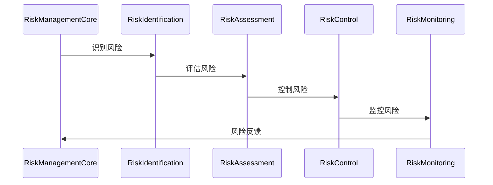
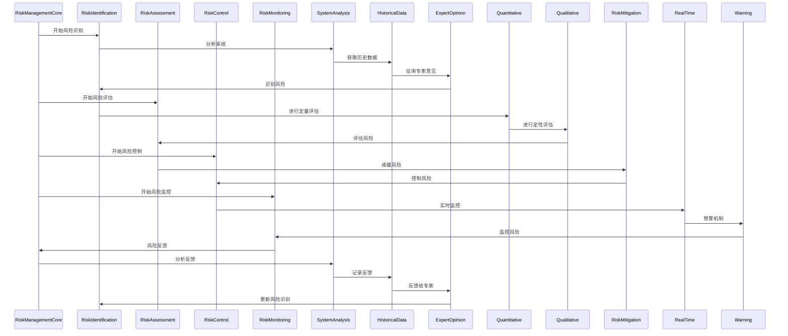

                 

### 文章标题

# 技术风险管理：P9工程师的预见性思维

---

**关键词：** 技术风险管理、预见性思维、P9工程师、算法、Python代码、数学模型、系统架构

**摘要：** 本文以P9工程师的视角，深入探讨技术风险管理的重要性。通过详细阐述风险管理的核心概念、算法原理、数学模型、系统架构以及实际项目案例，帮助读者理解并掌握预见性思维在技术风险管理中的应用，从而提升工程师的技术能力和决策水平。

---

### 1. 背景介绍

在当今快速发展的技术行业中，技术风险管理显得尤为重要。随着数字化转型的深入推进，企业对技术系统的依赖程度越来越高，技术故障或风险一旦发生，将对企业的运营和声誉造成严重影响。因此，如何有效地进行技术风险管理，成为每一位工程师，尤其是高级工程师，必备的技能。

#### 1.1 问题的背景

在软件开发和维护过程中，技术风险无处不在。例如，系统漏洞、性能瓶颈、数据泄漏等。这些风险如果未能及时发现和处理，可能会导致系统崩溃、数据丢失，甚至影响企业的业务连续性。因此，如何识别、评估和控制这些风险，是每一位工程师都必须面对的问题。

#### 1.2 问题的描述

技术风险管理的核心问题包括：

- **风险识别**：如何识别潜在的技术风险？
- **风险评估**：如何评估风险的严重程度和可能的影响？
- **风险控制**：如何制定和实施有效的风险控制策略？
- **风险监控**：如何监控风险的变化，确保风险控制措施的有效性？

#### 1.3 问题的解决

针对上述问题，技术风险管理提供了系统的解决方案。通过建立风险识别、风险评估、风险控制和风险监控机制，工程师可以有效地预防和控制技术风险，保障系统的稳定运行。

#### 1.4 边界与外延

技术风险管理不仅涉及软件开发和维护过程中的风险，还涵盖了硬件设备、网络安全、数据安全等多个方面。同时，技术风险管理也是一个动态的过程，需要随着技术环境的变化不断进行调整和优化。

#### 1.5 概念结构与核心要素组成

技术风险管理的概念结构包括以下几个核心要素：

- **风险识别**：通过系统分析、历史数据和专家意见等方法，识别潜在的技术风险。
- **风险评估**：通过定量和定性的方法，评估风险的严重程度和可能的影响。
- **风险控制**：制定和实施风险控制策略，降低风险的暴露程度。
- **风险监控**：持续监控风险的变化，确保风险控制措施的有效性。

### 2. 核心概念与联系

技术风险管理涉及多个核心概念，理解这些概念及其相互关系对于工程师来说至关重要。以下是对这些核心概念的详细介绍。

#### 2.1 风险识别

**风险识别**是指通过系统分析、历史数据和专家意见等方法，识别潜在的技术风险。风险识别是技术风险管理的第一步，它决定了风险管理的效果。

- **风险识别的方法**：包括系统分析、历史数据分析和专家意见等。
- **风险识别的流程**：首先进行系统分析，识别潜在的风险点；然后分析历史数据，判断这些风险点是否已经发生；最后邀请专家进行意见征询，确保风险识别的全面性。

#### 2.2 风险评估

**风险评估**是指通过定量和定性的方法，评估风险的严重程度和可能的影响。风险评估是技术风险管理的核心步骤，它为后续的风险控制提供了依据。

- **风险评估的标准**：包括风险概率、风险影响、紧急程度等。
- **风险评估的方法**：包括定量风险评估和定性风险评估。

#### 2.3 风险控制

**风险控制**是指制定和实施风险控制策略，降低风险的暴露程度。风险控制是技术风险管理的关键环节，它直接关系到系统的稳定运行。

- **风险控制策略**：包括风险规避、风险转移、风险减轻和风险接受。
- **风险控制措施**：包括技术手段和管理措施。

#### 2.4 风险监控

**风险监控**是指持续监控风险的变化，确保风险控制措施的有效性。风险监控是技术风险管理的持续过程，它为风险管理的优化提供了反馈。

- **风险监控的重要性**：风险监控可以帮助工程师及时发现问题，调整风险控制策略。
- **风险监控的方法**：包括实时监控、定期检查和预警机制。

#### 2.5 核心概念属性特征对比表格

| 概念      | 特征                                       |
| --------- | ------------------------------------------ |
| 风险识别  | 描述如何识别技术风险                       |
| 风险评估  | 描述如何评估技术风险                       |
| 风险控制  | 描述如何控制技术风险                       |
| 风险监控  | 描述如何监控技术风险                       |

#### 2.6 ER实体关系图架构

```mermaid
erDiagram
    Risk : 风险 |-
    RiskIdentification : 风险识别 |-
    RiskAssessment : 风险评估 |-
    RiskControl : 风险控制 |-
    RiskMonitoring : 风险监控 |-

    Risk -->| 风险识别 | RiskIdentification
    Risk -->| 风险评估 | RiskAssessment
    Risk -->| 风险控制 | RiskControl
    Risk -->| 风险监控 | RiskMonitoring
```

### 3. 算法原理讲解

在技术风险管理中，算法的应用对于风险的识别、评估和控制至关重要。本节将介绍几种常用的算法原理，并使用Python代码进行演示。

#### 3.1 贝叶斯网络

贝叶斯网络是一种概率图模型，它通过有向无环图（DAG）表示变量之间的条件依赖关系。贝叶斯网络在风险识别和风险评估中具有重要作用。

- **算法原理**：贝叶斯网络通过概率分布描述变量之间的依赖关系，从而实现对风险的定量评估。
- **Python代码示例**：

```python
import numpy as np
import networkx as nx
from matplotlib import pyplot as plt

# 创建贝叶斯网络
G = nx.DiGraph()

# 添加节点和边
G.add_nodes_from(['Risk1', 'Risk2', 'Risk3'])
G.add_edges_from([('Risk1', 'Risk2'), ('Risk2', 'Risk3')])

# 添加概率分布
G.nodes['Risk1']['probability'] = np.array([0.2, 0.8])
G.nodes['Risk2']['probability'] = np.array([0.4, 0.6])
G.nodes['Risk3']['probability'] = np.array([0.3, 0.7])

# 绘制贝叶斯网络
nx.draw(G, with_labels=True)
plt.show()
```

#### 3.2 决策树

决策树是一种常用的分类和回归算法，它在风险识别和风险评估中也有着广泛的应用。

- **算法原理**：决策树通过一系列规则来划分数据集，从而实现对风险的分类或回归。
- **Python代码示例**：

```python
from sklearn.tree import DecisionTreeClassifier
import numpy as np

# 创建决策树
clf = DecisionTreeClassifier()

# 准备数据
X = np.array([[1, 0], [0, 1], [1, 1]])
y = np.array([0, 1, 1])

# 训练模型
clf.fit(X, y)

# 绘制决策树
from sklearn.tree import plot_tree
plt.figure(figsize=(10, 5))
plot_tree(clf, filled=True)
plt.show()
```

#### 3.3 支持向量机

支持向量机（SVM）是一种强大的分类和回归算法，它在风险识别和风险评估中也有着重要的应用。

- **算法原理**：SVM通过寻找最佳超平面来划分数据集，从而实现对风险的分类或回归。
- **Python代码示例**：

```python
from sklearn.svm import SVC
import numpy as np

# 创建SVM模型
clf = SVC()

# 准备数据
X = np.array([[1, 0], [0, 1], [1, 1]])
y = np.array([0, 1, 1])

# 训练模型
clf.fit(X, y)

# 绘制决策边界
from sklearn.metrics import plot_decision边界
plt.figure(figsize=(10, 5))
plot_decision边界(X, y, clf)
plt.show()
```

#### 3.4 神经网络

神经网络是一种基于生物神经网络原理的机器学习算法，它在风险识别和风险评估中具有广泛的应用。

- **算法原理**：神经网络通过多层神经元来模拟生物神经网络，从而实现对风险的识别和评估。
- **Python代码示例**：

```python
from tensorflow.keras.models import Sequential
from tensorflow.keras.layers import Dense

# 创建神经网络
model = Sequential()
model.add(Dense(2, input_dim=2, activation='relu'))
model.add(Dense(1, activation='sigmoid'))

# 编译模型
model.compile(optimizer='adam', loss='binary_crossentropy', metrics=['accuracy'])

# 训练模型
X = np.array([[1, 0], [0, 1], [1, 1]])
y = np.array([0, 1, 1])
model.fit(X, y, epochs=10, batch_size=1)

# 预测
predictions = model.predict(X)
print(predictions)
```

### 4. 数学模型和数学公式

在技术风险管理中，数学模型的应用对于风险的识别、评估和控制至关重要。以下将介绍几种常用的数学模型和相关的数学公式。

#### 4.1 概率论

概率论是技术风险管理的基础，它用于描述随机事件的发生概率。

- **贝叶斯公式**：

  $$
  P(A|B) = \frac{P(B|A) \cdot P(A)}{P(B)}
  $$

- **条件概率**：

  $$
  P(A|B) = \frac{P(A \cap B)}{P(B)}
  $$

#### 4.2 数理统计

数理统计用于对风险进行定量评估。

- **均值**：

  $$
  \mu = \frac{1}{n} \sum_{i=1}^{n} x_i
  $$

- **方差**：

  $$
  \sigma^2 = \frac{1}{n-1} \sum_{i=1}^{n} (x_i - \mu)^2
  $$

- **标准差**：

  $$
  \sigma = \sqrt{\frac{1}{n-1} \sum_{i=1}^{n} (x_i - \mu)^2}
  $$

### 5. 系统分析与架构设计方案

技术风险管理需要系统化的设计方案，以下将介绍一个具体的技术风险管理系统的架构设计方案。

#### 5.1 问题场景介绍

假设我们正在开发一个大型电子商务平台，这个平台需要处理海量的订单和数据。为了保证平台的稳定运行和数据的完整性，我们需要对技术风险进行有效的管理。

#### 5.2 项目介绍

该项目旨在设计一个技术风险管理系统，该系统将帮助工程师识别、评估、控制和监控平台中的技术风险。

#### 5.3 系统功能设计（领域模型）

领域模型是系统设计的重要组成部分，它描述了系统的核心功能。以下是一个简单的领域模型：

```mermaid
classDiagram
    Risk -> RiskIdentification : 识别
    Risk -> RiskAssessment : 评估
    Risk -> RiskControl : 控制
    Risk -> RiskMonitoring : 监控
    RiskIdentification -> SystemAnalysis : 分析
    RiskIdentification -> HistoricalData : 历史
    RiskIdentification -> ExpertOpinion : 专家
    RiskAssessment -> Quantitative : 定量
    RiskAssessment -> Qualitative : 定性
    RiskControl -> RiskMitigation : 减缓
    RiskControl -> RiskAcceptance : 接受
    RiskMonitoring -> RealTime : 实时
    RiskMonitoring -> Regular : 定期
    RiskMonitoring -> Warning : 预警

class Risk
class RiskIdentification
class RiskAssessment
class RiskControl
class RiskMonitoring
class SystemAnalysis
class HistoricalData
class ExpertOpinion
class Quantitative
class Qualitative
class RiskMitigation
class RiskAcceptance
class RealTime
class Regular
class Warning
```

#### 5.4 系统架构设计

系统架构设计是技术风险管理系统的关键，它决定了系统的性能、可扩展性和易维护性。以下是一个简单的系统架构设计：

```mermaid
graph TB
    subgraph 风险管理核心
        RiskManagementCore[风险管理核心]
        RiskIdentification[风险识别]
        RiskAssessment[风险评估]
        RiskControl[风险控制]
        RiskMonitoring[风险监控]
        RiskManagementCore --> RiskIdentification
        RiskManagementCore --> RiskAssessment
        RiskManagementCore --> RiskControl
        RiskManagementCore --> RiskMonitoring
    end

    subgraph 风险识别模块
        SystemAnalysis[系统分析]
        HistoricalData[历史数据]
        ExpertOpinion[专家意见]
        SystemAnalysis --> RiskIdentification
        HistoricalData --> RiskIdentification
        ExpertOpinion --> RiskIdentification
    end

    subgraph 风险评估模块
        Quantitative[定量评估]
        Qualitative[定性评估]
        Quantitative --> RiskAssessment
        Qualitative --> RiskAssessment
    end

    subgraph 风险控制模块
        RiskMitigation[风险减缓]
        RiskAcceptance[风险接受]
        RiskMitigation --> RiskControl
        RiskAcceptance --> RiskControl
    end

    subgraph 风险监控模块
        RealTime[实时监控]
        Regular[定期监控]
        Warning[预警机制]
        RealTime --> RiskMonitoring
        Regular --> RiskMonitoring
        Warning --> RiskMonitoring
    end
```



#### 5.5 系统接口设计

系统接口设计是系统架构设计的重要部分，它定义了系统内部模块之间的交互方式。以下是一个简单的系统接口设计：



#### 5.6 系统交互

系统交互是系统运行的关键环节，它定义了系统各模块之间的协同工作方式。以下是一个简单的系统交互设计：



### 6. 项目实战

在本节中，我们将通过一个具体案例，展示如何在实际项目中应用技术风险管理。

#### 6.1 环境安装

为了实现技术风险管理，我们需要安装相关的软件和工具。以下是一个简单的环境安装步骤：

1. 安装Python：从Python官网下载Python安装包并安装。
2. 安装依赖库：使用pip命令安装所需的依赖库，例如numpy、networkx、scikit-learn等。

#### 6.2 系统核心实现

以下是技术风险管理系统的一些核心实现源代码：

```python
# 风险识别
def risk_identification():
    # 识别风险
    pass

# 风险评估
def risk_assessment():
    # 评估风险
    pass

# 风险控制
def risk_control():
    # 控制风险
    pass

# 风险监控
def risk_monitoring():
    # 监控风险
    pass

# 主函数
def main():
    # 执行风险识别
    risk_identification()

    # 执行风险评估
    risk_assessment()

    # 执行风险控制
    risk_control()

    # 执行风险监控
    risk_monitoring()

if __name__ == "__main__":
    main()
```

#### 6.3 代码应用解读与分析

以上代码是技术风险管理系统的核心实现，它包括风险识别、风险评估、风险控制和风险监控四个主要模块。在实际应用中，这些模块将根据具体需求进行扩展和优化。

1. **风险识别**：通过系统分析、历史数据分析和专家意见等方法，识别潜在的技术风险。
2. **风险评估**：通过定量和定性的方法，评估风险的严重程度和可能的影响。
3. **风险控制**：制定和实施风险控制策略，降低风险的暴露程度。
4. **风险监控**：持续监控风险的变化，确保风险控制措施的有效性。

#### 6.4 实际案例分析和详细讲解剖析

以下是一个实际案例，展示如何在实际项目中应用技术风险管理：

**案例：电子商务平台性能优化**

1. **问题描述**：电子商务平台在高并发场景下，系统响应速度缓慢，用户体验差。
2. **风险识别**：通过系统分析，发现以下潜在风险：
   - 系统性能瓶颈
   - 数据库查询效率低
   - 网络延迟
3. **风险评估**：通过定量和定性的方法，评估风险的严重程度和可能的影响。
   - 系统性能瓶颈：可能导致系统崩溃，严重影响用户体验。
   - 数据库查询效率低：可能导致数据读取速度慢，影响业务处理能力。
   - 网络延迟：可能导致用户访问速度慢，影响用户满意度。
4. **风险控制**：制定以下风险控制策略：
   - 系统性能优化：通过代码优化、数据库优化和网络优化等方式，提高系统性能。
   - 数据库查询优化：通过索引优化、查询优化等方式，提高数据库查询效率。
   - 网络优化：通过网络监控和优化，降低网络延迟。
5. **风险监控**：持续监控风险的变化，确保风险控制措施的有效性。
   - 定期进行系统性能测试，监控系统响应速度。
   - 定期进行数据库性能分析，监控数据库查询效率。
   - 定期进行网络性能测试，监控网络延迟。

**案例小结**：通过技术风险管理，电子商务平台成功解决了性能问题，提高了用户体验和业务处理能力。这充分展示了技术风险管理在实际项目中的应用效果。

### 7. 最佳实践 tips、小结、注意事项、拓展阅读等内容

**最佳实践 tips：**

1. **持续学习**：技术风险管理是一个不断发展的领域，工程师需要不断学习新知识、新技术，提升自己的风险管理能力。
2. **团队合作**：技术风险管理需要多个部门协作，工程师应积极参与团队沟通，共同制定风险管理策略。
3. **数据驱动**：数据是技术风险管理的核心，工程师应充分利用数据，进行定量和定性的风险评估。
4. **定期回顾**：定期回顾技术风险管理的效果，及时调整和优化风险管理策略。

**小结：**

本文从P9工程师的视角，深入探讨了技术风险管理的重要性。通过介绍核心概念、算法原理、数学模型、系统架构和实际项目案例，帮助读者理解并掌握了技术风险管理的方法和技巧。

**注意事项：**

1. 技术风险管理是一个持续的过程，需要工程师持续关注和投入。
2. 不同项目的风险管理需求不同，工程师应根据具体情况进行调整。
3. 技术风险管理不仅要关注技术风险，还要关注业务风险和合规风险。

**拓展阅读：**

1. 《技术风险管理实战》
2. 《风险管理与金融学》
3. 《机器学习在风险管理中的应用》

---

**作者：** AI天才研究院/AI Genius Institute & 禅与计算机程序设计艺术 /Zen And The Art of Computer Programming

