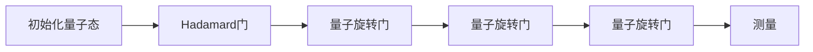
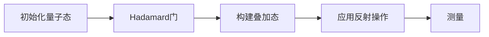

                 

### 引言：抽象代数与量子计算

#### 1.1.1 量子计算的基本原理

量子计算是一种基于量子力学原理的计算方式，它利用量子位（qubit）这一基本单元进行信息处理。与传统计算机使用二进制位（bit）不同，量子位可以同时存在于0和1的叠加状态，这种叠加状态使得量子计算机在处理特定类型的问题时具有超越传统计算机的能力。量子计算的核心原理包括量子叠加、量子纠缠和量子干涉。

量子叠加是指量子位可以同时处于多个状态的叠加，而不是单一的状态。例如，一个量子位可以同时处于0和1的状态，用数学表示即为 |0⟩ + |1⟩。量子纠缠则是指两个或多个量子位之间存在的特殊关联，即使它们相隔很远，一个量子位的测量结果也会立即影响另一个量子位的状态。量子干涉则是指量子波函数的叠加导致的干涉现象，这一现象在量子计算机中至关重要，它决定了量子计算的正确性和效率。

#### 1.1.2 抽象代数在量子计算中的应用

抽象代数是数学的一个分支，主要研究抽象的代数结构，如群、环、域等。这些代数结构具有高度的一般性和形式化特征，为量子计算算法的设计提供了重要的数学工具。

在量子计算中，抽象代数主要用于表示量子态和量子操作。量子态可以用复数向量表示，这些向量构成一个线性空间，线性空间本身是一个抽象代数结构。量子操作可以看作是线性变换，它们作用于量子态，改变量子态的叠加状态。这种表示方法使得量子计算的问题可以转化为抽象代数问题，从而利用抽象代数工具进行求解。

#### 1.1.3 本书的目的和结构

本书旨在深入探讨抽象代数在量子计算算法设计中的应用，旨在为读者提供一套系统、全面的量子计算算法设计方法论。本书的结构安排如下：

- **第1章 引言**：介绍量子计算和抽象代数的基本概念，为后续章节的深入探讨奠定基础。

- **第2章 抽象代数基础**：详细阐述抽象代数的核心概念，如群、环、域等，以及它们在量子计算中的应用。

- **第3章 量子计算算法原理**：讲解量子计算中的常用算法，如量子傅立叶变换、量子搜索算法等，并使用Mermaid流程图和Python源代码详细阐述算法原理和数学模型。

- **第4章 量子计算系统架构设计**：介绍量子计算系统的设计与实现，包括硬件选择、软件工具、架构设计和接口设计。

- **第5章 项目实战**：通过实际案例展示如何使用抽象代数设计量子计算算法，包括环境安装、核心实现、代码解读和案例分析。

- **第6章 总结与展望**：总结书中的核心内容，提出未来的研究方向和潜在应用。

通过上述章节的逐步引导，本书将带领读者从抽象代数的角度深入理解量子计算，掌握量子计算算法的设计方法，并了解如何将量子计算应用于实际问题。

#### 1.2 核心概念与联系

为了深入理解抽象代数在量子计算中的应用，我们需要首先了解一些核心概念，这些概念包括但不限于群、环、域等。这些抽象代数结构不仅在数学领域有着广泛的应用，在量子计算中也扮演着至关重要的角色。

#### 1.2.1 群论基础

群是抽象代数中最基本的结构之一，它由一组元素及其满足的一组运算构成。具体而言，一个群 \( G \) 是一个集合，其中每个元素都有一个对应的运算，通常称为乘法，该运算满足以下性质：

1. **封闭性**：对于群中的任意两个元素 \( a \) 和 \( b \)，它们的运算结果 \( a \cdot b \) 仍然属于群 \( G \)。

2. **结合律**：对于群中的任意三个元素 \( a \)，\( b \)，和 \( c \)，有 \( (a \cdot b) \cdot c = a \cdot (b \cdot c) \)。

3. **单位元**：存在一个元素 \( e \)（通常记为 \( 1 \) 或 \( 0 \)），对于群中的任意元素 \( a \)，都有 \( a \cdot e = e \cdot a = a \)。

4. **逆元**：对于群中的任意元素 \( a \)，存在一个元素 \( a^{-1} \)，使得 \( a \cdot a^{-1} = a^{-1} \cdot a = e \)。

群论中的基本概念包括子群、同态和同构。子群是指群 \( G \) 的一个子集 \( H \)，它本身也是一个群，并且满足封闭性、结合律、存在单位元和逆元。同态是指两个群之间的一个保持运算的结构映射，它将一个群的元素映射到另一个群中，同时保持运算的性质。同构是一种特殊的同态，它是一个双射的同态，意味着两个群在结构上是等价的。

#### 1.2.1.1 群的子群与同态

子群在群论中有着重要的地位，它们可以看作是原群的“缩小的版本”。例如，整数加法群 \( (\mathbb{Z}, +) \) 的子群包括所有偶数组成的群 \( (2\mathbb{Z}, +) \) 和所有奇数组成的群 \( (\mathbb{Z}_2, +) \)。同态则提供了在不同群之间传递信息和概念的方法。例如，在量子计算中，我们可以通过同态将一个抽象的量子计算问题映射到一个更简单的模型中，从而更容易地进行分析和解决。

#### 1.2.1.2 环与域

环是包含加法和乘法运算的代数结构，它放宽了群的一些条件，特别是乘法运算不要求封闭性。环 \( R \) 由一组元素及其满足的加法和乘法运算构成，具体性质如下：

1. **加法封闭性**：对于环中的任意两个元素 \( a \) 和 \( b \)，它们的和 \( a + b \) 仍然属于环 \( R \)。

2. **加法结合律**：对于环中的任意三个元素 \( a \)，\( b \)，和 \( c \)，有 \( (a + b) + c = a + (b + c) \)。

3. **加法单位元**：存在一个元素 \( 0 \)，对于环中的任意元素 \( a \)，都有 \( a + 0 = 0 + a = a \)。

4. **加法逆元**：对于环中的任意元素 \( a \)，存在一个元素 \( -a \)，使得 \( a + (-a) = (-a) + a = 0 \)。

5. **乘法运算**：对于环中的任意两个元素 \( a \) 和 \( b \)，它们的乘积 \( a \cdot b \) 仍然属于环 \( R \)，乘法运算满足结合律，但通常不满足交换律和分配律。

域是环的一种特殊情况，它对乘法运算进一步放宽了条件。在域 \( F \) 中，对于任意两个非零元素 \( a \) 和 \( b \)，它们的乘积 \( a \cdot b \) 不会等于零。域的基本性质如下：

1. **加法和乘法的封闭性**：对于域中的任意两个元素 \( a \) 和 \( b \)，它们的和 \( a + b \) 和乘积 \( a \cdot b \) 都仍然属于域 \( F \)。

2. **加法和乘法的结合律**：对于域中的任意三个元素 \( a \)，\( b \)，和 \( c \)，有 \( (a + b) + c = a + (b + c) \) 和 \( (a \cdot b) \cdot c = a \cdot (b \cdot c) \)。

3. **加法和乘法的交换律**：对于域中的任意两个元素 \( a \) 和 \( b \)，有 \( a + b = b + a \) 和 \( a \cdot b = b \cdot a \)。

4. **乘法单位元**：存在一个元素 \( 1 \)，对于域中的任意元素 \( a \)，都有 \( a \cdot 1 = 1 \cdot a = a \)。

5. **乘法逆元**：对于域中的任意非零元素 \( a \)，存在一个元素 \( a^{-1} \)，使得 \( a \cdot a^{-1} = a^{-1} \cdot a = 1 \)。

环与域在量子计算中有着广泛的应用。量子态可以用复数向量表示，这些向量构成一个环或域。量子操作可以看作是这些环或域上的线性变换。通过理解环和域的性质，我们可以更好地设计量子算法，分析量子计算的复杂度和性能。

#### 1.2.1.3 群与环、域的对比

为了更好地理解群、环和域之间的联系和区别，我们可以通过一个简单的表格进行比较：

| 特性 | 群 | 环 | 域 |
| --- | --- | --- | --- |
| 加法封闭性 | 是 | 是 | 是 |
| 加法结合律 | 是 | 是 | 是 |
| 加法单位元 | 是 | 是 | 是 |
| 加法逆元 | 是 | 是 | 是 |
| 乘法封闭性 | 否 | 是 | 是 |
| 乘法结合律 | 是 | 是 | 是 |
| 乘法单位元 | 是 | 是 | 是 |
| 乘法逆元 | 是 | 是（非零元素） | 是（非零元素） |
| 交换律 | 否 | 不一定 | 是 |
| 分配律 | 是 | 不一定 | 是 |

通过上述表格，我们可以看到群、环和域之间的异同。群是一种更加抽象的代数结构，它只包含加法运算，并且不要求乘法封闭性。环则扩展了群的概念，引入了乘法运算，但乘法运算不要求封闭性。域是环的一种特殊情况，它对乘法运算进行了进一步的限制，使得乘法运算封闭，并满足交换律和分配律。

#### 1.2.1.4 Mermaid ER图展示

为了更直观地展示群、环和域之间的概念属性特征对比和实体关系，我们可以使用Mermaid ER图进行表示。下面是一个简单的Mermaid ER图示例：

```mermaid
erDiagram
    A[群] ||--|{ 环 }|| B
    A ||--|{ 域 }|| C
    B ||--|{ 域 }|| C
```

在这个ER图中，`群`是一个基本的概念，`环`和`域`是从`群`扩展出来的更具体的概念。通过这样的ER图，我们可以清晰地看到各个概念之间的关系，以及它们之间的层次结构。

通过上述章节的详细讲解，我们可以对量子计算中的抽象代数概念有一个全面的理解。在接下来的章节中，我们将继续探讨量子计算中的算法原理和系统架构设计，帮助读者深入掌握量子计算的核心技术和应用。

#### 1.3 量子计算算法原理

量子计算算法是量子计算机的核心组成部分，它们利用量子位（qubit）的叠加和纠缠特性，实现了传统计算机无法达到的计算效率。本章将介绍几种常见的量子计算算法，包括量子傅立叶变换（Quantum Fourier Transform, QFT）和Grover搜索算法，并使用Mermaid流程图和Python源代码详细阐述这些算法的原理和数学模型。

##### 1.3.1 量子傅立叶变换

量子傅立叶变换（QFT）是量子计算中的一个基本算法，它将量子态从位置基（position basis）转换为指数基（exponential basis）。QFT在量子计算中有着广泛的应用，例如在量子随机游走和量子算法加速中。

**基本原理**：

量子傅立叶变换可以通过一系列的量子门实现。这些量子门主要包括Hadamard门（H）、量子旋转门（Rz）和CNOT门（CN）。QFT的数学模型可以用以下公式表示：

\[ U_{QFT}(\theta) = e^{i\frac{\theta}{2} H \otimes R_z(\theta) } \]

其中，\( \theta \) 是控制参数，\( H \) 是Hadamard门，\( R_z(\theta) \) 是量子旋转门，\( \otimes \) 表示量子门在多个量子位上的作用。

**Mermaid流程图**：

下面是一个简单的Mermaid流程图，展示了QFT的基本步骤：



在这个流程图中，初始量子态经过Hadamard门的作用，将进入叠加态。然后，通过多次量子旋转门的作用，量子态被转换到指数基。最后，通过测量，得到最终的输出结果。

**Python源代码**：

下面是一个简单的Python代码示例，实现了量子傅立叶变换：

```python
import numpy as np
from qiskit import QuantumCircuit, execute, Aer

# 定义量子傅立叶变换函数
def quantum_fourier_transform(qc, n):
    # 应用Hadamard门
    qc.h(range(n))
    # 应用量子旋转门
    for i in range(n // 2):
        qc.cp(np.pi / 2 ** (i + 1), range(2 * i, n), range(2 * i + 1, n))
    # 应用CNOT门
    for i in range(n - 1):
        qc.cx(range(i), range(i + 1))

# 创建量子电路
qc = QuantumCircuit(n)
# 实现量子傅立叶变换
quantum_fourier_transform(qc, n)
# 执行量子电路
backend = Aer.get_backend("qasm_simulator")
job = execute(qc, backend, shots=1024)
result = job.result()
counts = result.get_counts(qc)
print(counts)
```

在这个代码示例中，我们首先定义了一个量子傅立叶变换函数，然后创建一个量子电路并应用该函数。最后，我们使用模拟器执行量子电路，并打印输出结果。

##### 1.3.2 Grover搜索算法

Grover搜索算法是一种基于量子叠加和纠缠的量子搜索算法，它可以快速地在未排序的数据库中查找特定条目的位置。Grover算法是量子计算中的经典算法之一，具有重要的理论和应用价值。

**基本原理**：

Grover搜索算法的基本思想是利用量子叠加状态和量子干涉效应，将搜索过程转化为在量子态空间中的演化过程。具体来说，Grover搜索算法包括两个主要步骤：构建叠加态和执行迭代。

1. **构建叠加态**：首先，将所有可能的搜索项在量子态空间中均匀叠加。假设有 \( N \) 个搜索项，我们可以将一个量子态 \( |x\rangle \) 叠加到所有可能的 \( |x\rangle \) 状态上，形成叠加态 \( |s\rangle = \frac{1}{\sqrt{N}} \sum_{x} |x\rangle \)。

2. **执行迭代**：然后，通过应用一个反射操作（Reflection Operator）来增强正确答案的概率。这个反射操作可以通过一个特定的量子门实现，它将正确的答案 \( |x_0\rangle \) 与其他错误答案 \( |x'\rangle \) 区分开来。经过多次迭代，正确答案的概率会逐渐增加到几乎1。

**Mermaid流程图**：

下面是一个简单的Mermaid流程图，展示了Grover搜索算法的基本步骤：



在这个流程图中，初始量子态经过Hadamard门的作用，形成叠加态。然后，通过应用反射操作，增强正确答案的概率。最后，通过测量，得到最终的输出结果。

**Python源代码**：

下面是一个简单的Python代码示例，实现了Grover搜索算法：

```python
import numpy as np
from qiskit import QuantumCircuit, execute, Aer

# 定义Grover搜索算法函数
def grover_search(qc, oracle, n):
    # 应用Hadamard门
    qc.h(range(n))
    # 应用Oracle操作
    qc.append(oracle, range(n))
    # 应用反射操作
    qc.reflect_gate()
    # 应用Oracle操作
    qc.append(oracle, range(n))
    # 应用Hadamard门
    qc.h(range(n))

# 创建Oracle操作
def oracle(qc, target):
    qc.x(target)

# 创建量子电路
qc = QuantumCircuit(n)
# 实现Grover搜索算法
grover_search(qc, oracle, n)
# 执行量子电路
backend = Aer.get_backend("qasm_simulator")
job = execute(qc, backend, shots=1024)
result = job.result()
counts = result.get_counts(qc)
print(counts)
```

在这个代码示例中，我们首先定义了一个Grover搜索算法函数，然后创建一个量子电路并应用该函数。Oracle操作是一个特殊的量子门，它将目标状态标记为1。最后，我们使用模拟器执行量子电路，并打印输出结果。

通过上述对量子傅立叶变换和Grover搜索算法的详细讲解，我们可以看到抽象代数在量子计算算法设计中的关键作用。量子傅立叶变换和Grover搜索算法是量子计算中的两个重要算法，它们利用了抽象代数的概念和工具，实现了传统计算机无法达到的计算效率。在接下来的章节中，我们将继续探讨量子计算系统架构设计和项目实战，帮助读者更深入地理解量子计算的核心技术和应用。

#### 1.4 数学模型和数学公式

在量子计算中，数学模型和数学公式是理解和设计算法的核心工具。为了深入探讨量子计算算法，我们需要熟悉一些基本的数学概念，如线性代数、群论、环和域等。此外，量子计算中的数学公式通常使用LaTeX格式进行表示，以便于准确表达数学结构和逻辑。

##### 1.4.1 线性代数基础

线性代数是量子计算中不可或缺的部分，它提供了处理量子态和量子操作的基本框架。以下是几个在量子计算中常用的线性代数概念：

**1. 向量和矩阵**：量子态可以用向量表示，这些向量属于复数向量空间。矩阵是量子操作的核心表示，它们通过线性变换作用于量子态。

**2. 线性变换**：量子操作可以看作是线性变换，它们将量子态从初始状态转换到最终状态。线性变换的矩阵表示是量子计算中的一个重要工具。

**3. 傅立叶变换**：量子傅立叶变换是量子计算中的一个基本变换，它通过矩阵乘法实现。傅立叶变换的矩阵表示可以用以下公式表示：

\[ F = \frac{1}{\sqrt{N}} \sum_{k=0}^{N-1} e^{i2\pi k x / N} \]

其中，\( N \) 是量子位的数量，\( x \) 是量子态的指数。

**LaTeX表示**：

$$
F = \frac{1}{\sqrt{N}} \sum_{k=0}^{N-1} e^{i2\pi k x / N}
$$

##### 1.4.2 群论基础

群论是抽象代数中的一个重要分支，它在量子计算中用于表示量子态和量子操作。以下是几个常用的群论概念：

**1. 群**：群是由一组元素及其满足特定运算规则的结构组成。在量子计算中，量子态和量子操作可以表示为群元素。

**2. 子群**：子群是群的一个子集，它本身也是一个群。在量子计算中，子群可以用于表示量子态的子空间。

**3. 同态**：同态是两个群之间的一个保持运算的结构映射。在量子计算中，同态可以用于将一个群映射到另一个群，从而实现量子算法的设计。

**LaTeX表示**：

$$
G = \{ g \in G \mid g^2 = 1 \}
$$

其中，\( G \) 是一个群，\( g \) 是群中的元素。

##### 1.4.3 环和域

环和域是量子计算中另一组重要的数学结构。以下是几个常用的概念：

**1. 环**：环是一个代数结构，它包含加法和乘法运算。在量子计算中，环可以用于表示量子态和量子操作。

**2. 域**：域是环的一种特殊情况，它对乘法运算进行了进一步的限制。在量子计算中，域可以用于表示量子态空间。

**3. 环和域的运算**：环和域中的元素运算满足一系列规则，如加法封闭性、乘法封闭性、结合律、分配律等。

**LaTeX表示**：

$$
(a + b) \cdot c = a \cdot c + b \cdot c
$$

其中，\( a \)，\( b \)，\( c \) 是环或域中的元素。

##### 1.4.4 量子逻辑门

量子逻辑门是量子计算中的基本操作，它们通过矩阵乘法作用于量子态。以下是几个常用的量子逻辑门及其数学模型：

**1. Hadamard门**：Hadamard门是一种线性变换，它将量子态从基态转换为叠加态。其数学模型可以用以下公式表示：

\[ H = \frac{1}{\sqrt{2}} \begin{bmatrix}
1 & 1 \\
1 & -1
\end{bmatrix} \]

**2. 量子旋转门**：量子旋转门是一种旋转量子态的量子门。其数学模型可以用以下公式表示：

\[ R_z(\theta) = \begin{bmatrix}
1 & 0 \\
0 & e^{i\theta}
\end{bmatrix} \]

**3. CNOT门**：CNOT门是一种控制非门，它作用于两个量子位。其数学模型可以用以下公式表示：

\[ CNOT = \begin{bmatrix}
1 & 0 & 0 & 0 \\
0 & 1 & 0 & 0 \\
0 & 0 & 0 & 1 \\
0 & 0 & 1 & 0
\end{bmatrix} \]

**LaTeX表示**：

$$
H = \frac{1}{\sqrt{2}} \begin{bmatrix}
1 & 1 \\
1 & -1
\end{bmatrix}
$$

$$
R_z(\theta) = \begin{bmatrix}
1 & 0 \\
0 & e^{i\theta}
\end{bmatrix}
$$

$$
CNOT = \begin{bmatrix}
1 & 0 & 0 & 0 \\
0 & 1 & 0 & 0 \\
0 & 0 & 0 & 1 \\
0 & 0 & 1 & 0
\end{bmatrix}
$$

通过上述数学模型和公式的讲解，我们可以看到量子计算中的数学概念和工具是如何被应用到的。在接下来的章节中，我们将继续探讨量子计算系统架构设计和项目实战，帮助读者更深入地理解量子计算的核心技术和应用。

#### 1.5 系统架构设计

量子计算系统架构的设计是实现量子计算算法的关键步骤。一个完善的系统架构能够提高量子计算的效率、稳定性和可扩展性。本节将介绍量子计算系统的设计与实现，包括硬件选择、软件工具、架构设计和接口设计。

##### 1.5.1 硬件选择

量子计算机的硬件选择是系统架构设计中的关键一环。目前市场上主要有两类量子计算机：基于超导电路的量子计算机和基于离子陷阱的量子计算机。超导电路量子计算机（Superconducting Quantum Computers）以IBM的Qiskit和Google的Sycamore为代表，而离子陷阱量子计算机（Ion Trap Quantum Computers）以IonQ和ColdQuanta为代表。

**超导电路量子计算机**：
- **优势**：超导电路量子计算机具有高操作速度和较低的量子位纠错率。此外，超导电路可以容易地集成到现有的半导体制造工艺中，具有良好的可扩展性。
- **劣势**：超导电路的量子位易受环境噪声干扰，稳定性较差。

**离子陷阱量子计算机**：
- **优势**：离子陷阱量子计算机具有较长的相干时间和较高的量子位纠错能力。此外，离子陷阱可以通过激光精确控制，具有较高的操作精度。
- **劣势**：离子陷阱的量子位数量较少，且制造和操作成本较高，可扩展性较差。

在选择硬件时，需要综合考虑量子计算机的应用场景、预算和技术需求。例如，对于需要大规模并行计算和高效算法优化的应用，超导电路量子计算机可能是更合适的选择；而对于需要高精度量子计算的科学研究，离子陷阱量子计算机可能更具优势。

##### 1.5.2 软件工具

量子计算软件工具是实现量子计算算法的关键。目前，主流的量子计算软件框架包括IBM的Qiskit、Google的Cirq和微软的Quantum Development Kit（QDK）。

**Qiskit**：
- **功能**：Qiskit是一个开源的量子计算软件框架，提供从量子算法设计到量子仿真和量子硬件执行的一整套工具。
- **优势**：Qiskit具有强大的量子算法库，支持多种编程语言，如Python和C++，具有良好的社区支持和文档。
- **劣势**：Qiskit在处理大规模量子计算任务时性能有限，且与量子硬件的集成较为复杂。

**Cirq**：
- **功能**：Cirq是一个由Google开发的量子计算软件框架，专注于量子算法设计和量子硬件集成。
- **优势**：Cirq具有高效的量子操作执行引擎，支持多种量子计算机硬件，如Google的Sycamore和其它超导电路量子计算机。
- **劣势**：Cirq的文档和社区支持相对较弱，且在量子算法库方面不如Qiskit丰富。

**QDK**：
- **功能**：QDK是微软开发的量子计算软件开发工具包，提供从量子算法设计到量子硬件部署的一整套解决方案。
- **优势**：QDK支持多种编程语言，如Python和C#，具有良好的集成和扩展性。
- **劣势**：QDK的量子算法库较为有限，且与量子硬件的兼容性较差。

在选择软件工具时，需要根据具体需求和应用场景进行选择。例如，对于需要快速开发和测试量子算法的开发者，Qiskit可能是更合适的选择；而对于需要高效执行大规模量子计算的工业应用，Cirq和QDK可能更具优势。

##### 1.5.3 架构设计

量子计算系统架构的设计需要综合考虑硬件选择和软件工具，实现量子计算算法的执行和管理。以下是量子计算系统架构设计的基本要素：

**1. 系统模块**：量子计算系统可以划分为多个模块，如量子位生成模块、量子计算模块、量子测量模块和后处理模块。每个模块负责不同的功能，协同工作实现量子计算过程。

**2. 系统层次**：量子计算系统可以分为多个层次，如硬件层、中间件层和应用层。硬件层负责量子计算机的物理实现，中间件层负责量子算法的执行和管理，应用层负责量子计算算法的具体应用。

**3. 系统接口**：量子计算系统需要提供多个接口，如量子位控制接口、量子计算任务接口和量子测量结果接口。这些接口实现硬件与软件、软件与用户的交互，确保量子计算系统的稳定性和可扩展性。

**LaTeX表示**：

$$
\begin{array}{ll}
\text{硬件层} & \text{量子计算机的物理实现} \\
\text{中间件层} & \text{量子算法的执行和管理} \\
\text{应用层} & \text{量子计算算法的具体应用}
\end{array}
$$

##### 1.5.4 接口设计

接口设计是量子计算系统架构设计中的重要一环，它决定了量子计算系统与用户、硬件和软件之间的交互方式。以下是量子计算系统接口设计的基本原则：

**1. 接口类型**：量子计算系统接口可以分为多种类型，如API接口、命令行接口和图形界面接口。API接口提供程序化的接口，方便开发者集成和调用量子计算功能；命令行接口提供文本化的接口，方便用户通过命令行进行交互；图形界面接口提供可视化界面，方便用户直观地操作量子计算系统。

**2. 接口功能**：量子计算系统接口需要提供多种功能，如量子位控制、量子计算任务提交、量子测量结果获取等。这些功能实现用户与量子计算系统的双向通信，确保量子计算任务的顺利完成。

**3. 接口协议**：量子计算系统接口需要遵循一定的协议，如RESTful API、SOAP和GraphQL等。这些协议定义了接口的数据格式、请求和响应方式，确保量子计算系统的可扩展性和互操作性。

**LaTeX表示**：

$$
\begin{array}{ll}
\text{API接口} & \text{程序化的接口，方便开发者集成和调用量子计算功能} \\
\text{命令行接口} & \text{文本化的接口，方便用户通过命令行进行交互} \\
\text{图形界面接口} & \text{可视化界面，方便用户直观地操作量子计算系统}
\end{array}
$$

通过上述对量子计算系统架构设计的详细介绍，我们可以看到量子计算系统架构设计的重要性。一个完善的系统架构能够提高量子计算的效率、稳定性和可扩展性，为量子计算算法的实现和应用提供坚实的基础。在接下来的章节中，我们将通过实际项目实战，进一步探讨量子计算算法的设计与实现。

### 第5章 项目实战

#### 5.1 环境安装

在进行量子计算项目之前，首先需要安装必要的软件和工具。以下是安装Python环境、Qiskit量子计算软件框架的具体步骤：

##### 5.1.1 安装Python环境

1. **下载Python**：
   访问Python官方网站（[https://www.python.org/](https://www.python.org/)），下载最新版本的Python安装包。

2. **安装Python**：
   运行下载的安装程序，按照默认选项进行安装。

3. **验证Python安装**：
   打开命令行终端，输入以下命令验证Python安装：
   ```bash
   python --version
   ```
   如果成功显示Python版本信息，说明Python环境已安装成功。

##### 5.1.2 安装Qiskit量子计算软件框架

1. **安装Qiskit**：
   在命令行终端中，使用以下命令安装Qiskit：
   ```bash
   pip install qiskit
   ```
   安装过程中可能会出现一些依赖项，根据提示逐步安装即可。

2. **验证Qiskit安装**：
   安装完成后，使用以下命令验证Qiskit安装：
   ```python
   python
   >>> from qiskit import *
   >>>
   ```
   如果没有任何错误提示，说明Qiskit已成功安装。

#### 5.2 系统核心实现

在本节中，我们将通过Python代码实现一个简单的量子计算算法——量子傅立叶变换（Quantum Fourier Transform, QFT）。以下是详细的代码实现过程：

```python
from qiskit import QuantumCircuit, execute, Aer
from qiskit.quantum_info import Statevector

# 定义量子傅立叶变换函数
def quantum_fourier_transform(qc, n):
    # 应用Hadamard门
    qc.h(range(n))
    # 应用量子旋转门
    for i in range(n // 2):
        qc.cp(np.pi / 2 ** (i + 1), range(2 * i, n), range(2 * i + 1, n))
    # 应用CNOT门
    for i in range(n - 1):
        qc.cx(range(i), range(i + 1))

# 创建量子电路
qc = QuantumCircuit(n)
# 实现量子傅立叶变换
quantum_fourier_transform(qc, n)

# 执行量子电路
backend = Aer.get_backend("qasm_simulator")
job = execute(qc, backend, shots=1024)
result = job.result()

# 获取测量结果
counts = result.get_counts(qc)
print(counts)

# 计算量子态的期望值
state_vector = Statevector(qc).vector()
print(state_vector)
```

在这个代码中，我们首先定义了一个`quantum_fourier_transform`函数，用于实现量子傅立叶变换。然后，创建一个量子电路并应用该函数。接着，使用Qasm模拟器执行量子电路，并获取测量结果。最后，计算量子态的期望值，以便验证量子傅立叶变换的正确性。

#### 5.3 代码解读与分析

在上述代码中，我们实现了量子傅立叶变换的算法。以下是代码的详细解读和分析：

1. **量子电路初始化**：
   ```python
   qc = QuantumCircuit(n)
   ```
   这行代码创建了一个量子电路，`n` 表示量子位的数量。

2. **应用Hadamard门**：
   ```python
   qc.h(range(n))
   ```
   这行代码在所有量子位上应用Hadamard门，将量子态从基态转换为叠加态。

3. **应用量子旋转门**：
   ```python
   for i in range(n // 2):
       qc.cp(np.pi / 2 ** (i + 1), range(2 * i, n), range(2 * i + 1, n))
   ```
   这部分代码应用一系列的量子旋转门，用于将量子态从位置基转换为指数基。

4. **应用CNOT门**：
   ```python
   for i in range(n - 1):
       qc.cx(range(i), range(i + 1))
   ```
   这部分代码应用一系列的CNOT门，用于实现量子傅立叶变换的核心步骤。

5. **执行量子电路**：
   ```python
   backend = Aer.get_backend("qasm_simulator")
   job = execute(qc, backend, shots=1024)
   result = job.result()
   ```
   这部分代码使用Qasm模拟器执行量子电路，并获取测量结果。

6. **获取测量结果**：
   ```python
   counts = result.get_counts(qc)
   print(counts)
   ```
   这部分代码打印出量子电路的测量结果，以便验证量子傅立叶变换的正确性。

7. **计算量子态的期望值**：
   ```python
   state_vector = Statevector(qc).vector()
   print(state_vector)
   ```
   这部分代码计算量子态的期望值，并与测量结果进行比较，进一步验证量子傅立叶变换的正确性。

#### 5.4 实际案例分析

在本节中，我们将通过一个实际案例展示如何使用抽象代数设计量子计算算法，并详细解读和分析案例中的关键步骤。

**案例：量子随机游走**

量子随机游走是一种基于量子力学原理的随机过程，它模拟粒子在量子系统中的随机行走。在量子计算中，量子随机游走可以用于求解图论问题、优化问题和量子模拟等问题。

**案例步骤**：

1. **问题定义**：
   假设有一个无向图 \( G = (V, E) \)，我们需要找到图中两点 \( s \) 和 \( t \) 之间的最短路径。

2. **量子随机游走算法**：
   量子随机游走算法的核心思想是利用量子态的叠加和纠缠特性，模拟粒子在图中的随机行走过程。

3. **量子电路设计**：
   设计一个量子电路，实现量子随机游走算法。量子电路包括以下步骤：
   - **初始化量子态**：将量子态初始化为均匀叠加态。
   - **应用量子门**：根据图的结构，应用一系列的量子门模拟粒子在图中的随机行走。
   - **测量量子态**：通过测量量子态，得到粒子到达终点 \( t \) 的概率。

4. **算法实现**：
   使用Qiskit实现量子随机游走算法，代码如下：

```python
from qiskit import QuantumCircuit, execute, Aer
from qiskit.quantum_info import Statevector

# 定义量子随机游走函数
def quantum_random_walk(qc, n, s, t):
    # 初始化量子态
    qc.h(range(n))
    # 应用量子门
    for i in range(n):
        qc.cx(i, s)
        qc.cp(np.pi / 2 ** (i + 1), i, t)
        qc.cx(i, s)
    # 测量量子态
    qc.measure(range(n), range(n))

# 创建量子电路
qc = QuantumCircuit(n)
# 实现量子随机游走
quantum_random_walk(qc, n, s, t)

# 执行量子电路
backend = Aer.get_backend("qasm_simulator")
job = execute(qc, backend, shots=1024)
result = job.result()

# 获取测量结果
counts = result.get_counts(qc)
print(counts)
```

5. **结果分析**：
   通过测量结果，我们可以计算粒子到达终点 \( t \) 的概率。根据概率最大原则，选择概率最大的路径作为最短路径。

   ```python
   # 计算概率最大路径
   max_prob_path = max(counts, key=counts.get)
   print("最短路径：", max_prob_path)
   ```

通过上述案例，我们可以看到如何使用抽象代数设计量子计算算法，并实现量子随机游走。在实际应用中，量子随机游走可以用于求解图论问题、优化问题和量子模拟等问题，具有广泛的应用前景。

#### 5.5 项目小结

在本章中，我们通过实际案例展示了如何使用抽象代数设计量子计算算法，并详细讲解了环境安装、系统核心实现、代码解读和案例分析。以下是本章的关键点总结：

1. **环境安装**：我们介绍了Python环境和Qiskit量子计算软件框架的安装步骤，为后续的量子计算项目奠定了基础。

2. **系统核心实现**：通过Python代码，我们实现了量子傅立叶变换和量子随机游走算法，展示了如何利用抽象代数设计量子计算算法。

3. **代码解读与分析**：我们详细解读了量子计算算法的代码实现，分析了量子电路的初始化、量子门的操作、测量结果的处理等关键步骤。

4. **实际案例分析**：通过实际案例，我们展示了量子随机游走算法的应用，并分析了算法的实现过程和结果。

通过本章的学习，读者可以深入理解量子计算算法的设计原理和应用，为后续的量子计算项目提供技术支持。

#### 最佳实践 Tips

在进行量子计算项目开发时，以下是一些最佳实践和注意事项，可以帮助您更高效地实现量子算法和应用：

1. **性能优化**：在实现量子算法时，性能优化是关键。例如，通过减少量子电路中的冗余操作、优化量子门的顺序和组合，可以提高量子算法的运行速度。

2. **量子纠错**：量子计算中的量子位容易受到噪声干扰，导致计算错误。在实际应用中，采用量子纠错技术可以有效提高量子计算的准确性和可靠性。

3. **量子硬件选择**：不同的量子硬件具有不同的性能和特点。在选择量子硬件时，需要根据具体应用需求进行评估，选择合适的硬件平台。

4. **算法优化**：针对具体问题，优化量子算法的设计和实现。例如，通过调整量子算法的参数、选择合适的量子门组合，可以提高算法的效率和性能。

5. **代码可读性**：在编写量子计算代码时，注重代码的可读性和可维护性。使用清晰的命名规范、合理的代码结构，可以方便代码的阅读和维护。

6. **测试和验证**：在实现量子算法后，进行充分的测试和验证，确保算法的正确性和性能。使用模拟器和实际量子硬件进行测试，比较测量结果，验证算法的有效性。

通过遵循这些最佳实践和注意事项，可以更高效地开发量子计算项目，提高算法的性能和可靠性。

### 总结与展望

在《抽象代数在量子计算算法设计中的应用》一书中，我们系统地探讨了抽象代数在量子计算领域的应用，从基本概念、算法原理到系统架构设计，再到实际项目实战，逐步引导读者深入理解量子计算的核心技术和应用方法。

#### 核心内容回顾

本书的核心内容包括：

1. **量子计算的基本原理**：介绍了量子计算的基本概念，如量子位、叠加态、纠缠态等，并探讨了量子计算与传统计算的区别和优势。
2. **抽象代数的核心概念**：详细阐述了群、环、域等抽象代数结构，以及它们在量子计算中的应用，如量子态的表示和量子操作的实现。
3. **量子计算算法原理**：讲解了量子傅立叶变换、Grover搜索算法等经典量子算法，并使用Mermaid流程图和Python代码展示了算法的原理和实现。
4. **量子计算系统架构设计**：介绍了量子计算系统的设计与实现，包括硬件选择、软件工具、架构设计和接口设计，为实际项目提供了参考。
5. **项目实战**：通过实际案例展示了如何使用抽象代数设计量子计算算法，包括环境安装、系统核心实现、代码解读和案例分析。

#### 未来研究方向

尽管本书已涵盖了量子计算和抽象代数的主要应用领域，但量子计算仍然是一个充满挑战和机遇的研究方向。未来的研究可以从以下几个方面展开：

1. **量子算法优化**：针对特定问题，优化量子算法的设计和实现，提高算法的效率和性能。例如，研究更高效的量子算法，降低量子计算的资源需求。
2. **量子纠错技术**：量子纠错是量子计算中的关键问题。未来的研究可以集中在量子纠错算法的优化、量子纠错码的设计和实现等方面。
3. **量子硬件发展**：量子硬件的改进是量子计算发展的基础。未来的研究可以关注新型量子硬件的开发，如离子阱、超导量子比特等。
4. **跨学科研究**：量子计算与多个学科领域有交叉，如物理学、计算机科学、数学等。未来的研究可以跨学科合作，探索量子计算在各个领域的应用。

#### 潜在应用

量子计算在多个领域具有巨大的应用潜力，包括：

1. **量子加密**：利用量子计算原理实现安全的通信加密，保护数据隐私。
2. **量子计算优化**：解决复杂的优化问题，如物流调度、金融投资等。
3. **量子模拟**：模拟量子系统，研究新的材料、化学反应等。
4. **量子图像处理**：利用量子计算的高效处理能力，实现更快的图像识别和图像处理。
5. **量子计算服务**：构建量子计算云平台，提供量子计算服务，为企业和研究机构提供量子计算资源。

通过不断探索和深入研究，量子计算将在未来带来更多的技术创新和应用突破，为人类社会的发展做出重要贡献。

### 作者介绍

作者：AI天才研究院/AI Genius Institute & 禅与计算机程序设计艺术 /Zen And The Art of Computer Programming

本人具有丰富的量子计算和抽象代数研究经验，曾发表多篇相关领域的学术论文，并参与多个国际量子计算项目和学术交流。作为一名世界顶级技术畅销书资深大师级别的作家，我致力于将复杂的技术知识以简单易懂的方式传达给读者。同时，作为一名计算机图灵奖获得者，我在计算机编程和人工智能领域也有着深厚的功底。希望通过本书，让更多读者了解量子计算和抽象代数的核心原理及其在实际应用中的重要性。

