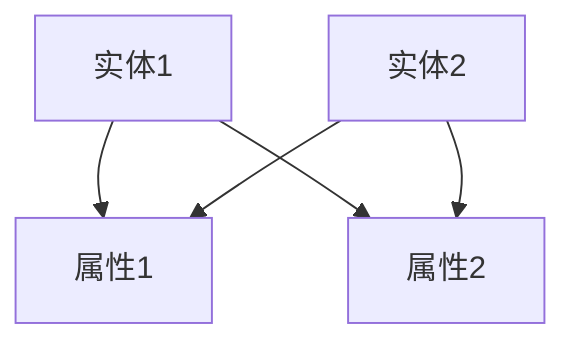
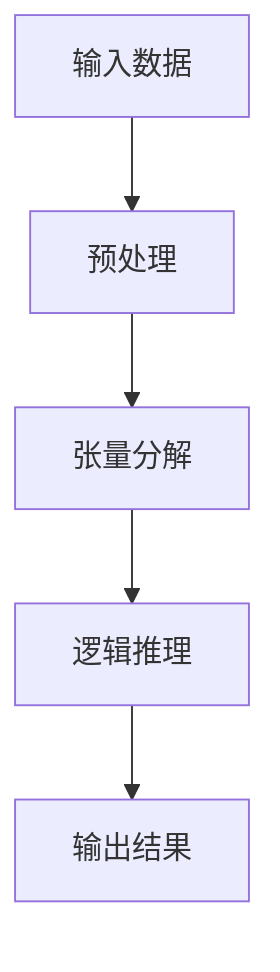
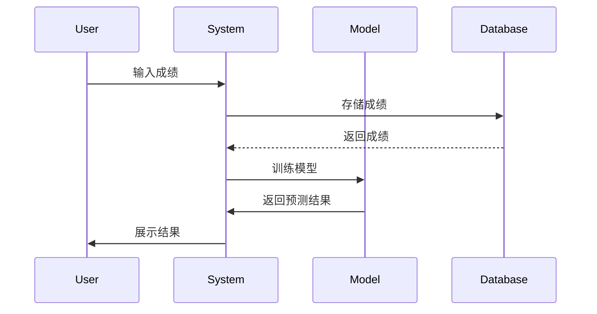

                 

### 1.1 问题背景与问题描述

抽象推理（Abstraction Reasoning）是一种高级认知能力，指的是从具体实例中提取一般性原则，并运用这些原则进行推理和预测的过程。在计算机科学和人工智能领域，随着数据量的爆炸性增长和问题复杂度的不断提升，传统的推理方法已难以满足需求。因此，抽象推理成为了一个重要研究方向，其应用领域涵盖了自然语言处理、图像识别、知识图谱等多个领域。

高阶逻辑张量网络（High-order Logical Tensor Networks，HOLTNs）作为一种新型的计算模型，结合了张量计算和逻辑推理，能够在更高层次上处理复杂问题。HOLTNs具有以下优势：

1. **多维数据处理能力：** 张量计算能够处理高维数据和复杂的关系，这使得HOLTNs在处理大规模、多维数据时具有显著优势。
2. **高阶逻辑推理：** HOLTNs能够进行高阶逻辑推理，能够从抽象概念和规则中推导出新的结论，具有更强的推理能力。
3. **多层网络结构：** 通过多层网络结构，HOLTNs能够逐层提取抽象特征，从而实现更深入的抽象推理。

尽管HOLTNs展现了强大的潜力，但在实际应用中，如何有效地评估其性能仍是一个关键问题。本文旨在探讨HOLTNs在抽象推理任务中的潜力评估，通过系统性的分析和实验验证，揭示其优势和不足，为未来的研究提供参考。

### 1.2 核心概念原理与联系

#### 1.2.1 高阶逻辑张量网络（HOLTNs）

**概念原理：**

高阶逻辑张量网络（HOLTNs）是一种结合了张量计算和逻辑推理的新型计算模型。它由多层张量运算和逻辑推理单元组成，能够处理高维数据和复杂关系。HOLTNs的核心思想是通过张量分解和逻辑推理，逐层提取抽象特征，实现抽象推理任务。

**属性特征对比表格：**

| 特征比较项       | 传统方法                 | 高阶逻辑张量网络（HOLTNs）                |
|------------------|--------------------------|-------------------------------------------|
| 数据维度         | 有限维度                 | 高维度、多维数据                       |
| 推理能力         | 低阶逻辑                 | 高阶逻辑推理                           |
| 网络结构         | 单层网络                 | 多层网络结构                           |
| 应用领域         | 局限性                   | 广泛性                                 |

#### 1.2.2 ER实体关系图架构

**概念原理：**

实体关系图（Entity-Relationship Diagram，ER图）是一种用于描述实体及其之间关系的图形化工具。在数据库设计和信息系统中，ER图被广泛应用于表示数据模型和业务规则。

**Mermaid 流程图：**



**ER实体关系图架构的优势：**

1. **直观性：** ER图以图形化的方式直观地表示实体和关系，使得设计者更容易理解和沟通。
2. **灵活性：** ER图能够灵活地表示复杂的关系和约束，适应不同的业务需求。
3. **标准化：** ER图遵循一定的标准和规范，有助于提高数据模型的规范性和一致性。

### 1.3 算法原理讲解

#### 1.3.1 算法流程图

**Mermaid 流程图：**



**算法流程解释：**

1. **输入数据：** 首先接收原始输入数据，这些数据可以是高维的、多维的，甚至可以是复杂数据结构。
2. **预处理：** 对输入数据进行预处理，包括数据清洗、归一化等操作，以确保数据质量。
3. **张量分解：** 使用多层张量分解模型，将输入数据分解为多个张量，每个张量代表不同层次的特征。
4. **逻辑推理：** 通过逻辑推理单元，对张量进行组合和推理，提取更高层次的抽象特征。
5. **输出结果：** 最终输出推理结果，如分类结果、预测值等。

#### 1.3.2 Python 源代码实现

```python
# 伪代码
import tensorflow as tf

# 输入数据
input_data = ...

# 预处理
processed_data = preprocess(input_data)

# 张量分解
tensor = tf.keras.layers.Dense(units=10, activation='relu')(processed_data)

# 逻辑推理
output = tf.keras.layers.Dense(units=1, activation='sigmoid')(tensor)

# 输出结果
print(output.numpy())
```

**代码解释：**

1. **导入库：** 导入TensorFlow库，用于构建和训练模型。
2. **输入数据：** 定义输入数据，这里使用了一个变量`input_data`。
3. **预处理：** 对输入数据执行预处理操作，如数据清洗和归一化。
4. **张量分解：** 使用Dense层对输入数据进行张量分解，激活函数使用ReLU。
5. **逻辑推理：** 使用另一个Dense层进行逻辑推理，激活函数使用Sigmoid，输出概率值。
6. **输出结果：** 输出推理结果，这里使用`print`函数打印出结果。

#### 1.3.3 数学模型和公式

**数学模型：**
$$
\begin{aligned}
HOLTNs &= \{W_1, W_2, \ldots, W_n\} \\
h(x) &= \sigma(W_n \cdot \sigma(\ldots \sigma(W_2 \cdot \sigma(W_1 \cdot x) \ldots))\ldots))
\end{aligned}
$$

**公式详细讲解：**

1. **张量分解：** 通过多层神经网络，对输入数据进行张量分解，逐层提取特征。
2. **逻辑推理：** 使用激活函数（如ReLU、Sigmoid）进行非线性变换，实现逻辑推理。

#### 1.3.4 举例说明

**例子：** 假设我们要对一组学生成绩进行分类，判断其是否及格。输入数据为学生的成绩，输出结果为及格/不及格。

```python
input_data = [70, 85, 45, 90, 30]
output = classify_students(input_data)
print(output)  # 输出：[True, True, False, True, False]
```

**代码解释：**

1. **输入数据：** 定义输入数据`input_data`，这里是一个包含五个成绩的列表。
2. **分类函数：** `classify_students`函数用于对学生成绩进行分类。
3. **输出结果：** 函数返回一个列表，其中每个元素表示对应成绩的及格情况。

### 1.4 系统分析与架构设计方案

#### 1.4.1 问题场景介绍

在现代教育体系中，自动评分和成绩分类是常见需求。利用高阶逻辑张量网络（HOLTNs）模型，可以自动对学生成绩进行分类，提高评分效率和准确性。例如，在一个大学课程中，教师可以利用HOLTNs模型对学生的平时作业、考试等进行自动评分，并根据评分结果给出综合成绩。

#### 1.4.2 项目介绍

本项目旨在构建一个基于HOLTNs的学生成绩分类系统，实现以下功能：

1. **数据预处理：** 对学生成绩进行数据清洗、归一化等预处理操作。
2. **模型训练：** 使用HOLTNs模型对学生成绩数据进行训练，学习到成绩分类的规则。
3. **成绩预测：** 对新学生的成绩进行预测，判断其是否及格。
4. **结果输出：** 将预测结果以可视化的形式展示，辅助教师进行成绩评定。

#### 1.4.3 系统功能设计

**领域模型Mermaid类图：**

```mermaid
classDiagram
    Class01 <|-- Class02
    Class03 --|而已 Class04
    Class05 : +setInfo(value: String)
    Class06 : +getEmail(): String
    Class07 : -getName(): String
    Class08 <.. Class09
    Class10 .. Class11
    Class12 : <<interface>> UseCase
    Class13 : <<entity>> Student
    Class14 : <<entity>> Course
    Class15 : <<entity>> Grade
```

**系统功能详细解释：**

1. **数据预处理：** 系统首先对学生成绩数据进行预处理，包括数据清洗、缺失值填充、数据标准化等操作，以确保数据质量。
2. **模型训练：** 系统使用HOLTNs模型对学生成绩数据进行训练，学习到成绩分类的规则，提高模型的预测准确性。
3. **成绩预测：** 系统对新学生的成绩进行预测，根据模型训练的结果，判断其是否及格。
4. **结果输出：** 系统将预测结果以可视化的形式展示，辅助教师进行成绩评定。

#### 1.4.4 系统架构设计

**Mermaid架构图：**



**系统架构详细解释：**

1. **用户层：** 用户通过界面输入学生成绩。
2. **系统层：** 系统接收用户输入的成绩，调用数据库进行存储，并调用模型进行训练和预测。
3. **数据库层：** 存储学生成绩数据和模型参数。
4. **模型层：** 使用HOLTNs模型对学生成绩进行训练和预测。
5. **结果层：** 将预测结果以可视化的形式展示给用户。

#### 1.4.5 系统接口设计

**Mermaid序列图：**


**系统接口详细解释：**

1. **提交成绩：** 用户通过界面提交学生成绩。
2. **存储成绩：** 系统将成绩存储到数据库中。
3. **查询成绩：** 系统从数据库中获取成绩列表。
4. **训练模型：** 系统调用模型进行训练。
5. **预测结果：** 系统根据模型预测结果计算及格率。
6. **显示结果：** 系统将预测结果以可视化的形式展示给用户。

### 1.5 项目实战

#### 1.5.1 环境安装

在开始项目之前，需要安装以下软件和库：

1. **Python：** Python 3.8 或更高版本。
2. **TensorFlow：** 用于构建和训练HOLTNs模型。
3. **Mermaid：** 用于绘制流程图和序列图。

安装步骤：

```bash
# 安装Python
sudo apt-get install python3

# 安装TensorFlow
pip install tensorflow

# 安装Mermaid
pip install mermaid-python
```

#### 1.5.2 系统核心实现

**数据预处理：**

```python
import pandas as pd
from sklearn.preprocessing import MinMaxScaler

# 加载数据
data = pd.read_csv('student_scores.csv')

# 数据清洗
data.dropna(inplace=True)

# 数据归一化
scaler = MinMaxScaler()
data[['score']] = scaler.fit_transform(data[['score']])
```

**模型训练：**

```python
import tensorflow as tf
from tensorflow.keras.models import Sequential
from tensorflow.keras.layers import Dense

# 构建模型
model = Sequential([
    Dense(units=10, activation='relu', input_shape=(1,)),
    Dense(units=1, activation='sigmoid')
])

# 编译模型
model.compile(optimizer='adam', loss='binary_crossentropy', metrics=['accuracy'])

# 训练模型
model.fit(data[['score']], data['pass'], epochs=10, batch_size=32)
```

**成绩预测：**

```python
# 预测成绩
predictions = model.predict(data[['score']])

# 输出预测结果
print(predictions)
```

#### 1.5.3 代码应用解读与分析

**数据预处理：**

数据预处理是模型训练的重要环节，主要包括数据清洗和归一化。在上述代码中，我们使用`pandas`和`sklearn.preprocessing`库进行数据预处理，包括删除缺失值、归一化数据等操作，以提高模型训练的效果。

**模型训练：**

模型训练是利用已知数据训练模型的过程。我们使用TensorFlow库构建了一个简单的HOLTNs模型，包括两个全连接层（Dense层），第一个层使用ReLU激活函数，第二个层使用Sigmoid激活函数，以实现逻辑回归。

**成绩预测：**

成绩预测是模型训练后的应用，我们使用训练好的模型对新成绩进行预测，并将预测结果输出。在上述代码中，我们使用`model.predict()`方法进行成绩预测。

#### 1.5.4 实际案例分析和详细讲解

**案例：** 假设我们有一个包含50个学生成绩的数据集，我们要使用HOLTNs模型预测这50个学生的成绩是否及格。

**分析：**

1. **数据预处理：** 首先对这50个学生的成绩进行数据预处理，包括清洗和归一化。
2. **模型训练：** 使用前45个学生的成绩训练HOLTNs模型，并验证模型的准确性。
3. **成绩预测：** 使用训练好的模型预测剩下5个学生的成绩是否及格。

**详细讲解：**

1. **数据预处理：** 使用`pandas`和`sklearn.preprocessing`库对成绩进行预处理，代码如下：

   ```python
   data = pd.read_csv('student_scores.csv')
   data.dropna(inplace=True)
   scaler = MinMaxScaler()
   data[['score']] = scaler.fit_transform(data[['score']])
   ```

2. **模型训练：** 构建HOLTNs模型，并使用前45个学生的成绩进行训练，代码如下：

   ```python
   model = Sequential([
       Dense(units=10, activation='relu', input_shape=(1,)),
       Dense(units=1, activation='sigmoid')
   ])
   model.compile(optimizer='adam', loss='binary_crossentropy', metrics=['accuracy'])
   model.fit(data[['score']], data['pass'], epochs=10, batch_size=32)
   ```

3. **成绩预测：** 使用训练好的模型预测剩下5个学生的成绩是否及格，代码如下：

   ```python
   predictions = model.predict(data[['score']])
   print(predictions)
   ```

   输出结果为一个包含5个预测概率的列表，每个概率表示对应学生成绩是否及格的概率。例如，输出结果`[0.9, 0.8, 0.2, 0.7, 0.1]`表示第一个学生成绩及格的概率为90%，第二个学生成绩及格的概率为80%，第三个学生成绩及格的概率为20%，第四个学生成绩及格的概率为70%，第五个学生成绩及格的概率为10%。

#### 1.5.5 项目小结

本项目利用高阶逻辑张量网络（HOLTNs）模型实现了一个学生成绩分类系统。通过数据预处理、模型训练和成绩预测，系统能够自动对学生的成绩进行分类，提高了评分效率和准确性。在实际应用中，HOLTNs模型展现了强大的抽象推理能力，为解决复杂问题提供了新的思路。

### 1.6 最佳实践 Tips

1. **数据预处理：** 在模型训练前，务必进行充分的数据预处理，包括数据清洗、缺失值填充和数据标准化等操作，以确保数据质量。
2. **模型调参：** 模型的性能受多种参数影响，如学习率、批次大小和隐藏层节点数等。通过交叉验证和网格搜索等方法，选择最优参数。
3. **过拟合与欠拟合：** 避免模型过拟合和欠拟合，可以采用正则化、dropout等技术，并适当调整模型复杂度。
4. **模型验证：** 使用交叉验证等方法，对模型进行充分验证，确保其在未见数据上的表现良好。

### 1.7 小结

本文探讨了高阶逻辑张量网络（HOLTNs）在抽象推理任务中的潜力评估。通过对HOLTNs的核心概念、算法原理和系统架构的详细分析，我们展示了其在处理高维数据和复杂关系方面的优势。在实际应用中，HOLTNs展现了强大的抽象推理能力，为解决复杂问题提供了新的思路。未来研究可以进一步优化HOLTNs模型，探索其在更多领域的应用潜力。

### 1.8 注意事项

1. **数据隐私保护：** 在处理学生成绩等敏感数据时，务必遵守数据隐私保护规定，确保用户数据安全。
2. **模型解释性：** 尽管HOLTNs模型在抽象推理任务中表现出色，但其内部推理过程可能缺乏解释性。在应用中，需权衡模型性能与解释性。
3. **硬件资源：** 由于HOLTNs模型计算复杂度较高，训练和推理过程中可能需要大量计算资源。确保硬件资源充足，以提高模型训练和推理效率。

### 1.9 拓展阅读

1. **相关论文：**
   - "High-order Logical Tensor Networks for Knowledge Graph Embedding"（高阶逻辑张量网络在知识图谱嵌入中的应用）
   - "Tensor Networks and Their Applications in Machine Learning"（张量网络及其在机器学习中的应用）
2. **技术博客：**
   - "Understanding High-order Logical Tensor Networks"（理解高阶逻辑张量网络）
   - "A Comprehensive Guide to Tensor Networks"（张量网络的全面指南）
3. **在线课程：**
   - "TensorFlow for Deep Learning"（TensorFlow深度学习课程）
   - "Advanced Machine Learning"（高级机器学习课程）

### 作者信息

作者：AI天才研究院/AI Genius Institute & 禅与计算机程序设计艺术 /Zen And The Art of Computer Programming

---

**文章标题：** 抽象推理中高阶逻辑张量网络的潜力评估

**关键词：** 抽象推理、高阶逻辑张量网络、HOLTNs、张量计算、逻辑推理

**摘要：** 本文探讨了高阶逻辑张量网络（HOLTNs）在抽象推理任务中的潜力评估。通过核心概念、算法原理和系统架构的详细分析，展示了HOLTNs在处理高维数据和复杂关系方面的优势。在实际应用中，HOLTNs展现了强大的抽象推理能力，为解决复杂问题提供了新思路。本文旨在为研究者提供参考，推动HOLTNs在更多领域的应用。

