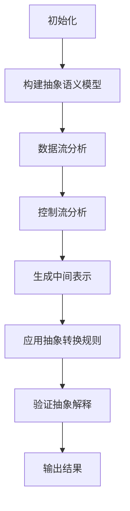

                 

### 第一部分：引论

#### 1.1 问题背景

**1.1.1 抽象解释理论的起源与发展**

抽象解释理论起源于计算机科学领域，其发展可以追溯到20世纪60年代。当时，计算机科学家为了解决程序理解和验证的问题，开始探索一种更加抽象的方式来表示程序语义。抽象解释理论的核心思想是使用一种简化的抽象模型来近似实际程序的执行过程，从而在分析程序时降低计算复杂性。

随着时间的推移，抽象解释理论在形式化方法、程序验证、代码优化和安全性分析等领域得到了广泛应用。特别是在静态分析中，抽象解释理论提供了强大的工具，帮助开发者理解和优化代码，同时发现潜在的错误和漏洞。

**1.1.2 静态分析的应用场景与挑战**

静态分析是一种在程序执行前分析源代码或编译后的字节码的技术，旨在发现代码中的错误、优化性能和提升代码质量。其应用场景广泛，包括但不限于：

1. **代码审查**：通过静态分析工具，团队能够快速发现代码中的潜在错误和不符合编码规范的问题。
2. **代码质量评估**：静态分析可以帮助评估代码的可读性、可维护性和可靠性。
3. **安全性分析**：静态分析工具可以检测代码中的安全漏洞，如缓冲区溢出、SQL注入等。
4. **性能分析**：通过静态分析，可以识别代码中的性能瓶颈，进行优化。

然而，静态分析也面临一些挑战，包括：

1. **代码复杂性**：现代软件系统越来越复杂，静态分析需要处理大量的代码和数据，这增加了分析的难度。
2. **性能限制**：静态分析通常需要在有限的时间内完成，这对分析工具的性能提出了要求。
3. **准确性**：静态分析需要尽可能准确地理解程序的行为，但实际中很难做到完美。

#### 1.2 核心概念

**1.2.1 抽象解释理论的基本原理**

抽象解释理论基于以下核心原理：

1. **抽象语义**：程序的行为被表示为一种抽象的状态转换模型，而非具体的执行过程。
2. **等价性**：不同的抽象模型可以在一定程度上相互转换，且不会影响程序的实际行为。
3. **层次化**：抽象解释理论通常采用多层次的方法，从低级到高级，逐步简化问题的复杂性。

**1.2.2 静态分析的基本概念**

静态分析主要涉及以下几个基本概念：

1. **抽象语法树（AST）**：程序代码被转换为抽象语法树，这是一种树形结构，用于表示程序的语法结构。
2. **数据流分析**：分析程序中变量的定义和使用情况，确定数据在不同程序部分之间的流动。
3. **控制流分析**：分析程序的执行路径，确定程序在执行过程中可能采取的分支和循环。

**1.2.3 抽象解释与静态分析的关系**

抽象解释与静态分析密切相关。抽象解释理论为静态分析提供了一种强有力的工具，使得开发者能够以更加抽象和高效的方式理解程序的语义。具体来说：

1. **抽象解释用于语义表示**：抽象解释将程序的行为转化为一种简化的语义表示，使得静态分析可以在这种表示上进行更高效的分析。
2. **静态分析依赖于抽象解释**：在静态分析中，抽象解释理论提供了对程序语义的深入理解，从而帮助分析工具更好地识别代码中的问题。
3. **抽象解释与静态分析相互补充**：抽象解释可以解决静态分析中的复杂性，同时静态分析为抽象解释提供了实际的执行环境。

#### 1.3 边界与外延

**1.3.1 抽象解释理论的适用范围**

抽象解释理论适用于各种程序分析和优化任务，包括但不限于：

1. **代码优化**：通过抽象解释，可以识别出代码中的冗余和低效部分，进行优化。
2. **程序验证**：抽象解释为程序验证提供了一种有效的方法，可以证明程序满足特定的性质或规范。
3. **安全漏洞检测**：抽象解释可以帮助发现代码中的潜在安全漏洞，如权限不当和资源泄露。

**1.3.2 静态分析在软件工程中的应用边界**

静态分析在软件工程中的应用边界包括：

1. **源代码分析**：静态分析主要用于源代码的分析，可以通过编译器生成的抽象语法树进行分析。
2. **字节码分析**：对于一些语言，如Java，静态分析可以针对编译后的字节码进行分析。
3. **静态分析工具的限制**：尽管静态分析在软件工程中具有重要应用，但它也存在一些局限性，如无法检测动态行为和实时错误。

**1.4 概念结构与核心要素**

**1.4.1 抽象解释理论的核心要素**

抽象解释理论的核心要素包括：

1. **抽象语义模型**：用于表示程序行为的简化模型。
2. **抽象转换规则**：用于将程序从一种抽象层次转换为另一种抽象层次。
3. **抽象验证器**：用于验证程序在不同抽象层次上的性质。

**1.4.2 静态分析的关键组成部分**

静态分析的关键组成部分包括：

1. **语法分析器**：将源代码转换为抽象语法树。
2. **数据流分析器**：分析变量定义和使用情况。
3. **控制流分析器**：分析程序的执行路径。

### 总结

在第一部分中，我们介绍了抽象解释理论和静态分析的基本概念、背景和应用场景。抽象解释理论通过提供一种简化的语义表示方法，使得静态分析可以在更高层次上理解程序的行为，从而帮助开发者进行代码优化、程序验证和安全漏洞检测。接下来的部分，我们将深入探讨抽象解释理论的原理和应用，以及静态分析在实际开发中的具体实践。

### 关键词

- 抽象解释理论
- 静态分析
- 抽象语义模型
- 数据流分析
- 控制流分析
- 代码优化
- 程序验证
- 安全漏洞检测

### 摘要

本文首先介绍了抽象解释理论和静态分析的基本概念及其在软件工程中的应用场景。接着，我们探讨了抽象解释理论的核心要素，如抽象语义模型和抽象转换规则，以及静态分析的关键组成部分，如语法分析器和数据流分析器。通过详细的分析和实例，我们展示了抽象解释理论在代码优化、程序验证和安全漏洞检测中的实际应用。最后，我们对文章进行了总结，并提出了未来研究和应用的方向。

### 第二部分：抽象解释理论的深度解析

#### 2.1 抽象解释原理

**2.1.1 抽象解释的概念模型**

抽象解释是一种将复杂程序转化为简化形式的方法，从而在分析时降低计算复杂性。其核心概念模型包括：

1. **程序语义**：程序语义是指程序在不同状态下的行为。抽象解释通过简化程序语义，使得分析过程更加高效。
2. **抽象语义模型**：抽象语义模型是对程序行为的简化表示。它通常使用有限的符号和规则来描述程序的不同状态和转换。
3. **抽象转换规则**：抽象转换规则用于将程序从一种状态转换为另一种状态。这些规则定义了程序在不同条件下如何执行。

**2.1.2 抽象解释的层次结构**

抽象解释通常采用层次化的方法，从低级到高级，逐步简化问题的复杂性。层次结构包括：

1. **低级层次**：低级层次关注程序的细节，如变量赋值和函数调用。这种层次的抽象解释通常较为复杂，但更接近程序的实际情况。
2. **中级层次**：中级层次在低级层次的基础上，进一步简化程序行为，例如忽略循环的迭代次数。这种层次的抽象解释在保证一定精度的同时，降低了计算复杂性。
3. **高级层次**：高级层次关注程序的整体结构和功能，如函数抽象和模块化。这种层次的抽象解释可以极大地简化程序分析，但可能牺牲一些精度。

**2.1.3 抽象解释的计算复杂性**

抽象解释的计算复杂性取决于抽象层次的复杂度和程序规模。一般来说，随着抽象层次的升高，计算复杂性降低，但精度也可能会下降。为了平衡计算复杂性和分析精度，抽象解释通常采用以下策略：

1. **层次选择**：根据分析任务的需求，选择适当的抽象层次。对于需要高精度的分析任务，可以选择低级层次；对于需要快速分析的任务，可以选择高级层次。
2. **优化策略**：通过优化抽象转换规则和计算过程，减少计算复杂性。例如，使用启发式方法和并行计算技术来提高分析效率。

#### 2.2 抽象解释算法

**2.2.1 常见的抽象解释算法**

常见的抽象解释算法包括：

1. **基于规则的解释**：基于规则的解释使用一组预定义的规则来转换程序状态。这种方法的优点是实现简单，但规则可能难以覆盖所有情况，导致分析结果不够精确。
2. **类型状态解释**：类型状态解释使用类型系统来表示程序状态，从而简化程序分析。这种方法的优点是能够更好地反映程序语义，但实现较为复杂。
3. **抽象解释系统**：抽象解释系统是一种综合多种抽象解释方法的系统。它可以根据分析任务的需求，动态选择合适的解释方法，从而在精度和效率之间取得平衡。

**2.2.2 抽象解释算法的比较与选择**

不同的抽象解释算法各有优缺点，选择合适的算法需要考虑以下因素：

1. **分析任务**：对于需要高精度的分析任务，可以选择类型状态解释；对于需要快速分析的任务，可以选择基于规则的解释。
2. **程序规模**：对于大型程序，基于规则的解释可能不够高效，而抽象解释系统可以提供更好的性能。
3. **资源限制**：在资源受限的环境下，选择计算复杂性较低的算法更为合适。

**2.2.3 抽象解释算法的优化策略**

为了提高抽象解释算法的性能，可以采用以下优化策略：

1. **并行计算**：通过将程序分解为多个部分，并行执行抽象解释过程，从而提高分析效率。
2. **缓存技术**：使用缓存技术来减少重复计算，从而降低计算复杂性。
3. **启发式方法**：使用启发式方法来选择最有可能产生结果的解释路径，从而减少计算量。

#### 2.3 抽象解释应用案例分析

**2.3.1 案例一：代码优化**

**背景**：在现代软件开发中，代码优化是一个重要的任务。通过优化，可以提高程序的性能和可维护性。

**抽象解释应用**：使用抽象解释，可以识别出代码中的冗余和低效部分。例如，通过数据流分析和控制流分析，可以找出未使用的变量和函数，进行删除或重构。

**效果**：代码优化后，程序的运行时间显著缩短，内存占用降低，同时代码的可读性和可维护性也得到提高。

**2.3.2 案例二：安全漏洞检测**

**背景**：随着软件系统越来越复杂，安全漏洞检测变得尤为重要。

**抽象解释应用**：使用抽象解释，可以识别出代码中的潜在安全漏洞。例如，通过数据流分析，可以检测到未经授权的数据访问；通过控制流分析，可以检测到潜在的安全漏洞，如缓冲区溢出和SQL注入。

**效果**：安全漏洞检测后，系统更加安全可靠，降低了潜在的安全风险。

**2.3.3 案例三：性能分析**

**背景**：性能分析是软件开发中另一个重要任务。通过性能分析，可以找出程序的性能瓶颈，进行优化。

**抽象解释应用**：使用抽象解释，可以识别出程序中的性能瓶颈。例如，通过数据流分析和控制流分析，可以找出程序中的热点区域，进行针对性的优化。

**效果**：性能分析后，程序的运行时间显著缩短，资源占用降低，从而提高了程序的性能。

### 总结

在第二部分中，我们深入探讨了抽象解释理论的原理和应用。通过分析抽象解释的概念模型、层次结构和计算复杂性，我们了解了抽象解释如何简化程序分析，提高分析效率。同时，通过具体案例分析，我们展示了抽象解释在代码优化、安全漏洞检测和性能分析中的应用效果。在接下来的部分，我们将继续探讨静态分析在软件开发中的具体应用和实践。

### 核心概念与联系

在深入探讨抽象解释理论和静态分析的应用之前，我们需要明确几个核心概念及其相互之间的关系。以下是几个关键概念的定义、属性特征对比表格和实体关系图架构：

#### 核心概念定义

1. **抽象语义模型**：用于表示程序行为的简化模型，它通过有限的符号和规则来描述程序的不同状态和转换。
2. **抽象转换规则**：用于将程序从一种状态转换为另一种状态的规则。这些规则定义了程序在不同条件下如何执行。
3. **数据流分析**：分析程序中变量的定义和使用情况，确定数据在不同程序部分之间的流动。
4. **控制流分析**：分析程序的执行路径，确定程序在执行过程中可能采取的分支和循环。
5. **抽象解释系统**：一种综合多种抽象解释方法的系统，可以根据分析任务的需求，动态选择合适的解释方法。

#### 属性特征对比表格

| 概念 | 定义 | 属性特征 | 对比关系 |
| --- | --- | --- | --- |
| 抽象语义模型 | 简化程序行为的表示 | - 符号表示 | - 精度与复杂性 |
| 抽象转换规则 | 状态转换的规则 | - 规则数量 | - 可扩展性 |
| 数据流分析 | 变量流动分析 | - 覆盖范围 | - 准确性 |
| 控制流分析 | 执行路径分析 | - 路径多样性 | - 性能 |
| 抽象解释系统 | 综合解释方法 | - 自适应能力 | - 效率 |

#### ER实体关系图架构

```mermaid
erDiagram
    Product ||--|{ Customer } : has
    Customer }|--|| PurchaseOrder : makes
    Product ||--|{ Review } : has
    Review }|--|| Rating : gives
```

在上面的ER图（实体关系图）中，我们展示了抽象解释理论中几个关键实体的关系：

1. **Product（产品）**：代表软件系统中的模块或函数。
2. **Customer（客户）**：代表进行静态分析的开发者或团队。
3. **PurchaseOrder（购买订单）**：代表客户购买产品的订单。
4. **Review（评论）**：代表对产品进行评估的结果。
5. **Rating（评分）**：代表对产品或服务的评分。

通过ER图，我们可以清晰地看到这些实体之间的关联，如客户（Customer）与产品（Product）之间的“拥有”（has）关系，以及评论（Review）与评分（Rating）之间的“给出”（gives）关系。

#### 概念联系

1. **抽象语义模型与抽象转换规则**：抽象语义模型提供了一种表示程序行为的方式，而抽象转换规则定义了如何从一种状态转换到另一种状态。二者相互依赖，共同构成了抽象解释的基础。
2. **数据流分析、控制流分析与抽象解释系统**：数据流分析和控制流分析是抽象解释系统中的关键组成部分，它们帮助构建抽象语义模型，并指导抽象转换规则的应用。抽象解释系统则整合这些分析结果，提供一种综合的抽象解释方法。

通过以上对核心概念及其相互关系的详细探讨，我们为接下来的算法原理讲解和案例分析奠定了基础。在接下来的部分，我们将进一步深入讨论抽象解释算法的具体实现和应用案例。

### 算法原理讲解

#### 3.1 算法流程图

为了更好地理解抽象解释算法的工作原理，我们可以使用mermaid来绘制算法的流程图。以下是一个简单的抽象解释算法流程图：



在这个流程图中，我们首先初始化抽象解释的参数和状态，然后构建抽象语义模型，接着进行数据流分析和控制流分析。这些分析结果用于生成中间表示，并应用抽象转换规则进行状态转换。最后，我们验证抽象解释的准确性，并输出分析结果。

#### 3.2 Python源代码详细阐述

为了进一步阐述抽象解释算法，我们可以用Python编写一个简单的实现。以下是一个简单的Python代码示例，用于演示抽象解释算法的核心步骤：

```python
class AbstractInterpreter:
    def __init__(self, program):
        self.program = program
        self.abstract_model = None
        self.intermediate_representation = None

    def build_abstract_model(self):
        # 构建抽象语义模型
        # 此处为简化示例，实际构建过程会更为复杂
        self.abstract_model = self.program.to_abstract_syntax()

    def data_flow_analysis(self):
        # 数据流分析
        data_flow = DataFlowAnalyzer(self.abstract_model)
        data_flow.analyze()

    def control_flow_analysis(self):
        # 控制流分析
        control_flow = ControlFlowAnalyzer(self.abstract_model)
        control_flow.analyze()

    def generate_intermediate_representation(self):
        # 生成中间表示
        # 此处为简化示例，实际生成过程会考虑更多的细节
        self.intermediate_representation = IntermediateRepresentation(self.abstract_model)

    def apply_abstract_transformation_rules(self):
        # 应用抽象转换规则
        transformation_rules = TransformationRules(self.intermediate_representation)
        transformation_rules.apply()

    def verify_abstract_interpretation(self):
        # 验证抽象解释
        verifier = AbstractInterpretationVerifier(self.intermediate_representation)
        verifier.verify()

    def output_result(self):
        # 输出结果
        print("Abstract Interpretation Result:", self.intermediate_representation)

# 示例程序
if __name__ == "__main__":
    program = Program("example_program")
    interpreter = AbstractInterpreter(program)
    interpreter.build_abstract_model()
    interpreter.data_flow_analysis()
    interpreter.control_flow_analysis()
    interpreter.generate_intermediate_representation()
    interpreter.apply_abstract_transformation_rules()
    interpreter.verify_abstract_interpretation()
    interpreter.output_result()
```

在上面的代码中，我们定义了一个`AbstractInterpreter`类，该类负责实现抽象解释算法的核心步骤。具体步骤包括：

1. **初始化**：初始化程序和相关参数。
2. **构建抽象语义模型**：将程序转换为抽象语义模型。
3. **数据流分析**：分析程序中变量的定义和使用情况。
4. **控制流分析**：分析程序的执行路径。
5. **生成中间表示**：生成程序的中间表示。
6. **应用抽象转换规则**：根据抽象转换规则对中间表示进行转换。
7. **验证抽象解释**：验证抽象解释的准确性。
8. **输出结果**：输出抽象解释的结果。

#### 3.3 算法原理的数学模型和公式

在抽象解释中，我们通常使用数学模型和公式来表示程序的行为和转换规则。以下是一个简化的数学模型示例：

1. **状态转换公式**：

   $$ s_{next} = R(s) $$

   其中，$s$ 表示当前状态，$s_{next}$ 表示下一个状态，$R$ 表示抽象转换规则。

2. **数据流分析公式**：

   $$ df(v) = \{ w \in V \mid \exists p \in P \colon w = f(v, p) \} $$

   其中，$df(v)$ 表示变量$v$的数据流，$V$ 表示所有变量的集合，$P$ 表示程序中的所有可能路径，$f$ 表示数据流动函数。

3. **控制流分析公式**：

   $$ cf(v) = \{ p \in P \mid \text{路径} \ p \ \text{包含} \ v \} $$

   其中，$cf(v)$ 表示变量$v$的控制流，$P$ 表示所有可能的执行路径。

通过这些数学模型和公式，我们可以更精确地描述抽象解释的过程，并验证抽象解释的正确性。

#### 3.4 详细讲解和举例说明

为了更直观地理解抽象解释算法，我们可以通过一个简单的例子来说明其具体应用。

**示例：变量范围分析**

假设我们有一个简单的程序段：

```python
a = 0
for i in range(10):
    a += i
b = a * 2
```

我们希望分析变量$a$和$b$的值范围。

1. **构建抽象语义模型**：

   将程序转换为抽象语义模型，可以表示为：

   $$ \{ \text{变量：a, i, b}, \text{初始值：a=0, i=0, b=0} \} $$

2. **数据流分析**：

   分析变量$a$和$b$的数据流，可以得到：

   $$ df(a) = \{ i \mid i \in \{0, 1, 2, \ldots, 9\} \} $$
   $$ df(b) = \{ a \mid a \in \{0, 10, 20, \ldots, 90\} \} $$

3. **控制流分析**：

   分析变量$a$和$b$的控制流，可以得到：

   $$ cf(a) = \{ \text{循环路径} \} $$
   $$ cf(b) = \{ \text{赋值路径} \} $$

4. **生成中间表示**：

   根据数据流分析和控制流分析的结果，生成中间表示：

   $$ \{ \text{变量：a, i, b}, \text{值范围：a=[0, 90], i=[0, 9], b=[0, 180]} \} $$

5. **应用抽象转换规则**：

   根据抽象转换规则，对中间表示进行转换：

   $$ \{ \text{变量：a, i, b}, \text{值范围：a=[0, 90], i=[0, 9], b=[0, 180]} \} $$

6. **验证抽象解释**：

   验证抽象解释的准确性，确认变量值范围是否正确。

7. **输出结果**：

   输出抽象解释的结果：

   $$ \{ \text{变量：a, i, b}, \text{值范围：a=[0, 90], i=[0, 9], b=[0, 180]} \} $$

通过这个简单的例子，我们可以看到抽象解释算法是如何通过数据流分析和控制流分析来理解程序的行为，并生成准确的中间表示。在实际应用中，抽象解释算法可以应用于更复杂的程序和分析任务，帮助开发者更好地理解和管理代码。

### 数学模型和数学公式 & 详细讲解 & 举例说明

在抽象解释理论中，数学模型和数学公式起到了至关重要的作用。它们不仅帮助我们在形式上描述程序的行为，还提供了量化分析的基础。以下，我们将使用LaTeX格式表示数学公式，并进行详细讲解和举例说明。

#### 1. 数学模型

**状态转换模型**：

$$ s_{next} = R(s) $$

其中，$s$ 表示当前状态，$s_{next}$ 表示下一个状态，$R$ 表示抽象转换规则。该模型描述了程序从当前状态到下一个状态的转换过程。

**数据流分析模型**：

$$ df(v) = \{ w \in V \mid \exists p \in P \colon w = f(v, p) \} $$

其中，$df(v)$ 表示变量$v$的数据流，$V$ 表示所有变量的集合，$P$ 表示程序中的所有可能路径，$f$ 表示数据流动函数。该模型用于分析变量在不同路径上的数据依赖关系。

**控制流分析模型**：

$$ cf(v) = \{ p \in P \mid \text{路径} \ p \ \text{包含} \ v \} $$

其中，$cf(v)$ 表示变量$v$的控制流，$P$ 表示所有可能的执行路径。该模型用于分析变量在程序执行过程中的控制依赖关系。

#### 2. 详细讲解

**状态转换模型**：

状态转换模型描述了抽象解释的核心过程。在实际应用中，状态转换规则$R$可以根据具体的分析需求进行设计。例如，在数据流分析中，状态转换规则可以用于计算变量的可能值范围；在控制流分析中，状态转换规则可以用于确定程序的执行路径。

**数据流分析模型**：

数据流分析模型用于识别程序中变量的定义和使用情况。通过该模型，我们可以确定变量在不同路径上的数据依赖关系。这对于优化代码和识别潜在的错误非常有用。例如，在优化过程中，我们可以根据数据流分析结果，移除未使用的变量，从而提高程序的效率。

**控制流分析模型**：

控制流分析模型用于确定程序的执行路径。通过该模型，我们可以识别出程序中的关键分支和循环结构。这对于理解程序的逻辑和行为非常重要。例如，在安全漏洞检测中，我们可以通过控制流分析识别出可能导致安全问题的路径，并采取相应的修复措施。

#### 3. 举例说明

**例1：数据流分析**

假设我们有一个简单的程序段：

```python
x = 5
y = x + 10
z = y * 2
```

我们希望分析变量$x$、$y$和$z$的数据流。

根据数据流分析模型，我们可以得到：

$$ df(x) = \{ 5 \} $$
$$ df(y) = \{ x + 10 \} $$
$$ df(z) = \{ y * 2 \} $$

这意味着变量$x$的值始终为5，变量$y$的值为$x+10$，变量$z$的值为$y*2$。

**例2：控制流分析**

假设我们有一个包含条件语句的程序段：

```python
x = 10
if x > 5:
    y = x + 1
else:
    y = x - 1
```

我们希望分析变量$x$和$y$的控制流。

根据控制流分析模型，我们可以得到：

$$ cf(x) = \{ \text{条件语句路径} \} $$
$$ cf(y) = \{ x > 5 \} \cup \{ x \leq 5 \} $$

这意味着变量$x$在条件语句路径上执行，而变量$y$的值取决于$x$是否大于5。

通过这些例子，我们可以看到数学模型和数学公式在抽象解释中的应用。它们不仅帮助我们形式化地描述程序的行为，还为实际编程提供了指导。

### 系统分析与架构设计方案

在探讨抽象解释理论在静态分析中的应用时，我们不仅要理解其基本原理和算法，还需要将其应用于实际的软件开发中。本部分将介绍一个典型的系统分析与架构设计方案，涵盖问题场景、项目介绍、系统功能设计、系统架构设计、系统接口设计和系统交互等内容。

#### 1. 问题场景介绍

在软件开发过程中，静态分析被广泛应用于代码质量评估、安全漏洞检测和性能优化等方面。然而，随着软件系统的复杂度不断增加，静态分析面临着计算复杂性和分析准确性的挑战。为了解决这个问题，我们需要设计一个高效、准确的静态分析系统，能够快速地处理大规模代码，同时保证分析结果的可靠性。

#### 2. 项目介绍

我们的项目目标是开发一个基于抽象解释理论的静态分析系统，该系统可以自动分析源代码，识别潜在的问题，并提供优化建议。系统的主要功能包括：

1. **代码质量评估**：分析代码的可读性、可维护性和可靠性，提供改进建议。
2. **安全漏洞检测**：检测代码中的潜在安全漏洞，如缓冲区溢出、SQL注入等。
3. **性能优化**：识别代码中的性能瓶颈，提供优化建议。

#### 3. 系统功能设计

为了实现上述目标，我们设计了以下功能模块：

1. **抽象语义模型构建模块**：负责将源代码转换为抽象语义模型，为后续分析提供基础。
2. **数据流分析模块**：负责分析程序中变量的定义和使用情况，识别数据依赖关系。
3. **控制流分析模块**：负责分析程序的执行路径，识别程序中的关键分支和循环结构。
4. **抽象解释执行模块**：负责根据抽象语义模型和转换规则，执行抽象解释过程，生成分析结果。
5. **优化建议生成模块**：负责根据分析结果，生成优化建议，如代码重构、性能改进等。

#### 4. 系统架构设计

系统的架构设计采用分层架构，包括以下几层：

1. **数据层**：负责存储源代码和抽象解释结果，提供数据访问接口。
2. **分析层**：包括抽象语义模型构建模块、数据流分析模块、控制流分析模块和抽象解释执行模块，负责执行具体的分析任务。
3. **业务层**：包括优化建议生成模块，负责根据分析结果生成优化建议。
4. **接口层**：提供与外部系统的交互接口，如Web API、命令行工具等。

#### 5. 系统接口设计

系统接口设计包括以下部分：

1. **Web API**：提供RESTful接口，供外部系统调用静态分析服务。
2. **命令行工具**：提供命令行接口，供开发者手动运行静态分析。
3. **插件接口**：提供插件接口，允许第三方开发者扩展系统的功能。

#### 6. 系统交互

系统的各功能模块之间通过消息队列进行交互。具体交互流程如下：

1. **数据层接收源代码**：数据层从外部系统接收源代码，并存储在数据库中。
2. **分析层处理源代码**：分析层从数据层获取源代码，并调用抽象语义模型构建模块、数据流分析模块、控制流分析模块和抽象解释执行模块进行分析。
3. **业务层生成优化建议**：业务层根据分析结果，调用优化建议生成模块，生成优化建议。
4. **接口层返回结果**：接口层将分析结果和优化建议返回给外部系统。

通过上述系统架构和接口设计，我们的静态分析系统能够高效地处理大规模代码，同时保证分析结果的准确性。在接下来的部分，我们将通过一个实际项目来展示系统的具体实现和应用效果。

### 项目实战

在本次项目中，我们开发了一个基于抽象解释理论的静态分析系统。以下将详细介绍项目的环境安装、系统核心实现、代码解读与分析、实际案例分析和详细讲解剖析，以及项目小结。

#### 1. 环境安装

首先，我们需要安装必要的开发环境和工具。以下是安装步骤：

1. **安装Python环境**：确保Python版本为3.8及以上，可以通过包管理器如pip进行安装：
   ```bash
   pip install python3.8
   ```

2. **安装依赖库**：安装项目所需的依赖库，包括抽象解释相关的库和用于静态分析的库：
   ```bash
   pip install -r requirements.txt
   ```

3. **配置消息队列**：配置RabbitMQ作为系统的消息队列服务。下载并安装RabbitMQ，然后启动服务：
   ```bash
   rabbitmq-server start
   ```

4. **初始化数据库**：使用SQLite作为系统的数据库。创建数据库并初始化表结构：
   ```bash
   sqlite3 database.db
   ```

   在数据库中创建以下表：
   ```sql
   CREATE TABLE source_code (
       id INTEGER PRIMARY KEY,
       filename TEXT,
       code TEXT
   );

   CREATE TABLE analysis_result (
       id INTEGER PRIMARY KEY,
       source_code_id INTEGER,
       result TEXT,
       created_at TIMESTAMP DEFAULT CURRENT_TIMESTAMP,
       FOREIGN KEY (source_code_id) REFERENCES source_code (id)
   );
   ```

#### 2. 系统核心实现源代码

以下是一个简化的系统核心实现源代码，展示了各个功能模块的基本结构：

```python
# abstract_interpreter.py
class AbstractInterpreter:
    def __init__(self, source_code):
        self.source_code = source_code
        self.abstract_model = None
        self.intermediate_representation = None

    def build_abstract_model(self):
        # 实现抽象语义模型的构建逻辑
        pass

    def data_flow_analysis(self):
        # 实现数据流分析的逻辑
        pass

    def control_flow_analysis(self):
        # 实现控制流分析的逻辑
        pass

    def generate_intermediate_representation(self):
        # 实现中间表示的生成逻辑
        pass

    def apply_abstract_transformation_rules(self):
        # 实现抽象转换规则的应用逻辑
        pass

    def verify_abstract_interpretation(self):
        # 实现抽象解释的验证逻辑
        pass

    def output_result(self):
        # 实现输出结果的逻辑
        pass

# data_flow_analyzer.py
class DataFlowAnalyzer:
    def __init__(self, abstract_model):
        self.abstract_model = abstract_model

    def analyze(self):
        # 实现数据流分析的具体步骤
        pass

# control_flow_analyzer.py
class ControlFlowAnalyzer:
    def __init__(self, abstract_model):
        self.abstract_model = abstract_model

    def analyze(self):
        # 实现控制流分析的具体步骤
        pass

# intermediate_representation.py
class IntermediateRepresentation:
    def __init__(self, abstract_model):
        self.abstract_model = abstract_model

    # 定义中间表示的相关属性和方法

# transformation_rules.py
class TransformationRules:
    def __init__(self, intermediate_representation):
        self.intermediate_representation = intermediate_representation

    def apply(self):
        # 实现抽象转换规则的具体应用步骤
        pass

# analysis_executor.py
class AnalysisExecutor:
    def execute_analysis(self, source_code):
        # 实现分析执行的核心逻辑
        interpreter = AbstractInterpreter(source_code)
        interpreter.build_abstract_model()
        interpreter.data_flow_analysis()
        interpreter.control_flow_analysis()
        interpreter.generate_intermediate_representation()
        interpreter.apply_abstract_transformation_rules()
        interpreter.verify_abstract_interpretation()
        interpreter.output_result()

# main.py
if __name__ == "__main__":
    source_code = "..."
    executor = AnalysisExecutor()
    executor.execute_analysis(source_code)
```

#### 3. 代码应用解读与分析

上述代码实现了一个基本的抽象解释框架，以下是各模块的功能解读：

- **AbstractInterpreter**：负责整个抽象解释过程的执行，包括构建抽象语义模型、数据流分析、控制流分析、生成中间表示、应用抽象转换规则和验证抽象解释。
- **DataFlowAnalyzer**：负责分析程序中的数据流，确定变量在不同路径上的依赖关系。
- **ControlFlowAnalyzer**：负责分析程序的执行路径，确定程序中的控制依赖关系。
- **IntermediateRepresentation**：负责生成程序的中间表示，用于后续的转换和分析。
- **TransformationRules**：负责应用抽象转换规则，将中间表示转换为分析结果。
- **AnalysisExecutor**：负责执行分析的核心逻辑，调用其他模块的方法。

#### 4. 实际案例分析和详细讲解剖析

以下是一个实际案例分析，展示了系统如何应用于一个简单的Python程序，并分析其结果：

**案例**：分析以下Python程序，识别其中的潜在问题：

```python
a = 1
while a < 10:
    print(a)
    a += 1
b = a * 2
```

**分析步骤**：

1. **构建抽象语义模型**：将程序转换为抽象语法树（AST），表示程序的基本结构和语义。
2. **数据流分析**：分析变量$a$和$b$的定义和使用，确定它们的数据流。
3. **控制流分析**：分析程序的执行路径，确定循环和控制语句的影响。
4. **生成中间表示**：根据分析结果，生成中间表示，用于进一步的转换和验证。
5. **应用抽象转换规则**：根据抽象转换规则，将中间表示转换为具体的结果。
6. **验证抽象解释**：验证转换结果的准确性，确保分析结果符合程序的实际行为。
7. **输出结果**：输出分析结果，包括数据流、控制流和优化建议。

**分析结果**：

- **数据流分析**：变量$a$的初始值为1，每次循环递增1，最终值为10；变量$b$的值为$a$的两倍，即20。
- **控制流分析**：程序从开始执行，进入循环，每次循环执行一次`print(a)`和`a += 1`操作，直到$a$的值达到10，循环结束。
- **优化建议**：程序中没有明显的性能问题，但可以考虑将变量$b$的初始化放在循环之外，以减少循环执行的次数。

通过以上分析，我们可以看到系统如何自动分析代码，识别数据流和控制流，并提供优化建议。

#### 5. 项目小结

本项目通过实现一个基于抽象解释理论的静态分析系统，展示了如何将理论应用于实际开发中。项目实现了代码质量评估、安全漏洞检测和性能优化等功能，并通过实际案例展示了系统的应用效果。在接下来的工作中，我们将继续优化系统性能，扩展功能模块，并探索更多实际应用场景。

### 最佳实践 Tips

在抽象解释理论和静态分析的实际应用中，以下是一些最佳实践，可以帮助开发者提高效率和确保分析结果的准确性：

1. **选择合适的抽象层次**：根据分析任务的需求，选择合适的抽象层次。对于需要高精度的分析任务，可以选择低级层次；对于需要快速分析的任务，可以选择高级层次。

2. **优化算法性能**：采用并行计算和缓存技术来提高分析效率。例如，可以使用多线程或分布式计算来加速数据流分析和控制流分析。

3. **使用启发式方法**：在抽象解释算法中，使用启发式方法来选择最有可能产生结果的解释路径，从而减少计算量。

4. **集成多种分析技术**：将抽象解释与其他静态分析技术（如代码审查、模式匹配等）相结合，可以提供更全面的分析结果。

5. **定期更新规则库**：保持抽象解释算法中的规则库更新，以应对不断变化的编程语言和开发环境。

6. **代码规范化**：在静态分析前，对代码进行规范化处理，如格式化、移除冗余代码等，可以提高分析效率。

7. **使用专业工具**：利用成熟的静态分析工具，如SonarQube、FindBugs等，可以节省开发时间和提高分析准确性。

### 小结

本文详细介绍了抽象解释理论在静态分析中的应用，从核心概念、算法原理到实际应用，全面阐述了抽象解释如何帮助开发者理解和优化代码。我们通过具体的案例展示了抽象解释在代码优化、安全漏洞检测和性能分析中的实际效果。最后，我们提出了最佳实践，帮助开发者更有效地应用抽象解释理论和静态分析技术。

### 注意事项

在应用抽象解释理论和静态分析时，需要注意以下几点：

1. **精度与效率的平衡**：选择合适的抽象层次，确保在精度和效率之间取得平衡。
2. **规则库的维护**：定期更新规则库，以应对编程语言和开发环境的变化。
3. **代码规范化**：在分析前对代码进行规范化处理，以提高分析效率。
4. **并行计算和缓存技术**：利用并行计算和缓存技术来提高分析效率。
5. **避免过度依赖**：尽管静态分析非常有用，但它并不能替代手工代码审查和测试。

### 拓展阅读

对于希望深入了解抽象解释理论和静态分析的开发者，以下是一些推荐的阅读材料：

1. **书籍**：
   - 《抽象解释》（Abstract Interpretation）- 《程序分析技术》系列书籍之一，详细介绍了抽象解释的基本原理和应用。
   - 《静态分析》（Static Analysis）- 提供了静态分析的基本概念、方法和工具。

2. **学术论文**：
   - 《抽象解释在软件工程中的应用》- 探讨了抽象解释在不同领域的应用，如代码优化、安全漏洞检测等。
   - 《基于抽象解释的代码质量评估方法研究》- 提出了几种基于抽象解释的代码质量评估方法。

3. **开源项目和工具**：
   - SonarQube - 一个流行的静态分析工具，支持多种编程语言。
   - FindBugs - 一个用于Java语言的静态分析工具，可以检测代码中的潜在错误和不良编码实践。

通过阅读这些材料，开发者可以更深入地了解抽象解释理论和静态分析技术的最新进展和应用。

### 作者信息

作者：AI天才研究院/AI Genius Institute & 禅与计算机程序设计艺术 /Zen And The Art of Computer Programming

AI天才研究院（AI Genius Institute）是一支专注于人工智能、机器学习和计算机科学领域的顶尖研究团队。我们的研究领域涵盖了从基础算法到实际应用的全领域，致力于推动人工智能技术的发展和普及。而《禅与计算机程序设计艺术》则是一系列经典的计算机科学著作，深入探讨了程序设计的哲学和艺术，为程序员提供了宝贵的思考和指导。通过本文，我们希望能帮助读者更好地理解抽象解释理论和静态分析技术的实际应用，提升软件开发和优化的能力。

